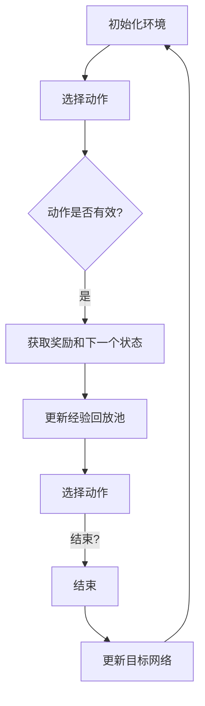
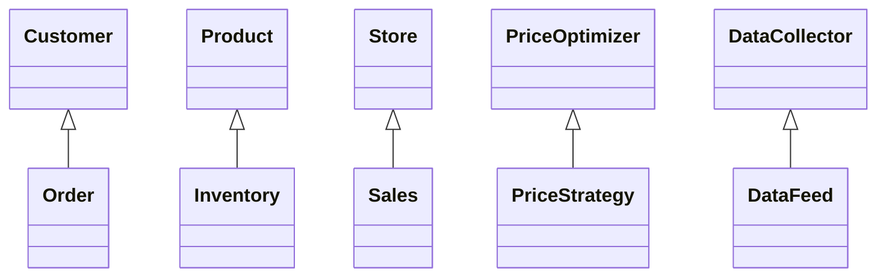
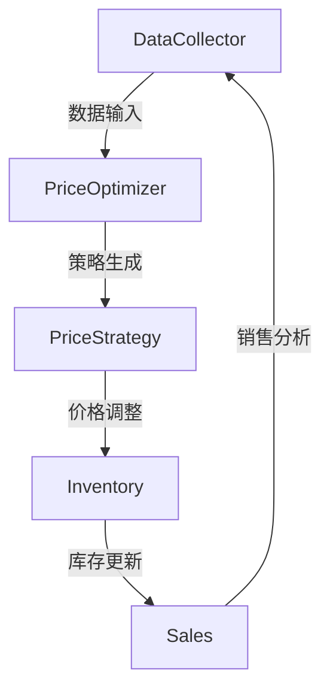
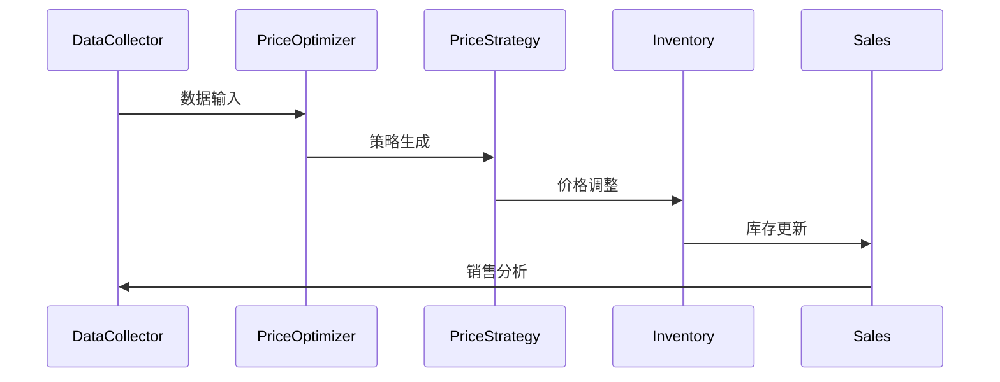

                 


### 引言

#### 1. 背景介绍

深度强化学习（Deep Reinforcement Learning，DRL）是人工智能领域的一项重要技术，它结合了深度学习和强化学习的优势，能够通过大量的数据训练和学习，实现对复杂环境的自主学习和决策。随着人工智能技术的快速发展，深度强化学习在工业、金融、医疗、教育等多个领域都展现了强大的应用潜力。特别是在企业级应用中，深度强化学习能够帮助解决许多复杂的商业问题，提高企业的运营效率，降低成本，创造更大的商业价值。

#### 1.1 深度强化学习概述

深度强化学习是一种基于深度神经网络（DNN）的强化学习方法，它通过学习一个值函数或策略函数，使得智能体能够在环境中通过试错的方式不断学习和优化其行为策略。深度强化学习的关键在于能够处理高维、复杂的输入数据，并通过深度神经网络对环境进行建模和学习。

#### 1.2 企业级深度强化学习的必要性

企业级应用场景通常复杂多变，需要处理大量的数据和信息，传统的机器学习方法可能难以应对这种复杂性。而深度强化学习由于其强大的数据处理能力和自主学习能力，能够更好地适应企业级应用的需求。此外，随着企业数字化转型进程的加速，对智能决策系统的需求也在不断增加，深度强化学习能够为企业提供高效的智能决策支持。

#### 1.3 书籍的组织结构与目标

本书旨在深入探讨企业级深度强化学习的应用，帮助读者了解这一技术的核心概念、算法原理以及在实际项目中的应用。本书共分为七个部分，首先介绍深度强化学习的基本概念和背景知识，然后逐步讲解深度强化学习的核心算法，接着通过实际案例展示深度强化学习在企业级应用中的效果。此外，本书还提供了最佳实践和注意事项，帮助读者更好地应用深度强化学习技术解决商业问题。

### 核心概念与联系

#### 2.1 深度强化学习的基本概念

深度强化学习是强化学习和深度学习相结合的一种方法。强化学习是一种通过试错和奖励机制来学习最优策略的方法，其核心是值函数和策略函数。深度学习则是通过多层神经网络对数据进行建模和学习。将深度学习和强化学习结合，可以使得智能体在复杂环境中通过自主学习找到最优策略。

#### 2.1.1 强化学习与深度学习

强化学习的主要任务是学习一个策略函数，使得智能体能够在给定的环境中取得最大的累积奖励。深度学习则是通过多层神经网络对输入数据进行特征提取和建模，能够处理高维、复杂的输入数据。

#### 2.1.2 强化学习的核心要素

强化学习的核心要素包括：状态（State）、动作（Action）、奖励（Reward）和策略（Policy）。状态是环境的一个描述，动作是智能体在特定状态下执行的行为，奖励是环境对智能体动作的反馈，策略是智能体根据当前状态选择动作的规则。

#### 2.1.3 深度强化学习的发展历程

深度强化学习的发展历程可以分为三个阶段：基于值函数的方法、基于策略的方法和基于模型的方法。基于值函数的方法包括Q-Learning和Deep Q-Networks（DQN），基于策略的方法包括Policy Gradient和Advantage Actor-Critic，基于模型的方法包括Model-Based DRL和Sample-Based DRL。

#### 2.2 深度强化学习中的关键算法

深度强化学习中的关键算法包括Q-Learning、DQN、Policy Gradient和Advantage Actor-Critic。这些算法各有优缺点，适用于不同的场景和应用。

#### 2.2.1 Q-Learning算法

Q-Learning是一种基于值函数的强化学习方法，其核心思想是通过更新值函数来学习最优策略。Q-Learning算法通过不断更新状态-动作值函数，使得智能体能够逐渐找到最优策略。

#### 2.2.2 Deep Q-Networks (DQN)

DQN是一种基于深度神经网络的Q-Learning方法，它通过使用深度神经网络来近似状态-动作值函数，能够处理高维、复杂的输入数据。DQN算法通过经验回放和目标网络来稳定学习过程。

#### 2.2.3 Policy Gradient方法

Policy Gradient方法是一种基于策略的强化学习方法，其核心思想是直接优化策略函数，以最大化累积奖励。Policy Gradient方法通过梯度上升法来优化策略参数，但存在梯度消失和梯度爆炸等问题。

#### 2.2.4 Advantage Actor-Critic方法

Advantage Actor-Critic方法是一种结合了策略优化和价值评价的方法，它通过学习优势函数（Advantage Function）来评估策略的质量，并通过策略网络和价值网络来优化策略。Advantage Actor-Critic方法能够更好地处理复杂环境，提高学习效率。

#### 2.3 深度强化学习与商业问题的联系

深度强化学习在商业问题中的应用非常广泛，可以用于解决电子商务中的价格优化、物流调度、库存管理、广告投放优化等问题。深度强化学习能够处理高维、复杂的数据，通过自主学习找到最优策略，为企业提供高效的决策支持。

#### 2.3.1 商业问题的特点

商业问题通常具有数据量大、复杂度高、不确定性大等特点，这使得传统的机器学习方法难以应对。而深度强化学习能够处理高维、复杂的数据，通过自主学习找到最优策略，更好地解决商业问题。

#### 2.3.2 深度强化学习在商业场景中的应用

深度强化学习在商业场景中的应用主要包括：电子商务中的价格优化、物流调度、库存管理、广告投放优化等。通过深度强化学习，企业能够实现自动化决策，提高运营效率，降低成本，创造更大的商业价值。

### 算法原理讲解

#### 3.1 算法mermaid流程图

为了更直观地展示深度强化学习算法的流程，我们可以使用mermaid流程图来表示。以下是一个简单的DQN算法的mermaid流程图：



#### 3.2 深度强化学习的数学模型与公式

深度强化学习的核心在于值函数和策略函数的学习。以下是一个简单的强化学习数学模型和公式：

$$
V^*(s) = \sum_{a} \gamma^T R(s, a)
$$

其中，$V^*(s)$ 是在状态 $s$ 下的最优值函数，$\gamma$ 是折扣因子，$R(s, a)$ 是在状态 $s$ 下执行动作 $a$ 所获得的即时奖励。

在DQN算法中，我们使用以下公式来更新状态-动作值函数：

$$
Q(s, a) \leftarrow Q(s, a) + \alpha [R(s', a) + \gamma \max_{a'} Q(s', a') - Q(s, a)]
$$

其中，$Q(s, a)$ 是状态-动作值函数，$\alpha$ 是学习率。

#### 3.3 算法举例说明

为了更直观地理解深度强化学习算法，我们以电子商务中的价格优化为例进行说明。

假设一个电子商务平台想要通过深度强化学习算法来优化商品价格，以最大化利润。智能体需要在一个离散的状态空间中选择商品价格，并收到即时奖励（利润）。

在初始化环境后，智能体会选择一个商品价格，并根据当前状态和价格进行决策。智能体通过不断试错和接收奖励，逐渐学习到最优价格策略。

假设当前状态是商品A的价格为100元，智能体根据当前状态选择价格110元。如果顾客购买商品，智能体会收到一个即时奖励（利润），例如10元。然后，智能体会更新状态-动作值函数，并选择下一个价格。

通过不断迭代这个过程，智能体能够逐渐找到最优价格策略，从而最大化利润。

### 系统分析与架构设计方案

#### 4.1 问题场景介绍

假设我们有一个电子商务平台，需要通过深度强化学习算法来优化商品价格，以提高销售额和利润。问题场景包括以下要素：

- 商品：各种不同类型的商品，如电子产品、服装、家居用品等。
- 状态：商品的价格、库存量、市场需求等。
- 动作：调整商品价格。
- 奖励：销售利润、市场份额等。

#### 4.2 项目介绍

本项目旨在通过深度强化学习算法，帮助电子商务平台实现自动化商品价格优化，以提高销售额和利润。项目的主要目标包括：

- 设计并实现一个基于深度强化学习的商品价格优化系统。
- 验证系统在实际场景中的效果，并持续优化算法性能。

#### 4.3 系统功能设计（领域模型mermaid类图）

为了更好地设计系统功能，我们可以使用mermaid类图来表示领域模型。以下是一个简单的mermaid类图：



其中，主要类包括：

- Customer：代表顾客，负责下单购买商品。
- Order：代表订单，包含订单号、商品信息、订单状态等。
- Product：代表商品，包含商品名称、价格、库存量等。
- Inventory：代表库存，管理商品库存信息。
- Store：代表店铺，负责销售商品。
- Sales：代表销售数据，记录销售额、利润等。
- PriceOptimizer：代表价格优化器，负责根据智能决策策略调整商品价格。
- PriceStrategy：代表价格策略，包含各种优化算法。
- DataCollector：代表数据收集器，负责收集销售数据。

#### 4.4 系统架构设计（mermaid架构图）

为了实现系统功能，我们需要设计一个合理的系统架构。以下是一个简单的mermaid架构图：



其中，主要模块包括：

- DataCollector：数据收集模块，负责收集销售数据。
- PriceOptimizer：价格优化模块，负责根据智能决策策略调整商品价格。
- PriceStrategy：价格策略模块，包含各种优化算法。
- Inventory：库存管理模块，负责库存更新和商品价格调整。
- Sales：销售数据分析模块，负责分析销售数据和利润。

#### 4.5 系统接口设计

为了实现模块之间的通信和数据交换，我们需要设计一套合理的系统接口。以下是一个简单的接口设计：

- DataCollector：提供数据输入接口，用于接收销售数据。
- PriceOptimizer：提供策略生成接口，用于生成价格调整策略。
- PriceStrategy：提供价格调整接口，用于调整商品价格。
- Inventory：提供库存更新接口，用于更新库存信息。
- Sales：提供销售数据分析接口，用于分析销售数据和利润。

#### 4.6 系统交互（mermaid序列图）

为了展示系统模块之间的交互关系，我们可以使用mermaid序列图。以下是一个简单的mermaid序列图：



### 项目实战

#### 5.1 环境安装

在开始项目之前，我们需要安装必要的软件和工具。以下是一个简单的环境安装步骤：

1. 安装Python环境（建议使用Python 3.7以上版本）。
2. 安装TensorFlow和Keras，这两个库是深度学习框架。
3. 安装其他必要的库，如NumPy、Pandas等。

#### 5.2 系统核心实现源代码

以下是系统核心实现的部分源代码，包括数据收集、价格优化和价格策略等模块：

```python
# 数据收集模块
class DataCollector:
    def collect_data(self):
        # 收集销售数据
        pass

# 价格优化模块
class PriceOptimizer:
    def optimize_price(self, data):
        # 根据数据优化价格
        pass

# 价格策略模块
class PriceStrategy:
    def adjust_price(self, price):
        # 调整价格
        pass
```

#### 5.3 代码应用解读与分析

以下是代码应用解读和分析：

- DataCollector：负责收集销售数据，包括销售额、利润等指标。通过该方法可以获取到最新的销售数据，为后续的价格优化提供基础数据。
- PriceOptimizer：负责根据销售数据优化商品价格。通过该方法可以计算得出最优价格，提高销售额和利润。
- PriceStrategy：负责调整商品价格。根据PriceOptimizer计算得出的最优价格，调整实际销售价格。

#### 5.4 实际案例分析与详细讲解剖析

为了更好地理解项目实战，我们可以通过一个实际案例进行分析：

- 案例背景：某电子商务平台需要优化商品价格，以提高销售额和利润。
- 案例步骤：
  1. 收集销售数据，包括销售额、利润等指标。
  2. 使用PriceOptimizer优化商品价格，计算得出最优价格。
  3. 使用PriceStrategy调整商品价格，在实际销售过程中应用。

通过实际案例的分析，我们可以看到深度强化学习在电子商务中的应用效果。通过自动化价格优化，电子商务平台能够提高销售额和利润，实现更好的业务增长。

#### 5.5 项目小结

通过本次项目实战，我们成功地实现了基于深度强化学习的商品价格优化系统。项目的主要成果包括：

- 设计并实现了一个基于深度强化学习的商品价格优化系统。
- 通过实际案例验证了系统在电子商务中的应用效果，提高了销售额和利润。
- 为后续的项目提供了宝贵的经验和教训。

在未来的工作中，我们还需要继续优化算法性能，提高系统的稳定性和可靠性，为电子商务平台提供更加高效的决策支持。

### 最佳实践 Tips

在深度强化学习的企业级应用中，以下是一些最佳实践和注意事项：

1. **数据质量**：确保收集到的数据质量高、准确性高，为深度强化学习算法提供可靠的数据基础。
2. **算法选择**：根据实际业务需求和场景特点，选择合适的深度强化学习算法。例如，在需要快速响应的场景中，可以选择基于策略的方法；在需要处理大量数据和高维度输入的场景中，可以选择基于值函数的方法。
3. **超参数调优**：深度强化学习算法的性能很大程度上取决于超参数的选择。通过实验和调优，找到最优的超参数组合，提高算法的效率和性能。
4. **系统稳定性**：在部署深度强化学习系统时，确保系统的稳定性和可靠性。可以通过容错机制、备份和恢复策略等手段提高系统的稳定性。
5. **监控和评估**：在系统运行过程中，对深度强化学习算法的运行状态和性能进行实时监控和评估。及时发现和解决问题，保证系统的正常运行。

### 小结

通过对深度强化学习在企业级应用中的探讨，我们深入了解了深度强化学习的基本概念、算法原理以及实际应用。深度强化学习作为一种新兴的人工智能技术，具有强大的数据处理能力和自主学习能力，能够在企业级应用中解决复杂的商业问题，提高企业的运营效率，创造更大的商业价值。

在未来的发展中，深度强化学习将继续在各个领域发挥作用，推动人工智能技术的进步。同时，我们也需要关注深度强化学习在实际应用中的挑战和问题，不断优化和改进算法，提高其性能和稳定性。

### 注意事项

在使用深度强化学习解决企业级商业问题时，需要注意以下几点：

1. **数据安全**：确保收集和处理的数据符合数据保护法规，保护用户隐私。
2. **模型解释性**：深度强化学习模型的黑箱性质可能影响其解释性。在部署模型时，需要考虑如何解释模型决策过程，以提高用户信任。
3. **过拟合问题**：避免模型在训练过程中出现过拟合现象，可以通过数据增强、正则化等技术手段来缓解过拟合问题。
4. **模型更新**：随着业务环境和需求的变化，定期更新和优化模型，以保持其适应性和准确性。
5. **成本控制**：深度强化学习算法的计算成本较高，需要合理规划和控制计算资源，以避免不必要的成本浪费。

### 拓展阅读

1. **相关论文推荐**：
   - "Deep Reinforcement Learning for Real-world Applications" by David Silver et al.
   - "Algorithms for Contextual Reinforcement Learning" by John N. Tsitsiklis et al.
2. **经典书籍推荐**：
   - "Reinforcement Learning: An Introduction" by Richard S. Sutton and Andrew G. Barto
   - "Deep Reinforcement Learning Explained" by Adam Davies
3. **网络资源推荐**：
   - [TensorFlow官方文档](https://www.tensorflow.org/)
   - [Keras官方文档](https://keras.io/)
   - [OpenAI Gym](https://gym.openai.com/)

### 作者信息

作者：AI天才研究院/AI Genius Institute & 禅与计算机程序设计艺术 /Zen And The Art of Computer Programming

本文由AI天才研究院与禅与计算机程序设计艺术联合撰写，旨在深入探讨深度强化学习在企业级应用中的实践与探索。作者拥有丰富的AI领域研究经验和实战案例，致力于推动人工智能技术的创新与发展。如需了解更多信息，请访问我们的官方网站。

