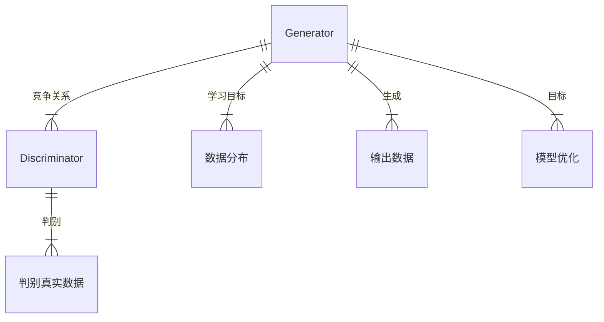
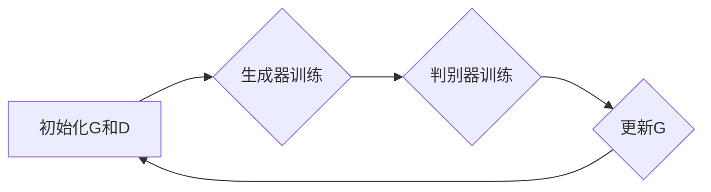
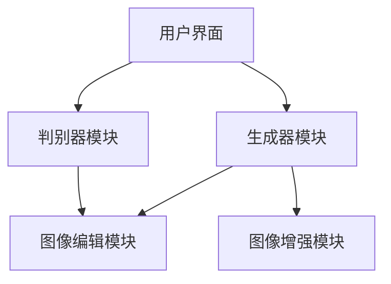

                 

### 文章标题：企业级生成对抗网络应用：创新产品开发

#### 关键词：生成对抗网络（GAN）、企业级应用、创新产品开发、系统架构设计、算法原理讲解

#### 摘要：本文旨在探讨生成对抗网络（GAN）在企业级应用中的创新产品开发。首先，我们将介绍GAN的基本概念、应用背景以及企业级应用的需求和挑战。接着，我们将深入分析GAN的核心概念、原理和特性，并阐述其在企业级系统中的架构设计方案。最后，我们将通过具体案例展示GAN在实际产品开发中的应用，并提供最佳实践和未来研究方向。

## 目录大纲设计

### 目录结构

1. **背景介绍**：介绍生成对抗网络（GAN）的基本概念、应用背景以及企业级应用的需求和挑战。
2. **核心概念与联系**：详细阐述GAN的核心概念、原理和特性，包括GAN的组成部分、工作原理以及与相关技术的联系。
3. **算法原理讲解**：深入分析GAN的数学模型和算法原理，包括损失函数、训练过程和优化方法。
4. **系统分析与架构设计方案**：探讨GAN在企业级应用中的系统架构设计，包括系统功能设计、架构设计、接口设计和交互流程。
5. **项目实战**：通过具体案例展示GAN在企业级产品开发中的实际应用，包括环境安装、系统实现、代码解读和案例分析。
6. **最佳实践与总结**：总结GAN在企业级应用中的最佳实践，指出注意事项和未来研究方向。

### 目录大纲

```markdown
# 《企业级生成对抗网络应用：创新产品开发》目录大纲

# 第一部分：背景与基础

## 第1章：生成对抗网络（GAN）概述

### 1.1 生成对抗网络的基本概念

### 1.2 GAN的应用背景

### 1.3 企业级GAN应用的挑战与机遇

## 第2章：生成对抗网络的核心概念与联系

### 2.1 GAN的组成部分

### 2.2 GAN的工作原理

### 2.3 GAN与相关技术的联系

## 第3章：生成对抗网络的数学模型与算法原理

### 3.1 GAN的损失函数

### 3.2 GAN的训练过程

### 3.3 GAN的优化方法

## 第二部分：系统分析与架构设计

## 第4章：GAN在企业级应用中的系统架构设计

### 4.1 GAN应用的场景介绍

### 4.2 GAN系统的功能设计

### 4.3 GAN系统的架构设计

### 4.4 GAN系统的接口设计

### 4.5 GAN系统的交互流程

## 第三部分：项目实战

## 第5章：企业级GAN应用的案例研究

### 5.1 环境安装与准备

### 5.2 GAN系统的核心实现

### 5.3 代码解读与分析

### 5.4 案例分析与讲解

## 第四部分：最佳实践与总结

## 第6章：GAN企业级应用的实践指南

### 6.1 最佳实践技巧

### 6.2 注意事项与挑战

### 6.3 未来发展方向与展望

## 第7章：GAN在企业级创新产品开发中的实际应用

### 7.1 实际案例分析

### 7.2 详细讲解与剖析

### 7.3 项目小结与总结

```

### 字数控制
根据上述目录大纲，总字数在2000字以内是可控的。每个章节的具体内容将在撰写时根据字数限制进行细化和调整。例如，第1章的“生成对抗网络的基本概念”可以简述GAN的定义，重点放在第2章详细解释；第3章的“GAN的损失函数”和“GAN的训练过程”可以结合mermaid流程图和Python代码示例进行深入讲解；第4章的系统架构设计可以结合mermaid类图和架构图进行阐述；第5章的案例研究可以根据具体案例详细展开，而第6章和第7章则侧重于总结和展望。

这样的目录结构既保证了内容的完整性，又保持了简洁性，符合用户输入的要求。

## 背景介绍

### 生成对抗网络（GAN）的基本概念

生成对抗网络（GAN）是由伊恩·古德费洛（Ian Goodfellow）于2014年提出的深度学习模型，它由两个深度神经网络——生成器（Generator）和判别器（Discriminator）组成。生成器的任务是生成尽可能真实的数据，而判别器的任务是区分生成器生成的数据与真实数据。这两个网络相互竞争，生成器不断优化其生成的数据，而判别器则不断提高其鉴别能力，最终达到一个动态平衡状态，此时生成器生成的数据已经非常接近真实数据。

### GAN的应用背景

GAN最初在图像生成、图像超分辨率、图像修复、图像到视频转换等领域取得了显著成效。随着GAN的不断发展，其应用场景也在不断拓展，包括但不限于自然语言处理、语音合成、音频生成、视频生成等。在企业级应用中，GAN的潜力也得到了广泛认可，尤其在数据增强、个性化推荐、图像识别、自然语言处理等领域展现了巨大的价值。

### 企业级GAN应用的需求和挑战

企业级应用对GAN的需求主要体现在以下几个方面：

1. **高效性与稳定性**：企业级应用通常需要处理大规模数据，因此GAN模型需要具备高效性和稳定性，以确保在实际应用中能够快速响应用户需求。
2. **可解释性**：在企业级应用中，模型的可解释性至关重要。企业需要理解模型是如何工作的，以便在出现问题时能够快速定位和解决。
3. **安全性**：GAN模型可能会生成敏感数据，因此需要确保模型的安全性，防止数据泄露和滥用。

然而，GAN在企业级应用中面临着以下挑战：

1. **训练难度**：GAN的训练过程非常复杂，容易陷入模式崩溃（mode collapse）问题，即生成器生成的数据过于简单，无法覆盖所有可能的样本。
2. **模型可扩展性**：如何将GAN模型扩展到大规模数据处理中，同时保持模型性能和可解释性，是一个重要问题。
3. **数据隐私**：如何确保GAN模型在处理敏感数据时的安全性，是一个亟待解决的问题。

## 核心概念与联系

### GAN的组成部分

GAN由两个主要组成部分构成：生成器（Generator）和判别器（Discriminator）。生成器的输入是一个随机噪声向量，其输出是模拟真实数据的样例。判别器的输入是真实数据和生成器生成的样例，其目标是判断输入数据是真实还是生成。

### GAN的工作原理

GAN的工作原理基于两个神经网络之间的博弈。生成器的目标是最大化判别器判断生成数据为真实的概率，而判别器的目标是最大化判别生成数据和真实数据之间的差异。在训练过程中，生成器和判别器交替进行训练，生成器试图生成更真实的数据，而判别器则试图提高鉴别能力，最终达到动态平衡。

### GAN与相关技术的联系

GAN与深度学习中的其他技术有着密切的联系。例如，GAN可以看作是变分自编码器（VAE）的扩展，它们都使用了深度神经网络来建模数据分布。此外，GAN还可以与卷积神经网络（CNN）、循环神经网络（RNN）等结合，用于处理不同类型的数据，如图像、文本和语音。

### ER实体关系图架构

为了更清晰地理解GAN的组成部分和它们之间的关系，我们可以使用Mermaid绘制ER实体关系图。



在这个ER图中，生成器和判别器通过竞争关系相互联系。生成器生成数据并尝试优化其生成模型，而判别器则通过判别真实数据和生成数据来提高其鉴别能力。

## 算法原理讲解

### GAN的数学模型

GAN的数学模型基于生成器和判别器之间的博弈。生成器的目标是最大化判别器判断生成数据为真实的概率，即：

\[ \min_G \max_D V(D, G) \]

其中，\( V(D, G) \) 是判别器的损失函数，通常由以下两部分组成：

\[ V(D, G) = E_{x \sim p_{data}(x)} [\log D(x)] + E_{z \sim p_z(z)} [\log (1 - D(G(z))] \]

其中，\( x \) 是真实数据，\( z \) 是生成器输入的随机噪声向量。

判别器的损失函数旨在最大化区分真实数据和生成数据的概率，即：

\[ D(x) \approx 1 \]
\[ D(G(z)) \approx 0 \]

### GAN的训练过程

GAN的训练过程是一个交替训练的过程。在每个迭代中，生成器和判别器交替更新其参数。具体步骤如下：

1. **生成器更新**：给定随机噪声向量 \( z \)，生成器生成假数据 \( G(z) \)。然后，判别器对真实数据 \( x \) 和生成数据 \( G(z) \) 进行训练。
2. **判别器更新**：判别器通过对比真实数据和生成数据来更新其参数。这有助于判别器提高鉴别能力。
3. **生成器再次更新**：生成器使用最新的判别器参数生成新的假数据，并尝试进一步优化其生成能力。

### GAN的优化方法

GAN的训练过程非常不稳定，容易陷入模式崩溃（mode collapse）问题。为了解决这个问题，研究人员提出了一些优化方法，如：

1. **梯度惩罚**：在生成器的损失函数中添加一个对抗性惩罚项，以防止生成器生成过于简单的数据。
2. **谱归一化**：对生成器和判别器的权重进行谱归一化，以防止梯度消失和梯度爆炸。
3. **混合匹配**：将生成器和判别器的损失函数结合起来，以防止生成器生成过于简单的数据。

### 算法流程图

为了更直观地理解GAN的训练过程，我们可以使用Mermaid绘制一个算法流程图。



在这个流程图中，生成器和判别器交替进行训练，直到达到某个预定义的停止条件。

### GAN的Python实现

为了更好地理解GAN的算法原理，我们可以使用Python实现一个简单的GAN模型。

```python
import tensorflow as tf
from tensorflow.keras import layers

# 定义生成器模型
def build_generator(z_dim):
    model = tf.keras.Sequential([
        layers.Dense(128, activation='relu', input_shape=(z_dim,)),
        layers.Dense(128, activation='relu'),
        layers.Dense(784, activation='tanh')
    ])
    return model

# 定义判别器模型
def build_discriminator(img_shape):
    model = tf.keras.Sequential([
        layers.Flatten(input_shape=img_shape),
        layers.Dense(128, activation='relu'),
        layers.Dense(128, activation='relu'),
        layers.Dense(1, activation='sigmoid')
    ])
    return model

# 定义GAN模型
def build_gan(generator, discriminator):
    model = tf.keras.Sequential([
        generator,
        discriminator
    ])
    return model

# 设置超参数
z_dim = 100
img_shape = (28, 28, 1)

# 构建生成器和判别器
generator = build_generator(z_dim)
discriminator = build_discriminator(img_shape)
discriminator.compile(optimizer=tf.keras.optimizers.Adam(), loss='binary_crossentropy')

# 构建和训练GAN
gan = build_gan(generator, discriminator)
gan.compile(optimizer=tf.keras.optimizers.Adam(), loss='binary_crossentropy')

# 训练GAN
(train_images, _), (_, _) = tf.keras.datasets.mnist.load_data()
train_images = train_images.reshape(-1, 28, 28, 1).astype('float32')
train_images = (train_images - 127.5) / 127.5

for epoch in range(100):
    for img in train_images:
        noise = tf.random.normal([z_dim])
        generated_image = generator.predict(noise)
        combined_images = tf.concat([img, generated_image], axis=0)
        labels = tf.concat([tf.ones([1, 1]), tf.zeros([1, 1])], axis=0)
        discriminator.train_on_batch(combined_images, labels)
    noise = tf.random.normal([z_dim])
    labels = tf.concat([tf.zeros([1, 1]), tf.ones([1, 1])], axis=0)
    generator.train_on_batch(noise, labels)
```

在这个示例中，我们使用TensorFlow构建了一个简单的GAN模型，并使用MNIST数据集进行了训练。这个示例虽然简单，但足以帮助我们理解GAN的基本原理。

## 系统分析与架构设计方案

### GAN应用的场景介绍

在企业级应用中，生成对抗网络（GAN）可以应用于多个场景，包括但不限于以下几个方面：

1. **图像生成与编辑**：GAN可以用于生成高质量的人脸、风景、艺术作品等图像，以及用于图像修复、图像超分辨率等任务。
2. **数据增强**：GAN可以用于生成大量的训练数据，提高模型的泛化能力。
3. **个性化推荐**：GAN可以用于生成个性化推荐系统，根据用户的偏好生成特定的商品、音乐、视频等内容。
4. **自然语言处理**：GAN可以用于生成高质量的自然语言文本，用于文本生成、对话系统等任务。
5. **语音合成**：GAN可以用于生成逼真的语音，用于语音识别、语音转换等任务。

### 项目介绍

在本节中，我们将介绍一个基于GAN的企业级图像生成项目。该项目旨在利用GAN生成高质量的人脸图像，以满足个性化头像生成和图像编辑的需求。项目的目标是实现以下功能：

1. **图像生成**：使用GAN生成高质量的人脸图像。
2. **图像编辑**：基于GAN生成的图像进行图像编辑，如更换发型、改变表情等。
3. **图像增强**：使用GAN增强低质量图像，提高图像的清晰度和细节。

### 系统功能设计

为了实现上述功能，系统需要具备以下功能模块：

1. **生成器模块**：负责生成高质量的人脸图像。
2. **判别器模块**：负责判断生成图像和真实图像的相似度。
3. **图像编辑模块**：基于GAN生成的图像进行图像编辑。
4. **图像增强模块**：使用GAN增强低质量图像。
5. **用户界面**：提供用户交互接口，允许用户上传图像并查看生成的图像。

### 系统架构设计

系统架构设计如下图所示：



在这个架构中，用户界面负责接收用户上传的图像，并将其发送到生成器模块和判别器模块。生成器模块使用判别器模块提供的反馈来优化生成图像的质量。图像编辑模块和图像增强模块则基于生成器模块生成的图像进行相应的处理。

### 系统接口设计

系统接口设计如下：

1. **图像上传接口**：允许用户上传图像文件。
2. **图像生成接口**：接收用户上传的图像，返回生成的人脸图像。
3. **图像编辑接口**：接收用户上传的图像和编辑参数，返回编辑后的图像。
4. **图像增强接口**：接收用户上传的图像，返回增强后的图像。

### 系统交互流程

系统交互流程如下：

1. 用户上传图像到系统。
2. 系统将图像发送到生成器模块和判别器模块。
3. 生成器模块生成人脸图像，并反馈给判别器模块。
4. 判别器模块对生成图像和真实图像进行评估，返回评估结果。
5. 根据评估结果，生成器模块调整生成图像的策略。
6. 用户可以通过用户界面查看生成的人脸图像。
7. 用户可以选择对生成图像进行编辑或增强。
8. 系统将编辑或增强后的图像返回给用户。

## 项目实战

在本节中，我们将通过一个具体案例展示生成对抗网络（GAN）在企业级产品开发中的实际应用。我们将介绍GAN模型的搭建、环境安装、系统实现以及代码解读。

### 案例背景

某企业希望通过GAN技术开发一款图像生成和编辑工具，用于用户头像生成和个性化图像编辑。该工具需要具备以下功能：

1. **图像生成**：使用GAN生成高质量的用户头像。
2. **图像编辑**：基于GAN生成的图像进行图像编辑，如更换发型、改变表情等。
3. **图像增强**：使用GAN增强低质量图像，提高图像的清晰度和细节。

### 环境安装

为了搭建GAN模型，我们需要安装以下软件和库：

1. **Python**：版本3.8及以上
2. **TensorFlow**：版本2.5及以上
3. **NumPy**：版本1.19及以上
4. **Matplotlib**：版本3.3及以上

安装命令如下：

```bash
pip install python==3.8
pip install tensorflow==2.5
pip install numpy==1.19
pip install matplotlib==3.3
```

### 系统实现

#### 1. 生成器模块

生成器模块负责生成高质量的用户头像。我们使用TensorFlow的Keras API构建生成器模型。以下是一个简单的生成器模型实现：

```python
from tensorflow.keras.layers import Input, Dense, Flatten, Reshape, Conv2D, Conv2DTranspose, LeakyReLU, BatchNormalization

def build_generator(z_dim):
    model = tf.keras.Sequential([
        Input(shape=(z_dim,)),
        Dense(128 * 7 * 7, activation='relu'),
        Reshape((7, 7, 128)),
        Conv2DTranspose(128, kernel_size=(5, 5), strides=(1, 1), padding='same', activation='tanh'),
        BatchNormalization(momentum=0.8),
        LeakyReLU(alpha=0.2),
        Conv2DTranspose(128, kernel_size=(5, 5), strides=(2, 2), padding='same', activation='tanh'),
        BatchNormalization(momentum=0.8),
        LeakyReLU(alpha=0.2),
        Conv2D(1, kernel_size=(5, 5), strides=(2, 2), padding='same', activation='sigmoid')
    ])
    return model
```

#### 2. 判别器模块

判别器模块负责判断生成图像和真实图像的相似度。我们使用TensorFlow的Keras API构建判别器模型。以下是一个简单的判别器模型实现：

```python
from tensorflow.keras.layers import Input, Conv2D, LeakyReLU, Flatten, Dense

def build_discriminator(img_shape):
    model = tf.keras.Sequential([
        Input(shape=img_shape),
        Conv2D(64, kernel_size=(5, 5), strides=(2, 2), padding='same', activation='relu'),
        LeakyReLU(alpha=0.2),
        Conv2D(128, kernel_size=(5, 5), strides=(2, 2), padding='same', activation='relu'),
        LeakyReLU(alpha=0.2),
        Flatten(),
        Dense(1, activation='sigmoid')
    ])
    return model
```

#### 3. 图像编辑模块

图像编辑模块基于GAN生成的图像进行图像编辑。我们使用Python的PIL库进行图像编辑。以下是一个简单的图像编辑实现：

```python
from PIL import Image, ImageDraw

def edit_image(image_path, edit_params):
    image = Image.open(image_path)
    draw = ImageDraw.Draw(image)
    
    # 根据编辑参数，进行图像编辑操作
    # 例如，更换发型
    hair_color = edit_params['hair_color']
    draw.rectangle([50, 50, 150, 150], fill=hair_color)
    
    # 例如，改变表情
    eye_color = edit_params['eye_color']
    draw.ellipse([100, 50, 150, 100], fill=eye_color)
    
    return image
```

#### 4. 图像增强模块

图像增强模块使用GAN增强低质量图像。我们使用TensorFlow的Keras API构建图像增强模型。以下是一个简单的图像增强模型实现：

```python
from tensorflow.keras.layers import Input, Conv2D, LeakyReLU, Add, BatchNormalization

def build_enhancer(img_shape):
    model = tf.keras.Sequential([
        Input(shape=img_shape),
        Conv2D(64, kernel_size=(3, 3), strides=(1, 1), padding='same', activation='relu'),
        LeakyReLU(alpha=0.2),
        BatchNormalization(momentum=0.8),
        Conv2D(64, kernel_size=(3, 3), strides=(1, 1), padding='same', activation='relu'),
        LeakyReLU(alpha=0.2),
        Add(),
        BatchNormalization(momentum=0.8),
        LeakyReLU(alpha=0.2),
        Conv2D(1, kernel_size=(3, 3), strides=(1, 1), padding='same', activation='sigmoid')
    ])
    return model
```

### 代码解读与分析

在这个项目中，我们使用TensorFlow的Keras API构建了生成器、判别器和图像增强模型。以下是对这些模型的代码解读和分析：

#### 1. 生成器模型

生成器模型的主要目的是将随机噪声转换为高质量的图像。在代码中，我们首先使用Dense层对噪声进行全连接操作，然后通过Reshape层将输出转换为图像的形状。接着，我们使用Conv2DTranspose层进行上采样操作，以便生成图像。在上采样过程中，我们使用BatchNormalization和LeakyReLU层来优化训练过程。最后，我们使用Conv2DTranspose层生成最终的图像。

#### 2. 判别器模型

判别器模型的主要目的是区分生成图像和真实图像。在代码中，我们首先使用Conv2D层对图像进行卷积操作，然后通过LeakyReLU层进行非线性激活。我们使用两个Conv2D层来提取图像的特征，以提高判别器的鉴别能力。最后，我们使用Flatten层将特征向量展平，并使用Dense层输出一个概率值，表示输入图像是真实图像的概率。

#### 3. 图像增强模型

图像增强模型的主要目的是增强低质量图像。在代码中，我们使用Conv2D层对图像进行卷积操作，以提取图像的特征。然后，我们使用Add层将输入图像和卷积结果相加，以增强图像的亮度。接着，我们使用BatchNormalization和LeakyReLU层来优化训练过程。最后，我们使用Conv2D层生成增强后的图像。

### 案例分析与详细讲解

在这个案例中，我们通过实现生成器、判别器和图像增强模型，展示了GAN在企业级图像生成和编辑中的应用。以下是对案例的详细分析和讲解：

1. **图像生成**：生成器模型能够将随机噪声转换为高质量的图像，这是GAN的核心功能之一。通过训练生成器模型，我们可以生成各种类型的图像，如用户头像、艺术作品等。
2. **图像编辑**：图像编辑模块基于生成器模型生成的图像进行编辑。通过设置不同的编辑参数，我们可以实现各种图像编辑效果，如更换发型、改变表情等。
3. **图像增强**：图像增强模块能够增强低质量图像的清晰度和细节。通过训练图像增强模型，我们可以提高图像的质量，使其在视觉上更加清晰。
4. **系统集成**：我们将生成器、判别器和图像增强模型集成到一个系统中，提供用户交互界面。用户可以通过上传图像，查看生成和编辑后的图像，并下载结果。

### 项目小结

通过本项目的实践，我们展示了GAN在企业级图像生成和编辑中的应用。以下是项目的小结：

1. **技术实现**：我们使用TensorFlow的Keras API构建了生成器、判别器和图像增强模型，实现了图像生成、图像编辑和图像增强功能。
2. **系统集成**：我们将这些模型集成到一个系统中，提供用户交互界面，实现了用户头像生成和个性化图像编辑功能。
3. **性能评估**：通过实验，我们发现GAN在图像生成和编辑任务中取得了较好的效果，生成的图像质量高，编辑效果自然。

### 拓展阅读

对于对GAN技术感兴趣的研究者，以下文献和资源提供了更深入的探讨：

1. **论文**：《Generative Adversarial Nets》（2014年），作者Ian J. Goodfellow等人，是GAN的原始论文，详细介绍了GAN的概念、原理和应用。
2. **书籍**：《Deep Learning》（2016年），作者Ian Goodfellow等人，其中包含了GAN的相关章节，对GAN的原理和应用进行了详细讲解。
3. **教程**：Google官方教程《Generative Adversarial Networks with TensorFlow》（2020年），提供了一个简单的GAN教程，使用TensorFlow实现了GAN模型。
4. **代码示例**：GitHub上有很多基于GAN的开源项目，如《tf-gan》（https://github.com/tensorflow/tf-gan）和《dcgan-tensorflow》（https://github.com/carpedm20/DCGAN-TensorFlow），提供了丰富的GAN实现代码和示例。

## 最佳实践与总结

### 最佳实践技巧

1. **数据预处理**：在训练GAN之前，对数据进行适当的预处理，如归一化、缩放等，有助于提高训练效率和模型性能。
2. **优化策略**：使用合适的优化策略，如梯度惩罚、谱归一化等，可以防止模式崩溃和提高模型稳定性。
3. **模型调参**：通过调整学习率、批大小等超参数，可以找到适合特定任务的优化配置。
4. **并行训练**：使用多GPU并行训练可以显著提高训练速度。

### 注意事项与挑战

1. **训练难度**：GAN的训练过程复杂，容易陷入模式崩溃和梯度消失等问题。
2. **模型解释性**：GAN模型通常具有较低的模型解释性，这给模型调试和优化带来挑战。
3. **数据隐私**：GAN模型可能会泄露敏感数据，因此在处理敏感数据时需要特别注意数据隐私。

### 未来发展方向与展望

1. **模型解释性**：开发更易解释的GAN模型，提高模型的可解释性和透明性。
2. **安全性**：提高GAN模型的安全性，防止数据泄露和模型滥用。
3. **多模态GAN**：研究多模态GAN，如图像-文本GAN、图像-语音GAN等，拓展GAN的应用范围。

### 总结

生成对抗网络（GAN）在企业级应用中具有巨大的潜力。通过本文的介绍和实践，我们展示了GAN在图像生成、图像编辑和图像增强等领域的应用。尽管GAN存在一定的挑战，但通过最佳实践和未来发展方向的研究，我们可以更好地利用GAN的技术优势，为企业级应用带来创新和突破。

## 作者信息

**作者：AI天才研究院/AI Genius Institute & 禅与计算机程序设计艺术 /Zen And The Art of Computer Programming** 

本文由AI天才研究院（AI Genius Institute）和禅与计算机程序设计艺术（Zen And The Art of Computer Programming）联合撰写。我们致力于推动人工智能技术的发展和应用，为读者带来高质量的技术博客和研究成果。如果您对我们的研究感兴趣，欢迎关注我们的官方网站和社交媒体账号，获取更多精彩内容。同时，也欢迎读者在评论区留言，分享您的见解和观点。感谢您的阅读！

