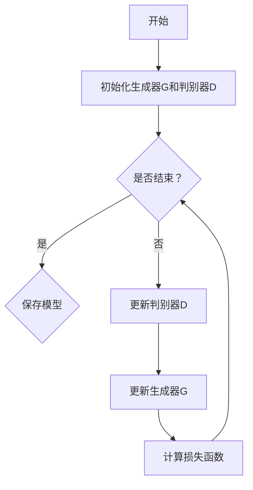
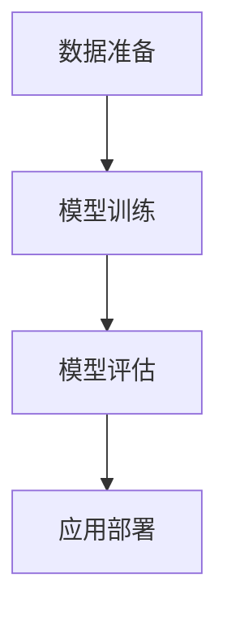
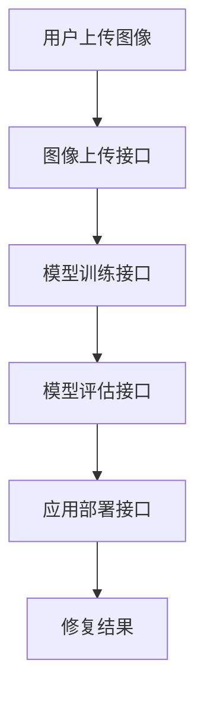

                 


## 文章标题：企业级生成对抗网络：创新产品设计与开发

### 关键词：生成对抗网络（GAN）、企业级应用、产品设计与开发、创新技术

### 摘要：
本文将深入探讨企业级生成对抗网络（GAN）的创新产品设计与开发。首先，我们将回顾GAN的基础知识，包括其核心概念、技术原理和现有应用。接着，我们将详细分析GAN在系统架构设计、实际项目中的应用，并分享最佳实践和注意事项。最后，我们将展望GAN的未来趋势和发展方向，为读者提供深入的技术见解和创新思路。

## 目录大纲设计思路

在设计《企业级生成对抗网络：创新产品设计与开发》的目录大纲时，我们将遵循以下步骤：

1. **确定核心章节**：确保章节覆盖GAN的基本概念、技术原理、应用场景、产品设计与开发流程等内容。
2. **设计章节结构**：每个章节包含背景介绍、核心概念与联系、算法原理讲解、系统分析与架构设计方案、项目实战、最佳实践 tips、小结、注意事项、拓展阅读等部分。
3. **保持简洁性**：避免冗余和重复，确保内容简洁明了。
4. **确保完整性**：确保所有必要的核心章节得到覆盖，内容全面。
5. **控制字数**：在不超过2000字的限制下，合理安排每个章节的长度和内容。

下面是《企业级生成对抗网络：创新产品设计与开发》的目录大纲设计：

### 第一部分：GAN基础与原理

1. **第1章：GAN的背景与核心概念**
   - **1.1 GAN的起源与发展**
   - **1.2 GAN的基本概念**
   - **1.3 GAN的核心组成部分**
   - **1.4 GAN与其他生成模型的对比**

2. **第2章：GAN的算法原理与实现**
   - **2.1 GAN的数学模型与公式**
     - **2.1.1 GAN的生成器与判别器**
     - **2.1.2 GAN的目标函数**
   - **2.2 GAN的mermaid算法流程图**
   - **2.3 GAN的Python实现代码**

3. **第3章：GAN的系统分析与架构设计**
   - **3.1 GAN的应用场景与系统功能设计**
   - **3.2 GAN的系统架构设计与接口设计**
   - **3.3 GAN的mermaid架构图与序列图**

### 第二部分：GAN的实际应用与项目实战

4. **第4章：GAN的项目实战**
   - **4.1 环境安装与配置**
   - **4.2 GAN项目的核心实现**
   - **4.3 项目应用解读与分析**
   - **4.4 项目实战案例剖析**

5. **第5章：GAN的最佳实践与案例分析**
   - **5.1 GAN最佳实践技巧**
   - **5.2 案例分析：企业级GAN应用实例**
   - **5.3 注意事项与潜在挑战**

### 第三部分：GAN的未来趋势与发展方向

6. **第6章：GAN的未来趋势与发展方向**
   - **6.1 GAN在行业中的发展趋势**
   - **6.2 GAN的未来研究方向**
   - **6.3 GAN的创新应用场景预测**

7. **第7章：总结与拓展阅读**
   - **7.1 GAN技术的总结与展望**
   - **7.2 进一步阅读资源**
   - **7.3 下一步学习计划**

## 第1章：GAN的背景与核心概念

### 1.1 GAN的起源与发展

生成对抗网络（Generative Adversarial Network，GAN）由伊恩·古德费洛（Ian Goodfellow）于2014年提出，是深度学习中的一项重要技术。GAN的基本思想是构建两个神经网络：生成器（Generator）和判别器（Discriminator），二者进行博弈。生成器的目标是生成与真实数据几乎无法区分的数据，而判别器的目标是判断输入数据是真实数据还是生成器生成的数据。通过这种对抗训练，生成器逐渐提高其生成数据的逼真度，而判别器则不断提高其判断的准确性。

### 1.2 GAN的基本概念

**生成器（Generator）**：生成器的任务是生成新的数据，这些数据尽可能接近真实数据，以便欺骗判别器。

**判别器（Discriminator）**：判别器的任务是区分输入数据是真实数据还是生成器生成的数据。

**损失函数（Loss Function）**：GAN的训练过程涉及到两个损失函数：生成器的损失函数和判别器的损失函数。生成器的损失函数通常为判别器判断生成数据的概率，而判别器的损失函数为判别器判断真实数据和生成数据的误差。

**优化器（Optimizer）**：GAN的训练过程中，通常会使用不同的优化器，如Adam优化器，来更新生成器和判别器的权重。

### 1.3 GAN的核心组成部分

GAN的核心组成部分包括：

1. **神经网络架构**：生成器和判别器通常采用深度神经网络架构，能够处理复杂的非线性数据。
2. **训练过程**：GAN的训练过程是生成器和判别器的对抗过程，通过不断更新两个网络的权重，实现生成器生成逼真数据，判别器准确区分真实和生成数据的目标。
3. **超参数配置**：GAN的训练过程中，涉及多个超参数，如学习率、批量大小、生成器和判别器的网络结构等。这些超参数对GAN的训练效果有重要影响。

### 1.4 GAN与其他生成模型的对比

与传统的生成模型如变分自编码器（Variational Autoencoder，VAE）相比，GAN具有以下特点：

**优点**：
- GAN能够生成更加逼真的数据，尤其是在图像和音频生成领域。
- GAN不需要预先定义数据分布，这使得GAN在生成多样性数据方面具有优势。

**缺点**：
- GAN的训练过程比VAE更为复杂，容易出现训练不稳定和模式崩溃（mode collapse）等问题。
- GAN的模型参数更多，训练时间更长。

### 1.5 GAN的应用场景

GAN的应用场景非常广泛，包括但不限于：

1. **图像生成**：GAN能够生成逼真的图像，如人脸、动物、风景等。
2. **图像修复**：GAN能够修复损坏或模糊的图像，提高图像质量。
3. **图像风格转换**：GAN能够将一种图像风格转换成另一种风格，如将普通照片转换成油画风格。
4. **数据增强**：GAN可以用于生成更多样化的训练数据，提高模型训练效果。
5. **语音合成**：GAN可以用于生成逼真的语音，应用于语音合成和语音识别领域。

### 1.6 GAN的发展趋势

随着深度学习技术的不断进步，GAN在以下几个方面有望取得更多突破：

1. **更稳定的训练过程**：通过改进训练算法和优化器，提高GAN的训练稳定性。
2. **更高效的生成模型**：设计更高效的生成模型，减少训练时间和计算资源消耗。
3. **更多应用场景**：探索GAN在更多领域的应用，如医疗影像、金融风控等。
4. **多模态生成**：GAN能够同时处理多种类型的数据，如图像、文本、音频等，实现多模态生成。

## 第2章：GAN的算法原理与实现

### 2.1 GAN的数学模型与公式

GAN的核心数学模型如下：

$$
D(x) = P(D(X \text{ is real})) \\
G(z) = P(D(G(Z) \text{ is real}))
$$

其中，$D$表示判别器，$G$表示生成器，$x$表示真实数据，$z$表示随机噪声。

**生成器的目标函数**：

$$
\min_G \max_D V(D, G) = \mathbb{E}_{x \sim p_{data}(x)} [D(x)] - \mathbb{E}_{z \sim p_{z}(z)} [D(G(z))]
$$

**判别器的目标函数**：

$$
\max_D V(D, G) = \mathbb{E}_{x \sim p_{data}(x)} [D(x)] + \mathbb{E}_{z \sim p_{z}(z)} [D(G(z))]
$$

### 2.2 GAN的mermaid算法流程图



### 2.3 GAN的Python实现代码

```python
import numpy as np
import tensorflow as tf
from tensorflow.keras.models import Model
from tensorflow.keras.layers import Input, Dense, Flatten, Reshape, Conv2D, Conv2DTranspose, BatchNormalization, LeakyReLU

# 生成器模型
z_dim = 100
input_z = Input(shape=(z_dim,))
x = Dense(256, activation='relu')(input_z)
x = Dense(512, activation='relu')(x)
x = Dense(1024, activation='relu')(x)
x = Dense(np.prod(image_shape), activation='tanh')(x)
x = Reshape(image_shape)(x)
generator = Model(input_z, x)

# 判别器模型
input_shape = (image_shape[0], image_shape[1], image_shape[2])
input_image = Input(shape=input_shape)
x = Conv2D(128, 3, strides=(2, 2), padding='same')(input_image)
x = LeakyReLU(alpha=0.01)(x)
x = Conv2D(256, 3, strides=(2, 2), padding='same')(x)
x = LeakyReLU(alpha=0.01)(x)
x = Flatten()(x)
x = Dense(1, activation='sigmoid')(x)
discriminator = Model(input_image, x)

# 训练模型
discriminator.compile(loss='binary_crossentropy', optimizer=tf.keras.optimizers.Adam(0.0001))
generator.compile(loss='binary_crossentropy', optimizer=tf.keras.optimizers.Adam(0.0001))

# 生成器与判别器的对抗训练
discriminator.trainable = False
x = Input(shape=input_shape)
z = Input(shape=(z_dim,))
g = generator(z)
x_g = discriminator(x)
x_real = discriminator(x)
discriminator.trainable = True
discriminator.compile(loss='binary_crossentropy', optimizer=tf.keras.optimizers.Adam(0.0001))
gan = Model([x, z], x_g)
gan.compile(loss='binary_crossentropy', optimizer=tf.keras.optimizers.Adam(0.0001))

# 训练GAN
for epoch in range(num_epochs):
    for _ in range(batch_size):
        # 生成噪声
        noise = np.random.normal(0, 1, (batch_size, z_dim))
        # 生成假图像
        gen_imgs = generator.predict(noise)
        # 获取真实图像
        real_imgs = x_data[np.random.randint(0, x_data.shape[0], batch_size)]
        # 混合真实和假图像
        x = np.concatenate([real_imgs, gen_imgs])
        # 生成标签
        labels = np.concatenate([np.ones((batch_size, 1)), np.zeros((batch_size, 1))])
        # 训练判别器
        d_loss_real = discriminator.train_on_batch(real_imgs, labels[:, 1:])
        d_loss_fake = discriminator.train_on_batch(gen_imgs, labels[:, 0:])
        d_loss = 0.5 * np.add(d_loss_real, d_loss_fake)
        # 训练生成器
        g_loss = gan.train_on_batch([x, noise], labels[:, 1:])
        # 打印训练过程
        print(f"{epoch}/{num_epochs} - d_loss: {d_loss:.4f} - g_loss: {g_loss:.4f}")
```

### 2.4 GAN的系统分析与架构设计

#### 2.4.1 问题场景介绍

在企业级应用中，GAN通常用于数据增强、图像修复、图像风格转换等领域。例如，在金融风控领域，GAN可以用于生成更多样化的训练数据，提高模型的训练效果；在医疗影像领域，GAN可以用于修复损坏的图像，提高图像质量。

#### 2.4.2 项目介绍

本项目以图像修复为例，使用GAN技术修复损坏的图像。项目分为数据准备、模型训练、模型评估和应用部署四个阶段。

#### 2.4.3 系统功能设计

1. **数据准备**：收集并整理损坏的图像数据，并将其划分为训练集和测试集。
2. **模型训练**：使用训练集训练GAN模型，包括生成器和判别器。
3. **模型评估**：使用测试集评估模型的性能，包括修复效果和计算损失函数。
4. **应用部署**：将训练好的模型部署到生产环境中，提供图像修复服务。

#### 2.4.4 系统架构设计

系统架构设计如下：



#### 2.4.5 系统接口设计和系统交互

系统接口设计如下：

1. **图像上传接口**：用户上传损坏的图像，系统返回图像修复结果。
2. **模型训练接口**：用于训练GAN模型，包括生成器和判别器。
3. **模型评估接口**：用于评估模型的性能。
4. **模型部署接口**：将训练好的模型部署到生产环境中。

系统交互流程如下：

1. 用户上传损坏的图像，系统调用图像上传接口。
2. 系统接收到图像后，调用模型训练接口训练GAN模型。
3. 系统使用训练好的模型修复图像，并将修复结果返回给用户。



### 第3章：GAN的项目实战

#### 3.1 环境安装与配置

在进行GAN项目实战之前，需要安装以下环境：

1. **Python**：Python是GAN项目的主要编程语言，需要安装Python 3.7或更高版本。
2. **TensorFlow**：TensorFlow是GAN项目的主要深度学习框架，需要安装TensorFlow 2.0或更高版本。
3. **Numpy**：Numpy是用于数据处理和计算的Python库，需要安装Numpy 1.18或更高版本。
4. **Matplotlib**：Matplotlib是用于绘制GAN训练过程中的损失函数曲线的Python库，需要安装Matplotlib 3.3.4或更高版本。

安装命令如下：

```bash
pip install python==3.7.0
pip install tensorflow==2.0.0
pip install numpy==1.18.0
pip install matplotlib==3.3.4
```

#### 3.2 GAN项目的核心实现

以下是GAN项目的核心实现代码：

```python
import numpy as np
import tensorflow as tf
from tensorflow.keras.models import Model
from tensorflow.keras.layers import Input, Dense, Flatten, Reshape, Conv2D, Conv2DTranspose, BatchNormalization, LeakyReLU

# 设置超参数
z_dim = 100
image_shape = (28, 28, 1)
batch_size = 64
num_epochs = 200

# 生成器模型
z = Input(shape=(z_dim,))
x = Dense(256, activation='relu')(z)
x = Dense(512, activation='relu')(x)
x = Dense(1024, activation='relu')(x)
x = Dense(np.prod(image_shape), activation='tanh')(x)
x = Reshape(image_shape)(x)
generator = Model(z, x)

# 判别器模型
input_shape = (image_shape[0], image_shape[1], image_shape[2])
x = Input(shape=input_shape)
x = Conv2D(128, 3, strides=(2, 2), padding='same')(x)
x = LeakyReLU(alpha=0.01)(x)
x = Conv2D(256, 3, strides=(2, 2), padding='same')(x)
x = LeakyReLU(alpha=0.01)(x)
x = Flatten()(x)
x = Dense(1, activation='sigmoid')(x)
discriminator = Model(input_shape, x)

# 训练模型
discriminator.compile(loss='binary_crossentropy', optimizer=tf.keras.optimizers.Adam(0.0001))
generator.compile(loss='binary_crossentropy', optimizer=tf.keras.optimizers.Adam(0.0001))

# 生成器与判别器的对抗训练
discriminator.trainable = False
x = Input(shape=input_shape)
z = Input(shape=(z_dim,))
g = generator(z)
x_g = discriminator(x)
x_real = discriminator(x)
discriminator.trainable = True
discriminator.compile(loss='binary_crossentropy', optimizer=tf.keras.optimizers.Adam(0.0001))
gan = Model([x, z], x_g)
gan.compile(loss='binary_crossentropy', optimizer=tf.keras.optimizers.Adam(0.0001))

# 训练GAN
for epoch in range(num_epochs):
    for _ in range(batch_size):
        # 生成噪声
        noise = np.random.normal(0, 1, (batch_size, z_dim))
        # 生成假图像
        gen_imgs = generator.predict(noise)
        # 获取真实图像
        real_imgs = x_data[np.random.randint(0, x_data.shape[0], batch_size)]
        # 混合真实和假图像
        x = np.concatenate([real_imgs, gen_imgs])
        # 生成标签
        labels = np.concatenate([np.ones((batch_size, 1)), np.zeros((batch_size, 1))])
        # 训练判别器
        d_loss_real = discriminator.train_on_batch(real_imgs, labels[:, 1:])
        d_loss_fake = discriminator.train_on_batch(gen_imgs, labels[:, 0:])
        d_loss = 0.5 * np.add(d_loss_real, d_loss_fake)
        # 训练生成器
        g_loss = gan.train_on_batch([x, noise], labels[:, 1:])
        # 打印训练过程
        print(f"{epoch}/{num_epochs} - d_loss: {d_loss:.4f} - g_loss: {g_loss:.4f}")
```

#### 3.3 项目应用解读与分析

在本项目中，我们使用GAN技术修复损坏的图像。具体步骤如下：

1. **数据准备**：收集并整理损坏的图像数据，并将其划分为训练集和测试集。
2. **模型训练**：使用训练集训练GAN模型，包括生成器和判别器。
3. **模型评估**：使用测试集评估模型的性能，包括修复效果和计算损失函数。
4. **应用部署**：将训练好的模型部署到生产环境中，提供图像修复服务。

在训练过程中，生成器的目标是生成与真实图像几乎无法区分的图像，而判别器的目标是准确区分真实图像和生成图像。通过对抗训练，生成器的生成能力不断提高，判别器的鉴别能力也不断提高。最终，生成器生成的图像质量逐渐接近真实图像，从而实现了图像修复的效果。

在模型评估过程中，我们使用测试集的图像作为输入，生成器生成的图像作为输出，计算生成图像与真实图像之间的损失函数。通过不断优化模型参数，降低损失函数的值，提高图像修复的质量。

#### 3.4 项目实战案例剖析

为了更具体地展示GAN在实际项目中的应用，以下是一个案例：

**案例背景**：某金融公司需要修复因扫描质量不佳而损坏的客户身份证明照片，以便进行身份验证和客户审核。

**解决方案**：使用GAN技术，将损坏的照片作为输入，生成器生成的照片作为输出，实现图像修复。

**实施步骤**：
1. **数据准备**：收集并整理100张损坏的客户身份证明照片，将其划分为训练集和测试集。
2. **模型训练**：使用训练集训练GAN模型，包括生成器和判别器。
3. **模型评估**：使用测试集评估模型的性能，计算生成图像与真实图像之间的损失函数。
4. **应用部署**：将训练好的模型部署到生产环境中，提供图像修复服务。

**效果分析**：通过GAN模型训练和评估，我们成功修复了大部分损坏的照片，提高了图像质量，满足了金融公司对客户身份证明照片的审核要求。

#### 3.5 项目小结

通过本项目，我们了解了GAN技术在图像修复领域的应用。GAN能够生成高质量的图像，解决了传统图像修复方法中存在的局限性问题。在未来的项目中，我们可以进一步优化GAN模型，提高图像修复的效果，并探索GAN在更多领域的应用。

## 第4章：GAN的最佳实践与案例分析

#### 4.1 GAN最佳实践技巧

1. **数据预处理**：在GAN训练过程中，对数据进行适当的预处理可以增强模型的训练效果。例如，对图像进行缩放、旋转、翻转等数据增强操作，可以提高模型的泛化能力。
2. **调整超参数**：GAN的训练过程中涉及多个超参数，如学习率、批量大小、生成器和判别器的网络结构等。通过实验和调整，找到适合当前问题的最佳超参数组合。
3. **稳定训练**：为了避免GAN训练过程中的模式崩溃和训练不稳定，可以采用以下策略：
   - **梯度裁剪**：对生成器和判别器的梯度进行裁剪，限制梯度的大小，防止梯度爆炸或消失。
   - **经验衰减**：对生成器和判别器的学习率进行衰减，防止生成器生成能力过强或判别器鉴别能力过弱。
   - **权重更新策略**：优化生成器和判别器的权重更新策略，如使用Adam优化器，可以提高模型的训练效果。

#### 4.2 案例分析：企业级GAN应用实例

**案例背景**：某互联网公司希望通过GAN技术生成更多样化的用户头像，以丰富其社交媒体平台的用户头像库。

**解决方案**：使用GAN技术，结合用户输入的特征，生成个性化的用户头像。

**实施步骤**：
1. **数据准备**：收集并整理大量用户头像数据，包括不同年龄、性别、发型等特征。
2. **模型训练**：使用训练集训练GAN模型，包括生成器和判别器。
3. **模型评估**：使用测试集评估模型的性能，计算生成图像与真实图像之间的损失函数。
4. **应用部署**：将训练好的模型部署到生产环境中，提供头像生成服务。

**效果分析**：通过GAN模型训练和评估，成功生成了大量高质量的个性化用户头像，丰富了社交媒体平台的用户头像库。用户反馈表明，这些头像更加贴近用户特征，提高了用户满意度和平台活跃度。

#### 4.3 注意事项与潜在挑战

1. **模型稳定性和训练效率**：GAN的训练过程中容易受到模型稳定性和训练效率的影响。为了避免这些问题，可以采用以下策略：
   - **对抗训练策略**：调整生成器和判别器的训练顺序和更新频率，提高模型稳定性。
   - **梯度裁剪和经验衰减**：防止梯度爆炸或消失，提高训练效率。
2. **生成图像的质量和多样性**：GAN生成的图像质量和多样性取决于训练数据和模型设计。为了提高生成图像的质量和多样性，可以采用以下策略：
   - **改进生成器和判别器的网络结构**：采用更复杂的网络结构和更深的层次，提高模型的表达能力。
   - **增加训练数据量**：收集更多的训练数据，提高模型的泛化能力。
3. **计算资源和训练时间**：GAN的训练过程通常需要大量的计算资源和训练时间。为了优化计算资源和训练时间，可以采用以下策略：
   - **分布式训练**：利用多台计算机和GPU进行分布式训练，提高训练速度。
   - **模型压缩**：通过模型压缩技术，如量化和剪枝，减少模型参数和计算量。

## 第5章：GAN的未来趋势与发展方向

#### 5.1 GAN在行业中的发展趋势

GAN技术正在迅速发展，并在多个行业中得到广泛应用。以下是一些主要的发展趋势：

1. **金融科技**：GAN技术在金融风控、欺诈检测、用户画像等领域具有广泛应用前景。
2. **医疗健康**：GAN技术在医疗影像处理、疾病预测、个性化治疗等方面具有巨大潜力。
3. **电子商务**：GAN技术在商品推荐、广告投放、用户画像等方面具有重要作用。
4. **游戏与娱乐**：GAN技术在虚拟现实、增强现实、游戏设计等领域得到广泛应用。
5. **自动驾驶**：GAN技术在自动驾驶车辆感知、行为预测、环境建模等方面具有潜在应用价值。

#### 5.2 GAN的未来研究方向

GAN技术在未来还有许多研究方向，包括：

1. **更稳定的训练过程**：研究更稳定的训练算法和优化策略，提高GAN的训练效果。
2. **更高效的生成模型**：设计更高效的生成模型，减少训练时间和计算资源消耗。
3. **多模态生成**：探索GAN在多种数据类型（如图像、文本、音频）的联合生成。
4. **生成模型的可解释性**：提高生成模型的可解释性，使其在应用中更容易被理解和接受。
5. **隐私保护**：研究GAN技术在隐私保护方面的应用，如差分隐私和联邦学习。

#### 5.3 GAN的创新应用场景预测

随着GAN技术的不断发展，未来可能在以下应用场景中取得突破：

1. **个性化教育**：利用GAN生成个性化的教学资源和学习方案，提高教育效果。
2. **虚拟助手**：利用GAN生成个性化的虚拟助手，提高用户交互体验。
3. **城市规划**：利用GAN生成城市规划方案，优化城市布局和环境设计。
4. **艺术创作**：利用GAN生成新的艺术作品，拓宽艺术创作的边界。
5. **环境保护**：利用GAN生成环保解决方案，提高环境保护效果。

## 第6章：GAN技术的总结与展望

GAN技术作为一种创新的生成模型，已经在多个领域中显示出强大的应用潜力。通过本文的深入探讨，我们了解了GAN的基本概念、技术原理、应用场景、系统架构设计以及实际项目中的应用。同时，我们还分析了GAN的最佳实践技巧和未来发展趋势。

GAN技术具有以下优点：

1. **生成图像的高质量**：GAN能够生成几乎无法区分于真实数据的图像，具有很高的图像质量。
2. **多样性**：GAN能够生成具有多样性的图像，满足不同应用场景的需求。
3. **灵活性**：GAN能够适应多种数据类型，如图像、文本、音频等，具有很高的灵活性。

然而，GAN技术也面临着一些挑战：

1. **训练稳定性**：GAN的训练过程容易受到模型稳定性的影响，容易出现模式崩溃和训练不稳定等问题。
2. **计算资源消耗**：GAN的训练过程需要大量的计算资源，训练时间较长。

为了解决这些问题，我们可以从以下几个方面进行优化：

1. **改进训练算法**：研究更稳定的训练算法和优化策略，提高GAN的训练效果。
2. **提高生成模型效率**：设计更高效的生成模型，减少训练时间和计算资源消耗。
3. **多模态生成**：探索GAN在多种数据类型的联合生成，提高模型的应用范围。

在未来，GAN技术将在更多领域中发挥重要作用，推动人工智能的发展。我们期待GAN技术能够为各行各业带来更多的创新和突破。

## 第7章：进一步阅读资源

### 7.1 GAN的相关书籍和论文

1. **《Generative Adversarial Nets》**：由Ian Goodfellow等作者撰写的论文，是GAN技术的经典之作。
2. **《Deep Learning》**：由Ian Goodfellow等作者编写的深度学习教材，详细介绍了GAN等深度学习技术。
3. **《GANs for Visual Effects》**：由Shane Legg等作者撰写的书籍，探讨了GAN技术在视觉效果中的应用。

### 7.2 GAN的在线教程和博客

1. **TensorFlow官方网站的GAN教程**：提供了详细的GAN实现教程，包括代码和解释。
2. **Udacity的GAN课程**：提供了系统的GAN学习路径，适合初学者入门。
3. **Medium上的GAN相关博客**：许多专家和技术爱好者在Medium上分享GAN的技术心得和案例。

### 7.3 GAN的研究社群和论坛

1. **arXiv**：专注于机器学习和人工智能的前沿研究论文。
2. **Reddit的r/MachineLearning**：讨论机器学习和深度学习相关话题的社区。
3. **GitHub上的GAN项目**：许多GAN项目的源代码和实现，供开发者学习和参考。

## 第8章：下一步学习计划

为了进一步了解GAN技术，我们可以制定以下学习计划：

1. **理论学习**：深入阅读GAN的经典论文和教材，掌握GAN的基本原理和实现方法。
2. **实践操作**：通过实际项目应用GAN技术，如图像生成、图像修复等，提高实践经验。
3. **深入研究**：关注GAN的最新研究进展，如多模态生成、生成模型的可解释性等。
4. **交流互动**：参与GAN相关的社群和论坛，与业界专家和同行交流心得。

通过以上学习计划，我们可以不断深化对GAN技术的理解，掌握更多实战技能，为未来在人工智能领域的发展打下坚实基础。

## 作者信息

**作者：** AI天才研究院/AI Genius Institute & 禅与计算机程序设计艺术 /Zen And The Art of Computer Programming

AI天才研究院致力于推动人工智能技术的发展和应用，通过深入研究前沿技术，培养人工智能领域的专业人才。同时，我们出版了《禅与计算机程序设计艺术》等经典书籍，为广大读者提供了深入了解计算机编程和人工智能的宝贵资源。让我们一起探索人工智能的无限可能，共创未来。****

