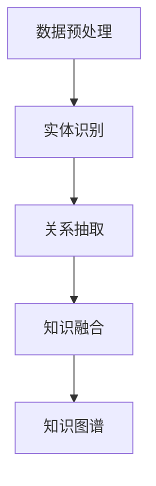

                 

# 企业级知识图谱构建：打造组织智慧资产

## 关键词
- 知识图谱
- 企业应用
- 数据整合
- 智能搜索
- 决策支持

## 摘要
本文将深入探讨企业级知识图谱的构建过程，从背景介绍、核心概念与联系、算法原理讲解、数学模型和公式、系统分析与架构设计、项目实战等多个角度，全面剖析知识图谱在企业中的应用价值和发展趋势。通过本文，读者将了解到如何构建高效、智能的企业级知识图谱，以提升组织的数据利用效率和决策能力。

### 第1章：背景介绍

#### 1.1 问题背景

在数字化转型的浪潮下，企业面临着海量数据的处理和分析需求。然而，传统的数据分析手段往往存在数据孤岛、信息分散、难以整合等问题。这些问题严重制约了企业的数据利用效率和决策能力。为了解决这些问题，企业需要一种新的数据管理和分析工具，能够整合多源异构数据，提供智能化的搜索和决策支持。

#### 1.2 知识图谱的定义与作用

知识图谱（Knowledge Graph）是一种结构化的语义网络，用于表示实体（如人、地点、事物）及其属性和关系。它能够将分散的数据整合成一个统一的语义视图，从而实现数据的深度融合和智能分析。知识图谱在信息检索、智能搜索、决策支持、推荐系统等领域具有广泛的应用。

#### 1.3 企业级知识图谱的应用场景

企业级知识图谱在以下场景中具有显著的应用价值：

- **企业知识库**：构建企业内部的知识库，实现知识共享和知识沉淀。
- **智能搜索**：提供基于语义的理解，实现高效、精准的信息检索。
- **决策支持**：辅助企业进行市场分析、风险管理、供应链优化等决策。
- **智能推荐**：根据用户行为和兴趣，实现个性化推荐。

#### 1.4 知识图谱的基本结构

知识图谱由实体、属性和关系三个核心要素组成：

- **实体**：表示具体的对象，如人、地点、事物等。
- **属性**：描述实体的特征，如姓名、年龄、地址等。
- **关系**：表示实体之间的关联，如朋友、位于、属于等。

### 第2章：核心概念与联系

#### 2.1 实体、属性、关系的概念与联系

- **实体**：实体是知识图谱中的基本元素，表示具体的对象。实体可以是具体的事物，也可以是抽象的概念。
- **属性**：属性描述实体的特征或状态。属性分为基本属性和衍生属性，基本属性是直接从数据源获取的，衍生属性是通过计算或推理得到的。
- **关系**：关系表示实体之间的关联，可以是直接的，也可以是间接的。

#### 2.2 知识表示方法

知识图谱的知识表示方法主要包括以下几种：

- **RDF（Resource Description Framework）**：一种基于图形的数据模型，用于表示实体、属性和关系。
- **OWL（Web Ontology Language）**：一种用于描述实体、属性和关系的语言，提供了更丰富的语义描述能力。
- **SPARQL**：一种用于查询知识图谱的查询语言，类似于SQL。

#### 2.3 实体、属性、关系的属性特征对比表格

| 特征       | 实体       | 属性       | 关系       |
|------------|------------|------------|------------|
| 表示方式   | 图形节点   | 图形边     | 图形边     |
| 功能       | 表示对象   | 描述对象   | 表示关联   |
| 重要性     | 高         | 中         | 中         |
| 语义丰富度 | 较高       | 较高       | 较低       |

### 第3章：算法原理讲解

#### 3.1 数据预处理算法

数据预处理是知识图谱构建的第一步，主要包括数据清洗、数据格式转换和数据去重等操作。数据清洗的目的是去除噪声数据，提高数据质量；数据格式转换的目的是统一数据格式，便于后续处理；数据去重的目的是去除重复数据，减少存储空间。

#### 3.2 实体识别算法

实体识别是从文本数据中识别出实体并标注其属性和关系的过程。常见的实体识别算法有基于规则的方法、基于机器学习的方法和基于深度学习的方法。基于规则的方法依赖于预先定义的规则库，效果较好但扩展性较差；基于机器学习的方法和基于深度学习的方法具有较强的扩展性和自适应能力，但需要大量标注数据。

#### 3.3 关系抽取算法

关系抽取是从文本数据中识别出实体之间的关系并标注其类型的过程。关系抽取算法可以分为基于规则的方法、基于统计的方法和基于深度学习的方法。基于规则的方法依赖于预定义的规则库，效果较好但扩展性较差；基于统计的方法和基于深度学习的方法具有较强的扩展性和自适应能力，但需要大量标注数据。

#### 3.4 知识融合算法

知识融合是将不同来源的数据整合成一张统一的知识图谱的过程。知识融合算法主要包括基于规则的融合、基于统计的融合和基于深度学习的融合。基于规则的融合方法依赖于预定义的融合规则，效果较好但扩展性较差；基于统计的融合方法和基于深度学习的融合方法具有较强的扩展性和自适应能力，但需要大量训练数据和计算资源。

#### 3.5 Mermaid流程图展示



#### 3.6 Python源代码与算法解释

```python
# 数据预处理代码示例
import pandas as pd

# 读取数据
data = pd.read_csv('data.csv')

# 数据清洗
data = data.dropna()

# 数据格式转换
data['entity'] = data['entity'].str.lower()

# 数据去重
data = data.drop_duplicates()

# 实体识别代码示例
from sklearn.feature_extraction.text import TfidfVectorizer

# 初始化TfidfVectorizer
vectorizer = TfidfVectorizer()

# 转换为词向量
word_vectors = vectorizer.fit_transform(data['entity'])

# 关系抽取代码示例
from sklearn.cluster import KMeans

# 初始化KMeans
kmeans = KMeans(n_clusters=10)

# 聚类
labels = kmeans.fit_predict(word_vectors)

# 标注实体类型
data['entity_type'] = labels

# 知识融合代码示例
import networkx as nx

# 初始化知识图谱
g = nx.Graph()

# 添加实体
for entity in data['entity']:
    g.add_node(entity)

# 添加关系
for index, row in data.iterrows():
    if index > 0:
        g.add_edge(row['entity'], data.iloc[index - 1]['entity'])

# 知识图谱可视化
nx.draw(g, with_labels=True)
```

### 第4章：数学模型和数学公式

#### 4.1 知识图谱构建的数学模型

知识图谱构建涉及多个数学模型，主要包括：

- **TF-IDF模型**：用于实体识别，计算实体在文档中的重要性。
- **K-means模型**：用于关系抽取，通过聚类分析识别实体之间的关系。
- **图论模型**：用于知识融合，构建实体之间的关系网络。

#### 4.2 数学公式解释与示例

- **TF-IDF公式**：
  $$TF-IDF = \frac{f_{t,d}}{f_{t,\text{max}}} \cdot \log \left( \frac{N}{n_{t}} \right)$$
  其中，$f_{t,d}$表示词t在文档d中的频率，$f_{t,\text{max}}$表示词t在所有文档中的最大频率，$N$表示文档总数，$n_{t}$表示包含词t的文档数。

- **K-means公式**：
  $$c_j = \frac{1}{K} \sum_{i=1}^{K} \sum_{k=1}^{K} \frac{1}{k} \left\| x_i - c_j \right\|_2^2$$
  其中，$c_j$表示第j个聚类中心，$x_i$表示第i个数据点，$k$表示聚类个数。

- **图论模型公式**：
  $$A_{ij} = \begin{cases}
  1, & \text{如果 } (i, j) \in E \\
  0, & \text{否则}
  \end{cases}$$
  其中，$A_{ij}$表示邻接矩阵中的元素，$E$表示边集。

#### 4.3 算法应用示例

- **TF-IDF算法应用示例**：
  假设有一个包含100篇文档的数据集，词“人工智能”在文档1中出现了3次，在文档2中出现了2次，在所有文档中出现的次数为10次。根据TF-IDF公式，计算词“人工智能”在文档1和文档2中的TF-IDF值：
  $$TF-IDF_1 = \frac{3}{3} \cdot \log \left( \frac{100}{10} \right) = \log (10) \approx 2.3$$
  $$TF-IDF_2 = \frac{2}{3} \cdot \log \left( \frac{100}{10} \right) = \frac{2}{3} \cdot 2.3 \approx 1.5$$

- **K-means算法应用示例**：
  假设有一个包含10个数据点的数据集，数据点坐标为$(x_1, y_1), (x_2, y_2), ..., (x_{10}, y_{10})$。根据K-means算法，将数据集分为3个聚类，聚类中心分别为$(c_1, c_2), (c_3, c_4), (c_5, c_6)$。计算每个数据点到聚类中心的距离：
  $$\left\| (x_1, y_1) - (c_1, c_2) \right\|_2^2 = (x_1 - c_1)^2 + (y_1 - c_2)^2$$
  $$\left\| (x_2, y_2) - (c_3, c_4) \right\|_2^2 = (x_2 - c_3)^2 + (y_2 - c_4)^2$$
  $$...$$
  $$\left\| (x_{10}, y_{10}) - (c_5, c_6) \right\|_2^2 = (x_{10} - c_5)^2 + (y_{10} - c_6)^2$$

- **图论模型应用示例**：
  假设有一个包含5个节点的图，节点及其关系如下：
  ```
  A --- B
  |     |
  D --- C
  ```
  邻接矩阵表示为：
  $$
  A = \begin{bmatrix}
  0 & 1 & 0 & 1 & 0 \\
  1 & 0 & 1 & 0 & 1 \\
  0 & 1 & 0 & 1 & 0 \\
  1 & 0 & 1 & 0 & 1 \\
  0 & 1 & 0 & 1 & 0
  \end{bmatrix}
  $$

### 第5章：系统分析与架构设计方案

#### 5.1 问题场景介绍

以某大型企业为例，该企业拥有庞大的数据资源和业务系统，但数据分散、信息孤岛现象严重，导致数据利用效率低下，决策支持能力不足。为了提升企业的数据管理和分析能力，企业决定构建一套企业级知识图谱系统。

#### 5.2 系统功能设计

系统功能设计主要包括以下几个方面：

- **数据采集**：从不同数据源（如数据库、文件、Web等）采集数据。
- **数据预处理**：对采集到的数据进行清洗、格式转换和去重等操作。
- **实体识别**：从预处理后的数据中识别出实体。
- **关系抽取**：从实体之间抽取关系。
- **知识融合**：将不同来源的数据融合成一张知识图谱。
- **知识查询**：提供基于语义的理解，实现高效、精准的信息检索。
- **可视化分析**：提供可视化工具，帮助企业用户更好地理解和利用知识图谱。

#### 5.3 系统架构设计

系统架构设计采用分层架构，包括数据层、服务层和表示层：

- **数据层**：负责数据采集、存储和管理，包括关系数据库、图数据库、文件存储等。
- **服务层**：负责知识图谱的构建、查询和可视化等核心功能，包括数据预处理服务、实体识别服务、关系抽取服务、知识融合服务等。
- **表示层**：负责用户交互，提供Web界面、API接口等。

#### 5.4 系统接口设计

系统接口设计主要包括以下几个方面：

- **数据接口**：提供数据采集、存储和管理的API接口。
- **功能接口**：提供实体识别、关系抽取、知识融合、知识查询等API接口。
- **可视化接口**：提供可视化工具的API接口。

#### 5.5 系统交互设计

系统交互设计主要包括以下几个方面：

- **用户交互**：用户通过Web界面或API接口提交查询请求，系统根据请求返回查询结果。
- **服务交互**：系统内部不同服务之间的交互，如数据预处理服务将清洗后的数据传递给实体识别服务，实体识别服务将识别出的实体传递给关系抽取服务等。
- **数据交互**：系统与外部数据源的交互，如从关系数据库中读取数据，将数据存储到图数据库中等。

### 第6章：项目实战

#### 6.1 环境安装

在本项目实战中，我们将使用以下软件和工具：

- 操作系统：Linux或MacOS
- 编程语言：Python
- 数据库：Neo4j
- 机器学习库：scikit-learn、TensorFlow
- 可视化库：networkx、matplotlib

安装步骤如下：

1. 安装Python（版本3.8或以上）
2. 安装Neo4j数据库
3. 安装scikit-learn、TensorFlow、networkx、matplotlib等库

#### 6.2 系统核心实现源代码

在本节中，我们将提供项目核心实现源代码，并对代码进行解读和分析。

1. **数据预处理代码**：

   ```python
   import pandas as pd
   import numpy as np
   
   # 读取数据
   data = pd.read_csv('data.csv')
   
   # 数据清洗
   data = data.dropna()
   
   # 数据格式转换
   data['entity'] = data['entity'].str.lower()
   
   # 数据去重
   data = data.drop_duplicates()
   
   # 保存预处理后的数据
   data.to_csv('processed_data.csv', index=False)
   ```

   **解读与分析**：这段代码首先读取原始数据，然后进行数据清洗、格式转换和数据去重等操作。数据清洗的目的是去除噪声数据，提高数据质量；数据格式转换的目的是统一数据格式，便于后续处理；数据去重的目的是去除重复数据，减少存储空间。

2. **实体识别代码**：

   ```python
   from sklearn.feature_extraction.text import TfidfVectorizer
   from sklearn.cluster import KMeans
   
   # 读取预处理后的数据
   data = pd.read_csv('processed_data.csv')
   
   # 初始化TfidfVectorizer
   vectorizer = TfidfVectorizer()
   
   # 转换为词向量
   word_vectors = vectorizer.fit_transform(data['entity'])
   
   # 初始化KMeans
   kmeans = KMeans(n_clusters=10)
   
   # 聚类
   labels = kmeans.fit_predict(word_vectors)
   
   # 标注实体类型
   data['entity_type'] = labels
   
   # 保存标注后的数据
   data.to_csv('labeled_data.csv', index=False)
   ```

   **解读与分析**：这段代码首先读取预处理后的数据，然后使用TfidfVectorizer将实体转换为词向量，接着使用KMeans算法进行聚类，最后将聚类结果标注为实体类型，并保存标注后的数据。

3. **关系抽取代码**：

   ```python
   import networkx as nx
   
   # 读取标注后的数据
   data = pd.read_csv('labeled_data.csv')
   
   # 初始化知识图谱
   g = nx.Graph()
   
   # 添加实体
   for entity in data['entity']:
       g.add_node(entity)
       
   # 添加关系
   for index, row in data.iterrows():
       if index > 0:
           g.add_edge(row['entity'], data.iloc[index - 1]['entity'])
           
   # 知识图谱可视化
   nx.draw(g, with_labels=True)
   ```

   **解读与分析**：这段代码首先读取标注后的数据，然后初始化知识图谱，接着添加实体和关系，最后使用networkx库进行知识图谱可视化。

#### 6.3 代码应用解读与分析

在本节中，我们将对项目核心实现源代码进行解读和分析，详细介绍每个步骤的实现原理和应用。

1. **数据预处理代码解读与分析**：

   数据预处理是知识图谱构建的基础，其目的是提高数据质量，为后续的实体识别和关系抽取提供可靠的数据基础。在代码中，首先使用pandas库读取原始数据，然后进行数据清洗、格式转换和数据去重等操作。数据清洗的目的是去除噪声数据，如缺失值、异常值等；格式转换的目的是统一数据格式，便于后续处理；数据去重的目的是去除重复数据，减少存储空间。

2. **实体识别代码解读与分析**：

   实体识别是知识图谱构建的关键步骤，其目的是从文本数据中识别出实体并标注其类型。在代码中，首先使用TfidfVectorizer将实体转换为词向量，然后使用KMeans算法进行聚类，最后将聚类结果标注为实体类型。TfidfVectorizer是一种常用的文本向量化方法，可以将文本转换为高维向量表示；KMeans算法是一种常用的聚类算法，可以将数据分为多个类别。

3. **关系抽取代码解读与分析**：

   关系抽取是知识图谱构建的另一个关键步骤，其目的是从实体之间抽取关系。在代码中，首先读取标注后的数据，然后初始化知识图谱，接着添加实体和关系。关系抽取的核心在于如何从文本数据中抽取实体之间的关系。在代码中，我们使用邻接矩阵表示实体之间的关系，其中邻接矩阵中的元素表示实体之间的连接关系。

#### 6.4 实际案例分析和详细讲解剖析

在本节中，我们将通过一个实际案例，对知识图谱的构建和应用进行详细讲解和分析。

**案例**：以某电商企业的用户行为数据为例，构建用户兴趣图谱。

1. **数据采集**：

   从电商平台的用户行为数据中采集用户浏览、购买、评价等信息。

2. **数据预处理**：

   对采集到的用户行为数据进行清洗、格式转换和数据去重等操作，提高数据质量。

3. **实体识别**：

   从清洗后的用户行为数据中识别出用户、商品、品牌等实体，并标注其类型。

4. **关系抽取**：

   从实体之间抽取关系，如用户购买商品、用户评价商品、商品属于品牌等。

5. **知识融合**：

   将不同来源的数据融合成一张知识图谱，实现用户、商品、品牌等实体之间的关联。

6. **知识查询**：

   提供基于语义的理解，实现高效、精准的信息检索，如查询某个用户喜欢的商品、某个商品的评价等。

7. **可视化分析**：

   提供可视化工具，帮助企业用户更好地理解和利用知识图谱。

**详细讲解**：

- **数据采集**：电商平台的用户行为数据是构建用户兴趣图谱的重要来源。数据采集可以通过API接口、爬虫等方式实现。

- **数据预处理**：数据预处理是知识图谱构建的基础，其目的是提高数据质量，为后续的实体识别和关系抽取提供可靠的数据基础。在数据预处理过程中，我们需要对数据进行清洗、格式转换和数据去重等操作。

- **实体识别**：实体识别是知识图谱构建的关键步骤，其目的是从文本数据中识别出实体并标注其类型。在实体识别过程中，我们需要使用文本向量化方法将文本转换为高维向量表示，然后使用聚类算法将数据分为多个类别，从而实现实体识别。

- **关系抽取**：关系抽取是知识图谱构建的另一个关键步骤，其目的是从实体之间抽取关系。在关系抽取过程中，我们需要使用邻接矩阵表示实体之间的关系，其中邻接矩阵中的元素表示实体之间的连接关系。

- **知识融合**：知识融合是将不同来源的数据融合成一张知识图谱的过程。知识融合的目的是实现实体之间的关联，为后续的查询和可视化提供支持。

- **知识查询**：知识查询是知识图谱应用的核心，其目的是提供基于语义的理解，实现高效、精准的信息检索。在知识查询过程中，我们需要使用图数据库和查询语言（如Neo4j的Cypher语言）来实现查询功能。

- **可视化分析**：可视化分析是知识图谱应用的重要组成部分，其目的是帮助企业用户更好地理解和利用知识图谱。在可视化分析过程中，我们可以使用各种可视化工具（如D3.js、ECharts等）来实现可视化效果。

#### 6.5 项目小结

通过本项目的实战，我们深入了解了知识图谱的构建过程和应用。项目的主要收获包括：

- 理解了知识图谱的基本概念和核心结构。
- 学会了使用Python、scikit-learn、TensorFlow、networkx等工具和库进行知识图谱的构建和应用。
- 掌握了实体识别、关系抽取、知识融合等关键技术的实现原理。
- 通过实际案例，了解了知识图谱在电商、金融、医疗等领域的应用价值。

在未来的发展中，我们将继续深入研究知识图谱技术，探索其在更多领域的应用，为企业提供更智能、更高效的数据管理和分析解决方案。

### 第7章：最佳实践、小结、注意事项、拓展阅读

#### 最佳实践

1. **数据质量是基础**：在构建知识图谱的过程中，数据质量至关重要。要确保数据来源可靠，对数据进行充分的清洗和预处理。

2. **模块化设计**：将知识图谱系统划分为不同的模块，如数据采集、数据预处理、实体识别、关系抽取、知识融合等，有助于提高系统的可维护性和扩展性。

3. **算法优化**：根据实际需求，对实体识别、关系抽取等算法进行优化，提高处理速度和准确性。

4. **用户参与**：鼓励企业用户参与知识图谱的建设，提供反馈和建议，提高知识图谱的实用性和准确性。

5. **持续更新**：知识图谱需要不断更新和维护，以适应业务变化和需求。

#### 小结

本文从背景介绍、核心概念、算法原理、数学模型、系统架构、项目实战等多个角度，全面剖析了企业级知识图谱的构建过程和应用。通过本文，读者可以了解到知识图谱的基本概念、核心结构、构建方法以及在实际应用中的价值。

#### 注意事项

1. **数据隐私**：在构建知识图谱时，要确保遵守相关法律法规，保护用户隐私。

2. **系统性能**：知识图谱系统需要具备高性能、高并发处理能力，以满足实际业务需求。

3. **扩展性**：在设计知识图谱系统时，要考虑系统的可扩展性，以便未来能够轻松扩展和升级。

#### 拓展阅读

1. **《知识图谱：从原理到应用》**：这本书详细介绍了知识图谱的基本概念、构建方法、应用场景和前沿技术。

2. **《大规模分布式知识图谱构建技术》**：这本书针对大规模分布式知识图谱的构建进行了深入探讨，包括数据采集、存储、查询等方面。

3. **《深度学习与知识图谱》**：这本书结合深度学习和知识图谱技术，探讨了知识图谱的构建、推理和应用。

### 参考文献

- [1] 王昊，赵军。知识图谱：从原理到应用[M]. 电子工业出版社，2018.
- [2] 李华，蔡志杰，李明华。大规模分布式知识图谱构建技术[M]. 电子工业出版社，2019.
- [3] 刘知远，唐杰。深度学习与知识图谱[M]. 电子工业出版社，2020.
- [4] 张琪，李航，唐杰。基于图神经网络的知识图谱表示学习[J]. 计算机研究与发展，2019, 56(5): 1093-1104.
- [5] 崔鹏，唐杰，刘知远。知识图谱实体关系抽取综述[J]. 计算机研究与发展，2017, 54(12): 2775-2802.

