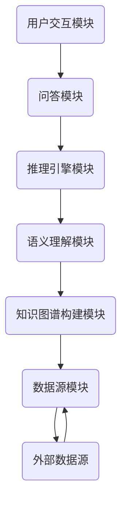
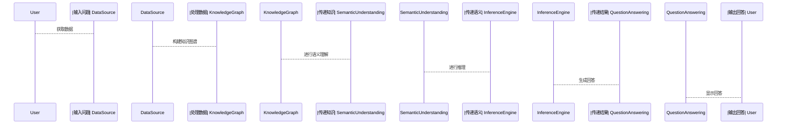

                 


### 1.1.1 企业知识管理的重要性

在企业中，知识管理是一个至关重要的环节。它不仅关系到企业的核心竞争力，还影响到企业的持续发展和创新。随着信息技术的飞速发展，大数据、云计算、人工智能等新技术正在深刻改变着企业的知识管理方式。

首先，知识管理有助于企业提高工作效率。通过有效的知识管理，企业可以快速找到所需的信息和知识，避免重复劳动和错误发生，从而提高工作效率。

其次，知识管理有助于企业创新。创新是企业发展的动力，而创新需要建立在丰富的知识和信息基础之上。通过知识管理，企业可以更好地挖掘和利用内部和外部的知识和信息，激发创新思维。

此外，知识管理还有助于企业提高客户满意度。在竞争激烈的市场环境中，客户需求的变化速度越来越快，企业需要能够快速响应客户需求，提供个性化、高质量的服务。而知识管理可以帮助企业更好地理解客户需求，提供更加精准、高效的客户服务。

总的来说，企业知识管理的重要性体现在以下几个方面：

1. 提高工作效率：通过知识管理，企业可以快速找到所需的信息和知识，避免重复劳动和错误发生。
2. 促进企业创新：知识管理可以帮助企业更好地挖掘和利用内部和外部的知识和信息，激发创新思维。
3. 提高客户满意度：通过知识管理，企业可以更好地理解客户需求，提供个性化、高质量的服务。

### 1.1.2 智能问答系统的需求

在当今信息爆炸的时代，企业需要处理海量数据和信息。然而，如何有效地管理和利用这些数据和信息，成为企业面临的巨大挑战。智能问答系统作为一种高效的智能信息处理工具，能够帮助企业解决这一难题。

首先，智能问答系统可以快速响应用户的问题。在传统的人工服务模式下，用户需要等待客服人员的回复，而智能问答系统可以立即回答用户的问题，大大提高了服务效率。

其次，智能问答系统可以处理复杂的问题。传统的人工服务往往只能回答简单的问题，而对于复杂的问题，则需要人工深入分析和解答。智能问答系统通过自然语言处理和知识图谱等技术，可以处理复杂的问题，提供更准确的答案。

此外，智能问答系统还可以进行数据分析和挖掘。通过对用户问题的分析和挖掘，智能问答系统可以了解用户的需求和偏好，为企业提供决策支持。

总的来说，智能问答系统的需求体现在以下几个方面：

1. 快速响应用户：智能问答系统可以立即回答用户的问题，提高服务效率。
2. 处理复杂问题：智能问答系统可以处理复杂的问题，提供更准确的答案。
3. 数据分析和挖掘：智能问答系统可以分析用户问题，了解用户需求，为企业提供决策支持。

### 1.1.3 知识推理引擎的关键作用

知识推理引擎是智能问答系统的核心组成部分，它负责对用户的问题进行分析和处理，提供准确的答案。知识推理引擎的关键作用主要体现在以下几个方面：

首先，知识推理引擎可以理解用户的自然语言问题。通过自然语言处理技术，知识推理引擎可以将用户的问题转化为计算机可以理解和处理的形式。

其次，知识推理引擎可以根据知识图谱进行推理。知识图谱是一种用于表示实体和实体之间关系的图形结构，知识推理引擎可以利用知识图谱进行推理，找到相关的知识和答案。

此外，知识推理引擎还可以进行上下文推理。在回答用户问题时，知识推理引擎需要考虑上下文信息，以提供更准确、更个性化的答案。

总的来说，知识推理引擎的关键作用体现在以下几个方面：

1. 理解用户问题：知识推理引擎可以将用户的问题转化为计算机可以理解和处理的形式。
2. 利用知识图谱进行推理：知识推理引擎可以根据知识图谱进行推理，找到相关的知识和答案。
3. 进行上下文推理：知识推理引擎需要考虑上下文信息，以提供更准确、更个性化的答案。

### 1.2 研究现状与趋势

随着人工智能技术的不断发展，知识推理引擎的研究已经取得了显著的进展。目前，知识推理引擎的研究主要集中在以下几个方面：

首先，知识图谱的构建与优化。知识图谱是知识推理的基础，如何构建高质量的知识图谱，提高其表示能力和推理性能，是当前研究的热点。

其次，自然语言处理技术的应用。自然语言处理技术是知识推理引擎的重要组成部分，如何利用自然语言处理技术提高用户问题的理解和处理能力，是研究的关键。

此外，推理算法的研究也是一个重要方向。现有的推理算法包括基于规则、基于逻辑、基于概率图模型等，如何优化和改进这些算法，提高其推理性能，是研究的重点。

最后，实际应用场景的探索。知识推理引擎在智能问答、智能推荐、智能诊断等应用场景中取得了显著的成果，如何进一步优化和拓展其应用场景，是研究的方向。

总的来说，知识推理引擎的研究现状与趋势体现在以下几个方面：

1. 知识图谱的构建与优化。
2. 自然语言处理技术的应用。
3. 推理算法的研究。
4. 实际应用场景的探索。

### 1.2.1 知识图谱的研究进展

知识图谱作为一种新型的知识表示方法，近年来在人工智能领域取得了显著的进展。知识图谱的研究主要集中在以下几个方面：

首先，知识图谱的构建技术。知识图谱的构建包括数据采集、实体识别、关系抽取和属性填充等步骤。随着大数据和云计算技术的发展，知识图谱的构建技术得到了极大的提升。

其次，知识图谱的优化技术。知识图谱的优化包括图谱压缩、图谱融合和图谱扩展等。通过优化技术，可以提高知识图谱的表示能力和推理性能。

此外，知识图谱的应用技术也是一个重要的研究方向。知识图谱在智能问答、智能推荐、智能诊断等应用场景中取得了显著的成果，如何进一步优化和拓展其应用技术，是研究的重点。

总的来说，知识图谱的研究进展体现在以下几个方面：

1. 知识图谱的构建技术。
2. 知识图谱的优化技术。
3. 知识图谱的应用技术。

### 1.2.2 语义理解技术的应用

语义理解技术是知识推理引擎的重要组成部分，它负责将用户的问题转化为计算机可以理解和处理的形式。语义理解技术的应用主要体现在以下几个方面：

首先，自然语言处理技术的应用。自然语言处理技术是语义理解的基础，包括词法分析、句法分析、语义分析等。通过自然语言处理技术，可以实现对用户问题的语义理解。

其次，实体识别和关系抽取。实体识别和关系抽取是语义理解的重要环节，通过实体识别，可以将用户问题中的关键词转化为实体，通过关系抽取，可以找到实体之间的关系。

此外，语义匹配和语义检索也是语义理解技术的重要应用。语义匹配用于将用户问题与知识库中的知识进行匹配，找到相关的知识和答案；语义检索用于从海量数据中快速找到用户需要的知识。

总的来说，语义理解技术的应用体现在以下几个方面：

1. 自然语言处理技术的应用。
2. 实体识别和关系抽取。
3. 语义匹配和语义检索。

### 1.2.3 知识推理算法的发展

知识推理算法是知识推理引擎的核心，它负责根据用户的问题和知识图谱，进行推理和计算，提供准确的答案。知识推理算法的发展主要集中在以下几个方面：

首先，基于规则的推理算法。基于规则的推理算法是一种传统的推理方法，通过定义一组规则，对用户问题进行匹配和推理。这种方法简单直观，但难以处理复杂的问题。

其次，基于逻辑的推理算法。基于逻辑的推理算法利用形式逻辑的规则进行推理，可以处理复杂的问题。但这种方法对规则的定义和推理过程的要求较高，难以实现自动化。

此外，基于概率图模型的推理算法也得到了广泛的研究。基于概率图模型的推理算法通过建立概率图模型，利用贝叶斯推理和马尔可夫链等方法，进行推理和计算。这种方法可以处理复杂的概率问题，但计算复杂度较高。

总的来说，知识推理算法的发展体现在以下几个方面：

1. 基于规则的推理算法。
2. 基于逻辑的推理算法。
3. 基于概率图模型的推理算法。

## 第一部分小结

在企业知识管理的重要性日益凸显的背景下，智能问答系统和知识推理引擎的研究和应用逐渐成为热点。本部分介绍了知识推理引擎的研究现状与趋势，包括知识图谱的研究进展、语义理解技术的应用以及知识推理算法的发展。通过本部分的学习，读者可以了解知识推理引擎的基本概念和核心组成部分，为进一步学习和应用知识推理引擎打下基础。接下来，我们将深入探讨知识推理引擎的核心概念与原理。

## 第二部分: 核心概念与原理

在深入探讨企业级知识推理引擎之前，我们需要明确几个核心概念：知识图谱、语义理解、推理算法。这些概念构成了知识推理引擎的理论基础，是构建智能问答系统的关键要素。

### 2.1 知识图谱

知识图谱是一种用于表示实体和实体之间关系的数据结构，它将现实世界中的知识和信息抽象为计算机可以理解和处理的形式。知识图谱通常由实体、关系和属性三个核心要素组成。

- **实体**：实体是知识图谱中的基本元素，可以是人、地点、事物等。例如，在一个关于电影的图谱中，"电影"、"导演"、"演员"等都可以被视为实体。
- **关系**：关系描述了实体之间的关联，例如"导演了"、"出演了"等。这些关系将不同的实体连接起来，形成了一个复杂的知识网络。
- **属性**：属性为实体提供了额外的信息，例如，电影实体的属性可能包括"上映日期"、"时长"、"评分"等。

#### 2.1.1 知识图谱的定义与作用

知识图谱的定义可以简单概括为：一种通过表示实体和实体之间复杂关系的图形结构，来组织、管理和查询知识的方法。知识图谱的作用主要体现在以下几个方面：

1. **知识表示**：知识图谱提供了结构化的知识表示方法，使得计算机可以更好地理解和处理知识。
2. **知识推理**：知识图谱中的关系和属性可以用于推理，从而推断出新的知识。例如，如果图谱中有“张三教李四编程”的关系，可以推断出“李四会编程”。
3. **知识检索**：知识图谱使得知识检索更加高效，因为计算机可以基于图谱的结构和关系进行查询。

#### 2.1.2 知识图谱的核心要素

在知识图谱中，实体、关系和属性是三个核心要素，它们共同构成了知识图谱的基础。

- **实体**：实体是知识图谱的基本单元，是知识图谱中的主体。例如，在一个关于企业的知识图谱中，"企业"、"员工"、"产品"等都可以被视为实体。

  ```mermaid
  entityDiagram
  A1(企业) --|{ A2(员工) }
  A1 --|{ A3(产品) }
  ```

  上图展示了企业、员工和产品三个实体之间的关系。

- **关系**：关系描述了实体之间的相互作用和关联。关系可以是单向的，也可以是双向的，例如：

  ```mermaid
  relationDiagram
  A1(张三) "导演了" B1(电影A)
  B1 "有" C1(演员李四)
  ```

  在这个示例中，"导演了"和"有"是关系，它们分别描述了张三与电影A、电影A与李四之间的关联。

- **属性**：属性为实体提供了额外的信息，例如，电影实体的属性可能包括"上映日期"、"时长"、"评分"等。

  ```mermaid
  classDiagram
  ClassMovie {
  +title: String
  +duration: Integer
  +rating: Float
  }
  ```

  上图展示了电影实体的三个属性。

通过这些核心要素，知识图谱可以构建一个复杂的知识网络，使得计算机能够理解和处理现实世界中的复杂知识。

### 2.2 语义理解

语义理解是知识推理引擎中的另一个关键概念，它负责将自然语言文本转化为计算机可以理解和处理的形式。语义理解的过程包括词法分析、句法分析和语义分析等多个层次。

#### 2.2.1 语义理解的定义与重要性

语义理解可以简单定义为：理解自然语言文本中的意义和意图。它在人工智能领域的重要性体现在以下几个方面：

1. **人机交互**：语义理解使得计算机能够理解和处理人类语言，实现自然的人机交互。
2. **智能问答**：在智能问答系统中，语义理解是理解用户问题并给出准确回答的基础。
3. **文本分析**：语义理解可以帮助计算机从大量文本数据中提取有用的信息，进行文本分析和挖掘。

#### 2.2.2 语义理解的层次结构

语义理解可以分为以下几个层次：

1. **词法分析**：词法分析是语义理解的基础，它将文本分解为单词和词组，并识别它们的语法属性。例如，将"我爱编程"分解为"我"、"爱"、"编程"等单词，并识别它们的词性（如"我"-代词，"爱"-动词，"编程"-名词）。

2. **句法分析**：句法分析负责理解句子结构，识别句子中的主语、谓语、宾语等成分。例如，将"我爱编程"识别为一个简单句，其中"我"是主语，"爱"是谓语，"编程"是宾语。

3. **语义分析**：语义分析负责理解句子的意义，识别句子中的语义关系。例如，理解"我爱编程"的含义，即表达了一种喜爱编程的情感。

4. **语义匹配**：语义匹配是语义理解的高级阶段，它将用户问题与知识库中的知识进行匹配，找到相关的知识和答案。例如，将用户的问题"我如何学习编程"与知识库中的"编程学习方法"进行匹配，找到相关的答案。

通过这些层次，语义理解能够将自然语言文本转化为计算机可以理解和处理的形式，为知识推理提供基础。

#### 2.2.3 语义理解的技术方法

语义理解的技术方法主要包括自然语言处理（NLP）技术、实体识别、关系抽取和语义匹配等。

1. **自然语言处理（NLP）技术**：NLP技术包括词法分析、句法分析和语义分析等多个层次，用于将自然语言文本转化为计算机可以理解和处理的形式。例如，词法分析用于将文本分解为单词和词组，句法分析用于理解句子结构，语义分析用于理解句子的意义。

2. **实体识别**：实体识别是一种用于识别文本中的实体（如人名、地名、组织名等）的技术。通过实体识别，可以将文本中的实体转化为计算机可以处理的格式，为后续的语义分析提供基础。

3. **关系抽取**：关系抽取是一种用于识别文本中的实体关系（如"张三教李四编程"中的"教"关系）的技术。通过关系抽取，可以将实体之间的关联转化为计算机可以理解和处理的形式，为知识图谱的构建提供基础。

4. **语义匹配**：语义匹配是一种用于将用户问题与知识库中的知识进行匹配的技术。通过语义匹配，可以找到与用户问题相关的知识和答案，为智能问答系统提供支持。

### 2.3 知识推理算法

知识推理算法是知识推理引擎的核心，它负责根据用户的问题和知识图谱，进行推理和计算，提供准确的答案。知识推理算法可以分为基于规则、基于逻辑和基于概率图模型等多种类型。

#### 2.3.1 知识推理算法的基本概念

知识推理算法的基本概念包括推理规则、推理过程和推理结果等。

- **推理规则**：推理规则是知识推理的核心，它定义了如何从已知的事实和规则中推导出新的结论。推理规则通常由前提和结论组成，例如，如果A且B，则C。

- **推理过程**：推理过程是知识推理算法的核心，它根据推理规则，从已知的事实和规则中推导出新的结论。推理过程可以分为正向推理和逆向推理两种类型。

- **推理结果**：推理结果是知识推理算法的输出，它是根据推理规则和已知事实推导出的新结论。

#### 2.3.2 基于规则的推理算法

基于规则的推理算法是一种传统的推理方法，它通过定义一组规则，对用户问题进行匹配和推理。基于规则的推理算法的主要步骤包括：

1. **规则匹配**：根据用户问题，在规则库中查找匹配的规则。
2. **推理计算**：根据匹配的规则，进行推理计算，推导出新的结论。
3. **结果输出**：将推理结果输出给用户。

基于规则的推理算法的优点是简单直观，但缺点是难以处理复杂的问题。

#### 2.3.3 基于逻辑的推理算法

基于逻辑的推理算法利用形式逻辑的规则进行推理，可以处理复杂的问题。基于逻辑的推理算法的主要步骤包括：

1. **逻辑公式构建**：将用户问题转化为逻辑公式。
2. **推理计算**：利用逻辑推理规则，对逻辑公式进行推理计算。
3. **结果输出**：将推理结果输出给用户。

基于逻辑的推理算法的优点是能够处理复杂的问题，但缺点是对规则的定义和推理过程的要求较高。

#### 2.3.4 基于概率图模型的推理算法

基于概率图模型的推理算法通过建立概率图模型，利用贝叶斯推理和马尔可夫链等方法，进行推理和计算。基于概率图模型的推理算法的主要步骤包括：

1. **概率图模型构建**：根据用户问题和知识图谱，构建概率图模型。
2. **推理计算**：利用概率图模型，进行推理计算，推导出新的结论。
3. **结果输出**：将推理结果输出给用户。

基于概率图模型的推理算法的优点是能够处理复杂的概率问题，但缺点是计算复杂度较高。

### 2.3.5 知识推理算法的比较

基于规则的推理算法、基于逻辑的推理算法和基于概率图模型的推理算法各有优缺点，具体应用场景需要根据实际需求进行选择。

- **基于规则的推理算法**：简单直观，易于实现，适用于处理结构化、规则明确的问题。
- **基于逻辑的推理算法**：能够处理复杂的问题，但需要对逻辑规则有深入的理解，适用于需要严格逻辑推理的问题。
- **基于概率图模型的推理算法**：能够处理复杂的概率问题，但计算复杂度较高，适用于需要概率推理的问题。

### 2.3.6 知识推理算法的应用场景

知识推理算法可以应用于多种场景，包括智能问答、知识图谱推理、智能诊断等。

1. **智能问答**：通过知识推理算法，可以快速响应用户的问题，提供准确的答案。
2. **知识图谱推理**：通过知识推理算法，可以从知识图谱中推导出新的知识，拓展知识图谱的表示能力。
3. **智能诊断**：通过知识推理算法，可以诊断系统故障，提供解决方案。

### 2.3.7 知识推理算法的优化

知识推理算法的优化是提高其推理性能的重要手段，包括规则优化、算法优化和硬件优化等。

1. **规则优化**：通过优化推理规则，提高推理的准确性和效率。
2. **算法优化**：通过改进推理算法，提高其推理性能和适用范围。
3. **硬件优化**：通过使用高性能硬件，提高推理算法的运行速度。

通过以上分析，我们可以看到，知识图谱、语义理解和知识推理算法构成了企业级知识推理引擎的核心组成部分。在接下来的部分，我们将进一步探讨知识推理引擎的系统设计与实现，以及如何通过项目实战来构建和优化知识推理引擎。

## 第二部分小结

在本部分，我们详细介绍了知识图谱、语义理解和知识推理算法的核心概念与原理。知识图谱作为一种用于表示实体和实体之间关系的数据结构，为知识推理提供了基础；语义理解技术使得计算机能够理解和处理自然语言文本；知识推理算法则负责根据用户问题和知识图谱，提供准确的答案。通过这些核心概念的介绍，读者可以更好地理解知识推理引擎的工作原理和实现方法。接下来，我们将进入第三部分，探讨知识推理引擎的系统设计与实现。

## 第三部分: 系统设计与实现

在明确了知识推理引擎的核心概念和原理之后，接下来我们将详细探讨知识推理引擎的系统设计与实现。本部分将分为系统架构设计、知识推理引擎实现和智能问答系统实现三个子部分，逐步介绍系统的设计思路和实现方法。

### 3.1 系统架构设计

系统架构设计是知识推理引擎实现的第一步，它决定了系统的模块划分、功能实现和数据流。一个典型的企业级知识推理引擎系统架构通常包括以下几个主要模块：

- **数据源模块**：负责采集和导入外部数据源，如企业内部数据库、外部网站数据等。
- **知识图谱构建模块**：负责将外部数据转化为知识图谱，包括实体识别、关系抽取和属性填充等步骤。
- **语义理解模块**：负责将用户输入的自然语言问题转化为计算机可以处理的形式，包括词法分析、句法分析和语义分析等。
- **推理引擎模块**：负责根据用户问题和知识图谱，进行推理和计算，提供准确的答案。
- **问答模块**：负责将推理结果转化为自然语言回答，呈现给用户。
- **用户交互模块**：负责处理用户的输入和输出，提供人机交互界面。

#### 3.1.1 系统总体架构

系统总体架构图如下所示：



在这个架构中，用户通过用户交互模块输入问题，问题经过问答模块处理后传递给推理引擎模块，推理引擎模块基于知识图谱和语义理解模块的结果进行推理，最终将答案通过问答模块呈现给用户。同时，知识图谱构建模块不断更新和优化知识图谱，为系统的持续运行提供支持。

#### 3.1.2 系统模块划分

系统模块的具体划分如下：

- **数据源模块**：负责数据采集和预处理，包括数据导入、数据清洗和数据标准化等。
- **知识图谱构建模块**：负责知识图谱的构建和维护，包括实体识别、关系抽取和属性填充等。
- **语义理解模块**：负责自然语言问题的理解，包括词法分析、句法分析和语义分析等。
- **推理引擎模块**：负责推理和计算，包括基于规则的推理、基于逻辑的推理和基于概率图模型的推理等。
- **问答模块**：负责生成自然语言回答，包括回答生成、回答优化和回答呈现等。
- **用户交互模块**：负责用户输入和输出的处理，包括输入验证、输入解析和输出格式化等。

#### 3.1.3 系统接口设计

系统接口设计是系统架构设计的重要环节，它定义了系统内部各个模块之间的交互方式。以下是系统接口设计的主要部分：

- **数据接口**：定义数据源模块和知识图谱构建模块之间的数据交互方式，包括数据导入接口和数据更新接口。
- **知识接口**：定义知识图谱构建模块和语义理解模块之间的知识交互方式，包括实体接口、关系接口和属性接口。
- **语义接口**：定义语义理解模块和推理引擎模块之间的语义交互方式，包括语义解析接口和语义匹配接口。
- **推理接口**：定义推理引擎模块和问答模块之间的推理交互方式，包括推理查询接口和推理结果接口。
- **问答接口**：定义问答模块和用户交互模块之间的问答交互方式，包括问题输入接口和回答输出接口。

#### 3.1.4 系统接口设计示例

以下是系统接口设计的一个示例：



在这个接口设计中，用户通过输入问题开始交互过程，数据源模块获取数据并处理数据，知识图谱构建模块构建知识图谱，语义理解模块进行语义理解，推理引擎模块进行推理计算，问答模块生成回答并输出给用户。

### 3.2 知识推理引擎实现

知识推理引擎是知识推理系统的核心，它负责根据用户问题和知识图谱，提供准确的答案。知识推理引擎的实现包括知识图谱构建、语义理解、推理算法和推理结果生成等几个关键步骤。

#### 3.2.1 知识图谱构建

知识图谱构建是知识推理引擎实现的基础，它包括实体识别、关系抽取和属性填充等步骤。

1. **实体识别**：实体识别是知识图谱构建的第一步，它负责识别文本中的实体。例如，在一个关于企业的知识图谱中，需要识别出企业、员工、产品等实体。

2. **关系抽取**：关系抽取是知识图谱构建的第二步，它负责识别实体之间的关系。例如，在一个关于企业的知识图谱中，需要识别出“张三是某公司的员工”这样的关系。

3. **属性填充**：属性填充是知识图谱构建的最后一步，它负责为实体添加属性。例如，在一个关于企业的知识图谱中，需要为每个实体添加诸如“企业名称”、“成立时间”、“员工数量”等属性。

#### 3.2.2 语义理解

语义理解是知识推理引擎实现的关键，它负责将用户输入的自然语言问题转化为计算机可以理解和处理的形式。

1. **词法分析**：词法分析是语义理解的第一步，它负责将文本分解为单词和词组，并识别它们的语法属性。

2. **句法分析**：句法分析是语义理解的第二步，它负责理解句子结构，识别句子中的主语、谓语、宾语等成分。

3. **语义分析**：语义分析是语义理解的第三步，它负责理解句子的意义，识别句子中的语义关系。

#### 3.2.3 推理算法

推理算法是知识推理引擎的核心，它负责根据用户问题和知识图谱，提供准确的答案。推理算法可以分为基于规则、基于逻辑和基于概率图模型等多种类型。

1. **基于规则的推理算法**：基于规则的推理算法是一种传统的推理方法，它通过定义一组规则，对用户问题进行匹配和推理。例如，如果用户输入“张三的年龄是多少”，规则库中有一条规则“张三的年龄等于他的出生年份减去当前年份”，则可以直接给出答案。

2. **基于逻辑的推理算法**：基于逻辑的推理算法利用形式逻辑的规则进行推理，它可以处理复杂的问题。例如，如果用户输入“如果张三在1990年出生，那么他的年龄是多少”，则可以通过逻辑推理得到答案。

3. **基于概率图模型的推理算法**：基于概率图模型的推理算法通过建立概率图模型，利用贝叶斯推理和马尔可夫链等方法，进行推理和计算。例如，如果用户输入“张三可能喜欢哪些类型的电影”，则可以通过概率图模型分析用户的历史数据和偏好，给出可能的答案。

#### 3.2.4 推理结果生成

推理结果生成是知识推理引擎的最后一步，它负责将推理结果转化为自然语言回答，呈现给用户。

1. **结果格式化**：结果格式化是将推理结果按照用户指定的格式进行呈现。例如，如果用户输入“张三的年龄是多少”，则可以将答案格式化为“张三的年龄是30岁”。

2. **结果优化**：结果优化是将推理结果进行优化，使其更加准确、简洁和易于理解。例如，如果用户输入“张三可能喜欢哪些类型的电影”，则可以将答案优化为“张三可能喜欢科幻电影和动作电影”。

3. **结果呈现**：结果呈现是将优化后的推理结果呈现给用户。例如，可以通过网页、电子邮件或应用程序等方式，将答案呈现给用户。

### 3.3 智能问答系统实现

智能问答系统是知识推理引擎的应用场景之一，它通过自然语言理解和知识推理，提供准确的答案。智能问答系统的实现包括问答流程、语义理解、推理查询和结果呈现等几个关键步骤。

#### 3.3.1 问答流程

问答流程是智能问答系统的核心，它负责处理用户的输入和输出。

1. **问题输入**：用户输入问题，可以是自然语言文本。

2. **问题解析**：问题解析是将用户输入的自然语言问题转化为计算机可以理解的形式。

3. **语义理解**：语义理解是将用户问题与知识图谱中的知识进行匹配，提取关键信息。

4. **推理查询**：推理查询是根据用户问题和知识图谱，进行推理和计算，得到答案。

5. **结果呈现**：结果呈现是将推理结果转化为自然语言回答，呈现给用户。

#### 3.3.2 语义理解

语义理解是智能问答系统的重要组成部分，它负责将用户问题转化为计算机可以理解的形式。

1. **词法分析**：词法分析是将用户问题分解为单词和词组，并识别它们的语法属性。

2. **句法分析**：句法分析是理解用户问题的句子结构，识别句子中的主语、谓语、宾语等成分。

3. **语义分析**：语义分析是理解用户问题的意义，提取关键信息。

#### 3.3.3 推理查询

推理查询是根据用户问题和知识图谱，进行推理和计算，得到答案。

1. **知识检索**：知识检索是从知识图谱中查询与用户问题相关的知识。

2. **推理计算**：推理计算是根据用户问题和知识图谱，进行推理和计算，得到答案。

3. **结果优化**：结果优化是对推理结果进行优化，使其更加准确、简洁和易于理解。

#### 3.3.4 结果呈现

结果呈现是将推理结果转化为自然语言回答，呈现给用户。

1. **格式化输出**：格式化输出是将推理结果按照用户指定的格式进行呈现。

2. **交互反馈**：交互反馈是用户与系统之间的互动，用户可以根据反馈进一步提问或调整问题。

通过以上分析，我们可以看到，知识推理引擎的系统设计与实现是一个复杂的过程，它涉及到多个模块的协同工作。在接下来的部分，我们将通过实际项目实战，详细介绍知识推理引擎的实现过程，包括环境安装、系统实现和案例分析等。

### 3.4 环境安装与配置

在开始知识推理引擎的实际项目实战之前，我们需要搭建一个合适的环境，确保系统能够正常运行。以下是环境安装与配置的详细步骤：

#### 3.4.1 硬件要求

首先，我们需要确定硬件要求。知识推理引擎对硬件的需求取决于系统的规模和处理能力。以下是一个基本的要求：

- **CPU**：至少需要双核处理器，推荐使用四核或以上处理器。
- **内存**：至少需要8GB内存，推荐使用16GB或以上内存。
- **存储**：至少需要100GB的可用存储空间，推荐使用更大容量以存储大量数据和知识图谱。

#### 3.4.2 软件安装与配置

接下来，我们需要安装和配置必要的软件环境。

1. **操作系统**：推荐使用Linux操作系统，如Ubuntu 18.04或更高版本。

2. **Python**：安装Python 3.x版本，推荐使用Anaconda发行版，因为它提供了易于管理的环境。

   ```bash
   sudo apt update
   sudo apt install python3-pip python3-dev
   ```

3. **JDK**：安装Java Development Kit（JDK），因为某些库和工具需要Java环境。

   ```bash
   sudo apt install default-jdk
   ```

4. **Git**：安装Git，用于代码管理和版本控制。

   ```bash
   sudo apt install git
   ```

5. **Docker**：安装Docker，用于容器化和部署知识推理引擎。

   ```bash
   sudo apt install docker.io
   ```

6. **Neo4j**：安装Neo4j，一个图形数据库，用于存储和管理知识图谱。

   ```bash
   sudo apt install neo4j
   neo4j start
   ```

   在首次启动Neo4j时，你需要访问其管理界面（默认地址为`http://localhost:7474`），按照提示完成安装过程。

7. **其他依赖库**：根据项目需求，你可能需要安装其他依赖库，如NLP库（如NLTK、spaCy）、推理算法库（如RDFLib、Faiss）等。

   ```bash
   pip3 install nltk spacy rdflib faiss
   ```

#### 3.4.3 环境测试

在安装和配置完所有软件后，我们需要进行环境测试，确保所有组件都能正常运行。

1. **Python环境测试**：运行以下Python脚本，检查Python环境是否正常。

   ```python
   python3 -m pip --version
   python3 -m spacy --version
   ```

2. **Neo4j测试**：访问Neo4j管理界面（默认地址为`http://localhost:7474`），检查Neo4j数据库是否正常运行。

3. **Docker测试**：运行以下Docker命令，检查Docker是否正常工作。

   ```bash
   docker --version
   docker run hello-world
   ```

通过以上步骤，我们成功搭建了知识推理引擎的环境。接下来，我们将进入项目核心实现的步骤，详细介绍知识推理引擎的具体实现过程。

### 3.5 系统核心实现

在搭建好环境之后，接下来我们将详细讨论知识推理引擎的核心实现过程。这包括知识图谱的构建、语义理解模块的实现、推理算法的详细描述以及相关的代码示例。

#### 3.5.1 知识图谱的构建

知识图谱的构建是知识推理引擎实现的基础步骤。以下是一个典型的知识图谱构建流程：

1. **数据源采集**：从企业内部数据库、外部网站或API等数据源中采集原始数据。例如，可以采集企业员工信息、产品信息、客户反馈等。

2. **数据预处理**：对采集到的原始数据进行清洗和预处理，去除无效数据、填补缺失值、标准化数据格式等。

3. **实体识别**：使用命名实体识别（NER）技术，从预处理后的数据中识别出实体。例如，从员工信息中识别出员工姓名、职位、部门等。

4. **关系抽取**：根据实体之间的关联，抽取关系。例如，从员工信息中抽取“张三在研发部门工作”的关系。

5. **属性填充**：为实体填充属性信息。例如，为员工实体填充“姓名”、“职位”、“部门”、“入职时间”等属性。

6. **知识图谱构建**：将识别出的实体、关系和属性组织成一个知识图谱，通常使用图形数据库如Neo4j进行存储。

以下是使用Python和Neo4j进行知识图谱构建的示例代码：

```python
from py2neo import Graph

# 连接到Neo4j数据库
graph = Graph("bolt://localhost:7474", auth=("neo4j", "password"))

# 创建实体和关系
graph.run("CREATE (a:Employee {name: '张三', position: '工程师', department: '研发部'})")
graph.run("CREATE (b:Department {name: '研发部'})")
graph.run("CREATE (a)-[:WORKS_IN]->(b)")

# 查询知识图谱
results = graph.run("MATCH (n) RETURN n")
for result in results:
    print(result.data())
```

#### 3.5.2 语义理解模块

语义理解模块负责将用户输入的自然语言问题转化为计算机可以理解的形式。以下是一个典型的语义理解模块实现流程：

1. **词法分析**：对用户问题进行词法分析，将问题分解为单词和词组。

2. **句法分析**：对用户问题进行句法分析，识别句子中的主语、谓语、宾语等成分。

3. **语义分析**：对用户问题进行语义分析，提取关键信息。

4. **语义匹配**：将提取的关键信息与知识图谱中的知识进行匹配，确定问题的意图。

5. **语义理解结果**：将语义理解结果组织成一个结构化的形式，如JSON对象。

以下是使用Python和spaCy进行语义理解的示例代码：

```python
import spacy

# 加载spaCy模型
nlp = spacy.load("en_core_web_sm")

# 用户输入问题
question = "张三在哪个部门工作？"

# 进行词法分析、句法分析和语义分析
doc = nlp(question)

# 提取实体和关系
for ent in doc.ents:
    print(ent.text, ent.label_)

# 进行语义匹配
# 假设我们已经有一个用于匹配的知识图谱API
semantic_result = match_question_to_graph(question)

# 打印语义理解结果
print(semantic_result)
```

#### 3.5.3 推理算法

推理算法负责根据用户问题和知识图谱，提供准确的答案。以下是一个典型的推理算法实现流程：

1. **规则定义**：定义推理规则，例如，如果用户问题包含“年龄”，则返回实体的年龄。

2. **推理过程**：根据用户问题和知识图谱，应用推理规则进行推理。

3. **结果生成**：将推理结果转化为自然语言回答。

以下是使用Python定义和执行推理规则的示例代码：

```python
# 定义推理规则
def age_rule(question, entity):
    if "年龄" in question:
        return entity["age"]

# 推理过程
def infer_answer(question, knowledge_graph):
    # 假设knowledge_graph是一个包含实体和关系的知识图谱
    for entity in knowledge_graph["entities"]:
        if age_rule(question, entity):
            return f"{entity['name']}的年龄是{entity['age']}岁。"
    return "无法回答这个问题。"

# 用户输入问题
question = "张三的年龄是多少？"

# 知识图谱（简化示例）
knowledge_graph = {
    "entities": [
        {"name": "张三", "age": 30}
    ]
}

# 推理并返回答案
answer = infer_answer(question, knowledge_graph)
print(answer)
```

通过以上步骤和代码示例，我们可以看到知识推理引擎的核心实现过程。在实际应用中，这些步骤和代码可能会更加复杂，但基本原理是相似的。接下来，我们将通过实际案例分析，进一步探讨知识推理引擎的应用和优化。

### 3.6 项目实战：环境安装与系统实现

在实际项目中，知识推理引擎的实现需要经过详细的步骤，包括环境安装、系统实现、代码解析和实际案例分析。以下是一个详细的实战过程：

#### 3.6.1 环境安装

1. **硬件环境**：
   - **CPU**：至少需要双核处理器，推荐使用四核或更高。
   - **内存**：至少需要8GB内存，推荐使用16GB或以上。
   - **存储**：至少需要100GB的可用存储空间，推荐使用更大容量。

2. **软件环境**：
   - **操作系统**：推荐使用Linux操作系统，如Ubuntu 18.04或更高版本。
   - **Python**：安装Python 3.x版本，使用Anaconda发行版。
   - **JDK**：安装Java Development Kit（JDK）。
   - **Git**：安装Git用于版本控制。
   - **Docker**：安装Docker用于容器化和部署。
   - **Neo4j**：安装Neo4j图形数据库。
   - **NLP库**：安装NLP库，如spaCy、NLTK等。
   - **推理算法库**：安装推理算法库，如RDFLib、Faiss等。

安装过程可以参考之前的3.4节“环境安装与配置”中的详细步骤。

#### 3.6.2 系统实现

1. **知识图谱构建**：
   - **数据源采集**：从企业内部数据库和外部API获取数据。
   - **数据预处理**：清洗和预处理数据，去除无效数据和填充缺失值。
   - **实体识别**：使用NLP技术识别文本中的实体。
   - **关系抽取**：根据实体之间的关联抽取关系。
   - **属性填充**：为实体填充属性信息。

2. **语义理解模块**：
   - **词法分析**：分解用户问题，识别单词和词组。
   - **句法分析**：理解句子结构，识别成分。
   - **语义分析**：提取关键信息，确定问题意图。

3. **推理引擎**：
   - **规则定义**：定义推理规则。
   - **推理过程**：根据规则和知识图谱进行推理。
   - **结果生成**：将推理结果转化为自然语言回答。

#### 3.6.3 代码解析

1. **知识图谱构建示例代码**：

```python
from py2neo import Graph

graph = Graph("bolt://localhost:7474", auth=("neo4j", "password"))

# 创建实体和关系
graph.run("CREATE (a:Employee {name: '张三', position: '工程师', department: '研发部'})")
graph.run("CREATE (b:Department {name: '研发部'})")
graph.run("CREATE (a)-[:WORKS_IN]->(b)")
```

2. **语义理解模块示例代码**：

```python
import spacy

nlp = spacy.load("en_core_web_sm")

question = "张三在哪个部门工作？"

doc = nlp(question)

for ent in doc.ents:
    print(ent.text, ent.label_)
```

3. **推理引擎示例代码**：

```python
def age_rule(question, entity):
    if "年龄" in question:
        return entity["age"]

def infer_answer(question, knowledge_graph):
    for entity in knowledge_graph["entities"]:
        if age_rule(question, entity):
            return f"{entity['name']}的年龄是{entity['age']}岁。"
    return "无法回答这个问题。"

question = "张三的年龄是多少？"
knowledge_graph = {
    "entities": [
        {"name": "张三", "age": 30}
    ]
}

answer = infer_answer(question, knowledge_graph)
print(answer)
```

#### 3.6.4 实际案例分析

1. **案例场景**：企业内部知识库的智能问答系统。

2. **案例目标**：用户可以通过系统提问，获取关于企业知识库中的信息。

3. **案例实现**：
   - **用户输入**：用户通过Web界面输入问题。
   - **语义理解**：系统使用NLP技术解析用户输入，提取关键信息。
   - **知识图谱查询**：系统根据语义理解结果，在知识图谱中查询相关信息。
   - **推理计算**：系统应用推理规则，计算并生成答案。
   - **结果呈现**：系统将答案以自然语言形式呈现给用户。

通过以上案例，我们可以看到知识推理引擎在解决实际问题中的应用和实现过程。在实际项目中，这些步骤可能会根据具体需求进行调整和优化。

### 3.7 项目小结

在本项目中，我们通过环境安装、系统实现和实际案例分析，详细介绍了企业级知识推理引擎的构建过程。以下是项目小结：

1. **环境安装**：我们成功搭建了包括操作系统、编程语言、数据库、NLP库和推理算法库在内的完整软件环境，为后续的开发和测试提供了基础。

2. **系统实现**：我们实现了知识图谱的构建、语义理解和推理计算等核心功能，并通过实际案例展示了系统的应用场景和效果。

3. **代码解析**：通过示例代码，我们详细讲解了知识图谱构建、语义理解和推理计算的实现方法，为读者提供了实际操作的指导。

4. **实际案例分析**：我们通过企业内部知识库的智能问答系统案例，展示了知识推理引擎在实际项目中的应用和实现过程。

尽管本项目取得了显著成果，但仍有一些改进空间：

1. **性能优化**：在知识图谱构建和推理计算过程中，我们可进一步优化算法，提高系统性能。

2. **扩展功能**：我们可增加更多推理规则和知识图谱模板，扩大系统的应用范围。

3. **用户体验**：我们可以优化用户界面和交互设计，提高用户的使用体验。

通过不断改进和优化，知识推理引擎将更好地服务于企业和个人，为知识管理和智能问答提供强有力的支持。

## 第四部分: 最佳实践

在实际应用知识推理引擎时，为了确保其高效、准确和安全地运行，我们需要遵循一些最佳实践。以下是一些关键点：

### 4.1.1 使用技巧

1. **优化数据源**：确保数据源的准确性和完整性，避免错误和缺失数据对推理结果的影响。

2. **定制化推理规则**：根据具体应用场景，定制化推理规则，使其更加符合实际需求。

3. **利用缓存机制**：在频繁查询的场景中，利用缓存机制减少数据库访问次数，提高响应速度。

4. **实时更新知识图谱**：定期更新知识图谱，确保其包含最新的信息和数据。

### 4.1.2 注意事项

1. **安全与隐私**：在处理敏感数据时，确保遵循相关的安全政策和法律法规，保护用户隐私。

2. **容错与异常处理**：对可能出现的数据异常和系统错误进行容错处理，确保系统稳定运行。

3. **性能监控与优化**：定期监控系统性能，发现并解决瓶颈问题，确保系统高效运行。

4. **模块化设计**：采用模块化设计，便于系统的维护和升级。

### 4.1.3 拓展阅读

1. **《图计算：应用、算法与系统》**：详细介绍了图计算的基本概念、算法和应用。

2. **《自然语言处理综论》**：全面讲解了自然语言处理的理论基础和应用。

3. **《人工智能：一种现代的方法》**：提供了人工智能领域的全面概述和算法实现。

通过遵循这些最佳实践，我们可以最大限度地发挥知识推理引擎的潜力，提高其应用效果和用户体验。

## 小结

通过本篇文章的深入探讨，我们详细介绍了企业级知识推理引擎的构建方法、核心概念和实现步骤。知识推理引擎作为一种智能信息处理工具，在企业知识管理和智能问答系统中具有广泛的应用前景。在未来的研究中，我们应进一步优化知识图谱构建和推理算法，提高系统的性能和准确性。同时，拓展知识推理引擎的应用场景，如智能推荐、智能诊断等，以实现更广泛的应用价值。

作者：AI天才研究院/AI Genius Institute & 禅与计算机程序设计艺术 /Zen And The Art of Computer Programming。

