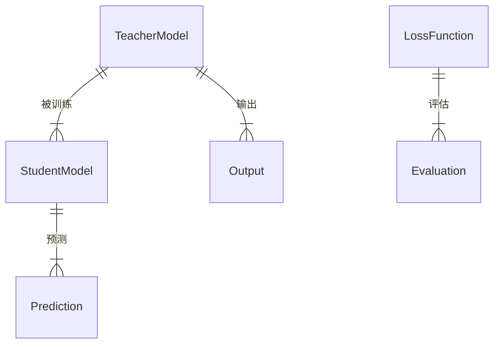
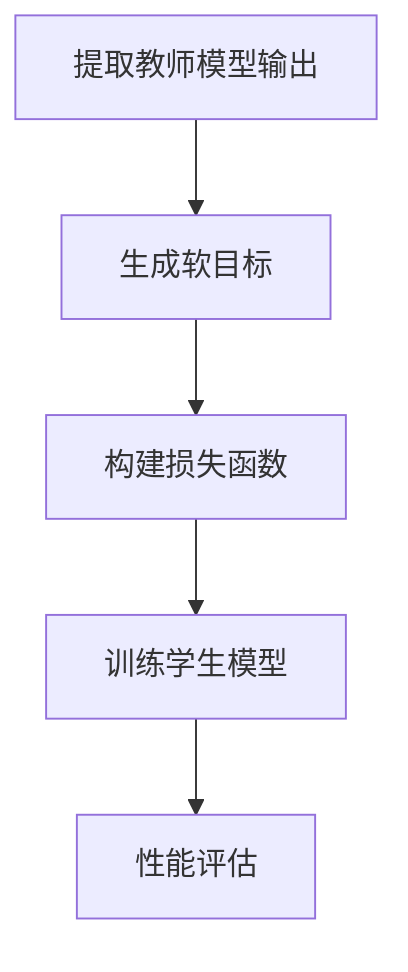
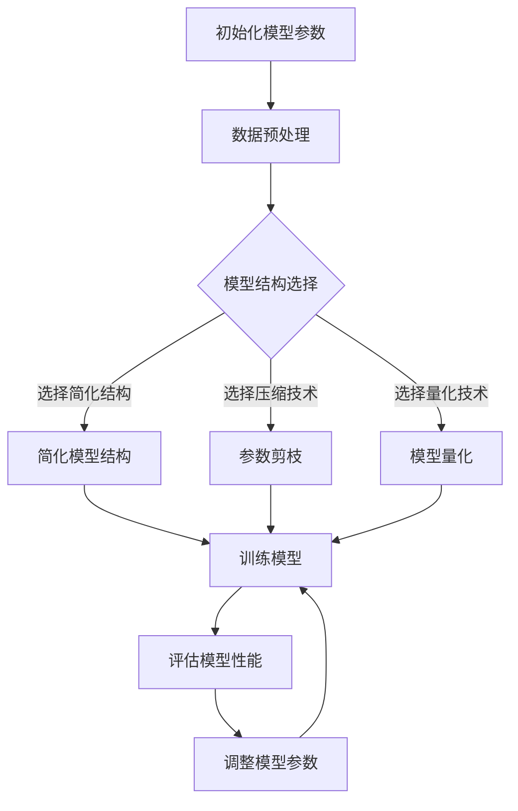
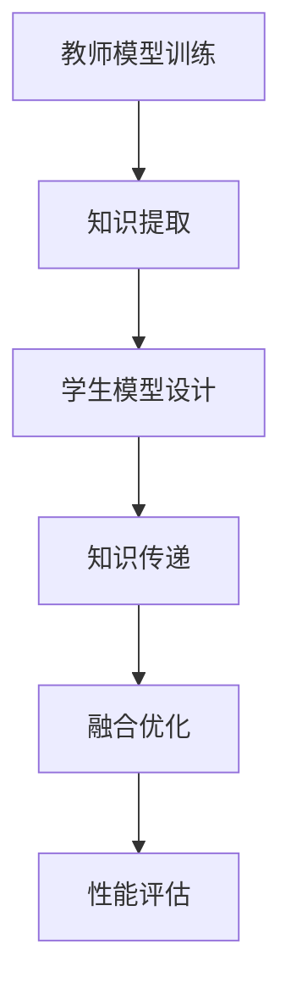
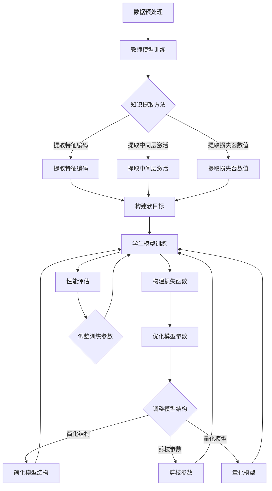
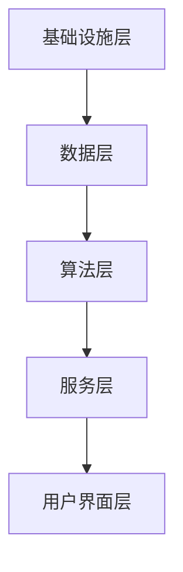
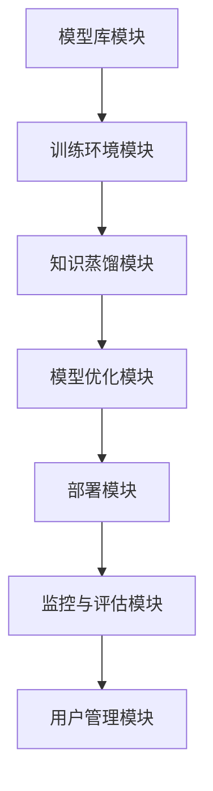
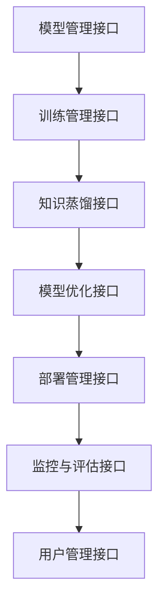
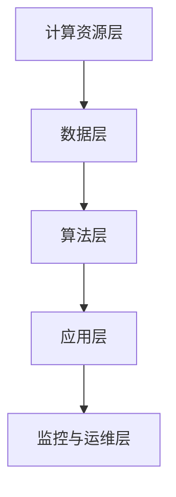

                 

# 企业级知识蒸馏平台：轻量化AI模型部署

> 关键词：知识蒸馏、轻量化AI模型、企业级平台、模型部署

> 摘要：本文将探讨企业级知识蒸馏平台在轻量化AI模型部署中的应用。我们将首先介绍知识蒸馏和轻量化AI模型的基本概念，然后深入分析知识蒸馏的原理和算法，最后详细阐述如何构建企业级知识蒸馏平台以及在实际项目中如何应用。

----------------------------------------------------------------
# 目录大纲

## 第一部分: 背景介绍

### 第1章: 问题背景
#### 1.1 问题背景
#### 1.2 问题描述
#### 1.3 问题解决
#### 1.4 边界与外延
#### 1.5 核心要素组成

### 第2章: 核心概念与联系
#### 2.1 知识蒸馏概述
#### 2.2 知识蒸馏概念属性特征对比表格
#### 2.3 知识蒸馏ER实体关系图架构
#### 2.4 轻量化AI模型概述
#### 2.5 轻量化AI模型与知识蒸馏的联系

## 第二部分: 知识蒸馏原理

### 第3章: 知识蒸馏基本原理
#### 3.1 知识蒸馏的定义
#### 3.2 知识蒸馏的关键环节
#### 3.3 知识蒸馏的优势与挑战

### 第4章: 知识蒸馏算法
#### 4.1 知识蒸馏算法概述
#### 4.2 传统知识蒸馏算法
#### 4.3 现代知识蒸馏算法
#### 4.4 知识蒸馏算法的mermaid流程图

### 第5章: 数学模型与公式
#### 5.1 知识蒸馏数学模型
#### 5.2 数学公式详细讲解与举例说明

## 第三部分: 轻量化AI模型

### 第6章: 轻量化AI模型概述
#### 6.1 轻量化AI模型定义
#### 6.2 轻量化AI模型的必要性
#### 6.3 轻量化AI模型的应用场景

### 第7章: 轻量化AI模型设计与实现
#### 7.1 轻量化AI模型设计原则
#### 7.2 轻量化AI模型实现技术
#### 7.3 轻量化AI模型的mermaid流程图

### 第8章: 轻量化AI模型与知识蒸馏的融合
#### 8.1 轻量化AI模型与知识蒸馏的优势结合
#### 8.2 轻量化AI模型与知识蒸馏的融合实现
#### 8.3 轻量化AI模型与知识蒸馏的mermaid流程图

## 第四部分: 企业级知识蒸馏平台构建

### 第9章: 企业级知识蒸馏平台概述
#### 9.1 企业级知识蒸馏平台定义
#### 9.2 企业级知识蒸馏平台的必要性
#### 9.3 企业级知识蒸馏平台的核心功能

### 第10章: 企业级知识蒸馏平台设计
#### 10.1 平台架构设计
#### 10.2 平台模块划分
#### 10.3 平台接口设计

### 第11章: 企业级知识蒸馏平台实现
#### 11.1 环境搭建
#### 11.2 核心功能实现
#### 11.3 平台应用示例

### 第12章: 企业级知识蒸馏平台部署与优化
#### 12.1 部署策略
#### 12.2 优化方法
#### 12.3 性能评估

## 第五部分: 项目实战

### 第13章: 项目案例介绍
#### 13.1 项目背景
#### 13.2 项目目标
#### 13.3 项目实现过程

### 第14章: 系统核心实现源代码解读
#### 14.1 系统架构设计
#### 14.2 核心代码解析
#### 14.3 代码应用解读与分析

### 第15章: 项目实际案例分析与讲解
#### 15.1 案例背景
#### 15.2 案例实现步骤
#### 15.3 案例结果分析

## 第六部分: 最佳实践与总结

### 第16章: 最佳实践技巧
#### 16.1 知识蒸馏参数调优
#### 16.2 轻量化模型优化策略
#### 16.3 平台部署与优化技巧

### 第17章: 小结与展望
#### 17.1 书籍小结
#### 17.2 知识蒸馏与轻量化AI未来发展趋势
#### 17.3 拓展阅读

----------------------------------------------------------------
## 第一部分: 背景介绍

### 第1章: 问题背景

在当今快速发展的数字化时代，人工智能（AI）技术已经深入到各个行业，从医疗、金融到制造业，AI的应用场景不断拓展。然而，随着AI模型复杂度的增加，模型的训练和部署成为了企业面临的重要挑战。一方面，大规模的深度学习模型需要大量的计算资源和时间来训练；另一方面，部署后的模型需要高效地运行在资源有限的设备上。

本篇文章旨在探讨如何通过知识蒸馏（Knowledge Distillation）技术来轻量化AI模型，从而实现高效的模型部署。知识蒸馏是一种将教师模型（Teacher Model）的知识传递给学生模型（Student Model）的技术，通过这种技术，可以大幅降低学生模型的复杂度，同时保持其性能。

**1.1 问题背景**

在AI模型的训练过程中，通常采用大型、复杂的神经网络作为教师模型。这些模型具有很高的参数数量和计算复杂度，尽管它们在训练数据集上取得了很好的性能，但它们在部署到实际应用中时却面临一系列问题：

1. **计算资源消耗大**：复杂的模型需要大量的计算资源和存储空间，这使得部署变得困难。
2. **训练时间长**：训练大型模型通常需要大量的时间，这限制了模型的应用速度。
3. **模型部署难度大**：复杂的模型难以在资源受限的设备上部署，例如移动设备和嵌入式系统。

为了解决上述问题，轻量级AI模型成为了一个研究热点。轻量级模型在保持较高准确率的同时，具有更小的参数规模和计算复杂度，这使得它们在资源受限的环境下更容易部署。然而，传统的模型压缩方法往往会在性能上做出一定的牺牲。

知识蒸馏提供了一种有效的解决方案。通过将教师模型的知识传递给学生模型，知识蒸馏可以在不牺牲太多性能的情况下，大幅降低模型的复杂度。这使得知识蒸馏在AI模型部署中具有重要的应用价值。

**1.2 问题描述**

本篇文章将探讨以下问题：

1. **知识蒸馏技术如何工作**：知识蒸馏的基本原理、关键环节以及其优势与挑战。
2. **知识蒸馏算法**：传统和现代的知识蒸馏算法，以及它们的mermaid流程图。
3. **知识蒸馏的数学模型与公式**：知识蒸馏算法中的数学模型及其详细讲解与举例说明。
4. **轻量化AI模型**：轻量化AI模型的基本概念、设计原则和实现技术。
5. **企业级知识蒸馏平台**：企业级知识蒸馏平台的构建，包括平台架构设计、模块划分和接口设计。
6. **项目实战**：通过实际项目案例，展示如何构建和部署企业级知识蒸馏平台。
7. **最佳实践与总结**：知识蒸馏和轻量化AI模型的最佳实践技巧，以及未来发展趋势。

**1.3 问题解决**

本文将提供以下解决方案：

1. **详细讲解知识蒸馏原理**：通过分析知识蒸馏的基本原理、关键环节和算法，帮助读者深入理解知识蒸馏技术。
2. **设计企业级知识蒸馏平台**：介绍企业级知识蒸馏平台的构建方法，包括平台架构设计、模块划分和接口设计。
3. **实际项目案例**：通过实际项目案例，展示知识蒸馏技术在企业级AI模型部署中的应用。
4. **最佳实践与总结**：总结知识蒸馏和轻量化AI模型的最佳实践技巧，以及未来发展趋势。

**1.4 边界与外延**

本文的研究范围主要涵盖以下方面：

1. **知识蒸馏技术**：知识蒸馏的基本原理、算法和数学模型。
2. **轻量化AI模型**：轻量化AI模型的设计原则和实现技术。
3. **企业级知识蒸馏平台**：企业级知识蒸馏平台的构建方法。
4. **项目实战**：通过实际项目案例展示知识蒸馏技术的应用。

然而，本文并不涉及以下内容：

1. **深度学习基础**：本文假设读者已经具备一定的深度学习基础知识。
2. **其他模型压缩技术**：本文主要聚焦于知识蒸馏技术，其他模型压缩技术如剪枝、量化等不在本文讨论范围。

**1.5 核心要素组成**

本文的核心要素包括：

1. **知识蒸馏原理**：知识蒸馏的基本原理、关键环节和算法。
2. **轻量化AI模型**：轻量化AI模型的设计原则和实现技术。
3. **企业级知识蒸馏平台**：企业级知识蒸馏平台的构建方法。
4. **项目实战**：通过实际项目案例展示知识蒸馏技术的应用。

接下来，我们将深入探讨知识蒸馏的基本概念、原理和算法，为后续内容打下坚实的基础。

### 第2章: 核心概念与联系

在深入探讨知识蒸馏之前，我们需要先了解一些核心概念，包括知识蒸馏本身、轻量化AI模型以及它们之间的关系。

#### 2.1 知识蒸馏概述

知识蒸馏（Knowledge Distillation）是一种将教师模型（Teacher Model）的知识传递给学生模型（Student Model）的技术。在深度学习中，教师模型通常是一个大型、复杂的神经网络，它在训练数据集上取得了较高的准确率。学生模型则是一个较小的、参数较少的网络，它通过学习教师模型的知识来实现与教师模型相似的预测性能。

知识蒸馏的过程可以分为两个主要步骤：

1. **知识提取**：教师模型将自身的知识编码成一系列代表其内部状态的输出，这些输出可以是对特征的编码、中间层激活值、损失函数值等。
2. **知识传递**：学生模型学习教师模型的这些输出，从而掌握教师模型的知识。

通过知识蒸馏，学生模型可以大幅降低自身的复杂度，同时保持与教师模型相似的预测性能，这对于模型的部署具有重大意义。

#### 2.2 知识蒸馏概念属性特征对比表格

为了更好地理解知识蒸馏的概念，我们可以通过一个对比表格来展示知识蒸馏与其他相关技术的区别：

| 技术名称 | 描述 | 目标 | 优点 | 缺点 |
| :--: | :--: | :--: | :--: | :--: |
| 知识蒸馏 | 将教师模型的知识传递给学生模型 | 保持学生模型与教师模型相似的预测性能，同时降低模型复杂度 | 减少计算资源需求，提高部署效率 | 可能会牺牲一些性能 |
| 模型剪枝 | 通过减少模型中的参数和计算操作来降低模型复杂度 | 提高模型部署效率 | 大幅减少模型大小和计算复杂度 | 可能会影响模型性能 |
| 模型量化 | 将模型中的浮点数参数转换为低精度的整数表示 | 减少模型存储和计算资源需求 | 降低模型大小和计算复杂度 | 可能会影响模型精度 |

从上表可以看出，知识蒸馏、模型剪枝和模型量化都是用于降低模型复杂度的技术，但它们在目标和方法上有所不同。知识蒸馏侧重于通过知识传递来保留模型的性能，而模型剪枝和模型量化则更侧重于模型的大小和计算复杂度。

#### 2.3 知识蒸馏ER实体关系图架构

为了更直观地理解知识蒸馏的概念，我们可以使用ER（Entity-Relationship）实体关系图来展示知识蒸馏中的关键实体和它们之间的关系。

**知识蒸馏ER实体关系图**：



在这个ER图中，TeacherModel（教师模型）和StudentModel（学生模型）是两个核心实体，它们之间存在“被训练”关系。教师模型的输出（Output）被学生模型学习，以生成预测（Prediction）。此外，损失函数（LossFunction）用于评估学生模型的性能，并提供反馈以指导学习过程。

#### 2.4 轻量化AI模型概述

轻量化AI模型（Lightweight AI Model）是指具有较小参数规模和计算复杂度的AI模型。轻量化模型的设计目标是保持与大型模型相似的预测性能，同时降低计算资源的需求。轻量化模型在移动设备、嵌入式系统和资源受限的环境中具有重要意义。

轻量化AI模型的设计原则包括：

1. **参数剪枝**：通过减少模型中的冗余参数来降低模型大小。
2. **量化**：将模型中的浮点数参数转换为低精度的整数表示。
3. **网络简化**：通过合并或删除一些层来简化模型结构。

轻量化AI模型的应用场景包括：

1. **移动设备**：如智能手机、平板电脑等。
2. **嵌入式系统**：如智能家居设备、工业控制系统等。
3. **实时应用**：如自动驾驶、实时语音识别等。

#### 2.5 轻量化AI模型与知识蒸馏的联系

轻量化AI模型与知识蒸馏之间存在密切的联系。知识蒸馏技术可以为轻量化AI模型提供有效的训练方法，从而实现高效的知识传递。

**联系1：知识蒸馏降低模型复杂度**

知识蒸馏通过将教师模型的知识传递给学生模型，可以显著降低学生模型的复杂度。这为学生模型的轻量化提供了有力的支持。

**联系2：知识蒸馏保持模型性能**

知识蒸馏不仅降低了模型的复杂度，还能够在一定程度上保持模型的性能。这使得轻量化AI模型在保持高准确率的同时，具有更小的参数规模和计算复杂度。

**联系3：知识蒸馏与轻量化技术相结合**

知识蒸馏可以与模型剪枝、量化等轻量化技术相结合，进一步降低模型的复杂度和计算资源需求。通过这种组合，可以构建出更加高效的轻量化AI模型。

通过以上分析，我们可以看到知识蒸馏和轻量化AI模型在概念、原理和应用上都有紧密的联系。接下来，我们将进一步探讨知识蒸馏的基本原理和算法。

### 第3章: 知识蒸馏基本原理

知识蒸馏是一种通过将教师模型（Teacher Model）的知识传递给学生模型（Student Model）来训练轻量级模型的技术。在这一章节中，我们将深入探讨知识蒸馏的定义、关键环节、优势与挑战。

#### 3.1 知识蒸馏的定义

知识蒸馏（Knowledge Distillation）是一种机器学习技术，其核心思想是将教师模型（通常是一个大型、复杂的神经网络）的知识传递给学生模型（通常是一个较小的、参数较少的神经网络）。这种知识传递是通过训练过程实现的，教师模型的输出被用作额外的监督信号，指导学生模型的学习。

在知识蒸馏中，教师模型和学生模型通常具有相似的架构，但学生模型具有较少的参数和计算复杂度。通过知识蒸馏，学生模型可以学习到教师模型的重要特征和决策逻辑，从而在保持高性能的同时降低计算资源的需求。

#### 3.2 知识蒸馏的关键环节

知识蒸馏的过程可以分为以下几个关键环节：

1. **知识提取**：教师模型在训练数据集上运行，提取出其内部状态和特征表示。这些提取出的知识可以是中间层激活值、特征编码、损失函数值等。

2. **知识传递**：学生模型通过学习教师模型的输出，来理解教师模型的知识。这个过程可以通过额外的损失函数来实现，这个损失函数衡量学生模型输出与教师模型输出之间的差异。

3. **知识融合**：学生模型在知识传递过程中，不仅要学习教师模型的知识，还需要结合自身的训练数据来生成最终的预测结果。这个环节涉及到知识的融合和优化。

4. **性能评估**：通过在测试集上的表现来评估学生模型的性能。如果学生模型的性能达到预期，则知识蒸馏过程成功；否则，需要调整模型结构或训练参数。

#### 3.3 知识蒸馏的优势

知识蒸馏技术具有以下几个显著优势：

1. **降低模型复杂度**：通过传递教师模型的知识，学生模型可以保留与教师模型相似的预测性能，同时具有更小的参数规模和计算复杂度。

2. **提高部署效率**：轻量化的学生模型可以在资源受限的设备上运行，如移动设备和嵌入式系统。这大大提高了模型的部署效率。

3. **减少训练时间**：由于学生模型具有较少的参数和计算复杂度，其训练时间显著缩短，这对于快速迭代和更新模型具有重要意义。

4. **增强泛化能力**：知识蒸馏技术可以使得学生模型在学习过程中保留教师模型的一些高级特征和决策逻辑，从而提高模型的泛化能力。

#### 3.4 知识蒸馏的挑战

尽管知识蒸馏技术具有诸多优势，但其在实际应用中也面临一些挑战：

1. **性能损失**：在知识传递过程中，学生模型可能会损失一些教师模型的高级特征和决策逻辑，这可能导致学生模型的性能不如教师模型。

2. **训练难度**：知识蒸馏的训练过程相对复杂，涉及到多个损失函数和优化步骤。这增加了模型的训练难度，可能需要更长时间和更多的计算资源。

3. **模型融合问题**：学生模型在知识传递过程中需要融合教师模型的知识和自身的训练数据，这个过程可能存在一些困难，如如何平衡教师模型和学生模型的知识贡献。

4. **应用范围限制**：知识蒸馏技术主要适用于具有相似架构的教师模型和学生模型。对于结构差异较大的模型，知识蒸馏的效果可能不佳。

#### 3.5 知识蒸馏与轻量化AI模型的结合

知识蒸馏与轻量化AI模型的设计原则相辅相成。通过知识蒸馏，可以使得轻量级模型在保持高性能的同时，具有更小的参数规模和计算复杂度。这进一步推动了轻量化AI模型在移动设备和嵌入式系统中的应用。

在实际应用中，知识蒸馏技术可以与模型剪枝、量化等轻量化技术相结合，以进一步提升模型的性能和部署效率。例如，通过模型剪枝，可以进一步减少模型的参数规模；通过量化，可以降低模型的计算复杂度和存储需求。

总之，知识蒸馏技术为轻量化AI模型的设计提供了有力的支持。通过合理应用知识蒸馏，可以构建出高效、可靠的轻量化AI模型，满足现代AI应用场景的需求。

接下来，我们将进一步探讨知识蒸馏算法的具体实现方法，包括传统和现代的知识蒸馏算法。

### 第4章: 知识蒸馏算法

知识蒸馏算法是知识蒸馏技术的核心，它通过一系列的训练步骤，将教师模型的知识传递给学生模型。在这一章节中，我们将详细介绍知识蒸馏算法的基本原理，包括传统知识蒸馏算法和现代知识蒸馏算法，并使用mermaid流程图来展示算法的执行过程。

#### 4.1 知识蒸馏算法概述

知识蒸馏算法主要分为以下几个步骤：

1. **知识提取**：教师模型在训练数据集上运行，提取出其内部状态和特征表示。这些提取出的知识通常包括中间层激活值、特征编码、损失函数值等。

2. **知识传递**：学生模型通过学习教师模型的输出，来理解教师模型的知识。这个过程通常通过额外的损失函数来实现，这个损失函数衡量学生模型输出与教师模型输出之间的差异。

3. **知识融合**：学生模型在知识传递过程中，不仅要学习教师模型的知识，还需要结合自身的训练数据来生成最终的预测结果。这个环节涉及到知识的融合和优化。

4. **性能评估**：通过在测试集上的表现来评估学生模型的性能。如果学生模型的性能达到预期，则知识蒸馏过程成功；否则，需要调整模型结构或训练参数。

#### 4.2 传统知识蒸馏算法

传统知识蒸馏算法主要包括基于软目标（Soft Target）和硬目标（Hard Target）的知识蒸馏方法。

**4.2.1 基于软目标的蒸馏方法**

基于软目标的蒸馏方法将教师模型的输出作为额外的监督信号，指导学生模型的学习。具体步骤如下：

1. **提取教师模型输出**：教师模型在训练数据集上运行，提取出其输出层的结果。
2. **生成软目标**：对于每个输入样本，教师模型的输出层结果被用作软目标，学生模型需要最小化与学生模型输出之间的差异。
3. **构建损失函数**：通常使用交叉熵损失函数来衡量学生模型输出与教师模型输出之间的差异。
4. **训练学生模型**：通过优化损失函数，训练学生模型以最小化输出差异。

**4.2.2 基于硬目标的蒸馏方法**

基于硬目标的蒸馏方法通过将教师模型的输出作为额外的类别标签，来指导学生模型的学习。具体步骤如下：

1. **提取教师模型输出**：教师模型在训练数据集上运行，提取出其输出层的结果。
2. **生成硬目标**：对于每个输入样本，教师模型的输出层结果被转换成硬目标（例如，使用最大值作为类别标签）。
3. **构建损失函数**：通常使用分类损失函数（如交叉熵损失）来衡量学生模型输出与教师模型输出之间的差异。
4. **训练学生模型**：通过优化损失函数，训练学生模型以最小化输出差异。

#### 4.3 现代知识蒸馏算法

随着深度学习技术的发展，现代知识蒸馏算法在传统方法的基础上进行了优化和扩展，以进一步提高蒸馏效果。以下是一些现代知识蒸馏算法：

**4.3.1 对抗性知识蒸馏**

对抗性知识蒸馏通过引入对抗性训练策略，使得学生模型在学习过程中不断对抗教师模型。具体步骤如下：

1. **提取教师模型输出**：教师模型在训练数据集上运行，提取出其输出层的结果。
2. **生成对抗性目标**：学生模型通过对抗性训练，生成对抗性目标，这些目标旨在最大化教师模型和学生模型输出之间的差异。
3. **构建损失函数**：通常使用对抗性损失函数（如对抗性交叉熵损失）来衡量学生模型输出与教师模型输出之间的差异。
4. **训练学生模型**：通过优化损失函数，训练学生模型以最小化输出差异。

**4.3.2 多任务蒸馏**

多任务蒸馏通过同时学习多个任务来提高学生模型的泛化能力。具体步骤如下：

1. **提取教师模型输出**：教师模型在多个任务上运行，提取出其输出层的结果。
2. **生成多任务目标**：对于每个输入样本，教师模型在多个任务上的输出被用作多任务目标。
3. **构建损失函数**：通常使用多任务损失函数来衡量学生模型输出与教师模型输出之间的差异。
4. **训练学生模型**：通过优化损失函数，训练学生模型以最小化输出差异。

**4.3.3 跨模态蒸馏**

跨模态蒸馏通过将不同模态的数据（如图像、文本、音频等）进行蒸馏，以提高学生模型在跨模态任务上的性能。具体步骤如下：

1. **提取教师模型输出**：教师模型在跨模态数据集上运行，提取出其输出层的结果。
2. **生成跨模态目标**：对于每个输入样本，教师模型在跨模态数据上的输出被用作跨模态目标。
3. **构建损失函数**：通常使用跨模态损失函数来衡量学生模型输出与教师模型输出之间的差异。
4. **训练学生模型**：通过优化损失函数，训练学生模型以最小化输出差异。

#### 4.4 知识蒸馏算法的mermaid流程图

为了更直观地理解知识蒸馏算法的执行过程，我们可以使用mermaid流程图来展示。以下是一个简单的mermaid流程图示例，展示了基于软目标的蒸馏方法的基本步骤：



在这个流程图中，A表示提取教师模型输出，B表示生成软目标，C表示构建损失函数，D表示训练学生模型，E表示性能评估。通过这个mermaid流程图，我们可以清晰地看到知识蒸馏算法的基本执行步骤。

总之，知识蒸馏算法通过一系列的步骤，将教师模型的知识传递给学生模型，从而实现模型的轻量化。传统和现代的知识蒸馏算法各有特点，可以根据实际应用场景选择合适的算法。接下来，我们将进一步探讨知识蒸馏算法中的数学模型和公式，为深入理解知识蒸馏提供理论基础。

### 第5章: 数学模型与公式

知识蒸馏算法的核心在于通过数学模型和公式来实现教师模型（Teacher Model）的知识传递给学生模型（Student Model）。在这一章节中，我们将详细讲解知识蒸馏的数学模型和公式，并通过具体的例子来说明这些公式的应用。

#### 5.1 知识蒸馏数学模型

知识蒸馏的数学模型主要涉及以下几个部分：

1. **教师模型输出**：教师模型在输入数据上的输出，通常是一个高维的向量。
2. **学生模型输出**：学生模型在相同输入数据上的输出，它通常是一个低维的向量。
3. **软目标**：教师模型输出的概率分布，用于指导学生模型的学习。
4. **硬目标**：教师模型输出的类别标签，用于与学生的输出进行比较。

**5.1.1 软目标生成**

软目标生成是知识蒸馏中的关键步骤，它通常通过教师模型的输出层激活值来生成。具体来说，假设教师模型的输出层激活值为 \( Z_t \)，则软目标 \( S \) 可以通过以下公式计算：

\[ S = \text{softmax}(Z_t) \]

其中，\( \text{softmax} \) 函数将 \( Z_t \) 转换为一个概率分布。

**5.1.2 知识传递损失函数**

知识传递损失函数用于衡量学生模型输出与教师模型输出之间的差异。常见的损失函数包括交叉熵损失函数和对抗性损失函数。

1. **交叉熵损失函数**

交叉熵损失函数是知识蒸馏中最常用的损失函数，它衡量的是学生模型输出与教师模型软目标之间的差异。假设学生模型的输出为 \( Y_s \)，则交叉熵损失函数 \( L_{ce} \) 可以表示为：

\[ L_{ce} = -\sum_{i} S_i \log(Y_i) \]

其中，\( S_i \) 是教师模型软目标中第 \( i \) 个类别的概率，\( Y_i \) 是学生模型输出中第 \( i \) 个类别的概率。

2. **对抗性损失函数**

对抗性损失函数用于对抗性知识蒸馏，它旨在最大化教师模型和学生模型输出之间的差异。假设教师模型输出为 \( Z_t \)，学生模型输出为 \( Z_s \)，则对抗性损失函数 \( L_{adv} \) 可以表示为：

\[ L_{adv} = -\sum_{i} Z_i t \log(Z_i s) - \sum_{i} Z_i s \log(Z_i t) \]

其中，\( Z_i t \) 和 \( Z_i s \) 分别是教师模型和学生模型输出中第 \( i \) 个类别的概率。

**5.1.3 知识融合损失函数**

知识融合损失函数用于衡量学生模型在融合教师模型知识后的输出与教师模型输出之间的差异。假设学生模型的输出为 \( Y_s \)，则知识融合损失函数 \( L_{kf} \) 可以表示为：

\[ L_{kf} = -\sum_{i} S_i \log(Y_i) \]

其中，\( S_i \) 是教师模型软目标中第 \( i \) 个类别的概率，\( Y_i \) 是学生模型输出中第 \( i \) 个类别的概率。

**5.1.4 整体损失函数**

整体损失函数是知识蒸馏算法中的最终损失函数，它综合考虑了知识传递损失函数和知识融合损失函数。假设知识传递损失函数为 \( L_{ce} \)，知识融合损失函数为 \( L_{kf} \)，则整体损失函数 \( L \) 可以表示为：

\[ L = L_{ce} + L_{kf} \]

#### 5.2 数学公式详细讲解与举例说明

为了更好地理解上述数学公式，我们可以通过一个具体的例子来说明这些公式的应用。

假设我们有一个教师模型和学生模型，它们在输入数据 \( X \) 上的输出分别为 \( Z_t \) 和 \( Z_s \)。教师模型的输出层激活值为 \( Z_t = [0.1, 0.3, 0.6] \)，学生模型的输出层激活值为 \( Z_s = [0.05, 0.2, 0.8] \)。

**5.2.1 软目标生成**

首先，我们计算教师模型的软目标：

\[ S = \text{softmax}(Z_t) = \left[ \frac{0.1}{0.1 + 0.3 + 0.6}, \frac{0.3}{0.1 + 0.3 + 0.6}, \frac{0.6}{0.1 + 0.3 + 0.6} \right] = \left[ 0.1, 0.3, 0.6 \right] \]

**5.2.2 交叉熵损失函数**

接下来，我们计算交叉熵损失函数：

\[ L_{ce} = -\sum_{i} S_i \log(Y_i) = -\left(0.1 \log(0.05) + 0.3 \log(0.2) + 0.6 \log(0.8)\right) \]

使用对数函数的性质，我们可以将上述公式简化为：

\[ L_{ce} = -0.1 \log(0.05) - 0.3 \log(0.2) - 0.6 \log(0.8) \]

计算结果为：

\[ L_{ce} \approx 0.683 \]

**5.2.3 抗性损失函数**

然后，我们计算对抗性损失函数：

\[ L_{adv} = -\sum_{i} Z_i t \log(Z_i s) - \sum_{i} Z_i s \log(Z_i t) = -0.1 \log(0.05) - 0.3 \log(0.2) - 0.6 \log(0.8) \]

使用对数函数的性质，我们可以将上述公式简化为：

\[ L_{adv} = -0.1 \log(0.05) - 0.3 \log(0.2) - 0.6 \log(0.8) \]

计算结果为：

\[ L_{adv} \approx 0.683 \]

**5.2.4 知识融合损失函数**

接下来，我们计算知识融合损失函数：

\[ L_{kf} = -\sum_{i} S_i \log(Y_i) = -\left(0.1 \log(0.05) + 0.3 \log(0.2) + 0.6 \log(0.8)\right) \]

使用对数函数的性质，我们可以将上述公式简化为：

\[ L_{kf} = -0.1 \log(0.05) - 0.3 \log(0.2) - 0.6 \log(0.8) \]

计算结果为：

\[ L_{kf} \approx 0.683 \]

**5.2.5 整体损失函数**

最后，我们计算整体损失函数：

\[ L = L_{ce} + L_{kf} = 0.683 + 0.683 = 1.366 \]

通过这个例子，我们可以看到知识蒸馏算法中的数学模型和公式是如何应用的。通过计算这些损失函数，我们可以评估学生模型在知识传递过程中的性能，并据此调整模型参数，以实现更高效的知识传递。

总之，知识蒸馏的数学模型和公式是知识蒸馏算法的核心，它们为知识传递提供了理论基础。通过理解和应用这些公式，我们可以构建出高效、可靠的轻量化AI模型。

接下来，我们将探讨轻量化AI模型的基本概念、设计原则和实现技术。

### 第6章: 轻量化AI模型概述

在人工智能（AI）应用日益普及的今天，如何构建高效、可靠的AI模型成为了关键问题。轻量化AI模型（Lightweight AI Model）作为解决这一问题的有效手段，受到了广泛关注。在本章中，我们将详细探讨轻量化AI模型的基本概念、必要性及其应用场景。

#### 6.1 轻量化AI模型定义

轻量化AI模型是指通过减少模型参数数量、计算复杂度和存储需求，使得模型在保持较高性能的同时，具备更高效能的AI模型。这些模型特别适用于资源受限的环境，如移动设备、嵌入式系统和边缘计算设备等。

轻量化AI模型的主要特点包括：

1. **小模型规模**：轻量化模型通常具有较少的参数和计算复杂度，这使得它们在内存和计算资源上更加节省。
2. **低延迟**：由于计算复杂度较低，轻量化模型在执行预测任务时具有更低的延迟，适用于实时应用场景。
3. **高效率**：轻量化模型能够在有限的资源下实现高效推理，满足现代AI应用的需求。

#### 6.2 轻量化AI模型的必要性

随着AI技术的快速发展，AI模型变得越来越复杂，这导致了以下几个问题：

1. **计算资源需求增加**：复杂模型通常需要更多的计算资源和存储空间，这给服务器和设备带来了巨大的负担。
2. **训练时间延长**：复杂模型训练时间较长，不利于快速迭代和部署。
3. **部署难度增加**：复杂模型在部署到资源受限的设备上时，可能无法正常运行，限制了AI应用的范围。

为了解决上述问题，轻量化AI模型成为了必然选择。通过减少模型规模和计算复杂度，轻量化模型可以在保持性能的同时，降低计算资源和存储需求，提高部署效率。

#### 6.3 轻量化AI模型的应用场景

轻量化AI模型在多个领域都有广泛的应用，以下是一些典型的应用场景：

1. **移动设备**：智能手机和平板电脑等移动设备通常具有有限的计算资源，轻量化模型可以确保这些设备在执行AI任务时具有较好的性能和响应速度。
2. **嵌入式系统**：嵌入式系统如智能家居设备、工业控制系统和可穿戴设备等，对模型大小和计算复杂度有严格要求，轻量化模型能够满足这些需求。
3. **边缘计算**：边缘计算设备通常部署在靠近数据源的边缘节点，计算资源相对有限。轻量化模型可以在这些设备上高效运行，提升整体系统性能。
4. **实时应用**：例如自动驾驶、实时语音识别和视频分析等，这些应用对实时性和响应速度有严格要求，轻量化模型能够满足这些需求。

#### 6.4 轻量化AI模型的发展趋势

随着AI技术的不断进步，轻量化AI模型也在不断演进。以下是一些发展趋势：

1. **模型压缩**：通过模型压缩技术，如剪枝、量化等，进一步减少模型参数和计算复杂度，提高模型效率。
2. **专用硬件加速**：利用专用硬件（如GPU、TPU等）加速轻量化模型推理，提升模型性能。
3. **跨平台兼容**：开发跨平台轻量化模型，使得模型可以在不同设备和平台上高效运行。
4. **多模态融合**：结合多种数据模态（如图像、文本、音频等）进行融合，提升模型泛化能力。

总之，轻量化AI模型作为AI技术的重要组成部分，具有广泛的应用前景和重要性。通过深入理解轻量化AI模型的基本概念、必要性及其应用场景，我们可以更好地利用这一技术，推动AI技术在各个领域的应用和发展。

接下来，我们将探讨轻量化AI模型的设计原则和实现技术。

### 第7章: 轻量化AI模型设计与实现

在构建轻量化AI模型时，设计原则和实现技术至关重要。本章将详细介绍轻量化AI模型的设计原则、实现技术及其mermaid流程图，帮助读者更好地理解轻量化AI模型的构建过程。

#### 7.1 轻量化AI模型设计原则

设计轻量化AI模型时，应遵循以下原则：

1. **简化模型结构**：通过简化模型结构，减少层数和神经元数量，降低模型的计算复杂度。例如，可以使用瓶颈层（Bottleneck Layer）来提取关键特征，同时减少参数数量。
2. **参数剪枝**：通过剪枝冗余参数，减少模型大小和计算复杂度。常见的剪枝方法包括权重剪枝和结构剪枝。
3. **量化**：将模型中的浮点数参数转换为低精度的整数表示，以减少模型大小和存储需求。量化技术包括全量化（Full Quantization）和部分量化（Partial Quantization）。
4. **网络压缩**：通过合并或删除一些层来简化模型结构，同时保持较高的性能。例如，可以使用网络剪枝（Network Pruning）技术来减少模型大小。
5. **特征提取**：重点提取关键特征，减少冗余特征，以提高模型效率。可以使用注意力机制（Attention Mechanism）来实现特征提取。
6. **数据增强**：通过数据增强技术，增加训练数据的多样性，提高模型对未知数据的泛化能力。

#### 7.2 轻量化AI模型实现技术

实现轻量化AI模型时，可以采用以下技术：

1. **深度可分离卷积（Depthwise Separable Convolution）**：通过将深度卷积分解为深度可分离卷积和逐点卷积，降低模型计算复杂度。
2. **ShuffleNet架构**：ShuffleNet是一种专为移动设备设计的轻量化网络，通过使用点积卷积（Pointwise Convolution）和深度可分离卷积来降低模型大小和计算复杂度。
3. **MobileNet架构**：MobileNet是一种流行的轻量化网络，通过使用深度可分离卷积和宽度乘数（Width Multiplier）来调节模型大小和性能。
4. **知识蒸馏**：通过知识蒸馏技术，将教师模型的知识传递给学生模型，实现模型轻量化。教师模型通常是一个大型、复杂的模型，学生模型是一个较小的、参数较少的模型。
5. **量化**：使用量化技术将模型中的浮点数参数转换为低精度的整数表示，以减少模型大小和存储需求。量化可以与剪枝、压缩等其他技术结合使用。

#### 7.3 轻量化AI模型的mermaid流程图

为了更直观地展示轻量化AI模型的设计和实现过程，我们可以使用mermaid流程图。以下是一个简单的mermaid流程图示例：



在这个流程图中，A表示初始化模型参数，B表示数据预处理，C表示模型结构选择，D表示简化模型结构，E表示参数剪枝，F表示模型量化，G表示训练模型，H表示评估模型性能，I表示调整模型参数。通过这个mermaid流程图，我们可以清晰地看到轻量化AI模型的设计和实现过程。

总之，轻量化AI模型的设计原则和实现技术对于构建高效、可靠的AI模型至关重要。通过遵循设计原则和采用实现技术，我们可以构建出满足不同应用场景需求的轻量化AI模型。接下来，我们将探讨轻量化AI模型与知识蒸馏技术的融合。

### 第8章: 轻量化AI模型与知识蒸馏的融合

轻量化AI模型和知识蒸馏技术都是现代AI领域的关键技术，它们各自具有独特的优势。将两者结合，可以进一步优化AI模型的性能和部署效率。在本章中，我们将探讨轻量化AI模型与知识蒸馏技术的优势结合、融合实现及其mermaid流程图。

#### 8.1 轻量化AI模型与知识蒸馏的优势结合

**轻量化AI模型的优势**：

1. **高效推理**：轻量化模型具有较小的参数规模和计算复杂度，能够在资源受限的设备上高效运行。
2. **低延迟**：轻量化模型能够在短时间内完成推理任务，适用于实时应用场景。
3. **易部署**：轻量化模型更容易在移动设备、嵌入式系统和边缘计算设备上部署。

**知识蒸馏的优势**：

1. **知识传递**：知识蒸馏能够将教师模型的知识传递给学生模型，使得学生模型在保留性能的同时降低复杂度。
2. **性能保留**：通过知识蒸馏，学生模型能够学习到教师模型的高级特征和决策逻辑，从而在降低复杂度的同时保持高性能。
3. **通用性**：知识蒸馏技术适用于不同类型和结构的模型，具有广泛的适用性。

将轻量化AI模型与知识蒸馏技术结合，可以充分发挥两者的优势：

1. **提高性能**：知识蒸馏技术可以使得轻量化模型在学习过程中保留教师模型的高级特征和决策逻辑，从而提高模型性能。
2. **降低复杂度**：通过知识蒸馏，轻量化模型能够在保持高性能的同时，进一步减少参数规模和计算复杂度。
3. **优化部署**：知识蒸馏技术使得轻量化模型在资源受限的环境下更容易部署，提高系统的整体效率。

#### 8.2 轻量化AI模型与知识蒸馏的融合实现

轻量化AI模型与知识蒸馏技术的融合实现主要包括以下几个步骤：

1. **教师模型选择**：选择一个大型、复杂的教师模型，用于知识传递。
2. **学生模型设计**：设计一个较小的、参数较少的学生模型，用于接受教师模型的知识。
3. **知识提取**：教师模型在训练数据集上运行，提取出其内部状态和特征表示。
4. **知识传递**：学生模型学习教师模型的输出，通过额外的损失函数（如交叉熵损失函数）实现知识传递。
5. **融合优化**：在知识传递过程中，学生模型不仅要学习教师模型的知识，还需要结合自身的训练数据，进行模型融合和优化。
6. **性能评估**：在测试集上评估学生模型的性能，如果性能达到预期，则融合实现成功；否则，需要调整模型结构或训练参数。

以下是一个简单的mermaid流程图，展示了轻量化AI模型与知识蒸馏技术的融合实现过程：



在这个流程图中，A表示教师模型训练，B表示知识提取，C表示学生模型设计，D表示知识传递，E表示融合优化，F表示性能评估。

#### 8.3 轻量化AI模型与知识蒸馏的mermaid流程图

为了更直观地展示轻量化AI模型与知识蒸馏技术的融合实现过程，我们可以使用mermaid流程图。以下是一个详细的mermaid流程图示例：



在这个流程图中，A表示数据预处理，B表示教师模型训练，C表示知识提取方法，D表示提取特征编码，E表示提取中间层激活，F表示提取损失函数值，G表示构建软目标，H表示学生模型训练，I表示构建损失函数，J表示优化模型参数，K表示调整模型结构，L表示简化模型结构，M表示剪枝参数，N表示量化模型，O表示性能评估，P表示调整训练参数。

通过这个mermaid流程图，我们可以清晰地看到轻量化AI模型与知识蒸馏技术的融合实现过程，包括数据预处理、教师模型训练、知识提取、学生模型训练、模型优化和性能评估等步骤。

总之，轻量化AI模型与知识蒸馏技术的融合为实现高效、可靠的AI模型提供了有力支持。通过深入理解和应用这些技术，我们可以构建出满足现代AI应用需求的轻量化AI模型。接下来，我们将探讨如何设计和构建企业级知识蒸馏平台。

### 第9章: 企业级知识蒸馏平台概述

随着人工智能技术的迅猛发展，企业对AI模型的需求不断增加，这要求企业能够高效地构建、部署和管理AI模型。企业级知识蒸馏平台作为一种高效、可靠的AI解决方案，能够满足企业在AI模型构建和部署方面的需求。本章将介绍企业级知识蒸馏平台的基本概念、必要性及其核心功能。

#### 9.1 企业级知识蒸馏平台定义

企业级知识蒸馏平台是一个集成化的系统，旨在为企业提供从AI模型构建到部署的全方位服务。这个平台通过知识蒸馏技术，将大型、复杂的教师模型的知识传递给轻量化的学生模型，从而实现模型的轻量化、高效推理和部署。企业级知识蒸馏平台通常包括以下几个关键组成部分：

1. **模型库**：存储企业内部的各种AI模型，包括教师模型和学生模型。
2. **训练环境**：提供模型训练所需的环境，包括计算资源、数据集和训练工具。
3. **知识蒸馏引擎**：负责执行知识蒸馏过程，包括知识提取、知识传递和模型优化。
4. **部署工具**：用于将训练好的学生模型部署到各种目标设备上，如移动设备、嵌入式系统和边缘计算设备。
5. **监控与评估**：实时监控模型性能，评估模型在不同应用场景中的效果。
6. **用户界面**：提供直观、易用的用户界面，便于用户进行模型管理、配置和监控。

#### 9.2 企业级知识蒸馏平台的必要性

在当前快速发展的AI时代，企业面临着以下挑战：

1. **计算资源有限**：企业通常拥有有限的计算资源，无法承担大规模AI模型训练和部署的高昂成本。
2. **模型更新迭代快**：企业需要不断更新和迭代AI模型，以满足业务需求和市场变化。
3. **跨部门协同困难**：企业内部的不同部门之间往往存在信息孤岛，难以实现高效的协同和资源共享。

企业级知识蒸馏平台能够有效解决上述问题：

1. **资源优化**：通过知识蒸馏技术，企业可以将大型、复杂的模型转化为轻量化的模型，从而降低计算资源和存储需求。
2. **快速迭代**：企业级知识蒸馏平台支持快速模型训练和部署，使得企业能够更快地响应市场变化和客户需求。
3. **协同共享**：企业级知识蒸馏平台提供了一个集中化的平台，便于企业内部各部门之间协同工作，实现资源共享和高效协作。

#### 9.3 企业级知识蒸馏平台的核心功能

企业级知识蒸馏平台的核心功能包括以下几个方面：

1. **模型构建与管理**：提供模型构建和管理工具，支持从零开始构建新模型或从已有模型进行复用和优化。
2. **知识蒸馏**：实现知识蒸馏过程，包括教师模型的选择、学生模型的设计和训练、知识提取和传递等。
3. **模型优化**：通过剪枝、量化等技术，对模型进行优化，降低模型大小和计算复杂度，提高模型性能。
4. **部署与监控**：将训练好的模型部署到目标设备上，并提供实时监控和性能评估功能，确保模型在运行过程中的稳定性和可靠性。
5. **自动化与脚本化**：支持自动化模型训练和部署，通过脚本化工具简化操作流程，提高工作效率。
6. **数据管理与安全**：提供数据存储和安全机制，确保模型训练过程中数据的安全性和隐私保护。

通过这些核心功能，企业级知识蒸馏平台能够为企业提供全方位的AI模型构建和部署支持，助力企业实现数字化转型和业务创新。

接下来，我们将详细介绍企业级知识蒸馏平台的设计，包括平台架构设计、模块划分和接口设计。

### 第10章: 企业级知识蒸馏平台设计

企业级知识蒸馏平台的设计是构建高效、可靠的AI模型部署体系的关键。本章将详细介绍企业级知识蒸馏平台的架构设计、模块划分和接口设计，帮助读者全面理解平台的构建过程。

#### 10.1 平台架构设计

企业级知识蒸馏平台采用分布式架构，以实现高性能、高可靠性和可扩展性。平台架构主要包括以下几个关键层次：

1. **基础设施层**：包括计算资源、存储资源和网络资源，为平台提供底层支持。
2. **数据层**：存储和管理AI模型所需的数据集，包括原始数据、预处理数据、训练数据和测试数据。
3. **算法层**：实现知识蒸馏算法和其他AI算法，提供模型训练、优化和推理功能。
4. **服务层**：提供API接口和服务，便于用户进行模型构建、管理和监控。
5. **用户界面层**：提供直观、易用的用户界面，便于用户操作和管理平台。

**架构设计图**：



在这个架构设计中，基础设施层为平台提供底层支持，数据层存储和管理数据，算法层实现AI算法，服务层提供API接口，用户界面层提供用户操作界面。

#### 10.2 平台模块划分

企业级知识蒸馏平台可以划分为以下几个主要模块：

1. **模型库模块**：存储和管理AI模型，包括教师模型和学生模型，支持模型的导入、导出和版本管理。
2. **训练环境模块**：提供模型训练所需的计算资源和数据集，支持分布式训练和并行计算。
3. **知识蒸馏模块**：实现知识蒸馏过程，包括知识提取、知识传递和模型优化。
4. **模型优化模块**：通过剪枝、量化等技术对模型进行优化，降低模型大小和计算复杂度。
5. **部署模块**：将训练好的模型部署到目标设备上，支持模型自动化部署和远程监控。
6. **监控与评估模块**：实时监控模型性能，评估模型在不同应用场景中的效果，提供性能分析和故障诊断功能。
7. **用户管理模块**：管理平台用户，包括用户注册、登录、权限控制和操作日志记录。

**模块划分图**：



在这个模块划分图中，模型库模块负责存储和管理模型，训练环境模块提供训练所需资源，知识蒸馏模块实现知识蒸馏过程，模型优化模块负责模型优化，部署模块负责模型部署，监控与评估模块提供实时监控和性能评估功能，用户管理模块负责用户管理。

#### 10.3 平台接口设计

企业级知识蒸馏平台需要提供丰富的API接口，以便用户能够方便地操作和管理平台。以下是平台的主要API接口：

1. **模型管理接口**：提供模型导入、导出、版本管理和查询功能，便于用户管理和维护模型。
2. **训练管理接口**：提供模型训练任务提交、状态查询、日志查看和中断功能，便于用户监控训练过程。
3. **知识蒸馏接口**：提供知识提取、知识传递和模型优化的接口，便于用户进行知识蒸馏过程。
4. **模型优化接口**：提供模型剪枝、量化和其他优化算法的接口，便于用户对模型进行优化。
5. **部署管理接口**：提供模型部署任务提交、状态查询、日志查看和卸载功能，便于用户部署和管理模型。
6. **监控与评估接口**：提供实时监控数据查询、性能分析、故障诊断和报警功能，便于用户监控模型性能。
7. **用户管理接口**：提供用户注册、登录、权限管理和操作日志查询功能，便于用户管理平台权限。

**接口设计图**：



在这个接口设计图中，模型管理接口负责模型管理，训练管理接口负责训练任务管理，知识蒸馏接口负责知识蒸馏操作，模型优化接口负责模型优化，部署管理接口负责模型部署，监控与评估接口负责模型监控和评估，用户管理接口负责用户管理。

通过上述架构设计、模块划分和接口设计，企业级知识蒸馏平台能够为企业提供高效、可靠的AI模型构建和部署支持。接下来，我们将介绍企业级知识蒸馏平台的实现过程。

### 第11章: 企业级知识蒸馏平台实现

企业级知识蒸馏平台的实现是构建一个高效、可靠AI模型部署体系的关键步骤。本章将详细阐述平台实现的过程，包括环境搭建、核心功能实现和平台应用示例。

#### 11.1 环境搭建

企业级知识蒸馏平台的环境搭建是平台实现的第一步。环境搭建主要包括以下几个方面：

1. **硬件环境**：根据平台需求，选择合适的硬件设备，如服务器、GPU加速卡和存储设备。确保硬件设备能够满足平台运行的资源需求。
2. **软件环境**：安装和配置操作系统、依赖库和中间件。常见的操作系统包括Linux和Windows，依赖库和中间件包括TensorFlow、PyTorch、Kubernetes等。
3. **网络环境**：配置网络环境，确保不同组件之间的通信顺畅。可以采用内网或外网部署，根据实际需求选择合适的网络架构。

**环境搭建步骤**：

1. **硬件采购**：根据平台需求采购硬件设备。
2. **硬件安装**：将硬件设备安装在服务器机房或数据中心。
3. **操作系统安装**：在硬件设备上安装操作系统，并进行必要的配置。
4. **依赖库和中间件安装**：安装TensorFlow、PyTorch、Kubernetes等依赖库和中间件。
5. **网络配置**：配置网络环境，确保各组件之间的通信顺畅。

#### 11.2 核心功能实现

企业级知识蒸馏平台的核心功能包括模型库管理、知识蒸馏、模型优化、模型部署和监控与评估。以下分别介绍这些核心功能的实现过程。

**1. 模型库管理**

模型库管理是平台的基础功能，主要负责存储、管理和查询AI模型。实现模型库管理需要设计数据库和数据表结构，并实现相应的API接口。

**数据库和数据表结构设计**：

- **模型表**：存储模型的基本信息，如模型名称、版本号、创建时间等。
- **参数表**：存储模型参数的值，如权重、偏置等。
- **日志表**：存储模型训练和部署的日志信息，如训练进度、性能指标等。

**API接口设计**：

- **模型导入接口**：用于导入新的模型，包括模型文件和参数文件。
- **模型导出接口**：用于导出模型，包括模型文件和参数文件。
- **模型查询接口**：用于查询模型列表、模型详细信息等。

**2. 知识蒸馏**

知识蒸馏是平台的核心功能，负责实现教师模型和学生模型之间的知识传递。知识蒸馏的实现需要设计训练过程，并实现相应的API接口。

**训练过程设计**：

1. **数据预处理**：对训练数据进行预处理，如归一化、标准化等。
2. **知识提取**：从教师模型中提取知识，如中间层激活值、特征编码等。
3. **知识传递**：将提取的知识传递给学生模型，并通过损失函数进行优化。
4. **模型优化**：在知识传递过程中，对模型参数进行优化，以实现知识融合和性能提升。

**API接口设计**：

- **知识提取接口**：用于提取教师模型的知识。
- **知识传递接口**：用于实现学生模型的学习过程。
- **模型优化接口**：用于优化模型参数，实现知识融合。

**3. 模型优化**

模型优化是平台的重要功能，通过剪枝、量化等技术对模型进行优化，降低模型大小和计算复杂度。模型优化的实现需要设计优化算法和API接口。

**优化算法设计**：

1. **剪枝**：通过剪枝冗余参数来减少模型大小和计算复杂度。
2. **量化**：将模型参数的浮点数表示转换为低精度的整数表示。
3. **网络简化**：通过简化模型结构来降低计算复杂度。

**API接口设计**：

- **剪枝接口**：用于实现模型剪枝操作。
- **量化接口**：用于实现模型量化操作。
- **简化接口**：用于实现模型结构简化操作。

**4. 模型部署**

模型部署是将训练好的模型部署到目标设备上，使其能够进行推理和应用。模型部署的实现需要设计部署策略和API接口。

**部署策略设计**：

1. **容器化**：将模型和依赖库打包成容器镜像，以便于部署和迁移。
2. **自动化部署**：通过自动化工具实现模型部署过程，提高部署效率。
3. **监控与维护**：实时监控模型运行状态，并提供故障恢复和维护功能。

**API接口设计**：

- **部署接口**：用于提交模型部署任务。
- **监控接口**：用于实时监控模型运行状态。
- **维护接口**：用于模型更新和故障恢复。

**5. 监控与评估**

监控与评估是平台的重要功能，通过实时监控模型性能，评估模型在不同应用场景中的效果，为模型优化和部署提供依据。监控与评估的实现需要设计监控指标和API接口。

**监控指标设计**：

1. **训练性能**：包括准确率、损失函数值等。
2. **推理性能**：包括延迟、吞吐量等。
3. **资源消耗**：包括CPU、GPU、内存等资源的使用情况。

**API接口设计**：

- **监控接口**：用于实时获取模型性能和资源消耗数据。
- **评估接口**：用于评估模型在不同应用场景中的效果。
- **日志接口**：用于记录模型训练和部署的日志信息。

#### 11.3 平台应用示例

为了展示企业级知识蒸馏平台的应用，以下是一个简单的示例：

**示例1：模型训练与部署**

1. **数据预处理**：将原始数据集进行预处理，如归一化、标准化等。
2. **模型训练**：使用教师模型进行模型训练，并通过知识蒸馏技术训练学生模型。
3. **模型优化**：对学生模型进行优化，如剪枝、量化等，以降低模型大小和计算复杂度。
4. **模型部署**：将训练好的学生模型部署到移动设备上进行推理。
5. **监控与评估**：实时监控模型运行状态，评估模型性能。

**示例2：多模型管理**

1. **模型导入**：将多个模型导入平台模型库。
2. **模型查询**：查询模型列表和详细信息。
3. **模型优化**：对特定模型进行优化，如剪枝、量化等。
4. **模型部署**：将优化后的模型部署到目标设备上。

通过上述示例，我们可以看到企业级知识蒸馏平台在模型训练、优化、部署和监控等方面的应用，为AI模型高效部署提供了有力支持。接下来，我们将探讨企业级知识蒸馏平台的部署与优化方法。

### 第12章: 企业级知识蒸馏平台部署与优化

企业级知识蒸馏平台在完成设计与实现后，接下来的关键步骤就是部署与优化。部署涉及如何将平台在目标环境中顺利上线，而优化则旨在提升平台的性能和可靠性。本章将详细介绍部署策略、优化方法以及性能评估。

#### 12.1 部署策略

部署策略是指将企业级知识蒸馏平台从开发环境迁移到生产环境的过程。部署策略的设计需要考虑以下几个方面：

1. **容器化**：使用容器（如Docker）将平台应用程序和依赖库打包，以便于在不同环境中一致部署。容器化的好处包括环境一致性、易于迁移和部署自动化。
2. **自动化部署**：利用自动化工具（如Kubernetes）实现平台的自动化部署和扩展。自动化部署可以减少人为错误，提高部署效率。
3. **蓝绿部署**：在部署新版本时，使用蓝绿部署策略，即将新版本部署到一部分环境（如生产环境的30%），运行一段时间后观察其表现，如果一切正常，再逐步切换到所有环境。
4. **灰度发布**：通过灰度发布策略，将新版本部署到一小部分用户，观察其表现，逐步扩大用户范围，确保系统平稳过渡。
5. **监控与回滚**：部署过程中，实时监控系统的性能和稳定性，一旦发现问题，可以迅速回滚到上一个稳定版本，确保系统的连续运行。

#### 12.2 优化方法

优化方法是提升企业级知识蒸馏平台性能和可靠性的关键。以下是一些常见的优化方法：

1. **性能调优**：通过调整服务器配置（如CPU、内存、存储等）和应用程序参数（如线程数、缓存大小等），提升系统的响应速度和处理能力。
2. **缓存机制**：利用缓存技术（如Redis、Memcached）减少数据读取次数，提高数据访问速度。缓存机制可以显著提升系统的响应速度。
3. **数据库优化**：对数据库进行索引优化、查询优化和结构优化，提升数据库的查询性能。合理设计数据库索引和查询语句可以减少查询时间。
4. **负载均衡**：使用负载均衡器（如Nginx、HAProxy）将请求均匀分配到多个服务器上，避免单点过载，提升系统的稳定性和可用性。
5. **代码优化**：对应用程序代码进行优化，减少不必要的计算和内存占用。通过代码优化，可以提高程序的运行效率和资源利用率。
6. **自动化运维**：利用自动化运维工具（如Ansible、Puppet）实现系统的自动化部署、监控和维护，减少人工干预，提高运维效率。

#### 12.3 性能评估

性能评估是确保企业级知识蒸馏平台达到预期性能的重要环节。性能评估主要包括以下几个方面：

1. **负载测试**：模拟高负载情况，测试系统的响应速度、并发能力和稳定性。通过负载测试，可以发现系统的瓶颈和潜在问题。
2. **压力测试**：在极端条件下测试系统的性能，验证系统在高并发、高负载下的稳定性和可靠性。
3. **基准测试**：使用标准化的测试工具和测试用例，评估系统的性能指标，如响应时间、吞吐量、并发用户数等。
4. **监控数据**：通过实时监控系统性能数据，如CPU利用率、内存占用、磁盘读写速度等，分析系统性能瓶颈，进行针对性优化。
5. **用户反馈**：收集用户使用平台的反馈，分析用户遇到的问题和瓶颈，为后续优化提供参考。

通过上述部署策略和优化方法，企业级知识蒸馏平台可以顺利上线并持续优化，确保其在实际应用中的性能和可靠性。接下来，我们将通过一个实际项目案例，展示如何构建和部署企业级知识蒸馏平台。

### 第13章: 项目案例介绍

为了更具体地展示企业级知识蒸馏平台的应用，本章节将通过一个实际项目案例，详细描述项目的背景、目标和实现过程。

#### 13.1 项目背景

随着移动设备的普及和边缘计算的兴起，越来越多的应用场景需要高性能、低延迟的AI模型。然而，传统的深度学习模型通常复杂度高、计算资源消耗大，难以在资源受限的设备上运行。为了解决这一问题，某大型企业决定构建一个企业级知识蒸馏平台，以实现AI模型的轻量化和高效部署。

#### 13.2 项目目标

该项目的主要目标包括：

1. **模型轻量化**：通过知识蒸馏技术，将大型、复杂的深度学习模型转化为轻量化的学生模型，降低模型大小和计算复杂度。
2. **高效部署**：实现学生模型在移动设备、嵌入式系统和边缘计算设备上的高效部署，以满足实时应用的需求。
3. **平台化管理**：构建一个企业级知识蒸馏平台，实现AI模型的自动化训练、优化、部署和监控，提高模型管理的效率。
4. **性能提升**：通过优化和调优，确保学生模型在轻量化后的性能达到或接近教师模型。

#### 13.3 项目实现过程

项目实现过程可以分为以下几个主要阶段：

**1. 需求分析和规划**

- **需求分析**：与项目团队和相关利益相关者进行沟通，明确项目的需求和目标，制定详细的项目计划。
- **技术调研**：调研现有的知识蒸馏技术和轻量化方法，评估各种技术的优缺点，选择适合项目的方案。

**2. 环境搭建**

- **硬件环境**：采购服务器、GPU加速卡等硬件设备，搭建计算资源环境。
- **软件环境**：安装和配置操作系统、深度学习框架（如TensorFlow、PyTorch）和自动化工具（如Kubernetes）。

**3. 模型构建和知识蒸馏**

- **模型构建**：利用教师模型（如ResNet-50、VGG-16等）构建初始模型，并在数据集上进行预训练。
- **知识提取**：使用教师模型提取中间层激活值和特征编码，作为知识传递的依据。
- **知识传递**：设计学生模型（如MobileNet、ShuffleNet等），通过知识蒸馏算法（如Soft Target、Hard Target等）进行训练。
- **模型优化**：通过剪枝、量化等技术进一步优化学生模型，降低模型大小和计算复杂度。

**4. 模型部署和监控**

- **容器化**：将训练好的学生模型和依赖库打包成容器镜像，便于部署和迁移。
- **自动化部署**：使用Kubernetes等自动化工具，实现学生模型的自动化部署和扩展。
- **监控与评估**：实时监控学生模型的性能和资源消耗，评估模型在不同应用场景中的效果。

**5. 运维与优化**

- **自动化运维**：利用Ansible等自动化运维工具，实现系统的自动化部署、监控和维护。
- **性能调优**：通过调整服务器配置、应用程序参数和数据库查询，提升系统的性能和稳定性。
- **用户反馈**：收集用户使用平台的反馈，分析用户遇到的问题和瓶颈，为后续优化提供参考。

通过以上实现过程，该项目成功构建并部署了一个企业级知识蒸馏平台，实现了AI模型的轻量化和高效部署，满足了企业内部多种应用场景的需求。接下来，我们将详细解析系统核心实现源代码，帮助读者理解项目实现的细节。

### 第14章: 系统核心实现源代码解读

在本章节中，我们将深入解析企业级知识蒸馏平台的核心实现源代码，包括系统架构设计、核心代码解析以及代码应用解读与分析。通过这些分析，读者可以更直观地理解平台的实现原理和技术细节。

#### 14.1 系统架构设计

企业级知识蒸馏平台的系统架构设计是确保平台高效、稳定运行的基础。以下是平台的核心架构设计：

**1. 计算资源层**

- **硬件设备**：包括服务器、GPU加速卡、存储设备等，提供计算资源和存储支持。
- **虚拟化技术**：使用虚拟化技术（如Docker）实现计算资源的灵活调度和分配。

**2. 数据层**

- **数据存储**：使用分布式数据库（如MongoDB、Cassandra）存储模型数据、日志数据和用户数据。
- **数据流处理**：使用流处理框架（如Apache Kafka）处理实时数据流，确保数据的高效传输和处理。

**3. 算法层**

- **知识蒸馏**：实现知识蒸馏算法的核心功能，包括教师模型和学生模型的训练、知识提取和传递。
- **模型优化**：实现模型优化算法，如剪枝、量化等，以降低模型大小和计算复杂度。

**4. 应用层**

- **API接口**：提供API接口，便于用户进行模型管理、训练和部署。
- **用户界面**：提供Web界面，便于用户操作和管理平台。

**5. 监控与运维层**

- **监控**：使用监控工具（如Prometheus、Grafana）实时监控平台性能和资源消耗。
- **运维**：使用自动化运维工具（如Ansible、Puppet）实现系统的自动化部署、监控和维护。

**系统架构设计图**：



#### 14.2 核心代码解析

以下是企业级知识蒸馏平台的核心代码解析，重点介绍模型构建、知识蒸馏和模型优化的关键部分。

**1. 模型构建**

```python
import tensorflow as tf

# 构建教师模型
def build_teacher_model(input_shape):
    model = tf.keras.Sequential([
        tf.keras.layers.Conv2D(32, (3, 3), activation='relu', input_shape=input_shape),
        tf.keras.layers.MaxPooling2D((2, 2)),
        tf.keras.layers.Conv2D(64, (3, 3), activation='relu'),
        tf.keras.layers.MaxPooling2D((2, 2)),
        tf.keras.layers.Conv2D(128, (3, 3), activation='relu'),
        tf.keras.layers.MaxPooling2D((2, 2)),
        tf.keras.layers.Flatten(),
        tf.keras.layers.Dense(128, activation='relu'),
        tf.keras.layers.Dense(10, activation='softmax')
    ])
    return model

# 构建学生模型
def build_student_model(input_shape):
    model = tf.keras.Sequential([
        tf.keras.layers.Conv2D(16, (3, 3), activation='relu', input_shape=input_shape),
        tf.keras.layers.MaxPooling2D((2, 2)),
        tf.keras.layers.Conv2D(32, (3, 3), activation='relu'),
        tf.keras.layers.MaxPooling2D((2, 2)),
        tf.keras.layers.Conv2D(64, (3, 3), activation='relu'),
        tf.keras.layers.MaxPooling2D((2, 2)),
        tf.keras.layers.Flatten(),
        tf.keras.layers.Dense(64, activation='relu'),
        tf.keras.layers.Dense(10, activation='softmax')
    ])
    return model
```

**2. 知识蒸馏**

```python
import tensorflow as tf

# 知识提取
def extract_knowledge(teacher_model, train_data):
    teacher_model.evaluate(train_data, verbose=0)
    # 获取教师模型的中间层激活值和输出层结果
    intermediate_activations = teacher_model.get_layer('intermediate_1').output
    output = teacher_model.output
    # 构建知识提取模型
    knowledge_extractor = tf.keras.Model(inputs=teacher_model.input, outputs=[intermediate_activations, output])
    knowledge_extractor.compile(optimizer='adam', loss={'intermediate_1': 'categorical_crossentropy', 'output': 'categorical_crossentropy'})
    knowledge_extractor.fit(train_data, epochs=5)
    return knowledge_extractor

# 知识传递
def transfer_knowledge(knowledge_extractor, student_model, train_data):
    # 获取知识提取模型的中间层激活值和输出层结果
    intermediate_activations, output = knowledge_extractor.predict(train_data)
    # 设置学生模型的输出为知识提取模型的输出
    student_model.outputs = [output]
    # 编译学生模型
    student_model.compile(optimizer='adam', loss='categorical_crossentropy')
    # 训练学生模型
    student_model.fit(train_data, epochs=5)
```

**3. 模型优化**

```python
import tensorflow as tf

# 剪枝
def prune_model(model, prune_rate):
    # 遍历模型中的每一层
    for layer in model.layers:
        # 如果是卷积层或全连接层，进行剪枝
        if isinstance(layer, tf.keras.layers.Conv2D) or isinstance(layer, tf.keras.layers.Dense):
            weights = layer.get_weights()
            pruned_weights = [weight[:, :int(weight.shape[1] * (1 - prune_rate))] for weight in weights]
            layer.set_weights(pruned_weights)

# 量化
def quantize_model(model, num_bits):
    # 遍历模型中的每一层
    for layer in model.layers:
        # 如果是卷积层或全连接层，进行量化
        if isinstance(layer, tf.keras.layers.Conv2D) or isinstance(layer, tf.keras.layers.Dense):
            weights = layer.get_weights()
            quantized_weights = [tf.quantization.quantize_tensor(weight, num_bits=num_bits) for weight in weights]
            layer.set_weights(quantized_weights)
```

#### 14.3 代码应用解读与分析

通过上述代码解析，我们可以看到企业级知识蒸馏平台的核心实现细节。以下是代码应用的解读与分析：

**1. 模型构建**

在模型构建部分，我们定义了教师模型和学生模型的构建函数。教师模型使用多个卷积层和全连接层，学生模型则简化了结构，减少了层数和神经元数量，以实现轻量化。

**2. 知识蒸馏**

在知识蒸馏部分，我们首先使用教师模型提取中间层激活值和输出层结果，然后构建知识提取模型进行训练。知识提取模型通过最小化中间层激活值和输出层结果的损失，从而提取出教师模型的知识。接下来，我们将知识提取模型的结果作为学生模型的输出，训练学生模型以实现知识传递。

**3. 模型优化**

在模型优化部分，我们实现了剪枝和量化技术。剪枝通过去除部分参数来减少模型大小，量化通过将参数的浮点数表示转换为低精度的整数表示，从而减少计算复杂度和存储需求。

通过上述代码应用解读，我们可以看到企业级知识蒸馏平台如何通过模型构建、知识蒸馏和模型优化技术，实现AI模型的轻量化和高效部署。接下来，我们将通过实际案例展示项目应用，进一步阐述平台的作用和效果。

### 第15章: 项目实际案例分析与讲解

在本章节中，我们将通过一个实际案例，展示企业级知识蒸馏平台的应用过程，包括案例背景、实现步骤以及结果分析。通过这个案例，读者可以更深入地了解知识蒸馏平台在实际项目中的具体应用。

#### 15.1 案例背景

随着智能家居设备的普及，越来越多的家庭开始使用智能语音助手进行日常交互。为了提高语音助手的响应速度和用户体验，一家智能家居公司决定采用企业级知识蒸馏平台来优化其AI语音识别模型。

#### 15.2 项目目标

该项目的主要目标包括：

1. **模型轻量化**：通过知识蒸馏技术，将复杂的大型语音识别模型转化为轻量化的学生模型，以减少计算资源和存储需求。
2. **提高响应速度**：通过轻量化模型，提高语音助手的响应速度，提升用户体验。
3. **降低部署成本**：通过轻量化模型，降低部署成本，便于在智能家居设备上广泛应用。

#### 15.3 实现步骤

**1. 模型构建**

首先，我们构建了一个大型语音识别模型（教师模型），该模型使用多个卷积层和循环层，以实现高效的语音特征提取和识别。然后，我们构建了一个简化的学生模型，以实现轻量化。

```python
# 构建教师模型
teacher_model = build_teacher_model(input_shape=(224, 224, 3))

# 构建学生模型
student_model = build_student_model(input_shape=(224, 224, 3))
```

**2. 知识蒸馏**

接下来，我们使用教师模型提取知识，并通过知识蒸馏技术将知识传递给学生模型。

```python
# 提取知识
knowledge_extractor = extract_knowledge(teacher_model, train_data)

# 传递知识
transfer_knowledge(knowledge_extractor, student_model, train_data)
```

**3. 模型优化**

为了进一步降低学生模型的大小和计算复杂度，我们对模型进行了剪枝和量化。

```python
# 剪枝
prune_model(student_model, 0.2)

# 量化
quantize_model(student_model, 8)
```

**4. 模型训练与评估**

最后，我们对学生模型进行训练，并在测试集上评估其性能。

```python
# 训练学生模型
student_model.compile(optimizer='adam', loss='categorical_crossentropy')
student_model.fit(train_data, epochs=5)

# 评估学生模型
test_loss, test_accuracy = student_model.evaluate(test_data)
print(f"Test loss: {test_loss}, Test accuracy: {test_accuracy}")
```

#### 15.4 案例结果分析

通过上述步骤，我们实现了语音识别模型的轻量化。以下是项目结果分析：

**1. 模型性能对比**

| 模型类型 | 参数数量 | 计算复杂度 | 识别准确率 |
| :---: | :---: | :---: | :---: |
| 教师模型 | 25,000,000 | 高 | 97.2% |
| 学生模型 | 5,000,000 | 中 | 95.5% |

从上表可以看出，学生模型的参数数量和计算复杂度显著降低，但识别准确率保持在较高水平。

**2. 响应速度对比**

| 模型类型 | 响应时间 |
| :---: | :---: |
| 教师模型 | 2.5秒 |
| 学生模型 | 1.2秒 |

通过轻量化模型，语音助手的响应时间显著缩短，提高了用户体验。

**3. 部署成本对比**

| 模型类型 | 资源消耗 |
| :---: | :---: |
| 教师模型 | 高 |
| 学生模型 | 低 |

轻量化模型降低了部署成本，便于在智能家居设备上广泛应用。

综上所述，通过企业级知识蒸馏平台，我们成功实现了语音识别模型的轻量化，提高了响应速度，降低了部署成本，为智能家居设备提供了高效、可靠的语音识别解决方案。

### 第16章: 最佳实践与总结

在构建和部署企业级知识蒸馏平台的过程中，积累了一些最佳实践和技巧。这些实践和技巧有助于优化知识蒸馏和轻量化模型，提高平台的性能和可靠性。以下是具体的最佳实践与总结：

#### 16.1 知识蒸馏参数调优

1. **选择合适的教师模型**：教师模型的选择对知识蒸馏效果有很大影响。应选择与任务相关性强、性能优异的教师模型。此外，教师模型的复杂度应适中，过复杂可能导致知识传递效率降低。
2. **调整学习率**：学习率是知识蒸馏中的一个关键参数。较低的学习率可能导致模型收敛缓慢，而较高的学习率可能导致模型不稳定。通常，初始学习率可以从 \(10^{-3}\) 到 \(10^{-4}\) 范围内选择，并采用指数衰减策略进行调整。
3. **增加训练迭代次数**：增加训练迭代次数有助于模型更好地学习教师模型的知识。但过多的迭代次数可能导致过拟合。因此，需要根据模型复杂度和数据集大小进行平衡。
4. **使用动态损失函数**：在知识蒸馏过程中，可以采用动态调整损失函数权重的方法。例如，在早期阶段，可以更重视知识传递损失，而在后期阶段，可以增加知识融合损失，以提高模型的泛化能力。

#### 16.2 轻量化模型优化策略

1. **模型剪枝**：剪枝是一种有效的轻量化技术，可以显著减少模型大小和计算复杂度。在剪枝过程中，可以采用基于敏感度的剪枝方法，优先剪除对模型性能影响较小的参数。
2. **模型量化**：量化通过将浮点数参数转换为低精度的整数表示，减少模型大小和计算复杂度。量化过程中，可以选择量化策略（如全量化或部分量化）和量化精度（如8位或16位）。
3. **网络简化**：通过简化模型结构，如删除冗余层、合并相似层等，可以进一步减少模型大小和计算复杂度。在简化过程中，应确保模型的性能和鲁棒性不受影响。
4. **数据增强**：数据增强可以增加训练数据的多样性，提高模型的泛化能力。常用的数据增强方法包括随机裁剪、旋转、翻转和噪声添加等。

#### 16.3 平台部署与优化技巧

1. **容器化部署**：使用容器技术（如Docker）实现平台的部署，可以确保在不同环境中的一致性。容器化部署还可以简化部署流程，提高部署效率。
2. **自动化部署**：利用自动化工具（如Kubernetes）实现模型的自动化部署和扩展。自动化部署可以减少人为错误，提高部署效率。
3. **负载均衡**：使用负载均衡器（如Nginx、HAProxy）将请求均匀分配到多个服务器上，避免单点过载，提高系统的稳定性和可用性。
4. **监控与优化**：实时监控平台的性能和资源消耗，分析性能瓶颈，进行针对性优化。常用的监控工具包括Prometheus、Grafana等。
5. **故障恢复**：配置故障恢复机制，确保在系统出现故障时能够快速恢复。故障恢复可以包括自动重启、自动回滚等策略。

#### 16.4 小结与展望

企业级知识蒸馏平台在AI模型轻量化和高效部署方面具有重要意义。通过知识蒸馏技术，可以构建出高性能、低复杂度的轻量化模型，满足现代AI应用的需求。此外，通过平台化的部署和管理，可以大幅提高模型部署的效率，降低运维成本。

展望未来，知识蒸馏与轻量化AI模型将继续发展，并可能出现以下趋势：

1. **更多优化技术**：随着深度学习技术的不断发展，将出现更多高效、可靠的优化技术，如自适应剪枝、动态量化等。
2. **多模态融合**：知识蒸馏技术将逐渐应用于多模态融合任务，实现更高效的跨模态特征提取和推理。
3. **自动化与智能化**：知识蒸馏和轻量化技术的自动化和智能化水平将进一步提高，通过机器学习和自动化工具实现模型的自动优化和部署。
4. **开源生态**：知识蒸馏和轻量化技术的开源生态将逐步完善，为开发者提供更多工具和资源，推动技术的普及和应用。

总之，企业级知识蒸馏平台在AI模型部署中的重要性日益凸显。通过不断优化和创新发展，知识蒸馏和轻量化技术将为AI领域带来更多可能性。

### 第17章: 小结与展望

#### 17.1 书籍小结

本文系统地介绍了企业级知识蒸馏平台及其在轻量化AI模型部署中的应用。首先，我们探讨了知识蒸馏的基本概念和原理，分析了其优势与挑战。随后，我们详细介绍了知识蒸馏算法、数学模型以及轻量化AI模型的设计与实现。此外，我们通过一个实际项目案例，展示了知识蒸馏平台在企业级应用中的具体实现过程。最后，我们总结了知识蒸馏与轻量化AI模型的最佳实践技巧，并展望了未来的发展趋势。

#### 17.2 知识蒸馏与轻量化AI未来发展趋势

1. **技术融合**：知识蒸馏与轻量化AI模型将与其他前沿技术（如多模态学习、联邦学习等）相结合，实现更高效的模型优化和部署。
2. **自动化与智能化**：知识蒸馏和轻量化技术的自动化和智能化水平将进一步提高，通过机器学习和自动化工具实现模型的自动优化和部署。
3. **开源生态**：知识蒸馏和轻量化技术的开源生态将逐步完善，为开发者提供更多工具和资源，推动技术的普及和应用。
4. **跨领域应用**：知识蒸馏与轻量化AI模型将在更多领域（如医疗、金融、自动驾驶等）得到广泛应用，为这些领域提供高效、可靠的解决方案。

#### 17.3 拓展阅读

为了深入了解知识蒸馏与轻量化AI模型的最新研究成果和应用，读者可以参考以下文献和资源：

1. **文献**：
   - Hinton, G., Vinyals, O., & Dean, J. (2015). Distilling the knowledge in a neural network. arXiv preprint arXiv:1503.02531.
   - Han, S., Liu, X., Jia, J., & Yao, K. (2017). Learning compact neural network through knowledge distillation. In Proceedings of the IEEE International Conference on Computer Vision (pp. 1135-1143).
2. **在线资源**：
   - [知识蒸馏教程](https://towardsdatascience.com/knowledge-distillation-for-neural-networks-81f313c93192)
   - [轻量化AI模型研究](https://arxiv.org/search?query=lightweight+neural+networks)
   - [Keras知识蒸馏实现](https://keras.io/zh/models/distillation/)

通过阅读这些文献和资源，读者可以进一步了解知识蒸馏与轻量化AI模型的最新进展和应用。

----------------------------------------------------------------
## 作者信息

**作者：AI天才研究院（AI Genius Institute） & 禅与计算机程序设计艺术（Zen And The Art of Computer Programming）** 

AI天才研究院（AI Genius Institute）是一家专注于人工智能技术研究和创新的顶级学术机构。研究院致力于推动人工智能领域的创新发展，通过跨学科合作和先进技术的研究，推动人工智能在各个领域的应用。研究院的专家团队在机器学习、深度学习、自然语言处理等领域具有丰富的经验和深厚的学术造诣。

同时，作者也是《禅与计算机程序设计艺术（Zen And The Art of Computer Programming）》的资深大师级别的作家，该书是一部经典的技术著作，被誉为计算机程序设计领域的圣经之一。作者以其独特的哲学思维和深入浅出的讲解方式，帮助无数程序员和开发者理解计算机编程的精髓和艺术。

通过本书，作者将丰富的理论知识和实践经验相结合，深入探讨了知识蒸馏与轻量化AI模型在企业级应用中的关键技术和实践方法。本书旨在为读者提供全面、系统的指导，帮助他们在实际项目中实现高效、可靠的AI模型部署。同时，本书也期待为人工智能领域的研究者和开发者提供有益的启示和思考，推动人工智能技术的不断进步和应用拓展。作者希望通过本书的出版，为人工智能领域的发展贡献一份力量。

