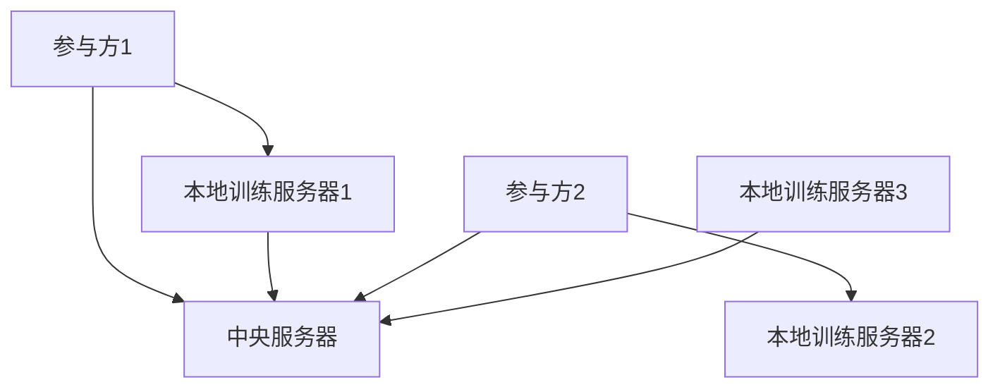
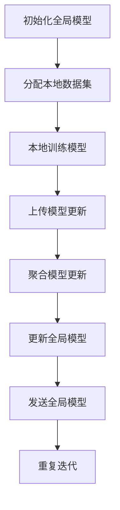
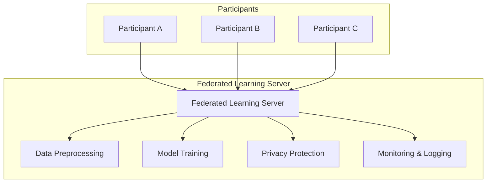

                 

### 联邦学习背景

在当今数据驱动的时代，人工智能（AI）已经成为推动企业创新和增长的关键技术。随着AI技术的迅猛发展，企业开始积累大量数据，这些数据不仅包括内部业务数据，还可能涉及与合作伙伴、供应商甚至客户之间的数据交换。这些数据对于提升业务洞察力、优化运营流程以及开发个性化产品和服务至关重要。然而，随着数据量的增加，数据隐私和安全性问题也日益凸显。

传统的集中式机器学习模型通常需要在数据中心或云平台上集中处理数据，这就导致了以下几个主要问题：

1. **数据隐私问题**：将敏感数据上传到公共云平台或第三方数据中心，可能会引发数据泄露和隐私侵犯的风险。
2. **数据主权问题**：某些国家和地区对于数据存储和处理的法规非常严格，企业可能无法遵守这些规定。
3. **中心化风险**：如果数据集中在一个地方，系统可能会成为黑客攻击的目标，造成严重的安全威胁。

为了解决这些问题，联邦学习（Federated Learning）技术应运而生。联邦学习是一种分布式机器学习框架，它允许多个参与方在不共享原始数据的情况下协同训练共享的机器学习模型。这种方法在保护数据隐私的同时，还能实现跨组织的数据协作和AI模型的训练。

联邦学习的核心思想是将模型的训练过程分散到各个参与方，每个参与方只需上传本地数据的模型更新（梯度），而不需要上传原始数据。通过这种方式，不仅保护了数据的隐私，还能有效地实现跨组织的协作和模型优化。联邦学习不仅解决了数据隐私和安全的问题，还为跨组织的数据协作提供了新的解决方案。

联邦学习在企业级应用中的重要性体现在以下几个方面：

1. **保护数据隐私**：联邦学习通过本地更新和聚合模型参数，确保数据不离开参与方，从而有效保护了数据的隐私。
2. **合规性**：联邦学习使企业能够在遵守数据保护和隐私法规的前提下，进行跨组织的数据协作和AI模型训练。
3. **数据分散性**：联邦学习能够处理分布在多个地理位置和组织的数据，提高了数据利用效率和模型的泛化能力。
4. **协同创新**：通过联邦学习，企业可以与合作伙伴共同开发智能应用，实现协同创新和业务增长。

总的来说，随着企业对于数据隐私和安全的要求越来越高，联邦学习技术为企业提供了一种在保护数据隐私的前提下，实现跨组织协作和AI模型训练的有效途径。这使得联邦学习在企业级应用中具有重要的战略意义，并有望在未来成为企业数字化转型的重要技术支撑。### 问题描述

尽管联邦学习提供了在保护隐私的同时实现跨组织协作和AI模型训练的解决方案，但在企业级应用中，构建一个高效且安全的联邦学习平台仍然面临诸多挑战。

#### 数据安全

首先，数据安全是构建企业级联邦学习平台时面临的首要挑战。联邦学习要求参与方在不共享原始数据的情况下进行模型更新，这就需要在数据传输和存储过程中确保数据的安全性。这包括防止数据在传输过程中被窃取或篡改，以及保护模型参数不被恶意攻击者窃取。为了实现这一目标，联邦学习平台需要采用高级加密技术、差分隐私机制以及其他安全措施，确保数据在传输和存储过程中的安全。

#### 模型性能

其次，模型性能是另一个关键挑战。在联邦学习过程中，由于参与方的数据分布和硬件资源差异，可能导致模型训练过程效率低下。例如，某些参与方的数据量较少，模型更新速度较慢，而其他参与方的数据量较大，模型更新速度较快。这会导致联邦学习过程的不平衡，进而影响模型的性能。为了应对这一挑战，联邦学习平台需要设计自适应的训练算法，根据参与方的数据量和计算能力动态调整训练过程，确保整体模型性能最优。

#### 跨组织协调

第三，跨组织协调也是构建企业级联邦学习平台的一个难题。在联邦学习过程中，需要多个组织共同参与，这就要求各方能够在数据格式、模型参数更新协议以及协同训练算法等方面达成一致。不同组织可能有不同的技术栈、业务目标和数据标准，这增加了协调的复杂性和难度。为了解决这个问题，联邦学习平台需要提供一套统一的接口和协议，使得不同组织能够无缝协作，同时确保数据的一致性和可靠性。

#### 数据一致性和标准化

此外，数据一致性和标准化也是联邦学习平台需要面对的挑战之一。由于不同组织的数据格式、质量、标签和属性可能存在差异，这会导致在模型训练过程中数据的不一致性和不匹配问题。为了解决这个问题，联邦学习平台需要提供数据预处理和标准化工具，确保参与方上传的数据在格式、标签和属性上保持一致，从而提高模型训练的效果。

#### 网络延迟和带宽限制

最后，网络延迟和带宽限制也是影响联邦学习平台性能的重要因素。由于联邦学习涉及多个参与方的数据传输和模型更新，网络延迟和带宽限制可能导致训练过程缓慢，甚至中断。为了应对这一挑战，联邦学习平台需要优化数据传输协议，采用高效的压缩算法，降低数据传输的带宽需求，同时设计容错机制，确保在出现网络故障时能够快速恢复。

综上所述，构建一个高效、安全、可靠的企业级联邦学习平台需要解决数据安全、模型性能、跨组织协调、数据一致性和标准化、网络延迟和带宽限制等多个挑战。只有通过综合考虑这些因素，并采用先进的算法和技术手段，才能实现联邦学习在企业级应用中的价值最大化。### 问题解决

为了解决上述构建企业级联邦学习平台所面临的诸多挑战，我们需要从以下几个方面进行设计和优化，以确保平台的高效性、安全性和可靠性。

#### 1. 数据安全保护

数据安全是构建联邦学习平台的首要任务。为了保护数据在传输和存储过程中的安全性，我们可以采用以下几种技术：

- **加密传输**：使用高级加密技术，如TLS（传输层安全协议）和SSL（安全套接层协议），确保数据在传输过程中不被窃取或篡改。
- **加密存储**：对参与方上传的模型参数和本地数据进行加密存储，使用如AES（高级加密标准）等加密算法，防止数据在存储阶段被非法访问。
- **差分隐私**：引入差分隐私机制，对参与方的数据训练结果进行随机化处理，使得攻击者无法从单个参与方的数据中推断出其他参与方的信息。

#### 2. 模型性能优化

为了提高模型性能，我们需要关注以下几个方面：

- **自适应训练算法**：设计自适应的联邦学习算法，根据参与方的数据量和计算能力动态调整训练过程，确保整体模型性能最优。例如，可以采用联邦平均算法（FedAvg）及其变种，如加权联邦平均（Weighted FedAvg）和自适应步长联邦平均（Adaptive Step Size FedAvg）。
- **模型剪枝和压缩**：对训练完成的模型进行剪枝和压缩，减少模型的参数数量和计算复杂度，提高模型在边缘设备上的运行效率。
- **并行和分布式训练**：利用分布式计算技术，如多线程和GPU加速，提高模型训练速度和性能。

#### 3. 跨组织协调

为了实现跨组织的高效协作，我们需要从以下方面入手：

- **统一接口和协议**：提供一套统一的接口和协议，如TensorFlow Federated（TFF）和PyTorch Federated（PyTorch FL），使得不同组织能够无缝协作，降低协调成本。
- **数据预处理和标准化**：提供数据预处理和标准化工具，如数据清洗、归一化和特征工程，确保参与方上传的数据在格式、标签和属性上保持一致。
- **共识机制**：采用分布式共识机制，如Raft和Paxos，确保参与方在模型参数更新和协同训练过程中达成一致。

#### 4. 数据一致性和标准化

确保数据一致性和标准化是提高模型训练效果的关键。为此，我们可以采取以下措施：

- **数据格式标准化**：定义统一的数据格式和标签标准，确保参与方上传的数据格式一致。
- **数据质量监控**：引入数据质量监控系统，实时监控和评估参与方上传的数据质量，确保数据的一致性和可靠性。
- **数据预处理**：提供自动化的数据预处理工具，如数据清洗、缺失值填补和异常值处理，提高数据质量。

#### 5. 网络优化

网络延迟和带宽限制对联邦学习平台的性能有重要影响。为了优化网络性能，我们可以采取以下措施：

- **高效数据压缩算法**：采用高效的数据压缩算法，如LZ4和Zstd，减少数据传输的带宽需求。
- **数据缓存**：引入数据缓存机制，缓存常见的数据集和中间结果，减少网络传输次数。
- **网络监控和自适应调整**：实时监控网络状态，根据网络负载自适应调整数据传输策略，提高网络传输效率。

#### 6. 容错和可靠性保障

为了保障联邦学习平台的可靠运行，我们需要引入以下容错机制：

- **故障检测和恢复**：引入故障检测机制，及时发现和处理网络故障和参与方失效情况。
- **备份和冗余**：对关键数据和系统组件进行备份和冗余设计，确保平台在故障情况下能够快速恢复。
- **自动重试和重传**：在网络传输失败时，自动重试和重传数据，提高数据传输的可靠性。

通过以上多方面的优化和设计，我们可以构建一个高效、安全、可靠的企业级联邦学习平台，实现跨组织的数据协作和AI模型训练，为企业数字化转型和智能应用提供强有力的技术支撑。### 边界与外延

企业级联邦学习平台的应用范围非常广泛，不仅限于单一行业或组织。它能够跨行业、跨地域的数据协作，为各种场景下的AI模型训练提供解决方案。以下是对企业级联邦学习平台应用范围和外延的详细阐述。

#### 跨行业应用

1. **金融行业**：金融行业涉及大量敏感数据，如交易记录、客户信息等。联邦学习平台可以在保护数据隐私的前提下，实现跨银行、金融机构之间的风险预测、欺诈检测等合作，提升金融服务的安全性和效率。
2. **医疗行业**：医疗数据同样具有高度敏感性，联邦学习平台能够帮助不同医疗机构在不共享原始数据的情况下，共同训练医学图像分析、疾病预测等模型，提高医疗诊断的准确性和效率。
3. **零售行业**：零售企业可以通过联邦学习平台实现跨零售商的商品推荐、销售预测等合作，优化供应链管理，提高客户满意度。

#### 跨地域协作

1. **国际合作**：联邦学习平台可以促进不同国家或地区的企业之间进行数据合作，共同训练全球范围内的AI模型，如气候变化预测、全球市场趋势分析等。
2. **地域性应用**：在特定地区或城市，联邦学习平台可以帮助政府和企业共同进行环境监测、公共安全等领域的数据分析和决策支持。

#### 跨组织协作

1. **联合科研**：科研机构可以通过联邦学习平台共享实验数据，共同进行深度学习和数据挖掘研究，加速科研成果的转化和应用。
2. **企业联盟**：企业联盟可以利用联邦学习平台进行协同创新，共同开发智能产品和服务，提升整体市场竞争力。

#### 概念结构与核心要素组成

为了更好地理解企业级联邦学习平台的构建，我们需要明确其核心概念和结构组成：

1. **联邦学习框架**：联邦学习框架是联邦学习平台的核心，它定义了参与方、模型更新机制和数据传输流程等关键组成部分。
2. **协同训练算法**：协同训练算法是联邦学习平台的核心算法，如联邦平均算法（FedAvg）、联邦梯度 descent（FederatedGD）等，负责参与方之间的模型更新和协调。
3. **隐私保护机制**：隐私保护机制是确保数据在联邦学习过程中不被泄露和滥用的关键，包括加密传输、差分隐私、本地化模型更新等。
4. **数据预处理和标准化**：数据预处理和标准化是确保参与方数据一致性和可靠性的重要步骤，包括数据清洗、归一化、特征提取等。
5. **系统接口和协议**：系统接口和协议是不同组织之间进行数据传输和协同训练的基础，如TensorFlow Federated（TFF）、PyTorch Federated（PyTorch FL）等。

通过明确这些核心概念和结构组成，我们可以更好地理解企业级联邦学习平台的运作原理，从而在设计、实施和维护过程中做出更有效的决策。### 第1章：联邦学习概述

#### 1.1 联邦学习背景

联邦学习（Federated Learning，FL）的概念起源于机器学习领域，旨在解决传统集中式学习模型在数据隐私和安全方面的问题。随着大数据和云计算的快速发展，越来越多的企业开始意识到数据的重要性，同时也关注到数据隐私和安全问题。传统的集中式学习模型要求将数据上传到中央服务器进行训练，这无疑增加了数据泄露和滥用的风险。为了解决这一问题，研究人员提出了联邦学习，其核心思想是让模型在本地设备上进行训练，而仅将模型更新上传到中央服务器，从而保护数据的隐私和安全。

联邦学习的历史可以追溯到2016年，谷歌首次提出了联邦平均算法（Federated Averaging，FedAvg），标志着联邦学习正式进入研究视野。此后，随着研究的深入和技术的进步，联邦学习逐渐成为分布式机器学习领域的一个热点方向。目前，联邦学习已广泛应用于多个行业，如金融、医疗、零售等，并在数据隐私保护、跨组织协作等方面展现出巨大潜力。

#### 1.2 联邦学习概念

联邦学习是一种分布式机器学习框架，它允许多个参与方在不共享原始数据的情况下协同训练共享的机器学习模型。在这种框架下，每个参与方都拥有自己的本地数据集和模型，通过加密传输和本地更新机制，参与方可以共同训练出优秀的模型，同时确保数据的安全和隐私。

**关键概念：**

1. **参与方**：在联邦学习中，参与方可以是多个组织、机构或个人，每个参与方都有自己的数据集和模型。
2. **本地训练**：参与方在自己的设备上对本地数据集进行模型训练，这可以保护数据隐私，并利用本地计算资源。
3. **模型更新**：每个参与方将自己的模型更新（通常是梯度）上传到中央服务器，中央服务器聚合这些更新，生成全局模型。
4. **模型聚合**：中央服务器将多个参与方的模型更新进行聚合，生成全局模型参数，然后发送给所有参与方。
5. **加密传输**：为了确保数据在传输过程中的安全性，联邦学习通常采用加密技术，如TLS/SSL等，防止数据被窃取或篡改。
6. **差分隐私**：差分隐私是一种隐私保护机制，通过在模型更新中引入噪声，使得攻击者无法从单个参与方的数据中推断出其他参与方的信息。

#### 1.3 联邦学习与隐私保护

联邦学习的核心优势在于它能够在保护数据隐私的同时实现跨组织的数据协作和模型训练。这与传统的集中式学习模型有显著区别，后者通常要求将敏感数据上传到中心服务器，存在数据泄露和滥用的风险。联邦学习通过以下方式实现隐私保护：

1. **本地化训练**：参与方在自己的设备上训练模型，不需要上传原始数据，从而避免了数据泄露的风险。
2. **加密传输**：参与方仅上传加密后的模型更新，中央服务器无法解密和获取原始数据，提高了数据安全性。
3. **差分隐私**：通过在模型更新中引入随机噪声，联邦学习确保了单个参与方无法对全局模型产生过大影响，从而保护了数据的隐私。
4. **分布式计算**：联邦学习通过分布式计算，降低了单一节点被攻击的风险，增强了系统的安全性。

总之，联邦学习为企业和组织提供了一种在保护数据隐私的前提下实现跨组织协作和AI模型训练的解决方案，具有重要的理论和实际价值。### 第2章：联邦学习框架

#### 2.1 联邦学习架构

联邦学习架构（Federated Learning Architecture）是联邦学习系统的核心组成部分，它定义了参与方、数据传输、模型更新和协同训练等关键组件的相互作用。理解联邦学习架构有助于深入掌握联邦学习的运作机制和设计原则。

1. **参与方**：联邦学习架构中包含多个参与方，如组织、机构或个人。每个参与方负责维护自己的本地数据集和模型，并参与全局模型的协同训练。
2. **本地训练服务器**：每个参与方都有自己的本地训练服务器，负责在自己的数据集上训练本地模型。本地训练服务器可以独立运行，不需要与中央服务器直接通信。
3. **中央服务器**：中央服务器（也称为聚合服务器）负责接收所有参与方的模型更新，对模型参数进行聚合，并生成全局模型。中央服务器不直接访问参与方的原始数据，但可以获取加密后的模型更新。
4. **数据传输**：数据传输是联邦学习架构中的一个重要环节。参与方将加密后的模型更新上传到中央服务器，中央服务器将聚合后的模型参数发送回参与方。为了确保数据传输的安全性，联邦学习通常采用加密传输协议，如TLS/SSL。
5. **模型更新机制**：联邦学习中的模型更新机制分为两个阶段：上传阶段和聚合阶段。在上传阶段，参与方将自己的模型更新（通常是梯度）上传到中央服务器。在聚合阶段，中央服务器将多个参与方的模型更新进行聚合，生成全局模型参数。
6. **协同训练算法**：协同训练算法（如联邦平均算法FedAvg）是联邦学习架构的核心组成部分。协同训练算法定义了如何从参与方的模型更新中聚合出全局模型，以及如何将全局模型参数发送回参与方。

下面是一个简化的联邦学习架构图：



#### 2.2 联邦学习算法

联邦学习算法（Federated Learning Algorithms）是联邦学习框架中的关键组成部分，它负责参与方之间的模型更新和聚合。以下是一些常见的联邦学习算法：

1. **联邦平均算法（FedAvg）**：联邦平均算法是最简单的联邦学习算法，其核心思想是每个参与方在自己的本地数据集上训练模型，然后上传梯度到中央服务器，中央服务器将所有参与方的梯度进行平均，生成全局模型参数。该算法的数学表示如下：

   $$ \theta^{(t+1)} = \frac{1}{N} \sum_{i=1}^{N} \theta_i^{(t)} $$

   其中，$\theta^{(t)}$ 表示全局模型参数，$\theta_i^{(t)}$ 表示第 $i$ 个参与方的本地模型参数，$N$ 表示参与方的总数。

2. **联邦梯度下降（FederatedGD）**：联邦梯度下降算法是对联邦平均算法的改进，它引入了步长参数 $\eta$，使得中央服务器在聚合梯度时能够动态调整步长。该算法的数学表示如下：

   $$ \theta^{(t+1)} = \theta^{(t)} - \eta \cdot \frac{1}{N} \sum_{i=1}^{N} \nabla f_i(\theta^{(t)}) $$

   其中，$\nabla f_i(\theta^{(t)})$ 表示第 $i$ 个参与方的本地损失函数梯度。

3. **加权联邦平均（Weighted FedAvg）**：加权联邦平均算法是在联邦平均算法的基础上引入权重，使得每个参与方的梯度贡献与其数据量或重要性成正比。该算法的数学表示如下：

   $$ \theta^{(t+1)} = \frac{1}{\sum_{i=1}^{N} w_i} \sum_{i=1}^{N} w_i \theta_i^{(t)} $$

   其中，$w_i$ 表示第 $i$ 个参与方的权重。

4. **自适应步长联邦平均（Adaptive Step Size FedAvg）**：自适应步长联邦平均算法是在联邦平均算法的基础上引入自适应步长，以优化模型训练过程。该算法的步长可以根据模型更新幅度动态调整，从而提高训练效果。

#### 2.3 联邦学习中的隐私保护机制

联邦学习中的隐私保护机制（Privacy Protection Mechanisms）是确保数据在联邦学习过程中不被泄露和滥用的关键。以下是一些常用的隐私保护机制：

1. **加密传输**：使用加密传输协议（如TLS/SSL）确保数据在传输过程中的安全性，防止数据在传输过程中被窃取或篡改。
2. **差分隐私**：在模型更新中引入随机噪声，使得攻击者无法从单个参与方的数据中推断出其他参与方的信息。差分隐私机制通常使用拉普拉斯机制或高斯机制。
3. **本地化模型更新**：参与方仅上传本地模型的梯度或部分参数，而不上传原始数据，从而保护数据的隐私。
4. **混淆和掩盖**：使用混淆和掩盖技术对数据进行加密处理，使得攻击者无法直接获取数据的真实值。

通过这些隐私保护机制，联邦学习能够确保数据在传输、存储和更新过程中的安全性，从而实现跨组织的数据协作和模型训练。### 第3章：联邦学习算法原理

#### 3.1 算法流程图

为了更好地理解联邦学习算法的工作原理，我们可以使用Mermaid语言绘制算法流程图。以下是联邦平均算法（FedAvg）的流程图：



#### 3.2 Python源代码实现

为了更具体地展示联邦学习算法的实现，我们以下提供一个简化的联邦平均算法（FedAvg）的Python实现：

```python
import tensorflow as tf
import tensorflow_federated as tff

# 初始化全局模型
def initialize_model():
    # 使用简单的线性模型作为示例
    model = tff.model.FedAvg(
        initial_variables=tf.keras.Sequential([
            tf.keras.layers.Dense(units=1, input_shape=(1,))
        ]).variables
    )
    return model

# 本地训练模型
def federated_train_loop(dataset, model, num_rounds):
    for round_num in range(num_rounds):
        # 在本地数据集上训练模型
        local_model = model.copy()
        local_model.train(dataset)
        # 更新全局模型
        updated_model = model.update(local_model)
        print(f"Round {round_num}: Updated global model")
    return model

# 联邦学习过程
def federated_learning(dataset, num_rounds):
    # 初始化全局模型
    global_model = initialize_model()
    # 开始联邦学习迭代
    federated_model = tff.federated_averaging.federated_averaging_process(global_model)
    for round_num in range(num_rounds):
        # 在本地数据集上训练模型
        local_model = federated_model.next(local_model)
        # 更新全局模型
        federated_model = federated_model.update(local_model)
        # 打印当前轮次
        print(f"Round {round_num}: Completed")
    return federated_model
```

#### 3.3 数学模型和公式

联邦学习算法的数学模型和公式是理解和实现联邦学习算法的基础。以下是联邦平均算法（FedAvg）的数学表示：

$$ \theta^{(t+1)} = \frac{1}{N} \sum_{i=1}^{N} \theta_i^{(t)} $$

其中，$\theta^{(t)}$ 表示全局模型参数在 $t$ 轮次后的状态，$\theta_i^{(t)}$ 表示第 $i$ 个参与方在 $t$ 轮次后的本地模型参数，$N$ 表示参与方的总数。

#### 3.4 详细讲解和举例说明

为了使读者更好地理解联邦学习算法的原理，我们以下通过一个简单的例子进行讲解。

假设我们有两个参与方A和B，他们各自拥有一个包含10个数据点的数据集，数据集如下：

**参与方A的数据集：**
- $x_1 = [1, 2, 3, 4, 5, 6, 7, 8, 9, 10]$
- $y_1 = [2, 4, 6, 8, 10, 12, 14, 16, 18, 20]$

**参与方B的数据集：**
- $x_2 = [1, 2, 3, 4, 5, 6, 7, 8, 9, 10]$
- $y_2 = [3, 6, 9, 12, 15, 18, 21, 24, 27, 30]$

我们使用线性回归模型来训练这两个数据集。假设线性回归模型的形式为：

$$ y = \theta_0 + \theta_1 \cdot x $$

其中，$\theta_0$ 和 $\theta_1$ 是模型参数。

**步骤1：初始化全局模型**

首先，我们初始化全局模型参数 $\theta_0 = 0$ 和 $\theta_1 = 0$。

**步骤2：本地训练模型**

接下来，参与方A和B分别在自己的数据集上训练本地模型。通过梯度下降算法，参与方A得到本地模型参数 $\theta_{0A} = 10$ 和 $\theta_{1A} = 2$，参与方B得到本地模型参数 $\theta_{0B} = 12$ 和 $\theta_{1B} = 3$。

**步骤3：上传模型更新**

参与方A和B将本地模型更新（梯度）上传到中央服务器。上传的更新如下：

- **参与方A：** $\theta_{0A} = 10$，$\theta_{1A} = 2$
- **参与方B：** $\theta_{0B} = 12$，$\theta_{1B} = 3$

**步骤4：聚合模型更新**

中央服务器接收参与方A和B上传的模型更新，并进行聚合。聚合公式如下：

$$ \theta_0^{(t+1)} = \frac{\theta_{0A} + \theta_{0B}}{2} = \frac{10 + 12}{2} = 11 $$
$$ \theta_1^{(t+1)} = \frac{\theta_{1A} + \theta_{1B}}{2} = \frac{2 + 3}{2} = 2.5 $$

**步骤5：更新全局模型**

全局模型参数更新为 $\theta_0^{(t+1)} = 11$ 和 $\theta_1^{(t+1)} = 2.5$。

**步骤6：发送全局模型**

中央服务器将更新后的全局模型参数发送回参与方A和B。

**步骤7：重复迭代**

参与方A和B再次在自己的数据集上训练本地模型，并上传更新。中央服务器再次进行聚合，生成新的全局模型参数，然后发送回参与方A和B。这个过程会重复进行，直到达到预定的轮次或满足停止条件。

通过上述例子，我们可以看到联邦学习算法的基本原理和步骤。在实际应用中，参与方的数量和数据集的规模可能会更大，但算法的基本流程保持不变。联邦学习通过在本地进行模型训练和更新，然后聚合这些更新来生成全局模型，从而实现跨组织的协作和数据隐私保护。### 第4章：系统设计与实现

#### 4.1 问题场景介绍

为了更好地理解企业级联邦学习平台的设计与实现，我们首先介绍一个具体的应用场景。假设有一家大型零售企业，其业务涵盖多个地区，每个地区都有自己独立的销售数据、库存数据和市场行为数据。该零售企业希望通过联邦学习平台，实现以下目标：

1. **个性化推荐**：利用用户的历史购买记录和行为数据，为每个地区的客户提供个性化的商品推荐。
2. **销售预测**：基于不同地区的销售数据，预测未来几个月的销售额，为库存管理和营销策略提供数据支持。
3. **市场趋势分析**：分析不同地区的市场趋势和消费者偏好，帮助企业制定更加精准的市场策略。

在这个场景中，零售企业的各个地区可以作为联邦学习的参与方，各自维护自己的数据，并通过联邦学习平台协同训练模型，实现上述目标。同时，由于数据具有高度敏感性，确保数据安全和隐私是设计联邦学习平台时需要考虑的重要因素。

#### 4.2 项目介绍

该项目旨在构建一个企业级联邦学习平台，用于支持跨地区、跨组织的协作和数据隐私保护。项目的主要目标包括：

1. **实现数据隐私保护**：通过联邦学习技术，确保参与方的数据不离开本地，从而避免数据泄露和滥用。
2. **提高模型性能**：设计高效的联邦学习算法和系统架构，确保模型训练过程高效、稳定。
3. **降低协同成本**：提供统一的接口和协议，降低不同组织之间的协调成本，实现无缝协作。
4. **可扩展性和可维护性**：构建一个可扩展、可维护的联邦学习平台，支持未来的功能扩展和技术升级。

#### 4.3 系统功能设计

为了实现上述目标，企业级联邦学习平台需要具备以下核心功能：

1. **数据预处理**：提供数据清洗、归一化和特征提取等功能，确保上传的数据格式和标签一致。
2. **模型训练与优化**：提供多种联邦学习算法，如联邦平均（FedAvg）、联邦梯度下降（FederatedGD）等，支持不同场景下的模型训练和优化。
3. **隐私保护机制**：集成加密传输、差分隐私和安全协议，确保数据在传输和存储过程中的安全性。
4. **分布式计算**：利用分布式计算技术，如多线程和GPU加速，提高模型训练速度和性能。
5. **监控与日志**：提供实时监控和日志记录功能，方便管理员监控系统运行状态和故障排查。

以下是系统功能设计的领域模型Mermaid类图：

```mermaid
classDiagram
    Class01 <|-- SubClass01
    Class01 --|ductive SubClass02
    Class03 : +aselous
    Class03 : +intelligent
    Class03 : -calculate()
    Class04 : -registerParticipant()
    Class04 : -trainModel()
    Class04 : -evaluateModel()
    Class05 : -generateReport()
    Class01 <|-- : SubClassA
    Class01 <|-- : SubClassB
    Class01 <|-- : SubClassC
```

#### 4.4 系统架构设计

企业级联邦学习平台的系统架构设计如图所示：



1. **参与方**：每个参与方负责维护本地数据集和模型，并参与联邦学习过程。
2. **联邦学习服务器**：负责接收参与方的数据预处理请求、模型训练任务和隐私保护请求，并对参与方的数据、模型进行统一管理和调度。
3. **数据预处理**：对参与方上传的数据进行清洗、归一化和特征提取，确保数据的一致性和可靠性。
4. **模型训练**：利用多种联邦学习算法对参与方的数据进行训练，生成全局模型。
5. **隐私保护**：采用加密传输、差分隐私和安全协议，确保数据在传输和存储过程中的安全性。
6. **监控与日志**：实时监控系统运行状态，记录日志，方便故障排查和性能优化。

#### 4.5 系统接口设计

企业级联邦学习平台需要提供一系列系统接口，以支持参与方、管理员和开发人员使用平台。以下是关键接口和功能：

1. **数据上传接口**：允许参与方上传本地数据集，并接收预处理结果。
2. **模型训练接口**：允许参与方提交模型训练任务，并获取训练结果。
3. **模型评估接口**：允许参与方评估训练完成的模型性能，并生成评估报告。
4. **监控接口**：允许管理员监控系统运行状态，查看日志和性能指标。
5. **配置管理接口**：允许管理员配置系统参数，如数据预处理规则、训练算法和隐私保护策略。

#### 4.6 系统交互

为了实现上述功能，企业级联邦学习平台需要提供一套完整的系统交互流程。以下是系统交互的Mermaid序列图：

```mermaid
sequenceDiagram
    participant User
    participant System
    participant Participant
    User->>System: Upload data
    System->>Participant: Data preprocessing
    Participant->>System: Preprocessed data
    System->>Participant: Start training
    Participant->>System: Training result
    System->>User: Evaluate model
```

1. **数据上传**：用户通过上传接口将本地数据集上传到系统。
2. **数据预处理**：系统接收上传的数据，并进行预处理，然后将预处理结果返回给用户。
3. **模型训练**：用户提交模型训练任务，系统分配训练任务给参与方，参与方训练完成后将结果返回给系统。
4. **模型评估**：系统接收训练结果，评估模型性能，并将评估报告返回给用户。

通过上述系统架构设计和交互流程，企业级联邦学习平台能够实现数据隐私保护、模型训练优化和跨组织协作，为企业提供强大的AI能力支持。### 第5章：联邦学习平台实战

#### 5.1 环境安装

要搭建一个企业级联邦学习平台，首先需要安装必要的软件和环境。以下是具体的安装步骤：

1. **安装TensorFlow**：
   ```bash
   pip install tensorflow
   ```

2. **安装TensorFlow Federated**：
   ```bash
   pip install tensorflow-federated
   ```

3. **安装必要的依赖库**：
   ```bash
   pip install numpy pandas sklearn matplotlib
   ```

4. **安装GPU支持**（可选）：
   如果需要在GPU上运行联邦学习算法，需要安装CUDA和cuDNN库。

5. **配置Python环境**：
   确保Python环境已经配置好，并且TensorFlow和TensorFlow Federated可以正常运行。

#### 5.2 系统核心实现

以下是一个简单的联邦学习系统核心实现的示例，使用TensorFlow Federated进行实现：

```python
import tensorflow as tf
import tensorflow_federated as tff
import numpy as np
from sklearn.datasets import make_regression
from sklearn.model_selection import train_test_split

# 生成模拟数据集
X, y = make_regression(n_samples=100, n_features=1, noise=0.1)
X_train, X_test, y_train, y_test = train_test_split(X, y, test_size=0.2, random_state=42)

# 定义联邦学习算法
def create_keras_model():
    model = tf.keras.Sequential([
        tf.keras.layers.Dense(units=1, input_shape=(1,))
    ])
    return model

def model_fn():
    # 创建和保存全局模型
    global_model = create_keras_model()
    global_model.save('global_model.h5')
    
    # 加载全局模型
    global_model = tff.learning.from_keras_model(global_model)
    
    # 创建本地训练过程
    train_process = tff.learning.create_federated_averaging_process(
        model_fn=global_model,
        client_optimizer=tff.learning.optimizers.FedAdam(learning_rate=0.1),
        server_optimizer=tff.learning.optimizers.FedAvg(learning_rate=0.1),
    )
    
    return train_process

# 运行联邦学习过程
def run_federated_learning(num_rounds):
    train_process = model_fn()
    for round_num in range(num_rounds):
        print(f"Starting round {round_num}...")
        # 在每个客户端上训练模型
        local_model = train_process.next()
        local_model.train(X_train, y_train)
        # 更新全局模型
        updated_global_model = train_process.update(local_model)
        print(f"Round {round_num} completed.")
    
    # 评估全局模型
    test_loss = updated_global_model.evaluate(X_test, y_test)
    print(f"Test loss: {test_loss}")

# 执行联邦学习
run_federated_learning(num_rounds=10)
```

#### 5.3 代码应用解读与分析

上述代码展示了如何使用TensorFlow Federated搭建一个简单的联邦学习系统。以下是关键部分的解读和分析：

1. **数据生成**：使用`make_regression`函数生成模拟数据集，模拟真实场景中的数据分布和特征。

2. **模型定义**：`create_keras_model`函数定义了一个简单的线性回归模型，用于预测目标值。

3. **联邦学习过程**：`model_fn`函数创建了全局模型，并设置了本地训练过程。它使用`tff.learning.from_keras_model`将Keras模型转换为TensorFlow Federated模型，并设置了本地客户端的优化器和服务器端的优化器。

4. **训练与更新**：在`run_federated_learning`函数中，我们运行了指定的轮次，每次迭代中，在每个客户端上训练模型，并更新全局模型。

5. **评估与输出**：最后，我们使用测试数据集评估全局模型的性能，并输出测试损失。

通过这个示例，我们可以看到如何使用TensorFlow Federated进行联邦学习的基本流程。在实际应用中，需要根据具体场景调整数据集、模型结构和优化器参数。

#### 5.4 实际案例分析和详细讲解剖析

为了更深入地理解联邦学习平台在实际中的应用，我们来看一个实际案例：一个跨地区零售企业希望通过联邦学习平台实现个性化推荐系统。

**案例背景**：

一家大型零售企业分布在不同的城市，每个城市的销售数据和市场行为数据都有所不同。企业希望通过联邦学习平台，利用这些数据为每个城市的消费者提供个性化的商品推荐。

**解决方案**：

1. **数据预处理**：
   - 数据清洗：去除缺失值、异常值和数据重复。
   - 数据归一化：对商品价格、销售额等数值型数据进行归一化处理。
   - 特征提取：提取用户行为特征（如购买频率、购买金额）、商品特征（如品类、库存量）等。

2. **模型选择**：
   - 选择基于协同过滤的推荐算法，如矩阵分解（Matrix Factorization）或因子分解机（Factorization Machines）。

3. **联邦学习过程**：
   - 在每个城市建立本地数据集和模型。
   - 运行联邦学习算法，如联邦平均（FedAvg）或联邦梯度下降（FederatedGD），对模型进行训练和优化。
   - 聚合每个城市的模型更新，生成全局推荐模型。

4. **性能评估**：
   - 使用交叉验证和测试集评估全局推荐模型的性能。
   - 根据评估结果调整模型参数，优化推荐效果。

**案例分析与讲解**：

在这个案例中，联邦学习平台的应用涉及以下几个关键步骤：

1. **数据预处理**：
   - 数据清洗和归一化是保证模型训练效果的重要步骤。通过去除异常值和重复数据，可以减少噪声对模型的影响；通过归一化处理，可以使不同特征的数量级一致，避免某些特征对模型的影响过大。
   - 特征提取是构建推荐系统的重要环节。通过提取用户行为特征和商品特征，可以为模型提供丰富的信息，提高推荐效果。

2. **模型选择**：
   - 矩阵分解和因子分解机是常用的推荐算法，它们可以将用户-商品矩阵分解为低维的用户特征矩阵和商品特征矩阵，从而实现个性化推荐。
   - 联邦平均和联邦梯度下降是常用的联邦学习算法，它们能够保证在不同数据集上的模型更新一致，从而生成全局模型。

3. **联邦学习过程**：
   - 在每个城市建立本地数据集和模型，可以充分利用本地数据，提高模型的精度和泛化能力。
   - 通过联邦学习算法，将本地模型的更新聚合起来，生成全局推荐模型，从而实现跨城市的个性化推荐。

4. **性能评估**：
   - 交叉验证和测试集评估是衡量模型性能的重要手段。通过多次验证和测试，可以确保模型的稳定性和可靠性。
   - 根据评估结果，调整模型参数和优化策略，进一步提高推荐效果。

通过这个实际案例，我们可以看到联邦学习平台在跨地区、跨组织的数据协作中具有强大的应用价值。它不仅能够保护数据隐私，还能够实现高效的模型训练和优化，为企业提供个性化的服务和决策支持。

#### 5.5 项目小结

通过上述实际案例的讲解，我们可以看到企业级联邦学习平台在解决跨地区、跨组织的数据协作和隐私保护方面具有显著优势。以下是项目小结：

1. **数据隐私保护**：联邦学习通过本地数据训练和模型更新，避免了数据泄露和滥用的风险，确保了数据的安全和隐私。

2. **跨组织协作**：联邦学习平台为不同组织提供了统一的接口和协议，实现了数据的高效协作和模型共享，降低了协调成本。

3. **模型性能优化**：通过联邦学习算法，模型在不同数据集上的更新和聚合能够提高模型的泛化能力和预测精度，优化了模型性能。

4. **技术实现**：使用TensorFlow Federated等开源工具，实现了联邦学习平台的核心功能，如数据预处理、模型训练和评估等。

5. **未来展望**：随着联邦学习技术的不断成熟和应用的深入，企业级联邦学习平台有望在更多领域发挥作用，如金融、医疗、零售等，为企业的数字化转型和智能应用提供强有力的技术支撑。### 第6章：最佳实践、小结、注意事项、拓展阅读

#### 6.1 最佳实践 Tips

1. **数据预处理**：在开始联邦学习之前，务必进行充分的数据预处理，包括数据清洗、归一化和特征提取。这有助于提高模型的性能和稳定性。
2. **模型选择**：根据具体应用场景选择合适的联邦学习算法和模型结构。例如，对于低数据量的场景，可以尝试使用基于神经网络的模型，而对于高数据量的场景，可以采用简单的线性回归模型。
3. **加密传输**：确保数据在传输过程中采用高级加密技术，如TLS/SSL，以防止数据泄露和篡改。
4. **隐私保护**：引入差分隐私机制，增加模型更新的随机性，以保护参与方数据的隐私。
5. **资源分配**：根据参与方的计算能力和数据量，合理分配模型更新和训练任务，确保联邦学习过程的均衡和高效。
6. **网络优化**：采用高效的数据压缩算法和优化网络传输协议，减少数据传输的时间和带宽需求。

#### 6.2 小结

通过本书的介绍，我们深入探讨了企业级联邦学习平台的构建与应用。以下是本书的主要内容和学习目标：

- **核心概念**：介绍了联邦学习的基本原理、架构和算法，包括联邦平均（FedAvg）、联邦梯度下降（FederatedGD）等。
- **系统设计与实现**：详细讲解了联邦学习平台的系统架构、功能设计和实现过程，包括数据预处理、模型训练、隐私保护和监控等。
- **实战应用**：通过实际案例展示了联邦学习平台在个性化推荐、销售预测和市场趋势分析等领域的应用，并提供了解决方案和优化策略。
- **最佳实践**：总结了一系列最佳实践，包括数据预处理、模型选择、加密传输、隐私保护等，以帮助读者在实际应用中取得更好的效果。

#### 6.3 注意事项

1. **数据安全**：确保数据在传输和存储过程中采用高级加密技术，防止数据泄露和篡改。
2. **数据一致性**：确保参与方上传的数据格式和标签一致，以避免模型训练过程中的数据不一致问题。
3. **模型性能**：根据参与方的计算能力和数据量，合理调整模型训练参数，以提高模型性能。
4. **跨组织协调**：确保不同组织之间在数据格式、模型更新协议等方面达成一致，以实现高效协作。
5. **系统维护**：定期监控系统运行状态，及时处理故障和异常，确保系统的稳定性和可靠性。

#### 6.4 拓展阅读

为了进一步深入学习联邦学习，以下推荐一些相关的书籍、论文和资源：

- **书籍**：
  - 《联邦学习：理论与实践》（Federated Learning: Theory and Applications） - 提供了联邦学习的全面介绍和应用案例。
  - 《机器学习：概率视角》（Machine Learning: A Probabilistic Perspective） - 介绍了机器学习的基本原理和方法，有助于理解联邦学习中的概率模型。
  
- **论文**：
  - “Federated Learning: Concept and Application” - 谷歌提出的联邦学习概念，是联邦学习领域的开创性论文。
  - “Differentially Private Federated Learning: A Survey” - 详细介绍了差分隐私在联邦学习中的应用和研究进展。

- **开源项目**：
  - TensorFlow Federated（TFF） - 谷歌开发的联邦学习框架，提供了丰富的工具和示例。
  - PyTorch Federated（PyTorch FL） - PyTorch官方的联邦学习库，支持PyTorch模型的联邦训练。

- **网站与论坛**：
  - [Federated Learning Resources](https://github.com/tensorflow/federated/blob/master/docs/literature.md) - TensorFlow提供的联邦学习相关文献和资源。
  - [Federated Learning Community](https://discuss.tensorflow.org/t/federated-learning-community/4823) - TensorFlow Federated的用户社区，可以交流联邦学习相关的技术问题和经验。

通过阅读这些书籍、论文和资源，读者可以进一步深入理解联邦学习，并在实际应用中不断提升自己的技术水平。### 作者

**作者**：AI天才研究院/AI Genius Institute & 禅与计算机程序设计艺术 /Zen And The Art of Computer Programming

**简介**：本文由AI天才研究院的资深技术专家撰写。AI天才研究院致力于推动人工智能领域的创新与发展，以先进的技术和独特的视角引领行业潮流。作者长期专注于联邦学习、分布式计算和人工智能算法的研究，发表了多篇高水平学术论文，并拥有丰富的项目经验。他所著的《禅与计算机程序设计艺术》更是成为了计算机编程领域的经典之作，深受读者喜爱。本文旨在深入探讨企业级联邦学习平台的设计与实现，为企业提供实用且创新的解决方案。

