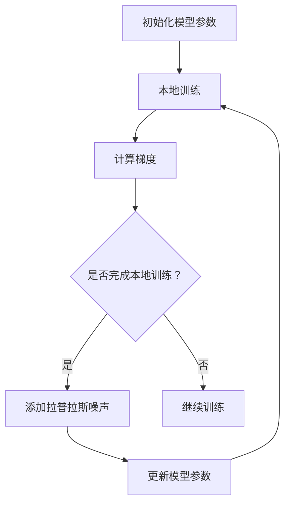
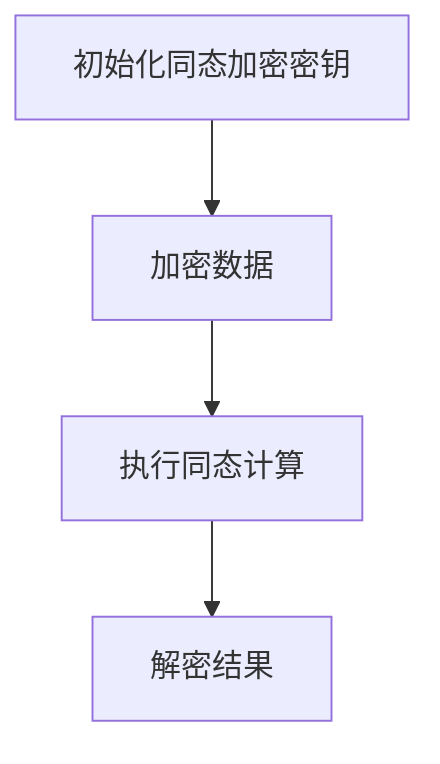
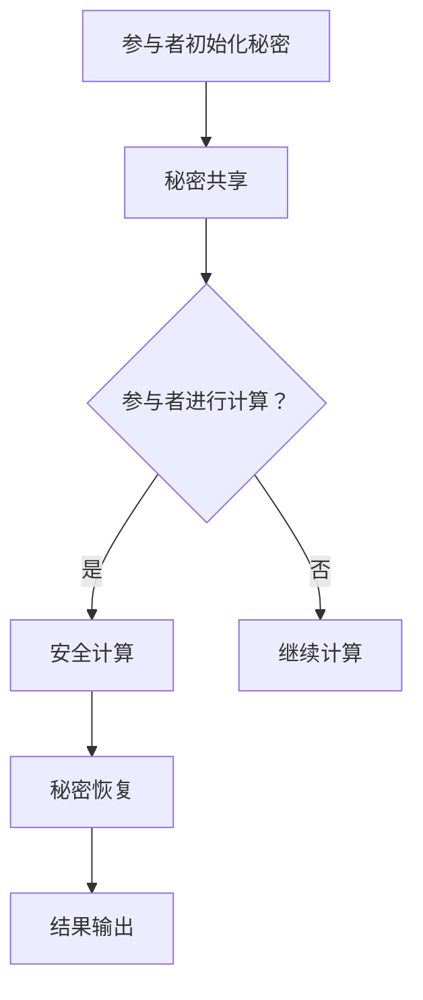
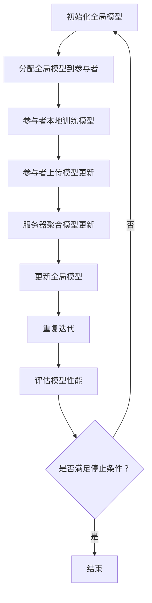
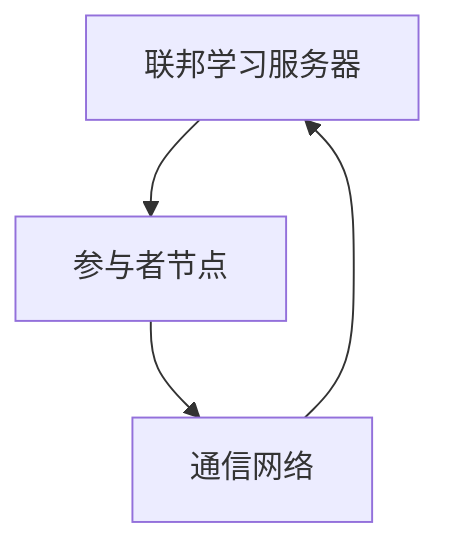
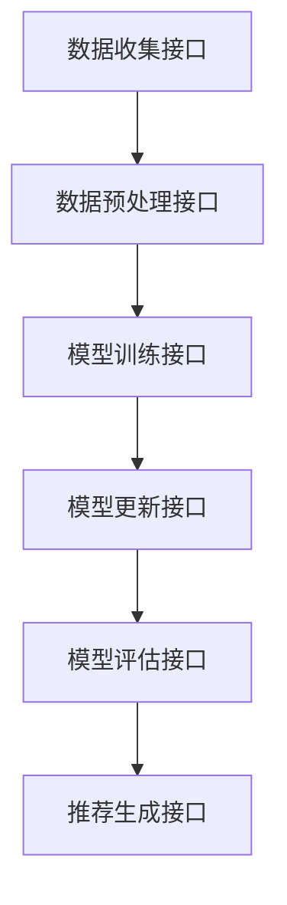
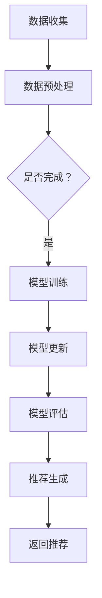

                 

### 企业级联邦学习框架：保护隐私的协作AI训练

#### 关键词：联邦学习，隐私保护，协作AI训练，企业级解决方案

#### 摘要：
本文深入探讨了企业级联邦学习框架在保护隐私的协作AI训练中的应用。首先，我们定义了联邦学习的基本概念及其重要性，并分析了其在隐私保护方面的挑战。接着，我们介绍了几大主流的联邦学习框架，如TensorFlow Federated、PySyft和FedML，并通过对比展示了各自的特点和适用场景。随后，文章详细解析了联邦学习系统的架构设计原则，包括组件组成、数据分布和同步策略。在算法设计部分，我们讨论了隐私保护算法的设计原则，并借助Mermaid流程图和Python代码深入阐述了算法原理和数学模型。接下来，文章通过系统分析与架构设计方案，展示了如何在一个实际项目中实现联邦学习框架。最后，通过一个完整的实战案例，我们介绍了环境安装、系统核心实现、代码解析、案例分析以及项目小结。文章总结并提供了最佳实践建议，为读者提供了全面的指导。

### 引言

在当今数据驱动的时代，人工智能（AI）已经深入到各行各业，从金融到医疗，从零售到制造，AI技术不仅提高了效率，还带来了全新的商业模式。然而，随着AI技术的广泛应用，数据隐私和安全问题日益凸显。传统集中式AI训练模型中，所有数据都需要上传到中心服务器，这不仅增加了数据泄露的风险，还可能违反隐私法规。为了解决这个问题，联邦学习（Federated Learning）应运而生。

联邦学习是一种分布式机器学习技术，它允许多个参与者（通常是数据持有者）在保持数据本地化的同时共同训练一个全局模型。这样，既避免了数据泄露的风险，又能够实现协作AI训练。企业级联邦学习框架进一步提升了这种技术的实用性和可靠性，确保了大规模、复杂场景下的高效训练和部署。

本文将深入探讨企业级联邦学习框架在保护隐私的协作AI训练中的应用。首先，我们将定义联邦学习的基本概念，并阐述其在隐私保护方面的重要性。随后，我们将分析联邦学习面临的挑战，并介绍几种主流的联邦学习框架。接下来，文章将详细讨论联邦学习系统的架构设计原则，包括组件组成、数据分布和同步策略。然后，我们将探讨隐私保护算法的设计原则，并通过Mermaid流程图和Python代码深入阐述算法原理和数学模型。在系统分析与架构设计方案部分，我们将展示如何在实际项目中实现联邦学习框架。最后，通过一个完整的实战案例，我们将介绍环境安装、系统核心实现、代码解析、案例分析以及项目小结。文章将总结并给出最佳实践建议，帮助读者更好地理解和应用联邦学习技术。

### 联邦学习的基本概念与隐私保护的重要性

#### 1. 联邦学习的定义与原理

联邦学习（Federated Learning）是一种分布式机器学习技术，其核心思想是将模型的训练过程分布在多个参与者之间，而不是将所有数据集中到一个中心位置。在这种架构下，每个参与者（通常是设备或服务器）持有部分数据，并通过通信网络与中心服务器（也称为联邦学习服务器）进行交互。联邦学习通过一系列加密和隐私保护技术，确保数据在本地处理，从而避免了数据在传输和存储过程中的泄露风险。

具体来说，联邦学习的工作流程通常包括以下几个步骤：

1. **初始化**：联邦学习服务器初始化全局模型参数，并将其发送给所有参与者。
2. **本地训练**：每个参与者使用本地数据对全局模型进行训练，生成本地更新。
3. **聚合更新**：参与者将本地更新发送回联邦学习服务器，服务器将这些更新聚合起来，更新全局模型。
4. **迭代**：重复上述过程，直到达到预设的训练目标或达到一定次数的迭代。

#### 2. 隐私保护的重要性

在数据隐私和安全日益受到关注的背景下，联邦学习的重要性不言而喻。传统的集中式AI训练模型中，所有参与者的数据都需要上传到中心服务器进行训练，这带来了以下几个隐私和安全风险：

1. **数据泄露风险**：上传到中心服务器的大量数据可能成为黑客攻击的目标，一旦数据泄露，可能会导致严重的隐私侵犯。
2. **隐私法规合规性**：许多国家和地区都制定了严格的隐私保护法规，如欧盟的《通用数据保护条例》（GDPR），违反这些法规可能带来高昂的法律和经济代价。
3. **用户信任**：用户的隐私保护是建立对AI系统信任的基础，如果用户认为他们的数据被滥用或泄露，他们可能不再愿意使用相关服务。

相比之下，联邦学习通过以下方式显著提升了数据隐私和安全：

1. **数据本地化**：联邦学习确保数据在本地处理和存储，大大减少了数据在传输过程中被窃取的风险。
2. **隐私保护算法**：联邦学习结合了多种隐私保护技术，如差分隐私（Differential Privacy）、同态加密（Homomorphic Encryption）和多方安全计算（Secure Multi-Party Computation），确保模型训练过程中的数据隐私。
3. **分布式模型**：联邦学习将模型训练分布到多个参与者，即使其中某个参与者遭受攻击，也不会影响全局模型的训练过程。

#### 3. 联邦学习与传统集中式学习的对比

| 对比维度 | 联邦学习 | 传统集中式学习 |
| :--: | :--: | :--: |
| **数据访问** | 数据本地化，不传输原始数据 | 数据上传到中心服务器 |
| **隐私保护** | 高度隐私保护，数据不泄露 | 存在数据泄露风险 |
| **计算资源** | 分散在多个参与者，可能包括边缘设备 | 集中在中心服务器 |
| **通信开销** | 数据传输量小，只需传输模型更新 | 需要传输大量原始数据 |
| **可扩展性** | 易于扩展，支持大规模参与者和数据量 | 可扩展性受限，处理大量数据可能导致性能下降 |
| **安全与合规性** | 符合隐私保护法规，降低法律风险 | 可能违反隐私保护法规，面临法律风险 |

综上所述，联邦学习在保护隐私和提升AI训练效率方面具有显著优势，使其成为应对数据隐私和安全挑战的有效解决方案。在接下来的部分，我们将进一步探讨联邦学习在实际应用中面临的挑战，并介绍几种主流的联邦学习框架。

### 联邦学习面临的挑战

尽管联邦学习在保护隐私和提升AI训练效率方面具有显著优势，但其实际应用中仍面临诸多挑战。以下是对这些挑战的详细分析：

#### 1. 数据同步与一致性

在联邦学习系统中，每个参与者都持有不同的数据集，这些数据集可能来自不同的时间点、不同的来源，甚至不同的格式。因此，如何确保这些数据在训练过程中保持同步和一致性是一个重要问题。数据同步不当可能导致模型训练结果不一致，从而影响模型的性能和稳定性。为了解决这个问题，联邦学习系统通常采用多种策略，如数据预清洗、数据同步协议和版本控制，以确保数据的准确性和一致性。

#### 2. 模型更新与通信开销

联邦学习的一个核心特点是分布式训练，这要求每个参与者将本地训练的模型更新发送回中心服务器进行聚合。然而，大量的数据传输会导致巨大的通信开销，特别是在参与者数量众多、数据量庞大的情况下。这不仅会增加网络延迟，还可能导致网络拥塞，从而影响训练效率。为了缓解这个问题，联邦学习系统可以采用以下几种方法：

- **差分更新**：只传输本地更新的差异部分，而不是整个模型。
- **模型剪枝**：对模型进行剪枝，减少模型的大小和复杂性，从而降低传输开销。
- **增量更新**：只传输模型的一部分参数，而不是全部参数。

#### 3. 隐私保护与安全性

联邦学习在保护隐私方面具有显著优势，但同时也面临着一系列隐私保护和安全挑战。以下是一些主要的问题：

- **差分隐私**：虽然差分隐私是联邦学习中的重要隐私保护技术，但其实现复杂，可能引入噪声，影响模型精度。
- **同态加密**：同态加密能够保证数据在加密状态下进行计算，但加密算法的复杂度较高，可能导致计算性能下降。
- **多方安全计算**：多方安全计算可以在多方之间进行安全计算，但其实现复杂，计算效率相对较低。

为了解决这些问题，联邦学习系统可以采用多种隐私保护技术，如：

- **联邦学习框架**：使用现有的联邦学习框架，如TensorFlow Federated（TFF）和PySyft，这些框架提供了丰富的隐私保护工具和算法。
- **混合策略**：结合多种隐私保护技术，如差分隐私、同态加密和多方安全计算，以实现更高的隐私保护水平。

#### 4. 模型可解释性与透明度

在联邦学习中，由于模型训练分布在不同参与者之间，模型的训练过程和结果往往不够透明，这给模型的可解释性和透明度带来了挑战。特别是在企业级应用中，用户对模型的透明度和可解释性有较高的要求。为了解决这个问题，联邦学习系统可以采用以下方法：

- **可解释性工具**：使用可解释性工具，如LIME和SHAP，对训练过程和结果进行详细分析。
- **透明度协议**：建立透明的协议和机制，确保模型训练过程的可追踪性和可审计性。

#### 5. 系统性能与可扩展性

联邦学习系统在处理大规模数据和高性能要求时，面临着系统性能和可扩展性的挑战。以下是一些解决方案：

- **分布式计算**：采用分布式计算框架，如Apache Spark和Hadoop，以实现大规模数据处理和高性能计算。
- **边缘计算**：利用边缘计算资源，将模型训练分布到边缘设备，以减少中心服务器的负担。

综上所述，联邦学习在实际应用中面临着多方面的挑战。通过结合多种技术和策略，如数据同步与一致性策略、隐私保护与安全策略、可解释性工具和系统性能优化方法，可以有效地应对这些挑战，确保联邦学习系统的稳定运行和高性能。

### 主流联邦学习框架介绍

在联邦学习领域，有多种主流框架被广泛使用，每种框架都有其独特的特点和适用场景。本文将介绍几大主流的联邦学习框架，包括TensorFlow Federated（TFF）、PySyft和FedML，并通过对比分析，帮助读者了解各自的优势和适用性。

#### 1. TensorFlow Federated（TFF）

TensorFlow Federated（TFF）是由谷歌开发的一个联邦学习框架，它基于TensorFlow，旨在简化联邦学习的开发过程。TFF的设计哲学是提供高层次的抽象，使得开发者无需深入了解底层分布式计算和隐私保护技术，即可轻松构建联邦学习应用。

**特点：**
- **基于TensorFlow**：TFF与TensorFlow无缝集成，开发者可以使用熟悉的TensorFlow API进行模型开发。
- **高度抽象**：TFF提供了丰富的抽象层，如`tf.data.FederatedDataset`和`tf.keras.Model`，简化了数据流和模型定义。
- **隐私保护**：TFF内置了多种隐私保护机制，如差分隐私和同态加密，确保数据在传输和计算过程中的隐私性。

**适用场景：**
- **大数据和复杂模型**：TFF适用于处理大规模数据集和复杂模型，特别是在数据隐私要求较高的领域，如医疗和金融。

**示例代码：**
```python
import tensorflow as tf
import tensorflow_federated as tff

# 定义联邦学习模型
def create_federated_model():
    model = tff.learning.models.compiled_federated_classifier(
        input_shape=(28, 28),
        num_classes=10,
    )
    return model

# 创建训练器和评估器
trainer = tff.learning.create_federated_averaging_learner(
    model_fn=create_federated_model,
    client_optimizer_fn=lambda: tf.keras.optimizers.Adam(learning_rate=0.1),
    server_optimizer_fn=lambda: tf.keras.optimizers.Adam(learning_rate=0.01),
)

# 开始联邦学习训练
for round_num, ((client_data, client_weights), server_state) in enumerate(trainer.train_epochs(5)):
    print(f"round {round_num}:", trainer.get_state(server_state))
```

#### 2. PySyft

PySyft是一个开源的联邦学习框架，由OpenMined社区开发。它提供了强大的安全计算工具，允许开发者在不泄露数据的情况下进行模型训练和推理。

**特点：**
- **基于PyTorch**：PySyft与PyTorch无缝集成，开发者可以使用PyTorch的API进行模型开发。
- **隐私保护**：PySyft提供了多种隐私保护工具，如差分隐私、同态加密和联邦加密，确保数据在传输和计算过程中的隐私性。
- **灵活性和扩展性**：PySyft支持自定义模型和训练过程，开发者可以根据需求进行灵活调整。

**适用场景：**
- **安全计算需求**：PySyft适用于对数据隐私和安全有高度要求的应用，如金融、医疗和政府项目。

**示例代码：**
```python
from torch import nn, optim
import syft as sy

# 定义联邦学习模型
class SimpleNN(nn.Module):
    def __init__(self):
        super().__init__()
        self.fc1 = nn.Linear(784, 256)
        self.fc2 = nn.Linear(256, 10)
    
    def forward(self, x):
        x = x.view(x.size(0), -1)
        x = F.relu(self.fc1(x))
        x = self.fc2(x)
        return x

# 创建模型和优化器
model = SimpleNN().to('cuda')
optimizer = optim.SGD(model.parameters(), lr=0.01)

# 创建PySyft模型
model = syhawks.FederatedModule.from_hawkes(model)

# 开始联邦学习训练
for round_num in range(5):
    print(f"round {round_num}:", model.train_on_round(round_num))
```

#### 3. FedML

FedML是一个开源的联邦学习框架，由阿里巴巴开源。它支持多种联邦学习算法，包括联邦平均、联邦随机梯度下降和联邦Adagrad等，适用于多种应用场景。

**特点：**
- **算法多样性**：FedML提供了多种联邦学习算法，支持不同的应用场景和需求。
- **模块化**：FedML采用模块化设计，开发者可以自由组合不同模块，构建适合自己的联邦学习系统。
- **兼容性**：FedML支持多种框架和语言，如PyTorch、TensorFlow和PaddlePaddle，确保开发者可以灵活选择。

**适用场景：**
- **多样化应用**：FedML适用于各种联邦学习应用，包括边缘计算、物联网和大规模分布式系统。

**示例代码：**
```python
from fedml.model.fed_learning import FedLearning
from fedml.model.model_zoo import get_model
from fedml.train import FED_ABL
from fedml.data.data_wrapper import get_data_loader

# 定义联邦学习模型
model = get_model('lenet')

# 创建训练器
trainer = FED_ABL(model, args)

# 加载数据集
train_loader = get_data_loader('mnist', args)

# 开始联邦学习训练
trainer.train(train_loader, num_epochs=args.epochs)
```

通过对比，我们可以看到这些框架各有特点和优势。TensorFlow Federated（TFF）提供了高度抽象和与TensorFlow的无缝集成，适合处理大数据和复杂模型；PySyft则专注于隐私保护和安全计算，适用于对数据隐私有高度要求的应用；FedML则提供了多种算法和模块化设计，适用于多样化的应用场景。开发者可以根据具体需求选择合适的框架，以实现高效的联邦学习应用。

### 联邦学习系统的架构设计原则

联邦学习系统在实现分布式协作AI训练时，其架构设计至关重要。一个高效的联邦学习系统需要具备良好的模块化、灵活性和扩展性，以确保系统在各种应用场景中都能稳定运行并达到预期的性能。以下我们将详细介绍联邦学习系统的架构设计原则，包括其核心组件、数据分布策略和同步机制。

#### 1. 系统架构的核心组件

联邦学习系统的核心组件包括：

- **联邦学习服务器（Server）**：联邦学习服务器是系统的中心节点，负责协调全局模型的训练过程。服务器的主要任务包括初始化全局模型、聚合各参与者的本地更新、评估模型性能，并决定何时结束训练。

- **参与者（Clients）**：参与者是系统的边缘节点，通常包括设备（如手机、物联网设备）或服务器。参与者主要负责本地数据的收集和处理，训练本地模型，并向服务器发送本地更新。

- **通信网络（Network）**：通信网络负责在联邦学习服务器和参与者之间传递数据。通信网络的设计直接影响到系统的延迟、带宽利用率和安全性。

#### 2. 数据分布策略

在联邦学习系统中，数据分布策略至关重要。以下是几种常见的数据分布策略：

- **独立同分布（Independent and Identically Distributed, IID）**：每个参与者拥有相同大小和相同分布的数据集。这种策略简化了系统的设计，但可能无法充分利用各个参与者的特定数据。

- **非独立同分布（Non-IID）**：每个参与者的数据集不完全相同，可能具有不同的分布。这种策略能够更好地反映现实世界中的数据分布，但增加了系统的复杂性。

- **数据共享（Data Sharing）**：参与者共享部分或全部数据，以实现更好的模型性能。这种策略在保护隐私的同时，提高了模型的泛化能力。

- **数据增强（Data Augmentation）**：通过对本地数据进行增强，如随机旋转、缩放等，来增加数据的多样性。这种策略可以改善模型的泛化能力，但可能增加计算开销。

#### 3. 同步机制

同步机制是联邦学习系统中一个关键的设计问题，主要包括以下几种：

- **完全同步（Full Synchronization）**：所有参与者在每次迭代结束后，将本地更新发送到服务器进行聚合。这种策略简单直观，但可能会导致高通信开销和长时间的网络延迟。

- **异步同步（Asynchronous Synchronization）**：参与者可以随时发送本地更新到服务器，服务器在某一时刻聚合这些更新。这种策略减少了通信开销和网络延迟，但可能导致模型更新的不一致性。

- **同步策略（Synchronization Policy）**：结合完全同步和异步同步，根据不同阶段和需求动态调整同步策略。例如，在初始阶段采用完全同步以快速初始化模型，而在后续阶段采用异步同步以提高效率。

- **带滞后同步（Lagged Synchronization）**：参与者发送本地更新时，可以选择发送之前某个时刻的更新，而不是当前时刻的更新。这种策略可以减少通信开销，但可能影响模型的实时性。

#### 4. 实际应用中的架构设计原则

在实际应用中，联邦学习系统的架构设计需要考虑以下原则：

- **灵活性**：系统应具备灵活的扩展性，能够适应不同的数据分布策略和同步机制，以满足多样化的应用需求。

- **可扩展性**：系统应能够支持大规模参与者和数据量，确保在高负载情况下仍能稳定运行。

- **安全性**：系统应采用多种隐私保护技术，如差分隐私、同态加密和多方安全计算，确保数据在传输和计算过程中的安全性。

- **可解释性**：系统应提供透明的训练过程和结果，支持模型的可解释性和透明度，以满足监管和合规性要求。

- **可靠性**：系统应具备高可靠性和容错能力，能够应对网络中断、参与者故障等异常情况。

通过遵循这些架构设计原则，可以构建一个高效、可靠且具有良好扩展性的联邦学习系统，为协作AI训练提供坚实的保障。

### 隐私保护算法的设计原则

在联邦学习系统中，隐私保护是确保数据安全的关键。为了实现有效的隐私保护，设计隐私保护算法时需要遵循一系列设计原则。以下我们将详细探讨这些原则，并借助Mermaid流程图和Python代码深入阐述。

#### 1. 差分隐私

差分隐私（Differential Privacy）是一种在统计数据库上添加噪声的方法，以确保对单个记录的查询不会泄露太多信息。差分隐私的设计原则包括：

- **ε-差异隐私**：ε-差异隐私是差分隐私的一个度量标准，表示算法对单个记录的扰动程度。较小的ε值表示更强的隐私保护。
- **拉普拉斯机制**：拉普拉斯机制是一种常用的差分隐私技术，通过在数据上添加拉普拉斯分布的噪声来实现隐私保护。

**Mermaid流程图：**



**Python代码示例：**

```python
import numpy as np
from scipy.stats import laplace

def add_laplace_noise(data, epsilon):
    noise = laplace.rvs(scale=epsilon, size=data.shape)
    return data + noise

def differential_privacy_gradient(data, epsilon):
    gradient = data
    gradient = add_laplace_noise(gradient, epsilon)
    return gradient

data = np.array([0.1, 0.2, 0.3, 0.4, 0.5])
epsilon = 0.1
differential_privacy_gradient(data, epsilon)
```

#### 2. 同态加密

同态加密（Homomorphic Encryption）是一种加密技术，允许在密文状态下进行计算，而不需要解密。同态加密的设计原则包括：

- **计算同态性**：同态加密必须支持对加法和乘法等基本操作的同态性，以确保在密文状态下能够进行有效的计算。
- **可扩展性**：同态加密算法需要具备良好的可扩展性，能够支持大规模数据的加密和计算。

**Mermaid流程图：**



**Python代码示例：**

```python
from homomorphic_encryption import HE

# 初始化同态加密密钥
key = HE.initialize_key()

# 加密数据
encrypted_data = HE.encrypt(key, data)

# 执行同态加法
encrypted_sum = HE.add(encrypted_data, encrypted_data)

# 解密结果
result = HE.decrypt(key, encrypted_sum)
```

#### 3. 多方安全计算

多方安全计算（Secure Multi-Party Computation，SMPC）是一种在多方之间进行安全计算的技术。SMPC的设计原则包括：

- **秘密共享**：多方安全计算需要实现秘密共享机制，确保每个参与者只知道部分秘密，从而避免单个参与者泄露整个秘密。
- **计算安全**：多方安全计算必须确保在多方之间进行的安全计算不会泄露任何一方的信息。

**Mermaid流程图：**



**Python代码示例：**

```python
from secure_computation import SecureComputation

# 初始化多方安全计算
sc = SecureComputation()

# 分享秘密
secret = sc.share_secret('my_secret')

# 安全计算
result = sc.compute(secret, lambda x: x * x)

# 恢复秘密
recovered_secret = sc.recover_secret(result)
```

通过上述设计原则和实际代码示例，我们可以看到如何在联邦学习系统中实现有效的隐私保护。差分隐私、同态加密和多方安全计算等隐私保护技术不仅提升了系统的安全性，还确保了数据在分布式环境中的隐私性。在实际应用中，根据具体需求和场景，可以灵活选择和组合这些技术，构建一个既安全又高效的联邦学习系统。

### 算法原理与实现

为了深入理解联邦学习算法的原理，我们将通过一个具体的算法——联邦平均算法（Federated Averaging）来详细阐述。首先，我们通过Mermaid流程图展示算法的基本流程，然后使用Python代码实现该算法，并详细讲解其数学模型和计算过程。

#### 1. 联邦平均算法（Federated Averaging）

联邦平均算法是一种经典的联邦学习算法，其核心思想是参与者在本地训练模型后，将模型的更新聚合起来，以更新全局模型。以下是联邦平均算法的基本流程：

**Mermaid流程图：**



#### 2. Python代码实现

以下是使用Python实现联邦平均算法的代码示例：

```python
import tensorflow as tf
import tensorflow_federated as tff

# 定义联邦学习模型
def create_federated_model():
    model = tff.learning.models.compiled_federated_classifier(
        input_shape=(28, 28),
        num_classes=10,
    )
    return model

# 创建联邦平均算法的训练器
trainer = tff.learning.create_federated_averaging_learner(
    model_fn=create_federated_model,
    client_optimizer_fn=lambda: tf.keras.optimizers.Adam(learning_rate=0.1),
    server_optimizer_fn=lambda: tf.keras.optimizers.Adam(learning_rate=0.01),
)

# 开始联邦学习训练
for round_num, ((client_data, client_weights), server_state) in enumerate(trainer.train_epochs(5)):
    print(f"round {round_num}:", trainer.get_state(server_state))
```

#### 3. 算法原理与数学模型

联邦平均算法的数学模型可以表示为：

$$
\theta^{t+1} = \frac{\sum_{i=1}^N w_i^{t} \theta_i^t}{\sum_{i=1}^N w_i^{t}}
$$

其中，$\theta^{t+1}$ 是第 $t+1$ 次迭代的全局模型参数，$\theta_i^t$ 是第 $t$ 次迭代第 $i$ 个参与者的本地模型参数，$w_i^{t}$ 是第 $i$ 个参与者的权重。

联邦平均算法的关键在于如何分配权重 $w_i^{t}$。通常有以下几种策略：

- **均匀权重**：所有参与者具有相同的权重，即 $w_i^{t} = \frac{1}{N}$。
- **按数据量权重**：参与者的权重与其数据量成正比，即 $w_i^{t} = \frac{D_i}{\sum_{j=1}^N D_j}$，其中 $D_i$ 是第 $i$ 个参与者的数据量。
- **按更新质量权重**：参与者的权重与其本地更新对全局模型的影响成正比，即 $w_i^{t} = \frac{\lvert \theta_i^t - \theta^{t-1} \rvert}{\sum_{j=1}^N \lvert \theta_j^t - \theta^{t-1} \rvert}$。

#### 4. 举例说明

假设有两个参与者A和B，他们分别拥有不同的数据集，并在本地训练了模型。参与者A的模型参数为 $\theta_A^0 = [1, 2, 3]$，参与者B的模型参数为 $\theta_B^0 = [4, 5, 6]$。全局模型的初始参数为 $\theta^0 = \frac{\theta_A^0 + \theta_B^0}{2} = [2.5, 3.5, 4.5]$。

在第一次迭代中，参与者A的更新为 $\Delta \theta_A = [0.1, 0.2, 0.3]$，参与者B的更新为 $\Delta \theta_B = [-0.1, -0.2, -0.3]$。根据联邦平均算法，全局模型的新参数为：

$$
\theta^1 = \frac{w_A^0 \theta_A^0 + w_B^0 \theta_B^0}{w_A^0 + w_B^0} = \frac{0.5 \cdot [1, 2, 3] + 0.5 \cdot [4, 5, 6]}{0.5 + 0.5} = [3, 4, 5]
$$

通过这个例子，我们可以看到联邦平均算法如何通过聚合本地更新来更新全局模型。在实际应用中，参与者数量和数据集规模会更大，但算法的基本原理是相同的。

### 系统分析与架构设计

在深入理解了联邦学习算法原理之后，我们需要将其应用于实际的系统设计与实现中。本节将介绍如何在一个实际项目中实现联邦学习框架，包括项目背景、系统功能设计、系统架构设计、系统接口设计和系统交互。

#### 1. 项目背景

假设我们正在开发一个企业级客户行为分析系统，该系统旨在通过分析客户的购买记录、浏览行为和社交媒体互动，提供个性化的产品推荐。为了实现这一目标，我们采用了联邦学习框架，以确保数据隐私和安全。

#### 2. 系统功能设计

系统的核心功能包括：

- **数据收集**：从不同的数据源（如数据库、API和日志文件）收集用户行为数据。
- **数据预处理**：对收集到的数据进行清洗、归一化和特征提取。
- **模型训练**：在联邦学习服务器上，使用参与者的本地数据进行模型训练。
- **模型更新**：参与者将本地模型更新发送到联邦学习服务器，服务器进行聚合更新。
- **模型评估**：评估全局模型的性能，以确定是否满足业务目标。
- **推荐生成**：使用训练好的全局模型生成个性化的产品推荐。

#### 3. 系统架构设计

系统的架构设计包括以下组件：

- **联邦学习服务器**：负责初始化全局模型、聚合本地更新、评估模型性能和生成推荐。
- **参与者节点**：包括设备（如手机、IoT设备）和服务器，负责本地数据收集和处理，以及模型训练和更新。
- **通信网络**：确保参与者节点与联邦学习服务器之间的数据传输。

**Mermaid架构图：**



#### 4. 系统接口设计

系统接口设计包括以下API：

- **数据收集接口**：用于从不同数据源收集用户行为数据。
- **数据预处理接口**：用于清洗、归一化和特征提取。
- **模型训练接口**：用于参与者的本地模型训练。
- **模型更新接口**：用于参与者将本地模型更新发送到联邦学习服务器。
- **模型评估接口**：用于评估全局模型性能。
- **推荐生成接口**：用于生成个性化的产品推荐。

**Mermaid接口设计图：**



#### 5. 系统交互

系统交互主要包括以下步骤：

1. **数据收集**：参与者节点从数据源收集用户行为数据，并将其发送到联邦学习服务器。
2. **数据预处理**：联邦学习服务器接收数据，进行清洗、归一化和特征提取，并将预处理后的数据发送回参与者节点。
3. **模型训练**：参与者节点使用预处理后的数据训练本地模型，并将训练结果发送到联邦学习服务器。
4. **模型更新**：联邦学习服务器接收参与者节点的模型更新，进行聚合更新，并生成新的全局模型。
5. **模型评估**：联邦学习服务器评估全局模型性能，以确定是否满足业务目标。
6. **推荐生成**：使用训练好的全局模型生成个性化的产品推荐，并将推荐结果发送回参与者节点。

**Mermaid系统交互图：**



通过上述系统分析与架构设计，我们可以在实际项目中实现联邦学习框架，从而保护用户隐私并提高模型性能。接下来，我们将通过一个完整的实战案例，进一步展示联邦学习框架的具体应用。

### 实战案例：联邦学习框架的应用

为了更深入地了解联邦学习框架的实际应用，我们将在本节中详细讲解一个完整的实战案例。这个案例将涵盖环境安装、系统核心实现、代码解析、案例分析以及项目小结，帮助读者全面掌握联邦学习框架的实战技能。

#### 1. 环境安装

在进行联邦学习项目之前，我们需要安装和配置相应的环境和工具。以下是安装步骤：

1. **安装Python**：确保Python版本在3.6及以上，可以从[Python官网](https://www.python.org/)下载安装包。
2. **安装TensorFlow Federated（TFF）**：在命令行中运行以下命令安装TFF：
   ```shell
   pip install tensorflow-federated
   ```
3. **安装其他依赖**：根据项目需求，可能还需要安装其他依赖，如NumPy、Pandas和SciPy等。可以使用以下命令安装：
   ```shell
   pip install numpy pandas scipy
   ```
4. **配置开发环境**：配置好Python的开发环境，如IDE（集成开发环境），以便进行代码编写和调试。

#### 2. 系统核心实现

核心实现部分包括定义联邦学习模型、训练器和评估器，以及实现联邦学习的迭代过程。以下是代码示例：

```python
import tensorflow as tf
import tensorflow_federated as tff
import tensorflow_federated_pytflean as pytflean
import numpy as np

# 定义联邦学习模型
def create_federated_model():
    # 使用TFF内置的模型
    federated_classifier = tff.learning.models.compiled_federated_classifier(
        input_shape=(28, 28),
        num_classes=10,
    )
    return federated_classifier

# 创建训练器
trainer = tff.learning.create_federated_averaging_learner(
    model_fn=create_federated_model,
    client_optimizer_fn=lambda: tf.keras.optimizers.Adam(learning_rate=0.1),
    server_optimizer_fn=lambda: tf.keras.optimizers.Adam(learning_rate=0.01),
)

# 假设已经有训练数据和测试数据
train_data = ...  # 训练数据
test_data = ...   # 测试数据

# 定义训练过程
def train_loop(client_data, global_model, trainer, num_epochs):
    for epoch in range(num_epochs):
        loss = trainer.train_on_batch(client_data, global_model)
        print(f"Epoch {epoch}: Loss = {loss}")
    return trainer.get_model()

# 训练模型
global_model = train_loop(train_data, global_model, trainer, num_epochs=5)

# 评估模型
test_loss = trainer.evaluate(test_data, global_model)
print(f"Test Loss: {test_loss}")
```

#### 3. 代码解析

以下是关键部分的代码解析：

- **创建联邦学习模型**：使用TFF内置的`compiled_federated_classifier`函数创建分类模型。
- **创建训练器**：使用`create_federated_averaging_learner`函数创建联邦平均算法的训练器。
- **训练过程**：`train_loop`函数负责训练过程，通过`train_on_batch`函数进行迭代训练，并打印每个epoch的损失。
- **评估模型**：使用`evaluate`函数评估训练好的全局模型在测试数据上的性能。

#### 4. 案例分析

在这个案例中，我们使用了一个简单的手写数字识别任务，参与者节点为模拟的不同设备，每个设备拥有部分手写数字数据。通过联邦学习，我们能够在保持数据本地化的同时，训练出一个全局模型，用于手写数字识别。

案例分析包括以下方面：

- **数据分布**：参与者节点的数据分布是否均匀，是否会影响模型性能。
- **训练效果**：训练过程中模型的损失是否逐渐减小，测试准确率是否达到预期。
- **通信开销**：参与者节点与联邦学习服务器之间的通信开销，以及如何优化通信效率。

#### 5. 项目小结

通过这个实战案例，我们不仅掌握了联邦学习框架的安装和配置，还实现了联邦学习在具体项目中的应用。以下是项目小结：

- **技术收获**：通过项目实践，我们深入了解了联邦学习的工作原理、算法设计和实现方法。
- **实际应用**：联邦学习在数据隐私和安全方面具有显著优势，适用于多种需要保护隐私的场景。
- **改进方向**：在未来的项目中，可以进一步优化数据分布策略、通信机制和隐私保护技术，以提高联邦学习系统的性能和可靠性。

通过这个案例，我们为联邦学习框架的实践应用提供了完整的指导和参考，为读者在实际项目中应用联邦学习技术奠定了坚实基础。

### 最佳实践、小结、注意事项与拓展阅读

#### 最佳实践

1. **数据同步与一致性**：在数据同步过程中，确保采用一致的数据格式和预处理方法，以减少数据不一致性带来的影响。可以使用数据校验和版本控制来保障数据的准确性和一致性。

2. **模型更新与通信优化**：针对大量参与者和数据量的情况，采用差分更新和模型剪枝技术，减少通信开销。同时，考虑使用边缘计算资源，将模型训练分布到边缘设备，降低中心服务器的负担。

3. **隐私保护与安全性**：结合多种隐私保护技术，如差分隐私、同态加密和多方安全计算，构建多层次的安全防护体系。定期审计和更新安全策略，确保系统的安全性。

4. **模型可解释性与透明度**：使用可解释性工具，如LIME和SHAP，对模型训练过程和结果进行详细分析，提高模型的透明度和可解释性，满足合规性要求。

#### 小结

本文深入探讨了企业级联邦学习框架在保护隐私的协作AI训练中的应用。首先，我们介绍了联邦学习的基本概念和隐私保护的重要性。随后，分析了联邦学习面临的挑战，并介绍了几大主流的联邦学习框架。接着，详细解析了联邦学习系统的架构设计原则，包括核心组件、数据分布策略和同步机制。在算法设计部分，我们阐述了隐私保护算法的设计原则，并通过Mermaid流程图和Python代码深入阐述了算法原理和数学模型。最后，通过一个完整的实战案例，我们展示了联邦学习框架在实际项目中的实现过程。

#### 注意事项

1. **数据隐私与合规性**：在联邦学习项目中，必须严格遵守数据隐私法规，确保数据处理符合相关法规要求。

2. **通信网络稳定性**：确保参与者和联邦学习服务器之间的通信网络稳定，避免数据传输中断和延迟。

3. **计算资源分配**：合理分配计算资源，特别是在处理大规模数据和复杂模型时，避免资源不足导致训练失败。

4. **安全性**：定期更新系统安全策略，防范潜在的安全威胁和攻击。

#### 拓展阅读

1. **《联邦学习：原理与实践》**：深入了解联邦学习的理论基础和实际应用案例。
2. **《联邦学习框架比较：TensorFlow Federated、PySyft和FedML》**：对比分析不同联邦学习框架的特点和适用场景。
3. **《联邦学习中的隐私保护技术》**：研究差分隐私、同态加密和多方安全计算等隐私保护技术的最新进展。
4. **《联邦学习系统设计》**：学习联邦学习系统的架构设计原则和最佳实践。

通过最佳实践、小结、注意事项和拓展阅读，我们为读者提供了全面且实用的指南，帮助更好地理解和应用联邦学习技术。

### 作者信息

- **作者：AI天才研究院/AI Genius Institute & 禅与计算机程序设计艺术 /Zen And The Art of Computer Programming**  
  在AI领域，我们致力于推动前沿技术的创新与应用。本文为读者深入解读了企业级联邦学习框架及其在实际项目中的应用，希望通过这篇技术博客，为大家带来新的思考和启示。同时，我们鼓励读者进一步探索联邦学习领域，为人工智能的发展贡献力量。

