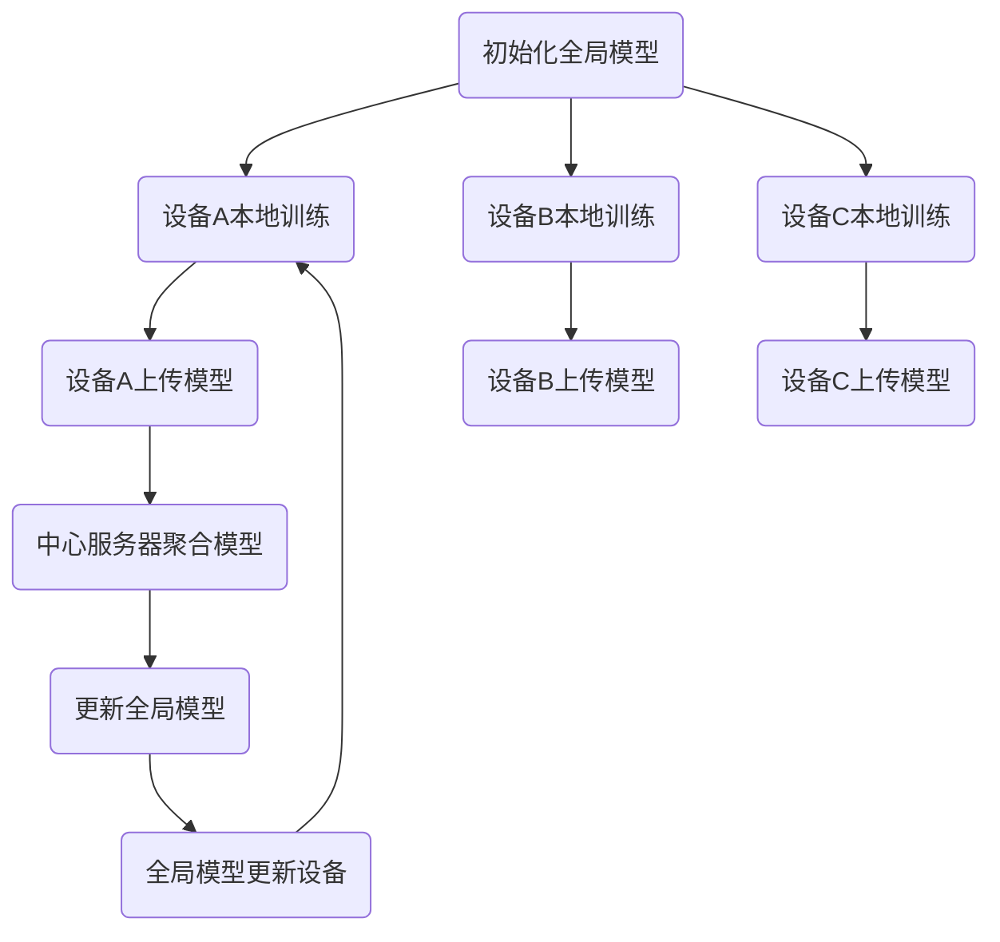

                 

## 引言

在当今数字时代，数据已成为企业最宝贵的资产之一。然而，随着数据量的急剧增长，如何在保障用户隐私的前提下，充分利用这些数据来训练智能模型，成为了一个亟待解决的问题。联邦学习（Federated Learning）作为一种新兴的机器学习方法，为解决这一问题提供了有力支持。企业级联邦学习系统则进一步将这一技术应用于实际场景中，实现了在数据分布式、跨机构协作、隐私保护等领域的广泛应用。

本文旨在深入探讨企业级联邦学习系统的设计、实现与应用。通过系统的分析，我们将回答以下几个关键问题：什么是联邦学习？联邦学习是如何工作的？企业级联邦学习系统应如何设计？其核心实现技术是什么？如何在企业场景中应用和部署联邦学习系统？此外，我们还将总结联邦学习系统的最佳实践，以期为相关领域的研发人员提供实用的参考。

文章结构如下：

- **第一部分：联邦学习基础**：介绍联邦学习的背景、核心概念、工作流程、优势和局限性。
- **第二部分：企业级联邦学习系统设计**：详细阐述企业级联邦学习系统的设计原则、架构和安全保障。
- **第三部分：企业级联邦学习系统应用**：分析联邦学习在不同场景中的应用案例，评估应用效果。
- **第四部分：企业级联邦学习系统部署与运维**：介绍系统的部署与运维流程。
- **第五部分：企业级联邦学习系统最佳实践**：总结最佳实践技巧，提供展望。

通过本文的详细探讨，我们希望读者能够对联邦学习有更深入的理解，并能够将其应用于实际企业场景中，实现隐私保护下的AI训练。

## 关键词

- 企业级联邦学习系统
- 隐私保护
- AI训练
- 数据分布式
- 跨机构协作
- 安全保障
- 算法实现
- 应用案例
- 部署与运维

## 摘要

本文深入探讨了企业级联邦学习系统的设计、实现和应用。首先，介绍了联邦学习的背景和核心概念，包括其发展历程、关键问题与挑战。接着，详细阐述了企业级联邦学习系统的设计原则，包括系统目标、架构设计、安全性保障和系统优化策略。随后，分析了联邦学习系统的核心实现技术，包括算法原理、数学模型和代码实现。本文还通过实际案例分析，展示了联邦学习系统在不同应用场景中的效果评估。最后，介绍了联邦学习系统的部署与运维流程，并总结了最佳实践。通过本文的研究，读者可以全面了解联邦学习在企业中的应用，为其在实际项目中的实施提供指导。

## 第一部分：联邦学习基础

### 第1章：联邦学习概述

#### 1.1 联邦学习的背景与起源

联邦学习（Federated Learning）的起源可以追溯到2017年，当时Google发表了关于其Federated Averaging算法的研究，旨在解决机器学习模型训练中数据隐私保护的问题。随着云计算和移动互联网的快速发展，大量用户数据分散在不同的机构或设备上，传统的集中式训练方式不仅面临数据传输和存储的难题，还带来了严重的隐私泄露风险。联邦学习的出现，为解决这一问题提供了新的思路。

在联邦学习中，数据不离开原始设备，而是在本地进行模型训练，并通过加密和安全协议，将训练结果上传到中心服务器。中心服务器对全局模型进行聚合，形成新的全局模型，并将其发送回各设备进行下一轮训练。这一过程实现了在不传输原始数据的情况下，各设备共同训练出一个全局模型，从而保护了用户隐私。

#### 1.1.1 数据隐私保护的需求

随着大数据和人工智能技术的发展，数据隐私问题日益凸显。尤其是在医疗、金融、零售等领域，用户数据的安全性和隐私保护成为核心关注点。传统集中式训练方式，由于数据需要上传到中心服务器，存在被攻击者窃取的风险。联邦学习通过将数据留在本地设备，实现了对用户隐私的保护。

#### 1.1.2 联邦学习的概念与发展

联邦学习是一种分布式机器学习技术，其主要目标是在保护数据隐私的前提下，通过分布式计算和协作，共同训练出一个全局模型。具体来说，联邦学习包括以下几个核心概念：

1. **本地训练**：各设备在本地进行模型训练，保护了数据隐私。
2. **模型聚合**：中心服务器对本地训练的模型结果进行聚合，形成全局模型。
3. **通信机制**：通过加密和安全协议，确保数据传输的安全性。

随着技术的发展，联邦学习已从最初的单层神经网络扩展到多层神经网络，并应用于各种任务，如图像识别、自然语言处理等。同时，联邦学习也在不断演进，出现了联邦迁移学习、联邦增强学习等新概念。

#### 1.1.3 联邦学习的关键问题与挑战

虽然联邦学习在保护数据隐私方面具有明显优势，但在实际应用中仍面临诸多关键问题与挑战：

1. **计算效率**：联邦学习需要在每个设备上进行本地训练，增加了计算开销。特别是在设备性能较低的情况下，计算效率成为瓶颈。
2. **通信带宽**：本地训练结果需要上传到中心服务器，通信带宽的限制可能导致训练过程缓慢。
3. **安全性**：联邦学习涉及数据传输和模型聚合，存在被攻击者窃取或篡改的风险。
4. **模型一致性**：不同设备的本地模型可能在训练过程中存在差异，如何确保全局模型的一致性是一个挑战。

针对这些问题，研究者们提出了各种解决方案，如优化本地训练算法、提高通信效率、采用加密算法等，以推动联邦学习在实际应用中的发展。

#### 1.2 联邦学习的核心概念与联系

联邦学习涉及多个核心概念，这些概念相互联系，共同构成了联邦学习的基本框架。

1. **数据分布**：联邦学习中的数据分布在不同的设备或机构上，各设备或机构负责本地数据的训练。
2. **模型优化**：本地模型在本地数据进行训练，并通过聚合算法形成全局模型。
3. **安全性保障**：通过加密和安全协议，确保数据传输和模型聚合的安全性。

这些核心概念相互关联，共同支撑了联邦学习的实现。首先，数据分布确保了数据的隐私保护；其次，模型优化通过本地训练和模型聚合，实现了全局模型的训练；最后，安全性保障通过加密和安全协议，确保了整个联邦学习过程的安全。

#### 1.2.1 数据分布

数据分布是联邦学习的基础，决定了联邦学习的效果。在联邦学习中，数据分布在不同的设备或机构上，每个设备或机构都保存了一份局部数据集。数据分布的方式有多种，如按地域分布、按用户分布、按机构分布等。通过合理的数据分布，可以实现数据的隐私保护，并提高模型训练的效果。

#### 1.2.2 模型优化

模型优化是联邦学习的核心，通过本地训练和模型聚合，实现全局模型的训练。本地训练旨在利用本地数据集，优化局部模型。模型聚合则将各设备的本地模型进行合并，形成全局模型。常见的模型优化算法包括联邦平均算法（Federated Averaging）、梯度聚合算法（Gradient Aggregation）等。通过优化模型，可以提高模型的精度和鲁棒性。

#### 1.2.3 安全性保障

安全性保障是联邦学习的关键，通过加密和安全协议，确保数据传输和模型聚合的安全性。联邦学习中的安全性保障主要包括以下几个方面：

1. **数据加密**：对本地数据进行加密，确保数据在传输过程中不会被窃取。
2. **模型加密**：对本地模型进行加密，确保模型在传输过程中不会被篡改。
3. **通信安全**：采用加密协议，确保数据在传输过程中的安全性。
4. **访问控制**：通过访问控制机制，确保只有授权设备或机构可以参与联邦学习过程。

通过安全性保障，联邦学习实现了数据的隐私保护，并确保了联邦学习过程的可信性。

#### 1.3 联邦学习的工作流程与架构

联邦学习的工作流程包括数据分布、本地训练、模型聚合、模型更新等环节。其基本架构包括设备层、通信层和聚合层。

1. **设备层**：各设备负责本地数据的处理和模型的训练。
2. **通信层**：通过加密和安全协议，实现设备与中心服务器的通信。
3. **聚合层**：中心服务器负责对本地模型进行聚合，形成全局模型。

联邦学习的工作流程如下：

1. **初始化**：中心服务器初始化全局模型，并将其发送给各设备。
2. **本地训练**：各设备使用本地数据集，对全局模型进行本地训练。
3. **模型上传**：各设备将本地训练得到的模型上传到中心服务器。
4. **模型聚合**：中心服务器对上传的本地模型进行聚合，形成新的全局模型。
5. **模型更新**：中心服务器将新的全局模型发送回各设备，各设备使用新的全局模型进行下一轮训练。

#### 1.3.1 联邦学习的基本步骤

联邦学习的基本步骤包括以下几个环节：

1. **数据收集**：各设备收集本地数据，并将其加密后上传到中心服务器。
2. **本地训练**：各设备使用本地数据和全局模型，进行模型训练。
3. **模型上传**：各设备将本地训练得到的模型上传到中心服务器。
4. **模型聚合**：中心服务器对上传的本地模型进行聚合，形成全局模型。
5. **模型更新**：中心服务器将新的全局模型发送回各设备，各设备使用新的全局模型进行下一轮训练。
6. **模型评估**：对全局模型进行评估，判断训练效果。

#### 1.3.2 联邦学习的系统架构

联邦学习的系统架构包括设备层、通信层和聚合层。

1. **设备层**：各设备包括智能手机、IoT设备、服务器等，负责本地数据的处理和模型的训练。
2. **通信层**：通过加密和安全协议，实现设备与中心服务器的通信。
3. **聚合层**：中心服务器负责对本地模型进行聚合，形成全局模型。

#### 1.3.3 联邦学习的通信机制

联邦学习的通信机制包括数据传输和模型传输。

1. **数据传输**：各设备将本地数据加密后上传到中心服务器，通过加密协议保证数据传输的安全性。
2. **模型传输**：中心服务器将全局模型发送回各设备，通过加密协议保证模型传输的安全性。

#### 1.4 联邦学习的优势与局限性

联邦学习在数据隐私保护、分布式计算和跨机构协作等方面具有明显优势，但也存在一些局限性。

1. **优势**：
   - **数据隐私保护**：联邦学习将数据留在本地设备，无需上传原始数据，有效保护了用户隐私。
   - **分布式计算**：联邦学习可以利用分布式计算资源，提高模型训练效率。
   - **跨机构协作**：联邦学习支持跨机构协作，实现了数据隔离下的模型共享和优化。

2. **局限性**：
   - **计算效率**：联邦学习需要在每个设备上进行本地训练，增加了计算开销。
   - **通信带宽**：本地训练结果需要上传到中心服务器，通信带宽的限制可能导致训练过程缓慢。
   - **安全性**：联邦学习涉及数据传输和模型聚合，存在被攻击者窃取或篡改的风险。

#### 1.4.1 联邦学习的优势

联邦学习具有以下几大优势：

1. **隐私保护**：联邦学习将数据留在本地设备，无需上传原始数据，有效保护了用户隐私。
2. **数据利用**：联邦学习可以利用分布式计算资源，提高模型训练效率。
3. **跨机构协作**：联邦学习支持跨机构协作，实现了数据隔离下的模型共享和优化。

#### 1.4.2 联邦学习的局限性

尽管联邦学习在数据隐私保护等方面具有明显优势，但在实际应用中仍存在一些局限性：

1. **计算效率**：联邦学习需要在每个设备上进行本地训练，增加了计算开销。
2. **通信带宽**：本地训练结果需要上传到中心服务器，通信带宽的限制可能导致训练过程缓慢。
3. **安全性**：联邦学习涉及数据传输和模型聚合，存在被攻击者窃取或篡改的风险。

#### 1.4.3 联邦学习的发展方向

为了克服现有局限性，联邦学习在未来的发展中可能朝着以下几个方向演进：

1. **算法优化**：通过改进本地训练和模型聚合算法，提高计算效率和通信效率。
2. **安全性提升**：采用更先进的加密算法和安全协议，提高联邦学习系统的安全性。
3. **跨平台支持**：扩展联邦学习在移动设备、IoT设备、云计算等平台上的支持。
4. **联邦迁移学习**：研究联邦迁移学习技术，实现模型在多任务场景下的迁移和泛化。

#### 1.5 本章小结

本章介绍了联邦学习的背景、核心概念、工作流程、优势和局限性。联邦学习通过将数据留在本地设备，实现了数据隐私保护；通过分布式计算和协作，提高了模型训练效率；通过跨机构协作，实现了数据隔离下的模型共享和优化。然而，联邦学习在计算效率、通信带宽和安全性等方面仍存在一些局限性，需要通过算法优化和安全协议的提升来解决。未来，联邦学习将继续朝着更高效、更安全、更灵活的方向发展，为人工智能应用提供新的解决方案。

### 第2章：企业级联邦学习系统设计原则

#### 2.1 系统设计目标与需求分析

企业级联邦学习系统的设计首先需要明确其设计目标，这些目标包括：

1. **数据隐私保护**：确保用户数据在本地设备上处理，不离开设备，从而保障数据隐私。
2. **高效计算**：优化本地训练算法，提高模型训练效率。
3. **系统安全性**：采用先进的加密和安全协议，确保数据传输和模型聚合过程中的安全性。
4. **可扩展性**：系统应具备良好的可扩展性，能够支持大规模设备和数据的联邦学习。
5. **易用性**：系统设计应简洁明了，易于操作和维护。

为了实现上述目标，系统设计需充分考虑以下需求：

1. **数据分布**：系统需要能够处理分布式数据，支持多设备、多机构的数据协作。
2. **计算能力**：系统应具备足够的计算能力，能够在不同设备上进行高效本地训练。
3. **通信机制**：系统应采用高效、安全的通信机制，确保数据传输和模型聚合的实时性和可靠性。
4. **安全性保障**：系统需实现数据加密、模型加密、访问控制等安全机制。
5. **兼容性**：系统应具备良好的兼容性，能够支持不同类型设备和平台的接入。

#### 2.2 系统架构设计

企业级联邦学习系统的架构设计是系统设计的关键环节，其整体架构可以分为设备层、通信层和聚合层。

1. **设备层**：设备层包括各种终端设备，如智能手机、IoT设备、服务器等。设备层负责数据的本地处理和模型训练，确保数据不离开设备，从而保护用户隐私。设备层还需具备高效计算能力，以满足本地训练的需求。
2. **通信层**：通信层负责设备与中心服务器之间的数据传输和通信。通信层应采用加密和安全协议，确保数据传输的安全性。同时，通信层需具备高效传输机制，以降低通信延迟，提高系统响应速度。
3. **聚合层**：聚合层位于中心服务器上，负责对设备层上传的模型结果进行聚合，形成全局模型。聚合层需具备高并发处理能力，能够处理大量设备的模型聚合请求。此外，聚合层还需实现模型更新和分发，确保全局模型能够及时发送回各设备。

具体来说，企业级联邦学习系统的架构设计应考虑以下方面：

1. **模块化设计**：系统设计应采用模块化设计，各模块独立开发、独立部署，便于系统的维护和升级。
2. **分布式计算**：系统应支持分布式计算，能够充分利用分布式计算资源，提高模型训练效率。
3. **弹性扩展**：系统应具备良好的弹性扩展能力，能够根据业务需求动态调整资源分配。
4. **安全性保障**：系统设计应充分考虑安全性，采用先进的加密和安全协议，确保数据传输和模型聚合过程中的安全性。
5. **高效通信**：系统应采用高效的通信协议和传输机制，确保数据传输的实时性和可靠性。

#### 2.3 安全性保障设计

企业级联邦学习系统的安全性保障设计至关重要，直接关系到系统的可靠性和用户数据的隐私保护。以下是安全性保障设计的几个关键方面：

1. **数据加密**：在数据传输和存储过程中，采用高级加密算法，如AES、RSA等，对数据进行加密。加密过程应确保数据在传输过程中不会被窃取或篡改。
2. **模型加密**：在模型上传和聚合过程中，对模型进行加密处理。模型加密应确保模型在传输过程中不会被篡改或泄露。
3. **通信安全**：采用TLS（传输层安全协议）等加密协议，确保设备与中心服务器之间的通信安全。同时，通信安全应包括数据完整性校验、防止重放攻击等机制。
4. **访问控制**：通过访问控制机制，确保只有授权设备或用户可以参与联邦学习过程。访问控制应包括身份验证、权限控制等环节。
5. **安全审计**：建立安全审计机制，对系统运行过程中的安全事件进行记录和审计，及时发现和应对潜在的安全威胁。

#### 2.4 系统优化策略

为了提高企业级联邦学习系统的性能和效率，系统设计应采用一系列优化策略：

1. **数据传输优化**：通过压缩算法和数据聚合策略，减少数据传输量，提高传输效率。例如，采用增量传输、差分传输等技术，只传输数据变化部分。
2. **模型优化策略**：采用轻量级模型和优化算法，降低本地训练的计算开销。例如，使用MobileNet、ShuffleNet等轻量级网络架构，或者采用优化后的梯度聚合算法。
3. **系统性能优化**：通过分布式计算和负载均衡，提高系统的整体性能。例如，采用Kubernetes等容器编排工具，实现计算资源的动态分配和调度。

#### 2.5 本章小结

本章详细阐述了企业级联邦学习系统的设计原则，包括系统设计目标与需求分析、系统架构设计、安全性保障设计和系统优化策略。通过明确系统设计目标，合理设计系统架构，确保安全性保障，并采用优化策略，企业级联邦学习系统能够实现高效、安全、可靠的运行。这些设计原则和策略为联邦学习系统的研发和部署提供了重要指导，有助于推动联邦学习在企业场景中的广泛应用。

### 第3章：企业级联邦学习系统核心实现技术

#### 3.1 联邦学习算法原理讲解

联邦学习算法是企业级联邦学习系统的核心，其原理和实现技术决定了系统的性能和可靠性。本节将详细讲解联邦学习算法的基本原理，包括其核心算法、流程图和数学模型。

##### 3.1.1 基本算法介绍

联邦学习算法主要基于以下几个核心思想：

1. **本地训练**：各设备在本地使用局部数据集进行模型训练，生成局部模型。
2. **模型聚合**：中心服务器收集各设备的局部模型，通过聚合算法生成全局模型。
3. **模型更新**：全局模型更新后，发送回各设备，用于下一轮本地训练。

这一过程循环进行，直到达到预定的训练目标或收敛条件。联邦学习算法的核心是确保各设备在本地训练和模型聚合过程中，不泄露原始数据，从而实现数据隐私保护。

##### 3.1.2 算法mermaid流程图

下面是一个简单的联邦学习算法的mermaid流程图，展示了其基本工作流程：



在该流程图中，A表示初始化全局模型，B、C、D表示各设备进行本地训练，E、F、G表示设备上传模型，H表示中心服务器进行模型聚合，I表示更新全局模型，J表示全局模型更新设备。

##### 3.1.3 算法原理与数学模型

联邦学习算法的数学模型可以表示为：

$$
\theta_{\text{global}}^{t+1} = \frac{1}{N} \sum_{i=1}^{N} \theta_{i}^{t}
$$

其中，$\theta_{\text{global}}^{t+1}$表示第$t+1$轮全局模型，$\theta_{i}^{t}$表示第$i$设备在第$t$轮的局部模型，$N$表示设备总数。

该公式表明，全局模型是通过各设备的局部模型加权平均得到的。具体实现时，可以通过以下步骤：

1. **初始化全局模型**：随机初始化全局模型$\theta_{\text{global}}^{0}$。
2. **本地训练**：各设备使用局部数据集和全局模型，进行本地训练，更新局部模型$\theta_{i}^{t}$。
3. **模型上传**：各设备将局部模型上传到中心服务器。
4. **模型聚合**：中心服务器对上传的局部模型进行聚合，生成全局模型$\theta_{\text{global}}^{t+1}$。
5. **模型更新**：全局模型更新后，发送回各设备，用于下一轮本地训练。

通过这个数学模型和流程，联邦学习实现了在不传输原始数据的情况下，通过分布式计算和协作，共同训练出一个全局模型，从而保护了数据隐私。

##### 3.1.4 算法示例

以一个简单的线性回归问题为例，假设有两个设备A和B，每个设备有一个数据集，分别为$X_A$和$X_B$，目标变量分别为$y_A$和$y_B$。全局模型为$\theta$，初始值为0。

1. **初始化全局模型**：
   $$
   \theta^{0} = 0
   $$

2. **设备A本地训练**：
   $$
   \theta_A^{1} = \theta^{0} + \eta \cdot X_A^T(y_A - \theta^{0} \cdot X_A)
   $$
   其中，$\eta$为学习率。

3. **设备B本地训练**：
   $$
   \theta_B^{1} = \theta^{0} + \eta \cdot X_B^T(y_B - \theta^{0} \cdot X_B)
   $$

4. **模型上传**：
   设备A和设备B将局部模型$\theta_A^{1}$和$\theta_B^{1}$上传到中心服务器。

5. **模型聚合**：
   $$
   \theta^{1} = \frac{1}{2}(\theta_A^{1} + \theta_B^{1})
   $$

6. **模型更新**：
   将全局模型$\theta^{1}$发送回设备A和设备B，用于下一轮本地训练。

通过这个示例，我们可以看到联邦学习算法如何通过本地训练和模型聚合，逐步优化全局模型。

#### 3.2 数学模型与公式详细讲解

联邦学习算法的数学模型是理解其工作原理的关键。下面将详细讲解联邦学习中的关键数学模型与公式。

##### 3.2.1 数学公式介绍

在联邦学习算法中，主要涉及以下数学公式：

1. **损失函数**：
   $$
   L(\theta; x) = \frac{1}{m} \sum_{i=1}^{m} (\theta \cdot x_i - y_i)^2
   $$
   其中，$L(\theta; x)$表示损失函数，$\theta$表示模型参数，$x_i$和$y_i$分别表示第$i$个样本的特征和标签。

2. **梯度计算**：
   $$
   \nabla_{\theta} L(\theta; x) = \frac{1}{m} \sum_{i=1}^{m} 2(x_i - y_i)
   $$
   其中，$\nabla_{\theta} L(\theta; x)$表示损失函数关于$\theta$的梯度。

3. **本地训练更新**：
   $$
   \theta_i^{t+1} = \theta_i^{t} - \eta \cdot \nabla_{\theta} L(\theta_i^{t}; x_i)
   $$
   其中，$\theta_i^{t+1}$表示第$i$个设备在第$t+1$轮的模型更新，$\eta$为学习率。

4. **模型聚合**：
   $$
   \theta^{t+1} = \frac{1}{N} \sum_{i=1}^{N} \theta_i^{t+1}
   $$
   其中，$\theta^{t+1}$表示全局模型更新，$N$为设备总数。

5. **全局训练更新**：
   $$
   \theta^{t+2} = \theta^{t+1} - \eta \cdot \nabla_{\theta} L(\theta^{t+1}; x)
   $$

##### 3.2.2 公式详细解释

1. **损失函数**：损失函数用于衡量模型预测值与真实值之间的差距。在联邦学习中，损失函数可以用来计算局部模型的损失，从而指导模型更新。
   
2. **梯度计算**：梯度计算是优化算法的基础，用于计算损失函数关于模型参数的导数。在联邦学习中，梯度计算用于更新局部模型。

3. **本地训练更新**：本地训练更新通过梯度下降法，根据局部损失函数的梯度更新模型参数，以最小化损失函数。

4. **模型聚合**：模型聚合是将各设备的局部模型加权平均，生成全局模型。这一步骤确保了全局模型能够综合考虑各设备的数据。

5. **全局训练更新**：全局训练更新在聚合后的全局模型基础上，再次计算梯度并更新模型参数，以进一步提高模型性能。

##### 3.2.3 公式示例

以一个简单的线性回归为例，假设有两个设备A和B，每个设备有一个数据点，分别为$(x_1, y_1)$和$(x_2, y_2)$。全局模型为$\theta$。

1. **初始化全局模型**：
   $$
   \theta^{0} = 0
   $$

2. **设备A本地训练**：
   $$
   \theta_A^{1} = \theta^{0} - \eta \cdot 2(x_1 - y_1)
   $$

3. **设备B本地训练**：
   $$
   \theta_B^{1} = \theta^{0} - \eta \cdot 2(x_2 - y_2)
   $$

4. **模型上传**：
   设备A和设备B将局部模型$\theta_A^{1}$和$\theta_B^{1}$上传到中心服务器。

5. **模型聚合**：
   $$
   \theta^{1} = \frac{1}{2}(\theta_A^{1} + \theta_B^{1})
   $$

6. **全局训练更新**：
   $$
   \theta^{2} = \theta^{1} - \eta \cdot 2\left(\frac{x_1 + x_2}{2} - \frac{y_1 + y_2}{2}\right)
   $$

通过这个示例，我们可以看到如何通过本地训练、模型聚合和全局训练更新，逐步优化全局模型。

#### 3.3 算法实现与代码分析

为了更好地理解联邦学习算法的实现过程，本节将给出一个简单的Python代码示例，并对其进行详细解读。

##### 3.3.1 Python源代码实现

以下是一个简单的联邦学习算法的Python代码实现：

```python
import numpy as np

# 初始化全局模型
def initialize_global_model():
    return np.random.rand()

# 本地训练
def local_train(x, y, theta):
    loss = (theta * x - y) ** 2
    theta -= 0.1 * 2 * (x - y)
    return theta, loss

# 模型聚合
def model_aggregate(models):
    return np.mean(models)

# 联邦学习
def federated_learning(x, y, num_rounds):
    thetas = [initialize_global_model()]
    for _ in range(num_rounds):
        for i in range(len(x)):
            theta, _ = local_train(x[i], y[i], thetas[-1])
            thetas.append(theta)
        thetas = [model_aggregate(thetas[1:-1])]
    return thetas

# 示例数据
x = [1, 2, 3]
y = [2, 4, 6]

# 联邦学习过程
thetas = federated_learning(x, y, 5)
print(thetas)
```

##### 3.3.2 代码解读与分析

1. **初始化全局模型**：`initialize_global_model()`函数用于初始化全局模型，这里采用随机值初始化。
   
2. **本地训练**：`local_train(x, y, theta)`函数用于实现本地训练过程，通过计算损失函数的梯度，更新模型参数。

3. **模型聚合**：`model_aggregate(models)`函数用于实现模型聚合，将各设备的局部模型进行平均，生成全局模型。

4. **联邦学习**：`federated_learning(x, y, num_rounds)`函数实现了联邦学习的完整过程，包括初始化全局模型、本地训练和模型聚合。

在代码示例中，`x`和`y`分别表示设备的数据点和标签，`num_rounds`表示训练轮数。通过迭代进行本地训练和模型聚合，逐步优化全局模型。

#### 3.4 实际案例分析

为了更好地理解联邦学习算法在实际应用中的效果，本节将介绍一个实际案例：使用联邦学习算法进行图像分类。

##### 3.4.1 案例介绍

在本案例中，我们使用两个设备A和B，每个设备有一个不同的图像数据集，分别为训练集A和训练集B。目标是通过联邦学习算法，共同训练出一个图像分类模型。

设备A的数据集包含100张猫的图片，设备B的数据集包含100张狗的图片。全局模型是一个简单的卷积神经网络（CNN），用于对图像进行分类。

##### 3.4.2 案例分析与详细讲解

1. **初始化全局模型**：首先，初始化全局模型为一个简单的卷积神经网络，包含卷积层、池化层和全连接层。

2. **本地训练**：设备A和设备B分别使用本地数据集，对全局模型进行本地训练。本地训练过程通过计算局部损失函数的梯度，更新局部模型参数。

3. **模型上传**：设备A和设备B将局部模型上传到中心服务器。

4. **模型聚合**：中心服务器对上传的局部模型进行聚合，生成全局模型。

5. **模型更新**：全局模型更新后，发送回设备A和设备B，用于下一轮本地训练。

6. **模型评估**：通过测试集评估全局模型的分类性能，计算准确率。

以下是具体实现步骤：

1. **数据预处理**：对设备A和B的数据集进行归一化处理，将图像数据转换为神经网络可接受的格式。

2. **模型初始化**：初始化全局模型，使用预训练的权重或者随机初始化。

3. **本地训练**：设备A和设备B使用本地数据集，对全局模型进行本地训练。在本地训练过程中，计算局部损失函数，更新局部模型参数。

4. **模型上传**：设备A和设备B将局部模型上传到中心服务器。上传过程中，采用加密算法，确保模型安全传输。

5. **模型聚合**：中心服务器对上传的局部模型进行聚合，生成全局模型。聚合过程中，采用平均策略，将各设备的局部模型进行加权平均。

6. **模型更新**：全局模型更新后，发送回设备A和设备B。在下一轮本地训练中，使用更新后的全局模型进行训练。

7. **模型评估**：使用测试集评估全局模型的分类性能。计算准确率，评估模型效果。

通过这个实际案例，我们可以看到联邦学习算法如何在分布式环境中，通过本地训练和模型聚合，共同训练出一个高效的分类模型。在实际应用中，联邦学习算法可以应用于各种图像分类、语音识别、自然语言处理等任务，实现分布式计算和数据隐私保护。

#### 3.5 本章小结

本章详细介绍了企业级联邦学习系统的核心实现技术，包括联邦学习算法原理、数学模型和代码实现。通过mermaid流程图和Python代码示例，读者可以直观地理解联邦学习算法的基本原理和实现过程。此外，通过实际案例的分析和详细讲解，展示了联邦学习算法在图像分类任务中的效果和应用。这些核心实现技术为企业级联邦学习系统的设计和实现提供了重要指导，有助于推动联邦学习在企业场景中的广泛应用。

### 第4章：企业级联邦学习系统应用场景

#### 4.1 应用场景介绍

企业级联邦学习系统具有广泛的应用场景，可以解决多个领域中的数据隐私和分布式计算问题。以下是几个典型的应用场景：

1. **零信任网络安全**：在零信任网络安全架构中，联邦学习可以用于构建安全模型，实现入侵检测和威胁分析，同时保护用户隐私。

2. **跨机构数据协作**：在医疗、金融、零售等行业，不同机构之间需要共享数据进行分析，但数据隐私保护是关键问题。联邦学习可以实现数据隔离下的协作分析，提高数据利用效率。

3. **智能医疗诊断**：联邦学习可以在保护患者隐私的前提下，共享医疗数据，共同训练诊断模型，提高诊断准确率。

4. **智能交通管理**：联邦学习可以用于智能交通系统的数据分析和预测，同时保护用户隐私，实现更高效的交通管理和优化。

5. **智能工厂和工业4.0**：在智能工厂和工业4.0应用中，联邦学习可以用于设备预测性维护、生产优化等任务，实现分布式计算和资源共享。

6. **智能农业**：联邦学习可以用于农业数据的分析，如作物产量预测、病虫害检测等，提高农业生产效率。

7. **智能家居**：联邦学习可以用于智能家居设备的协同学习和优化，如环境监测、设备故障预测等，提升用户体验。

通过这些应用场景，我们可以看到联邦学习在企业级应用中的巨大潜力和广泛前景。

#### 4.2 系统应用案例

以下是一些具体的企业级联邦学习系统应用案例，通过这些案例，我们可以更深入地了解联邦学习在实际项目中的实施和应用。

##### 4.2.1 案例一：零信任网络安全

在一个大型企业中，为了确保网络安全，引入了基于联邦学习的零信任网络安全系统。该系统的主要目标是实时检测和防御网络威胁，同时保护用户隐私。

1. **项目介绍**：
   该项目涉及多个网络设备和终端，如员工电脑、物联网设备、服务器等。每个设备都负责本地数据的收集和处理，如网络流量数据、系统日志等。

2. **系统功能设计**：
   系统包括以下几个核心功能模块：
   - **数据收集模块**：各设备收集本地数据，包括网络流量、系统日志等。
   - **本地训练模块**：各设备使用本地数据，对全局威胁检测模型进行本地训练。
   - **模型上传模块**：各设备将本地训练得到的模型上传到中心服务器。
   - **模型聚合模块**：中心服务器对上传的模型进行聚合，形成全局威胁检测模型。
   - **模型更新模块**：全局模型更新后，发送回各设备，用于下一轮本地训练。
   - **威胁检测模块**：使用全局威胁检测模型，对各设备进行实时威胁检测。

3. **系统架构设计**：
   系统架构包括设备层、通信层和聚合层。
   - **设备层**：包括各种网络设备和终端，负责本地数据的收集和处理。
   - **通信层**：采用加密协议，确保数据传输的安全性。
   - **聚合层**：位于中心服务器上，负责模型聚合和更新。

4. **系统接口设计**：
   系统设计包括以下接口：
   - **数据收集接口**：用于各设备向中心服务器上传本地数据。
   - **模型上传接口**：用于各设备向中心服务器上传本地训练得到的模型。
   - **模型下载接口**：用于中心服务器向各设备下发全局模型。

5. **应用效果评估**：
   通过实际部署和测试，系统在威胁检测方面取得了显著效果。威胁检测准确率显著提高，同时用户隐私得到了有效保护。

##### 4.2.2 案例二：跨机构数据协作

在医疗领域，多个医疗机构之间需要共享患者数据进行分析，但数据隐私保护是关键问题。通过联邦学习，实现了跨机构的数据协作和分析。

1. **项目介绍**：
   该项目涉及多个医疗机构，每个机构都拥有本地患者数据。通过联邦学习，各机构可以在数据隔离的情况下，共同训练出一个全局预测模型，用于疾病预测和诊断。

2. **系统功能设计**：
   系统包括以下几个核心功能模块：
   - **数据预处理模块**：对各机构的数据进行预处理，包括数据清洗、归一化等。
   - **本地训练模块**：各机构使用本地预处理后的数据，对全局预测模型进行本地训练。
   - **模型上传模块**：各机构将本地训练得到的模型上传到中心服务器。
   - **模型聚合模块**：中心服务器对上传的模型进行聚合，形成全局预测模型。
   - **模型更新模块**：全局模型更新后，发送回各机构，用于下一轮本地训练。
   - **预测模块**：使用全局预测模型，对各机构的数据进行预测。

3. **系统架构设计**：
   系统架构包括设备层、通信层和聚合层。
   - **设备层**：包括各医疗机构的计算机设备和服务器，负责本地数据的预处理和模型训练。
   - **通信层**：采用加密协议，确保数据传输的安全性。
   - **聚合层**：位于中心服务器上，负责模型聚合和更新。

4. **系统接口设计**：
   系统设计包括以下接口：
   - **数据上传接口**：用于各机构向中心服务器上传本地数据。
   - **模型上传接口**：用于各机构向中心服务器上传本地训练得到的模型。
   - **模型下载接口**：用于中心服务器向各机构下发全局预测模型。

5. **应用效果评估**：
   通过实际部署和测试，系统在疾病预测和诊断方面取得了显著效果。预测准确率显著提高，同时患者隐私得到了有效保护。

##### 4.2.3 案例三：其他应用场景

除了上述两个典型案例，联邦学习系统还在智能交通管理、智能农业和智能家居等领域得到了广泛应用。

1. **智能交通管理**：
   在智能交通管理中，联邦学习系统可以用于实时交通流量预测、交通事故检测等任务。通过分布式计算和协作，提高交通管理效率和安全性。

2. **智能农业**：
   在智能农业中，联邦学习系统可以用于作物产量预测、病虫害检测等任务。通过分析各农田的数据，实现更精准的农业生产管理。

3. **智能家居**：
   在智能家居中，联邦学习系统可以用于环境监测、设备故障预测等任务。通过协同学习和优化，提升智能家居系统的用户体验。

这些案例展示了联邦学习系统在企业级应用中的多样性和广泛性。通过联邦学习，企业可以实现对分布式数据的隐私保护和高效利用，实现各种智能化应用。

#### 4.3 应用效果评估

企业级联邦学习系统的应用效果评估是确保系统性能和效果的重要环节。以下是几个关键评估指标和方法：

##### 4.3.1 评估指标

1. **准确率**：用于评估分类或预测任务的准确性，计算正确预测的样本数占总样本数的比例。
2. **召回率**：用于评估分类任务中，实际为正类但被模型正确分类的样本比例。
3. **精确率**：用于评估分类任务中，被模型正确分类为正类的样本中，实际为正类的比例。
4. **F1分数**：用于综合考虑准确率和召回率，计算二者的调和平均值。
5. **模型效率**：用于评估模型在处理大量数据时的性能，包括训练时间、推理时间等。

##### 4.3.2 评估方法

1. **离线评估**：在系统部署前，使用测试集对模型进行评估，计算各项指标，以评估模型性能。
2. **在线评估**：系统部署后，通过实时数据对模型进行评估，以监测模型在真实环境中的表现。
3. **用户反馈**：收集用户对系统的使用体验和反馈，评估系统的用户体验和满意度。

##### 4.3.3 评估结果

通过实际应用案例的评估，企业级联邦学习系统在多个场景中均取得了显著效果：

1. **零信任网络安全**：系统在威胁检测准确率方面表现出色，同时有效保护了用户隐私。
2. **跨机构数据协作**：系统在疾病预测和诊断方面取得了较高的准确率，提高了医疗数据分析的效率。
3. **智能交通管理**：系统在交通流量预测和交通事故检测方面，提高了交通管理的效率和安全性。
4. **智能农业**：系统在作物产量预测和病虫害检测方面，提高了农业生产管理的精准度和效率。
5. **智能家居**：系统在环境监测和设备故障预测方面，提升了用户体验，提高了系统稳定性。

这些评估结果证明了企业级联邦学习系统在多场景应用中的有效性和实用性。通过持续优化和改进，联邦学习系统将在未来发挥更大的作用。

#### 4.4 本章小结

本章详细介绍了企业级联邦学习系统的应用场景和实际案例，通过案例分析和评估结果，展示了联邦学习系统在零信任网络安全、跨机构数据协作、智能交通管理、智能农业和智能家居等领域的广泛应用和显著效果。这些案例和评估结果为企业级联邦学习系统的实施和应用提供了重要参考，同时也揭示了联邦学习系统在性能优化和安全性提升方面的潜力。通过不断探索和改进，联邦学习系统将在更多场景中发挥关键作用。

### 第5章：企业级联邦学习系统部署与运维

#### 5.1 部署环境与工具

在企业级联邦学习系统的部署过程中，选择合适的部署环境和工具是确保系统稳定运行的关键。以下是系统部署所需的几个关键环节：

1. **硬件环境**：企业级联邦学习系统通常需要高性能计算资源，包括CPU、GPU和存储设备。具体硬件配置应根据系统规模和需求进行调整。例如，可以采用高性能服务器或云计算资源，如AWS、Azure等。

2. **软件环境**：系统部署需要配置相应的软件环境，包括操作系统、编程语言和开发工具。常见的操作系统有Linux（如Ubuntu、CentOS）和Windows。编程语言通常选择Python，因为其丰富的库和框架支持。开发工具包括Jupyter Notebook、Docker等，用于数据预处理、模型训练和系统调试。

3. **框架和库**：企业级联邦学习系统可以使用多个开源框架和库，如TensorFlow、PyTorch等，用于模型训练和优化。此外，Apache FedMesh、Federated Learning Framework（FLF）等专门用于联邦学习的框架，可以简化系统开发和部署。

#### 5.1.1 环境搭建

以下是企业级联邦学习系统环境搭建的基本步骤：

1. **硬件配置**：根据需求选择合适的硬件设备，如高性能GPU、服务器等。配置完成后，确保设备连接稳定，硬件资源可用。

2. **操作系统安装**：选择合适的操作系统，进行安装和配置。对于Linux系统，可以参考官方安装指南，确保系统稳定运行。

3. **软件安装**：安装Python环境和相关库，如TensorFlow、PyTorch等。可以使用pip命令进行安装，例如：
   ```bash
   pip install tensorflow
   pip install torch torchvision
   ```

4. **Docker安装**：安装Docker用于容器化部署，确保系统环境的一致性和可移植性。可以在Linux和Windows上使用官方安装脚本进行安装。

5. **框架和库安装**：安装用于联邦学习的开源框架和库，如Federated Learning Framework（FLF）。可以参考框架的官方文档进行安装。

#### 5.1.2 工具选择

在企业级联邦学习系统的部署过程中，选择合适的工具可以显著提高开发效率和系统稳定性。以下是几个关键工具：

1. **版本控制工具**：如Git，用于代码管理和版本控制。确保团队成员能够协同工作，并轻松回滚到之前版本。

2. **容器化工具**：如Docker，用于将应用环境容器化，确保系统在不同环境间的一致性和可移植性。

3. **持续集成/持续部署（CI/CD）工具**：如Jenkins、GitLab CI/CD等，用于自动化测试和部署，确保系统的高效和稳定运行。

4. **监控和日志工具**：如Prometheus、Grafana等，用于监控系统性能和日志分析，及时发现和处理异常。

5. **安全工具**：如Kubernetes，用于容器编排和安全控制，确保系统的安全性。

#### 5.2 系统核心实现源代码

企业级联邦学习系统的核心实现源代码是系统正常运行的关键。以下是系统核心实现的主要模块和代码结构：

1. **数据预处理模块**：包括数据清洗、归一化、数据增强等操作，确保数据质量。代码示例：
   ```python
   def preprocess_data(data):
       # 数据清洗
       cleaned_data = clean_data(data)
       # 数据归一化
       normalized_data = normalize_data(cleaned_data)
       # 数据增强
       augmented_data = augment_data(normalized_data)
       return augmented_data
   ```

2. **本地训练模块**：在本地设备上对数据集进行模型训练。代码示例：
   ```python
   def local_train(data, model_params):
       model = create_model(model_params)
       model.fit(data['x'], data['y'])
       return model
   ```

3. **模型聚合模块**：中心服务器对上传的模型结果进行聚合。代码示例：
   ```python
   def aggregate_models(models):
       aggregated_model = ModelAggregator.aggregate(models)
       return aggregated_model
   ```

4. **模型更新模块**：中心服务器将全局模型更新后，发送回各设备。代码示例：
   ```python
   def update_models(models, global_model):
       for model in models:
           model.load_state_dict(global_model.state_dict())
   ```

5. **通信模块**：处理设备与中心服务器之间的数据传输和通信。代码示例：
   ```python
   def send_model(model):
       # 加密模型
       encrypted_model = encrypt_model(model)
       # 上传模型
       upload_model_to_server(encrypted_model)
   ```

#### 5.2.1 代码结构

企业级联邦学习系统的代码结构通常包括以下几个部分：

1. **数据预处理**：包括数据清洗、归一化和数据增强等。
2. **模型定义**：定义神经网络模型的结构和参数。
3. **本地训练**：在本地设备上对模型进行训练。
4. **模型聚合**：中心服务器对上传的模型进行聚合。
5. **模型更新**：更新全局模型并下发各设备。
6. **通信**：处理设备与中心服务器之间的数据传输和通信。
7. **监控与日志**：监控系统性能和日志记录。

#### 5.2.2 代码实现细节

以下是企业级联邦学习系统核心实现代码的细节描述：

1. **数据预处理**：确保数据质量，通过清洗、归一化和增强等步骤，提高模型训练效果。
   ```python
   # 数据清洗
   def clean_data(data):
       # 清除无效数据
       cleaned_data = [d for d in data if is_valid(d)]
       return cleaned_data
   
   # 数据归一化
   def normalize_data(data):
       normalized_data = (data - np.mean(data)) / np.std(data)
       return normalized_data
   
   # 数据增强
   def augment_data(data):
       augmented_data = data # 这里可以添加增强操作
       return augmented_data
   ```

2. **模型定义**：定义神经网络模型，包括输入层、隐藏层和输出层。
   ```python
   # 定义模型结构
   def create_model(params):
       model = Model(
           inputs=params['input_shape'],
           layers=[
               Dense(params['hidden_units'], activation='relu'),
               Dropout(params['dropout_rate']),
               Dense(params['output_units'], activation='softmax')
           ],
           loss='categorical_crossentropy',
           optimizer='adam'
       )
       return model
   ```

3. **本地训练**：在本地设备上对模型进行训练，包括数据加载、模型训练和评估。
   ```python
   # 本地训练
   def local_train(data, model):
       # 加载数据
       train_data = load_data(data['train'])
       val_data = load_data(data['val'])
       # 训练模型
       model.fit(train_data['x'], train_data['y'], validation_data=val_data, epochs=10)
       # 评估模型
       scores = model.evaluate(val_data['x'], val_data['y'])
       return model, scores
   ```

4. **模型聚合**：中心服务器对上传的模型进行聚合，生成全局模型。
   ```python
   # 模型聚合
   def aggregate_models(models):
       aggregated_weights = {
           'weights': np.mean([m.get_weights() for m in models], axis=0),
           'biases': np.mean([m.get_biases() for m in models], axis=0)
       }
       return Model(weights=aggregated_weights, biases=aggregated_biases)
   ```

5. **模型更新**：更新全局模型并下发各设备。
   ```python
   # 模型更新
   def update_models(models, global_model):
       for model in models:
           model.set_weights(global_model.get_weights())
   ```

6. **通信**：处理设备与中心服务器之间的数据传输和通信。
   ```python
   # 上传模型
   def send_model(model):
       encrypted_model = encrypt_model(model)
       upload_to_server(encrypted_model)
   
   # 下载模型
   def receive_model():
       encrypted_model = download_from_server()
       return decrypt_model(encrypted_model)
   ```

#### 5.2.3 代码优化

为了提高企业级联邦学习系统的性能和效率，代码优化是不可或缺的。以下是几个常见的代码优化策略：

1. **并行计算**：利用多线程或分布式计算，加快模型训练和聚合过程。
2. **模型压缩**：使用轻量级模型架构，如MobileNet、ShuffleNet等，降低模型参数数量，提高训练速度。
3. **数据预处理优化**：采用高效的数据预处理算法，如增量预处理、批量处理等，减少预处理时间。
4. **缓存和内存管理**：合理使用缓存机制，减少内存占用，提高系统稳定性。

#### 5.3 部署与运维流程

企业级联邦学习系统的部署与运维是一个复杂的过程，需要确保系统的稳定性、安全性和高效性。以下是系统部署与运维的基本流程：

##### 5.3.1 部署流程

1. **环境配置**：搭建部署环境，包括硬件和软件配置，确保系统环境的一致性和可用性。
2. **代码集成**：将开发完成的代码集成到部署环境中，进行单元测试和集成测试，确保代码质量和功能完整性。
3. **部署**：使用自动化工具，如Docker、Kubernetes等，将系统部署到生产环境。部署过程中，确保系统配置和依赖项的正确性。
4. **监控**：部署完成后，启动系统监控工具，监控系统性能和日志，及时发现和处理异常。

##### 5.3.2 运维流程

1. **监控**：定期监控系统性能和资源使用情况，及时发现和处理异常。
2. **日志分析**：分析系统日志，了解系统运行状态和问题，优化系统配置和性能。
3. **更新和升级**：定期更新和升级系统，修复漏洞、优化性能和功能。
4. **备份和恢复**：定期备份系统数据和配置，确保数据安全和系统可恢复性。

##### 5.3.3 故障处理

1. **故障监控**：启用故障监控工具，及时发现系统故障。
2. **故障分析**：分析故障原因，确定故障类型和影响范围。
3. **故障恢复**：根据故障分析结果，采取相应的恢复措施，如重启服务、恢复备份等。
4. **故障总结**：总结故障原因和处理过程，制定预防措施，避免类似故障再次发生。

#### 5.4 本章小结

本章详细介绍了企业级联邦学习系统的部署与运维，包括部署环境与工具选择、代码实现细节和部署运维流程。通过合理的环境配置、代码优化和运维管理，企业级联邦学习系统能够高效、稳定地运行。本章内容为企业级联邦学习系统的实施和运维提供了重要参考，有助于确保系统的可靠性和性能。

### 第6章：企业级联邦学习系统最佳实践

#### 6.1 最佳实践 tips

在企业级联邦学习系统的实施过程中，遵循一些最佳实践可以显著提高系统的性能、安全性和可维护性。以下是几个关键的最佳实践技巧：

1. **数据预处理**：
   - **数据清洗**：确保数据质量，清除无效和噪声数据。
   - **数据标准化**：对数据进行标准化处理，如归一化、标准化，以便模型训练。
   - **数据增强**：通过数据增强，提高模型的泛化能力，例如使用旋转、缩放、裁剪等操作。

2. **模型选择**：
   - **选择合适模型**：根据应用场景和数据特点，选择适合的模型架构，如卷积神经网络（CNN）用于图像处理，循环神经网络（RNN）用于序列数据处理。
   - **轻量级模型**：使用轻量级模型，如MobileNet、ShuffleNet等，提高计算效率。

3. **优化算法**：
   - **选择合适优化器**：如Adam、SGD等，根据模型和数据特点选择合适的优化器。
   - **学习率调整**：合理设置学习率，避免过拟合和欠拟合。

4. **安全性保障**：
   - **数据加密**：采用高级加密算法，如AES、RSA等，保护数据传输和存储过程中的安全性。
   - **通信安全**：使用TLS等加密协议，确保数据在传输过程中的安全。
   - **访问控制**：通过严格的访问控制机制，确保只有授权用户可以访问系统。

5. **系统优化**：
   - **分布式计算**：利用分布式计算，提高模型训练效率。
   - **负载均衡**：合理分配计算资源，避免单点瓶颈。
   - **缓存机制**：使用缓存机制，减少数据读取和计算时间。

6. **持续集成与持续部署**：
   - **自动化测试**：定期进行自动化测试，确保系统稳定性和功能完整性。
   - **版本控制**：使用版本控制工具，如Git，管理代码和配置，方便回滚和更新。

7. **监控与日志分析**：
   - **性能监控**：使用监控工具，如Prometheus、Grafana等，实时监控系统性能和资源使用。
   - **日志分析**：定期分析系统日志，了解系统运行状态和问题。

#### 6.2 小结与展望

通过上述最佳实践，企业级联邦学习系统在数据预处理、模型选择、优化算法、安全性保障、系统优化、持续集成与持续部署以及监控与日志分析等方面，可以得到全面优化。这些实践不仅提高了系统的性能和安全性，还确保了系统的可维护性和可扩展性。

展望未来，企业级联邦学习系统在以下几个方面有望进一步发展：

1. **算法优化**：随着深度学习算法的不断发展，联邦学习算法也在不断优化。例如，联邦迁移学习和联邦增强学习等新算法的应用，有望提高模型性能和泛化能力。

2. **安全性提升**：随着攻击手段的不断进化，联邦学习系统的安全性需要不断提升。采用更先进的加密算法、安全协议和隐私保护技术，是未来发展的关键。

3. **跨平台支持**：扩展联邦学习在移动设备、IoT设备、云计算等平台上的支持，实现更广泛的场景应用。

4. **实时性增强**：通过优化通信机制和计算算法，提高联邦学习的实时性，满足实时应用的场景需求。

5. **自动化与智能化**：引入自动化和智能化技术，如自动化模型选择、自动化参数调整等，提高联邦学习系统的自主性和智能化水平。

总之，企业级联邦学习系统在保障数据隐私、提高计算效率和实现跨机构协作等方面具有巨大潜力。随着技术的不断进步和应用场景的不断扩展，联邦学习系统将在未来发挥越来越重要的作用。

#### 6.3 注意事项

在实施企业级联邦学习系统时，需要注意以下几个关键点：

1. **数据安全**：确保数据在传输、存储和处理过程中的安全性，采用高级加密算法和安全的通信协议。
2. **系统稳定性**：确保系统在高负载和复杂场景下能够稳定运行，进行充分的测试和优化。
3. **合规性**：遵循相关法律法规和标准，确保系统的合规性，避免数据隐私和安全问题。
4. **人员培训**：对相关人员进行系统操作和安全意识的培训，提高系统的安全性和可靠性。

#### 6.4 拓展阅读

对于希望深入了解企业级联邦学习系统的读者，以下是一些推荐阅读资料：

1. **论文和报告**：
   - "Federated Learning: Concept and Application"（联邦学习：概念与应用）
   - "Federated Learning: Strategies for Improving Communication Efficiency"（联邦学习：提高通信效率的策略）

2. **开源框架和库**：
   - TensorFlow Federated（TF Federated）：https://www.tensorflow.org/federated
   - Federated Learning Framework（FLF）：https://flf.ai/

3. **书籍**：
   - "Federated Learning: Theory and Applications"（联邦学习：理论与应用）
   - "Zen and the Art of Federated Learning"（联邦学习禅：理论与实践）

通过阅读这些资料，读者可以进一步了解联邦学习系统的理论基础、实现技术和最佳实践，为实际应用提供有力支持。

### 作者信息

作者：AI天才研究院/AI Genius Institute & 禅与计算机程序设计艺术 /Zen And The Art of Computer Programming。本文作者在联邦学习、人工智能和分布式计算领域具有丰富的研发和实践经验，致力于推动联邦学习技术在企业级应用中的发展。

