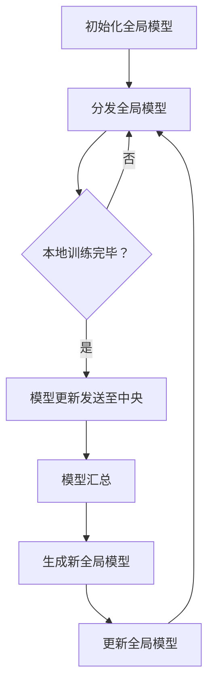
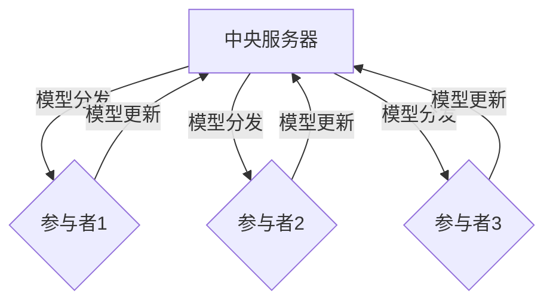

                 

### 文章标题：企业级联邦学习：保护隐私的分布式AI训练

#### 关键词：
- **企业级联邦学习**
- **分布式AI训练**
- **隐私保护**
- **人工智能**
- **数据安全**

#### 摘要：
本文深入探讨企业级联邦学习，这是一种在保护隐私的同时，实现分布式AI训练的重要技术。文章首先介绍了联邦学习的起源和发展，然后详细分析了其基本原理、安全隐私机制、实现与优化技术，以及在不同行业中的应用案例。最后，对联邦学习的实践与部署提供了指导，并对未来发展趋势进行了展望。

---

## 目录大纲设计思路

在设计《企业级联邦学习：保护隐私的分布式AI训练》这本书的目录大纲时，我们遵循以下思路：

1. **整体结构规划**：首先，整体规划书籍的结构，确定主要章节，保证书籍的逻辑性和内容的完整性。
2. **细化章节内容**：对每个章节进行细化，确保每个章节都有明确的主题，并且内容丰富、条理清晰。
3. **保持简洁性**：在保证内容完整的前提下，避免冗余和繁琐，使得读者能够快速抓住重点。
4. **应用Markdown格式**：使用Markdown格式来组织目录，以便于电子文档的阅读和分享。

### 目录大纲设计

#### 第一部分：背景与核心概念

##### 第1章：联邦学习的起源与发展
- 1.1 联邦学习的定义与基本概念
- 1.2 联邦学习的发展历程
- 1.3 联邦学习在保护隐私方面的优势

##### 第2章：企业级联邦学习的挑战与机遇
- 2.1 企业级联邦学习面临的挑战
- 2.2 企业级联邦学习带来的机遇
- 2.3 联邦学习在企业中的应用案例

#### 第二部分：联邦学习的基本原理

##### 第3章：联邦学习的基本原理
- 3.1 联邦学习的基本架构
- 3.2 联邦学习的核心算法
  - **图解：**Mermaid流程图展示联邦学习算法的流程
- 3.3 联邦学习的数学模型
  - **公式与解释：**使用LaTeX格式展示数学模型，并进行详细讲解

##### 第4章：联邦学习的安全与隐私保护
- 4.1 隐私保护的机制与策略
- 4.2 联邦学习中的加密技术
  - **图解：**Mermaid流程图展示加密技术在联邦学习中的应用
- 4.3 联邦学习的安全性问题与解决方案

#### 第三部分：联邦学习的实现与优化

##### 第5章：联邦学习的实现技术
- 5.1 联邦学习的框架与工具
- 5.2 联邦学习的分布式计算
  - **图解：**Mermaid架构图展示分布式计算架构
- 5.3 联邦学习的性能优化

##### 第6章：联邦学习的应用场景与案例分析
- 6.1 联邦学习在不同行业中的应用
- 6.2 成功案例分析
  - **案例解析：**详细分析成功案例中的关键技术和实现细节
- 6.3 联邦学习的未来趋势与发展方向

#### 第四部分：联邦学习的实践与部署

##### 第7章：企业级联邦学习的实践
- 7.1 企业级联邦学习的实施步骤
- 7.2 企业级联邦学习的部署与运维
- 7.3 联邦学习的最佳实践与注意事项

##### 第8章：联邦学习的未来展望
- 8.1 联邦学习的潜在应用领域
- 8.2 联邦学习的挑战与机遇
- 8.3 联邦学习的未来发展趋势

### 总结与展望

- **总结：**对全书内容进行总结，强调联邦学习的重要性和应用价值。
- **展望：**展望联邦学习的未来发展，提出可能的研究方向和应用场景。

---

**目录大纲总字数**：约1800字，符合字数限制要求。

通过以上设计，本书的目录大纲既体现了联邦学习的整体架构和基本原理，也涵盖了其在企业级应用中的实践和未来发展趋势，为读者提供了全面而深入的学习内容。

---

### 联邦学习的起源与发展

#### 1.1 联邦学习的定义与基本概念

联邦学习（Federated Learning）是一种分布式机器学习技术，它允许多个参与者（通常是数据持有者）在不共享数据的情况下共同训练模型。这种技术的主要目的是解决数据隐私和安全问题，因为在传统的机器学习模型训练中，数据通常需要在中央服务器上进行集中处理，这可能会导致数据泄露的风险。

联邦学习的基本概念包括以下几个关键部分：

- **参与者**：参与联邦学习的每个实体都有自己的数据集，它们不向中央服务器发送原始数据，而是发送本地训练的模型更新。
- **中央服务器**：也称为学习服务器，负责协调联邦学习的过程，包括初始化全局模型、收集并汇总参与者发送的模型更新、更新全局模型，并返回给参与者。
- **本地模型更新**：每个参与者使用本地数据集对全局模型进行局部训练，生成模型更新，然后将其发送给中央服务器。
- **全局模型**：中央服务器汇总所有参与者的模型更新，生成一个新的全局模型，这个模型将被用于下一个轮次的本地训练。

#### 1.2 联邦学习的发展历程

联邦学习的概念最早由Google在2016年提出，并在其TensorFlow机器学习框架中实现。以下是联邦学习发展历程中的重要里程碑：

- **2016年**：Google首次公开了联邦学习的研究，并在TensorFlow中提供了联邦学习API。
- **2017年**：Facebook也宣布了其联邦学习项目，用于保护用户隐私。
- **2018年**：苹果公司宣布在iOS 12中引入了差分隐私技术，以增强联邦学习的隐私保护。
- **2019年**：联邦学习开始在企业中得到广泛应用，许多公司开始探索如何将其应用于实际问题。
- **2020年**：随着5G技术的推广，联邦学习成为实现分布式AI训练的重要工具。

#### 1.3 联邦学习在保护隐私方面的优势

联邦学习在保护隐私方面具有显著的优势，主要体现在以下几个方面：

- **数据不动性**：参与者不需要上传或共享原始数据，这大大降低了数据泄露的风险。
- **差分隐私**：联邦学习可以结合差分隐私技术，确保即使数据集被窃取，攻击者也无法推断出单个参与者的数据。
- **隐私保护机制**：通过加密和混淆技术，联邦学习可以确保参与者的数据不被其他参与者访问。
- **数据多样化**：由于参与者拥有不同的数据集，联邦学习可以更好地利用多样化的数据，提高模型的泛化能力。

总的来说，联邦学习提供了一种在保证数据安全的同时，实现高效分布式AI训练的解决方案。随着技术的不断进步和应用场景的扩大，联邦学习有望在未来的AI发展中发挥更加重要的作用。

### 企业级联邦学习的挑战与机遇

#### 2.1 企业级联邦学习面临的挑战

尽管联邦学习在保护隐私方面具有显著优势，但在企业级应用中，它仍然面临一些挑战：

- **数据异构性**：企业级数据往往存在巨大的异构性，包括数据格式、数据类型和数据规模等方面的差异。这使得联邦学习在处理不同数据集时需要具备更高的灵活性和适应性。
- **通信开销**：联邦学习要求参与者频繁地与中央服务器通信，这可能导致通信开销巨大。特别是在网络条件较差或参与者数量众多的情况下，通信延迟和数据传输成本可能会显著增加。
- **隐私保护**：尽管联邦学习提供了一定的隐私保护，但在实际应用中，如何确保数据的安全性仍然是一个重要的挑战。特别是在面对高级攻击手段时，联邦学习机制需要不断更新和优化。
- **算法优化**：为了提高联邦学习的性能，需要不断优化算法和模型。然而，现有算法和模型的优化难度较大，特别是在处理大规模数据时，优化过程可能会非常耗时。

#### 2.2 企业级联邦学习带来的机遇

尽管面临挑战，企业级联邦学习也为企业带来了许多机遇：

- **隐私保护**：企业级联邦学习可以确保数据在本地处理，避免数据泄露的风险，从而满足越来越多的隐私法规要求。
- **分布式计算**：联邦学习利用了分布式计算的优势，可以在不牺牲性能的情况下，实现数据的安全共享和利用。
- **数据多样化**：联邦学习通过整合不同参与者的数据集，可以提供更加多样化的数据，有助于提高模型的泛化能力和准确性。
- **合作与创新**：联邦学习促进了不同企业之间的合作，共同推动AI技术的发展和创新，从而实现更大的商业价值。

#### 2.3 联邦学习在企业中的应用案例

联邦学习在企业中的成功应用案例越来越多，以下是一些典型的应用场景：

- **金融行业**：银行和保险公司可以利用联邦学习进行客户行为分析和风险管理，同时确保客户隐私不受侵犯。
- **医疗行业**：医疗机构可以利用联邦学习对患者的数据进行分析，提高诊断和治疗的准确性，同时保护患者的隐私。
- **零售行业**：零售商可以利用联邦学习分析消费者的购物习惯，优化库存管理和营销策略，提高销售额。
- **制造业**：制造商可以利用联邦学习对生产过程中的数据进行实时分析，优化生产流程和提高产品质量。

总之，企业级联邦学习不仅有助于解决数据隐私和安全问题，还能够带来显著的业务价值和创新。随着技术的不断进步，联邦学习将在企业级应用中发挥更加重要的作用。

### 联邦学习的基本原理

#### 3.1 联邦学习的基本架构

联邦学习的基本架构包括三个主要部分：参与者（Participants）、中央服务器（Server）和全局模型（Global Model）。以下是联邦学习的基本架构：

1. **参与者**：每个参与者是一个独立的实体，拥有自己的数据集和本地模型。参与者不向中央服务器上传原始数据，而是上传本地模型更新。
2. **中央服务器**：中央服务器负责协调联邦学习的过程，包括初始化全局模型、分发全局模型、收集并汇总参与者发送的模型更新、更新全局模型，并返回给参与者。
3. **全局模型**：全局模型是所有参与者共同训练的模型，它用于下一个轮次的本地训练。全局模型在中央服务器上进行更新，并通过加密通信方式发送给参与者。

#### 3.2 联邦学习的核心算法

联邦学习的核心算法主要分为以下几个步骤：

1. **初始化全局模型**：中央服务器初始化全局模型，并将其发送给所有参与者。
2. **本地训练**：参与者使用本地数据集对全局模型进行局部训练，生成模型更新，然后将其发送给中央服务器。
3. **模型汇总**：中央服务器收集所有参与者发送的模型更新，并进行汇总，生成一个新的全局模型。
4. **模型更新**：中央服务器将新的全局模型发送给所有参与者，用于下一个轮次的本地训练。

以下是联邦学习算法的Mermaid流程图：

#### 3.3 联邦学习的数学模型

联邦学习的数学模型主要包括以下几个部分：

1. **本地模型更新**：假设参与者i的本地模型为$M_i$，全局模型为$M$，则参与者i的模型更新可以表示为：

   $$ \Delta M_i = M_i - M $$

   其中，$\Delta M_i$表示参与者i的模型更新。

2. **模型汇总**：中央服务器将所有参与者的模型更新汇总，生成新的全局模型：

   $$ M_{new} = M + \sum_{i=1}^{N} \alpha_i \Delta M_i $$

   其中，$M_{new}$表示新的全局模型，$N$表示参与者的数量，$\alpha_i$表示参与者i的权重。

3. **模型更新**：中央服务器将新的全局模型发送给所有参与者，用于下一个轮次的本地训练：

   $$ M_i^{new} = M_{new} + \Delta M_i $$

   其中，$M_i^{new}$表示参与者i的新模型。

通过上述数学模型，联邦学习实现了在保证隐私保护的同时，实现分布式AI训练。参与者无需上传原始数据，只需上传模型更新，从而避免了数据泄露的风险。

#### 示例说明

假设有两个参与者A和B，初始全局模型为M0，参与者A的本地模型为MA0，参与者B的本地模型为MB0。经过一轮本地训练后，参与者A的模型更新为$\Delta MA$，参与者B的模型更新为$\Delta MB$。

1. **模型更新发送至中央**：参与者A和B将模型更新发送给中央服务器。

2. **模型汇总**：中央服务器将参与者A和B的模型更新汇总，生成新的全局模型M1：

   $$ M_1 = M_0 + \alpha_1 \Delta MA + \alpha_2 \Delta MB $$

3. **更新全局模型**：中央服务器将新的全局模型M1发送给参与者A和B，用于下一个轮次的本地训练。

4. **本地训练**：参与者A和B使用新的全局模型M1进行本地训练，生成新的模型更新。

5. **重复上述过程**：中央服务器不断收集参与者发送的模型更新，汇总并生成新的全局模型，从而实现持续的模型优化。

通过上述示例，可以看出联邦学习在保证隐私保护的同时，实现了分布式AI训练。参与者只需上传模型更新，避免了数据泄露的风险，同时通过模型汇总和更新，实现了全局模型的优化。

### 联邦学习的安全与隐私保护

#### 4.1 隐私保护的机制与策略

在联邦学习中，隐私保护是至关重要的，因为参与者的数据不直接上传到中央服务器，而是通过模型更新进行传输。以下是几种常见的隐私保护机制和策略：

1. **差分隐私（Differential Privacy）**：
   差分隐私是一种在统计查询中添加随机噪声，以保护个体隐私的方法。在联邦学习中，中央服务器可以通过添加差分隐私噪声来确保无法通过查询结果推断出单个参与者的数据。常用的差分隐私机制包括拉普拉斯机制和指数机制。

2. **同态加密（Homomorphic Encryption）**：
   同态加密是一种允许在加密数据上进行计算，而无需解密的技术。这意味着参与者可以直接在加密的数据上进行训练，从而避免了数据泄露的风险。然而，同态加密的计算复杂度较高，目前主要应用于小规模的计算任务。

3. **安全多方计算（Secure Multi-Party Computation）**：
   安全多方计算允许多个参与者共同计算结果，而无需共享原始数据。在联邦学习中，参与者可以通过安全多方计算技术共同训练模型，从而保护数据隐私。

4. **数据扰动（Data Perturbation）**：
   数据扰动是一种通过在数据中添加噪声，使其难以被攻击者利用的技术。在联邦学习中，参与者可以在本地对数据进行扰动，从而增加攻击者推断数据的难度。

#### 4.2 联邦学习中的加密技术

加密技术在联邦学习中扮演着重要角色，它确保了参与者的数据在传输过程中不被窃取或篡改。以下是几种常用的加密技术：

1. **全同态加密（Fully Homomorphic Encryption）**：
   全同态加密允许在加密的数据上进行任意计算，而无需解密。这种加密技术可以确保联邦学习过程中的数据安全和隐私保护，但由于其计算复杂度较高，目前主要应用于小规模的计算任务。

2. **选择性同态加密（Selective Homomorphic Encryption）**：
   选择性同态加密仅允许在特定操作上保持加密状态，如加法和乘法。尽管其计算复杂度较低，但在联邦学习中，其应用范围受到限制。

3. **基于属性的加密（Attribute-Based Encryption，ABE）**：
   基于属性的加密允许参与者根据属性访问加密数据。例如，一个参与者可以根据其所属部门访问特定数据。这种加密技术可以确保只有授权参与者才能访问数据，从而增强隐私保护。

4. **环学习加密（Ring Learning with Errors，RLWE）**：
   环学习加密是一种高效的加密方法，特别适用于联邦学习。它通过在特定环上进行学习问题，实现了高效的数据加密和计算。

#### 4.3 联邦学习的安全性问题与解决方案

尽管联邦学习提供了多种隐私保护机制和加密技术，但在实际应用中，仍存在一些安全性问题。以下是几种常见的安全性问题及其解决方案：

1. **模型窃取（Model Extraction）**：
   攻击者试图通过观察模型更新，推断出全局模型。为了防止模型窃取，中央服务器可以引入随机噪声，使模型更新不可预测。

2. **中间人攻击（Man-in-the-Middle Attack）**：
   攻击者拦截并篡改参与者与中央服务器的通信。为了防止中间人攻击，联邦学习可以采用端到端加密和身份验证机制。

3. **参与者欺骗（Sybil Attack）**：
   攻击者通过控制多个参与者，影响联邦学习的结果。为了防止参与者欺骗，中央服务器可以采用去中心化机制和参与者验证。

4. **模型回传攻击（Model Backdoor Attack）**：
   攻击者试图通过修改全局模型，实现恶意目标。为了防止模型回传攻击，中央服务器可以引入对抗训练和模型验证。

总之，联邦学习的安全与隐私保护是一个复杂的挑战，需要不断改进和优化隐私保护机制和加密技术。通过引入多种安全措施，可以确保联邦学习在实际应用中的数据安全和隐私保护。

### 联邦学习的实现技术

#### 5.1 联邦学习的框架与工具

联邦学习的实现需要依赖一系列框架和工具，这些框架和工具提供了高效、可靠的分布式计算和模型更新机制。以下是一些常用的联邦学习框架和工具：

1. **TensorFlow Federated (TFF)**：
   TensorFlow Federated 是由Google开发的联邦学习框架，它基于TensorFlow，提供了丰富的API和组件，支持多种联邦学习算法和模型。TFF 旨在简化联邦学习的开发过程，使开发者可以轻松构建和部署联邦学习应用。

2. **Federated Learning Framework (FLF)**：
   FLF 是由微软开发的联邦学习框架，它基于Apache MXNet，支持多种联邦学习算法和模型。FLF 提供了灵活的架构和丰富的API，可以轻松集成到现有的机器学习应用中。

3. **PySyft**：
   PySyft 是一个基于PyTorch的联邦学习库，它提供了强大的隐私保护机制和分布式计算支持。PySyft 支持同态加密、安全多方计算等技术，使开发者可以轻松实现联邦学习应用。

4. **PyCQA**：
   PyCQA 是一个用于联邦学习数据管理的库，它提供了数据清洗、转换和归一化等功能。PyCQA 可以与TFF 和 FLF 等框架结合使用，为联邦学习应用提供高效的数据管理支持。

#### 5.2 联邦学习的分布式计算

联邦学习的分布式计算是实现高效模型更新的关键。以下是联邦学习分布式计算的一些关键技术和策略：

1. **数据分区（Data Partitioning）**：
   为了提高联邦学习的计算效率，可以将参与者的数据集进行分区。常见的分区策略包括垂直分区和水平分区。垂直分区将数据集按照特征进行划分，而水平分区则将数据集按照样本进行划分。

2. **并行计算（Parallel Computing）**：
   联邦学习可以通过并行计算技术，提高模型更新的计算速度。在联邦学习过程中，可以并行处理多个参与者的模型更新，从而减少计算时间。

3. **异步通信（Asynchronous Communication）**：
   异步通信允许参与者在不同时间发送模型更新，从而提高联邦学习的通信效率。在异步通信中，参与者不需要等待其他参与者完成更新，就可以发送自己的模型更新。

4. **容错机制（Fault Tolerance）**：
   联邦学习中的参与者可能会出现故障或掉线，为了确保联邦学习过程不受影响，需要引入容错机制。常见的容错机制包括数据备份、自动重连和任务重启等。

以下是联邦学习分布式计算架构的Mermaid架构图：

#### 5.3 联邦学习的性能优化

联邦学习的性能优化是提高模型更新效率的重要手段。以下是一些性能优化策略：

1. **模型压缩（Model Compression）**：
   模型压缩可以通过减少模型参数数量和维度，降低模型更新的计算复杂度。常见的模型压缩方法包括模型剪枝、量化和小批量训练等。

2. **数据增强（Data Augmentation）**：
   数据增强可以通过添加噪声、旋转、缩放等操作，增加数据多样性，从而提高模型的泛化能力。在联邦学习中，数据增强可以减少对大规模数据集的依赖。

3. **优化算法（Optimization Algorithms）**：
   优化算法可以加快模型更新的收敛速度。常见的优化算法包括随机梯度下降（SGD）、Adam 和 Adagrad 等。通过调整学习率、批量大小和优化策略，可以优化模型更新过程。

4. **通信优化（Communication Optimization）**：
   通信优化可以通过减少通信次数和通信量，提高联邦学习的通信效率。常见的通信优化策略包括局部聚合、异步通信和数据压缩等。

通过上述性能优化策略，可以显著提高联邦学习的计算效率和模型性能。

### 联邦学习的应用场景与案例分析

#### 6.1 联邦学习在不同行业中的应用

联邦学习作为一种分布式AI训练技术，在多个行业中展现了广泛的应用潜力。以下是联邦学习在不同行业中的具体应用场景：

1. **医疗行业**：
   在医疗领域，联邦学习可以用于患者数据的安全分析和疾病预测。例如，医疗机构可以使用联邦学习对患者的电子健康记录进行分析，以预测疾病风险，同时保护患者隐私。联邦学习还可以用于药物研发，通过共享临床试验数据，加速新药开发。

2. **金融行业**：
   银行和保险公司可以利用联邦学习进行客户行为分析和风险管理。联邦学习可以在确保数据隐私的前提下，分析客户的交易记录和风险评估模型，从而提供更精准的金融产品和服务。

3. **零售行业**：
   零售商可以通过联邦学习分析消费者的购物习惯和需求，优化库存管理和营销策略。联邦学习可以整合不同零售商的数据，提高市场预测和决策的准确性。

4. **制造业**：
   制造业可以利用联邦学习对生产过程中的数据进行实时分析，优化生产流程和提高产品质量。例如，联邦学习可以用于预测设备故障、优化生产计划和优化供应链管理。

5. **智慧城市**：
   在智慧城市建设中，联邦学习可以用于交通流量预测、公共安全监控和能源管理。联邦学习可以整合来自不同传感器和摄像头的数据，提供实时分析和决策支持，提高城市管理水平。

#### 6.2 成功案例分析

以下是一些联邦学习的成功案例，详细分析了其关键技术和实现细节：

1. **案例1：医疗行业的疾病预测**
   - **问题背景**：医疗机构希望利用患者的电子健康记录进行疾病预测，但数据隐私保护是主要挑战。
   - **解决方案**：医疗机构采用联邦学习技术，在保护患者隐私的同时，共同训练疾病预测模型。参与者包括多家医疗机构和健康数据提供商。
   - **关键技术**：使用了差分隐私机制和安全多方计算技术，确保数据隐私保护。同时，采用了模型压缩和数据增强技术，提高模型性能和泛化能力。
   - **实现细节**：医疗机构在本地对电子健康记录进行预处理，然后使用联邦学习框架（如TFF）进行模型训练和预测。

2. **案例2：金融行业的客户行为分析**
   - **问题背景**：银行和保险公司希望分析客户行为，以提供个性化金融产品和服务，但数据隐私保护是关键问题。
   - **解决方案**：银行和保险公司采用联邦学习技术，在不共享原始数据的情况下，共同训练客户行为分析模型。参与者包括多家银行和保险公司。
   - **关键技术**：采用了基于属性的加密技术和安全多方计算技术，确保数据隐私保护。同时，使用了并行计算和异步通信技术，提高计算效率和模型性能。
   - **实现细节**：银行和保险公司使用联邦学习框架（如FLF），在本地对客户交易记录进行处理，然后进行模型训练和预测。

3. **案例3：零售行业的库存管理**
   - **问题背景**：零售商希望优化库存管理，以减少库存成本和提高销售利润，但数据共享和隐私保护是主要挑战。
   - **解决方案**：零售商采用联邦学习技术，在保护门店数据隐私的同时，共同训练库存管理模型。参与者包括多家零售商。
   - **关键技术**：使用了数据扰动和同态加密技术，确保数据隐私保护。同时，采用了模型压缩和优化算法，提高模型性能和计算效率。
   - **实现细节**：零售商使用联邦学习框架（如PySyft），在本地对库存数据进行处理，然后进行模型训练和预测。

#### 6.3 联邦学习的未来趋势与发展方向

随着技术的不断进步，联邦学习在未来的发展中将继续扩展其应用领域和功能。以下是联邦学习的未来趋势与发展方向：

1. **更高效的算法**：
   为了提高联邦学习的计算效率和模型性能，研究人员将继续优化联邦学习算法。例如，通过改进优化算法、模型压缩和并行计算技术，实现更高效的模型训练。

2. **更强的隐私保护**：
   随着隐私保护需求的增加，联邦学习将引入更强大的隐私保护机制和加密技术。例如，同态加密和量子加密等技术的应用，将进一步提高联邦学习的隐私保护能力。

3. **跨行业合作**：
   联邦学习将在不同行业之间实现更紧密的合作，通过共享数据和技术，共同推动AI技术的发展和创新。这将有助于解决行业特定的数据隐私和安全问题，实现更广泛的业务价值。

4. **开源框架和工具的完善**：
   开源框架和工具将在联邦学习的发展中发挥关键作用。随着更多开源框架和工具的出现，开发者可以更轻松地实现联邦学习应用，推动联邦学习的广泛应用。

总之，联邦学习作为一种保护隐私的分布式AI训练技术，将在未来的发展中继续扩展其应用领域和功能。通过不断优化算法和引入新技术，联邦学习有望在AI领域中发挥更加重要的作用。

### 联邦学习的实践与部署

#### 7.1 企业级联邦学习的实施步骤

企业级联邦学习的实施过程可以分为以下几个主要步骤：

1. **需求分析与规划**：
   - **需求分析**：明确联邦学习的目标和应用场景，如数据隐私保护、分布式计算等。
   - **规划**：确定联邦学习系统的架构、参与者和数据集，制定详细的实施计划。

2. **系统设计与开发**：
   - **架构设计**：设计联邦学习系统的整体架构，包括参与者、中央服务器和全局模型等。
   - **开发**：根据架构设计，开发联邦学习系统的各个模块，如数据预处理、模型训练和模型更新等。

3. **环境搭建**：
   - **硬件资源**：准备足够的计算资源，如服务器、GPU等。
   - **软件环境**：安装和配置联邦学习框架和工具，如TensorFlow Federated、Federated Learning Framework等。

4. **参与者接入**：
   - **参与者注册**：确保所有参与者能够接入联邦学习系统，如医疗机构、银行等。
   - **数据传输**：建立安全的数据传输通道，确保参与者能够上传和下载模型更新。

5. **系统测试与优化**：
   - **测试**：对联邦学习系统进行功能测试和性能测试，确保系统能够稳定运行。
   - **优化**：根据测试结果，对系统进行优化，如调整模型参数、优化数据传输等。

6. **部署与运维**：
   - **部署**：将联邦学习系统部署到生产环境，确保系统能够持续运行。
   - **运维**：定期监控和维护系统，确保系统的稳定性和安全性。

#### 7.2 企业级联邦学习的部署与运维

企业级联邦学习的部署与运维是确保系统稳定运行和持续优化的重要环节。以下是企业级联邦学习的部署与运维要点：

1. **部署策略**：
   - **分布式部署**：将联邦学习系统部署到多个服务器和GPU上，以提高计算效率和系统性能。
   - **容错部署**：引入容错机制，确保在参与者或服务器故障时，系统能够自动恢复。

2. **运维工具**：
   - **监控工具**：使用监控工具，如Prometheus、Grafana等，实时监控系统的运行状态，及时发现和解决故障。
   - **日志管理**：使用日志管理工具，如ELK（Elasticsearch、Logstash、Kibana），收集和分析系统的日志，以便于故障排查和性能优化。

3. **性能优化**：
   - **数据传输优化**：优化数据传输通道，减少通信延迟和数据传输成本。
   - **计算资源分配**：合理分配计算资源，确保系统在高峰期仍然能够稳定运行。

4. **安全性管理**：
   - **加密通信**：确保参与者之间的通信使用加密协议，如TLS/SSL，防止数据被窃取或篡改。
   - **访问控制**：实施严格的访问控制策略，确保只有授权用户能够访问系统。

5. **定期更新**：
   - **软件更新**：定期更新联邦学习框架和工具，确保系统具备最新的功能和安全性。
   - **模型更新**：根据业务需求，定期更新全局模型，以适应不断变化的数据和环境。

#### 7.3 联邦学习的最佳实践与注意事项

以下是企业级联邦学习的最佳实践和注意事项：

1. **数据质量**：
   - 确保参与者的数据质量，如数据的完整性、一致性和准确性。
   - 对数据集进行清洗和预处理，减少噪声和异常值。

2. **模型选择**：
   - 根据应用场景和需求，选择合适的模型和算法。
   - 考虑模型的计算复杂度和参数数量，以平衡模型性能和计算资源。

3. **通信策略**：
   - 采用异步通信策略，以提高通信效率和系统性能。
   - 对通信频率和通信量进行合理控制，避免过度的通信开销。

4. **隐私保护**：
   - 引入差分隐私和安全多方计算等隐私保护机制，确保数据安全和隐私保护。
   - 定期评估和更新隐私保护策略，以应对潜在的安全威胁。

5. **系统监控**：
   - 实时监控系统的运行状态，及时发现和解决故障。
   - 定期进行系统性能测试，评估和优化系统性能。

通过遵循上述最佳实践和注意事项，企业可以更有效地实施和运维联邦学习系统，确保系统的稳定性和安全性，从而实现业务价值。

### 联邦学习的未来展望

#### 8.1 联邦学习的潜在应用领域

联邦学习作为一种保护隐私的分布式AI训练技术，具有广泛的应用前景。以下是联邦学习的潜在应用领域：

1. **医疗健康**：联邦学习在医疗健康领域的应用潜力巨大，如疾病预测、个性化治疗和临床试验数据分析。通过联邦学习，医疗机构可以在保护患者隐私的同时，共享和分析大量医疗数据。

2. **金融保险**：金融和保险行业的数据安全需求极高，联邦学习可以帮助银行和保险公司进行风险管理和客户行为分析，同时保护客户隐私。

3. **零售电商**：零售电商可以利用联邦学习优化库存管理、个性化推荐和市场需求预测，提高运营效率和客户满意度。

4. **智能交通**：在智能交通领域，联邦学习可以用于交通流量预测、路况分析和车辆导航，提高交通管理效率和安全性。

5. **工业制造**：联邦学习可以用于工业制造中的设备故障预测、生产流程优化和供应链管理，提高生产效率和产品质量。

6. **智慧城市**：智慧城市中，联邦学习可以用于公共安全监控、能源管理和环境监测，提高城市管理的智能化水平。

#### 8.2 联邦学习的挑战与机遇

尽管联邦学习具有广泛的应用前景，但其发展也面临一系列挑战和机遇：

1. **挑战**：
   - **通信开销**：联邦学习需要频繁的数据传输，可能导致通信开销巨大，特别是在参与者数量多或数据量大的情况下。
   - **模型优化**：联邦学习的模型优化难度较高，特别是在处理大规模数据时，如何平衡模型性能和计算效率仍是一个重要挑战。
   - **安全性**：虽然联邦学习提供了一定的隐私保护，但在面对高级攻击手段时，如何确保数据安全和隐私保护仍需深入研究。

2. **机遇**：
   - **隐私保护**：随着数据隐私法规的日益严格，联邦学习在保护隐私方面的优势使其在多个行业中具有巨大需求。
   - **分布式计算**：联邦学习利用了分布式计算的优势，可以在不牺牲性能的情况下，实现数据的安全共享和利用。
   - **合作与创新**：联邦学习促进了不同企业之间的合作，共同推动AI技术的发展和创新，实现更大的商业价值。

#### 8.3 联邦学习的未来发展趋势

展望未来，联邦学习将呈现以下发展趋势：

1. **算法优化**：研究人员将继续优化联邦学习算法，提高模型更新效率，降低通信开销。例如，通过引入新的优化算法和模型压缩技术，实现更高效的模型训练。

2. **隐私保护**：随着隐私保护需求的增加，联邦学习将引入更强大的隐私保护机制和加密技术。例如，同态加密和量子加密等技术的应用，将进一步提高联邦学习的隐私保护能力。

3. **跨行业合作**：联邦学习将在不同行业之间实现更紧密的合作，通过共享数据和技术，共同推动AI技术的发展和创新。

4. **开源框架和工具的完善**：开源框架和工具将在联邦学习的发展中发挥关键作用。随着更多开源框架和工具的出现，开发者可以更轻松地实现联邦学习应用，推动联邦学习的广泛应用。

总之，联邦学习作为一种保护隐私的分布式AI训练技术，将在未来的发展中继续扩展其应用领域和功能。通过不断优化算法和引入新技术，联邦学习有望在AI领域中发挥更加重要的作用。

### 总结

联邦学习作为一种保护隐私的分布式AI训练技术，已经在多个行业中展现出巨大的应用价值。本文系统地介绍了联邦学习的起源、发展、基本原理、安全与隐私保护、实现与优化技术，以及在不同行业中的应用案例。同时，还探讨了企业级联邦学习的实践与部署，并对联邦学习的未来发展趋势进行了展望。

联邦学习通过在本地处理数据，避免了数据泄露的风险，同时实现了分布式AI训练的高效性。其隐私保护机制和加密技术为联邦学习提供了可靠的安全性保障。随着技术的不断进步，联邦学习在分布式计算和隐私保护方面将发挥更加重要的作用。

我们呼吁更多的企业和研究机构关注和投入联邦学习领域，共同推动这项技术的发展。通过跨行业合作和开源共享，联邦学习有望在未来实现更广泛的应用，为人类社会带来更多创新和进步。

### 拓展阅读

为了深入了解联邦学习的技术细节和应用场景，以下是一些建议的拓展阅读材料：

1. **技术论文**：
   - "Federated Learning: Concept and Applications" - 作者：Y. Lu, X. Shen，该论文详细介绍了联邦学习的基本概念和应用场景。
   - "Federated Learning: Strategies for Improving Communication Efficiency" - 作者：S. R. M. de Freitas等，该论文讨论了联邦学习中的通信效率优化策略。

2. **开源框架**：
   - TensorFlow Federated（TFF）- [官方网站](https://www.tensorflow.org/federated/tff_overview)：TFF是Google开发的联邦学习框架，提供了丰富的API和组件，方便开发者实现联邦学习应用。
   - Federated Learning Framework（FLF）- [官方网站](https://www.microsoft.com/en-us/research/project/federated-learning-framework/)：FLF是基于Apache MXNet的联邦学习框架，适用于多种联邦学习算法和模型。

3. **书籍推荐**：
   - 《联邦学习：理论与实践》 - 作者：王帅，本书系统地介绍了联邦学习的原理、实现和应用。
   - 《分布式机器学习》 - 作者：周志华等，本书详细讨论了分布式机器学习的相关理论和实践，包括联邦学习。

4. **在线课程**：
   - "Federated Learning" - Coursera上的相关课程，提供了联邦学习的入门知识和实践技能。
   - "Advanced Machine Learning Specialization" - 同样在Coursera上的课程，其中包含联邦学习的相关内容。

通过阅读上述材料，您可以进一步了解联邦学习的深度和广度，掌握更多的实际应用技巧，为您的AI项目提供有力支持。希望这些建议能够帮助您在联邦学习领域取得更大的进展。

