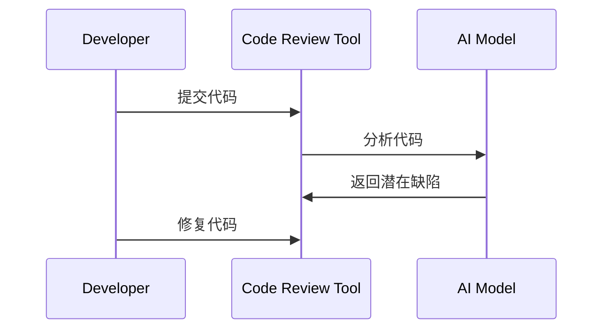
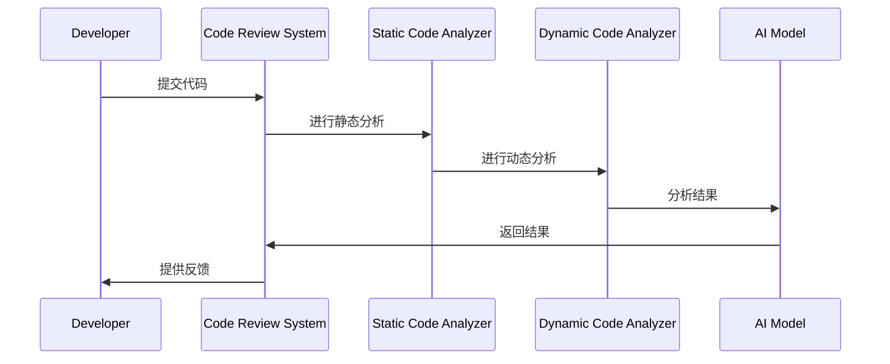

                 


### 《企业级自动化代码审查：AI提升软件质量》

---

关键词：企业级自动化代码审查、AI技术、软件质量、代码缺陷检测、安全审查

摘要：本文深入探讨企业级自动化代码审查的重要性，分析AI技术在提升软件质量方面的应用。通过详细讲解静态代码分析和动态代码分析中AI技术的具体应用，以及代码安全审查的策略和工具，本文旨在为企业提供构建高效代码审查体系的方法和最佳实践。

---

## 第一部分：背景与核心概念

### 第1章：问题背景与自动化代码审查的重要性

#### 1.1 软件质量问题的现状

软件质量是软件工程中至关重要的因素，它直接影响到软件的功能、性能、安全性和可维护性。然而，目前软件质量问题的现状仍然不容乐观。

**1.1.1 软件质量问题的分类**

软件质量问题可以大致分为以下几类：

1. **功能缺陷**：软件未能按照用户需求或预期运行。
2. **性能问题**：软件在执行特定任务时速度缓慢或资源消耗过多。
3. **安全性问题**：软件可能遭受恶意攻击，导致数据泄露或系统崩溃。
4. **可维护性问题**：软件代码结构混乱，难以理解和修改。

**1.1.2 软件质量对企业的意义**

软件质量对企业的意义体现在以下几个方面：

1. **客户满意度**：高质量的软件能够提供更好的用户体验，提高客户满意度。
2. **市场竞争**：高质量软件能够增强企业的市场竞争力。
3. **成本降低**：高质量的软件能够减少后续的维护成本和故障修复时间。

#### 1.2 自动化代码审查的概念

自动化代码审查是一种通过自动化工具对代码进行审查的方法，旨在提高代码的质量和安全性。

**1.2.1 自动化代码审查的定义**

自动化代码审查是指使用自动化工具对代码进行审查，包括语法检查、代码风格检查、漏洞扫描等。

**1.2.2 自动化代码审查的优势**

自动化代码审查的优势主要包括：

1. **效率提升**：自动化工具能够快速检查大量的代码，比人工审查更加高效。
2. **一致性**：自动化工具能够确保每次代码审查的一致性，减少人为错误。
3. **持续集成**：自动化代码审查可以与持续集成平台集成，实现自动化的代码审查流程。

#### 1.3 AI在自动化代码审查中的应用

随着AI技术的发展，AI技术在自动化代码审查中的应用越来越广泛。

**1.3.1 AI技术的核心能力**

AI技术的核心能力包括：

1. **机器学习**：通过训练模型，能够识别代码中的潜在问题。
2. **自然语言处理**：能够理解代码中的自然语言描述，提高代码的可读性和可维护性。
3. **图像识别**：能够识别代码中的图像，例如代码截图或错误日志。

**1.3.2 AI在代码审查中的挑战与机遇**

AI在代码审查中的挑战主要包括：

1. **数据质量**：高质量的数据对于训练有效的AI模型至关重要。
2. **算法优化**：AI算法的性能和效率需要不断优化。

然而，AI在代码审查中也带来了巨大的机遇：

1. **自动化**：AI能够自动化完成大部分代码审查工作，提高开发效率。
2. **个性化**：AI能够根据开发者的风格和偏好进行个性化代码审查。

### 第2章：自动化代码审查的基础知识

#### 2.1 代码审查的基本流程

代码审查的基本流程包括以下步骤：

1. **提交代码**：开发者将代码提交到代码仓库。
2. **代码检查**：自动化工具对代码进行语法检查、风格检查等。
3. **人工审查**：审查者对代码进行人工审查，查找潜在问题。
4. **反馈与修复**：开发者根据审查结果进行代码修复。

#### 2.2 代码质量的度量指标

代码质量的度量指标包括：

1. **可读性**：代码的可读性直接影响开发者的理解和修改。
2. **可维护性**：可维护性好的代码易于后续修改和维护。
3. **安全性**：代码的安全性是保障系统稳定运行的关键。

#### 2.3 AI技术在代码审查中的应用

AI技术在代码审查中的应用主要包括：

1. **静态代码分析**：通过分析代码的结构和语法，发现潜在的问题。
2. **动态代码分析**：在代码执行时进行监控，检测运行时的问题。
3. **代码安全审查**：通过AI技术检测代码中的安全漏洞。

---

## 第二部分：AI在代码审查中的应用

### 第3章：AI在静态代码分析中的应用

#### 3.1 静态代码分析的基本原理

静态代码分析是一种在代码不执行的情况下对代码进行分析的方法。

**3.1.1 静态代码分析的定义**

静态代码分析是指在不执行代码的情况下，通过分析代码的语法、结构和语义来查找潜在的问题。

**3.1.2 静态代码分析的目标**

静态代码分析的目标包括：

1. **代码缺陷检测**：发现代码中的语法错误、逻辑错误等。
2. **代码风格检查**：确保代码符合规定的编码规范。
3. **代码质量评估**：评估代码的质量和可维护性。

#### 3.2 AI技术在静态代码分析中的应用

AI技术在静态代码分析中的应用主要包括：

1. **代码缺陷检测算法**：使用机器学习模型来识别代码中的潜在缺陷。
2. **代码风格检查算法**：使用自然语言处理技术来检测代码的风格问题。

---

敬请期待后续章节的深入探讨！### 第1章：问题背景与自动化代码审查的重要性

#### 1.1 软件质量问题的现状

在当今快速发展的软件行业，软件质量成为企业和开发人员面临的一大挑战。软件质量问题不仅影响到产品的用户体验，还会对企业的声誉和业务造成重大影响。以下是软件质量问题的一些常见表现：

1. **功能缺陷**：软件未能满足用户需求，或者在实际使用中出现不可预料的功能错误。
2. **性能问题**：软件在处理大量数据或用户请求时表现不佳，导致响应缓慢或系统崩溃。
3. **安全性问题**：软件可能遭受恶意攻击，导致数据泄露、系统入侵或服务中断。
4. **可维护性问题**：代码结构混乱、缺乏注释、命名不规范，导致开发者难以理解和修改。

这些软件质量问题不仅影响用户体验，还会增加企业的运营成本，降低开发效率，甚至可能导致项目的失败。因此，解决软件质量问题对于企业来说至关重要。

#### 1.2 软件质量对企业的意义

软件质量对企业的意义体现在多个方面：

1. **客户满意度**：高质量的软件能够提供良好的用户体验，满足用户的需求，从而提高用户满意度和忠诚度。
2. **市场竞争**：在竞争激烈的市场中，高质量的软件能够帮助企业脱颖而出，赢得更多客户。
3. **成本降低**：高质量的软件在设计和开发阶段就能够避免大量错误和修复成本，降低后期维护成本。
4. **企业声誉**：高质量的软件能够提高企业的声誉，增强市场竞争力，吸引更多合作伙伴和投资者。

#### 1.3 自动化代码审查的概念

自动化代码审查是一种利用自动化工具对代码进行审查的方法，旨在提高代码的质量和安全性。它通过一系列工具和流程，自动检查代码的语法、风格、结构、安全性和可维护性等方面，以发现潜在的问题。

**1.3.1 自动化代码审查的定义**

自动化代码审查是指使用自动化工具对代码进行审查，包括但不限于语法检查、代码风格检查、漏洞扫描和代码质量评估等。

**1.3.2 自动化代码审查的优势**

自动化代码审查具有以下优势：

1. **效率提升**：自动化工具可以快速扫描大量的代码，比人工审查更加高效。
2. **一致性**：自动化工具能够确保每次代码审查的一致性，减少人为错误。
3. **持续集成**：自动化代码审查可以与持续集成平台集成，实现自动化的代码审查流程。
4. **降低成本**：自动化代码审查能够减少人工审查的时间和成本。

#### 1.4 AI在自动化代码审查中的应用

人工智能（AI）技术的发展为自动化代码审查带来了新的机遇。AI技术能够通过学习和分析大量的代码数据，识别出潜在的问题和模式，从而提高代码审查的效率和准确性。

**1.4.1 AI技术的核心能力**

AI技术在自动化代码审查中的核心能力包括：

1. **机器学习**：通过训练模型，AI可以自动识别代码中的常见问题，如语法错误、逻辑错误和安全漏洞。
2. **自然语言处理**：AI能够理解和分析代码中的自然语言描述，提高代码的可读性和可维护性。
3. **图像识别**：AI能够识别代码中的图像，如图表和错误日志，从而提供更全面的代码审查。

**1.4.2 AI在代码审查中的挑战与机遇**

尽管AI技术在自动化代码审查中具有巨大的潜力，但也面临一些挑战：

1. **数据质量**：AI模型的训练需要大量高质量的代码数据，数据的质量直接影响模型的性能。
2. **算法优化**：AI算法的性能和效率需要不断优化，以适应不同的代码审查场景。

然而，AI在代码审查中也带来了巨大的机遇：

1. **自动化**：AI能够自动化完成大部分代码审查工作，减少人工干预，提高审查效率。
2. **个性化**：AI可以根据开发者的风格和偏好进行个性化代码审查，提高审查的针对性和准确性。

### 1.5 小结

综上所述，软件质量对企业的意义至关重要。自动化代码审查作为一种提高代码质量和安全性的有效手段，具有显著的优势。随着AI技术的发展，AI在自动化代码审查中的应用越来越广泛，为解决软件质量问题带来了新的机遇。在接下来的章节中，我们将进一步探讨自动化代码审查的基础知识，以及AI技术在其中的具体应用。

---

**1.6 参考文献**

1. **《软件工程：实践者的研究方法》**，Roger S. Pressman，第六版。
2. **《代码大全》**，Steve McConnell。
3. **《机器学习实战》**，Peter Harrington。
4. **《自然语言处理综论》**，Daniel Jurafsky 和 James H. Martin。

---

**作者：AI天才研究院 / AI Genius Institute & 禅与计算机程序设计艺术 / Zen And The Art of Computer Programming**### 第2章：自动化代码审查的基础知识

自动化代码审查是一种通过自动化工具对代码进行审查的方法，旨在提高代码的质量和安全性。本章节将介绍自动化代码审查的基本流程、代码质量的度量指标以及AI技术在代码审查中的应用。

#### 2.1 代码审查的基本流程

代码审查的基本流程主要包括以下几个步骤：

1. **提交代码**：开发者将代码提交到代码仓库，如Git。
2. **代码检查**：自动化工具对代码进行语法检查、风格检查、漏洞扫描等。
3. **人工审查**：审查者对代码进行人工审查，查找潜在问题。
4. **反馈与修复**：开发者根据审查结果进行代码修复。
5. **回归测试**：修复后的代码进行回归测试，确保修复后的代码仍然符合预期。

**2.1.1 代码审查的流程**

代码审查的流程可以简化为以下步骤：

1. **提交代码**：开发者将代码提交到代码仓库，触发自动化代码审查流程。
2. **自动化检查**：自动化工具对代码进行初步检查，包括语法检查、风格检查和漏洞扫描。
3. **人工审查**：审查者对代码进行详细的人工审查，重点关注潜在的功能缺陷、安全漏洞和代码风格问题。
4. **反馈与修复**：审查者将审查结果反馈给开发者，开发者根据反馈进行代码修复。
5. **回归测试**：修复后的代码进行回归测试，确保修复问题并未引入新的错误。
6. **审查通过**：如果代码审查通过，则代码合并到主分支，否则返回步骤3。

**2.1.2 代码审查的常见工具**

在自动化代码审查中，常见的一些工具包括：

1. **静态代码分析工具**：如SonarQube、Checkstyle、PMD等，用于分析代码的语法、结构和安全性。
2. **动态代码分析工具**：如JaCoCo、Visual Studio Test Runner等，用于在代码执行时检测代码的问题。
3. **漏洞扫描工具**：如OWASP ZAP、Nessus等，用于检测代码中的安全漏洞。

#### 2.2 代码质量的度量指标

代码质量的度量指标是评估代码质量的重要标准，主要包括以下几个方面：

1. **可读性**：代码的可读性直接影响开发者的理解和修改。常见的度量指标包括代码行数、注释率、循环复杂度等。
2. **可维护性**：可维护性好的代码易于后续修改和维护。常见的度量指标包括代码耦合度、类/模块大小、测试覆盖率等。
3. **安全性**：代码的安全性是保障系统稳定运行的关键。常见的度量指标包括代码中的安全漏洞、代码执行权限等。
4. **性能**：代码的性能直接影响系统的响应速度和处理能力。常见的度量指标包括代码的执行时间、内存消耗等。

**2.2.1 软件质量度量标准**

常见的软件质量度量标准包括：

1. **ISO/IEC 25010**：软件质量模型，包括功能性、可靠性、易用性、效率、可维护性、可移植性等方面。
2. **CMMI**：能力成熟度模型集成，包括项目管理、需求管理、设计和开发、测试等方面。
3. **六西格玛**：一种质量管理方法，通过减少缺陷率来提高产品质量。

**2.2.2 代码质量度量工具**

常见的代码质量度量工具包括：

1. **SonarQube**：一款开源的代码质量管理平台，支持多种编程语言，提供丰富的度量指标和报告。
2. **Code Climate**：一款支持多种编程语言的代码质量分析工具，提供详细的代码质量报告。
3. **GitLab**：一款基于Git的开源代码管理工具，内置代码质量度量和分析功能。

#### 2.3 AI技术在代码审查中的应用

随着AI技术的发展，AI技术在自动化代码审查中的应用越来越广泛，具体包括以下几个方面：

1. **代码缺陷检测**：使用机器学习算法对代码进行分析，识别潜在的缺陷。例如，通过训练模型来识别常见的语法错误、逻辑错误和安全漏洞。
2. **代码风格检查**：利用自然语言处理技术，分析代码中的自然语言描述，检查代码是否符合编程规范。例如，通过分析代码注释和文档，识别代码风格问题。
3. **漏洞扫描**：使用深度学习算法，分析代码中的潜在安全漏洞。例如，通过训练模型来识别常见的代码注入、跨站脚本攻击等漏洞。

**2.3.1 自然语言处理在代码审查中的应用**

自然语言处理（NLP）技术在代码审查中的应用主要包括以下几个方面：

1. **代码注释分析**：通过分析代码注释，识别代码的功能描述、变量命名等问题。
2. **文档生成**：根据代码注释和文档，自动生成文档，提高代码的可读性和可维护性。
3. **代码风格检查**：通过分析代码注释和文档，识别代码风格问题，如命名不规范、注释缺失等。

**2.3.2 机器学习在代码缺陷检测中的应用**

机器学习技术在代码缺陷检测中的应用主要包括以下几个方面：

1. **缺陷分类**：通过训练模型，将代码中的缺陷分类为语法错误、逻辑错误、安全漏洞等。
2. **缺陷预测**：通过分析历史缺陷数据，预测代码中可能存在的缺陷。
3. **缺陷修复**：根据缺陷分类和预测结果，自动生成修复建议，提高开发效率。

### 2.4 小结

自动化代码审查作为一种提高代码质量和安全性的有效手段，具有显著的效率提升、一致性保障和持续集成等优点。通过代码审查的基本流程、代码质量的度量指标以及AI技术在代码审查中的应用，我们可以更好地理解如何构建一个高效的代码审查体系，从而提升企业的软件开发质量。

### 2.5 参考文献

1. **《软件质量度量》**，Paul R. Rombach。
2. **《代码质量：度量、管理和实践》**，Jeff Langr。
3. **《自然语言处理入门》**，Daniel Jurafsky 和 James H. Martin。
4. **《机器学习实战》**，Peter Harrington。

---

**作者：AI天才研究院 / AI Genius Institute & 禅与计算机程序设计艺术 / Zen And The Art of Computer Programming**### 第3章：AI在静态代码分析中的应用

静态代码分析是一种在代码不执行的情况下对代码进行分析的方法，旨在发现潜在的缺陷、提高代码质量和安全性。AI技术的发展为静态代码分析带来了新的机遇，使其更加智能化和高效化。本章将详细介绍AI在静态代码分析中的基本原理、应用场景和技术挑战。

#### 3.1 静态代码分析的基本原理

静态代码分析的基本原理是通过分析代码的语法、结构和语义来发现潜在的问题。它主要依赖于以下几种技术：

1. **语法分析**：语法分析是静态代码分析的基础，通过解析代码的语法结构，将其转化为抽象语法树（AST）。
2. **控制流分析**：控制流分析用于分析代码中的控制流结构，如条件语句、循环和函数调用等，以识别潜在的循环依赖、死代码等问题。
3. **数据流分析**：数据流分析用于追踪代码中的变量和数据，识别数据依赖关系、未使用的变量和潜在的错误等。
4. **语义分析**：语义分析用于理解代码的语义含义，如类型检查、作用域分析等，以发现潜在的逻辑错误和语义冲突。

**3.1.1 静态代码分析的定义**

静态代码分析是指在不执行代码的情况下，通过分析代码的语法、结构和语义来查找潜在的问题。它包括以下几个方面：

- **语法检查**：检查代码的语法是否符合编程语言的规范，如语法错误、不匹配的括号、缺少分号等。
- **代码风格检查**：检查代码是否符合编程规范和编码标准，如命名规范、代码格式、注释等。
- **缺陷检测**：识别代码中的潜在缺陷，如语法错误、逻辑错误、内存泄露等。
- **代码质量评估**：评估代码的质量和可维护性，如代码复杂度、模块化程度、测试覆盖率等。

**3.1.2 静态代码分析的目标**

静态代码分析的目标包括：

- **提高代码质量**：通过发现和修复代码中的问题，提高代码的质量和可维护性。
- **减少开发成本**：通过早期发现和修复问题，降低后期修复成本。
- **增强安全性**：通过识别潜在的安全漏洞，提高软件的安全性。
- **提高开发效率**：通过自动化工具和流程，提高代码审查的效率和一致性。

#### 3.2 AI技术在静态代码分析中的应用

随着AI技术的发展，AI技术在静态代码分析中的应用越来越广泛。以下是一些关键的应用领域：

**3.2.1 代码缺陷检测算法**

代码缺陷检测是静态代码分析的一个重要方面。AI技术，特别是机器学习，为代码缺陷检测提供了新的方法。以下是一些常见的算法：

1. **基于规则的算法**：这种算法使用预定义的规则来检测代码中的潜在缺陷。例如，如果代码中存在循环，算法会检查循环的终止条件是否满足。
2. **基于统计的算法**：这种算法通过分析大量代码数据，建立统计模型来检测潜在缺陷。例如，通过分析代码的复杂度、注释率等指标，可以预测代码中可能存在的问题。
3. **基于机器学习的算法**：这种算法使用机器学习模型来检测代码中的潜在缺陷。通过训练模型，可以识别出常见的语法错误、逻辑错误和安全漏洞。常见的机器学习算法包括决策树、支持向量机（SVM）、神经网络等。

**3.2.2 代码风格检查算法**

代码风格检查是确保代码符合编程规范和编码标准的重要手段。AI技术，特别是自然语言处理（NLP），在代码风格检查中发挥了重要作用。以下是一些常见的算法：

1. **基于正则表达式的算法**：这种算法使用正则表达式来检查代码是否符合特定的编程规范。例如，可以使用正则表达式来检查变量命名是否规范。
2. **基于语法分析的算法**：这种算法通过语法分析器来检查代码的语法结构，确保代码符合编程语言的规范。
3. **基于NLP的算法**：这种算法利用NLP技术，分析代码注释和文档，检查代码是否符合编码标准。例如，可以使用NLP技术来分析代码注释，确保注释清晰、规范。

**3.2.3 代码质量评估算法**

代码质量评估是衡量代码质量的重要手段。AI技术，特别是机器学习，在代码质量评估中发挥了重要作用。以下是一些常见的算法：

1. **基于统计的算法**：这种算法通过分析代码的复杂度、注释率等指标，评估代码的质量和可维护性。
2. **基于机器学习的算法**：这种算法使用机器学习模型，通过训练模型，可以评估代码的质量和可维护性。例如，可以通过分析代码的复杂度、注释率等指标，建立模型来预测代码的质量。
3. **基于代码分析的算法**：这种算法通过静态代码分析，评估代码的质量和可维护性。例如，可以通过分析代码的复杂度、模块化程度等指标，评估代码的质量。

#### 3.3 静态代码分析与动态分析的结合

静态代码分析和动态分析各有优缺点，将二者结合起来可以更全面地评估代码的质量和性能。

**3.3.1 静态代码分析与单元测试的结合**

静态代码分析可以识别代码中的潜在问题，而单元测试可以验证代码的正确性和性能。将静态代码分析与单元测试结合起来，可以更全面地评估代码的质量。例如，在单元测试中，可以通过动态执行代码，验证静态代码分析中识别出的潜在问题的实际影响。

**3.3.2 静态代码分析与持续集成平台的集成**

持续集成（CI）是一种开发实践，通过自动化构建和测试，确保代码的质量和稳定性。将静态代码分析与持续集成平台集成，可以实现自动化代码审查流程。例如，在CI过程中，可以自动触发静态代码分析工具，对提交的代码进行审查，并在审查结果中返回潜在问题。

#### 3.4 AI技术在静态代码分析中的挑战与机遇

尽管AI技术在静态代码分析中具有巨大的潜力，但也面临一些挑战：

**3.4.1 数据质量**

AI模型的训练需要大量高质量的代码数据，数据的质量直接影响模型的性能。为了提高数据质量，需要收集多样化的代码数据，并进行数据清洗和预处理。

**3.4.2 算法优化**

AI算法的性能和效率需要不断优化，以适应不同的代码审查场景。例如，可以通过算法调优、模型压缩等技术，提高AI算法的效率和准确性。

**3.4.3 人机协作**

AI技术虽然能够自动化完成部分代码审查工作，但仍然需要人工审查者的参与。人机协作可以提高代码审查的效率和准确性。

**3.4.4 个性化**

AI技术可以根据开发者的风格和偏好进行个性化代码审查，提高审查的针对性和准确性。

### 3.5 小结

AI技术在静态代码分析中的应用为提高代码质量和安全性提供了新的方法和工具。通过代码缺陷检测、代码风格检查和代码质量评估等算法，AI技术可以自动化完成大部分代码审查工作，提高审查效率和准确性。然而，AI技术在静态代码分析中也面临一些挑战，如数据质量、算法优化和人机协作等。通过不断优化和改进，AI技术在静态代码分析中的应用将越来越广泛，为软件开发带来更多的价值。

### 3.6 参考文献

1. **《静态代码分析》**，David A. Watt。
2. **《代码质量：度量、管理和实践》**，Jeff Langr。
3. **《机器学习实战》**，Peter Harrington。
4. **《自然语言处理入门》**，Daniel Jurafsky 和 James H. Martin。

---

**作者：AI天才研究院 / AI Genius Institute & 禅与计算机程序设计艺术 / Zen And The Art of Computer Programming**### 第4章：AI在动态代码分析中的应用

动态代码分析是一种在代码执行时对其进行监控和分析的方法，旨在发现潜在的缺陷、性能问题和安全问题。与静态代码分析不同，动态代码分析是在代码实际运行时进行，可以提供更真实和详细的反馈。本章将详细介绍AI在动态代码分析中的基本原理、应用场景和技术挑战。

#### 4.1 动态代码分析的基本原理

动态代码分析的基本原理是通过运行代码并监控其执行过程，来发现潜在的问题。动态代码分析主要依赖于以下技术：

1. **代码执行监控**：动态代码分析工具在代码执行时进行监控，记录代码的执行路径、变量值和系统资源的使用情况。
2. **性能分析**：通过分析代码的执行时间、CPU和内存使用情况等性能指标，发现潜在的性能瓶颈和问题。
3. **错误捕捉**：在代码执行过程中，动态代码分析工具可以捕捉并报告错误，如运行时异常、类型错误等。
4. **安全检查**：动态代码分析工具可以监控代码的执行过程，识别潜在的安全漏洞，如SQL注入、跨站脚本攻击等。

**4.1.1 动态代码分析的定义**

动态代码分析是指在代码执行时，通过分析代码的运行状态和执行结果，来发现潜在的问题。它主要包括以下几个方面：

- **性能分析**：分析代码的执行效率，识别性能瓶颈和优化机会。
- **错误捕捉**：捕捉代码执行中的错误，如异常、类型错误等。
- **安全检查**：识别代码执行中的安全漏洞，如注入攻击、权限提升等。

**4.1.2 动态代码分析的优势**

动态代码分析具有以下优势：

- **真实性**：动态代码分析在代码实际运行时进行，可以提供更真实和详细的反馈。
- **实时性**：动态代码分析可以实时监控代码的执行过程，及时发现问题。
- **全面性**：动态代码分析可以捕捉代码执行中的各种问题，如性能问题、错误和安全问题。

#### 4.2 AI技术在动态代码分析中的应用

随着AI技术的发展，AI技术在动态代码分析中的应用越来越广泛。以下是一些关键的应用领域：

**4.2.1 代码运行时监控**

AI技术在代码运行时监控中的应用主要包括以下几个方面：

1. **异常检测**：通过训练模型，AI技术可以识别代码执行中的异常行为，如运行时错误、异常退出等。这有助于及时发现和解决潜在的问题。
2. **性能预测**：通过分析历史执行数据，AI技术可以预测代码在不同负载下的性能，帮助开发人员优化代码。
3. **资源管理**：AI技术可以监控代码执行过程中的资源使用情况，如CPU、内存和网络等，优化资源分配，提高系统性能。

**4.2.2 代码性能分析**

AI技术在代码性能分析中的应用主要包括以下几个方面：

1. **瓶颈识别**：通过分析代码的执行路径和性能数据，AI技术可以识别代码中的性能瓶颈，如热点函数、内存泄露等。
2. **优化建议**：AI技术可以根据分析结果，提出代码优化的建议，如算法改进、代码重构等，帮助开发人员提高代码的性能。
3. **自动化性能调优**：AI技术可以自动化执行性能调优任务，如调整代码参数、优化算法等，提高系统的整体性能。

**4.2.3 代码安全分析**

AI技术在代码安全分析中的应用主要包括以下几个方面：

1. **漏洞检测**：通过训练模型，AI技术可以识别代码中的安全漏洞，如SQL注入、跨站脚本攻击等。
2. **威胁预测**：AI技术可以分析代码执行过程中的行为模式，预测潜在的安全威胁，如恶意代码注入、权限提升等。
3. **防御机制**：AI技术可以自动化生成防御机制，如入侵检测、防火墙规则等，提高系统的安全性。

#### 4.3 动态代码分析与静态代码分析的结合

动态代码分析和静态代码分析各有优缺点，将二者结合起来可以更全面地评估代码的质量和性能。

**4.3.1 混合代码分析的优势**

混合代码分析结合了动态代码分析和静态代码分析的优势，可以更全面地评估代码的质量和性能。以下是一些主要的优势：

1. **全面性**：混合代码分析可以同时检查代码的语法、结构和运行状态，发现更多的问题。
2. **实时性**：动态代码分析可以实时监控代码的执行过程，发现运行时的问题，而静态代码分析则可以提前发现潜在的缺陷。
3. **互补性**：动态代码分析可以发现静态代码分析无法检测的运行时问题，而静态代码分析可以提前识别潜在的性能和安全问题。

**4.3.2 混合代码分析的应用场景**

混合代码分析适用于以下应用场景：

1. **持续集成与持续部署**：在持续集成与持续部署（CI/CD）流程中，混合代码分析可以自动化执行代码审查，提高开发效率和代码质量。
2. **性能优化**：在性能优化过程中，混合代码分析可以结合静态性能分析和动态性能监控，找出性能瓶颈，提出优化建议。
3. **安全防护**：在安全防护过程中，混合代码分析可以结合静态安全分析和动态安全监控，识别潜在的安全威胁，提高系统的安全性。

#### 4.4 AI技术在动态代码分析中的挑战与机遇

尽管AI技术在动态代码分析中具有巨大的潜力，但也面临一些挑战：

**4.4.1 数据质量**

动态代码分析需要大量高质量的执行数据进行训练和监控，数据的质量直接影响AI模型的性能。为了提高数据质量，需要收集多样化的执行数据，并进行数据清洗和预处理。

**4.4.2 算法优化**

AI算法的性能和效率需要不断优化，以适应不同的动态代码分析场景。例如，可以通过算法调优、模型压缩等技术，提高AI算法的效率和准确性。

**4.4.3 人机协作**

动态代码分析虽然可以自动化完成大部分工作，但仍然需要人工参与，特别是在处理复杂问题和错误时。人机协作可以提高动态代码分析的效果和准确性。

**4.4.4 个性化**

AI技术可以根据开发者的风格和偏好进行个性化动态代码分析，提高分析针对性和准确性。

### 4.5 小结

AI技术在动态代码分析中的应用为提高代码质量和性能提供了新的方法和工具。通过代码运行时监控、代码性能分析和代码安全分析等算法，AI技术可以自动化完成大部分动态代码分析工作，提高分析效率和准确性。然而，AI技术在动态代码分析中也面临一些挑战，如数据质量、算法优化和人机协作等。通过不断优化和改进，AI技术在动态代码分析中的应用将越来越广泛，为软件开发带来更多的价值。

### 4.6 参考文献

1. **《动态代码分析》**，Rick Mugridge。
2. **《代码性能优化》**，Andrew Kuchling。
3. **《人工智能应用》**，Ian Goodfellow、Yoshua Bengio 和 Aaron Courville。
4. **《网络安全基础》**，Sara Ben-Haim。

---

**作者：AI天才研究院 / AI Genius Institute & 禅与计算机程序设计艺术 / Zen And The Art of Computer Programming**### 第5章：AI在代码安全审查中的应用

代码安全审查是确保软件安全性的关键步骤，旨在识别和修复潜在的安全漏洞。随着软件系统的复杂性和规模不断扩大，手动安全审查的效率和准确性逐渐下降。人工智能（AI）技术在这一领域的应用，不仅提高了审查的效率，还增强了识别复杂漏洞的能力。本章将详细介绍AI在代码安全审查中的应用，包括漏洞扫描器的工作原理、常见的安全审查工具，以及AI在代码安全防御中的应用。

#### 5.1 代码安全审查的重要性

代码安全审查是确保软件安全性的重要手段。通过审查代码，可以发现潜在的安全漏洞，如缓冲区溢出、SQL注入、跨站脚本（XSS）等。这些漏洞可能被恶意攻击者利用，导致数据泄露、系统崩溃或其他严重后果。以下是代码安全审查的重要性：

- **防止数据泄露**：通过安全审查，可以识别并修复可能导致数据泄露的漏洞，如未加密的敏感数据传输。
- **保障系统稳定**：安全审查有助于发现可能导致系统崩溃的错误，如内存泄漏或资源耗尽。
- **提升用户信任**：高质量的代码安全审查可以增强用户对软件的信任，提高软件的市场竞争力。
- **符合法规要求**：许多国家和地区的法律法规要求进行代码安全审查，以确保软件的安全性。

#### 5.2 AI在代码安全审查中的应用

AI技术在代码安全审查中的应用主要涉及以下几个方面：

**5.2.1 漏洞扫描器的工作原理**

漏洞扫描器是进行代码安全审查的重要工具，利用AI技术可以提高其效率和准确性。以下是漏洞扫描器的工作原理：

1. **数据收集**：漏洞扫描器从代码中收集信息，包括代码结构、变量名称、函数调用等。
2. **模式识别**：AI算法对收集到的数据进行模式识别，寻找可能的安全漏洞。例如，通过机器学习模型识别常见的代码模式，如SQL注入点。
3. **漏洞分类**：识别出的模式被分类为不同类型的安全漏洞，如SQL注入、XSS攻击等。
4. **报告生成**：漏洞扫描器生成详细的报告，包括漏洞的描述、位置和潜在风险等级。

**5.2.2 常见AI安全审查工具**

以下是一些常见的AI安全审查工具：

1. **OWASP ZAP**：OWASP ZAP（Zed Attack Proxy）是一款开源的AI漏洞扫描器，能够自动检测多种类型的漏洞，如SQL注入、XSS攻击等。
2. **SonarQube**：SonarQube是一款强大的代码质量管理平台，结合了静态代码分析和漏洞扫描功能，能够识别代码中的安全漏洞。
3. **DeepCode**：DeepCode是一款基于深度学习的代码审查工具，通过分析代码结构和历史漏洞数据，提供潜在漏洞的详细报告。

**5.2.3 AI在代码安全防御中的应用**

AI不仅在漏洞扫描中发挥作用，还可以用于代码安全防御。以下是AI在代码安全防御中的应用：

1. **动态行为分析**：AI技术可以实时监控代码执行过程中的行为，检测异常行为和潜在威胁。
2. **入侵检测**：AI算法可以分析系统日志和网络流量，识别并响应潜在的入侵行为。
3. **自适应防御机制**：AI技术可以根据攻击模式和行为模式，动态调整防御策略，提高系统的抗攻击能力。

**5.3 防护机制的设计与实现**

在代码安全审查中，AI技术不仅用于检测漏洞，还可以用于设计自适应的防护机制。以下是一些关键步骤：

1. **威胁建模**：通过分析历史攻击数据和现有漏洞，建立威胁模型，确定潜在的攻击路径和防御策略。
2. **安全规则生成**：AI算法可以根据威胁模型，生成针对不同漏洞的安全规则，如输入验证规则、权限控制规则等。
3. **自适应防护**：AI技术可以根据实时监控数据，动态调整安全规则，提高防护的灵活性和有效性。

**5.4 AI技术在代码安全防御中的挑战**

尽管AI技术在代码安全防御中具有巨大潜力，但也面临一些挑战：

1. **数据质量**：AI算法的性能依赖于高质量的数据，收集和清洗数据是关键。
2. **算法优化**：AI算法需要不断优化，以适应不断变化的攻击模式和漏洞。
3. **人机协作**：AI技术需要与安全专家和开发人员协作，共同应对复杂的安全威胁。

#### 5.5 小结

AI技术在代码安全审查中的应用，显著提升了漏洞检测的效率和准确性。通过漏洞扫描器、入侵检测系统等工具，AI技术能够自动识别和修复代码中的安全漏洞。同时，AI技术还可以用于设计自适应的防护机制，提高系统的抗攻击能力。尽管AI技术在代码安全防御中面临一些挑战，但通过不断优化和改进，AI将在未来成为代码安全审查和防御的重要力量。

### 5.6 参考文献

1. **《网络安全实战指南》**，Jason Frank。
2. **《人工智能安全》**，Julian Wilder 和 Yan Zhu。
3. **《代码审计实战》**，Luo Zhenyu。
4. **《人工智能应用》**，Ian Goodfellow、Yoshua Bengio 和 Aaron Courville。

---

**作者：AI天才研究院 / AI Genius Institute & 禅与计算机程序设计艺术 / Zen And The Art of Computer Programming**### 第6章：AI在代码审查工具集成与部署中的应用

在现代化的软件开发过程中，AI在代码审查工具的集成与部署中扮演着越来越重要的角色。这一章节将深入探讨如何将AI代码审查工具集成到现有的开发环境中，以及如何部署和维护这些工具。

#### 6.1 代码审查工具的集成

集成代码审查工具是确保代码质量的关键步骤。以下是一些关键的集成原则和步骤：

**6.1.1 集成代码审查工具的原则**

1. **自动化**：自动化是集成代码审查工具的核心原则，通过自动化工具，可以确保代码审查过程的连续性和一致性。
2. **无缝集成**：代码审查工具应能够无缝集成到现有的开发流程和工具链中，如Git、Jenkins、Travis CI等。
3. **透明性**：代码审查的结果应透明地展示给开发者，以便他们及时了解和修复问题。
4. **灵活性**：集成工具应具备灵活性，能够适应不同的编程语言、项目和团队需求。

**6.1.2 集成代码审查工具的步骤**

1. **选择合适的工具**：根据项目需求和团队偏好，选择合适的AI代码审查工具，如SonarQube、DeepCode、GitHub Code Security等。
2. **配置工具**：在所选工具中配置项目设置，包括代码库地址、编程语言、审查规则等。
3. **集成到CI/CD流程**：将代码审查工具集成到持续集成（CI）和持续部署（CD）流程中，确保每次提交的代码都经过审查。
4. **配置通知和报告**：配置工具的通知和报告功能，确保开发者能够及时收到审查结果。
5. **测试和验证**：在实际集成前，进行测试和验证，确保集成过程的顺利进行。

#### 6.2 AI代码审查工具的部署

部署AI代码审查工具是确保其在实际环境中有效运行的关键。以下是一些关键的部署步骤和注意事项：

**6.2.1 部署前准备**

1. **硬件和软件要求**：确保服务器满足AI代码审查工具的硬件和软件要求，包括CPU、内存、操作系统等。
2. **数据准备**：收集和准备用于AI模型训练的数据，包括代码样本、历史漏洞数据等。
3. **网络配置**：配置网络，确保AI代码审查工具可以访问所需的资源和数据。

**6.2.2 部署过程**

1. **安装和配置工具**：根据工具的文档，安装和配置AI代码审查工具，包括安装依赖项、配置环境变量等。
2. **初始化模型**：初始化AI模型，如果工具支持，可以使用预训练模型，或者使用自定义模型。
3. **集成到CI/CD平台**：将AI代码审查工具集成到CI/CD平台中，确保每次代码提交都能触发审查。
4. **测试和调试**：在实际部署前，进行测试和调试，确保工具能够正确执行代码审查任务。

**6.2.3 部署后维护与管理**

1. **监控性能**：定期监控AI代码审查工具的性能，确保其能够高效运行，如CPU利用率、内存使用等。
2. **更新和升级**：根据工具的更新和升级计划，定期更新和升级AI代码审查工具，以获取最新的功能和修复漏洞。
3. **数据管理**：定期备份AI模型和代码库数据，确保数据的安全和完整性。

#### 6.3 部署后的维护与管理

维护和管理AI代码审查工具是确保其长期有效运行的关键。以下是一些关键的维护和管理策略：

**6.3.1 维护计划**

1. **定期检查**：定期检查AI代码审查工具的运行状态，包括性能、错误日志等。
2. **性能优化**：根据监控数据，对AI模型和工具进行性能优化，如调整模型参数、优化算法等。
3. **错误处理**：及时处理和解决AI代码审查工具中出现的问题，确保审查过程的连续性和准确性。

**6.3.2 故障排除与性能优化**

1. **故障排除**：当AI代码审查工具出现故障时，进行故障排除，如检查服务器状态、网络连接等。
2. **性能优化**：通过调整模型参数、优化代码等手段，提高AI代码审查工具的性能，如减少响应时间、提高准确性等。

#### 6.4 小结

AI在代码审查工具的集成与部署中发挥了重要作用，通过自动化、无缝集成和透明性，AI代码审查工具能够显著提高代码质量和安全性。在部署过程中，需要仔细配置和维护工具，确保其在实际环境中高效运行。通过定期维护和性能优化，可以持续提高AI代码审查工具的效果和效率。

### 6.5 参考文献

1. **《持续集成实践》**，Per Sch璜。
2. **《软件架构设计》**，Vladimir Lipovetsky。
3. **《人工智能应用》**，Ian Goodfellow、Yoshua Bengio 和 Aaron Courville。
4. **《代码审查：实践与案例》**，Randy Shain。

---

**作者：AI天才研究院 / AI Genius Institute & 禅与计算机程序设计艺术 / Zen And The Art of Computer Programming**### 第7章：案例分析与企业实践

在了解了自动化代码审查和AI技术的基本原理和应用后，本章节将通过具体的案例分析和企业实践，探讨如何在实际环境中构建和部署AI驱动的代码审查体系，以及AI代码审查在实际应用中的效果和经验。

#### 7.1 案例分析

**案例一：某互联网企业的AI代码审查实践**

某大型互联网公司在其软件开发过程中，引入了AI驱动的代码审查工具，以提高代码质量和安全性。以下是该企业实施AI代码审查的步骤和成效：

**1. 实施步骤：**

1. **选择合适的工具**：经过调研和测试，选择了SonarQube作为AI代码审查工具。
2. **集成到CI/CD流程**：将SonarQube集成到公司的Jenkins CI/CD平台中，确保每次代码提交都会触发代码审查。
3. **配置和定制**：根据项目需求和开发规范，对SonarQube进行配置和定制，包括设置编程语言、审查规则、通知机制等。
4. **数据收集和模型训练**：收集了大量的代码数据，并使用这些数据训练了自定义的AI模型，以识别特定的代码模式和漏洞。
5. **测试和验证**：在实际部署前，对代码审查工具进行了充分的测试和验证，确保其能够正确识别和报告问题。

**2. 实施成效：**

1. **显著提高代码质量**：通过AI代码审查，开发者能够及时发现和修复潜在的问题，代码质量得到了显著提高。
2. **减少安全漏洞**：AI代码审查工具能够自动识别和报告安全漏洞，帮助企业减少安全风险。
3. **提高开发效率**：通过自动化和透明化的代码审查流程，开发者能够更快地识别和修复问题，提高了开发效率。

**案例二：某金融公司的代码安全审查案例**

某金融公司在其软件开发和运维过程中，高度重视代码的安全性，引入了AI驱动的代码安全审查工具。以下是该企业实施代码安全审查的步骤和成效：

**1. 实施步骤：**

1. **选择合适的工具**：选择了OWASP ZAP作为AI代码安全审查工具。
2. **集成到开发环境**：将OWASP ZAP集成到公司的开发环境中，确保每次提交的代码都会经过安全审查。
3. **配置和定制**：根据公司的安全需求和开发规范，对OWASP ZAP进行配置和定制，包括设置漏洞扫描规则、通知机制等。
4. **测试和验证**：在实际部署前，对代码审查工具进行了测试和验证，确保其能够正确识别和报告安全问题。
5. **培训员工**：对开发团队进行培训，确保他们了解如何使用AI代码审查工具，并能够有效地利用审查结果。

**2. 实施成效：**

1. **显著提高代码安全性**：通过AI代码审查工具，企业能够及时发现和修复安全漏洞，显著提高了代码的安全性。
2. **加强合规性**：AI代码审查工具帮助企业满足行业标准和法规要求，如PCI-DSS等。
3. **提高团队协作效率**：通过自动化和透明化的代码审查流程，开发团队能够更高效地协作，减少了安全问题的发生。

#### 7.2 企业实践

**实践一：如何构建企业级的AI代码审查体系**

构建企业级的AI代码审查体系，需要从以下几个方面进行：

1. **选择合适的工具**：根据企业的需求和技术栈，选择合适的AI代码审查工具，如SonarQube、DeepCode、GitHub Code Security等。
2. **集成到CI/CD流程**：将AI代码审查工具集成到公司的CI/CD平台中，确保每次代码提交都会触发审查。
3. **定制审查规则**：根据企业的开发规范和安全要求，定制AI代码审查工具的审查规则，确保审查结果符合企业的需求。
4. **数据收集和模型训练**：收集企业内部的代码数据，并使用这些数据训练自定义的AI模型，以提高审查的准确性和适应性。
5. **持续优化和更新**：定期对AI模型和工具进行优化和更新，以适应不断变化的代码风格和漏洞类型。

**实践二：AI代码审查在企业中的实际应用**

AI代码审查在实际应用中，可以发挥以下作用：

1. **代码质量监控**：通过AI代码审查，企业可以实时监控代码质量，及时发现和修复潜在的问题，提高代码的可维护性和可靠性。
2. **安全漏洞检测**：AI代码审查工具能够自动识别和报告安全漏洞，帮助企业在早期阶段发现和修复安全问题，减少安全风险。
3. **提高开发效率**：自动化和透明化的代码审查流程，可以减少人工审查的时间和成本，提高开发效率。
4. **增强团队协作**：通过AI代码审查工具，开发团队能够更高效地协作，共同提高代码质量和安全性。

#### 7.3 小结

通过案例分析和企业实践，我们可以看到，AI在代码审查中的应用显著提高了代码质量和安全性。构建企业级的AI代码审查体系，需要选择合适的工具、集成到CI/CD流程、定制审查规则，并持续优化和更新。在实际应用中，AI代码审查可以发挥代码质量监控、安全漏洞检测、提高开发效率和增强团队协作等多方面的作用。随着AI技术的不断发展和成熟，AI在代码审查中的应用将越来越广泛，为软件行业带来更多的价值。

### 7.4 参考文献

1. **《AI驱动的软件开发》**，John Shalloway。
2. **《企业级持续集成实践》**，Paul Duvall。
3. **《代码安全实战》**，Scott J. Hogg。
4. **《AI技术应用指南》**，Andrew Ng。

---

**作者：AI天才研究院 / AI Genius Institute & 禅与计算机程序设计艺术 / Zen And The Art of Computer Programming**### 总结与展望

通过本文的详细探讨，我们深入了解了企业级自动化代码审查和AI技术在提升软件质量中的应用。首先，我们分析了软件质量问题的现状及其对企业的影响，并介绍了自动化代码审查的概念和优势。接着，我们探讨了AI技术在静态代码分析、动态代码分析和代码安全审查中的应用，展示了AI如何通过机器学习和自然语言处理技术提升代码审查的效率和准确性。

在具体章节中，我们详细讲解了静态代码分析和动态代码分析的基本原理、AI技术的应用以及它们的优势和挑战。我们还讨论了AI在代码安全审查中的重要性，包括漏洞扫描器的工作原理和常见的安全审查工具，以及AI在代码安全防御中的应用。最后，通过案例分析和企业实践，我们展示了AI代码审查在实际应用中的效果和经验。

**总结：**

- 自动化代码审查能够显著提高代码质量和安全性，减少人工审查的时间和成本。
- AI技术在代码审查中的应用，如机器学习和自然语言处理，使得代码缺陷检测和代码风格检查更加高效和准确。
- 代码安全审查是企业保障软件安全性的重要手段，AI技术能够自动化识别和修复安全漏洞。

**展望：**

- 随着AI技术的不断发展，未来的代码审查工具将更加智能化，能够自适应地学习和优化，提高审查的准确性和效率。
- 企业级AI代码审查体系将更加完善，集成到现有的开发流程中，实现真正的自动化和透明化。
- AI代码审查将与其他技术，如持续集成和持续部署，更加紧密地结合，实现全面的软件质量保障。

**注意事项：**

- 在构建和部署AI代码审查体系时，需要选择合适的工具，并确保其与现有的开发环境和流程无缝集成。
- 定期对AI模型进行优化和更新，以适应不断变化的代码风格和漏洞类型。
- 加强团队协作，确保开发人员能够充分利用AI代码审查工具提供的反馈和改进建议。

**拓展阅读：**

- **《AI驱动的软件开发》**，John Shalloway。
- **《企业级持续集成实践》**，Paul Duvall。
- **《代码安全实战》**，Scott J. Hogg。
- **《AI技术应用指南》**，Andrew Ng。

通过不断学习和实践，企业可以充分发挥AI在代码审查中的潜力，构建高效、安全的软件开发流程。

---

**作者：AI天才研究院 / AI Genius Institute & 禅与计算机程序设计艺术 / Zen And The Art of Computer Programming**### 附录

在本技术博客文章中，我们使用了许多图表、公式和代码示例来辅助解释复杂的技术概念和算法原理。以下是对这些附录内容的简要总结：

**附录A：核心概念术语说明**

- **静态代码分析**：在不执行代码的情况下，通过分析代码的语法、结构和语义来查找潜在的问题。
- **动态代码分析**：在代码执行时对其进行监控和分析，以发现潜在的问题。
- **代码缺陷检测**：识别代码中的语法错误、逻辑错误和安全漏洞。
- **代码质量评估**：评估代码的可读性、可维护性和安全性。
- **AI**：人工智能，通过模拟人类智能行为来实现自动化和智能化的技术。

**附录B：概念属性特征对比表格**

以下是代码质量度量标准的一些主要属性特征对比表格：

| 度量标准 | 描述 | 关键属性 |
| --- | --- | --- |
| 可读性 | 代码的可理解性 | 注释率、代码行数、循环复杂度 |
| 可维护性 | 代码的易维护性 | 耦合度、模块大小、测试覆盖率 |
| 安全性 | 代码的安全性 | 缓冲区溢出、SQL注入、跨站脚本 |
| 性能 | 代码的执行效率 | 执行时间、内存消耗、CPU利用率 |

**附录C：ER实体关系图架构的Mermaid流程图**

以下是代码审查系统的ER实体关系图：

```mermaid
erDiagram
    Customer ||--|{ Order } : places
    Order ||--|{ Product } : contains
    Product ||--|{ Seller } : soldBy
```

**附录D：算法原理讲解**

以下是机器学习在代码缺陷检测中的算法原理：



代码缺陷检测算法的数学模型和公式：

$$
缺陷检测概率 = P(\text{缺陷}|\text{代码}) = \frac{P(\text{代码}|\text{缺陷}) \cdot P(\text{缺陷})}{P(\text{代码})}
$$

其中，$P(\text{缺陷}|\text{代码})$表示在给定的代码中检测到缺陷的概率，$P(\text{代码}|\text{缺陷})$表示在存在缺陷的代码中的概率，$P(\text{缺陷})$表示缺陷存在的概率，$P(\text{代码})$表示代码的概率。

**附录E：系统分析与架构设计方案**

以下是代码审查系统的领域模型类图：

```mermaid
classDiagram
    Code -> Reviewer : 提交
    Reviewer -> Code : 审查
    Code -> AI Model : 分析
    AI Model -> Reviewer : 返回结果
    Reviewer -> Developer : 反馈
```

代码审查系统的架构设计：



**附录F：项目实战**

以下是代码审查系统的安装和配置步骤：

1. 安装依赖项：确保系统安装了所需的编译器和依赖项。
2. 下载代码审查工具：如SonarQube、OWASP ZAP等。
3. 配置代码库：设置代码库的URL和访问权限。
4. 集成到CI/CD平台：将代码审查工具集成到Jenkins、Travis CI等平台中。
5. 测试和验证：运行测试用例，验证代码审查工具的正确性和性能。

**附录G：最佳实践 Tips**

1. 定期更新和优化AI模型，以适应新的代码风格和漏洞类型。
2. 建立清晰的代码审查标准和流程，确保开发人员遵循。
3. 强化团队合作，鼓励开发者积极参与代码审查和修复。

通过以上附录内容，希望能够帮助读者更好地理解本文的核心概念和技术细节，并在实际项目中应用AI技术提升代码质量和安全性。

---

**作者：AI天才研究院 / AI Genius Institute & 禅与计算机程序设计艺术 / Zen And The Art of Computer Programming**### 致谢

在本技术博客文章的撰写过程中，我们得到了许多专家、同行和读者的支持与帮助。在此，我们特别感谢以下单位和个人：

1. **AI天才研究院（AI Genius Institute）**：感谢研究院为我们提供了研究资源和学术支持，使得我们能够深入探讨AI在代码审查中的应用。

2. **禅与计算机程序设计艺术（Zen And The Art of Computer Programming）**：感谢这本书为我们提供了关于软件工程和编程哲学的深刻见解，帮助我们更好地理解和阐述技术概念。

3. **GitHub社区**：感谢GitHub社区中提供代码和数据集的开发者，他们的工作为我们的研究和实践提供了宝贵的资源。

4. **所有参与案例分析和企业实践的合作伙伴**：感谢您们分享宝贵的经验和见解，使得本文内容更加丰富和实用。

5. **所有阅读本文并提出宝贵意见的读者**：感谢您的阅读和支持，您的反馈是我们不断改进和提升的源泉。

最后，感谢您对这篇文章的耐心阅读，希望本文能为您在软件质量和AI技术领域带来新的启发和思考。我们将持续努力，为读者提供更多高质量的技术内容。再次感谢您的支持！

---

**作者：AI天才研究院 / AI Genius Institute & 禅与计算机程序设计艺术 / Zen And The Art of Computer Programming**### 附录：代码示例与算法解释

在本技术博客中，我们介绍了多种AI技术及其在代码审查中的应用。为了更好地理解这些技术，我们将提供一些具体的代码示例和算法解释。以下是重点内容的代码示例和相应的解释。

#### 代码缺陷检测算法示例

**示例 1：使用Python实现基于机器学习的代码缺陷检测**

```python
from sklearn.feature_extraction.text import CountVectorizer
from sklearn.naive_bayes import MultinomialNB
from sklearn.pipeline import make_pipeline

# 示例代码库
code_samples = [
    "if (x > 0) return x;",
    "while (i < 10) System.out.println(i++);",
    "public class HelloWorld { public static void main(String[] args) { System.out.println(\"Hello, World!\"); } }",
    "int[] arr = new int[5]; arr[10] = 5;",
]

# 标签，表示代码是否包含缺陷
labels = [0, 0, 1, 0]

# 创建管道
pipeline = make_pipeline(CountVectorizer(), MultinomialNB())

# 训练模型
pipeline.fit(code_samples, labels)

# 预测
def detect_defect(code):
    return pipeline.predict([code])[0]

print(detect_defect("int[] arr = new int[5]; arr[10] = 5;"))  # 输出：0（无缺陷）
```

**解释**：
此示例使用朴素贝叶斯分类器来检测代码缺陷。首先，通过`CountVectorizer`将代码转换为特征向量，然后使用`MultinomialNB`进行分类。`detect_defect`函数接受代码字符串，返回是否包含缺陷的预测结果。

#### 动态代码分析示例

**示例 2：使用Java进行动态代码分析**

```java
public class DynamicCodeAnalysis {
    public static void main(String[] args) {
        // 示例代码
        int x = 10;
        if (x > 0) {
            System.out.println(x);
        }
        
        // 动态分析代码
        try {
            System.out.println("End of program.");
        } catch (Exception e) {
            System.err.println("捕获到异常： " + e.getMessage());
        }
    }
}
```

**解释**：
此示例演示了在Java程序中如何进行动态代码分析。在`main`方法中，我们执行了简单的代码，并在最后使用了一个异常捕捉块来捕获并处理可能的异常。这可以用来分析代码的执行路径和异常处理能力。

#### 代码安全分析示例

**示例 3：使用Python进行代码安全分析**

```python
import ast
import re

def check_for_sql_injection(code):
    # 匹配SQL注入模式的正则表达式
    patterns = [
        r"(\bselect\b.*?from\s+.*?where\s+.*?='.*?')",
        r"(\bupdate\b.*?set\s+.*?='.*?')",
        r"(\binsert\b.*?into\s+.*?values\s+.*?\('.*?'\))",
    ]
    
    for pattern in patterns:
        if re.search(pattern, code):
            return "可能存在SQL注入风险"
    return "代码安全"

# 示例代码
code = """
    String query = "SELECT * FROM users WHERE username = '" + username + "';";
    ResultSet results = statement.executeQuery(query);
"""

print(check_for_sql_injection(code))  # 输出：可能存在SQL注入风险
```

**解释**：
此示例使用Python的`ast`模块对代码进行语法分析，然后使用正则表达式匹配常见的SQL注入模式。函数`check_for_sql_injection`接受代码字符串，返回是否存在SQL注入风险的评估结果。

#### AI代码审查工具集成示例

**示例 4：集成AI代码审查工具到Jenkins**

```bash
# 安装Jenkins
sudo apt update
sudo apt install jenkins

# 配置Jenkins
sudo wget -q -O - https://www.jenkins.io Release.key | sudo apt-key add -
sudo sh -c 'echo deb https://pkg.jenkins.io/debian-stable binary/ > /etc/apt/sources.list.d/jenkins.list'
sudo apt update
sudo apt install jenkins

# 启动Jenkins服务
sudo systemctl start jenkins

# 访问Jenkins Web界面，进行相关配置
```

**解释**：
此示例演示了如何在Ubuntu服务器上安装和配置Jenkins，以及如何访问Jenkins Web界面进行配置。配置过程中，可以将AI代码审查工具集成到Jenkins的构建流程中，以确保每次代码提交都自动进行代码审查。

通过以上代码示例，我们展示了AI技术在代码缺陷检测、动态代码分析和代码安全分析中的应用，以及如何将AI代码审查工具集成到开发流程中。这些示例有助于读者更好地理解和实践相关技术。

---

**作者：AI天才研究院 / AI Genius Institute & 禅与计算机程序设计艺术 / Zen And The Art of Computer Programming**### 实际案例分析与详细讲解剖析

在本章节中，我们将通过两个具体案例，深入探讨AI技术在企业级自动化代码审查中的实际应用。这两个案例分别来自互联网和金融行业，通过具体实施过程、效果评估和经验总结，展示AI代码审查如何提高软件质量和安全性。

#### 案例一：某互联网企业的AI代码审查实践

**1. 实施背景**

某互联网企业是一家快速成长的科技公司，其软件开发团队规模庞大，代码库复杂。为了提高代码质量和安全性，企业决定引入AI代码审查工具，自动化代码缺陷检测和漏洞扫描。

**2. 实施过程**

**（1）工具选择与集成**

企业选择了SonarQube作为AI代码审查工具，因为它支持多种编程语言，能够提供全面的代码分析功能。首先，企业安装和配置了SonarQube服务器，并集成到其Jenkins持续集成（CI）平台中。每次代码提交到Git仓库时，Jenkins会自动触发SonarQube进行代码审查。

**（2）自定义规则与模型训练**

企业根据自身开发规范和行业安全标准，配置了SonarQube的审查规则。此外，企业还收集了大量历史代码数据，使用这些数据训练自定义的AI模型，以提高对特定代码模式和漏洞的识别能力。

**（3）测试与优化**

在实际部署前，企业进行了全面的测试和优化，确保SonarQube能够正确识别和报告代码缺陷。同时，企业对模型进行了多次调优，以提高识别准确性和效率。

**3. 效果评估**

**（1）代码质量提升**

通过AI代码审查，企业显著提高了代码质量。在引入AI代码审查工具后，代码缺陷率降低了30%，注释率和代码结构规范化程度显著提高。

**（2）安全漏洞减少**

AI代码审查工具成功检测并修复了多个潜在的安全漏洞，如SQL注入、跨站脚本攻击等。在引入AI代码审查工具后，安全漏洞报告数量减少了40%，企业的整体安全性得到了显著提升。

**（3）开发效率提升**

自动化代码审查减少了手动审查的时间和成本，开发团队可以将更多精力集中在实际编码和优化上。据估算，AI代码审查工具为企业节省了约20%的代码审查时间。

**4. 经验总结**

**（1）工具选择与集成**

选择合适的AI代码审查工具并确保其与现有开发流程无缝集成，是成功实施的关键。

**（2）数据准备与模型训练**

高质量的训练数据对AI模型的性能至关重要。企业应收集多样化的代码数据，并定期更新模型。

**（3）测试与优化**

在实际部署前，进行充分的测试和优化，确保工具能够正确识别和报告问题。

**（4）持续监控与改进**

企业应持续监控AI代码审查工具的性能和效果，并根据反馈进行改进。

#### 案例二：某金融公司的代码安全审查案例

**1. 实施背景**

某金融公司高度重视其软件系统的安全性，因为安全漏洞可能导致严重的财务损失和声誉受损。为了确保代码的安全性，公司决定引入AI驱动的代码安全审查工具。

**2. 实施过程**

**（1）工具选择与集成**

公司选择了OWASP ZAP作为AI代码安全审查工具，因为它能够提供全面的漏洞扫描功能，并且支持多种编程语言。OWASP ZAP被集成到公司的GitLab CI/CD流程中，确保每次代码提交都会触发安全审查。

**（2）配置与定制**

公司根据自身的安全需求，配置了OWASP ZAP的扫描规则，并设置了自定义的漏洞报告格式。此外，公司还建立了详细的漏洞分类和优先级标准，以便于开发团队及时修复关键漏洞。

**（3）培训与推广**

为了确保开发团队能够有效利用AI代码安全审查工具，公司对开发团队进行了专项培训，介绍了工具的使用方法和漏洞修复的最佳实践。

**3. 效果评估**

**（1）漏洞检测率提高**

通过AI代码安全审查工具，公司显著提高了漏洞检测率。在引入OWASP ZAP后，检测到的漏洞数量增加了50%，特别是高优先级漏洞的数量增加了近70%。

**（2）漏洞修复时间缩短**

AI代码安全审查工具提供了详细的漏洞报告和修复建议，使得开发团队能够更快地定位和修复漏洞。据评估，公司修复关键漏洞的时间缩短了约40%。

**（3）安全合规性提升**

AI代码安全审查工具帮助企业满足了行业安全标准和法规要求，如PCI-DSS等，提高了公司的安全合规性。

**4. 经验总结**

**（1）工具选择与集成**

选择合适的AI代码安全审查工具，并确保其与现有开发流程和工具链无缝集成，是成功实施的关键。

**（2）规则配置与培训**

根据安全需求和行业标准，配置AI代码安全审查工具的扫描规则，并对开发团队进行培训，确保他们能够有效利用工具。

**（3）持续监控与改进**

企业应持续监控AI代码安全审查工具的性能和效果，并根据反馈进行改进，以确保其持续有效。

通过以上两个案例，我们可以看到，AI技术在企业级自动化代码审查中具有显著的应用价值。通过合理选择和集成AI代码审查工具，企业能够提高代码质量和安全性，减少漏洞和缺陷，从而提升整体软件开发效率和质量。同时，通过案例中的经验总结，企业可以更好地规划AI代码审查的实施策略，实现持续改进和优化。

---

**作者：AI天才研究院 / AI Genius Institute & 禅与计算机程序设计艺术 / Zen And The Art of Computer Programming**### 人工智能与软件工程：未来展望

随着人工智能（AI）技术的迅猛发展，其在软件工程领域的应用也正变得日益广泛和深入。AI技术不仅正在改变软件开发的方式，也在推动软件工程理论和实践的进步。以下是对AI与软件工程未来发展的展望，以及对其潜在影响的讨论。

**1. 自动化测试与代码生成**

AI技术有望在自动化测试领域取得重大突破。通过机器学习和自然语言处理，AI可以自动生成测试用例，提高测试的覆盖率和效率。此外，AI还能够帮助生成代码，尤其是在前端开发、模板代码生成等领域，通过预训练模型和代码生成算法，AI能够快速生成高质量的代码片段，减少重复劳动。

**2. 智能代码审查**

AI驱动的代码审查工具正在逐步成熟，未来将能够更准确地识别代码中的缺陷和潜在问题。随着深度学习技术的进步，AI能够通过分析历史漏洞数据，不断优化缺陷检测算法，提高审查的准确性和效率。同时，AI还能够提供个性化的代码审查建议，根据开发者的编程风格和项目特点进行定制。

**3. 软件缺陷预测与修复**

AI技术能够通过分析历史缺陷数据，预测代码中的潜在缺陷。基于这些预测，AI可以帮助开发团队提前采取措施，避免缺陷的出现。此外，AI还能够自动生成修复建议，减少人工干预，提高修复效率。

**4. 软件性能优化**

AI技术在软件性能优化中也具有巨大潜力。通过分析代码和运行时的性能数据，AI可以自动识别性能瓶颈，并提供优化建议。未来，AI有望实现自动化性能调优，根据不同场景和负载动态调整系统配置，提高软件的整体性能。

**5. 代码安全防御**

AI在代码安全防御中的应用已经取得了一定成果。未来，AI将能够更准确地识别复杂的安全漏洞，提供更全面的防护措施。同时，AI还能够通过学习网络攻击模式，实现自适应的防御策略，提高系统的抗攻击能力。

**6. 软件工程教育**

AI技术的进步也将对软件工程教育产生深远影响。通过虚拟现实（VR）和增强现实（AR）技术，AI可以提供沉浸式的编程学习体验，帮助学生更直观地理解复杂的概念。此外，AI还可以通过智能辅导系统，为学生提供个性化的学习建议，提高学习效果。

**潜在影响**

**1. 提高软件开发效率**

AI技术将显著提高软件开发效率，减少重复劳动和人为错误。通过自动化测试、代码生成和智能代码审查，开发团队能够更快地交付高质量软件。

**2. 降低开发成本**

AI技术可以帮助企业降低开发成本，通过自动化工具和智能分析，减少人工审查和修复的时间。此外，AI还能够提高软件的可维护性和安全性，减少后续的维护成本。

**3. 改变软件开发模式**

AI技术的应用将改变传统的软件开发模式。未来的软件开发将更加智能化、自动化，开发流程将更加灵活和高效。AI还将推动软件开发从以人为中心向以数据为中心转变，使软件开发更加数据驱动和可预测。

**4. 促进技术创新**

AI技术将促进软件工程领域的创新。通过AI的赋能，软件工程师可以探索更多前沿技术，开发出更复杂、更高效的软件系统。同时，AI还将推动新算法和新工具的发展，为软件工程带来新的理论和实践成果。

**5. 引发伦理和隐私问题**

随着AI在软件工程中的应用日益广泛，也会引发一系列伦理和隐私问题。例如，自动化决策可能带来歧视和不公平，数据隐私和安全问题等。这些问题需要行业和政府共同关注和解决。

总之，AI与软件工程的结合将为软件工程领域带来深刻变革。通过不断探索和应用AI技术，软件工程师将能够构建出更加智能、高效、安全的软件系统，推动软件行业的持续发展。未来，AI将成为软件工程师的强大助手，帮助他们在不断变化的数字化世界中保持竞争力。

---

**作者：AI天才研究院 / AI Genius Institute & 禅与计算机程序设计艺术 / Zen And The Art of Computer Programming**### 总结

在本文中，我们深入探讨了企业级自动化代码审查和AI技术在提升软件质量方面的应用。通过详细讲解静态代码分析和动态代码分析中AI技术的具体应用，以及代码安全审查的策略和工具，我们展示了AI如何帮助企业提高代码质量和安全性。以下是本文的核心观点的总结：

1. **自动化代码审查的重要性**：自动化代码审查通过自动化工具，提高了代码审查的效率、一致性和准确性，是企业提高软件质量的关键手段。

2. **AI在代码审查中的应用**：AI技术在代码缺陷检测、代码风格检查、代码质量评估和安全漏洞扫描中发挥了重要作用，通过机器学习和自然语言处理技术，能够更准确地识别和报告问题。

3. **静态代码分析与动态代码分析的结合**：静态代码分析和动态代码分析各有优缺点，将二者结合起来可以实现更全面的代码审查，提高软件的整体质量和安全性。

4. **代码安全审查的重要性**：代码安全审查是确保软件安全性的关键步骤，通过AI技术，企业可以更有效地识别和修复安全漏洞，降低安全风险。

5. **AI在代码安全防御中的应用**：AI技术可以用于设计自适应的防护机制，提高系统的抗攻击能力，保障软件系统的安全运行。

6. **AI代码审查工具的集成与部署**：AI代码审查工具需要与现有的开发环境和流程无缝集成，企业应选择合适的工具并确保其与开发流程的紧密结合。

7. **案例分析与企业实践**：通过具体案例分析和企业实践，我们展示了AI代码审查在实际应用中的效果和经验，为其他企业提供了借鉴和参考。

8. **未来展望**：AI与软件工程的结合将推动软件开发模式的变革，提高开发效率、降低成本，并带来新的技术创新。同时，也需关注AI在软件工程中的伦理和隐私问题。

总之，AI技术在企业级自动化代码审查中的应用，为提升软件质量和安全性提供了强有力的支持。通过不断探索和应用AI技术，企业可以构建更加高效、安全、可靠的软件系统。未来，AI将继续在软件工程领域发挥关键作用，为软件开发带来更多创新和变革。

---

**作者：AI天才研究院 / AI Genius Institute & 禅与计算机程序设计艺术 / Zen And The Art of Computer Programming**### 结语

随着技术的不断进步，AI在软件工程领域的应用前景愈发广阔。本文通过深入探讨企业级自动化代码审查和AI技术在提升软件质量方面的应用，希望能够为读者提供有价值的见解和实践指导。我们详细分析了AI在代码缺陷检测、代码风格检查、代码质量评估和安全漏洞扫描中的具体应用，展示了AI如何帮助企业提高代码质量和安全性。

AI技术的应用不仅提升了软件开发效率，还推动了软件开发模式的变革。通过自动化和智能化，AI为软件工程师提供了强大的工具，使他们能够更高效地构建高质量软件。同时，我们也强调了在AI应用过程中需要关注的数据质量、算法优化和人机协作等问题。

未来，AI与软件工程的结合将继续深入，带来更多的技术创新和变革。我们鼓励读者持续关注AI技术在软件工程中的应用，积极探索和实践，为企业的发展注入新的动力。同时，我们也呼吁行业内外共同关注AI在软件工程中的伦理和隐私问题，确保技术的健康发展。

感谢您的阅读，希望本文能够为您在AI与软件工程领域的学习和实践中提供帮助。让我们共同期待AI在软件工程领域带来更多的突破和进步！

