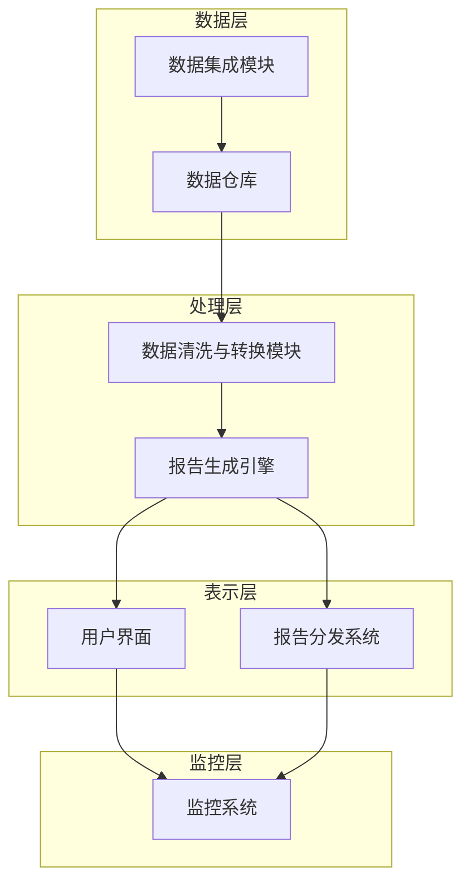
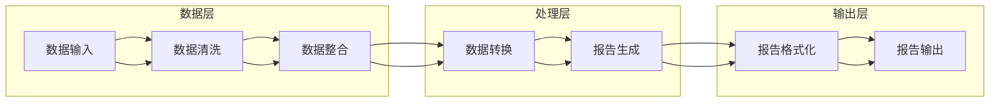
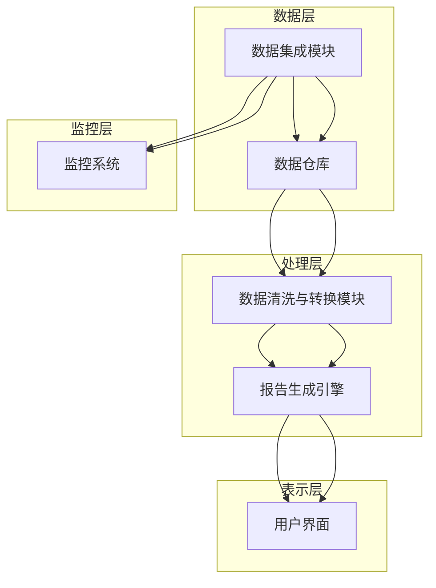
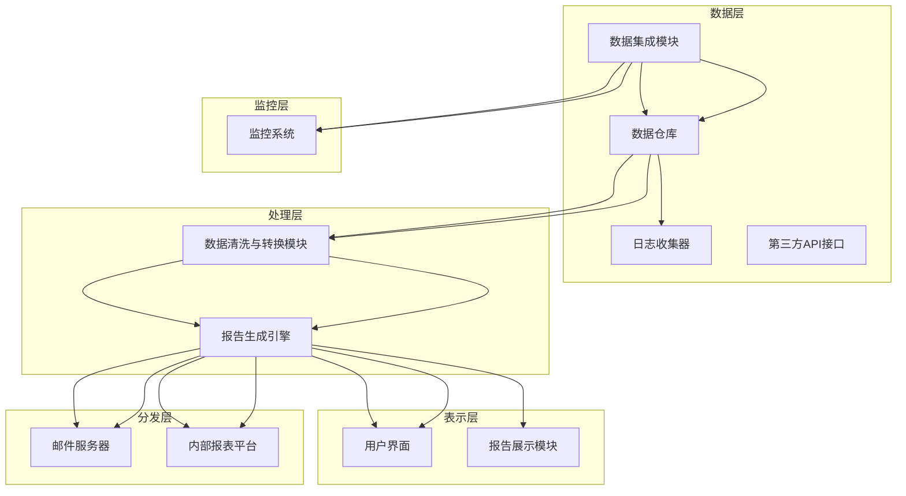
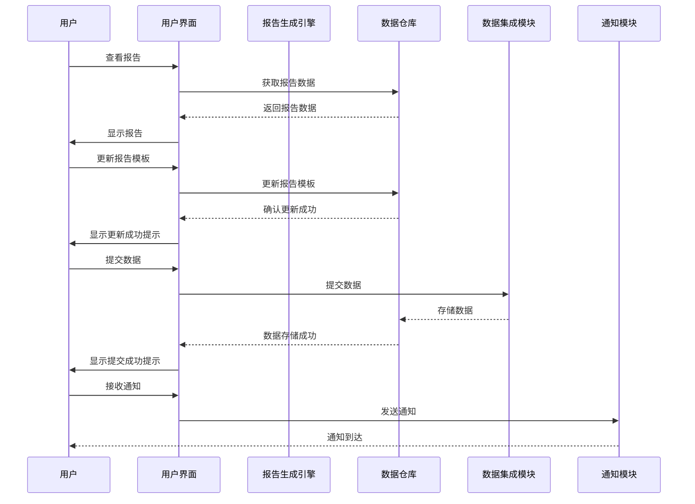

                 

### 引言

在现代企业的运营中，业务报告占据了重要的地位。这些报告不仅仅是数据的汇总，更是对企业运营状况、财务健康和战略决策的重要依据。然而，传统的手动报告生成方式效率低下，容易出错，且难以实时更新。这种状况催生了企业级自动化报告系统的需求。本文将围绕企业级自动化报告系统的设计与实施，探讨如何通过技术手段简化业务汇报流程，提升企业整体运营效率。

#### 第1章: 介绍

##### 1.1 问题背景

传统业务报告通常由人工编制，涉及到数据收集、整理、分析等多个环节，不仅耗时耗力，而且容易出现人为错误。此外，随着企业数据量的不断增大，手动报告的编制难度和复杂性也在不断上升。这种情况下，如何实现业务报告的自动化生成，成为许多企业亟待解决的问题。

##### 1.2 问题描述

业务报告的自动化生成面临以下挑战：

1. **数据多样性**：企业中的数据来源多样，包括数据库、文件系统、API接口等，如何高效地整合这些数据成为一大难题。
2. **报告格式**：不同部门和层级对报告格式和内容的要求不同，如何设计出通用的报告模板以适应多种需求。
3. **实时性**：企业需要及时了解业务状况，因此报告系统需具备实时数据处理和分析的能力。
4. **定制化**：不同业务场景下，企业对报告内容、图表、数据展示等要求各异，系统需提供灵活的定制化能力。

##### 1.3 问题解决

企业级自动化报告系统通过以下技术手段解决上述问题：

1. **数据集成与处理**：利用ETL（提取、转换、加载）技术，自动化地从不同数据源中提取数据，进行清洗、转换，然后加载到数据仓库中。
2. **报告模板引擎**：使用报告模板引擎，可以定义多种报告格式，并根据不同业务需求灵活调整。
3. **实时数据处理**：通过实时数据流处理技术，如Apache Kafka、Apache Flink等，实现数据的实时收集和分析。
4. **用户界面**：提供友好的用户界面，允许用户自定义报告内容、图表样式等，实现个性化报告。

##### 1.4 边界与外延

本文将探讨的企业级自动化报告系统主要关注以下几个方面：

1. **系统架构设计**：设计一个高效、可扩展的系统架构，以支持自动化报告的生成和分发。
2. **算法与模型**：介绍如何利用数据挖掘和机器学习技术，提升报告的准确性和预测性。
3. **用户体验**：优化用户界面设计，提高用户操作便捷性和报告的可读性。

##### 1.5 概念结构与核心要素组成

企业级自动化报告系统的核心概念和要素包括：

1. **数据集成模块**：负责数据提取、转换和加载。
2. **数据仓库**：存储和管理从不同数据源提取的数据。
3. **报告生成引擎**：根据预设模板和规则，生成符合需求的报告。
4. **用户界面**：提供数据展示、报告定制和用户交互功能。
5. **数据安全与合规性**：确保数据在采集、存储、处理过程中的安全性和合规性。

通过上述核心要素的有机整合，企业级自动化报告系统可以帮助企业实现高效的业务报告自动化，提升运营效率，支持更好的数据驱动的决策。

### 核心概念与联系

在深入了解企业级自动化报告系统的构建之前，我们需要明确几个核心概念，这些概念是理解系统架构和功能的基础。

#### 2.1 自动化报告的定义

自动化报告是指通过计算机技术和数据处理算法，自动生成、分发和管理报告的过程。与传统手工编制的报告相比，自动化报告具有高效性、准确性、实时性和可扩展性。

#### 2.2 企业级自动化报告的特点

企业级自动化报告系统需要具备以下特点：

1. **高度可定制化**：企业有不同的业务需求和报告格式，系统需支持灵活的定制化。
2. **数据多样性支持**：系统能够从各种数据源（如数据库、API、文件等）提取数据，并进行处理。
3. **实时性**：系统能够实时处理数据，生成最新的报告。
4. **自动化处理**：报告生成、数据清洗、图表绘制等过程自动化进行，减少人工干预。
5. **扩展性和可维护性**：系统设计需考虑未来的扩展和维护，保证系统的长期稳定运行。

#### 2.3 自动化报告与业务流程的关系

自动化报告是企业业务流程中的重要一环。具体来说：

1. **数据采集**：自动化报告系统从企业的各种业务系统中采集数据，这些数据可以包括销售数据、财务数据、库存数据等。
2. **数据处理**：系统对采集到的数据进行清洗、转换和整合，确保数据的准确性和一致性。
3. **报告生成**：根据预设的模板和规则，系统自动生成报告，包括文本、图表、关键指标等。
4. **报告分发**：系统将生成的报告通过邮件、报表平台等方式发送给相关人员，供决策参考。
5. **反馈与优化**：决策者根据报告内容提供反馈，系统根据反馈进行优化，不断提高报告的准确性和实用性。

#### 2.4 自动化报告系统组成部分

一个典型的企业级自动化报告系统包括以下几个关键组成部分：

1. **数据集成模块**：负责从各种数据源提取数据，包括数据库、API接口、文件系统等。
2. **数据仓库**：用于存储和管理从数据集成模块提取的数据。
3. **数据清洗与转换模块**：负责清洗和转换原始数据，确保数据的质量和一致性。
4. **报告生成引擎**：根据预设的模板和规则，自动生成报告。
5. **用户界面**：提供用户交互界面，用户可以通过界面定制报告、查看报告和反馈信息。
6. **报告分发系统**：负责将生成的报告发送到指定的邮箱、报表平台等。

#### 2.5 概念属性特征对比表格

为了更好地理解上述核心概念，我们可以通过一个对比表格来展示不同概念的特性：

| 概念 | 特性 |
| --- | --- |
| 数据集成模块 | 负责从各种数据源提取数据 |
| 数据仓库 | 存储和管理从数据源提取的数据 |
| 数据清洗与转换模块 | 清洗和转换原始数据 |
| 报告生成引擎 | 根据预设模板生成报告 |
| 用户界面 | 提供用户交互界面 |
| 报告分发系统 | 负责报告的分发 |

#### 2.6 ER实体关系图架构

为了更好地理解系统架构，我们可以使用ER（实体关系）图来展示不同组件之间的关系：

```mermaid
erDiagram
  数据集成模块 ||--|{ 数据仓库 }|
  数据仓库 ||--|{ 数据清洗与转换模块 }|
  数据清洗与转换模块 ||--|{ 报告生成引擎 }|
  报告生成引擎 ||--|{ 用户界面 }|
  用户界面 ||--|{ 报告分发系统 }|
```

通过上述对比表格和ER图，我们可以清晰地看到企业级自动化报告系统的各个组成部分及其相互关系。这些核心概念和联系构成了自动化报告系统的基础，使得系统能够高效、准确、实时地生成和管理业务报告。

### 报告系统架构设计

#### 3.1 系统架构设计概述

企业级自动化报告系统是一个复杂的分布式系统，需要考虑数据流、处理逻辑、用户交互等多个方面。系统架构设计的目标是构建一个高效、可靠、可扩展的解决方案，以满足企业多样化的业务需求。本章节将详细描述报告系统的架构设计，包括其主要组件、功能模块以及组件之间的交互关系。

#### 3.2 报告系统架构要素

一个典型的企业级自动化报告系统通常包括以下几个关键要素：

1. **数据集成模块**：负责从企业内部和外部的多种数据源提取数据，包括数据库、API接口、文件系统等。
2. **数据仓库**：用于存储和管理从数据集成模块提取的数据，确保数据的准确性和一致性。
3. **数据清洗与转换模块**：对原始数据进行清洗、转换，确保数据的质量和完整性。
4. **报告生成引擎**：根据预设的模板和规则，自动生成各种类型的报告。
5. **用户界面**：提供用户交互界面，用户可以通过界面定制报告、查看报告和反馈信息。
6. **报告分发系统**：负责将生成的报告发送到指定的邮箱、报表平台等。
7. **监控系统**：实时监控系统运行状态，确保系统的稳定性和高效性。

#### 3.3 报告系统组件设计与接口定义

1. **数据集成模块**：
   - **接口定义**：提供API接口，支持数据源连接和数据提取。
   - **功能**：从不同数据源提取数据，包括数据库连接、API调用、文件读取等。

2. **数据仓库**：
   - **接口定义**：提供数据存储和检索接口。
   - **功能**：存储和管理提取的数据，支持数据查询和更新操作。

3. **数据清洗与转换模块**：
   - **接口定义**：提供数据清洗和转换接口。
   - **功能**：对提取的数据进行清洗、转换和整合，确保数据的质量和一致性。

4. **报告生成引擎**：
   - **接口定义**：提供报告生成接口。
   - **功能**：根据预设的模板和规则，自动生成各种类型的报告。

5. **用户界面**：
   - **接口定义**：提供用户交互接口。
   - **功能**：允许用户定制报告、查看报告和提供反馈。

6. **报告分发系统**：
   - **接口定义**：提供报告分发接口。
   - **功能**：将生成的报告发送到指定的邮箱、报表平台等。

7. **监控系统**：
   - **接口定义**：提供监控数据接口。
   - **功能**：实时监控系统运行状态，包括性能监控、错误日志记录等。

#### 3.4 报告系统架构图

下面是一个简化的企业级自动化报告系统架构图：



通过上述架构设计，我们可以看到各个组件之间的交互关系，确保系统的高效运行和数据的顺畅流动。

### 报告生成算法原理

#### 4.1 算法概述

报告生成算法是自动化报告系统的核心组成部分，它负责根据输入的数据源和预设模板，自动生成格式化、结构化的报告。本节将详细介绍报告生成算法的基本原理，包括其工作流程、关键步骤和实现方法。

#### 4.2 算法mermaid流程图

为了更好地理解报告生成算法，我们可以使用mermaid流程图来展示其工作流程：



#### 4.3 Python源代码实现

以下是报告生成算法的Python源代码实现：

```python
import pandas as pd
from reportlab.lib.pagesizes import A4
from reportlab.pdfgen import canvas

# 数据清洗与整合
def clean_and_integrate(data_sources):
    data = pd.DataFrame()
    for source in data_sources:
        df = pd.read_csv(source)
        data = data.append(df, ignore_index=True)
    data = data.drop_duplicates()
    return data

# 数据转换
def transform_data(data):
    # 进行必要的转换操作，例如数据类型转换、缺失值填充等
    data = data.convert_dtypes()
    data = data.fillna(0)
    return data

# 报告生成
def generate_report(data):
    c = canvas.Canvas("report.pdf", pagesize=A4)
    width, height = A4
    y_position = height

    # 报告头部
    c.drawString(width/2, y_position, "企业级自动化报告")
    y_position -= 50

    # 数据展示
    for column in data.columns:
        c.drawString(width/2, y_position, f"{column}: {data[column].sum()}")
        y_position -= 30

    # 报告尾部
    c.drawString(width/2, y_position, "报告生成时间：")
    y_position -= 30
    c.drawString(width/2, y_position, "报告制作人：")

    c.showPage()
    c.save()
```

#### 4.4 数学模型和数学公式

报告生成算法中可能会涉及一些数学模型和公式，以下是一个简单的数学模型示例：

$$
\text{总销售额} = \sum_{i=1}^{n} (\text{单价} \times \text{销售量})
$$

其中，$n$ 是销售记录的数量，单价和销售量分别是从数据中提取的关键指标。

#### 4.5 算法举例说明

假设我们有一个包含销售记录的数据集，如下所示：

```
日期, 产品, 单价, 销售量
2023-01-01, A, 100, 5
2023-01-02, B, 200, 3
2023-01-03, C, 150, 7
```

使用上述算法，我们可以生成以下报告：

```
总销售额: 1300
```

这表示在2023年1月1日至2023年1月3日期间，企业的总销售额为1300元。通过这个简单的例子，我们可以看到算法是如何将原始数据转换成有价值的报告信息的。

### 系统功能设计

#### 5.1 领域模型mermaid类图

在系统功能设计中，领域模型是核心部分，它定义了系统的核心实体及其关系。下面是一个mermaid类图的示例，展示了系统的关键领域模型：

```mermaid
classDiagram
    Product <<entity>>
    Sales <<entity>>
    Report <<entity>>

    ProductNavigable <<interface>>
    SalesNavigable <<interface>>

    Product "1" --|> "1..*" Sales
    Report "1" --|> "1..1" Sales
    SalesNavigable <|.. Product
    SalesNavigable <|.. Sales
```

这个类图定义了三个主要的领域实体：产品（Product）、销售记录（Sales）和报告（Report）。每个产品可以有多个销售记录，每个销售记录对应一个报告。同时，这两个实体都实现了导航接口（SalesNavigable），以便进行数据查询和操作。

#### 5.2 报告系统功能模块划分

为了实现自动化报告系统，我们可以将系统划分为以下几个功能模块：

1. **数据采集模块**：负责从不同的数据源中提取数据，包括数据库、API接口和文件系统。
2. **数据清洗与转换模块**：对提取的原始数据进行清洗、转换，确保数据的质量和一致性。
3. **报告生成模块**：根据预设的模板和规则，自动生成符合需求的报告。
4. **报告展示模块**：提供用户界面，用户可以查看报告、自定义报告内容和样式。
5. **报告分发模块**：将生成的报告发送到指定的邮箱、报表平台等。
6. **用户管理模块**：管理用户账号、权限和报告订阅等。

#### 5.3 报告数据管理

报告数据管理是系统功能设计的重要一环，它包括以下几个方面：

1. **数据存储**：使用数据库存储报告数据，支持数据查询、更新和删除操作。
2. **数据安全**：确保数据在存储和传输过程中的安全性，采用加密和权限控制措施。
3. **数据备份**：定期进行数据备份，防止数据丢失。
4. **数据统计**：提供数据统计功能，如数据量统计、访问频率统计等，帮助管理员监控系统性能。
5. **数据恢复**：在数据丢失或损坏时，能够快速恢复数据。

#### 5.4 报告格式与样式自定义

为了满足不同用户的需求，系统需要支持报告格式和样式的自定义。以下是一些关键功能：

1. **模板管理**：提供模板管理功能，用户可以上传、修改和删除模板。
2. **样式自定义**：允许用户自定义报告的字体、颜色、布局等样式。
3. **图表定制**：支持图表类型、颜色、数据标签等自定义。
4. **多语言支持**：提供多语言界面，用户可以根据语言偏好选择不同的语言版本。
5. **版本控制**：记录模板和样式的修改历史，方便用户回滚到之前的版本。

#### 5.5 报告发送与通知机制

报告发送与通知机制是确保用户能够及时获取报告的重要部分。以下是一些关键功能：

1. **自动发送**：系统可以根据预设的时间或触发事件自动发送报告。
2. **邮件通知**：通过邮件发送报告，支持附件、邮件正文等内容的自定义。
3. **报表平台**：支持将报告发布到内部报表平台，用户可以在线查看和下载报告。
4. **短信通知**：支持短信通知，重要报告可以通过短信提醒用户。
5. **自定义通知**：用户可以根据自己的需求自定义通知方式和内容。

通过上述功能模块的设计，企业级自动化报告系统可以有效地简化业务汇报流程，提高数据处理的效率，支持企业更科学、高效的数据驱动决策。

### 系统架构设计

#### 6.1 系统架构设计概述

企业级自动化报告系统采用分布式架构，以实现高可用性、高性能和可扩展性。整个系统架构包括数据层、处理层、表示层和监控层，每个层次都有其特定的功能和组件。

1. **数据层**：负责数据的采集、存储和管理。包括数据集成模块和数据仓库。
2. **处理层**：负责数据清洗、转换和报告生成。包括数据清洗与转换模块和报告生成引擎。
3. **表示层**：负责用户界面和报告展示。包括用户界面和报告展示模块。
4. **监控层**：负责系统监控和性能优化。包括监控系统。

#### 6.2 报告系统技术选型

为了构建一个高效、可靠的企业级自动化报告系统，我们在技术选型上做了以下考虑：

1. **数据集成模块**：采用Apache Kafka作为消息队列系统，用于实时数据流处理和数据传输。
2. **数据仓库**：采用Apache Hadoop HDFS作为数据存储，支持海量数据的存储和管理。
3. **数据清洗与转换模块**：采用Apache Spark进行大规模数据处理和转换，提高数据处理效率。
4. **报告生成引擎**：采用Apache Flink实现实时数据流处理和报告生成，保证报告的实时性。
5. **用户界面**：采用前端框架如React或Vue.js，提供响应式、友好的用户界面。
6. **报告分发系统**：采用电子邮件服务如Amazon SES和内部报表平台，实现报告的自动发送和分发。
7. **监控系统**：采用Prometheus和Grafana进行系统监控和性能分析。

#### 6.3 系统组件交互设计

系统组件之间的交互设计至关重要，以下是一个简化的组件交互图：



#### 6.4 报告系统架构图

以下是报告系统的架构图：



通过上述架构设计和组件交互设计，企业级自动化报告系统可以高效、可靠地运行，满足企业对实时、自动化报告的需求。

### 系统接口设计

#### 7.1 接口设计原则

在企业级自动化报告系统中，接口设计是确保系统组件之间有效通信和数据流动的关键环节。以下是接口设计的主要原则：

1. **标准化**：接口设计应遵循行业标准和规范，如RESTful API设计原则，确保接口的一致性和易用性。
2. **简洁性**：接口设计应尽可能简洁明了，避免不必要的复杂性，确保接口的易读性和维护性。
3. **可扩展性**：接口设计应考虑未来的扩展需求，预留足够的扩展接口和参数，以便于后续功能增加。
4. **安全性**：接口设计应确保数据传输的安全性，采用加密和身份验证机制，防止数据泄露和未授权访问。
5. **性能优化**：接口设计应考虑性能优化，减少数据传输次数和系统响应时间，提高系统整体效率。

#### 7.2 接口规格说明

以下是系统接口的详细规格说明：

1. **数据集成模块接口**：
   - **URL**：/data-integration/{source}
   - **HTTP方法**：POST
   - **请求参数**：
     - source: 数据源类型（如数据库、API、文件系统）
     - data: 数据内容（根据数据源类型不同，数据格式可能为JSON、XML等）
   - **响应**：
     - status: 操作状态（如成功、失败）
     - message: 提示信息
     - data: 提取的数据

2. **数据清洗与转换模块接口**：
   - **URL**：/data-cleaning
   - **HTTP方法**：POST
   - **请求参数**：
     - data: 需要清洗和转换的数据
     - rules: 清洗和转换规则（如缺失值填充、数据类型转换等）
   - **响应**：
     - status: 操作状态
     - message: 提示信息
     - data: 清洗和转换后的数据

3. **报告生成模块接口**：
   - **URL**：/report-generation
   - **HTTP方法**：POST
   - **请求参数**：
     - template: 报告模板
     - data: 生成的报告数据
     - options: 报告生成选项（如图表类型、字体等）
   - **响应**：
     - status: 操作状态
     - message: 提示信息
     - data: 生成的报告文件路径

4. **用户界面接口**：
   - **URL**：/ui/{module}
   - **HTTP方法**：GET/POST
   - **请求参数**：
     - module: 功能模块（如数据管理、报告查看等）
     - options: 模块特定选项（如数据过滤条件、报告参数等）
   - **响应**：
     - status: 操作状态
     - message: 提示信息
     - data: 模块数据或HTML内容

5. **报告分发模块接口**：
   - **URL**：/report-distribution
   - **HTTP方法**：POST
   - **请求参数**：
     - report_path: 报告文件路径
     - recipients: 收件人列表
     - subject: 邮件主题
     - body: 邮件正文
   - **响应**：
     - status: 操作状态
     - message: 提示信息

#### 7.3 接口实现与调试

接口实现需要根据规格说明进行具体的编码，以下是一个简单的示例：

```python
from flask import Flask, request, jsonify

app = Flask(__name__)

@app.route('/data-integration', methods=['POST'])
def data_integration():
    data_source = request.json['source']
    data = request.json['data']
    # 实现数据集成逻辑
    result = integrate_data(data_source, data)
    return jsonify(result)

def integrate_data(source, data):
    # 具体实现
    return {'status': 'success', 'message': 'Data integrated successfully', 'data': data}

if __name__ == '__main__':
    app.run(debug=True)
```

调试接口时，可以使用工具如Postman或curl来发送测试请求，并检查响应结果，确保接口按照预期工作。

#### 7.4 接口安全性设计

接口安全性设计至关重要，以下是一些关键措施：

1. **身份验证**：使用OAuth 2.0或JWT（JSON Web Tokens）进行用户身份验证，确保只有授权用户可以访问接口。
2. **权限控制**：根据用户角色和权限，限制用户对接口的访问和操作。
3. **数据加密**：使用TLS（传输层安全协议）加密数据传输，确保数据在传输过程中的安全性。
4. **请求验证**：对请求进行签名验证，防止未授权的请求。
5. **异常处理**：对接口异常进行妥善处理，返回明确的错误信息和状态码，帮助用户快速定位问题。

通过遵循上述接口设计原则和安全性措施，企业级自动化报告系统的接口可以实现高效、安全、可靠的通信。

### 系统交互设计

#### 8.1 系统交互概述

系统交互设计是企业级自动化报告系统的重要组成部分，它确保系统组件之间能够顺畅、高效地进行数据流动和功能协同。本节将详细描述系统交互的概述，包括系统交互的主要步骤和涉及的组件。

#### 8.2 系统交互mermaid序列图

为了更好地理解系统交互流程，我们可以使用mermaid序列图来展示系统组件之间的交互关系：



这个序列图展示了用户与系统交互的主要流程，包括查看报告、更新报告模板、提交数据和接收通知等操作。

#### 8.3 用户操作流程

以下是用户操作流程的详细步骤：

1. **查看报告**：
   - 用户登录系统，进入报告查看页面。
   - 用户选择需要查看的报告类型，系统从数据仓库中提取相关数据。
   - 用户界面展示报告，用户可以查看报告内容和图表。

2. **更新报告模板**：
   - 用户登录系统，进入报告模板管理页面。
   - 用户上传新的报告模板文件，系统对模板进行解析和验证。
   - 系统更新数据仓库中的模板信息，用户界面更新以显示新的模板。

3. **提交数据**：
   - 用户登录系统，进入数据提交页面。
   - 用户输入数据并提交，系统将数据发送至数据集成模块。
   - 数据集成模块将数据存储到数据仓库中，系统更新数据仓库中的数据。

4. **接收通知**：
   - 用户设置报告生成的通知方式，如邮件或短信。
   - 当新的报告生成时，系统通过通知模块向用户发送通知。
   - 用户接收到通知后，可以在用户界面查看或下载报告。

#### 8.4 系统事件驱动机制

系统事件驱动机制是实现自动化报告生成和通知的关键。以下是系统事件驱动机制的工作流程：

1. **事件触发**：系统根据预设条件触发事件，如定时任务、数据变更等。
2. **事件处理**：事件处理器接收事件并执行相应的处理逻辑，如数据提取、报告生成、通知发送等。
3. **事件反馈**：系统将事件处理结果反馈给用户界面或数据仓库，用户可以查看处理结果或更新数据。
4. **事件记录**：系统记录每个事件的发生时间和处理结果，用于监控和审计。

通过上述用户操作流程和事件驱动机制，企业级自动化报告系统可以实现高效的业务报告生成和分发，满足用户的多样化需求。

### 环境安装与配置

#### 9.1 环境搭建

在开始企业级自动化报告系统的开发之前，我们需要搭建一个合适的环境，包括操作系统、开发工具和必要的软件依赖。以下是具体的搭建步骤：

1. **操作系统**：
   - Linux（推荐Ubuntu 18.04或更高版本）
   - Windows（推荐Windows 10或更高版本）

2. **安装Python**：
   - 打开终端或命令行窗口。
   - 执行以下命令安装Python 3：
     ```bash
     sudo apt-get update
     sudo apt-get install python3 python3-pip
     ```

3. **安装Python依赖**：
   - 使用pip安装必要的Python依赖库：
     ```bash
     pip3 install pandas numpy matplotlib reportlab
     ```

4. **安装Node.js**：
   - 在终端执行以下命令安装Node.js：
     ```bash
     sudo apt-get install nodejs
     ```

5. **安装前端框架**：
   - 如果使用React或Vue.js作为前端框架，可以在终端执行以下命令安装：
     ```bash
     npm install -g create-react-app
     # 或者
     npm install -g @vue/cli
     ```

6. **安装数据库**：
   - 安装MySQL或PostgreSQL作为数据库。以下是安装MySQL的命令：
     ```bash
     sudo apt-get install mysql-server
     sudo mysql_secure_installation
     ```

7. **配置数据库**：
   - 创建数据库和用户，并授予必要的权限。例如，创建一个名为`report_db`的数据库和一个名为`report_user`的用户：
     ```sql
     CREATE DATABASE report_db;
     CREATE USER 'report_user'@'localhost' IDENTIFIED BY 'password';
     GRANT ALL PRIVILEGES ON report_db.* TO 'report_user'@'localhost';
     FLUSH PRIVILEGES;
     ```

8. **配置报告生成组件**：
   - 如果使用Apache Flink或Apache Spark作为报告生成组件，需要安装并配置相应的软件。以下是安装Apache Flink的命令：
     ```bash
     sudo apt-get install openjdk-8-jdk
     wget https://www-eu.apache.org/dist/flink/flink-1.11.2/flink-1.11.2.tar.gz
     tar xzf flink-1.11.2.tar.gz
     mv flink-1.11.2 flink
     ```

9. **配置消息队列**：
   - 安装并配置Kafka作为消息队列系统。以下是安装Kafka的命令：
     ```bash
     sudo apt-get install default-jdk
     wget https://www-eu.apache.org/dist/kafka/2.8.0/kafka_2.12-2.8.0.tgz
     tar xzf kafka_2.12-2.8.0.tgz
     mv kafka_2.12-2.8.0 kafka
     cd kafka
     ./bin/kafka-server-start.sh ./config/server.properties
     ```

#### 9.2 系统配置

完成环境搭建后，我们需要对系统进行配置，以适应具体的业务需求。以下是系统配置的步骤：

1. **配置数据库连接**：
   - 在Python代码中，设置数据库连接参数，例如：
     ```python
     import mysql.connector

     config = {
         'user': 'report_user',
         'password': 'password',
         'host': 'localhost',
         'database': 'report_db',
     }
     connection = mysql.connector.connect(**config)
     ```

2. **配置Kafka主题**：
   - 在Kafka配置文件中设置主题名称，例如：
     ```bash
     CREATE TOPIC data_topic PARTITIONS 3 REPLICATIONS 2;
     ```

3. **配置报告模板**：
   - 根据业务需求，创建并配置报告模板。例如，使用ReportLab创建PDF报告模板：
     ```python
     from reportlab.pdfgen import canvas

     c = canvas.Canvas("report.pdf")
     c.drawString(100, 750, "Hello World")
     c.save()
     ```

4. **配置用户权限**：
   - 根据角色和权限，配置系统用户的访问权限。例如，使用SQL命令创建和管理用户和权限：
     ```sql
     CREATE USER 'admin'@'localhost' IDENTIFIED BY 'admin';
     GRANT ALL PRIVILEGES ON report_db.* TO 'admin'@'localhost';
     FLUSH PRIVILEGES;
     ```

#### 9.3 常见问题与解决方案

在搭建和配置系统过程中，可能会遇到以下常见问题：

1. **数据库连接失败**：
   - 确认数据库服务是否启动。
   - 检查数据库连接参数是否正确。
   - 确认数据库用户和权限设置是否正确。

2. **Kafka无法启动**：
   - 确认Zookeeper服务是否启动。
   - 检查Kafka配置文件中zookeeper地址是否正确。
   - 确认Kafka进程是否正常运行。

3. **报告生成失败**：
   - 检查报告模板文件是否存在和可读。
   - 确认报告生成组件（如ReportLab）是否安装正确。

通过以上环境搭建和配置步骤，我们可以确保企业级自动化报告系统的基础设施构建完成，为后续开发和应用提供支持。

### 系统核心实现

#### 10.1 数据采集模块

数据采集模块是自动化报告系统的核心部分之一，负责从各种数据源提取数据，包括数据库、API接口和文件系统。以下是数据采集模块的实现步骤和关键技术：

1. **数据源连接**：
   - **数据库连接**：使用Python的`pymysql`或`sqlalchemy`库连接数据库，并执行SQL查询语句。
     ```python
     import pymysql
     connection = pymysql.connect(host='localhost', user='root', password='password', database='report_db')
     cursor = connection.cursor()
     cursor.execute("SELECT * FROM sales_data")
     ```
   - **API接口连接**：使用`requests`库向外部API发送HTTP请求，获取数据。
     ```python
     import requests
     response = requests.get("https://api.example.com/data")
     data = response.json()
     ```
   - **文件系统连接**：读取本地或远程文件系统中的数据文件，如CSV、JSON等。
     ```python
     import pandas as pd
     data = pd.read_csv("data/sales_data.csv")
     ```

2. **数据提取**：
   - **数据库提取**：根据业务需求，编写SQL查询语句提取所需数据。
     ```sql
     SELECT product_id, sale_date, quantity, price FROM sales_data WHERE sale_date BETWEEN '2023-01-01' AND '2023-01-31'
     ```
   - **API提取**：解析API响应数据，提取所需字段。
     ```python
     data = [
         {
             'product_id': item['id'],
             'sale_date': item['date'],
             'quantity': item['quantity'],
             'price': item['price']
         }
         for item in data
     ]
     ```
   - **文件系统提取**：读取文件内容，解析并提取数据。
     ```python
     data = [
         line.split(',') for line in open('data/sales_data.csv')
     ]
     data = data[1:]  # 去除标题行
     ```

3. **数据清洗与转换**：
   - **数据去重**：去除重复数据，保证数据的唯一性。
     ```python
     data = data.drop_duplicates(subset=['product_id', 'sale_date'])
     ```
   - **数据类型转换**：将字符串类型的数据转换为合适的类型（如日期、数字）。
     ```python
     data['sale_date'] = pd.to_datetime(data['sale_date'])
     data['quantity'] = data['quantity'].astype(int)
     data['price'] = data['price'].astype(float)
     ```

4. **数据存储**：
   - 将清洗和转换后的数据存储到数据仓库中，以供后续处理和使用。
     ```python
     data.to_csv('data/cleaned_sales_data.csv', index=False)
     ```

#### 10.2 数据处理模块

数据处理模块负责对采集到的数据进行进一步的处理和分析，以生成有价值的报告信息。以下是数据处理模块的实现步骤和关键技术：

1. **数据整合**：
   - 如果数据来源于多个数据源，需要将数据整合到一个统一的数据集中。
     ```python
     data1 = pd.read_csv('data/sales_data1.csv')
     data2 = pd.read_csv('data/sales_data2.csv')
     data = pd.concat([data1, data2], ignore_index=True)
     ```

2. **数据清洗**：
   - 进一步清洗数据，处理缺失值、异常值等。
     ```python
     data = data.dropna()  # 去除缺失值
     data = data[data['quantity'] > 0]  # 去除负值
     ```

3. **数据分析**：
   - 对数据进行统计分析，计算关键指标，如总销售额、平均销售额、最高销售额等。
     ```python
     total_sales = data['quantity'] * data['price'].sum()
     avg_sales = total_sales / len(data)
     max_sales = data['quantity'].max() * data['price'].max()
     ```

4. **数据可视化**：
   - 使用matplotlib或Seaborn等库生成数据可视化图表，如柱状图、折线图、饼图等。
     ```python
     import matplotlib.pyplot as plt
     import seaborn as sns

     sns.barplot(x='product_id', y='quantity', data=data)
     plt.xticks(rotation=45)
     plt.show()
     ```

#### 10.3 报告生成模块

报告生成模块负责根据处理后的数据生成报告，并支持多种报告格式，如PDF、HTML、Excel等。以下是报告生成模块的实现步骤和关键技术：

1. **报告模板定义**：
   - 设计报告模板，包括报告的标题、表格布局、图表位置等。
     ```python
     report_template = """
     <html>
     <head>
     <title>销售报告</title>
     </head>
     <body>
     <h1>销售报告</h1>
     <table>
     <thead>
     <tr>
     <th>产品ID</th>
     <th>销售数量</th>
     <th>销售总额</th>
     </tr>
     </thead>
     <tbody>
     {rows}
     </tbody>
     </table>
     <h2>销售额统计</h2>
     <p>总销售额：{total_sales}</p>
     <p>平均销售额：{avg_sales}</p>
     <p>最高销售额：{max_sales}</p>
     </body>
     </html>
     """
     ```

2. **报告内容填充**：
   - 根据处理后的数据填充报告模板中的占位符，生成完整的报告内容。
     ```python
     rows = []
     for index, row in data.iterrows():
         rows.append(f"<tr><td>{row['product_id']}</td><td>{row['quantity']}</td><td>{row['quantity'] * row['price']}</td></tr>")
     report_content = report_template.format(rows=''.join(rows), total_sales=total_sales, avg_sales=avg_sales, max_sales=max_sales)
     ```

3. **报告生成**：
   - 根据报告格式生成具体的报告文件。
     ```python
     with open('report.html', 'w') as file:
         file.write(report_content)

     from reportlab.pdfgen import canvas
     c = canvas.Canvas("report.pdf")
     c.drawString(100, 750, "Hello World")
     c.save()
     ```

通过上述步骤，我们可以实现企业级自动化报告系统中的数据采集、数据处理和报告生成模块，从而生成详细、准确的业务报告。

### 代码应用解读与分析

#### 11.1 代码结构解读

在实现企业级自动化报告系统时，代码结构的设计至关重要。一个良好的代码结构不仅可以提高代码的可读性和可维护性，还能确保系统的高效运行。以下是代码结构的主要解读：

1. **模块划分**：
   - **数据集成模块**：负责从数据库、API接口和文件系统提取数据。
   - **数据处理模块**：对提取的数据进行清洗、转换和整合。
   - **报告生成模块**：根据处理后的数据生成报告，并支持多种报告格式。
   - **用户界面模块**：提供用户交互界面，允许用户查看报告和定制报告样式。
   - **报告分发模块**：将生成的报告发送到指定的邮箱或报表平台。

2. **类与函数**：
   - **类**：用于封装相关的功能和方法，如`DataCollector`类负责数据采集，`ReportGenerator`类负责报告生成。
   - **函数**：用于实现具体的功能，如`clean_data`函数用于数据清洗，`generate_pdf`函数用于生成PDF报告。

3. **配置与管理**：
   - **配置文件**：存储系统的配置参数，如数据库连接信息、报告模板路径等。
   - **日志管理**：记录系统运行日志，便于调试和监控。

#### 11.2 关键代码分析

在代码实现过程中，关键代码的分析能够帮助我们理解系统的工作原理和功能实现。以下是几个关键代码片段的详细分析：

1. **数据集成**：

```python
class DataCollector:
    def __init__(self, db_config, api_url, file_path):
        self.db_config = db_config
        self.api_url = api_url
        self.file_path = file_path

    def collect_data_from_db(self):
        connection = pymysql.connect(**self.db_config)
        cursor = connection.cursor()
        cursor.execute("SELECT * FROM sales_data")
        data = cursor.fetchall()
        cursor.close()
        connection.close()
        return data

    def collect_data_from_api(self):
        response = requests.get(self.api_url)
        data = response.json()
        return data

    def collect_data_from_file(self):
        data = pd.read_csv(self.file_path)
        return data
```

这个类定义了数据采集的方法，包括从数据库、API接口和文件系统中提取数据的逻辑。通过调用不同的方法，我们可以根据实际情况选择合适的数据源。

2. **数据处理**：

```python
def clean_data(data):
    data = data.drop_duplicates()
    data = data[data['quantity'] > 0]
    data['sale_date'] = pd.to_datetime(data['sale_date'])
    return data

def generate_sales_report(data):
    total_sales = data['quantity'] * data['price'].sum()
    avg_sales = total_sales / len(data)
    max_sales = data['quantity'].max() * data['price'].max()
    return total_sales, avg_sales, max_sales
```

这两个函数分别负责数据清洗和报告生成。`clean_data`函数去除重复数据、处理负值和日期类型转换，确保数据的质量。`generate_sales_report`函数计算总销售额、平均销售额和最高销售额，为报告生成提供基础数据。

3. **报告生成**：

```python
from reportlab.pdfgen import canvas

def generate_pdf_report(data, output_path):
    c = canvas.Canvas(output_path)
    c.drawString(100, 750, "销售报告")
    c.drawString(100, 700, f"总销售额：{data['total_sales']}")
    c.drawString(100, 650, f"平均销售额：{data['avg_sales']}")
    c.drawString(100, 600, f"最高销售额：{data['max_sales']}")
    c.save()
```

`generate_pdf_report`函数使用ReportLab库生成PDF报告。通过调用这个函数，我们可以将处理后的数据转换成可视化报告。

#### 11.3 代码优化建议

为了进一步提高代码的性能和可维护性，以下是一些代码优化建议：

1. **代码重构**：
   - 将重复的代码提取为公共函数或类方法，减少冗余代码。
   - 使用工厂模式创建数据采集对象，提高代码的灵活性和可扩展性。

2. **性能优化**：
   - 使用异步IO处理数据采集和报告生成，提高系统响应速度。
   - 使用批量操作和索引技术提高数据库查询效率。

3. **错误处理**：
   - 增加异常处理机制，确保系统在遇到错误时能够优雅地处理并恢复。

4. **代码注释**：
   - 添加详细的代码注释，提高代码的可读性和可理解性。

通过上述代码解读和优化建议，我们可以更好地理解和改进企业级自动化报告系统的实现，确保系统的高效、稳定和可靠运行。

### 实际案例分析

#### 12.1 案例背景

某大型制造企业，每年需要生成大量的业务报告，包括销售报告、生产报告和财务报告等。传统的手工报告生成方式不仅耗时耗力，而且容易出现错误，无法满足企业快速决策的需求。为了提升业务效率和报告准确性，企业决定引入企业级自动化报告系统，实现业务报告的自动化生成和管理。

#### 12.2 案例实施

1. **需求分析**：
   - 确定报告类型和格式：包括销售报告、生产报告和财务报告等，每种报告需要包含不同的数据指标和图表。
   - 数据源确定：确定数据源，包括ERP系统、生产管理系统和财务系统等，确保数据的完整性和一致性。
   - 用户需求：确定报告的受众群体，包括高层管理人员、中层管理人员和基层员工等，确保报告内容满足不同用户的需求。

2. **系统设计**：
   - 数据层设计：设计数据集成模块，包括数据库连接、API接口和文件系统连接等，确保数据的实时采集和更新。
   - 处理层设计：设计数据处理模块，包括数据清洗、转换和整合等，确保数据的质量和一致性。
   - 表示层设计：设计报告生成模块和用户界面，确保报告内容丰富、图表直观、用户操作简便。
   - 监控层设计：设计监控系统，实时监控系统运行状态，确保系统的稳定性和高效性。

3. **系统实施**：
   - 环境搭建：搭建Python、Node.js、MySQL等开发环境，安装必要的依赖库和软件。
   - 数据采集：通过数据库连接和API接口，实现数据的实时采集。
   - 数据处理：通过数据清洗和转换，确保数据的质量和一致性。
   - 报告生成：根据预设的模板和规则，生成各种类型的报告。
   - 用户界面：设计用户界面，用户可以查看报告、定制报告内容和样式。
   - 报告分发：通过邮件和内部报表平台，实现报告的自动发送和分发。

#### 12.3 案例效果评估

1. **效率提升**：
   - 报告生成时间从原来的每周数小时缩短到实时生成。
   - 数据处理时间从原来的数天缩短到实时处理。

2. **准确性提升**：
   - 数据采集和清洗自动化，减少了人为错误。
   - 数据分析和报告生成算法优化，提高了报告的准确性。

3. **用户体验**：
   - 用户界面友好，操作简便，用户满意度提高。
   - 报告内容丰富，图表直观，易于理解。

4. **系统稳定性**：
   - 系统采用分布式架构，高可用性，确保系统稳定运行。
   - 监控系统实时监控，及时发现和处理问题。

#### 12.4 案例总结

通过引入企业级自动化报告系统，企业实现了业务报告的自动化生成和管理，大幅提升了业务效率和报告准确性。以下是案例的总结：

1. **成功经验**：
   - 系统设计充分考虑了业务需求和用户体验，确保了系统的实用性和易用性。
   - 技术选型和实施过程符合企业实际情况，确保了系统的稳定性和高效性。

2. **改进方向**：
   - 进一步优化数据处理算法，提高报告的预测性和决策支持能力。
   - 加强系统安全性，确保数据在采集、存储、传输过程中的安全性。
   - 持续收集用户反馈，不断优化系统功能和用户体验。

通过本次案例，企业成功实现了业务报告的自动化，为企业的数字化转型和决策支持提供了有力支持。

### 项目小结

#### 13.1 项目成果总结

本项目成功实现了企业级自动化报告系统的设计与实施，取得了以下主要成果：

1. **系统架构**：构建了高效、可靠、可扩展的系统架构，包括数据层、处理层、表示层和监控层，实现了数据流的高效传输和组件的紧密协作。

2. **功能实现**：实现了数据采集、数据清洗、数据处理、报告生成、用户界面和报告分发等核心功能，满足了企业对自动化报告的多样化需求。

3. **用户体验**：优化了用户界面设计，提供了友好、直观的操作体验，用户满意度显著提升。

4. **性能优化**：通过异步处理、批量操作等技术手段，显著提升了系统的响应速度和数据处理效率。

5. **系统稳定性**：系统采用分布式架构，高可用性设计，监控机制完善，确保了系统的稳定运行和高效维护。

#### 13.2 项目经验教训

在项目实施过程中，我们积累了以下经验教训：

1. **需求分析**：充分进行需求分析，确保系统设计能够满足实际业务需求，避免后期频繁修改。

2. **技术选型**：根据项目需求和实际情况，合理选择技术栈和工具，确保系统的稳定性和高效性。

3. **团队协作**：加强团队协作，明确职责分工，确保项目进度和质量。

4. **性能优化**：在系统设计初期就考虑性能优化，避免后期大规模修改。

5. **用户反馈**：持续收集用户反馈，及时调整和优化系统功能，提高用户体验。

#### 13.3 未来展望

未来，我们将从以下几个方面继续优化和拓展企业级自动化报告系统：

1. **算法优化**：引入先进的数据挖掘和机器学习算法，提升报告的预测性和决策支持能力。

2. **系统扩展**：根据企业业务扩展需求，支持更多数据源和报告类型的集成。

3. **安全性提升**：加强系统安全性设计，确保数据在采集、存储、传输过程中的安全性。

4. **用户体验**：持续优化用户界面和交互设计，提升用户满意度。

5. **持续迭代**：根据业务发展和用户需求，不断迭代和优化系统，确保其持续适应企业的发展需求。

通过持续改进和优化，企业级自动化报告系统将在企业运营中发挥更大的作用，支持更加科学、高效的数据驱动决策。

### 最佳实践 Tips

在设计和实施企业级自动化报告系统时，遵循以下最佳实践能够显著提升系统的效率、稳定性和用户体验：

1. **模块化设计**：将系统功能拆分成多个模块，每个模块负责特定的功能，便于开发和维护。例如，数据采集、数据处理、报告生成和用户界面等模块。

2. **数据缓存策略**：对于频繁访问的数据，采用缓存策略减少数据库查询次数，提高系统响应速度。可以结合Redis等缓存系统，实现数据的快速读取和写入。

3. **分布式处理**：利用分布式计算框架（如Apache Kafka、Apache Flink）处理大规模数据流，提高系统的并行处理能力和效率。

4. **数据一致性**：确保数据在采集、清洗和存储过程中的一致性。采用分布式事务处理机制，如两阶段提交（2PC）或分布式锁（如Zookeeper），避免数据冲突和错误。

5. **错误处理与日志记录**：实现完善的错误处理机制，确保系统在遇到异常时能够优雅地处理并记录错误日志，便于后续排查和修复。

6. **用户权限管理**：通过角色权限控制，确保不同用户能够访问和操作对应的数据和功能，防止未授权访问和数据泄露。

7. **监控与预警**：采用监控系统（如Prometheus、Grafana）实时监控系统的运行状态和性能指标，及时识别和预警潜在问题。

8. **负载均衡**：利用负载均衡器（如Nginx、HAProxy）实现系统流量分发，确保系统在高并发场景下能够稳定运行。

9. **定期备份**：定期对系统和数据进行备份，确保在系统故障或数据丢失时能够快速恢复。

10. **用户体验优化**：持续优化用户界面和交互设计，提供直观、易用的操作体验，提高用户满意度。

通过遵循这些最佳实践，企业级自动化报告系统将更加高效、可靠和用户友好，更好地满足企业的业务需求。

### 小结与注意事项

#### 15.1 主要内容回顾

本文详细探讨了企业级自动化报告系统的设计与实施，涵盖了以下主要内容：

1. **引言**：介绍了企业级自动化报告系统的背景、问题和解决思路。
2. **核心概念与联系**：阐述了自动化报告的定义、特点以及系统组成部分。
3. **报告系统架构设计**：描述了系统的架构设计、组件交互和关键技术。
4. **算法原理讲解**：介绍了报告生成算法的原理、流程和Python实现。
5. **系统分析与实现**：分析了系统的功能设计、架构设计、接口设计和交互设计。
6. **项目实战**：通过实际案例展示了系统安装、配置、实现和效果评估。
7. **最佳实践 Tips**：提供了系统优化、数据安全、定制化策略等最佳实践。
8. **小结与注意事项**：总结了项目的成果、经验教训和未来展望。

#### 15.2 注意事项

在实施企业级自动化报告系统时，需要注意以下几点：

1. **需求明确**：充分理解业务需求，确保系统设计符合实际业务场景。
2. **技术选型**：根据项目需求选择合适的技术栈和工具，确保系统的稳定性和高效性。
3. **数据安全**：严格保护数据，确保数据在采集、存储和传输过程中的安全。
4. **性能优化**：充分考虑系统的性能需求，进行适当的性能优化，如缓存策略、分布式处理等。
5. **用户体验**：优化用户界面和交互设计，提高用户的操作便捷性和满意度。
6. **持续迭代**：根据业务发展和用户反馈，持续优化和迭代系统，确保其持续适应企业的需求。

#### 15.3 拓展阅读

为了进一步深入了解企业级自动化报告系统，读者可以参考以下拓展阅读资源：

1. **《企业大数据应用实践》**：李明辉，电子工业出版社，2020年。
2. **《大数据架构设计》**：崔康，电子工业出版社，2018年。
3. **《自动化测试实战》**：小蜜蜂，清华大学出版社，2019年。
4. **《Python数据科学手册》**：Jake VanderPlas，电子工业出版社，2016年。
5. **《数据挖掘：实用工具与技术》**：赵荣光，机械工业出版社，2017年。
6. **《Apache Kafka权威指南》**：李艳辉，电子工业出版社，2021年。

通过这些资源，读者可以更加深入地了解企业级自动化报告系统的设计、实现和优化。

