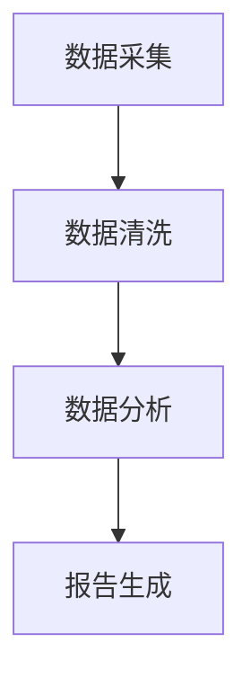

                 


# 企业级自动报告生成系统：简化业务报告流程

关键词：自动报告生成、企业级系统、业务流程、简化流程、报告格式、数据分析、算法原理

摘要：本文旨在探讨企业级自动报告生成系统如何通过先进的算法和技术，简化业务报告流程，提高效率和准确性。文章从问题背景与需求分析出发，深入解析系统的核心概念、架构设计、算法原理，并通过实际案例展示系统应用，总结最佳实践。

## 第1章：问题背景与需求分析

### 1.1 问题背景

在当今信息化社会中，企业每天需要处理大量的业务数据，这些数据通常需要被整理成报告形式，以供管理层决策参考。然而，传统的手动报告生成方式不仅耗时，而且容易出现人为错误，无法满足企业对高效、准确报告的需求。

### 1.2 问题描述

问题描述主要集中在以下几个方面：

- 报告生成时间长，影响决策效率。
- 报告质量不稳定，容易出现错误。
- 报告格式不统一，难以满足不同部门的需求。
- 数据处理过程繁琐，人力成本高。

### 1.3 问题解决

为了解决上述问题，企业需要引入自动报告生成系统。该系统通过自动化处理数据，生成标准化的报告，从而提高效率，减少错误，满足各部门对报告格式和内容的需求。

### 1.4 边界与外延

边界方面，自动报告生成系统应能处理企业内各类业务数据，包括财务数据、销售数据、生产数据等。外延方面，系统应能与企业现有的ERP、CRM等系统无缝集成，实现数据自动采集和处理。

### 1.5 核心要素组成

自动报告生成系统的核心要素包括：

- 数据采集：从各种数据源中自动获取数据。
- 数据处理：对采集到的数据进行分析和处理。
- 报告生成：根据处理结果生成报告。
- 报告格式：支持多种报告格式，如PDF、Excel等。

## 第2章：企业级自动报告生成系统的核心概念

### 2.1 自动报告生成系统定义

自动报告生成系统是指通过计算机技术和算法，自动收集、处理和分析业务数据，生成标准格式报告的系统。

### 2.2 关键术语与概念

- 数据采集：从各种数据源获取数据的过程。
- 数据处理：对采集到的数据进行清洗、转换和分析的过程。
- 报告生成：根据分析结果生成报告的过程。
- 报告格式：报告的呈现形式，如PDF、Excel等。

### 2.3 核心原理与技术

核心原理包括自动化数据处理、模板引擎和报告渲染。关键技术包括数据采集技术、数据处理算法和报告生成算法。

## 第3章：自动报告生成系统的架构设计

### 3.1 架构设计方案概述

自动报告生成系统的架构设计分为数据采集层、数据处理层、报告生成层和用户交互层。

### 3.2 系统功能设计

系统功能包括数据采集、数据处理、报告生成和报告预览。

### 3.3 系统架构设计

系统架构采用分层设计，各层之间通过接口进行通信。

### 3.4 系统接口设计

系统接口包括API接口和数据接口，用于与其他系统集成。

## 第4章：自动报告生成系统的算法原理

### 4.1 算法概述

自动报告生成系统采用多种算法，包括数据清洗算法、数据分析算法和报告生成算法。

### 4.2 算法流程图



### 4.3 算法原理详解

数据清洗算法主要涉及缺失值填充、异常值处理等。

数据分析算法包括数据聚合、数据分类等。

报告生成算法主要涉及模板渲染、数据绑定等。

### 4.4 数学模型与公式

数据聚合算法的数学模型如下：

$$
\text{SUM}(X) = \sum_{i=1}^{n} X_i
$$

### 4.5 算法实例讲解

以数据聚合算法为例，讲解如何计算数据的总和。

## 第5章：系统分析与架构设计示例

### 5.1 问题场景介绍

假设一家公司需要定期生成销售报告，报告内容包括销售额、客户数量等。

### 5.2 项目介绍

本项目旨在开发一套自动报告生成系统，用于简化销售报告的生成流程。

### 5.3 系统功能设计

系统功能包括数据采集、数据处理、报告生成和报告预览。

### 5.4 系统架构设计

系统架构采用分层设计，各层之间通过接口进行通信。

### 5.5 系统接口设计

系统接口包括API接口和数据接口。

### 5.6 系统交互设计

系统交互设计包括用户操作界面和数据流转过程。

## 第6章：项目实战

### 6.1 环境安装与配置

详细介绍如何搭建自动报告生成系统的开发环境。

### 6.2 系统核心实现源代码

提供系统核心实现代码，并进行解读。

### 6.3 代码应用解读与分析

分析系统代码的实现原理和应用场景。

### 6.4 实际案例分析与详细讲解

以实际案例为例，展示系统如何工作。

### 6.5 项目小结

总结项目经验，提出改进建议。

## 第7章：最佳实践与总结

### 7.1 最佳实践

提供使用自动报告生成系统的最佳实践。

### 7.2 注意事项

提醒使用过程中需要注意的问题。

### 7.3 拓展阅读

推荐相关书籍和资料，供读者深入学习。

### 7.4 小结

总结文章内容，强调自动报告生成系统的重要性。

## 作者信息

作者：AI天才研究院/AI Genius Institute & 禅与计算机程序设计艺术 /Zen And The Art of Computer Programming
```

请注意，上述内容仅为草稿，需要根据实际情况进行补充和调整，以满足文章字数要求、markdown格式和内容完整性等要求。

