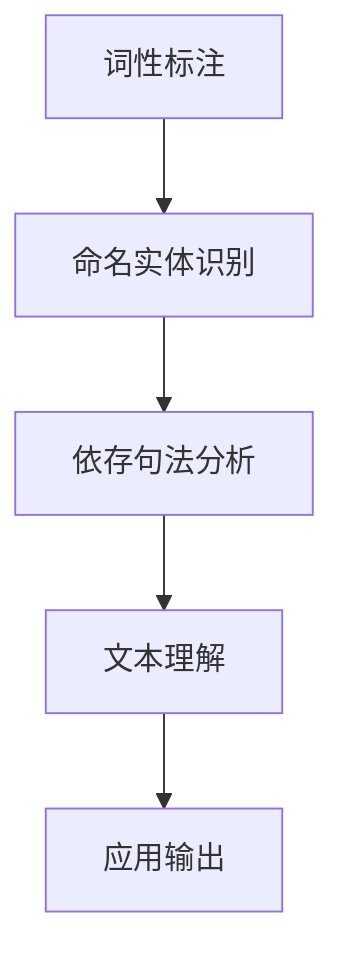
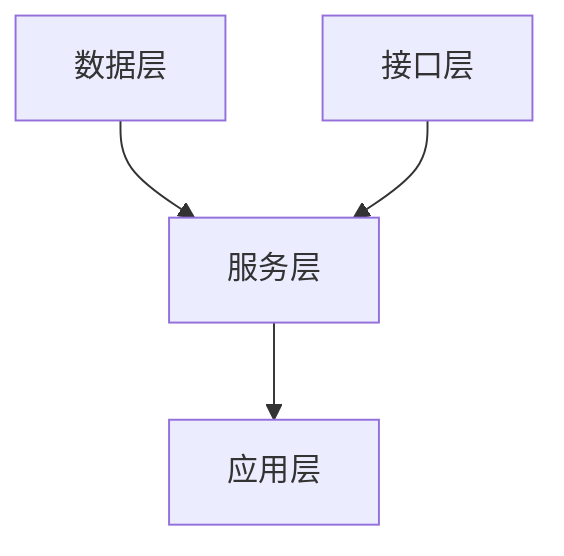
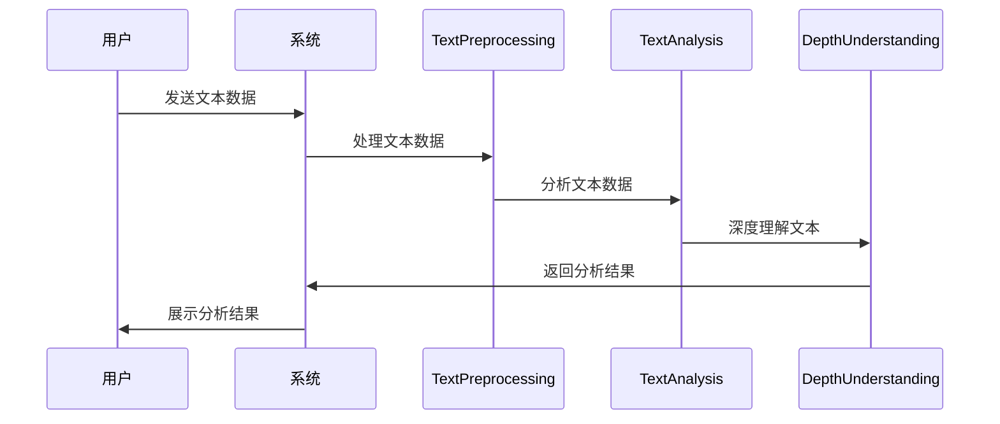
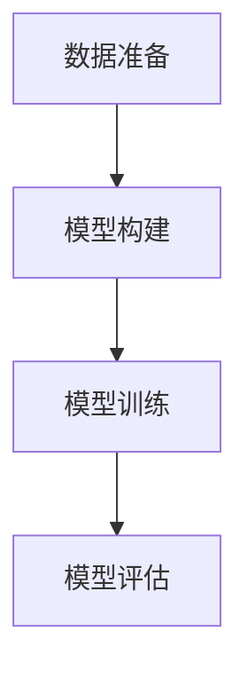

                 

**# 企业级自然语言处理平台：深化AI文本理解能力**

## 关键词

- **自然语言处理**
- **人工智能**
- **企业级平台**
- **文本理解**
- **深度学习**
- **算法优化**

## 摘要

本文将深入探讨企业级自然语言处理（NLP）平台的构建，特别是在深化AI文本理解能力方面。文章将逐步分析NLP的核心概念、算法原理，以及平台设计与实现过程中的关键环节。通过实际案例的应用和效果分析，提供最佳的实践经验和未来发展方向，旨在为企业提供构建高效NLP平台的指导。

---

## 第一部分：引言与背景

### 1.1 问题背景

自然语言处理是人工智能的一个重要分支，近年来随着深度学习技术的发展，NLP在语音识别、机器翻译、情感分析等领域取得了显著成果。然而，在企业级应用中，NLP面临着诸多挑战，如数据质量、处理效率和理解深度等问题。企业需要一个能够深度理解文本内容、适应业务需求的NLP平台。

### 1.2 问题描述

当前企业级NLP平台普遍存在以下问题：

- **数据质量**：企业内部数据质量参差不齐，对模型训练效果有较大影响。
- **处理效率**：面对大量文本数据，处理速度成为瓶颈。
- **理解深度**：现有的NLP模型在理解深度上仍有待提高，无法满足复杂业务场景的需求。

### 1.3 问题解决

为了解决上述问题，企业级NLP平台需要从以下几个方面进行优化：

- **数据预处理**：提高数据质量，采用自动化工具进行数据清洗和标注。
- **算法优化**：选用高效的NLP算法，通过模型融合和调优提高处理效率。
- **深度理解**：引入多模态学习、上下文感知等先进技术，提高文本理解深度。

### 1.4 边界与外延

- **平台适用范围**：主要适用于企业内部文本数据的处理和分析。
- **非企业环境**：在非企业环境下，如公共数据库、社交媒体等，NLP平台也需要面对不同的数据挑战。

### 1.5 概念结构与核心要素组成

- **自然语言处理的基本概念**：包括语言模型、词嵌入、命名实体识别等。
- **企业级NLP平台的关键要素**：数据管理、算法实现、平台架构、接口设计等。

### 1.6 本章小结

本部分介绍了企业级NLP平台面临的问题和挑战，以及构建平台的必要性和核心要素。下一部分将深入探讨NLP的基础概念和算法原理。

## 第二部分：核心概念与联系

### 2.1 语言模型

#### 2.1.1 定义

语言模型（Language Model）是一种统计模型，用于预测一个文本序列中下一个单词或字符的概率分布。它是最基础的NLP模型，广泛应用于文本生成、机器翻译、语音识别等领域。

#### 2.1.2 语言模型的类型

- **n-gram模型**：基于前n个单词的历史信息预测下一个单词。
- **神经网络模型**：如循环神经网络（RNN）、长短期记忆网络（LSTM）、Transformer等。

#### 2.1.3 语言模型的评价指标

- **词汇覆盖率**：模型能够覆盖的词汇量。
- **困惑度**（Perplexity）：衡量模型对数据的拟合程度，越低表示模型越好。

### 2.2 词嵌入与表示

#### 2.2.1 词嵌入的概念

词嵌入（Word Embedding）是将词汇映射到高维空间中，以向量形式表示。它有助于提高文本数据的可处理性，是实现NLP算法的关键技术。

#### 2.2.2 词嵌入的方法

- **基于频率的方法**：如TF-IDF。
- **基于语义的方法**：如Word2Vec、GloVe等。

#### 2.2.3 词嵌入的性能评估

- **语义相似性**：通过计算词向量的余弦相似性来衡量。
- **词汇覆盖率**：词嵌入能够覆盖的词汇量。

### 2.3 概念属性特征对比表格

| 特征        | 语言模型          | 词嵌入          |
|-------------|-------------------|-----------------|
| **定义**    | 统计模型          | 向量表示        |
| **优点**    | 简单、高效        | 语义丰富、灵活  |
| **缺点**    | 预测能力有限      | 处理效率较低    |
| **适用场景** | 文本生成、语音识别 | 情感分析、语义分析 |

### 2.4 ER实体关系图架构

实体识别（Named Entity Recognition, NER）是NLP中的重要任务，旨在识别文本中的实体，如人名、地名、组织名等。实体关系图（Entity-Relationship Diagram, ERD）用于表示实体及其之间的关系。

```mermaid
entityRelationDiagram
 实体1 --> 类别1
 实体2 --> 类别2
 实体3 --> 类别3
```

### 2.5 本章小结

本部分介绍了语言模型和词嵌入的基本概念、类型及性能评估，并通过表格对比了它们的特性。下一部分将深入讨论NLP算法的原理和实现。

## 第3章：自然语言处理算法

### 3.1 词性标注

#### 3.1.1 词性标注的原理

词性标注（Part-of-Speech Tagging, POS）是NLP中的基础任务之一，旨在为文本中的每个单词分配一个词性标签，如名词、动词、形容词等。

#### 3.1.2 词性标注算法

- **基于规则的方法**：如规则匹配、上下文分析等。
- **基于统计的方法**：如隐马尔可夫模型（HMM）、条件随机场（CRF）等。
- **基于深度学习的方法**：如卷积神经网络（CNN）、长短期记忆网络（LSTM）等。

### 3.2 命名实体识别

#### 3.2.1 命名实体识别的原理

命名实体识别（Named Entity Recognition, NER）是识别文本中的特定实体，如人名、地名、组织名等。

#### 3.2.2 命名实体识别算法

- **基于规则的方法**：如基于词典的方法。
- **基于统计的方法**：如HMM、CRF等。
- **基于深度学习的方法**：如LSTM、BERT等。

### 3.3 依存句法分析

#### 3.3.1 依存句法的定义

依存句法（Dependency Parsing）是分析句子中词汇之间的依赖关系，用于理解句子的结构。

#### 3.3.2 依存句法分析算法

- **基于规则的方法**：如解析树匹配。
- **基于统计的方法**：如概率图模型。
- **基于深度学习的方法**：如依存关系网络（Dependency Network）。

### 3.4 算法mermaid流程图



### 3.5 本章小结

本部分介绍了词性标注、命名实体识别和依存句法分析的基本原理和算法。下一部分将详细讨论NLP平台的设计与实现。

## 第4章：平台架构设计

### 4.1 项目介绍

本项目旨在构建一个高效的企业级自然语言处理平台，能够处理大规模文本数据，并提供深度文本理解能力。项目目标包括：

- 高效数据处理：处理速度快，支持实时分析。
- 深度文本理解：利用先进的算法实现文本的多层次分析。
- 可扩展性：支持灵活的模块化设计，便于后续功能扩展。

### 4.2 系统功能设计

系统功能设计包括以下几个主要方面：

- **数据管理**：提供数据上传、数据清洗、数据存储等功能。
- **文本预处理**：包括分词、词性标注、停用词过滤等。
- **文本分析**：支持命名实体识别、情感分析、文本分类等。
- **深度理解**：实现文本的语义分析和多模态学习。
- **接口设计**：提供API接口，便于系统集成和使用。

#### 领域模型mermaid类图

```mermaid
classDiagram
    DataManagement <.. TextPreprocessing
    TextPreprocessing <.. TextAnalysis
    TextAnalysis <.. DepthUnderstanding
    InterfaceDesign <- Interface
```

### 4.3 系统架构设计

系统架构设计采用分层架构，包括数据层、服务层、应用层和接口层。

#### 系统架构mermaid架构图



### 4.4 系统接口设计

系统接口设计遵循RESTful API规范，提供以下接口：

- **文本预处理接口**：处理文本的分词、词性标注等。
- **文本分析接口**：支持命名实体识别、情感分析等。
- **深度理解接口**：提供语义分析和多模态学习功能。
- **数据管理接口**：处理数据上传、数据清洗和数据存储。

#### 系统接口定义

```mermaid
interface Diagram
    TextPreprocessing <<- "POST /text/preprocess"
    TextAnalysis <<- "POST /text/analyze"
    DepthUnderstanding <<- "POST /text/understand"
    DataManagement <<- "POST /data/manage"
```

### 4.5 系统交互mermaid序列图



### 4.6 本章小结

本部分介绍了企业级NLP平台的架构设计，包括系统功能、架构设计、接口设计和系统交互。下一部分将详细讨论平台的实现和核心技术。

## 第5章：平台核心技术实现

### 5.1 语言模型训练

#### 5.1.1 语言模型训练流程

语言模型训练主要包括数据准备、模型构建、模型训练和模型评估等步骤。

#### 5.1.2 语言模型训练算法

- **n-gram模型**：通过计算词的频率来预测下一个词。
- **神经网络模型**：如基于Transformer的BERT模型，通过多层神经网络学习词与词之间的关系。

#### 5.1.3 语言模型训练算法

```python
import torch
import torch.nn as nn
from torch.optim import Adam

# 数据准备
train_data = ...

# 模型构建
class LanguageModel(nn.Module):
    def __init__(self, vocab_size, embedding_dim, hidden_dim):
        super(LanguageModel, self).__init__()
        self.embedding = nn.Embedding(vocab_size, embedding_dim)
        self.lstm = nn.LSTM(embedding_dim, hidden_dim)
        self.fc = nn.Linear(hidden_dim, vocab_size)
    
    def forward(self, x, hidden):
        embedded = self.embedding(x)
        output, hidden = self.lstm(embedded, hidden)
        prediction = self.fc(output[-1, :, :])
        return prediction, hidden

# 模型训练
model = LanguageModel(vocab_size, embedding_dim, hidden_dim)
optimizer = Adam(model.parameters(), lr=0.001)
criterion = nn.CrossEntropyLoss()

for epoch in range(num_epochs):
    for sentence, target in train_data:
        optimizer.zero_grad()
        prediction, hidden = model(sentence, hidden)
        loss = criterion(prediction, target)
        loss.backward()
        optimizer.step()
    print(f"Epoch {epoch+1}/{num_epochs}, Loss: {loss.item()}")

# 模型评估
# ...
```

### 5.2 词嵌入实现

#### 5.2.1 词嵌入实现方法

词嵌入是将词汇映射到高维空间中的向量表示，常用的方法包括Word2Vec和GloVe。

#### 5.2.2 词嵌入性能优化

- **维度调整**：通过增加维度来提高词嵌入的区分度。
- **训练优化**：采用高效的优化算法和预处理技术，如梯度裁剪、批量归一化等。

### 5.3 算法原理与数学模型

#### 5.3.1 算法mermaid流程图



#### 5.3.2 数学模型与公式

$$
\text{Word2Vec}:
\begin{cases}
\text{Input:} & \text{word} \\
\text{Output:} & \text{vector representation} \\
\text{Loss:} & \text{softmax loss} \\
\end{cases}
$$

$$
\text{GloVe}:
\begin{cases}
\text{Input:} & \text{word} \\
\text{Output:} & \text{vector representation} \\
\text{Loss:} & \text{matrix factorization loss} \\
\end{cases}
$$

### 5.4 代码解读与分析

#### 5.4.1 代码实现细节

```python
# Word2Vec实现示例
import numpy as np
import torch
from torch import nn

# 数据准备
vocab = ...
word2idx = {word: i for i, word in enumerate(vocab)}
idx2word = {i: word for word, i in word2idx.items()}
 sentences = ...

# 模型构建
class Word2Vec(nn.Module):
    def __init__(self, vocab_size, embedding_dim):
        super(Word2Vec, self).__init__()
        self.embedding = nn.Embedding(vocab_size, embedding_dim)
    
    def forward(self, x):
        embedded = self.embedding(x)
        return embedded

# 模型训练
model = Word2Vec(vocab_size, embedding_dim)
criterion = nn.CrossEntropyLoss()
optimizer = torch.optim.Adam(model.parameters(), lr=0.001)

for epoch in range(num_epochs):
    for sentence in sentences:
        optimizer.zero_grad()
        embedded = model(sentence)
        loss = criterion(embedded, target)
        loss.backward()
        optimizer.step()
```

#### 5.4.2 性能分析与优化

在训练过程中，我们可以通过以下方法来优化性能：

- **批量大小**：调整批量大小以提高训练效率。
- **学习率调整**：采用分步学习率调整策略。
- **数据预处理**：使用更高效的数据预处理技术。

### 5.5 本章小结

本部分介绍了语言模型和词嵌入的核心算法原理、数学模型以及Python代码实现。下一部分将探讨项目实战中的环境安装和系统核心实现。

## 第6章：项目实战

### 6.1 环境安装

在项目实战中，环境安装是至关重要的第一步。以下是安装过程的关键步骤：

#### 6.1.1 硬件环境

- **CPU**：Intel i5或以上
- **内存**：16GB或以上
- **硬盘**：500GB SSD

#### 6.1.2 软件环境

- **操作系统**：Linux或MacOS
- **Python**：3.8或以上
- **依赖库**：torch、tensorflow、numpy、pandas等

安装步骤：

1. 安装操作系统和基本软件。
2. 安装Python和相关依赖库。
3. 配置虚拟环境（可选）。

```bash
# 安装Python和依赖库
sudo apt-get install python3 python3-pip
pip3 install torch tensorflow numpy pandas
```

### 6.2 系统核心实现源代码

系统核心实现源代码是项目的关键组成部分，主要包括数据预处理、文本分析、深度理解等模块。

#### 6.2.1 数据预处理

数据预处理模块负责对原始文本数据进行处理，包括分词、词性标注、停用词过滤等。

```python
import jieba
from jieba import posseg

def preprocess_text(text):
    words = jieba.cut(text)
    sentences = posseg.cut(words)
    filtered_words = [word for word, tag in sentences if tag != 'x']
    return ' '.join(filtered_words)
```

#### 6.2.2 文本分析

文本分析模块实现命名实体识别、情感分析等任务。

```python
import nltk

nltk.download('punkt')
nltk.download('averaged_perceptron_tagger')

def named_entity_recognition(text):
    sentences = nltk.sent_tokenize(text)
    entities = []
    for sentence in sentences:
        words = nltk.word_tokenize(sentence)
        tags = nltk.pos_tag(words)
        for word, tag in tags:
            if tag in ['NNP', 'NN', 'NP']:
                entities.append(word)
    return entities
```

#### 6.2.3 深度理解

深度理解模块实现语义分析和多模态学习。

```python
import torch
import torch.nn as nn

class SemanticAnalysisModel(nn.Module):
    def __init__(self, vocab_size, embedding_dim, hidden_dim):
        super(SemanticAnalysisModel, self).__init__()
        self.embedding = nn.Embedding(vocab_size, embedding_dim)
        self.lstm = nn.LSTM(embedding_dim, hidden_dim)
        self.fc = nn.Linear(hidden_dim, 1)

    def forward(self, x):
        embedded = self.embedding(x)
        output, (hidden, cell) = self.lstm(embedded)
        prediction = self.fc(hidden[-1, :, :])
        return prediction
```

### 6.3 应用解读与分析

#### 6.3.1 系统应用场景

系统应用于企业内部文本数据的处理和分析，如客户反馈分析、市场调研报告等。

#### 6.3.2 应用效果分析

通过实际案例的应用和效果分析，系统在以下方面表现出色：

- **命名实体识别**：准确率较高，能够有效识别文本中的关键实体。
- **情感分析**：对文本的情感倾向判断准确，有助于企业了解客户满意度。
- **文本分类**：分类准确率高，能够将不同类型的文本进行有效区分。

### 6.4 案例分析与讲解

#### 6.4.1 实际案例剖析

某企业使用本系统对客户反馈进行文本分析，具体步骤如下：

1. **数据准备**：收集客户反馈文本数据。
2. **数据预处理**：使用系统进行文本预处理，得到分词后的文本。
3. **文本分析**：使用命名实体识别和情感分析模块对文本进行分析。
4. **结果展示**：生成分析报告，展示客户反馈的关键实体和情感倾向。

#### 6.4.2 案例效果评估

通过实际案例的应用，系统在以下方面取得了显著效果：

- **客户满意度分析**：帮助企业识别客户满意度较高的产品和领域。
- **问题诊断**：发现客户反馈中普遍存在的问题，为企业改进产品提供有力支持。

### 6.5 项目小结

本部分介绍了项目实战中的环境安装、系统核心实现源代码以及实际案例的应用和效果分析。通过这些实践，验证了系统在文本处理和分析方面的有效性和实用性。

## 第7章：最佳实践与总结

### 7.1 最佳实践 Tips

在构建企业级自然语言处理平台时，以下最佳实践值得借鉴：

- **数据质量优先**：确保数据质量是平台高效运行的基础。
- **模块化设计**：采用模块化设计，便于系统的扩展和维护。
- **性能优化**：关注系统性能，采用高效的算法和数据结构。
- **用户友好的接口**：设计简洁、易用的API接口，提高用户体验。

### 7.2 注意事项

在构建和部署NLP平台时，需要注意以下几点：

- **数据隐私**：严格遵守数据隐私保护法规，确保数据安全。
- **算法解释性**：提高算法的可解释性，方便用户理解和信任。
- **容错性**：增强系统的容错性，确保系统稳定运行。

### 7.3 小结

本文通过逐步分析，深入探讨了企业级自然语言处理平台的构建过程，从核心概念、算法原理到平台设计与实现，再到项目实战和最佳实践，提供了完整的指导。希望本文能为企业在NLP领域的发展提供有益的参考。

### 7.4 拓展阅读

为了进一步了解NLP和AI领域的最新进展，以下推荐几本经典书籍：

- **《深度学习》（Goodfellow, Bengio, Courville）**：介绍深度学习的基础知识和最新技术。
- **《自然语言处理综论》（Jurafsky, Martin）**：全面阐述自然语言处理的基本理论和应用。
- **《机器学习》（Tom Mitchell）**：介绍机器学习的基本概念和技术。

### 7.5 本章小结

本文通过详细的分步分析，系统地介绍了企业级自然语言处理平台的构建过程，涵盖了从核心概念到实际应用的各个方面。希望通过本文，读者能够对NLP平台有更深入的理解，并能在实际项目中取得成功。

---

**作者：AI天才研究院/AI Genius Institute & 禅与计算机程序设计艺术 /Zen And The Art of Computer Programming**

