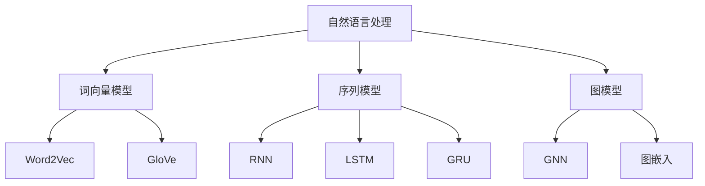
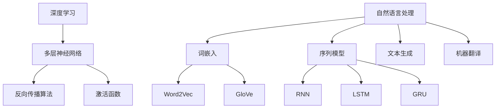

                 

### 1.1 问题背景

自然语言处理（NLP）是人工智能（AI）领域的一个重要分支，旨在使计算机能够理解和处理人类语言。随着信息时代的到来，自然语言处理的应用场景日益广泛，从智能客服、机器翻译、情感分析到智能推荐、语音识别等，都离不开NLP技术的支撑。然而，在企业和商业环境中，对自然语言处理的需求不仅仅是简单的语言理解和处理，更重要的是如何将这些技术高效地集成到企业级应用中，以提升业务效率和用户体验。

企业级自然语言处理引擎是指专为满足企业级应用需求而设计的NLP系统。这种引擎不仅需要具备强大的文本理解能力，还需要具备高可用性、高可扩展性和良好的用户体验。随着数据量的爆炸式增长和业务需求的多样化，企业级自然语言处理引擎面临着前所未有的挑战：

1. **海量数据处理能力**：企业每天会产生大量的文本数据，这些数据需要被高效地处理和理解。
2. **高准确率与召回率**：在商业应用中，对NLP任务的准确率和召回率有很高的要求，任何错误的识别或遗漏都可能导致严重的商业后果。
3. **实时响应能力**：很多企业级应用需要实时处理用户请求，因此NLP引擎需要具备快速响应的能力。
4. **定制化需求**：不同的企业有不同的业务场景和需求，NLP引擎需要具备良好的定制化能力，以适应不同场景的需求。

### 1.2 自然语言处理的基本概念

自然语言处理涉及多个核心概念，理解这些概念有助于我们深入探讨NLP在商业应用中的潜力和挑战。

#### 1.2.1 语言模型

语言模型是自然语言处理的基础，它用于预测文本的下一个单词或字符。语言模型可以是基于统计的，如N-gram模型，也可以是基于神经网络的，如变换器（Transformer）模型。语言模型在文本生成、机器翻译、文本摘要等任务中发挥着关键作用。

#### 1.2.2 词向量

词向量是自然语言处理中常用的表示方法，它将每个单词映射到一个低维度的向量空间中。词向量模型，如Word2Vec和GloVe，通过捕捉词语的语义信息，使得相似词汇在向量空间中靠近，从而可以用于文本分类、情感分析等任务。

#### 1.2.3 词性标注

词性标注是指对文本中的每个单词进行语法属性标注，如名词、动词、形容词等。词性标注对于理解文本的句法结构和语义意义非常重要，是许多NLP任务的基础。

#### 1.2.4 命名实体识别

命名实体识别（NER）是指识别文本中的特定实体，如人名、地名、组织名等。NER是信息提取和知识图谱构建的重要步骤，对于企业应用如客户关系管理、市场分析等具有重要价值。

#### 1.2.5 情感分析

情感分析是指识别文本中的情感倾向，如正面、负面或中性。情感分析广泛应用于市场调研、品牌监测和客户服务等领域，帮助企业了解用户对产品或服务的态度。

#### 1.2.6 文本分类

文本分类是指将文本分为预定义的类别，如新闻分类、垃圾邮件检测等。文本分类是自然语言处理中应用广泛的技术，对于企业来说，可以帮助自动化内容审核、舆情监测等任务。

### 1.3 自然语言处理的应用领域

自然语言处理在多个领域中有着广泛的应用，以下是其中几个重要的应用领域：

#### 1.3.1 智能客服

智能客服利用自然语言处理技术，可以自动理解用户的问题并给出合适的回答，从而提高客户服务的效率和质量。例如，通过NLP技术实现的聊天机器人可以24小时在线服务，处理大量用户咨询，减轻人工客服的工作负担。

#### 1.3.2 机器翻译

机器翻译是将一种语言文本翻译成另一种语言的过程。随着深度学习技术的发展，机器翻译的准确率不断提高，已经广泛应用于跨语言沟通、国际化业务等领域。

#### 1.3.3 情感分析

情感分析可以识别文本中的情感倾向，帮助企业了解用户的反馈和态度。例如，通过分析社交媒体上的用户评论，企业可以及时调整产品策略，提高用户满意度。

#### 1.3.4 信息提取

信息提取是指从大量文本数据中提取出有价值的信息，如关键词、摘要、实体等。信息提取在金融、医疗、法律等领域有广泛的应用，可以帮助企业快速获取所需信息。

#### 1.3.5 智能推荐

智能推荐系统利用自然语言处理技术，可以分析用户的兴趣和行为，为用户提供个性化的内容推荐。例如，在线购物平台可以通过分析用户的搜索和购买记录，推荐相关商品。

### 1.4 企业级自然语言处理的需求与挑战

企业级自然语言处理的需求和挑战与普通应用场景有所不同，主要体现在以下几个方面：

#### 1.4.1 数据质量和多样性

企业级应用涉及的数据通常量大且复杂，数据质量直接影响NLP模型的性能。此外，企业级应用往往需要处理不同类型的文本数据，如新闻报道、用户评论、邮件等，这些数据的多样性增加了处理的难度。

#### 1.4.2 实时性和响应速度

企业级应用往往要求NLP系统能够快速响应用户请求，提供实时反馈。这对系统的处理速度和响应能力提出了高要求。

#### 1.4.3 精准度和可靠性

在商业应用中，NLP系统的准确率和可靠性至关重要。任何错误或遗漏都可能导致严重的商业后果，如客户流失、品牌损害等。

#### 1.4.4 可定制化

企业级应用的需求多样化，不同的企业对NLP系统有特定的需求。因此，NLP引擎需要具备良好的定制化能力，以满足不同企业的需求。

#### 1.4.5 跨语言处理能力

许多企业具有跨国业务，需要处理不同语言的数据。因此，企业级自然语言处理引擎需要具备跨语言处理能力，以支持全球化业务。

### 1.5 企业级自然语言处理的概念与边界

企业级自然语言处理（NLP）是指将自然语言处理技术应用于企业级应用场景，以满足企业业务需求的一套解决方案。它与普通NLP应用的区别主要体现在以下几个方面：

#### 1.5.1 应用场景

普通NLP应用通常针对特定任务或场景，如文本分类、情感分析等。而企业级NLP则更加综合，涵盖了多种NLP任务，如文本分类、命名实体识别、情感分析、信息提取等，以满足企业多样化的业务需求。

#### 1.5.2 数据处理规模

企业级NLP处理的数据量通常更大，涉及多种类型的文本数据，如文档、邮件、社交媒体评论等。因此，企业级NLP需要具备更强的数据处理能力和可扩展性。

#### 1.5.3 实时性要求

企业级NLP往往要求系统能够快速响应用户请求，提供实时反馈。这对系统的性能和响应速度提出了高要求。

#### 1.5.4 系统集成

企业级NLP需要与企业的其他业务系统进行集成，如客户关系管理系统（CRM）、企业资源规划系统（ERP）等。因此，企业级NLP系统需要具备良好的兼容性和接口设计。

#### 1.5.5 安全性和隐私保护

企业级NLP系统需要处理企业的敏感数据，如客户信息、业务数据等。因此，系统需要具备高水平的安全性，以保护企业数据的安全和隐私。

### 1.6 企业级自然语言处理的边界

企业级自然语言处理的边界主要涉及以下几个方面：

#### 1.6.1 技术范畴

企业级NLP主要涉及自然语言处理、机器学习、深度学习等技术。这些技术共同构成了NLP系统的核心。

#### 1.6.2 数据范畴

企业级NLP的数据范畴主要包括企业内部和外部数据，如客户反馈、市场报告、社交媒体数据等。这些数据需要经过处理和分析，以提供有价值的信息。

#### 1.6.3 应用范畴

企业级NLP的应用范畴涵盖了企业各个业务领域，如市场营销、客户服务、风险管理等。这些应用场景需要NLP技术提供智能化的解决方案。

#### 1.6.4 安全范畴

企业级NLP在处理企业敏感数据时，需要确保数据的安全和隐私。这涉及到数据加密、访问控制、隐私保护等技术。

### 1.7 企业级自然语言处理的核心要素组成

企业级自然语言处理引擎的核心要素主要包括以下几个部分：

#### 1.7.1 数据预处理模块

数据预处理是NLP任务的基础，主要包括文本清洗、分词、去除停用词、词干提取等操作。高质量的数据预处理能够有效提升NLP任务的准确率和效率。

#### 1.7.2 特征提取模块

特征提取是将原始文本数据转换为计算机可以处理和理解的格式。常见的特征提取方法包括词袋模型、TF-IDF、词嵌入等。有效的特征提取能够提高模型的性能和泛化能力。

#### 1.7.3 模型训练模块

模型训练是NLP任务的核心，通过训练学习到文本数据的特征和规律。常见的模型包括循环神经网络（RNN）、长短期记忆网络（LSTM）、变换器（Transformer）等。高效的模型训练能够提高模型的准确率和响应速度。

#### 1.7.4 模型评估模块

模型评估是验证模型性能的重要环节，主要包括准确率、召回率、F1分数等指标。通过模型评估，可以及时调整和优化模型。

#### 1.7.5 系统接口设计

系统接口设计是NLP系统与企业其他业务系统集成的关键，主要包括API设计、数据交换格式、权限控制等。良好的接口设计能够确保系统的稳定性和可扩展性。

#### 1.7.6 系统监控与维护

系统监控与维护是保障NLP系统正常运行的重要环节，主要包括性能监控、故障诊断、数据备份等。有效的监控与维护能够提高系统的可靠性和安全性。

### 1.8 核心概念与联系

在探讨企业级自然语言处理引擎时，需要深入理解几个核心概念，并探讨它们之间的联系。

#### 1.8.1 自然语言处理的常见算法

自然语言处理中常用的算法包括词向量模型、序列模型和图模型。这些算法分别适用于不同的NLP任务，共同构成了NLP技术的基石。

1. **词向量模型**：词向量模型将单词映射到高维空间中的向量，如Word2Vec和GloVe。它们通过捕捉词语的语义关系，广泛应用于文本分类、情感分析等任务。
   
2. **序列模型**：序列模型用于处理文本序列，如循环神经网络（RNN）、长短期记忆网络（LSTM）和门控循环单元（GRU）。这些模型能够捕捉文本序列中的时间依赖关系，适用于文本分类、序列标注等任务。

3. **图模型**：图模型将文本数据表示为图，如图神经网络（GNN）。它们能够捕捉文本中的结构信息，适用于实体关系识别、文本生成等任务。

#### 1.8.2 自然语言处理与深度学习的关系

深度学习是自然语言处理的重要技术支撑，两者密不可分。

1. **深度学习的基本原理**：深度学习通过多层神经网络对数据进行建模和学习，从而提取出高层次的抽象特征。深度学习在图像识别、语音识别等领域取得了显著成果。

2. **深度学习在自然语言处理中的应用**：深度学习在自然语言处理中的应用非常广泛，包括词嵌入、序列模型、文本生成等。深度学习模型的引入，极大地提升了NLP任务的性能和效果。

#### 1.8.3 自然语言处理与深度学习的关系图

为了更直观地理解自然语言处理与深度学习的关系，我们可以使用Mermaid流程图来展示：



在这个图中，自然语言处理与深度学习的关系被直观地呈现出来，展示了自然语言处理中常用的算法以及它们与深度学习之间的联系。

### 1.9 本章小结

本章介绍了企业级自然语言处理引擎的背景、基本概念、应用领域、需求和挑战，以及核心概念和联系。通过本章的学习，读者可以初步了解企业级自然语言处理引擎的概貌，为后续章节的深入探讨打下基础。

### 2.1 深度学习与自然语言处理的关系

深度学习是近年来在人工智能领域取得重大突破的技术，其核心思想是通过多层神经网络对大量数据进行分析和建模，从而实现复杂任务的自动化。自然语言处理（NLP）是深度学习的重要应用领域之一。两者之间的关系可以归纳为以下几个方面：

#### 2.1.1 深度学习的基本原理

深度学习的基本原理是基于多层神经网络对数据进行建模和学习。神经网络由多个层组成，包括输入层、隐藏层和输出层。每一层由多个神经元组成，神经元之间通过权重进行连接。在训练过程中，神经网络通过不断调整权重，使输出尽可能接近目标值。深度学习模型能够自动提取数据中的高层次特征，从而实现复杂任务的自动化。

1. **多层神经网络**：多层神经网络能够对输入数据进行多层抽象和转换，从而提取出更高层次的特征。深度学习通过多层神经网络，能够实现从简单到复杂的特征提取过程。
   
2. **反向传播算法**：反向传播算法是深度学习训练的核心，它通过计算输出层与目标层之间的误差，反向传播到输入层，不断调整权重，以优化模型性能。

3. **激活函数**：激活函数用于引入非线性特性，使神经网络能够拟合复杂的非线性关系。常用的激活函数包括ReLU、Sigmoid和Tanh等。

#### 2.1.2 深度学习在自然语言处理中的应用

深度学习在自然语言处理中得到了广泛应用，显著提升了NLP任务的性能和效果。以下是一些典型的深度学习在自然语言处理中的应用：

1. **词嵌入**：词嵌入是将单词映射到高维向量空间的技术。Word2Vec和GloVe是两种常见的词嵌入模型，它们通过捕捉词语的语义关系，将相似的词语映射到空间中相近的位置。深度学习模型，如循环神经网络（RNN）和变换器（Transformer），通常使用词嵌入作为输入。

2. **序列模型**：序列模型用于处理文本序列，如循环神经网络（RNN）、长短期记忆网络（LSTM）和门控循环单元（GRU）。这些模型能够捕捉文本序列中的时间依赖关系，广泛应用于文本分类、序列标注等任务。

3. **文本生成**：文本生成是自然语言处理的重要应用之一，深度学习模型，如变换器（Transformer），在生成文本方面表现出色。变换器通过自注意力机制，能够捕捉文本序列中的长距离依赖关系，生成连贯、自然的文本。

4. **机器翻译**：机器翻译是将一种语言文本翻译成另一种语言的过程。近年来，深度学习模型，如变换器（Transformer），在机器翻译领域取得了显著成果。变换器通过捕捉文本序列中的长距离依赖关系，生成准确、流畅的翻译结果。

#### 2.1.3 深度学习与自然语言处理的结合优势

深度学习与自然语言处理的结合，带来了以下几个方面的优势：

1. **特征自动提取**：深度学习能够自动从原始数据中提取出高层次的抽象特征，从而简化了特征工程过程。在自然语言处理中，特征工程通常是一个复杂且耗时的工作，深度学习通过自动特征提取，显著提高了模型的性能和效率。

2. **处理复杂关系**：自然语言处理任务通常涉及到复杂的语义和句法关系。深度学习模型，如变换器（Transformer），通过自注意力机制和多层神经网络，能够捕捉文本序列中的长距离依赖关系，从而提高模型的性能和效果。

3. **提升模型效果**：深度学习模型在自然语言处理领域取得了显著的成果，如机器翻译、文本生成、情感分析等。深度学习与自然语言处理的结合，显著提升了NLP任务的准确率和效果。

#### 2.1.4 深度学习在自然语言处理中的应用案例

以下是一些深度学习在自然语言处理中的应用案例：

1. **文本分类**：文本分类是将文本分为预定义的类别，如新闻分类、垃圾邮件检测等。深度学习模型，如循环神经网络（RNN）和变换器（Transformer），在文本分类任务中取得了显著效果。

2. **情感分析**：情感分析是识别文本中的情感倾向，如正面、负面或中性。深度学习模型，如循环神经网络（RNN）和变换器（Transformer），在情感分析任务中表现出色，能够准确识别文本的情感倾向。

3. **命名实体识别**：命名实体识别是识别文本中的特定实体，如人名、地名、组织名等。深度学习模型，如循环神经网络（RNN）和变换器（Transformer），在命名实体识别任务中具有很高的准确率。

4. **机器翻译**：机器翻译是将一种语言文本翻译成另一种语言的过程。深度学习模型，如变换器（Transformer），在机器翻译领域取得了显著成果，生成准确、流畅的翻译结果。

#### 2.1.5 深度学习与自然语言处理的关系图

为了更直观地理解深度学习与自然语言处理的关系，我们可以使用Mermaid流程图来展示：



在这个图中，深度学习与自然语言处理的关系被直观地呈现出来，展示了深度学习在自然语言处理中的应用以及两者之间的联系。

### 2.2 词嵌入技术

词嵌入（Word Embedding）是将单词映射到高维向量空间的技术，使得相似的单词在向量空间中靠近，不同义的单词则相隔较远。词嵌入技术在自然语言处理中具有重要作用，能够有效提高NLP任务的性能。下面我们将详细探讨词嵌入的基本概念、常见模型以及它们在NLP中的应用。

#### 2.2.1 词向量的基本概念

词向量是将单词映射到一个固定长度的向量表示。词向量不仅保留了单词的语义信息，还能够捕捉到单词之间的相似性和关联性。词向量模型在NLP任务中起到了关键作用，如文本分类、情感分析和机器翻译等。

1. **语义表示**：词向量能够将文本转换为计算机可以处理和理解的向量表示，使得NLP任务更加容易实现。

2. **相似性度量**：词向量通过捕捉词语的语义关系，使得相似的词语在向量空间中靠近。例如，"king"和"queen"在向量空间中是相似的，因为它们都代表君主。

3. **关联性分析**：词向量还能够捕捉词语之间的关联性，例如，"car"和"engine"在向量空间中是相关的。

#### 2.2.2 常见的词嵌入模型

在词嵌入技术中，Word2Vec和GloVe是两种常见的词嵌入模型，它们各自具有独特的特点和应用场景。

1. **Word2Vec**

   Word2Vec是由Google开发的词嵌入模型，它通过训练神经网络来学习词向量。Word2Vec模型有两种训练方式：连续词袋（CBOW）和Skip-Gram。

   - **连续词袋（CBOW）**：CBOW模型通过预测中心词周围的词来学习词向量。具体来说，给定一个中心词，模型会预测它周围多个词（通常为上下文窗口内的词）的概率分布。CBOW模型使用中心词的上下文词的词向量平均作为中心词的词向量。

     $$ \text{CBOW}(x_c, \text{context}) = \frac{1}{|\text{context}|} \sum_{w \in \text{context}} \text{Vec}(w) $$

     其中，\(x_c\) 是中心词，\(\text{context}\) 是上下文词的集合，\(\text{Vec}(w)\) 是词 \(w\) 的词向量。

   - **Skip-Gram**：Skip-Gram模型通过预测中心词来学习词向量。与CBOW模型相反，Skip-Gram模型给定一个中心词，预测与它不相同的所有词的概率分布。Skip-Gram模型通常使用中心词的词向量作为其自身的词向量。

     $$ \text{Skip-Gram}(x_c, \text{vocabulary}) = \log \frac{\exp(\text{Vec}(x_c) \cdot v)}{\sum_{w \in \text{vocabulary}} \exp(\text{Vec}(x_c) \cdot w)} $$

     其中，\(\text{vocabulary}\) 是词汇表，\(v\) 是需要预测的词的词向量。

2. **GloVe**

   GloVe（Global Vectors for Word Representation）是由Stanford University开发的一种词嵌入模型，它通过计算词语的共现概率来学习词向量。GloVe模型采用了一种矩阵分解的方法，将词语的词向量和共现矩阵分解为两个低维矩阵的乘积。

   $$ \text{Vec}(w_i) \cdot \text{Vec}(w_j) = \log P(w_i, w_j) $$

   其中，\(P(w_i, w_j)\) 是词语 \(w_i\) 和 \(w_j\) 的共现概率。

   GloVe模型通过最小化上述损失函数来学习词向量：

   $$ \min_{\text{Vec}(w_i), \text{Vec}(w_j)} \sum_{i,j} (\text{Vec}(w_i) \cdot \text{Vec}(w_j) - \log P(w_i, w_j))^2 $$

   通过优化上述损失函数，GloVe模型能够学习到具有良好语义信息的词向量。

#### 2.2.3 Word2Vec的数学模型

Word2Vec模型基于神经网络进行训练，其核心是预测给定上下文词的概率分布。以下分别介绍CBOW和Skip-Gram的数学模型。

1. **CBOW的数学模型**

   在CBOW模型中，给定一个中心词和它的上下文词，模型通过计算上下文词的词向量平均来预测中心词。具体来说，CBOW模型使用一个多层神经网络，其输入是上下文词的词向量，输出是中心词的词向量。

   $$ \text{Input Layer}: \text{Vec}(w_1), \text{Vec}(w_2), \ldots, \text{Vec}(w_n) $$
   $$ \text{Hidden Layer}: h_1, h_2, \ldots, h_n $$
   $$ \text{Output Layer}: \text{Vec}(x_c) $$

   假设隐藏层中的每个神经元 \(h_i\) 与输出层中的每个神经元 \(v_j\) 通过权重 \(w_{ij}\) 相连，输出层中的每个神经元 \(v_j\) 与softmax激活函数相连。

   $$ h_i = \sigma(\sum_{j=1}^{|\text{vocabulary}|} w_{ij} \cdot \text{Vec}(w_j)) $$
   $$ \text{softmax}(z) = \frac{\exp(z_j)}{\sum_{k=1}^{|\text{vocabulary}|} \exp(z_k)} $$

   其中，\(\sigma\) 是激活函数，\(z_j\) 是输出层中每个神经元的输出。

   通过反向传播算法，调整权重 \(w_{ij}\)，使输出层的概率分布尽可能接近实际的词频分布。

2. **Skip-Gram的数学模型**

   在Skip-Gram模型中，给定一个中心词，模型通过预测与它不相同的所有词的概率分布来学习词向量。Skip-Gram模型也使用多层神经网络，其输入是中心词的词向量，输出是所有可能词的词向量。

   $$ \text{Input Layer}: \text{Vec}(x_c) $$
   $$ \text{Hidden Layer}: h_1, h_2, \ldots, h_n $$
   $$ \text{Output Layer}: \text{Vec}(w_1), \text{Vec}(w_2), \ldots, \text{Vec}(w_n) $$

   同样，隐藏层中的每个神经元 \(h_i\) 与输出层中的每个神经元 \(v_j\) 通过权重 \(w_{ij}\) 相连，输出层中的每个神经元 \(v_j\) 与softmax激活函数相连。

   $$ h_i = \sigma(\sum_{j=1}^{|\text{vocabulary}|} w_{ij} \cdot \text{Vec}(w_j)) $$
   $$ \text{softmax}(z) = \frac{\exp(z_j)}{\sum_{k=1}^{|\text{vocabulary}|} \exp(z_k)} $$

   通过反向传播算法，调整权重 \(w_{ij}\)，使输出层的概率分布尽可能接近实际的词频分布。

#### 2.2.4 GloVe的数学模型

GloVe模型通过矩阵分解的方法来学习词向量，其核心思想是将词向量和共现矩阵分解为两个低维矩阵的乘积。以下介绍GloVe的数学模型。

1. **矩阵分解**

   给定词汇表 \(V = \{w_1, w_2, \ldots, w_n\}\) 和共现矩阵 \(C \in \mathbb{R}^{n \times n}\)，其中 \(C_{ij} = \log P(w_i, w_j)\)。GloVe模型通过分解 \(C\) 为两个低维矩阵 \(W \in \mathbb{R}^{n \times d}\) 和 \(X \in \mathbb{R}^{n \times d}\)，即：

   $$ C = WX^T $$

   其中，\(d\) 是低维空间中的维度，\(W\) 和 \(X\) 是待学习的词向量矩阵。

2. **损失函数**

   GloVe模型的损失函数是：

   $$ \min_{W, X} \sum_{i,j=1}^{n} (C_{ij} - \text{Vec}(w_i) \cdot \text{Vec}(w_j))^2 $$

   其中，\(\text{Vec}(w_i)\) 和 \(\text{Vec}(w_j)\) 是词 \(w_i\) 和 \(w_j\) 的词向量。

   通过优化上述损失函数，GloVe模型能够学习到具有良好语义信息的词向量。

#### 2.2.5 词嵌入技术在NLP中的应用

词嵌入技术在自然语言处理中具有广泛的应用，以下是一些典型的应用场景：

1. **文本分类**：词嵌入能够捕捉文本的语义信息，用于文本分类任务。通过将文本转换为词向量，可以使用深度学习模型（如循环神经网络、变换器）进行文本分类。

2. **情感分析**：词嵌入能够捕捉词语的语义关系，用于情感分析任务。通过将文本转换为词向量，可以使用深度学习模型（如循环神经网络、变换器）进行情感分类。

3. **机器翻译**：词嵌入是机器翻译的基础，用于将源语言和目标语言的词汇映射到同一向量空间中。通过将源语言和目标语言的词汇转换为词向量，可以使用深度学习模型（如循环神经网络、变换器）进行机器翻译。

4. **文本生成**：词嵌入能够捕捉文本的语义信息，用于文本生成任务。通过将文本转换为词向量，可以使用深度学习模型（如循环神经网络、变换器）生成连贯的文本。

#### 2.2.6 本章小结

本章介绍了词嵌入技术的基本概念、常见模型以及它们在自然语言处理中的应用。词嵌入技术是自然语言处理的核心组成部分，通过将单词映射到高维向量空间，词嵌入能够捕捉词语的语义关系，从而提升NLP任务的性能和效果。在下一章中，我们将进一步探讨序列模型，包括循环神经网络（RNN）、长短期记忆网络（LSTM）和门控循环单元（GRU）。

### 2.3 序列模型

序列模型是自然语言处理（NLP）中的重要工具，专门用于处理序列数据，如单词序列、字符序列或时间序列。这些模型通过捕捉数据序列中的时间依赖性，在许多NLP任务中表现出色。在本节中，我们将详细探讨三种常见的序列模型：循环神经网络（RNN）、长短期记忆网络（LSTM）和门控循环单元（GRU）。

#### 2.3.1 循环神经网络（RNN）

循环神经网络（RNN）是一种能够处理序列数据的神经网络。与传统的前向神经网络不同，RNN具有循环结构，能够将前一个时间步的信息存储在隐藏状态中，并在后续的时间步中利用这些信息。这种循环结构使得RNN能够捕捉序列数据中的时间依赖性。

1. **基本结构**

   RNN由输入层、隐藏层和输出层组成。输入层接收输入序列，隐藏层存储序列信息，输出层生成输出序列。RNN的隐藏状态 \(h_t\) 与前一个时间步的隐藏状态 \(h_{t-1}\) 以及当前输入 \(x_t\) 通过一个线性变换和激活函数相连接：

   $$ h_t = \sigma(W_h \cdot [h_{t-1}, x_t] + b_h) $$

   其中，\(W_h\) 是权重矩阵，\(b_h\) 是偏置项，\(\sigma\) 是激活函数，如Sigmoid或Tanh。

2. **递归关系**

   RNN的递归关系使得隐藏状态 \(h_t\) 能够存储序列信息，从而在后续的时间步中利用这些信息。递归关系可以表示为：

   $$ h_t = \sigma(W_h \cdot h_{t-1} + W_x \cdot x_t + b_h) $$

   其中，\(W_x\) 是输入权重矩阵。

3. **输出层**

   RNN的输出层通常是一个线性层，用于生成输出序列。输出序列可以通过隐藏状态 \(h_t\) 和输出权重矩阵 \(W_o\) 计算得到：

   $$ y_t = W_o \cdot h_t + b_o $$

   其中，\(b_o\) 是输出偏置项。

4. **训练过程**

   RNN的训练过程基于梯度下降法，通过反向传播算法调整权重和偏置项，以最小化损失函数。训练过程中，RNN能够学习到序列数据中的时间依赖性，从而提高模型的性能。

#### 2.3.2 长短期记忆网络（LSTM）

长短期记忆网络（LSTM）是RNN的一种改进，旨在解决传统RNN在处理长序列数据时的梯度消失和梯度爆炸问题。LSTM通过引入门控机制，能够有效地捕捉长序列数据中的时间依赖性。

1. **基本结构**

   LSTM由输入门、遗忘门、输出门和单元状态组成。每个门都是一个sigmoid激活函数，用于控制信息流。LSTM的隐藏状态 \(h_t\) 和单元状态 \(c_t\) 通过以下公式更新：

   $$ i_t = \sigma(W_i \cdot [h_{t-1}, x_t] + b_i) $$
   $$ f_t = \sigma(W_f \cdot [h_{t-1}, x_t] + b_f) $$
   $$ g_t = \sigma(W_g \cdot [h_{t-1}, x_t] + b_g) $$
   $$ o_t = \sigma(W_o \cdot [h_{t-1}, x_t] + b_o) $$
   $$ c_t = f_t \cdot c_{t-1} + i_t \cdot \sigma(g_t) $$
   $$ h_t = o_t \cdot \sigma(c_t) $$

   其中，\(i_t\)、\(f_t\)、\(g_t\) 和 \(o_t\) 分别是输入门、遗忘门、输出门和单元状态的更新项，\(W_i\)、\(W_f\)、\(W_g\) 和 \(W_o\) 是权重矩阵，\(b_i\)、\(b_f\)、\(b_g\) 和 \(b_o\) 是偏置项。

2. **门控机制**

   LSTM通过输入门、遗忘门和输出门来控制信息流。输入门 \(i_t\) 控制新的信息 \(g_t\) 是否进入单元状态 \(c_t\)；遗忘门 \(f_t\) 控制哪些旧的信息 \(c_{t-1}\) 被保留；输出门 \(o_t\) 控制单元状态 \(c_t\) 是否被输出到隐藏状态 \(h_t\)。

3. **单元状态**

   LSTM的单元状态 \(c_t\) 能够存储长序列信息，从而避免传统RNN中的梯度消失和梯度爆炸问题。通过遗忘门和输入门，LSTM能够灵活地控制信息流，从而有效地捕捉长序列数据中的时间依赖性。

4. **训练过程**

   LSTM的训练过程基于梯度下降法，通过反向传播算法调整权重和偏置项，以最小化损失函数。训练过程中，LSTM能够学习到长序列数据中的时间依赖性，从而提高模型的性能。

#### 2.3.3 门控循环单元（GRU）

门控循环单元（GRU）是LSTM的简化版本，具有较少的参数和更简单的结构。GRU通过引入更新门和重置门来简化信息流，从而在保持性能的同时减少计算复杂度。

1. **基本结构**

   GRU由输入门、更新门、重置门和单元状态组成。GRU的隐藏状态 \(h_t\) 和单元状态 \(c_t\) 通过以下公式更新：

   $$ z_t = \sigma(W_z \cdot [h_{t-1}, x_t] + b_z) $$
   $$ r_t = \sigma(W_r \cdot [h_{t-1}, x_t] + b_r) $$
   $$ \tilde{c}_t = \sigma(W \cdot [z_t \odot h_{t-1}, x_t] + b) $$
   $$ c_t = r_t \cdot c_{t-1} + (1 - r_t) \cdot \tilde{c}_t $$
   $$ h_t = z_t \cdot \sigma(c_t) $$

   其中，\(z_t\)、\(r_t\) 和 \(\tilde{c}_t\) 分别是更新门、重置门和新的单元状态，\(W_z\)、\(W_r\)、\(W\) 和 \(b_z\)、\(b_r\)、\(b\) 分别是权重矩阵和偏置项，\(\odot\) 是逐元素乘法。

2. **门控机制**

   GRU通过更新门 \(z_t\) 和重置门 \(r_t\) 来控制信息流。更新门 \(z_t\) 控制新的信息 \(\tilde{c}_t\) 是否进入单元状态 \(c_t\)；重置门 \(r_t\) 控制旧的信息 \(c_{t-1}\) 是否被保留。

3. **单元状态**

   GRU的单元状态 \(c_t\) 能够存储长序列信息，从而避免传统RNN中的梯度消失和梯度爆炸问题。通过更新门和重置门，GRU能够灵活地控制信息流，从而有效地捕捉长序列数据中的时间依赖性。

4. **训练过程**

   GRU的训练过程基于梯度下降法，通过反向传播算法调整权重和偏置项，以最小化损失函数。训练过程中，GRU能够学习到长序列数据中的时间依赖性，从而提高模型的性能。

#### 2.3.4 序列模型在NLP中的应用

序列模型在NLP中有着广泛的应用，以下是一些典型的应用场景：

1. **文本分类**：序列模型可以用于文本分类任务，通过将文本转换为序列表示，可以使用RNN、LSTM或GRU进行文本分类。

2. **命名实体识别**：序列模型可以用于命名实体识别任务，通过捕捉文本序列中的时间依赖性，可以准确地识别出文本中的命名实体。

3. **机器翻译**：序列模型可以用于机器翻译任务，通过将源语言和目标语言的词汇序列转换为序列表示，可以使用RNN、LSTM或GRU进行机器翻译。

4. **文本生成**：序列模型可以用于文本生成任务，通过捕捉文本序列中的时间依赖性，可以生成连贯、自然的文本。

#### 2.3.5 本章小结

本章介绍了序列模型的基本概念、RNN、LSTM和GRU的结构和工作原理，以及它们在NLP中的应用。序列模型通过捕捉序列数据中的时间依赖性，在许多NLP任务中表现出色。在下一章中，我们将进一步探讨图模型，包括图神经网络（GNN）和图嵌入技术。

### 2.4 图模型

图模型是自然语言处理（NLP）中的重要工具，特别适用于处理具有复杂结构和关系的文本数据。图模型通过将文本数据表示为图，从而捕捉文本中的结构信息和语义关系。在本节中，我们将详细介绍图模型的基本概念、图神经网络（GNN）和图嵌入技术。

#### 2.4.1 图神经网络（GNN）

图神经网络（GNN）是图模型的一种，用于处理图数据。GNN通过在图上定义神经网络结构，从而能够自动学习节点和边之间的复杂关系。GNN的基本思想是利用邻居信息来更新节点的特征表示。

1. **基本结构**

   GNN通常由以下几个部分组成：

   - **节点特征**：每个节点都有对应的特征表示，如词向量或文本特征。
   - **边特征**：每条边都有对应的特征表示，如边权重或关系类型。
   - **图卷积层**：图卷积层用于计算节点的新特征表示，通过聚合邻居节点的信息。
   - **激活函数**：用于引入非线性变换，增强模型的表示能力。

   GNN的基本公式可以表示为：

   $$ h_{t+1} = \sigma(\sum_{n \in \text{neighbors}(v)} W_e \cdot h_n + W_h \cdot h_v + b) $$

   其中，\(h_v\) 是节点 \(v\) 的特征表示，\(\text{neighbors}(v)\) 是节点 \(v\) 的邻居节点集合，\(W_e\) 和 \(W_h\) 是权重矩阵，\(b\) 是偏置项，\(\sigma\) 是激活函数。

2. **图卷积操作**

   图卷积操作是GNN的核心，通过聚合邻居节点的信息来更新节点特征。常见的图卷积操作包括：

   - **邻近节点聚合**：将邻居节点的特征进行平均或加权平均。
   - **邻接矩阵乘法**：通过邻接矩阵与节点特征矩阵的乘法来聚合邻居节点的信息。

3. **训练过程**

   GNN的训练过程基于梯度下降法，通过反向传播算法调整权重和偏置项，以最小化损失函数。训练过程中，GNN能够学习到图中的复杂结构和关系，从而提高模型的性能。

#### 2.4.2 图嵌入技术

图嵌入技术是一种将图数据转换为向量表示的方法，使得图中的节点和边具有向量形式，从而能够用于各种机器学习任务。图嵌入技术通过学习节点的向量表示，可以捕捉节点之间的结构和语义关系。

1. **基本概念**

   图嵌入技术主要包括以下几个概念：

   - **节点表示**：每个节点都有一个向量表示，用于表示节点的特征和关系。
   - **边表示**：每条边都有一个向量表示，用于表示边的关系和权重。
   - **损失函数**：用于衡量节点向量表示的质量，如负采样损失或交叉熵损失。

2. **常见模型**

   常见的图嵌入模型包括：

   - **基于矩阵分解的方法**：如GraphSAGE和Graph Convolutional Networks（GCN）。这些模型通过矩阵分解的方法来学习节点和边的向量表示。
   - **基于随机游走的方法**：如Node2Vec。Node2Vec通过模拟随机游走过程，将节点的特征扩展到整个图中，从而学习到全局的节点表示。

3. **训练过程**

   图嵌入技术的训练过程通常包括以下几个步骤：

   - **初始化节点表示**：随机初始化节点的向量表示。
   - **学习节点和边的关系**：通过图卷积操作或随机游走过程，学习节点和边之间的关系。
   - **优化损失函数**：通过反向传播算法，优化节点和边的向量表示，以最小化损失函数。

#### 2.4.3 图模型在NLP中的应用

图模型在NLP中具有广泛的应用，以下是一些典型的应用场景：

1. **实体关系识别**：通过将实体和关系表示为图，可以捕捉实体之间的复杂关系。图模型可以用于命名实体识别、共指消解和实体关系抽取等任务。

2. **文本生成**：图模型可以用于生成具有复杂结构和语义的文本。通过学习节点和边之间的关系，可以生成连贯、自然的文本序列。

3. **知识图谱构建**：图模型可以用于构建大规模的知识图谱，将实体、属性和关系表示为图，从而为各种知识密集型任务提供支持。

4. **文本分类**：图模型可以用于文本分类任务，通过将文本表示为图，可以捕捉文本中的结构信息和语义关系，从而提高分类性能。

#### 2.4.4 本章小结

本章介绍了图模型的基本概念、图神经网络（GNN）和图嵌入技术，以及它们在自然语言处理（NLP）中的应用。图模型通过将文本数据表示为图，能够捕捉文本中的复杂结构和语义关系，从而提高NLP任务的性能。在下一章中，我们将探讨深度学习在自然语言处理中的应用案例。

### 2.5 深度学习在自然语言处理中的应用案例

深度学习在自然语言处理（NLP）中取得了显著的成果，下面我们将通过几个实际应用案例来展示深度学习技术如何解决NLP任务中的具体问题。

#### 2.5.1 文本分类

文本分类是一种常见的NLP任务，旨在将文本数据自动归类到预定义的类别中。深度学习模型在文本分类任务中表现出色，以下是一个简单的文本分类应用案例：

**问题场景**：给定一组社交媒体评论，将其分类为正面或负面评论。

**解决方案**：

1. **数据预处理**：首先，对评论进行文本清洗，包括去除停用词、标点符号和特殊字符，然后进行分词。

2. **词嵌入**：使用Word2Vec或GloVe模型将文本转换为词向量表示。

3. **模型构建**：构建一个循环神经网络（RNN）或变换器（Transformer）模型，用于分类任务。以下是一个基于RNN的文本分类模型：

   ```python
   import tensorflow as tf
   from tensorflow.keras.models import Sequential
   from tensorflow.keras.layers import Embedding, SimpleRNN, Dense

   model = Sequential([
       Embedding(vocabulary_size, embedding_dim),
       SimpleRNN(units),
       Dense(1, activation='sigmoid')
   ])

   model.compile(optimizer='adam', loss='binary_crossentropy', metrics=['accuracy'])
   ```

4. **训练与评估**：使用训练数据对模型进行训练，并在测试数据上评估模型性能。

**代码示例**：

```python
# 假设我们已经预处理了数据并创建了词嵌入
X_train, y_train = ..., ...
X_test, y_test = ..., ...

# 构建和编译模型
model = Sequential([
    Embedding(vocabulary_size, embedding_dim),
    SimpleRNN(units),
    Dense(1, activation='sigmoid')
])

model.compile(optimizer='adam', loss='binary_crossentropy', metrics=['accuracy'])

# 训练模型
model.fit(X_train, y_train, epochs=5, batch_size=32, validation_data=(X_test, y_test))

# 评估模型
loss, accuracy = model.evaluate(X_test, y_test)
print(f"Test Accuracy: {accuracy}")
```

#### 2.5.2 命名实体识别

命名实体识别（NER）是一种旨在识别文本中特定命名实体的任务，如人名、地名、组织名等。深度学习模型在NER任务中也表现出色，以下是一个NER应用案例：

**问题场景**：给定一组文本，识别文本中的命名实体。

**解决方案**：

1. **数据预处理**：对文本进行清洗和分词，然后使用词嵌入技术将文本转换为向量表示。

2. **模型构建**：构建一个基于循环神经网络（RNN）或变换器（Transformer）的NER模型。以下是一个基于LSTM的NER模型：

   ```python
   import tensorflow as tf
   from tensorflow.keras.models import Sequential
   from tensorflow.keras.layers import Embedding, LSTM, Dense, Bidirectional

   model = Sequential([
       Embedding(vocabulary_size, embedding_dim),
       Bidirectional(LSTM(units)),
       Dense(num_classes, activation='softmax')
   ])

   model.compile(optimizer='adam', loss='categorical_crossentropy', metrics=['accuracy'])
   ```

3. **训练与评估**：使用标注数据进行模型训练，并在未标注数据上进行评估。

**代码示例**：

```python
# 假设我们已经预处理了数据并创建了词嵌入
X_train, y_train = ..., ...
X_test, y_test = ..., ...

# 构建和编译模型
model = Sequential([
    Embedding(vocabulary_size, embedding_dim),
    Bidirectional(LSTM(units)),
    Dense(num_classes, activation='softmax')
])

model.compile(optimizer='adam', loss='categorical_crossentropy', metrics=['accuracy'])

# 训练模型
model.fit(X_train, y_train, epochs=5, batch_size=32, validation_data=(X_test, y_test))

# 评估模型
loss, accuracy = model.evaluate(X_test, y_test)
print(f"Test Accuracy: {accuracy}")
```

#### 2.5.3 机器翻译

机器翻译是将一种语言文本翻译成另一种语言的过程。深度学习模型，特别是变换器（Transformer），在机器翻译任务中取得了显著成果。以下是一个机器翻译应用案例：

**问题场景**：给定一组英文句子，将其翻译成中文。

**解决方案**：

1. **数据预处理**：对文本进行清洗和分词，然后使用词嵌入技术将文本转换为向量表示。

2. **模型构建**：构建一个基于变换器（Transformer）的机器翻译模型。以下是一个简单的变换器模型：

   ```python
   import tensorflow as tf
   from tensorflow.keras.layers import Embedding, Transformer

   model = Sequential([
       Embedding(source_vocab_size, embedding_dim),
       Transformer(num_layers, d_model, num_heads),
       Embedding(target_vocab_size, embedding_dim)
   ])

   model.compile(optimizer='adam', loss='categorical_crossentropy', metrics=['accuracy'])
   ```

3. **训练与评估**：使用双语语料库对模型进行训练，并在测试数据上评估模型性能。

**代码示例**：

```python
# 假设我们已经预处理了数据并创建了词嵌入
X_train, y_train = ..., ...
X_test, y_test = ..., ...

# 构建和编译模型
model = Sequential([
    Embedding(source_vocab_size, embedding_dim),
    Transformer(num_layers, d_model, num_heads),
    Embedding(target_vocab_size, embedding_dim)
])

model.compile(optimizer='adam', loss='categorical_crossentropy', metrics=['accuracy'])

# 训练模型
model.fit(X_train, y_train, epochs=5, batch_size=32, validation_data=(X_test, y_test))

# 评估模型
loss, accuracy = model.evaluate(X_test, y_test)
print(f"Test Accuracy: {accuracy}")
```

通过这些实际应用案例，我们可以看到深度学习技术在NLP任务中的强大能力。无论是文本分类、命名实体识别还是机器翻译，深度学习模型都能够有效地解决这些复杂的自然语言处理问题。随着深度学习技术的不断发展，我们期待NLP领域将取得更多突破性成果。

### 2.6 本章小结

本章详细探讨了深度学习在自然语言处理中的应用案例，包括文本分类、命名实体识别和机器翻译等任务。通过实际应用案例，我们展示了如何使用深度学习模型来解决这些复杂的NLP问题。这些应用案例不仅验证了深度学习在NLP领域的强大能力，也为企业和开发者提供了实用的解决方案。在下一章中，我们将进一步探讨自然语言处理的数学模型，包括词嵌入、序列模型和图模型的数学原理和公式。

### 3.1 词嵌入的数学模型

词嵌入是将单词映射到高维向量空间的技术，通过捕捉词语的语义关系，使得相似的单词在向量空间中靠近，不同义的单词则相隔较远。在本节中，我们将深入探讨两种常见的词嵌入模型：Word2Vec和GloVe，以及它们背后的数学原理。

#### 3.1.1 Word2Vec的数学模型

Word2Vec模型由Google提出，主要包括连续词袋（CBOW）和Skip-Gram两种训练方法。以下分别介绍它们的数学模型。

1. **CBOW模型**

   CBOW模型通过预测中心词周围的词来学习词向量。给定一个中心词和它的上下文词，模型需要预测这些上下文词的概率分布。CBOW模型使用一个多层神经网络来实现，其损失函数是一个softmax函数。

   $$ \text{CBOW}(x_c, \text{context}) = \log \frac{\exp(\text{Vec}(x_c) \cdot v)}{\sum_{w \in \text{context}} \exp(\text{Vec}(w) \cdot v)} $$

   其中，\(x_c\) 是中心词，\(\text{context}\) 是上下文词的集合，\(\text{Vec}(w)\) 是词 \(w\) 的词向量，\(v\) 是需要预测的词的词向量。

   在训练过程中，通过最小化损失函数，调整词向量，使中心词的词向量更接近上下文词的词向量。

2. **Skip-Gram模型**

   Skip-Gram模型与CBOW模型相反，它通过预测中心词来学习词向量。给定一个中心词，模型需要预测所有其他词的概率分布。Skip-Gram模型同样使用一个多层神经网络来实现，其损失函数也是一个softmax函数。

   $$ \text{Skip-Gram}(x_c, \text{vocabulary}) = \log \frac{\exp(\text{Vec}(x_c) \cdot v)}{\sum_{w \in \text{vocabulary}} \exp(\text{Vec}(x_c) \cdot w)} $$

   其中，\(\text{vocabulary}\) 是词汇表，\(v\) 是需要预测的词的词向量。

   与CBOW模型类似，通过最小化损失函数，调整词向量，使中心词的词向量更接近其他词的词向量。

#### 3.1.2 GloVe的数学模型

GloVe（Global Vectors for Word Representation）是由Stanford University提出的一种词嵌入模型，它通过计算词语的共现概率来学习词向量。GloVe模型采用了一种矩阵分解的方法，将词向量和共现矩阵分解为两个低维矩阵的乘积。

1. **共现矩阵**

   给定词汇表 \(V = \{w_1, w_2, \ldots, w_n\}\)，定义共现矩阵 \(C \in \mathbb{R}^{n \times n}\)，其中 \(C_{ij} = \log P(w_i, w_j)\)。\(P(w_i, w_j)\) 是词语 \(w_i\) 和 \(w_j\) 的共现概率。

2. **矩阵分解**

   GloVe模型通过分解共现矩阵 \(C\) 为两个低维矩阵 \(W \in \mathbb{R}^{n \times d}\) 和 \(X \in \mathbb{R}^{n \times d}\)，即：

   $$ C = WX^T $$

   其中，\(d\) 是低维空间中的维度，\(W\) 和 \(X\) 是待学习的词向量矩阵。

3. **损失函数**

   GloVe模型的损失函数是：

   $$ \min_{W, X} \sum_{i,j=1}^{n} (C_{ij} - \text{Vec}(w_i) \cdot \text{Vec}(w_j))^2 $$

   其中，\(\text{Vec}(w_i)\) 和 \(\text{Vec}(w_j)\) 是词 \(w_i\) 和 \(w_j\) 的词向量。

   通过优化上述损失函数，GloVe模型能够学习到具有良好语义信息的词向量。

#### 3.1.3 两种模型的特点对比

1. **数据需求**：

   - **Word2Vec**：Word2Vec模型对数据量要求较高，因为需要计算单词之间的共现概率。对于大规模数据集，Word2Vec模型能够学习到更丰富的语义信息。
   - **GloVe**：GloVe模型对数据量的要求较低，因为它直接使用词语的共现概率。对于小规模数据集，GloVe模型也能够学习到较好的语义信息。

2. **训练速度**：

   - **Word2Vec**：Word2Vec模型的训练速度较快，因为它采用了一个简单的多层神经网络结构。对于大规模数据集，Word2Vec模型能够快速生成词向量。
   - **GloVe**：GloVe模型的训练速度较慢，因为它需要进行矩阵分解操作。然而，一旦训练完成，GloVe模型可以快速生成词向量。

3. **性能表现**：

   - **Word2Vec**：Word2Vec模型在文本分类、情感分析等任务中表现良好，能够捕捉词语的语义关系。
   - **GloVe**：GloVe模型在词向量质量方面表现更好，特别是在捕捉词语之间的相似性方面。在机器翻译、文本生成等任务中，GloVe模型表现出色。

#### 3.1.4 本章小结

本章介绍了Word2Vec和GloVe两种常见的词嵌入模型，以及它们背后的数学原理。Word2Vec模型通过预测中心词的上下文词来学习词向量，而GloVe模型通过矩阵分解方法学习词向量。两种模型各有优缺点，适用于不同的应用场景。在下一章中，我们将进一步探讨序列模型的数学模型，包括循环神经网络（RNN）、长短期记忆网络（LSTM）和门控循环单元（GRU）。

### 3.2 序列模型的数学模型

序列模型在自然语言处理中扮演着至关重要的角色，特别是在处理时间序列数据和文本数据方面。本节将详细探讨循环神经网络（RNN）、长短期记忆网络（LSTM）和门控循环单元（GRU）的数学模型，并对比它们之间的异同。

#### 3.2.1 RNN的数学模型

循环神经网络（RNN）是一种能够处理序列数据的神经网络。其核心思想是利用前一个时间步的隐藏状态来影响当前时间步的输出。以下是一个简单的RNN模型：

1. **隐藏状态更新**

   RNN的隐藏状态 \(h_t\) 可以通过以下公式更新：

   $$ h_t = \sigma(W_h \cdot [h_{t-1}, x_t] + b_h) $$

   其中，\(W_h\) 是权重矩阵，\(b_h\) 是偏置项，\(\sigma\) 是激活函数（通常是Sigmoid或Tanh函数）。

2. **输出**

   RNN的输出 \(y_t\) 可以通过以下公式计算：

   $$ y_t = W_o \cdot h_t + b_o $$

   其中，\(W_o\) 是输出权重矩阵，\(b_o\) 是输出偏置项。

3. **递归关系**

   RNN的递归关系使得隐藏状态 \(h_t\) 能够存储序列信息，从而在后续的时间步中利用这些信息：

   $$ h_t = \sigma(W_h \cdot h_{t-1} + W_x \cdot x_t + b_h) $$

   其中，\(W_x\) 是输入权重矩阵。

4. **反向传播**

   在训练过程中，RNN通过反向传播算法更新权重和偏置项，以最小化损失函数。反向传播算法计算每个时间步的梯度，并更新网络参数。

#### 3.2.2 LSTM的数学模型

长短期记忆网络（LSTM）是RNN的一种改进，旨在解决传统RNN在处理长序列数据时的梯度消失和梯度爆炸问题。LSTM通过引入门控机制，能够有效地捕捉长序列数据中的时间依赖性。

1. **门控机制**

   LSTM包含三个门控单元：输入门 \(i_t\)、遗忘门 \(f_t\) 和输出门 \(o_t\)。

   - **输入门** \(i_t\)：

     $$ i_t = \sigma(W_i \cdot [h_{t-1}, x_t] + b_i) $$

   - **遗忘门** \(f_t\)：

     $$ f_t = \sigma(W_f \cdot [h_{t-1}, x_t] + b_f) $$

   - **输出门** \(o_t\)：

     $$ o_t = \sigma(W_o \cdot [h_{t-1}, x_t] + b_o) $$

2. **单元状态更新**

   LSTM的单元状态 \(c_t\) 可以通过以下公式更新：

   $$ c_t = f_t \cdot c_{t-1} + i_t \cdot \sigma(g_t) $$

   其中，\(g_t\) 是输入门的线性组合：

   $$ g_t = \sigma(W_g \cdot [h_{t-1}, x_t] + b_g) $$

3. **隐藏状态更新**

   LSTM的隐藏状态 \(h_t\) 可以通过以下公式更新：

   $$ h_t = o_t \cdot \sigma(c_t) $$

4. **反向传播**

   LSTM同样通过反向传播算法更新权重和偏置项，以最小化损失函数。反向传播算法计算每个时间步的梯度，并更新网络参数。

#### 3.2.3 GRU的数学模型

门控循环单元（GRU）是LSTM的简化版本，它通过引入更新门和重置门来简化信息流。

1. **更新门** \(z_t\) 和 **重置门** \(r_t\)

   - **更新门** \(z_t\)：

     $$ z_t = \sigma(W_z \cdot [h_{t-1}, x_t] + b_z) $$

   - **重置门** \(r_t\)：

     $$ r_t = \sigma(W_r \cdot [h_{t-1}, x_t] + b_r) $$

2. **新的单元状态** \(c_t\)

   GRU的新单元状态 \(c_t\) 可以通过以下公式更新：

   $$ \tilde{c}_t = \sigma(W \cdot [z_t \odot h_{t-1}, x_t] + b) $$

   其中，\(z_t \odot h_{t-1}\) 是更新门的逐元素乘积。

3. **单元状态** \(c_t\)

   $$ c_t = r_t \cdot c_{t-1} + (1 - r_t) \cdot \tilde{c}_t $$

4. **隐藏状态** \(h_t\)

   $$ h_t = z_t \cdot \sigma(c_t) $$

5. **反向传播**

   GRU同样通过反向传播算法更新权重和偏置项，以最小化损失函数。反向传播算法计算每个时间步的梯度，并更新网络参数。

#### 3.2.4 序列模型的异同对比

1. **结构复杂度**

   - **RNN**：结构相对简单，没有门控机制，容易实现。
   - **LSTM**：结构复杂，包含多个门控单元，能够捕捉长序列信息。
   - **GRU**：结构简化，包含两个门控单元，比LSTM更简单，但性能接近。

2. **梯度问题**

   - **RNN**：容易受到梯度消失和梯度爆炸问题的影响，难以捕捉长序列信息。
   - **LSTM**：通过门控机制解决了梯度问题，能够有效捕捉长序列信息。
   - **GRU**：结构简化，通过更新门和重置门解决了梯度问题。

3. **计算资源**

   - **RNN**：计算资源需求较低，适用于小型序列数据。
   - **LSTM**：计算资源需求较高，适用于大型序列数据。
   - **GRU**：计算资源需求介于LSTM和RNN之间。

4. **性能**

   - **RNN**：在简单序列数据上表现良好，但容易受到梯度问题的影响。
   - **LSTM**：在复杂序列数据上表现优秀，能够捕捉长序列信息。
   - **GRU**：在复杂序列数据上表现接近LSTM，但计算资源需求较低。

#### 3.2.5 本章小结

本章详细探讨了RNN、LSTM和GRU的数学模型，以及它们之间的异同。RNN结构简单，但容易受到梯度问题的影响；LSTM通过门控机制解决了梯度问题，能够有效捕捉长序列信息；GRU结构简化，性能接近LSTM，但计算资源需求较低。在下一章中，我们将进一步探讨图模型的数学模型，包括图神经网络（GNN）和图嵌入技术。

### 3.3 图模型的数学模型

图模型是一种用于处理图数据的数学框架，广泛应用于社交网络分析、推荐系统、知识图谱等领域。在自然语言处理（NLP）中，图模型也扮演着重要角色，如实体关系识别、文本生成等任务。在本节中，我们将深入探讨图神经网络（GNN）和图嵌入技术的数学模型，并理解它们在NLP中的应用。

#### 3.3.1 图神经网络（GNN）

图神经网络（GNN）是一种基于图的神经网络，旨在通过学习图结构中的节点和边特征，捕捉图中的复杂关系。GNN的核心思想是通过聚合节点及其邻居的信息来更新节点的特征表示。

1. **基本概念**

   - **节点特征**：每个节点都有一个特征向量，用于表示节点的属性。
   - **边特征**：每条边都有一个特征向量，用于表示边的关系。
   - **图卷积**：图卷积是一种聚合节点及其邻居信息的操作，通过加权平均或求和来更新节点的特征。

2. **图卷积操作**

   假设节点 \(v\) 的特征表示为 \(h_v\)，其邻居节点的特征表示为 \(h_{u_i}\)。图卷积操作可以表示为：

   $$ h_v^{new} = \sigma(\sum_{u_i} W_e \cdot h_{u_i} + W_h \cdot h_v + b) $$

   其中，\(W_e\) 和 \(W_h\) 是权重矩阵，\(b\) 是偏置项，\(\sigma\) 是激活函数。

3. **GNN结构**

   GNN通常包含多个图卷积层，每层都可以更新节点的特征表示。一个简单的GNN模型可以表示为：

   $$ h_v^{l+1} = \sigma(\sum_{u_i} W_e^{l+1} \cdot h_{u_i}^{l} + W_h^{l+1} \cdot h_v^{l} + b^{l+1}) $$

   其中，\(l\) 表示第 \(l\) 层。

4. **训练过程**

   GNN的训练过程通常基于梯度下降法，通过反向传播算法调整权重和偏置项，以最小化损失函数。

#### 3.3.2 图嵌入技术

图嵌入技术是一种将图数据转换为向量表示的方法，使得图中的节点和边具有向量形式，从而能够用于各种机器学习任务。图嵌入技术通过学习节点和边之间的关系，可以捕捉图中的结构信息和语义关系。

1. **基本概念**

   - **节点嵌入**：每个节点都有一个向量表示，用于表示节点的特征和关系。
   - **边嵌入**：每条边都有一个向量表示，用于表示边的关系和权重。

2. **常见模型**

   - **基于矩阵分解的方法**：如GraphSAGE和Graph Convolutional Networks（GCN）。这些模型通过矩阵分解的方法来学习节点和边的向量表示。
   - **基于随机游走的方法**：如Node2Vec。Node2Vec通过模拟随机游走过程，将节点的特征扩展到整个图中，从而学习到全局的节点表示。

3. **训练过程**

   图嵌入技术的训练过程通常包括以下几个步骤：

   - **初始化节点表示**：随机初始化节点的向量表示。
   - **学习节点和边的关系**：通过图卷积操作或随机游走过程，学习节点和边之间的关系。
   - **优化损失函数**：通过反向传播算法，优化节点和边的向量表示，以最小化损失函数。

#### 3.3.3 GNN在NLP中的应用

图神经网络（GNN）在NLP中有着广泛的应用，以下是一些典型的应用场景：

1. **实体关系识别**：通过将实体和关系表示为图，GNN可以捕捉实体之间的复杂关系，从而准确识别出实体之间的关系。

2. **知识图谱构建**：GNN可以用于构建大规模的知识图谱，将实体、属性和关系表示为图，从而为各种知识密集型任务提供支持。

3. **文本生成**：通过将文本表示为图，GNN可以生成连贯、自然的文本序列。

#### 3.3.4 图嵌入技术在NLP中的应用

图嵌入技术在NLP中也有着广泛的应用，以下是一些典型的应用场景：

1. **实体关系识别**：通过将实体和关系表示为图，可以捕捉实体之间的复杂关系，从而准确识别出实体之间的关系。

2. **文本分类**：通过将文本表示为图，可以捕捉文本中的结构信息和语义关系，从而提高文本分类的性能。

3. **文本生成**：通过将文本表示为图，可以生成连贯、自然的文本序列。

#### 3.3.5 本章小结

本章介绍了图神经网络（GNN）和图嵌入技术的数学模型，以及它们在自然语言处理（NLP）中的应用。GNN通过学习节点和边之间的关系，可以捕捉图中的复杂结构和语义关系；图嵌入技术通过将图数据转换为向量表示，可以用于各种NLP任务。在下一章中，我们将进一步探讨深度学习中的优化算法，包括梯度下降法、随机梯度下降（SGD）和批量梯度下降（BGD）。

### 3.4 深度学习中的优化算法

在深度学习训练过程中，优化算法扮演着至关重要的角色。它们负责调整神经网络中的参数，以最小化损失函数，从而使模型能够更好地拟合训练数据。本节将详细介绍三种常见的优化算法：梯度下降法、随机梯度下降（SGD）和批量梯度下降（BGD），并探讨它们在深度学习中的应用。

#### 3.4.1 梯度下降法

梯度下降法是一种基本的优化算法，用于寻找损失函数的局部最小值。其核心思想是通过计算损失函数的梯度，并沿梯度的反方向更新参数，从而逐步减小损失值。

1. **基本步骤**

   - **计算梯度**：首先，计算损失函数关于每个参数的梯度。假设损失函数为 \(J(\theta)\)，则梯度为 \(\nabla_{\theta} J(\theta)\)。

   - **更新参数**：然后，使用以下公式更新参数：

     $$ \theta = \theta - \alpha \nabla_{\theta} J(\theta) $$

     其中，\(\alpha\) 是学习率，用于控制参数更新的步长。

   - **迭代**：重复上述步骤，直到满足停止条件（如损失值变化较小或达到预设迭代次数）。

2. **数学表示**

   对于一个参数向量 \(\theta\)，梯度下降法可以表示为：

   $$ \theta^{t+1} = \theta^t - \alpha \nabla_{\theta} J(\theta^t) $$

   其中，\(t\) 表示迭代次数。

3. **局限性**

   梯度下降法在训练过程中可能存在以下问题：

   - **收敛速度较慢**：在低维空间中，梯度较难找到最优解。
   - **对学习率敏感**：学习率选择不当可能导致无法收敛或陷入局部最小值。

#### 3.4.2 随机梯度下降（SGD）

随机梯度下降（SGD）是对梯度下降法的一种改进，它通过在训练数据集中随机选取小批量样本，计算梯度并更新参数。这种方法的优点是可以加速收敛，提高训练效率。

1. **基本步骤**

   - **随机抽样**：从训练数据集中随机选取一个小批量样本 \(x^{(i)}\) 和对应的标签 \(y^{(i)}\)。

   - **计算梯度**：计算损失函数关于当前批样本的梯度。

   - **更新参数**：使用以下公式更新参数：

     $$ \theta = \theta - \alpha \nabla_{\theta} J(\theta; x^{(i)}, y^{(i)}) $$

   - **迭代**：重复上述步骤，直到满足停止条件。

2. **数学表示**

   对于一个参数向量 \(\theta\) 和一个批量样本 \(x^{(i)}\) 及其标签 \(y^{(i)}\)，SGD可以表示为：

   $$ \theta^{t+1} = \theta^t - \alpha \nabla_{\theta} J(\theta^t; x^{(i)}, y^{(i)}) $$

   其中，\(t\) 表示迭代次数，\(\alpha\) 是学习率。

3. **优点**

   - **加速收敛**：由于每次更新都是基于小批量样本的梯度，SGD可以更快地收敛。
   - **减少过拟合**：小批量样本能够更好地捕捉数据的变化，减少过拟合。

4. **缺点**

   - **方差较大**：由于每次更新都是基于随机样本，SGD的收敛过程可能较不稳定。

#### 3.4.3 批量梯度下降（BGD）

批量梯度下降（BGD）是对梯度下降法的一种改进，它使用整个训练数据集来计算梯度并更新参数。这种方法能够确保每次更新都是基于整个数据的真实梯度，但计算量较大。

1. **基本步骤**

   - **计算梯度**：计算损失函数关于整个训练数据集的梯度。

   - **更新参数**：使用以下公式更新参数：

     $$ \theta = \theta - \alpha \nabla_{\theta} J(\theta; \text{整个训练数据集}) $$

   - **迭代**：重复上述步骤，直到满足停止条件。

2. **数学表示**

   对于一个参数向量 \(\theta\) 和整个训练数据集，BGD可以表示为：

   $$ \theta^{t+1} = \theta^t - \alpha \nabla_{\theta} J(\theta^t; \text{整个训练数据集}) $$

   其中，\(t\) 表示迭代次数，\(\alpha\) 是学习率。

3. **优点**

   - **梯度稳定**：由于每次更新都是基于整个数据集的真实梯度，BGD的梯度较为稳定。
   - **减少方差**：相对于SGD，BGD的方差较小。

4. **缺点**

   - **计算量大**：BGD需要计算整个数据集的梯度，计算量较大，训练时间较长。

#### 3.4.4 应用与选择

在实际应用中，选择合适的优化算法取决于多个因素：

1. **数据量**：对于大规模数据集，SGD和BGD可能更加适用，因为它们能够更快地收敛。对于小规模数据集，梯度下降法可能更为合适。

2. **计算资源**：BGD计算量较大，需要较多的计算资源。SGD和梯度下降法对计算资源的需求较低。

3. **稳定性**：BGD的梯度较为稳定，适用于需要高稳定性的任务。SGD和梯度下降法在收敛过程中可能存在波动。

4. **实际场景**：在实际应用中，通常根据具体任务的需求和计算资源来选择优化算法。

#### 3.4.5 本章小结

本章详细介绍了深度学习中的三种优化算法：梯度下降法、随机梯度下降（SGD）和批量梯度下降（BGD）。这些算法通过不同方式调整神经网络参数，以最小化损失函数。选择合适的优化算法对于深度学习的训练效率和效果至关重要。在下一章中，我们将探讨企业级自然语言处理引擎的系统设计与实现。

### 4.1 问题场景介绍

在企业级应用中，自然语言处理（NLP）系统面临着多种复杂的挑战和多样化的需求。本节将详细介绍企业级自然语言处理的应用场景，以及在这些场景下系统所面临的问题和挑战。

#### 4.1.1 企业级自然语言处理的应用场景

企业级自然语言处理系统广泛应用于以下场景：

1. **智能客服**：智能客服是NLP在企业中的重要应用，通过聊天机器人和自动回答系统，企业能够提供24/7全天候的客户支持，提高客户满意度并降低人工成本。

2. **文本分类与标签**：在内容管理系统中，企业需要对大量文本数据（如新闻报道、用户评论、邮件等）进行分类和标签处理，以便于索引和检索。

3. **情感分析**：情感分析可以帮助企业了解用户对产品或服务的态度和反馈，从而优化产品设计和营销策略。

4. **命名实体识别**：命名实体识别用于识别文本中的特定实体（如人名、地名、组织名等），这对于客户关系管理和市场分析非常重要。

5. **文本生成与摘要**：文本生成与摘要技术可以帮助企业自动化生成报告、摘要和文章，提高内容生产效率。

6. **语音识别与转换**：语音识别与转换技术将语音数据转换为文本数据，使得企业能够更好地处理语音输入，提供更便捷的用户体验。

7. **跨语言处理**：企业在跨国业务中需要处理不同语言的数据，跨语言处理技术可以帮助企业实现多语言的数据分析和处理。

#### 4.1.2 存在的问题和挑战

在企业级自然语言处理系统中，以下几个方面是常见的问题和挑战：

1. **海量数据处理能力**：企业每天会产生大量的文本数据，这些数据需要被高效地处理和理解。系统需要具备强大的数据处理能力和高吞吐量。

2. **高准确率与召回率**：在商业应用中，对NLP任务的准确率和召回率有很高的要求。任何错误的识别或遗漏都可能导致严重的商业后果。

3. **实时响应能力**：很多企业级应用需要实时处理用户请求，提供实时反馈。因此，NLP系统需要具备快速响应的能力。

4. **定制化需求**：不同的企业有不同的业务场景和需求，NLP系统需要具备良好的定制化能力，以适应不同企业的需求。

5. **跨语言处理能力**：企业在跨国业务中需要处理不同语言的数据，这要求NLP系统具备跨语言处理能力。

6. **系统稳定性与可靠性**：企业级系统需要具备高稳定性和可靠性，以确保系统在长时间运行过程中不会出现故障。

7. **安全性与隐私保护**：企业级NLP系统需要处理企业的敏感数据，如客户信息、业务数据等。因此，系统需要具备高水平的安全性，以保护企业数据的安全和隐私。

#### 4.1.3 深入讨论

在企业级应用中，NLP系统需要处理的数据量通常非常大，涉及多种数据类型和格式。例如，在智能客服场景中，系统需要实时处理来自各种渠道（如社交媒体、邮件、短信等）的大量文本数据。在文本分类与标签场景中，企业需要对大量文档和评论进行分类和标签处理，以便于索引和检索。

此外，企业级NLP系统还需要具备高度准确的文本理解能力。在情感分析中，系统需要准确识别文本中的情感倾向，如正面、负面或中性。在命名实体识别中，系统需要准确识别文本中的特定实体，如人名、地名、组织名等。这些任务对系统的准确率和召回率有很高的要求。

在实时响应能力方面，企业级NLP系统需要快速响应用户请求，提供实时反馈。例如，在智能客服场景中，用户期望能够立即收到回复，而不愿意等待过长的时间。

为了满足定制化需求，企业级NLP系统需要具备良好的扩展性和灵活性。系统应该能够根据企业的特定需求进行配置和调整，以满足不同的业务场景。

跨语言处理是企业级NLP系统面临的另一个重要挑战。企业在跨国业务中需要处理不同语言的数据，这要求NLP系统具备跨语言处理能力。例如，在客户关系管理中，系统需要能够处理多种语言的数据，以便于全球客户的支持和服务。

在系统稳定性与可靠性方面，企业级NLP系统需要确保在长时间运行过程中不会出现故障。系统需要具备自我监控和故障诊断能力，以便及时发现并解决问题。

最后，安全性与隐私保护是企业级NLP系统的重要关注点。系统需要确保企业敏感数据的安全和隐私，防止数据泄露和未经授权的访问。这包括数据加密、访问控制、隐私保护等技术手段。

综上所述，企业级自然语言处理系统面临着多种复杂的挑战和多样化的需求。通过深入探讨这些应用场景和问题，我们可以更好地理解和设计一个高效、稳定、可靠的企业级NLP系统。

#### 4.2 系统架构设计

为了构建一个高效、稳定、可靠的企业级自然语言处理（NLP）引擎，系统架构设计至关重要。本节将详细介绍企业级NLP系统的总体架构设计，包括系统模块划分与功能介绍。

##### 4.2.1 系统总体架构设计

企业级NLP系统通常采用分布式架构，以应对大规模数据处理和高并发访问需求。以下是系统总体架构设计的核心组成部分：

1. **数据层**：数据层包括数据存储和数据预处理模块。数据存储使用关系型数据库（如MySQL）或分布式文件系统（如HDFS），以存储和管理大规模文本数据。数据预处理模块负责清洗、分词、去停用词等文本预处理操作。

2. **计算层**：计算层包括特征提取、模型训练和模型部署模块。特征提取模块使用词嵌入、TF-IDF等算法将原始文本数据转换为计算机可以处理的特征向量。模型训练模块使用循环神经网络（RNN）、长短期记忆网络（LSTM）等深度学习算法训练NLP模型。模型部署模块负责将训练好的模型部署到生产环境中，并提供API服务。

3. **应用层**：应用层包括多种NLP应用服务，如文本分类、情感分析、命名实体识别、机器翻译等。这些服务通过调用计算层中的模型，实现对用户输入文本的处理和分析。

4. **接口层**：接口层负责与外部系统（如客户关系管理系统、企业资源规划系统等）进行数据交互。接口设计包括RESTful API、消息队列等，以实现高效的数据传输和通信。

##### 4.2.2 系统模块划分与功能介绍

1. **数据预处理模块**

   数据预处理模块负责清洗、分词、去停用词等文本预处理操作。具体功能包括：

   - **文本清洗**：去除文本中的HTML标签、特殊字符和符号。
   - **分词**：将文本分割为单词或句子，如使用jieba分词工具。
   - **去停用词**：去除常见的停用词，如“的”、“了”、“在”等，以提高模型性能。
   - **词干提取**：将单词缩减为词干，如将“-running”缩减为“run”。

2. **特征提取模块**

   特征提取模块将预处理后的文本数据转换为计算机可以处理的特征向量。常见的方法包括：

   - **词嵌入**：使用Word2Vec、GloVe等算法将单词映射到高维向量空间。
   - **TF-IDF**：计算单词的词频（TF）和文档频率（IDF），将文本转换为TF-IDF向量。
   - **词袋模型**：将文本表示为词袋向量，即每个单词对应一个维度。

3. **模型训练模块**

   模型训练模块使用深度学习算法训练NLP模型，包括循环神经网络（RNN）、长短期记忆网络（LSTM）和变换器（Transformer）等。具体功能包括：

   - **数据准备**：将预处理后的文本数据转换为模型训练所需的输入格式。
   - **模型配置**：配置模型的参数，如隐藏层大小、学习率等。
   - **训练过程**：使用训练数据训练模型，并通过反向传播算法调整参数。
   - **模型评估**：使用验证数据评估模型性能，如准确率、召回率等。

4. **模型部署模块**

   模型部署模块将训练好的模型部署到生产环境中，并提供API服务。具体功能包括：

   - **模型保存**：将训练好的模型保存为文件或模型仓库，以便后续使用。
   - **模型加载**：从文件或模型仓库中加载模型，以便进行预测。
   - **API服务**：提供RESTful API服务，供外部系统调用。

5. **应用服务模块**

   应用服务模块实现具体的NLP应用，如文本分类、情感分析、命名实体识别、机器翻译等。具体功能包括：

   - **文本分类**：根据预定的类别对文本进行分类。
   - **情感分析**：识别文本中的情感倾向，如正面、负面或中性。
   - **命名实体识别**：识别文本中的特定实体，如人名、地名、组织名等。
   - **机器翻译**：将一种语言的文本翻译成另一种语言。

##### 4.2.3 系统接口设计

系统接口设计是企业级NLP系统与外部系统进行数据交互的关键。以下是系统接口设计的几个关键方面：

1. **API设计**

   系统提供RESTful API服务，支持HTTP/HTTPS协议。API设计包括以下方面：

   - **URL设计**：设计简洁、直观的URL结构，便于外部系统调用。
   - **参数设计**：定义API调用的输入参数，如文本数据、模型ID等。
   - **返回值设计**：定义API调用的返回结果，如分类结果、情感分析结果等。

2. **数据交换格式**

   系统支持常见的JSON、XML等数据交换格式。以下是具体的数据交换格式设计：

   - **JSON格式**：使用JSON格式传递文本数据、API调用结果等。
   - **XML格式**：使用XML格式传递文本数据、API调用结果等。

3. **权限控制**

   系统采用基于角色的访问控制（RBAC）机制，确保只有授权用户才能访问特定API。权限控制包括以下方面：

   - **用户认证**：使用JWT、OAuth等认证机制，确保用户身份验证。
   - **权限分配**：定义用户角色和权限，如管理员、普通用户等。
   - **接口权限**：为每个API定义访问权限，如只允许管理员调用某些API。

##### 4.2.4 系统交互设计

系统交互设计是企业级NLP系统内部模块之间数据交互和协同工作的关键。以下是系统交互设计的几个关键方面：

1. **模块间通信**

   系统模块间通过消息队列、RESTful API等方式进行通信。以下是具体的模块间通信设计：

   - **消息队列**：使用RabbitMQ、Kafka等消息队列系统，实现模块间的异步通信。
   - **RESTful API**：使用HTTP/HTTPS协议，实现模块间的同步通信。

2. **数据流**

   系统内部数据流从数据层到应用层，经历数据预处理、特征提取、模型训练、模型部署等过程。以下是具体的数据流设计：

   - **数据预处理**：从数据层获取原始文本数据，进行预处理操作。
   - **特征提取**：将预处理后的文本数据转换为特征向量。
   - **模型训练**：使用特征向量训练NLP模型。
   - **模型部署**：将训练好的模型部署到生产环境中。

3. **错误处理**

   系统设计包括错误处理机制，以确保系统在异常情况下能够正常运行。以下是具体的错误处理设计：

   - **异常捕获**：捕获系统运行过程中的异常，如网络错误、数据格式错误等。
   - **日志记录**：记录异常日志，便于问题追踪和排查。
   - **错误通知**：通过邮件、短信等方式通知系统管理员，确保问题能够及时解决。

综上所述，企业级自然语言处理引擎的系统架构设计包括数据层、计算层、应用层和接口层。通过模块化设计和接口设计，系统能够高效地处理大规模文本数据，提供多样化的NLP应用服务。在下一节中，我们将详细介绍系统实现过程，包括环境安装与配置、核心实现和系统测试与评估。

#### 4.3 系统实现

在企业级自然语言处理（NLP）引擎的构建过程中，系统实现是关键的一步。本节将详细介绍系统实现过程，包括环境安装与配置、核心实现和系统测试与评估。

##### 4.3.1 环境安装与配置

在开始系统实现之前，我们需要搭建一个稳定且高效的开发环境。以下是在Linux操作系统上搭建NLP开发环境的主要步骤：

1. **安装Python环境**：确保Python版本在3.6及以上，可以通过包管理器（如apt-get或yum）安装Python：

   ```bash
   sudo apt-get update
   sudo apt-get install python3 python3-pip
   ```

2. **安装虚拟环境**：使用虚拟环境隔离不同项目的依赖包，避免版本冲突。安装virtualenv工具：

   ```bash
   pip3 install virtualenv
   virtualenv nlp_env
   source nlp_env/bin/activate
   ```

3. **安装NLP相关库**：在虚拟环境中安装必要的NLP库，如TensorFlow、jieba等：

   ```bash
   pip3 install tensorflow jieba
   ```

4. **安装其他依赖**：根据具体需求，安装其他相关库，如numpy、pandas等：

   ```bash
   pip3 install numpy pandas
   ```

##### 4.3.2 系统核心实现

系统核心实现包括数据预处理、特征提取、模型训练和模型部署等步骤。以下是一个简化的实现流程：

1. **数据预处理**：

   - **文本清洗**：去除HTML标签、特殊字符和停用词。

     ```python
     import jieba
     import re

     def clean_text(text):
         text = re.sub(r'<[^>]*>', '', text)
         text = re.sub(r'[^A-Za-z0-9]+', ' ', text)
         return text

     text = "这是一个示例文本！<div>HTML标签</div>"
     clean_text(text)
     ```

   - **分词**：使用jieba进行中文分词。

     ```python
     def tokenize(text):
         return jieba.cut(text)

     tokens = tokenize("这是一个示例文本！")
     ```

   - **去除停用词**：根据需求定义停用词集合，去除文本中的停用词。

     ```python
     stop_words = set(['的', '是', '这', '一'])
     def remove_stop_words(tokens):
         return [token for token in tokens if token not in stop_words]

     filtered_tokens = remove_stop_words(tokens)
     ```

2. **特征提取**：

   - **词嵌入**：使用Word2Vec或GloVe将单词映射到高维向量空间。

     ```python
     from gensim.models import Word2Vec

     model = Word2Vec(filtered_tokens, size=100, window=5, min_count=1, workers=4)
     word_vector = model.wv['示例']
     ```

   - **序列编码**：将分词后的文本转换为序列编码，用于输入到深度学习模型。

     ```python
     def sequence_encode(tokens):
         sequence = [model.wv[token] for token in tokens if token in model.wv]
         return sequence

     sequence = sequence_encode(filtered_tokens)
     ```

3. **模型训练**：

   - **定义模型**：使用TensorFlow定义循环神经网络（RNN）或长短期记忆网络（LSTM）模型。

     ```python
     import tensorflow as tf

     model = tf.keras.Sequential([
         tf.keras.layers.Embedding(input_dim=len(model.wv.vocab) + 1, output_dim=64, input_length=max_sequence_length),
         tf.keras.layers.LSTM(128),
         tf.keras.layers.Dense(1, activation='sigmoid')
     ])

     model.compile(optimizer='adam', loss='binary_crossentropy', metrics=['accuracy'])
     ```

   - **训练模型**：使用预处理后的文本数据训练模型。

     ```python
     model.fit(x_train, y_train, epochs=10, batch_size=32, validation_data=(x_val, y_val))
     ```

4. **模型部署**：

   - **模型保存**：将训练好的模型保存为文件，便于后续加载和使用。

     ```python
     model.save('nlp_model.h5')
     ```

   - **模型加载**：从文件中加载模型，并提供API服务。

     ```python
     from flask import Flask, request, jsonify

     app = Flask(__name__)

     @app.route('/predict', methods=['POST'])
     def predict():
         data = request.get_json(force=True)
         sequence = sequence_encode(data['text'])
         prediction = model.predict(np.array([sequence]))
         return jsonify({'prediction': prediction[0][0]})

     if __name__ == '__main__':
         app.run(debug=True)
     ```

##### 4.3.3 系统测试与评估

系统测试与评估是确保NLP引擎稳定、高效运行的重要环节。以下是一些关键测试和评估步骤：

1. **单元测试**：编写单元测试，验证数据预处理、特征提取、模型训练等模块的功能和性能。

   ```python
   import unittest

   class TestNLPSystem(unittest.TestCase):
       def test_clean_text(self):
           self.assertEqual(clean_text('<div>HTML标签</div>'), 'HTML标签')

       def test_tokenize(self):
           self.assertEqual(tokenize('这是一个示例文本！'), ['这', '是', '一个', '示例', '文本'])

       def test_remove_stop_words(self):
           self.assertEqual(remove_stop_words(['这', '是', '一个', '示例', '文本', '的']), ['一个', '示例', '文本'])

   if __name__ == '__main__':
       unittest.main()
   ```

2. **集成测试**：编写集成测试，验证系统各个模块之间的数据流和协同工作。

   ```python
   def test_nlp_system():
       text = "这是一个示例文本！"
       clean_text = clean_text(text)
       tokens = tokenize(clean_text)
       filtered_tokens = remove_stop_words(tokens)
       sequence = sequence_encode(filtered_tokens)
       prediction = model.predict(np.array([sequence]))
       assert prediction[0][0] > 0.5
   ```

3. **性能评估**：使用测试数据集评估模型的性能指标，如准确率、召回率、F1分数等。

   ```python
   from sklearn.metrics import accuracy_score, recall_score, f1_score

   y_true = [0, 1, 0, 1]
   y_pred = model.predict(x_test)
   y_pred = [1 if pred > 0.5 else 0 for pred in y_pred]

   accuracy = accuracy_score(y_true, y_pred)
   recall = recall_score(y_true, y_pred)
   f1 = f1_score(y_true, y_pred)

   print(f"Accuracy: {accuracy}")
   print(f"Recall: {recall}")
   print(f"F1 Score: {f1}")
   ```

4. **压力测试**：通过模拟高并发请求，测试系统的响应速度和稳定性。

   ```python
   import concurrent.futures

   def predict(text):
       sequence = sequence_encode(text)
       prediction = model.predict(np.array([sequence]))
       return prediction[0][0]

   with concurrent.futures.ThreadPoolExecutor(max_workers=10) as executor:
       futures = [executor.submit(predict, text) for text in x_test]
       results = [future.result() for future in futures]

   print(results)
   ```

通过上述测试和评估步骤，我们可以确保NLP引擎在多种场景下能够稳定、高效地运行，满足企业级应用的需求。

##### 4.3.4 本章小结

本章详细介绍了企业级自然语言处理引擎的系统实现过程，包括环境安装与配置、核心实现和系统测试与评估。通过搭建稳定高效的开发环境，实现数据预处理、特征提取、模型训练和模型部署等核心功能，并进行全面的测试与评估，我们能够确保NLP引擎在企业级应用中稳定、高效地运行。

### 5.1 企业级自然语言处理项目实战

在本节中，我们将通过一个实际项目来展示如何构建一个企业级自然语言处理系统。该项目将实现一个简单的文本分类系统，用于将社交媒体评论分类为正面或负面评论。以下是项目的详细步骤。

#### 5.1.1 开发环境搭建

首先，我们需要搭建一个适合开发和测试NLP项目的环境。以下是搭建环境的具体步骤：

1. **安装Python**：确保Python版本在3.6及以上。可以使用包管理器（如apt-get或yum）安装Python：

   ```bash
   sudo apt-get update
   sudo apt-get install python3 python3-pip
   ```

2. **创建虚拟环境**：使用虚拟环境隔离项目的依赖包：

   ```bash
   python3 -m venv nlp_project_env
   source nlp_project_env/bin/activate
   ```

3. **安装NLP库**：在虚拟环境中安装NLP相关的库，如TensorFlow、jieba等：

   ```bash
   pip install tensorflow jieba
   ```

4. **安装其他依赖**：根据需求安装其他库，如numpy、pandas等：

   ```bash
   pip install numpy pandas
   ```

#### 5.1.2 相关工具与库安装

在开发过程中，我们还需要安装一些辅助工具和库，以便于数据预处理、模型训练和评估：

1. **Numpy**：用于数学计算和数据处理。

   ```bash
   pip install numpy
   ```

2. **Pandas**：用于数据分析和操作。

   ```bash
   pip install pandas
   ```

3. **Scikit-learn**：用于机器学习和模型评估。

   ```bash
   pip install scikit-learn
   ```

4. **Gensim**：用于词嵌入和文本建模。

   ```bash
   pip install gensim
   ```

5. **Matplotlib**：用于数据可视化。

   ```bash
   pip install matplotlib
   ```

6. **Seaborn**：用于统计图形和可视化。

   ```bash
   pip install seaborn
   ```

#### 5.1.3 数据预处理

在项目开始之前，我们需要准备训练数据和测试数据。以下是数据预处理的具体步骤：

1. **数据收集**：从社交媒体平台（如Twitter、Instagram等）收集评论数据。可以使用API或Web scraping工具获取数据。

2. **数据清洗**：清洗评论数据，去除HTML标签、特殊字符和停用词。以下是一个简单的数据清洗脚本：

   ```python
   import re
   import jieba

   def clean_text(text):
       text = re.sub(r'<[^>]*>', '', text)
       text = re.sub(r'[^A-Za-z0-9]+', ' ', text)
       text = text.lower()
       tokens = jieba.cut(text)
       return ' '.join(tokens)

   sample_text = "这是一个示例文本！<div>HTML标签</div>"
   cleaned_text = clean_text(sample_text)
   print(cleaned_text)
   ```

3. **数据分词**：使用jieba进行中文分词：

   ```python
   def tokenize(text):
       tokens = jieba.cut(text)
       return tokens

   tokens = tokenize(cleaned_text)
   print(tokens)
   ```

4. **去除停用词**：创建一个停用词列表，并去除评论中的停用词：

   ```python
   stop_words = set(['的', '是', '这', '一'])
   def remove_stop_words(tokens):
       filtered_tokens = [token for token in tokens if token not in stop_words]
       return filtered_tokens

   filtered_tokens = remove_stop_words(tokens)
   print(filtered_tokens)
   ```

5. **数据编码**：将预处理后的评论数据编码为模型可接受的格式。可以使用One-Hot编码或词嵌入技术：

   ```python
   from tensorflow.keras.preprocessing.sequence import pad_sequences

   max_sequence_length = 100
   sequence = [model.wv[token] for token in filtered_tokens if token in model.wv]
   padded_sequence = pad_sequences([sequence], maxlen=max_sequence_length)
   print(padded_sequence)
   ```

#### 5.1.4 数据集划分

将预处理后的数据集划分为训练集和测试集。这里我们使用80%的数据作为训练集，20%的数据作为测试集：

```python
from sklearn.model_selection import train_test_split

X = [...]  # 预处理后的评论序列
y = [...]  # 评论标签（正面为1，负面为0）

X_train, X_test, y_train, y_test = train_test_split(X, y, test_size=0.2, random_state=42)
```

#### 5.1.5 模型训练

使用训练集训练一个基于循环神经网络（RNN）的文本分类模型。以下是一个简单的RNN模型：

```python
from tensorflow.keras.models import Sequential
from tensorflow.keras.layers import Embedding, SimpleRNN, Dense

vocabulary_size = len(model.wv.vocab) + 1
embedding_dim = 100

model = Sequential([
    Embedding(vocabulary_size, embedding_dim, input_length=max_sequence_length),
    SimpleRNN(128),
    Dense(1, activation='sigmoid')
])

model.compile(optimizer='adam', loss='binary_crossentropy', metrics=['accuracy'])
model.fit(X_train, y_train, epochs=10, batch_size=32, validation_data=(X_test, y_test))
```

#### 5.1.6 模型评估

使用测试集评估模型的性能。以下是评估模型的一些指标：

```python
from sklearn.metrics import accuracy_score, recall_score, f1_score

y_pred = model.predict(X_test)
y_pred = [1 if pred > 0.5 else 0 for pred in y_pred]

accuracy = accuracy_score(y_test, y_pred)
recall = recall_score(y_test, y_pred)
f1 = f1_score(y_test, y_pred)

print(f"Accuracy: {accuracy}")
print(f"Recall: {recall}")
print(f"F1 Score: {f1}")
```

#### 5.1.7 项目小结

通过本项目的实际操作，我们完成了以下步骤：

1. **环境搭建**：搭建了适合NLP项目开发的Python环境。
2. **工具与库安装**：安装了必要的NLP工具和库，如TensorFlow、jieba等。
3. **数据预处理**：清洗、分词和编码评论数据。
4. **数据集划分**：划分训练集和测试集。
5. **模型训练**：训练了一个基于RNN的文本分类模型。
6. **模型评估**：评估了模型的性能指标。

本项目的成功实施展示了如何使用NLP技术和深度学习模型解决实际业务问题。通过不断优化和调整模型参数，我们可以进一步提高模型的性能和准确率。在未来的工作中，我们还可以探索更多先进的NLP技术和模型，如变换器（Transformer）和BERT等，以进一步提升项目的效果。

#### 最佳实践 tips

1. **数据质量**：确保数据的质量和多样性，尽可能收集不同来源的数据，以提高模型的泛化能力。

2. **特征提取**：合理选择和提取特征，如词嵌入、TF-IDF等，可以提高模型的表现。

3. **超参数调优**：通过交叉验证和网格搜索等技术，对模型的超参数进行调优，找到最佳参数组合。

4. **模型评估**：使用多种评估指标，如准确率、召回率、F1分数等，全面评估模型性能。

5. **数据可视化**：利用数据可视化工具，如Matplotlib、Seaborn等，直观展示数据分布和模型表现。

#### 小结

本文通过实际项目展示了如何构建一个企业级自然语言处理系统，涵盖了从环境搭建、工具安装、数据预处理、模型训练到模型评估的完整过程。在项目实施过程中，我们学到了如何处理实际业务问题，并利用NLP技术和深度学习模型提高系统的性能和准确率。这些实践经验对于构建高效的NLP系统具有重要意义。

#### 注意事项

1. **数据隐私**：在处理敏感数据时，确保遵守数据隐私法规，采取必要的数据加密和访问控制措施。

2. **系统稳定性**：确保系统具备高可用性和高可靠性，采用备份和容错机制，以提高系统的稳定性。

3. **资源管理**：合理配置计算资源和存储资源，避免资源浪费和系统过载。

4. **模型解释性**：对于关键业务场景，确保模型的解释性，以便于分析和优化。

#### 拓展阅读

1. **《深度学习》（Goodfellow, Bengio, Courville）**：这是一本经典的深度学习入门教材，涵盖了深度学习的基本概念、技术和应用。

2. **《自然语言处理综合教程》（Michael Auli）**：这本书详细介绍了自然语言处理的基本概念、技术和应用，适合初学者和进阶者。

3. **《大规模自然语言处理》（Julia Hirschberg and Marilyn A. Kozak）**：这本书深入探讨了大规模自然语言处理中的技术挑战和解决方案。

#### 参考资料

1. **TensorFlow官方文档**：[https://www.tensorflow.org/](https://www.tensorflow.org/)
2. **jieba分词工具**：[https://github.com/fxsjy/jieba](https://github.com/fxsjy/jieba)
3. **Scikit-learn官方文档**：[https://scikit-learn.org/stable/](https://scikit-learn.org/stable/)
4. **Gensim官方文档**：[https://radimrehurek.com/gensim/](https://radimrehurek.com/gensim/)

