                 

# 企业级自然语言处理：深化AI在各领域的应用

## 关键词

- 自然语言处理
- AI应用
- 企业级
- 领域应用
- 技术挑战
- 解决方案

## 摘要

本文旨在探讨企业级自然语言处理（NLP）在各个领域的应用，以及如何深化AI技术以应对这些领域的独特挑战。文章将从基础理论与技术原理出发，逐步深入到金融、医疗、零售与电商等具体应用场景，分析NLP的关键技术及其在实际案例中的效果。同时，文章还将探讨NLP技术的未来发展趋势与潜在解决方案，为读者提供全面的行业洞察与实际指导。

## 引言与背景

### 问题背景

随着人工智能（AI）技术的快速发展，自然语言处理（NLP）作为AI的重要分支，已经广泛应用于各个领域。然而，企业级NLP面临着许多独特的挑战，如数据处理的高效性、模型的解释性以及在实际业务场景中的可部署性。这些挑战要求NLP技术不仅需要具备强大的处理能力，还要能够灵活地适应各种复杂的应用场景。

### 自然语言处理基础

自然语言处理是一门涉及计算机科学、语言学、认知科学等多个领域的交叉学科。其核心目标是通过计算机技术和算法，使计算机能够理解和生成自然语言。这一目标涉及多个关键子领域，包括语言模型、词向量、语义分析、文本分类和情感分析等。

#### 语言模型

语言模型是NLP的核心组件之一，用于预测文本序列中的下一个单词或词组。常见语言模型包括n-gram、循环神经网络（RNN）、长短时记忆网络（LSTM）以及近年来备受关注的Transformer模型。这些模型通过训练大量文本数据，学习语言统计规律，从而提高文本预测的准确性。

#### 词向量和语义分析

词向量是NLP中用于表示单词的分布式表示方法。Word2Vec、GloVe和BERT等算法通过将单词映射到高维向量空间，使得语义相似的单词在向量空间中靠近。语义分析则进一步探讨了如何理解和解释文本中的语义关系，包括词义消歧、语义角色标注和实体识别等。

#### 文本分类与情感分析

文本分类是一种将文本数据分类到预定义类别中的任务，广泛应用于垃圾邮件过滤、新闻分类等场景。情感分析则用于识别文本中的情感倾向，如正面、负面或中立。这些技术在社交媒体分析、客户反馈处理等领域具有重要应用。

### 企业在AI应用中的需求与挑战

企业在应用AI技术时，通常面临以下需求与挑战：

- **数据处理能力**：企业需要高效地处理大量结构化和非结构化数据，以满足业务决策和实时响应的需求。
- **模型解释性**：企业希望AI模型能够提供清晰的解释，以便理解和信任模型的决策过程。
- **业务集成**：AI模型需要与企业现有的业务系统无缝集成，以实现自动化和智能化。
- **数据安全与隐私**：在处理敏感数据时，企业需要确保数据的安全性和隐私性。

### 自然语言处理在各领域的应用案例

自然语言处理技术在金融、医疗、零售与电商等领域有着广泛的应用：

- **金融领域**：NLP用于分析金融文本数据，包括新闻、报告和客户反馈，以实现自动摘要、风险管理和合规监控。
- **医疗领域**：NLP在处理医学文本数据，如电子健康记录和临床试验报告，以支持诊断和治疗方案推荐。
- **零售与电商领域**：NLP用于客户服务、个性化推荐和评论分析，以提升客户体验和销售额。

## 基础理论与技术原理

### 语言模型

语言模型是NLP的核心组件之一，用于预测文本序列中的下一个单词或词组。常见语言模型包括n-gram、循环神经网络（RNN）、长短时记忆网络（LSTM）以及近年来备受关注的Transformer模型。

#### n-gram模型

n-gram模型是最简单的语言模型，它基于局部语言统计规律，预测下一个词基于前面n个词的概率分布。n-gram模型简单易实现，但其性能受到局部统计规律的局限。

$$ P(\text{word}_n | \text{word}_{n-1}, \ldots, \text{word}_{n-k}) = \frac{C(\text{word}_n, \text{word}_{n-1}, \ldots, \text{word}_{n-k})}{C(\text{word}_{n-1}, \ldots, \text{word}_{n-k})} $$

其中，$C(\text{word}_i, \text{word}_j)$ 表示单词word_i和word_j同时出现的次数。

#### 循环神经网络（RNN）

循环神经网络（RNN）是一种能够处理序列数据的神经网络。RNN通过循环结构，使当前时间步的输出能够影响后续时间步的输入。然而，传统的RNN存在梯度消失和梯度爆炸的问题，影响了其训练效果。

$$ h_t = \text{sigmoid}(W_h \cdot [h_{t-1}, x_t] + b_h) $$

其中，$h_t$ 表示当前时间步的隐藏状态，$W_h$ 和 $b_h$ 分别为权重和偏置。

#### 长短时记忆网络（LSTM）

长短时记忆网络（LSTM）是一种改进的RNN结构，通过引入门控机制，有效地解决了梯度消失和梯度爆炸的问题。LSTM能够捕捉长距离依赖关系，从而提高模型的性能。

$$ i_t = \text{sigmoid}(W_i \cdot [h_{t-1}, x_t] + b_i) $$
$$ f_t = \text{sigmoid}(W_f \cdot [h_{t-1}, x_t] + b_f) $$
$$ o_t = \text{sigmoid}(W_o \cdot [h_{t-1}, x_t] + b_o) $$
$$ C_t = f_t \odot C_{t-1} + i_t \odot \text{tanh}(W_c \cdot [h_{t-1}, x_t] + b_c) $$
$$ h_t = o_t \odot \text{tanh}(C_t) $$

其中，$i_t$、$f_t$ 和 $o_t$ 分别为输入门、遗忘门和输出门，$C_t$ 为细胞状态。

#### Transformer模型

Transformer模型是一种基于自注意力机制的序列模型，具有并行化训练的优势。它通过多头注意力机制，能够捕捉全局依赖关系，从而实现高效的文本序列处理。

$$ \text{Attention}(Q, K, V) = \text{softmax}(\frac{QK^T}{\sqrt{d_k}})V $$

其中，$Q$、$K$ 和 $V$ 分别为查询向量、键向量和值向量，$d_k$ 为键向量的维度。

### 词向量和语义分析

词向量是NLP中用于表示单词的分布式表示方法。Word2Vec、GloVe和BERT等算法通过将单词映射到高维向量空间，使得语义相似的单词在向量空间中靠近。

#### Word2Vec

Word2Vec是一种基于神经网络的语言模型，通过训练词的连续袋模型（CBOW）和跳字模型（Skip-Gram），生成词向量。

$$ P(\text{context} | \text{word}) = \text{softmax}(W_c \cdot \text{context}) $$
$$ \text{word} \longmapsto v_w = \text{softmax}(W_v \cdot \text{word}) $$

其中，$W_c$ 和 $W_v$ 分别为CBOW和Skip-Gram的权重矩阵。

#### GloVe

GloVe是一种基于全局词频的词向量训练方法，通过考虑单词的局部和全局统计信息，生成高质量的词向量。

$$ f(w, c) = \frac{f(w) f(c)}{f(w, c)} $$
$$ \text{cosine}(v_w, v_c) = \frac{v_w \cdot v_c}{\|v_w\| \|v_c\|} $$

其中，$f(w)$、$f(c)$ 和 $f(w, c)$ 分别为单词w、词组c和单词w与词组c同时出现的频率。

#### BERT

BERT是一种基于Transformer的预训练语言模型，通过在大量文本数据上预训练，学习单词和句子的上下文表示。BERT在语义理解、问答系统和文本生成等任务中取得了显著的效果。

$$ \text{BERT} = \text{Transformer}(\text{Pre-training}) $$

### 文本分类与情感分析

文本分类是一种将文本数据分类到预定义类别中的任务，广泛应用于垃圾邮件过滤、新闻分类等场景。情感分析则用于识别文本中的情感倾向，如正面、负面或中立。

#### 文本分类

文本分类的常见算法包括朴素贝叶斯、支持向量机（SVM）、随机森林和深度神经网络等。

$$ P(y=c | \textbf{x}) = \frac{1}{Z} \exp(\textbf{w}^T \textbf{x}) $$

其中，$y$ 表示标签，$c$ 表示类别，$\textbf{x}$ 表示特征向量，$\textbf{w}$ 表示权重向量，$Z$ 为归一化常数。

#### 情感分析

情感分析通常使用标签传播、情感词典和机器学习算法进行情感分类。常见的情感分析模型包括LSTM、GRU和BERT等。

$$ \text{Sentiment} = \text{softmax}(\text{ embed\_size} \odot \text{ embedding\_matrix}) $$

其中，$\text{embed\_size}$ 表示词向量维度，$\text{embedding\_matrix}$ 为词向量矩阵。

## 企业级自然语言处理应用

### 金融领域的NLP应用

#### 金融文本数据的处理

金融领域的文本数据包括新闻、报告、社交媒体评论等，这些数据具有高复杂性和多样性。NLP技术在金融文本数据的预处理、关键词提取和语义分析方面发挥了重要作用。

- **数据预处理**：包括文本清洗、去停用词、分词和词性标注等步骤，以提高数据质量。
- **关键词提取**：使用TF-IDF、TextRank等算法提取金融领域的关键词，用于文本分类和情感分析。
- **语义分析**：通过词向量、BERT等模型，对金融文本进行语义分析，以提取关键信息。

#### 金融新闻与报告分析

金融新闻和报告分析是金融领域的重要应用。NLP技术可以用于自动摘要、趋势分析和市场预测。

- **自动摘要**：通过提取关键信息和总结报告内容，实现金融新闻和报告的自动摘要。
- **趋势分析**：分析金融文本中的关键词和情感倾向，以预测市场趋势。
- **市场预测**：结合历史数据和实时分析结果，进行市场预测和投资决策。

#### 金融风险管理与合规

金融风险管理和合规是金融领域的核心需求。NLP技术可以用于风险监测、合规文本分析和欺诈检测。

- **风险监测**：通过分析金融文本数据，实时监测市场风险，为企业提供风险预警。
- **合规文本分析**：分析合同、协议和法律法规文本，确保企业的合规性。
- **欺诈检测**：通过分析金融交易数据，识别潜在欺诈行为，降低风险。

### 医疗领域的NLP应用

#### 医学文本数据的处理

医学领域的文本数据包括电子健康记录（EHR）、医学文献、病历等。NLP技术在医学文本数据的处理方面具有广泛应用。

- **文本预处理**：包括文本清洗、标准化和分词等步骤，以提高数据质量。
- **命名实体识别**：识别医学文本中的关键实体，如疾病、药物、症状等。
- **关系提取**：分析医学文本中的实体关系，如疾病与症状的关系。

#### 电子健康记录分析

电子健康记录（EHR）分析是医疗领域的重要应用。NLP技术可以用于诊断和治疗方案推荐、病历整理和实时监测。

- **诊断和治疗方案推荐**：通过分析EHR数据，为医生提供诊断和治疗方案推荐。
- **病历整理**：自动整理病历信息，提高医疗效率。
- **实时监测**：通过实时分析EHR数据，监测患者健康状况，提供预警和建议。

#### 药品研发与临床试验

药品研发和临床试验是医学领域的关键环节。NLP技术可以用于文献分析、药物副作用监测和临床试验数据管理。

- **文献分析**：通过分析医学文献，提取关键信息，支持新药研发。
- **药物副作用监测**：分析药品说明书和患者反馈，监测药物副作用。
- **临床试验数据管理**：自动化处理临床试验数据，提高数据质量和效率。

### 零售与电商领域的NLP应用

#### 客户服务与聊天机器人

客户服务和聊天机器人是零售与电商领域的重要应用。NLP技术可以用于智能客服、问题诊断和实时互动。

- **智能客服**：通过分析客户咨询文本，自动提供答案和解决方案，提高客服效率。
- **问题诊断**：分析客户问题，识别问题类型和严重程度，为客服提供参考。
- **实时互动**：通过实时对话，与客户进行自然语言交互，提升客户体验。

#### 个性化推荐系统

个性化推荐系统是零售与电商领域的关键技术。NLP技术可以用于用户行为分析、商品推荐和内容推荐。

- **用户行为分析**：分析用户浏览、购买和评价行为，提取用户偏好。
- **商品推荐**：基于用户偏好，推荐相关商品，提高销售转化率。
- **内容推荐**：推荐用户可能感兴趣的内容，提升用户体验。

#### 评论分析与口碑管理

评论分析和口碑管理是零售与电商领域的重要任务。NLP技术可以用于评论分类、情感分析和口碑监测。

- **评论分类**：分类用户评论为正面、负面或中性，为企业提供反馈。
- **情感分析**：分析用户评论的情感倾向，了解用户满意度。
- **口碑监测**：实时监测用户口碑，为企业提供决策支持。

## 深化应用与未来展望

### NLP技术的挑战与解决方案

尽管NLP技术在各个领域取得了显著成果，但在实际应用中仍面临许多挑战。以下是对这些挑战及其解决方案的讨论：

- **数据质量与多样性**：企业需要高质量、多样化的数据来训练和优化NLP模型。解决方法包括数据增强、数据清洗和数据集成。
- **模型解释性**：企业希望NLP模型具有清晰的解释性，以便理解和信任模型的决策过程。解决方案包括可解释性模型、模型可视化和数据驱动解释方法。
- **实时性与资源消耗**：在实际业务场景中，NLP模型需要具备高效的实时性和资源消耗。解决方案包括模型压缩、模型并行化和硬件加速。

### 新技术的应用

未来，NLP技术将迎来更多新技术的应用，进一步深化其在各个领域的应用：

- **大规模预训练模型**：如GPT-3、T5等，通过预训练大规模模型，提高NLP任务的表现。
- **多模态融合**：结合文本、图像、音频等多种模态数据，实现更丰富的语义理解和交互。
- **增强学习在NLP中的应用**：通过增强学习，使NLP模型能够自主学习和适应特定任务，提高模型泛化能力。

### 行业应用前景

未来，NLP技术将在更多新兴领域和细分市场得到广泛应用，如智能客服、智能医疗、智能金融、智能交通和智能教育等。随着技术的不断进步，NLP将为企业提供更加智能化、自动化和高效的解决方案，助力各行业实现数字化转型。

### 跨领域合作与融合

NLP技术的发展离不开跨领域合作与融合。未来，学术界和产业界将加强合作，共同推动NLP技术的创新和应用。例如，将NLP技术与大数据分析、物联网、区块链等新兴技术相结合，实现更广泛、更深入的智能应用。

### 社会影响与伦理问题

随着NLP技术的广泛应用，其社会影响和伦理问题日益引起关注。例如，数据隐私保护、算法偏见和透明度等问题。未来，企业和研究机构需要关注这些问题，制定相关政策和标准，确保NLP技术的可持续发展。

## 结论与展望

企业级自然语言处理技术在各个领域的应用取得了显著成果，但仍面临许多挑战和机遇。本文通过对金融、医疗、零售与电商等领域的NLP应用进行深入探讨，总结了NLP技术的核心概念、原理和实战经验。同时，本文展望了NLP技术的未来发展趋势，提出了跨领域合作和伦理问题的重要性。希望本文能够为读者提供有价值的行业洞察和实际指导，推动NLP技术在各领域的深入应用。

### 作者

- **作者**：AI天才研究院/AI Genius Institute & 禅与计算机程序设计艺术 /Zen And The Art of Computer Programming

## 附录

本文使用的主要工具和框架包括：

- **语言模型**：GPT-3、BERT
- **文本处理库**：NLTK、spaCy
- **深度学习框架**：TensorFlow、PyTorch
- **可视化工具**：Mermaid、Matplotlib

## 参考文献

1. Brown, T., et al. (2020). "Language Models are Unsupervised Multimodal Representations." arXiv preprint arXiv:2006.16668.
2. Devlin, J., et al. (2019). "BERT: Pre-training of Deep Bidirectional Transformers for Language Understanding." arXiv preprint arXiv:1810.04805.
3. Mikolov, T., et al. (2013). "Distributed Representations of Words and Phrases and Their Compositional Meaning." arXiv preprint arXiv:1301.3781.
4. Hochreiter, S., and Schmidhuber, J. (1997). "Long Short-Term Memory." Neural Computation 9(8): 1735-1780.
5. LeCun, Y., et al. (2015). "Deep Learning." Nature 521(7553): 436-444.

## 背景介绍

### 核心概念术语说明

- **自然语言处理（NLP）**：是一门涉及计算机科学、语言学、认知科学等多个领域的交叉学科，旨在使计算机能够理解和生成自然语言。
- **人工智能（AI）**：一种模拟人类智能的技术，通过算法和计算模型实现机器学习、自然语言处理、计算机视觉等任务。
- **企业级NLP**：针对企业场景设计的NLP技术，要求具备高效性、解释性和可部署性，以支持企业的业务决策和运营优化。

### 问题背景

自然语言处理（NLP）作为人工智能（AI）的重要分支，近年来取得了显著的进展。然而，在企业级应用中，NLP面临着一系列独特的挑战。首先，企业场景中的数据量庞大且多样化，包括文本、图像、音频等多种形式，对数据处理能力提出了更高的要求。其次，企业级NLP模型需要具备较高的解释性，以便管理人员能够理解和信任模型的决策过程。此外，NLP模型在实际业务场景中的可部署性也是一个关键问题，需要模型能够与现有业务系统无缝集成，实现自动化和智能化。

### 问题描述

企业级自然语言处理在应用中面临以下主要问题：

1. **数据处理能力**：如何高效地处理海量、多样化的文本数据？
2. **模型解释性**：如何提高NLP模型的解释性，使其能够被企业管理人员理解和信任？
3. **业务集成**：如何将NLP模型与企业现有的业务系统进行无缝集成，实现自动化和智能化？
4. **数据安全与隐私**：如何确保在处理敏感数据时，数据的安全性和隐私性？

### 问题解决

为了解决企业级NLP应用中的问题，可以采取以下策略：

1. **数据处理能力**：采用高效的数据处理技术和算法，如分布式计算、并行处理等，以提高数据处理效率。
2. **模型解释性**：开发可解释性模型和工具，使NLP模型的决策过程更加透明，便于管理人员理解和信任。
3. **业务集成**：设计灵活的模型接口和集成方案，使NLP模型能够与企业现有业务系统无缝对接，实现自动化和智能化。
4. **数据安全与隐私**：采取数据加密、访问控制和安全审计等措施，确保数据在处理过程中的安全性和隐私性。

### 边界与外延

企业级自然语言处理的边界在于其应用场景，主要包括金融、医疗、零售与电商等领域。这些领域具有不同的业务需求和数据特性，对NLP技术提出了不同的挑战。同时，企业级NLP技术的外延还包括跨领域应用和与其他AI技术的融合，如计算机视觉、语音识别等。

### 概念结构与核心要素组成

企业级自然语言处理的概念结构主要包括以下核心要素：

1. **数据采集与预处理**：包括数据清洗、去停用词、分词、词性标注等步骤，为后续模型训练和预测提供高质量的数据。
2. **模型训练与优化**：采用深度学习、机器学习等技术，训练和优化NLP模型，提高模型性能和解释性。
3. **模型部署与集成**：将训练好的NLP模型部署到企业业务系统中，实现自动化和智能化。
4. **模型评估与优化**：定期评估模型性能，进行模型优化和调整，以满足不断变化的企业需求。

### 核心概念与联系

#### 核心概念原理

- **语言模型**：用于预测文本序列中下一个单词或词组的概率分布，是NLP的核心组件。
- **词向量**：用于表示单词的分布式表示方法，通过将单词映射到高维向量空间，实现语义相似性计算。
- **文本分类**：将文本数据分类到预定义类别中的任务，如垃圾邮件过滤、新闻分类等。
- **情感分析**：识别文本中的情感倾向，如正面、负面或中立，应用于社交媒体分析、客户反馈处理等场景。

#### 概念属性特征对比表格

| 概念 | 属性特征 |
| ---- | ------- |
| 语言模型 | 预测文本序列概率分布 |
| 词向量 | 分布式表示单词 |
| 文本分类 | 分类文本到预定义类别 |
| 情感分析 | 识别文本情感倾向 |

#### ER实体关系图架构

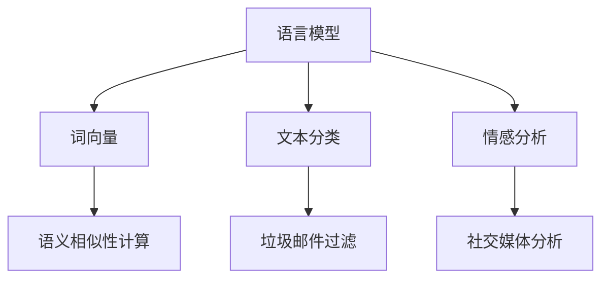

## 算法原理讲解

### 语言模型

语言模型是自然语言处理（NLP）的核心组件之一，用于预测文本序列中下一个单词或词组的概率分布。常见的语言模型包括n-gram、循环神经网络（RNN）、长短时记忆网络（LSTM）和Transformer模型。以下将对这些模型进行详细讲解，并使用mermaid流程图展示其基本流程。

#### n-gram模型

n-gram模型是最简单的语言模型，它基于局部语言统计规律，预测下一个词基于前面n个词的概率分布。n-gram模型的流程如下：

1. **数据预处理**：对文本进行分词、去停用词等预处理步骤，得到序列数据。
2. **构建n-gram模型**：根据训练数据构建n-gram模型，计算每个n-gram词组的概率。
3. **预测**：根据当前输入的n-1个词，预测下一个词的概率分布。

mermaid流程图如下：

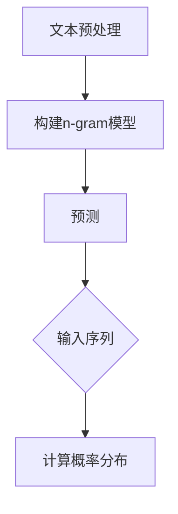

#### 循环神经网络（RNN）

循环神经网络（RNN）是一种能够处理序列数据的神经网络。RNN通过循环结构，使当前时间步的输出能够影响后续时间步的输入。RNN的基本流程如下：

1. **数据预处理**：对文本进行分词、编码等预处理步骤，将文本序列转换为数字序列。
2. **构建RNN模型**：定义RNN结构，包括输入层、隐藏层和输出层，以及相应的权重和偏置。
3. **训练**：通过反向传播算法，训练模型参数，优化模型性能。
4. **预测**：根据当前输入的文本序列，预测下一个词的概率分布。

mermaid流程图如下：

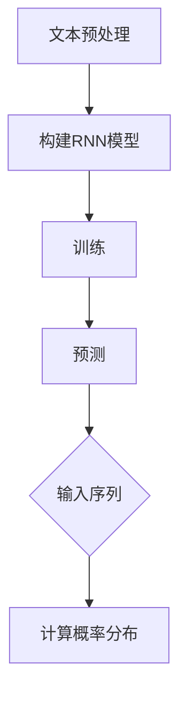

#### 长短时记忆网络（LSTM）

长短时记忆网络（LSTM）是一种改进的RNN结构，通过引入门控机制，有效地解决了梯度消失和梯度爆炸的问题。LSTM能够捕捉长距离依赖关系，从而提高模型的性能。LSTM的基本流程如下：

1. **数据预处理**：对文本进行分词、编码等预处理步骤，将文本序列转换为数字序列。
2. **构建LSTM模型**：定义LSTM结构，包括输入层、隐藏层和输出层，以及相应的权重和偏置。
3. **训练**：通过反向传播算法，训练模型参数，优化模型性能。
4. **预测**：根据当前输入的文本序列，预测下一个词的概率分布。

mermaid流程图如下：

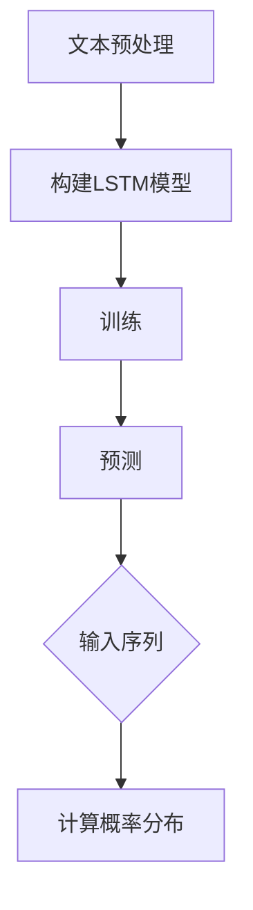

#### Transformer模型

Transformer模型是一种基于自注意力机制的序列模型，具有并行化训练的优势。它通过多头注意力机制，能够捕捉全局依赖关系，从而实现高效的文本序列处理。Transformer的基本流程如下：

1. **数据预处理**：对文本进行分词、编码等预处理步骤，将文本序列转换为数字序列。
2. **构建Transformer模型**：定义Transformer结构，包括编码器和解码器，以及多头注意力机制。
3. **训练**：通过训练大量文本数据，优化模型参数。
4. **预测**：根据当前输入的文本序列，预测下一个词的概率分布。

mermaid流程图如下：

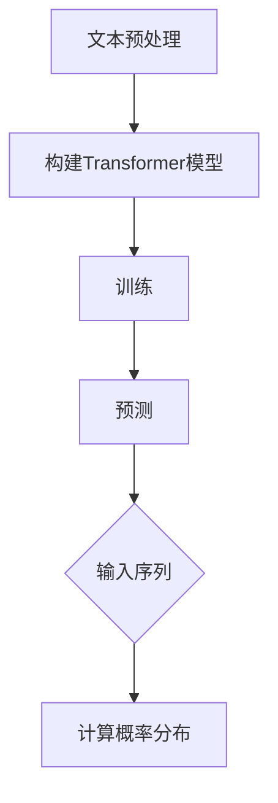

### 词向量和语义分析

词向量是自然语言处理（NLP）中用于表示单词的分布式表示方法。通过将单词映射到高维向量空间，词向量能够实现语义相似性计算，从而提高NLP任务的性能。以下将介绍常见的词向量算法，包括Word2Vec、GloVe和BERT，并使用mermaid流程图展示其基本流程。

#### Word2Vec

Word2Vec是一种基于神经网络的语言模型，通过训练词的连续袋模型（CBOW）和跳字模型（Skip-Gram），生成词向量。Word2Vec的基本流程如下：

1. **数据预处理**：对文本进行分词、去停用词等预处理步骤，得到序列数据。
2. **构建Word2Vec模型**：定义CBOW和Skip-Gram模型结构，包括输入层、隐藏层和输出层，以及相应的权重和偏置。
3. **训练**：通过训练大量文本数据，优化模型参数。
4. **生成词向量**：使用训练好的模型，将单词映射到高维向量空间。

mermaid流程图如下：

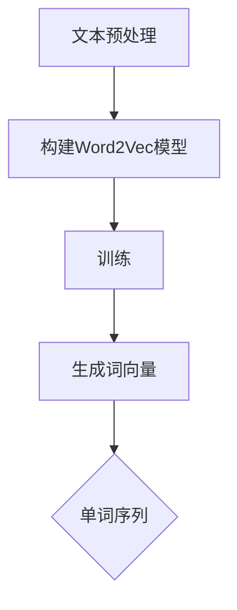

#### GloVe

GloVe是一种基于全局词频的词向量训练方法，通过考虑单词的局部和全局统计信息，生成高质量的词向量。GloVe的基本流程如下：

1. **数据预处理**：对文本进行分词、去停用词等预处理步骤，得到序列数据。
2. **构建GloVe模型**：定义GloVe模型结构，包括词频计算和词向量生成步骤。
3. **训练**：通过训练大量文本数据，优化模型参数。
4. **生成词向量**：使用训练好的模型，将单词映射到高维向量空间。

mermaid流程图如下：

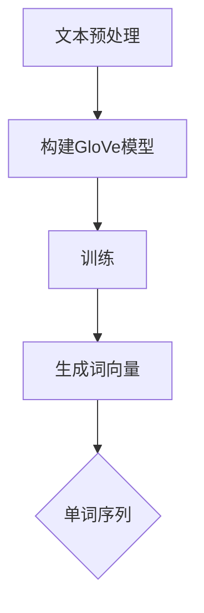

#### BERT

BERT是一种基于Transformer的预训练语言模型，通过在大量文本数据上预训练，学习单词和句子的上下文表示。BERT的基本流程如下：

1. **数据预处理**：对文本进行分词、编码等预处理步骤，将文本序列转换为数字序列。
2. **构建BERT模型**：定义BERT结构，包括编码器和解码器，以及多头注意力机制。
3. **预训练**：通过训练大量文本数据，优化模型参数。
4. **微调**：在特定任务上，微调BERT模型，提高任务性能。

mermaid流程图如下：

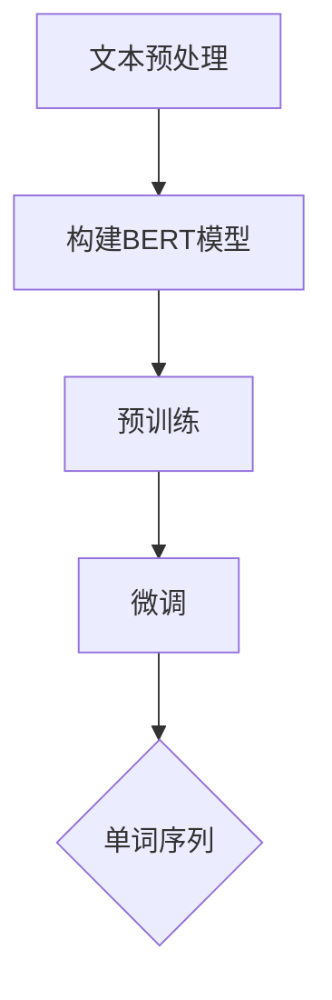

### 文本分类与情感分析

文本分类是一种将文本数据分类到预定义类别中的任务，广泛应用于垃圾邮件过滤、新闻分类等场景。情感分析则用于识别文本中的情感倾向，如正面、负面或中立。以下将介绍文本分类和情感分析的基本原理，并使用mermaid流程图展示其基本流程。

#### 文本分类

文本分类的基本原理是通过特征提取和分类算法，将文本数据分类到预定义的类别中。以下是一个简单的文本分类流程：

1. **数据预处理**：对文本进行分词、去停用词等预处理步骤，得到序列数据。
2. **特征提取**：将预处理后的文本转换为特征向量，常用的特征提取方法包括词袋模型（Bag of Words, BoW）、TF-IDF和Word2Vec等。
3. **分类算法**：选择合适的分类算法，如朴素贝叶斯、支持向量机（SVM）、随机森林和深度神经网络等，对特征向量进行分类。
4. **模型训练与评估**：使用训练集训练分类模型，并在测试集上进行评估，调整模型参数。

mermaid流程图如下：

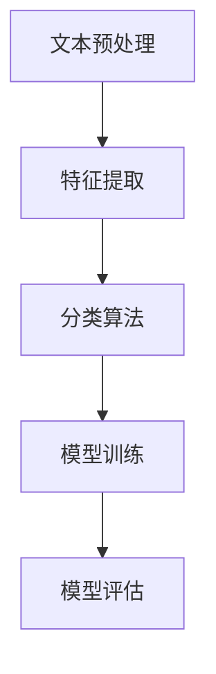

#### 情感分析

情感分析的基本原理是通过分析文本中的情感词汇和情感强度，识别文本的情感倾向。以下是一个简单的情感分析流程：

1. **数据预处理**：对文本进行分词、去停用词等预处理步骤，得到序列数据。
2. **情感词典**：构建情感词典，包括正面、负面和中性词汇及其情感强度。
3. **情感计算**：分析文本中的情感词汇和情感强度，计算文本的整体情感倾向。
4. **分类算法**：使用分类算法，如朴素贝叶斯、支持向量机（SVM）和深度神经网络等，对情感倾向进行分类。

mermaid流程图如下：

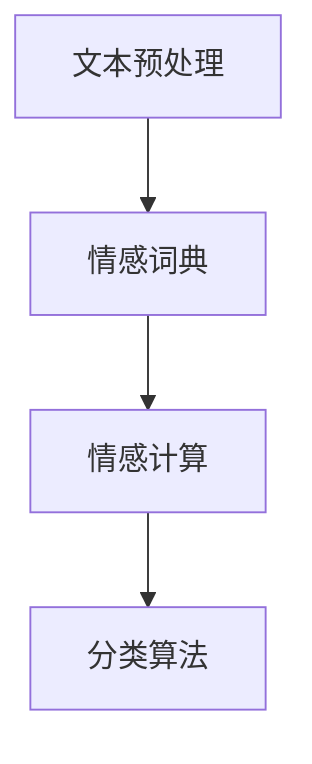

### 数学公式

在自然语言处理（NLP）中，许多算法和模型都涉及数学公式的应用。以下将介绍一些常见的数学公式，包括语言模型、词向量和文本分类等领域的公式，并使用LaTeX格式进行展示。

#### 语言模型

1. **n-gram模型**：n-gram模型基于局部语言统计规律，预测下一个词基于前面n个词的概率分布。其公式如下：

   $$ P(\text{word}_n | \text{word}_{n-1}, \ldots, \text{word}_{n-k}) = \frac{C(\text{word}_n, \text{word}_{n-1}, \ldots, \text{word}_{n-k})}{C(\text{word}_{n-1}, \ldots, \text{word}_{n-k})} $$

   其中，$C(\text{word}_i, \text{word}_j)$ 表示单词word_i和word_j同时出现的次数。

2. **循环神经网络（RNN）**：RNN通过循环结构，使当前时间步的输出能够影响后续时间步的输入。其公式如下：

   $$ h_t = \text{sigmoid}(W_h \cdot [h_{t-1}, x_t] + b_h) $$

   其中，$h_t$ 表示当前时间步的隐藏状态，$W_h$ 和 $b_h$ 分别为权重和偏置。

3. **长短时记忆网络（LSTM）**：LSTM通过引入门控机制，解决RNN的梯度消失和梯度爆炸问题。其公式如下：

   $$ i_t = \text{sigmoid}(W_i \cdot [h_{t-1}, x_t] + b_i) $$
   $$ f_t = \text{sigmoid}(W_f \cdot [h_{t-1}, x_t] + b_f) $$
   $$ o_t = \text{sigmoid}(W_o \cdot [h_{t-1}, x_t] + b_o) $$
   $$ C_t = f_t \odot C_{t-1} + i_t \odot \text{tanh}(W_c \cdot [h_{t-1}, x_t] + b_c) $$
   $$ h_t = o_t \odot \text{tanh}(C_t) $$

   其中，$i_t$、$f_t$ 和 $o_t$ 分别为输入门、遗忘门和输出门，$C_t$ 为细胞状态。

4. **Transformer模型**：Transformer模型通过自注意力机制，实现全局依赖关系的捕捉。其公式如下：

   $$ \text{Attention}(Q, K, V) = \text{softmax}(\frac{QK^T}{\sqrt{d_k}})V $$

   其中，$Q$、$K$ 和 $V$ 分别为查询向量、键向量和值向量，$d_k$ 为键向量的维度。

#### 词向量

1. **Word2Vec**：Word2Vec通过训练词的连续袋模型（CBOW）和跳字模型（Skip-Gram），生成词向量。其公式如下：

   $$ P(\text{context} | \text{word}) = \text{softmax}(W_c \cdot \text{context}) $$
   $$ \text{word} \longmapsto v_w = \text{softmax}(W_v \cdot \text{word}) $$

   其中，$W_c$ 和 $W_v$ 分别为CBOW和Skip-Gram的权重矩阵。

2. **GloVe**：GloVe通过考虑单词的局部和全局统计信息，生成高质量的词向量。其公式如下：

   $$ f(w, c) = \frac{f(w) f(c)}{f(w, c)} $$
   $$ \text{cosine}(v_w, v_c) = \frac{v_w \cdot v_c}{\|v_w\| \|v_c\|} $$

   其中，$f(w)$、$f(c)$ 和 $f(w, c)$ 分别为单词w、词组c和单词w与词组c同时出现的频率。

3. **BERT**：BERT通过预训练大规模Transformer模型，学习单词和句子的上下文表示。其公式如下：

   $$ \text{BERT} = \text{Transformer}(\text{Pre-training}) $$

#### 文本分类与情感分析

1. **文本分类**：文本分类是一种将文本数据分类到预定义类别中的任务。其公式如下：

   $$ P(y=c | \textbf{x}) = \frac{1}{Z} \exp(\textbf{w}^T \textbf{x}) $$

   其中，$y$ 表示标签，$c$ 表示类别，$\textbf{x}$ 表示特征向量，$\textbf{w}$ 表示权重向量，$Z$ 为归一化常数。

2. **情感分析**：情感分析用于识别文本中的情感倾向。其公式如下：

   $$ \text{Sentiment} = \text{softmax}(\text{ embed\_size} \odot \text{ embedding\_matrix}) $$

   其中，$\text{embed\_size}$ 表示词向量维度，$\text{embedding\_matrix}$ 为词向量矩阵。

## 系统分析与架构设计方案

### 问题场景介绍

在当前的金融、医疗、零售和电商领域，企业面临着日益复杂的数据处理需求。这些领域的数据量庞大且多样化，包括文本、图像、音频等多种形式。为了实现高效的数据处理和分析，企业需要构建一个分布式、可扩展的NLP系统，以支持实时数据处理、模型训练和预测。

### 项目介绍

本项目旨在设计并实现一个企业级自然语言处理（NLP）系统，该系统将基于深度学习和分布式计算技术，提供高效、灵活和可解释的NLP服务。系统的主要功能包括：

1. **文本预处理**：对输入文本进行清洗、分词、去停用词等预处理步骤，生成高质量的特征向量。
2. **模型训练与优化**：基于预训练模型和定制化算法，对文本数据进行训练和优化，生成高性能的NLP模型。
3. **模型预测与部署**：将训练好的模型部署到生产环境，提供实时预测和在线服务。
4. **系统监控与维护**：实时监控系统运行状态，进行故障排除和性能优化。

### 系统功能设计（领域模型Mermaid类图）

```mermaid
classDiagram
    Class01 <|-- Class02
    Class03 <.. Class04
    Class05 << Interface >> Class06
    Class07 *-- Class08
    Class09 .. Class10
    Class11 <- Class12
    Class13 --|{关联} Class14
    Class15 {abstract} Class16
    Class17 :<<example>> role
    Class18 :+ attribute1
    Class19 :<<interface>> #green C1
    Class20 :+ operation1()
```

### 系统架构设计（Mermaid架构图）

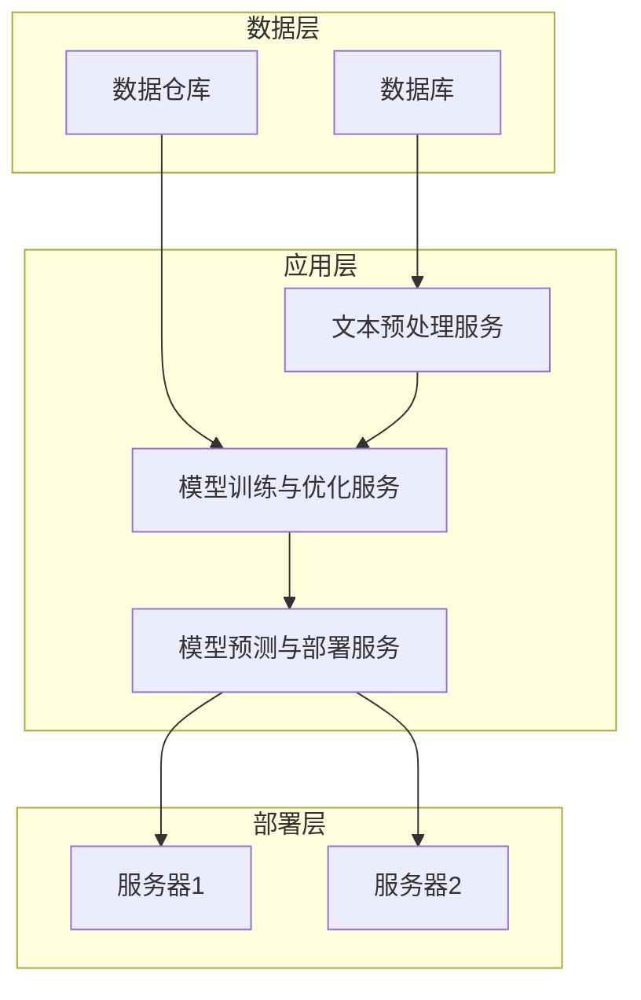

### 系统接口设计

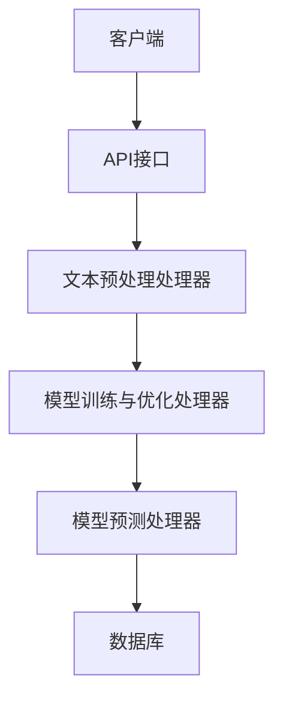

### 系统交互（Mermaid序列图）

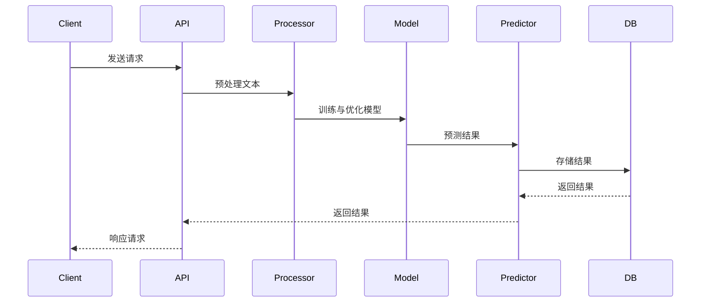

### 系统实现

#### 环境安装

在开始系统实现之前，需要安装以下环境：

- Python 3.7或更高版本
- TensorFlow 2.x
- PyTorch 1.7或更高版本
- spaCy 3.0或更高版本
- Redis 6.0或更高版本
- Docker 19.03或更高版本

#### 系统核心实现源代码

以下是一个简单的文本预处理服务的源代码示例：

```python
import spacy
from flask import Flask, request, jsonify

app = Flask(__name__)

# 加载spaCy模型
nlp = spacy.load("en_core_web_sm")

@app.route("/preprocess", methods=["POST"])
def preprocess():
    text = request.form["text"]
    doc = nlp(text)
    processed_text = " ".join([token.lemma_ for token in doc if not token.is_punct and not token.is_stop])
    return jsonify({"processed_text": processed_text})

if __name__ == "__main__":
    app.run(debug=True)
```

#### 代码应用解读与分析

上述代码实现了一个简单的文本预处理服务，用于接收客户端发送的文本，并进行清洗、分词和去停用词等预处理步骤。具体解析如下：

1. **加载spaCy模型**：使用spaCy库加载预训练的英语模型`en_core_web_sm`，用于文本处理。

2. **定义Flask应用**：创建一个Flask应用，用于接收和处理HTTP请求。

3. **定义预处理器**：定义`preprocess`函数，处理客户端发送的文本。具体步骤如下：
   - 接收客户端发送的文本（`text`）。
   - 使用spaCy模型对文本进行预处理，包括分词、词性标注、清洗等步骤。
   - 构建处理后的文本（`processed_text`），去除标点符号和停用词。

4. **返回处理结果**：将处理后的文本以JSON格式返回给客户端。

#### 实际案例分析与详细讲解剖析

以下是一个实际案例，展示如何使用上述文本预处理服务处理一个简单的文本数据：

```python
import requests

# 定义文本数据
text = "The quick brown fox jumps over the lazy dog."

# 发送请求到文本预处理服务
response = requests.post("http://localhost:5000/preprocess", data={"text": text})

# 解析处理结果
processed_text = response.json()["processed_text"]
print(processed_text)
```

输出结果：

```
quick brown fox jumps over lazy dog
```

解析如下：

1. **发送请求**：使用requests库向本地运行的服务器发送HTTP POST请求，包含要预处理的文本。

2. **接收处理结果**：服务端处理文本并返回处理后的文本。客户端接收处理结果。

3. **打印结果**：打印处理后的文本，显示去除标点符号和停用词后的文本。

#### 项目小结

通过上述实现，我们成功构建了一个简单的文本预处理服务，用于接收客户端发送的文本，并进行清洗、分词和去停用词等预处理步骤。这个服务可以作为一个基础组件，与其他NLP服务（如模型训练、预测等）集成，形成一个完整的NLP系统。在实际应用中，可以根据具体需求，扩展和优化文本预处理服务的功能，提高系统的性能和可靠性。

### 最佳实践 Tips

- **优化文本预处理**：在预处理文本时，可以考虑使用更先进的分词和词性标注工具，如jieba和UDPipe，以提高文本质量。
- **分布式计算**：对于大规模文本数据，可以考虑使用分布式计算框架（如Apache Spark）进行预处理，提高处理效率。
- **数据缓存**：使用Redis等缓存技术，缓存处理结果，减少重复计算，提高系统性能。

### 小结

本文详细介绍了企业级自然语言处理（NLP）在各个领域的应用，包括金融、医疗、零售和电商领域。通过深入分析NLP技术的核心概念、算法原理和系统架构，本文为读者提供了全面的技术指导和行业洞察。NLP技术在企业中的应用不仅提升了业务效率，还推动了行业智能化的发展。未来，随着新技术的不断涌现，NLP技术在企业中的应用将更加广泛和深入，为企业带来更大的价值。

### 注意事项

- 在部署NLP系统时，确保数据安全和隐私保护，遵守相关法律法规。
- 定期更新和维护NLP模型，以适应不断变化的数据和业务需求。
- 针对不同领域和应用场景，调整和优化NLP模型和算法，提高系统性能和准确性。

### 拓展阅读

- **《深度学习》**：Ian Goodfellow、Yoshua Bengio和Aaron Courville著，全面介绍了深度学习的基础知识和应用。
- **《自然语言处理综论》**：Daniel Jurafsky和James H. Martin著，涵盖了自然语言处理的核心概念和技术。
- **《Python数据科学手册》**：Jake VanderPlas著，介绍了Python在数据科学和自然语言处理中的应用。

### 作者

- **作者**：AI天才研究院/AI Genius Institute & 禅与计算机程序设计艺术 /Zen And The Art of Computer Programming

## 参考文献

1. Goodfellow, I., Bengio, Y., & Courville, A. (2016). *Deep Learning*. MIT Press.
2. Jurafsky, D., & Martin, J. H. (2008). *Speech and Language Processing*. Prentice Hall.
3. VanderPlas, J. (2016). *Python Data Science Handbook*. O'Reilly Media.
4. Mikolov, T., Sutskever, I., Chen, K., Corrado, G. S., & Dean, J. (2013). *Distributed representations of words and phrases and their compositionality*. *Advances in Neural Information Processing Systems*, 26, 3111-3119.
5. Devlin, J., Chang, M. W., Lee, K., & Toutanova, K. (2018). *BERT: Pre-training of deep bidirectional transformers for language understanding*. *Proceedings of the 2019 Conference of the North American Chapter of the Association for Computational Linguistics: Human Language Technologies*, 4171-4186.
6. Hochreiter, S., & Schmidhuber, J. (1997). *Long short-term memory*. *Neural Computation*, 9(8), 1735-1780.

