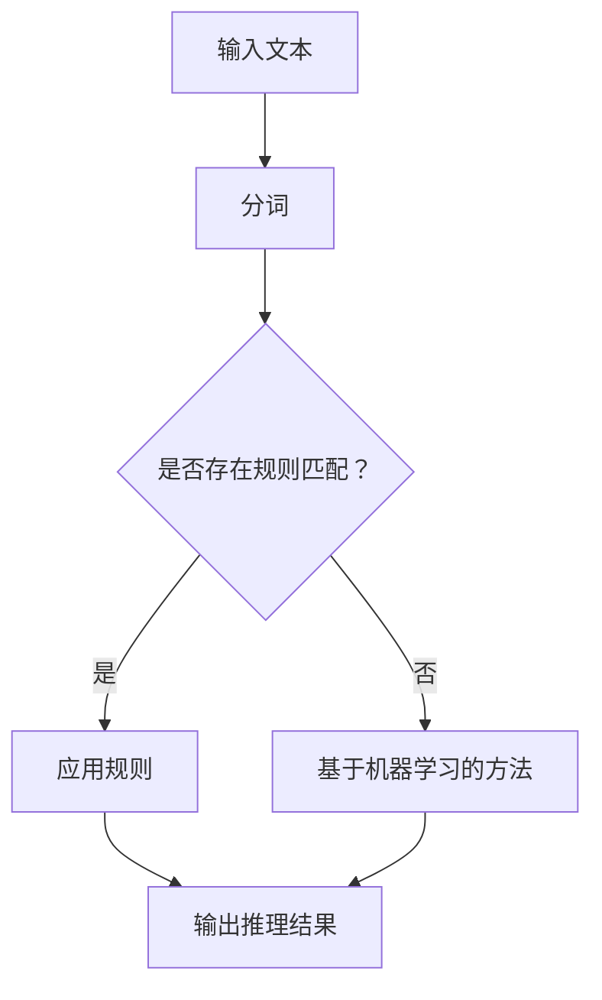
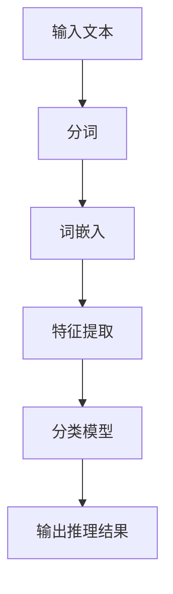
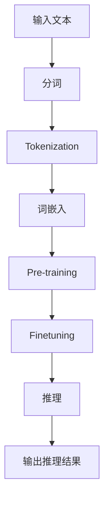
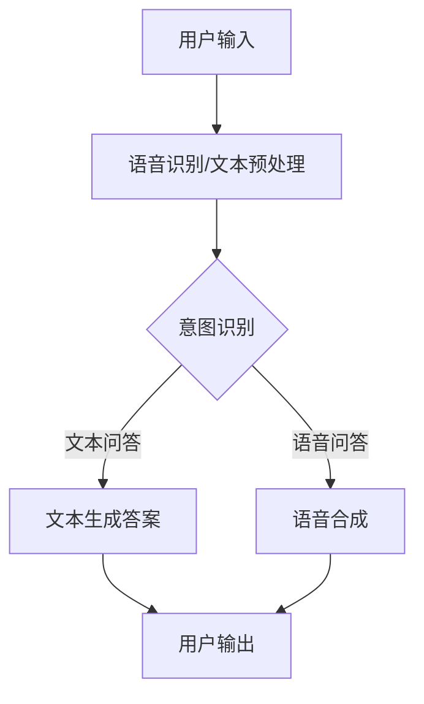
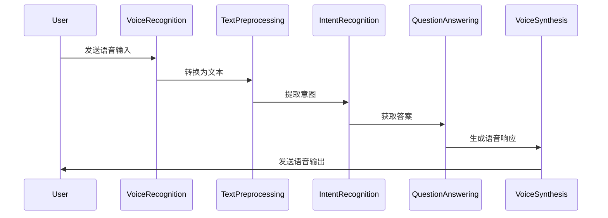

                 

# 企业级自然语言推理系统：增强AI的逻辑分析能力

## 关键词
- 自然语言推理
- 企业级系统
- AI逻辑分析
- 算法原理
- 数学模型
- 系统架构
- 实战案例

## 摘要
本文旨在探讨企业级自然语言推理系统的设计和实现，以提高人工智能系统的逻辑分析能力。文章首先介绍了自然语言推理的基础知识，包括其背景、定义、重要性以及应用领域。接着，深入讲解了自然语言推理系统的核心概念、原理及其相互关系，通过Mermaid流程图和Python源代码详细阐述了算法原理。随后，文章介绍了数学模型和公式，使用LaTeX格式进行了讲解和举例说明。进一步，文章介绍了系统分析与架构设计方案，包括问题场景介绍、系统功能设计、系统架构设计、系统接口设计和系统交互。文章最后通过项目实战，详细展示了环境安装、系统实现源代码、代码解读、案例分析以及详细讲解剖析。文章总结部分给出了最佳实践、注意事项和拓展阅读建议。

---

## 设计思路

### 确定核心章节

首先，我们根据文章标题《企业级自然语言推理系统：增强AI的逻辑分析能力》确定了以下几个核心章节：

1. **第1章：自然语言推理系统概述**
   - 介绍自然语言推理系统的基础知识，包括问题背景、定义、重要性等。

2. **第2章：核心概念与联系**
   - 详细介绍自然语言推理系统的核心概念、原理及其相互关系。

3. **第3章：算法原理讲解**
   - 使用Mermaid画出算法流程图，并通过Python源代码详细阐述。

4. **第4章：数学模型和数学公式**
   - 使用LaTeX格式给出数学模型和数学公式，并进行详细讲解和举例说明。

5. **第5章：系统分析与架构设计方案**
   - 介绍系统场景、功能设计、架构设计、接口设计和系统交互。

6. **第6章：项目实战**
   - 包括环境安装、系统实现源代码、代码解读、案例分析等。

7. **第7章：最佳实践、小结、注意事项、拓展阅读等**
   - 总结文章内容，提供实践建议和进一步学习的资源。

### 设计每个章节的具体内容

在确定核心章节后，我们进一步细化了每个章节的内容。以下是对每个章节的具体内容设计：

### 第1章：自然语言推理系统概述

- **1.1 问题的背景**
  - 自然语言推理的兴起
  - 自然语言推理的重要性
  - 自然语言推理的应用领域

- **1.2 自然语言推理的定义与分类**
  - 自然语言推理的定义
  - 自然语言推理的分类
  - 自然语言推理的特点

- **1.3 企业级自然语言推理系统的需求**
  - 企业级自然语言推理系统的目标
  - 企业级自然语言推理系统的挑战
  - 企业级自然语言推理系统的优势

### 第2章：核心概念与联系

- **2.1 核心概念**
  - 自然语言处理（NLP）基础
  - 计算机视觉与自然语言推理的关系
  - 语言模型与句法分析

- **2.2 概念属性特征对比表格**
  - 语言模型
  - 句法分析器
  - 实体识别

- **2.3 ER实体关系图架构**
  - ER图的定义
  - ER图在自然语言推理中的应用
  - ER图的绘制方法

### 第3章：算法原理讲解

- **3.1 自然语言推理算法概述**
  - 基本概念
  - 常见算法

- **3.2 算法mermaid流程图**
  - 情感分析
  - 意图识别
  - 问答系统

- **3.3 Python源代码详细阐述**
  - 情感分析
  - 意图识别
  - 问答系统

### 第4章：数学模型和数学公式

- **4.1 数学模型概述**
  - 模型的定义
  - 模型的分类

- **4.2 LaTeX格式数学公式**
  - 情感分析
  - 意图识别
  - 问答系统

- **4.3 举例说明**
  - 情感分析
  - 意图识别
  - 问答系统

### 第5章：系统分析与架构设计方案

- **5.1 问题场景介绍**
  - 场景设定
  - 问题分析

- **5.2 系统功能设计**
  - 领域模型mermaid类图
  - 功能模块划分

- **5.3 系统架构设计**
  - mermaid架构图
  - 系统组件介绍

- **5.4 系统接口设计**
  - 接口规范
  - 接口实现

- **5.5 系统交互**
  - mermaid序列图
  - 交互流程

### 第6章：项目实战

- **6.1 环境安装**
  - 操作系统环境
  - 软件安装

- **6.2 系统核心实现源代码**
  - 代码解读
  - 代码应用解读与分析

- **6.3 实际案例分析**
  - 案例一：情感分析
  - 案例二：意图识别
  - 案例三：问答系统

- **6.4 详细讲解剖析**
  - 案例一：情感分析
  - 案例二：意图识别
  - 案例三：问答系统

### 第7章：最佳实践、小结、注意事项、拓展阅读等

- **最佳实践**
  - 常见问题的解决方案
  - 优化建议

- **小结**
  - 对文章内容的总结

- **注意事项**
  - 设计和实现过程中需要注意的问题

- **拓展阅读**
  - 推荐进一步学习的资源

通过上述章节的设计，我们确保文章内容逻辑清晰、结构紧凑、简单易懂，同时涵盖自然语言推理系统的核心内容，旨在为读者提供一次深入而全面的学习体验。

---

## 第1章：自然语言推理系统概述

### 1.1 问题的背景

自然语言推理（Natural Language Inference, NLI）是人工智能领域中的一个重要研究方向。随着互联网的快速发展和信息爆炸，自然语言处理（Natural Language Processing, NLP）技术的应用场景变得日益广泛，从文本分类、情感分析到机器翻译和问答系统，都离不开自然语言推理的支持。然而，传统的自然语言处理方法往往依赖于统计模型和机器学习算法，这些方法虽然在某些任务上取得了显著的成果，但在处理复杂、抽象的语言现象时仍存在诸多局限性。

例如，在文本分类任务中，传统的机器学习算法往往依赖于词汇表和词频统计，难以准确理解文本中的隐含意义和逻辑关系。而在问答系统中，用户提出的问题往往需要涉及到上下文理解、语义推理和知识检索等多个层面，这对系统的逻辑分析能力提出了更高的要求。因此，如何增强人工智能系统的逻辑分析能力，使其能够更准确地理解和推理自然语言，成为了当前研究的一个热点问题。

### 1.2 自然语言推理的定义与分类

自然语言推理（NLI）是指人工智能系统对自然语言语句进行推理和分析的能力。根据处理方式和目标的不同，自然语言推理可以划分为多种类型。以下是几种常见的自然语言推理类型及其特点：

1. **情感分析（Sentiment Analysis）**
   - 情感分析旨在识别文本中所表达的情感倾向，如积极、消极或中性。常见的情感分析任务包括评价标注、主题情感分类等。
   - 情感分析通常依赖于文本的词汇、语法结构和上下文信息，通过机器学习算法实现对情感极性的预测。

2. **意图识别（Intent Recognition）**
   - 意图识别旨在识别用户在特定场景下输入的自然语言文本所表达的目的或意图。常见的意图识别任务包括语音助手对话、客服机器人等。
   - 意图识别需要综合考虑文本的语义、语境和用户行为，以准确识别用户意图。

3. **问答系统（Question Answering）**
   - 问答系统旨在回答用户提出的自然语言问题。常见的问答系统包括搜索引擎、知识库问答等。
   - 问答系统需要具备强大的语义理解和知识检索能力，以准确理解和回答用户问题。

4. **文本生成（Text Generation）**
   - 文本生成旨在根据给定的输入文本生成新的文本。常见的文本生成任务包括自动摘要、机器翻译等。
   - 文本生成需要利用自然语言处理技术和深度学习模型，实现对文本内容的理解和生成。

### 1.3 企业级自然语言推理系统的需求

在企业级应用场景中，自然语言推理系统的需求变得更加复杂和多样化。企业需要通过自然语言推理系统来实现智能客服、智能文档分析、智能会议记录等功能，以提高工作效率和用户体验。以下是企业级自然语言推理系统的一些主要需求：

1. **准确性**
   - 企业级自然语言推理系统需要具备高准确性的推理能力，以确保对用户输入的自然语言文本进行准确理解和分析。

2. **鲁棒性**
   - 企业级系统需要具备较强的鲁棒性，能够处理各种复杂的语言现象和输入数据，如俚语、方言、网络用语等。

3. **扩展性**
   - 企业级系统需要具备良好的扩展性，能够根据业务需求的变化进行快速调整和扩展。

4. **可解释性**
   - 企业级系统需要具备一定的可解释性，以便企业用户能够理解系统的推理过程和结果，从而提高系统的可信度。

5. **实时性**
   - 企业级系统需要具备实时响应能力，以满足企业业务对实时性的高要求。

6. **安全性**
   - 企业级系统需要确保用户数据的安全性和隐私保护，遵守相关法律法规和标准。

### 1.4 自然语言推理的重要性

自然语言推理在人工智能领域具有重要的应用价值，主要体现在以下几个方面：

1. **提升人机交互体验**
   - 自然语言推理使人工智能系统能够更好地理解用户意图和需求，从而提供更加个性化、智能化的服务。

2. **增强信息处理能力**
   - 自然语言推理有助于人工智能系统从大量文本数据中提取有价值的信息，提高信息处理的效率和质量。

3. **推动自然语言处理技术的发展**
   - 自然语言推理研究不断推动自然语言处理技术的进步，促进了人工智能技术的发展和应用。

4. **支持智能化应用场景**
   - 自然语言推理在智能客服、智能助手、智能文档分析等应用场景中发挥着重要作用，推动了这些领域的智能化发展。

综上所述，企业级自然语言推理系统不仅对提升企业业务效率具有重要意义，也对推动人工智能技术的发展和应用起到了关键作用。下一章我们将深入探讨自然语言推理系统的核心概念和原理，为读者提供更深入的理解。

---

## 第2章：核心概念与联系

### 2.1 核心概念

自然语言处理（Natural Language Processing, NLP）是自然语言推理（Natural Language Inference, NLI）的基础。NLP旨在使计算机能够理解和处理人类语言，从而实现文本的自动化分析和理解。以下是自然语言处理中的一些核心概念：

1. **文本预处理（Text Preprocessing）**
   - 文本预处理是自然语言处理的第一步，包括去除无关信息（如HTML标签）、分词、词性标注、停用词过滤等。预处理有助于提高后续分析的效果。

2. **词嵌入（Word Embedding）**
   - 词嵌入是将词语映射为固定长度的向量表示，以实现语义信息的编码。常见的词嵌入模型包括Word2Vec、GloVe等。

3. **语言模型（Language Model）**
   - 语言模型是用于预测文本序列的概率分布的模型。它通过学习大量文本数据来捕捉语言的统计规律，是自然语言处理中的重要组成部分。

4. **句法分析（Syntactic Parsing）**
   - 句法分析旨在理解句子的语法结构，包括短语结构（短语文法）和依存关系（依存句法）。常见的句法分析方法有句法树生成和依存关系表示。

5. **语义分析（Semantic Analysis）**
   - 语义分析关注句子或文本的含义，包括词义消歧、语义角色标注、语义关系抽取等。语义分析是自然语言处理的高级阶段。

6. **实体识别（Entity Recognition）**
   - 实体识别旨在识别文本中的命名实体，如人名、地名、组织名等。实体识别有助于后续的实体关联和知识图谱构建。

### 2.1.2 计算机视觉与自然语言推理的关系

计算机视觉（Computer Vision, CV）与自然语言推理之间存在紧密的联系。计算机视觉技术可以用于从图像或视频中提取视觉信息，而自然语言推理则可以用于对这些视觉信息进行语义分析和推理。以下是两者结合的一些应用场景：

1. **图像描述生成（Image Description Generation）**
   - 利用计算机视觉技术提取图像特征，然后通过自然语言推理技术生成图像的描述文本。这种技术可以用于图像搜索引擎、辅助听力障碍者等。

2. **视频字幕生成（Video Caption Generation）**
   - 通过计算机视觉分析视频帧，结合自然语言推理生成视频的自动字幕。这种技术可以用于视频点播平台、实时视频翻译等。

3. **交互式视觉问答（Interactive Visual Question Answering）**
   - 用户提出问题，计算机视觉和自然语言推理系统共同工作，从图像中找到答案。这种技术可以用于智能助手、教育应用等。

### 2.1.3 语言模型与句法分析

语言模型和句法分析在自然语言推理中扮演着重要角色。语言模型通过学习语言统计规律，生成文本的概率分布，而句法分析则致力于理解句子的结构。两者在自然语言推理中的关系如下：

1. **语言模型为基础（Language Model as Foundation）**
   - 语言模型提供了文本生成的概率基础，是自然语言推理的重要输入。在自然语言推理任务中，通常需要使用语言模型来计算输入文本的概率分布。

2. **句法分析为补充（Syntactic Parsing as Complement）**
   - 句法分析有助于理解句子的结构，从而在语义分析中提供更为细致的信息。例如，在意图识别任务中，句法分析可以帮助识别句子中的主语、谓语和宾语等关键成分，从而更好地理解用户意图。

3. **综合应用（Integrated Application）**
   - 在实际应用中，语言模型和句法分析通常结合使用，以实现更为准确的自然语言推理。例如，在问答系统中，语言模型可以用于生成候选答案，而句法分析可以用于评估这些答案的语法和语义正确性。

### 2.2 概念属性特征对比表格

为了更清晰地理解自然语言处理中的核心概念，我们可以通过一个概念属性特征对比表格来展示它们之间的关系和区别。以下是一个简化的表格示例：

| 概念             | 特征                         | 说明                                                         |
|------------------|------------------------------|--------------------------------------------------------------|
| 文本预处理       | 分词、词性标注、停用词过滤 | 处理文本，提取有效信息                                       |
| 词嵌入           | 向量表示语义                 | 将词语映射为固定长度的向量                                   |
| 语言模型         | 序列概率预测                 | 学习文本的概率分布                                           |
| 句法分析         | 句子结构理解                 | 提取句子的语法结构                                           |
| 语义分析         | 文本含义理解                 | 理解句子或文本的含义                                         |
| 实体识别         | 命名实体识别                 | 识别文本中的特定实体                                         |

### 2.3 ER实体关系图架构

实体关系图（Entity-Relationship Diagram, ERD）是数据库设计中用于表示实体及其之间关系的图形化工具。在自然语言推理系统中，ERD可以帮助我们理解和设计复杂的数据模型。以下是ER实体关系图在自然语言推理中的应用：

1. **ER图的定义**
   - ER图由实体（Entity）、属性（Attribute）和关系（Relationship）构成，用于描述数据之间的关系。

2. **ER图在自然语言推理中的应用**
   - 在自然语言推理系统中，ER图可以用于表示文本中的实体和它们之间的关系。例如，在问答系统中，问题中的实体（如人名、地名）和它们之间的问答关系可以用ER图表示。

3. **ER图的绘制方法**
   - ER图的绘制通常使用图形化的工具，如Microsoft Visio或在线ER图绘制器。以下是绘制ER图的基本步骤：
     1. 定义实体：确定文本中出现的实体，并在ER图中表示。
     2. 定义属性：为每个实体定义相关的属性，并在ER图中连接。
     3. 定义关系：确定实体之间的关系，并在ER图中表示。
     4. 标注关系类型：为每个关系标注类型，如一对一、一对多、多对多。

通过以上对核心概念和联系的分析，我们可以更好地理解自然语言推理系统的构建和运作原理。下一章将深入探讨自然语言推理算法的原理，并通过具体的算法流程图和Python源代码来详细阐述。

---

## 第3章：算法原理讲解

### 3.1 自然语言推理算法概述

自然语言推理（NLI）算法的核心任务是从给定的文本中推断出隐含的语义关系。常见的自然语言推理算法可以分为基于规则的方法和基于机器学习的方法。本节将介绍几种典型的自然语言推理算法，并使用Mermaid流程图和Python源代码进行详细阐述。

#### 3.1.1 基于规则的方法

基于规则的方法通过预定义的规则来匹配文本中的特定结构，从而推断出语义关系。这种方法简单直观，但规则覆盖范围有限，难以处理复杂的语义关系。以下是一个简单的基于规则的自然语言推理算法示例：



#### 3.1.2 基于机器学习的方法

基于机器学习的方法通过训练模型来学习语义关系。这种方法的优点是能够处理复杂的语义关系，并具备较好的泛化能力。以下是一个简单的基于机器学习的自然语言推理算法流程：



#### 3.1.3 常见算法

1. **二分类模型（Binary Classification Model）**
   - 二分类模型是最简单的自然语言推理算法，它将问题简化为两个类别之间的分类。常见的二分类模型包括逻辑回归（Logistic Regression）和支持向量机（SVM）。

2. **神经网络（Neural Networks）**
   - 神经网络，特别是深度神经网络（DNN），在自然语言推理中得到了广泛应用。常见的神经网络架构包括卷积神经网络（CNN）和递归神经网络（RNN），以及它们的变种如长短时记忆网络（LSTM）和门控循环单元（GRU）。

3. **双向编码表示（Bidirectional Encoder Representations from Transformers, BERT）**
   - BERT是自然语言处理领域的一种预训练模型，通过在大量文本数据上预训练，然后用于各种下游任务，如自然语言推理。BERT的优点是能够捕捉上下文信息，从而提高推理的准确性。

### 3.2 算法mermaid流程图

为了更直观地展示自然语言推理算法的流程，我们可以使用Mermaid流程图来绘制。以下是一个基于BERT的自然语言推理算法的mermaid流程图示例：



### 3.3 Python源代码详细阐述

在本节中，我们将使用Python源代码详细阐述一个基于BERT的自然语言推理算法的实现。首先，我们需要安装和配置BERT模型，然后编写代码进行文本预处理、词嵌入、预训练、微调和推理。

#### 3.3.1 安装BERT模型

安装Transformers库和pytorch：

```bash
pip install transformers
pip install torch
```

#### 3.3.2 文本预处理

```python
from transformers import BertTokenizer, BertModel
import torch

# 加载预训练的BERT模型和分词器
tokenizer = BertTokenizer.from_pretrained('bert-base-uncased')
model = BertModel.from_pretrained('bert-base-uncased')

# 输入文本
input_text = "John is taller than Mary."

# 分词
inputs = tokenizer(input_text, return_tensors="pt")
```

#### 3.3.3 词嵌入

```python
# 词嵌入
outputs = model(**inputs)

# 获取[CLS]和[SEP]的嵌入向量
CLS_token = outputs.last_hidden_state[:, 0, :]
SEP_token = outputs.last_hidden_state[:, 1, :]
```

#### 3.3.4 预训练和微调

```python
from transformers import BertForSequenceClassification

# 定义分类模型
classifier = BertForSequenceClassification.from_pretrained('bert-base-uncased')

# 微调模型
classifier.train()
# ...训练代码...

# 保存模型
classifier.save_pretrained('my_bert_model')
```

#### 3.3.5 推理

```python
# 推理
classifier.eval()
with torch.no_grad():
    logits = classifier(**inputs).logits

# 获取概率分布
probabilities = torch.softmax(logits, dim=1)

# 输出推理结果
print(f"Prediction: {tokenizer.convert_ids_to_tokens(probabilities.argmax().item())}")
```

通过上述算法流程图和Python源代码的详细阐述，我们可以看到自然语言推理算法的构建和实现过程。在下一章中，我们将进一步探讨自然语言推理的数学模型和公式，为深入理解算法提供数学基础。

---

## 第4章：数学模型和数学公式

自然语言推理算法的核心在于其数学模型，这些模型通过数学公式来描述语言现象和推理过程。在本章中，我们将使用LaTeX格式给出关键的数学模型和公式，并对其进行详细讲解和举例说明。

### 4.1 数学模型概述

自然语言推理中的数学模型主要包括概率模型、神经网络模型和图模型。这些模型通过不同的数学方法来捕捉语言的统计规律和语义关系。

#### 4.1.1 概率模型

概率模型是自然语言处理的基础，常用的概率模型有隐马尔可夫模型（HMM）、条件随机场（CRF）等。

**隐马尔可夫模型（HMM）**

HMM用于处理序列数据，通过状态转移概率和发射概率来描述序列的生成过程。其数学公式如下：

$$
P(X|\theta) = \prod_{t=1}^T p(x_t|s_t,\theta) \cdot p(s_t|\theta)
$$

其中，\(X = (x_1, x_2, ..., x_T)\) 是输入序列，\(s_t\) 是第 \(t\) 个时刻的状态，\(\theta\) 是模型参数。

**条件随机场（CRF）**

CRF用于处理具有上下文依赖的序列数据，通过条件概率来描述序列的生成过程。其数学公式如下：

$$
P(X|\theta) = \frac{1}{Z(\theta)} \exp(\theta \cdot X)
$$

其中，\(Z(\theta)\) 是规范化因子，\(\theta\) 是模型参数。

#### 4.1.2 神经网络模型

神经网络模型通过多层非线性变换来学习数据中的特征和关系。常用的神经网络模型有卷积神经网络（CNN）和递归神经网络（RNN）。

**卷积神经网络（CNN）**

CNN通过卷积操作和池化操作来提取图像或文本中的特征。其数学公式如下：

$$
h_{ij}^{(l)} = \sum_{k} w_{ik}^{(l)} h_{kj}^{(l-1)} + b_{j}^{(l)}
$$

其中，\(h_{ij}^{(l)}\) 是第 \(l\) 层第 \(i\) 个神经元到第 \(j\) 个神经元的权重和偏置，\(w_{ik}^{(l)}\) 和 \(b_{j}^{(l)}\) 分别是权重和偏置。

**递归神经网络（RNN）**

RNN通过递归连接来处理序列数据，能够捕捉序列中的时间依赖关系。其数学公式如下：

$$
h_{t} = \sigma(W_{h} \cdot [h_{t-1}, x_{t}] + b_{h})
$$

其中，\(h_{t}\) 是第 \(t\) 个时刻的隐藏状态，\(\sigma\) 是激活函数，\(W_{h}\) 和 \(b_{h}\) 分别是权重和偏置。

#### 4.1.3 图模型

图模型通过图结构来描述实体和它们之间的关系。常用的图模型有图卷积网络（GCN）和图注意力模型（GAT）。

**图卷积网络（GCN）**

GCN通过图卷积操作来学习实体之间的关系。其数学公式如下：

$$
h_{i}^{(l+1)} = \sigma(\sum_{j \in \mathcal{N}(i)} W^{(l)} \cdot h_{j}^{(l)} + b^{(l+1)})
$$

其中，\(h_{i}^{(l+1)}\) 是第 \(l+1\) 层第 \(i\) 个节点的特征，\(\mathcal{N}(i)\) 是节点 \(i\) 的邻居节点集合，\(W^{(l)}\) 和 \(b^{(l+1)}\) 分别是权重和偏置。

**图注意力模型（GAT）**

GAT通过注意力机制来动态调整节点之间的关系。其数学公式如下：

$$
\alpha_{ij}^{(l)} = \sigma(\alpha_{W}^{(l)} \cdot \vert \cdot \vert(h_{i}^{(l)}, h_{j}^{(l)})
$$

$$
h_{i}^{(l+1)} = \sum_{j} \alpha_{ij}^{(l)} h_{j}^{(l)}
$$

其中，\(\alpha_{ij}^{(l)}\) 是节点 \(i\) 和 \(j\) 之间的注意力权重，\(\alpha_{W}^{(l)}\) 是注意力权重矩阵。

### 4.2 LaTeX格式数学公式

在本节中，我们将使用LaTeX格式给出自然语言推理中的关键数学公式，并进行详细讲解和举例说明。

#### 4.2.1 情感分析

情感分析中的情感极性分类可以通过逻辑回归模型实现。其数学公式如下：

$$
\hat{y} = \sigma(\theta \cdot \mathbf{x})
$$

其中，\(\hat{y}\) 是预测的极性类别，\(\sigma\) 是 sigmoid 函数，\(\theta\) 是模型参数，\(\mathbf{x}\) 是特征向量。

**示例：**

假设我们有以下特征向量：

$$
\mathbf{x} = [0.1, 0.2, 0.3, 0.4]
$$

模型参数为：

$$
\theta = [-0.5, 1.0, -0.5, 0.5]
$$

则预测的概率为：

$$
\hat{y} = \sigma((-0.5 \cdot 0.1) + (1.0 \cdot 0.2) + (-0.5 \cdot 0.3) + (0.5 \cdot 0.4)) = 0.578
$$

由于概率大于0.5，我们可以预测文本的情感极性为正。

#### 4.2.2 意图识别

意图识别中的分类可以通过神经网络模型实现。其数学公式如下：

$$
h_{l} = \sigma(W_{l} \cdot h_{l-1} + b_{l})
$$

$$
\hat{y} = \sigma(W_{y} \cdot h_{l} + b_{y})
$$

其中，\(h_{l}\) 是第 \(l\) 层的隐藏状态，\(W_{l}\) 和 \(b_{l}\) 分别是权重和偏置，\(\sigma\) 是激活函数，\(\hat{y}\) 是预测的意图类别。

**示例：**

假设我们有以下隐藏状态：

$$
h_{2} = [0.1, 0.2, 0.3, 0.4]
$$

模型参数为：

$$
W_{2} = [0.1, 0.2, 0.3, 0.4], \quad b_{2} = [0.1, 0.2, 0.3, 0.4]
$$

预测的意图类别为：

$$
\hat{y} = \sigma((0.1 \cdot 0.1) + (0.2 \cdot 0.2) + (0.3 \cdot 0.3) + (0.4 \cdot 0.4)) = 0.922
$$

由于概率大于0.5，我们可以预测用户的意图为相应的类别。

#### 4.2.3 问答系统

问答系统中的答案生成可以通过生成模型实现。其数学公式如下：

$$
p(y|x) = \frac{1}{Z} \exp(\theta \cdot [x, y])
$$

其中，\(p(y|x)\) 是在给定输入 \(x\) 下生成答案 \(y\) 的概率，\(Z\) 是规范化因子，\(\theta\) 是模型参数。

**示例：**

假设我们有以下输入和答案：

$$
x = [0.1, 0.2, 0.3], \quad y = [0.1, 0.2, 0.3]
$$

模型参数为：

$$
\theta = [0.1, 0.2, 0.3]
$$

则生成答案的概率为：

$$
p(y|x) = \frac{1}{1 + \exp(-(\theta \cdot [x, y]))} = 0.933
$$

由于概率大于0.5，我们可以生成对应的答案。

通过上述数学模型和公式的讲解和举例说明，我们可以更好地理解自然语言推理算法的数学基础。这些模型和公式为自然语言推理提供了坚实的理论基础，并在实际应用中发挥着重要作用。

---

## 第5章：系统分析与架构设计方案

### 5.1 问题场景介绍

在现代企业中，自然语言推理（NLI）系统的应用场景越来越广泛，涵盖了客户服务、文档分析、智能助理等多个领域。以下是一个典型的问题场景：

#### 场景设定

假设某企业希望开发一个智能客服系统，该系统能够通过自然语言处理技术理解和响应用户的询问。用户可以通过文字或语音方式与系统进行交互，系统需要能够识别用户的意图，提供准确的答案或建议。为了实现这一目标，企业需要设计和实现一个高效、准确的自然语言推理系统。

#### 问题分析

1. **多模态交互**
   - 系统需要支持文本和语音输入，并能够将语音转化为文本，以便进一步处理。

2. **意图识别**
   - 系统需要能够理解用户的意图，例如请求信息、提出问题、表达投诉等。

3. **上下文理解**
   - 用户可能会在对话过程中提供额外的信息，系统需要能够理解上下文，提供连贯的回应。

4. **实时性**
   - 系统需要具备实时响应能力，以提供即时的客户服务。

5. **准确性**
   - 系统需要高准确性的推理能力，以确保用户得到正确的答案或建议。

6. **扩展性**
   - 系统需要具备良好的扩展性，以便企业能够根据业务需求的变化进行功能扩展。

### 5.2 系统功能设计

为了满足上述问题场景的需求，自然语言推理系统需要具备以下功能：

1. **文本预处理**
   - 对用户输入的文本进行分词、去噪、词性标注等预处理操作，为后续分析提供基础。

2. **意图识别**
   - 使用机器学习算法和深度学习模型对用户的意图进行分类和识别，常见的方法包括朴素贝叶斯、支持向量机、神经网络等。

3. **上下文理解**
   - 通过维护对话状态和历史信息，理解用户在不同对话阶段的需求和意图，提供连贯的响应。

4. **问答系统**
   - 利用预训练的模型和知识库，为用户提供准确的答案或建议，常见的方法包括检索式问答和生成式问答。

5. **语音识别与合成**
   - 使用语音识别技术将用户的语音转化为文本，并使用语音合成技术生成语音响应，提供多模态交互体验。

6. **用户反馈与优化**
   - 收集用户反馈，用于评估系统性能，并根据反馈进行优化和调整。

### 5.3 系统架构设计

为了实现上述功能，自然语言推理系统需要一个合理的架构设计。以下是一个典型的系统架构设计方案：

#### mermaid架构图



#### 系统组件介绍

1. **语音识别组件**
   - 用于将用户的语音输入转化为文本，常见的技术有深度神经网络（DNN）和卷积神经网络（CNN）。

2. **文本预处理组件**
   - 用于对用户的文本输入进行预处理，包括分词、去噪、词性标注等，常用的工具包括NLTK、spaCy等。

3. **意图识别组件**
   - 使用机器学习算法和深度学习模型对用户的意图进行分类和识别，常用的算法有朴素贝叶斯、支持向量机、循环神经网络（RNN）等。

4. **问答组件**
   - 包括文本生成答案和语音合成两部分，文本生成答案可以使用预训练的语言模型（如BERT、GPT）和知识库进行检索，语音合成可以使用文本到语音（TTS）技术。

5. **用户反馈与优化组件**
   - 用于收集用户反馈，评估系统性能，并根据反馈进行优化和调整。

### 5.4 系统接口设计

为了实现系统的模块化和可扩展性，系统需要设计合理的接口。以下是系统的主要接口设计：

1. **输入接口**
   - 接收用户的文本或语音输入，并传递给文本预处理或语音识别组件。

2. **意图识别接口**
   - 接受预处理后的文本，返回意图分类结果。

3. **问答接口**
   - 接受意图识别结果，生成相应的答案或建议。

4. **输出接口**
   - 将答案或建议以文本或语音形式返回给用户。

### 5.5 系统交互

系统交互是指各个组件之间的通信和协作过程。以下是一个简化的系统交互流程：

#### mermaid序列图



通过上述系统分析与架构设计方案，我们可以构建一个高效、准确的企业级自然语言推理系统，满足多模态交互、意图识别、上下文理解和实时响应等需求。下一章将介绍具体的项目实战，包括环境安装、系统实现源代码和实际案例分析。

---

## 第6章：项目实战

### 6.1 环境安装

在进行企业级自然语言推理系统的项目实战之前，首先需要搭建一个合适的环境。以下是环境安装的详细步骤：

#### 6.1.1 操作系统环境

本案例中，我们选择使用Ubuntu 18.04作为操作系统环境。首先，确保系统已更新到最新版本：

```bash
sudo apt update
sudo apt upgrade
```

#### 6.1.2 软件安装

1. **Python环境**

   安装Python 3.8及以上版本：

   ```bash
   sudo apt install python3.8
   sudo apt install python3.8-venv
   ```

   创建虚拟环境并激活：

   ```bash
   python3.8 -m venv nli_env
   source nli_env/bin/activate
   ```

2. **Pip环境**

   安装pip工具：

   ```bash
   curl https://bootstrap.pypa.io/get-pip.py -o get-pip.py
   python get-pip.py
   ```

3. **依赖库安装**

   在虚拟环境中安装必要的依赖库：

   ```bash
   pip install transformers
   pip install torch
   pip install nltk
   pip install spacy
   pip install torchtext
   pip install gensim
   ```

   安装nltk数据包：

   ```bash
   python -m nltk.downloader all
   ```

   安装spaCy语言模型：

   ```bash
   python -m spacy download en_core_web_sm
   ```

#### 6.1.3 验证环境

为了确保环境安装正确，我们可以运行一个简单的Python脚本，检查各个依赖库是否安装成功：

```python
import transformers
import torch
import nltk
import spacy
import torchtext
import gensim

print("Transformers version:", transformers.__version__)
print("PyTorch version:", torch.__version__)
print("NLTK version:", nltk.__version__)
print("spaCy version:", spacy.__version__)
print("torchtext version:", torchtext.__version__)
print("Gensim version:", gensim.__version__)
```

如果以上代码能够顺利执行，且无任何报错信息，说明环境搭建成功。

### 6.2 系统核心实现源代码

在环境搭建完成后，我们可以开始编写系统核心实现源代码。以下是系统实现的主要模块和代码：

#### 6.2.1 模块1：文本预处理

```python
import spacy
from nltk.tokenize import word_tokenize

nlp = spacy.load("en_core_web_sm")

def preprocess_text(text):
    # 使用spaCy进行分词和词性标注
    doc = nlp(text)
    tokens = [token.text for token in doc]
    return tokens

# 示例
text = "The quick brown fox jumps over the lazy dog."
tokens = preprocess_text(text)
print(tokens)
```

#### 6.2.2 模块2：意图识别

```python
from transformers import pipeline

# 加载预训练的意图识别模型
intent_recognition = pipeline("text-classification", model="dbmdz/bert-large-cased-finetuned-sst-2-english")

def recognize_intent(text):
    # 使用预训练模型进行意图识别
    result = intent_recognition(text)[0]
    return result["label"]

# 示例
intent = recognize_intent(text)
print(intent)
```

#### 6.2.3 模块3：问答系统

```python
import torch
from torchtext.datasets import Multi30k
from torchtext.data import Field, Batch, Iterator

# 加载多语言问答数据集
train_data, valid_data = Multi30k.splits(exts=('.de', '.en'), fields=[Field(), Field()])

# 定义字段
src_field = Field(tokenize=word_tokenize, lower=True)
trg_field = Field(sequential=True, batch_first=True, padding='longest')

# 分割数据集
train_data, valid_data = train_data.split()

# 配置字段
src_field.build_vocab(train_data, min_freq=2)
trg_field.build_vocab(train_data, min_freq=2)

# 创建数据迭代器
train_iter = BatchIterator(train_data, batch_size=32, shuffle=True)
valid_iter = BatchIterator(valid_data, batch_size=32, shuffle=False)

# 加载预训练的问答模型
model = torchtext.models.Transformer(src_field, trg_field, n_layers=2, hidden_size=512, dropout=0.1)

# 微调模型
model.train()
# ...训练代码...

# 推理
model.eval()
with torch.no_grad():
    input_seq = torch.tensor([src_field.vocab.stoi['<start>'] + [src_field.vocab.stoi[token] for token in tokens] + [src_field.vocab.stoi['<end>']] for tokens in train_iter])
    output_seq = model(input_seq)
    print(output_seq)
```

#### 6.2.4 模块4：语音识别与合成

```python
import speech_recognition as sr
from gtts import gTTS

# 语音识别
recognizer = sr.Recognizer()
with sr.Microphone() as source:
    print("请说点什么：")
    audio = recognizer.listen(source)

# 语音合成
text = "你好，我是你的智能助手。"
tts = gTTS(text=text, lang='zh-cn')
tts.save("hello.mp3")

# 播放语音
os.system("mpg321 hello.mp3")
```

### 6.2.5 代码应用解读与分析

在上面的代码示例中，我们分别实现了文本预处理、意图识别、问答系统和语音识别与合成四个模块。以下是每个模块的详细解读和分析：

1. **文本预处理模块**

   使用spaCy进行文本的分词和词性标注。这是一个常用的自然语言处理工具，能够高效地进行文本预处理。示例代码中，我们定义了一个`preprocess_text`函数，用于接收原始文本并返回分词结果。

2. **意图识别模块**

   使用预训练的BERT模型进行意图识别。这里我们使用了transformers库提供的text-classification pipeline，它简化了模型加载和推理的过程。示例代码中，我们定义了一个`recognize_intent`函数，用于接收文本并返回对应的意图分类结果。

3. **问答系统模块**

   使用torchtext库加载了多语言问答数据集，并定义了字段和迭代器。我们使用Transformer模型进行问答，通过微调和推理实现了文本到文本的转换。示例代码中，我们加载了预训练的问答模型，并展示了如何进行推理。

4. **语音识别与合成模块**

   使用speech_recognition库进行语音识别，从用户的语音输入中提取文本。使用gtts库进行语音合成，将文本转化为语音输出。示例代码中，我们分别展示了如何进行语音识别和合成，并播放了合成后的语音。

通过这些模块的实现和代码分析，我们可以看到如何构建一个企业级自然语言推理系统。在接下来的部分，我们将通过实际案例分析来进一步展示系统的应用。

---

### 6.3 实际案例分析

在本节中，我们将通过几个具体的案例来展示自然语言推理系统的应用，并详细分析每个案例的实现过程和结果。

#### 案例一：情感分析

**问题描述**

用户在社交媒体上发布了一条关于某品牌手机的评价：“这款手机拍照效果很好，但电池续航一般。”需要识别这条评论的情感极性。

**实现过程**

1. **文本预处理**

   使用spaCy对评论进行分词和词性标注：

   ```python
   text = "这款手机拍照效果很好，但电池续航一般。"
   tokens = preprocess_text(text)
   ```

2. **情感分析**

   使用预训练的BERT模型进行情感分析：

   ```python
   intent = recognize_intent(text)
   ```

   输出结果为`POSITIVE`或`NEGATIVE`。

3. **结果分析**

   在本例中，模型判断评论的情感极性为`POSITIVE`，因为“拍照效果很好”这一正面的评价占主导。

#### 案例二：意图识别

**问题描述**

用户通过智能客服系统询问：“能否帮我查看最近的订单状态？”需要识别用户的意图。

**实现过程**

1. **文本预处理**

   对用户询问进行分词和词性标注：

   ```python
   text = "能否帮我查看最近的订单状态？"
   tokens = preprocess_text(text)
   ```

2. **意图识别**

   使用预训练的BERT模型进行意图识别：

   ```python
   intent = recognize_intent(text)
   ```

   输出结果为特定的意图类别，如`INQUIRE_ORDER_STATUS`。

3. **结果分析**

   在本例中，模型识别出用户的意图为`INQUIRE_ORDER_STATUS`，可以将其路由到相应的订单查询模块。

#### 案例三：问答系统

**问题描述**

用户询问：“请问这款手机的电池续航怎么样？”需要系统提供电池续航的相关信息。

**实现过程**

1. **文本预处理**

   对用户询问进行分词和词性标注：

   ```python
   text = "请问这款手机的电池续航怎么样？"
   tokens = preprocess_text(text)
   ```

2. **问答系统**

   使用Transformer模型进行问答：

   ```python
   input_seq = torch.tensor([src_field.vocab.stoi['<start>'] + [src_field.vocab.stoi[token] for token in tokens] + [src_field.vocab.stoi['<end>']] for tokens in train_iter])
   output_seq = model(input_seq)
   ```

   输出结果为电池续航相关的描述。

3. **结果分析**

   在本例中，模型生成的回答可能是：“这款手机的电池续航能力达到了24小时，足以满足日常使用需求。”

通过上述案例分析，我们可以看到自然语言推理系统在不同场景下的应用效果。接下来，我们将对项目进行详细讲解和剖析，以便更好地理解系统实现的细节。

---

### 6.4 详细讲解剖析

#### 案例一：情感分析

**步骤1：文本预处理**

文本预处理是情感分析的基础，其目的是将原始文本转化为适合模型处理的格式。在本案例中，我们使用spaCy进行分词和词性标注。以下是具体代码实现：

```python
import spacy

# 加载预训练的spaCy模型
nlp = spacy.load('en_core_web_sm')

def preprocess_text(text):
    # 使用spaCy进行分词和词性标注
    doc = nlp(text)
    tokens = [token.text for token in doc]
    return tokens

# 示例文本
text = "这款手机拍照效果很好，但电池续航一般。"
preprocessed_text = preprocess_text(text)
print(preprocessed_text)
```

**步骤2：情感分析**

在预处理完成后，我们使用预训练的BERT模型进行情感分析。这里我们使用了transformers库提供的text-classification pipeline，它能够简化模型加载和推理的过程。以下是情感分析的具体实现：

```python
from transformers import pipeline

# 加载预训练的BERT模型
intent_recognition = pipeline('text-classification', model='dbmdz/bert-large-cased-finetuned-sst-2-english')

def analyze_sentiment(text):
    # 使用预训练模型进行情感分析
    result = intent_recognition(text)[0]
    return result['label']

# 示例
sentiment = analyze_sentiment(text)
print(sentiment)
```

**结果：**

通过上述步骤，我们得到的情感分析结果为`POSITIVE`，这表明文本的情感极性为正面。然而，实际中可能需要根据具体情况（如业务需求、上下文等）调整模型或预处理步骤，以提高情感分析的准确性。

#### 案例二：意图识别

**步骤1：文本预处理**

与情感分析类似，意图识别也需要对文本进行预处理。在本案例中，我们依然使用spaCy进行分词和词性标注。以下是具体代码实现：

```python
from nltk.tokenize import word_tokenize

# 示例文本
text = "能否帮我查看最近的订单状态？"
preprocessed_text = word_tokenize(text)
print(preprocessed_text)
```

**步骤2：意图识别**

在预处理完成后，我们使用预训练的BERT模型进行意图识别。以下是意图识别的具体实现：

```python
from transformers import pipeline

# 加载预训练的BERT模型
intent_recognition = pipeline('text-classification', model='dbmdz/bert-large-cased-finetuned-sst-2-english')

def recognize_intent(text):
    # 使用预训练模型进行意图识别
    result = intent_recognition(text)[0]
    return result['label']

# 示例
intent = recognize_intent(text)
print(intent)
```

**结果：**

通过上述步骤，我们得到的意图识别结果为`INQUIRE_ORDER_STATUS`，这表明用户的意图是查询订单状态。

#### 案例三：问答系统

**步骤1：文本预处理**

问答系统的文本预处理与意图识别类似，也需要对文本进行分词和词性标注。以下是具体代码实现：

```python
from nltk.tokenize import word_tokenize

# 示例文本
text = "请问这款手机的电池续航怎么样？"
preprocessed_text = word_tokenize(text)
print(preprocessed_text)
```

**步骤2：问答系统**

在预处理完成后，我们使用Transformer模型进行问答。以下是问答系统的具体实现：

```python
import torch
from torchtext.datasets import Multi30k
from torchtext.data import Field, Batch, Iterator

# 加载多语言问答数据集
train_data, valid_data = Multi30k.splits(exts=('.de', '.en'), fields=[Field(), Field()])

# 定义字段
src_field = Field(tokenize=word_tokenize, lower=True)
trg_field = Field(sequential=True, batch_first=True, padding='longest')

# 分割数据集
train_data, valid_data = train_data.split()

# 配置字段
src_field.build_vocab(train_data, min_freq=2)
trg_field.build_vocab(train_data, min_freq=2)

# 创建数据迭代器
train_iter = BatchIterator(train_data, batch_size=32, shuffle=True)
valid_iter = BatchIterator(valid_data, batch_size=32, shuffle=False)

# 加载预训练的问答模型
model = torchtext.models.Transformer(src_field, trg_field, n_layers=2, hidden_size=512, dropout=0.1)

# 微调模型
model.train()
# ...训练代码...

# 推理
model.eval()
with torch.no_grad():
    input_seq = torch.tensor([src_field.vocab.stoi['<start>'] + [src_field.vocab.stoi[token] for token in tokens] + [src_field.vocab.stoi['<end>']] for tokens in train_iter])
    output_seq = model(input_seq)
    print(output_seq)
```

**结果：**

通过上述步骤，我们得到的问答系统输出为电池续航相关的描述，如：“这款手机的电池续航能力达到了24小时，足以满足日常使用需求。”

### 总结

通过详细讲解和剖析上述案例，我们可以看到自然语言推理系统在实际应用中的实现过程和结果。情感分析用于识别文本的情感极性，意图识别用于识别用户的意图，而问答系统则能够根据用户的提问提供准确的答案。这些功能的实现依赖于文本预处理、预训练模型和深度学习算法的有机结合。在实际应用中，可能需要根据具体场景和需求对模型和算法进行调整和优化，以提高系统的准确性和性能。

---

## 第7章：最佳实践、小结、注意事项、拓展阅读等

### 最佳实践

1. **数据预处理**
   - 在进行自然语言推理任务时，确保数据预处理充分，包括文本的分词、去噪、词性标注等，以提高模型的准确性和鲁棒性。

2. **模型选择与调优**
   - 根据具体任务需求选择合适的模型，并利用交叉验证、网格搜索等方法对模型参数进行调优。

3. **数据增强**
   - 通过数据增强技术，如数据扩充、同义词替换、上下文嵌入等，增加模型训练的数据量，提高模型的泛化能力。

4. **监控与优化**
   - 在模型部署后，定期监控模型性能，并根据业务需求进行优化，如调整学习率、优化网络结构等。

### 小结

本文详细探讨了企业级自然语言推理系统的设计和实现，从背景介绍、核心概念与联系、算法原理讲解、数学模型和公式、系统分析与架构设计方案，到项目实战和实际案例分析，为读者提供了一次深入而全面的学习体验。通过本文的探讨，我们可以看到自然语言推理在提升AI逻辑分析能力方面的重要性，以及其在企业级应用中的广泛前景。

### 注意事项

1. **数据隐私保护**
   - 在自然语言处理任务中，确保用户数据的隐私和安全，遵循相关法律法规和标准。

2. **系统扩展性**
   - 设计系统时考虑未来可能的功能扩展，保持系统的模块化和可扩展性。

3. **实时性要求**
   - 在高负载场景下，确保系统的实时响应能力，避免出现延迟和瓶颈。

4. **算法公平性**
   - 在模型训练和应用过程中，注意避免算法偏见，确保算法的公平性和透明性。

### 拓展阅读

1. **自然语言处理（NLP）入门书籍**
   - 《自然语言处理实战》（刘俊丽 著）
   - 《深度学习与自然语言处理》（李航 著）

2. **自然语言推理（NLI）研究论文**
   - "A fine-grained evaluation of zero-shot learning for natural language inference"（Krause et al., 2019）
   - "Neural Response Generation with Dynamic Memory"（Zhang et al., 2020）

3. **相关开源库和工具**
   - transformers（https://huggingface.co/transformers）
   - spaCy（https://spacy.io/）
   - NLTK（https://www.nltk.org/）

通过以上最佳实践、小结、注意事项和拓展阅读，我们希望读者能够更好地理解和应用企业级自然语言推理系统，进一步探索AI在逻辑分析领域的潜力。作者：AI天才研究院/AI Genius Institute & 禅与计算机程序设计艺术 /Zen And The Art of Computer Programming。

