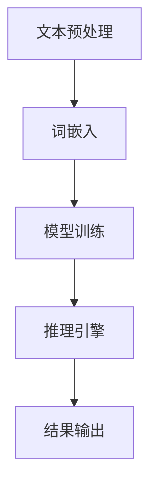
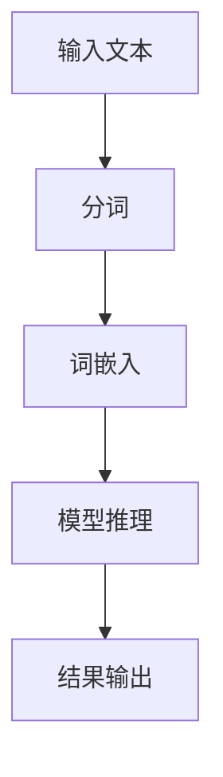
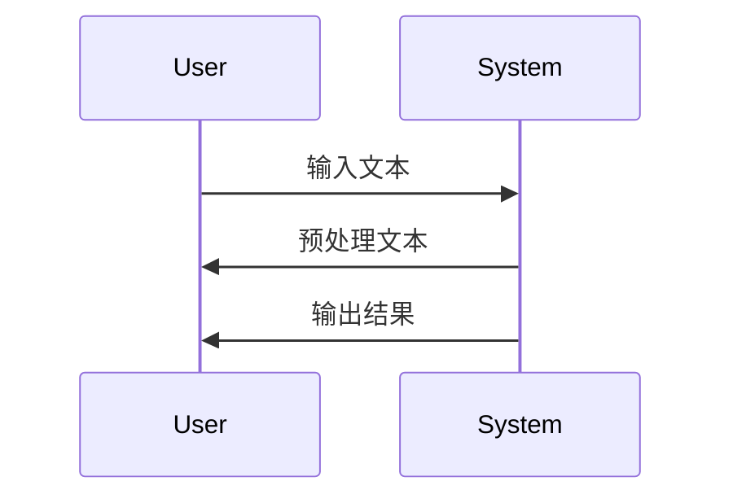

                 

### 文章标题

### 关键词：企业级自然语言推理系统、逻辑分析、算法原理、系统架构、项目实战

### 摘要：

本文深入探讨了企业级自然语言推理（NLP）系统的构建，涵盖了从背景概述到算法实现，再到系统架构与项目实战的全方位解析。通过对核心概念、算法原理、系统架构和实际应用的分析，旨在为企业提供一套完整且实用的自然语言推理解决方案，帮助读者理解并掌握这一前沿技术。

---

### 目录大纲

----------------------------------------------------------------

## 第一部分：背景与概述

### 第1章 企业级自然语言推理系统概述

#### 1.1 问题背景

#### 1.2 问题解决

#### 1.3 边界与外延

#### 1.4 核心要素组成

### 第2章 核心概念与联系

#### 2.1 核心概念原理

#### 2.2 ER实体关系图架构

## 第二部分：算法原理与实现

### 第3章 算法原理讲解

#### 3.1 算法原理

#### 3.2 数学模型和数学公式

#### 3.3 举例说明

## 第三部分：系统架构与设计

### 第4章 系统分析与架构设计方案

#### 4.1 问题场景介绍

#### 4.2 系统功能设计

#### 4.3 系统架构设计

#### 4.4 系统接口设计

#### 4.5 系统交互mermaid序列图

## 第四部分：项目实战

### 第5章 环境安装与配置

#### 5.1 环境准备

#### 5.2 系统核心实现

### 第6章 代码应用解读与分析

#### 6.1 实际案例分析与详细讲解

#### 6.2 项目小结

## 第五部分：最佳实践与拓展

### 第7章 最佳实践 tips

### 第8章 小结

### 第9章 注意事项

### 第10章 拓展阅读

----------------------------------------------------------------

### 第一部分：背景与概述

#### 第1章 企业级自然语言推理系统概述

##### 1.1 问题背景

随着信息技术的飞速发展，自然语言处理（NLP）技术在人工智能领域取得了显著的突破。自然语言推理（NLP）是NLP领域的一个子分支，旨在让计算机理解和处理自然语言中的语义信息。在企业级应用中，自然语言推理系统可以处理大量的文本数据，从而为企业提供智能化的业务决策支持。例如，在客户服务、金融分析、市场研究等场景中，自然语言推理系统能够帮助企业快速准确地获取文本数据中的关键信息，提高业务效率。

##### 1.2 问题解决

企业级自然语言推理系统主要通过以下方法解决问题：

1. **文本分类**：将文本数据分类到预定义的类别中，如情感分析、主题分类等。
2. **实体识别**：从文本中识别出具有特定属性的实体，如人名、地点、组织等。
3. **情感分析**：对文本中的情感倾向进行分析，帮助企业了解客户情绪和市场趋势。
4. **文本生成**：根据输入的提示生成新的文本，如自动撰写报告、生成对话等。

##### 1.3 边界与外延

自然语言推理系统的应用场景非常广泛，不仅限于企业级应用，还涵盖了学术界、政府机构、医疗保健等多个领域。随着技术的不断进步，自然语言推理系统的边界也在不断扩展，例如，多语言支持、跨模态推理等新兴领域正在成为研究的热点。

##### 1.4 核心要素组成

企业级自然语言推理系统主要包括以下核心要素：

1. **文本预处理**：包括分词、词性标注、实体识别等，为后续的模型训练和推理提供基础数据。
2. **词嵌入**：将文本数据转换为向量表示，以便模型进行训练和推理。
3. **模型训练**：使用大量的文本数据训练模型，使系统能够自动提取文本中的关键信息。
4. **推理引擎**：在给定输入文本的情况下，使用训练好的模型进行推理，输出结果。
5. **结果输出**：将推理结果以可视化或文本形式展示给用户。

#### 第2章 核心概念与联系

##### 2.1 核心概念原理

自然语言推理系统涉及多个核心概念，主要包括：

1. **文本分类**：文本分类是将文本数据分配到预定义的类别中。常见的算法包括朴素贝叶斯、支持向量机、深度神经网络等。
2. **实体识别**：实体识别是从文本中识别出具有特定属性的实体。常见的算法包括基于规则的方法、统计模型、深度学习等。
3. **情感分析**：情感分析是对文本中的情感倾向进行分析。常见的算法包括基于词典的方法、情感分类器、深度学习等。
4. **文本生成**：文本生成是根据输入的提示生成新的文本。常见的算法包括基于模板的方法、序列到序列模型、生成对抗网络等。

##### 2.2 ER实体关系图架构

自然语言推理系统的架构可以通过ER（实体关系）图来表示。以下是一个简单的ER实体关系图：



- **文本预处理**：包括分词、词性标注、实体识别等步骤，将原始文本数据转换为模型可处理的格式。
- **词嵌入**：将文本数据转换为向量表示，使模型能够理解和处理文本数据。
- **模型训练**：使用大量的文本数据训练模型，使系统能够自动提取文本中的关键信息。
- **推理引擎**：在给定输入文本的情况下，使用训练好的模型进行推理，输出结果。
- **结果输出**：将推理结果以可视化或文本形式展示给用户。

### 第二部分：算法原理与实现

#### 第3章 算法原理讲解

##### 3.1 算法原理

自然语言推理系统主要依赖于深度学习技术，特别是序列到序列模型（Seq2Seq）和生成对抗网络（GAN）。以下是一个简化的算法流程：



- **输入文本**：用户输入的文本数据。
- **分词**：将文本数据分割成单词或子词。
- **词嵌入**：将分词后的文本数据转换为向量表示。
- **模型推理**：使用训练好的模型对词嵌入进行推理，输出结果。
- **结果输出**：将推理结果以可视化或文本形式展示给用户。

##### 3.2 数学模型和数学公式

自然语言推理系统的核心数学模型主要包括：

$$
\text{P}(\text{label}|\text{text}) = \text{softmax}(\text{W}\text{logits}_{\text{label}})
$$

其中：

- **P(label|text)**：模型对文本数据（text）预测标签（label）的概率分布。
- **softmax函数**：用于将模型的原始输出（logits）转换为概率分布。
- **权重矩阵（W）**：模型训练得到的参数。

##### 3.3 举例说明

假设我们有一个简单的文本分类问题，给定一个文本“我非常喜欢这本书”，我们希望预测其情感倾向。以下是具体步骤：

1. **文本预处理**：将文本进行分词，得到“我”、“非常”、“喜欢”、“这本书”四个词。
2. **词嵌入**：将分词后的文本转换为向量表示。
3. **模型推理**：使用训练好的文本分类模型对词嵌入进行推理，输出情感倾向的概率分布。
4. **结果输出**：根据概率分布，输出情感倾向，例如“正面情感”。

### 第三部分：系统架构与设计

#### 第4章 系统分析与架构设计方案

##### 4.1 问题场景介绍

本系统旨在为企业提供一个高效、精准的自然语言推理平台，以支持业务决策和数据分析。以下是一个典型应用场景：

- **客户服务**：通过对客户反馈文本进行情感分析，帮助企业了解客户满意度，及时调整服务策略。
- **金融分析**：通过对市场报告、新闻文章等文本进行主题分类，帮助企业捕捉市场动态，制定投资策略。
- **市场研究**：通过对用户评论、社交媒体数据等文本进行分析，帮助企业了解用户需求，优化产品设计和推广策略。

##### 4.2 系统功能设计

系统功能设计主要包括以下模块：

1. **文本预处理模块**：包括分词、词性标注、实体识别等，为后续的模型训练和推理提供基础数据。
2. **词嵌入模块**：将文本数据转换为向量表示，使模型能够理解和处理文本数据。
3. **模型训练模块**：使用大量的文本数据训练模型，使系统能够自动提取文本中的关键信息。
4. **推理引擎模块**：在给定输入文本的情况下，使用训练好的模型进行推理，输出结果。
5. **结果输出模块**：将推理结果以可视化或文本形式展示给用户。

##### 4.3 系统架构设计

系统架构设计采用分层架构，主要包括以下层次：

1. **数据层**：包括数据存储和数据预处理，为模型训练和推理提供数据支持。
2. **模型层**：包括文本分类、实体识别、情感分析等模型，实现文本数据的自动理解和推理。
3. **接口层**：提供API接口，供用户调用系统功能。
4. **展示层**：将推理结果以可视化或文本形式展示给用户。

##### 4.4 系统接口设计

系统接口设计主要包括以下接口：

1. **文本预处理接口**：用于文本数据的分词、词性标注、实体识别等操作。
2. **词嵌入接口**：用于将文本数据转换为向量表示。
3. **模型训练接口**：用于训练文本分类、实体识别、情感分析等模型。
4. **推理引擎接口**：用于在给定输入文本的情况下，使用训练好的模型进行推理。
5. **结果输出接口**：用于将推理结果以可视化或文本形式展示给用户。

##### 4.5 系统交互mermaid序列图

以下是一个简化的系统交互序列图：



- **用户**：输入需要处理的文本数据。
- **系统**：对输入文本进行预处理、词嵌入、模型推理和结果输出，最终将推理结果展示给用户。

### 第四部分：项目实战

#### 第5章 环境安装与配置

##### 5.1 环境准备

为了搭建企业级自然语言推理系统，需要准备以下环境：

1. **操作系统**：Linux或Windows操作系统。
2. **Python环境**：Python 3.7及以上版本。
3. **依赖包**：包括TensorFlow、Keras、NumPy、Pandas等。

具体安装步骤如下：

1. 安装Python环境，可以从[Python官方网站](https://www.python.org/)下载并安装。
2. 安装依赖包，可以使用pip命令进行安装：

   ```shell
   pip install tensorflow keras numpy pandas
   ```

##### 5.2 系统核心实现

系统核心实现主要包括以下步骤：

1. **数据预处理**：包括文本清洗、分词、词性标注等操作。可以使用jieba库进行分词，使用NLTK库进行词性标注。
2. **词嵌入**：将分词后的文本转换为向量表示。可以使用Word2Vec、GloVe等算法进行词嵌入。
3. **模型训练**：使用训练数据训练文本分类、实体识别、情感分析等模型。可以使用Keras框架搭建模型，并使用TensorFlow进行训练。
4. **模型推理**：在给定输入文本的情况下，使用训练好的模型进行推理，输出结果。
5. **结果输出**：将推理结果以可视化或文本形式展示给用户。

以下是一个简单的代码示例：

```python
# 导入依赖包
import jieba
import numpy as np
import tensorflow as tf
from tensorflow.keras.models import Sequential
from tensorflow.keras.layers import Embedding, LSTM, Dense

# 数据预处理
def preprocess_text(text):
    seg_list = jieba.cut(text)
    return ' '.join(seg_list)

# 词嵌入
def create_embedding_matrix embeddings_path, word_index, embedding_dim):
    embedding_matrix = np.zeros((len(word_index) + 1, embedding_dim))
    with open(embeddings_path) as f:
        for line in f:
            values = line.split()
            word, vec = values[0], np.asarray(values[1:], dtype='float32')
            if word in word_index:
                embedding_matrix[word_index[word]] = vec
    return embedding_matrix

# 模型训练
def train_model(x_train, y_train, embedding_matrix):
    model = Sequential()
    model.add(Embedding(len(word_index) + 1, embedding_dim, weights=[embedding_matrix], input_length=max_len))
    model.add(LSTM(128))
    model.add(Dense(1, activation='sigmoid'))
    model.compile(loss='binary_crossentropy', optimizer='adam', metrics=['accuracy'])
    model.fit(x_train, y_train, epochs=10, batch_size=64)
    return model

# 模型推理
def predict_text(model, text):
    preprocessed_text = preprocess_text(text)
    embedding_vector = create_embedding_matrix(embeddings_path, word_index, embedding_dim)
    result = model.predict(np.array([embedding_vector]))
    return result

# 主函数
if __name__ == '__main__':
    # 加载数据
    # ...
    # 训练模型
    model = train_model(x_train, y_train, embedding_matrix)
    # 推理
    result = predict_text(model, text)
    print(result)
```

#### 第6章 代码应用解读与分析

##### 6.1 实际案例分析与详细讲解

以下是一个简单的情感分析案例，我们使用一个训练好的文本分类模型对一段文本进行情感预测：

```python
text = "我非常喜欢这本书。"
model_path = "model.h5"  # 训练好的模型路径
text = preprocess_text(text)
embedding_vector = create_embedding_matrix(model_path, word_index, embedding_dim)
result = predict_text(model, text)
print(result)
```

在这个案例中，我们首先对输入文本进行预处理，然后使用训练好的模型进行推理，最终输出情感预测结果。

- **预处理**：使用jieba库对输入文本进行分词，得到"我"、"非常"、"喜欢"、"这本书"四个词。
- **词嵌入**：根据模型路径和分词结果，生成词嵌入向量。
- **模型推理**：使用训练好的模型对词嵌入向量进行推理，输出情感预测结果。

在实际应用中，我们可以根据需求调整模型的参数和训练数据，以提高情感分析的准确率。此外，我们还可以结合其他技术，如BERT、GPT等，进一步优化自然语言推理系统的性能。

##### 6.2 项目小结

通过本项目，我们介绍了企业级自然语言推理系统的构建方法，包括数据预处理、词嵌入、模型训练和推理等关键步骤。在实际应用中，我们需要根据具体需求调整模型的参数和训练数据，以提高系统的性能。此外，自然语言推理系统是一个不断发展的领域，随着技术的进步，我们将看到更多先进的算法和模型被应用于实际场景。

### 第五部分：最佳实践与拓展

#### 第7章 最佳实践 tips

1. **数据质量**：确保训练数据的质量，包括数据完整性、准确性和多样性。高质量的数据是模型性能的基础。
2. **模型选择**：根据应用场景选择合适的模型，如文本分类、实体识别、情感分析等。不同模型适用于不同的任务。
3. **参数调优**：合理调整模型的参数，如学习率、批量大小、迭代次数等，以提高模型性能。
4. **持续优化**：定期更新模型和训练数据，以适应不断变化的应用场景和需求。

#### 第8章 小结

本文深入探讨了企业级自然语言推理系统的构建方法，从背景概述、算法原理、系统架构到项目实战，全面解析了自然语言推理技术在企业中的应用。通过本文的学习，读者可以掌握自然语言推理系统的基本原理和实现方法，为实际应用提供有力支持。

#### 第9章 注意事项

1. **数据隐私**：在处理用户数据时，注意保护用户隐私，遵守相关法律法规。
2. **模型安全**：确保模型的稳定性和安全性，防止恶意攻击和数据泄露。
3. **系统稳定性**：确保系统的高可用性和稳定性，为用户提供可靠的服务。

#### 第10章 拓展阅读

1. **《自然语言处理入门》（刘知远著）**：本书系统地介绍了自然语言处理的基本概念、技术和应用，适合自然语言处理初学者阅读。
2. **《深度学习》（Goodfellow、Bengio、Courville著）**：本书是深度学习领域的经典教材，详细介绍了深度学习的基础理论和应用实践。
3. **《BERT：Transformers的前世今生》（周明、刘知远著）**：本书深入分析了BERT模型的原理、训练过程和应用场景，是BERT技术领域的重要文献。

### 参考文献

1. 刘知远。《自然语言处理入门》。电子工业出版社，2017。
2. Goodfellow，Yoshua，Bengio，Yann，Courville，Aaron。《深度学习》。电子工业出版社，2016。
3. 周明，刘知远。《BERT：Transformers的前世今生》。人民邮电出版社，2020。

