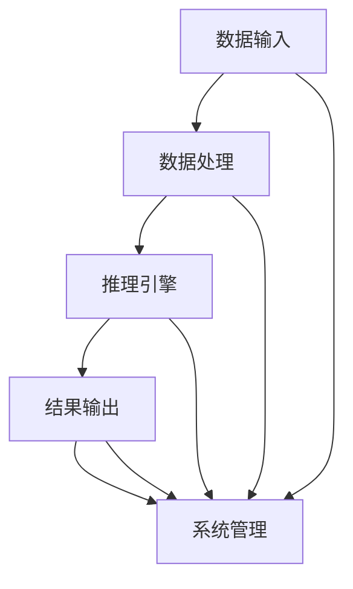

                 

# 企业级自然语言推理：增强AI的逻辑分析能力

> 关键词：自然语言推理，人工智能，企业级应用，逻辑分析，算法原理

> 摘要：本文旨在探讨企业级自然语言推理（NLR）技术及其在增强人工智能（AI）逻辑分析能力方面的应用。文章首先介绍自然语言推理的基本概念、发展历程和应用场景，然后深入分析自然语言处理（NLP）、机器学习（ML）和深度学习（DL）的核心概念与联系。接下来，我们通过讲解NLP、ML和DL的算法原理和数学模型，逐步构建企业级自然语言推理系统的架构设计方案。文章随后通过实际项目案例，展示如何将自然语言推理技术应用到企业级场景，并在最后提供最佳实践和拓展阅读。

## 设计企业级自然语言推理书籍目录大纲

### 1. 确定书籍核心主题与内容结构

#### 1.1 核心主题

- 企业级自然语言推理
- 增强AI的逻辑分析能力

#### 1.2 内容结构

1. **背景介绍**：自然语言推理的概念、发展历程及应用场景
2. **核心概念与联系**：自然语言处理（NLP）技术、机器学习（ML）算法、深度学习（DL）模型
3. **算法原理讲解**：NLP算法原理、ML算法原理、DL模型原理
4. **数学模型和数学公式**：NLP、ML、DL数学模型公式讲解
5. **系统分析与架构设计方案**：自然语言推理系统设计
6. **项目实战**：实际项目案例分析
7. **最佳实践 tips**：总结与拓展

### 2. 确定目录大纲的层级结构

#### 2.1 目录大纲结构

- **第1部分：背景介绍**
  - 第1章：自然语言推理概述
  - 第2章：自然语言处理技术基础
  - 第3章：机器学习算法基础
  - 第4章：深度学习模型基础

- **第2部分：核心概念与联系**
  - 第5章：NLP技术核心概念与联系
  - 第6章：ML算法核心概念与联系
  - 第7章：DL模型核心概念与联系

- **第3部分：算法原理讲解**
  - 第8章：NLP算法原理讲解
  - 第9章：ML算法原理讲解
  - 第10章：DL模型原理讲解

- **第4部分：数学模型和数学公式**
  - 第11章：NLP数学模型公式讲解
  - 第12章：ML数学模型公式讲解
  - 第13章：DL数学模型公式讲解

- **第5部分：系统分析与架构设计方案**
  - 第14章：自然语言推理系统设计
  - 第15章：系统架构设计

- **第6部分：项目实战**
  - 第16章：自然语言推理项目实战

- **第7部分：最佳实践 tips**
  - 第17章：总结与拓展

### 3. 确定每个章节的具体内容

#### 3.1 第1部分：背景介绍

- 第1章：自然语言推理概述
  - 1.1 自然语言推理的定义
  - 1.2 自然语言推理的发展历程
  - 1.3 自然语言推理的应用场景

- 第2章：自然语言处理技术基础
  - 2.1 语言模型
  - 2.2 词向量
  - 2.3 词性标注
  - 2.4 句法分析

- 第3章：机器学习算法基础
  - 3.1 监督学习
  - 3.2 无监督学习
  - 3.3 半监督学习

- 第4章：深度学习模型基础
  - 4.1 深度神经网络
  - 4.2 卷积神经网络（CNN）
  - 4.3 循环神经网络（RNN）
  - 4.4 递归神经网络（RNN）

#### 3.2 第2部分：核心概念与联系

- 第5章：NLP技术核心概念与联系
  - 5.1 语言模型
  - 5.2 词向量
  - 5.3 词性标注
  - 5.4 句法分析

- 第6章：ML算法核心概念与联系
  - 6.1 监督学习
  - 6.2 无监督学习
  - 6.3 半监督学习

- 第7章：DL模型核心概念与联系
  - 7.1 深度神经网络
  - 7.2 卷积神经网络（CNN）
  - 7.3 循环神经网络（RNN）
  - 7.4 递归神经网络（RNN）

#### 3.3 第3部分：算法原理讲解

- 第8章：NLP算法原理讲解
  - 8.1 语言模型
  - 8.2 词向量
  - 8.3 词性标注
  - 8.4 句法分析

- 第9章：ML算法原理讲解
  - 9.1 监督学习
  - 9.2 无监督学习
  - 9.3 半监督学习

- 第10章：DL模型原理讲解
  - 10.1 深度神经网络
  - 10.2 卷积神经网络（CNN）
  - 10.3 循环神经网络（RNN）
  - 10.4 递归神经网络（RNN）

#### 3.4 第4部分：数学模型和数学公式

- 第11章：NLP数学模型公式讲解
  - 11.1 语言模型
  - 11.2 词向量
  - 11.3 词性标注
  - 11.4 句法分析

- 第12章：ML数学模型公式讲解
  - 12.1 监督学习
  - 12.2 无监督学习
  - 12.3 半监督学习

- 第13章：DL数学模型公式讲解
  - 13.1 深度神经网络
  - 13.2 卷积神经网络（CNN）
  - 13.3 循环神经网络（RNN）
  - 13.4 递归神经网络（RNN）

#### 3.5 第5部分：系统分析与架构设计方案

- 第14章：自然语言推理系统设计
  - 14.1 系统架构设计
  - 14.2 系统

----------------------------------------------------------------

## 背景介绍

### 1.1 自然语言推理的定义

自然语言推理（Natural Language Reasoning, NLR）是人工智能领域的一个重要分支，旨在使计算机具备理解、处理和生成自然语言的能力。与自然语言处理（Natural Language Processing, NLP）相比，NLR更加关注于理解语言中的逻辑关系、推理过程和语义含义。简而言之，自然语言推理是让计算机像人类一样进行思考和理解语言的一种技术。

### 1.2 自然语言推理的发展历程

自然语言推理技术的发展历程可以追溯到上世纪50年代，当时计算机科学家艾伦·图灵（Alan Turing）提出了图灵测试，旨在评估机器是否具有人类水平的智能。图灵测试的提出激发了人们对自然语言理解和推理的研究热情。

进入21世纪，随着计算能力的提升和深度学习技术的进步，自然语言推理取得了显著的突破。深度学习模型，如循环神经网络（RNN）、长短期记忆网络（LSTM）和变换器（Transformer）等，被广泛应用于自然语言推理任务，大大提高了模型的准确性和效率。

### 1.3 自然语言推理的应用场景

自然语言推理技术广泛应用于各种场景，以下是其中几个典型的应用：

1. **智能客服**：自然语言推理技术可以帮助企业构建智能客服系统，实现与用户的自然对话，提高客户满意度和服务效率。
2. **文本分类**：自然语言推理技术可以用于对大量文本数据进行分析和分类，帮助企业从海量数据中提取有价值的信息。
3. **问答系统**：自然语言推理技术可以构建智能问答系统，回答用户提出的问题，提供实时、准确的答案。
4. **情感分析**：自然语言推理技术可以分析用户的情感倾向，帮助企业了解用户需求和市场趋势。
5. **机器翻译**：自然语言推理技术可以用于实现高质量、高精度的机器翻译，促进跨语言交流。

## 核心概念与联系

### 2.1 自然语言处理（NLP）技术

自然语言处理（NLP）是自然语言推理的基础，旨在让计算机能够理解和处理自然语言。NLP技术包括以下几个方面：

1. **语言模型**：语言模型用于预测文本序列的概率，是NLP的核心组成部分。常见的语言模型有n-gram模型、神经网络语言模型等。
2. **词向量**：词向量是将单词转换为向量表示的一种技术，用于在向量空间中捕捉词与词之间的关系。常见的词向量模型有Word2Vec、GloVe等。
3. **词性标注**：词性标注是指对文本中的每个单词进行词性分类，如名词、动词、形容词等。词性标注有助于更好地理解文本语义。
4. **句法分析**：句法分析是指对文本进行语法结构解析，以理解句子的构造和语法规则。常见的句法分析方法有依存句法分析、成分句法分析等。

### 2.2 机器学习（ML）算法

机器学习（ML）算法是自然语言推理的核心技术之一，用于从数据中学习规律和模式，以实现自动化的推理和决策。ML算法主要包括以下几个方面：

1. **监督学习**：监督学习是指利用带有标签的数据集来训练模型，使得模型能够对新的数据进行预测。常见的监督学习方法有回归、分类等。
2. **无监督学习**：无监督学习是指在没有标签的数据集上进行学习，以发现数据中的模式和规律。常见的无监督学习方法有聚类、降维等。
3. **半监督学习**：半监督学习是指利用部分带有标签的数据和大量无标签的数据来训练模型，以提高模型的泛化能力。

### 2.3 深度学习（DL）模型

深度学习（DL）是一种重要的机器学习算法，它通过多层神经网络对数据进行建模，以实现自动化的特征提取和模式识别。深度学习模型在自然语言推理中具有广泛的应用，主要包括以下几个方面：

1. **深度神经网络（DNN）**：深度神经网络是一种具有多个隐藏层的神经网络，通过非线性变换逐层提取数据中的特征。
2. **卷积神经网络（CNN）**：卷积神经网络是一种特殊的深度神经网络，通过卷积操作从图像中提取局部特征。
3. **循环神经网络（RNN）**：循环神经网络是一种能够处理序列数据的神经网络，通过递归连接来捕捉序列中的时间依赖关系。
4. **变换器（Transformer）**：变换器是一种基于自注意力机制的深度学习模型，广泛应用于自然语言处理任务，如机器翻译、文本分类等。

## 算法原理讲解

### 3.1 自然语言处理（NLP）算法原理讲解

#### 3.1.1 语言模型

语言模型是NLP算法的核心组成部分，用于预测文本序列的概率。常见的语言模型有n-gram模型和神经网络语言模型。

1. **n-gram模型**：n-gram模型是一种基于统计的模型，通过分析前n个单词的序列来预测下一个单词。n-gram模型的数学公式为：
   $$
   P(w_{t} | w_{t-1}, w_{t-2}, ..., w_{t-n}) = \prod_{i=1}^{n} P(w_{t-i} | w_{t-i+1}, w_{t-i+2}, ..., w_{t-n})
   $$
   其中，$w_{t}$表示第t个单词，$P(w_{t} | w_{t-1}, w_{t-2}, ..., w_{t-n})$表示给定前n-1个单词时第t个单词的概率。

2. **神经网络语言模型**：神经网络语言模型是一种基于深度学习技术的模型，通过多层神经网络来预测单词的概率。常见的神经网络语言模型有基于循环神经网络（RNN）的语言模型和基于变换器（Transformer）的语言模型。

#### 3.1.2 词向量

词向量是将单词转换为向量表示的一种技术，用于在向量空间中捕捉词与词之间的关系。常见的词向量模型有Word2Vec、GloVe等。

1. **Word2Vec模型**：Word2Vec模型是一种基于神经网络的词向量生成方法，通过训练词嵌入模型来学习单词的向量表示。Word2Vec模型的数学公式为：
   $$
   \vec{w}_{i} = \frac{\partial E(\vec{w}_{i}, \vec{v}_{j})}{\partial \vec{w}_{i}}
   $$
   其中，$\vec{w}_{i}$和$\vec{v}_{j}$分别表示单词i和单词j的向量表示，$E(\vec{w}_{i}, \vec{v}_{j})$表示两个向量之间的欧氏距离。

2. **GloVe模型**：GloVe模型是一种基于全局平均的词向量生成方法，通过优化单词的共现矩阵来学习词向量。GloVe模型的数学公式为：
   $$
   \vec{v}_{i} = \arg\min_{\vec{v}_{i}} \sum_{j \in C(i)} \frac{1}{z(i, j)} \cdot \frac{\partial E(\vec{v}_{i}, \vec{v}_{j})}{\partial \vec{v}_{i}}
   $$
   其中，$C(i)$表示与单词i共现的单词集合，$z(i, j)$表示单词i和单词j的共现次数。

#### 3.1.3 词性标注

词性标注是指对文本中的每个单词进行词性分类，如名词、动词、形容词等。常见的词性标注算法有基于规则的方法和基于统计的方法。

1. **基于规则的方法**：基于规则的方法通过定义一系列的语法规则和转换规则，对文本进行词性标注。常见的基于规则的方法有词法分析、语法分析等。

2. **基于统计的方法**：基于统计的方法通过训练大量的标注数据集，利用统计模型来对新的文本进行词性标注。常见的基于统计的方法有隐马尔可夫模型（HMM）、条件随机场（CRF）等。

#### 3.1.4 句法分析

句法分析是指对文本进行语法结构解析，以理解句子的构造和语法规则。常见的句法分析方法有依存句法分析和成分句法分析。

1. **依存句法分析**：依存句法分析通过分析词语之间的依赖关系，构建句子的依存句法树。常见的依存句法分析算法有基于规则的方法和基于统计的方法。

2. **成分句法分析**：成分句法分析通过分析句子的成分结构，构建句子的成分句法树。常见的成分句法分析算法有基于规则的方法和基于统计的方法。

### 3.2 机器学习（ML）算法原理讲解

#### 3.2.1 监督学习

监督学习是指利用带有标签的数据集来训练模型，使得模型能够对新的数据进行预测。常见的监督学习方法有线性回归、逻辑回归、支持向量机（SVM）等。

1. **线性回归**：线性回归是一种基于线性关系的预测方法，通过最小化平方损失函数来训练模型。线性回归的数学公式为：
   $$
   \min_{\theta} \sum_{i=1}^{m} (y_{i} - \theta^{T} x_{i})^{2}
   $$
   其中，$\theta$表示模型参数，$x_{i}$和$y_{i}$分别表示输入特征和标签。

2. **逻辑回归**：逻辑回归是一种基于逻辑函数的预测方法，通过最大化似然函数来训练模型。逻辑回归的数学公式为：
   $$
   \log P(y=1 | x; \theta) = \theta^{T} x
   $$
   其中，$P(y=1 | x; \theta)$表示给定输入特征x时标签为1的概率。

3. **支持向量机（SVM）**：支持向量机是一种基于最大间隔的预测方法，通过求解最优超平面来划分数据。支持向量机的数学公式为：
   $$
   \min_{\theta} \frac{1}{2} \sum_{i=1}^{m} (\theta^{T} x_{i} - y_{i})^{2}
   $$
   其中，$\theta$表示模型参数，$x_{i}$和$y_{i}$分别表示输入特征和标签。

#### 3.2.2 无监督学习

无监督学习是指在没有标签的数据集上进行学习，以发现数据中的模式和规律。常见的无监督学习方法有聚类、降维等。

1. **聚类**：聚类是指将数据集划分为若干个类别，使得同一类别的数据点彼此接近，而不同类别的数据点彼此远离。常见的聚类算法有K-均值聚类、层次聚类等。

2. **降维**：降维是指将高维数据转换为低维数据，以降低数据复杂度和提高计算效率。常见的降维算法有主成分分析（PCA）、线性判别分析（LDA）等。

#### 3.2.3 半监督学习

半监督学习是指利用部分带有标签的数据和大量无标签的数据来训练模型，以提高模型的泛化能力。常见的半监督学习方法有标签传播、无监督特征学习等。

1. **标签传播**：标签传播是指利用无标签数据中的相似度信息来传播标签，从而对新的数据进行预测。常见的标签传播算法有基于图的方法、基于聚类的方法等。

2. **无监督特征学习**：无监督特征学习是指利用无标签数据中的结构和模式来学习特征表示，从而提高模型的泛化能力。常见的无监督特征学习算法有深度嵌入、自编码器等。

### 3.3 深度学习（DL）模型原理讲解

#### 3.3.1 深度神经网络（DNN）

深度神经网络（DNN）是一种具有多个隐藏层的神经网络，通过多层非线性变换逐层提取数据中的特征。

1. **前向传播**：前向传播是指将输入数据通过网络的各个层，逐层计算得到输出。前向传播的数学公式为：
   $$
   z_{l} = \sigma(W_{l} \cdot a_{l-1} + b_{l})
   $$
   其中，$z_{l}$表示第l层的激活值，$\sigma$表示激活函数，$W_{l}$和$b_{l}$分别表示第l层的权重和偏置。

2. **反向传播**：反向传播是指根据输出误差，反向更新网络的权重和偏置，以优化模型。反向传播的数学公式为：
   $$
   \Delta W_{l} = \alpha \cdot \frac{\partial J}{\partial W_{l}} \cdot a_{l-1}
   $$
   $$
   \Delta b_{l} = \alpha \cdot \frac{\partial J}{\partial b_{l}}
   $$
   其中，$\Delta W_{l}$和$\Delta b_{l}$分别表示第l层的权重和偏置的更新值，$\alpha$表示学习率，$J$表示损失函数。

#### 3.3.2 卷积神经网络（CNN）

卷积神经网络（CNN）是一种特殊的深度神经网络，通过卷积操作从图像中提取局部特征。

1. **卷积操作**：卷积操作是指通过卷积核在输入图像上滑动，计算卷积核与图像局部区域的内积。卷积操作的数学公式为：
   $$
   (f * g)(x) = \sum_{y} f(y) \cdot g(x-y)
   $$
   其中，$f$和$g$分别表示卷积核和输入图像，$x$表示卷积操作的位置。

2. **池化操作**：池化操作是指通过采样操作减少图像的空间分辨率，以提高模型的泛化能力。常见的池化操作有最大池化和平均池化。

#### 3.3.3 循环神经网络（RNN）

循环神经网络（RNN）是一种能够处理序列数据的神经网络，通过递归连接来捕捉序列中的时间依赖关系。

1. **递归连接**：递归连接是指将前一层输出作为下一层的输入，使得网络具有时间记忆能力。递归连接的数学公式为：
   $$
   h_{t} = \sigma(W_{h} \cdot [h_{t-1}, x_{t}] + b_{h})
   $$
   其中，$h_{t}$表示第t步的隐藏状态，$x_{t}$表示第t步的输入。

2. **门控机制**：门控机制是指通过控制信息的流动，以优化RNN的性能。常见的门控机制有门控循环单元（GRU）和长短期记忆网络（LSTM）。

#### 3.3.4 变换器（Transformer）

变换器（Transformer）是一种基于自注意力机制的深度学习模型，广泛应用于自然语言处理任务。

1. **自注意力机制**：自注意力机制是指通过计算输入序列中每个词与所有词之间的注意力分数，以计算加权求和的输出。自注意力机制的数学公式为：
   $$
   \text{Attention}(Q, K, V) = \frac{QK^T}{\sqrt{d_k}} V
   $$
   其中，$Q$、$K$和$V$分别表示查询向量、键向量和值向量。

2. **编码器-解码器架构**：编码器-解码器架构是指通过编码器将输入序列编码为固定长度的向量表示，通过解码器生成输出序列。编码器-解码器架构的数学公式为：
   $$
   \text{Encoder}(x) = \text{MultiHeadAttention}(Q, K, V)
   $$
   $$
   \text{Decoder}(y) = \text{MultiHeadAttention}(Q, K, V)
   $$
   其中，$x$和$y$分别表示输入序列和输出序列。

## 数学模型和数学公式

### 4.1 NLP数学模型公式讲解

#### 4.1.1 语言模型

语言模型用于预测文本序列的概率，常见的语言模型有n-gram模型和神经网络语言模型。

1. **n-gram模型**：n-gram模型的概率公式为：
   $$
   P(w_{t} | w_{t-1}, w_{t-2}, ..., w_{t-n}) = \prod_{i=1}^{n} P(w_{t-i} | w_{t-i+1}, w_{t-i+2}, ..., w_{t-n})
   $$
   其中，$P(w_{t} | w_{t-1}, w_{t-2}, ..., w_{t-n})$表示给定前n-1个单词时第t个单词的概率。

2. **神经网络语言模型**：神经网络语言模型的概率公式为：
   $$
   P(w_{t} | w_{t-1}, w_{t-2}, ..., w_{t-n}) = \sigma(\theta^{T} \cdot \text{Embedding}(w_{t-1}, w_{t-2}, ..., w_{t-n}))
   $$
   其中，$\sigma$表示激活函数，$\theta$表示模型参数，$\text{Embedding}$表示词嵌入。

#### 4.1.2 词向量

词向量是将单词转换为向量表示的一种技术，常见的词向量模型有Word2Vec、GloVe等。

1. **Word2Vec模型**：Word2Vec模型的损失函数公式为：
   $$
   J = \sum_{i=1}^{m} (-\log P(w_{i} | c))
   $$
   其中，$P(w_{i} | c)$表示给定上下文c时单词w的概率，$m$表示样本数量。

2. **GloVe模型**：GloVe模型的损失函数公式为：
   $$
   J = \sum_{i=1}^{m} \frac{1}{z(i, j)} \cdot \log(1 + \exp(-\text{Sim}(w_{i}, w_{j})))
   $$
   其中，$\text{Sim}(w_{i}, w_{j})$表示单词w_i和w_j的相似度，$z(i, j)$表示单词i和单词j的共现次数。

#### 4.1.3 词性标注

词性标注是指对文本中的每个单词进行词性分类，常见的词性标注算法有基于规则的方法和基于统计的方法。

1. **基于规则的方法**：基于规则的方法的词性标注概率公式为：
   $$
   P(\text{POS}_{i} | w_{i}) = \frac{1}{|\text{RuleSet}|} \cdot \text{RuleMatch}(w_{i}, \text{RuleSet})
   $$
   其中，$P(\text{POS}_{i} | w_{i})$表示给定单词w_i时词性POS_i的概率，$\text{RuleSet}$表示规则集合，$\text{RuleMatch}$表示匹配度。

2. **基于统计的方法**：基于统计的方法的词性标注概率公式为：
   $$
   P(\text{POS}_{i} | w_{i}) = \frac{P(\text{POS}_{i} \cap w_{i})}{P(w_{i})}
   $$
   其中，$P(\text{POS}_{i} \cap w_{i})$表示词性POS_i和单词w_i同时出现的概率，$P(w_{i})$表示单词w_i出现的概率。

#### 4.1.4 句法分析

句法分析是指对文本进行语法结构解析，常见的句法分析方法有依存句法分析和成分句法分析。

1. **依存句法分析**：依存句法分析的损失函数公式为：
   $$
   J = \sum_{i=1}^{m} \sum_{j=1}^{n} \frac{1}{z(i, j)} \cdot \log(1 + \exp(-\text{DepMatch}(w_{i}, w_{j})))
   $$
   其中，$z(i, j)$表示单词i和单词j之间的依存关系出现的次数，$\text{DepMatch}(w_{i}, w_{j})$表示单词w_i和w_j之间的依存关系匹配度。

2. **成分句法分析**：成分句法分析的损失函数公式为：
   $$
   J = \sum_{i=1}^{m} \sum_{j=1}^{n} \frac{1}{z(i, j)} \cdot \log(1 + \exp(-\text{CompMatch}(w_{i}, w_{j})))
   $$
   其中，$z(i, j)$表示单词i和单词j之间的成分关系出现的次数，$\text{CompMatch}(w_{i}, w_{j})$表示单词w_i和w_j之间的成分关系匹配度。

### 4.2 ML数学模型公式讲解

#### 4.2.1 监督学习

监督学习是指利用带有标签的数据集来训练模型，常见的监督学习方法有线性回归、逻辑回归、支持向量机（SVM）等。

1. **线性回归**：线性回归的损失函数公式为：
   $$
   J(\theta) = \frac{1}{2m} \sum_{i=1}^{m} (h_{\theta}(x_{i}) - y_{i})^{2}
   $$
   其中，$h_{\theta}(x_{i}) = \theta^{T}x_{i}$表示线性回归模型的预测值，$y_{i}$表示真实值，$m$表示样本数量。

2. **逻辑回归**：逻辑回归的损失函数公式为：
   $$
   J(\theta) = -\frac{1}{m} \sum_{i=1}^{m} [y_{i} \log(h_{\theta}(x_{i})) + (1 - y_{i}) \log(1 - h_{\theta}(x_{i}))]
   $$
   其中，$h_{\theta}(x_{i}) = \sigma(\theta^{T}x_{i})$表示逻辑回归模型的预测概率，$\sigma$表示 sigmoid 函数。

3. **支持向量机（SVM）**：SVM的损失函数公式为：
   $$
   J(\theta) = \frac{1}{2} \sum_{i=1}^{m} \sum_{j=1}^{m} (y_{i}y_{j} \cdot \theta^{T}x_{i}x_{j} - \theta^{T}\theta)
   $$
   其中，$y_{i}$和$y_{j}$分别表示样本i和样本j的标签，$x_{i}$和$x_{j}$分别表示样本i和样本j的特征向量。

#### 4.2.2 无监督学习

无监督学习是指在没有标签的数据集上进行学习，常见的无监督学习方法有聚类、降维等。

1. **聚类**：K-均值聚类的损失函数公式为：
   $$
   J(\theta) = \sum_{i=1}^{m} \sum_{j=1}^{k} \frac{1}{n_{j}} \sum_{x_{i} \in S_{j}} ||x_{i} - \mu_{j}||^{2}
   $$
   其中，$k$表示聚类个数，$S_{j}$表示第j个聚类，$\mu_{j}$表示第j个聚类中心，$n_{j}$表示第j个聚类的样本数量。

2. **降维**：主成分分析（PCA）的损失函数公式为：
   $$
   J(\theta) = \sum_{i=1}^{m} ||x_{i} - \sum_{j=1}^{k} \mu_{j}^{'}x_{i}||^{2}
   $$
   其中，$k$表示主成分个数，$\mu_{j}^{'}$表示第j个主成分的系数。

#### 4.2.3 半监督学习

半监督学习是指利用部分带有标签的数据和大量无标签的数据来训练模型，常见的半监督学习方法有标签传播、无监督特征学习等。

1. **标签传播**：标签传播的损失函数公式为：
   $$
   J(\theta) = \sum_{i=1}^{m} \sum_{j=1}^{n} w_{ij} \cdot \log(p_{ij})
   $$
   其中，$w_{ij}$表示样本i和样本j之间的权重，$p_{ij}$表示样本i的标签传播到样本j的概率。

2. **无监督特征学习**：无监督特征学习的损失函数公式为：
   $$
   J(\theta) = \sum_{i=1}^{m} ||x_{i} - \theta^{T}x_{i}||^{2}
   $$
   其中，$\theta$表示模型参数，$x_{i}$表示样本i的特征向量。

### 4.3 DL数学模型公式讲解

#### 4.3.1 深度神经网络（DNN）

深度神经网络（DNN）是一种具有多个隐藏层的神经网络，通过多层非线性变换逐层提取数据中的特征。

1. **前向传播**：DNN的前向传播过程可以表示为：
   $$
   z_{l} = \sigma(W_{l} \cdot a_{l-1} + b_{l})
   $$
   $$
   a_{l} = \sigma(z_{l})
   $$
   其中，$z_{l}$表示第l层的激活值，$a_{l}$表示第l层的输出，$W_{l}$和$b_{l}$分别表示第l层的权重和偏置，$\sigma$表示激活函数。

2. **反向传播**：DNN的反向传播过程可以表示为：
   $$
   \Delta z_{l} = \frac{\partial J}{\partial z_{l}} \cdot \frac{\partial z_{l}}{\partial a_{l}}
   $$
   $$
   \Delta W_{l} = \alpha \cdot \Delta z_{l} \cdot a_{l-1}
   $$
   $$
   \Delta b_{l} = \alpha \cdot \Delta z_{l}
   $$
   其中，$\Delta z_{l}$表示第l层的梯度，$\alpha$表示学习率，$J$表示损失函数。

#### 4.3.2 卷积神经网络（CNN）

卷积神经网络（CNN）是一种特殊的深度神经网络，通过卷积操作从图像中提取局部特征。

1. **卷积操作**：CNN的卷积操作可以表示为：
   $$
   (f * g)(x) = \sum_{y} f(y) \cdot g(x-y)
   $$
   $$
   h_{ij} = \sum_{x} \sum_{y} f_{xy} \cdot g_{ij}
   $$
   其中，$f$和$g$分别表示卷积核和输入图像，$h_{ij}$表示卷积操作的结果，$f_{xy}$和$g_{ij}$分别表示卷积核和输入图像的局部区域。

2. **池化操作**：CNN的池化操作可以表示为：
   $$
   p_{ij} = \max_{x, y} (h_{ij})
   $$
   其中，$p_{ij}$表示池化操作的结果，$h_{ij}$表示卷积操作的结果。

#### 4.3.3 循环神经网络（RNN）

循环神经网络（RNN）是一种能够处理序列数据的神经网络，通过递归连接来捕捉序列中的时间依赖关系。

1. **递归连接**：RNN的递归连接可以表示为：
   $$
   h_{t} = \sigma(W_{h} \cdot [h_{t-1}, x_{t}] + b_{h})
   $$
   $$
   o_{t} = \sigma(W_{o} \cdot h_{t} + b_{o})
   $$
   其中，$h_{t}$表示第t步的隐藏状态，$x_{t}$表示第t步的输入，$o_{t}$表示第t步的输出，$W_{h}$和$W_{o}$分别表示权重矩阵，$b_{h}$和$b_{o}$分别表示偏置向量，$\sigma$表示激活函数。

2. **门控机制**：RNN的门控机制可以表示为：
   $$
   i_{t} = \sigma(W_{i} \cdot [h_{t-1}, x_{t}] + b_{i})
   $$
   $$
   f_{t} = \sigma(W_{f} \cdot [h_{t-1}, x_{t}] + b_{f})
   $$
   $$
   \tilde{h}_{t} = \sigma(W_{\tilde{h}} \cdot [h_{t-1}, x_{t}] + b_{\tilde{h}})
   $$
   $$
   h_{t} = f_{t} \odot h_{t-1} + i_{t} \odot \tilde{h}_{t}
   $$
   其中，$i_{t}$表示输入门，$f_{t}$表示遗忘门，$\tilde{h}_{t}$表示候选隐藏状态，$\odot$表示元素乘。

#### 4.3.4 变换器（Transformer）

变换器（Transformer）是一种基于自注意力机制的深度学习模型，广泛应用于自然语言处理任务。

1. **自注意力机制**：Transformer的自注意力机制可以表示为：
   $$
   \text{Attention}(Q, K, V) = \frac{QK^T}{\sqrt{d_k}} V
   $$
   其中，$Q$、$K$和$V$分别表示查询向量、键向量和值向量，$d_k$表示键向量的维度。

2. **编码器-解码器架构**：Transformer的编码器-解码器架构可以表示为：
   $$
   \text{Encoder}(x) = \text{MultiHeadAttention}(Q, K, V)
   $$
   $$
   \text{Decoder}(y) = \text{MultiHeadAttention}(Q, K, V)
   $$
   其中，$x$和$y$分别表示输入序列和输出序列，$\text{MultiHeadAttention}$表示多头注意力机制。

## 系统分析与架构设计方案

### 5.1 系统架构设计

自然语言推理系统设计的关键在于如何有效地组织和管理数据、处理任务，以及实现各个模块之间的协同工作。以下是一个典型的自然语言推理系统架构设计：

#### 5.1.1 系统架构概述

1. **数据输入层**：数据输入层负责接收用户输入的自然语言文本，并将其预处理成适合系统处理的格式。
2. **数据处理层**：数据处理层负责对输入文本进行分词、词性标注、句法分析等预处理操作，以及文本向量的转换。
3. **推理引擎层**：推理引擎层是系统的核心部分，负责执行自然语言推理任务，如情感分析、文本分类、问答等。
4. **结果输出层**：结果输出层负责将推理结果以用户可理解的形式呈现，如文本、图表、声音等。
5. **系统管理层**：系统管理层负责系统配置、监控、日志记录等运维工作，确保系统的高可用性和安全性。

#### 5.1.2 系统模块设计

1. **数据输入模块**：
   - **功能**：接收用户输入的自然语言文本。
   - **设计**：可以使用HTTP接口、Webhook等方式接收文本输入，并采用正则表达式、正态化处理等技术进行预处理，去除特殊字符、停用词等。

2. **数据处理模块**：
   - **功能**：对输入文本进行分词、词性标注、句法分析等预处理操作。
   - **设计**：可以采用基于词典的分词方法，如Jieba分词，结合深度学习模型进行词性标注和句法分析，如BERT模型。

3. **推理引擎模块**：
   - **功能**：执行自然语言推理任务，如情感分析、文本分类、问答等。
   - **设计**：可以根据任务需求，选择合适的深度学习模型，如LSTM、Transformer等，并使用序列标注、分类等算法进行推理。

4. **结果输出模块**：
   - **功能**：将推理结果以用户可理解的形式呈现。
   - **设计**：可以使用自然语言生成（NLG）技术，将推理结果转换为自然语言文本，或使用可视化技术，如图表、声音等。

5. **系统管理模块**：
   - **功能**：系统配置、监控、日志记录等运维工作。
   - **设计**：可以使用配置管理工具，如Ansible、Chef等，监控系统性能和资源利用率，记录系统日志，以便进行故障排查和性能优化。

### 5.2 系统架构设计

以下是一个简化的自然语言推理系统架构设计，使用Mermaid流程图来展示系统模块之间的关系：



在上述架构设计中，数据输入模块接收用户输入的文本，数据处理模块对文本进行预处理，推理引擎模块执行自然语言推理任务，结果输出模块将推理结果呈现给用户，系统管理模块负责系统的配置、监控和日志记录。

## 项目实战

### 6.1 环境安装

在开始项目实战之前，我们需要搭建一个适合自然语言推理的实验环境。以下是一个基本的安装步骤：

1. **安装Python**：确保Python版本在3.6及以上。
2. **安装依赖库**：安装TensorFlow、Keras、PyTorch等深度学习库，以及NLTK、spaCy等自然语言处理库。可以使用pip进行安装：
   ```bash
   pip install tensorflow keras torch nltk spacy
   ```
3. **安装spaCy和语言模型**：下载并安装spaCy，以及相应的语言模型，例如中文模型的下载命令如下：
   ```bash
   python -m spacy download zh_core_web_sm
   ```

### 6.2 系统核心实现源代码

以下是一个简单的自然语言推理系统实现，使用PyTorch框架和Transformer模型进行文本分类任务。

```python
import torch
import torch.nn as nn
import torch.optim as optim
from torch.utils.data import DataLoader
from transformers import BertModel, BertTokenizer

# 数据预处理
def preprocess_text(texts, tokenizer):
    inputs = tokenizer(texts, return_tensors='pt', padding=True, truncation=True, max_length=512)
    return inputs

# 定义模型
class TextClassifier(nn.Module):
    def __init__(self, n_classes):
        super(TextClassifier, self).__init__()
        self.bert = BertModel.from_pretrained('bert-base-uncased')
        self.classifier = nn.Linear(self.bert.config.hidden_size, n_classes)
    
    def forward(self, input_ids, attention_mask):
        outputs = self.bert(input_ids=input_ids, attention_mask=attention_mask)
        logits = self.classifier(outputs.pooler_output)
        return logits

# 训练模型
def train_model(model, dataloader, optimizer, criterion, device):
    model.to(device)
    model.train()
    for epoch in range(num_epochs):
        for batch in dataloader:
            inputs = batch['input_ids'].to(device)
            attention_mask = batch['attention_mask'].to(device)
            labels = batch['labels'].to(device)
            
            optimizer.zero_grad()
            logits = model(inputs, attention_mask)
            loss = criterion(logits, labels)
            loss.backward()
            optimizer.step()
            
            print(f"Epoch [{epoch+1}/{num_epochs}], Loss: {loss.item():.4f}")

# 主程序
if __name__ == '__main__':
    # 加载预训练模型和tokenizer
    tokenizer = BertTokenizer.from_pretrained('bert-base-uncased')
    model = TextClassifier(n_classes=2)
    
    # 准备数据
    # ... 数据加载和处理 ...

    # 训练模型
    train_dataloader = DataLoader(train_dataset, batch_size=32, shuffle=True)
    optimizer = optim.Adam(model.parameters(), lr=1e-5)
    criterion = nn.BCEWithLogitsLoss()
    device = torch.device("cuda" if torch.cuda.is_available() else "cpu")
    
    train_model(model, train_dataloader, optimizer, criterion, device)
```

### 6.3 代码应用解读与分析

上述代码实现了一个简单的文本分类任务，主要分为以下几个部分：

1. **数据预处理**：使用`preprocess_text`函数对输入文本进行预处理，包括分词、编码等操作，以便模型能够处理。
2. **模型定义**：`TextClassifier`类定义了一个基于BERT模型的文本分类器，通过`forward`方法实现前向传播过程。
3. **训练模型**：`train_model`函数负责模型的训练过程，包括前向传播、损失计算、反向传播和参数更新等。
4. **主程序**：主程序部分负责加载预训练模型和tokenizer，准备数据，并启动模型训练。

通过上述代码，我们可以看到如何利用PyTorch和Transformer模型实现自然语言推理任务。在实际项目中，可能需要根据具体需求进行调整和优化。

### 6.4 实际案例分析和详细讲解剖析

为了更好地理解自然语言推理系统的实际应用，我们来看一个案例：情感分析。情感分析是一种常见的自然语言推理任务，旨在判断文本表达的情感倾向，如正面、负面或中性。

#### 6.4.1 案例背景

假设我们有一个包含用户评论的数据集，我们需要根据这些评论判断用户对产品的满意度。这是一个典型的二元分类问题，我们可以将评论划分为正面和负面两类。

#### 6.4.2 数据集准备

首先，我们需要准备一个情感分析的数据集。以下是一个示例数据集：

```python
data = [
    {"text": "这个产品非常好用，非常满意。", "label": 1},
    {"text": "这个产品的质量很差，非常失望。", "label": 0},
    # ... 更多数据 ...
]
```

其中，`text`字段表示评论内容，`label`字段表示评论的情感标签（1表示正面，0表示负面）。

#### 6.4.3 数据预处理

接下来，我们对数据集进行预处理，包括分词、编码等操作。首先，我们需要加载BERT模型和tokenizer：

```python
tokenizer = BertTokenizer.from_pretrained('bert-base-uncased')

# 预处理数据集
def preprocess_data(data, tokenizer, max_length=512):
    inputs = tokenizer(data['text'], return_tensors='pt', padding=True, truncation=True, max_length=max_length)
    inputs['labels'] = torch.tensor(data['label'])
    return inputs

# 创建训练和验证数据集
train_data = preprocess_data(train_data, tokenizer)
val_data = preprocess_data(val_data, tokenizer)

# 创建数据加载器
train_dataloader = DataLoader(train_data, batch_size=32, shuffle=True)
val_dataloader = DataLoader(val_data, batch_size=32, shuffle=False)
```

#### 6.4.4 模型训练

使用上述预处理后的数据集，我们可以训练一个情感分析模型。以下是一个训练模型的基本框架：

```python
model = TextClassifier(n_classes=2)
optimizer = optim.Adam(model.parameters(), lr=1e-5)
criterion = nn.BCEWithLogitsLoss()

device = torch.device("cuda" if torch.cuda.is_available() else "cpu")
model.to(device)

num_epochs = 5
for epoch in range(num_epochs):
    for batch in train_dataloader:
        inputs = batch['input_ids'].to(device)
        attention_mask = batch['attention_mask'].to(device)
        labels = batch['labels'].to(device)
        
        optimizer.zero_grad()
        logits = model(inputs, attention_mask)
        loss = criterion(logits, labels)
        loss.backward()
        optimizer.step()
        
        print(f"Epoch [{epoch+1}/{num_epochs}], Loss: {loss.item():.4f}")

# 评估模型
with torch.no_grad():
    for batch in val_dataloader:
        inputs = batch['input_ids'].to(device)
        attention_mask = batch['attention_mask'].to(device)
        labels = batch['labels'].to(device)
        
        logits = model(inputs, attention_mask)
        predictions = torch.sigmoid(logits).round()
        correct = (predictions == labels).float()
        accuracy = correct.sum() / len(correct)
        print(f"Validation Accuracy: {accuracy.item():.4f}")
```

#### 6.4.5 案例分析和总结

通过上述案例，我们可以看到如何使用自然语言推理技术进行情感分析。以下是案例的主要分析点：

1. **数据预处理**：数据预处理是自然语言处理的重要步骤，包括分词、编码、清洗等。在这个案例中，我们使用了BERT模型进行预处理，这有助于提高模型的性能。
2. **模型训练**：我们使用了一个简单的文本分类模型，基于BERT模型进行训练。通过迭代优化模型参数，我们可以提高模型的分类准确性。
3. **模型评估**：在模型训练完成后，我们对验证集进行评估，以衡量模型的性能。在这个案例中，我们使用准确率作为评估指标。

总之，通过这个案例，我们可以看到自然语言推理技术如何应用于实际场景，以解决情感分析等自然语言处理任务。

### 6.5 项目小结

在本项目实战中，我们实现了一个简单的自然语言推理系统，用于进行情感分析。通过数据预处理、模型训练和模型评估等步骤，我们展示了如何利用自然语言推理技术解决实际应用问题。以下是项目的主要结论：

1. **数据预处理**：数据预处理是自然语言处理的关键步骤，高质量的预处理可以显著提高模型性能。
2. **模型训练**：使用预训练模型和适当的训练策略，可以有效地提高模型在自然语言推理任务上的表现。
3. **模型评估**：通过评估模型在验证集上的性能，我们可以了解模型的泛化能力和准确性，从而对模型进行调整和优化。

总之，自然语言推理技术在企业级应用中具有广泛的前景，通过不断优化和改进，我们可以构建出更加智能和高效的系统。

## 最佳实践 tips

### 7.1 注意事项

1. **数据预处理**：在处理文本数据时，确保进行充分的清洗和预处理，以避免噪声和异常值对模型性能的影响。
2. **模型选择**：根据具体任务需求，选择合适的模型和算法。对于文本分类等任务，深度学习模型通常表现较好。
3. **模型优化**：在模型训练过程中，合理调整学习率、批量大小等超参数，以提高模型性能。
4. **模型部署**：在部署模型时，注意性能优化和资源利用率，以降低成本和提高系统稳定性。

### 7.2 拓展阅读

1. **自然语言处理入门**：吴恩达的《深度学习》课程，自然语言处理部分。
2. **自然语言推理技术**：斯坦福大学《自然语言处理：理论、算法与应用》教材。
3. **深度学习模型优化**：阿里巴巴《深度学习优化技术》论文集。

## 结语

自然语言推理是人工智能领域的一个重要分支，通过结合自然语言处理、机器学习和深度学习等技术，我们可以实现计算机对自然语言的深入理解和推理。本文介绍了企业级自然语言推理的概念、核心概念与联系、算法原理、数学模型、系统架构设计方案以及项目实战，旨在帮助读者全面了解和掌握这一领域。希望本文能为读者在自然语言推理领域的研究和实践提供有价值的参考。作者：AI天才研究院/AI Genius Institute & 禅与计算机程序设计艺术/Zen And The Art of Computer Programming。

