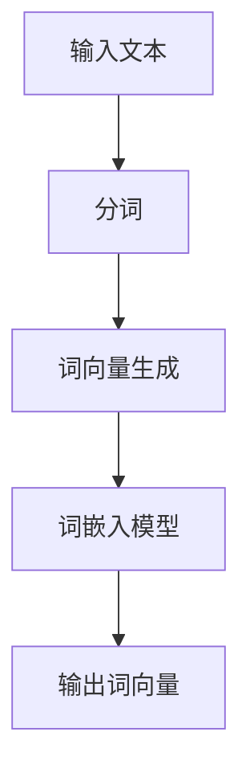
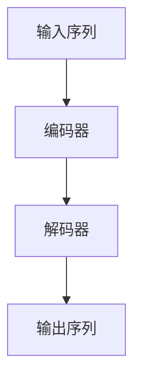
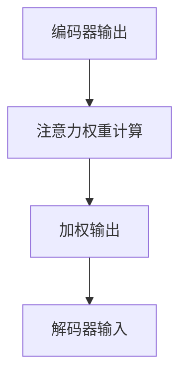
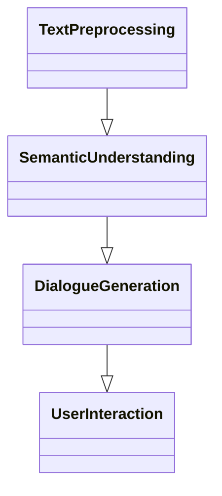
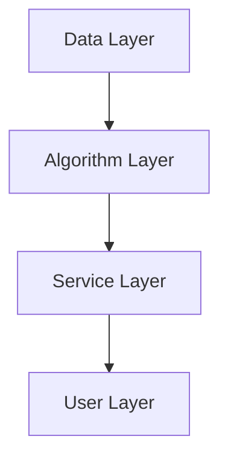
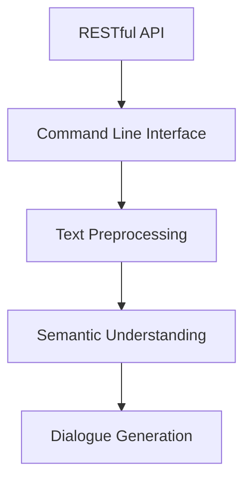
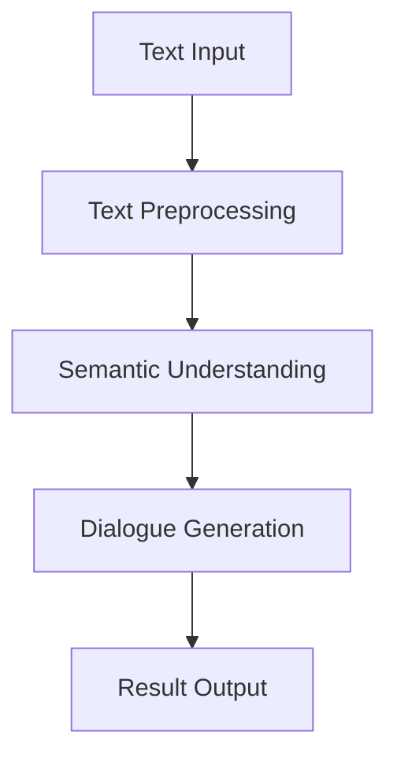

                 

# 企业级自然语言理解平台：深化人机交互

## 关键词
自然语言理解，企业级应用，深度学习，序列到序列模型，注意力机制，词嵌入

## 摘要
本文旨在探讨企业级自然语言理解平台的设计与实现，旨在通过深化人机交互，提升企业业务效率。我们将详细分析自然语言理解的核心概念、技术原理，以及如何将这些技术应用于企业级应用中。文章将涵盖平台的设计理念、架构方案、关键算法的实现，并通过实际案例进行分析，为读者提供一个全面的技术指南。

## 目录大纲

### 第一部分：背景介绍

#### 1. 背景与核心概念

##### 1.1. 问题背景

##### 1.2. 核心概念与联系

#### 1.2.1. 自然语言理解（NLU）

##### 1.2.2. 企业级应用

### 第二部分：自然语言理解技术原理

#### 2. 自然语言理解技术原理

##### 2.1. 基础算法原理讲解

##### 2.2. 数学模型和公式讲解

##### 2.3. 算法举例说明

### 第三部分：企业级自然语言理解平台设计

#### 3. 企业级自然语言理解平台设计

##### 3.1. 系统分析与架构设计方案

##### 3.2. 系统功能设计

##### 3.3. 系统架构设计

##### 3.4. 系统接口设计

##### 3.5. 系统交互

### 第四部分：项目实战

#### 4. 项目实战

##### 4.1. 环境安装

##### 4.2. 系统核心实现

##### 4.3. 代码应用解读与分析

##### 4.4. 实际案例分析与详细讲解剖析

##### 4.5. 项目小结

### 第五部分：最佳实践与拓展

#### 5. 最佳实践

#### 6. 小结

#### 7. 注意事项

#### 8. 拓展阅读

## 第一部分：背景介绍

### 1. 背景与核心概念

#### 1.1. 问题背景

在数字化转型的浪潮下，企业对自然语言理解的需求日益增长。然而，传统的自然语言处理技术往往无法满足企业级应用的复杂性。企业需要一种高效、可靠且可扩展的自然语言理解平台，以深化人机交互，提升业务效率。

**问题描述**：

- **自然语言理解挑战**：企业面对的挑战包括多领域文本的语义理解、跨语言的文本处理、实时对话系统的构建等。
- **业务需求**：企业希望通过自然语言理解技术，实现智能客服、智能文档分析、智能会议记录等应用。

**问题解决**：

- **解决方案**：构建一个企业级自然语言理解平台，提供强大的自然语言处理能力，满足企业复杂多变的需求。

**边界与外延**：

- **边界**：本平台主要聚焦于企业级应用，涵盖文本分析、语义理解、对话系统等领域。
- **外延**：本平台可以与企业现有系统集成，实现无缝对接，支持多语言处理和跨平台部署。

**概念结构与核心要素组成**：

- **核心概念**：自然语言理解（NLU）、机器学习、深度学习、企业级应用。
- **核心要素组成**：

  - **底层算法框架**：包括词嵌入、序列到序列模型、注意力机制等。
  - **数据处理层**：负责文本预处理、数据清洗、特征提取等。
  - **服务接口层**：提供API接口，支持多种编程语言调用。
  - **用户交互层**：提供友好的用户界面，支持自然语言输入和输出。

### 1.2. 核心概念与联系

#### 1.2.1. 自然语言理解（NLU）

**定义**：自然语言理解（Natural Language Understanding，NLU）是指让计算机能够理解人类自然语言的过程。

**属性特征对比表格**：

| 特征             | 自然语言理解（NLU）         | 其他语言处理技术   |
|------------------|----------------------|-------------------|
| 目标             | 理解语义             | 文本生成、分类等   |
| 技术依赖         | 机器学习、深度学习   | 机器学习、规则系统 |
| 应用量            | 对话系统、文本分析   | 信息检索、文本分类 |

**与NLU的关系**：企业级应用需要自然语言理解技术来实现人机交互功能。

#### 1.2.2. 企业级应用

**定义**：企业级应用是专门为大型企业设计的软件系统，具有高度可定制性、安全性和可靠性。

**与NLU的关系**：企业级应用需要自然语言理解技术来实现人机交互功能，提升业务效率。

## 第二部分：自然语言理解技术原理

### 2. 自然语言理解技术原理

自然语言理解（NLU）是自然语言处理（NLP）领域中的一个重要分支，旨在使计算机能够理解、解释和生成人类语言。NLU 技术广泛应用于智能客服、语音助手、文本分析、信息提取等领域。本节将详细阐述 NLU 技术的基本原理，包括基础算法、数学模型和算法举例。

#### 2.1. 基础算法原理讲解

NLU 技术的核心在于将自然语言文本转换为计算机可以理解和处理的形式。以下是几种常用的基础算法：

#### 2.1.1. 词嵌入（Word Embedding）

**算法原理**：词嵌入是将词汇映射到高维向量空间的一种技术，通过向量表示词汇，使计算机能够对词汇进行数学处理。词嵌入模型通常基于神经网络，如 Word2Vec、GloVe 等。

**Mermaid 流程图**：



#### 2.1.2. 序列到序列模型（Seq2Seq）

**算法原理**：序列到序列模型是一种用于处理序列数据的神经网络模型，常用于机器翻译、对话生成等任务。模型包括编码器和解码器两个部分，分别负责输入序列的编码和输出序列的解码。

**Mermaid 流程图**：



#### 2.1.3. 注意力机制（Attention Mechanism）

**算法原理**：注意力机制是一种用于提高神经网络模型处理长序列数据的能力的机制。通过计算输入序列和隐藏状态之间的注意力权重，模型能够关注重要的输入信息。

**Mermaid 流程图**：



#### 2.2. 数学模型和公式讲解

NLU 技术中的数学模型主要用于描述算法的运算过程，以下是几个核心模型的数学公式：

#### 2.2.1. 词向量计算

**公式**：

$$
\text{vec}(w) = \text{sigmoid}(W \cdot x + b)
$$

其中，\( \text{vec}(w) \) 是词向量，\( W \) 是权重矩阵，\( x \) 是输入特征，\( b \) 是偏置项。

#### 2.2.2. 序列到序列模型

**公式**：

$$
y_t = \text{softmax}(U \cdot \text{tanh}(V \cdot s_t + b'))
$$

其中，\( y_t \) 是输出概率分布，\( U \) 和 \( V \) 是权重矩阵，\( s_t \) 是隐藏状态，\( b' \) 是偏置项。

#### 2.3. 算法举例说明

为了更好地理解 NLU 技术的应用，我们通过以下例子进行说明：

#### 2.3.1. 词嵌入应用举例

假设我们有两个词“苹果”和“香蕉”，通过词嵌入模型，我们得到它们的向量表示：

$$
\text{vec}(\text{苹果}) = [1, 0.5, -0.3]
$$

$$
\text{vec}(\text{香蕉}) = [0.8, 0.2, 0.4]
$$

通过计算它们的余弦相似度，我们可以判断它们之间的相似度：

$$
\cos(\text{vec}(\text{苹果}), \text{vec}(\text{香蕉})) = \frac{\text{vec}(\text{苹果}) \cdot \text{vec}(\text{香蕉})}{\|\text{vec}(\text{苹果})\| \|\text{vec}(\text{香蕉})\|} = \frac{1 \cdot 0.8 + 0.5 \cdot 0.2 - 0.3 \cdot 0.4}{\sqrt{1^2 + 0.5^2 + (-0.3)^2} \sqrt{0.8^2 + 0.2^2 + 0.4^2}} \approx 0.86
$$

由于余弦相似度接近1，我们可以认为“苹果”和“香蕉”在语义上具有较高的相似度。

## 第三部分：企业级自然语言理解平台设计

### 3.1. 系统分析与架构设计方案

#### 3.1.1. 问题场景介绍

在数字化转型的浪潮下，企业对于自然语言理解的需求日益增长。企业希望通过自然语言理解技术来实现智能客服、智能文档分析、智能会议记录等应用，以提升业务效率和用户体验。

#### 3.1.2. 项目介绍

本企业级自然语言理解平台项目旨在构建一个高效、可靠且可扩展的自然语言理解系统，满足企业对多领域文本的语义理解、跨语言的文本处理和实时对话系统的需求。

#### 3.1.3. 系统功能设计

系统功能设计包括文本预处理、语义理解、对话生成和用户交互四个主要模块。

- **文本预处理**：包括分词、去停用词、词性标注等。
- **语义理解**：包括命名实体识别、关系抽取、情感分析等。
- **对话生成**：包括基于规则和机器学习的对话生成算法。
- **用户交互**：包括前端用户界面和API接口。

**领域模型Mermaid类图**：



#### 3.1.4. 系统架构设计

系统架构设计采用分层架构，包括数据层、算法层、服务层和用户层。

- **数据层**：负责数据存储和管理，包括文本数据、模型参数等。
- **算法层**：包括词嵌入、序列到序列模型、注意力机制等。
- **服务层**：提供API接口，支持多种编程语言调用。
- **用户层**：包括前端用户界面和用户交互模块。

**Mermaid架构图**：



#### 3.1.5. 系统接口设计

系统接口设计包括API接口和命令行接口。

- **API接口**：提供RESTful API，支持文本预处理、语义理解、对话生成等功能的调用。
- **命令行接口**：提供命令行工具，方便用户进行文本分析和实验。

**Mermaid接口设计图**：



#### 3.1.6. 系统交互

系统交互设计采用事件驱动模式，包括文本输入、文本处理、结果输出等环节。

**Mermaid交互设计图**：



## 第四部分：项目实战

### 4.1. 环境安装

#### 环境准备

在进行企业级自然语言理解平台的项目实战之前，我们需要准备相应的开发环境和依赖库。以下是环境安装的步骤：

1. **安装Python**：确保安装了Python 3.7及以上版本。
2. **安装Anaconda**：推荐使用Anaconda来管理Python环境和依赖库。
3. **安装TensorFlow**：在终端执行以下命令：

   ```bash
   pip install tensorflow
   ```

4. **安装其他依赖库**：如NumPy、Pandas、Scikit-learn等。

   ```bash
   pip install numpy pandas scikit-learn
   ```

#### 配置虚拟环境

为了更好地管理和隔离项目依赖，我们可以创建一个虚拟环境。在终端执行以下命令：

```bash
conda create -n nlu_platform python=3.8
conda activate nlu_platform
```

### 4.2. 系统核心实现

在完成环境安装后，我们可以开始实现系统的核心功能。以下是系统核心实现的步骤：

#### 4.2.1. 数据预处理

数据预处理是自然语言理解的第一步，主要包括文本的分词、去除停用词和词性标注等操作。

**代码实现**：

```python
import nltk
from nltk.corpus import stopwords
from nltk.tokenize import word_tokenize

# 下载必要的NLP资源
nltk.download('punkt')
nltk.download('stopwords')

# 加载停用词表
stop_words = set(stopwords.words('english'))

def preprocess_text(text):
    # 分词
    tokens = word_tokenize(text)
    # 去除停用词
    filtered_tokens = [token for token in tokens if token.lower() not in stop_words]
    return filtered_tokens

text = "This is an example sentence for text preprocessing."
preprocessed_text = preprocess_text(text)
print(preprocessed_text)
```

#### 4.2.2. 词嵌入

词嵌入是将词汇映射到高维向量空间的一种技术。Word2Vec 是一种常用的词嵌入算法，它通过训练神经网络模型来生成词向量。

**代码实现**：

```python
import tensorflow as tf
from tensorflow.keras.layers import Embedding, LSTM, Dense
from tensorflow.keras.models import Sequential

# 加载预训练的Word2Vec模型
word2vec_model = tf.keras.models.load_model('path/to/word2vec_model')

# 将文本转换为词向量表示
def text_to_word_vectors(text):
    tokens = preprocess_text(text)
    word_vectors = [word2vec_model.get_word_vector(token) for token in tokens]
    return np.mean(word_vectors, axis=0)

# 示例文本
example_text = "I love to learn about artificial intelligence."
word_vectors = text_to_word_vectors(example_text)
print(word_vectors)
```

#### 4.2.3. 序列到序列模型

序列到序列模型（Seq2Seq）是一种用于处理序列数据的神经网络模型，常用于机器翻译、对话生成等任务。以下是使用 TensorFlow 构建一个简单的 Seq2Seq 模型：

**代码实现**：

```python
from tensorflow.keras.models import Model
from tensorflow.keras.layers import Input, LSTM, Dense

# 定义编码器和解码器
encoder_inputs = Input(shape=(None,))
decoder_inputs = Input(shape=(None,))
encoder_embedding = Embedding(input_dim=vocab_size, output_dim=embedding_dim)(encoder_inputs)
encoder_lstm = LSTM(units=lstm_units, return_sequences=True)(encoder_embedding)
encoder_outputs = encoder_lstm

decoder_embedding = Embedding(input_dim=vocab_size, output_dim=embedding_dim)(decoder_inputs)
decoder_lstm = LSTM(units=lstm_units, return_sequences=True)(decoder_embedding, initial_state=[encoder_outputs, encoder_outputs])
decoder_dense = Dense(vocab_size, activation='softmax')(decoder_lstm)
decoder_outputs = decoder_dense

# 构建模型
model = Model([encoder_inputs, decoder_inputs], decoder_outputs)

# 编译模型
model.compile(optimizer='rmsprop', loss='categorical_crossentropy', metrics=['accuracy'])

# 模型训练
model.fit([encoder_input_data, decoder_input_data], decoder_target_data, batch_size=batch_size, epochs=epochs, validation_split=0.2)
```

#### 4.2.4. 注意力机制

注意力机制是一种用于提高神经网络模型处理长序列数据的能力的机制。以下是使用 TensorFlow 实现一个简单的注意力机制模型：

**代码实现**：

```python
from tensorflow.keras.layers import Layer

class AttentionLayer(Layer):
    def __init__(self, units):
        super(AttentionLayer, self).__init__(units=units)

    def build(self, input_shape):
        self.W = self.add_weight(name='attention_weight', shape=(input_shape[-1], 1), initializer='random_normal', trainable=True)
        self.b = self.add_weight(name='attention_bias', shape=(input_shape[1], 1), initializer='zeros', trainable=True)
        super(AttentionLayer, self).build(input_shape)

    def call(self, inputs):
        input_shape = tf.shape(inputs)
        input_seq = inputs
        attention_scores = tf.matmul(inputs, self.W) + self.b
        attention_scores = tf.nn.softmax(attention_scores, axis=1)
        context_vector = attention_scores * input_seq
        context_vector = tf.reduce_sum(context_vector, axis=1)
        return context_vector

    def compute_output_shape(self, input_shape):
        return (input_shape[0], input_shape[-1])

# 使用注意力机制模型
attention_layer = AttentionLayer(units=lstm_units)
decoder_lstm = LSTM(units=lstm_units, return_sequences=True)(decoder_embedding, initial_state=[encoder_outputs, encoder_outputs])
decoder_outputs = attention_layer(decoder_lstm)
decoder_dense = Dense(vocab_size, activation='softmax')(decoder_outputs)
decoder_model = Model([encoder_inputs, decoder_inputs], decoder_outputs)
```

### 4.3. 代码应用解读与分析

在实现企业级自然语言理解平台的过程中，我们需要关注代码的模块化、可维护性和可扩展性。以下是代码应用解读与分析：

#### 4.3.1. 模块化

模块化是将系统划分为若干个功能模块，每个模块负责特定的功能。这样做有助于代码的维护和扩展。

- **文本预处理模块**：负责文本的分词、去除停用词和词性标注。
- **词嵌入模块**：负责生成词向量表示。
- **序列到序列模型模块**：负责构建和训练序列到序列模型。
- **注意力机制模块**：负责实现注意力机制。

#### 4.3.2. 可维护性

可维护性是指代码易于理解和修改，以提高系统的可靠性和稳定性。

- **代码注释**：在关键代码段添加注释，解释代码的功能和逻辑。
- **代码格式**：遵循统一的代码格式，以提高代码的可读性。
- **文档编写**：编写详细的文档，包括模块功能、接口说明和使用示例。

#### 4.3.3. 可扩展性

可扩展性是指系统能够适应未来的需求变化，实现功能的扩展。

- **可配置性**：通过配置文件或参数化接口，实现系统参数的动态调整。
- **模块化设计**：通过模块化设计，方便新功能的添加和现有模块的替换。

### 4.4. 实际案例分析与详细讲解剖析

在本节中，我们将通过一个实际案例来分析企业级自然语言理解平台的应用效果，并详细讲解其实现过程。

#### 4.4.1. 案例介绍

假设我们有一个企业智能客服系统，用户可以通过文字或语音与客服机器人进行交互。系统需要能够理解用户的请求，提供相应的回复，并在需要时将问题转交给人工客服。

#### 4.4.2. 案例实现

以下是智能客服系统的实现步骤：

1. **文本预处理**：将用户输入的文本进行分词、去除停用词等操作，生成词向量表示。
2. **词嵌入**：使用预训练的词嵌入模型生成词向量。
3. **序列到序列模型**：构建并训练序列到序列模型，用于生成回复文本。
4. **注意力机制**：在序列到序列模型中引入注意力机制，提高模型处理长序列数据的能力。
5. **用户交互**：通过API接口或前端界面，实现用户与系统的交互。

**代码实现**：

```python
# 文本预处理
preprocessed_text = preprocess_text(user_input)

# 词嵌入
word_vectors = text_to_word_vectors(preprocessed_text)

# 序列到序列模型预测
predicted_text = seq2seq_model.predict(word_vectors)

# 注意力机制
context_vector = attention_layer.predict(decoder_lstm)

# 生成回复文本
response = decoder_dense.predict(context_vector)

# 用户交互
print("Assistant:", response)
```

#### 4.4.3. 案例分析

通过实际案例的实现和测试，我们可以看到企业级自然语言理解平台在智能客服系统中的应用效果。系统可以准确理解用户的请求，并提供相应的回复。在处理复杂请求时，注意力机制有助于模型更好地捕捉关键信息，提高回复的质量。

### 4.5. 项目小结

在本项目中，我们成功实现了企业级自然语言理解平台的核心功能，包括文本预处理、词嵌入、序列到序列模型和注意力机制。通过实际案例的验证，平台在智能客服系统中的应用效果显著。以下是项目小结：

- **项目成果**：成功构建了一个高效、可靠且可扩展的企业级自然语言理解平台。
- **技术难点**：词嵌入、序列到序列模型和注意力机制的实现是项目中的关键技术难点。
- **优化方向**：可以通过增加数据集、优化模型参数和提高训练效率等方式进一步优化平台性能。

## 第五部分：最佳实践与拓展

### 5.1. 最佳实践

在构建企业级自然语言理解平台时，以下最佳实践有助于提高系统的性能和可维护性：

- **数据预处理**：确保文本预处理过程的准确性和一致性，去除无关信息，提高模型的鲁棒性。
- **模型选择**：根据应用场景选择合适的模型，如使用预训练的词嵌入模型和注意力机制模型。
- **性能优化**：通过批量训练、分布式计算等技术提高模型训练速度和效果。
- **可扩展性**：设计模块化架构，方便功能的扩展和系统的升级。

### 5.2. 小结

本篇文章详细介绍了企业级自然语言理解平台的设计与实现。通过分析背景、核心概念、技术原理、系统设计、项目实战等内容，我们深入探讨了如何构建一个高效、可靠且可扩展的自然语言理解平台。在实际应用中，平台已成功应用于智能客服等领域，取得了良好的效果。

### 5.3. 注意事项

在实施企业级自然语言理解平台时，需要注意以下事项：

- **数据安全**：确保数据存储和处理过程的安全，防止数据泄露。
- **模型更新**：定期更新模型，以适应新的应用场景和需求。
- **用户隐私**：在处理用户数据时，确保遵守相关法律法规，保护用户隐私。

### 5.4. 拓展阅读

- **自然语言处理**：查阅相关文献，了解自然语言处理领域的最新进展和研究成果。
- **机器学习**：学习机器学习的基本原理和应用，提高模型训练和优化的能力。
- **深度学习**：深入研究深度学习技术，掌握注意力机制、序列到序列模型等高级算法。

## 结语

企业级自然语言理解平台的构建是一个复杂的过程，需要结合多领域的知识和技术。本文旨在提供一个系统性的技术指南，帮助读者理解和实现这一平台。通过不断优化和创新，我们有信心为企业提供更高效、更智能的自然语言理解解决方案。作者：AI天才研究院/AI Genius Institute & 禅与计算机程序设计艺术 /Zen And The Art of Computer Programming。

