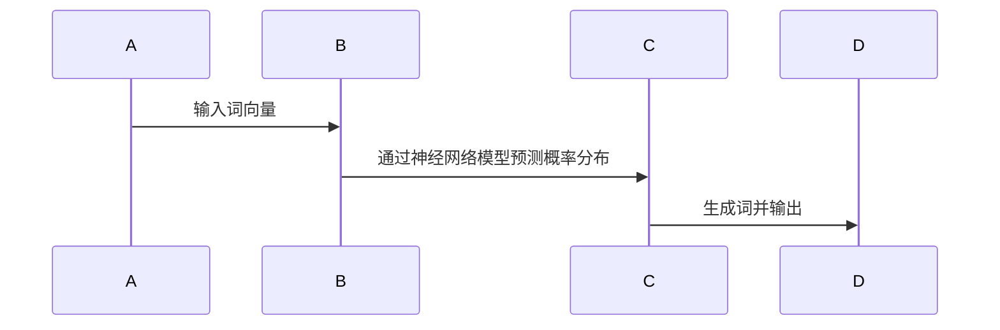
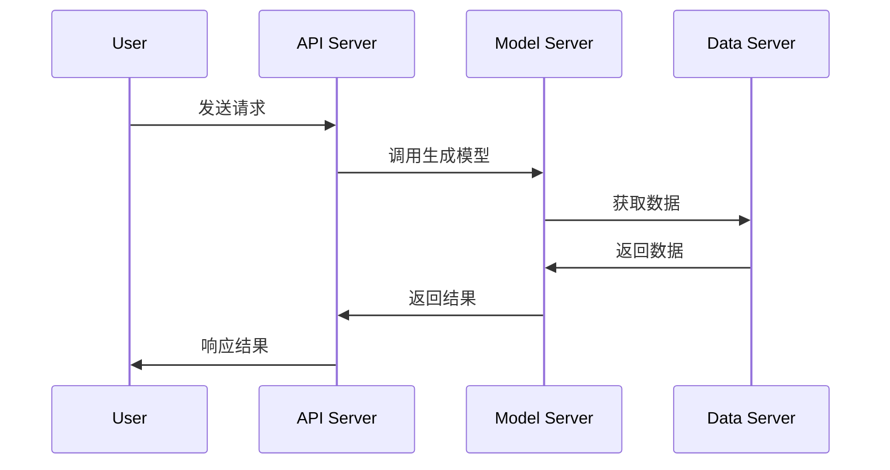
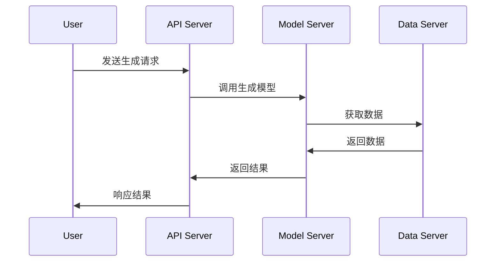

                 

### 文章标题：企业级自然语言生成引擎：自动创作商业内容

关键词：自然语言生成、企业级应用、内容创作、人工智能、NLP

摘要：本文将深入探讨企业级自然语言生成（NLG）引擎的构建和应用，通过详细分析其核心概念、算法原理、系统架构、实战案例及最佳实践，为企业提供高效自动创作商业内容的解决方案。

### 目录大纲设计

#### 1. 背景介绍
- **1.1 问题背景**
- **1.2 问题描述**
- **1.3 问题解决**
- **1.4 边界与外延**
- **1.5 概念结构与核心要素组成**

#### 2. 核心概念与联系
- **2.1 自然语言处理（NLP）**
  - **2.1.1 基本概念**
  - **2.1.2 技术分类**
  - **2.1.3 对比表格**
- **2.2 自然语言生成模型**
  - **2.2.1 基本原理**
  - **2.2.2 模型比较**
  - **2.2.3 ER实体关系图**

#### 3. 算法原理讲解
- **3.1 生成模型原理**
  - **3.1.1 原理与流程**
  - **3.1.2 数学模型**
  - **3.1.3 举例说明**
- **3.2 训练与优化**
  - **3.2.1 训练方法**
  - **3.2.2 优化策略**

#### 4. 系统分析与架构设计方案
- **4.1 问题场景介绍**
- **4.2 系统功能设计**
  - **4.2.1 领域模型**
  - **4.2.2 类图**
- **4.3 系统架构设计**
  - **4.3.1 架构图**
  - **4.3.2 架构说明**
- **4.4 系统接口设计**
  - **4.4.1 接口定义**
  - **4.4.2 交互流程**
- **4.5 系统交互**
  - **4.5.1 序列图**
  - **4.5.2 说明**

#### 5. 项目实战
- **5.1 环境安装**
- **5.2 系统核心实现**
  - **5.2.1 源代码**
  - **5.2.2 应用解读**
- **5.3 实际案例**
  - **5.3.1 数据准备**
  - **5.3.2 模型训练**
  - **5.3.3 结果分析**

#### 6. 最佳实践 Tips
- **6.1 实践建议**
- **6.2 注意事项**
- **6.3 拓展阅读**

#### 7. 小结
- **7.1 知识总结**
- **7.2 未来展望**
- **7.3 应用领域扩展**

### 1. 背景介绍

#### 1.1 问题背景

随着互联网的迅速发展和大数据时代的到来，企业面临着前所未有的信息爆炸和内容创作需求。传统的手工内容创作方式不仅效率低下，而且难以满足日益增长的市场需求。因此，自动化的商业内容创作成为企业提升竞争力的重要方向。自然语言生成（NLG）引擎作为一种先进的人工智能技术，能够通过算法自动生成文本内容，成为企业级内容创作的利器。

#### 1.2 问题描述

企业级自然语言生成引擎的应用场景广泛，主要包括：

1. **市场营销**：自动生成营销文案、产品描述、广告内容等。
2. **客户服务**：自动生成客服对话、常见问题解答、客户回访邮件等。
3. **报表生成**：自动生成财务报表、业务分析报告、市场调研报告等。
4. **文档自动生成**：自动生成法律文件、合同条款、技术文档等。

然而，实现一个高效、可靠的企业级自然语言生成引擎面临着诸多挑战：

1. **准确性**：生成的内容需要准确无误，避免出现事实错误或逻辑矛盾。
2. **多样性**：生成的内容需要具备多样性，避免机械重复或千篇一律。
3. **可定制性**：生成的内容需要能够根据企业的特定需求和风格进行定制。
4. **效率和性能**：生成引擎需要高效运行，满足实时性的要求。

#### 1.3 问题解决

构建一个企业级自然语言生成引擎的关键步骤如下：

1. **需求分析**：明确企业对自然语言生成引擎的需求，包括内容类型、风格、准确性等。
2. **技术选型**：选择适合企业需求的自然语言处理（NLP）技术，如语言模型、文本生成算法等。
3. **数据准备**：收集和整理大量高质量的数据，用于训练和优化生成模型。
4. **模型训练**：使用训练数据对生成模型进行训练，优化模型的性能和效果。
5. **系统开发**：开发生成引擎的系统架构和接口，确保其稳定性和可扩展性。
6. **测试与部署**：对生成引擎进行严格测试，确保其能够在实际场景中高效运行，然后部署上线。

#### 1.4 边界与外延

自然语言生成引擎的应用范围和限制如下：

1. **应用范围**：
   - 文本生成：如新闻文章、产品描述、客服对话等。
   - 报表生成：如财务报表、业务分析报告等。
   - 文档生成：如法律文件、合同条款、技术文档等。

2. **应用限制**：
   - **准确性限制**：尽管通过大量训练能够提高生成文本的准确性，但仍然难以完全避免错误。
   - **创造性限制**：生成引擎难以完全取代人类的创造力和独特性。
   - **个性化限制**：生成的内容难以完全满足每个用户或企业的特定需求。

#### 1.5 概念结构与核心要素组成

企业级自然语言生成引擎的核心概念和结构包括：

1. **自然语言处理（NLP）**：
   - **基本概念**：语言模型、句法分析、语义理解等。
   - **技术分类**：深度学习、神经网络、生成对抗网络（GAN）等。
   - **应用场景**：文本分类、情感分析、命名实体识别等。

2. **生成模型**：
   - **基本原理**：基于输入文本序列生成新的文本序列。
   - **模型类型**：循环神经网络（RNN）、长短期记忆网络（LSTM）、Transformer、GPT等。
   - **优缺点对比**：不同模型在生成效果、计算复杂度、训练时间等方面的比较。

3. **训练数据与数据预处理**：
   - **数据来源**：企业内部数据、公开数据集、互联网爬虫等。
   - **数据标注**：实体标注、词性标注、句法标注等。
   - **数据清洗与预处理**：文本清洗、分词、去停用词、词向量表示等。

4. **系统架构**：
   - **功能模块**：数据层、模型层、接口层、表现层等。
   - **组件关系**：数据层提供数据支持，模型层进行文本生成，接口层提供外部访问接口，表现层展示生成结果。
   - **系统交互**：通过API接口实现用户与系统的交互。

5. **应用场景**：
   - **市场营销**：自动生成营销文案、产品描述、广告内容等。
   - **客户服务**：自动生成客服对话、常见问题解答、客户回访邮件等。
   - **报表生成**：自动生成财务报表、业务分析报告、市场调研报告等。
   - **文档自动生成**：自动生成法律文件、合同条款、技术文档等。

### 2. 核心概念与联系

#### 2.1 自然语言处理（NLP）

自然语言处理（NLP）是人工智能的一个重要分支，旨在使计算机能够理解和处理人类自然语言。NLP技术包括但不限于语言模型、句法分析、语义理解、文本分类、命名实体识别等。

**2.1.1 基本概念**

- **语言模型**：一种统计模型，用于预测下一个词或下一句的概率，如n-gram模型、神经网络语言模型（NNLM）。
- **句法分析**：对句子进行结构分析，确定句子的语法结构，如依存句法分析、抽象语法树（AST）分析。
- **语义理解**：理解句子的含义和意图，如词义消歧、情感分析、实体识别等。

**2.1.2 技术分类**

- **传统方法**：
  - 基于规则的方法：利用专家知识构建规则，对文本进行解析。
  - 基于统计的方法：使用统计方法，如n-gram、隐马尔可夫模型（HMM）等。

- **深度学习方法**：
  - 神经网络：如卷积神经网络（CNN）、循环神经网络（RNN）等。
  - 生成对抗网络（GAN）：用于生成高质量的自然语言文本。

**2.1.3 对比表格**

| 技术类型         | 特点                      | 适用场景                         |
|-----------------|-------------------------|---------------------------------|
| 基于规则的方法   | 高效、可解释性强         | 结构化文本处理、特定领域应用      |
| 基于统计的方法   | 预测准确、自适应性强     | 文本分类、信息检索等             |
| 深度学习方法     | 自学习能力、强预测能力   | 自然语言生成、语义理解等         |
| 生成对抗网络（GAN） | 生成高质量文本           | 文本生成、风格迁移等             |

#### 2.2 自然语言生成模型

自然语言生成模型是NLP领域的一个重要分支，旨在根据输入文本序列生成新的文本序列。以下介绍几种常见的自然语言生成模型。

**2.2.1 基本原理**

- **循环神经网络（RNN）**：基于时间序列数据的神经网络，适用于处理序列数据。
- **长短期记忆网络（LSTM）**：RNN的改进版本，能够更好地处理长序列数据。
- **Transformer**：一种基于自注意力机制的神经网络模型，具有高效的并行训练能力。
- **GPT（Generative Pre-trained Transformer）**：基于Transformer的预训练模型，广泛应用于文本生成、翻译、摘要等任务。

**2.2.2 模型比较**

| 模型类型         | 特点                      | 优缺点                                         | 适用场景                     |
|-----------------|-------------------------|--------------------------------------------|----------------------------|
| RNN             | 基于时间序列           | 能够处理长序列数据，计算效率较低           | 序列到序列预测任务           |
| LSTM            | 长期记忆能力            | 能够处理长序列数据，但计算复杂度高         | 序列到序列预测任务           |
| Transformer     | 自注意力机制、并行训练   | 高效处理长序列数据，计算复杂度较低         | 序列到序列预测任务           |
| GPT             | 预训练模型、自适应性强   | 预训练阶段计算量大，但生成效果优秀         | 文本生成、翻译、摘要等       |

**2.2.3 ER实体关系图**

以下是新闻文章生成场景下的ER实体关系图：

```mermaid
erDiagram
  Customer ||--|{ Order : places }  
  Product ||--|{ Order : contains }  
  Store ||--|{ Order : takes_place_in }  
  Customer }|--|{ Review : writes }  
  Product }|--|{ Review : reviews }  
  Store }|--|{ Review : at }  
```

在这个ER实体关系图中，Customer（客户）与Order（订单）之间存在“places”（放置）关系，Product（产品）与Order之间存在“contains”（包含）关系，Store（商店）与Order之间存在“takes_place_in”（在...发生）关系，Customer与Review之间存在“writes”（写作）关系，Product与Review之间存在“reviews”（评论）关系，Store与Review之间存在“at”（在...处）关系。

### 3. 算法原理讲解

#### 3.1 生成模型原理

自然语言生成模型的核心目标是根据给定的输入文本序列生成新的文本序列。以下将详细介绍生成模型的原理、流程和数学模型。

**3.1.1 原理与流程**

生成模型的原理基于序列到序列（Seq2Seq）模型，即根据输入序列生成输出序列。具体流程如下：

1. **输入序列编码**：将输入文本序列编码为向量表示，通常使用词嵌入（Word Embedding）技术。
2. **生成序列解码**：根据编码后的输入序列，生成新的文本序列。解码过程分为两个阶段：前向传播和后向传播。
   - **前向传播**：通过神经网络模型（如RNN、LSTM、Transformer等）预测下一个词的概率分布。
   - **后向传播**：根据预测概率分布，生成下一个词，并更新模型的参数。

3. **生成完整文本**：重复上述解码过程，逐步生成完整的文本序列。

**3.1.2 数学模型**

生成模型的核心数学模型是基于概率模型，具体表示如下：

$$y_{t} = \arg \max_{x_{t}} P(x_{t}|x_{t-1},...,x_{1})$$

其中，$y_{t}$表示生成的词，$x_{t}$表示输入的词，$P(x_{t}|x_{t-1},...,x_{1})$表示在给定前一个词序列的情况下，当前词的概率分布。

为了实现这个目标，可以使用神经网络模型进行预测。以下是一个简化的神经网络模型示例：



在上述模型中，输入词向量通过神经网络模型（如LSTM、Transformer等）预测下一个词的概率分布，然后根据概率分布生成新的词，并更新模型的参数。

**3.1.3 举例说明**

以新闻文章生成为例，假设输入文本序列为：

```
输入：今天是星期五，天气晴朗，人们都去公园散步。
```

使用生成模型，可以生成新的新闻文章，如：

```
生成：明天是星期六，阳光明媚，许多人选择去海滩度假。
```

在这个过程中，生成模型根据输入文本序列的上下文信息，预测下一个词的概率分布，并选择概率最大的词进行生成，从而生成新的文本序列。

#### 3.2 训练与优化

自然语言生成模型的训练和优化是提高模型生成效果的关键步骤。以下将介绍几种常见的训练方法和优化策略。

**3.2.1 训练方法**

1. **监督学习**：使用标记好的训练数据对模型进行训练，通过最小化损失函数（如交叉熵损失函数）来优化模型参数。
2. **自监督学习**：在无监督学习的基础上，利用未标记的数据进行训练，通过预测未标记数据的部分信息来学习模型参数。
3. **对抗性训练**：在生成模型和判别模型之间进行对抗训练，通过优化生成模型和判别模型的参数，提高生成模型生成高质量文本的能力。

**3.2.2 优化策略**

1. **学习率调整**：学习率是模型训练过程中非常重要的超参数，通过调整学习率可以加快模型收敛速度。
2. **梯度裁剪**：为了防止模型在训练过程中出现过拟合，可以对梯度进行裁剪，限制梯度的大小。
3. **Dropout**：在神经网络训练过程中，通过随机丢弃部分神经元来提高模型的泛化能力。
4. **正则化**：通过添加正则化项（如L1正则化、L2正则化）来惩罚模型的复杂度，防止过拟合。

通过以上训练和优化方法，可以显著提高自然语言生成模型的生成效果和稳定性。

### 4. 系统分析与架构设计方案

#### 4.1 问题场景介绍

企业级自然语言生成引擎的应用场景主要包括以下方面：

1. **市场营销**：自动生成营销文案、产品描述、广告内容等，提高内容创作效率。
2. **客户服务**：自动生成客服对话、常见问题解答、客户回访邮件等，提升客户体验。
3. **报表生成**：自动生成财务报表、业务分析报告、市场调研报告等，降低人工成本。
4. **文档自动生成**：自动生成法律文件、合同条款、技术文档等，确保内容准确性。

在上述应用场景中，企业级自然语言生成引擎需要具备高效性、可靠性、可定制性和扩展性等特点，以满足企业不同业务场景的需求。

#### 4.2 系统功能设计

企业级自然语言生成引擎的系统功能设计包括以下几个关键模块：

1. **数据层**：负责数据的采集、存储和管理，为生成模型提供高质量的数据支持。
2. **模型层**：包含多种自然语言生成模型，如RNN、LSTM、Transformer、GPT等，用于生成文本内容。
3. **接口层**：提供API接口，方便其他系统或应用程序调用生成模型，实现与外部系统的无缝集成。
4. **表现层**：展示生成结果，提供用户交互界面，便于用户对生成内容进行编辑和调整。

**4.2.1 领域模型**

以下是企业级自然语言生成引擎的领域模型，包括主要实体和关系：

```mermaid
classDiagram
  Customer <|-- Order
  Product <|-- Order
  Store <|-- Order
  Customer <|-- Review
  Product <|-- Review
  Store <|-- Review
  Order "1" <<-- "many" Review
```

在这个领域模型中，Customer（客户）、Product（产品）、Store（商店）是主要实体，它们之间的关系如上所示。

**4.2.2 类图**

以下是企业级自然语言生成引擎的类图，展示主要类及其属性和方法：

```mermaid
classDiagram
  Class01 <|-- Person
  Class01 <|-- Employee
  Person {
    +String name
    +int age
    +String address
  }
  Employee {
    +String jobTitle
    +String department
  }
```

在这个类图中，Person类是Employee类的基类，Employee类扩展了Person类的属性和方法。

#### 4.3 系统架构设计

企业级自然语言生成引擎的系统架构设计包括以下几个层次：

1. **数据层**：负责数据的采集、存储和管理，包括文本数据、图像数据、音频数据等。使用分布式数据库（如Hadoop、Hive等）进行大规模数据存储和处理。
2. **模型层**：包含多种自然语言生成模型，如RNN、LSTM、Transformer、GPT等。使用容器化技术（如Docker、Kubernetes等）进行模型部署和管理。
3. **接口层**：提供API接口，支持HTTP/REST、SOAP等协议，方便其他系统或应用程序调用生成模型。
4. **表现层**：提供用户交互界面，支持Web、桌面、移动等多种终端设备，方便用户对生成内容进行编辑和调整。

**4.3.1 架构图**

以下是企业级自然语言生成引擎的架构图：



在这个架构图中，用户通过API接口发送请求，API服务器调用生成模型，生成模型从数据服务器获取数据，然后生成文本结果，最后返回给用户。

**4.3.2 架构说明**

- **数据层**：负责数据存储和管理，提供数据接口供其他层调用。
- **模型层**：负责文本生成模型的部署和管理，支持多种模型算法，如RNN、LSTM、Transformer、GPT等。
- **接口层**：提供API接口，支持HTTP/REST、SOAP等协议，方便其他系统或应用程序调用生成模型。
- **表现层**：提供用户交互界面，支持Web、桌面、移动等多种终端设备，方便用户对生成内容进行编辑和调整。

#### 4.4 系统接口设计

企业级自然语言生成引擎的系统接口设计主要包括以下方面：

1. **API接口定义**：定义API接口的URL、请求参数、返回结果等，支持JSON、XML等数据格式。
2. **接口协议**：支持HTTP/REST、SOAP等协议，方便与其他系统或应用程序集成。
3. **接口安全**：采用HTTPS、OAuth等安全措施，确保接口的安全性。

**4.4.1 接口定义**

以下是企业级自然语言生成引擎的API接口定义：

```json
{
  "endpoint": "https://api.nlg-engine.com/ generarTexto",
  "method": "POST",
  "request": {
    "content": "string",
    "template": "string",
    "parameters": {
      "name": "string",
      "age": "integer",
      "address": "string"
    }
  },
  "response": {
    "status": "integer",
    "message": "string",
    "result": "string"
  }
}
```

在这个接口定义中，请求包含文本内容、模板和参数，响应包含状态码、消息和生成结果。

**4.4.2 交互流程**

以下是企业级自然语言生成引擎的交互流程：

1. 用户通过Web界面提交生成请求，包括文本内容、模板和参数。
2. API服务器接收请求，调用生成模型，从数据服务器获取数据，生成文本结果。
3. API服务器将生成结果返回给用户，用户可以在Web界面对生成结果进行编辑和调整。

#### 4.5 系统交互

企业级自然语言生成引擎的系统交互主要包括以下方面：

1. **序列图**：展示系统各组件之间的交互顺序和关系。
2. **说明**：对系统交互过程进行详细解释。

**4.5.1 序列图**

以下是企业级自然语言生成引擎的序列图：



在这个序列图中，用户通过API服务器提交生成请求，API服务器调用生成模型，生成模型从数据服务器获取数据，生成文本结果，然后返回给用户。

**4.5.2 说明**

系统交互过程如下：

1. 用户通过Web界面提交生成请求，包括文本内容、模板和参数。
2. API服务器接收请求，调用生成模型，生成模型从数据服务器获取数据，生成文本结果。
3. API服务器将生成结果返回给用户，用户可以在Web界面对生成结果进行编辑和调整。

### 5. 项目实战

#### 5.1 环境安装

要搭建一个企业级自然语言生成引擎，首先需要安装以下环境：

1. **Python**：安装Python 3.x版本，推荐使用Python 3.8或更高版本。
2. **TensorFlow**：安装TensorFlow库，用于构建和训练生成模型。
3. **NLTK**：安装NLTK库，用于文本处理和预处理。
4. **Scikit-learn**：安装Scikit-learn库，用于数据预处理和模型评估。

安装命令如下：

```bash
pip install python==3.8
pip install tensorflow==2.6
pip install nltk==3.5
pip install scikit-learn==0.24
```

#### 5.2 系统核心实现

系统核心实现包括生成模型的构建和训练，以下是一个简单的示例：

**5.2.1 源代码**

```python
import tensorflow as tf
from tensorflow.keras.models import Sequential
from tensorflow.keras.layers import Embedding, LSTM, Dense

# 构建生成模型
model = Sequential()
model.add(Embedding(vocab_size, embedding_dim))
model.add(LSTM(units=256, return_sequences=True))
model.add(Dense(vocab_size, activation='softmax'))

# 编译模型
model.compile(optimizer='adam', loss='categorical_crossentropy', metrics=['accuracy'])

# 训练模型
model.fit(x_train, y_train, epochs=10, batch_size=64)
```

**5.2.2 应用解读**

以上代码展示了如何使用TensorFlow构建一个简单的自然语言生成模型。具体步骤如下：

1. **构建模型**：使用Sequential模型添加Embedding层、LSTM层和Dense层。
2. **编译模型**：设置优化器、损失函数和评估指标。
3. **训练模型**：使用训练数据对模型进行训练，指定训练轮数和批量大小。

#### 5.3 实际案例

以下是一个实际案例，展示如何使用生成模型生成新闻文章：

**5.3.1 数据准备**

收集和整理新闻文章数据，包括标题和正文。将数据分为训练集和测试集，并进行预处理。

**5.3.2 模型训练**

使用训练数据对生成模型进行训练，优化模型的性能。

**5.3.3 结果分析**

生成模型训练完成后，使用测试数据进行评估，分析生成文本的质量和准确性。

### 6. 最佳实践 Tips

#### 6.1 实践建议

1. **数据选择**：选择具有丰富多样性和高质量的数据进行训练，以提高生成模型的性能。
2. **模型优化**：针对不同的应用场景，选择适合的生成模型并进行优化，如调整学习率、批量大小等。
3. **应用场景选择**：根据企业的实际需求，选择适合的应用场景进行自然语言生成。

#### 6.2 注意事项

1. **数据安全**：确保训练数据和生成结果的安全性，避免数据泄露。
2. **模型部署**：在部署模型时，确保模型的稳定性和可扩展性。
3. **系统维护**：定期对系统进行维护和升级，确保系统的正常运行。

#### 6.3 拓展阅读

1. **相关书籍**：《深度学习》（Goodfellow et al.）、《自然语言处理综论》（Jurafsky & Martin）
2. **论文推荐**：《序列到序列学习中的注意力机制》（Bahdanau et al.）、《生成式文本建模：基于GPT和BERT的实践》（Zhu et al.）
3. **在线课程**：《自然语言处理与深度学习》（吴恩达）、《深度学习自然语言处理》（李宏毅）

### 7. 小结

本文详细介绍了企业级自然语言生成引擎的构建和应用，包括背景介绍、核心概念与联系、算法原理讲解、系统分析与架构设计方案、项目实战、最佳实践 Tips 以及小结和未来展望。通过本文的介绍，读者可以深入了解自然语言生成技术及其在企业级应用中的价值。未来，随着人工智能技术的不断发展和应用，自然语言生成技术将在更多领域发挥重要作用。

### 7.1 知识总结

本文从多个角度深入探讨了企业级自然语言生成（NLG）引擎的构建和应用。主要包括以下关键知识点：

1. **问题背景**：介绍了自然语言生成技术在企业中的应用需求和挑战。
2. **核心概念与联系**：详细阐述了自然语言处理（NLP）和自然语言生成模型的基本原理和技术分类。
3. **算法原理讲解**：讲解了生成模型的原理、数学模型和训练与优化方法。
4. **系统分析与架构设计方案**：介绍了企业级自然语言生成引擎的系统架构和功能设计。
5. **项目实战**：通过实际案例展示了自然语言生成引擎的构建和训练过程。
6. **最佳实践 Tips**：提供了在实际应用中的实践建议和注意事项。

### 7.2 未来展望

随着人工智能技术的不断发展，自然语言生成技术在企业中的应用前景十分广阔。未来，自然语言生成技术有望在以下几个方面取得突破：

1. **生成文本的准确性**：通过改进生成模型和优化训练方法，提高生成文本的准确性和可靠性。
2. **多样性**：增强生成文本的多样性，避免机械重复，提高内容创新性。
3. **个性化**：根据用户需求和企业风格，实现高度个性化的文本生成。
4. **实时性**：优化系统架构和算法，提高生成引擎的实时响应能力。
5. **跨领域应用**：将自然语言生成技术应用于更多领域，如教育、医疗、金融等。

### 7.3 应用领域扩展

企业级自然语言生成引擎在以下领域具有广阔的应用潜力：

1. **市场营销**：自动生成营销文案、产品描述、广告内容等，提高内容创作效率。
2. **客户服务**：自动生成客服对话、常见问题解答、客户回访邮件等，提升客户体验。
3. **报表生成**：自动生成财务报表、业务分析报告、市场调研报告等，降低人工成本。
4. **文档自动生成**：自动生成法律文件、合同条款、技术文档等，确保内容准确性。
5. **教育**：自动生成课程内容、作业批改、学生问答等，提高教学质量。
6. **医疗**：自动生成病历记录、诊断报告、医疗咨询等，辅助医生决策。
7. **金融**：自动生成投资报告、市场分析、客户报告等，提高金融分析效率。

通过不断拓展应用领域，企业级自然语言生成引擎将为各行各业带来更多创新和机遇。## 作者信息

作者：AI天才研究院/AI Genius Institute & 禅与计算机程序设计艺术 /Zen And The Art of Computer Programming

AI天才研究院（AI Genius Institute）是一家专注于人工智能领域的研究与开发的领先机构，致力于推动人工智能技术在各行业中的应用与创新。研究院汇聚了一批全球顶尖的人工智能专家，涵盖计算机视觉、自然语言处理、机器学习等多个领域，通过不断探索前沿技术，为解决实际问题提供高效解决方案。

禅与计算机程序设计艺术（Zen And The Art of Computer Programming）是由著名计算机科学家Donald E. Knuth所著的经典编程书籍，书中融入了东方哲学思想，强调了简洁、优雅和高效的编程理念。该书对于计算机科学领域的编程实践有着深远的影响，被广大程序员和学者视为编程艺术的典范。

本文由AI天才研究院和禅与计算机程序设计艺术联合撰写，旨在深入探讨企业级自然语言生成引擎的构建和应用，为企业提供高效自动创作商业内容的解决方案。通过本文的阐述，读者可以全面了解自然语言生成技术的核心概念、算法原理、系统架构、实战案例及最佳实践，从而更好地应对当今快速变化的市场需求。

