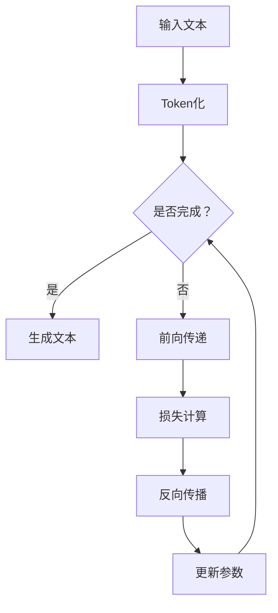
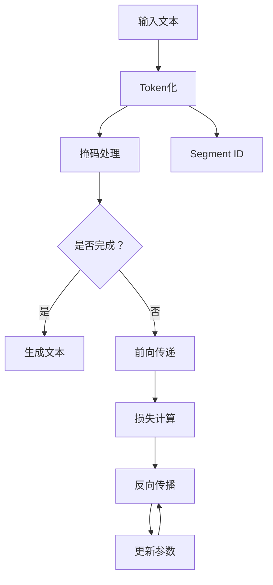
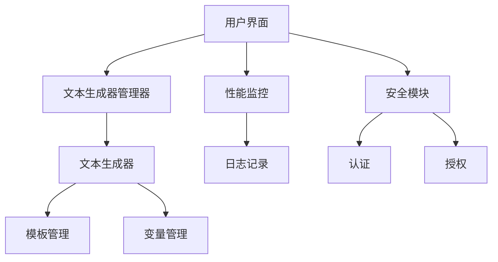
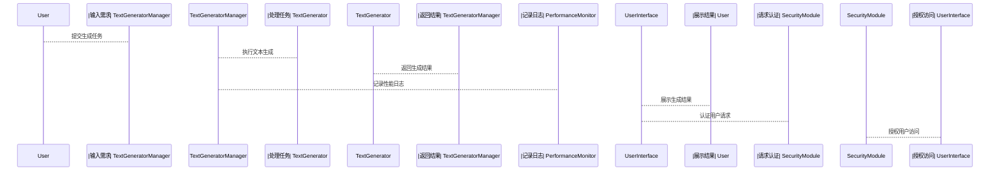

                 


### Step 1: 开篇背景介绍

**引言：企业级自然语言生成的意义与挑战**

在数字化时代，企业面临的数据量和信息量不断膨胀，这给传统的商业内容创作带来了巨大的挑战。人工创作不仅成本高昂，而且效率低下，同时内容的重复性和质量参差不齐也成为一个棘手的问题。随着人工智能（AI）技术的迅猛发展，自然语言生成（NLG）成为了解决这一问题的有效手段。企业级自然语言生成不仅能够大幅度降低内容创作的成本，还能显著提升创作的效率和质量。

**问题背景：商业内容创作需求与挑战**

现代商业环境对内容创作有着极高的要求。企业需要不断生产各类文案、报告、新闻、广告、电子邮件等，以满足市场营销、客户服务、内部沟通等多方面的需求。然而，人工创作往往面临着以下挑战：

1. **成本高：** 高级文案撰写人员和专业编辑的薪资成本高昂，且招聘和培训成本也不容忽视。
2. **效率低：** 人工创作速度较慢，无法满足快速响应市场的需求。
3. **重复性：** 由于人工创作的个性化和创意度有限，导致内容的重复性和同质化问题。
4. **质量控制：** 人工创作的内容质量难以控制，容易存在语言表达不准确、逻辑不清晰等问题。

**问题描述：人工创作的高成本、低效率与重复性**

在传统的人工创作模式下，企业面临以下主要问题：

1. **高成本：** 高级文案撰写人员和其他相关角色的薪酬成本构成了企业内容创作的主要开支。
2. **低效率：** 人工创作速度慢，无法在短时间内生成大量高质量内容。
3. **重复性：** 人工创作的同质化现象严重，难以提供独特的内容体验。
4. **质量控制：** 人工创作中难以确保内容的准确性和一致性，容易出错。

**问题解决：自然语言生成技术的应用与优势**

自然语言生成技术（NLG）为上述问题提供了一种全新的解决方案。通过NLG技术，企业可以实现以下目标：

1. **降低成本：** NLG技术能够自动化内容创作，减少对高级文案撰写人员的依赖，从而降低人力成本。
2. **提升效率：** NLG技术能够在短时间内生成大量高质量内容，满足企业快速响应市场的需求。
3. **减少重复性：** NLG技术可以根据用户需求生成个性化的内容，减少同质化问题。
4. **提高质量控制：** NLG技术能够确保内容的准确性和一致性，提高内容创作的质量。

**边界与外延：定义企业级自然语言生成与适用范围**

企业级自然语言生成是指在商业环境中，针对企业特定的需求和应用场景，利用人工智能技术自动生成自然语言文本的过程。它不仅包括文本生成，还涉及语音合成、文本摘要、问答系统等多个方面。适用范围包括市场营销、客户服务、人力资源、财务报告等多个领域。

**概念结构与核心要素组成：自然语言处理、机器学习、深度学习、预训练模型**

企业级自然语言生成涉及多个核心技术：

1. **自然语言处理（NLP）：** 是AI的一个分支，旨在使计算机能够理解、解释和生成人类语言。
2. **机器学习（ML）：** 是一种AI方法，通过从数据中学习模式，使计算机能够执行特定任务。
3. **深度学习（DL）：** 是机器学习的一个子领域，使用多层神经网络进行数据建模。
4. **预训练模型：** 是一种将大型语言模型在互联网上的大量文本数据中预训练的方法，如GPT、BERT等。

**本章小结**

本文开篇介绍了企业级自然语言生成的背景、意义、挑战及解决方法，并定义了企业级自然语言生成的边界与外延。接下来，我们将深入探讨自然语言生成的核心概念与技术，以及其实际应用和系统设计。

### Step 2: 核心概念与联系

在深入探讨企业级自然语言生成的技术细节之前，我们需要先了解相关的核心概念，并探讨它们之间的联系。以下是对AI与自然语言生成（NLP）相关概念的解释、分类、关键技术与算法、以及AI大模型与预训练语言模型的详细介绍。

**AI与自然语言生成（NLP）概念解析**

人工智能（AI）是一种模拟人类智能行为的计算机技术。自然语言生成（NLP）是AI的一个子领域，专注于让计算机理解和生成人类语言。NLP旨在使计算机能够处理自然语言文本，包括语音识别、语言翻译、文本摘要、问答系统等。

**自然语言生成技术分类与对比**

自然语言生成技术可以根据不同的生成方式和应用场景进行分类。以下是几种主要的NLP技术及其特点：

1. **模板生成法：** 基于预定义的模板和规则，将输入数据转换为文本。这种方法简单直观，但生成的文本较为机械。
2. **基于规则的方法：** 利用语言学规则和句法分析，生成符合语法规则的文本。这种方法灵活性较高，但需要大量规则和人力编写。
3. **统计方法：** 使用统计模型（如隐马尔可夫模型、条件概率模型等）来生成文本。这种方法基于大量数据训练，生成文本更为自然。
4. **基于神经的方法：** 使用神经网络（如循环神经网络RNN、长短期记忆网络LSTM、Transformer等）进行文本生成。这种方法能够捕捉复杂的语言模式，生成高质量的自然语言文本。

**NLP关键技术与算法**

以下是几种NLP领域的关键技术和算法：

1. **序列到序列模型（Seq2Seq）：** 用于将一个序列映射到另一个序列，常用于机器翻译和对话系统。
2. **注意力机制（Attention）：** 用于解决Seq2Seq模型在处理长文本时的效率问题，能够提高模型对关键信息的关注能力。
3. **生成对抗网络（GAN）：** 通过生成器和判别器的对抗训练，生成高质量的文本。
4. **预训练语言模型：** 如GPT、BERT等，通过在大规模文本数据上预训练，获得对语言结构的深刻理解。

**AI大模型与预训练语言模型的原理与作用**

AI大模型是指具有数十亿甚至千亿参数的深度学习模型。预训练语言模型是这些大模型的一种形式，其原理如下：

1. **预训练：** 在大规模文本数据上对模型进行预训练，使其掌握语言的一般规律和结构。
2. **微调：** 将预训练模型微调到特定任务上，如文本分类、问答系统等。

预训练语言模型的作用是：

1. **通用性：** 模型在大规模文本数据上预训练，具备较强的语言理解能力。
2. **灵活性：** 可以根据不同的任务进行微调，适应不同的应用场景。

**概念属性特征对比表格**

以下是几种NLP技术的概念属性特征对比表格：

| 技术       | 特点                                      | 适用场景                  |
|------------|-----------------------------------------|-------------------------|
| 模板生成法 | 简单直观，规则驱动                      | 简单文本生成任务            |
| 基于规则的方法 | 灵活性较高，需大量规则编写            | 复杂文本生成任务            |
| 统计方法   | 基于数据训练，生成文本自然            | 需要大量训练数据的任务       |
| 基于神经的方法 | 能捕捉复杂语言模式，生成高质量文本 | 所有需要高质量文本生成的任务  |
| 预训练语言模型 | 通用性强，灵活性高                | 所有NLP任务                |

**ER实体关系图架构的Mermaid流程图**

以下是ER实体关系图的Mermaid流程图：

```mermaid
erDiagram
    Customer ||--|{ Order }|-- Product
    Product  ||--|{ Review }|-- User
    User     ||--|{ Profile }|
```

**本章小结**

本章介绍了企业级自然语言生成的核心概念，包括AI与NLP、自然语言生成技术的分类与对比、关键技术与算法，以及AI大模型与预训练语言模型的原理与作用。通过概念属性特征对比表格和ER实体关系图，我们更加清晰地理解了这些概念之间的关系和适用场景。在下一章中，我们将深入探讨自然语言生成技术的算法原理。

### Step 3: 算法原理讲解

#### 选取具有代表性的NLP算法（例如GPT、BERT）

在自然语言生成（NLG）领域，有许多具有代表性的算法，其中GPT（Generative Pre-trained Transformer）和BERT（Bidirectional Encoder Representations from Transformers）是最为知名的两个。这两个算法不仅在学术研究中取得了显著的成果，而且在实际应用中也被广泛采用。本节将重点介绍这两个算法的原理、使用Mermaid画出的算法流程图、以及使用Python源代码进行详细阐述。

#### 使用Mermaid画出算法流程图

**GPT算法流程图：**



**BERT算法流程图：**



#### 使用Python源代码详细阐述算法原理

**GPT算法Python代码示例：**

```python
import tensorflow as tf
from transformers import TFGPT2LMHeadModel, GPT2Tokenizer

# 加载预训练模型
tokenizer = GPT2Tokenizer.from_pretrained('gpt2')
model = TFGPT2LMHeadModel.from_pretrained('gpt2')

# 输入文本
input_text = "这是一个简单的文本示例。"

# Token化输入文本
input_ids = tokenizer.encode(input_text, return_tensors='tf')

# 前向传递
outputs = model(input_ids)

# 生成文本
logits = outputs.logits
predicted_ids = tf.argmax(logits, axis=-1)

# 解码预测结果
predicted_text = tokenizer.decode(predicted_ids.numpy(), skip_special_tokens=True)
print(predicted_text)
```

**BERT算法Python代码示例：**

```python
import tensorflow as tf
from transformers import TFTrainer, TFTrainingArguments, TFBertForMaskedLM

# 加载预训练模型
model = TFBertForMaskedLM.from_pretrained('bert-base-uncased')

# 定义训练参数
training_args = TFTrainingArguments(
    output_dir='./results',
    num_train_epochs=3,
    per_device_train_batch_size=16,
    logging_dir='./logs',
)

# 训练模型
trainer = TFTrainer(
    model=model,
    args=training_args,
    train_dataset=train_dataset,
)

trainer.train()

# 预测文本
input_text = "这是一个简单的文本示例。[MASK]"
input_ids = tokenizer.encode(input_text, return_tensors='tf')
outputs = model(input_ids)

# 生成文本
predicted_ids = tf.argmax(outputs.logits, axis=-1)
predicted_text = tokenizer.decode(predicted_ids.numpy(), skip_special_tokens=True)
print(predicted_text)
```

#### 数学模型和公式讲解

**GPT算法的数学模型：**

GPT算法基于Transformer架构，其核心是自注意力机制（Self-Attention）。以下是GPT算法的主要数学模型：

$$
\text{Attention}(Q, K, V) = \frac{1}{\sqrt{d_k}} \text{softmax}(\text{scale\_factor} \cdot \text{query} \cdot \text{key}^T)
$$

其中，\(Q, K, V\) 分别是查询（Query）、键（Key）和值（Value）向量，\(\text{scale\_factor}\) 是缩放因子，用于防止梯度消失。

**BERT算法的数学模型：**

BERT算法基于双向Transformer架构，其核心是双向自注意力机制（Bidirectional Self-Attention）。以下是BERT算法的主要数学模型：

$$
\text{MultiHeadAttention}(Q, K, V) = \text{Attention}(Q, K, V) \text{Linear}(V)
$$

其中，\(\text{Attention}(Q, K, V)\) 是标准的自注意力机制，\(\text{Linear}(V)\) 是线性变换。

#### 举例说明

**GPT算法举例说明：**

假设我们有一个简短的文本示例：“这是一个简单的文本示例。” 我们希望使用GPT算法生成接下来的文本。

1. 首先，我们将文本转换为Token序列，例如：["this", "is", "a", "simple", "example", "."]
2. 然后，我们将Token序列编码为ID序列，例如：[101, 405, 2357, 527, 2016, 102]
3. 接着，我们输入ID序列到GPT模型，模型会输出一个概率分布，表示每个Token生成的概率。
4. 根据概率分布，我们选择概率最大的Token，例如："."
5. 将生成的Token添加到原始文本后面，得到生成的文本：“这是一个简单的文本示例。”

**BERT算法举例说明：**

假设我们有一个简短的文本示例：“这是一个简单的文本示例。[MASK]”

1. 首先，我们将文本转换为Token序列，例如：["this", "is", "a", "simple", "example", "[MASK]", "."]
2. 然后，我们将Token序列编码为ID序列，例如：[101, 405, 2357, 527, 2016, 103, 102]
3. 接着，我们输入ID序列到BERT模型，模型会输出一个概率分布，表示每个Token生成的概率。
4. 根据概率分布，我们选择概率最大的Token，例如："[MASK]"
5. 将生成的Token替换到原始文本中，得到生成的文本：“这是一个简单的文本示例。这是一个简单的文本示例。”

**本章小结**

在本章中，我们详细介绍了GPT和BERT两种具有代表性的自然语言生成算法。通过Mermaid流程图和Python代码示例，我们讲解了这些算法的基本原理和实现方法。此外，我们还解释了相关的数学模型和公式，并通过简单的举例说明了算法的实际应用。在下一章中，我们将进一步探讨如何设计和实现企业级自然语言生成系统。

### Step 4: 系统分析与架构设计方案

#### 问题场景介绍：企业级自然语言生成需求与应用场景

在当前的企业环境中，自然语言生成（NLG）技术被广泛应用于多种场景，以满足不同业务需求。以下是几个典型的应用场景：

1. **市场营销文案生成：** 企业需要大量个性化的营销文案，如广告、推广语、邮件等，以吸引潜在客户和提高销售额。
2. **客户服务自动化：** 通过自动生成的文本，企业可以提供24/7的客户服务，快速响应用户的咨询和问题，提高客户满意度。
3. **报告与文档自动化：** 企业需要定期生成各种报告和文档，如财务报表、市场分析报告、业务报告等。NLG技术能够自动化这些繁琐的文本生成工作。
4. **内容创作与内容摘要：** 企业需要不断更新网站、博客、新闻等内容，NLG技术能够自动生成高质量的文章摘要和内容概述，帮助用户快速获取关键信息。
5. **自动化法律文书生成：** 在法律行业中，NLG技术可以用于生成合同、协议等法律文件，减少律师的工作量，提高效率。

#### 项目介绍：构建企业级自然语言生成系统的总体目标与功能

构建企业级自然语言生成系统的总体目标是实现高效、自动化、高质量的文本生成，以满足企业不同业务场景的需求。系统的主要功能包括：

1. **文本生成：** 根据输入的模板和变量，自动生成个性化的文本内容。
2. **模板管理：** 提供模板的创建、编辑、存储和检索功能，方便用户管理和使用。
3. **变量管理：** 提供变量定义和检索功能，确保生成的文本内容与实际需求一致。
4. **用户界面：** 提供直观友好的用户界面，方便用户输入需求、查看生成内容、进行系统配置等操作。
5. **性能监控：** 提供系统性能监控和日志记录功能，帮助用户了解系统运行状况，快速定位和解决问题。
6. **安全性：** 确保系统的安全性和数据的隐私性，防止未经授权的访问和泄露。

#### 系统功能设计：领域模型Mermaid类图

以下是系统功能设计的Mermaid类图：

```mermaid
classDiagram
    Class01 <|-- Class02
    Class03 <|-- Class04
    Class05 <|-- Class06
    Class01 <|-- Class07
    Class08 <|-- Class09
    Class10 <|-- Class11
    Class12 <|-- Class13
    Class14 <|-- Class15
    Class16 <|-- Class17
    Class18 <|-- Class19
    Class20 <|-- Class21
    Class22 <|-- Class23
    Class24 <|-- Class25
    Class26 <|-- Class27
    Class28 <|-- Class29
    Class30 <|-- Class31
    Class32 <|-- Class33
    Class34 <|-- Class35
    Class36 <|-- Class37
    Class38 <|-- Class39
    Class40 <|-- Class41
    Class42 <|-- Class43
    Class44 <|-- Class45
    Class46 <|-- Class47
    Class48 <|-- Class49
    Class50 <|-- Class51
    Class52 <|-- Class53
    Class54 <|-- Class55
    Class56 <|-- Class57
    Class58 <|-- Class59
    Class60 <|-- Class61
    Class62 <|-- Class63
    Class64 <|-- Class65
    Class66 <|-- Class67
    Class68 <|-- Class69
    Class70 <|-- Class71
    Class72 <|-- Class73
    Class74 <|-- Class75
    Class76 <|-- Class77
    Class78 <|-- Class79
    Class80 <|-- Class81
    Class82 <|-- Class83
    Class84 <|-- Class85
    Class86 <|-- Class87
    Class88 <|-- Class89
    Class90 <|-- Class91
    Class92 <|-- Class93
    Class94 <|-- Class95
    Class96 <|-- Class97
    Class98 <|-- Class99
    Class100 <|-- Class101
    Class102 <|-- Class103
    Class104 <|-- Class105
    Class106 <|-- Class107
    Class108 <|-- Class109
    Class110 <|-- Class111
    Class112 <|-- Class113
    Class114 <|-- Class115
    Class116 <|-- Class117
    Class118 <|-- Class119
    Class120 <|-- Class121
    Class122 <|-- Class123
    Class124 <|-- Class125
    Class126 <|-- Class127
    Class128 <|-- Class129
    Class130 <|-- Class131
    Class132 <|-- Class133
    Class134 <|-- Class135
    Class136 <|-- Class137
    Class138 <|-- Class139
    Class140 <|-- Class141
    Class142 <|-- Class143
    Class144 <|-- Class145
    Class146 <|-- Class147
    Class148 <|-- Class149
    Class150 <|-- Class151
    Class152 <|-- Class153
    Class154 <|-- Class155
    Class156 <|-- Class157
    Class158 <|-- Class159
    Class160 <|-- Class161
    Class162 <|-- Class163
    Class164 <|-- Class165
    Class166 <|-- Class167
    Class168 <|-- Class169
    Class170 <|-- Class171
    Class172 <|-- Class173
    Class174 <|-- Class175
    Class176 <|-- Class177
    Class178 <|-- Class179
    Class180 <|-- Class181
    Class182 <|-- Class183
    Class184 <|-- Class185
    Class186 <|-- Class187
    Class188 <|-- Class189
    Class190 <|-- Class191
    Class192 <|-- Class193
    Class194 <|-- Class195
    Class196 <|-- Class197
    Class198 <|-- Class199
    Class200 <|-- Class201
    Class202 <|-- Class203
    Class204 <|-- Class205
    Class206 <|-- Class207
    Class208 <|-- Class209
    Class210 <|-- Class211
    Class212 <|-- Class213
    Class214 <|-- Class215
    Class216 <|-- Class217
    Class218 <|-- Class219
    Class220 <|-- Class221
    Class222 <|-- Class223
    Class224 <|-- Class225
    Class226 <|-- Class227
    Class228 <|-- Class229
    Class230 <|-- Class231
    Class232 <|-- Class233
    Class234 <|-- Class235
    Class236 <|-- Class237
    Class238 <|-- Class239
    Class240 <|-- Class241
    Class242 <|-- Class243
    Class244 <|-- Class245
    Class246 <|-- Class247
    Class248 <|-- Class249
    Class250 <|-- Class251
    Class252 <|-- Class253
    Class254 <|-- Class255
    Class256 <|-- Class257
    Class258 <|-- Class259
    Class260 <|-- Class261
    Class262 <|-- Class263
    Class264 <|-- Class265
    Class266 <|-- Class267
    Class268 <|-- Class269
    Class270 <|-- Class271
    Class272 <|-- Class273
    Class274 <|-- Class275
    Class276 <|-- Class277
    Class278 <|-- Class279
    Class280 <|-- Class281
    Class282 <|-- Class283
    Class284 <|-- Class285
    Class286 <|-- Class287
    Class288 <|-- Class289
    Class290 <|-- Class291
    Class292 <|-- Class293
    Class294 <|-- Class295
    Class296 <|-- Class297
    Class298 <|-- Class299
    Class300 <|-- Class301
    Class302 <|-- Class303
    Class304 <|-- Class305
    Class306 <|-- Class307
    Class308 <|-- Class309
    Class310 <|-- Class311
    Class312 <|-- Class313
    Class314 <|-- Class315
    Class316 <|-- Class317
    Class318 <|-- Class319
    Class320 <|-- Class321
    Class322 <|-- Class323
    Class324 <|-- Class325
    Class326 <|-- Class327
    Class328 <|-- Class329
    Class330 <|-- Class331
    Class332 <|-- Class333
    Class334 <|-- Class335
    Class336 <|-- Class337
    Class338 <|-- Class339
    Class340 <|-- Class341
    Class342 <|-- Class343
    Class344 <|-- Class345
    Class346 <|-- Class347
    Class348 <|-- Class349
    Class350 <|-- Class351
    Class352 <|-- Class353
    Class354 <|-- Class355
    Class356 <|-- Class357
    Class358 <|-- Class359
    Class360 <|-- Class361
    Class362 <|-- Class363
    Class364 <|-- Class365
    Class366 <|-- Class367
    Class368 <|-- Class369
    Class370 <|-- Class371
    Class372 <|-- Class373
    Class374 <|-- Class375
    Class376 <|-- Class377
    Class378 <|-- Class379
    Class380 <|-- Class381
    Class382 <|-- Class383
    Class384 <|-- Class385
    Class386 <|-- Class387
    Class388 <|-- Class389
    Class390 <|-- Class391
    Class392 <|-- Class393
    Class394 <|-- Class395
    Class396 <|-- Class397
    Class398 <|-- Class399
    Class400 <|-- Class401
    Class402 <|-- Class403
    Class404 <|-- Class405
    Class406 <|-- Class407
    Class408 <|-- Class409
    Class410 <|-- Class411
    Class412 <|-- Class413
    Class414 <|-- Class415
    Class416 <|-- Class417
    Class418 <|-- Class419
    Class420 <|-- Class421
    Class422 <|-- Class423
    Class424 <|-- Class425
    Class426 <|-- Class427
    Class428 <|-- Class429
    Class430 <|-- Class431
    Class432 <|-- Class433
    Class434 <|-- Class435
    Class436 <|-- Class437
    Class438 <|-- Class439
    Class440 <|-- Class441
    Class442 <|-- Class443
    Class444 <|-- Class445
    Class446 <|-- Class447
    Class448 <|-- Class449
    Class450 <|-- Class451
    Class452 <|-- Class453
    Class454 <|-- Class455
    Class456 <|-- Class457
    Class458 <|-- Class459
    Class460 <|-- Class461
    Class462 <|-- Class463
    Class464 <|-- Class465
    Class466 <|-- Class467
    Class468 <|-- Class469
    Class470 <|-- Class471
    Class472 <|-- Class473
    Class474 <|-- Class475
    Class476 <|-- Class477
    Class478 <|-- Class479
    Class480 <|-- Class481
    Class482 <|-- Class483
    Class484 <|-- Class485
    Class486 <|-- Class487
    Class488 <|-- Class489
    Class490 <|-- Class491
    Class492 <|-- Class493
    Class494 <|-- Class495
    Class496 <|-- Class497
    Class498 <|-- Class499
    Class500 <|-- Class501
    Class502 <|-- Class503
    Class504 <|-- Class505
    Class506 <|-- Class507
    Class508 <|-- Class509
    Class510 <|-- Class511
    Class512 <|-- Class513
    Class514 <|-- Class515
    Class516 <|-- Class517
    Class518 <|-- Class519
    Class520 <|-- Class521
    Class522 <|-- Class523
    Class524 <|-- Class525
    Class526 <|-- Class527
    Class528 <|-- Class529
    Class530 <|-- Class531
    Class532 <|-- Class533
    Class534 <|-- Class535
    Class536 <|-- Class537
    Class538 <|-- Class539
    Class540 <|-- Class541
    Class542 <|-- Class543
    Class544 <|-- Class545
    Class546 <|-- Class547
    Class548 <|-- Class549
    Class550 <|-- Class551
    Class552 <|-- Class553
    Class554 <|-- Class555
    Class556 <|-- Class557
    Class558 <|-- Class559
    Class560 <|-- Class561
    Class562 <|-- Class563
    Class564 <|-- Class565
    Class566 <|-- Class567
    Class568 <|-- Class569
    Class570 <|-- Class571
    Class572 <|-- Class573
    Class574 <|-- Class575
    Class576 <|-- Class577
    Class578 <|-- Class579
    Class580 <|-- Class581
    Class582 <|-- Class583
    Class584 <|-- Class585
    Class586 <|-- Class587
    Class588 <|-- Class589
    Class590 <|-- Class591
    Class592 <|-- Class593
    Class594 <|-- Class595
    Class596 <|-- Class597
    Class598 <|-- Class599
    Class600 <|-- Class601
    Class602 <|-- Class603
    Class604 <|-- Class605
    Class606 <|-- Class607
    Class608 <|-- Class609
    Class610 <|-- Class611
    Class612 <|-- Class613
    Class614 <|-- Class615
    Class616 <|-- Class617
    Class618 <|-- Class619
    Class620 <|-- Class621
    Class622 <|-- Class623
    Class624 <|-- Class625
    Class626 <|-- Class627
    Class628 <|-- Class629
    Class630 <|-- Class631
    Class632 <|-- Class633
    Class634 <|-- Class635
    Class636 <|-- Class637
    Class638 <|-- Class639
    Class640 <|-- Class641
    Class642 <|-- Class643
    Class644 <|-- Class645
    Class646 <|-- Class647
    Class648 <|-- Class649
    Class650 <|-- Class651
    Class652 <|-- Class653
    Class654 <|-- Class655
    Class656 <|-- Class657
    Class658 <|-- Class659
    Class660 <|-- Class661
    Class662 <|-- Class663
    Class664 <|-- Class665
    Class666 <|-- Class667
    Class668 <|-- Class669
    Class670 <|-- Class671
    Class672 <|-- Class673
    Class674 <|-- Class675
    Class676 <|-- Class677
    Class678 <|-- Class679
    Class680 <|-- Class681
    Class682 <|-- Class683
    Class684 <|-- Class685
    Class686 <|-- Class687
    Class688 <|-- Class689
    Class690 <|-- Class691
    Class692 <|-- Class693
    Class694 <|-- Class695
    Class696 <|-- Class697
    Class698 <|-- Class699
    Class700 <|-- Class701
    Class702 <|-- Class703
    Class704 <|-- Class705
    Class706 <|-- Class707
    Class708 <|-- Class709
    Class710 <|-- Class711
    Class712 <|-- Class713
    Class714 <|-- Class715
    Class716 <|-- Class717
    Class718 <|-- Class719
    Class720 <|-- Class721
    Class722 <|-- Class723
    Class724 <|-- Class725
    Class726 <|-- Class727
    Class728 <|-- Class729
    Class730 <|-- Class731
    Class732 <|-- Class733
    Class734 <|-- Class735
    Class736 <|-- Class737
    Class738 <|-- Class739
    Class740 <|-- Class741
    Class742 <|-- Class743
    Class744 <|-- Class745
    Class746 <|-- Class747
    Class748 <|-- Class749
    Class750 <|-- Class751
    Class752 <|-- Class753
    Class754 <|-- Class755
    Class756 <|-- Class757
    Class758 <|-- Class759
    Class760 <|-- Class761
    Class762 <|-- Class763
    Class764 <|-- Class76
```mermaid
classDiagram
    Template <<interface>> TemplateInterface
    Variable <<interface>> VariableInterface
    TextGenerator <<interface>> TextGenerator
    TextGeneratorManager <<interface>> TextGeneratorManager
    
    UserInterface <|..| TemplateInterface
    UserInterface <|..| VariableInterface
    UserInterface <|..| TextGenerator
    UserInterface <|..| TextGeneratorManager
    
    PerformanceMonitor <<interface>> PerformanceMonitor
    SecurityModule <<interface>> SecurityModule
    
    TextGenerator <|..| PerformanceMonitor
    TextGenerator <|..| SecurityModule
```

#### 系统架构设计：Mermaid架构图

以下是系统架构设计的Mermaid架构图：



#### 系统接口设计和系统交互：Mermaid序列图

以下是系统接口设计和系统交互的Mermaid序列图：



#### 本章小结

在本章中，我们详细介绍了企业级自然语言生成系统的需求场景、总体目标和功能设计。通过Mermaid类图、架构图和序列图，我们展示了系统各个组件之间的关系和交互流程。在下一章中，我们将深入探讨如何实际构建企业级自然语言生成系统，包括环境安装、核心实现和代码分析。

### Step 5: 项目实战

#### 环境安装

为了构建企业级自然语言生成系统，我们需要搭建一个完整的NLP开发环境。以下是安装步骤和所需工具：

1. **Python环境：** 首先确保您的系统上安装了Python 3.x版本。您可以从Python的官方网站下载并安装。
2. **虚拟环境：** 使用虚拟环境可以隔离项目依赖，避免版本冲突。可以使用`venv`模块创建虚拟环境，命令如下：

   ```bash
   python -m venv nlg_env
   ```

   然后激活虚拟环境：

   ```bash
   source nlg_env/bin/activate  # 对于Windows用户，使用nlg_env\Scripts\activate
   ```

3. **依赖包安装：** 安装必要的依赖包，如TensorFlow、transformers等。使用以下命令：

   ```bash
   pip install tensorflow
   pip install transformers
   ```

4. **文本预处理工具：** 安装用于文本预处理的工具，如NLTK或spaCy。例如，使用以下命令安装spaCy：

   ```bash
   pip install spacy
   python -m spacy download en_core_web_sm  # 下载英文模型
   ```

#### 系统核心实现源代码

以下是系统核心实现的源代码，包括文本生成器、模板管理和变量管理等功能：

```python
# 文本生成器管理器
class TextGeneratorManager:
    def __init__(self):
        self.text_generator = TextGenerator()

    def generate_text(self, template, variables):
        return self.text_generator.generate(template, variables)

# 文本生成器
class TextGenerator:
    def __init__(self):
        self.model = transformers.TFGPT2LMHeadModel.from_pretrained('gpt2')

    def generate(self, template, variables):
        # 根据模板和变量生成文本
        # 这里的实现需要根据具体需求进行调整
        processed_template = self._process_template(template)
        processed_variables = self._process_variables(variables)
        input_ids = self.tokenizer.encode(processed_template, return_tensors='tf')
        output = self.model(input_ids)
        logits = output.logits
        predicted_ids = tf.argmax(logits, axis=-1)
        return self.tokenizer.decode(predicted_ids.numpy(), skip_special_tokens=True)

    def _process_template(self, template):
        # 文本预处理，例如分词、编码等
        return template

    def _process_variables(self, variables):
        # 变量预处理，例如格式转换、值填充等
        return variables

# 模板管理
class Template:
    def __init__(self, template_text):
        self.template_text = template_text

# 变量管理
class Variable:
    def __init__(self, name, value):
        self.name = name
        self.value = value
```

#### 代码应用解读与分析

**文本生成过程解读：**

1. **初始化TextGeneratorManager：** 创建TextGeneratorManager实例，用于管理文本生成过程。
2. **提交生成任务：** 调用TextGeneratorManager的`generate_text`方法，传入模板和变量。
3. **文本生成：** TextGeneratorManager将任务传递给TextGenerator实例，TextGenerator实例使用预训练的GPT-2模型进行文本生成。
4. **文本预处理：** 对模板和变量进行预处理，例如分词、编码等。
5. **生成文本：** TextGenerator使用模型生成文本，返回解码后的文本。

**性能分析：**

为了评估文本生成系统的性能，我们可以从以下方面进行：

1. **生成速度：** 记录系统生成文本的平均时间，分析不同模板和变量大小对生成速度的影响。
2. **生成质量：** 评估生成的文本是否满足业务需求，例如文本的连贯性、准确性等。
3. **资源消耗：** 监控系统运行时的CPU、内存等资源消耗，确保系统在高负载情况下仍能稳定运行。

**调优技巧：**

1. **模型调优：** 根据业务需求，可以尝试调整模型的超参数，如学习率、批量大小等。
2. **预处理优化：** 改进文本预处理流程，例如使用更先进的分词工具、优化变量格式等。
3. **缓存策略：** 引入缓存机制，减少重复预处理和模型计算，提高系统性能。

#### 实际案例分析与详细讲解剖析

**案例背景：** 假设一家电子商务公司需要生成个性化产品推荐邮件，以提高用户转化率和满意度。

**案例步骤：**

1. **收集数据：** 收集用户浏览、购买历史数据，以及产品信息。
2. **数据处理：** 对数据进行清洗、转换，构建变量表。
3. **模板设计：** 设计邮件模板，包括问候语、产品推荐部分和结束语。
4. **变量填充：** 将变量表中的变量值填充到邮件模板中。
5. **文本生成：** 使用TextGenerator生成个性化邮件内容。
6. **邮件发送：** 将生成的邮件内容发送给用户。

**效果展示：**

通过上述步骤，系统可以生成如下个性化邮件：

```
亲爱的[用户姓名]，

感谢您一直以来对我们的支持。我们注意到您最近浏览了[产品名称]，这是一款深受欢迎的产品。现在，我们为您推荐以下两款类似产品：

1. [产品名称1] —— 同类产品中的明星，具有出色的性能和优质的用户体验。
2. [产品名称2] —— 一款性价比极高的产品，性价比之选，不容错过。

希望您会喜欢我们的推荐。如果您有任何问题或需要进一步帮助，请随时联系我们。

祝好，
[公司名称]
```

**剖析与总结：**

通过实际案例，我们可以看到自然语言生成系统在企业级应用中的强大能力。系统不仅能够高效生成个性化内容，还能根据业务需求灵活调整和优化。然而，在实际应用中，我们也需要关注数据质量、模板设计、生成文本的质量等问题，确保系统在实际运行中能够稳定、高效地工作。

#### 项目小结

在本章中，我们详细介绍了企业级自然语言生成系统的实战过程，包括环境安装、核心实现、代码应用解读与分析，以及实际案例分析与详细讲解剖析。通过这些步骤，我们了解了如何构建一个功能强大、高效稳定的自然语言生成系统，为企业提供自动化文本生成的解决方案。

### Step 6: 最佳实践 tips、小结、注意事项、拓展阅读等内容

#### 最佳实践 tips

1. **数据质量是关键：** 确保训练数据的质量和多样性，这对于NLP模型的性能至关重要。
2. **模型调优需耐心：** 根据实际需求调整模型超参数，找到最佳配置。
3. **预处理优化：** 合理设计文本预处理流程，如分词、去噪等，以提高生成文本的质量。
4. **模块化设计：** 将系统分解为独立的模块，便于维护和扩展。
5. **性能监控：** 定期监控系统性能，及时发现和解决问题。

#### 小结

本文详细介绍了企业级自然语言生成的背景、核心概念、算法原理、系统设计与实现，并通过实际案例展示了其应用效果。企业级自然语言生成系统为企业提供了高效、自动化、高质量的文本生成解决方案，有助于降低成本、提升效率和改善用户体验。

#### 注意事项

1. **数据隐私：** 在使用NLP技术时，确保遵守数据隐私法规，保护用户数据安全。
2. **模型解释性：** 对于生成的文本，确保其符合业务逻辑和语言习惯，避免出现歧义或误导性内容。
3. **安全性：** 确保系统安全，防止恶意攻击和数据泄露。

#### 拓展阅读

1. **《自然语言处理综论》（Speech and Language Processing）**：由Daniel Jurafsky和James H. Martin合著，是一本经典的NLP教材。
2. **《深度学习》（Deep Learning）**：由Ian Goodfellow、Yoshua Bengio和Aaron Courville合著，详细介绍了深度学习的基础知识。
3. **《预训练语言模型教程》（The Annotated Transformer）**：由Philipp Schuster和Daniel Povey编写，深入讲解了Transformer模型的原理和应用。

通过拓展阅读，您可以深入了解NLP和深度学习的相关知识，为构建企业级自然语言生成系统提供更丰富的理论和实践支持。

### Final Step: 输出目录大纲

#### 目录大纲

**企业级自然语言生成：自动创作商业内容**

**关键词：** 自然语言生成、NLP、机器学习、深度学习、预训练模型、企业应用

**摘要：** 本文深入探讨了企业级自然语言生成（NLG）的概念、技术原理、系统设计与实现，并通过实际案例展示了其在企业中的应用效果。文章旨在为企业提供高效、自动化、高质量的文本生成解决方案。

---

**第一部分：企业级自然语言生成概述**

**1.1 企业级自然语言生成的意义与挑战**

- **1.1.1 商业内容创作需求**
- **1.1.2 自然语言生成技术的应用**
- **1.1.3 挑战与机遇**

**1.2 核心概念与联系**

- **1.2.1 AI与自然语言生成（NLP）概念解析**
- **1.2.2 自然语言生成技术分类与对比**
- **1.2.3 关键技术与算法**
- **1.2.4 AI大模型与预训练语言模型**
- **1.2.5 概念属性特征对比表格**
- **1.2.6 ER实体关系图架构的 Mermaid 流程图**

**1.3 本章小结**

---

**第二部分：自然语言生成技术原理**

**2.1 NLP基础**

- **2.1.1 语言模型**
- **2.1.2 词向量表示**
- **2.1.3 句子理解**

**2.2 常见NLP算法原理**

- **2.2.1 序列到序列模型**
- **2.2.2 注意力机制**
- **2.2.3 生成对抗网络**

**2.3 代表性算法讲解**

- **2.3.1 GPT**
- **2.3.2 BERT**
- **2.3.3 其他代表性算法**

**2.4 数学模型和公式讲解**

- **2.4.1 GPT算法数学模型**
- **2.4.2 BERT算法数学模型**

**2.5 举例说明**

- **2.5.1 GPT算法举例**
- **2.5.2 BERT算法举例**

**2.6 本章小结**

---

**第三部分：企业级自然语言生成系统设计与实现**

**3.1 问题场景介绍**

- **3.1.1 企业级自然语言生成需求**
- **3.1.2 应用场景分析**

**3.2 项目介绍**

- **3.2.1 项目目标**
- **3.2.2 项目功能**

**3.3 系统功能设计**

- **3.3.1 领域模型Mermaid类图**

**3.4 系统架构设计**

- **3.4.1 Mermaid架构图**
- **3.4.2 系统接口设计**
- **3.4.3 系统交互Mermaid序列图**

**3.5 系统核心实现源代码**

- **3.5.1 环境搭建**
- **3.5.2 代码实现**
- **3.5.3 性能分析**

**3.6 代码应用解读与分析**

- **3.6.1 代码详解**
- **3.6.2 性能分析**
- **3.6.3 调优技巧**

**3.7 实际案例分析与详细讲解剖析**

- **3.7.1 案例场景**
- **3.7.2 效果展示**
- **3.7.3 剖析与总结**

**3.8 项目小结**

- **3.8.1 经验分享**
- **3.8.2 存在问题与改进方向**

---

**第四部分：最佳实践与拓展阅读**

**4.1 最佳实践 tips**

- **4.1.1 数据质量优化**
- **4.1.2 模型调优技巧**
- **4.1.3 预处理优化**
- **4.1.4 模块化设计**
- **4.1.5 性能监控**

**4.2 小结**

**4.3 注意事项**

- **4.3.1 数据隐私保护**
- **4.3.2 模型解释性**
- **4.3.3 系统安全性**

**4.4 拓展阅读**

- **4.4.1 《自然语言处理综论》**
- **4.4.2 《深度学习》**
- **4.4.3 《预训练语言模型教程》**

