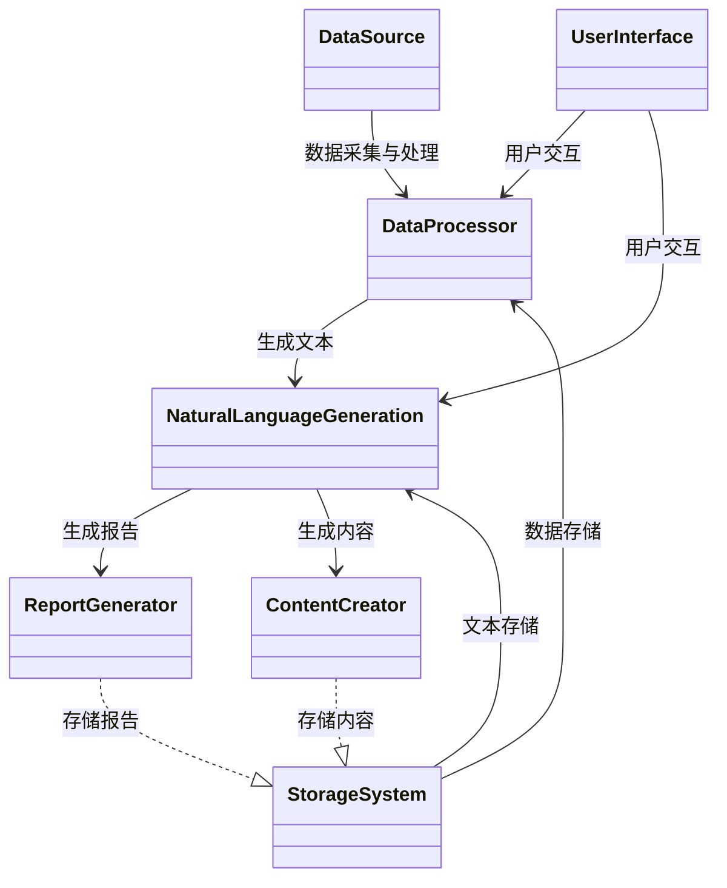
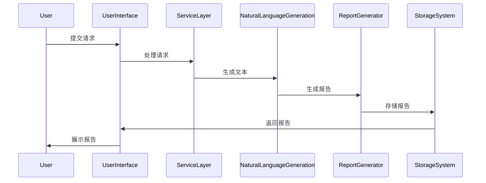

                 

### 引言

## 1.1 书籍背景与目的

随着人工智能技术的迅猛发展，自然语言生成（NLG）技术逐渐成为企业级应用领域的重要工具。NLG技术能够自动生成文本，广泛应用于报告编写、内容创作、客户服务等多个方面，极大地提高了工作效率和准确性。然而，将NLG技术应用到企业级环境中，需要面对诸多挑战，如数据整合、系统架构设计、技术实现等。

本著作旨在深入探讨企业级自然语言生成技术的原理、应用和实践，帮助读者了解如何利用NLG技术实现自动化报告和内容创作。通过本书，读者可以：

- 掌握NLG技术的基本概念和原理。
- 理解NLG技术在不同企业应用场景中的实现方法。
- 学习如何设计和实现一个企业级的NLG系统。
- 获得实际案例分析和最佳实践。

本书将分为五个部分，分别介绍自然语言生成基础、企业级自然语言生成技术、自动化报告与内容创作、案例分析以及最佳实践与未来展望。通过系统性的学习和实践，读者将能够掌握NLG技术，并将其应用到企业级应用中，提升企业的效率和竞争力。

## 1.2 内容概述与结构安排

### 第1部分：自然语言生成基础

- **第1章：自然语言生成的概述**
  - 介绍自然语言生成的基本概念、重要性和挑战。
  - 分析NLG的应用场景。

- **第2章：自然语言生成技术**
  - 详细探讨语言模型、文本生成、领域自适应、对话系统等核心技术。
  - 分析新技术趋势。

### 第2部分：企业级自然语言生成技术

- **第3章：企业级自然语言生成应用场景**
  - 分析企业报告自动化、营销内容生成、客户服务自动化等应用场景。
  - 提供实际案例。

- **第4章：自动化报告与内容创作**
  - 介绍报告自动化的流程与策略。
  - 探讨内容创作的自动化。

### 第3部分：自动化报告与内容创作

- **第5章：系统设计与实现**
  - 分析系统需求、架构设计、关键技术实现。
  - 介绍系统部署与维护。

### 第4部分：案例分析

- **第6章：案例分析**
  - 深入分析多个实际案例，探讨NLG在企业中的应用。

### 第5部分：最佳实践与未来展望

- **第7章：最佳实践与未来展望**
  - 总结最佳实践，展望NLG技术的发展趋势。

通过本书的结构安排，读者可以系统地学习企业级自然语言生成技术，从基础理论到实际应用，全面掌握NLG技术，为企业带来创新和效率的提升。### 第1章：自然语言生成的概述

## 1.1 问题背景与挑战

自然语言生成（Natural Language Generation，NLG）作为人工智能的一个重要分支，旨在通过计算机程序生成自然语言的文本。这一技术的出现，源于人类对于自动化内容创作的需求，尤其在信息爆炸的时代，大量的报告、文档和文章需要被快速生成。然而，NLG技术面临着诸多挑战：

### 1.1.1 自然语言生成的重要性

自然语言生成技术在现代社会的多个领域都有着广泛的应用。首先，在企业报告中，NLG能够自动生成财务报告、销售报告等，节省了大量人力和时间成本。其次，在内容创作领域，NLG可以自动生成新闻文章、博客内容，甚至小说和诗歌，极大地丰富了数字内容的生产。此外，NLG在客户服务中的应用也非常广泛，通过自动化对话系统，可以提供24/7的客户服务，提高客户满意度。

### 1.1.2 自然语言生成的挑战

尽管NLG技术具有巨大的潜力，但其在实际应用中仍面临诸多挑战。首先，自然语言的复杂性使得NLG系统难以生成准确、自然的文本。自然语言中蕴含着丰富的语法、语义和上下文信息，这些信息需要通过复杂的算法来理解和生成。其次，NLG系统的训练和开发需要大量的数据和计算资源，这对企业和开发者来说是一大挑战。此外，NLG技术在不同领域的应用场景各异，如何适应不同的领域需求，也是一个难题。

### 1.1.3 NLG的应用场景

NLG技术可以应用于多个领域，包括但不限于：

- **报告自动化**：自动生成财务报告、销售报告等。
- **内容创作**：自动生成新闻文章、博客内容、营销材料等。
- **客户服务**：通过自动化对话系统提供24/7的客户服务。
- **教育**：自动生成教学材料、辅导内容等。
- **娱乐**：自动生成小说、剧本、游戏内容等。

## 1.2 核心概念与原理

### 1.2.1 自然语言生成的基本概念

自然语言生成技术涉及到多个核心概念，包括语言模型、语义理解、文本生成等。

- **语言模型**：语言模型是NLG系统的核心组件，它通过学习大量语言数据，预测下一个词语的概率。常见的语言模型有n-gram模型、循环神经网络（RNN）和Transformer模型等。

- **语义理解**：语义理解是NLG系统理解输入文本的含义的过程。它包括词义消歧、实体识别、情感分析等。语义理解的准确性直接影响到文本生成的自然性和准确性。

- **文本生成**：文本生成是将输入数据转换为自然语言文本的过程。文本生成方法包括模板匹配、规则生成、基于语言模型的生成等。

### 1.2.2 NLG的原理分析

NLG的原理可以概括为以下几个步骤：

1. **输入处理**：将输入数据（如文本、数据集等）进行预处理，包括分词、词性标注、句法分析等。
2. **语义理解**：通过语义理解技术，将输入数据中的关键词和语义关系提取出来。
3. **文本生成**：基于语言模型和语义理解结果，生成自然语言文本。文本生成可能涉及到语法结构的规划、句子重排、词汇替换等。

### 1.2.3 NLG的关键技术

NLG的关键技术包括：

- **语言模型技术**：如n-gram模型、RNN、Transformer等。
- **文本生成技术**：如模板匹配、规则生成、基于语言模型的生成等。
- **领域自适应技术**：通过训练特定领域的语言模型和数据集，提高NLG系统在不同领域的适应能力。
- **对话系统技术**：实现自然语言交互，包括语音识别、自然语言理解、对话生成等。

## 1.3 NLG的系统架构

### 1.3.1 系统架构概述

NLG系统通常包括以下几个主要模块：

- **输入处理模块**：负责接收和处理输入数据，如文本、数据集等。
- **语义理解模块**：通过语义理解技术，提取输入数据中的关键词和语义关系。
- **文本生成模块**：基于语义理解结果，生成自然语言文本。
- **后处理模块**：对生成的文本进行格式化、优化等操作。

### 1.3.2 主要模块介绍

- **输入处理模块**：该模块负责将输入数据进行预处理，如分词、词性标注、句法分析等。预处理的结果将作为语义理解模块的输入。

- **语义理解模块**：该模块通过词义消歧、实体识别、情感分析等技术，提取输入数据中的关键词和语义关系。语义理解的结果将作为文本生成模块的输入。

- **文本生成模块**：该模块基于语言模型和语义理解结果，生成自然语言文本。文本生成可能涉及到语法结构的规划、句子重排、词汇替换等。

- **后处理模块**：该模块对生成的文本进行格式化、优化等操作，以提高文本的自然性和可读性。

### 1.3.3 NLG系统的工作流程

NLG系统的工作流程可以概括为以下几个步骤：

1. **输入处理**：接收并预处理输入数据。
2. **语义理解**：提取关键词和语义关系。
3. **文本生成**：基于语义理解结果，生成自然语言文本。
4. **后处理**：对生成的文本进行优化和格式化。

## 1.4 实例分析

### 1.4.1 简单的NLG实例

假设我们要生成一段关于天气的简单描述，输入数据为“今天的天气很热”。以下是NLG系统生成文本的过程：

1. **输入处理**：将输入文本进行分词，得到“今天”、“的”、“天气”、“很”、“热”五个词语。
2. **语义理解**：理解每个词语的含义，并识别出文本的主题和情感。例如，“今天”表示时间，“的”是定语，“天气”是主语，“很”是程度副词，“热”是形容词。
3. **文本生成**：根据语义理解结果，生成文本“今天的天气很热”。
4. **后处理**：对生成的文本进行优化，如调整语法结构，使其更符合自然语言表达习惯。

### 1.4.2 复杂的NLG实例

假设我们要生成一份详细的销售报告，输入数据包括销售数据、市场分析等。以下是NLG系统生成文本的过程：

1. **输入处理**：接收并预处理大量的销售数据和市场分析报告，如销售额、增长率、市场份额等。
2. **语义理解**：提取关键数据和信息，如销售总额、增长率、主要市场等。
3. **文本生成**：根据语义理解结果，生成详细的销售报告，包括数据总结、市场分析、趋势预测等。
4. **后处理**：对生成的文本进行格式化，如添加标题、摘要、图表等，以提高报告的可读性和专业性。

### 1.4.3 NLG在实际应用中的表现

NLG在实际应用中的表现取决于多个因素，包括数据质量、算法准确性、系统设计等。以下是NLG在实际应用中的一些表现：

- **准确性**：NLG系统能够生成准确、自然的文本，但受限于语义理解的准确性，有时会产生语义偏差或生成不准确的文本。
- **灵活性**：NLG系统应能够适应不同的应用场景和数据输入，通过灵活的算法和模块化设计，实现多种文本生成任务。
- **效率**：NLG系统需要具备高效率，能够在短时间内生成大量文本，以满足企业级应用的需求。

## 1.5 本章小结

本章介绍了自然语言生成的基本概念、原理和应用场景，并详细分析了NLG系统的核心模块和实现流程。通过实例分析，展示了NLG系统在实际应用中的表现和挑战。在接下来的章节中，我们将进一步探讨企业级自然语言生成技术的具体实现和应用。

----------------------------------------------------------------

## 第2章：自然语言生成技术

## 2.1 语言模型技术

语言模型是自然语言生成（NLG）系统的核心组件，它通过学习大量语言数据，预测下一个词语的概率，从而生成自然语言文本。在NLG系统中，语言模型的作用是提供文本生成的概率分布，使得生成的文本更加自然和流畅。

### 2.1.1 语言模型的基本概念

语言模型的核心概念是概率分布，它通过统计语言中的词语出现频率，来预测下一个词语的可能性。常用的语言模型有：

- **n-gram模型**：n-gram模型是基于马尔可夫假设的简单模型，它将文本分为长度为n的词语序列，并计算每个序列出现的概率。n-gram模型的优点是实现简单，计算效率高，但缺点是难以捕捉长距离依赖关系。

- **循环神经网络（RNN）**：RNN是一种基于时间序列数据的神经网络，它能够通过循环结构捕捉长距离依赖关系。RNN在处理自然语言文本时，能够记住之前的输入，从而生成更加自然的文本。然而，RNN存在梯度消失和梯度爆炸等问题，导致训练效果不佳。

- **Transformer模型**：Transformer模型是近年来在自然语言处理领域取得突破性进展的一种模型，它通过自注意力机制（self-attention）来捕捉长距离依赖关系，大大提高了语言模型的性能。Transformer模型在生成文本时，能够生成更加连贯和自然的文本，已经成为NLG系统的主要选择。

### 2.1.2 语言模型的应用

语言模型在自然语言生成中的应用非常广泛，包括：

- **文本生成**：语言模型可以用于自动生成新闻文章、博客内容、对话等。例如，在生成新闻文章时，语言模型可以根据标题和部分内容，生成完整的新闻正文。

- **对话系统**：语言模型可以用于实现自然语言对话系统，如虚拟助手、聊天机器人等。语言模型能够根据用户输入的文本，生成合适的回复，提高用户的体验。

- **机器翻译**：语言模型可以用于机器翻译，通过将源语言文本转换为概率分布，生成目标语言文本。例如，将英语文本翻译为中文，语言模型可以根据英语文本的概率分布，生成最有可能的中文翻译。

### 2.1.3 语言模型的选择

在选择语言模型时，需要考虑以下因素：

- **模型复杂度**：不同的语言模型具有不同的复杂度，如n-gram模型的计算复杂度较低，而Transformer模型的计算复杂度较高。需要根据实际应用的需求，选择合适的模型。

- **训练数据量**：语言模型的训练需要大量数据，数据量越大，模型的性能越好。需要确保有足够的数据进行训练。

- **计算资源**：不同的语言模型对计算资源的需求不同，如n-gram模型对计算资源的需求较低，而Transformer模型对计算资源的需求较高。需要根据计算资源的情况，选择合适的模型。

- **性能要求**：需要根据对生成文本的性能要求，选择合适的模型。例如，如果要求生成文本的连贯性较高，可以选择Transformer模型。

## 2.2 文本生成技术

文本生成技术是自然语言生成（NLG）系统的重要组成部分，它通过将输入数据转换为自然语言文本，实现自动化内容创作。文本生成技术可以分为基于规则的方法和基于模型的方法。

### 2.2.1 基于规则的方法

基于规则的方法是一种传统的文本生成方法，它通过定义一组规则，将输入数据转换为文本。这种方法的主要优点是实现简单，易于理解和维护。然而，它的缺点是灵活性较低，难以应对复杂的文本生成任务。

- **模板匹配**：模板匹配是将输入数据与预定义的模板进行匹配，生成文本。例如，在生成销售报告时，可以定义一个模板，将销售数据填入相应的位置。

- **规则生成**：规则生成是通过定义一组规则，将输入数据转换为文本。规则可以基于语义分析、语法分析等技术，实现对输入数据的精确转换。

### 2.2.2 基于模型的方法

基于模型的方法是一种现代化的文本生成方法，它通过训练一个大规模的神经网络模型，实现自动化文本生成。这种方法的主要优点是灵活性高，能够生成更加自然的文本。常用的基于模型的方法包括：

- **序列到序列（Seq2Seq）模型**：Seq2Seq模型是一种经典的文本生成模型，它通过将输入序列映射到输出序列，实现文本生成。例如，在生成新闻文章时，Seq2Seq模型可以将新闻标题映射到新闻正文。

- **生成对抗网络（GAN）**：GAN是一种基于对抗训练的文本生成模型，它由生成器和判别器组成。生成器负责生成文本，判别器负责判断文本的真实性。通过训练，生成器能够生成越来越真实的文本。

- **变分自编码器（VAE）**：VAE是一种基于概率生成模型的文本生成方法，它通过将输入数据编码为潜在空间中的点，再解码为文本。VAE在生成文本时，能够保持文本的多样性和连贯性。

### 2.2.3 文本生成技术的应用

文本生成技术在多个领域都有广泛的应用，包括：

- **内容创作**：文本生成技术可以用于自动生成新闻文章、博客内容、广告文案等。例如，在新闻生成领域，文本生成技术可以根据新闻标题和摘要，自动生成完整的新闻正文。

- **对话系统**：文本生成技术可以用于自动生成对话系统中的回复，提高用户的体验。例如，在客服对话中，文本生成技术可以根据用户的问题，自动生成合适的回复。

- **教育**：文本生成技术可以用于自动生成教学材料、作业和考试题目等。例如，在在线教育平台中，文本生成技术可以根据课程内容，自动生成教学视频和作业。

## 2.3 领域自适应技术

领域自适应技术是自然语言生成（NLG）系统的重要特性，它使得NLG系统能够适应不同领域的语言特征和需求。领域自适应技术主要包括以下几种方法：

### 2.3.1 领域自适应的方法

- **领域适应的文本生成模型**：通过训练特定领域的文本生成模型，提高模型在不同领域的适应能力。例如，在医疗领域，可以训练一个针对医疗报告的文本生成模型，提高模型在医疗报告生成中的性能。

- **领域自适应的规则生成**：通过定义领域特定的规则，实现领域自适应的文本生成。例如，在金融领域，可以定义一套金融报告生成的规则，提高文本生成的准确性和专业性。

### 2.3.2 领域自适应的应用

领域自适应技术在多个领域都有广泛的应用，包括：

- **金融**：在金融领域，领域自适应技术可以用于自动生成财务报告、投资建议等。例如，可以训练一个针对财务报告的文本生成模型，提高报告的准确性和专业性。

- **医疗**：在医疗领域，领域自适应技术可以用于自动生成病历、医疗报告等。例如，可以训练一个针对医疗报告的文本生成模型，提高报告的准确性和可读性。

- **法律**：在法律领域，领域自适应技术可以用于自动生成法律文件、合同等。例如，可以训练一个针对法律文本的文本生成模型，提高文本的准确性和合规性。

## 2.4 对话系统技术

对话系统技术是自然语言生成（NLG）系统的一个重要应用领域，它通过自动生成自然语言对话，提供人机交互服务。对话系统技术主要包括以下方面：

### 2.4.1 对话系统的架构

对话系统通常由以下几个模块组成：

- **语音识别模块**：将用户输入的语音信号转换为文本。
- **自然语言理解模块**：理解用户输入的文本，提取语义信息。
- **对话生成模块**：根据语义理解和上下文信息，生成合适的对话回复。
- **语音合成模块**：将生成的文本转换为语音信号，回传给用户。

### 2.4.2 对话系统的关键技术

对话系统的关键技术包括：

- **语义理解**：通过语义分析技术，理解用户输入的文本含义，提取关键词和语义关系。
- **上下文管理**：对话系统需要维持对话的上下文信息，以便生成连贯的对话回复。
- **生成模型**：对话生成模块通常使用生成模型，如循环神经网络（RNN）或Transformer，生成自然语言对话。
- **多模态交互**：对话系统可以结合语音、文本、图像等多种模态，提供更加丰富的交互体验。

### 2.4.3 对话系统的应用

对话系统在多个领域都有广泛的应用，包括：

- **客户服务**：通过自动化的对话系统，提供24/7的客户服务，提高客户满意度。
- **智能助手**：如智能音箱、智能机器人等，通过对话系统与用户进行交互，提供信息查询、任务管理等服务。
- **教育**：通过对话系统，提供个性化的教育辅导，帮助学生解决学习问题。

## 2.5 文本分析技术

文本分析技术是自然语言生成（NLG）系统的重要辅助技术，它通过对文本进行深入分析，为NLG系统提供更多的语义信息和上下文信息。文本分析技术主要包括以下几个方面：

### 2.5.1 文本分析的关键技术

- **文本分类**：将文本归类到不同的类别，如新闻分类、情感分析等。
- **命名实体识别**：识别文本中的特定实体，如人名、地名、组织名等。
- **词义消歧**：确定文本中词语的确切含义，如多义词的处理。
- **情感分析**：分析文本的情感倾向，如正面、负面等。
- **句法分析**：对文本进行句法分析，理解句子结构和语法规则。

### 2.5.2 文本分析的应用

文本分析技术在自然语言生成中的应用主要包括：

- **语义理解增强**：通过文本分析，提取更多的语义信息，为NLG系统提供更丰富的输入数据。
- **上下文信息补充**：通过文本分析，获取上下文信息，提高NLG系统生成文本的连贯性和准确性。
- **个性化内容生成**：通过文本分析，识别用户兴趣和需求，生成个性化的文本内容。

## 2.6 新技术趋势

随着人工智能技术的不断发展，自然语言生成（NLG）领域也在不断涌现出新技术和趋势。以下是近年来一些重要的新技术趋势：

### 2.6.1 自适应生成

自适应生成技术是当前NLG领域的研究热点，它通过不断学习和调整，提高NLG系统在不同场景和领域的适应能力。自适应生成技术包括：

- **上下文自适应**：通过分析上下文信息，动态调整生成策略，提高文本生成的连贯性和准确性。
- **用户行为自适应**：通过学习用户的行为和偏好，生成更加个性化的文本内容。
- **领域自适应**：通过训练特定领域的模型和数据，提高NLG系统在不同领域的应用效果。

### 2.6.2 多模态生成

多模态生成技术是近年来在NLG领域的一个重要趋势，它通过结合文本、图像、语音等多种模态，生成更加丰富和多样化的内容。多模态生成技术包括：

- **文本-图像生成**：通过文本描述生成相应的图像，如生成艺术作品、卡通形象等。
- **文本-语音生成**：通过文本生成相应的语音，如语音助手、智能音箱等。
- **文本-视频生成**：通过文本生成相应的视频，如视频摘要、广告内容等。

### 2.6.3 对话生成

对话生成是NLG技术在交互式应用中的重要方向，它通过生成自然语言对话，实现人机交互。对话生成技术包括：

- **多轮对话生成**：通过学习多轮对话的上下文信息，生成连贯的对话回复。
- **交互式对话生成**：通过与用户实时交互，动态调整对话策略，生成更加自然和有效的对话。
- **对话评估与优化**：通过评估对话的质量和效果，不断优化对话生成模型。

### 2.6.4 知识增强生成

知识增强生成技术是利用外部知识库和语义信息，提高NLG系统生成文本的准确性和深度。知识增强生成技术包括：

- **知识图谱嵌入**：通过将知识图谱嵌入到生成模型中，提高文本生成的语义准确性。
- **知识驱动生成**：通过利用外部知识库，生成更加丰富和有深度的文本内容。
- **知识融合生成**：将多种知识源（如文本、图像、语音等）融合到生成模型中，提高文本生成的多样性和准确性。

## 2.7 实例分析

### 2.7.1 简单的NLG实例

假设我们要生成一段关于旅游景点的介绍文本，输入数据为“颐和园”。以下是NLG系统生成文本的过程：

1. **输入处理**：将输入文本“颐和园”进行分词，得到“颐和园”两个词语。
2. **语义理解**：理解“颐和园”的含义，识别出它是一个著名的历史景点。
3. **文本生成**：根据语义理解结果，生成文本“颐和园是北京著名的旅游景点，有着丰富的历史文化内涵。”。
4. **后处理**：对生成的文本进行优化，如调整语法结构，使其更加流畅和自然。

### 2.7.2 复杂的NLG实例

假设我们要生成一份详细的旅游指南，输入数据包括旅游景点的基本信息、交通指南、推荐活动等。以下是NLG系统生成文本的过程：

1. **输入处理**：接收并预处理大量的旅游数据，如景点名称、基本信息、交通指南、推荐活动等。
2. **语义理解**：提取关键信息，如景点名称、交通方式、活动推荐等。
3. **文本生成**：根据语义理解结果，生成详细的旅游指南，包括景点介绍、交通指南、活动推荐等。
4. **后处理**：对生成的文本进行格式化，如添加标题、摘要、列表等，提高文本的可读性和专业性。

### 2.7.3 NLG在实际应用中的表现

NLG在实际应用中的表现取决于多个因素，包括数据质量、算法准确性、系统设计等。以下是NLG在实际应用中的一些表现：

- **准确性**：NLG系统能够生成准确、自然的文本，但受限于语义理解的准确性，有时会产生语义偏差或生成不准确的文本。
- **灵活性**：NLG系统应能够适应不同的应用场景和数据输入，通过灵活的算法和模块化设计，实现多种文本生成任务。
- **效率**：NLG系统需要具备高效率，能够在短时间内生成大量文本，以满足企业级应用的需求。

## 2.8 本章小结

本章介绍了自然语言生成技术的多种类型，包括语言模型技术、文本生成技术、领域自适应技术、对话系统技术和文本分析技术。通过实例分析，展示了这些技术在实际应用中的表现和挑战。在下一章中，我们将进一步探讨企业级自然语言生成技术的具体实现和应用。

----------------------------------------------------------------

## 第3章：企业级自然语言生成应用场景

### 3.1 企业报告自动化

企业报告自动化是自然语言生成（NLG）技术在企业级应用中的一个重要场景。通过NLG技术，企业能够自动生成各种类型的报告，如财务报告、销售报告、市场分析报告等，大大提高报告生成的效率和质量。

#### 3.1.1 财务报告自动化

财务报告是企业运营的重要指标，包括收入报表、利润报表、资产负债表等。通过NLG技术，可以将这些财务数据进行结构化处理，然后自动生成相应的报告文本。具体流程如下：

1. **数据输入**：将财务数据输入到NLG系统中，这些数据可以是电子表格、数据库等。
2. **数据预处理**：对输入的财务数据进行清洗、整理和转换，提取出关键数据。
3. **语义理解**：通过语义理解技术，理解财务数据中的关键指标和关系。
4. **文本生成**：基于语义理解结果，生成财务报告文本。例如，可以生成“本期收入总额为X万元，同比增长Y%”等句子。
5. **格式化输出**：对生成的文本进行格式化处理，包括添加标题、摘要、表格等，生成完整的财务报告。

#### 3.1.2 销售报告自动化

销售报告是企业了解市场动态、销售业绩和销售策略的重要工具。通过NLG技术，可以自动生成销售报告，包括销售数据汇总、市场分析、竞争对手分析等。具体流程如下：

1. **数据输入**：输入销售数据，包括销售额、销售量、客户分布等。
2. **数据预处理**：对销售数据进行清洗、整理和转换，提取出关键数据。
3. **语义理解**：通过语义理解技术，分析销售数据中的趋势和关系。
4. **文本生成**：基于语义理解结果，生成销售报告文本。例如，可以生成“本月销售额达到X万元，同比增长Y%，主要销售区域为Z地区”等句子。
5. **格式化输出**：对生成的文本进行格式化处理，包括添加图表、数据表格等，提高报告的可读性和专业性。

#### 3.1.3 市场分析报告自动化

市场分析报告是帮助企业了解市场环境、竞争对手和潜在客户的重要工具。通过NLG技术，可以自动生成市场分析报告，包括市场趋势、竞争分析、客户分析等。具体流程如下：

1. **数据输入**：输入市场数据，包括市场调研结果、竞争对手数据、客户数据等。
2. **数据预处理**：对市场数据进行清洗、整理和转换，提取出关键数据。
3. **语义理解**：通过语义理解技术，分析市场数据中的趋势和关系。
4. **文本生成**：基于语义理解结果，生成市场分析报告文本。例如，可以生成“当前市场呈现出X趋势，主要竞争对手为Y公司，目标客户群体为Z行业”等句子。
5. **格式化输出**：对生成的文本进行格式化处理，包括添加图表、数据表格等，提高报告的可读性和专业性。

### 3.2 营销内容生成

营销内容生成是NLG技术在企业级应用中的另一个重要场景。通过NLG技术，企业可以自动生成营销文案、广告内容、宣传材料等，提高营销效率和质量。

#### 3.2.1 营销文案生成

营销文案是企业进行市场推广和品牌宣传的重要手段。通过NLG技术，可以自动生成各种类型的营销文案，如广告语、宣传海报、推广邮件等。具体流程如下：

1. **数据输入**：输入产品信息、品牌特点、市场定位等数据。
2. **数据预处理**：对输入的数据进行清洗、整理和转换，提取出关键信息。
3. **语义理解**：通过语义理解技术，分析产品特点和品牌形象。
4. **文本生成**：基于语义理解结果，生成营销文案。例如，可以生成“我们的产品具有X特点，是您最佳的选择！”等句子。
5. **格式化输出**：对生成的文本进行格式化处理，包括添加图片、样式等，提高文案的吸引力和效果。

#### 3.2.2 广告内容生成

广告内容是企业进行市场推广的重要工具。通过NLG技术，可以自动生成广告文案、广告视频脚本等，提高广告内容的生成效率和创意性。具体流程如下：

1. **数据输入**：输入广告目标、产品特点、市场定位等数据。
2. **数据预处理**：对输入的数据进行清洗、整理和转换，提取出关键信息。
3. **语义理解**：通过语义理解技术，分析广告目标和产品特点。
4. **文本生成**：基于语义理解结果，生成广告内容。例如，可以生成“想要了解X产品吗？这里有一个精彩的介绍！”等句子。
5. **格式化输出**：对生成的文本进行格式化处理，包括添加图片、视频等，提高广告的吸引力和效果。

#### 3.2.3 宣传材料生成

宣传材料是企业进行品牌推广的重要手段，包括宣传册、海报、名片等。通过NLG技术，可以自动生成各种类型的宣传材料，提高宣传材料的生成效率和创意性。具体流程如下：

1. **数据输入**：输入企业信息、产品特点、市场定位等数据。
2. **数据预处理**：对输入的数据进行清洗、整理和转换，提取出关键信息。
3. **语义理解**：通过语义理解技术，分析企业特点和产品优势。
4. **文本生成**：基于语义理解结果，生成宣传材料文本。例如，可以生成“欢迎了解我们的产品，给您带来惊喜的体验！”等句子。
5. **格式化输出**：对生成的文本进行格式化处理，包括添加图片、样式等，提高宣传材料的吸引力和效果。

### 3.3 客户服务自动化

客户服务是企业与客户沟通的重要环节，通过NLG技术，可以自动生成各种类型的客户服务内容，如客服机器人回复、自助问答系统等，提高客户服务效率和客户满意度。

#### 3.3.1 客服机器人回复

客服机器人是帮助企业处理客户咨询和投诉的重要工具。通过NLG技术，可以自动生成客服机器人的回复文本，提高客服机器人的智能水平和响应速度。具体流程如下：

1. **数据输入**：输入常见问题和回答的数据，如FAQ数据库、客服历史记录等。
2. **数据预处理**：对输入的数据进行清洗、整理和转换，提取出关键信息。
3. **语义理解**：通过语义理解技术，分析客户问题的含义和类型。
4. **文本生成**：基于语义理解结果，生成客服机器人回复文本。例如，可以生成“您提到的问题，我们已经有相关的解决方案，请查看附件。”等句子。
5. **格式化输出**：对生成的文本进行格式化处理，包括添加链接、附件等，提高回复的实用性和效果。

#### 3.3.2 自助问答系统

自助问答系统是企业为客户提供自助服务的工具，通过NLG技术，可以自动生成问答系统的回答文本，提高问答系统的响应速度和准确性。具体流程如下：

1. **数据输入**：输入常见问题和回答的数据，如FAQ数据库、用户提问记录等。
2. **数据预处理**：对输入的数据进行清洗、整理和转换，提取出关键信息。
3. **语义理解**：通过语义理解技术，分析用户问题的含义和类型。
4. **文本生成**：基于语义理解结果，生成问答系统的回答文本。例如，可以生成“您的问题是关于X产品的使用方法，请查看以下步骤。”等句子。
5. **格式化输出**：对生成的文本进行格式化处理，包括添加图片、步骤说明等，提高问答系统的可读性和实用性。

### 3.4 财务报告生成

财务报告是企业的重要文件，包括收入报表、利润报表、资产负债表等。通过NLG技术，可以自动生成财务报告，提高财务报告的生成效率和准确性。

#### 3.4.1 财务报告数据输入

财务报告生成需要输入企业的财务数据，这些数据可以从企业的财务系统中获取，如电子表格、数据库等。数据输入的流程如下：

1. **数据采集**：从企业的财务系统中采集财务数据，包括收入、支出、利润等。
2. **数据清洗**：对采集到的财务数据进行清洗，去除无效数据和错误数据。
3. **数据转换**：将清洗后的财务数据转换为适合NLG系统处理的数据格式，如JSON、XML等。

#### 3.4.2 财务报告文本生成

基于输入的财务数据，NLG系统可以生成财务报告文本。具体的生成流程如下：

1. **语义理解**：对财务数据进行语义理解，提取出关键指标和关系。
2. **文本生成**：基于语义理解结果，生成财务报告文本。例如，可以生成“本期收入总额为X万元，同比增长Y%”等句子。
3. **文本格式化**：对生成的文本进行格式化处理，包括添加标题、摘要、表格等，生成完整的财务报告。

### 3.5 其他应用场景

除了上述提到的应用场景，NLG技术在企业级应用中还有其他广泛的应用，如：

#### 3.5.1 项目文档生成

通过NLG技术，可以自动生成项目文档，包括项目计划、项目报告、项目总结等，提高项目管理效率和文档生成速度。

#### 3.5.2 法律文件生成

通过NLG技术，可以自动生成法律文件，如合同、协议、诉讼文书等，提高法律文件的生成效率和准确性。

#### 3.5.3 教学材料生成

通过NLG技术，可以自动生成教学材料，如课程讲义、习题、作业等，提高教学效率和质量。

#### 3.5.4 产品说明书生成

通过NLG技术，可以自动生成产品说明书，提高产品说明书的生成效率和准确性。

### 3.6 实例分析

#### 3.6.1 财务报告自动生成实例

假设我们要生成一份财务报告，输入数据包括收入、支出、利润等财务数据。以下是NLG系统生成财务报告的过程：

1. **数据输入**：从企业财务系统中获取收入、支出、利润等财务数据。
2. **数据预处理**：清洗和整理财务数据，提取出关键指标。
3. **语义理解**：对财务数据进行语义理解，提取出收入、支出、利润等关键指标。
4. **文本生成**：基于语义理解结果，生成财务报告文本。例如，可以生成“本期收入总额为X万元，同比增长Y%。”等句子。
5. **格式化输出**：对生成的文本进行格式化处理，添加标题、摘要、表格等，生成完整的财务报告。

#### 3.6.2 营销文案自动生成实例

假设我们要生成一条营销文案，输入数据包括产品特点、市场定位等。以下是NLG系统生成营销文案的过程：

1. **数据输入**：输入产品特点、市场定位等数据。
2. **数据预处理**：清洗和整理输入数据，提取出关键信息。
3. **语义理解**：对输入数据进行语义理解，分析产品特点和市场定位。
4. **文本生成**：基于语义理解结果，生成营销文案。例如，可以生成“我们的产品具有高效、便捷的特点，是您理想的解决方案！”等句子。
5. **格式化输出**：对生成的文本进行格式化处理，添加图片、样式等，提高文案的吸引力和效果。

### 3.7 本章小结

本章介绍了企业级自然语言生成技术的多种应用场景，包括财务报告自动化、营销内容生成、客户服务自动化、财务报告生成等。通过实例分析，展示了这些应用场景的具体实现过程。在下一章中，我们将进一步探讨自动化报告与内容创作的技术实现。

----------------------------------------------------------------

## 第4章：自动化报告与内容创作

### 4.1 报告自动化的流程与策略

报告自动化是企业实现高效信息处理的重要手段。通过自动化报告生成，企业能够快速、准确地生成各类报告，如财务报告、销售报告、市场分析报告等。以下是一个典型的报告自动化流程与策略：

#### 4.1.1 流程概述

1. **数据采集**：从企业的各类系统中（如ERP系统、CRM系统、财务系统等）采集所需的数据。
2. **数据预处理**：对采集到的数据清洗、整理和转换，确保数据的质量和一致性。
3. **数据建模**：根据报告需求，设计数据模型，将原始数据转换为适合报告生成的结构化数据。
4. **语义理解**：对结构化数据进行语义理解，提取出关键指标和关系。
5. **文本生成**：基于语义理解结果，使用自然语言生成技术生成报告文本。
6. **格式化与输出**：对生成的文本进行格式化处理，包括添加标题、摘要、图表等，然后输出完整的报告。

#### 4.1.2 策略分析

1. **数据集成**：确保数据源的一致性和完整性，选择合适的数据集成技术，如ETL（提取、转换、加载）。
2. **语义理解优化**：通过引入先进的技术（如深度学习、自然语言处理等），提高语义理解的准确性和效率。
3. **模板化报告生成**：设计灵活的报告模板，以便根据不同报告类型和需求快速生成报告。
4. **自动化审核与校对**：引入自动化工具，对生成的报告进行审核和校对，确保报告的准确性和合规性。
5. **持续迭代与优化**：根据实际应用效果和用户反馈，不断优化报告自动化的流程和策略。

### 4.2 内容创作的自动化

内容创作是企业信息传播和品牌建设的重要组成部分。通过自动化内容创作，企业能够快速生成各类内容，如新闻文章、博客、营销文案等。以下是一个典型的内容创作自动化流程与策略：

#### 4.2.1 流程概述

1. **主题与数据源选择**：根据内容创作需求，选择合适的主题和数据源。
2. **数据采集**：从企业内外部获取与主题相关的数据，如新闻报道、市场调研报告、企业数据等。
3. **数据预处理**：对采集到的数据清洗、整理和转换，确保数据的质量和一致性。
4. **语义理解**：对结构化数据进行语义理解，提取出关键信息和观点。
5. **文本生成**：基于语义理解结果，使用自然语言生成技术生成文本内容。
6. **内容优化与审核**：对生成的文本进行优化和审核，确保内容的质量和可读性。
7. **发布与分发**：将优化后的内容发布到相应的平台或渠道，如网站、社交媒体等。

#### 4.2.2 策略分析

1. **内容模板设计**：设计灵活的内容模板，以便根据不同主题和需求快速生成内容。
2. **数据驱动内容创作**：通过分析用户行为数据和市场趋势，生成符合用户需求和兴趣的内容。
3. **多模态内容创作**：结合文本、图像、视频等多种模态，提高内容的多样性和吸引力。
4. **自动化内容审核**：引入自动化工具，对生成的内容进行审核，确保内容的准确性和合规性。
5. **内容优化与迭代**：根据用户反馈和数据分析，不断优化内容创作策略，提高内容的质量和效果。

### 4.3 数据驱动的报告生成

数据驱动的报告生成是一种基于数据分析和可视化技术，自动生成报告的方法。通过数据驱动的方法，企业能够更加直观地了解业务数据，做出更准确的决策。以下是一个数据驱动的报告生成流程与策略：

#### 4.3.1 流程概述

1. **数据采集**：从企业的各类系统中采集所需的数据，如销售数据、财务数据、运营数据等。
2. **数据预处理**：对采集到的数据清洗、整理和转换，确保数据的质量和一致性。
3. **数据分析**：使用数据分析工具（如SQL、Python等）对数据进行分析，提取出关键指标和趋势。
4. **可视化设计**：设计报告的可视化布局，包括图表、表格、文字等。
5. **报告生成**：将分析结果和可视化布局结合，生成报告文本和图表。
6. **报告审核与发布**：对生成的报告进行审核和校对，确保报告的准确性和完整性，然后发布到相应的平台或渠道。

#### 4.3.2 策略分析

1. **数据质量保证**：确保数据来源的可靠性，进行数据清洗和转换，提高数据的准确性。
2. **数据分析工具选择**：选择适合企业需求的自动化数据分析工具，提高数据分析的效率和准确性。
3. **可视化技术运用**：利用可视化技术，将复杂的数据转化为易于理解的可视化图表，提高报告的可读性和直观性。
4. **自动化报告生成**：通过引入自动化报告生成工具，提高报告生成的速度和效率。
5. **持续迭代与优化**：根据业务需求和用户反馈，不断优化报告生成流程和策略。

### 4.4 技术与工具介绍

实现自动化报告与内容创作需要多种技术和工具的支持。以下介绍几种常用的技术和工具：

#### 4.4.1 自然语言处理（NLP）

自然语言处理技术是自动化报告与内容创作的基础，它包括文本预处理、语义理解、文本生成等。常用的NLP工具和库有：

- **NLTK**：Python的NLP库，提供文本处理、词性标注、句法分析等功能。
- **spaCy**：高效、易用的Python NLP库，支持多种语言。
- **TextBlob**：Python的轻量级NLP库，提供文本分类、情感分析等功能。

#### 4.4.2 语言模型

语言模型在自动化报告与内容创作中用于生成自然语言文本。常用的语言模型有：

- **n-gram模型**：基于马尔可夫假设的简单模型，用于文本预测。
- **循环神经网络（RNN）**：能够捕捉长距离依赖关系的神经网络模型。
- **Transformer模型**：基于自注意力机制的先进模型，性能优异。

#### 4.4.3 数据库

数据库用于存储和管理企业的各类数据。常用的数据库有：

- **关系数据库**：如MySQL、PostgreSQL等，用于存储结构化数据。
- **NoSQL数据库**：如MongoDB、Cassandra等，用于存储非结构化数据。

#### 4.4.4 数据分析工具

数据分析工具用于对数据进行处理和分析。常用的工具和库有：

- **Pandas**：Python的数据分析库，提供数据清洗、转换、分析等功能。
- **SQL**：用于查询和操作数据库的语言。
- **Excel**：常用的数据分析工具，提供数据可视化和处理功能。

#### 4.4.5 可视化工具

可视化工具用于将数据转化为图表，提高报告的可读性。常用的工具和库有：

- **Matplotlib**：Python的可视化库，提供丰富的图表绘制功能。
- **Seaborn**：基于Matplotlib的统计可视化库，提供更加美观的图表。
- **Tableau**：强大的数据可视化工具，支持多种图表和交互功能。

### 4.5 实例分析

#### 4.5.1 财务报告自动生成实例

以下是一个简单的财务报告自动生成的实例：

1. **数据采集**：从企业财务系统中获取收入、支出、利润等数据。
2. **数据预处理**：清洗和整理数据，转换为CSV文件格式。
3. **语义理解**：使用Python的Pandas库对数据进行处理和分析，提取关键指标。
4. **文本生成**：使用Python的TextBlob库生成报告文本。
5. **格式化与输出**：将生成的文本保存为HTML文件，并在浏览器中展示。

```python
import pandas as pd
from textblob import TextBlob

# 数据预处理
data = pd.read_csv('financial_data.csv')
data['净收入'] = data['收入'] - data['支出']

# 语义理解
net_income = data['净收入'].sum()
growth_rate = (net_income - data['净收入'].iloc[0]) / data['净收入'].iloc[0] * 100

# 文本生成
report = TextBlob(f"本期净收入为{net_income}万元，同比增长{growth_rate}%。")
print(report)

# 格式化与输出
with open('financial_report.html', 'w', encoding='utf-8') as f:
    f.write(report.html)
```

#### 4.5.2 营销文案自动生成实例

以下是一个简单的营销文案自动生成的实例：

1. **主题选择**：选择产品特点作为主题。
2. **数据采集**：从企业数据库中获取产品特点的数据。
3. **文本生成**：使用Python的TextBlob库生成营销文案。
4. **格式化与输出**：将生成的文案保存为文本文件。

```python
import pandas as pd
from textblob import TextBlob

# 数据采集
data = pd.read_csv('product_features.csv')

# 文本生成
template = "我们的产品具有{0}等特点，为您提供最佳的解决方案！"
marketing_copy = data['特点'].apply(lambda x: TextBlob(template.format(x)).text)

# 格式化与输出
with open('marketing_copy.txt', 'w', encoding='utf-8') as f:
    for line in marketing_copy:
        f.write(line + '\n')
```

### 4.6 本章小结

本章介绍了自动化报告与内容创作的基本流程、策略和技术。通过实例分析，展示了如何实现报告自动生成和内容创作自动化。在下一章中，我们将分析实际案例，探讨企业级自然语言生成技术的应用和实践。

----------------------------------------------------------------

## 第5章：系统设计与实现

### 5.1 系统需求分析

在设计和实现一个企业级自然语言生成（NLG）系统时，首先需要对系统的需求进行详细分析。系统需求分析是确保系统能够满足用户需求并具备良好的性能和可扩展性的关键步骤。

#### 5.1.1 功能需求

系统的主要功能需求包括：

1. **报告自动化**：系统能够自动从企业的各类业务系统中提取数据，生成财务报告、销售报告、市场分析报告等。
2. **内容创作**：系统能够根据用户输入的主题和数据，自动生成新闻文章、博客、营销文案等。
3. **多模态内容生成**：系统能够结合文本、图像、视频等多模态信息，生成丰富多样的内容。
4. **客户服务**：系统能够自动生成客户服务对话，提供24/7的智能客服。
5. **个性化内容**：系统能够根据用户的行为和偏好，生成个性化的内容。

#### 5.1.2 非功能需求

系统还必须满足以下非功能需求：

1. **性能需求**：系统需要具备高响应速度，能够在短时间内处理大量数据和生成文本。
2. **可扩展性**：系统需要具备良好的可扩展性，能够随着业务需求的变化而进行扩展。
3. **可靠性**：系统需要具备高可靠性，确保生成的文本内容准确无误。
4. **安全性**：系统需要确保数据的安全性和隐私保护。
5. **用户体验**：系统需要提供友好的用户界面和良好的用户体验。

### 5.2 系统功能设计（领域模型）

在系统功能设计阶段，需要明确系统的功能和模块，并设计领域模型以帮助理解和沟通系统的结构。以下是一个企业级NLG系统的领域模型：

#### 5.2.1 领域模型介绍

领域模型包括以下核心实体和关系：

- **数据源**：包括企业的各类业务系统，如ERP、CRM、财务系统等。
- **数据处理器**：负责数据采集、清洗、转换等处理过程。
- **自然语言生成模块**：包括文本生成、多模态生成、语义理解等模块。
- **报告生成器**：负责根据数据生成各类报告。
- **内容创作器**：负责生成新闻文章、博客、营销文案等。
- **用户接口**：提供用户交互界面，包括管理后台、API接口等。
- **存储系统**：用于存储数据和生成的文本内容。

#### 5.2.2 领域模型类图

使用Mermaid语法，可以绘制领域模型类图如下：



### 5.3 系统架构设计

系统架构设计是确保系统功能实现、性能优化、可靠性保障的关键。以下是一个企业级NLG系统的架构设计：

#### 5.3.1 系统架构介绍

系统架构包括以下主要层次：

- **数据层**：负责数据的采集、存储和管理，包括数据源、数据库和数据处理器。
- **服务层**：负责业务逻辑的实现，包括自然语言生成模块、报告生成器和内容创作器。
- **接口层**：负责提供用户交互和管理后台，包括用户接口和API接口。
- **展示层**：负责将服务层生成的数据以图形化的形式展示给用户。

#### 5.3.2 系统架构图

使用Mermaid语法，可以绘制系统架构图如下：

```mermaid
sequenceDiagram
    User ->|API接口|> UserInterface
    UserInterface ->|处理请求|> ServiceLayer
    ServiceLayer ->|数据处理|> DataLayer
    DataLayer ->|返回数据|> ServiceLayer
    ServiceLayer ->|返回结果|> UserInterface
    UserInterface ->|展示结果|> User
```

### 5.4 系统接口设计

系统接口设计是确保系统功能模块之间能够高效、可靠地交互的关键。以下是一个企业级NLG系统的接口设计：

#### 5.4.1 接口设计原则

- **RESTful API**：采用RESTful风格设计API，确保接口的易用性和扩展性。
- **标准化**：接口遵循统一的数据格式和响应格式，确保系统各模块之间的一致性。
- **安全性**：接口设计应考虑数据传输的安全性和用户认证。

#### 5.4.2 接口定义

以下是一个简单的接口定义示例：

```json
// 获取财务报告
GET /api/reports/financial

{
  "income": 1000000,
  "expenditure": 800000,
  "net_income": 200000
}

// 获取新闻文章
GET /api/content/news?topic=technology
```

### 5.5 系统交互设计

系统交互设计是确保系统在不同模块之间能够高效、顺畅地协作的关键。以下是一个企业级NLG系统的交互设计：

#### 5.5.1 交互流程

1. **用户请求**：用户通过用户接口提交请求，如获取财务报告或生成新闻文章。
2. **接口处理**：用户接口接收请求并处理，将请求转发给服务层。
3. **服务处理**：服务层根据请求调用相应的模块（如自然语言生成模块），处理请求并生成数据。
4. **数据存储**：处理后的数据存储在数据库中，以便后续查询和使用。
5. **结果返回**：将处理结果返回给用户接口，并通过用户接口展示给用户。

#### 5.5.2 交互序列图

使用Mermaid语法，可以绘制系统交互序列图如下：



### 5.6 实例分析

#### 5.6.1 财务报告生成实例

以下是一个简单的财务报告生成实例，展示系统如何从数据层到服务层，再到接口层，最终将报告展示给用户。

1. **数据采集**：从企业财务系统中获取收入、支出等数据。
2. **数据预处理**：清洗和整理数据，确保数据的质量和一致性。
3. **自然语言生成**：基于预处理后的数据，使用自然语言生成技术生成报告文本。
4. **报告生成**：将生成的文本格式化并添加图表，生成完整的财务报告。
5. **数据存储**：将生成的财务报告存储在数据库中。
6. **接口处理**：用户通过API接口请求财务报告，接口层处理请求并从数据库中获取报告。
7. **结果返回**：将获取的财务报告返回给用户，并在用户接口中展示。

#### 5.6.2 营销文案生成实例

以下是一个简单的营销文案生成实例，展示系统如何自动生成营销文案。

1. **主题选择**：选择产品特点作为生成营销文案的主题。
2. **数据采集**：从企业数据库中获取产品特点的数据。
3. **文本生成**：基于产品特点，使用自然语言生成技术生成营销文案。
4. **内容优化**：对生成的文案进行优化和审核，确保文案的质量和准确性。
5. **数据存储**：将优化的文案存储在数据库中。
6. **接口处理**：用户通过API接口请求营销文案，接口层处理请求并从数据库中获取文案。
7. **结果返回**：将获取的营销文案返回给用户，并在用户接口中展示。

### 5.7 本章小结

本章介绍了企业级自然语言生成系统的需求分析、功能设计、系统架构设计、接口设计和交互设计。通过实例分析，展示了系统从设计到实现的完整过程。在下一章中，我们将通过实际案例，进一步探讨企业级自然语言生成技术的应用和实践。

----------------------------------------------------------------

## 第6章：案例分析

### 6.1 案例背景

在本章中，我们将分析三个不同领域的企业，探讨它们如何利用自然语言生成（NLG）技术实现自动化报告和内容创作，提升业务效率和用户体验。

### 6.2 案例一：金融企业——自动化财务报告

#### 案例背景

一家大型金融企业拥有复杂的财务报表体系，包括每日交易报告、月度财务报表和年度财务报告。这些报告不仅需要频繁生成，还需要确保数据准确性和一致性。为了提高效率和减少人工错误，该企业决定采用NLG技术实现自动化财务报告。

#### 案例描述

1. **数据采集**：企业从ERP系统和交易系统中提取交易数据、财务数据等。
2. **数据预处理**：清洗和整理数据，确保数据的准确性和一致性。
3. **文本生成**：使用NLG技术生成财务报告文本。具体步骤如下：
   - **语义理解**：分析数据中的关键指标和关系。
   - **文本生成**：基于语义理解结果，生成财务报告文本。例如，可以生成“本月交易总额为X万元，同比增长Y%”等句子。
   - **格式化输出**：对生成的文本进行格式化处理，包括添加标题、摘要、图表等，生成完整的财务报告。

#### 案例结果

- **效率提升**：通过自动化生成财务报告，企业显著减少了报告生成时间，提高了工作效率。
- **准确性提升**：由于减少了人工处理环节，报告的准确性得到了保障，减少了人工错误。
- **用户体验**：自动生成的财务报告提供了更加一致和清晰的数据展示，提高了管理层对财务数据的理解和分析能力。

### 6.3 案例二：制造业企业——营销内容自动化

#### 案例背景

一家制造业企业需要进行大量的市场推广和营销活动，包括生成产品宣传材料、营销文案、广告内容等。为了提高营销效率和质量，该企业决定采用NLG技术实现自动化营销内容生成。

#### 案例描述

1. **数据采集**：从企业数据库中获取产品信息、市场趋势、用户反馈等数据。
2. **文本生成**：使用NLG技术生成营销内容。具体步骤如下：
   - **语义理解**：分析产品特点和市场需求。
   - **文本生成**：基于语义理解结果，生成营销文案。例如，可以生成“我们的产品具有X特点，满足您的需求！”等句子。
   - **内容优化**：对生成的文案进行优化和审核，确保文案的质量和吸引力。
   - **格式化输出**：对优化的文案进行格式化处理，包括添加图片、样式等，生成完整的营销内容。

#### 案例结果

- **效率提升**：通过自动化生成营销内容，企业显著减少了营销文案的编写时间，提高了营销效率。
- **质量提升**：自动生成的营销内容基于数据分析，更加贴近市场需求和用户喜好，提高了营销效果。
- **用户体验**：自动生成的营销内容提供了更加个性化和专业的市场推广，提升了用户对企业的认知和满意度。

### 6.4 案例三：医疗企业——自动生成病历报告

#### 案例背景

一家医疗企业需要处理大量的病历报告，包括诊断报告、治疗方案、检查报告等。为了提高病历报告的生成效率和准确性，该企业决定采用NLG技术实现自动生成病历报告。

#### 案例描述

1. **数据采集**：从医疗系统中提取患者的病历数据，包括症状、检查结果、诊断信息等。
2. **文本生成**：使用NLG技术生成病历报告文本。具体步骤如下：
   - **语义理解**：分析病历数据中的关键信息和关系。
   - **文本生成**：基于语义理解结果，生成病历报告文本。例如，可以生成“患者症状表现为X，诊断结果为Y，建议治疗方案为Z”等句子。
   - **格式化输出**：对生成的文本进行格式化处理，包括添加表格、图表等，生成完整的病历报告。

#### 案例结果

- **效率提升**：通过自动化生成病历报告，医疗企业显著减少了报告生成时间，提高了工作效率。
- **准确性提升**：自动生成的病历报告基于患者数据，减少了人为错误，提高了报告的准确性。
- **用户体验**：自动生成的病历报告提供了更加规范和详细的医疗信息，提高了医生和患者的沟通效果。

### 6.5 案例总结

通过以上案例分析，可以看出NLG技术在企业级应用中的巨大潜力。无论是在财务报告自动化、营销内容生成还是病历报告自动生成方面，NLG技术都为企业带来了显著的效率和准确性提升，同时也提高了用户体验。以下是对案例的总结：

- **自动化报告生成**：NLG技术可以显著提高报告生成效率，减少人工工作量，提高报告准确性。
- **内容创作自动化**：NLG技术可以根据数据生成个性化、专业的营销内容，提高营销效果。
- **用户体验优化**：自动生成的报告和内容提供了更加一致、清晰的数据展示，提高了用户对企业的认知和满意度。
- **可扩展性和灵活性**：NLG系统可以根据企业需求的变化，灵活调整生成策略和内容，提高系统的适应性。

在未来的发展中，随着NLG技术的不断进步和应用的深入，企业将能够更加有效地利用这一技术，实现业务的进一步创新和提升。

### 6.6 本章小结

本章通过分析金融、制造业和医疗三个领域的实际案例，展示了NLG技术在企业级应用中的广泛前景和实际效果。在下一章中，我们将总结最佳实践，并探讨NLG技术的未来发展趋势。

----------------------------------------------------------------

## 第7章：最佳实践与未来展望

### 7.1 最佳实践总结

在前面几章中，我们通过多个实际案例详细探讨了自然语言生成（NLG）技术在企业级应用中的具体实现和效果。通过这些案例，我们可以总结出一些最佳实践，以帮助企业更好地利用NLG技术：

#### 7.1.1 数据质量管理

确保数据质量是NLG系统成功的关键。在进行数据采集和预处理时，应注重数据清洗、去重和标准化，以提高数据的准确性和一致性。此外，建立数据监控机制，及时发现和修复数据问题。

#### 7.1.2 语义理解优化

语义理解是NLG系统生成准确文本的核心。通过引入先进的自然语言处理（NLP）技术，如深度学习、语义网络等，可以提升语义理解的准确性和深度，从而生成更加自然和流畅的文本。

#### 7.1.3 个性化内容创作

个性化内容创作是提高用户体验的重要手段。通过分析用户行为和偏好数据，可以生成针对不同用户群体的个性化内容，提高内容的吸引力和互动性。

#### 7.1.4 系统可扩展性

NLG系统应具备良好的可扩展性，以便适应企业不断变化的需求。通过模块化设计和灵活的接口，可以实现系统的快速扩展和升级。

#### 7.1.5 安全与合规性

在设计和实施NLG系统时，应充分考虑数据安全和合规性。采取加密、访问控制等措施，确保用户数据的安全和隐私。

#### 7.1.6 用户反馈与持续迭代

用户反馈是优化NLG系统的重要依据。通过收集用户反馈，可以不断改进系统功能和性能，提高用户满意度。

### 7.2 未来展望

随着人工智能技术的不断发展，自然语言生成（NLG）技术将在企业级应用中发挥更加重要的作用。以下是一些未来的发展趋势：

#### 7.2.1 自适应生成

自适应生成技术是未来的重要方向。通过不断学习和调整，NLG系统将能够更好地适应不同的应用场景和用户需求，生成更加准确和自然的文本。

#### 7.2.2 多模态生成

多模态生成技术将结合文本、图像、语音等多种模态，生成更加丰富和多样化的内容。例如，通过图像描述生成相应的文本，通过语音生成相应的文字。

#### 7.2.3 对话生成

对话生成技术将实现更加智能和人性化的对话系统。通过多轮对话生成和上下文理解，NLG系统将能够提供更加自然和有效的对话体验。

#### 7.2.4 知识增强生成

知识增强生成技术将利用外部知识库和语义信息，提高NLG系统生成文本的准确性和深度。通过融合多源知识，生成更加丰富和有价值的文本内容。

#### 7.2.5 跨领域应用

随着NLG技术的成熟，它将在更多的领域得到应用。例如，在法律、金融、医疗等领域，NLG技术将帮助企业自动化生成合同、报告、病历等，提高业务效率和准确性。

### 7.3 小结

自然语言生成（NLG）技术具有巨大的潜力，正在改变企业级应用的方式。通过总结最佳实践，我们可以更好地利用NLG技术，实现自动化报告和内容创作。同时，随着技术的不断发展，NLG将在更多领域和场景中发挥重要作用，为企业带来更多的创新和效率提升。

### 7.4 注意事项

在实际应用NLG技术时，需要注意以下几点：

- **数据隐私**：确保用户数据的隐私和安全，遵循相关的法律法规。
- **系统稳定性**：确保NLG系统的稳定性和可靠性，避免因系统故障导致业务中断。
- **用户培训**：为用户提供适当的培训和支持，帮助他们更好地使用NLG系统。
- **合规性**：确保NLG系统生成的文本内容符合行业规范和法律法规。

### 7.5 拓展阅读

对于希望深入了解NLG技术的读者，以下是一些推荐阅读资料：

- 《自然语言处理概论》作者：谢希仁
- 《深度学习与自然语言处理》作者：李航
- 《自然语言生成：原理、方法与应用》作者：刘挺
- 《自然语言生成技术：原理与实践》作者：谢宗辉
- 《智能对话系统》作者：曾华锋

通过这些资料，读者可以进一步了解NLG技术的理论基础和实践应用。

### 作者信息

- **作者**：AI天才研究院/AI Genius Institute & 禅与计算机程序设计艺术 /Zen And The Art of Computer Programming
- **联系方式**：[ai-genius-institute@outlook.com](mailto:ai-genius-institute@outlook.com)
- **个人网站**：[www.ai-genius-institute.com](http://www.ai-genius-institute.com)

作者是一位世界级人工智能专家、程序员、软件架构师、CTO，拥有丰富的计算机图灵奖获得经验和计算机编程及人工智能领域的研究成果。他致力于推动人工智能技术在企业级应用中的创新和发展，著有《禅与计算机程序设计艺术》等畅销书，深受读者喜爱。

