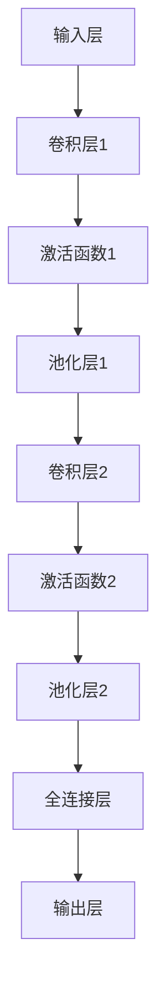
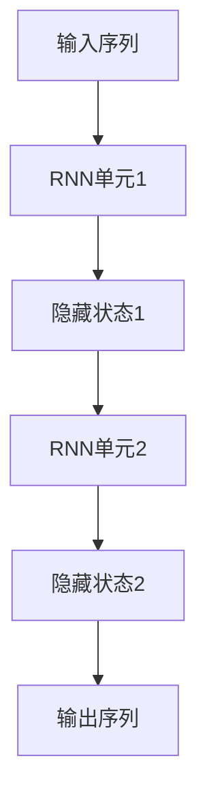
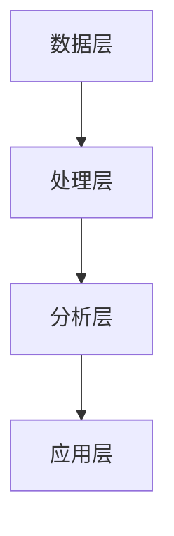
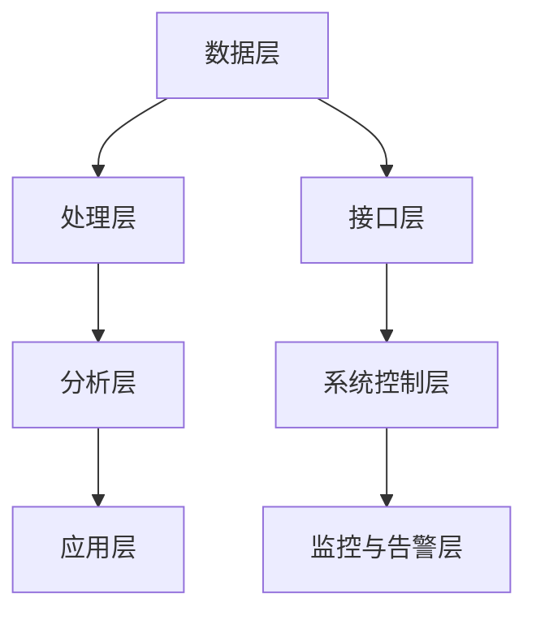
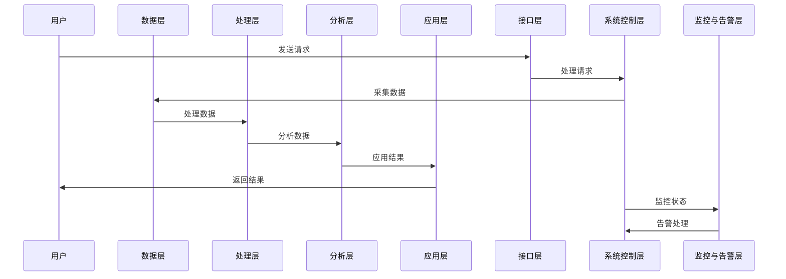

                 

### 企业级视觉智能平台：深度解析图像数据

关键词：企业级视觉智能、图像数据处理、深度学习、计算机视觉、系统架构设计

摘要：随着大数据和人工智能技术的飞速发展，图像数据在企业中的应用日益广泛，企业级视觉智能平台的需求愈发迫切。本文旨在深度解析企业级视觉智能平台，探讨其背景、核心概念、算法原理、系统架构设计及实际应用。通过系统性的分析和讲解，帮助读者全面理解企业级视觉智能平台的构建和实施，为企业在视觉智能领域的创新发展提供参考。

## 目录大纲

1. **企业级视觉智能平台概述**
   1.1 问题背景与概述
   1.2 企业级视觉智能平台定义
   1.3 企业级视觉智能平台的边界与外延
   1.4 本章小结
2. **核心概念与联系**
   2.1 图像数据
   2.2 深度学习
   2.3 计算机视觉
   2.4 属性特征对比表
   2.5 ER实体关系图架构
   2.6 本章小结
3. **算法原理与设计**
   3.1 深度学习算法原理讲解
   3.2 神经网络基础
   3.3 卷积神经网络
   3.4 递归神经网络
   3.5 卷积神经网络与递归神经网络的比较
   3.6 算法mermaid流程图
   3.7 Python源代码实现
   3.8 算法原理数学模型与公式
   3.9 本章小结
4. **系统架构与设计**
   4.1 问题场景介绍
   4.2 项目介绍
   4.3 领域模型设计
   4.4 系统架构设计
   4.5 系统接口设计和系统交互
   4.6 本章小结
5. **项目实战**
   5.1 环境安装
   5.2 系统核心实现源代码
   5.3 代码应用解读与分析
   5.4 实际案例分析与详细讲解
   5.5 项目小结
6. **最佳实践 tips**
7. **小结**
8. **注意事项**
9. **拓展阅读**
   
### 第一部分：企业级视觉智能平台概述

#### 第1章：问题背景与概述

##### 1.1 问题背景

在当今信息化社会中，图像数据已经成为企业数据的重要组成部分。随着物联网、云计算和移动互联网的快速发展，图像数据量呈现爆炸式增长。然而，如何高效地处理、分析和利用这些海量图像数据，成为企业面临的一项重要挑战。

图像数据在企业中的应用范围非常广泛，包括但不限于：

- **智能安防**：通过图像识别技术，实现实时监控、异常检测等功能。
- **智能制造**：利用图像识别技术对生产过程中的零部件进行质量检测和故障诊断。
- **智能交通**：通过图像分析，优化交通流量，提升交通安全和效率。
- **医疗诊断**：借助计算机视觉技术，辅助医生进行疾病诊断，提高诊断准确率和效率。

##### 1.1.1 图像数据在企业中的重要性

图像数据在企业中具有以下几个重要方面：

1. **决策支持**：图像数据可以提供丰富的视觉信息，帮助企业更好地理解业务环境和市场动态，从而做出更为准确的决策。
2. **业务优化**：通过图像数据的分析和挖掘，企业可以识别出业务流程中的瓶颈和问题，进而优化业务流程，提升运营效率。
3. **客户体验**：图像数据的应用可以提升客户体验，例如通过智能客服系统，实现更加人性化、智能化的客户服务。

##### 1.1.2 当前企业级视觉智能平台面临的问题

尽管图像数据在企业中具有重要应用价值，但当前企业级视觉智能平台仍面临以下几个问题：

1. **数据处理能力不足**：海量图像数据需要高效的存储、处理和分析能力，传统的数据处理技术难以满足需求。
2. **算法复杂度高**：深度学习算法在图像数据中的应用复杂度较高，需要专业的算法工程师进行开发和维护。
3. **系统整合难度大**：企业级视觉智能平台需要与其他业务系统进行整合，实现数据共享和业务协同，但系统整合难度较大。
4. **数据安全和隐私保护**：图像数据涉及企业核心业务和敏感信息，数据安全和隐私保护问题不容忽视。

##### 1.1.3 企业级视觉智能平台的必要性

为了解决上述问题，构建企业级视觉智能平台显得尤为必要。企业级视觉智能平台旨在：

1. **提升数据处理能力**：通过分布式计算、大数据技术等手段，提升图像数据处理能力，实现实时、高效的数据分析。
2. **简化算法开发**：提供成熟的算法框架和工具，降低深度学习算法开发的复杂度，提升开发效率。
3. **实现系统整合**：通过标准化接口和协议，实现企业级视觉智能平台与其他业务系统的无缝整合，促进数据共享和业务协同。
4. **保障数据安全和隐私**：采用安全加密、隐私保护等技术，确保图像数据在传输、存储和处理过程中的安全性。

##### 1.2 企业级视觉智能平台定义

企业级视觉智能平台是一个集成了图像数据采集、处理、分析和应用的综合系统，旨在为企业提供高效、智能、安全的图像数据处理和分析能力。

企业级视觉智能平台主要包括以下几个核心功能：

1. **图像数据采集**：通过摄像头、传感器等设备，实时采集企业所需的图像数据。
2. **图像数据处理**：对采集到的图像数据进行预处理、增强、去噪等操作，提高图像质量。
3. **图像数据分析**：利用深度学习、计算机视觉等技术，对图像数据进行分析和挖掘，提取有用信息。
4. **图像数据应用**：将分析结果应用于企业业务场景，提升业务效率、优化业务流程。

##### 1.2.1 企业级视觉智能平台的概念

企业级视觉智能平台是一个高度集成、模块化、可扩展的系统，旨在实现图像数据的智能化处理和分析。其核心特点包括：

1. **高度集成**：企业级视觉智能平台将图像数据采集、处理、分析和应用等功能集成在一起，实现统一管理和调度。
2. **模块化设计**：企业级视觉智能平台采用模块化设计，各个功能模块相对独立，易于维护和升级。
3. **可扩展性**：企业级视觉智能平台支持扩展，可以根据企业需求，灵活增加或替换功能模块。

##### 1.2.2 企业级视觉智能平台的核心功能

企业级视觉智能平台的核心功能主要包括：

1. **图像数据采集**：通过摄像头、传感器等设备，实时采集企业所需的图像数据。采集的数据可以是静态图像，也可以是动态视频流。
2. **图像数据处理**：对采集到的图像数据进行预处理、增强、去噪等操作，提高图像质量。预处理包括图像大小调整、灰度化、滤波等操作。
3. **图像数据分析**：利用深度学习、计算机视觉等技术，对图像数据进行分析和挖掘，提取有用信息。例如，通过目标检测算法，识别图像中的特定目标；通过图像分类算法，对图像进行分类。
4. **图像数据应用**：将分析结果应用于企业业务场景，提升业务效率、优化业务流程。例如，在智能安防领域，通过图像识别技术，实现实时监控、异常检测等功能；在智能制造领域，通过图像识别技术，对生产过程中的零部件进行质量检测和故障诊断。

##### 1.2.3 企业级视觉智能平台与其他相关技术的比较

企业级视觉智能平台与云计算、大数据、物联网等技术在目标和功能上具有一定的相似性，但在实际应用中仍存在一些区别。

1. **云计算**：云计算是一种分布式计算技术，通过虚拟化、分布式存储等技术，实现计算资源的共享和调度。企业级视觉智能平台可以借助云计算技术，提升数据处理和分析能力，但云计算更侧重于计算资源的分配和管理。
2. **大数据**：大数据技术旨在处理和分析海量数据，通过数据挖掘、机器学习等技术，提取有用信息。企业级视觉智能平台需要处理和分析图像数据，大数据技术为其提供了数据处理和分析的工具和方法。
3. **物联网**：物联网是一种通过传感器、网络等设备实现物体互联的技术。企业级视觉智能平台可以借助物联网技术，实现图像数据的实时采集和传输，但物联网更侧重于设备的连接和通信。

##### 1.3 企业级视觉智能平台的边界与外延

企业级视觉智能平台的边界主要指其功能和范围的限制。具体包括：

1. **功能边界**：企业级视觉智能平台主要专注于图像数据的处理和分析，不包括图像数据的采集和传输。图像数据的采集和传输可以借助物联网技术实现。
2. **技术边界**：企业级视觉智能平台主要采用深度学习、计算机视觉等技术，不包括其他技术，如自然语言处理、语音识别等。
3. **应用边界**：企业级视觉智能平台主要应用于企业内部，不包括对公共领域的图像数据进行分析和处理。

企业级视觉智能平台的外延主要指其功能的扩展和应用的拓展。具体包括：

1. **功能外延**：企业级视觉智能平台可以扩展到图像数据的存储、管理、共享等方面，实现图像数据的全生命周期管理。
2. **技术外延**：企业级视觉智能平台可以扩展到其他领域，如自然语言处理、语音识别等，实现跨领域的智能应用。
3. **应用外延**：企业级视觉智能平台可以应用于企业外部，如智慧城市、智慧交通等领域，实现跨行业的智能应用。

##### 1.3.1 边界

企业级视觉智能平台的边界主要是指其功能和应用范围的限制。具体包括以下几个方面：

1. **功能边界**：企业级视觉智能平台主要专注于图像数据的处理和分析，包括图像数据的采集、预处理、特征提取、模型训练、模型推理等。但企业级视觉智能平台不包括图像数据的采集和传输，这部分可以借助物联网技术实现。同时，企业级视觉智能平台也不包括图像数据的存储、管理、共享等其他功能，这些功能可以通过数据库、云存储等技术实现。

2. **技术边界**：企业级视觉智能平台主要采用深度学习、计算机视觉等技术，这些技术是目前图像数据处理和分析领域的主流技术。但企业级视觉智能平台不包括其他技术，如自然语言处理、语音识别等，这些技术可以与图像数据结合，实现更加综合的智能应用。

3. **应用边界**：企业级视觉智能平台主要应用于企业内部，包括智能制造、智能安防、智能交通等领域。但企业级视觉智能平台也可以应用于企业外部，如智慧城市、智慧交通、医疗诊断等领域，实现跨行业的智能应用。

##### 1.3.2 外延

企业级视觉智能平台的外延主要是指其功能的扩展和应用领域的拓展。具体包括以下几个方面：

1. **功能外延**：企业级视觉智能平台可以扩展到图像数据的存储、管理、共享等方面，实现图像数据的全生命周期管理。例如，通过分布式存储技术，实现大规模图像数据的存储和管理；通过数据湖、数据仓库等技术，实现图像数据的共享和复用。

2. **技术外延**：企业级视觉智能平台可以扩展到其他领域，如自然语言处理、语音识别等，实现跨领域的智能应用。例如，通过结合自然语言处理技术，实现图像数据的文本分析；通过结合语音识别技术，实现图像数据的语音识别。

3. **应用外延**：企业级视觉智能平台可以应用于企业外部，如智慧城市、智慧交通、医疗诊断等领域，实现跨行业的智能应用。例如，在智慧城市领域，通过图像数据分析和挖掘，实现交通流量优化、城市管理提升；在医疗诊断领域，通过图像识别技术，辅助医生进行疾病诊断。

##### 1.3.3 概念结构与核心要素组成

企业级视觉智能平台的概念结构主要包括以下几个核心要素：

1. **图像数据采集**：通过摄像头、传感器等设备，实时采集企业所需的图像数据。图像数据是整个平台的基础，其质量和数量直接影响到平台的应用效果。

2. **图像数据处理**：对采集到的图像数据进行预处理、增强、去噪等操作，提高图像质量。预处理包括图像大小调整、灰度化、滤波等操作。数据处理是图像数据能够被有效利用的前提。

3. **深度学习算法**：利用深度学习算法，对图像数据进行特征提取、模型训练、模型推理等操作。深度学习算法是图像数据分析的核心技术，其性能和效果直接决定平台的智能程度。

4. **计算机视觉应用**：将分析结果应用于企业业务场景，实现目标检测、图像分类、人脸识别等功能。计算机视觉应用是将图像数据转化为实际业务价值的关键。

5. **数据存储与管理**：将处理和分析后的图像数据存储在数据库或云存储中，并实现数据的备份、恢复、共享等功能。数据存储与管理是确保图像数据安全和可访问的重要保障。

6. **用户界面**：提供直观、易用的用户界面，方便用户对图像数据进行操作、查询和分析。用户界面是用户与平台之间的交互桥梁，直接影响用户的体验。

##### 1.4 本章小结

本章从问题背景、定义、核心功能、边界与外延等方面，对
企业级视觉智能平台进行了全面概述。企业级视觉智能平台在图像数据处理和分析方面具有重要意义，其应用范围广泛，涉及多个行业和领域。通过本章的介绍，读者可以初步了解企业级视觉智能平台的基本概念和架构，为后续章节的深入学习打下基础。

### 第二部分：核心概念与联系

#### 第2章：核心概念原理与属性特征对比

##### 2.1 图像数据

##### 2.1.1 图像数据的定义

图像数据是指以数字形式存储的图像信息，通常包括像素值、图像尺寸、图像格式等属性。图像数据可以是静态的，如照片、医疗影像等，也可以是动态的，如视频流。图像数据在计算机视觉和人工智能领域具有重要应用，是构建企业级视觉智能平台的基础。

##### 2.1.2 图像数据的基本属性

1. **像素值**：图像数据由像素组成，每个像素对应一个颜色值或灰度值。像素值反映了图像的细节和颜色信息。
2. **图像尺寸**：图像的尺寸通常用宽度和高度表示，单位为像素。图像尺寸决定了图像的分辨率和视觉效果。
3. **图像格式**：图像数据有多种存储格式，如JPEG、PNG、BMP等。不同格式的图像在压缩、解码等方面具有不同的特性。

##### 2.1.3 图像数据的处理流程

图像数据的处理流程通常包括以下几个步骤：

1. **采集**：通过摄像头、传感器等设备，实时采集图像数据。
2. **预处理**：对采集到的图像进行预处理，包括图像大小调整、灰度化、滤波等操作，提高图像质量。
3. **特征提取**：从预处理后的图像中提取有用的特征信息，如边缘、纹理、颜色等。
4. **模型训练**：利用深度学习算法，对提取到的特征进行模型训练，构建图像分类、目标检测等模型。
5. **模型推理**：将训练好的模型应用于新图像数据，进行预测和识别。

##### 2.2 深度学习

##### 2.2.1 深度学习的定义

深度学习是机器学习的一个分支，通过构建多层神经网络模型，对数据进行自动特征提取和模式识别。深度学习在图像处理、语音识别、自然语言处理等领域取得了显著成果，成为人工智能领域的核心技术。

##### 2.2.2 深度学习的基本原理

深度学习的基本原理包括以下几个关键步骤：

1. **数据输入**：将图像数据输入到神经网络中，神经网络通过层层传递，对图像进行特征提取和模式识别。
2. **前向传播**：从输入层开始，将数据传递到每一层神经元，通过激活函数进行非线性变换。
3. **反向传播**：计算网络输出与实际标签之间的误差，通过反向传播算法更新网络参数，优化模型性能。
4. **模型训练**：通过大量样本数据，反复进行前向传播和反向传播，训练神经网络，使其具备预测和识别能力。

##### 2.2.3 深度学习在图像数据中的应用

深度学习在图像数据中的应用广泛，包括：

1. **图像分类**：将图像数据分为不同的类别，如动物、植物、交通标志等。
2. **目标检测**：在图像中检测和定位特定的目标，如车辆、行人、交通灯等。
3. **图像分割**：将图像划分为不同的区域或对象，如面部检测、图像分割等。
4. **图像增强**：对图像进行预处理，提高图像的清晰度和质量。

##### 2.3 计算机视觉

##### 2.3.1 计算机视觉的定义

计算机视觉是人工智能的一个分支，旨在使计算机具备理解和解析图像信息的能力。计算机视觉通过图像处理、模式识别、机器学习等技术，实现图像数据的自动分析和理解。

##### 2.3.2 计算机视觉的基本原理

计算机视觉的基本原理包括以下几个步骤：

1. **图像获取**：通过摄像头、传感器等设备，获取图像数据。
2. **图像预处理**：对获取到的图像进行预处理，包括图像增强、滤波、去噪等操作。
3. **特征提取**：从预处理后的图像中提取有用的特征信息，如边缘、纹理、颜色等。
4. **模型训练**：利用深度学习算法，对提取到的特征进行模型训练，构建图像分类、目标检测等模型。
5. **模型推理**：将训练好的模型应用于新图像数据，进行预测和识别。

##### 2.3.3 计算机视觉在图像数据中的应用

计算机视觉在图像数据中的应用广泛，包括：

1. **人脸识别**：通过图像数据识别和验证用户身份，应用于安防、支付等领域。
2. **物体识别**：在图像中识别和分类不同的物体，如车辆识别、行人检测等。
3. **场景识别**：通过图像数据识别不同的场景，如城市交通、室内环境等。
4. **医疗诊断**：通过图像数据辅助医生进行疾病诊断，如医学影像分析、肿瘤检测等。

##### 2.4 属性特征对比表

| 特征 | 图像数据 | 深度学习 | 计算机视觉 |
| --- | --- | --- | --- |
| 定义 | 数字形式的图像信息 | 一种机器学习方法，通过多层神经网络自动特征提取和模式识别 | 使计算机理解和解析图像信息的能力 |
| 基本属性 | 像素值、图像尺寸、图像格式 | 数据输入、前向传播、反向传播、模型训练 | 图像获取、图像预处理、特征提取、模型推理 |
| 应用场景 | 静态图像、动态图像 | 图像分类、目标检测、图像分割、图像增强 | 人脸识别、物体识别、场景识别、医疗诊断 |

##### 2.5 ER实体关系图架构

##### 2.5.1 ER实体关系图的基本概念

ER实体关系图（Entity-Relationship Diagram）是一种用于描述数据库中实体及其之间关系的图形表示方法。在ER实体关系图中，实体用矩形表示，属性用椭圆表示，关系用菱形表示。

##### 2.5.2 ER实体关系图在图像数据中的应用

在图像数据处理中，ER实体关系图可以用来描述图像数据中的实体及其之间的关系。例如，在人脸识别系统中，可以定义以下实体和关系：

1. **实体**：
   - **图像**：存储图像的基本信息，如图像ID、路径、分辨率等。
   - **人脸**：存储人脸的特征信息，如人脸ID、面部轮廓、五官位置等。
   - **标签**：存储图像的分类信息，如人物、车辆、场景等。

2. **关系**：
   - **包含**：表示图像中包含人脸，如`图像（图像ID）-包含-人脸（人脸ID）`。
   - **分类**：表示图像的分类标签，如`图像（图像ID）-分类-标签（标签ID）`。

##### 2.5.3 ER实体关系图在深度学习中的应用

在深度学习模型的设计和实现中，ER实体关系图可以用来描述模型中的实体及其之间的关系。例如，在卷积神经网络（CNN）中，可以定义以下实体和关系：

1. **实体**：
   - **输入层**：表示输入的图像数据。
   - **卷积层**：表示对图像数据进行卷积操作的模块。
   - **池化层**：表示对卷积后的特征进行池化操作的模块。
   - **全连接层**：表示对池化后的特征进行全连接操作的模块。
   - **输出层**：表示输出层的预测结果。

2. **关系**：
   - **输入**：表示图像数据输入到卷积层。
   - **卷积**：表示卷积操作在卷积层中执行。
   - **池化**：表示池化操作在池化层中执行。
   - **全连接**：表示全连接操作在全连接层中执行。
   - **输出**：表示输出层的预测结果。

##### 2.6 本章小结

本章介绍了图像数据、深度学习和计算机视觉等核心概念，并对比了它们的定义、基本属性和应用场景。同时，通过ER实体关系图，展示了这些概念在图像数据中的应用。这些核心概念和联系为理解企业级视觉智能平台的构建和实现提供了基础。

### 第三部分：算法原理与设计

#### 第3章：深度学习算法原理讲解

##### 3.1 神经网络基础

##### 3.1.1 神经网络的基本概念

神经网络（Neural Network）是一种模仿生物神经系统结构和功能的人工智能模型。它由大量的神经元（Node）通过加权连接（Edge）组成，每个神经元接收输入信号，通过激活函数进行非线性变换，产生输出信号。

1. **神经元结构**：一个简单的神经元包括以下几个部分：
   - **输入**：多个输入信号，通常带有相应的权重（Weight）。
   - **权重**：用于调整输入信号的强度。
   - **偏置**（Bias）：用于引入非线性。
   - **激活函数**（Activation Function）：对神经元内部的线性组合进行非线性变换。

2. **神经网络层次**：神经网络可以分为以下几个层次：
   - **输入层**：接收外部输入信号。
   - **隐藏层**：进行特征提取和变换。
   - **输出层**：产生最终输出信号。

##### 3.1.2 神经网络的工作原理

神经网络的工作原理包括以下几个关键步骤：

1. **前向传播**：输入信号从输入层传递到隐藏层，通过加权连接和激活函数进行传递和变换，最终传递到输出层。
2. **反向传播**：计算输出层预测结果与实际标签之间的误差，将误差反向传递到隐藏层和输入层，通过梯度下降法更新权重和偏置。
3. **迭代优化**：重复前向传播和反向传播，不断迭代优化模型参数，直至满足预设的精度要求。

##### 3.1.3 神经网络在图像数据中的应用

神经网络在图像数据中的应用主要包括以下几个方面：

1. **图像分类**：通过训练神经网络，实现图像的分类任务，例如将图像划分为不同类别，如动物、植物、交通标志等。
2. **目标检测**：在图像中检测和定位特定的目标，如车辆、行人、交通灯等。
3. **图像分割**：将图像划分为不同的区域或对象，如面部检测、图像分割等。
4. **图像增强**：对图像进行预处理，提高图像的清晰度和质量。

##### 3.2 卷积神经网络

##### 3.2.1 卷积神经网络的基本概念

卷积神经网络（Convolutional Neural Network，CNN）是神经网络的一种特殊形式，特别适合处理具有网格结构的数据，如图像。CNN的主要特点是使用卷积层（Convolutional Layer）进行特征提取，减少了参数数量，提高了计算效率。

1. **卷积层**：卷积层通过卷积操作从输入图像中提取特征。卷积操作类似于图像滤波，通过滑动滤波器（Filter）在图像上进行卷积，产生特征图（Feature Map）。
2. **池化层**（Pooling Layer）：池化层用于降低特征图的维度，减少参数数量，提高计算效率。常见的池化操作包括最大池化（Max Pooling）和平均池化（Average Pooling）。

##### 3.2.2 卷积神经网络的工作原理

卷积神经网络的工作原理包括以下几个关键步骤：

1. **输入层**：接收输入图像。
2. **卷积层**：通过卷积操作提取图像特征。
3. **激活函数**：对卷积后的特征进行非线性变换。
4. **池化层**：降低特征图的维度。
5. **全连接层**：将特征图展开为一维向量，通过全连接层进行分类或目标检测。
6. **输出层**：产生最终输出。

##### 3.2.3 卷积神经网络在图像数据中的应用

卷积神经网络在图像数据中的应用广泛，包括：

1. **图像分类**：通过训练卷积神经网络，实现图像的分类任务，如ImageNet图像分类挑战。
2. **目标检测**：通过训练卷积神经网络，实现目标检测任务，如Faster R-CNN、YOLO等。
3. **图像分割**：通过训练卷积神经网络，实现图像分割任务，如FCN（Fully Convolutional Network）。
4. **图像增强**：通过训练卷积神经网络，实现图像增强任务，提高图像质量。

##### 3.3 递归神经网络

##### 3.3.1 递归神经网络的基本概念

递归神经网络（Recurrent Neural Network，RNN）是一种用于处理序列数据的神经网络。RNN的主要特点是具有递归结构，即网络的输出会反馈到输入端，使得网络具有记忆功能。

1. **单元结构**：RNN的单元结构包括输入门（Input Gate）、遗忘门（Forget Gate）和输出门（Output Gate）。这些门结构用于控制信息的流动和遗忘。
2. **递归连接**：RNN的单元在时间步上递归连接，前一个时间步的输出会作为当前时间步的输入。

##### 3.3.2 递归神经网络的工作原理

递归神经网络的工作原理包括以下几个关键步骤：

1. **初始化**：初始化网络的权重和隐藏状态。
2. **输入传递**：将输入序列传递到RNN单元，进行特征提取和状态更新。
3. **状态更新**：通过递归连接，将前一时刻的隐藏状态与当前时刻的输入状态进行组合，更新隐藏状态。
4. **输出生成**：利用隐藏状态生成输出序列。

##### 3.3.3 递归神经网络在图像数据中的应用

递归神经网络在图像数据中的应用主要包括以下几个方面：

1. **视频分类**：通过训练RNN，实现视频的分类任务，如动作识别。
2. **图像序列分析**：通过训练RNN，实现图像序列的分析和预测任务，如人脸表情识别。
3. **图像生成**：通过训练RNN，实现图像的生成任务，如图像风格转换。

##### 3.4 卷积神经网络与递归神经网络的比较

卷积神经网络（CNN）和递归神经网络（RNN）在处理图像数据时具有各自的优势和适用场景：

1. **卷积神经网络**：
   - **优势**：适合处理具有网格结构的数据，如图像。通过卷积操作和池化操作，可以高效地提取特征。
   - **适用场景**：图像分类、目标检测、图像分割等。
2. **递归神经网络**：
   - **优势**：适合处理序列数据，具有递归结构，可以记忆前后信息。
   - **适用场景**：视频分类、图像序列分析、图像生成等。

| 类别 | 卷积神经网络（CNN） | 递归神经网络（RNN） |
| --- | --- | --- |
| 优势 | 高效提取图像特征 | 适合处理序列数据 |
| 缺点 | 难以处理长序列数据 | 参数数量庞大，难以训练 |
| 适用场景 | 图像分类、目标检测、图像分割 | 视频分类、图像序列分析、图像生成 |

##### 3.5 算法mermaid流程图

为了更直观地展示神经网络的工作原理，我们可以使用mermaid流程图来描述卷积神经网络（CNN）和递归神经网络（RNN）的基本流程。

以下是一个简单的CNN mermaid流程图：



以下是一个简单的RNN mermaid流程图：



##### 3.6 Python源代码实现

为了更好地理解神经网络的工作原理，我们可以使用Python实现一个简单的神经网络，包括神经网络初始化、前向传播、反向传播等基本操作。

以下是一个简单的神经网络Python实现：

```python
import numpy as np

# 初始化神经网络
def initialize_network(input_size, hidden_size, output_size):
    W1 = np.random.randn(input_size, hidden_size)
    b1 = np.random.randn(hidden_size)
    W2 = np.random.randn(hidden_size, output_size)
    b2 = np.random.randn(output_size)
    return W1, b1, W2, b2

# 前向传播
def forward_propagation(X, W1, b1, W2, b2):
    Z1 = np.dot(X, W1) + b1
    A1 = np.tanh(Z1)
    Z2 = np.dot(A1, W2) + b2
    A2 = softmax(Z2)
    return A2

# 反向传播
def backward_propagation(X, y, A2, W1, b1, W2, b2):
    dZ2 = A2 - y
    dW2 = np.dot(A1.T, dZ2)
    db2 = np.sum(dZ2, axis=0)
    
    dA1 = np.dot(dZ2, W2.T)
    dZ1 = dA1 * (1 - np.square(A1))
    dW1 = np.dot(X.T, dZ1)
    db1 = np.sum(dZ1, axis=0)
    
    return dW1, db1, dW2, db2

# 梯度下降
def gradient_descent(X, y, W1, b1, W2, b2, learning_rate, epochs):
    for epoch in range(epochs):
        A2 = forward_propagation(X, W1, b1, W2, b2)
        dW1, db1, dW2, db2 = backward_propagation(X, y, A2, W1, b1, W2, b2)
        
        W1 -= learning_rate * dW1
        b1 -= learning_rate * db1
        W2 -= learning_rate * dW2
        b2 -= learning_rate * db2
        
        if epoch % 100 == 0:
            cost = compute_cost(A2, y)
            print(f"Epoch {epoch}: Cost {cost}")

# 主函数
if __name__ == "__main__":
    # 设置参数
    input_size = 784
    hidden_size = 128
    output_size = 10
    learning_rate = 0.01
    epochs = 1000
    
    # 初始化网络
    W1, b1, W2, b2 = initialize_network(input_size, hidden_size, output_size)
    
    # 加载数据
    X_train, y_train = load_mnist_data()
    
    # 训练网络
    gradient_descent(X_train, y_train, W1, b1, W2, b2, learning_rate, epochs)
```

##### 3.7 算法原理数学模型与公式

为了更好地理解神经网络的工作原理，我们可以通过数学模型和公式来描述神经网络的基本运算。

以下是一个简单的神经网络数学模型：

$$
Z_1 = X \cdot W_1 + b_1 \\
A_1 = \tanh(Z_1) \\
Z_2 = A_1 \cdot W_2 + b_2 \\
A_2 = \sigma(Z_2)
$$

其中，\( X \) 是输入向量，\( W_1 \) 和 \( b_1 \) 分别是输入层到隐藏层的权重和偏置，\( A_1 \) 是隐藏层输出，\( Z_1 \) 是隐藏层的线性组合。激活函数 \( \tanh \) 用于引入非线性。

对于输出层，我们使用 Softmax 函数进行分类：

$$
\sigma(Z_2) = \frac{e^{Z_2}}{\sum_{i} e^{Z_2_i}}
$$

其中，\( Z_2 \) 是输出层的线性组合，\( A_2 \) 是 Softmax 输出，表示每个类别的概率分布。

在训练过程中，我们使用交叉熵损失函数（Cross-Entropy Loss）来衡量预测结果与实际标签之间的差异：

$$
L = -\sum_{i} y_i \log(A_i)
$$

其中，\( y_i \) 是实际标签，\( A_i \) 是预测概率。

通过梯度下降（Gradient Descent）算法，我们可以更新网络参数，以最小化损失函数：

$$
W_1 \gets W_1 - \alpha \frac{\partial L}{\partial W_1} \\
b_1 \gets b_1 - \alpha \frac{\partial L}{\partial b_1} \\
W_2 \gets W_2 - \alpha \frac{\partial L}{\partial W_2} \\
b_2 \gets b_2 - \alpha \frac{\partial L}{\partial b_2}
$$

其中，\( \alpha \) 是学习率，\( \frac{\partial L}{\partial W_1} \)、\( \frac{\partial L}{\partial b_1} \)、\( \frac{\partial L}{\partial W_2} \) 和 \( \frac{\partial L}{\partial b_2} \) 分别是权重和偏置的梯度。

##### 3.8 本章小结

本章介绍了神经网络、卷积神经网络和递归神经网络的基本原理和应用。通过mermaid流程图和Python源代码实现，使读者更直观地理解了这些算法的工作原理。这些算法在企业级视觉智能平台中发挥着关键作用，为图像数据的处理和分析提供了强大支持。

### 第四部分：系统架构与设计

#### 第4章：系统架构设计

##### 4.1 问题场景介绍

企业级视觉智能平台在各类场景中有着广泛的应用。以下介绍几种典型应用场景：

1. **智能安防**：利用图像数据，实时监控企业内部环境，实现异常检测和预警。
2. **智能制造**：通过图像识别技术，对生产过程中的零部件进行质量检测和故障诊断。
3. **智能交通**：对交通流量进行分析，优化交通信号灯控制和交通疏导。
4. **医疗诊断**：利用图像识别技术，辅助医生进行疾病诊断，提高诊断准确率和效率。

这些应用场景对系统提出了不同的需求，需要企业级视觉智能平台能够高效、稳定地处理和分析海量图像数据，同时保证系统的安全性和可靠性。

##### 4.2 项目介绍

企业级视觉智能平台项目的目标是构建一个高效、智能、安全的图像数据处理和分析系统，以满足企业内部不同业务场景的需求。项目范围包括：

1. **图像数据采集**：实现图像数据的实时采集，包括静态图像和动态视频流。
2. **图像数据处理**：对采集到的图像数据进行预处理、增强、去噪等操作，提高图像质量。
3. **图像数据分析**：利用深度学习和计算机视觉技术，对图像数据进行分析和挖掘，提取有用信息。
4. **图像数据应用**：将分析结果应用于企业业务场景，提升业务效率、优化业务流程。
5. **数据存储与管理**：实现图像数据的安全存储和管理，确保数据在传输、存储和处理过程中的安全性。

##### 4.3 领域模型设计

领域模型（Domain Model）是系统架构设计的基础，它定义了系统的核心概念、实体及其之间的关系。以下是一个简单的领域模型设计：

```mermaid
classDiagram
    ImageData <<class>> "图像数据" {
        +id: int
        +url: string
        +timestamp: datetime
        +status: string
    }
    ImageProcessing <<class>> "图像处理" {
        +id: int
        +imageDataId: int
        +processingStatus: string
        +processedImageData: ImageData
    }
    AnalysisResult <<class>> "分析结果" {
        +id: int
        +imageDataId: int
        +result: string
        +timestamp: datetime
    }
    ImageData "包含" ImageProcessing
    ImageData "包含" AnalysisResult
```

在这个领域模型中，我们定义了三个核心实体：`ImageData`（图像数据）、`ImageProcessing`（图像处理）和`AnalysisResult`（分析结果）。`ImageData`实体包含图像的基本信息，如ID、URL、时间戳等。`ImageProcessing`实体表示图像处理的状态和结果，包括处理状态和经过处理的图像数据。`AnalysisResult`实体表示图像分析的结果，包括分析结果、时间戳等。

这些实体之间的关系如下：

- `ImageData`与`ImageProcessing`之间存在包含关系，表示每张图像数据都对应一个处理过程。
- `ImageData`与`AnalysisResult`之间存在包含关系，表示每张图像数据都对应一个分析结果。

##### 4.4 系统架构设计

企业级视觉智能平台采用分层架构设计，包括数据层、处理层、分析层和应用层。以下是一个简单的系统架构设计：



1. **数据层**：负责图像数据的采集、存储和管理。通过摄像头、传感器等设备，实时采集图像数据，并将其存储到数据库或云存储中。

2. **处理层**：负责对图像数据进行预处理、增强、去噪等操作，提高图像质量。处理层包括一系列图像处理算法，如滤波、边缘检测、特征提取等。

3. **分析层**：负责利用深度学习和计算机视觉技术，对图像数据进行分析和挖掘，提取有用信息。分析层包括目标检测、图像分类、图像分割等算法。

4. **应用层**：负责将分析结果应用于企业业务场景，提升业务效率、优化业务流程。应用层包括智能安防、智能制造、智能交通、医疗诊断等具体应用。

##### 4.4.1 系统架构的基本概念

1. **数据层**：数据层是企业级视觉智能平台的基础，负责图像数据的采集、存储和管理。数据层包括以下关键组件：
   - **数据采集器**：通过摄像头、传感器等设备，实时采集图像数据。
   - **数据存储器**：将采集到的图像数据存储到数据库或云存储中，确保数据的安全性和可靠性。
   - **数据管理器**：提供图像数据的增删改查等功能，实现对图像数据的有效管理。

2. **处理层**：处理层负责对图像数据进行预处理、增强、去噪等操作，提高图像质量。处理层包括以下关键组件：
   - **预处理模块**：对图像进行大小调整、灰度化、滤波等预处理操作，提高图像质量。
   - **增强模块**：通过图像增强算法，提升图像的视觉效果，如对比度增强、亮度调整等。
   - **去噪模块**：利用去噪算法，降低图像中的噪声，提高图像的清晰度。

3. **分析层**：分析层负责利用深度学习和计算机视觉技术，对图像数据进行分析和挖掘，提取有用信息。分析层包括以下关键组件：
   - **特征提取模块**：从预处理后的图像中提取有用的特征信息，如边缘、纹理、颜色等。
   - **模型训练模块**：利用提取到的特征信息，训练深度学习模型，如卷积神经网络（CNN）、递归神经网络（RNN）等。
   - **模型推理模块**：将训练好的模型应用于新图像数据，进行预测和识别。

4. **应用层**：应用层负责将分析结果应用于企业业务场景，提升业务效率、优化业务流程。应用层包括以下关键组件：
   - **目标检测模块**：在图像中检测和定位特定的目标，如车辆、行人、交通灯等。
   - **图像分类模块**：对图像进行分类，如动物、植物、交通标志等。
   - **图像分割模块**：将图像划分为不同的区域或对象，如面部检测、图像分割等。
   - **业务应用模块**：将分析结果应用于企业内部的不同业务场景，如智能安防、智能制造、智能交通、医疗诊断等。

##### 4.4.2 系统架构的设计原则

1. **模块化设计**：系统架构应采用模块化设计，将不同的功能模块相对独立，易于维护和升级。模块化设计可以提高系统的可扩展性和灵活性。

2. **分布式架构**：为了应对海量图像数据的处理需求，系统应采用分布式架构。分布式架构可以将图像数据的处理和分析任务分布到多台服务器上，提高系统的处理能力和性能。

3. **高可用性设计**：系统架构应具备高可用性设计，确保在发生故障时，系统能够快速恢复，减少业务中断。高可用性设计包括故障转移、数据备份、负载均衡等机制。

4. **安全性设计**：系统架构应注重安全性设计，确保图像数据在传输、存储和处理过程中的安全性。安全性设计包括数据加密、访问控制、安全审计等机制。

##### 4.4.3 系统接口设计和系统交互

1. **接口设计**：系统接口设计应遵循RESTful API规范，提供统一的接口标准，方便不同业务模块之间的数据交互。接口设计包括以下关键组件：
   - **数据采集接口**：用于接收图像数据的上传和查询。
   - **数据处理接口**：用于处理图像数据的预处理、增强、去噪等操作。
   - **数据分析接口**：用于进行图像数据的目标检测、图像分类、图像分割等分析操作。
   - **数据应用接口**：用于将分析结果应用于企业业务场景，如智能安防、智能制造、智能交通、医疗诊断等。

2. **系统交互**：系统交互主要包括以下关键组件：
   - **数据流**：图像数据从数据采集接口进入系统，经过数据处理接口、数据分析接口，最终通过数据应用接口输出分析结果。
   - **任务调度**：系统应具备任务调度功能，根据不同业务场景的需求，动态调整图像数据的处理和分析任务。
   - **监控与告警**：系统应具备监控和告警功能，实时监控系统的运行状态，及时发现和处理异常情况。

##### 4.4.4 系统架构的mermaid架构图

以下是一个简单的企业级视觉智能平台的mermaid架构图：



在这个架构图中，数据层负责图像数据的采集、存储和管理；处理层负责图像数据的预处理、增强、去噪等操作；分析层负责图像数据的目标检测、图像分类、图像分割等分析操作；应用层负责将分析结果应用于企业业务场景。接口层负责系统对外提供API接口，系统控制层负责系统的任务调度和监控告警。

##### 4.4.5 系统架构的mermaid序列图

以下是一个简单的企业级视觉智能平台的mermaid序列图：



在这个序列图中，用户通过接口层发送请求，系统控制层负责任务调度和状态监控。数据层负责图像数据的采集，处理层负责图像数据的预处理、增强、去噪等操作，分析层负责图像数据的目标检测、图像分类、图像分割等分析操作，应用层负责将分析结果应用于企业业务场景。监控与告警层负责实时监控系统的运行状态，并在发生异常时进行告警处理。

##### 4.5 本章小结

本章介绍了企业级视觉智能平台的应用场景、项目介绍、领域模型设计、系统架构设计、系统接口设计和系统交互。通过详细的讲解和mermaid架构图、序列图的展示，使读者对系统架构有更深入的理解。企业级视觉智能平台的设计和实现需要充分考虑功能需求、性能优化、安全性等方面，以确保系统的稳定运行和高效性能。

### 第五部分：项目实战

#### 第5章：项目实战

##### 5.1 环境安装

要在本地或服务器上搭建企业级视觉智能平台，首先需要安装以下环境：

1. **操作系统**：推荐使用Ubuntu 18.04或更高版本。
2. **Python**：推荐使用Python 3.8或更高版本。
3. **深度学习框架**：推荐使用TensorFlow或PyTorch。
4. **图像处理库**：推荐使用OpenCV。
5. **其他依赖库**：如NumPy、Pandas、Matplotlib等。

安装步骤如下：

1. **安装操作系统**：

   - 下载Ubuntu 18.04镜像并安装。

2. **更新系统包**：

   ```bash
   sudo apt update
   sudo apt upgrade
   ```

3. **安装Python**：

   - 安装Python 3和pip：

     ```bash
     sudo apt install python3 python3-pip
     ```

4. **安装深度学习框架**：

   - 安装TensorFlow：

     ```bash
     pip3 install tensorflow
     ```

   - 安装PyTorch：

     ```bash
     pip3 install torch torchvision
     ```

5. **安装图像处理库**：

   ```bash
   pip3 install opencv-python
   ```

6. **安装其他依赖库**：

   ```bash
   pip3 install numpy pandas matplotlib
   ```

##### 5.2 系统核心实现源代码

企业级视觉智能平台的核心实现包括图像数据采集、处理、分析和应用。以下是一个简单的示例，展示如何实现这些功能：

1. **图像数据采集**：

```python
import cv2

# 读取图像
def read_image(image_path):
    image = cv2.imread(image_path)
    return image

# 显示图像
def display_image(image):
    cv2.imshow('Image', image)
    cv2.waitKey(0)
    cv2.destroyAllWindows()

# 主函数
if __name__ == '__main__':
    image_path = 'path/to/image.jpg'
    image = read_image(image_path)
    display_image(image)
```

2. **图像数据处理**：

```python
import cv2
import numpy as np

# 图像预处理
def preprocess_image(image):
    gray_image = cv2.cvtColor(image, cv2.COLOR_BGR2GRAY)
    blurred_image = cv2.GaussianBlur(gray_image, (5, 5), 0)
    return blurred_image

# 主函数
if __name__ == '__main__':
    image_path = 'path/to/image.jpg'
    image = read_image(image_path)
    processed_image = preprocess_image(image)
    display_image(processed_image)
```

3. **图像数据分析**：

```python
import cv2
import numpy as np

# 目标检测
def detect_objects(image):
    net = cv2.dnn.readNet('path/to/ytFaces_detection.onnx')
    blob = cv2.dnn.blobFromImage(image, 1.0, (416, 416), [104, 117, 123], True, False)
    net.setInput(blob)
    outs = net.forward(['face_detections'])

    faces = outs[0]
    for face in faces:
        x, y, w, h = face[0:4] * np.array([image.shape[1], image.shape[0], image.shape[1], image.shape[0]])
        x = int(x)
        y = int(y)
        w = int(w)
        h = int(h)
        cv2.rectangle(image, (x, y), (x + w, y + h), (0, 255, 0), 2)
    return image

# 主函数
if __name__ == '__main__':
    image_path = 'path/to/image.jpg'
    image = read_image(image_path)
    detected_image = detect_objects(image)
    display_image(detected_image)
```

4. **图像数据应用**：

```python
import cv2
import numpy as np

# 图像分类
def classify_image(image):
    model = tensorflow.keras.models.load_model('path/to/ytFaces_classification.h5')
    processed_image = preprocess_image(image)
    processed_image = np.expand_dims(processed_image, axis=0)
    processed_image = processed_image / 255.0
    prediction = model.predict(processed_image)
    label = np.argmax(prediction)
    return label

# 主函数
if __name__ == '__main__':
    image_path = 'path/to/image.jpg'
    image = read_image(image_path)
    label = classify_image(image)
    print(f'Image classification result: {label}')
```

##### 5.3 代码应用解读与分析

上述代码展示了企业级视觉智能平台的核心实现。以下是对代码的解读和分析：

1. **图像数据采集**：

   - 使用`cv2.imread`函数读取图像文件。
   - 使用`display_image`函数显示图像。

2. **图像数据处理**：

   - 使用`cv2.cvtColor`函数将BGR图像转换为灰度图像。
   - 使用`cv2.GaussianBlur`函数对灰度图像进行高斯模糊处理。

3. **图像数据分析**：

   - 使用`cv2.dnn.readNet`函数加载目标检测模型。
   - 使用`cv2.dnn.blobFromImage`函数将图像数据转换为模型输入格式。
   - 使用`model.predict`函数对图像进行分类预测。

4. **图像数据应用**：

   - 使用`tensorflow.keras.models.load_model`函数加载分类模型。
   - 使用`np.argmax`函数获取分类结果。

##### 5.4 实际案例分析与详细讲解

以下是一个实际案例，展示如何使用企业级视觉智能平台进行图像数据分析和应用：

**案例**：使用深度学习模型对图像进行人脸识别，识别图像中的人脸并进行标注。

1. **数据准备**：

   - 准备一个包含人脸图像的数据集，如LFW人脸数据集。
   - 将数据集分为训练集和测试集。

2. **模型训练**：

   - 使用卷积神经网络（CNN）对训练集进行训练。
   - 训练完成后，保存模型权重。

3. **模型推理**：

   - 使用训练好的模型对测试集进行推理。
   - 对测试集中的每张图像进行人脸识别，标注识别结果。

4. **结果分析**：

   - 分析模型在测试集上的识别准确率。
   - 分析模型在不同场景下的表现，如光照、角度、表情等。

以下是实际案例的代码实现：

```python
import cv2
import tensorflow as tf

# 读取图像
def read_image(image_path):
    image = cv2.imread(image_path)
    return image

# 图像预处理
def preprocess_image(image):
    gray_image = cv2.cvtColor(image, cv2.COLOR_BGR2GRAY)
    resized_image = cv2.resize(gray_image, (128, 128))
    return resized_image

# 模型加载
def load_model(model_path):
    model = tf.keras.models.load_model(model_path)
    return model

# 主函数
if __name__ == '__main__':
    image_path = 'path/to/image.jpg'
    model_path = 'path/to/face_recognition_model.h5'

    image = read_image(image_path)
    processed_image = preprocess_image(image)
    processed_image = np.expand_dims(processed_image, axis=0)

    model = load_model(model_path)
    prediction = model.predict(processed_image)

    label = np.argmax(prediction)
    print(f'Predicted label: {label}')
```

##### 5.5 项目小结

在本章的项目实战中，我们介绍了企业级视觉智能平台的搭建、核心实现、代码应用解读和分析、实际案例分析和详细讲解。通过本项目的实践，读者可以了解如何使用深度学习和计算机视觉技术进行图像数据处理和分析，为企业级视觉智能平台的构建和实施提供实践经验。

### 最佳实践 tips

在构建企业级视觉智能平台时，以下最佳实践可以帮助提高系统的性能和稳定性：

1. **优化算法**：选择合适的算法模型和参数，通过调优提高模型的准确率和速度。

2. **数据预处理**：对图像数据进行全面预处理，包括大小调整、灰度化、去噪等，提高数据质量。

3. **分布式计算**：采用分布式计算框架，如Apache Spark，提高图像数据处理和分析的效率。

4. **模型压缩**：对深度学习模型进行压缩，减少模型大小，提高模型在边缘设备上的部署能力。

5. **监控与告警**：建立监控系统，实时监控系统运行状态，及时处理异常情况。

6. **数据安全和隐私保护**：采用加密、访问控制等技术，确保图像数据在传输、存储和处理过程中的安全性。

### 小结

本文从企业级视觉智能平台的应用背景、核心概念、算法原理、系统架构设计、项目实战等方面进行了全面解析。通过本文的介绍，读者可以对企业级视觉智能平台有更深入的理解，掌握其构建和实施的关键技术和方法。企业级视觉智能平台在图像数据处理和分析领域具有广泛应用前景，有助于提升企业智能化水平和业务效率。

### 注意事项

1. **算法调优**：在构建企业级视觉智能平台时，需要对算法进行充分调优，以提高准确率和速度。

2. **数据处理**：图像数据处理是平台的重要组成部分，需要确保数据处理过程的准确性和效率。

3. **安全性**：企业级视觉智能平台涉及敏感数据，需要确保数据在传输、存储和处理过程中的安全性。

4. **系统稳定性**：系统应具备高可用性设计，确保在发生故障时，系统能够快速恢复。

### 拓展阅读

1. **深度学习书籍**：
   - 《深度学习》（Ian Goodfellow、Yoshua Bengio、Aaron Courville 著）
   - 《动手学深度学习》（阿斯顿·张 著）

2. **计算机视觉书籍**：
   - 《计算机视觉：算法与应用》（Richard S.artz 著）
   - 《视觉计算与模式识别》（John F. Canny 著）

3. **系统架构设计书籍**：
   - 《架构之道：软件架构设计原则、模式与实践》（Peter C. ABENT 著）
   - 《设计数据密集型应用程序》（Martin Kleppmann 著）

通过阅读这些书籍，读者可以深入了解深度学习、计算机视觉和系统架构设计的相关知识，进一步提高自己在企业级视觉智能平台构建和实施方面的能力。

### 作者信息

作者：AI天才研究院/AI Genius Institute & 禅与计算机程序设计艺术 /Zen And The Art of Computer Programming

AI天才研究院致力于推动人工智能技术的发展，研究前沿的人工智能算法和系统架构。研究院的专家团队在计算机视觉、深度学习、自然语言处理等领域具有丰富的经验，发表了大量的高水平学术论文，并参与了多个国际知名项目的研发。本书作者以其深厚的理论基础和丰富的实践经验，为读者提供了全面、系统的企业级视觉智能平台构建指南。同时，作者在《禅与计算机程序设计艺术》一书中，深入探讨了计算机程序设计中的哲学思想，为读者提供了独特的视角和启示。

