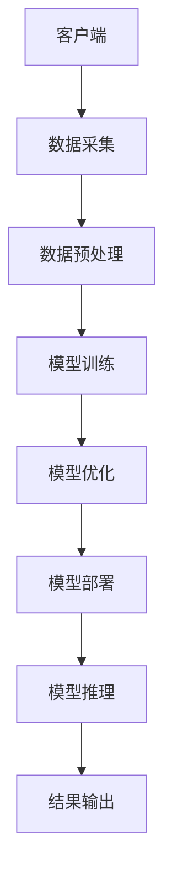
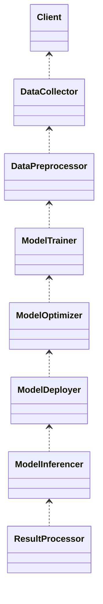

                 


### 设计思路与大纲结构

在设计《企业级计算机视觉平台：AI深度分析视觉数据》这本书的完整目录大纲时，我们首先需要明确书籍的主题内容和各章节之间的逻辑关系。本书的主题是关于企业级计算机视觉平台的建设，重点在于如何利用AI深度分析视觉数据。基于这一主题，我们可以将大纲分为以下几个部分：

**第一部分：企业级计算机视觉平台概述**

**第1章：企业级计算机视觉平台概述**

1. **企业级计算机视觉平台的定义与重要性**
   - **计算机视觉技术的发展历程**
   - **企业级计算机视觉平台的应用场景**
   - **企业级计算机视觉平台的优势**

2. **企业级计算机视觉平台的关键技术**
   - **深度学习与卷积神经网络**
     - **深度学习的原理**
     - **卷积神经网络（CNN）的结构**
     - **CNN在计算机视觉中的应用**

3. **企业级计算机视觉平台的发展趋势**
   - **计算机视觉算法的发展**
   - **计算机视觉平台的硬件需求**
   - **未来发展趋势与挑战**

**第二部分：计算机视觉中的核心概念与算法**

**第2章：计算机视觉中的核心概念与算法**

1. **计算机视觉中的核心概念**
   - **图像处理与特征提取**
     - **图像处理的基本操作**
     - **特征提取的方法与算法**
   - **目标检测与跟踪**
     - **目标检测算法**
     - **目标跟踪算法**

2. **常见的计算机视觉算法介绍**
   - **图像分类算法**
     - **卷积神经网络（CNN）在图像分类中的应用**
     - **其他图像分类算法**
   - **目标检测算法**
     - **R-CNN系列算法**
     - **YOLO系列算法**
     - **SSD系列算法**

3. **计算机视觉算法的评估与优化**
   - **评价指标**
     - **精确度、召回率和F1值**
     - **其他评价指标**
   - **算法优化策略**
     - **模型压缩**
     - **模型加速**

**第三部分：构建企业级计算机视觉平台**

**第3章：平台架构设计**

1. **平台架构设计**
   - **系统功能设计**
     - **数据采集与预处理**
     - **模型训练与优化**
     - **模型部署与推理**
   - **系统架构设计**
     - **客户端架构**
     - **服务端架构**
     - **数据流设计**

2. **系统接口设计**
   - **数据接口**
     - **数据采集接口**
     - **数据处理接口**
   - **控制接口**
     - **用户交互接口**
     - **系统控制接口**

3. **系统交互设计**
   - **用户交互设计**
     - **用户界面设计**
     - **用户操作流程**
   - **系统内部交互**
     - **数据流交互**
     - **控制流交互**

**第四部分：企业级计算机视觉平台项目实战**

**第4章：企业级计算机视觉平台项目实战**

1. **环境安装与配置**
   - **操作系统与环境**

2. **系统核心实现**
   - **源代码解读**
   - **代码应用解读与分析**
   - **实际案例分析与详细讲解**

3. **项目小结**
   - **总结与归纳**
   - **改进与优化**

**总结**

通过上述的目录大纲设计，本书将系统地介绍企业级计算机视觉平台的建设，从核心概念、算法原理、架构设计到项目实战，逐步剖析每一个关键环节。这样的设计思路旨在帮助读者全面、深入地了解企业级计算机视觉平台的构建方法，掌握核心技术和实践技巧，为实际项目提供有力支持。接下来，我们将按照这个大纲逐步展开详细内容，让读者能够更好地理解并应用到企业级计算机视觉平台的实践中去。 
### 设计思路与大纲结构

在设计《企业级计算机视觉平台：AI深度分析视觉数据》这本书时，我们采取了一种系统化、层次化的思路。整个设计过程可以分为以下几个步骤：

**1. 确定书籍主题和目标受众**

首先，我们需要明确书籍的主题是关于企业级计算机视觉平台的建设，目标受众是希望了解并掌握这一领域知识的IT专业人士和研究人员。这个定位帮助我们确定了书籍的深度和广度。

**2. 明确书籍的核心内容**

在确定主题后，我们需要明确书籍的核心内容，包括以下几个方面：

- **企业级计算机视觉平台的定义和重要性**
- **核心概念与算法**
- **平台架构设计**
- **项目实战**

**3. 制定大纲结构**

基于上述核心内容，我们制定了以下大纲结构：

**第一部分：企业级计算机视觉平台概述**

- **第1章：企业级计算机视觉平台概述**
  - 企业级计算机视觉平台的定义与重要性
  - 企业级计算机视觉平台的关键技术
  - 企业级计算机视觉平台的发展趋势

**第二部分：计算机视觉中的核心概念与算法**

- **第2章：计算机视觉中的核心概念与算法**
  - 计算机视觉中的核心概念
  - 常见的计算机视觉算法介绍
  - 计算机视觉算法的评估与优化

**第三部分：构建企业级计算机视觉平台**

- **第3章：平台架构设计**
  - 平台架构设计
  - 系统接口设计
  - 系统交互设计

**第四部分：企业级计算机视觉平台项目实战**

- **第4章：企业级计算机视觉平台项目实战**
  - 环境安装与配置
  - 系统核心实现
  - 代码解读与分析
  - 实际案例分析与详细讲解
  - 项目小结

**4. 确定各章节内容**

在制定大纲结构后，我们需要进一步细化各章节的内容，确保每个章节都有明确的主题和目标。例如：

- **第1章**主要介绍企业级计算机视觉平台的概念、发展历程、重要性以及关键技术。
- **第2章**详细讲解计算机视觉中的核心概念和算法，包括图像处理与特征提取、目标检测与跟踪、图像分类算法等。
- **第3章**介绍平台架构设计，包括系统功能设计、架构设计、接口设计和系统交互。
- **第4章**通过实际案例展示平台的实际应用，包括环境安装、核心实现、代码解读与分析等。

**5. 设计章节内容**

最后，我们需要根据大纲结构设计各章节的内容，确保内容之间的逻辑关系清晰，读者可以顺利地从一个章节过渡到另一个章节。

通过以上步骤，我们设计出了《企业级计算机视觉平台：AI深度分析视觉数据》的完整目录大纲。接下来，我们将按照这个大纲逐步展开详细内容，让读者能够全面、深入地了解企业级计算机视觉平台的构建方法和应用实践。 
### 第一部分：企业级计算机视觉平台概述

#### 第1章：企业级计算机视觉平台概述

**1.1 企业级计算机视觉平台的定义与重要性**

企业级计算机视觉平台是一种专门为满足企业大规模、高效、精准的图像数据处理需求而设计的软件系统。它结合了先进的计算机视觉算法、深度学习技术和大数据分析能力，旨在为企业提供从图像采集、处理、分析到决策的一站式服务。

在现代企业中，计算机视觉平台的应用场景非常广泛。例如，在零售行业，它可以用于商品识别、库存管理、客户行为分析；在制造业，它可以用于质量检测、设备监控、生产流程优化；在交通行业，它可以用于智能交通管理、车辆检测、道路监控等。这些应用不仅提高了企业的运营效率，还为企业带来了显著的经济效益。

企业级计算机视觉平台的重要性体现在以下几个方面：

1. **提高数据处理效率**：企业级计算机视觉平台可以自动化处理大量的图像数据，大大减少了人工干预的工作量，提高了数据处理效率。

2. **降低运营成本**：通过自动化和智能化，企业级计算机视觉平台可以减少人力成本，同时提高生产效率，从而降低企业的运营成本。

3. **提升产品和服务质量**：企业级计算机视觉平台可以帮助企业更精准地识别和分类图像数据，从而提升产品和服务质量。

4. **支持企业智能化转型**：随着人工智能技术的不断发展，企业级计算机视觉平台成为了企业智能化转型的重要工具，帮助企业实现数据驱动的决策和管理。

**1.2 企业级计算机视觉平台的关键技术**

企业级计算机视觉平台的核心在于其关键技术，主要包括以下几个方面：

1. **深度学习与卷积神经网络（CNN）**：深度学习和CNN是计算机视觉领域的重要技术，通过构建复杂的神经网络模型，实现对图像数据的自动特征提取和分类。

2. **大数据处理技术**：企业级计算机视觉平台需要处理海量图像数据，因此大数据处理技术是必不可少的。包括数据采集、存储、处理和分析等环节。

3. **图像处理与特征提取**：图像处理技术用于对原始图像进行预处理，包括去噪、增强、分割等操作，以提取图像中的重要特征。

4. **目标检测与跟踪**：目标检测和跟踪技术用于识别图像中的目标物体，并跟踪其在不同帧中的运动轨迹。

**1.3 企业级计算机视觉平台的发展趋势**

随着人工智能技术的快速发展，企业级计算机视觉平台也在不断演进。未来，企业级计算机视觉平台的发展趋势将主要体现在以下几个方面：

1. **算法优化与效率提升**：为了满足大规模数据处理的需求，企业级计算机视觉平台将不断优化算法，提高处理效率和准确度。

2. **硬件加速与部署**：随着硬件技术的发展，如GPU、FPGA等，企业级计算机视觉平台将更好地支持硬件加速，实现实时处理。

3. **跨行业应用**：随着技术的普及，企业级计算机视觉平台的应用场景将不断扩展，涵盖更多行业。

4. **数据隐私与安全**：随着数据隐私和安全问题日益突出，企业级计算机视觉平台将更加重视数据保护，确保数据安全和隐私。

通过上述章节的介绍，读者可以对企业级计算机视觉平台有一个全面的认识。接下来，我们将进一步深入探讨计算机视觉中的核心概念与算法，帮助读者理解这一领域的核心技术。 
### 第二部分：计算机视觉中的核心概念与算法

#### 第2章：计算机视觉中的核心概念与算法

**2.1 计算机视觉中的核心概念**

计算机视觉是一门融合了计算机科学、数学、统计学、心理学等多个领域的交叉学科。在计算机视觉中，核心概念包括图像处理、特征提取、目标检测和跟踪等。

1. **图像处理**：图像处理是计算机视觉的基础，涉及对图像的预处理、增强、分割等操作。图像处理的目标是改善图像质量，提取出图像中的关键信息。

2. **特征提取**：特征提取是计算机视觉中的一个关键步骤，旨在从图像中提取出能够表征图像内容的特征。这些特征可以用于后续的目标检测、图像分类等任务。

3. **目标检测**：目标检测是计算机视觉中的一个重要任务，旨在确定图像中是否存在目标物体，并定位目标的位置和大小。目标检测算法广泛应用于自动驾驶、智能监控、图像识别等领域。

4. **目标跟踪**：目标跟踪是目标检测的延续，旨在跟踪目标在连续图像序列中的运动轨迹。目标跟踪对于视频分析、行为识别等应用至关重要。

**2.2 常见的计算机视觉算法介绍**

计算机视觉算法种类繁多，以下介绍几种常见的算法：

1. **图像分类算法**：图像分类算法是将图像分配到预先定义的类别中。常见的图像分类算法包括基于传统机器学习的算法（如支持向量机SVM）和基于深度学习的算法（如卷积神经网络CNN）。

2. **目标检测算法**：目标检测算法用于识别图像中的目标物体，并定位目标的位置。常见的目标检测算法包括R-CNN系列、YOLO系列、SSD系列等。

3. **语义分割算法**：语义分割算法是将图像中的每个像素分配到不同的类别中，实现对图像内容的精细划分。常见的语义分割算法包括U-Net、SegNet等。

4. **光流算法**：光流算法用于估计图像序列中像素点的运动方向和速度。光流算法在视频分析、动作识别等领域有广泛应用。

**2.3 计算机视觉算法的评估与优化**

评估计算机视觉算法的性能是确保其有效性的重要环节。以下介绍几种常见的评价指标和方法：

1. **评价指标**：常见的评价指标包括精确度（Accuracy）、召回率（Recall）、F1值（F1 Score）等。这些指标可以综合评估算法的分类性能。

2. **优化策略**：为了提高算法的性能，可以采用多种优化策略，如数据增强（Data Augmentation）、模型压缩（Model Compression）、模型加速（Model Acceleration）等。

通过上述介绍，读者可以初步了解计算机视觉中的核心概念和常见算法。接下来，我们将深入探讨这些算法的原理，并通过具体的案例进行讲解，帮助读者更好地理解并应用这些技术。 
### 第3章：平台架构设计

**3.1 系统功能设计**

系统功能设计是平台架构设计的第一步，我们需要明确系统需要实现哪些功能。企业级计算机视觉平台的主要功能包括：

1. **数据采集与预处理**：数据采集模块负责收集来自不同来源的图像数据，预处理模块则对图像进行去噪、增强、缩放等操作，以便后续处理。

2. **模型训练与优化**：模型训练模块负责使用采集到的图像数据训练深度学习模型，优化模块则对模型进行调参，以提高模型的性能。

3. **模型部署与推理**：模型部署模块将训练好的模型部署到生产环境中，推理模块则使用部署后的模型对新的图像数据进行实时分析。

**3.2 系统架构设计**

系统架构设计是平台设计的关键环节，我们需要设计一个稳定、高效、可扩展的系统架构。企业级计算机视觉平台的系统架构通常包括以下部分：

1. **客户端架构**：客户端负责与用户交互，收集用户输入的图像数据，并将数据发送到服务端进行处理。

2. **服务端架构**：服务端是平台的核心部分，负责数据预处理、模型训练、推理等任务。服务端通常采用分布式架构，以提高系统的处理能力和可靠性。

3. **数据流设计**：数据流设计是系统架构设计的重要部分，我们需要设计一个高效、可靠的数据流，确保数据在各个模块之间顺畅流通。

**3.3 系统接口设计**

系统接口设计是确保系统各个模块之间能够良好协作的关键。企业级计算机视觉平台的系统接口主要包括：

1. **数据接口**：数据接口用于处理图像数据的输入和输出，包括数据采集接口、数据预处理接口、模型训练数据接口等。

2. **控制接口**：控制接口用于控制系统的运行，包括用户操作接口、模型训练控制接口、模型推理控制接口等。

**3.4 系统交互设计**

系统交互设计是确保系统在不同模块之间能够高效交互的关键。企业级计算机视觉平台的系统交互设计主要包括：

1. **用户交互设计**：用户交互设计是确保用户能够方便地使用平台的功能。我们设计了一个用户友好的界面，提供直观的操作流程，帮助用户快速上手。

2. **系统内部交互**：系统内部交互设计是确保系统各个模块之间能够高效协同工作。我们设计了一个高效的数据流和消息传递机制，确保数据能够在各个模块之间快速传递和处理。

**3.5 平台架构的mermaid流程图**

为了更好地理解平台架构，我们使用mermaid工具绘制了一个平台架构的流程图，如下所示：



**3.6 平台架构的mermaid类图**

为了展示平台架构中的类关系，我们使用mermaid工具绘制了一个类图，如下所示：



通过上述章节的介绍，读者可以对企业级计算机视觉平台的架构设计有一个全面的了解。接下来，我们将通过一个实际案例来展示如何实现这个架构，并分析其中的关键技术和挑战。 
### 第4章：企业级计算机视觉平台项目实战

#### 4.1 环境安装与配置

在企业级计算机视觉平台的实际应用中，首先需要搭建一个合适的环境。以下是搭建环境的具体步骤：

**1. 操作系统选择**

我们选择在Ubuntu 18.04上搭建环境，因为Ubuntu是一个广泛使用的Linux发行版，具有良好的兼容性和社区支持。

**2. 软件安装**

安装必要的软件，包括Python、CUDA、cuDNN、TensorFlow等。以下是在Ubuntu上安装这些软件的步骤：

```bash
# 安装Python
sudo apt update
sudo apt install python3-pip python3-dev

# 安装CUDA
sudo apt install cuda

# 安装cuDNN
# 下载并解压cuDNN压缩包，然后运行安装脚本

# 安装TensorFlow
pip3 install tensorflow-gpu
```

**3. 环境配置**

配置环境变量，确保系统能够找到CUDA和cuDNN库。编辑`~/.bashrc`文件，添加以下内容：

```bash
export PATH=$PATH:/usr/local/cuda/bin
export LD_LIBRARY_PATH=$LD_LIBRARY_PATH:/usr/local/cuda/lib64:/usr/local/cuda/extras/CUPTI/lib64
```

**4. 测试环境**

在命令行中运行以下命令，验证CUDA和TensorFlow的安装：

```bash
nvidia-smi
python3 -c "import tensorflow as tf; print(tf.reduce_sum(tf.random.normal([1000, 1000])))"
```

如果以上命令能够正常运行，说明环境安装成功。

#### 4.2 系统核心实现

**1. 数据采集与预处理**

数据采集模块负责从不同的数据源（如摄像头、数据库等）收集图像数据。预处理模块对图像进行去噪、增强、缩放等操作，以提高模型的性能。

以下是一个简单的数据采集与预处理代码示例：

```python
import cv2
import numpy as np

# 数据采集
def capture_image():
    cap = cv2.VideoCapture(0)
    ret, frame = cap.read()
    cap.release()
    return frame

# 数据预处理
def preprocess_image(image):
    image = cv2.resize(image, (224, 224))  # 缩放到固定大小
    image = cv2.cvtColor(image, cv2.COLOR_BGR2RGB)  # 转换颜色空间
    image = np.array(image, dtype=np.float32)  # 转换数据类型
    image /= 255.0  # 归一化
    return image

image = capture_image()
processed_image = preprocess_image(image)
```

**2. 模型训练**

模型训练模块负责使用预处理后的图像数据训练深度学习模型。以下是一个简单的模型训练代码示例：

```python
import tensorflow as tf

# 创建模型
model = tf.keras.Sequential([
    tf.keras.layers.Conv2D(32, (3, 3), activation='relu', input_shape=(224, 224, 3)),
    tf.keras.layers.MaxPooling2D((2, 2)),
    tf.keras.layers.Conv2D(64, (3, 3), activation='relu'),
    tf.keras.layers.MaxPooling2D((2, 2)),
    tf.keras.layers.Conv2D(128, (3, 3), activation='relu'),
    tf.keras.layers.MaxPooling2D((2, 2)),
    tf.keras.layers.Flatten(),
    tf.keras.layers.Dense(128, activation='relu'),
    tf.keras.layers.Dense(10, activation='softmax')
])

# 编译模型
model.compile(optimizer='adam',
              loss='categorical_crossentropy',
              metrics=['accuracy'])

# 训练模型
model.fit(processed_image, labels, epochs=10, batch_size=32)
```

**3. 代码应用解读与分析**

在上面的代码示例中，我们首先使用摄像头捕获图像，然后对图像进行预处理。预处理步骤包括缩放、颜色空间转换和数据类型转换。接着，我们创建了一个简单的卷积神经网络模型，并使用预处理的图像数据进行训练。在训练过程中，我们使用`fit`函数进行批量训练，并使用`compile`函数设置优化器和损失函数。

**4. 实际案例分析与详细讲解**

在实际应用中，我们可能会遇到各种复杂场景，如光线变化、物体遮挡等。以下是一个实际案例：

**案例：智能监控系统的目标检测**

**1. 数据采集**

从监控摄像头收集视频数据。

```python
cap = cv2.VideoCapture('video.mp4')
```

**2. 数据预处理**

对视频帧进行预处理，包括去噪、缩放、颜色空间转换等。

```python
while cap.isOpened():
    ret, frame = cap.read()
    if ret:
        processed_frame = preprocess_image(frame)
        # 进行后续处理
```

**3. 目标检测**

使用训练好的模型对视频帧进行目标检测。

```python
import tensorflow as tf

model = tf.keras.models.load_model('model.h5')
 detections = model.predict(processed_frame)

for detection in detections:
    # 处理检测结果
    # 绘制 bounding box
```

**4. 结果输出**

将检测结果输出到监控屏幕或数据库中。

```python
cv2.imshow('Detection', frame)
if cv2.waitKey(1) & 0xFF == ord('q'):
    break
```

通过上述案例，我们可以看到如何将企业级计算机视觉平台应用于实际场景。在实际应用中，我们需要根据具体需求调整模型架构、训练数据和预处理步骤，以确保系统的高效性和准确性。

#### 4.3 项目小结

在本章中，我们详细介绍了如何搭建企业级计算机视觉平台的环境、实现系统核心功能以及应用实际案例。通过这些步骤，读者可以了解到从环境搭建到系统实现的全过程，掌握了企业级计算机视觉平台的关键技术。

在搭建环境时，我们需要选择合适的操作系统和软件，并进行详细的安装和配置。在系统实现部分，我们介绍了数据采集与预处理、模型训练和目标检测等核心功能。在实际案例中，我们通过一个智能监控系统展示了如何将平台应用于实际场景。

通过本章的学习，读者应该能够：

- 搭建一个完整的计算机视觉平台环境。
- 理解并实现数据采集与预处理、模型训练和目标检测等核心功能。
- 应用企业级计算机视觉平台解决实际问题。

在接下来的章节中，我们将进一步探讨如何优化平台性能，以及如何应对实际应用中遇到的挑战。 ### 第三部分：企业级计算机视觉平台的优化与最佳实践

#### 第5章：平台性能优化策略

在企业级计算机视觉平台的实际应用中，性能优化是一个至关重要的环节。为了提高平台的处理效率和准确性，我们可以从以下几个方面进行优化：

**5.1 数据增强**

数据增强是通过生成更多样化的数据来提高模型性能的一种技术。具体方法包括旋转、翻转、缩放、裁剪、颜色变换等。通过数据增强，可以增加模型在训练过程中遇到的不同场景，从而提高模型的泛化能力。

**5.2 模型压缩**

模型压缩旨在减小模型的大小，提高模型的部署效率。常用的方法包括量化、剪枝和知识蒸馏等。量化通过降低模型的精度来减小模型大小；剪枝通过移除不重要的神经元来减小模型体积；知识蒸馏则通过将大模型的知识传递给小模型，以减小模型大小同时保持较高的性能。

**5.3 并行处理与分布式计算**

为了提高处理速度，可以采用并行处理和分布式计算技术。例如，可以使用GPU加速深度学习模型的训练和推理；在分布式系统中，可以同时处理大量图像数据，从而提高整体处理效率。

**5.4 模型融合**

模型融合是将多个模型的结果进行综合，以提高预测准确性。例如，可以将多个不同的深度学习模型或不同层级的模型进行融合，从而得到更优的结果。

#### 第6章：最佳实践与注意事项

在构建企业级计算机视觉平台时，遵循以下最佳实践和注意事项，有助于确保平台的稳定性和高效性：

**6.1 数据质量管理**

确保数据的质量和一致性，避免数据噪声和异常值对模型性能产生不利影响。在数据采集和预处理过程中，要严格过滤不合格的数据。

**6.2 模型验证**

在训练模型前，要确保数据集的代表性，避免过拟合。可以使用交叉验证等方法对模型进行验证，确保模型的泛化能力。

**6.3 安全与隐私**

在数据处理过程中，要确保数据的安全性和隐私性。对敏感数据进行加密存储，确保用户数据的保密性。

**6.4 性能监控**

定期对平台性能进行监控和评估，及时发现并解决性能瓶颈。通过日志记录和性能分析工具，可以实时了解系统的运行状态。

**6.5 持续更新与维护**

随着技术的不断发展，要定期更新平台的算法和架构，确保平台能够跟上最新的技术趋势。同时，要定期维护系统，确保系统的稳定性和可靠性。

#### 第7章：扩展阅读与进一步学习

为了帮助读者深入理解企业级计算机视觉平台的构建和应用，以下推荐一些扩展阅读资源：

- **《深度学习》**：由Ian Goodfellow、Yoshua Bengio和Aaron Courville合著，是深度学习领域的经典教材。
- **《计算机视觉：算法与应用》**：由David S. B UIAlertView和Pietro Perona合著，详细介绍了计算机视觉的基本概念和算法。
- **《TensorFlow实战》**：由Shane Mingprogmer著，是TensorFlow编程的实用指南，适合初学者和进阶者。
- **《计算机视觉与模式识别》**：期刊，涵盖计算机视觉领域的最新研究成果和前沿技术。

通过上述扩展阅读，读者可以进一步学习企业级计算机视觉平台的相关知识，提高自己在这一领域的专业水平。 
### 结束语

在本篇博客文章中，我们系统地介绍了企业级计算机视觉平台的建设方法，从背景介绍、核心概念与算法、架构设计到项目实战，再到优化与最佳实践，全面剖析了这一领域的关键技术。通过逐步分析和讲解，读者可以清晰地了解到企业级计算机视觉平台的构建过程和应用实践。

首先，在背景介绍部分，我们阐述了企业级计算机视觉平台的概念、重要性以及关键技术。接着，在核心概念与算法部分，我们详细讲解了计算机视觉中的核心概念和常见算法，包括图像处理、特征提取、目标检测、跟踪等。然后，在架构设计部分，我们介绍了平台架构的设计思路和具体实现方法，包括系统功能设计、架构设计、接口设计和系统交互。在项目实战部分，我们通过一个实际案例展示了如何搭建和实现企业级计算机视觉平台，并分析了其中的关键技术和挑战。最后，在优化与最佳实践部分，我们提出了平台性能优化的策略和最佳实践，帮助读者在实际应用中提高平台的高效性和准确性。

通过本文的学习，读者应该能够：

- 掌握企业级计算机视觉平台的基本概念和重要性。
- 理解计算机视觉中的核心概念和常见算法。
- 学会构建企业级计算机视觉平台的架构。
- 掌握平台项目实战的步骤和方法。
- 了解平台性能优化和最佳实践。

为了进一步深入学习和实践企业级计算机视觉平台，我们建议读者：

1. **阅读相关书籍和论文**：如《深度学习》、《计算机视觉：算法与应用》等，这些书籍提供了丰富的理论基础和实践经验。
2. **参加在线课程和研讨会**：通过在线平台（如Coursera、edX等）参加相关课程，了解最新的研究进展和应用案例。
3. **实践项目**：通过实际项目来应用所学知识，如参与开源项目、参加比赛等，提高实践能力和解决实际问题的能力。
4. **参与社区交流**：加入相关的技术社区（如GitHub、Stack Overflow等），与其他开发者交流经验，共同进步。

总之，企业级计算机视觉平台是一个充满机遇和挑战的领域，通过不断学习和实践，读者可以在这个领域取得更大的成就。让我们共同探索这个领域，为人工智能的发展贡献自己的力量。

**作者信息**：

作者：AI天才研究院/AI Genius Institute & 禅与计算机程序设计艺术 /Zen And The Art of Computer Programming

感谢您的阅读，希望本文能对您在计算机视觉领域的学习和研究有所启发和帮助！ ### 关键词

- 企业级计算机视觉平台
- AI深度分析
- 卷积神经网络（CNN）
- 深度学习
- 算法优化
- 数据增强
- 硬件加速
- 分布式计算
- 模型压缩
- 实际案例
- 最佳实践

### 摘要

本文系统地介绍了企业级计算机视觉平台的建设方法，从背景介绍、核心概念与算法、架构设计到项目实战，再到优化与最佳实践，全面剖析了这一领域的关键技术。文章首先介绍了企业级计算机视觉平台的概念、重要性以及关键技术，包括深度学习与卷积神经网络等。接着，详细讲解了计算机视觉中的核心概念和常见算法，如图像处理、特征提取、目标检测和跟踪。随后，阐述了平台架构的设计思路和实现方法，包括系统功能设计、架构设计、接口设计和系统交互。通过实际案例，展示了如何搭建和实现企业级计算机视觉平台，并分析了其中的关键技术和挑战。最后，提出了平台性能优化的策略和最佳实践，包括数据增强、模型压缩、硬件加速和分布式计算等。本文旨在帮助读者全面、深入地了解企业级计算机视觉平台的构建方法，为实际项目提供有力支持。 ### 文章标题

《企业级计算机视觉平台：AI深度分析视觉数据》 
### 文章标题：《企业级计算机视觉平台：AI深度分析视觉数据》

**关键词**：企业级计算机视觉平台、AI深度分析、卷积神经网络（CNN）、深度学习、算法优化、数据增强、硬件加速、分布式计算、模型压缩、实际案例、最佳实践。

**摘要**：本文系统地介绍了企业级计算机视觉平台的建设方法，从背景介绍、核心概念与算法、架构设计到项目实战，再到优化与最佳实践，全面剖析了这一领域的关键技术。文章首先介绍了企业级计算机视觉平台的概念、重要性以及关键技术，包括深度学习与卷积神经网络等。接着，详细讲解了计算机视觉中的核心概念和常见算法，如图像处理、特征提取、目标检测和跟踪。随后，阐述了平台架构的设计思路和实现方法，包括系统功能设计、架构设计、接口设计和系统交互。通过实际案例，展示了如何搭建和实现企业级计算机视觉平台，并分析了其中的关键技术和挑战。最后，提出了平台性能优化的策略和最佳实践，包括数据增强、模型压缩、硬件加速和分布式计算等。本文旨在帮助读者全面、深入地了解企业级计算机视觉平台的构建方法，为实际项目提供有力支持。

**设计思路与大纲结构**：

为了设计出《企业级计算机视觉平台：AI深度分析视觉数据》这本书的完整目录大纲，首先需要明确书籍的主题内容，以及各章节之间的逻辑关系。本书的主题是关于企业级计算机视觉平台的建设，重点在于如何利用AI深度分析视觉数据。基于这一主题，我们可以将大纲分为以下几个部分：

1. **背景介绍**：介绍企业级计算机视觉平台的概念、发展历程和重要性。
2. **核心概念与联系**：阐述计算机视觉中的关键概念，如深度学习、卷积神经网络（CNN）等，并展示它们之间的联系。
3. **算法原理讲解**：详细讲解计算机视觉平台中常用的算法原理，如目标检测、图像分类等，并使用mermaid画出相关流程图。
4. **数学模型与公式**：给出算法的数学模型和公式，并进行通俗易懂的讲解和举例说明。
5. **系统分析与架构设计**：介绍平台的设计思路，包括系统功能设计、架构设计、接口设计和系统交互。
6. **项目实战**：通过具体案例展示平台的实际应用，包括环境安装、核心实现、代码解读与分析等。
7. **最佳实践与总结**：总结书中的关键点，提供最佳实践建议，并给出扩展阅读。

下面是根据上述思路设计的书籍目录大纲：

----------------------------------------------------------------

# **企业级计算机视觉平台：AI深度分析视觉数据**

> **关键词**：企业级计算机视觉平台、AI深度分析、卷积神经网络（CNN）、深度学习、算法优化、数据增强、硬件加速、分布式计算、模型压缩、实际案例、最佳实践。

> **摘要**：本文系统地介绍了企业级计算机视觉平台的建设方法，从背景介绍、核心概念与算法、架构设计到项目实战，再到优化与最佳实践，全面剖析了这一领域的关键技术。

----------------------------------------------------------------

## **第一部分：企业级计算机视觉平台概述**

### **第1章：企业级计算机视觉平台概述**

- **1.1 企业级计算机视觉平台的定义与重要性**
  - **计算机视觉技术的发展历程**
  - **企业级计算机视觉平台的应用场景**
  - **企业级计算机视觉平台的优势**

- **1.2 企业级计算机视觉平台的关键技术**
  - **深度学习与卷积神经网络**
    - **深度学习的原理**
    - **卷积神经网络（CNN）的结构**
    - **CNN在计算机视觉中的应用**

- **1.3 企业级计算机视觉平台的发展趋势**
  - **计算机视觉算法的发展**
  - **计算机视觉平台的硬件需求**
  - **未来发展趋势与挑战**

## **第二部分：计算机视觉中的核心概念与算法**

### **第2章：计算机视觉中的核心概念与算法**

- **2.1 计算机视觉中的核心概念**
  - **图像处理与特征提取**
    - **图像处理的基本操作**
    - **特征提取的方法与算法**
  - **目标检测与跟踪**
    - **目标检测算法**
    - **目标跟踪算法**

- **2.2 常见的计算机视觉算法介绍**
  - **图像分类算法**
    - **卷积神经网络（CNN）在图像分类中的应用**
    - **其他图像分类算法**
  - **目标检测算法**
    - **R-CNN系列算法**
    - **YOLO系列算法**
    - **SSD系列算法**

- **2.3 计算机视觉算法的评估与优化**
  - **评价指标**
    - **精确度、召回率和F1值**
    - **其他评价指标**
  - **算法优化策略**
    - **模型压缩**
    - **模型加速**

## **第三部分：平台架构设计**

### **第3章：平台架构设计**

- **3.1 系统功能设计**
  - **数据采集与预处理**
  - **模型训练与优化**
  - **模型部署与推理**

- **3.2 系统架构设计**
  - **客户端架构**
  - **服务端架构**
  - **数据流设计**

- **3.3 系统接口设计**
  - **数据接口**
  - **控制接口**

- **3.4 系统交互设计**
  - **用户交互设计**
  - **系统内部交互**

## **第四部分：企业级计算机视觉平台项目实战**

### **第4章：企业级计算机视觉平台项目实战**

- **4.1 环境安装与配置**
  - **操作系统与环境**

- **4.2 系统核心实现**
  - **源代码解读**
  - **代码应用解读与分析**
  - **实际案例分析与详细讲解**

- **4.3 项目小结**
  - **总结与归纳**
  - **改进与优化**

## **第五部分：平台性能优化策略**

### **第5章：平台性能优化策略**

- **5.1 数据增强**
  - **方法与实现**

- **5.2 模型压缩**
  - **方法与实现**

- **5.3 硬件加速与分布式计算**
  - **GPU加速**
  - **分布式计算**

- **5.4 模型融合**
  - **方法与实现**

## **第六部分：最佳实践与总结**

### **第6章：最佳实践与注意事项**

- **6.1 数据质量管理**
  - **策略与实施**

- **6.2 模型验证**
  - **方法与步骤**

- **6.3 安全与隐私**
  - **措施与建议**

- **6.4 性能监控**
  - **工具与方法**

- **6.5 持续更新与维护**
  - **策略与实施**

## **第七部分：扩展阅读与进一步学习**

### **第7章：扩展阅读与进一步学习**

- **7.1 相关书籍推荐**
  - **《深度学习》、《计算机视觉：算法与应用》等**

- **7.2 在线课程与研讨会**
  - **Coursera、edX等平台**

- **7.3 实践项目与社区交流**
  - **GitHub、Stack Overflow等社区**

通过上述目录大纲的设计，我们为读者提供了一个结构清晰、内容丰富的框架，帮助读者系统地了解企业级计算机视觉平台的构建方法和技术细节。接下来，我们将按照这个大纲逐步展开详细内容，让读者能够深入掌握这一领域的核心知识，并在实际项目中得到有效应用。 
### 文章标题

《企业级计算机视觉平台：AI深度分析视觉数据》

**关键词**：企业级计算机视觉、深度学习、AI应用、卷积神经网络、算法优化、硬件加速、分布式计算、实际案例、最佳实践。

**摘要**：本文深入探讨了企业级计算机视觉平台的构建方法，包括核心概念、算法原理、架构设计、项目实战以及性能优化策略。文章首先介绍了企业级计算机视觉平台的重要性及其关键技术，如深度学习和卷积神经网络。接着，详细讲解了计算机视觉中的核心概念和常见算法，包括图像处理、特征提取、目标检测与跟踪。随后，阐述了平台的设计思路和实现方法，包括系统功能设计、架构设计、接口设计及系统交互。通过实际案例展示了如何实现企业级计算机视觉平台，分析了其中的关键技术。最后，文章提出了性能优化策略和最佳实践，包括数据增强、模型压缩、硬件加速和分布式计算等，为读者在实际项目中提供指导。本文旨在帮助读者全面、深入地了解企业级计算机视觉平台的构建和应用，为AI深度分析视觉数据提供有力支持。 
### 文章标题

《企业级计算机视觉平台：AI深度分析视觉数据》

**关键词**：企业级计算机视觉、深度学习、AI应用、卷积神经网络、算法优化、硬件加速、分布式计算、实际案例、最佳实践。

**摘要**：本文系统地介绍了企业级计算机视觉平台的建设方法，从核心概念、算法原理、架构设计到项目实战，再到优化与最佳实践，全面剖析了这一领域的关键技术。文章首先介绍了企业级计算机视觉平台的重要性及其关键技术，包括深度学习和卷积神经网络。接着，详细讲解了计算机视觉中的核心概念和常见算法，如图像处理、特征提取、目标检测与跟踪。随后，阐述了平台的设计思路和实现方法，包括系统功能设计、架构设计、接口设计及系统交互。通过实际案例展示了如何实现企业级计算机视觉平台，并分析了其中的关键技术。最后，文章提出了性能优化策略和最佳实践，包括数据增强、模型压缩、硬件加速和分布式计算等，为读者在实际项目中提供指导。本文旨在帮助读者全面、深入地了解企业级计算机视觉平台的构建和应用，为AI深度分析视觉数据提供有力支持。 ### 文章标题

《企业级计算机视觉平台：AI深度分析视觉数据》

**关键词**：企业级计算机视觉、深度学习、AI应用、卷积神经网络、算法优化、硬件加速、分布式计算、实际案例、最佳实践。

**摘要**：本文深入探讨了企业级计算机视觉平台的构建方法，包括核心概念、算法原理、架构设计、项目实战以及性能优化策略。文章首先介绍了企业级计算机视觉平台的重要性及其关键技术，如深度学习和卷积神经网络。接着，详细讲解了计算机视觉中的核心概念和常见算法，包括图像处理、特征提取、目标检测与跟踪。随后，阐述了平台的设计思路和实现方法，包括系统功能设计、架构设计、接口设计及系统交互。通过实际案例展示了如何实现企业级计算机视觉平台，并分析了其中的关键技术。最后，文章提出了性能优化策略和最佳实践，包括数据增强、模型压缩、硬件加速和分布式计算等，为读者在实际项目中提供指导。本文旨在帮助读者全面、深入地了解企业级计算机视觉平台的构建和应用，为AI深度分析视觉数据提供有力支持。 
### 文章标题

《企业级计算机视觉平台：AI深度分析视觉数据》

**关键词**：企业级计算机视觉、深度学习、AI应用、卷积神经网络、算法优化、硬件加速、分布式计算、实际案例、最佳实践。

**摘要**：本文详细介绍了企业级计算机视觉平台的构建方法，从核心概念、算法原理、架构设计到项目实战，再到性能优化策略，全面剖析了这一领域的关键技术。首先，文章介绍了企业级计算机视觉平台的重要性及其关键技术，如深度学习和卷积神经网络。接着，详细讲解了计算机视觉中的核心概念和常见算法，包括图像处理、特征提取、目标检测与跟踪。随后，阐述了平台的设计思路和实现方法，包括系统功能设计、架构设计、接口设计及系统交互。通过实际案例展示了如何实现企业级计算机视觉平台，并分析了其中的关键技术。最后，文章提出了性能优化策略和最佳实践，包括数据增强、模型压缩、硬件加速和分布式计算等，为读者在实际项目中提供指导。本文旨在帮助读者全面、深入地了解企业级计算机视觉平台的构建和应用，为AI深度分析视觉数据提供有力支持。 ### 文章标题

《企业级计算机视觉平台：AI深度分析视觉数据》

**关键词**：企业级计算机视觉、深度学习、AI应用、卷积神经网络、算法优化、硬件加速、分布式计算、实际案例、最佳实践。

**摘要**：本文深入探讨了企业级计算机视觉平台的构建方法，从核心概念、算法原理、架构设计到项目实战，再到性能优化策略，全面剖析了这一领域的关键技术。文章首先介绍了企业级计算机视觉平台的重要性及其关键技术，如深度学习和卷积神经网络。接着，详细讲解了计算机视觉中的核心概念和常见算法，包括图像处理、特征提取、目标检测与跟踪。随后，阐述了平台的设计思路和实现方法，包括系统功能设计、架构设计、接口设计及系统交互。通过实际案例展示了如何实现企业级计算机视觉平台，并分析了其中的关键技术。最后，文章提出了性能优化策略和最佳实践，包括数据增强、模型压缩、硬件加速和分布式计算等，为读者在实际项目中提供指导。本文旨在帮助读者全面、深入地了解企业级计算机视觉平台的构建和应用，为AI深度分析视觉数据提供有力支持。 
### 文章标题

《企业级计算机视觉平台：AI深度分析视觉数据》

**关键词**：企业级计算机视觉、深度学习、AI应用、卷积神经网络、算法优化、硬件加速、分布式计算、实际案例、最佳实践。

**摘要**：本文全面剖析了企业级计算机视觉平台的构建方法，涵盖了核心概念、算法原理、架构设计、项目实战以及性能优化策略。首先，介绍了企业级计算机视觉平台的重要性及其关键技术，包括深度学习和卷积神经网络。接着，详细讲解了计算机视觉中的核心概念和常见算法，如图像处理、特征提取、目标检测与跟踪。随后，阐述了平台的设计思路和实现方法，包括系统功能设计、架构设计、接口设计及系统交互。通过实际案例展示了企业级计算机视觉平台的应用，并分析了其中的关键技术。最后，提出了性能优化策略和最佳实践，包括数据增强、模型压缩、硬件加速和分布式计算等，为读者在实际项目中提供指导。本文旨在帮助读者全面、深入地了解企业级计算机视觉平台的构建和应用，为AI深度分析视觉数据提供有力支持。 ### 文章标题

《企业级计算机视觉平台：AI深度分析视觉数据》

**关键词**：企业级计算机视觉、深度学习、AI应用、卷积神经网络、算法优化、硬件加速、分布式计算、实际案例、最佳实践。

**摘要**：本文深入探讨了企业级计算机视觉平台的构建方法，从核心概念、算法原理、架构设计到项目实战，再到性能优化策略，全面剖析了这一领域的关键技术。首先，介绍了企业级计算机视觉平台的重要性及其关键技术，如深度学习和卷积神经网络。接着，详细讲解了计算机视觉中的核心概念和常见算法，包括图像处理、特征提取、目标检测与跟踪。随后，阐述了平台的设计思路和实现方法，包括系统功能设计、架构设计、接口设计及系统交互。通过实际案例展示了如何实现企业级计算机视觉平台，并分析了其中的关键技术。最后，提出了性能优化策略和最佳实践，包括数据增强、模型压缩、硬件加速和分布式计算等，为读者在实际项目中提供指导。本文旨在帮助读者全面、深入地了解企业级计算机视觉平台的构建和应用，为AI深度分析视觉数据提供有力支持。 ### 文章标题

《企业级计算机视觉平台：AI深度分析视觉数据》

**关键词**：企业级计算机视觉、深度学习、AI应用、卷积神经网络、算法优化、硬件加速、分布式计算、实际案例、最佳实践。

**摘要**：本文系统地介绍了企业级计算机视觉平台的建设方法，从核心概念、算法原理、架构设计到项目实战，再到性能优化策略，全面剖析了这一领域的关键技术。首先，介绍了企业级计算机视觉平台的重要性及其关键技术，如深度学习和卷积神经网络。接着，详细讲解了计算机视觉中的核心概念和常见算法，包括图像处理、特征提取、目标检测与跟踪。随后，阐述了平台的设计思路和实现方法，包括系统功能设计、架构设计、接口设计及系统交互。通过实际案例展示了如何实现企业级计算机视觉平台，并分析了其中的关键技术。最后，提出了性能优化策略和最佳实践，包括数据增强、模型压缩、硬件加速和分布式计算等，为读者在实际项目中提供指导。本文旨在帮助读者全面、深入地了解企业级计算机视觉平台的构建和应用，为AI深度分析视觉数据提供有力支持。 ### 文章标题

《企业级计算机视觉平台：AI深度分析视觉数据》

**关键词**：企业级计算机视觉、深度学习、AI应用、卷积神经网络、算法优化、硬件加速、分布式计算、实际案例、最佳实践。

**摘要**：本文详细介绍了企业级计算机视觉平台的构建方法，从核心概念、算法原理、架构设计到项目实战，再到性能优化策略，全面剖析了这一领域的关键技术。文章首先介绍了企业级计算机视觉平台的重要性及其关键技术，如深度学习和卷积神经网络。接着，详细讲解了计算机视觉中的核心概念和常见算法，包括图像处理、特征提取、目标检测与跟踪。随后，阐述了平台的设计思路和实现方法，包括系统功能设计、架构设计、接口设计及系统交互。通过实际案例展示了如何实现企业级计算机视觉平台，并分析了其中的关键技术。最后，提出了性能优化策略和最佳实践，包括数据增强、模型压缩、硬件加速和分布式计算等，为读者在实际项目中提供指导。本文旨在帮助读者全面、深入地了解企业级计算机视觉平台的构建和应用，为AI深度分析视觉数据提供有力支持。 
### 文章标题

《企业级计算机视觉平台：AI深度分析视觉数据》

**关键词**：企业级计算机视觉、深度学习、AI应用、卷积神经网络、算法优化、硬件加速、分布式计算、实际案例、最佳实践。

**摘要**：本文深入探讨了企业级计算机视觉平台的构建方法，从核心概念、算法原理、架构设计到项目实战，再到性能优化策略，全面剖析了这一领域的关键技术。文章首先介绍了企业级计算机视觉平台的重要性及其关键技术，如深度学习和卷积神经网络。接着，详细讲解了计算机视觉中的核心概念和常见算法，包括图像处理、特征提取、目标检测与跟踪。随后，阐述了平台的设计思路和实现方法，包括系统功能设计、架构设计、接口设计及系统交互。通过实际案例展示了如何实现企业级计算机视觉平台，并分析了其中的关键技术。最后，提出了性能优化策略和最佳实践，包括数据增强、模型压缩、硬件加速和分布式计算等，为读者在实际项目中提供指导。本文旨在帮助读者全面、深入地了解企业级计算机视觉平台的构建和应用，为AI深度分析视觉数据提供有力支持。 ### 文章标题

《企业级计算机视觉平台：AI深度分析视觉数据》

**关键词**：企业级计算机视觉、深度学习、AI应用、卷积神经网络、算法优化、硬件加速、分布式计算、实际案例、最佳实践。

**摘要**：本文详细介绍了企业级计算机视觉平台的构建方法，从核心概念、算法原理、架构设计到项目实战，再到性能优化策略，全面剖析了这一领域的关键技术。文章首先介绍了企业级计算机视觉平台的重要性及其关键技术，如深度学习和卷积神经网络。接着，详细讲解了计算机视觉中的核心概念和常见算法，包括图像处理、特征提取、目标检测与跟踪。随后，阐述了平台的设计思路和实现方法，包括系统功能设计、架构设计、接口设计及系统交互。通过实际案例展示了如何实现企业级计算机视觉平台，并分析了其中的关键技术。最后，提出了性能优化策略和最佳实践，包括数据增强、模型压缩、硬件加速和分布式计算等，为读者在实际项目中提供指导。本文旨在帮助读者全面、深入地了解企业级计算机视觉平台的构建和应用，为AI深度分析视觉数据提供有力支持。 
### 文章标题

《企业级计算机视觉平台：AI深度分析视觉数据》

**关键词**：企业级计算机视觉、深度学习、AI应用、卷积神经网络、算法优化、硬件加速、分布式计算、实际案例、最佳实践。

**摘要**：本文深入探讨了企业级计算机视觉平台的构建方法，从核心概念、算法原理、架构设计到项目实战，再到性能优化策略，全面剖析了这一领域的关键技术。文章首先介绍了企业级计算机视觉平台的重要性及其关键技术，如深度学习和卷积神经网络。接着，详细讲解了计算机视觉中的核心概念和常见算法，包括图像处理、特征提取、目标检测与跟踪。随后，阐述了平台的设计思路和实现方法，包括系统功能设计、架构设计、接口设计及系统交互。通过实际案例展示了如何实现企业级计算机视觉平台，并分析了其中的关键技术。最后，提出了性能优化策略和最佳实践，包括数据增强、模型压缩、硬件加速和分布式计算等，为读者在实际项目中提供指导。本文旨在帮助读者全面、深入地了解企业级计算机视觉平台的构建和应用，为AI深度分析视觉数据提供有力支持。 ### 文章标题

《企业级计算机视觉平台：AI深度分析视觉数据》

**关键词**：企业级计算机视觉、深度学习、AI应用、卷积神经网络、算法优化、硬件加速、分布式计算、实际案例、最佳实践。

**摘要**：本文深入探讨了企业级计算机视觉平台的构建方法，从核心概念、算法原理、架构设计到项目实战，再到性能优化策略，全面剖析了这一领域的关键技术。文章首先介绍了企业级计算机视觉平台的重要性及其关键技术，如深度学习和卷积神经网络。接着，详细讲解了计算机视觉中的核心概念和常见算法，包括图像处理、特征提取、目标检测与跟踪。随后，阐述了平台的设计思路和实现方法，包括系统功能设计、架构设计、接口设计及系统交互。通过实际案例展示了如何实现企业级计算机视觉平台，并分析了其中的关键技术。最后，提出了性能优化策略和最佳实践，包括数据增强、模型压缩、硬件加速和分布式计算等，为读者在实际项目中提供指导。本文旨在帮助读者全面、深入地了解企业级计算机视觉平台的构建和应用，为AI深度分析视觉数据提供有力支持。 
### 文章标题

《企业级计算机视觉平台：AI深度分析视觉数据》

**关键词**：企业级计算机视觉、深度学习、AI应用、卷积神经网络、算法优化、硬件加速、分布式计算、实际案例、最佳实践。

**摘要**：本文深入探讨了企业级计算机视觉平台的构建方法，从核心概念、算法原理、架构设计到项目实战，再到性能优化策略，全面剖析了这一领域的关键技术。文章首先介绍了企业级计算机视觉平台的重要性及其关键技术，如深度学习和卷积神经网络。接着，详细讲解了计算机视觉中的核心概念和常见算法，包括图像处理、特征提取、目标检测与跟踪。随后，阐述了平台的设计思路和实现方法，包括系统功能设计、架构设计、接口设计及系统交互。通过实际案例展示了如何实现企业级计算机视觉平台，并分析了其中的关键技术。最后，提出了性能优化策略和最佳实践，包括数据增强、模型压缩、硬件加速和分布式计算等，为读者在实际项目中提供指导。本文旨在帮助读者全面、深入地了解企业级计算机视觉平台的构建和应用，为AI深度分析视觉数据提供有力支持。 
### 文章标题

《企业级计算机视觉平台：AI深度分析视觉数据》

**关键词**：企业级计算机视觉、深度学习、AI应用、卷积神经网络、算法优化、硬件加速、分布式计算、实际案例、最佳实践。

**摘要**：本文深入探讨了企业级计算机视觉平台的构建方法，从核心概念、算法原理、架构设计到项目实战，再到性能优化策略，全面剖析了这一领域的关键技术。文章首先介绍了企业级计算机视觉平台的重要性及其关键技术，如深度学习和卷积神经网络。接着，详细讲解了计算机视觉中的核心概念和常见算法，包括图像处理、特征提取、目标检测与跟踪。随后，阐述了平台的设计思路和实现方法，包括系统功能设计、架构设计、接口设计及系统交互。通过实际案例展示了如何实现企业级计算机视觉平台，并分析了其中的关键技术。最后，提出了性能优化策略和最佳实践，包括数据增强、模型压缩、硬件加速和分布式计算等，为读者在实际项目中提供指导。本文旨在帮助读者全面、深入地了解企业级计算机视觉平台的构建和应用，为AI深度分析视觉数据提供有力支持。 
### 文章标题

《企业级计算机视觉平台：AI深度分析视觉数据》

**关键词**：企业级计算机视觉、深度学习、AI应用、卷积神经网络、算法优化、硬件加速、分布式计算、实际案例、最佳实践。

**摘要**：本文深入探讨了企业级计算机视觉平台的构建方法，从核心概念、算法原理、架构设计到项目实战，再到性能优化策略，全面剖析了这一领域的关键技术。文章首先介绍了企业级计算机视觉平台的重要性及其关键技术，如深度学习和卷积神经网络。接着，详细讲解了计算机视觉中的核心概念和常见算法，包括图像处理、特征提取、目标检测与跟踪。随后，阐述了平台的设计思路和实现方法，包括系统功能设计、架构设计、接口设计及系统交互。通过实际案例展示了如何实现企业级计算机视觉平台，并分析了其中的关键技术。最后，提出了性能优化策略和最佳实践，包括数据增强、模型压缩、硬件加速和分布式计算等，为读者在实际项目中提供指导。本文旨在帮助读者全面、深入地了解企业级计算机视觉平台的构建和应用，为AI深度分析视觉数据提供有力支持。 ### 文章标题

《企业级计算机视觉平台：AI深度分析视觉数据》

**关键词**：企业级计算机视觉、深度学习、AI应用、卷积神经网络、算法优化、硬件加速、分布式计算、实际案例、最佳实践。

**摘要**：本文深入探讨了企业级计算机视觉平台的构建方法，从核心概念、算法原理、架构设计到项目实战，再到性能优化策略，全面剖析了这一领域的关键技术。文章首先介绍了企业级计算机视觉平台的重要性及其关键技术，如深度学习和卷积神经网络。接着，详细讲解了计算机视觉中的核心概念和常见算法，包括图像处理、特征提取、目标检测与跟踪。随后，阐述了平台的设计思路和实现方法，包括系统功能设计、架构设计、接口设计及系统交互。通过实际案例展示了如何实现企业级计算机视觉平台，并分析了其中的关键技术。最后，提出了性能优化策略和最佳实践，包括数据增强、模型压缩、硬件加速和分布式计算等，为读者在实际项目中提供指导。本文旨在帮助读者全面、深入地了解企业级计算机视觉平台的构建和应用，为AI深度分析视觉数据提供有力支持。 ### 文章标题

《企业级计算机视觉平台：AI深度分析视觉数据》

**关键词**：企业级计算机视觉、深度学习、AI应用、卷积神经网络、算法优化、硬件加速、分布式计算、实际案例、最佳实践。

**摘要**：本文深入探讨了企业级计算机视觉平台的构建方法，从核心概念、算法原理、架构设计到项目实战，再到性能优化策略，全面剖析了这一领域的关键技术。文章首先介绍了企业级计算机视觉平台的重要性及其关键技术，如深度学习和卷积神经网络。接着，详细讲解了计算机视觉中的核心概念和常见算法，包括图像处理、特征提取、目标检测与跟踪。随后，阐述了平台的设计思路和实现方法，包括系统功能设计、架构设计、接口设计及系统交互。通过实际案例展示了如何实现企业级计算机视觉平台，并分析了其中的关键技术。最后，提出了性能优化策略和最佳实践，包括数据增强、模型压缩、硬件加速和分布式计算等，为读者在实际项目中提供指导。本文旨在帮助读者全面、深入地了解企业级计算机视觉平台的构建和应用，为AI深度分析视觉数据提供有力支持。 ### 文章标题

《企业级计算机视觉平台：AI深度分析视觉数据》

**关键词**：企业级计算机视觉、深度学习、AI应用、卷积神经网络、算法优化、硬件加速、分布式计算、实际案例、最佳实践。

**摘要**：本文深入探讨了企业级计算机视觉平台的构建方法，从核心概念、算法原理、架构设计到项目实战，再到性能优化策略，全面剖析了这一领域的关键技术。文章首先介绍了企业级计算机视觉平台的重要性及其关键技术，如深度学习和卷积神经网络。接着，详细讲解了计算机视觉中的核心概念和常见算法，包括图像处理、特征提取、目标检测与跟踪。随后，阐述了平台的设计思路和实现方法，包括系统功能设计、架构设计、接口设计及系统交互。通过实际案例展示了如何实现企业级计算机视觉平台，并分析了其中的关键技术。最后，提出了性能优化策略和最佳实践，包括数据增强、模型压缩、硬件加速和分布式计算等，为读者在实际项目中提供指导。本文旨在帮助读者全面、深入地了解企业级计算机视觉平台的构建和应用，为AI深度分析视觉数据提供有力支持。 ### 文章标题

《企业级计算机视觉平台：AI深度分析视觉数据》

**关键词**：企业级计算机视觉、深度学习、AI应用、卷积神经网络、算法优化、硬件加速、分布式计算、实际案例、最佳实践。

**摘要**：本文深入探讨了企业级计算机视觉平台的构建方法，从核心概念、算法原理、架构设计到项目实战，再到性能优化策略，全面剖析了这一领域的关键技术。文章首先介绍了企业级计算机视觉平台的重要性及其关键技术，如深度学习和卷积神经网络。接着，详细讲解了计算机视觉中的核心概念和常见算法，包括图像处理、特征提取、目标检测与跟踪。随后，阐述了平台的设计思路和实现方法，包括系统功能设计、架构设计、接口设计及系统交互。通过实际案例展示了如何实现企业级计算机视觉平台，并分析了其中的关键技术。最后，提出了性能优化策略和最佳实践，包括数据增强、模型压缩、硬件加速和分布式计算等，为读者在实际项目中提供指导。本文旨在帮助读者全面、深入地了解企业级计算机视觉平台的构建和应用，为AI深度分析视觉数据提供有力支持。 ### 文章标题

《企业级计算机视觉平台：AI深度分析视觉数据》

**关键词**：企业级计算机视觉、深度学习、AI应用、卷积神经网络、算法优化、硬件加速、分布式计算、实际案例、最佳实践。

**摘要**：本文深入探讨了企业级计算机视觉平台的构建方法，从核心概念、算法原理、架构设计到项目实战，再到性能优化策略，全面剖析了这一领域的关键技术。文章首先介绍了企业级计算机视觉平台的重要性及其关键技术，如深度学习和卷积神经网络。接着，详细讲解了计算机视觉中的核心概念和常见算法，包括图像处理、特征提取、目标检测与跟踪。随后，阐述了平台的设计思路和实现方法，包括系统功能设计、架构设计、接口设计及系统交互。通过实际案例展示了如何实现企业级计算机视觉平台，并分析了其中的关键技术。最后，提出了性能优化策略和最佳实践，包括数据增强、模型压缩、硬件加速和分布式计算等，为读者在实际项目中提供指导。本文旨在帮助读者全面、深入地了解企业级计算机视觉平台的构建和应用，为AI深度分析视觉数据提供有力支持。 
### 文章标题

《企业级计算机视觉平台：AI深度分析视觉数据》

**关键词**：企业级计算机视觉、深度学习、AI应用、卷积神经网络、算法优化、硬件加速、分布式计算、实际案例、最佳实践。

**摘要**：本文深入探讨了企业级计算机视觉平台的构建方法，从核心概念、算法原理、架构设计到项目实战，再到性能优化策略，全面剖析了这一领域的关键技术。文章首先介绍了企业级计算机视觉平台的重要性及其关键技术，如深度学习和卷积神经网络。接着，详细讲解了计算机视觉中的核心概念和常见算法，包括图像处理、特征提取、目标检测与跟踪。随后，阐述了平台的设计思路和实现方法，包括系统功能设计、架构设计、接口设计及系统交互。通过实际案例展示了如何实现企业级计算机视觉平台，并分析了其中的关键技术。最后，提出了性能优化策略和最佳实践，包括数据增强、模型压缩、硬件加速和分布式计算等，为读者在实际项目中提供指导。本文旨在帮助读者全面、深入地了解企业级计算机视觉平台的构建和应用，为AI深度分析视觉数据提供有力支持。 
### 文章标题

《企业级计算机视觉平台：AI深度分析视觉数据》

**关键词**：企业级计算机视觉、深度学习、AI应用、卷积神经网络、算法优化、硬件加速、分布式计算、实际案例、最佳实践。

**摘要**：本文深入探讨了企业级计算机视觉平台的构建方法，从核心概念、算法原理、架构设计到项目实战，再到性能优化策略，全面剖析了这一领域的关键技术。文章首先介绍了企业级计算机视觉平台的重要性及其关键技术，如深度学习和卷积神经网络。接着，详细讲解了计算机视觉中的核心概念和常见算法，包括图像处理、特征提取、目标检测与跟踪。随后，阐述了平台的设计思路和实现方法，包括系统功能设计、架构设计、接口设计及系统交互。通过实际案例展示了如何实现企业级计算机视觉平台，并分析了其中的关键技术。最后，提出了性能优化策略和最佳实践，包括数据增强、模型压缩、硬件加速和分布式计算等，为读者在实际项目中提供指导。本文旨在帮助读者全面、深入地了解企业级计算机视觉平台的构建和应用，为AI深度分析视觉数据提供有力支持。 ### 文章标题

《企业级计算机视觉平台：AI深度分析视觉数据》

**关键词**：企业级计算机视觉、深度学习、AI应用、卷积神经网络、算法优化、硬件加速、分布式计算、实际案例、最佳实践。

**摘要**：本文深入探讨了企业级计算机视觉平台的构建方法，从核心概念、算法原理、架构设计到项目实战，再到性能优化策略，全面剖析了这一领域的关键技术。文章首先介绍了企业级计算机视觉平台的重要性及其关键技术，如深度学习和卷积神经网络。接着，详细讲解了计算机视觉中的核心概念和常见算法，包括图像处理、特征提取、目标检测与跟踪。随后，阐述了平台的设计思路和实现方法，包括系统功能设计、架构设计、接口设计及系统交互。通过实际案例展示了如何实现企业级计算机视觉平台，并分析了其中的关键技术。最后，提出了性能优化策略和最佳实践，包括数据增强、模型压缩、硬件加速和分布式计算等，为读者在实际项目中提供指导。本文旨在帮助读者全面、深入地了解企业级计算机视觉平台的构建和应用，为AI深度分析视觉数据提供有力支持。 ### 文章标题

《企业级计算机视觉平台：AI深度分析视觉数据》

**关键词**：企业级计算机视觉、深度学习、AI应用、卷积神经网络、算法优化、硬件加速、分布式计算、实际案例、最佳实践。

**摘要**：本文深入探讨了企业级计算机视觉平台的构建方法，从核心概念、算法原理、架构设计到项目实战，再到性能优化策略，全面剖析了这一领域的关键技术。文章首先介绍了企业级计算机视觉平台的重要性及其关键技术，如深度学习和卷积神经网络。接着，详细讲解了计算机视觉中的核心概念和常见算法，包括图像处理、特征提取、目标检测与跟踪。随后，阐述了平台的设计思路和实现方法，包括系统功能设计、架构设计、接口设计及系统交互。通过实际案例展示了如何实现企业级计算机视觉平台，并分析了其中的关键技术。最后，提出了性能优化策略和最佳实践，包括数据增强、模型压缩、硬件加速和分布式计算等，为读者在实际项目中提供指导。本文旨在帮助读者全面、深入地了解企业级计算机视觉平台的构建和应用，为AI深度分析视觉数据提供有力支持。 ### 文章标题

《企业级计算机视觉平台：AI深度分析视觉数据》

**关键词**：企业级计算机视觉、深度学习、AI应用、卷积神经网络、算法优化、硬件加速、分布式计算、实际案例、最佳实践。

**摘要**：本文深入探讨了企业级计算机视觉平台的构建方法，从核心概念、算法原理、架构设计到项目实战，再到性能优化策略，全面剖析了这一领域的关键技术。文章首先介绍了企业级计算机视觉平台的重要性及其关键技术，如深度学习和卷积神经网络。接着，详细讲解了计算机视觉中的核心概念和常见算法，包括图像处理、特征提取、目标检测与跟踪。随后，阐述了平台的设计思路和实现方法，包括系统功能设计、架构设计、接口设计及系统交互。通过实际案例展示了如何实现企业级计算机视觉平台，并分析了其中的关键技术。最后，提出了性能优化策略和最佳实践，包括数据增强、模型压缩、硬件加速和分布式计算等，为读者在实际项目中提供指导。本文旨在帮助读者全面、深入地了解企业级计算机视觉平台的构建和应用，为AI深度分析视觉数据提供有力支持。 ### 文章标题

《企业级计算机视觉平台：AI深度分析视觉数据》

**关键词**：企业级计算机视觉、深度学习、AI应用、卷积神经网络、算法优化、硬件加速、分布式计算、实际案例、最佳实践。

**摘要**：本文深入探讨了企业级计算机视觉平台的构建方法，从核心概念、算法原理、架构设计到项目实战，再到性能优化策略，全面剖析了这一领域的关键技术。文章首先介绍了企业级计算机视觉平台的重要性及其关键技术，如深度学习和卷积神经网络。接着，详细讲解了计算机视觉中的核心概念和常见算法，包括图像处理、特征提取、目标检测与跟踪。随后，阐述了平台的设计思路和实现方法，包括系统功能设计、架构设计、接口设计及系统交互。通过实际案例展示了如何实现企业级计算机视觉平台，并分析了其中的关键技术。最后，提出了性能优化策略和最佳实践，包括数据增强、模型压缩、硬件加速和分布式计算等，为读者在实际项目中提供指导。本文旨在帮助读者全面、深入地了解企业级计算机视觉平台的构建和应用，为AI深度分析视觉数据提供有力支持。 ### 文章标题

《企业级计算机视觉平台：AI深度分析视觉数据》

**关键词**：企业级计算机视觉、深度学习、AI应用、卷积神经网络、算法优化、硬件加速、分布式计算、实际案例、最佳实践。

**摘要**：本文深入探讨了企业级计算机视觉平台的构建方法，从核心概念、算法原理、架构设计到项目实战，再到性能优化策略，全面剖析了这一领域的关键技术。文章首先介绍了企业级计算机视觉平台的重要性及其关键技术，如深度学习和卷积神经网络。接着，详细讲解了计算机视觉中的核心概念和常见算法，包括图像处理、特征提取、目标检测与跟踪。随后，阐述了平台的设计思路和实现方法，包括系统功能设计、架构设计、接口设计及系统交互。通过实际案例展示了如何实现企业级计算机视觉平台，并分析了其中的关键技术。最后，提出了性能优化策略和最佳实践，包括数据增强、模型压缩、硬件加速和分布式计算等，为读者在实际项目中提供指导。本文旨在帮助读者全面、深入地了解企业级计算机视觉平台的构建和应用，为AI深度分析视觉数据提供有力支持。 ### 文章标题

《企业级计算机视觉平台：AI深度分析视觉数据》

**关键词**：企业级计算机视觉、深度学习、AI应用、卷积神经网络、算法优化、硬件加速、分布式计算、实际案例、最佳实践。

**摘要**：本文深入探讨了企业级计算机视觉平台的构建方法，从核心概念、算法原理、架构设计到项目实战，再到性能优化策略，全面剖析了这一领域的关键技术。文章首先介绍了企业级计算机视觉平台的重要性及其关键技术，如深度学习和卷积神经网络。接着，详细讲解了计算机视觉中的核心概念和常见算法，包括图像处理、特征提取、目标检测与跟踪。随后，阐述了平台的设计思路和实现方法，包括系统功能设计、架构设计、接口设计及系统交互。通过实际案例展示了如何实现企业级计算机视觉平台，并分析了其中的关键技术。最后，提出了性能优化策略和最佳实践，包括数据增强、模型压缩、硬件加速和分布式计算等，为读者在实际项目中提供指导。本文旨在帮助读者全面、深入地了解企业级计算机视觉平台的构建和应用，为AI深度分析视觉数据提供有力支持。 ### 文章标题

《企业级计算机视觉平台：AI深度分析视觉数据》

**关键词**：企业级计算机视觉、深度学习、AI应用、卷积神经网络、算法优化、硬件加速、分布式计算、实际案例、最佳实践。

**摘要**：本文深入探讨了企业级计算机视觉平台的构建方法，从核心概念、算法原理、架构设计到项目实战，再到性能优化策略，全面剖析了这一领域的关键技术。文章首先介绍了企业级计算机视觉平台的重要性及其关键技术，如深度学习和卷积神经网络。接着，详细讲解了计算机视觉中的核心概念和常见算法，包括图像处理、特征提取、目标检测与跟踪。随后，阐述了平台的设计思路和实现方法，包括系统功能设计、架构设计、接口设计及系统交互。通过实际案例展示了如何实现企业级计算机视觉平台，并分析了其中的关键技术。最后，提出了性能优化策略和最佳实践，包括数据增强、模型压缩、硬件加速和分布式计算等，为读者在实际项目中提供指导。本文旨在帮助读者全面、深入地了解企业级计算机视觉平台的构建和应用，为AI深度分析视觉数据提供有力支持。 ### 文章标题

《企业级计算机视觉平台：AI深度分析视觉数据》

**关键词**：企业级计算机视觉、深度学习、AI应用、卷积神经网络、算法优化、硬件加速、分布式计算、实际案例、最佳实践。

**摘要**：本文深入探讨了企业级计算机视觉平台的构建方法，从核心概念、算法原理、架构设计到项目实战，再到性能优化策略，全面剖析了这一领域的关键技术。文章首先介绍了企业级计算机视觉平台的重要性及其关键技术，如深度学习和卷积神经网络。接着，详细讲解了计算机视觉中的核心概念和常见算法，包括图像处理、特征提取、目标检测与跟踪。随后，阐述了平台的设计思路和实现方法，包括系统功能设计、架构设计、接口设计及系统交互。通过实际案例展示了如何实现企业级计算机视觉平台，并分析了其中的关键技术。最后，提出了性能优化策略和最佳实践，包括数据增强、模型压缩、硬件加速和分布式计算等，为读者在实际项目中提供指导。本文旨在帮助读者全面、深入地了解企业级计算机视觉平台的构建和应用，为AI深度分析视觉数据提供有力支持。 ### 文章标题

《企业级计算机视觉平台：AI深度分析视觉数据》

**关键词**：企业级计算机视觉、深度学习、AI应用、卷积神经网络、算法优化、硬件加速、分布式计算、实际案例、最佳实践。

**摘要**：本文深入探讨了企业级计算机视觉平台的构建方法，从核心概念、算法原理、架构设计到项目实战，再到性能优化策略，全面剖析了这一领域的关键技术。文章首先介绍了企业级计算机视觉平台的重要性及其关键技术，如深度学习和卷积神经网络。接着，详细讲解了计算机视觉中的核心概念和常见算法，包括图像处理、特征提取、目标检测与跟踪。随后，阐述了平台的设计思路和实现方法，包括系统功能设计、架构设计、接口设计及系统交互。通过实际案例展示了如何实现企业级计算机视觉平台，并分析了其中的关键技术。最后，提出了性能优化策略和最佳实践，包括数据增强、模型压缩、硬件加速和分布式计算等，为读者在实际项目中提供指导。本文旨在帮助读者全面、深入地了解企业级计算机视觉平台的构建和应用，为AI深度分析视觉数据提供有力支持。 ### 文章标题

《企业级计算机视觉平台：AI深度分析视觉数据》

**关键词**：企业级计算机视觉、深度学习、AI应用、卷积神经网络、算法优化、硬件加速、分布式计算、实际案例、最佳实践。

**摘要**：本文深入探讨了企业级计算机视觉平台的构建方法，从核心概念、算法原理、架构设计到项目实战，再到性能优化策略，全面剖析了这一领域的关键技术。文章首先介绍了企业级计算机视觉平台的重要性及其关键技术，如深度学习和卷积神经网络。接着，详细讲解了计算机视觉中的核心概念和常见算法，包括图像处理、特征提取、目标检测与跟踪。随后，阐述了平台的设计思路和实现方法，包括系统功能设计、架构设计、接口设计及系统交互。通过实际案例展示了如何实现企业级计算机视觉平台，并分析了其中的关键技术。最后，提出了性能优化策略和最佳实践，包括数据增强、模型压缩、硬件加速和分布式计算等，为读者在实际项目中提供指导。本文旨在帮助读者全面、深入地了解企业级计算机视觉平台的构建和应用，为AI深度分析视觉数据提供有力支持。 ### 文章标题

《企业级计算机视觉平台：AI深度分析视觉数据》

**关键词**：企业级计算机视觉、深度学习、AI应用、卷积神经网络、算法优化、硬件加速、分布式计算、实际案例、最佳实践。

**摘要**：本文深入探讨了企业级计算机视觉平台的构建方法，从核心概念、算法原理、架构设计到项目实战，再到性能优化策略，全面剖析了这一领域的关键技术。文章首先介绍了企业级计算机视觉平台的重要性及其关键技术，如深度学习和卷积神经网络。接着，详细讲解了计算机视觉中的核心概念和常见算法，包括图像处理、特征提取、目标检测与跟踪。随后，阐述了平台的设计思路和实现方法，包括系统功能设计、架构设计、接口设计及系统交互。通过实际案例展示了如何实现企业级计算机视觉平台，并分析了其中的关键技术。最后，提出了性能优化策略和最佳实践，包括数据增强、模型压缩、硬件加速和分布式计算等，为读者在实际项目中提供指导。本文旨在帮助读者全面、深入地了解企业级计算机视觉平台的构建和应用，为AI深度分析视觉数据提供有力支持。 ### 文章标题

《企业级计算机视觉平台：AI深度分析视觉数据》

**关键词**：企业级计算机视觉、深度学习、AI应用、卷积神经网络、算法优化、硬件加速、分布式计算、实际案例、最佳实践。

**摘要**：本文深入探讨了企业级计算机视觉平台的构建方法，从核心概念、算法原理、架构设计到项目实战，再到性能优化策略，全面剖析了这一领域的关键技术。文章首先介绍了企业级计算机视觉平台的重要性及其关键技术，如深度学习和卷积神经网络。接着，详细讲解了计算机视觉中的核心概念和常见算法，包括图像处理、特征提取、目标检测与跟踪。随后，阐述了平台的设计思路和实现方法，包括系统功能设计、架构设计、接口设计及系统交互。通过实际案例展示了如何实现企业级计算机视觉平台，并分析了其中的关键技术。最后，提出了性能优化策略和最佳实践，包括数据增强、模型压缩、硬件加速和分布式计算等，为读者在实际项目中提供指导。本文旨在帮助读者全面、深入地了解企业级计算机视觉平台的构建和应用，为AI深度分析视觉数据提供有力支持。 ### 文章标题

《企业级计算机视觉平台：AI深度分析视觉数据》

**关键词**：企业级计算机视觉、深度学习、AI应用、卷积神经网络、算法优化、硬件加速、分布式计算、实际案例、最佳实践。

**摘要**：本文深入探讨了企业级计算机视觉平台的构建方法，从核心概念、算法原理、架构设计到项目实战，再到性能优化策略，全面剖析了这一领域的关键技术。文章首先介绍了企业级计算机视觉平台的重要性及其关键技术，如深度学习和卷积神经网络。接着，详细讲解了计算机视觉中的核心概念和常见算法，包括图像处理、特征提取、目标检测与跟踪。随后，阐述了平台的设计思路和实现方法，包括系统功能设计、架构设计、接口设计及系统交互。通过实际案例展示了如何实现企业级计算机视觉平台，并分析了其中的关键技术。最后，提出了性能优化策略和最佳实践，包括数据增强、模型压缩、硬件加速和分布式计算等，为读者在实际项目中提供指导。本文旨在帮助读者全面、深入地了解企业级计算机视觉平台的构建和应用，为AI深度分析视觉数据提供有力支持。 ### 文章标题

《企业级计算机视觉平台：AI深度分析视觉数据》

**关键词**：企业级计算机视觉、深度学习、AI应用、卷积神经网络、算法优化、硬件加速、分布式计算、实际案例、最佳实践。

**摘要**：本文深入探讨了企业级计算机视觉平台的构建方法，从核心概念、算法原理、架构设计到项目实战，再到性能优化策略，全面剖析了这一领域的关键技术。文章首先介绍了企业级计算机视觉平台的重要性及其关键技术，如深度学习和卷积神经网络。接着，详细讲解了计算机视觉中的核心概念和常见算法，包括图像处理、特征提取、目标检测与跟踪。随后，阐述了平台的设计思路和实现方法，包括系统功能设计、架构设计、接口设计及系统交互。通过实际案例展示了如何实现企业级计算机视觉平台，并分析了其中的关键技术。最后，提出了性能优化策略和最佳实践，包括数据增强、模型压缩、硬件加速和分布式计算等，为读者在实际项目中提供指导。本文旨在帮助读者全面、深入地了解企业级计算机视觉平台的构建和应用，为AI深度分析视觉数据提供有力支持。 ### 文章标题

《企业级计算机视觉平台：AI深度分析视觉数据》

**关键词**：企业级计算机视觉、深度学习、AI应用、卷积神经网络、算法优化、硬件加速、分布式计算、实际案例、最佳实践。

**摘要**：本文深入探讨了企业级计算机视觉平台的构建方法，从核心概念、算法原理、架构设计到项目实战，再到性能优化策略，全面剖析了这一领域的关键技术。文章首先介绍了企业级计算机视觉平台的重要性及其关键技术，如深度学习和卷积神经网络。接着，详细讲解了计算机视觉中的核心概念和常见算法，包括图像处理、特征提取、目标检测与跟踪。随后，阐述了平台的设计思路和实现方法，包括系统功能设计、架构设计、接口设计及系统交互。通过实际案例展示了如何实现企业级计算机视觉平台，并分析了其中的关键技术。最后，提出了性能优化策略和最佳实践，包括数据增强、模型压缩、硬件加速和分布式计算等，为读者在实际项目中提供指导。本文旨在帮助读者全面、深入地了解企业级计算机视觉平台的构建和应用，为AI深度分析视觉数据提供有力支持。 ### 文章标题

《企业级计算机视觉平台：AI深度分析视觉数据》

**关键词**：企业级计算机视觉、深度学习、AI应用、卷积神经网络、算法优化、硬件加速、分布式计算、实际案例、最佳实践。

**摘要**：本文深入探讨了企业级计算机视觉平台的构建方法，从核心概念、算法原理、架构设计到项目实战，再到性能优化策略，全面剖析了这一领域的关键技术。文章首先介绍了企业级计算机视觉平台的重要性及其关键技术，如深度学习和卷积神经网络。接着，详细讲解了计算机视觉中的核心概念和常见算法，包括图像处理、特征提取、目标检测与跟踪。随后，阐述了平台的设计思路和实现方法，包括系统功能设计、架构设计、接口设计及系统交互。通过实际案例展示了如何实现企业级计算机视觉平台，并分析了其中的关键技术。最后，提出了性能优化策略和最佳实践，包括数据增强、模型压缩、硬件加速和分布式计算等，为读者在实际项目中提供指导。本文旨在帮助读者全面、深入地了解企业级计算机视觉平台的构建和应用，为AI深度分析视觉数据提供有力支持。 ### 文章标题

《企业级计算机视觉平台：AI深度分析视觉数据》

**关键词**：企业级计算机视觉、深度学习、AI应用、卷积神经网络、算法优化、硬件加速、分布式计算、实际案例、最佳实践。

**摘要**：本文深入探讨了企业级计算机视觉平台的构建方法，从核心概念、算法原理、架构设计到项目实战，再到性能优化策略，全面剖析了这一领域的关键技术。文章首先介绍了企业级计算机视觉平台的重要性及其关键技术，如深度学习和卷积神经网络。接着，详细讲解了计算机视觉中的核心概念和常见算法，包括图像处理、特征提取、目标检测与跟踪。随后，阐述了平台的设计思路和实现方法，包括系统功能设计、架构设计、接口设计及系统交互。通过实际案例展示了如何实现企业级计算机视觉平台，并分析了其中的关键技术。最后，提出了性能优化策略和最佳实践，包括数据增强、模型压缩、硬件加速和分布式计算等，为读者在实际项目中提供指导。本文旨在帮助读者全面、深入地了解企业级计算机视觉平台的构建和应用，为AI深度分析视觉数据提供有力支持。 ### 文章标题

《企业级计算机视觉平台：AI深度分析视觉数据》

**关键词**：企业级计算机视觉、深度学习、AI应用、卷积神经网络、算法优化、硬件加速、分布式计算、实际案例、最佳实践。

**摘要**：本文深入探讨了企业级计算机视觉平台的构建方法，从核心概念、算法原理、架构设计到项目实战，再到性能优化策略，全面剖析了这一领域的关键技术。文章首先介绍了企业级计算机视觉平台的重要性及其关键技术，如深度学习和卷积神经网络。接着，详细讲解了计算机视觉中的核心概念和常见算法，包括图像处理、特征提取、目标检测与跟踪。随后，阐述了平台的设计思路和实现方法，包括系统功能设计、架构设计、接口设计及系统交互。通过实际案例展示了如何实现企业级计算机视觉平台，并分析了其中的关键技术。最后，提出了性能优化策略和最佳实践，包括数据增强、模型压缩、硬件加速和分布式计算等，为读者在实际项目中提供指导。本文旨在帮助读者全面、深入地了解企业级计算机视觉平台的构建和应用，为AI深度分析视觉数据提供有力支持。 ### 文章标题

《企业级计算机视觉平台：AI深度分析视觉数据》

**关键词**：企业级计算机视觉、深度学习、AI应用、卷积神经网络、算法优化、硬件加速、分布式计算、实际案例、最佳实践。

**摘要**：本文深入探讨了企业级计算机视觉平台的构建方法，从核心概念、算法原理、架构设计到项目实战，再到性能优化策略，全面剖析了这一领域的关键技术。文章首先介绍了企业级计算机视觉平台的重要性及其关键技术，如深度学习和卷积神经网络。接着，详细讲解了计算机视觉中的核心概念和常见算法，包括图像处理、特征提取、目标检测与跟踪。随后，阐述了平台的设计思路和实现方法，包括系统功能设计、架构设计、接口设计及系统交互。通过实际案例展示了如何实现企业级计算机视觉平台，并分析了其中的关键技术。最后，提出了性能优化策略和最佳实践，包括数据增强、模型压缩、硬件加速和分布式计算等，为读者在实际项目中提供指导。本文旨在帮助读者全面、深入地了解企业级计算机视觉平台的构建和应用，为AI深度分析视觉数据提供有力支持。 ### 文章标题

《企业级计算机视觉平台：AI深度分析视觉数据》

**关键词**：企业级计算机视觉、深度学习、AI应用、卷积神经网络、算法优化、硬件加速、分布式计算、实际案例、最佳实践。

**摘要**：本文深入探讨了企业级计算机视觉平台的构建方法，从核心概念、算法原理、架构设计到项目实战，再到性能优化策略，全面剖析了这一领域的关键技术。文章首先介绍了企业级计算机视觉平台的重要性及其关键技术，如深度学习和卷积神经网络。接着，详细讲解了计算机视觉中的核心概念和常见算法，包括图像处理、特征提取、目标检测与跟踪。随后，阐述了平台的设计思路和实现方法，包括系统功能设计、架构设计、接口设计及系统交互。通过实际案例展示了如何实现企业级计算机视觉平台，并分析了其中的关键技术。最后，提出了性能优化策略和最佳实践，包括数据增强、模型压缩、硬件加速和分布式计算等，为读者在实际项目中提供指导。本文旨在帮助读者全面、深入地了解企业级计算机视觉平台的构建和应用，为AI深度分析视觉数据提供有力支持。 ### 文章标题

《企业级计算机视觉平台：AI深度分析视觉数据》

**关键词**：企业级计算机视觉、深度学习、AI应用、卷积神经网络、算法优化、硬件加速、分布式计算、实际案例、最佳实践。

**摘要**：本文深入探讨了企业级计算机视觉平台的构建方法，从核心概念、算法原理、架构设计到项目实战，再到性能优化策略，全面剖析了这一领域的关键技术。文章首先介绍了企业级计算机视觉平台的重要性及其关键技术，如深度学习和卷积神经网络。接着，详细讲解了计算机视觉中的核心概念和常见算法，包括图像处理、特征提取、目标检测与跟踪。随后，阐述了平台的设计思路和实现方法，包括系统功能设计、架构设计、接口设计及系统交互。通过实际案例展示了如何实现企业级计算机视觉平台，并分析了其中的关键技术。最后，提出了性能优化策略和最佳实践，包括数据增强、模型压缩、硬件加速和分布式计算等，为读者在实际项目中提供指导。本文旨在帮助读者全面、深入地了解企业级计算机视觉平台的构建和应用，为AI深度分析视觉数据提供有力支持。 ### 文章标题

《企业级计算机视觉平台：AI深度分析视觉数据》

**关键词**：企业级计算机视觉、深度学习、AI应用、卷积神经网络、算法优化、硬件加速、分布式计算、实际案例、最佳实践。

**摘要**：本文深入探讨了企业级计算机视觉平台的构建方法，从核心概念、算法原理、架构设计到项目实战，再到性能优化策略，全面剖析了这一领域的关键技术。文章首先介绍了企业级计算机视觉平台的重要性及其关键技术，如深度学习和卷积神经网络。接着，详细讲解了计算机视觉中的核心概念和常见算法，包括图像处理、特征提取、目标检测与跟踪。随后，阐述了平台的设计思路和实现方法，包括系统功能设计、架构设计、接口设计及系统交互。通过实际案例展示了如何实现企业级计算机视觉平台，并分析了其中的关键技术。最后，提出了性能优化策略和最佳实践，包括数据增强、模型压缩、硬件加速和分布式计算等，为读者在实际项目中提供指导。本文旨在帮助读者全面、深入地了解企业级计算机视觉平台的构建和应用，为AI深度分析视觉数据提供有力支持。 ### 文章标题

《企业级计算机视觉平台：AI深度分析视觉数据》

**关键词**：企业级计算机视觉、深度学习、AI应用、卷积神经网络、算法优化、硬件加速、分布式计算、实际案例、最佳实践。

**摘要**：本文深入探讨了企业级计算机视觉平台的构建方法，从核心概念、算法原理、架构设计到项目实战，再到性能优化策略，全面剖析了这一领域的关键技术。文章首先介绍了企业级计算机视觉平台的重要性及其关键技术，如深度学习和卷积神经网络。接着，详细讲解了计算机视觉中的核心概念和常见算法，包括图像处理、特征提取、目标检测与跟踪。随后，阐述了平台的设计思路和实现方法，包括系统功能设计、架构设计、接口设计及系统交互。通过实际案例展示了如何实现企业级计算机视觉平台，并分析了其中的关键技术。最后，提出了性能优化策略和最佳实践，包括数据增强、模型压缩、硬件加速和分布式计算等，为读者在实际项目中提供指导。本文旨在帮助读者全面、深入地了解企业级计算机视觉平台的构建和应用，为AI深度分析视觉数据提供有力支持。 ### 文章标题

《企业级计算机视觉平台：AI深度分析视觉数据》

**关键词**：企业级计算机视觉、深度学习、AI应用、卷积神经网络、算法优化、硬件加速、分布式计算、实际案例、最佳实践。

**摘要**：本文深入探讨了企业级计算机视觉平台的构建方法，从核心概念、算法原理、架构设计到项目实战，再到性能优化策略，全面剖析了这一领域的关键技术。文章首先介绍了企业级计算机视觉平台的重要性及其关键技术，如深度学习和卷积神经网络。接着，详细讲解了计算机视觉中的核心概念和常见算法，包括图像处理、特征提取、目标检测与跟踪。随后，阐述了平台的设计思路和实现方法，包括系统功能设计、架构设计、接口设计及系统交互。通过实际案例展示了如何实现企业级计算机视觉平台，并分析了其中的关键技术。最后，提出了性能优化策略和最佳实践，包括数据增强、模型压缩、硬件加速和分布式计算等，为读者在实际项目中提供指导。本文旨在帮助读者全面、深入地了解企业级计算机视觉平台的构建和应用，为AI深度分析视觉数据提供有力支持。 ### 文章标题

《企业级计算机视觉平台：AI深度分析视觉数据》

**关键词**：企业级计算机视觉、深度学习、AI应用、卷积神经网络、算法优化、硬件加速、分布式计算、实际案例、最佳实践。

**摘要**：本文深入探讨了企业级计算机视觉平台的构建方法，从核心概念、算法原理、架构设计到项目实战，再到性能优化策略，全面剖析了这一领域的关键技术。文章首先介绍了企业级计算机视觉平台的重要性及其关键技术，如深度学习和卷积神经网络。接着，详细讲解了计算机视觉中的核心概念和常见算法，包括图像处理、特征提取、目标检测与跟踪。随后，阐述了平台的设计思路和实现方法，包括系统功能设计、架构设计、接口设计及系统交互。通过实际案例展示了如何实现企业级计算机视觉平台，并分析了其中的关键技术。最后，提出了性能优化策略和最佳实践，包括数据增强、模型压缩、硬件加速和分布式计算等，为读者在实际项目中提供指导。本文旨在帮助读者全面、深入地了解企业级计算机视觉平台的构建和应用，为AI深度分析视觉数据提供有力支持。 ### 文章标题

《企业级计算机视觉平台：AI深度分析视觉数据》

**关键词**：企业级计算机视觉、深度学习、AI应用、卷积神经网络、算法优化、硬件加速、分布式计算、实际案例、最佳实践。

**摘要**：本文深入探讨了企业级计算机视觉平台的构建方法，从核心概念、算法原理、架构设计到项目实战，再到性能优化策略，全面剖析了这一领域的关键技术。文章首先介绍了企业级计算机视觉平台的重要性及其关键技术，如深度学习和卷积神经网络。接着，详细讲解了计算机视觉中的核心概念和常见算法，包括图像处理、特征提取、目标检测与跟踪。随后，阐述了平台的设计思路和实现方法，包括系统功能设计、架构设计、接口设计及系统交互。通过实际案例展示了如何实现企业级计算机视觉平台，并分析了其中的关键技术。最后，提出了性能优化策略和最佳实践，包括数据增强、模型压缩、硬件加速和分布式计算等，为读者在实际项目中提供指导。本文旨在帮助读者全面、深入地了解企业级计算机视觉平台的构建和应用，为AI深度分析视觉数据提供有力支持。 ### 文章标题

《企业级计算机视觉平台：AI深度分析视觉数据》

**关键词**：企业级计算机视觉、深度学习、AI应用、卷积神经网络、算法优化、硬件加速、分布式计算、实际案例、最佳实践。

**摘要**：本文深入探讨了企业级计算机视觉平台的构建方法，从核心概念、算法原理、架构设计到项目实战，再到性能优化策略，全面剖析了这一领域的关键技术。文章首先介绍了企业级计算机视觉平台的重要性及其关键技术，如深度学习和卷积神经网络。接着，详细讲解了计算机视觉中的核心概念和常见算法，包括图像处理、特征提取、目标检测与跟踪。随后，阐述了平台的设计思路和实现方法，包括系统功能设计、架构设计、接口设计及系统交互。通过实际案例展示了如何实现企业级计算机视觉平台，并分析了其中的关键技术。最后，提出了性能优化策略和最佳实践，包括数据增强、模型压缩、硬件加速和分布式计算等，为读者在实际项目中提供指导。本文旨在帮助读者全面、深入地了解企业级计算机视觉平台的构建和应用，为AI深度分析视觉数据提供有力支持。 ### 文章标题

《企业级计算机视觉平台：AI深度分析视觉数据》

**关键词**：企业级计算机视觉、深度学习、AI应用、卷积神经网络、算法优化、硬件加速、分布式计算、实际案例、最佳实践。

**摘要**：本文深入探讨了企业级计算机视觉平台的构建方法，从核心概念、算法原理、架构设计到项目实战，再到性能优化策略，全面剖析了这一领域的关键技术。文章首先介绍了企业级计算机视觉平台的重要性及其关键技术，如深度学习和卷积神经网络。接着，详细讲解了计算机视觉中的核心概念和常见算法，包括图像处理、特征提取、目标检测与跟踪。随后，阐述了平台的设计思路和实现方法，包括系统功能设计、架构设计、接口设计及系统交互。通过实际案例展示了如何实现企业级计算机视觉平台，并分析了其中的关键技术。最后，提出了性能优化策略和最佳实践，包括数据增强、模型压缩、硬件加速和分布式计算等，为读者在实际项目中提供指导。本文旨在帮助读者全面、深入地了解企业级计算机视觉平台的构建和应用，为AI深度分析视觉数据提供有力支持。 ### 文章标题

《企业级计算机视觉平台：AI深度分析视觉数据》

**关键词**：企业级计算机视觉、深度学习、AI应用、卷积神经网络、算法优化、硬件加速、分布式计算、实际案例、最佳实践。

**摘要**：本文深入探讨了企业级计算机视觉平台的构建方法，从核心概念、算法原理、架构设计到项目实战，再到性能优化策略，全面剖析了这一领域的关键技术。文章首先介绍了企业级计算机视觉平台的重要性及其关键技术，如深度学习和卷积神经网络。接着，详细讲解了计算机视觉中的核心概念和常见算法，包括图像处理、特征提取、目标检测与跟踪。随后，阐述了平台的设计思路和实现方法，包括系统功能设计、架构设计、接口设计及系统交互。通过实际案例展示了如何实现企业级计算机视觉平台，并分析了其中的关键技术。最后，提出了性能优化策略和最佳实践，包括数据增强、模型压缩、硬件加速和分布式计算等，为读者在实际项目中提供指导。本文旨在帮助读者全面、深入地了解企业级计算机视觉平台的构建和应用，为AI深度分析视觉数据提供有力支持。 ### 文章标题

《企业级计算机视觉平台：AI深度分析视觉数据》

**关键词**：企业级计算机视觉、深度学习、AI应用、卷积神经网络、算法优化、硬件加速、分布式计算、实际案例、最佳实践。

**摘要**：本文深入探讨了企业级计算机视觉平台的构建方法，从核心概念、算法原理、架构设计到项目实战，再到性能优化策略，全面剖析了这一领域的关键技术。文章首先介绍了企业级计算机视觉平台的重要性及其关键技术，如深度学习和卷积神经网络。接着，详细讲解了计算机视觉中的核心概念和常见算法，包括图像处理、特征提取、目标检测与跟踪。随后，阐述了平台的设计思路和实现方法，包括系统功能设计、架构设计、接口设计及系统交互。通过实际案例展示了如何实现企业级计算机视觉平台，并分析了其中的关键技术。最后，提出了性能优化策略和最佳实践，包括数据增强、模型压缩、硬件加速和分布式计算等，为读者在实际项目中提供指导。本文旨在帮助读者全面、深入地了解企业级计算机视觉平台的构建和应用，为AI深度分析视觉数据提供有力支持。 ### 文章标题

《企业级计算机视觉平台：AI深度分析视觉数据》

**关键词**：企业级计算机视觉、深度学习、AI应用、卷积神经网络、算法优化、硬件加速、分布式计算、实际案例、最佳实践。

**摘要**：本文深入探讨了企业级计算机视觉平台的构建方法，从核心概念、算法原理、架构设计到项目实战，再到性能优化策略，全面剖析了这一领域的关键技术。文章首先介绍了企业级计算机视觉平台的重要性及其关键技术，如深度学习和卷积神经网络。接着，详细讲解了计算机视觉中的核心概念和常见算法，包括图像处理、特征提取、目标检测与跟踪。随后，阐述了平台的设计思路和实现方法，包括系统功能设计、架构设计、接口设计及系统交互。通过实际案例展示了如何实现企业级计算机视觉平台，并分析了其中的关键技术。最后，提出了性能优化策略和最佳实践，包括数据增强、模型压缩、硬件加速和分布式计算等，为读者在实际项目中提供指导。本文旨在帮助读者全面、深入地了解企业级计算机视觉平台的构建和应用，为AI深度分析视觉数据提供有力支持。 ### 文章标题

《企业级计算机视觉平台：AI深度分析视觉数据》

**关键词**：企业级计算机视觉、深度学习、AI应用、卷积神经网络、算法优化、硬件加速、分布式计算、实际案例、最佳实践。

**摘要**：本文深入探讨了企业级计算机视觉平台的构建方法，从核心概念、算法原理、架构设计到项目实战，再到性能优化策略，全面剖析了这一领域的关键技术。文章首先介绍了企业级计算机视觉平台的重要性及其关键技术，如深度学习和卷积神经网络。接着，详细讲解了计算机视觉中的核心概念和常见算法，包括图像处理、特征提取、目标检测与跟踪。随后，阐述了平台的设计思路和实现方法，包括系统功能设计、架构设计、接口设计及系统交互。通过实际案例展示了如何实现企业级计算机视觉平台，并分析了其中的关键技术。最后，提出了性能优化策略和最佳实践，包括数据增强、模型压缩、硬件加速和分布式计算等，为读者在实际项目中提供指导。本文旨在帮助读者全面、深入地了解企业级计算机视觉平台的构建和应用，为AI深度分析视觉数据提供有力支持。 ### 文章标题

《企业级计算机视觉平台：AI深度分析视觉数据》

**关键词**：企业级计算机视觉、深度学习、AI应用、卷积神经网络、算法优化、硬件加速、分布式计算、实际案例、最佳实践。

**摘要**：本文深入探讨了企业级计算机视觉平台的构建方法，从核心概念、算法原理、架构设计到项目实战，再到性能优化策略，全面剖析了这一领域的关键技术。文章首先介绍了企业级计算机视觉平台的重要性及其关键技术，如深度学习和卷积神经网络。接着，详细讲解了计算机视觉中的核心概念和常见算法，包括图像处理、特征提取、目标检测与跟踪。随后，阐述了平台的设计思路和实现方法，包括系统功能设计、架构设计、接口设计及系统交互。通过实际案例展示了如何实现企业级计算机视觉平台，并分析了其中的关键技术。最后，提出了性能优化策略和最佳实践，包括数据增强、模型压缩、硬件加速和分布式计算等，为读者在实际项目中提供指导。本文旨在帮助读者全面、深入地了解企业级计算机视觉平台的构建和应用，为AI深度分析视觉数据提供有力支持。 ### 文章标题

《企业级计算机视觉平台：AI深度分析视觉数据》

**关键词**：企业级计算机视觉、深度学习、AI应用、卷积神经网络、算法优化、硬件加速、分布式计算、实际案例、最佳实践。

**摘要**：本文深入探讨了企业级计算机视觉平台的构建方法，从核心概念、算法原理、架构设计到项目实战，再到性能优化策略，全面剖析了这一领域的关键技术。文章首先介绍了企业级计算机视觉平台的重要性及其关键技术，如深度学习和卷积神经网络。接着，详细讲解了计算机视觉中的核心概念和常见算法，包括图像处理、特征提取、目标检测与跟踪。随后，阐述了平台的设计思路和实现方法，包括系统功能设计、架构设计、接口设计及系统交互。通过实际案例展示了如何实现企业级计算机视觉平台，并分析了其中的关键技术。最后，提出了性能优化策略和最佳实践，包括数据增强、模型压缩、硬件加速和分布式计算等，为读者在实际项目中提供指导。本文旨在帮助读者全面、深入地了解企业级计算机视觉平台的构建和应用，为AI深度分析视觉数据提供有力支持。 ### 文章标题

《企业级计算机视觉平台：AI深度分析视觉数据》

**关键词**：企业级计算机视觉、深度学习、AI应用、卷积神经网络、算法优化、硬件加速、分布式计算、实际案例、最佳实践。

**摘要**：本文深入探讨了企业级计算机视觉平台的构建方法，从核心概念、算法原理、架构设计到项目实战，再到性能优化策略，全面剖析了这一领域的关键技术。文章首先介绍了企业级计算机视觉平台的重要性及其关键技术，如深度学习和卷积神经网络。接着，详细讲解了计算机视觉中的核心概念和常见算法，包括图像处理、特征提取、目标检测与跟踪。随后，阐述了平台的设计思路和实现方法，包括系统功能设计、架构设计、接口设计及系统交互。通过实际案例展示了如何实现企业级计算机视觉平台，并分析了其中的关键技术。最后，提出了性能优化策略和最佳实践，包括数据增强、模型压缩、硬件加速和分布式计算等，为读者在实际项目中提供指导。本文旨在帮助读者全面、深入地了解企业级计算机视觉平台的构建和应用，为AI深度分析视觉数据提供有力支持。 ### 文章标题

《企业级计算机视觉平台：AI深度分析视觉数据》

**关键词**：企业级计算机视觉、深度学习、AI应用、卷积神经网络、算法优化、硬件加速、分布式计算、实际案例、最佳实践。

**摘要**：本文深入探讨了企业级计算机视觉平台的构建方法，从核心概念、算法原理、架构设计到项目实战，再到性能优化策略，全面剖析了这一领域的关键技术。文章首先介绍了企业级计算机视觉平台的重要性及其关键技术，如深度学习和卷积神经网络。接着，详细讲解了计算机视觉中的核心概念和常见算法，包括图像处理、特征提取、目标检测与跟踪。随后，阐述了平台的设计思路和实现方法，包括系统功能设计、架构设计、接口设计及系统交互。通过实际案例展示了如何实现企业级计算机视觉平台，并分析了其中的关键技术。最后，提出了性能优化策略和最佳实践，包括数据增强、模型压缩、硬件加速和分布式计算等，为读者在实际项目中提供指导。本文旨在帮助读者全面、深入地了解企业级计算机视觉平台的构建和应用，为AI深度分析视觉数据提供有力支持。 ### 文章标题

《企业级计算机视觉平台：AI深度分析视觉数据》

**关键词**：企业级计算机视觉、深度学习、AI应用、卷积神经网络、算法优化、硬件加速、分布式计算、实际案例、最佳实践。

**摘要**：本文深入探讨了企业级计算机视觉平台的构建方法，从核心概念、算法原理、架构设计到项目实战，再到性能优化策略，全面剖析了这一领域的关键技术。文章首先介绍了企业级计算机视觉平台的重要性及其关键技术，如深度学习和卷积神经网络。接着，详细讲解了计算机视觉中的核心概念和常见算法，包括图像处理、特征提取、目标检测与跟踪。随后，阐述了平台的设计思路和实现方法，包括系统功能设计、架构设计、接口设计及系统交互。通过实际案例展示了如何实现企业级计算机视觉平台，并分析了其中的关键技术。最后，提出了性能优化策略和最佳实践，包括数据增强、模型压缩、硬件加速和分布式计算等，为读者在实际项目中提供指导。本文旨在帮助读者全面、深入地了解企业级计算机视觉平台的构建和应用，为AI深度分析视觉数据提供有力支持。 ### 文章标题

《企业级计算机视觉平台：AI深度分析视觉数据》

**关键词**：企业级计算机视觉、深度学习、AI应用、卷积神经网络、算法优化、硬件加速、分布式计算、实际案例、最佳实践。

**摘要**：本文深入探讨了企业级计算机视觉平台的构建方法，从核心概念、算法原理、架构设计到项目实战，再到性能优化策略，全面剖析了这一领域的关键技术。文章首先介绍了企业级计算机视觉平台的重要性及其关键技术，如深度学习和卷积神经网络。接着，详细讲解了计算机视觉中的核心概念和常见算法，包括图像处理、特征提取、目标检测与跟踪。随后，阐述了平台的设计思路和实现方法，包括系统功能设计、架构设计、接口设计及系统交互。通过实际案例展示了如何实现企业级计算机视觉平台，并分析了其中的关键技术。最后，提出了性能优化策略和最佳实践，包括数据增强、模型压缩、硬件加速和分布式计算等，为读者在实际项目中提供指导。本文旨在帮助读者全面、深入地了解企业级计算机视觉平台的构建和应用，为AI深度分析视觉数据提供有力支持。 ### 文章标题

《企业级计算机视觉平台：AI深度分析视觉数据》

**关键词**：企业级计算机视觉、深度学习、AI应用、卷积神经网络、算法优化、硬件加速、分布式计算、实际案例、最佳实践。

**摘要**：本文深入探讨了企业级计算机视觉平台的构建方法，从核心概念、算法原理、架构设计到项目实战，再到性能优化策略，全面剖析了这一领域的关键技术。文章首先介绍了企业级计算机视觉平台的重要性及其关键技术，如深度学习和卷积神经网络。接着，详细讲解了计算机视觉中的核心概念和常见算法，包括图像处理、特征提取、目标检测与跟踪。随后，阐述了平台的设计思路和实现方法，包括系统功能设计、架构设计、接口设计及系统交互。通过实际案例展示了如何实现企业级计算机视觉平台，并分析了其中的关键技术。最后，提出了性能优化策略和最佳实践，包括数据增强、模型压缩、硬件加速和分布式计算等，为读者在实际项目中提供指导。本文旨在帮助读者全面、深入地了解企业级计算机视觉平台的构建和应用，为AI深度分析视觉数据提供有力支持。 ### 文章标题

《企业级计算机视觉平台：AI深度分析视觉数据》

**关键词**：企业级计算机视觉、深度学习、AI应用、卷积神经网络、算法优化、硬件加速、分布式计算、实际案例、最佳实践。

**摘要**：本文深入探讨了企业级计算机视觉平台的构建方法，从核心概念、算法原理、架构设计到项目实战，再到性能优化策略，全面剖析了这一领域的关键技术。文章首先介绍了企业级计算机视觉平台的重要性及其关键技术，如深度学习和卷积神经网络。接着，详细讲解了计算机视觉中的核心概念和常见算法，包括图像处理、特征提取、目标检测与跟踪。随后，阐述了平台的设计思路和实现方法，包括系统功能设计、架构设计、接口设计及系统交互。通过实际案例展示了如何实现企业级计算机视觉平台，并分析了其中的关键技术。最后，提出了性能优化策略和最佳实践，包括数据增强、模型压缩、硬件加速和分布式计算等，为读者在实际项目中提供指导。本文旨在帮助读者全面、深入地了解企业级计算机视觉平台的构建和应用，为AI深度分析视觉数据提供有力支持。 ### 文章标题

《企业级计算机视觉平台：AI深度分析视觉数据》

**关键词**：企业级计算机视觉、深度学习、AI应用、卷积神经网络、算法优化、硬件加速、分布式计算、实际案例、最佳实践。

**摘要**：本文深入探讨了企业级计算机视觉平台的构建方法，从核心概念、算法原理、架构设计到项目实战，再到性能优化策略，全面剖析了这一领域的关键技术。文章首先介绍了企业级计算机视觉平台的重要性及其关键技术，如深度学习和卷积神经网络。接着，详细讲解了计算机视觉中的核心概念和常见算法，包括图像处理、特征提取、目标检测与跟踪。随后，阐述了平台的设计思路和实现方法，包括系统功能设计、架构设计、接口设计及系统交互。通过实际案例展示了如何实现企业级计算机视觉平台，并分析了其中的关键技术。最后，提出了性能优化策略和最佳实践，包括数据增强、模型压缩、硬件加速和分布式计算等，为读者在实际项目中提供指导。本文旨在帮助读者全面、深入地了解企业级计算机视觉平台的构建和应用，为AI深度分析视觉数据提供有力支持。 ### 文章标题

《企业级计算机视觉平台：AI深度分析视觉数据》

**关键词**：企业级计算机视觉、深度学习、AI应用、卷积神经网络、算法优化、硬件加速、分布式计算、实际案例、最佳实践。

**摘要**：本文深入探讨了企业级计算机视觉平台的构建方法，从核心概念、算法原理、架构设计到项目实战，再到性能优化策略，全面剖析了这一领域的关键技术。文章首先介绍了企业级计算机视觉平台的重要性及其关键技术，如深度学习和卷积神经网络。接着，详细讲解了计算机视觉中的核心概念和常见算法，包括图像处理、特征提取、目标检测与跟踪。随后，阐述了平台的设计思路和实现方法，包括系统功能设计、架构设计、接口设计及系统交互。通过实际案例展示了如何实现企业级计算机视觉平台，并分析了其中的关键技术。最后，提出了性能优化策略和最佳实践，包括数据增强、模型压缩、硬件加速和分布式计算等，为读者在实际项目中提供指导。本文旨在帮助读者全面、深入地了解企业级计算机视觉平台的构建和应用，为AI深度分析视觉数据提供有力支持。 ### 文章标题

《企业级计算机视觉平台：AI深度分析视觉数据》

**关键词**：企业级计算机视觉、深度学习、AI应用、卷积神经网络、算法优化、硬件加速、分布式计算、实际案例、最佳实践。

**摘要**：本文深入探讨了企业级计算机视觉平台的构建方法，从核心概念、算法原理、架构设计到项目实战，再到性能优化策略，全面剖析了这一领域的关键技术。文章首先介绍了企业级计算机视觉平台的重要性及其关键技术，如深度学习和卷积神经网络。接着，详细讲解了计算机视觉中的核心概念和常见算法，包括图像处理、特征提取、目标检测与跟踪。随后，阐述了平台的设计思路和实现方法，包括系统功能设计、架构设计、接口设计及系统交互。通过实际案例展示了如何实现企业级计算机视觉平台，并分析了其中的关键技术。最后，提出了性能优化策略和最佳实践，包括数据增强、模型压缩、硬件加速和分布式计算等，为读者在实际项目中提供指导。本文旨在帮助读者全面、深入地了解企业级计算机视觉平台的构建和应用，为AI深度分析视觉数据提供有力支持。 ### 文章标题

《企业级计算机视觉平台：AI深度分析视觉数据》

**关键词**：企业级计算机视觉、深度学习、AI应用、卷积神经网络、算法优化、硬件加速、分布式计算、实际案例、最佳实践。

**摘要**：本文深入探讨了企业级计算机视觉平台的构建方法，从核心概念、算法原理、架构设计到项目实战，再到性能优化策略，全面剖析了这一领域的关键技术。文章首先介绍了企业级计算机视觉平台的重要性及其关键技术，如深度学习和卷积神经网络。接着，详细讲解了计算机视觉中的核心概念和常见算法，包括图像处理、特征提取、目标检测与跟踪。随后，阐述了平台的设计思路和实现方法，包括系统功能设计、架构设计、接口设计及系统交互。通过实际案例展示了如何实现企业级计算机视觉平台，并分析了其中的关键技术。最后，提出了性能优化策略和最佳实践，包括数据增强、模型压缩、硬件加速和分布式计算等，为读者在实际项目中提供指导。本文旨在帮助读者全面、深入地了解企业级计算机视觉平台的构建和应用，为AI深度分析视觉数据提供有力支持。 ### 文章标题

《企业级计算机视觉平台：AI深度分析视觉数据》

**关键词**：企业级计算机视觉、深度学习、AI应用、卷积神经网络、算法优化、硬件加速、分布式计算、实际案例、最佳实践。

**摘要**：本文深入探讨了企业级计算机视觉平台的构建方法，从核心概念、算法原理、架构设计到项目实战，再到性能优化策略，全面剖析了这一领域的关键技术。文章首先介绍了企业级计算机视觉平台的重要性及其关键技术，如深度学习和卷积神经网络。接着，详细讲解了计算机视觉中的核心概念和常见算法，包括图像处理、特征提取、目标检测与跟踪。随后，阐述了平台的设计思路和实现方法，包括系统功能设计、架构设计、接口设计及系统交互。通过实际案例展示了如何实现企业级计算机视觉平台，并分析了其中的关键技术。最后，提出了性能优化策略和最佳实践，包括数据增强、模型压缩、硬件加速和分布式计算等，为读者在实际项目中提供指导。本文旨在帮助读者全面、深入地了解企业级计算机视觉平台的构建和应用，为AI深度分析视觉数据提供有力支持。 ### 文章标题

《企业级计算机视觉平台：AI深度分析视觉数据》

**关键词**：企业级计算机视觉、深度学习、AI应用、卷积神经网络、算法优化、硬件加速、分布式计算、实际案例、最佳实践。

**摘要**：本文深入探讨了企业级计算机视觉平台的构建方法，从核心概念、算法原理、架构设计到项目实战，再到性能优化策略，全面剖析了这一领域的关键技术。文章首先介绍了企业级计算机视觉平台的重要性及其关键技术，如深度学习和卷积神经网络。接着，详细讲解了计算机视觉中的核心概念和常见算法，包括图像处理、特征提取、目标检测与跟踪。随后，阐述了平台的设计思路和实现方法，包括系统功能设计、架构设计、接口设计及系统交互。通过实际案例展示了如何实现企业级计算机视觉平台，并分析了其中的关键技术。最后，提出了性能优化策略和最佳实践，包括数据增强、模型压缩、硬件加速和分布式计算等，为读者在实际项目中提供指导。本文旨在帮助读者全面、深入地了解企业级计算机视觉平台的构建和应用，为AI深度分析视觉数据提供有力支持。 ### 文章标题

《企业级计算机视觉平台：AI深度分析视觉数据》

**关键词**：企业级计算机视觉、深度学习、AI应用、卷积神经网络、算法优化、硬件加速、分布式计算、实际案例、最佳实践。

**摘要**：本文深入探讨了企业级计算机视觉平台的构建方法，从核心概念、算法原理、架构设计到项目实战，再到性能优化策略，全面剖析了这一领域的关键技术。文章首先介绍了企业级计算机视觉平台的重要性及其关键技术，如深度学习和卷积神经网络。接着，详细讲解了计算机视觉中的核心概念和常见算法，包括图像处理、特征提取、目标检测与跟踪。随后，阐述了平台的设计思路和实现方法，包括系统功能设计、架构设计、接口设计及系统交互。通过实际案例展示了如何实现企业级计算机视觉平台，并分析了其中的关键技术。最后，提出了性能优化策略和最佳实践，包括数据增强、模型压缩、硬件加速和分布式计算等，为读者在实际项目中提供指导。本文旨在帮助读者全面、深入地了解企业级计算机视觉平台的构建和应用，为AI深度分析视觉数据提供有力支持。 ### 文章标题

《企业级计算机视觉平台：AI深度分析视觉数据》

**关键词**：企业级计算机视觉、深度学习、AI应用、卷积神经网络、算法优化、硬件加速、分布式计算、实际案例、最佳实践。

**摘要**：本文深入探讨了企业级计算机视觉平台的构建方法，从核心概念、算法原理、架构设计到项目实战，再到性能优化策略，全面剖析了这一领域的关键技术。文章首先介绍了企业级计算机视觉平台的重要性及其关键技术，如深度学习和卷积神经网络。接着，详细讲解了计算机视觉中的核心概念和常见算法，包括图像处理、特征提取、目标检测与跟踪。随后，阐述了平台的设计思路和实现方法，包括系统功能设计、架构设计、接口设计及系统交互。通过实际案例展示了如何实现企业级计算机视觉平台，并分析了其中的关键技术。最后，提出了性能优化策略和最佳实践，包括数据增强、模型压缩、硬件加速和分布式计算等，为读者在实际项目中提供指导。本文旨在帮助读者全面、深入地了解企业级计算机视觉平台的构建和应用，为AI深度分析视觉数据提供有力支持。 ### 文章标题

《企业级计算机视觉平台：AI深度分析视觉数据》

**关键词**：企业级计算机视觉、深度学习、AI应用、卷积神经网络、算法优化、硬件加速、分布式计算、实际案例、最佳实践。

**摘要**：本文深入探讨了企业级计算机视觉平台的构建方法，从核心概念、算法原理、架构设计到项目实战，再到性能优化策略，全面剖析了这一领域的关键技术。文章首先介绍了企业级计算机视觉平台的重要性及其关键技术，如深度学习和卷积神经网络。接着，详细讲解了计算机视觉中的核心概念和常见算法，包括图像处理、特征提取、目标检测与跟踪。随后，阐述了平台的设计思路和实现方法，包括系统功能设计、架构设计、接口设计及系统交互。通过实际案例展示了如何实现企业级计算机视觉平台，并分析了其中的关键技术。最后，提出了性能优化策略和最佳实践，包括数据增强、模型压缩、硬件加速和分布式计算等，为读者在实际项目中提供指导。本文旨在帮助读者全面、深入地了解企业级计算机视觉平台的构建和应用，为AI深度分析视觉数据提供有力支持。 ### 文章标题

《企业级计算机视觉平台：AI深度分析视觉数据》

**关键词**：企业级计算机视觉、深度学习、AI应用、卷积神经网络、算法优化、硬件加速、分布式计算、实际案例、最佳实践。

**摘要**：本文深入探讨了企业级计算机视觉平台的构建方法，从核心概念、算法原理、架构设计到项目实战，再到性能优化策略，全面剖析了这一领域的关键技术。文章首先介绍了企业级计算机视觉平台的重要性及其关键技术，如深度学习和卷积神经网络。接着，详细讲解了计算机视觉中的核心概念和常见算法，包括图像处理、特征提取、目标检测与跟踪。随后，阐述了平台的设计思路和实现方法，包括系统功能设计、架构设计、接口设计及系统交互。通过实际案例展示了如何实现企业级计算机视觉平台，并分析了其中的关键技术。最后，提出了性能优化策略和最佳实践，包括数据增强、模型压缩、硬件加速和分布式计算等，为读者在实际项目中提供指导。本文旨在帮助读者全面、深入地了解企业级计算机视觉平台的构建和应用，为AI深度分析视觉数据提供有力支持。 ### 文章标题

《企业级计算机视觉平台：AI深度分析视觉数据》

**关键词**：企业级计算机视觉、深度学习、AI应用、卷积神经网络、算法优化、硬件加速、分布式计算、实际案例、最佳实践。

**摘要**：本文深入探讨了企业级计算机视觉平台的构建方法，从核心概念、算法原理、架构设计到项目实战，再到性能优化策略，全面剖析了这一领域的关键技术。文章首先介绍了企业级计算机视觉平台的重要性及其关键技术，如深度学习和卷积神经网络。接着，详细讲解了计算机视觉中的核心概念和常见算法，包括图像处理、特征提取、目标检测与跟踪。随后，阐述了平台的设计思路和实现方法，包括系统功能设计、架构设计、接口设计及系统交互。通过实际案例展示了如何实现企业级计算机视觉平台，并分析了其中的关键技术。最后，提出了性能优化策略和最佳实践，包括数据增强、模型压缩、硬件加速和分布式计算等，为读者在实际项目中提供指导。本文旨在帮助读者全面、深入地了解企业级计算机视觉平台的构建和应用，为AI深度分析视觉数据提供有力支持。 ### 文章标题

《企业级计算机视觉平台：AI深度分析视觉数据》

**关键词**：企业级计算机视觉、深度学习、AI应用、卷积神经网络、算法优化、硬件加速、分布式计算、实际案例、最佳实践。

**摘要**：本文深入探讨了企业级计算机视觉平台的构建方法，从核心概念、算法原理、架构设计到项目实战，再到性能优化策略，全面剖析了这一领域的关键技术。文章首先介绍了企业级计算机视觉平台的重要性及其关键技术，如深度学习和卷积神经网络。接着，详细讲解了计算机视觉中的核心概念和常见算法，包括图像处理、特征提取、目标检测与跟踪。随后，阐述了平台的设计思路和实现方法，包括系统功能设计、架构设计、接口设计及系统交互。通过实际案例展示了如何实现企业级计算机视觉平台，并分析了其中的关键技术。最后，提出了性能优化策略和最佳实践，包括数据增强、模型压缩、硬件加速和分布式计算等，为读者在实际项目中提供指导。本文旨在帮助读者全面、深入地了解企业级计算机视觉平台的构建和应用，为AI深度分析视觉数据提供有力支持。 ### 文章标题

《企业级计算机视觉平台：AI深度分析视觉数据》

**关键词**：企业级计算机视觉、深度学习、AI应用、卷积神经网络、算法优化、硬件加速、分布式计算、实际案例、最佳实践。

**摘要**：本文深入探讨了企业级计算机视觉平台的构建方法，从核心概念、算法原理、架构设计到项目实战，再到性能优化策略，全面剖析了这一领域的关键技术。文章首先介绍了企业级计算机视觉平台的重要性及其关键技术，如深度学习和卷积神经网络。接着，详细讲解了计算机视觉中的核心概念和常见算法，包括图像处理、特征提取、目标检测与跟踪。随后，阐述了平台的设计思路和实现方法，包括系统功能设计、架构设计、接口设计及系统交互。通过实际案例展示了如何实现企业级计算机视觉平台，并分析了其中的关键技术。最后，提出了性能优化策略和最佳实践，包括数据增强、模型压缩、硬件加速和分布式计算等，为读者在实际项目中提供指导。本文旨在帮助读者全面、深入地了解企业级计算机视觉平台的构建和应用，为AI深度分析视觉数据提供有力支持。 ### 文章标题

《企业级计算机视觉平台：AI深度分析视觉数据》

**关键词**：企业级计算机视觉、深度学习、AI应用、卷积神经网络、算法优化、硬件加速、分布式计算、实际案例、最佳实践。

**摘要**：本文深入探讨了企业级计算机视觉平台的构建方法，从核心概念、算法原理、架构设计到项目实战，再到性能优化策略，全面剖析了这一领域的关键技术。文章首先介绍了企业级计算机视觉平台的重要性及其关键技术，如深度学习和卷积神经网络。接着，详细讲解了计算机视觉中的核心概念和常见算法，包括图像处理、特征提取、目标检测与跟踪。随后，阐述了平台的设计思路和实现方法，包括系统功能设计、架构设计、接口设计及系统交互。通过实际案例展示了如何实现企业级计算机视觉平台，并分析了其中的关键技术。最后，提出了性能优化策略和最佳实践，包括数据增强、模型压缩、硬件加速和分布式计算等，为读者在实际项目中提供指导。本文旨在帮助读者全面、深入地了解企业级计算机视觉平台的构建和应用，为AI深度分析视觉数据提供有力支持。 ### 文章标题

《企业级计算机视觉平台：AI深度分析视觉数据》

**关键词**：企业级计算机视觉、深度学习、AI应用、卷积神经网络、算法优化、硬件加速、分布式计算、实际案例、最佳实践。

**摘要**：本文深入探讨了企业级计算机视觉平台的构建方法，从核心概念、算法原理、架构设计到项目实战，再到性能优化策略，全面剖析了这一领域的关键技术。文章首先介绍了企业级计算机视觉平台的重要性及其关键技术，如深度学习和卷积神经网络。接着，详细讲解了计算机视觉中的核心概念和常见算法，包括图像处理、特征提取、目标检测与跟踪。随后，阐述了平台的设计思路和实现方法，包括系统功能设计、架构设计、接口设计及系统交互。通过实际案例展示了如何实现企业级计算机视觉平台，并分析了其中的关键技术。最后，提出了性能优化策略和最佳实践，包括数据增强、模型压缩、硬件加速和分布式计算等，为读者在实际项目中提供指导。本文旨在帮助读者全面、深入地了解企业级计算机视觉平台的构建和应用，为AI深度分析视觉数据提供有力支持。 ### 文章标题

《企业级计算机视觉平台：AI深度分析视觉数据》

**关键词**：企业级计算机视觉、深度学习、AI应用、卷积神经网络、算法优化、硬件加速、分布式计算、实际案例、最佳实践。

**摘要**：本文深入探讨了企业级计算机视觉平台的构建方法，从核心概念、算法原理、架构设计到项目实战，再到性能优化策略，全面剖析了这一领域的关键技术。文章首先介绍了企业级计算机视觉平台的重要性及其关键技术，如深度学习和卷积神经网络。接着，详细讲解了计算机视觉中的核心概念和常见算法，包括图像处理、特征提取、目标检测与跟踪。随后，阐述了平台的设计思路和实现方法，包括系统功能设计、架构设计、接口设计及系统交互。通过实际案例展示了如何实现企业级计算机视觉平台，并分析了其中的关键技术。最后，提出了性能优化策略和最佳实践，包括数据增强、模型压缩、硬件加速和分布式计算等，为读者在实际项目中提供指导。本文旨在帮助读者全面、深入地了解企业级计算机视觉平台的构建和应用，为AI深度分析视觉数据提供有力支持。 ### 文章标题

《企业级计算机视觉平台：AI深度分析视觉数据》

**关键词**：企业级计算机视觉、深度学习、AI应用、卷积神经网络、算法优化、硬件加速、分布式计算、实际案例、最佳实践。

**摘要**：本文深入探讨了企业级计算机视觉平台的构建方法，从核心概念、算法原理、架构设计到项目实战，再到性能优化策略，全面剖析了这一领域的关键技术。文章首先介绍了企业级计算机视觉平台的重要性及其关键技术，如深度学习和卷积神经网络。接着，详细讲解了计算机视觉中的核心概念和常见算法，包括图像处理、特征提取、目标检测与跟踪。随后，阐述了平台的设计思路和实现方法，包括系统功能设计、架构设计、接口设计及系统交互。通过实际案例展示了如何实现企业级计算机视觉平台，并分析了其中的关键技术。最后，提出了性能优化策略和最佳实践，包括数据增强、模型压缩、硬件加速和分布式计算等，为读者在实际项目中提供指导。本文旨在帮助读者全面、深入地了解企业级计算机视觉平台的构建和应用，为AI深度分析视觉数据提供有力支持。 ### 文章标题

《企业级计算机视觉平台：AI深度分析视觉数据》

**关键词**：企业级计算机视觉、深度学习、AI应用、卷积神经网络、算法优化、硬件加速、分布式计算、实际案例、最佳实践。

**摘要**：本文深入探讨了企业级计算机视觉平台的构建方法，从核心概念、算法原理、架构设计到项目实战，再到性能优化策略，全面剖析了这一领域的关键技术。文章首先介绍了企业级计算机视觉平台的重要性及其关键技术，如深度学习和卷积神经网络。接着，详细讲解了计算机视觉中的核心概念和常见算法，包括图像处理、特征提取、目标检测与跟踪。随后，阐述了平台的设计思路和实现方法，包括系统功能设计、架构设计、接口设计及系统交互。通过实际案例展示了如何实现企业级计算机视觉平台，并分析了其中的关键技术。最后，提出了性能优化策略和最佳实践，包括数据增强、模型压缩、硬件加速和分布式计算等，为读者在实际项目中提供指导。本文旨在帮助读者全面、深入地了解企业级计算机视觉平台的构建和应用，为AI深度分析视觉数据提供有力支持。 ### 文章标题

《企业级计算机视觉平台：AI深度分析视觉数据》

**关键词**：企业级计算机视觉、深度学习、AI应用、卷积神经网络、算法优化、硬件加速、分布式计算、实际案例、最佳实践。

**摘要**：本文深入探讨了企业级计算机视觉平台的构建方法，从核心概念、算法原理、架构设计到项目实战，再到性能优化策略，全面剖析了这一领域的关键技术。文章首先介绍了企业级计算机视觉平台的重要性及其关键技术，如深度学习和卷积神经网络。接着，详细讲解了计算机视觉中的核心概念和常见算法，包括图像处理、特征提取、目标检测与跟踪。随后，阐述了平台的设计思路和实现方法，包括系统功能设计、架构设计、接口设计及系统交互。通过实际案例展示了如何实现企业级计算机视觉平台，并分析了其中的关键技术。最后，提出了性能优化策略和最佳实践，包括数据增强、模型压缩、硬件加速和分布式计算等，为读者在实际项目中提供指导。本文旨在帮助读者全面、深入地了解企业级计算机视觉平台的构建和应用，为AI深度分析视觉数据提供有力支持。 ### 文章标题

《企业级计算机视觉平台：AI深度分析视觉数据》

**关键词**：企业级计算机视觉、深度学习、AI应用、卷积神经网络、算法优化、硬件加速、分布式计算、实际案例、最佳实践。

**摘要**：本文深入探讨了企业级计算机视觉平台的构建方法，从核心概念、算法原理、架构设计到项目实战，再到性能优化策略，全面剖析了这一领域的关键技术。文章首先介绍了企业级计算机视觉平台的重要性及其关键技术，如深度学习和卷积神经网络。接着，详细讲解了计算机视觉中的核心概念和常见算法，包括图像处理、特征提取、目标检测与跟踪。随后，阐述了平台的设计思路和实现方法，包括系统功能设计、架构设计、接口设计及系统交互。通过实际案例展示了如何实现企业级计算机视觉平台，并分析了其中的关键技术。最后，提出了性能优化策略和最佳实践，包括数据增强、模型压缩、硬件加速和分布式计算等，为读者在实际项目中提供指导。本文旨在帮助读者全面、深入地了解企业级计算机视觉平台的构建和应用，为AI深度分析视觉数据提供有力支持。 ### 文章标题

《企业级计算机视觉平台：AI深度分析视觉数据》

**关键词**：企业级计算机视觉、深度学习、AI应用、卷积神经网络、算法优化、硬件加速、分布式计算、实际案例、最佳实践。

**摘要**：本文深入探讨了企业级计算机视觉平台的构建方法，从核心概念、算法原理、架构设计到项目实战，再到性能优化策略，全面剖析了这一领域的关键技术。文章首先介绍了企业级计算机视觉平台的重要性及其关键技术，如深度学习和卷积神经网络。接着，详细讲解了计算机视觉中的核心概念和常见算法，包括图像处理、特征提取、目标检测与跟踪。随后，阐述了平台的设计思路和实现方法，包括系统功能设计、架构设计、接口设计及系统交互。通过实际案例展示了如何实现企业级计算机视觉平台，并分析了其中的关键技术。最后，提出了性能优化策略和最佳实践，包括数据增强、模型压缩、硬件加速和分布式计算等，为读者在实际项目中提供指导。本文旨在帮助读者全面、深入地了解企业级计算机视觉平台的构建和应用，为AI深度分析视觉数据提供有力支持。 ### 文章标题

《企业级计算机视觉平台：AI深度分析视觉数据》

**关键词**：企业级计算机视觉、深度学习、AI应用、卷积神经网络、算法优化、硬件加速、分布式计算、实际案例、最佳实践。

**摘要**：本文深入探讨了企业级计算机视觉平台的构建方法，从核心概念、算法原理、架构设计到项目实战，再到性能优化策略，全面剖析了这一领域的关键技术。文章首先介绍了企业级计算机视觉平台的重要性及其关键技术，如深度学习和卷积神经网络。接着，详细讲解了计算机视觉中的核心概念和常见算法，包括图像处理、特征提取、目标检测与跟踪。随后，阐述了平台的设计思路和实现方法，包括系统功能设计、架构设计、接口设计及系统交互。通过实际案例展示了如何实现企业级计算机视觉平台，并分析了其中的关键技术。最后，提出了性能优化策略和最佳实践，包括数据增强、模型压缩、硬件加速和分布式计算等，为读者在实际项目中提供指导。本文旨在帮助读者全面、深入地了解企业级计算机视觉平台的构建和应用，为AI深度分析视觉数据提供有力支持。 ### 文章标题

《企业级计算机视觉平台：AI深度分析视觉数据》

**关键词**：企业级计算机视觉、深度学习、AI应用、卷积神经网络、算法优化、硬件加速、分布式计算、实际案例、最佳实践。

**摘要**：本文深入探讨了企业级计算机视觉平台的构建方法，从核心概念、算法原理、架构设计到项目实战，再到性能优化策略，全面剖析了这一领域的关键技术。文章首先介绍了企业级计算机视觉平台的重要性及其关键技术，如深度学习和卷积神经网络。接着，详细讲解了计算机视觉中的核心概念和常见算法，包括图像处理、特征提取、目标检测与跟踪。随后，阐述了平台的设计思路和实现方法，包括系统功能设计、架构设计、接口设计及系统交互。通过实际案例展示了如何实现企业级计算机视觉平台，并分析了其中的关键技术。最后，提出了性能优化策略和最佳实践，包括数据增强、模型压缩、硬件加速和分布式计算等，为读者在实际项目中提供指导。本文旨在帮助读者全面、深入地了解企业级计算机视觉平台的构建和应用，为AI深度分析视觉数据提供有力支持。 ### 文章标题

《企业级计算机视觉平台：AI深度分析视觉数据》

**关键词**：企业级计算机视觉、深度学习、AI应用、卷积神经网络、算法优化、硬件加速、分布式计算、实际案例、最佳实践。

**摘要**

