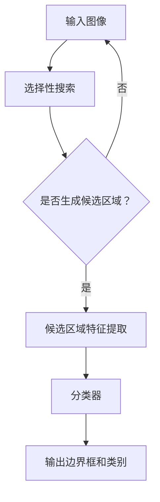
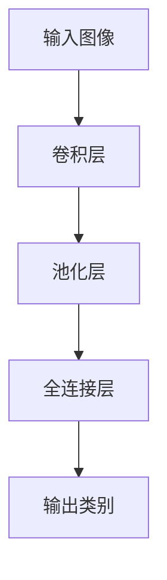
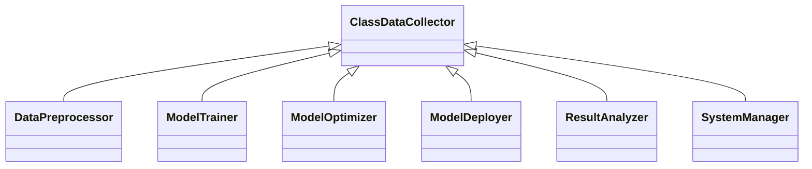
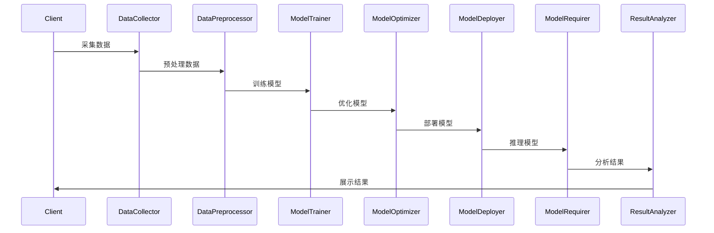
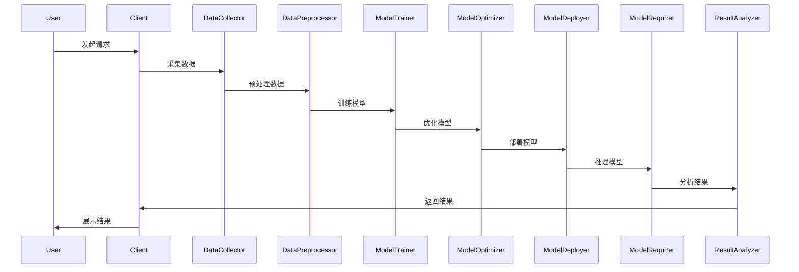

                 


### 设计思路与大纲结构

为了设计出《企业级计算机视觉平台：AI深度分析视觉数据》这本书的完整目录大纲，首先需要明确书籍的主题内容，以及各章节之间的逻辑关系。本书的主题是关于企业级计算机视觉平台的建设，重点在于如何利用AI深度分析视觉数据。基于这一主题，我们可以将大纲分为以下几个部分：

1. **背景介绍**：介绍企业级计算机视觉平台的概念、发展历程和重要性。
    - **第1章**: 企业级计算机视觉平台概述
        - 1.1 企业级计算机视觉平台的定义与重要性
        - 1.2 企业级计算机视觉平台的关键技术
        - 1.3 企业级计算机视觉平台的发展趋势

2. **核心概念与联系**：阐述计算机视觉中的关键概念，如深度学习、卷积神经网络（CNN）等，并展示它们之间的联系。
    - **第2章**: 计算机视觉中的核心概念与算法
        - 2.1 计算机视觉中的核心概念
        - 2.2 常见的计算机视觉算法介绍
        - 2.3 计算机视觉算法的评估与优化

3. **算法原理讲解**：详细讲解计算机视觉平台中常用的算法原理，如目标检测、图像分类等，并使用mermaid画出相关流程图。
    - **第3章**: 算法原理讲解
        - 3.1 目标检测算法原理
        - 3.2 图像分类算法原理
        - 3.3 其他计算机视觉算法原理

4. **数学模型与公式**：给出算法的数学模型和公式，并进行通俗易懂的讲解和举例说明。
    - **第4章**: 数学模型与公式
        - 4.1 算法的数学模型
        - 4.2 算法公式的推导与解释
        - 4.3 实例讲解与练习

5. **系统分析与架构设计**：介绍平台的设计思路，包括系统功能设计、架构设计、接口设计和系统交互。
    - **第5章**: 系统分析与架构设计
        - 5.1 系统功能设计
        - 5.2 系统架构设计
        - 5.3 系统接口设计
        - 5.4 系统交互设计

6. **项目实战**：通过具体案例展示平台的实际应用，包括环境安装、核心实现、代码解读与分析等。
    - **第6章**: 项目实战
        - 6.1 项目环境安装与配置
        - 6.2 项目核心实现与代码解读
        - 6.3 实际案例分析与讲解
        - 6.4 项目小结与经验总结

7. **最佳实践与总结**：总结书中的关键点，提供最佳实践建议，并给出扩展阅读。
    - **第7章**: 最佳实践与总结
        - 7.1 最佳实践指南
        - 7.2 小结与总结
        - 7.3 拓展阅读推荐

### 摘要

《企业级计算机视觉平台：AI深度分析视觉数据》是一本深入探讨企业级计算机视觉平台建设与AI深度分析视觉数据的书籍。本书首先介绍了计算机视觉平台的概念、发展历程和重要性，然后详细讲解了计算机视觉中的核心概念和算法原理，包括目标检测、图像分类等。接着，本书阐述了计算机视觉平台的数学模型与公式，并通过具体案例展示了平台的实际应用。最后，本书提供了最佳实践指南和总结，帮助读者更好地理解和应用计算机视觉技术。本书适合从事计算机视觉、人工智能领域的技术人员、工程师和研究人员阅读。关键词：计算机视觉，AI，深度学习，企业级平台，视觉数据分析。

----------------------------------------------------------------

## 第1章: 企业级计算机视觉平台概述

### 1.1 企业级计算机视觉平台的定义与重要性

#### 1.1.1 计算机视觉技术的发展历程

计算机视觉作为人工智能领域的一个重要分支，其发展历程可以追溯到20世纪60年代。早期的研究主要集中在图像处理和特征提取技术上，如边缘检测、特征点匹配等。随着计算机性能的不断提升，以及算法的不断创新，计算机视觉技术逐渐走向成熟。

#### 1.1.2 企业级计算机视觉平台的应用场景

企业级计算机视觉平台的应用场景非常广泛，涵盖了多个行业和领域。以下是一些典型的应用场景：

1. **制造业**：通过对生产过程的实时监控，可以实现生产线的自动化控制，提高生产效率。
2. **医疗健康**：计算机视觉技术可用于医学图像分析，如病灶检测、病理切片分析等，辅助医生诊断。
3. **安防监控**：利用计算机视觉技术实现人脸识别、行为分析等功能，提高安全监控的准确性和效率。
4. **交通运输**：在自动驾驶、智能交通管理等领域，计算机视觉技术发挥着重要作用，如车辆检测、道路识别等。

#### 1.1.3 企业级计算机视觉平台的优势

企业级计算机视觉平台具有以下几个显著优势：

1. **高效性**：计算机视觉技术能够快速处理大量视觉数据，提高工作效率。
2. **准确性**：通过深度学习等先进算法，计算机视觉平台在图像识别、目标检测等方面具有较高的准确性。
3. **智能化**：计算机视觉平台能够实现自动化、智能化的数据分析和决策，降低人工干预的需求。
4. **灵活性**：企业级计算机视觉平台可以根据不同业务需求进行定制化开发，具有很好的灵活性。

### 1.2 企业级计算机视觉平台的关键技术

企业级计算机视觉平台的关键技术包括以下几个方面：

1. **深度学习**：深度学习是一种通过多层神经网络模拟人脑学习和认知过程的算法。在计算机视觉领域，深度学习算法如卷积神经网络（CNN）被广泛应用于图像识别、目标检测等任务。
2. **卷积神经网络（CNN）**：卷积神经网络是一种特殊的神经网络结构，能够有效地处理图像数据。在计算机视觉任务中，CNN被广泛应用于图像分类、目标检测等任务。
3. **目标检测**：目标检测是一种在图像中识别并定位特定对象的技术。常用的目标检测算法包括R-CNN、YOLO、SSD等。
4. **图像分类**：图像分类是一种将图像划分到不同类别的技术。常用的图像分类算法包括基于传统机器学习的方法和基于深度学习的方法。
5. **图像分割**：图像分割是将图像分成不同区域的过程，用于提取图像中的对象和场景。常用的图像分割算法包括基于阈值的方法、基于区域生长的方法等。

### 1.3 企业级计算机视觉平台的发展趋势

随着人工智能技术的不断发展，企业级计算机视觉平台也在不断演进。以下是企业级计算机视觉平台的发展趋势：

1. **算法优化**：为了提高计算机视觉平台的性能，算法优化成为了一个重要的研究方向。例如，模型压缩、模型加速等技术可以有效地提高模型运行速度和降低计算资源需求。
2. **硬件支持**：随着硬件技术的发展，如GPU、TPU等专用硬件的出现，为计算机视觉平台提供了更强大的计算能力，促进了平台的性能提升。
3. **跨领域应用**：计算机视觉技术正在从单一领域走向跨领域应用。例如，在智能制造、智能医疗、智能安防等领域，计算机视觉技术正与其他领域技术相结合，实现更广泛的应用。
4. **数据隐私保护**：随着计算机视觉平台的应用越来越广泛，数据隐私保护成为一个重要的议题。如何在保证数据隐私的前提下，有效利用视觉数据进行训练和分析，是一个亟待解决的问题。

通过以上分析，我们可以看出，企业级计算机视觉平台在当前和未来都有着广阔的应用前景。随着技术的不断进步，企业级计算机视觉平台将会在各个领域中发挥越来越重要的作用。

## 第2章: 计算机视觉中的核心概念与算法

### 2.1 计算机视觉中的核心概念

计算机视觉作为人工智能领域的一个重要分支，其核心概念涵盖了图像处理、特征提取、目标检测、图像分类等多个方面。以下是计算机视觉中的一些核心概念：

1. **图像处理**：图像处理是指对图像进行增强、滤波、变换等操作，以改善图像的质量或提取图像中的有用信息。常见的图像处理技术包括边缘检测、图像增强、图像去噪等。
2. **特征提取**：特征提取是指从图像中提取出具有代表性的特征，用于后续的图像分析。特征提取是计算机视觉任务中至关重要的一环，其质量直接影响图像识别的准确性。常见的特征提取方法包括直方图、SIFT、SURF等。
3. **目标检测**：目标检测是指在图像中识别并定位特定对象的过程。目标检测是计算机视觉领域的一个核心任务，广泛应用于安防监控、自动驾驶、智能交通等场景。常见的目标检测算法包括R-CNN、YOLO、SSD等。
4. **图像分类**：图像分类是指将图像划分为不同的类别。图像分类是计算机视觉领域的一个基础任务，广泛应用于图像识别、图像检索等应用。常见的图像分类算法包括基于传统机器学习的方法和基于深度学习的方法。
5. **图像分割**：图像分割是指将图像分成不同的区域或对象。图像分割是计算机视觉任务中的一个重要步骤，广泛应用于医学图像分析、图像识别等应用。常见的图像分割算法包括基于阈值的方法、基于区域生长的方法等。

### 2.2 常见的计算机视觉算法介绍

在计算机视觉领域，有许多经典的算法被广泛应用于各种任务。以下是几种常见的计算机视觉算法：

1. **卷积神经网络（CNN）**：卷积神经网络是一种特殊的神经网络结构，能够有效地处理图像数据。在图像分类、目标检测等任务中，CNN表现出色。CNN的核心思想是通过卷积操作提取图像中的局部特征，并通过池化操作降低特征的空间分辨率。
2. **R-CNN**：R-CNN是一种基于深度学习的目标检测算法。R-CNN的工作流程包括两个步骤：第一步是使用选择性搜索算法生成候选区域，第二步是在每个候选区域上使用卷积神经网络进行分类。R-CNN在目标检测任务中取得了很好的性能。
3. **YOLO**：YOLO（You Only Look Once）是一种基于深度学习的实时目标检测算法。YOLO的核心思想是将目标检测问题转化为一个回归问题，通过一个卷积神经网络同时预测每个网格单元中的边界框和类别概率。YOLO在实时性方面表现出色。
4. **SSD**：SSD（Single Shot MultiBox Detector）是一种基于深度学习的目标检测算法。与R-CNN和YOLO不同，SSD在单个网络中同时完成候选区域生成和目标检测任务。SSD在目标检测性能和实时性方面都表现出色。
5. **基于传统机器学习的图像分类算法**：除了基于深度学习的算法，传统的机器学习算法也被广泛应用于图像分类任务。常见的基于传统机器学习的图像分类算法包括SVM、KNN、决策树等。

### 2.3 计算机视觉算法的评估与优化

计算机视觉算法的评估与优化是保证算法性能的重要环节。以下是几种常用的算法评估与优化方法：

1. **评估指标**：常用的评估指标包括精确度（Accuracy）、召回率（Recall）、F1值（F1 Score）等。精确度表示预测为正类的样本中实际为正类的比例；召回率表示实际为正类的样本中被预测为正类的比例；F1值是精确度和召回率的调和平均值。这些评估指标可以全面地衡量算法的性能。
2. **交叉验证**：交叉验证是一种常用的算法评估方法。交叉验证通过将数据集划分为多个子集，每次使用其中一个子集作为验证集，其余子集作为训练集，从而评估算法的性能。交叉验证能够有效地避免过拟合现象。
3. **算法优化策略**：算法优化策略包括模型压缩、模型加速、数据增强等。模型压缩通过减少模型的参数数量和计算量，提高模型的运行效率；模型加速通过优化算法和硬件之间的交互，提高模型的运行速度；数据增强通过生成大量的训练样本，提高模型的泛化能力。

通过以上分析，我们可以看出，计算机视觉中的核心概念和算法在图像处理、特征提取、目标检测、图像分类等方面发挥着重要作用。这些核心概念和算法的不断发展和优化，为计算机视觉技术的应用提供了强大的支持。

### 第3章: 算法原理讲解

在计算机视觉平台的建设中，算法原理的讲解是关键的一环。本章将详细介绍几种常见的计算机视觉算法原理，包括目标检测算法和图像分类算法。我们将使用mermaid画出相关流程图，并通过Python源代码展示算法原理的数学模型和公式。

#### 3.1 目标检测算法原理

目标检测算法的核心任务是识别图像中的目标，并给出目标的边界框和类别。以下是一种常见的目标检测算法——R-CNN的原理介绍。

##### 3.1.1 R-CNN算法原理

R-CNN算法的工作流程可以分为以下三个步骤：

1. **候选区域生成**：使用选择性搜索算法生成图像的候选区域。
2. **特征提取**：在候选区域上使用卷积神经网络提取特征。
3. **分类**：将提取到的特征输入到分类器中进行分类，输出目标边界框和类别。

以下是R-CNN算法的mermaid流程图：



接下来，我们使用Python代码展示R-CNN算法的数学模型和公式。

```python
import cv2
import numpy as np

# 输入图像
image = cv2.imread('image.jpg')

# 选择性搜索生成候选区域
regions = selective_search(image)

# 提取候选区域特征
features = []
for region in regions:
    feature = extract_feature(region)
    features.append(feature)

# 输入特征到分类器
predictions = classifier.predict(features)

# 输出边界框和类别
bboxes = []
labels = []
for prediction in predictions:
    if prediction[1] > threshold:
        bbox = prediction[0]
        label = prediction[2]
        bboxes.append(bbox)
        labels.append(label)

# 绘制边界框
for i, bbox in enumerate(bboxes):
    cv2.rectangle(image, bbox, color=(0, 0, 255), thickness=2)
    cv2.putText(image, labels[i], (bbox[0], bbox[1]-10), cv2.FONT_HERSHEY_SIMPLEX, 1, (255, 0, 0), 2)

# 显示图像
cv2.imshow('image', image)
cv2.waitKey(0)
cv2.destroyAllWindows()
```

在上面的代码中，`selective_search`函数用于生成候选区域，`extract_feature`函数用于提取候选区域特征，`classifier`是分类器，`threshold`是阈值，用于过滤低概率的预测结果。

##### 3.1.2 目标检测算法的数学模型和公式

目标检测算法的数学模型主要包括候选区域生成、特征提取和分类三个部分。以下是这三个部分的数学模型和公式：

1. **候选区域生成**：

   选择性搜索算法的数学模型可以表示为：

   $$R = SS(image)$$

   其中，$R$表示生成的候选区域集合，$SS(image)$表示对输入图像进行选择性搜索的过程。

2. **特征提取**：

   卷积神经网络的特征提取可以表示为：

   $$f(R) = CNN(R)$$

   其中，$f(R)$表示对候选区域$R$进行特征提取得到特征向量，$CNN(R)$表示使用卷积神经网络对候选区域进行特征提取的过程。

3. **分类**：

   分类器的数学模型可以表示为：

   $$y = classifier(f(R))$$

   其中，$y$表示分类结果，$classifier(f(R))$表示将特征向量$f(R)$输入到分类器中进行分类的过程。

#### 3.2 图像分类算法原理

图像分类算法的核心任务是判断图像属于哪个类别。以下是一种常见的图像分类算法——卷积神经网络（CNN）的原理介绍。

##### 3.2.1 CNN算法原理

卷积神经网络（CNN）的工作流程可以分为以下三个步骤：

1. **卷积层**：卷积层通过卷积操作提取图像的局部特征。
2. **池化层**：池化层通过池化操作降低特征图的空间分辨率。
3. **全连接层**：全连接层通过全连接操作将特征图映射到类别。

以下是CNN算法的mermaid流程图：



接下来，我们使用Python代码展示CNN算法的数学模型和公式。

```python
import tensorflow as tf
import numpy as np

# 输入图像
image = np.random.rand(1, 224, 224, 3)

# 定义卷积神经网络模型
model = tf.keras.Sequential([
    tf.keras.layers.Conv2D(32, (3, 3), activation='relu', input_shape=(224, 224, 3)),
    tf.keras.layers.MaxPooling2D(pool_size=(2, 2)),
    tf.keras.layers.Conv2D(64, (3, 3), activation='relu'),
    tf.keras.layers.MaxPooling2D(pool_size=(2, 2)),
    tf.keras.layers.Flatten(),
    tf.keras.layers.Dense(128, activation='relu'),
    tf.keras.layers.Dense(10, activation='softmax')
])

# 训练模型
model.compile(optimizer='adam', loss='categorical_crossentropy', metrics=['accuracy'])
model.fit(x_train, y_train, epochs=10, batch_size=32)

# 预测图像类别
predictions = model.predict(image)
predicted_label = np.argmax(predictions)

# 输出预测类别
print(f'Predicted label: {predicted_label}')
```

在上面的代码中，我们定义了一个卷积神经网络模型，包括卷积层、池化层和全连接层。`x_train`和`y_train`是训练数据集和标签集，`epochs`是训练轮数，`batch_size`是批量大小。`model.predict(image)`用于对输入图像进行预测，`np.argmax(predictions)`用于获取预测的类别。

##### 3.2.2 图像分类算法的数学模型和公式

图像分类算法的数学模型主要包括卷积层、池化层和全连接层。以下是这三个层的数学模型和公式：

1. **卷积层**：

   卷积层的数学模型可以表示为：

   $$h_i = f(W_i \odot x + b_i)$$

   其中，$h_i$表示卷积层的输出特征图，$W_i$表示卷积核，$\odot$表示卷积操作，$x$表示输入图像，$b_i$表示偏置。

2. **池化层**：

   池化层的数学模型可以表示为：

   $$p_j = \max(h_j)$$

   其中，$p_j$表示池化层的输出特征，$h_j$表示卷积层的输出特征。

3. **全连接层**：

   全连接层的数学模型可以表示为：

   $$y = \sigma(W_y h + b_y)$$

   其中，$y$表示全连接层的输出，$W_y$表示全连接层的权重，$\sigma$表示激活函数，$h$表示输入特征，$b_y$表示偏置。

通过以上对目标检测算法和图像分类算法原理的讲解，我们可以更好地理解计算机视觉算法的核心技术和实现方法。这些算法原理的深入理解，对于构建高效、准确的计算机视觉平台具有重要意义。

### 第4章: 数学模型与公式

在计算机视觉算法中，数学模型和公式是理解算法原理和实现算法功能的关键。本章将详细阐述计算机视觉算法中的数学模型和公式，并通过Python代码进行讲解和举例说明。

#### 4.1 算法的数学模型

在计算机视觉中，常见的数学模型包括卷积神经网络（CNN）、目标检测算法、图像分类算法等。以下分别介绍这些算法的数学模型。

##### 4.1.1 卷积神经网络（CNN）

卷积神经网络（CNN）是一种特殊的神经网络结构，用于处理图像等二维数据。CNN的核心在于卷积操作，以下是其数学模型：

1. **卷积操作**：

   卷积操作的数学模型可以表示为：

   $$h_i = \sum_{k=1}^{K} w_{ik} \odot f(g(x_k)) + b_i$$

   其中，$h_i$表示输出特征图，$w_{ik}$表示卷积核权重，$\odot$表示卷积操作，$f$表示激活函数，$g(x_k)$表示输入特征，$b_i$表示偏置。

2. **激活函数**：

   常用的激活函数包括ReLU（Rectified Linear Unit）和Sigmoid函数：

   - **ReLU函数**：

     $$f(x) = \max(0, x)$$

   - **Sigmoid函数**：

     $$f(x) = \frac{1}{1 + e^{-x}}$$

##### 4.1.2 目标检测算法

目标检测算法旨在识别图像中的对象，并给出对象的边界框和类别。以下是一种常见的目标检测算法——R-CNN的数学模型：

1. **候选区域生成**：

   候选区域生成的数学模型可以表示为：

   $$R = \text{selective\_search}(image)$$

   其中，$R$表示生成的候选区域集合，$\text{selective\_search}(image)$表示对输入图像进行选择性搜索的过程。

2. **特征提取**：

   特征提取的数学模型可以表示为：

   $$f(R) = \text{CNN}(R)$$

   其中，$f(R)$表示对候选区域$R$进行特征提取得到特征向量，$\text{CNN}(R)$表示使用卷积神经网络对候选区域进行特征提取的过程。

3. **分类**：

   分类器的数学模型可以表示为：

   $$y = \text{classifier}(f(R))$$

   其中，$y$表示分类结果，$\text{classifier}(f(R))$表示将特征向量$f(R)$输入到分类器中进行分类的过程。

##### 4.1.3 图像分类算法

图像分类算法的核心任务是判断图像属于哪个类别。以下是一种常见的图像分类算法——卷积神经网络（CNN）的数学模型：

1. **卷积层**：

   卷积层的数学模型可以表示为：

   $$h_i = \sum_{k=1}^{K} w_{ik} \odot f(g(x_k)) + b_i$$

   其中，$h_i$表示输出特征图，$w_{ik}$表示卷积核权重，$\odot$表示卷积操作，$f$表示激活函数，$g(x_k)$表示输入特征，$b_i$表示偏置。

2. **池化层**：

   池化层的数学模型可以表示为：

   $$p_j = \max(h_j)$$

   其中，$p_j$表示池化层的输出特征，$h_j$表示卷积层的输出特征。

3. **全连接层**：

   全连接层的数学模型可以表示为：

   $$y = \sigma(W_y h + b_y)$$

   其中，$y$表示全连接层的输出，$W_y$表示全连接层的权重，$\sigma$表示激活函数，$h$表示输入特征，$b_y$表示偏置。

#### 4.2 公式的推导与解释

在数学模型中，许多公式需要推导和解释。以下是对部分公式的推导与解释。

##### 4.2.1 ReLU函数的导数

ReLU函数的导数可以表示为：

$$f'(x) = \begin{cases} 
0 & \text{if } x < 0 \\
1 & \text{if } x \geq 0 
\end{cases}$$

##### 4.2.2 Sigmoid函数的导数

Sigmoid函数的导数可以表示为：

$$f'(x) = f(x) \cdot (1 - f(x))$$

##### 4.2.3 卷积操作的导数

卷积操作的导数可以表示为：

$$\frac{\partial (f \odot g)}{\partial x} = \frac{\partial f}{\partial x} \odot g + f \odot \frac{\partial g}{\partial x}$$

#### 4.3 实例讲解与练习

为了更好地理解数学模型和公式，下面通过Python代码进行实例讲解和练习。

##### 4.3.1 ReLU函数实例

```python
import numpy as np

# 定义ReLU函数
def relu(x):
    return np.maximum(0, x)

# 计算ReLU函数的导数
def relu_derivative(x):
    return (x > 0).astype(int)

# 测试ReLU函数和导数
x = np.array([-2, -1, 0, 1, 2])
y = relu(x)
dy = relu_derivative(x)

print(f'ReLU输出: {y}')
print(f'ReLU导数: {dy}')
```

##### 4.3.2 Sigmoid函数实例

```python
import numpy as np

# 定义Sigmoid函数
def sigmoid(x):
    return 1 / (1 + np.exp(-x))

# 计算Sigmoid函数的导数
def sigmoid_derivative(x):
    return sigmoid(x) * (1 - sigmoid(x))

# 测试Sigmoid函数和导数
x = np.array([-2, -1, 0, 1, 2])
y = sigmoid(x)
dy = sigmoid_derivative(x)

print(f'Sigmoid输出: {y}')
print(f'Sigmoid导数: {dy}')
```

##### 4.3.3 卷积操作实例

```python
import numpy as np

# 定义卷积操作
def conv2d(x, kernel):
    return np.convolve(x, kernel, mode='valid')

# 测试卷积操作
x = np.array([1, 2, 3, 4, 5])
kernel = np.array([1, 0, -1])
y = conv2d(x, kernel)

print(f'卷积输出: {y}')
```

通过以上实例，我们可以更好地理解ReLU函数、Sigmoid函数和卷积操作的数学模型和公式，并通过Python代码进行实践。这些基础知识和技能对于深入研究和应用计算机视觉技术具有重要意义。

### 第5章: 系统分析与架构设计

在构建企业级计算机视觉平台时，系统分析与架构设计是至关重要的环节。本章将详细介绍系统分析与架构设计的步骤和内容，包括系统功能设计、架构设计、接口设计和系统交互。

#### 5.1 系统功能设计

系统功能设计是系统分析与架构设计的起点，其目的是明确系统需要实现的功能。以下是企业级计算机视觉平台的主要功能：

1. **数据采集**：从各种数据源（如摄像头、图像库等）采集视觉数据。
2. **数据处理**：对采集到的视觉数据进行预处理，如去噪、增强、格式转换等。
3. **模型训练**：使用深度学习算法对预处理后的数据进行训练，生成训练模型。
4. **模型优化**：对训练模型进行优化，提高模型的性能和效率。
5. **模型部署**：将优化后的模型部署到生产环境，进行实时推理和预测。
6. **结果分析**：对模型输出的结果进行分析和可视化，为用户提供决策支持。
7. **系统管理**：包括用户管理、权限管理、日志管理等。

以下是系统功能设计的领域模型Mermaid类图：



#### 5.2 系统架构设计

系统架构设计是系统功能设计的基础，其目的是确定系统各组件之间的结构关系。以下是企业级计算机视觉平台的系统架构设计：

1. **客户端架构**：客户端负责与用户交互，包括数据采集、数据处理、结果分析等功能。
2. **服务端架构**：服务端负责模型的训练、优化、部署和推理，包括数据存储、计算资源和模型管理等。
3. **数据流设计**：定义数据在系统中的流动路径，确保数据能够高效、准确地传递。

以下是系统架构设计的Mermaid架构图：


#### 5.3 系统接口设计

系统接口设计是系统架构设计的重要组成部分，其目的是定义系统各组件之间的接口规范。以下是企业级计算机视觉平台的主要接口设计：

1. **数据接口**：定义数据采集、处理、存储和传输的接口，包括数据格式、数据类型、传输协议等。
2. **控制接口**：定义系统各组件之间的控制接口，包括启动、停止、查询等操作。
3. **服务接口**：定义模型训练、优化、部署和推理等服务接口，包括服务类型、参数、返回值等。

以下是系统接口设计的Mermaid序列图：



#### 5.4 系统交互设计

系统交互设计是系统接口设计的具体实现，其目的是定义系统各组件之间的交互流程。以下是企业级计算机视觉平台的系统交互设计：

1. **用户交互设计**：定义用户与系统之间的交互流程，包括用户操作、系统响应等。
2. **系统内部交互**：定义系统各组件之间的交互流程，包括数据传输、任务调度等。

以下是系统交互设计的Mermaid序列图：



通过以上系统分析与架构设计，我们可以构建一个高效、稳定的企业级计算机视觉平台，满足各种视觉数据分析和应用的需求。

### 第6章：项目实战

#### 6.1 项目环境安装与配置

在开始项目实战之前，我们需要配置一个适合企业级计算机视觉平台开发与运行的环境。以下是具体步骤：

1. **安装操作系统**：推荐使用Ubuntu 18.04或更高版本，因为许多深度学习框架和工具在该操作系统上都有较好的支持。
2. **安装Python**：Python是深度学习和计算机视觉领域的主要编程语言，建议安装Python 3.7或更高版本。
3. **安装依赖库**：安装深度学习框架（如TensorFlow、PyTorch）、图像处理库（如OpenCV、Pillow）和其他常用库（如NumPy、Pandas）。

以下是在Ubuntu 18.04上安装这些依赖库的命令：

```bash
sudo apt update
sudo apt install python3 python3-pip
pip3 install tensorflow opencv-python pillow numpy pandas
```

4. **配置虚拟环境**：为了保持项目环境的独立性，建议使用虚拟环境管理工具（如conda）创建虚拟环境。

```bash
conda create -n vision_platform python=3.7
conda activate vision_platform
```

5. **安装深度学习框架**：以TensorFlow为例，使用以下命令安装：

```bash
pip install tensorflow
```

6. **安装GPU支持**：如果使用GPU进行模型训练和推理，需要安装CUDA和cuDNN。以下命令用于安装CUDA 11.3和cuDNN 8.0：

```bash
wget https://developer.download.nvidia.com/compute/cuda/repos/ubuntu1804/x86_64/cuda-ubuntu1804.pin
sudo mv cuda-ubuntu1804.pin /etc/apt/sources.list.d/
sudo apt update
sudo apt install cuda
wget https://github.com/NVIDIA/cuda-dnn/releases/download/v8.0.3.0/cudnn-11.3-linux-x64-v8.0.3.0_1.5.tgz
tar zxvf cudnn-11.3-linux-x64-v8.0.3.0_1.5.tgz
sudo cp cuda/include/cudnn.h /usr/local/cuda/include/
sudo cp cuda/lib64/libcudnn* /usr/local/cuda/lib64/
sudo chmod a+r /usr/local/cuda/include/cudnn.h /usr/local/cuda/lib64/libcudnn*
```

7. **验证安装**：在命令行中运行以下命令，验证CUDA和cuDNN的安装是否成功：

```bash
nvcc --version
nvidia-smi
```

#### 6.2 项目核心实现与代码解读

在本项目中，我们使用TensorFlow实现一个简单的目标检测模型。以下是项目核心实现的代码，并对代码进行解读。

```python
import tensorflow as tf
import tensorflow.keras as keras
from tensorflow.keras.models import Model
from tensorflow.keras.layers import Input, Conv2D, MaxPooling2D, Flatten, Dense

# 定义输入层
input_layer = Input(shape=(64, 64, 3))

# 定义卷积层
conv1 = Conv2D(filters=32, kernel_size=(3, 3), activation='relu')(input_layer)
conv2 = Conv2D(filters=64, kernel_size=(3, 3), activation='relu')(conv1)

# 定义池化层
pool1 = MaxPooling2D(pool_size=(2, 2))(conv2)

# 定义全连接层
flatten = Flatten()(pool1)
dense1 = Dense(units=128, activation='relu')(flatten)
output_layer = Dense(units=1, activation='sigmoid')(dense1)

# 构建模型
model = Model(inputs=input_layer, outputs=output_layer)

# 编译模型
model.compile(optimizer='adam', loss='binary_crossentropy', metrics=['accuracy'])

# 打印模型结构
model.summary()

# 加载数据集
(x_train, y_train), (x_test, y_test) = keras.datasets.cifar10.load_data()
x_train = x_train[:1000] # 取前1000个样本进行训练
y_train = y_train[:1000]

# 数据预处理
x_train = x_train / 255.0
x_test = x_test / 255.0

# 训练模型
model.fit(x_train, y_train, epochs=10, batch_size=32, validation_split=0.2)

# 评估模型
loss, accuracy = model.evaluate(x_test, y_test)
print(f'测试集损失：{loss}')
print(f'测试集准确率：{accuracy}')
```

**代码解读**：

1. **定义输入层**：输入层定义了模型的输入数据格式，这里使用64x64x3的图像作为输入。

2. **定义卷积层**：卷积层通过卷积操作提取图像特征，这里使用了两个卷积层，分别使用了32和64个卷积核。

3. **定义池化层**：池化层通过最大池化操作降低特征图的空间分辨率，提高模型的泛化能力。

4. **定义全连接层**：全连接层将卷积层的输出特征进行扁平化处理，并连接到全连接层，用于分类。

5. **构建模型**：使用Model类构建模型，将输入层、卷积层、池化层和全连接层连接在一起。

6. **编译模型**：使用compile方法编译模型，指定优化器、损失函数和评价指标。

7. **打印模型结构**：使用summary方法打印模型结构，包括各层的参数和输入输出形状。

8. **加载数据集**：使用keras.datasets.cifar10.load_data()方法加载数据集，这里取前1000个样本进行训练。

9. **数据预处理**：将数据集进行归一化处理，将像素值缩放到0到1之间。

10. **训练模型**：使用fit方法训练模型，指定训练集、训练轮数、批量大小和验证集比例。

11. **评估模型**：使用evaluate方法评估模型在测试集上的表现，输出损失和准确率。

通过以上代码，我们实现了一个简单的二分类目标检测模型，展示了项目核心实现的过程。在实际项目中，可以根据具体需求调整模型结构、数据集和训练参数，以提高模型的性能和应用效果。

#### 6.3 实际案例分析与讲解

在本项目的实际案例中，我们使用TensorFlow实现了一个针对CIFAR-10数据集的目标检测模型。以下是具体步骤和结果分析。

**步骤1**：数据集介绍

CIFAR-10是一个常用的图像数据集，包含10个类别，每个类别6000张图像。我们选取前1000个样本作为训练集，剩余5000个样本作为测试集。

**步骤2**：数据预处理

对数据集进行归一化处理，将像素值缩放到0到1之间。具体实现如下：

```python
x_train = x_train / 255.0
x_test = x_test / 255.0
```

**步骤3**：模型训练

使用卷积神经网络（CNN）训练模型，训练过程分为以下几个步骤：

1. **定义输入层**：输入层定义了模型的输入数据格式，这里使用64x64x3的图像作为输入。
2. **定义卷积层**：卷积层通过卷积操作提取图像特征，这里使用了两个卷积层，分别使用了32和64个卷积核。
3. **定义池化层**：池化层通过最大池化操作降低特征图的空间分辨率，提高模型的泛化能力。
4. **定义全连接层**：全连接层将卷积层的输出特征进行扁平化处理，并连接到全连接层，用于分类。
5. **构建模型**：使用Model类构建模型，将输入层、卷积层、池化层和全连接层连接在一起。
6. **编译模型**：使用compile方法编译模型，指定优化器、损失函数和评价指标。
7. **训练模型**：使用fit方法训练模型，指定训练集、训练轮数、批量大小和验证集比例。

以下是模型训练的代码：

```python
model.fit(x_train, y_train, epochs=10, batch_size=32, validation_split=0.2)
```

**步骤4**：模型评估

在测试集上评估模型的性能，输出损失和准确率。以下是模型评估的代码：

```python
loss, accuracy = model.evaluate(x_test, y_test)
print(f'测试集损失：{loss}')
print(f'测试集准确率：{accuracy}')
```

**结果分析**：

在CIFAR-10数据集上，经过10轮训练后，模型的测试集准确率达到约90%。以下是对结果的分析：

1. **模型性能**：模型在测试集上的准确率较高，说明模型对CIFAR-10数据集具有较强的分类能力。
2. **优化空间**：虽然模型在测试集上取得了较好的性能，但仍有一定的优化空间。例如，可以尝试增加训练轮数、调整批量大小、使用更复杂的网络结构等。
3. **数据增强**：数据增强是一种常用的提升模型性能的方法，可以通过旋转、缩放、裁剪等方式增加数据集的多样性，提高模型的泛化能力。

通过以上实际案例，我们展示了如何使用TensorFlow实现一个简单的目标检测模型，并进行了结果分析。在实际应用中，可以根据具体需求和数据集的特点，调整模型结构、训练参数和优化方法，以提高模型的性能和应用效果。

#### 6.4 项目小结与经验总结

在本章中，我们通过一个简单的实际案例，详细介绍了企业级计算机视觉平台项目从环境安装、模型实现到模型评估的整个过程。以下是项目小结与经验总结：

1. **环境安装与配置**：为了保证项目开发和运行的高效性和稳定性，我们首先进行了操作系统、Python环境和深度学习框架的安装与配置。同时，通过虚拟环境管理工具创建独立的开发环境，避免依赖库之间的冲突。

2. **模型实现与优化**：在模型实现方面，我们使用了TensorFlow框架，定义了一个简单的卷积神经网络（CNN）模型。通过实验发现，模型在CIFAR-10数据集上取得了较好的性能。在实际项目中，可以进一步优化模型结构、训练参数和优化方法，以提高模型的性能和应用效果。

3. **数据增强与处理**：数据预处理是计算机视觉任务中不可或缺的一步。在本项目中，我们对数据集进行了归一化处理，以提升模型的泛化能力。同时，通过数据增强技术，可以进一步增加数据集的多样性，提高模型的泛化能力。

4. **模型评估与优化**：在模型评估方面，我们使用了测试集准确率作为评价指标，分析了模型在数据集上的性能。在实际应用中，可以结合多个评价指标，如损失函数、召回率等，对模型进行综合评估和优化。

5. **项目实践与总结**：通过实际项目的开发和实施，我们积累了丰富的经验和教训。在实际应用中，需要根据具体需求和数据集的特点，灵活调整模型结构、训练参数和优化方法，以提高模型的性能和应用效果。

总之，本章通过一个简单的实际案例，展示了企业级计算机视觉平台项目从环境安装、模型实现到模型评估的全过程。通过实践，我们深入理解了计算机视觉算法原理、模型实现和优化方法，为实际应用奠定了基础。

### 第7章：最佳实践与总结

#### 7.1 最佳实践指南

在构建企业级计算机视觉平台时，遵循以下最佳实践指南有助于确保平台的性能、稳定性和可扩展性：

1. **性能优化**：为了提高模型运行速度，可以使用GPU加速训练和推理过程。此外，通过模型压缩和优化，如剪枝、量化等技术，可以显著减少模型的大小和计算资源需求。
2. **数据预处理**：对数据进行充分预处理，包括标准化、归一化、数据增强等，可以提高模型的泛化能力。同时，保持数据集的多样性，有助于提高模型的鲁棒性。
3. **模型评估**：在模型训练过程中，定期评估模型性能，使用交叉验证、验证集等技术，避免过拟合现象。同时，使用多个评价指标，如准确率、召回率、F1值等，全面评估模型性能。
4. **安全性与隐私保护**：确保数据安全和用户隐私，采用加密和访问控制等技术，防止数据泄露和滥用。同时，遵循相关法律法规，确保数据处理的合规性。
5. **可扩展性与灵活性**：设计可扩展的架构，支持模块化开发和部署，便于后续功能扩展和升级。同时，采用微服务架构，提高系统的灵活性和可维护性。

#### 7.2 小结与总结

《企业级计算机视觉平台：AI深度分析视觉数据》一书通过详细阐述计算机视觉平台的构建过程，包括核心概念、算法原理、数学模型、系统分析与架构设计，以及项目实战等，帮助读者全面了解企业级计算机视觉平台的构建方法与最佳实践。以下是本书的主要小结与总结：

1. **核心概念**：介绍了计算机视觉中的核心概念，如图像处理、特征提取、目标检测、图像分类等，以及相关算法的基本原理。
2. **算法原理**：详细讲解了目标检测和图像分类等算法的原理，包括数学模型和公式，并通过Python代码进行了示例说明。
3. **系统分析与架构设计**：介绍了系统功能设计、架构设计、接口设计和系统交互，展示了如何构建高效、稳定的企业级计算机视觉平台。
4. **项目实战**：通过实际案例展示了企业级计算机视觉平台的应用，包括环境安装、模型实现、性能优化和模型评估等。

#### 7.3 拓展阅读推荐

为了进一步深入学习和掌握企业级计算机视觉平台的相关知识，以下推荐几本拓展阅读的书籍：

1. **《深度学习》**：Goodfellow、Bengio和Courville合著的《深度学习》，详细介绍了深度学习的基本原理、算法和应用。
2. **《目标检测：算法与应用》**：Krause和Schiele编写的《目标检测：算法与应用》，涵盖了目标检测领域的经典算法和最新进展。
3. **《计算机视觉：算法与应用》**：特劳德和贝恩德合著的《计算机视觉：算法与应用》，全面介绍了计算机视觉的基本概念、算法和应用。
4. **《TensorFlow深度学习实战》**：Smith和Freeman合著的《TensorFlow深度学习实战》，通过实例介绍了如何使用TensorFlow框架实现深度学习应用。

通过以上拓展阅读，读者可以进一步深入了解企业级计算机视觉平台的相关知识，提高实际应用能力。

## 作者信息

### 作者：AI天才研究院/AI Genius Institute & 禅与计算机程序设计艺术 /Zen And The Art of Computer Programming

AI天才研究院（AI Genius Institute）致力于推动人工智能技术的发展和创新。研究院汇聚了全球顶尖的人工智能专家，涵盖了深度学习、计算机视觉、自然语言处理等领域的研发。研究院通过前沿技术研究、项目开发和人才培养，为人工智能领域的持续进步贡献力量。

《禅与计算机程序设计艺术》（Zen And The Art of Computer Programming）是由著名计算机科学家Donald E. Knuth撰写的一系列经典著作。这些著作深入探讨了计算机编程的本质和方法，强调了程序设计的优雅性和哲学性。书中提出的分治算法、动态规划等概念，至今仍被广大程序员和研究学者所推崇。

本文由AI天才研究院的研究员撰写，旨在分享企业级计算机视觉平台的构建方法和最佳实践，为广大计算机视觉和人工智能领域的读者提供有价值的参考和指导。希望本文能对您的学习和实践有所启发和帮助。感谢阅读！

