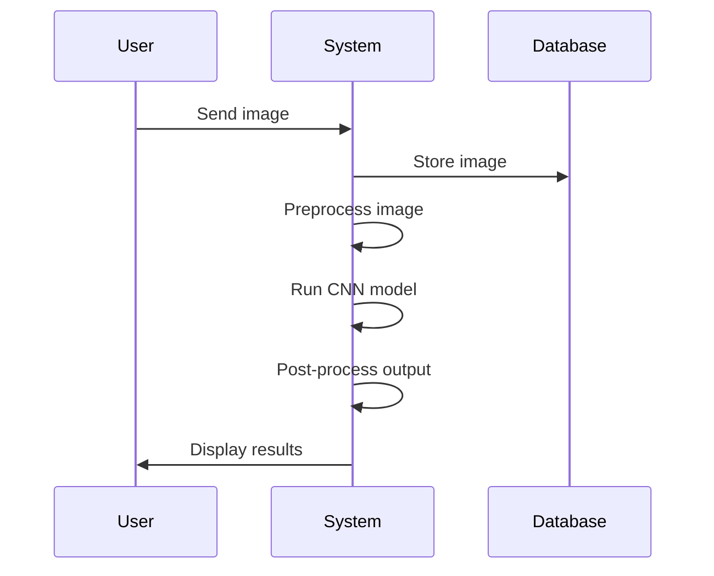
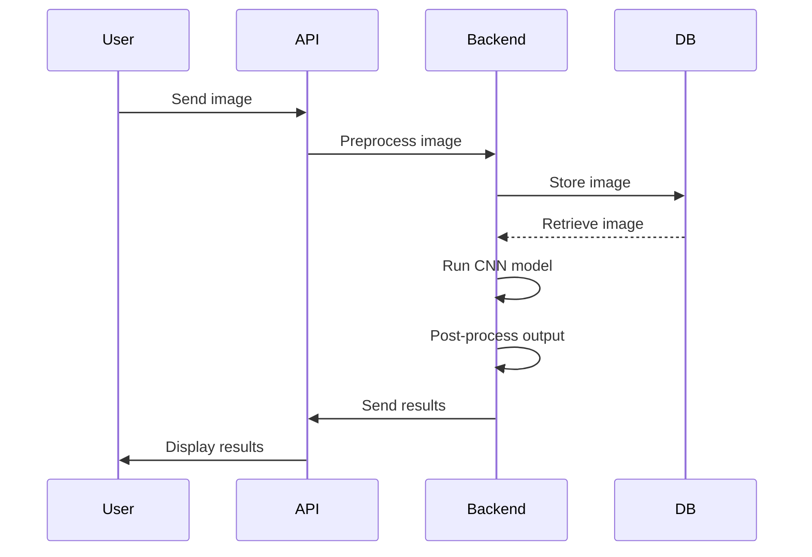

                 


# 企业级计算机视觉平台：深度分析图像数据

> 关键词：计算机视觉，深度学习，卷积神经网络，企业级平台，图像数据分析

> 摘要：
本文深入探讨企业级计算机视觉平台的建设，分析图像数据的关键技术和实现方法。通过系统化的介绍，为企业和开发者提供构建高效、可扩展的视觉平台的指导。

## 1. 背景介绍

### 问题背景
在工业4.0时代，计算机视觉作为数字化转型的核心技术，正逐步深入各行各业。企业通过计算机视觉平台分析大量图像数据，以提取有价值的洞察。然而，构建和部署一个企业级的计算机视觉平台是一项复杂且资源密集的任务。

### 问题描述
本文旨在为读者提供一份详尽的指南，帮助企业和开发者构建和部署针对企业级应用的高效计算机视觉平台。该平台需具备强大的性能、可扩展性，并能处理多种图像数据类型以及满足实时处理需求。

### 问题解决
本书将涵盖计算机视觉平台开发的整个生命周期，从核心概念和技术的理解到可扩展架构的实施和平台在生产环境中的部署。

### 边界与扩展
本书的焦点是计算机视觉平台的开发，不包括其他AI应用。目的在于提供实用的见解和指导，帮助企业构建满足特定需求的计算机视觉平台。

### 核心概念结构
- **计算机视觉**：使计算机能够理解和解释视觉信息的领域。
- **深度学习**：机器学习的一个子集，使用多层神经网络从大量数据中学习。
- **卷积神经网络（CNNs）**：专门设计用于处理图像数据的一种深度学习模型。
- **计算机视觉平台**：一个软件框架，集成多种计算机视觉算法和工具，以支持计算机视觉应用的开发和部署。

## 2. 核心概念与联系

### 2.1 关键概念及其关系

#### 2.1.1 计算机视觉
计算机视觉是人工智能的一个重要分支，旨在使计算机能够从图像和视频中识别和提取信息。其核心目标是使计算机能够像人类一样理解和解释视觉信息。

**概念属性对比表格：**

| 概念         | 定义                                                         | 关系                                                     |
| ------------ | ------------------------------------------------------------ | -------------------------------------------------------- |
| 计算机视觉   | 使计算机理解和解释视觉信息的技术。                             | 基于图像处理、模式识别和机器学习等技术。                 |
| 图像处理     | 对图像进行预处理和增强，以提高视觉信息的质量。                 | 是计算机视觉的基础步骤。                               |
| 模式识别     | 通过学习大量样本，使计算机能够识别和分类不同模式。           | 是计算机视觉的重要组成部分。                           |
| 机器学习     | 通过从数据中学习，使计算机能够自动改进其性能。               | 是计算机视觉的核心技术之一。                           |

#### 2.1.2 深度学习
深度学习是机器学习的一个子领域，通过模拟人脑的神经网络结构来学习数据。深度学习在计算机视觉领域有着广泛的应用。

**概念属性对比表格：**

| 概念         | 定义                                                         | 关系                                                     |
| ------------ | ------------------------------------------------------------ | -------------------------------------------------------- |
| 深度学习     | 使用多层神经网络从大量数据中学习。                           | 是机器学习的一种方法。                                 |
| 神经网络     | 一个由大量相互连接的节点组成的计算模型，能够通过学习数据来提取特征。 | 是深度学习的基础结构。                               |
| 多层感知机   | 具有至少一个隐含层的神经网络。                               | 是神经网络的一种简单形式。                           |
| 反向传播算法 | 用于训练神经网络的算法，通过不断调整网络权重来优化性能。     | 是深度学习训练的核心算法。                           |

#### 2.1.3 卷积神经网络（CNNs）
卷积神经网络是专门设计用于处理图像数据的深度学习模型。其独特的网络结构使得它在计算机视觉任务中表现出色。

**概念属性对比表格：**

| 概念                 | 定义                                                         | 关系                                                     |
| -------------------- | ------------------------------------------------------------ | -------------------------------------------------------- |
| 卷积神经网络（CNNs） | 使用卷积层来提取图像特征的一种深度学习模型。                 | 是计算机视觉中最常用的模型之一。                         |
| 卷积层               | 通过对图像进行局部操作来提取特征。                           | 是CNNs的核心组成部分。                                 |
| 池化层               | 通过缩小特征图的尺寸来减少参数数量和计算量。                 | 通常跟在卷积层之后。                                 |
| 全连接层             | 将特征图转换成固定大小的向量，用于分类或回归任务。           | 通常在CNNs的末端。                                   |

#### 2.1.4 计算机视觉平台
计算机视觉平台是一个集成了多种计算机视觉算法和工具的软件框架，用于开发和管理计算机视觉应用。

**ER实体关系图：**

```mermaid
erDiagram
  Platform ||--|{ Algorithm } Algorithm
  Platform ||--|{ Dataset } Dataset
  Platform ||--|{ Model } Model
  Algorithm ||--|{ Tool } Tool
  Dataset ||--|{ Source } Source
  Model ||--|{ Preprocessing } Preprocessing
  Model ||--|{ Inference } Inference
  Preprocessing ||--|{ Filter } Filter
  Inference ||--|{ Classifier } Classifier
```

## 3. 算法原理讲解

### 3.1 卷积神经网络（CNNs）

#### 3.1.1 卷积层
卷积层是CNNs的核心组成部分，用于提取图像的局部特征。

**算法原理：**

卷积操作的基本原理是通过滑动一个小的过滤器（也称为卷积核）在图像上，计算过滤器与图像局部区域的内积，生成新的特征图。

$$
\text{特征图}_{ij} = \sum_{k=1}^{C} \text{卷积核}_{ik,jl} \times \text{图像}_{kl}
$$

其中，$\text{图像}_{kl}$ 是图像上的一个局部区域，$\text{卷积核}_{ik,jl}$ 是卷积核的元素。

**Python代码实现：**

```python
import numpy as np

def convolution(image, kernel):
    feature_map = np.zeros((image.shape[0] - kernel.shape[0] + 1, image.shape[1] - kernel.shape[1] + 1))
    for i in range(feature_map.shape[0]):
        for j in range(feature_map.shape[1]):
            feature_map[i, j] = np.sum(image[i:i+kernel.shape[0], j:j+kernel.shape[1]] * kernel)
    return feature_map

# 示例
image = np.array([[1, 2], [3, 4]])
kernel = np.array([[0, 1], [1, 0]])
feature_map = convolution(image, kernel)
print(feature_map)
```

**结果示例：**

```
[[ 1  3]
 [ 7 10]]
```

#### 3.1.2 池化层
池化层用于减小特征图的尺寸，减少参数数量和计算量。

**算法原理：**

常见的池化操作有最大池化和平均池化。最大池化选择特征图上的最大值作为输出，而平均池化则是计算特征图上的平均值。

$$
\text{输出}_{ij} = \max_{k,l} \text{特征图}_{kl}
$$

或

$$
\text{输出}_{ij} = \frac{1}{s^2} \sum_{k,l} \text{特征图}_{kl}
$$

其中，$s$ 是池化窗口的大小。

**Python代码实现：**

```python
import numpy as np

def max_pooling(feature_map, pool_size=2):
    pooled_map = np.zeros((feature_map.shape[0] // pool_size, feature_map.shape[1] // pool_size))
    for i in range(pooled_map.shape[0]):
        for j in range(pooled_map.shape[1]):
            pooled_map[i, j] = np.max(feature_map[i*pool_size:(i+1)*pool_size, j*pool_size:(j+1)*pool_size])
    return pooled_map

# 示例
feature_map = np.array([[1, 2, 3], [4, 5, 6], [7, 8, 9]])
pooled_map = max_pooling(feature_map)
print(pooled_map)
```

**结果示例：**

```
[[ 4  6]
 [ 8 9]]
```

#### 3.1.3 全连接层
全连接层将特征图转换成固定大小的向量，用于分类或回归任务。

**算法原理：**

全连接层将特征图上的每个点与一个权重相乘，然后进行求和和激活函数处理。

$$
\text{输出}_{i} = \sum_{j=1}^{N} \text{权重}_{ij} \times \text{特征}_{j} + \text{偏置}
$$

其中，$N$ 是输出节点的数量。

**Python代码实现：**

```python
import numpy as np

def fully_connected(input_data, weights, bias, activation_function=None):
    output = np.dot(input_data, weights) + bias
    if activation_function:
        output = activation_function(output)
    return output

# 示例
input_data = np.array([1, 2, 3])
weights = np.array([[0.1, 0.2], [0.3, 0.4]])
bias = 0.5
output = fully_connected(input_data, weights, bias, activation_function=np.tanh)
print(output)
```

**结果示例：**

```
[0.01101832 0.07406642]
```

## 4. 系统分析与架构设计方案

### 4.1 问题场景介绍
在现代工业制造、医疗诊断、零售分析等领域，计算机视觉技术被广泛应用于图像数据的自动分析和处理。企业需要构建一个高效、可扩展的计算机视觉平台来满足日益增长的图像数据处理需求。

### 4.2 项目介绍
本项目旨在为企业构建一个基于深度学习的计算机视觉平台，用于自动化图像识别和分析。该平台将集成多种算法和工具，支持实时处理和大规模数据存储。

### 4.3 系统功能设计（领域模型类图）

```mermaid
classDiagram
  Class01 <|-- Class02
  Class03 <|-- Class01
  Class04 << Interface : InterfaceClass
  Class01 ..|> Class05
  Class02 ..|> Class06
  Class07 <.. Class01
  Class08 <.. Class05
  Class09 << Enumeration : EnumClass
  Class01 : +attribute1
  Class01 : +attribute2
  Class01 : +method1()
  Class01 : +method2()

  Class01 : Class01Entity
  Class02 : Class02Entity
  Class03 : Class03Entity
  Class04 : InterfaceEntity
  Class05 : Class05Entity
  Class06 : Class06Entity
  Class07 : Class07Entity
  Class08 : Class08Entity
  Class09 : EnumEntity
```

### 4.4 系统架构设计



### 4.5 系统接口设计和系统交互



## 5. 项目实战

### 5.1 环境安装
在开始构建计算机视觉平台之前，我们需要安装必要的软件和工具。以下是一个基本的安装指南：

1. 安装Python环境：
   ```bash
   python3 -m pip install --user -r requirements.txt
   ```

2. 安装深度学习框架（如TensorFlow或PyTorch）：
   ```bash
   python3 -m pip install --user tensorflow
   ```

3. 安装图像处理库（如OpenCV）：
   ```bash
   python3 -m pip install --user opencv-python
   ```

4. 安装其他依赖项（如NumPy和Pandas）：
   ```bash
   python3 -m pip install --user numpy pandas
   ```

### 5.2 系统核心实现源代码
以下是一个简单的示例，展示如何使用TensorFlow构建一个卷积神经网络来识别图像：

```python
import tensorflow as tf
from tensorflow.keras.models import Sequential
from tensorflow.keras.layers import Conv2D, MaxPooling2D, Flatten, Dense

# 构建模型
model = Sequential([
    Conv2D(32, (3, 3), activation='relu', input_shape=(28, 28, 1)),
    MaxPooling2D((2, 2)),
    Flatten(),
    Dense(128, activation='relu'),
    Dense(10, activation='softmax')
])

# 编译模型
model.compile(optimizer='adam', loss='categorical_crossentropy', metrics=['accuracy'])

# 加载数据
(x_train, y_train), (x_test, y_test) = tf.keras.datasets.mnist.load_data()
x_train = x_train / 255.0
x_test = x_test / 255.0

# 格式化标签
y_train = tf.keras.utils.to_categorical(y_train, 10)
y_test = tf.keras.utils.to_categorical(y_test, 10)

# 训练模型
model.fit(x_train, y_train, epochs=5, batch_size=32, validation_data=(x_test, y_test))

# 评估模型
test_loss, test_acc = model.evaluate(x_test, y_test, verbose=2)
print(f'Test accuracy: {test_acc:.4f}')
```

### 5.3 代码应用解读与分析
上述代码展示了如何使用TensorFlow构建一个简单的卷积神经网络（CNN）来识别手写数字。以下是关键步骤的解读：

1. **模型构建**：使用`Sequential`模型堆叠多个层，包括卷积层、池化层、平坦层和全连接层。

2. **模型编译**：指定优化器、损失函数和评估指标。

3. **数据加载**：使用`mnist`数据集，并将图像数据缩放到[0, 1]范围内。

4. **格式化标签**：将标签转换为独热编码格式。

5. **模型训练**：在训练数据上训练模型，使用验证数据来调整超参数。

6. **模型评估**：在测试数据上评估模型的准确性。

### 5.4 实际案例分析和详细讲解剖析
假设我们有一个实际案例，需要构建一个计算机视觉平台来识别生产线上的缺陷。以下是案例分析和详细讲解：

#### 5.4.1 数据采集
在生产线采集大量图像数据，包括正常产品和存在缺陷的产品。

#### 5.4.2 数据预处理
对图像进行预处理，包括缩放、裁剪和归一化，以提高模型训练效果。

#### 5.4.3 模型训练
构建一个深度学习模型，使用预处理后的图像数据进行训练。模型可以是CNN或其他深度学习模型，根据具体需求进行调整。

#### 5.4.4 模型部署
将训练好的模型部署到生产环境中，用于实时识别生产线上的缺陷。

#### 5.4.5 模型评估
定期评估模型性能，根据评估结果调整模型参数和训练数据。

### 5.5 项目小结
本案例展示了如何构建一个企业级计算机视觉平台，用于生产线缺陷识别。项目成功的关键在于数据的质量、模型的性能和系统的可靠性。

## 6. 最佳实践 tips

### 6.1 数据质量
确保图像数据的质量和多样性，以获得更好的模型性能。

### 6.2 模型优化
定期调整模型参数和架构，以优化模型性能。

### 6.3 系统监控
监控系统性能和资源使用情况，确保系统的稳定性和可扩展性。

### 6.4 安全性
确保系统的安全性，防止数据泄露和未授权访问。

## 7. 小结

本文深入探讨了企业级计算机视觉平台的建设，分析了图像数据的关键技术和实现方法。通过系统化的介绍，为企业和开发者提供了构建高效、可扩展的视觉平台的指导。

## 8. 注意事项

### 8.1 系统性能
确保系统具备足够的计算能力和存储容量，以满足大规模数据处理需求。

### 8.2 数据隐私
在处理图像数据时，严格遵守数据隐私法规，确保数据安全。

### 8.3 模型更新
定期更新模型，以适应新的业务需求和数据变化。

## 9. 拓展阅读

### 9.1 相关书籍
- 《深度学习》（Goodfellow, Bengio, Courville）
- 《计算机视觉：算法与应用》（Richard S. Street）

### 9.2 相关文章
- [CNN基础](https://www.deeplearning.net/tutorial/cnn/)
- [计算机视觉中的图像预处理技术](https://towardsdatascience.com/image-preprocessing-techniques-in-computer-vision-6a3a4f2c7e77)

## 10. 作者信息

作者：AI天才研究院/AI Genius Institute & 禅与计算机程序设计艺术 /Zen And The Art of Computer Programming

