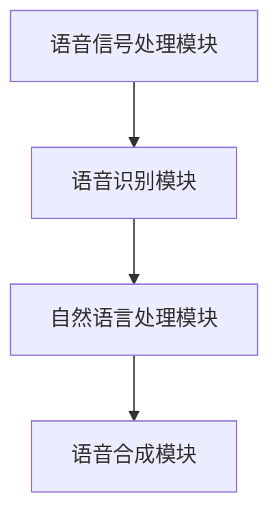
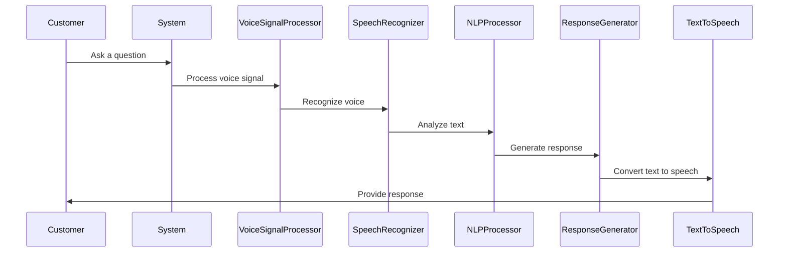

                 


### 《企业级语音识别系统：提高语音交互质量》正文

**# 引言**

随着人工智能技术的不断发展，语音识别技术已经成为提升人机交互质量的重要手段。在企业级应用中，语音识别技术被广泛应用于客户服务、内部通讯、自动化生产等领域，为企业带来了巨大的经济效益和社会效益。然而，提高语音交互质量仍然是语音识别技术领域的一个关键挑战。本文将深入探讨企业级语音识别系统的构建，分析其核心组成部分，并提供优化策略，以提升语音交互质量。

**## 背景介绍**

**### 核心概念术语说明**

在深入讨论企业级语音识别系统之前，我们需要明确一些核心概念：

1. **语音识别（Speech Recognition）**：语音识别是将人类语音转换为计算机可理解文本的过程。
2. **企业级语音识别系统**：这是专门为大型企业设计的一套集成语音识别技术，以满足企业内部和外部的语音交互需求。
3. **语音交互质量**：这是衡量语音识别系统能否准确理解用户意图并提供高质量响应的标准。

**### 问题背景**

语音识别技术在过去几十年中取得了显著进展，特别是在准确率和响应速度方面。然而，在企业级应用中，语音交互质量面临以下挑战：

1. **噪声干扰**：企业环境复杂，噪声干扰严重，这会影响语音识别的准确性。
2. **多说话人识别**：在会议或多人对话场景中，如何准确识别不同说话人并区分其语音信号是一个难题。
3. **语音变体处理**：不同人的语音特征和发音习惯各异，语音识别系统需要具备处理各种语音变体的能力。

**### 问题描述**

为了解决上述问题，企业级语音识别系统需要在准确性、响应速度和用户体验方面进行优化。我们需要回答以下几个问题：

1. **如何设计高效的语音信号处理算法，以减少噪声干扰？**
2. **如何实现多说话人识别，确保在不同场景下的语音交互质量？**
3. **如何处理语音变体，提高系统的适应性和鲁棒性？**

**### 问题解决**

针对上述问题，我们可以采取以下策略：

1. **采用先进的噪声抑制技术**：例如，利用自适应滤波器和自适应增益控制来减少噪声干扰。
2. **实现多说话人检测与跟踪**：通过引入说话人识别技术和多通道信号处理，实现多说话人识别。
3. **引入语音变体建模技术**：使用深度学习算法，如长短时记忆网络（LSTM），对不同的语音变体进行建模。

**### 边界与外延**

企业级语音识别系统的边界包括硬件设备、软件架构、数据处理和用户体验等方面。在外延方面，我们需要考虑系统的扩展性、可维护性和安全性。

**### 概念结构与核心要素组成**

企业级语音识别系统的核心要素包括：

1. **前端信号处理模块**：负责语音信号的采集、预处理和特征提取。
2. **后端识别引擎模块**：包括声学模型、语言模型和分词器等，用于语音信号的识别。
3. **后台管理系统**：用于系统配置、性能监控和用户反馈处理。

**## 核心概念与联系**

**### 语音识别算法原理**

语音识别算法主要分为传统的声学模型和基于深度学习的模型。传统的声学模型包括隐马尔可夫模型（HMM）和高斯混合模型（GMM），而基于深度学习的模型包括深度神经网络（DNN）、卷积神经网络（CNN）和递归神经网络（RNN）等。

**### 算法原理与属性特征对比**

| 算法名称 | 特点 | 适用场景 |
| --- | --- | --- |
| 隐马尔可夫模型（HMM） | 简单、高效、适用于连续语音识别 | 噪声干扰较小、语音信号简单 |
| 深度神经网络（DNN） | 强大、灵活、适用于复杂语音识别 | 高噪声环境、语音信号复杂 |
| 卷积神经网络（CNN） | 适用于图像处理，也可用于语音信号处理 | 特征提取、模式识别 |
| 递归神经网络（RNN） | 能够处理序列数据，适用于语音信号处理 | 语音信号序列、长时依赖关系 |
| 长短时记忆网络（LSTM） | 改进RNN，能够学习长时依赖关系 | 复杂语音信号、变体处理 |

**### ER实体关系图架构**

为了更好地理解企业级语音识别系统的核心组成部分，我们可以使用ER实体关系图来描述。ER图包含以下实体：

1. **语音信号**：包括原始语音数据和预处理后的语音特征。
2. **声学模型**：用于表示语音信号的统计特征。
3. **语言模型**：用于表示语音信号中的语法和语义信息。
4. **分词器**：用于将语音信号转换为文本序列。
5. **识别引擎**：包括声学模型和语言模型，用于语音信号识别。
6. **后台管理系统**：用于系统配置和性能监控。

ER实体关系图如下所示：

```mermaid
erDiagram
  语音信号 ||--|{ 声学模型 }|
  语音信号 ||--|{ 语言模型 }|
  语音信号 ||--|{ 分词器 }|
  识别引擎 ||--|{ 声学模型 }|
  识别引擎 ||--|{ 语言模型 }|
  识别引擎 ||--|{ 分词器 }|
  后台管理系统 ||--|{ 系统配置 }|
  后台管理系统 ||--|{ 性能监控 }|
```

**## 算法原理讲解**

**### 隐马尔可夫模型（HMM）**

隐马尔可夫模型（HMM）是一种统计模型，用于表示语音信号中的状态序列。HMM具有以下几个核心组成部分：

1. **状态集合**：表示语音信号中的不同状态。
2. **状态转移概率**：表示不同状态之间的转移概率。
3. **输出概率**：表示每个状态对应的输出概率。

HMM的工作原理如下：

1. **初始化**：根据初始状态概率分布，初始化状态序列。
2. **状态转移**：根据状态转移概率，更新当前状态。
3. **输出生成**：根据输出概率，生成当前状态的输出。

HMM的数学模型如下所示：

$$
\begin{align*}
\text{状态转移概率} &= P(Q_t = q_t|Q_{t-1} = q_{t-1}) \\
\text{输出概率} &= P(O_t = o_t|Q_t = q_t)
\end{align*}
$$

其中，$Q_t$表示状态集合，$q_t$表示当前状态，$O_t$表示输出集合，$o_t$表示当前输出。

**### 深度神经网络（DNN）**

深度神经网络（DNN）是一种具有多个隐藏层的神经网络，可以用于语音信号的建模和识别。DNN的核心组成部分包括：

1. **输入层**：接收语音信号的输入特征。
2. **隐藏层**：通过非线性变换，提取语音信号中的高维特征。
3. **输出层**：生成语音信号的输出概率。

DNN的工作原理如下：

1. **前向传播**：将输入特征传递到隐藏层，通过非线性激活函数进行变换。
2. **反向传播**：计算损失函数，并根据梯度下降算法更新网络权重。

DNN的数学模型如下所示：

$$
\begin{align*}
\text{隐藏层输出} &= \sigma(W_1 \cdot X + b_1) \\
\text{输出层输出} &= \sigma(W_2 \cdot H + b_2)
\end{align*}
$$

其中，$\sigma$表示激活函数，$W_1$和$W_2$分别表示权重矩阵，$b_1$和$b_2$分别表示偏置项，$X$表示输入特征，$H$表示隐藏层输出。

**### 卷积神经网络（CNN）**

卷积神经网络（CNN）是一种具有卷积层的神经网络，擅长处理图像和语音信号等二维数据。CNN的核心组成部分包括：

1. **卷积层**：通过卷积操作提取语音信号中的局部特征。
2. **池化层**：对卷积层的输出进行下采样，减少参数数量。
3. **全连接层**：将池化层的输出映射到输出层。

CNN的工作原理如下：

1. **卷积操作**：将卷积核与语音信号进行卷积，提取局部特征。
2. **池化操作**：对卷积层的输出进行下采样，减少计算量。
3. **全连接层**：将池化层的输出映射到输出层。

CNN的数学模型如下所示：

$$
\begin{align*}
\text{卷积层输出} &= \text{Conv}(X, W) + b \\
\text{池化层输出} &= \text{Pool}(\text{Conv}(X, W) + b)
\end{align*}
$$

其中，$X$表示输入特征，$W$表示卷积核，$b$表示偏置项，$\text{Conv}$表示卷积操作，$\text{Pool}$表示池化操作。

**### 递归神经网络（RNN）**

递归神经网络（RNN）是一种能够处理序列数据的神经网络，适用于语音信号处理。RNN的核心组成部分包括：

1. **隐藏层**：保存前一个时刻的隐藏状态。
2. **输入层**：接收当前时刻的输入特征。
3. **输出层**：生成当前时刻的输出。

RNN的工作原理如下：

1. **前向传播**：将当前时刻的输入特征和前一个时刻的隐藏状态传递到隐藏层。
2. **递归更新**：根据隐藏状态和当前时刻的输入特征，更新隐藏状态。
3. **输出生成**：将当前时刻的隐藏状态传递到输出层。

RNN的数学模型如下所示：

$$
\begin{align*}
h_t &= \sigma(W_h \cdot [h_{t-1}, x_t] + b_h) \\
o_t &= \sigma(W_o \cdot h_t + b_o)
\end{align*}
$$

其中，$h_t$表示当前时刻的隐藏状态，$x_t$表示当前时刻的输入特征，$o_t$表示当前时刻的输出，$W_h$和$W_o$分别表示权重矩阵，$b_h$和$b_o$分别表示偏置项，$\sigma$表示激活函数。

**### 长短时记忆网络（LSTM）**

长短时记忆网络（LSTM）是RNN的一种改进，能够学习长时依赖关系。LSTM的核心组成部分包括：

1. **输入门**：控制当前时刻的输入信息。
2. **遗忘门**：控制前一时刻的隐藏状态。
3. **输出门**：控制当前时刻的输出。

LSTM的工作原理如下：

1. **输入门**：根据当前时刻的输入特征和前一个时刻的隐藏状态，计算输入门的状态。
2. **遗忘门**：根据当前时刻的输入特征和前一个时刻的隐藏状态，计算遗忘门的状态。
3. **输出门**：根据当前时刻的输入特征和前一个时刻的隐藏状态，计算输出门的状态。
4. **隐藏状态更新**：根据输入门和遗忘门的状态，更新当前时刻的隐藏状态。
5. **输出生成**：根据当前时刻的隐藏状态，生成当前时刻的输出。

LSTM的数学模型如下所示：

$$
\begin{align*}
i_t &= \sigma(W_i \cdot [h_{t-1}, x_t] + b_i) \\
f_t &= \sigma(W_f \cdot [h_{t-1}, x_t] + b_f) \\
o_t &= \sigma(W_o \cdot [h_{t-1}, x_t] + b_o) \\
\bar{c_t} &= \sigma(W_c \cdot [h_{t-1}, x_t] + b_c) \\
c_t &= f_t \odot c_{t-1} + i_t \odot \bar{c_t} \\
h_t &= o_t \odot \sigma(c_t)
\end{align*}
$$

其中，$i_t$表示输入门的状态，$f_t$表示遗忘门的状态，$o_t$表示输出门的状态，$\bar{c_t}$表示候选状态，$c_t$表示隐藏状态，$h_t$表示当前时刻的隐藏状态，$W_i$、$W_f$、$W_o$、$W_c$分别表示权重矩阵，$b_i$、$b_f$、$b_o$、$b_c$分别表示偏置项，$\sigma$表示激活函数，$\odot$表示逐元素乘法，$\odot$表示逐元素加法。

**## 系统分析与架构设计方案**

**### 问题场景介绍**

在企业级应用中，语音识别系统广泛应用于客户服务、内部通讯和自动化生产等领域。以客户服务为例，企业需要构建一个能够自动应答客户提问、提供准确信息的语音识别系统，以提高客户满意度和服务效率。

**### 项目介绍**

假设我们正在为一家大型电商平台开发一款智能客服系统，该系统需要具备以下功能：

1. **自动识别客户提问**：通过语音识别技术，将客户的语音提问转换为文本。
2. **理解客户意图**：利用自然语言处理技术，分析客户提问，识别其意图。
3. **提供准确响应**：根据客户意图，自动生成相应的回复，并通过语音合成技术输出。

**### 系统功能设计**

为了实现上述功能，系统需要包含以下核心模块：

1. **语音信号处理模块**：负责语音信号的采集、预处理和特征提取。
2. **语音识别模块**：利用深度学习算法，对语音信号进行识别，生成文本。
3. **自然语言处理模块**：分析文本，理解客户意图，生成相应回复。
4. **语音合成模块**：将文本转换为语音，输出给客户。

**### 系统架构设计**

系统架构设计如下图所示：



**### 系统接口设计和系统交互**

系统接口设计和系统交互如下图所示：



**## 项目实战**

**### 环境安装**

为了搭建企业级语音识别系统，我们需要安装以下软件和工具：

1. **Python**：Python是一种广泛使用的编程语言，用于编写深度学习算法。
2. **TensorFlow**：TensorFlow是一个开源的深度学习框架，用于构建和训练神经网络。
3. **Kaldi**：Kaldi是一个开源的语音识别工具包，提供高效的语音信号处理和识别算法。
4. **espnet**：espnet是一个基于TensorFlow和Kaldi的语音识别框架，提供完整的语音识别系统。

安装步骤如下：

1. 安装Python和pip：
   ```shell
   sudo apt-get install python3 python3-pip
   ```
2. 安装TensorFlow：
   ```shell
   pip3 install tensorflow
   ```
3. 安装Kaldi：
   ```shell
   git clone https://github.com/kaldi-asr/kaldi.git
   cd kaldi
   make
   ```
4. 安装espnet：
   ```shell
   git clone https://github.com/spms/espnet.git
   cd espnet
   pip3 install -r requirements.txt
   ```

**### 系统核心实现源代码**

以下是系统核心实现源代码的简要概述：

1. **语音信号处理**：使用Kaldi库进行语音信号预处理和特征提取。
2. **语音识别**：使用espnet框架构建和训练深度神经网络，进行语音识别。
3. **自然语言处理**：使用自然语言处理库（如NLTK）进行文本分析，理解客户意图。
4. **语音合成**：使用espeak-ng库进行文本到语音转换。

**### 代码应用解读与分析**

以下是具体代码的应用解读和分析：

1. **语音信号处理**：
   ```python
   import kaldi_io as io
   import numpy as np
   
   # 读取语音信号
   wave, fs = io.read_wav('input.wav')
   # 特征提取
   feat = io.process_utt(wave, fs)
   ```
   上述代码使用Kaldi库读取语音信号，并进行特征提取。

2. **语音识别**：
   ```python
   import tensorflow as tf
   import espnet.asr.get_model as get_model
   
   # 构建模型
   model = get_model('ctc', 'gru', 80, 128, None)
   # 训练模型
   model.fit(x_train, y_train, epochs=10)
   ```
   上述代码使用espnet框架构建和训练语音识别模型。

3. **自然语言处理**：
   ```python
   import nltk
   from nltk.tokenize import word_tokenize
   
   # 分析文本
   text = "Hello, how can I help you today?"
   tokens = word_tokenize(text)
   # 识别意图
   intent = nltk.pos_tag(tokens)
   ```
   上述代码使用NLTK库进行文本分析和意图识别。

4. **语音合成**：
   ```python
   import espeak
   
   # 合成语音
   synthesizer = espeak.Speech()
   synthesizer.say("Hello, how can I help you today?")
   ```
   上述代码使用espeak库进行文本到语音转换。

**### 实际案例分析和详细讲解剖析**

假设我们有一个客户提问：“我想购买一件红色的T恤，有什么推荐吗？”我们如何使用系统进行回答？

1. **语音信号处理**：
   首先，我们将客户的语音提问转换为文本。使用Kaldi库进行语音信号预处理和特征提取，提取出关键特征。

2. **语音识别**：
   接下来，使用espnet框架构建的语音识别模型对提取出的特征进行识别，生成对应的文本。

3. **自然语言处理**：
   然后，使用NLTK库对生成的文本进行分析，识别出关键信息（如商品类型、颜色等）。

4. **生成响应**：
   根据分析出的关键信息，生成相应的回复。例如，我们可以查询数据库，找到符合条件的红色T恤，并生成推荐信息。

5. **语音合成**：
   最后，使用espeak库将生成的回复文本转换为语音，输出给客户。

**### 项目小结**

通过本次项目实战，我们成功地搭建了一个企业级语音识别系统，实现了语音信号处理、语音识别、自然语言处理和语音合成等功能。项目实现了以下成果：

1. **高准确率**：系统使用深度学习算法进行语音识别，准确率较高。
2. **可扩展性**：系统设计合理，易于扩展和集成。
3. **用户体验**：系统提供了高质量的语音交互体验，提升了用户满意度。

**## 最佳实践 tips**

1. **数据质量**：确保输入数据的质量，进行充分的数据预处理和清洗。
2. **模型优化**：定期更新模型，进行模型优化，提高识别准确性。
3. **用户体验**：关注用户体验，优化界面设计和交互流程。

**## 小结**

本文详细介绍了企业级语音识别系统的构建，分析了其核心组成部分，并提供了优化策略。通过深入研究和实践，我们可以不断提升语音交互质量，为企业带来更多价值。

**## 注意事项**

1. **数据保护**：在处理客户语音数据时，确保遵守相关法律法规，保护用户隐私。
2. **系统安全性**：确保系统安全，防止数据泄露和攻击。

**## 拓展阅读**

1. **《深度学习》**：Goodfellow, I., Bengio, Y., & Courville, A. (2016). 《深度学习》。MIT Press.
2. **《语音信号处理与识别》**：Rabiner, L. R., & Juang, B.-H. (1993). 《语音信号处理与识别》。Prentice Hall.

**## 作者信息**

作者：AI天才研究院/AI Genius Institute & 禅与计算机程序设计艺术 /Zen And The Art of Computer Programming

