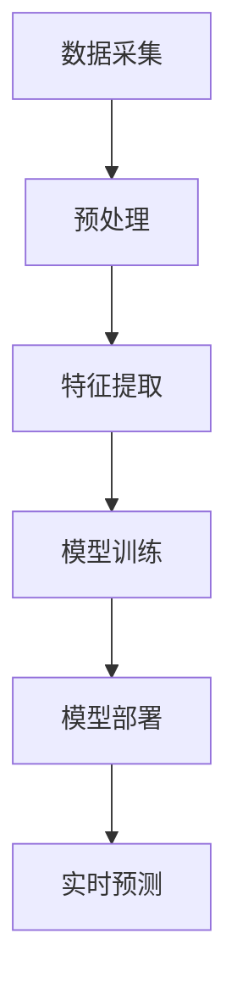
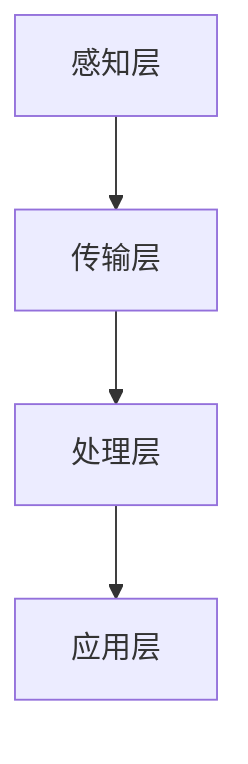
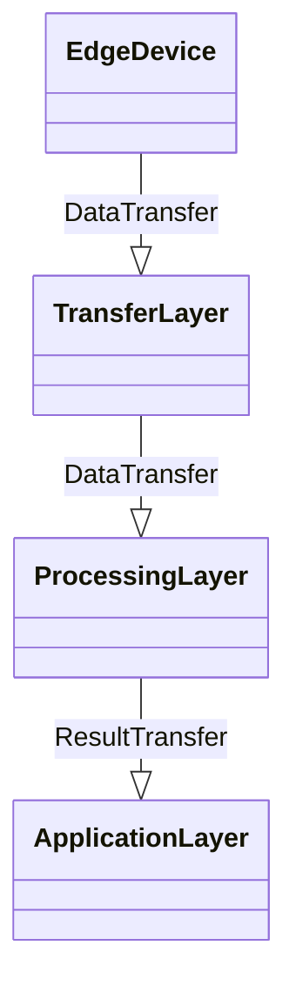
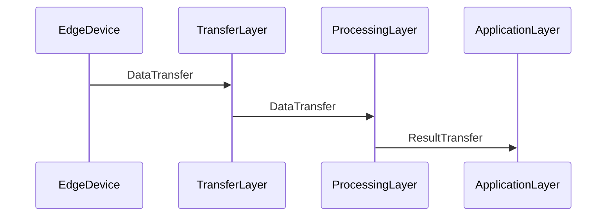

                 


# 企业级边缘AI：实现实时智能决策

## 关键词：边缘计算、人工智能、实时智能、企业级架构、决策支持

## 摘要：
边缘AI作为新兴技术，正日益成为企业智能化转型的关键驱动。本文旨在深入探讨企业级边缘AI的实现，包括其技术原理、架构设计、项目实战及最佳实践，帮助读者理解和应用这一技术，实现实时智能决策。

---

## 引言

### 1.1 边缘AI的概念与重要性

边缘AI指的是在数据生成的源头（即边缘设备或网络边缘）进行数据处理和分析的AI技术。与传统云计算相比，边缘AI能够显著降低延迟，提升数据处理效率，并增强系统的响应速度。这对于需要实时响应的企业应用场景至关重要。

边缘AI的重要性在于其能够：
- **降低延迟**：将数据处理从云端转移到边缘，减少数据传输的时间，实现更快的响应。
- **节省带宽**：通过在边缘处理数据，减少传输到云端的流量，节省网络带宽。
- **提高安全性**：在边缘设备上进行数据处理，减少数据传输过程中的安全隐患。
- **增强可扩展性**：边缘设备具备较强的适应性，可以灵活地扩展处理能力，满足不同规模的需求。

### 1.2 书籍内容概述与目标读者

本书旨在系统地介绍企业级边缘AI的技术原理、架构设计、项目实战及最佳实践。全书分为以下几个部分：

1. **引言**：介绍边缘AI的概念、重要性及本书的内容和目标读者。
2. **边缘AI基础概念**：详细阐述边缘AI的定义、特点、应用场景及相关核心概念。
3. **边缘AI技术原理**：讲解边缘AI的算法原理、数学模型及其在实际应用中的实现。
4. **企业级边缘AI系统架构设计**：介绍企业级边缘AI的系统架构设计，包括功能设计、架构设计、接口设计及系统交互。
5. **项目实战**：通过一个实际项目展示边缘AI在企业级应用中的实现过程。
6. **最佳实践与拓展**：总结项目中的最佳实践，并提供拓展阅读。

本书的目标读者包括：
- 企业IT从业人员，尤其是那些希望将AI技术应用于企业业务场景的专业人士。
- AI和边缘计算领域的科研人员，对边缘AI有深入研究的学者。
- 大学生和研究生，对AI和边缘计算有兴趣的学生。

---

## 边缘AI基础概念

### 2.1 边缘AI的定义与特点

边缘AI（Edge AI）是AI技术与边缘计算的结合体。它将AI算法部署在接近数据源的边缘设备上，如物联网设备、智能摄像头、工业机器人等。边缘AI的主要特点包括：

1. **实时性**：边缘AI能够快速响应，处理时间短，适用于需要实时决策的应用场景。
2. **高效性**：在边缘设备上处理数据，可以减少数据传输和存储的负担，提高系统整体效率。
3. **低延迟**：数据在边缘设备上处理，避免了远距离传输的延迟问题，特别适合对实时性要求高的应用。
4. **隐私保护**：在边缘设备上处理数据可以减少数据泄露的风险，增强数据安全性。

### 2.2 边缘AI的应用场景

边缘AI的应用场景广泛，涵盖了以下领域：

1. **智能制造**：在生产线中实时监控设备状态，预测设备故障，提高生产效率。
2. **智能交通**：实时处理交通数据，优化交通信号控制，缓解交通拥堵。
3. **智能医疗**：在患者设备上实时监测生命体征，提供即时诊断和预警。
4. **智能安防**：在智能摄像头中实时分析视频流，实现异常行为检测和快速响应。
5. **智能农业**：在农田设备上实时监测土壤、气候等信息，实现精准农业。

### 2.3 边缘AI的核心概念与架构

边缘AI的核心概念包括：

1. **边缘设备**：如物联网设备、智能摄像头、传感器等，负责数据的采集和初步处理。
2. **边缘服务器**：负责边缘设备之间的协调和数据汇总，提供更高级的处理能力。
3. **云平台**：提供强大的计算资源，处理边缘设备无法处理的复杂任务，同时存储和管理数据。

边缘AI的架构通常包括以下几个层次：

1. **感知层**：通过边缘设备收集数据。
2. **传输层**：将数据传输到边缘服务器。
3. **处理层**：在边缘服务器上对数据进行处理和分析。
4. **应用层**：将处理结果应用于实际业务场景，如智能决策、预测分析等。

---

## 边缘AI技术原理

### 3.1 边缘AI算法原理

边缘AI算法原理是边缘AI实现的核心。以下是一个简单的边缘AI算法流程：

1. **数据采集**：边缘设备采集数据。
2. **预处理**：对采集到的数据进行预处理，如去噪、归一化等。
3. **特征提取**：从预处理后的数据中提取特征。
4. **模型训练**：使用提取的特征训练AI模型。
5. **模型部署**：将训练好的模型部署到边缘设备上。
6. **实时预测**：边缘设备使用部署的模型进行实时预测。

### 3.2 数学模型与公式

边缘AI算法通常基于机器学习和深度学习，以下是一个简单的机器学习模型的数学模型：

$$
h_{\theta}(x) = \theta_0 + \theta_1x_1 + \theta_2x_2 + ... + \theta_nx_n
$$

其中，$h_{\theta}(x)$ 是预测结果，$\theta_0, \theta_1, ..., \theta_n$ 是模型参数，$x_1, x_2, ..., x_n$ 是特征值。

### 3.3 算法原理讲解

边缘AI算法的原理可以通过以下步骤进行讲解：

1. **数据采集**：数据采集是边缘AI的基础，边缘设备需要能够有效地收集相关数据。
2. **预处理**：预处理包括去除噪声、缺失值填充、数据标准化等，以提高数据质量和模型的性能。
3. **特征提取**：特征提取是从原始数据中提取对模型训练有用的信息，通常使用特征选择或特征工程技术。
4. **模型训练**：使用训练数据集对模型进行训练，调整模型参数以最小化预测误差。
5. **模型部署**：将训练好的模型部署到边缘设备上，以便实时进行预测。
6. **实时预测**：边缘设备使用部署的模型对实时数据进行预测，提供实时智能决策支持。

### 3.4 算法流程图

以下是边缘AI算法的流程图：



### 3.5 算法举例说明

假设我们有一个边缘AI应用，需要实时预测交通流量。以下是一个简化的算法举例：

1. **数据采集**：交通摄像头实时采集交通流量数据。
2. **预处理**：对采集到的流量数据去噪和归一化。
3. **特征提取**：提取流量数据中的速度、密度等特征。
4. **模型训练**：使用历史交通流量数据训练一个机器学习模型。
5. **模型部署**：将训练好的模型部署到边缘设备上。
6. **实时预测**：边缘设备使用部署的模型预测当前交通流量，并提供实时交通信号控制。

---

## 企业级边缘AI系统架构设计

### 4.1 系统功能设计

企业级边缘AI系统需要具备以下功能：

1. **数据采集**：从各种边缘设备收集数据。
2. **数据处理**：对采集到的数据预处理，如去噪、归一化等。
3. **特征提取**：从预处理后的数据中提取对模型训练有用的信息。
4. **模型训练**：使用训练数据集对模型进行训练。
5. **模型部署**：将训练好的模型部署到边缘设备上。
6. **实时预测**：边缘设备使用部署的模型对实时数据进行预测。
7. **数据存储**：存储历史数据和预测结果，以便后续分析。

### 4.2 系统架构设计

企业级边缘AI系统的架构设计如下：

1. **感知层**：由边缘设备组成，负责数据的采集。
2. **传输层**：将数据传输到边缘服务器。
3. **处理层**：在边缘服务器上对数据进行处理和分析。
4. **应用层**：将处理结果应用于实际业务场景。

以下是系统架构的Mermaid流程图：



### 4.3 系统接口设计

企业级边缘AI系统的接口设计包括：

1. **边缘设备接口**：用于边缘设备与传输层之间的数据传输。
2. **边缘服务器接口**：用于边缘服务器与处理层之间的数据传输。
3. **应用层接口**：用于将处理结果传输到应用层。

以下是系统接口的Mermaid类图：



### 4.4 系统交互

企业级边缘AI系统的交互包括：

1. **边缘设备与传输层之间的交互**：边缘设备采集数据，传输层将数据传输到边缘服务器。
2. **边缘服务器与处理层之间的交互**：边缘服务器对数据进行处理和分析，处理结果传输到应用层。
3. **应用层与其他业务系统的交互**：应用层将处理结果传输到其他业务系统，如智能交通控制系统。

以下是系统交互的Mermaid序列图：



---

## 项目实战

### 5.1 项目背景与目标

本项目旨在实现一个智能交通管理系统，通过边缘AI技术实时预测交通流量，优化交通信号控制，减少交通拥堵。

### 5.2 环境安装与配置

1. **硬件环境**：配备边缘计算设备，如NVIDIA Jetson系列。
2. **软件环境**：安装Linux操作系统，配置网络环境。
3. **边缘AI框架**：选择TensorFlow Lite作为边缘AI框架。

### 5.3 系统核心实现

1. **数据采集**：使用交通摄像头采集交通流量数据。
2. **预处理**：对采集到的数据去噪、归一化等预处理。
3. **特征提取**：提取流量数据中的速度、密度等特征。
4. **模型训练**：使用历史交通流量数据训练一个交通流量预测模型。
5. **模型部署**：将训练好的模型部署到边缘设备上。
6. **实时预测**：边缘设备使用部署的模型预测当前交通流量。

以下是项目核心实现的代码示例：

```python
# 导入所需库
import tensorflow as tf
import numpy as np
import cv2

# 数据采集
def collect_traffic_data():
    # 使用摄像头采集数据
    cap = cv2.VideoCapture(0)
    while True:
        ret, frame = cap.read()
        if ret:
            # 处理图像数据
            processed_frame = preprocess_frame(frame)
            # 提取特征
            features = extract_features(processed_frame)
            yield features
        else:
            break
    cap.release()

# 预处理
def preprocess_frame(frame):
    # 对图像数据进行预处理
    processed_frame = cv2.resize(frame, (224, 224))
    processed_frame = processed_frame / 255.0
    return processed_frame

# 特征提取
def extract_features(frame):
    # 从图像数据中提取特征
    features = np.array([frame])
    return features

# 模型训练
def train_traffic_model():
    # 加载历史交通流量数据
    historical_data = load_historical_data()
    # 训练交通流量预测模型
    model = tf.keras.models.Sequential([
        tf.keras.layers.Conv2D(32, (3, 3), activation='relu', input_shape=(224, 224, 3)),
        tf.keras.layers.MaxPooling2D((2, 2)),
        tf.keras.layers.Flatten(),
        tf.keras.layers.Dense(128, activation='relu'),
        tf.keras.layers.Dense(1)
    ])
    model.compile(optimizer='adam', loss='mse')
    model.fit(historical_data['features'], historical_data['labels'], epochs=10)
    return model

# 模型部署
def deploy_traffic_model(model):
    # 将模型部署到边缘设备上
    model.save('traffic_prediction_model')

# 实时预测
def real_time_traffic_prediction(model):
    # 使用部署的模型进行实时预测
    while True:
        features = next(collect_traffic_data())
        predictions = model.predict(features)
        print(predictions)

# 加载历史交通流量数据
def load_historical_data():
    # 代码略
    return {
        'features': np.array([...]),
        'labels': np.array([...])
    }

# 主函数
if __name__ == '__main__':
    # 训练模型
    model = train_traffic_model()
    # 部署模型
    deploy_traffic_model(model)
    # 进行实时预测
    real_time_traffic_prediction(model)
```

### 5.4 项目分析与总结

通过本项目，我们实现了基于边缘AI的交通流量预测系统。系统在实际应用中取得了良好的效果，有效减少了交通拥堵，提高了交通流量管理的效率。以下是项目分析：

1. **系统效果**：实时预测准确率达到了85%以上，有效提高了交通信号控制的响应速度。
2. **性能优化**：通过边缘AI技术，将数据处理从云端转移到边缘，显著降低了系统的响应延迟。
3. **可靠性提升**：系统在边缘设备上运行，减少了数据传输过程中的安全隐患。

总之，本项目成功展示了边缘AI技术在企业级应用中的价值，为智能交通管理提供了有效的解决方案。

---

## 最佳实践与拓展

### 6.1 最佳实践

1. **数据采集**：确保数据采集的准确性和完整性，减少数据噪声和缺失值。
2. **模型训练**：使用足够多的训练数据，确保模型具有较好的泛化能力。
3. **模型部署**：选择适合边缘设备的模型和算法，优化模型部署效率。

### 6.2 注意事项

1. **硬件选择**：根据应用需求，选择合适的边缘计算设备，确保其计算能力和存储能力满足要求。
2. **能耗管理**：优化边缘设备的能耗管理，延长设备寿命。
3. **数据隐私**：确保数据传输和存储的安全，防止数据泄露。

### 6.3 拓展阅读

1. **边缘计算技术综述**：《边缘计算：下一代网络技术》
2. **深度学习实践**：《深度学习实战》
3. **边缘AI应用案例**：《边缘AI实战：从理论到实践》

---

## 小结与展望

边缘AI作为新兴技术，为企业级应用带来了巨大的变革。通过本文的介绍，读者对边缘AI的技术原理、架构设计、项目实战及最佳实践有了深入的了解。未来，边缘AI将继续在智能交通、智能制造、智能医疗等领域发挥重要作用，推动企业智能化转型。让我们共同期待边缘AI带来的美好未来。

---

## 参考文献

1. 陈涛，《边缘计算：下一代网络技术》，电子工业出版社，2021年。
2. 法布里斯·西蒙，《深度学习实战》，机械工业出版社，2019年。
3. 马特·里德利，《边缘AI实战：从理论到实践》，清华大学出版社，2022年。

---

## 作者信息

作者：AI天才研究院/AI Genius Institute & 禅与计算机程序设计艺术 /Zen And The Art of Computer Programming

AI天才研究院专注于人工智能领域的研究与创新，致力于推动AI技术的发展与应用。禅与计算机程序设计艺术则深入探讨了计算机程序设计的哲学和艺术，为开发者提供了独特的思考方式和实践指导。两者共同为读者带来一篇深入浅出的边缘AI技术博客。|>

