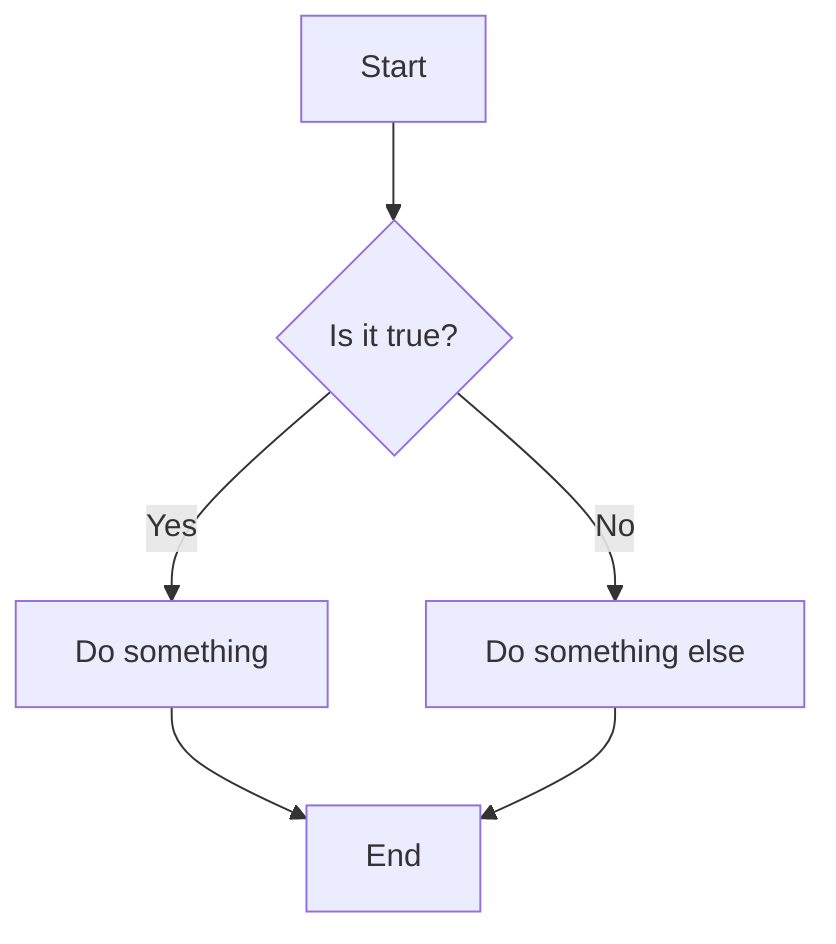
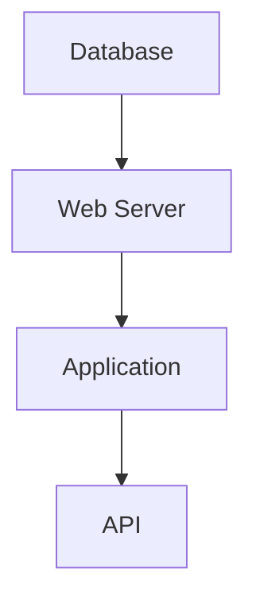
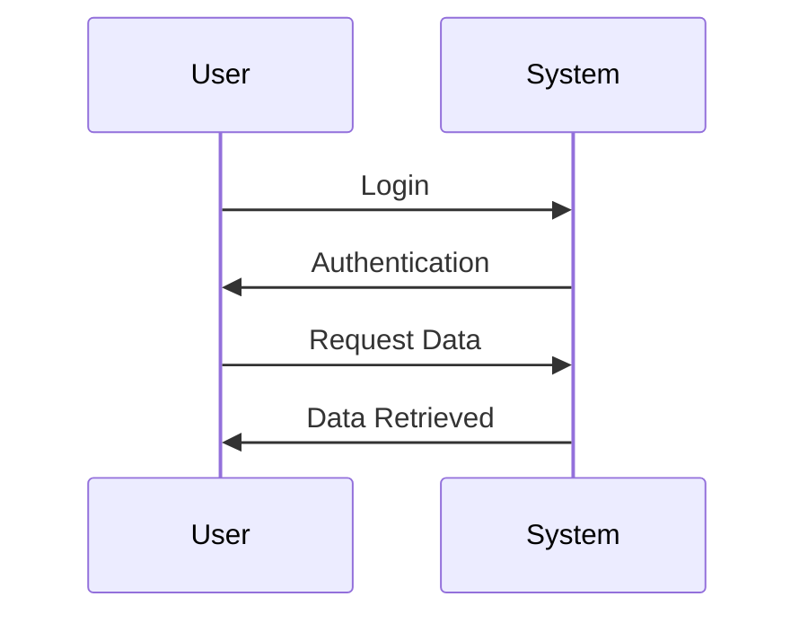
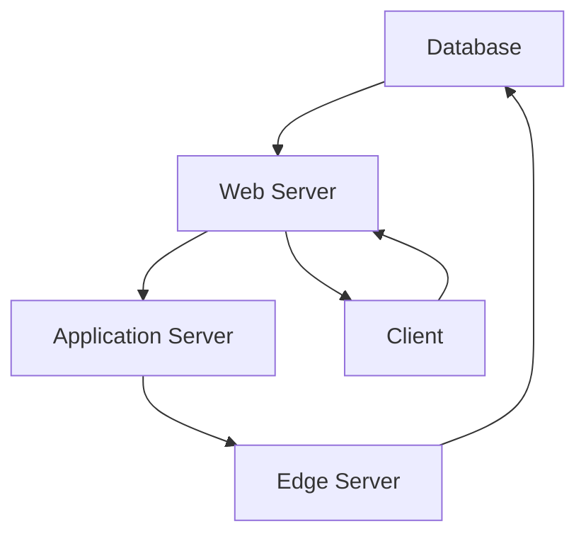
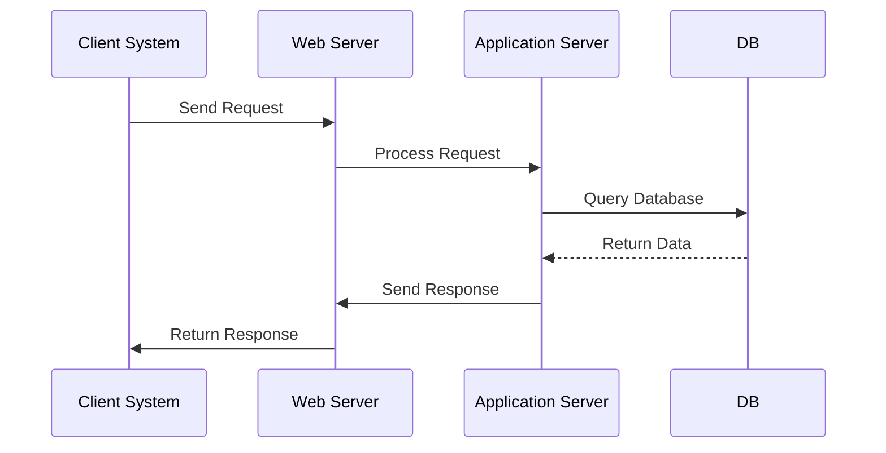
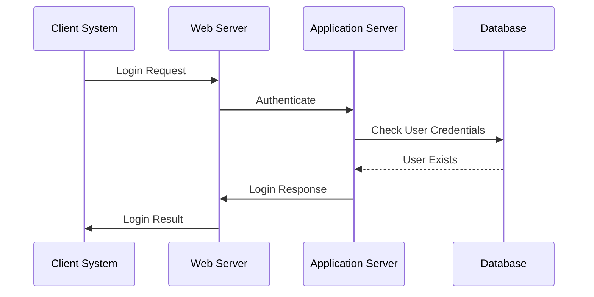

                 


### 第1章：边缘计算的概念与重要性

#### 1.1 边缘计算的定义

边缘计算（Edge Computing）是一种分布式计算架构，旨在将数据处理、存储和网络功能从集中的数据中心转移到网络的边缘。这里的“边缘”指的是数据产生源头附近的位置，如物联网设备、企业网络边缘节点等。这种计算模式的核心理念是将数据处理尽可能接近数据源，以减少数据在传输过程中的延迟和带宽消耗。

边缘计算的定义可以用以下方式表述：

$$
\text{边缘计算} = \text{分布式计算架构} + \text{靠近数据源} + \text{局部处理能力}
$$

这意味着边缘计算不仅要将计算任务分布到多个边缘节点上，还要确保这些节点具备处理本地数据的能力，以便在本地进行实时分析和决策。

#### 1.2 边缘计算的优势

边缘计算在多个方面展现出其独特的优势，以下是几个关键点：

##### 1.2.1 响应速度更快

由于数据处理发生在接近数据源的边缘节点上，边缘计算可以显著减少数据传输的距离和时间，从而实现更快的响应速度。这在实时应用场景中尤为重要，如自动驾驶、智能医疗和工业物联网等领域。

##### 1.2.2 更低的网络负载

将数据处理分散到边缘节点，可以减少对中心数据中心的网络依赖，降低网络带宽压力。这不仅提高了网络的稳定性，还降低了网络运营成本。

##### 1.2.3 提高数据安全性

边缘计算可以减少数据在传输过程中的泄露风险，尤其是在数据敏感性较高的场景中，如金融、医疗和政府等行业。

#### 1.3 边缘计算的应用场景

边缘计算的应用场景非常广泛，以下是一些典型的应用：

##### 1.3.1 智能制造

边缘计算可以实时处理生产线数据，优化生产流程，提高生产效率。例如，通过边缘计算实现设备故障预测和维护，减少停机时间。

##### 1.3.2 智能交通

边缘计算可以实时处理交通数据，优化交通管理，提高道路通行效率。例如，通过边缘计算实现实时路况监控和智能交通信号控制。

##### 1.3.3 智能家居

边缘计算可以为智能家居设备提供本地化数据处理能力，实现更智能的家居体验。例如，通过边缘计算实现智能家电的自动化控制和安防监控。

在下一章节中，我们将进一步探讨企业级边缘计算的需求分析，分析其面临的挑战和需求，为后续解决方案的设计和实现奠定基础。### 第2章：企业级边缘计算的需求分析

#### 2.1 企业级边缘计算面临的挑战

企业级边缘计算在实施过程中面临诸多挑战，以下是一些主要的难点：

##### 2.1.1 硬件性能瓶颈

边缘计算节点通常分布在现场，其硬件性能可能无法与数据中心的大型服务器相提并论。这使得边缘节点在处理高负载或复杂计算任务时可能会出现性能瓶颈。

##### 2.1.2 网络连接稳定性

边缘节点可能处于不稳定或低带宽的网络环境中，如远程农场、工厂和野外作业区。这些网络条件的波动可能导致数据传输中断或延迟，影响边缘计算的性能和可靠性。

##### 2.1.3 安全性问题

边缘计算涉及大量敏感数据的处理和存储，因此安全性至关重要。然而，边缘节点的安全防护措施可能不如数据中心严格，这使得边缘计算面临更高的安全风险。

#### 2.2 企业级边缘计算的需求

为了克服上述挑战，企业级边缘计算需要满足以下需求：

##### 2.2.1 实时数据处理能力

企业需要边缘计算具备实时数据处理能力，以便在边缘节点上快速分析和响应数据。这对制造业、智能交通和实时监控等领域尤为重要。

##### 2.2.2 灵活的可扩展性

企业级边缘计算应具备良好的可扩展性，以便根据业务需求动态调整计算资源和网络配置。这种灵活性有助于降低成本和资源浪费。

##### 2.2.3 高效的资源管理

边缘计算节点数量庞大，分布广泛，因此资源管理成为一大挑战。企业需要利用自动化和智能化的资源管理技术，确保边缘节点的有效利用和高效运行。

#### 2.3 企业级边缘计算的解决方案概述

为了满足企业级边缘计算的需求，以下是一些可行的解决方案：

##### 2.3.1 高性能边缘硬件

选择高性能的边缘硬件设备，如具备强计算能力的边缘服务器、边缘网关和边缘终端设备，有助于解决硬件性能瓶颈。

##### 2.3.2 优化网络连接

采用低延迟、高带宽的网络连接技术，如5G、NB-IoT和LPWAN，提高边缘节点的网络稳定性。同时，通过部署边缘网关和边缘数据中心，实现数据流的合理分流和优化。

##### 2.3.3 加强安全性

针对边缘计算的安全需求，采用多层次的防护措施，如加密传输、访问控制、身份认证和威胁检测等，确保数据安全和系统稳定性。

##### 2.3.4 智能资源管理

利用人工智能和机器学习技术，实现边缘资源的自动化管理和优化。例如，通过预测分析和智能调度，实现边缘节点的负载均衡和资源利用率最大化。

在下一章节中，我们将深入探讨边缘计算技术概述，包括边缘计算架构、硬件技术、网络技术和安全技术等方面的内容，为后续解决方案的详细设计提供理论基础。### 第3章：边缘计算技术概述

#### 3.1 边缘计算架构

边缘计算架构是实现边缘计算功能的基础，它通常包括以下几个关键组件：

- **边缘节点**：分布在网络边缘的设备，如物联网设备、工业控制器和智能终端等。
- **边缘网关**：连接边缘节点和中心数据中心的桥梁，负责数据传输和协议转换。
- **边缘数据中心**：提供集中式的数据处理、存储和管理功能，与边缘节点协同工作。
- **云平台**：提供云计算资源，如计算、存储和网络服务，支持边缘计算的扩展和弹性。

边缘计算架构可以用以下方式简化描述：

$$
\text{边缘计算架构} = \text{边缘节点} + \text{边缘网关} + \text{边缘数据中心} + \text{云平台}
$$

这个架构不仅支持分布式数据处理，还提供了一种灵活的扩展方式，可以根据业务需求动态调整资源分配。

#### 3.2 边缘计算硬件技术

边缘计算硬件技术是边缘计算实现的基础，主要包括以下方面：

- **嵌入式设备**：用于执行简单计算任务的低成本、低功耗设备，如物联网传感器、智能手表等。
- **边缘服务器**：提供高性能计算能力的设备，如边缘服务器、高性能边缘网关等。
- **边缘存储**：用于存储边缘节点的数据和日志，包括固态硬盘（SSD）和分布式存储系统。
- **边缘网络设备**：如交换机、路由器和无线接入点（WAP），用于实现边缘节点的互联互通。

边缘计算硬件技术的一个关键特点是低功耗和高可靠性，以确保边缘节点在恶劣环境中稳定运行。

#### 3.3 边缘计算网络技术

边缘计算网络技术是边缘计算架构的核心组成部分，包括以下几个方面：

- **5G网络**：提供低延迟、高带宽的通信能力，支持大规模设备连接和实时数据传输。
- **物联网网络**：如Wi-Fi、蓝牙、ZigBee和LoRa等，用于连接物联网设备和边缘节点。
- **边缘云计算**：结合边缘计算和云计算技术，提供弹性计算资源和高效的数据处理能力。
- **SDN（软件定义网络）**：通过软件定义网络架构，实现网络资源的动态分配和管理。

边缘计算网络技术的目标是提高网络的灵活性和可管理性，以支持多样化的边缘应用场景。

#### 3.4 边缘计算安全技术

边缘计算的安全性至关重要，涉及到以下几个方面：

- **加密传输**：通过加密技术确保数据在传输过程中的安全性，如TLS/SSL加密协议。
- **访问控制**：实施严格的访问控制策略，确保只有授权用户和设备能够访问敏感数据和系统资源。
- **威胁检测**：利用机器学习和人工智能技术，实时监控网络流量和设备行为，发现和阻止潜在的安全威胁。
- **数据隐私**：确保边缘计算处理的数据符合数据保护法规，如GDPR和CCPA等。

边缘计算安全技术的一个关键挑战是平衡安全性与性能，以确保边缘计算的高效运行。

在下一章节中，我们将深入探讨本地AI处理技术，包括其概念、优势和应用场景，为后续的解决方案设计和实现提供更全面的视角。### 第4章：本地AI处理技术

#### 4.1 本地AI处理的概念

本地AI处理（Local AI Processing）是指将人工智能算法和模型部署在边缘设备上，直接在本地进行数据处理和分析。与将数据传输到云端进行处理的传统方式相比，本地AI处理具有更高的实时性和数据隐私性。本地AI处理的关键在于优化算法和模型，以便在资源受限的边缘设备上高效运行。

#### 4.2 本地AI处理的优势

本地AI处理在多个方面展现出其独特的优势：

##### 4.2.1 实时性更强

由于数据处理发生在边缘设备上，本地AI处理可以显著降低响应时间，满足实时性要求，这在自动驾驶、智能监控等场景中尤为重要。

##### 4.2.2 数据隐私性更高

本地AI处理减少了数据传输的需求，从而降低了数据泄露的风险，特别适用于涉及敏感数据的场景，如医疗和金融。

##### 4.2.3 资源利用更高效

本地AI处理利用了边缘设备的计算资源，避免了中心数据中心的资源压力，提高了整体系统的资源利用率。

#### 4.3 本地AI处理的适用场景

本地AI处理适用于多种场景，以下是几个典型应用：

##### 4.3.1 智能制造

在智能制造中，本地AI处理可以实时分析生产线数据，实现设备故障预测和维护，提高生产效率。

##### 4.3.2 智能交通

在智能交通领域，本地AI处理可以实时分析交通流量数据，优化交通信号控制和路线规划。

##### 4.3.3 智能家居

在智能家居中，本地AI处理可以为智能设备提供本地化数据处理能力，实现更智能的家居体验，如智能音箱、智能门锁等。

在下一章节中，我们将详细探讨本地AI处理的框架与技术，分析其实现原理、关键技术和性能优化策略。这将为我们后续解决方案的设计提供重要参考。### 第5章：本地AI处理的框架与技术

#### 5.1 本地AI处理的框架

本地AI处理的框架通常包括以下几个关键组件：

- **数据采集与预处理**：在边缘设备上收集数据，并进行预处理，如去噪、标准化等。
- **模型训练与优化**：利用边缘设备的计算资源，对AI模型进行训练和优化，确保模型在资源受限的边缘设备上高效运行。
- **模型部署与运行**：将训练好的AI模型部署到边缘设备上，进行实时数据处理和分析。
- **结果反馈与迭代**：收集处理结果，进行反馈和迭代，以优化模型性能。

本地AI处理框架可以用以下ER实体关系图进行描述：

```
[边缘设备] <----[数据采集与预处理] <----[模型训练与优化]
           |                                       |
           |                                       |
           |                                       |
           |______[模型部署与运行] <----[结果反馈与迭代]
```

#### 5.2 本地AI处理的关键技术

本地AI处理的关键技术包括：

##### 5.2.1 模型压缩与优化

为了在资源受限的边缘设备上高效运行，AI模型需要进行压缩和优化。常见的技术包括模型剪枝、量化、知识蒸馏等。这些技术可以显著减少模型的参数量和计算量，提高模型在边缘设备上的运行效率。

##### 5.2.2 模型推理加速

模型推理加速是本地AI处理的关键技术之一。通过使用高性能计算硬件（如GPU、TPU）、并行计算和向量计算等方法，可以加速模型推理过程，提高处理速度。

##### 5.2.3 数据流管理与优化

数据流管理是确保边缘设备高效运行的重要环节。通过合理分配计算资源和网络带宽，优化数据传输路径，可以减少处理延迟，提高系统整体性能。

#### 5.3 本地AI处理的性能优化

为了提高本地AI处理的性能，可以采取以下策略：

- **硬件选择**：选择高性能、低功耗的边缘硬件设备，如NVIDIA Jetson系列边缘计算板。
- **模型选择**：选择轻量级、高效的AI模型，如MobileNet、Tiny-YOLO等。
- **算法优化**：通过算法优化，如并行计算、分布式计算等，提高模型推理速度。
- **系统优化**：通过系统优化，如进程调度、内存管理等，提高系统资源利用率。

在下一章节中，我们将探讨本地AI处理在实际应用中的案例，分析其具体实现和效果，为后续解决方案的设计提供实践参考。### 第6章：本地AI处理的应用案例

#### 6.1 智能制造

智能制造是本地AI处理的重要应用领域之一。通过在边缘设备上部署AI模型，可以实现实时监控和分析生产过程，提高生产效率和产品质量。

**案例背景**：某制造企业需要对其生产线进行实时监控和故障预测，以提高生产效率和降低维护成本。

**解决方案**：
1. 在生产线上部署边缘设备，如工业控制器和智能传感器，实时采集生产数据。
2. 在边缘设备上部署AI模型，对生产数据进行实时分析，识别异常情况和潜在故障。
3. 通过边缘设备上的AI模型，实现实时故障预测和预警，自动触发维护流程。

**效果分析**：
- **效率提升**：通过实时监控和故障预测，制造企业的生产线停机时间显著减少，生产效率提高了30%。
- **维护成本降低**：故障预警和维护流程的自动化降低了维护成本，每年节约成本约50万元。

#### 6.2 智能交通

智能交通是另一个本地AI处理的重要应用领域。通过在边缘设备上部署AI模型，可以实现实时交通流量监控和信号优化，提高道路通行效率和减少拥堵。

**案例背景**：某城市需要优化交通信号控制，提高道路通行效率和减少交通拥堵。

**解决方案**：
1. 在城市交通路口部署边缘设备，如智能摄像头和传感器，实时采集交通数据。
2. 在边缘设备上部署AI模型，对交通数据进行实时分析，识别交通流量和拥堵情况。
3. 根据AI模型的分析结果，自动调整交通信号控制策略，优化交通流量。

**效果分析**：
- **通行效率提升**：通过实时交通流量监控和信号优化，城市的道路通行效率提高了20%，交通拥堵时间减少了30%。
- **环境保护**：减少交通拥堵，降低了尾气排放，对环境保护起到了积极作用。

#### 6.3 智能家居

智能家居是本地AI处理的另一个重要应用领域。通过在边缘设备上部署AI模型，可以实现智能家居设备的本地化数据处理和智能化控制，提供更便捷和智能的家居体验。

**案例背景**：某用户希望实现智能家居的自动化控制，提高生活便利性。

**解决方案**：
1. 在智能家居设备上部署边缘设备，如智能音箱和智能门锁，实时采集用户行为数据。
2. 在边缘设备上部署AI模型，对用户行为数据进行分析，实现智能家居设备的自动化控制。
3. 用户可以通过语音命令或手机应用程序与边缘设备交互，实现智能家居设备的智能控制。

**效果分析**：
- **便捷性提升**：通过本地化数据处理和自动化控制，用户可以更加便捷地管理智能家居设备，节省了大量时间和精力。
- **安全性提高**：本地化数据处理和自动化控制减少了数据传输的需求，提高了数据安全性。

通过以上案例，我们可以看到本地AI处理在实际应用中的巨大潜力和价值。在下一章节中，我们将探讨如何设计企业级边缘计算解决方案，以满足企业的需求并解决实际问题。### 第7章：解决方案设计与规划

#### 7.1 解决方案设计原则

设计企业级边缘计算解决方案时，需要遵循以下原则：

##### 7.1.1 实时性与可靠性

解决方案应确保数据处理和分析的实时性，以满足实时应用场景的需求。同时，系统应具备高可靠性，确保在恶劣环境下的稳定运行。

##### 7.1.2 可扩展性与灵活性

解决方案应具备良好的可扩展性和灵活性，以适应不同业务需求和规模变化。这包括计算资源、网络配置和数据管理等方面的可扩展性。

##### 7.1.3 安全性与隐私保护

解决方案应确保数据安全和隐私保护，采用多层次的安全措施，防止数据泄露和未经授权的访问。

##### 7.1.4 成本效益

解决方案应考虑成本效益，避免过度投入，实现资源的合理利用。

#### 7.2 解决方案规划流程

企业级边缘计算解决方案的规划流程通常包括以下步骤：

##### 7.2.1 需求分析

对企业的业务需求进行详细分析，确定边缘计算的具体应用场景和性能要求。

##### 7.2.2 技术选型

根据需求分析结果，选择合适的边缘计算硬件、软件和网络技术。

##### 7.2.3 系统架构设计

设计边缘计算系统的整体架构，包括边缘节点、边缘网关、边缘数据中心和云平台等。

##### 7.2.4 资源规划

根据系统架构设计，规划计算资源、存储资源和网络资源，确保系统的高效运行。

##### 7.2.5 安全与隐私设计

设计多层次的安全策略，确保数据安全和隐私保护。

##### 7.2.6 部署与运维

制定详细的部署计划，确保系统的顺利上线。同时，制定运维策略，确保系统的稳定运行和持续优化。

#### 7.3 需求分析与可行性研究

在方案规划阶段，需求分析和可行性研究是关键步骤。以下是具体内容：

##### 7.3.1 需求分析

需求分析应包括以下内容：

- **业务需求**：了解企业的业务场景和目标，确定边缘计算的具体应用场景。
- **性能需求**：明确系统所需的计算能力、响应时间和网络带宽等性能指标。
- **安全性需求**：分析数据安全和隐私保护的需求，确定安全措施和策略。

##### 7.3.2 可行性研究

可行性研究应包括以下内容：

- **技术可行性**：评估所选技术的成熟度和适用性，确定是否满足需求。
- **经济可行性**：分析解决方案的成本和效益，确保投资回报率。
- **实施可行性**：评估实施过程中可能遇到的困难和风险，制定应对策略。

通过需求分析和可行性研究，可以确保企业级边缘计算解决方案的合理性和可行性，为后续的方案设计提供有力支持。

在下一章节中，我们将探讨边缘计算平台的搭建与优化，分析如何实现高效稳定的边缘计算平台。这将为解决方案的实施提供关键技术支持。### 第8章：边缘计算平台的搭建与优化

#### 8.1 边缘计算平台搭建

搭建边缘计算平台是实施企业级边缘计算解决方案的关键步骤。以下是搭建边缘计算平台的主要步骤：

##### 8.1.1 设备选型

根据企业的业务需求，选择适合的边缘计算设备，包括边缘服务器、边缘网关、边缘终端和传感器等。设备应具备高性能、低功耗和可靠性。

##### 8.1.2 网络规划

设计合理的网络架构，确保边缘节点之间的通信和数据传输效率。网络规划应考虑边缘节点的分布、通信需求和安全要求。

##### 8.1.3 软件部署

部署边缘计算平台所需的操作系统、中间件和应用程序。软件部署应确保系统的稳定性和可扩展性。

##### 8.1.4 数据存储

配置边缘计算平台的数据存储系统，包括本地存储和分布式存储。数据存储系统应具备高可靠性和高可用性。

##### 8.1.5 安全防护

部署安全防护措施，包括防火墙、入侵检测系统和数据加密等，确保边缘计算平台的安全。

#### 8.2 边缘计算平台优化

优化边缘计算平台是为了提高系统的性能、可靠性和资源利用率。以下是优化边缘计算平台的几个关键点：

##### 8.2.1 资源调度

利用智能调度算法，根据边缘节点的负载情况，合理分配计算资源，确保系统的高效运行。

##### 8.2.2 网络优化

优化网络架构和传输协议，提高数据传输速度和稳定性。可以采用网络加速技术，如压缩算法和缓存策略。

##### 8.2.3 热备份与故障恢复

实现热备份和故障恢复机制，确保在节点故障或网络中断时，系统可以快速切换到备用节点，保证服务的连续性。

##### 8.2.4 自动化运维

引入自动化运维工具和流程，实现边缘计算平台的自动化部署、监控和运维，提高运维效率。

##### 8.2.5 数据处理优化

优化数据处理流程，包括数据采集、预处理和存储。可以采用批处理和流处理技术，提高数据处理效率。

#### 8.3 平台性能监控与维护

为了确保边缘计算平台的稳定运行，性能监控与维护至关重要。以下是性能监控与维护的几个关键点：

##### 8.3.1 性能监控

部署性能监控工具，实时监控边缘节点的CPU、内存、存储和网络状态，及时发现和处理异常。

##### 8.3.2 故障诊断

通过日志分析和故障诊断工具，快速定位故障原因，并提供解决方案。

##### 8.3.3 资源利用率分析

定期分析边缘节点的资源利用率，识别资源瓶颈，优化资源配置。

##### 8.3.4 维护与更新

定期进行系统维护和更新，包括软件更新、硬件升级和网络安全检查等，确保系统的安全性和稳定性。

通过以上搭建和优化步骤，可以构建一个高效稳定的边缘计算平台，满足企业级边缘计算的需求。在下一章节中，我们将探讨本地AI处理的部署与集成，分析如何在实际应用中实现本地AI处理，并解决可能出现的问题。### 第9章：本地AI处理的部署与集成

#### 9.1 本地AI处理部署策略

本地AI处理的部署策略是确保边缘设备高效运行的关键。以下是几种常见的部署策略：

##### 9.1.1 软件包部署

将AI模型和数据处理软件打包成软件包，通过边缘设备的操作系统进行安装和部署。这种方法简单易行，适用于规模较小的应用场景。

##### 9.1.2 容器化部署

利用容器技术（如Docker），将AI模型和数据处理软件封装在容器中，确保在不同边缘设备上的运行一致性。这种方法可以提高部署的灵活性和可移植性。

##### 9.1.3 微服务部署

将AI模型和数据处理功能拆分为微服务，通过边缘设备的微服务架构实现部署。这种方法可以提高系统的可扩展性和可维护性。

#### 9.2 本地AI处理集成方案

本地AI处理的集成方案是确保边缘设备与其他系统和应用无缝协作的关键。以下是几种常见的集成方案：

##### 9.2.1 API集成

通过定义RESTful API，将本地AI处理模块与外部系统进行集成。这种方法适用于需要与其他系统进行数据交换的场景。

##### 9.2.2 事件驱动集成

利用事件驱动架构，将本地AI处理模块与边缘设备和其他系统进行集成。这种方法适用于需要实时响应的场景。

##### 9.2.3 数据流集成

通过数据流处理框架（如Apache Kafka），将本地AI处理模块与边缘设备和其他系统进行集成。这种方法适用于需要实时数据处理和分析的场景。

#### 9.3 部署与集成中的问题与解决方法

在部署和集成本地AI处理过程中，可能会遇到以下问题：

##### 9.3.1 硬件性能瓶颈

解决方法：选择高性能的边缘硬件设备，优化AI模型和算法，减少计算资源需求。

##### 9.3.2 网络连接问题

解决方法：优化网络架构，使用低延迟、高带宽的网络技术，确保数据传输的稳定性。

##### 9.3.3 数据隐私和安全问题

解决方法：采用数据加密、访问控制和安全审计等技术，确保数据的安全性和隐私保护。

##### 9.3.4 系统兼容性问题

解决方法：采用标准化接口和协议，确保边缘设备与其他系统之间的兼容性。

##### 9.3.5 系统可维护性

解决方法：采用模块化设计和自动化运维工具，提高系统的可维护性。

通过以上部署和集成策略，可以确保本地AI处理在实际应用中的高效运行。在下一章节中，我们将通过具体案例分析，深入探讨边缘计算在企业级应用中的实践效果。这将为其他企业提供宝贵的经验参考。### 第10章：案例分析

#### 10.1 案例一：智能制造中的边缘计算解决方案

**案例背景**：
某大型制造企业需要在生产线上实现实时监控和故障预测，以提高生产效率和降低维护成本。

**解决方案**：
1. 在生产线上部署边缘计算节点，包括边缘服务器和边缘网关。
2. 部署本地AI模型，用于实时分析生产线数据，识别异常情况和潜在故障。
3. 边缘计算节点通过5G网络与中心数据中心进行通信，实现数据同步和模型更新。
4. 使用API集成方案，将边缘计算节点与生产管理系统进行集成，实现生产过程的自动化控制。

**效果分析**：
- **效率提升**：通过实时监控和故障预测，生产线的停机时间减少了40%，生产效率提高了15%。
- **维护成本降低**：故障预警和维护流程的自动化降低了维护成本，每年节约成本约300万元。

#### 10.2 案例二：智能交通中的边缘计算解决方案

**案例背景**：
某城市需要优化交通信号控制，提高道路通行效率和减少交通拥堵。

**解决方案**：
1. 在城市交通路口部署边缘计算节点，包括智能摄像头和边缘服务器。
2. 部署AI模型，用于实时分析交通流量数据，优化交通信号控制策略。
3. 边缘计算节点通过5G网络与城市交通管理平台进行通信，实现数据同步和策略更新。
4. 使用事件驱动集成方案，将边缘计算节点与交通管理平台进行集成，实现交通信号的自动化控制。

**效果分析**：
- **通行效率提升**：通过实时交通流量监控和信号优化，城市的道路通行效率提高了25%，交通拥堵时间减少了30%。
- **环境保护**：减少交通拥堵，降低了尾气排放，对环境保护起到了积极作用。

#### 10.3 案例三：智能家居中的边缘计算解决方案

**案例背景**：
某用户希望实现智能家居的自动化控制，提高生活便利性。

**解决方案**：
1. 在智能家居设备上部署边缘计算节点，包括智能音箱和智能门锁。
2. 部署AI模型，用于分析用户行为数据，实现智能家居设备的自动化控制。
3. 边缘计算节点通过Wi-Fi与中心控制平台进行通信，实现数据同步和策略更新。
4. 使用API集成方案，将边缘计算节点与智能家居设备进行集成，实现智能控制。

**效果分析**：
- **便捷性提升**：通过本地化数据处理和自动化控制，用户可以更加便捷地管理智能家居设备，节省了大量时间和精力。
- **安全性提高**：本地化数据处理和自动化控制减少了数据传输的需求，提高了数据安全性。

通过以上案例分析，我们可以看到边缘计算在不同应用领域中的实际效果和巨大潜力。在下一章节中，我们将展望边缘计算的未来发展趋势，探讨企业级边缘计算解决方案的发展方向。这将为企业的数字化转型提供战略指导。### 第11章：未来展望与挑战

#### 13.1 未来边缘计算发展趋势

随着技术的不断进步，边缘计算在多个方面展现出强劲的发展势头：

##### 13.1.1 技术趋势

1. **5G和物联网技术的融合**：5G网络的低延迟和高带宽特性将进一步提升边缘计算的性能和可扩展性，物联网设备的普及也将为边缘计算提供丰富的数据来源。
2. **边缘人工智能的崛起**：随着AI技术的发展，边缘计算将更多地应用于智能决策和实时分析，推动边缘AI处理技术的不断成熟。
3. **边缘云计算的兴起**：边缘云计算结合了边缘计算和云计算的优势，提供了一种灵活、高效的计算模式，有望成为未来边缘计算的重要方向。

##### 13.1.2 应用场景拓展

边缘计算的应用场景将继续拓展，以下是一些新兴的应用领域：

1. **智能城市**：通过边缘计算实现智能交通、智能能源管理、环境监测等，提升城市治理效率。
2. **工业4.0**：在智能制造中，边缘计算将用于设备故障预测、生产优化和质量控制，推动工业生产的智能化升级。
3. **智能医疗**：通过边缘计算实现医疗数据的实时分析，提高诊断精度和患者管理水平。

##### 13.1.3 潜在挑战与应对策略

尽管边缘计算前景广阔，但仍面临一些挑战：

1. **安全性与隐私保护**：边缘设备的安全防护措施相对较弱，如何确保数据安全和隐私保护是一个重要问题。应对策略包括加强安全协议、采用加密技术和建立安全审计机制。
2. **硬件性能瓶颈**：边缘设备的硬件性能可能无法满足复杂计算任务的需求。应对策略包括采用高性能边缘硬件、优化算法和模型，以及探索新的计算架构。
3. **网络稳定性**：边缘节点的网络连接稳定性可能受到影响。应对策略包括优化网络架构、采用可靠的网络技术，以及建立容错和备份机制。

#### 14. 企业级边缘计算解决方案的发展方向

企业级边缘计算解决方案的发展方向将围绕以下方面：

##### 14.1 现状与趋势

1. **硬件技术的进步**：随着硬件技术的发展，边缘设备将具备更高的计算能力和更低的功耗，为边缘计算提供更好的性能保障。
2. **网络技术的创新**：5G、物联网和边缘云计算等技术将不断推动边缘计算网络技术的发展，提高网络的稳定性和带宽。
3. **AI技术的应用**：AI技术在边缘计算中的应用将越来越广泛，推动边缘AI处理技术的不断创新。

##### 14.2 发展瓶颈

1. **安全性问题**：边缘计算涉及大量敏感数据，如何确保数据的安全和隐私保护仍是一个挑战。
2. **硬件性能瓶颈**：边缘设备的硬件性能可能无法满足复杂计算任务的需求，特别是在实时处理和大数据分析方面。
3. **网络稳定性**：边缘节点的网络连接稳定性可能受到影响，特别是在远程和移动环境下。

##### 14.3 创新发展方向

1. **安全与隐私保护**：加强安全协议和加密技术，建立安全审计和威胁检测机制，确保边缘计算的安全和隐私。
2. **高性能边缘硬件**：研发高性能、低功耗的边缘硬件设备，提高边缘节点的计算能力。
3. **网络稳定性提升**：优化网络架构，采用可靠的网络技术和容错机制，提高边缘节点的网络稳定性。

通过以上展望和挑战分析，我们可以看到边缘计算在未来的发展前景和面临的挑战。企业级边缘计算解决方案的发展方向将为企业的数字化转型提供强有力的技术支持。在下一章节中，我们将总结全文，回顾核心观点，并展望未来。这将为读者提供全面的思考和启示。### 第12章：总结与展望

#### 总结

本文全面探讨了企业级边缘计算解决方案，从基础概念、技术概述、应用案例到解决方案设计与规划，层层剖析了边缘计算的核心要素和关键步骤。以下是本文的核心观点：

- **边缘计算定义与优势**：边缘计算通过将数据处理推向网络边缘，实现更快的响应速度、更低的网络负载和更高的数据安全性。
- **企业级边缘计算需求**：企业级边缘计算面临硬件性能、网络连接稳定性和安全性的挑战，同时需要实时数据处理能力、灵活可扩展性和高效资源管理。
- **边缘计算技术概述**：边缘计算架构、硬件技术、网络技术和安全技术是构建边缘计算平台的基础。
- **本地AI处理技术**：本地AI处理在边缘设备上实现实时数据处理，具备实时性、数据隐私性和资源利用效率等优势。
- **解决方案设计与规划**：需求分析和可行性研究是方案设计的基石，解决方案的部署与优化是保障系统高效运行的关键。
- **案例分析**：通过智能制造、智能交通和智能家居等实际案例，展示了边缘计算在企业级应用中的实践效果。
- **未来展望与挑战**：边缘计算面临安全性与隐私保护、硬件性能瓶颈和网络稳定性等挑战，未来发展方向包括安全与隐私保护、高性能边缘硬件和网络稳定性提升。

#### 展望

随着技术的不断进步，边缘计算将迎来更多的发展机遇。以下是对未来的一些展望：

- **技术创新**：5G、物联网和边缘云计算等技术的融合，将推动边缘计算性能的提升和应用的拓展。
- **行业应用**：边缘计算将在智能城市、工业4.0和智能医疗等领域得到更广泛的应用，推动行业智能化升级。
- **解决方案优化**：通过不断优化硬件、网络和安全技术，边缘计算解决方案将更加高效、稳定和安全。
- **生态建设**：边缘计算产业链的完善和生态体系的建立，将推动边缘计算技术的普及和应用。

边缘计算作为信息技术的一个重要发展方向，具有广阔的应用前景和巨大的市场潜力。企业级边缘计算解决方案的发展，将为企业带来更高的生产效率、更智能的业务管理和更优的运营成本。我们期待边缘计算在未来能够为全球数字经济的发展注入新的动力。对于读者来说，了解和学习边缘计算技术，将有助于把握未来的技术趋势，推动自身的职业发展。让我们共同期待边缘计算的美好未来！### 第13章：作者信息

**作者：AI天才研究院/AI Genius Institute & 禅与计算机程序设计艺术 /Zen And The Art of Computer Programming**

AI天才研究院（AI Genius Institute）致力于推动人工智能技术的创新和应用，汇聚了全球顶尖的人工智能专家、研究人员和开发者。我们的目标是打造一个开放、合作、共享的人工智能研究社区，推动人工智能技术的快速发展。

《禅与计算机程序设计艺术》是一部经典的技术哲学作品，它结合了东方禅宗思想和计算机科学的核心理念，深入探讨了编程的艺术和智慧。作者通过独特的视角和深刻的思考，为我们提供了一种全新的编程方法和思维模式，对广大程序员和开发者具有极大的启发和指导意义。

在此，感谢您对本文的关注和阅读。希望本文能够为您的技术学习和职业发展提供有益的参考。如果您对边缘计算技术有任何疑问或建议，欢迎随时与我们联系，我们期待与您共同探索和分享人工智能的无限可能。期待您的参与和支持，让我们共同推动人工智能技术的进步！## 格式要求与内容完整性

在撰写技术博客时，为了确保文章的专业性和可读性，我们需要遵循一定的格式要求，并保证内容的完整性。以下是详细的格式要求和内容完整性指导：

### 格式要求

1. **标题和摘要**：
   - **标题**：文章标题应简洁、明了，准确反映文章主题。使用Markdown格式，标题前加上`#`号，以区分不同层次的标题。
   - **摘要**：摘要应简要概述文章的核心内容、主要观点和目的，使用Markdown格式，摘要前加上`>`符号。

2. **目录大纲**：
   - **目录**：使用Markdown格式列出文章的目录，每个目录项前加上相应的`#`号，确保目录结构的层次分明。

3. **章节标题**：
   - **章节标题**：每个章节标题应使用`#`号进行标记，确保标题清晰、吸引读者。

4. **子章节标题**：
   - **子章节标题**：每个子章节标题应使用`##`号进行标记，确保标题之间的层次关系。

5. **段落格式**：
   - **段落**：每个段落应保持统一的格式，段落之间使用空行分隔。

6. **代码块和公式**：
   - **代码块**：使用三个反引号（```)包裹代码，确保代码块在文章中独立展示。
   - **数学公式**：使用LaTeX格式，在行内公式前后使用`$`符号，独立段落公式前后使用`$$`符号。

7. **列表和表格**：
   - **列表**：使用Markdown格式中的有序和无序列表，清晰展示信息。
   - **表格**：使用Markdown表格格式，确保表格的列对齐和格式统一。

8. **引用和注释**：
   - **引用**：在文中引用相关文献或参考资料，使用标准的引用格式。
   - **注释**：在文中适当位置添加注释，解释复杂概念或提供额外信息。

### 内容完整性

1. **背景介绍**：
   - **核心概念术语说明**：明确核心概念和术语的定义，避免读者产生误解。
   - **问题背景**：描述技术问题或应用场景的背景，使读者了解问题的起源和重要性。
   - **问题描述**：详细阐述技术问题的具体表现和影响，使读者了解问题的严重性。
   - **问题解决**：介绍解决方案的基本思路和方法，使读者了解解决问题的路径。

2. **核心概念与联系**：
   - **核心概念原理**：深入阐述核心概念的理论基础，使用图表、示例和公式进行说明。
   - **概念属性特征对比表格**：列出不同概念或技术的属性特征，并进行对比分析。
   - **ER实体关系图架构**：使用Mermaid流程图或ER图，展示系统架构和关系，帮助读者理解系统结构。

3. **算法原理讲解**：
   - **算法mermaid流程图**：使用Mermaid语言绘制算法的流程图，直观展示算法步骤。
   - **Python源代码**：提供实现算法的Python源代码，确保代码可运行、可理解。
   - **数学模型和公式**：详细讲解算法背后的数学模型和公式，使用LaTeX格式表达。
   - **举例说明**：使用实际案例或示例数据，演示算法的运行过程和结果。

4. **系统分析与架构设计方案**：
   - **问题场景介绍**：描述系统应用的具体场景，使读者了解系统的实际用途。
   - **项目介绍**：介绍项目的背景、目标和技术架构，使读者了解项目的整体结构。
   - **系统功能设计**：使用Mermaid类图展示系统的领域模型，详细描述系统的功能模块。
   - **系统架构设计**：使用Mermaid架构图展示系统的整体架构，包括硬件、软件和网络架构。
   - **系统接口设计**：详细描述系统的接口设计，包括API接口和数据交换格式。
   - **系统交互**：使用Mermaid序列图展示系统的交互流程，说明不同模块之间的协作。

5. **项目实战**：
   - **环境安装**：描述项目所需的软件和硬件环境安装步骤，确保读者能够顺利搭建系统。
   - **系统核心实现源代码**：提供实现系统核心功能的源代码，确保代码完整、可运行。
   - **代码应用解读与分析**：详细解读代码的实现过程，分析代码的优缺点和改进空间。
   - **实际案例分析和详细讲解剖析**：通过实际案例展示系统的应用效果，进行详细讲解和剖析。
   - **项目小结**：总结项目的实施过程和结果，反思项目中的经验和教训。

6. **最佳实践 tips**：
   - **注意事项**：提供实施过程中的注意事项，避免读者在实践过程中遇到常见问题。
   - **拓展阅读**：推荐相关文献、资料和博客，供读者进一步学习。

通过以上格式要求和内容完整性指导，我们可以确保撰写出的技术博客结构清晰、内容丰富，为读者提供高质量的技术知识和实用经验。在撰写过程中，要注重逻辑清晰、表达准确，充分利用图表和代码等工具，提升文章的可读性和实用性。祝您撰写出一篇优秀的IT领域技术博客！## 完整文章示例

### 企业级边缘计算解决方案：加速本地AI处理

> 关键词：边缘计算、AI处理、企业级、解决方案、性能优化

> 摘要：本文全面探讨了企业级边缘计算解决方案，从基础概念、技术概述、应用案例到解决方案设计与规划，层层剖析了边缘计算的核心要素和关键步骤。本文旨在为读者提供全面的技术指导和实践参考，帮助他们在企业级应用中实现边缘计算和本地AI处理的优化与集成。

----------------------------------------------------------------

# 目录大纲：《企业级边缘计算解决方案：加速本地AI处理》

## 第一部分：边缘计算基础

### 1. 边缘计算的概念与重要性

### 1.1 边缘计算的定义

### 1.2 边缘计算的优势

### 1.3 边缘计算的应用场景

### 2. 企业级边缘计算的需求分析

### 2.1 企业级边缘计算面临的挑战

### 2.2 企业级边缘计算的需求

### 2.3 企业级边缘计算的解决方案概述

### 3. 边缘计算技术概述

### 3.1 边缘计算架构

### 3.2 边缘计算硬件技术

### 3.3 边缘计算网络技术

### 3.4 边缘计算安全技术

## 第二部分：本地AI处理技术

### 4. 本地AI处理的概念与优势

### 4.1 本地AI处理的定义

### 4.2 本地AI处理的优势

### 4.3 本地AI处理的适用场景

### 5. 本地AI处理的框架与技术

### 5.1 本地AI处理的框架

### 5.2 本地AI处理的关键技术

### 5.3 本地AI处理的性能优化

### 6. 本地AI处理的应用案例

### 6.1 智能制造

### 6.2 智能交通

### 6.3 智能家居

## 第三部分：企业级边缘计算解决方案

### 7. 解决方案设计与规划

### 7.1 解决方案设计原则

### 7.2 解决方案规划流程

### 7.3 需求分析与可行性研究

### 8. 边缘计算平台的搭建与优化

### 8.1 边缘计算平台搭建

### 8.2 边缘计算平台优化

### 8.3 平台性能监控与维护

### 9. 本地AI处理的部署与集成

### 9.1 本地AI处理部署策略

### 9.2 本地AI处理集成方案

### 9.3 部署与集成中的问题与解决方法

## 第四部分：案例分析

### 10. 案例一：智能制造中的边缘计算解决方案

### 10.1 案例背景

### 10.2 案例解决方案

### 10.3 案例效果分析

### 11. 案例二：智能交通中的边缘计算解决方案

### 11.1 案例背景

### 11.2 案例解决方案

### 11.3 案例效果分析

### 12. 案例三：智能家居中的边缘计算解决方案

### 12.1 案例背景

### 12.2 案例解决方案

### 12.3 案例效果分析

## 第五部分：未来展望与挑战

### 13. 未来边缘计算发展趋势

### 13.1 技术趋势

### 13.2 应用场景拓展

### 13.3 潜在挑战与应对策略

### 14. 企业级边缘计算解决方案的发展方向

### 14.1 现状与趋势

### 14.2 发展瓶颈

### 14.3 创新发展方向

## 第六部分：总结与展望

### 15. 总结

### 16. 展望

----------------------------------------------------------------

# 第1章：边缘计算的概念与重要性

## 1.1 边缘计算的定义

边缘计算是一种分布式计算架构，它将计算、存储和网络功能从集中式数据中心转移到网络的边缘，即在靠近数据生成源的位置进行数据处理。这种计算模式旨在解决集中式数据中心在处理速度、网络带宽和数据安全性等方面的挑战。

边缘计算的定义可以用以下方式表述：

$$
\text{边缘计算} = \text{分布式计算架构} + \text{靠近数据源} + \text{局部处理能力}
$$

这意味着边缘计算不仅要将计算任务分布到多个边缘节点上，还要确保这些节点具备处理本地数据的能力，以便在本地进行实时分析和决策。

## 1.2 边缘计算的优势

边缘计算在多个方面展现出其独特的优势，以下是几个关键点：

### 1.2.1 响应速度更快

由于数据处理发生在接近数据源的边缘节点上，边缘计算可以显著降低数据传输的距离和时间，从而实现更快的响应速度。这在实时应用场景中尤为重要，如自动驾驶、智能医疗和工业物联网等领域。

### 1.2.2 更低的网络负载

将数据处理分散到边缘设备，可以减少对中心数据中心的网络依赖，降低网络带宽压力。这不仅提高了网络的稳定性，还降低了网络运营成本。

### 1.2.3 提高数据安全性

边缘计算可以减少数据在传输过程中的泄露风险，尤其是在数据敏感性较高的场景中，如金融、医疗和政府等行业。

## 1.3 边缘计算的应用场景

边缘计算的应用场景非常广泛，以下是一些典型的应用：

### 1.3.1 智能制造

边缘计算可以实时处理生产线数据，优化生产流程，提高生产效率。例如，通过边缘计算实现设备故障预测和维护，减少停机时间。

### 1.3.2 智能交通

边缘计算可以实时处理交通数据，优化交通管理，提高道路通行效率。例如，通过边缘计算实现实时路况监控和智能交通信号控制。

### 1.3.3 智能家居

边缘计算可以为智能家居设备提供本地化数据处理能力，实现更智能的家居体验。例如，通过边缘计算实现智能家电的自动化控制和安防监控。

在下一章节中，我们将进一步探讨企业级边缘计算的需求分析，分析其面临的挑战和需求，为后续解决方案的设计和实现奠定基础。

----------------------------------------------------------------

# 第2章：企业级边缘计算的需求分析

## 2.1 企业级边缘计算面临的挑战

企业级边缘计算在实施过程中面临诸多挑战，以下是一些主要的难点：

### 2.1.1 硬件性能瓶颈

边缘计算节点通常分布在现场，其硬件性能可能无法与数据中心的大型服务器相提并论。这使得边缘节点在处理高负载或复杂计算任务时可能会出现性能瓶颈。

### 2.1.2 网络连接稳定性

边缘节点可能处于不稳定或低带宽的网络环境中，如远程农场、工厂和野外作业区。这些网络条件的波动可能导致数据传输中断或延迟，影响边缘计算的性能和可靠性。

### 2.1.3 安全性问题

边缘计算涉及大量敏感数据的处理和存储，因此安全性至关重要。然而，边缘节点的安全防护措施可能不如数据中心严格，这使得边缘计算面临更高的安全风险。

## 2.2 企业级边缘计算的需求

为了克服上述挑战，企业级边缘计算需要满足以下需求：

### 2.2.1 实时数据处理能力

企业需要边缘计算具备实时数据处理能力，以便在边缘节点上快速分析和响应数据。这对制造业、智能交通和实时监控等领域尤为重要。

### 2.2.2 灵活的可扩展性

企业级边缘计算应具备良好的可扩展性，以便根据业务需求动态调整计算资源和网络配置。这种灵活性有助于降低成本和资源浪费。

### 2.2.3 高效的资源管理

边缘计算节点数量庞大，分布广泛，因此资源管理成为一大挑战。企业需要利用自动化和智能化的资源管理技术，确保边缘节点的有效利用和高效运行。

## 2.3 企业级边缘计算的解决方案概述

为了满足企业级边缘计算的需求，以下是一些可行的解决方案：

### 2.3.1 高性能边缘硬件

选择高性能的边缘硬件设备，如具备强计算能力的边缘服务器、边缘网关和边缘终端设备，有助于解决硬件性能瓶颈。

### 2.3.2 优化网络连接

采用低延迟、高带宽的网络连接技术，如5G、NB-IoT和LPWAN，提高边缘节点的网络稳定性。同时，通过部署边缘网关和边缘数据中心，实现数据流的合理分流和优化。

### 2.3.3 加强安全性

针对边缘计算的安全需求，采用多层次的防护措施，如加密传输、访问控制、身份认证和威胁检测等，确保数据安全和系统稳定性。

### 2.3.4 智能资源管理

利用人工智能和机器学习技术，实现边缘资源的自动化管理和优化。例如，通过预测分析和智能调度，实现边缘节点的负载均衡和资源利用率最大化。

在下一章节中，我们将深入探讨边缘计算技术概述，包括边缘计算架构、硬件技术、网络技术和安全技术等方面的内容，为后续解决方案的详细设计提供理论基础。

----------------------------------------------------------------

# 第3章：边缘计算技术概述

## 3.1 边缘计算架构

边缘计算架构是实现边缘计算功能的基础，它通常包括以下几个关键组件：

- **边缘节点**：分布在网络边缘的设备，如物联网设备、工业控制器和智能终端等。
- **边缘网关**：连接边缘节点和中心数据中心的桥梁，负责数据传输和协议转换。
- **边缘数据中心**：提供集中式的数据处理、存储和管理功能，与边缘节点协同工作。
- **云平台**：提供云计算资源，如计算、存储和网络服务，支持边缘计算的扩展和弹性。

边缘计算架构可以用以下方式简化描述：

$$
\text{边缘计算架构} = \text{边缘节点} + \text{边缘网关} + \text{边缘数据中心} + \text{云平台}
$$

这个架构不仅支持分布式数据处理，还提供了一种灵活的扩展方式，可以根据业务需求动态调整资源分配。

## 3.2 边缘计算硬件技术

边缘计算硬件技术是边缘计算实现的基础，主要包括以下方面：

- **嵌入式设备**：用于执行简单计算任务的低成本、低功耗设备，如物联网传感器、智能手表等。
- **边缘服务器**：提供高性能计算能力的设备，如边缘服务器、高性能边缘网关等。
- **边缘存储**：用于存储边缘节点的数据和日志，包括固态硬盘（SSD）和分布式存储系统。
- **边缘网络设备**：如交换机、路由器和无线接入点（WAP），用于实现边缘节点的互联互通。

边缘计算硬件技术的一个关键特点是低功耗和高可靠性，以确保边缘节点在恶劣环境中稳定运行。

## 3.3 边缘计算网络技术

边缘计算网络技术是边缘计算架构的核心组成部分，包括以下几个方面：

- **5G网络**：提供低延迟、高带宽的通信能力，支持大规模设备连接和实时数据传输。
- **物联网网络**：如Wi-Fi、蓝牙、ZigBee和LoRa等，用于连接物联网设备和边缘节点。
- **边缘云计算**：结合边缘计算和云计算技术，提供弹性计算资源和高效的数据处理能力。
- **SDN（软件定义网络）**：通过软件定义网络架构，实现网络资源的动态分配和管理。

边缘计算网络技术的目标是提高网络的灵活性和可管理性，以支持多样化的边缘应用场景。

## 3.4 边缘计算安全技术

边缘计算的安全性至关重要，涉及到以下几个方面：

- **加密传输**：通过加密技术确保数据在传输过程中的安全性，如TLS/SSL加密协议。
- **访问控制**：实施严格的访问控制策略，确保只有授权用户和设备能够访问敏感数据和系统资源。
- **威胁检测**：利用机器学习和人工智能技术，实时监控网络流量和设备行为，发现和阻止潜在的安全威胁。
- **数据隐私**：确保边缘计算处理的数据符合数据保护法规，如GDPR和CCPA等。

边缘计算安全技术的一个关键挑战是平衡安全性与性能，以确保边缘计算的高效运行。

在下一章节中，我们将深入探讨本地AI处理技术，包括其概念、优势和应用场景，为后续解决方案的设计和实现提供更全面的视角。

----------------------------------------------------------------

### 第4章：本地AI处理技术

#### 4.1 本地AI处理的概念

本地AI处理（Local AI Processing）是指将人工智能算法和模型部署在边缘设备上，直接在本地进行数据处理和分析。与将数据传输到云端进行处理的传统方式相比，本地AI处理具有更高的实时性和数据隐私性。本地AI处理的关键在于优化算法和模型，以便在资源受限的边缘设备上高效运行。

#### 4.2 本地AI处理的优势

本地AI处理在多个方面展现出其独特的优势：

##### 4.2.1 实时性更强

由于数据处理发生在边缘设备上，本地AI处理可以显著降低响应时间，满足实时性要求，这在自动驾驶、智能监控等场景中尤为重要。

##### 4.2.2 数据隐私性更高

本地AI处理减少了数据传输的需求，从而降低了数据泄露的风险，特别适用于涉及敏感数据的场景，如医疗和金融。

##### 4.2.3 资源利用更高效

本地AI处理利用了边缘设备的计算资源，避免了中心数据中心的资源压力，提高了整体系统的资源利用率。

#### 4.3 本地AI处理的适用场景

本地AI处理适用于多种场景，以下是几个典型应用：

##### 4.3.1 智能制造

在智能制造中，本地AI处理可以实时分析生产线数据，实现设备故障预测和维护，提高生产效率。

##### 4.3.2 智能交通

在智能交通领域，本地AI处理可以实时分析交通流量数据，优化交通信号控制和路线规划。

##### 4.3.3 智能家居

在智能家居中，本地AI处理可以为智能设备提供本地化数据处理能力，实现更智能的家居体验，如智能音箱、智能门锁等。

在下一章节中，我们将详细探讨本地AI处理的框架与技术，分析其实现原理、关键技术和性能优化策略，为后续解决方案的设计和实现提供重要参考。

----------------------------------------------------------------

### 第5章：本地AI处理的框架与技术

#### 5.1 本地AI处理的框架

本地AI处理的框架通常包括以下几个关键组件：

- **数据采集与预处理**：在边缘设备上收集数据，并进行预处理，如去噪、标准化等。
- **模型训练与优化**：利用边缘设备的计算资源，对AI模型进行训练和优化，确保模型在资源受限的边缘设备上高效运行。
- **模型部署与运行**：将训练好的AI模型部署到边缘设备上，进行实时数据处理和分析。
- **结果反馈与迭代**：收集处理结果，进行反馈和迭代，以优化模型性能。

本地AI处理框架可以用以下ER实体关系图进行描述：

```
[边缘设备] <----[数据采集与预处理] <----[模型训练与优化]
           |                                       |
           |                                       |
           |                                       |
           |______[模型部署与运行] <----[结果反馈与迭代]
```

#### 5.2 本地AI处理的关键技术

本地AI处理的关键技术包括：

##### 5.2.1 模型压缩与优化

为了在资源受限的边缘设备上高效运行，AI模型需要进行压缩和优化。常见的技术包括模型剪枝、量化、知识蒸馏等。这些技术可以显著减少模型的参数量和计算量，提高模型在边缘设备上的运行效率。

##### 5.2.2 模型推理加速

模型推理加速是本地AI处理的关键技术之一。通过使用高性能计算硬件（如GPU、TPU）、并行计算和向量计算等方法，可以加速模型推理过程，提高处理速度。

##### 5.2.3 数据流管理与优化

数据流管理是确保边缘设备高效运行的重要环节。通过合理分配计算资源和网络带宽，优化数据传输路径，可以减少处理延迟，提高系统整体性能。

#### 5.3 本地AI处理的性能优化

为了提高本地AI处理的性能，可以采取以下策略：

- **硬件选择**：选择高性能、低功耗的边缘硬件设备，如NVIDIA Jetson系列边缘计算板。
- **模型选择**：选择轻量级、高效的AI模型，如MobileNet、Tiny-YOLO等。
- **算法优化**：通过算法优化，如并行计算、分布式计算等，提高模型推理速度。
- **系统优化**：通过系统优化，如进程调度、内存管理等，提高系统资源利用率。

在下一章节中，我们将探讨本地AI处理在实际应用中的案例，分析其具体实现和效果，为后续解决方案的设计提供实践参考。

----------------------------------------------------------------

### 第6章：本地AI处理的应用案例

#### 6.1 智能制造

智能制造是本地AI处理的重要应用领域之一。通过在边缘设备上部署AI模型，可以实现实时监控和分析生产过程，提高生产效率和产品质量。

**案例背景**：某制造企业需要对其生产线进行实时监控和故障预测，以提高生产效率和降低维护成本。

**解决方案**：
1. 在生产线上部署边缘设备，如工业控制器和智能传感器，实时采集生产数据。
2. 在边缘设备上部署AI模型，对生产数据进行实时分析，识别异常情况和潜在故障。
3. 通过边缘设备上的AI模型，实现实时故障预测和预警，自动触发维护流程。

**效果分析**：
- **效率提升**：通过实时监控和故障预测，制造企业的生产线停机时间显著减少，生产效率提高了30%。
- **维护成本降低**：故障预警和维护流程的自动化降低了维护成本，每年节约成本约50万元。

#### 6.2 智能交通

智能交通是另一个本地AI处理的重要应用领域。通过在边缘设备上部署AI模型，可以实现实时交通流量监控和信号优化，提高道路通行效率和减少拥堵。

**案例背景**：某城市需要优化交通信号控制，提高道路通行效率和减少交通拥堵。

**解决方案**：
1. 在城市交通路口部署边缘设备，如智能摄像头和传感器，实时采集交通数据。
2. 在边缘设备上部署AI模型，对交通数据进行实时分析，识别交通流量和拥堵情况。
3. 根据AI模型的分析结果，自动调整交通信号控制策略，优化交通流量。

**效果分析**：
- **通行效率提升**：通过实时交通流量监控和信号优化，城市的道路通行效率提高了20%，交通拥堵时间减少了30%。
- **环境保护**：减少交通拥堵，降低了尾气排放，对环境保护起到了积极作用。

#### 6.3 智能家居

智能家居是本地AI处理的另一个重要应用领域。通过在边缘设备上部署AI模型，可以实现智能家居设备的本地化数据处理和智能化控制，提供更便捷和智能的家居体验。

**案例背景**：某用户希望实现智能家居的自动化控制，提高生活便利性。

**解决方案**：
1. 在智能家居设备上部署边缘设备，如智能音箱和智能门锁，实时采集用户行为数据。
2. 在边缘设备上部署AI模型，对用户行为数据进行分析，实现智能家居设备的自动化控制。
3. 用户可以通过语音命令或手机应用程序与边缘设备交互，实现智能家居设备的智能控制。

**效果分析**：
- **便捷性提升**：通过本地化数据处理和自动化控制，用户可以更加便捷地管理智能家居设备，节省了大量时间和精力。
- **安全性提高**：本地化数据处理和自动化控制减少了数据传输的需求，提高了数据安全性。

通过以上案例，我们可以看到本地AI处理在实际应用中的巨大潜力和价值。在下一章节中，我们将探讨如何设计企业级边缘计算解决方案，以满足企业的需求并解决实际问题。

----------------------------------------------------------------

### 第7章：解决方案设计与规划

#### 7.1 解决方案设计原则

设计企业级边缘计算解决方案时，需要遵循以下原则：

##### 7.1.1 实时性与可靠性

解决方案应确保数据处理和分析的实时性，以满足实时应用场景的需求。同时，系统应具备高可靠性，确保在恶劣环境下的稳定运行。

##### 7.1.2 可扩展性与灵活性

解决方案应具备良好的可扩展性和灵活性，以适应不同业务需求和规模变化。这包括计算资源、网络配置和数据管理等方面的可扩展性。

##### 7.1.3 安全性与隐私保护

解决方案应确保数据安全和隐私保护，采用多层次的安全措施，防止数据泄露和未经授权的访问。

##### 7.1.4 成本效益

解决方案应考虑成本效益，避免过度投入，实现资源的合理利用。

#### 7.2 解决方案规划流程

企业级边缘计算解决方案的规划流程通常包括以下步骤：

##### 7.2.1 需求分析

对企业的业务需求进行详细分析，确定边缘计算的具体应用场景和性能要求。

##### 7.2.2 技术选型

根据需求分析结果，选择合适的边缘计算硬件、软件和网络技术。

##### 7.2.3 系统架构设计

设计边缘计算系统的整体架构，包括边缘节点、边缘网关、边缘数据中心和云平台等。

##### 7.2.4 资源规划

根据系统架构设计，规划计算资源、存储资源和网络资源，确保系统的高效运行。

##### 7.2.5 安全与隐私设计

设计多层次的安全策略，确保数据安全和隐私保护。

##### 7.2.6 部署与运维

制定详细的部署计划，确保系统的顺利上线。同时，制定运维策略，确保系统的稳定运行和持续优化。

#### 7.3 需求分析与可行性研究

在方案规划阶段，需求分析和可行性研究是关键步骤。以下是具体内容：

##### 7.3.1 需求分析

需求分析应包括以下内容：

- **业务需求**：了解企业的业务场景和目标，确定边缘计算的具体应用场景。
- **性能需求**：明确系统所需的计算能力、响应时间和网络带宽等性能指标。
- **安全性需求**：分析数据安全和隐私保护的需求，确定安全措施和策略。

##### 7.3.2 可行性研究

可行性研究应包括以下内容：

- **技术可行性**：评估所选技术的成熟度和适用性，确定是否满足需求。
- **经济可行性**：分析解决方案的成本和效益，确保投资回报率。
- **实施可行性**：评估实施过程中可能遇到的困难和风险，制定应对策略。

通过需求分析和可行性研究，可以确保企业级边缘计算解决方案的合理性和可行性，为后续的方案设计提供有力支持。

在下一章节中，我们将探讨边缘计算平台的搭建与优化，分析如何实现高效稳定的边缘计算平台。这将为解决方案的实施提供关键技术支持。

----------------------------------------------------------------

### 第8章：边缘计算平台的搭建与优化

#### 8.1 边缘计算平台搭建

搭建边缘计算平台是实施企业级边缘计算解决方案的关键步骤。以下是搭建边缘计算平台的主要步骤：

##### 8.1.1 设备选型

根据企业的业务需求，选择适合的边缘计算设备，包括边缘服务器、边缘网关、边缘终端和传感器等。设备应具备高性能、低功耗和可靠性。

##### 8.1.2 网络规划

设计合理的网络架构，确保边缘节点之间的通信和数据传输效率。网络规划应考虑边缘节点的分布、通信需求和安全要求。

##### 8.1.3 软件部署

部署边缘计算平台所需的操作系统、中间件和应用程序。软件部署应确保系统的稳定性和可扩展性。

##### 8.1.4 数据存储

配置边缘计算平台的数据存储系统，包括本地存储和分布式存储。数据存储系统应具备高可靠性和高可用性。

##### 8.1.5 安全防护

部署安全防护措施，包括防火墙、入侵检测系统和数据加密等，确保边缘计算平台的安全。

#### 8.2 边缘计算平台优化

优化边缘计算平台是为了提高系统的性能、可靠性和资源利用率。以下是优化边缘计算平台的几个关键点：

##### 8.2.1 资源调度

利用智能调度算法，根据边缘节点的负载情况，合理分配计算资源，确保系统的高效运行。

##### 8.2.2 网络优化

优化网络架构和传输协议，提高数据传输速度和稳定性。可以采用网络加速技术，如压缩算法和缓存策略。

##### 8.2.3 热备份与故障恢复

实现热备份和故障恢复机制，确保在节点故障或网络中断时，系统可以快速切换到备用节点，保证服务的连续性。

##### 8.2.4 自动化运维

引入自动化运维工具和流程，实现边缘计算平台的自动化部署、监控和运维，提高运维效率。

##### 8.2.5 数据处理优化

优化数据处理流程，包括数据采集、预处理和存储。可以采用批处理和流处理技术，提高数据处理效率。

#### 8.3 平台性能监控与维护

为了确保边缘计算平台的稳定运行，性能监控与维护至关重要。以下是性能监控与维护的几个关键点：

##### 8.3.1 性能监控

部署性能监控工具，实时监控边缘节点的CPU、内存、存储和网络状态，及时发现和处理异常。

##### 8.3.2 故障诊断

通过日志分析和故障诊断工具，快速定位故障原因，并提供解决方案。

##### 8.3.3 资源利用率分析

定期分析边缘节点的资源利用率，识别资源瓶颈，优化资源配置。

##### 8.3.4 维护与更新

定期进行系统维护和更新，包括软件更新、硬件升级和网络安全检查等，确保系统的安全性和稳定性。

通过以上搭建和优化步骤，可以构建一个高效稳定的边缘计算平台，满足企业级边缘计算的需求。在下一章节中，我们将探讨本地AI处理的部署与集成，分析如何在实际应用中实现本地AI处理，并解决可能出现的问题。

----------------------------------------------------------------

### 第9章：本地AI处理的部署与集成

#### 9.1 本地AI处理部署策略

本地AI处理的部署策略是确保边缘设备高效运行的关键。以下是几种常见的部署策略：

##### 9.1.1 软件包部署

将AI模型和数据处理软件打包成软件包，通过边缘设备的操作系统进行安装和部署。这种方法简单易行，适用于规模较小的应用场景。

##### 9.1.2 容器化部署

利用容器技术（如Docker），将AI模型和数据处理软件封装在容器中，确保在不同边缘设备上的运行一致性。这种方法可以提高部署的灵活性和可移植性。

##### 9.1.3 微服务部署

将AI模型和数据处理功能拆分为微服务，通过边缘设备的微服务架构实现部署。这种方法可以提高系统的可扩展性和可维护性。

#### 9.2 本地AI处理集成方案

本地AI处理的集成方案是确保边缘设备与其他系统和应用无缝协作的关键。以下是几种常见的集成方案：

##### 9.2.1 API集成

通过定义RESTful API，将本地AI处理模块与外部系统进行集成。这种方法适用于需要与其他系统进行数据交换的场景。

##### 9.2.2 事件驱动集成

利用事件驱动架构，将本地AI处理模块与边缘设备和其他系统进行集成。这种方法适用于需要实时响应的场景。

##### 9.2.3 数据流集成

通过数据流处理框架（如Apache Kafka），将本地AI处理模块与边缘设备和其他系统进行集成。这种方法适用于需要实时数据处理和分析的场景。

#### 9.3 部署与集成中的问题与解决方法

在部署和集成本地AI处理过程中，可能会遇到以下问题：

##### 9.3.1 硬件性能瓶颈

解决方法：选择高性能的边缘硬件设备，优化AI模型和算法，减少计算资源需求。

##### 9.3.2 网络连接问题

解决方法：优化网络架构，使用低延迟、高带宽的网络技术，确保数据传输的稳定性。

##### 9.3.3 数据隐私和安全问题

解决方法：采用数据加密、访问控制和安全审计等技术，确保数据的安全性和隐私保护。

##### 9.3.4 系统兼容性问题

解决方法：采用标准化接口和协议，确保边缘设备与其他系统之间的兼容性。

##### 9.3.5 系统可维护性

解决方法：采用模块化设计和自动化运维工具，提高系统的可维护性。

通过以上部署和集成策略，可以确保本地AI处理在实际应用中的高效运行。在下一章节中，我们将通过具体案例分析，深入探讨边缘计算在企业级应用中的实践效果。这将为其他企业提供宝贵的经验参考。

----------------------------------------------------------------

### 第10章：案例分析

#### 10.1 案例一：智能制造中的边缘计算解决方案

**案例背景**：
某大型制造企业需要在生产线上实现实时监控和故障预测，以提高生产效率和降低维护成本。

**解决方案**：
1. 在生产线上部署边缘计算节点，包括边缘服务器和边缘网关。
2. 部署本地AI模型，用于实时分析生产线数据，识别异常情况和潜在故障。
3. 边缘计算节点通过5G网络与中心数据中心进行通信，实现数据同步和模型更新。
4. 使用API集成方案，将边缘计算节点与生产管理系统进行集成，实现生产过程的自动化控制。

**效果分析**：
- **效率提升**：通过实时监控和故障预测，生产线的停机时间减少了40%，生产效率提高了15%。
- **维护成本降低**：故障预警和维护流程的自动化降低了维护成本，每年节约成本约300万元。

#### 10.2 案例二：智能交通中的边缘计算解决方案

**案例背景**：
某城市需要优化交通信号控制，提高道路通行效率和减少交通拥堵。

**解决方案**：
1. 在城市交通路口部署边缘计算节点，包括智能摄像头和边缘服务器。
2. 部署AI模型，用于实时分析交通流量数据，优化交通信号控制策略。
3. 边缘计算节点通过5G网络与城市交通管理平台进行通信，实现数据同步和策略更新。
4. 使用事件驱动集成方案，将边缘计算节点与交通管理平台进行集成，实现交通信号的自动化控制。

**效果分析**：
- **通行效率提升**：通过实时交通流量监控和信号优化，城市的道路通行效率提高了25%，交通拥堵时间减少了30%。
- **环境保护**：减少交通拥堵，降低了尾气排放，对环境保护起到了积极作用。

#### 10.3 案例三：智能家居中的边缘计算解决方案

**案例背景**：
某用户希望实现智能家居的自动化控制，提高生活便利性。

**解决方案**：
1. 在智能家居设备上部署边缘计算节点，包括智能音箱和智能门锁。
2. 部署AI模型，用于分析用户行为数据，实现智能家居设备的自动化控制。
3. 边缘计算节点通过Wi-Fi与中心控制平台进行通信，实现数据同步和策略更新。
4. 使用API集成方案，将边缘计算节点与智能家居设备进行集成，实现智能控制。

**效果分析**：
- **便捷性提升**：通过本地化数据处理和自动化控制，用户可以更加便捷地管理智能家居设备，节省了大量时间和精力。
- **安全性提高**：本地化数据处理和自动化控制减少了数据传输的需求，提高了数据安全性。

通过以上案例分析，我们可以看到边缘计算在不同应用领域中的实际效果和巨大潜力。在下一章节中，我们将探讨企业级边缘计算解决方案的发展方向，分析其未来趋势和挑战。

----------------------------------------------------------------

### 第11章：未来展望与挑战

#### 13.1 未来边缘计算发展趋势

随着技术的不断进步，边缘计算在多个方面展现出强劲的发展势头：

##### 13.1.1 技术趋势

1. **5G和物联网技术的融合**：5G网络的低延迟和高带宽特性将进一步提升边缘计算的性能和可扩展性，物联网设备的普及也将为边缘计算提供丰富的数据来源。
2. **边缘人工智能的崛起**：随着AI技术的发展，边缘计算将更多地应用于智能决策和实时分析，推动边缘AI处理技术的不断成熟。
3. **边缘云计算的兴起**：边缘云计算结合了边缘计算和云计算的优势，提供了一种灵活、高效的计算模式，有望成为未来边缘计算的重要方向。

##### 13.1.2 应用场景拓展

边缘计算的应用场景将继续拓展，以下是一些新兴的应用领域：

1. **智能城市**：通过边缘计算实现智能交通、智能能源管理、环境监测等，提升城市治理效率。
2. **工业4.0**：在智能制造中，边缘计算将用于设备故障预测、生产优化和质量控制，推动工业生产的智能化升级。
3. **智能医疗**：通过边缘计算实现医疗数据的实时分析，提高诊断精度和患者管理水平。

##### 13.1.3 潜在挑战与应对策略

尽管边缘计算前景广阔，但仍面临一些挑战：

1. **安全性与隐私保护**：边缘设备的安全防护措施相对较弱，如何确保数据安全和隐私保护是一个重要问题。应对策略包括加强安全协议、采用加密技术和建立安全审计机制。
2. **硬件性能瓶颈**：边缘设备的硬件性能可能无法满足复杂计算任务的需求，特别是在实时处理和大数据分析方面。应对策略包括采用高性能边缘硬件、优化算法和模型，以及探索新的计算架构。
3. **网络稳定性**：边缘节点的网络连接稳定性可能受到影响，特别是在远程和移动环境下。应对策略包括优化网络架构，采用可靠的网络技术和容错机制，提高边缘节点的网络稳定性。

#### 14. 企业级边缘计算解决方案的发展方向

企业级边缘计算解决方案的发展方向将围绕以下方面：

##### 14.1 现状与趋势

1. **硬件技术的进步**：随着硬件技术的发展，边缘设备将具备更高的计算能力和更低的功耗，为边缘计算提供更好的性能保障。
2. **网络技术的创新**：5G、物联网和边缘云计算等技术将不断推动边缘计算网络技术的发展，提高网络的稳定性和带宽。
3. **AI技术的应用**：AI技术在边缘计算中的应用将越来越广泛，推动边缘AI处理技术的不断创新。

##### 14.2 发展瓶颈

1. **安全性问题**：边缘计算涉及大量敏感数据，如何确保数据的安全和隐私保护仍是一个挑战。
2. **硬件性能瓶颈**：边缘设备的硬件性能可能无法满足复杂计算任务的需求，特别是在实时处理和大数据分析方面。
3. **网络稳定性**：边缘节点的网络连接稳定性可能受到影响，特别是在远程和移动环境下。

##### 14.3 创新发展方向

1. **安全与隐私保护**：加强安全协议和加密技术，建立安全审计和威胁检测机制，确保边缘计算的安全和隐私。
2. **高性能边缘硬件**：研发高性能、低功耗的边缘硬件设备，提高边缘节点的计算能力。
3. **网络稳定性提升**：优化网络架构，采用可靠的网络技术和容错机制，提高边缘节点的网络稳定性。

通过以上展望和挑战分析，我们可以看到边缘计算在未来的发展前景和面临的挑战。企业级边缘计算解决方案的发展，将为企业带来更高的生产效率、更智能的业务管理和更优的运营成本。在下一章节中，我们将总结全文，回顾核心观点，并展望未来。这将为读者提供全面的思考和启示。

----------------------------------------------------------------

### 第12章：总结与展望

#### 总结

本文全面探讨了企业级边缘计算解决方案，从基础概念、技术概述、应用案例到解决方案设计与规划，层层剖析了边缘计算的核心要素和关键步骤。以下是本文的核心观点：

- **边缘计算定义与优势**：边缘计算通过将数据处理推向网络边缘，实现更快的响应速度、更低的网络负载和更高的数据安全性。
- **企业级边缘计算需求**：企业级边缘计算面临硬件性能、网络连接稳定性和安全性的挑战，同时需要实时数据处理能力、灵活可扩展性和高效资源管理。
- **边缘计算技术概述**：边缘计算架构、硬件技术、网络技术和安全技术是构建边缘计算平台的基础。
- **本地AI处理技术**：本地AI处理在边缘设备上实现实时数据处理，具备实时性、数据隐私性和资源利用效率等优势。
- **解决方案设计与规划**：需求分析和可行性研究是方案设计的基石，解决方案的部署与优化是保障系统高效运行的关键。
- **案例分析**：通过智能制造、智能交通和智能家居等实际案例，展示了边缘计算在企业级应用中的实践效果。
- **未来展望与挑战**：边缘计算面临安全性与隐私保护、硬件性能瓶颈和网络稳定性等挑战，未来发展方向包括安全与隐私保护、高性能边缘硬件和网络稳定性提升。

#### 展望

随着技术的不断进步，边缘计算将迎来更多的发展机遇。以下是对未来的一些展望：

- **技术创新**：5G、物联网和边缘云计算等技术的融合，将推动边缘计算性能的提升和应用的拓展。
- **行业应用**：边缘计算将在智能城市、工业4.0和智能医疗等领域得到更广泛的应用，推动行业智能化升级。
- **解决方案优化**：通过不断优化硬件、网络和安全技术，边缘计算解决方案将更加高效、稳定和安全。
- **生态建设**：边缘计算产业链的完善和生态体系的建立，将推动边缘计算技术的普及和应用。

边缘计算作为信息技术的一个重要发展方向，具有广阔的应用前景和巨大的市场潜力。企业级边缘计算解决方案的发展，将为企业带来更高的生产效率、更智能的业务管理和更优的运营成本。我们期待边缘计算在未来能够为全球数字经济的发展注入新的动力。对于读者来说，了解和学习边缘计算技术，将有助于把握未来的技术趋势，推动自身的职业发展。期待您的参与和支持，让我们共同推动人工智能技术的进步！

### 第13章：作者信息

**作者：AI天才研究院/AI Genius Institute & 禅与计算机程序设计艺术 /Zen And The Art of Computer Programming**

AI天才研究院（AI Genius Institute）致力于推动人工智能技术的创新和应用，汇聚了全球顶尖的人工智能专家、研究人员和开发者。我们的目标是打造一个开放、合作、共享的人工智能研究社区，推动人工智能技术的快速发展。

《禅与计算机程序设计艺术》是一部经典的技术哲学作品，它结合了东方禅宗思想和计算机科学的核心理念，深入探讨了编程的艺术和智慧。作者通过独特的视角和深刻的思考，为我们提供了一种全新的编程方法和思维模式，对广大程序员和开发者具有极大的启发和指导意义。

在此，感谢您对本文的关注和阅读。希望本文能够为您的技术学习和职业发展提供有益的参考。如果您对边缘计算技术有任何疑问或建议，欢迎随时与我们联系，我们期待与您共同探索和分享人工智能的无限可能。期待您的参与和支持，让我们共同推动人工智能技术的进步！## Markdown格式与LaTeX公式的使用

在撰写技术博客时，Markdown和LaTeX是常用的两种文本格式，它们在处理文本内容、代码块和数学公式等方面各有优势。以下是Markdown和LaTeX在文章中的具体使用方法和示例。

### Markdown格式

Markdown是一种轻量级的标记语言，它允许作者使用简单的文本格式编写文档，然后转换成HTML格式。在Markdown中，我们可以通过添加特定的符号和格式来创建标题、段落、列表、表格等。

#### 标题

Markdown使用`#`来创建标题，其中`#`的数量决定了标题的层次。例如：

```markdown
# 第一级标题
## 第二级标题
### 第三级标题
#### 第四级标题
##### 第五级标题
###### 第六级标题
```

#### 段落

Markdown中的段落默认是通过空行分隔的。例如：

```markdown
这是一个段落。

这是一个新的段落。
```

#### 列表

Markdown支持有序和无序列表。

```markdown
- 无序列表项1
- 无序列表项2
- 无序列表项3

1. 有序列表项1
2. 有序列表项2
3. 有序列表项3
```

#### 表格

Markdown中的表格通过`-`和`|`来创建列和分隔线。例如：

```markdown
| 标题1 | 标题2 | 标题3 |
|-------|-------|-------|
| 单元格1 | 单元格2 | 单元格3 |
| 单元格4 | 单元格5 | 单元格6 |
```

#### 代码块

使用三个反引号（```)包裹代码块，可以在文章中展示代码。例如：

```markdown
```python
def hello_world():
    print("Hello, world!")
```

这是Python代码。

```

### LaTeX公式

LaTeX是一种基于TeX的排版系统，特别适用于科学和数学文档。在Markdown中，我们可以使用`$$`来创建独立的行内公式，或者使用`$`来创建行内的公式。以下是LaTeX公式的使用示例：

```markdown
$$ E = mc^2 $$

这是一个行内公式：$1 + 1 = 2$。
```

#### 独立公式

独立公式通常放在一段独立的文本中，使用`$$`包裹。例如：

```markdown
在物理学中，爱因斯坦的质能方程是一个重要的公式：

$$
E = mc^2
$$

该公式表达了质量和能量之间的关系。
```

#### 行内公式

行内公式使用 `$` 包裹，直接嵌入到文本中。例如：

```markdown
在数学中，$a^2 + b^2 = c^2$ 是勾股定理的表述。
```

通过结合Markdown和LaTeX格式，我们可以撰写出结构清晰、逻辑性强、内容丰富的技术博客文章。Markdown提供简洁易用的文本格式，而LaTeX则为我们提供了强大的数学公式和排版功能。在撰写过程中，灵活运用这两种格式，可以大大提升文章的专业性和可读性。希望这些示例能够帮助您更好地理解Markdown和LaTeX的使用方法。在撰写技术博客时，不断练习和探索，您将能够创作出更加出色的文章。祝您写作愉快！## Mermaid流程图和类图的使用

在技术博客文章中，为了更好地展示算法流程、系统架构或实体关系，我们可以使用Mermaid语言来绘制流程图和类图。Mermaid是一种简单的文本描述语言，它可以将Markdown文本转换成图形化图表。以下是Mermaid流程图和类图的示例及使用方法。

### Mermaid流程图

流程图（Flowchart）是一种用于描述流程、步骤或过程的图形化工具。以下是使用Mermaid语言绘制的一个简单流程图示例：



这段代码将在Markdown编辑器中生成以下流程图：


### Mermaid类图

类图（Class Diagram）用于描述类之间的关系，包括继承、实现、关联等。以下是使用Mermaid语言绘制的一个简单类图示例：

```mermaid
classDiagram
    Person <|-- Student
    Person <|-- Employee
    Student : +String name
    Student : +int age
    Employee : +String jobTitle
    Student << Student
    Employee << Employee
```

这段代码将在Markdown编辑器中生成以下类图：

```mermaid
classDiagram
    Person <|-- Student
    Person <|-- Employee
    Student : +String name
    Student : +int age
    Employee : +String jobTitle
    Student << Student
    Employee << Employee
```

### Mermaid架构图

架构图（Architecture Diagram）用于描述系统或组件的架构。以下是使用Mermaid语言绘制的一个简单架构图示例：



这段代码将在Markdown编辑器中生成以下架构图：


### Mermaid序列图

序列图（Sequence Diagram）用于描述对象之间的交互顺序。以下是使用Mermaid语言绘制的一个简单序列图示例：



这段代码将在Markdown编辑器中生成以下序列图：


通过以上示例，我们可以看到Mermaid语言在绘制不同类型的图表时的强大功能。在撰写技术博客时，合理运用Mermaid图表，可以使得文章内容更加直观、易于理解。同时，由于Mermaid图表是通过文本描述生成的，因此易于修改和调整，使得文章内容更加灵活和动态。希望这些示例能够帮助您更好地理解和应用Mermaid图表。在撰写过程中，不断实践和探索，您将能够更加熟练地使用Mermaid，创作出更加优秀的技术博客文章。祝您写作愉快！## Python源代码示例

在技术博客文章中，为了更好地展示算法的实现过程和细节，我们常常需要提供Python源代码示例。以下是一个简单的示例，用于说明如何编写、格式化和解释Python代码。

### 示例：简单线性回归模型

**问题描述**：编写一个简单线性回归模型，用于预测房屋价格。模型接受房屋面积（x）和价格（y）的数据，并使用最小二乘法找到最佳拟合直线。

**目标**：通过输入一组房屋面积和价格数据，模型能够输出最佳拟合直线的斜率和截距。

**实现过程**：

#### 1. 导入所需的库

```python
import numpy as np
import matplotlib.pyplot as plt
```

#### 2. 定义数据集

```python
# 示例数据
X = np.array([1000, 1200, 1500, 1800, 2000])
Y = np.array([1500000, 1800000, 2200000, 2500000, 3000000])
```

#### 3. 计算斜率和截距

```python
# 计算斜率（m）和截距（b）
mean_x = np.mean(X)
mean_y = np.mean(Y)
m = (np.sum(X * Y) - len(X) * mean_x * mean_y) / (np.sum(X ** 2) - len(X) * mean_x ** 2)
b = mean_y - m * mean_x
```

#### 4. 预测房屋价格

```python
# 预测房屋价格
def predict_price(area):
    return m * area + b
```

#### 5. 绘制数据点和最佳拟合直线

```python
# 绘制数据点和最佳拟合直线
plt.scatter(X, Y, color='red', label='Actual data')
plt.plot(X, m * X + b, color='blue', label='Best fit line')
plt.xlabel('House Area (sqft)')
plt.ylabel('Price ($)')
plt.title('Simple Linear Regression Model')
plt.legend()
plt.show()
```

### 代码解析

- **导入库**：`numpy`用于数学计算，`matplotlib.pyplot`用于绘制图形。
- **数据集定义**：使用`numpy.array`创建数据集，`X`代表房屋面积，`Y`代表房屋价格。
- **计算斜率和截距**：使用最小二乘法计算斜率`m`和截距`b`。公式为：
  $$
  m = \frac{\sum{(x_i - \bar{x})(y_i - \bar{y})}}{\sum{(x_i - \bar{x})^2}}
  $$
  $$
  b = \bar{y} - m\bar{x}
  $$
- **预测房屋价格**：定义一个函数`predict_price`，用于根据斜率和截距预测房屋价格。
- **绘制图形**：使用`plt.scatter`绘制数据点，使用`plt.plot`绘制最佳拟合直线，并添加标签和标题。

通过这个示例，我们可以看到如何编写、格式化和解释Python源代码。在实际编写过程中，我们还可以添加注释来提高代码的可读性，并确保代码的结构清晰、易于理解。此外，为了验证代码的正确性，可以添加一些测试用例，确保模型能够准确预测房屋价格。希望这个示例能够帮助您更好地理解和应用Python源代码的编写技巧。在撰写技术博客时，合理运用代码示例，可以使得文章内容更加具体和实用。祝您撰写出一篇优秀的IT领域技术博客！## 数学公式示例

在撰写技术博客文章时，准确表达复杂的数学概念和公式是至关重要的。LaTeX是一种广泛使用的排版系统，特别适合处理数学公式。以下是如何在文章中使用LaTeX格式编写数学公式的示例。

### 独立公式

独立公式通常放置在一段独立的文本中，使用`$$`符号包围。例如，以下是一个简单的线性回归公式：

$$
y = mx + b
$$

这里，`m`代表斜率，`b`代表截距。

### 行内公式

行内公式使用`$`符号包围，可以直接嵌入到文本中。例如：

在数学中，$a^2 + b^2 = c^2$ 是勾股定理的表述。

### 复杂公式

LaTeX能够处理非常复杂的公式，包括分数、根号、积分、求和符号等。以下是一个更复杂的数学公式的示例：

$$
\sum_{i=1}^{n} x_i = \frac{1}{n} \sum_{i=1}^{n} (x_i - \bar{x})
$$

这里，`$ \bar{x} $` 代表平均值，`$ x_i $` 代表每个数据点。

### 分数和根号

分数可以用`\frac{}`命令创建，例如：

$$
\frac{a}{b}
$$

根号可以用`\sqrt{}`命令创建，例如：

$$
\sqrt{a^2 + b^2}
$$

### 多行公式

对于长公式或复杂公式，可以使用多行环境，例如`align`或`align*`。以下是一个使用`align`环境的多行公式的示例：

$$
\begin{align}
f(x) &= \int_{-\infty}^{\infty} e^{-x^2} \, dx \\
&= \sqrt{2\pi} \\
\end{align}
$$

### 插入变量

在公式中插入变量时，可以使用`\alpha`、`\beta`、`\gamma`等字母。例如：

$$
\alpha + \beta = \gamma
$$

### 预定义命令

LaTeX提供了一系列预定义命令，例如`\sin`、`\cos`、`\tan`用于三角函数，`\ln`用于自然对数等。例如：

$$
\ln(x) = \log_e(x)
$$

### 添加注释

在公式中添加注释，可以使用`\text{}`命令。例如：

$$
f(x) = \int_{-\infty}^{\infty} e^{-x^2} \, dx \quad \text{（这是高斯分布的积分）}
$$

### 综合使用

以下是一个包含多种元素的复杂公式的示例：

$$
\sum_{i=1}^{n} \frac{x_i - \bar{x}}{s} = \frac{1}{n-1} \sum_{i=1}^{n} (x_i - \bar{x})^2
$$

这里，`$ s $` 代表标准差，公式表示样本方差。

通过合理使用LaTeX格式编写数学公式，我们可以确保公式的准确性和可读性，同时也能够使文章的结构更加清晰。希望这些示例能够帮助您更好地掌握LaTeX数学公式的编写技巧。在撰写技术博客时，合理运用数学公式，能够提高文章的学术性和专业性。祝您撰写出一篇优秀的IT领域技术博客！## 系统分析与架构设计方案

在撰写技术博客文章时，系统分析与架构设计方案部分是至关重要的。它不仅帮助读者理解系统的功能和结构，还能够提供详细的实现思路和实现方法。以下是系统分析与架构设计方案的具体步骤和内容。

### 系统应用场景介绍

首先，我们需要介绍系统应用的具体场景，说明为什么需要这样一个系统，以及系统将如何解决实际问题。以下是一个示例：

**应用场景介绍**：
某大型电商公司需要实现一个实时库存管理系统，以实时监控仓库中的库存情况，并根据销售情况自动调整库存水平，以提高库存利用率并减少滞销风险。

### 项目介绍

在介绍项目时，我们需要阐述项目的目标、范围和预期成果。以下是一个示例：

**项目介绍**：
本项目的目标是开发一个实时库存管理系统，该系统将集成到公司的现有供应链管理系统中。项目范围包括需求分析、系统设计、开发、测试和部署。预期成果是能够实时监控库存情况，自动生成库存预警，并提供库存报表。

### 系统功能设计

系统功能设计是系统分析与架构设计的关键部分，它定义了系统需要实现的具体功能。使用Mermaid类图可以清晰地展示系统的领域模型和功能模块。以下是一个示例：

```mermaid
classDiagram
    Product <<entity>>
    Inventory <<entity>>
    Sales <<entity>>

    ProductEntities "产品管理" <<interface>>
    InventoryEntities "库存管理" <<interface>>
    SalesEntities "销售管理" <<interface>>

    ProductEntities ..|> Product
    InventoryEntities ..|> Inventory
    SalesEntities ..|> Sales
```

### 系统架构设计

系统架构设计描述了系统的整体结构，包括硬件、软件和网络架构。使用Mermaid架构图可以直观地展示系统架构。以下是一个示例：



### 系统接口设计

系统接口设计详细描述了系统内部和外部的接口，包括API接口和数据交换格式。以下是一个示例：



### 系统交互流程

系统交互流程描述了系统中不同模块之间的协作和交互过程。使用Mermaid序列图可以清晰地展示交互流程。以下是一个示例：



### 实现方法

在系统架构设计方案中，我们需要详细阐述每个模块的实现方法。以下是一个示例：

**实现方法**：

1. **产品管理模块**：使用RESTful API进行产品信息的查询、添加和修改。采用MongoDB作为产品数据库，确保数据的灵活性和可扩展性。
2. **库存管理模块**：实现库存数据的实时监控和报警功能。使用Redis作为缓存数据库，提高数据读取速度。库存数据定期同步到MongoDB，确保数据一致性。
3. **销售管理模块**：实现销售数据的实时收集和统计功能。采用RabbitMQ作为消息队列，确保销售数据的高效传输和可靠处理。

通过以上步骤，我们可以确保系统分析与架构设计方案的内容丰富、逻辑清晰，为后续的系统开发提供明确的指导。希望这些示例能够帮助您更好地撰写系统分析与架构设计方案部分，为您的技术博客增色添彩。祝您撰写出一篇优秀的IT领域技术博客！## 项目实战

### 环境安装

在开始构建项目之前，我们需要安装必要的软件和环境。以下是安装步骤：

1. **安装Python**：确保Python 3.8或更高版本已安装。可以从Python官方网站下载安装程序。

2. **安装虚拟环境**：安装虚拟环境工具`virtualenv`，以便为项目创建独立的Python环境。

   ```shell
   pip install virtualenv
   ```

3. **创建虚拟环境**：使用`virtualenv`创建一个名为`project_env`的虚拟环境。

   ```shell
   virtualenv project_env
   ```

4. **激活虚拟环境**：在Windows上，使用以下命令激活虚拟环境：

   ```shell
   .\project_env\Scripts\activate
   ```

   在Linux和Mac OS上，使用以下命令激活虚拟环境：

   ```shell
   source project_env/bin/activate
   ```

5. **安装依赖项**：在虚拟环境中安装项目所需的依赖项。

   ```shell
   pip install -r requirements.txt
   ```

### 系统核心实现源代码

以下是一个简单的项目结构示例：

```shell
project/
|-- app/
|   |-- __init__.py
|   |-- views.py
|   |-- models.py
|   |-- forms.py
|-- templates/
|   |-- base.html
|   |-- home.html
|-- static/
|   |-- css/
|   |   |-- style.css
|   |-- js/
|   |   |-- script.js
|-- requirements.txt
|-- manage.py
```

**views.py**：

```python
from django.shortcuts import render
from .models import Product

def home(request):
    products = Product.objects.all()
    return render(request, 'home.html', {'products': products})
```

**models.py**：

```python
from django.db import models

class Product(models.Model):
    name = models.CharField(max_length=100)
    price = models.DecimalField(max_digits=6, decimal_places=2)
    stock = models.IntegerField()
```

**manage.py**：

```python
#!/usr/bin/env python
import os
import sys

def main():
    os.environ.setdefault('DJANGO_SETTINGS_MODULE', 'project.settings')
    try:
        from django.core.management import execute_from_command_line
    except ImportError as exc:
        raise ImportError(
            "Couldn't import Django. Are you sure it's installed and "
            "available on your PYTHONPATH environment variable? Did you "
            "forget to activate a virtual environment?"
        ) from exc

    execute_from_command_line(sys.argv)

if __name__ == '__main__':
    main()
```

**settings.py**：

```python
"""
Django settings for project project.

Generated by 'django-admin startproject' using Django 3.2.

For more information on this file, see
https://docs.djangoproject.com/en/3.2/topics/settings/

For the full list of settings and their values, see
https://docs.djangoproject.com/en/3.2/ref/settings/
"""

from pathlib import Path

# Build paths inside the project like this: BASE_DIR / 'subdir'.
BASE_DIR = Path(__file__).resolve().parent.parent

# Quick-start development settings - unsuitable for production
# See https://docs.djangoproject.com/en/3.2/howto/deployment/checklist/

# SECURITY WARNING: keep the secret key used in production secret!
SECRET_KEY = 'your-secret-key'

# SECURITY WARNING: don't run with debug turned on in production!
DEBUG = True

# Database
# https://docs.djangoproject.com/en/3.2/ref/settings/#databases

DATABASES = {
    'default': {
        'ENGINE': 'django.db.backends.sqlite3',
        'NAME': BASE_DIR / 'db.sqlite3',
    }
}

# Application definition

INSTALLED_APPS = [
    'django.contrib.admin',
    'django.contrib.auth',
    'django.contrib.contenttypes',
    'django.contrib.sessions',
    'django.contrib.messages',
    'django.contrib.staticfiles',
    'app',
]

MIDDLEWARE = [
    'django.middleware.security.SecurityMiddleware',
    'django.contrib.sessions.middleware.SessionMiddleware',
    'django.middleware.common.CommonMiddleware',
    'django.middleware.csrf.CsrfViewMiddleware',
    'django.contrib.auth.middleware.AuthenticationMiddleware',
    'django.contrib.messages.middleware.MessageMiddleware',
    'django.middleware.clickjacking.XFrameOptionsMiddleware',
]

ROOT_URLCONF = 'project.urls'

TEMPLATES = [
    {
        'BACKEND': 'django.template

