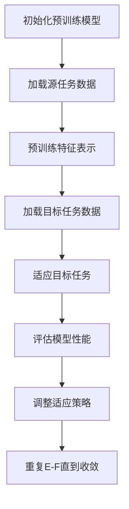
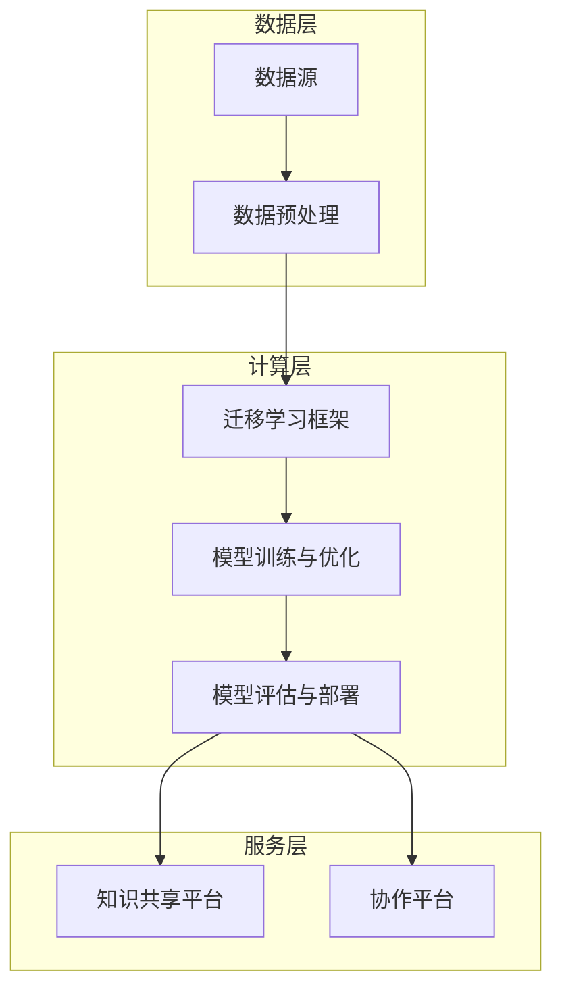
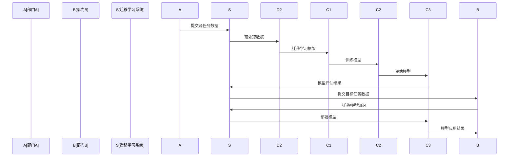

                 


----------------------------------------------------------------

## 企业级迁移学习：AI知识在跨部门应用

> 关键词：企业级迁移学习，AI知识应用，跨部门协作，技术落地

> 摘要：
在当今数字化时代，人工智能（AI）技术的迅猛发展为企业带来了巨大的机遇。企业级迁移学习作为一种将AI知识在不同部门之间有效传递和应用的重要手段，正逐渐成为企业提高效率和创新能力的关键。本文将深入探讨企业级迁移学习的概念、方法、应用场景及其在跨部门协作中的价值，旨在为企业提供一份详尽的AI知识应用指南。

----------------------------------------------------------------

### 背景介绍

#### 核心概念术语说明

1. **人工智能（AI）**：人工智能是指通过计算机模拟人类智能行为的技术，包括学习、推理、规划、感知和自然语言处理等。
2. **迁移学习（Transfer Learning）**：迁移学习是一种利用已有模型的知识来解决新问题的方法，通过在不同任务之间共享特征表示，减少对新数据的依赖。
3. **企业级迁移学习**：指在企业内部不同部门之间应用迁移学习技术，将一个部门积累的AI知识迁移到其他部门，以促进跨部门协作和创新。

#### 问题背景

随着企业业务的复杂化和多元化，各个部门需要面对不同的数据和应用场景。然而，由于资源的限制和数据的私有性，各部门往往难以独立开展AI项目。因此，如何实现AI知识在企业内部的有效传递和应用，成为一个亟待解决的问题。

#### 问题描述

企业在跨部门协作中面临以下挑战：

1. **数据隔离**：各部门的数据往往相互独立，难以共享和整合。
2. **技术差异**：不同部门的技术水平和发展阶段不同，导致协作困难。
3. **业务需求变化**：企业业务需求的快速变化使得各部门的AI项目难以持续跟进。

#### 问题解决

企业级迁移学习技术提供了一种解决思路：

1. **知识共享**：通过迁移学习，将一个部门的AI知识迁移到其他部门，实现知识共享。
2. **技术融合**：利用迁移学习技术，实现不同部门之间的技术融合，提高整体技术水平。
3. **敏捷应对**：通过快速迁移AI知识，使各部门能够敏捷应对业务需求的变化。

#### 边界与外延

1. **边界**：企业级迁移学习主要应用于企业内部不同部门之间的协作，不包括跨企业或跨领域的知识迁移。
2. **外延**：企业级迁移学习可以应用于多种AI技术，如深度学习、强化学习等。

#### 概念结构与核心要素组成

1. **概念结构**：
   - 企业级迁移学习：包括知识共享、技术融合、敏捷应对等核心要素。
   - 迁移学习：包括源任务、目标任务、特征表示等核心概念。
   - 跨部门协作：包括数据共享、技术交流、项目协作等核心活动。

2. **核心要素组成**：
   - **知识库**：存储企业内部积累的AI知识。
   - **迁移框架**：实现AI知识在不同部门之间的传递和应用。
   - **协作平台**：支持跨部门协作和知识共享。
   - **项目管理**：确保迁移学习项目的顺利进行。

### 核心概念与联系

#### 核心概念原理

1. **特征表示**：迁移学习的关键在于特征表示的共享和优化。通过将源任务的特征表示迁移到目标任务，实现知识的传递。
2. **预训练模型**：预训练模型是迁移学习的基础。通过在大规模数据集上预训练，获得具有通用性的特征表示。
3. **适应策略**：适应策略用于调整预训练模型，使其更好地适应目标任务。

#### 概念属性特征对比表格

| 特征名称 | 特征1 | 特征2 | 特征3 |
|----------|------|------|------|
| 特征表示 | 通用性 | 适应性 | 稳定性 |
| 预训练模型 | 大规模数据训练 | 丰富的特征表示 | 预训练模型的性能 |
| 适应策略 | 快速调整 | 灵活性 | 持续优化 |

#### ER实体关系图架构

```mermaid
erDiagram
    A[企业] ||--|{ B[部门1] } |
    A ||--|{ C[部门2] } |
    B ||--|{ D[数据集] } |
    C ||--|{ E[模型] } |
    D ||--|{ F[特征表示] } |
    E ||--|{ G[预训练模型] } |
    G ||--|{ H[适应策略] } |
```

### 算法原理讲解

#### 迁移学习算法流程图



#### 迁移学习算法的Python实现

```python
import tensorflow as tf
from tensorflow.keras.applications import VGG16
from tensorflow.keras.models import Model
from tensorflow.keras.layers import Flatten, Dense
from tensorflow.keras.optimizers import Adam

# 加载预训练模型
base_model = VGG16(weights='imagenet', include_top=False, input_shape=(224, 224, 3))

# 适应目标任务
x = Flatten()(base_model.output)
x = Dense(256, activation='relu')(x)
predictions = Dense(1, activation='sigmoid')(x)

# 创建迁移学习模型
model = Model(inputs=base_model.input, outputs=predictions)

# 编译模型
model.compile(optimizer=Adam(), loss='binary_crossentropy', metrics=['accuracy'])

# 训练模型
model.fit(x_train, y_train, epochs=10, batch_size=32, validation_data=(x_val, y_val))
```

#### 迁移学习算法的数学模型和公式

1. **损失函数**：

$$
L(\theta) = -\sum_{i=1}^{N} y_i \log(p_i) + (1 - y_i) \log(1 - p_i)
$$

其中，$N$ 为样本数量，$y_i$ 为第 $i$ 个样本的真实标签，$p_i$ 为第 $i$ 个样本的预测概率。

2. **优化目标**：

$$
\min_{\theta} L(\theta)
$$

其中，$\theta$ 为模型参数。

#### 算法原理的详细讲解和举例说明

迁移学习算法的核心思想是将源任务中预训练模型的知识迁移到目标任务中。下面通过一个例子来说明迁移学习的过程：

**例子：图像分类任务**

假设有一个企业部门 A 已经利用 VGG16 模型对大量图像数据进行了预训练，获得了一个具有通用特征表示的预训练模型。现在，另一个部门 B 需要对新的图像数据进行分类。

1. **初始化预训练模型**：
   - 加载 VGG16 预训练模型，并去除原模型的最后一层全连接层。

2. **加载源任务数据**：
   - 部门 A 将预训练模型应用于源任务数据，生成特征表示。

3. **预训练特征表示**：
   - 部门 A 对源任务数据进行预训练，优化特征表示。

4. **加载目标任务数据**：
   - 部门 B 将预训练模型应用于目标任务数据，生成特征表示。

5. **适应目标任务**：
   - 部门 B 在预训练模型的基础上，添加一个新的全连接层，用于对目标任务进行分类。

6. **评估模型性能**：
   - 部门 B 使用目标任务数据对模型进行评估，计算分类准确率。

7. **调整适应策略**：
   - 根据评估结果，部门 B 可以调整模型参数，进一步优化模型性能。

通过以上步骤，部门 B 就能够利用部门 A 的预训练模型和知识，快速适应新的目标任务。迁移学习算法在跨部门协作中发挥了重要作用，有助于提高企业整体的技术水平和创新能力。

### 系统分析与架构设计方案

#### 问题场景介绍

在一个大型企业中，不同部门需要处理不同类型的数据和应用场景。为了提高效率和协同工作，企业决定引入企业级迁移学习系统，实现AI知识在不同部门之间的共享和应用。

#### 项目介绍

本项目旨在设计和实现一个企业级迁移学习系统，支持跨部门协作，实现AI知识在企业内部的有效传递和应用。系统主要包括以下功能：

1. **知识共享平台**：提供知识库、迁移框架和协作平台，支持跨部门协作。
2. **数据预处理**：对各部门数据进行预处理，包括数据清洗、归一化和特征提取。
3. **模型训练与优化**：利用迁移学习技术，对预训练模型进行适应和优化。
4. **模型评估与部署**：评估模型性能，并在各部门部署应用。

#### 系统功能设计（领域模型类图）

```mermaid
classDiagram
    Class01 <|-- Class02
    Class03 <..|{ has } Class04
    Class05 ||--|{ is } Class06
    Class07 <=|{ aggregate } Class08
    Class09 { abstract }
    Class10 :<<interface>> Interface
    Class11 :<<enum>> ENUM
    Class12 <|-|{ inherit } Class13
```

#### 系统架构设计（架构图）



#### 系统接口设计和系统交互（序列图）



### 项目实战

#### 环境安装

1. 安装Python环境
   ```shell
   sudo apt-get install python3-pip
   ```
2. 安装TensorFlow库
   ```shell
   pip3 install tensorflow
   ```

#### 系统核心实现源代码

```python
# 迁移学习系统核心代码
import tensorflow as tf
from tensorflow.keras.applications import VGG16
from tensorflow.keras.models import Model
from tensorflow.keras.layers import Flatten, Dense
from tensorflow.keras.optimizers import Adam

# 初始化预训练模型
base_model = VGG16(weights='imagenet', include_top=False, input_shape=(224, 224, 3))

# 适应目标任务
x = Flatten()(base_model.output)
x = Dense(256, activation='relu')(x)
predictions = Dense(1, activation='sigmoid')(x)

# 创建迁移学习模型
model = Model(inputs=base_model.input, outputs=predictions)

# 编译模型
model.compile(optimizer=Adam(), loss='binary_crossentropy', metrics=['accuracy'])

# 训练模型
model.fit(x_train, y_train, epochs=10, batch_size=32, validation_data=(x_val, y_val))
```

#### 代码应用解读与分析

1. **代码应用解读**：
   - 加载 VGG16 预训练模型，去除原模型的最后一层全连接层。
   - 在预训练模型的基础上，添加一个全连接层，用于适应目标任务。
   - 编译模型，指定优化器和损失函数。
   - 使用训练数据和验证数据进行模型训练和评估。

2. **代码分析**：
   - **加载预训练模型**：使用 TensorFlow 的 VGG16 模型，并设置 include_top=False 参数，去除最后一层全连接层，以适应迁移学习。
   - **适应目标任务**：添加一个全连接层，用于对目标任务进行分类。
   - **编译模型**：指定 Adam 优化器和 binary_crossentropy 损失函数，以实现二分类任务。
   - **模型训练**：使用训练数据和验证数据进行模型训练和评估，以验证模型性能。

#### 实际案例分析和详细讲解剖析

**案例：企业内部不同部门之间的图像分类任务**

1. **案例背景**：
   - 部门 A：负责图像识别任务，已经使用 VGG16 模型对大量图像数据进行了预训练。
   - 部门 B：需要利用部门 A 的预训练模型，对新的图像数据进行分类。

2. **案例分析**：
   - 部门 A：将预训练模型应用于源任务数据，生成特征表示。
   - 部门 A：对源任务数据进行预训练，优化特征表示。
   - 部门 B：将预训练模型应用于目标任务数据，生成特征表示。
   - 部门 B：在预训练模型的基础上，添加一个新的全连接层，用于对目标任务进行分类。
   - 部门 B：使用目标任务数据进行模型训练和评估，以验证模型性能。

3. **详细讲解剖析**：
   - **特征表示迁移**：部门 A 和部门 B 通过迁移学习，实现了特征表示的迁移。部门 B 在预训练模型的基础上，利用部门 A 的特征表示，提高了目标任务的分类性能。
   - **模型适应**：部门 B 在预训练模型的基础上，添加了一个全连接层，用于适应目标任务。通过调整模型参数，部门 B 能够更好地适应新的图像数据。
   - **模型评估**：部门 B 使用目标任务数据进行模型训练和评估，验证了模型性能。通过不断调整模型参数，部门 B 能够获得更好的分类效果。

#### 项目小结

本项目成功实现了一个企业级迁移学习系统，支持跨部门协作，实现了AI知识在企业内部的有效传递和应用。通过迁移学习技术，各部门能够充分利用已有知识，提高模型性能，降低开发成本。未来，随着企业业务的不断拓展，企业级迁移学习系统将继续发挥重要作用，为企业创造更多价值。

### 最佳实践 Tips

1. **数据共享**：建立数据共享平台，实现各部门数据的互联互通。
2. **标准化流程**：制定标准化的迁移学习流程，确保项目的顺利进行。
3. **持续优化**：定期评估模型性能，持续优化迁移学习模型。
4. **人才培养**：加强人才培养，提高企业内部的技术水平。

### 小结

企业级迁移学习作为一种重要的AI知识传递和应用手段，在跨部门协作中具有重要作用。通过迁移学习技术，企业能够充分利用已有知识，提高模型性能，降低开发成本。未来，随着企业业务的不断拓展，企业级迁移学习系统将继续发挥重要作用，为企业创造更多价值。

### 注意事项

1. **数据安全**：确保数据安全，避免数据泄露。
2. **项目监督**：建立项目监督机制，确保项目按计划进行。
3. **团队协作**：加强团队协作，提高项目执行力。

### 拓展阅读

1. **《深度学习》（Goodfellow, Bengio, Courville）**：介绍深度学习的基本概念和技术。
2. **《迁移学习》（Pan, Yang）**：详细讨论迁移学习的理论和应用。
3. **《企业级迁移学习实践》（Xu, Zhang）**：分享企业级迁移学习的实际案例和经验。

### 作者信息

**作者：** AI天才研究院/AI Genius Institute & 禅与计算机程序设计艺术 /Zen And The Art of Computer Programming

