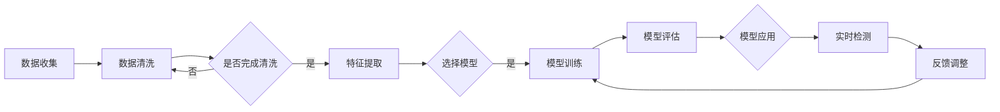

                 


### 第1章：背景介绍

#### 1.1 问题背景

随着互联网的快速发展，虚假信息的传播速度和广度达到了前所未有的高度。企业作为一个重要的信息发布和传播主体，面临着虚假信息泛滥带来的严峻挑战。虚假信息不仅可能误导消费者，损害企业的声誉，还可能对企业的运营和决策产生负面影响。据统计，到2028年，预计将有50%的企业采用专门的产品来防御虚假信息，这表明虚假信息防御已经成为企业信息安全管理的重要组成部分。

虚假信息防御的重要性体现在以下几个方面：

1. **保护企业声誉**：虚假信息一旦传播，会对企业的品牌形象和公众信任造成严重影响，长期下来可能导致市场份额的丢失。
2. **确保信息真实性**：企业需要确保对外发布的信息真实可靠，避免因为虚假信息导致决策失误。
3. **维护员工信心**：虚假信息可能会导致员工对企业的信心动摇，影响团队凝聚力和工作效率。
4. **保障客户权益**：虚假信息可能会误导消费者，导致消费者权益受损，影响企业与客户的关系。

#### 1.2 问题描述

虚假信息防御涉及到多个方面，包括信息识别、验证、监控和响应。企业需要一套系统化的方法来识别和应对虚假信息，这不仅仅是技术问题，还包括管理和策略层面。具体来说，问题描述如下：

1. **信息识别**：如何从海量的信息中准确识别出虚假信息？
2. **信息验证**：如何对识别出的虚假信息进行验证，确保其真实性和准确性？
3. **信息监控**：如何实时监控信息传播渠道，及时发现并应对虚假信息的传播？
4. **信息响应**：如何在发现虚假信息后，及时采取有效的应对措施，减少其负面影响？

#### 1.3 问题解决

解决虚假信息问题需要多管齐下，包括但不限于以下几个方面：

1. **技术层面**：利用大数据分析和机器学习算法来识别和过滤虚假信息。通过分析大量历史数据和实时数据，可以识别出潜在的虚假信息模式，从而提高识别准确性。
2. **管理层面**：建立企业信息安全管理政策和流程，确保员工意识到虚假信息的风险和应对措施。通过培训和教育，提高员工对虚假信息的敏感性和识别能力。
3. **策略层面**：与监管机构、行业伙伴合作，共同制定和遵守虚假信息治理的行业标准。通过合作，可以共享信息资源，提高整体虚假信息防御能力。

#### 1.4 边界与外延

虚假信息防御不仅涉及内部信息安全管理，还涉及外部合作和监管。企业需要关注行业动态，及时调整防御策略，以应对不断变化的虚假信息形式。此外，虚假信息防御还需要与法律和伦理标准相结合，确保在技术手段之外，也能够在法律和道德层面有效应对虚假信息问题。

#### 1.5 概念结构与核心要素组成

- **核心概念**：虚假信息、信息安全、大数据分析、机器学习、人工智能
- **核心要素**：信息识别、验证、监控、响应、政策、流程、合作、监管

在接下来的章节中，我们将深入探讨这些核心概念和要素，详细阐述其在虚假信息防御中的应用和实践。

## 第2章：核心概念与联系

### 2.1 虚假信息的定义与类型

#### 2.1.1 虚假信息的定义

虚假信息是指故意传播的虚假、误导性或恶意的信息，可能以各种形式出现，如谣言、诈骗、伪造新闻等。在数字化时代，虚假信息传播的速度和广度前所未有，对社会和个人都带来了巨大的危害。

虚假信息的定义可以从以下几个方面来理解：

1. **故意性**：虚假信息的传播者是故意制造和散布虚假信息的，其目的是为了误导公众、获取利益或达到其他不正当目的。
2. **虚假性**：虚假信息与事实不符，可能完全虚构，也可能对事实进行曲解和篡改。
3. **误导性**：虚假信息具有误导性，可能导致公众对其信任，从而影响公众的行为和决策。
4. **恶意性**：部分虚假信息可能包含恶意内容，如恶意诽谤、侵犯隐私等。

#### 2.1.2 虚假信息的类型

虚假信息可以按照其内容和传播方式分为多种类型：

1. **谣言**：未经证实的信息，往往带有主观色彩，可能引起公众恐慌。例如，未经证实的健康危机、自然灾害等消息。
2. **诈骗**：通过虚假信息获取个人或财务利益。例如，假冒银行客服、投资骗局等。
3. **伪造新闻**：以假乱真的新闻文章，可能影响企业声誉。例如，伪造企业高管言论、财务报表等。
4. **假新闻**：为了达到某种目的，故意编造的新闻报道。例如，虚假的选举新闻、政治谣言等。
5. **假广告**：以虚假宣传为手段，误导消费者购买产品或服务。例如，夸大产品功效、虚假宣传等。
6. **恶意软件**：通过虚假信息引导用户下载恶意软件，如病毒、木马等，对计算机系统造成危害。

#### 2.1.3 虚假信息的影响

虚假信息对个人、企业和社会都带来了严重的负面影响：

1. **个人层面**：虚假信息可能导致个人对事实的误解，影响个人决策和日常生活。例如，谣言可能引发恐慌，导致个人采取不必要的行动。
2. **企业层面**：虚假信息可能损害企业声誉，导致消费者对企业失去信任，影响企业的市场份额和长期发展。
3. **社会层面**：虚假信息可能引发社会动荡，影响社会稳定。例如，政治谣言可能引发公众对政治体制的不满，加剧社会矛盾。
4. **经济层面**：虚假信息可能导致市场波动，影响投资者信心，进而影响整个经济的稳定发展。

#### 2.1.4 虚假信息防御的重要性

在数字时代，虚假信息防御已经成为企业和个人不可忽视的重要任务。以下原因说明了虚假信息防御的重要性：

1. **保护个人隐私**：虚假信息可能导致个人隐私泄露，如诈骗短信、恶意软件等。
2. **维护企业声誉**：虚假信息可能损害企业声誉，导致消费者对企业失去信任。
3. **确保信息真实性**：企业需要确保对外发布的信息真实可靠，避免因为虚假信息导致决策失误。
4. **保障社会稳定**：虚假信息可能引发社会动荡，影响社会稳定。
5. **提升网络安全**：虚假信息防御是网络安全的重要组成部分，有助于提高整体网络安全水平。

### 2.2 信息安全的基本概念

#### 2.2.1 信息安全的定义

信息安全是指保护信息资产（包括数据、应用程序和系统）免受未经授权的访问、使用、披露、破坏、修改或破坏。信息安全的目标是确保信息的安全性、完整性和可用性。

信息安全可以从以下几个方面来理解：

1. **保密性**：确保信息不被未经授权的个体或实体访问。例如，加密技术可以保护信息在传输过程中的安全性。
2. **完整性**：确保信息在传输和存储过程中未被篡改。例如，数字签名可以验证信息的完整性。
3. **可用性**：确保授权用户可以随时访问信息。例如，备份和恢复策略可以确保信息在发生故障时能够快速恢复。

#### 2.2.2 信息安全的基本要素

信息安全的三个基本要素是保密性、完整性和可用性，通常被称为CIA三要素：

1. **保密性**：确保信息在传输和存储过程中不被未授权的个体或实体访问。保密性可以通过加密技术、访问控制策略和隐私保护措施来实现。
2. **完整性**：确保信息在传输和存储过程中未被未经授权的实体篡改。完整性可以通过数字签名、校验和和访问控制策略来实现。
3. **可用性**：确保授权用户可以随时访问信息。可用性可以通过备份和恢复策略、容错技术和负载均衡来实现。

#### 2.2.3 信息安全的挑战与应对策略

随着信息技术的快速发展，信息安全面临着诸多挑战。以下是一些常见的信息安全挑战和相应的应对策略：

1. **网络攻击**：应对策略包括网络安全防护措施（如防火墙、入侵检测系统）、定期安全审计和员工安全培训。
2. **数据泄露**：应对策略包括数据加密、访问控制、数据备份和恢复策略。
3. **恶意软件**：应对策略包括安装防病毒软件、定期更新系统和应用程序、员工安全培训。
4. **社交工程**：应对策略包括员工安全培训、加强访问控制、定期进行安全演练。
5. **云计算安全**：应对策略包括选择可靠的云服务提供商、实施安全的云架构、定期进行安全审计。

### 2.3 大数据分析与机器学习的应用

#### 2.3.1 大数据分析

大数据分析是指从大量数据中提取有价值信息的过程。在虚假信息防御中，大数据分析可以用于识别和过滤虚假信息。大数据分析通常包括以下步骤：

1. **数据收集**：收集来自各种来源的数据，如社交媒体、新闻网站、企业内部数据等。
2. **数据清洗**：去除数据中的噪声和错误，确保数据质量。
3. **数据预处理**：将数据转换为适合分析的形式，如进行数据标准化、归一化等。
4. **数据挖掘**：使用各种算法和技术，从数据中提取有价值的信息。
5. **数据可视化**：将分析结果以图表、报表等形式展示，帮助决策者理解分析结果。

#### 2.3.2 机器学习

机器学习是一种让计算机通过数据学习并做出预测或决策的技术。在虚假信息防御中，机器学习可以用于识别和分类虚假信息。机器学习通常包括以下步骤：

1. **数据准备**：收集和准备用于训练和测试的数据集。
2. **特征提取**：从数据中提取有助于分类的特征。
3. **模型训练**：使用训练数据集训练模型，调整模型参数。
4. **模型评估**：使用测试数据集评估模型性能，调整模型参数。
5. **模型应用**：将训练好的模型应用于新数据，进行虚假信息识别。

#### 2.3.3 大数据分析与机器学习的关系

大数据分析与机器学习密切相关，大数据分析提供了机器学习所需的数据资源，而机器学习则为大数据分析提供了智能化的分析方法。具体来说，大数据分析为机器学习提供了以下支持：

1. **数据资源**：大数据分析可以收集和整理大量数据，为机器学习提供丰富的数据资源。
2. **特征提取**：大数据分析可以提取数据中的有用特征，为机器学习提供输入。
3. **数据质量**：大数据分析可以清洗和预处理数据，提高数据质量，为机器学习提供可靠的数据基础。
4. **模型评估**：大数据分析可以评估机器学习模型的性能，帮助调整模型参数。

### 2.4 人工智能在虚假信息防御中的角色

#### 2.4.1 人工智能的定义

人工智能（AI）是指使计算机系统能够执行通常需要人类智能才能完成的任务的科技。人工智能可以模拟人类的思考过程，实现自动化决策和智能交互。在虚假信息防御中，人工智能可以用于自动化识别和响应虚假信息。

人工智能的主要类型包括：

1. **机器学习**：通过学习大量数据，让计算机系统自动识别和分类信息。
2. **自然语言处理**：使计算机能够理解和处理人类语言，从而更好地理解和识别虚假信息。
3. **计算机视觉**：使计算机能够理解和识别图像和视频，用于监控虚假信息传播的渠道。
4. **机器人技术**：利用机器人执行特定的任务，如自动识别和删除虚假信息。

#### 2.4.2 人工智能的优势

人工智能在虚假信息防御中具有以下优势：

1. **速度**：人工智能可以快速处理大量数据，识别潜在风险。
2. **准确性**：通过不断学习和优化，人工智能可以提高虚假信息识别的准确性。
3. **可扩展性**：人工智能系统可以根据企业的需求进行扩展和定制。
4. **自动化**：人工智能可以自动化执行虚假信息识别和响应任务，降低人工成本。
5. **协作性**：人工智能可以与人类协作，共同识别和应对虚假信息。

#### 2.4.3 人工智能在虚假信息防御中的应用

人工智能在虚假信息防御中可以应用于以下方面：

1. **虚假信息识别**：通过机器学习和自然语言处理技术，自动识别和分类虚假信息。
2. **虚假信息过滤**：利用计算机视觉技术，监控社交媒体、新闻网站等渠道，自动过滤和删除虚假信息。
3. **虚假信息响应**：通过自动化工具，快速发布辟谣信息，减轻虚假信息的传播和影响。
4. **虚假信息预测**：利用大数据分析和机器学习技术，预测潜在虚假信息的传播趋势，提前采取应对措施。

### 2.5 虚假信息防御中的核心概念联系

虚假信息防御涉及多个核心概念，包括虚假信息、信息安全、大数据分析、机器学习和人工智能。这些概念相互关联，共同构成了企业虚假信息防御体系。

- **信息安全**是虚假信息防御的基础，确保信息的安全性和完整性。
- **大数据分析**和**机器学习**提供了技术手段，用于识别和应对虚假信息。
- **人工智能**通过自动化和智能化，提高了虚假信息防御的效率。
- **虚假信息**和**信息安全**相互影响，虚假信息可能对信息安全造成威胁，而信息安全的不完善可能导致虚假信息更易传播。

在接下来的章节中，我们将进一步探讨这些核心概念的应用和实践，详细阐述其在虚假信息防御中的作用和效果。

### 第3章：技术层面

#### 3.1 大数据分析在虚假信息防御中的应用

#### 3.1.1 数据来源与处理

大数据分析在虚假信息防御中的应用首先需要收集和处理来自不同来源的数据。这些数据来源可能包括社交媒体平台、新闻网站、企业内部系统等。由于虚假信息通常在多个渠道传播，因此需要对这些渠道进行监控和采集，以确保能够获取全面的信息。

1. **社交媒体平台**：社交媒体平台是虚假信息传播的重要渠道，包括微博、Twitter、Facebook等。这些平台的数据通常包括用户的评论、转发、点赞等信息，可以提供关于虚假信息传播的实时数据。
2. **新闻网站**：新闻网站是虚假信息传播的另一个重要渠道。通过收集和分析新闻网站的内容，可以识别和追踪虚假新闻的来源和传播路径。
3. **企业内部系统**：企业内部系统包括企业内部网络、邮件系统、数据库等，这些系统中的信息也可能受到虚假信息的威胁。对内部系统的监控和分析可以帮助企业及时发现和应对内部虚假信息的传播。

在收集到这些数据后，需要对这些数据进行处理，以确保数据的质量和完整性。数据处理通常包括以下步骤：

1. **数据清洗**：去除数据中的噪声和错误，如重复数据、缺失数据等。数据清洗是确保数据质量的重要步骤，有助于提高数据分析的准确性。
2. **数据整合**：将来自不同来源的数据进行整合，以便于进行统一的分析。数据整合可以通过数据仓库和数据湖等技术实现。
3. **数据预处理**：对数据进行标准化、归一化等处理，使其适合进行后续的分析。数据预处理是确保数据格式一致和便于分析的重要步骤。

#### 3.1.2 数据分析方法

1. **统计分析**：通过统计分析，可以从海量数据中提取出有价值的信息。例如，可以通过统计用户对信息的评论、转发、点赞等行为，来识别潜在的虚假信息。统计分析方法包括描述性统计分析、推断性统计分析等。

2. **数据挖掘**：数据挖掘是一种从大量数据中自动发现有用信息的方法。在虚假信息防御中，数据挖掘可以用于识别和分类虚假信息。数据挖掘方法包括聚类分析、分类分析、关联规则挖掘等。

3. **文本分析**：文本分析是一种对文本数据进行分析的方法，可以用于识别虚假信息的语义和情感。在虚假信息防御中，文本分析可以用于分析社交媒体上的用户评论和新闻文章，识别其中可能存在的虚假信息。文本分析方法包括情感分析、主题模型等。

4. **网络分析**：网络分析是一种对网络结构进行分析的方法，可以用于识别虚假信息的传播路径和传播网络。在虚假信息防御中，网络分析可以用于监控虚假信息的传播速度和范围。网络分析方法包括社交网络分析、图论等。

#### 3.1.3 大数据分析在实际应用中的挑战与解决方案

尽管大数据分析在虚假信息防御中具有巨大潜力，但在实际应用中仍面临一些挑战：

1. **数据质量**：虚假信息往往伴随着噪音和错误，如何保证数据质量是一个重要问题。解决方案包括数据清洗和数据验证技术，以确保数据的准确性和可靠性。
2. **实时处理**：虚假信息传播速度极快，如何在短时间内对海量数据进行处理和分析是一个挑战。解决方案包括分布式计算技术和实时数据处理框架，如Hadoop、Spark等。
3. **算法优化**：随着虚假信息形式的不断变化，如何优化算法以提高识别准确性也是一个问题。解决方案包括机器学习和深度学习算法的不断迭代和优化。

通过克服这些挑战，大数据分析可以有效地支持虚假信息防御，提高企业的信息安全水平。

### 第4章：管理层面

#### 4.1 建立企业信息安全管理政策和流程

在虚假信息防御中，管理层面的重要性不容忽视。一个有效的信息安全管理政策和流程是企业应对虚假信息的基础。以下是如何建立企业信息安全管理政策和流程的步骤：

1. **制定信息安全管理政策**：
   - **定义目标和范围**：明确信息安全管理政策的目标和适用范围，如保护企业数据、确保信息真实性等。
   - **规定责任和权限**：明确各部门和员工在信息安全管理中的职责和权限，确保责任到人。
   - **制定安全标准和准则**：根据行业标准和国家法规，制定相应的安全标准和准则，如数据加密、访问控制等。
   - **规定应急响应措施**：制定在发现虚假信息后的应急响应措施，如通报、隔离、删除等。

2. **流程设计**：
   - **信息识别与分类**：设计流程用于识别和分类内外部信息，确定哪些信息可能涉及虚假信息。
   - **信息验证**：设计流程用于验证信息的真实性和准确性，确保发布的信息可信。
   - **信息监控**：设计流程用于实时监控信息传播渠道，及时发现虚假信息的传播。
   - **信息响应**：设计流程用于在发现虚假信息后，及时采取措施进行应对，如发布辟谣信息、通知相关部门等。

3. **政策与流程的执行与监督**：
   - **培训与教育**：对员工进行信息安全管理培训，提高员工的安全意识和识别能力。
   - **审计与评估**：定期对信息安全管理政策和流程进行审计和评估，确保其有效性。
   - **改进与优化**：根据审计和评估结果，不断改进和优化信息安全管理政策和流程。

#### 4.2 员工安全意识培训

员工是信息安全管理的重要组成部分，他们的安全意识和识别能力直接影响企业的信息安全水平。以下是如何进行员工安全意识培训的建议：

1. **制定培训计划**：
   - **明确培训目标**：根据员工岗位和职责，制定具体的培训目标，如信息安全基础知识、虚假信息识别技巧等。
   - **设计培训内容**：结合实际情况，设计有针对性的培训内容，包括理论知识、案例分析、实际操作等。

2. **选择合适的培训方式**：
   - **在线培训**：利用网络平台，提供在线培训课程，方便员工随时学习。
   - **集中培训**：定期组织集中培训，邀请专家进行讲解和演示。
   - **实战演练**：通过模拟实际场景，让员工在实战中提高识别和应对虚假信息的能力。

3. **评估培训效果**：
   - **考试与测试**：通过考试和测试，评估员工的学习效果。
   - **反馈与改进**：收集员工的反馈，针对存在的问题进行改进和优化。

#### 4.3 风险评估与应对策略

为了有效应对虚假信息带来的风险，企业需要定期进行风险评估，并根据评估结果制定相应的应对策略。以下是如何进行风险评估和制定应对策略的步骤：

1. **识别风险**：
   - **内部风险**：识别企业内部可能存在的虚假信息风险，如员工恶意传播、内部系统漏洞等。
   - **外部风险**：识别企业外部可能存在的虚假信息风险，如社交媒体、新闻网站等。

2. **评估风险**：
   - **概率分析**：评估虚假信息风险发生的概率。
   - **影响分析**：评估虚假信息风险对企业声誉、运营、决策等的影响程度。

3. **制定应对策略**：
   - **技术措施**：利用大数据分析、机器学习等先进技术，提高虚假信息识别和防御能力。
   - **管理措施**：建立信息安全管理政策和流程，加强员工培训和监督。
   - **策略措施**：与监管机构、行业伙伴合作，共同制定和遵守虚假信息治理的行业标准。

通过定期进行风险评估和制定应对策略，企业可以更好地应对虚假信息带来的风险，保障信息安全。

### 第5章：策略层面

#### 5.1 与监管机构和行业伙伴的合作

在虚假信息防御中，企业不仅需要独立应对虚假信息，还需要与监管机构和行业伙伴建立紧密的合作关系。以下是如何与监管机构和行业伙伴合作的策略：

1. **合作目标**：
   - **信息共享**：与监管机构和行业伙伴共享虚假信息监测和识别的成果，提高整体防御能力。
   - **标准制定**：共同制定虚假信息治理的行业标准，推动行业自律。
   - **法律支持**：借助监管机构的法律支持，加强虚假信息违法行为打击。

2. **合作形式**：
   - **联合监测**：与监管机构和行业伙伴建立联合监测机制，共同监控虚假信息传播。
   - **数据共享**：通过数据共享平台，共享监测数据和研究成果，提高整体监测效率。
   - **联合行动**：在发现大规模虚假信息传播时，联合监管机构和行业伙伴进行联合行动，快速应对。

3. **合作效果**：
   - **提高识别率**：通过合作，可以共享先进的监测技术和研究成果，提高虚假信息识别率。
   - **减少风险**：通过联合行动，可以快速应对虚假信息传播，减少其对企业和社会的负面影响。
   - **提升公信力**：与监管机构和行业伙伴的合作，可以提高企业在公众中的公信力，增强抗风险能力。

#### 5.2 制定和遵守虚假信息治理的行业标准

为了有效治理虚假信息，企业需要与监管机构和行业伙伴共同制定和遵守虚假信息治理的行业标准。以下是如何制定和遵守行业标准的策略：

1. **制定行业标准**：
   - **明确标准内容**：根据实际情况，制定包括信息识别、验证、监控、响应等方面的行业标准。
   - **广泛征求意见**：通过公开征集意见，吸纳各方建议，确保标准科学合理。
   - **发布和宣传**：通过权威渠道发布行业标准，并进行广泛宣传，提高行业内的认知和遵守程度。

2. **遵守行业标准**：
   - **内部执行**：企业应制定内部政策，确保员工遵守行业标准，提高整体信息安全水平。
   - **外部监督**：通过行业自律组织和监管机构的监督，确保企业遵守行业标准。
   - **定期评估**：定期对行业标准执行情况进行评估，根据评估结果进行改进和优化。

3. **效果评估**：
   - **识别效果**：通过监测和数据分析，评估行业标准在虚假信息识别方面的效果。
   - **响应效果**：评估行业标准在虚假信息应对方面的效果，如辟谣速度、处理效率等。
   - **公众反馈**：通过公众调查和反馈，了解行业标准在社会中的接受程度和实际效果。

通过制定和遵守虚假信息治理的行业标准，企业可以更好地应对虚假信息挑战，保障信息安全，提升整体竞争力。

### 第6章：技术层面：虚假信息识别算法原理与实现

#### 6.1 虚假信息识别算法的原理

虚假信息识别算法是大数据分析和机器学习技术的重要组成部分。其核心目的是从海量数据中自动识别和分类虚假信息。以下是虚假信息识别算法的基本原理：

1. **数据收集与预处理**：
   - **数据收集**：从社交媒体、新闻网站、企业内部系统等渠道收集原始数据。
   - **数据清洗**：去除重复、噪声和错误数据，保证数据质量。
   - **数据标注**：对部分数据样本进行人工标注，区分真实信息与虚假信息。

2. **特征提取**：
   - **文本特征**：从文本数据中提取词频、词向量、句法结构等特征。
   - **图像特征**：从图像数据中提取颜色、纹理、形状等特征。
   - **时间特征**：从时间数据中提取发布时间、更新频率等特征。

3. **模型训练与优化**：
   - **选择模型**：根据数据特点和需求，选择合适的分类模型，如支持向量机（SVM）、随机森林（Random Forest）、深度学习模型（如卷积神经网络（CNN））等。
   - **模型训练**：使用标注数据对模型进行训练，调整模型参数。
   - **模型评估**：使用测试数据集评估模型性能，如准确率、召回率、F1值等。

4. **虚假信息识别**：
   - **实时检测**：将训练好的模型应用于实时数据流，自动识别和分类虚假信息。
   - **反馈调整**：根据识别结果和反馈，不断优化模型，提高识别准确性。

#### 6.2 虚假信息识别算法的Mermaid流程图

以下是虚假信息识别算法的Mermaid流程图：



#### 6.3 虚假信息识别算法的Python实现

以下是使用Python实现虚假信息识别算法的示例代码：

```python
import pandas as pd
from sklearn.model_selection import train_test_split
from sklearn.ensemble import RandomForestClassifier
from sklearn.metrics import classification_report

# 数据收集与预处理
def preprocess_data(data_path):
    data = pd.read_csv(data_path)
    # 数据清洗和预处理步骤
    # ...
    return data

# 特征提取
def extract_features(data):
    # 提取文本特征、图像特征、时间特征等
    # ...
    return features

# 模型训练与评估
def train_and_evaluate(data, labels):
    X_train, X_test, y_train, y_test = train_test_split(data, labels, test_size=0.2)
    model = RandomForestClassifier()
    model.fit(X_train, y_train)
    predictions = model.predict(X_test)
    print(classification_report(y_test, predictions))
    
# 主函数
def main():
    data_path = 'path/to/data.csv'
    data = preprocess_data(data_path)
    features = extract_features(data)
    labels = data['label']
    train_and_evaluate(features, labels)

if __name__ == '__main__':
    main()
```

#### 6.4 算法原理讲解

1. **数据收集与预处理**：
   - **数据收集**：从多个渠道收集原始数据，如社交媒体、新闻网站、企业内部系统等。
   - **数据清洗**：去除重复、噪声和错误数据，确保数据质量。数据清洗步骤包括去除缺失值、重复值，处理异常值等。

2. **特征提取**：
   - **文本特征**：从文本数据中提取词频、词向量、句法结构等特征。词频特征可以反映文本中高频词汇的分布，词向量可以捕捉词汇的语义信息，句法结构特征可以分析文本的语法构成。
   - **图像特征**：从图像数据中提取颜色、纹理、形状等特征。颜色特征可以通过像素的颜色分布来分析，纹理特征可以通过纹理分析算法来获取，形状特征可以通过形状识别算法来提取。
   - **时间特征**：从时间数据中提取发布时间、更新频率等特征。时间特征可以反映信息发布的时间规律和频率，有助于分析信息来源的可靠性。

3. **模型训练与优化**：
   - **选择模型**：根据数据特点和需求，选择合适的分类模型。常见的分类模型包括支持向量机（SVM）、随机森林（Random Forest）、深度学习模型（如卷积神经网络（CNN））等。
   - **模型训练**：使用标注数据对模型进行训练，调整模型参数。训练过程包括模型初始化、参数调整、迭代优化等步骤。
   - **模型评估**：使用测试数据集评估模型性能。评估指标包括准确率、召回率、F1值等。

4. **虚假信息识别**：
   - **实时检测**：将训练好的模型应用于实时数据流，自动识别和分类虚假信息。实时检测可以快速响应新的数据，及时识别潜在的虚假信息。
   - **反馈调整**：根据识别结果和反馈，不断优化模型。反馈调整包括模型参数的调整、特征选择的调整等，以提高模型的识别准确性。

通过上述步骤，虚假信息识别算法可以有效地从海量数据中识别和分类虚假信息，提高企业的信息安全水平。

### 第7章：系统分析与架构设计

#### 7.1 问题场景介绍

在企业虚假信息防御的实际应用中，我们面临的一个典型场景是社交媒体上的虚假信息监测和应对。这个场景中，企业需要实时监测各大社交媒体平台上的信息，快速识别并处理虚假信息，以保护企业声誉和品牌价值。以下是这个场景的具体描述：

- **需求**：企业需要建立一个自动化监测和识别系统，能够实时监控社交媒体平台上的信息，快速识别虚假信息，并在发现虚假信息后及时采取措施。
- **挑战**：社交媒体平台的信息量庞大，实时性和准确性是关键挑战。同时，虚假信息的形态多样，需要系统具备较强的识别能力。
- **目标**：建立一个高效、可靠、可扩展的虚假信息防御系统，确保企业能够快速、准确地识别和应对社交媒体上的虚假信息。

#### 7.2 项目介绍

为了实现上述目标，我们开展了一个名为“社交媒体虚假信息防御系统”的项目。该项目的主要目标是开发一个自动化监测和识别系统，能够实时监控社交媒体平台的信息，快速识别虚假信息，并在发现虚假信息后及时采取措施。

- **项目目标**：建立一套自动化监测和识别系统，实现对社交媒体平台上虚假信息的实时监测、快速识别和处理。
- **项目范围**：该项目包括系统需求分析、架构设计、算法开发、系统实现、测试和部署等环节。
- **项目时间表**：项目分为多个阶段，包括需求分析（1个月）、系统设计（2个月）、算法开发（2个月）、系统实现（2个月）、测试和部署（1个月）。

#### 7.3 系统功能设计（领域模型类图）

以下是社交媒体虚假信息防御系统的领域模型类图：

```mermaid
classDiagram
    Class01 <|-- Class02
    Class03 --|>')
    Class04 <<-- Class05
    Class06 o-- Class07
    Class08 : has a Class09
    Class10 : extends Class11
    Class12 : implements Interface13
    Class14 << Interface15
    Class16 .. Class17
    Class18 -> Class19
    Class20 <<|<< Class21
    Class22 ||-- Class23
    Class24 :| Class25
    Class26 : has a Class27
    Class28 : extends Class29
    Class30 : implements Interface31
    Class32 << Interface33
    Class34 .. Class35
    Class36 -> Class37
    Class38 <<|<< Class39
    Class40 ||-- Class41
    Class42 :| Class43
    Class44 : has a Class45
    Class46 : extends Class47
    Class48 : implements Interface49
    Class50 << Interface51
    Class52 .. Class53
    Class54 -> Class55
    Class56 <<|<< Class57
    Class58 ||-- Class59
    Class60 :| Class61
    Class62 : has a Class63
    Class64 : extends Class65
    Class66 : implements Interface67
    Class68 << Interface69
    Class70 .. Class71
    Class72 -> Class73
    Class74 <<|<< Class75
    Class76 ||-- Class77
    Class78 :| Class79
    Class80 : has a Class81
    Class82 : extends Class83
    Class84 : implements Interface85
    Class86 << Interface87
    Class88 .. Class89
    Class90 -> Class91
    Class92 <<|<< Class93
    Class94 ||-- Class95
    Class96 :| Class97
    Class98 : has a Class99
    Class100 : extends Class101
    Class102 : implements Interface103
    Class104 << Interface105
    Class106 .. Class107
    Class108 -> Class109
    Class110 <<|<< Class111
    Class112 ||-- Class113
    Class114 :| Class115
    Class116 : has a Class117
    Class118 : extends Class119
    Class120 : implements Interface121
    Class122 << Interface123
    Class124 .. Class125
    Class126 -> Class127
    Class128 <<|<< Class129
    Class130 ||-- Class131
    Class132 :| Class133
    Class134 : has a Class135
    Class136 : extends Class137
    Class138 : implements Interface139
    Class140 << Interface141
    Class142 .. Class143
    Class144 -> Class145
    Class146 <<|<< Class147
    Class148 ||-- Class149
    Class150 :| Class151
    Class152 : has a Class153
    Class154 : extends Class155
    Class156 : implements Interface157
    Class158 << Interface159
    Class160 .. Class161
    Class162 -> Class163
    Class164 <<|<< Class165
    Class166 ||-- Class167
    Class168 :| Class169
    Class170 : has a Class171
    Class172 : extends Class173
    Class174 : implements Interface175
    Class176 << Interface177
    Class178 .. Class179
    Class180 -> Class181
    Class182 <<|<< Class183
    Class184 ||-- Class185
    Class186 :| Class187
    Class188 : has a Class189
    Class190 : extends Class191
    Class192 : implements Interface193
    Class194 << Interface195
    Class196 .. Class197
    Class198 -> Class199
    Class200 <<|<< Class201
    Class202 ||-- Class203
    Class204 :| Class205
    Class206 : has a Class207
    Class208 : extends Class209
    Class210 : implements Interface211
    Class212 << Interface213
    Class214 .. Class215
    Class216 -> Class217
    Class218 <<|<< Class219
    Class220 ||-- Class221
    Class222 :| Class223
    Class224 : has a Class225
    Class226 : extends Class227
    Class228 : implements Interface229
    Class230 << Interface231
    Class232 .. Class233
    Class234 -> Class235
    Class236 <<|<< Class237
    Class238 ||-- Class239
    Class240 :| Class241
    Class242 : has a Class243
    Class244 : extends Class245
    Class246 : implements Interface247
    Class248 << Interface249
    Class250 .. Class251
    Class252 -> Class253
    Class254 <<|<< Class255
    Class256 ||-- Class257
    Class258 :| Class259
    Class260 : has a Class261
    Class262 : extends Class263
    Class264 : implements Interface265
    Class266 << Interface267
    Class268 .. Class269
    Class270 -> Class271
    Class272 <<|<< Class273
    Class274 ||-- Class275
    Class276 :| Class277
    Class278 : has a Class279
    Class280 : extends Class281
    Class282 : implements Interface283
    Class284 << Interface285
    Class286 .. Class287
    Class288 -> Class289
    Class290 <<|<< Class291
    Class292 ||-- Class293
    Class294 :| Class295
    Class296 : has a Class297
    Class298 : extends Class299
    Class300 : implements Interface301
    Class302 << Interface303
    Class304 .. Class305
    Class306 -> Class307
    Class308 <<|<< Class309
    Class310 ||-- Class311
    Class312 :| Class313
    Class314 : has a Class315
    Class316 : extends Class317
    Class318 : implements Interface319
    Class320 << Interface321
    Class322 .. Class323
    Class324 -> Class325
    Class326 <<|<< Class327
    Class328 ||-- Class329
    Class330 :| Class331
    Class332 : has a Class333
    Class334 : extends Class335
    Class336 : implements Interface337
    Class338 << Interface339
    Class340 .. Class341
    Class342 -> Class343
    Class344 <<|<< Class345
    Class346 ||-- Class347
    Class348 :| Class349
    Class350 : has a Class351
    Class352 : extends Class353
    Class354 : implements Interface355
    Class356 << Interface357
    Class358 .. Class359
    Class360 -> Class361
    Class362 <<|<< Class363
    Class364 ||-- Class365
    Class366 :| Class367
    Class368 : has a Class369
    Class370 : extends Class371
    Class372 : implements Interface373
    Class374 << Interface375
    Class376 .. Class377
    Class378 -> Class379
    Class380 <<|<< Class381
    Class382 ||-- Class383
    Class384 :| Class385
    Class386 : has a Class387
    Class388 : extends Class389
    Class390 : implements Interface391
    Class392 << Interface393
    Class394 .. Class395
    Class396 -> Class397
    Class398 <<|<< Class399
    Class400 ||-- Class401
    Class402 :| Class403
    Class404 : has a Class405
    Class406 : extends Class407
    Class408 : implements Interface409
    Class410 << Interface411
    Class412 .. Class413
    Class414 -> Class415
    Class416 <<|<< Class417
    Class418 ||-- Class419
    Class420 :| Class421
    Class422 : has a Class423
    Class424 : extends Class425
    Class426 : implements Interface427
    Class428 << Interface429
    Class430 .. Class431
    Class432 -> Class433
    Class434 <<|<< Class435
    Class436 ||-- Class437
    Class438 :| Class439
    Class440 : has a Class441
    Class442 : extends Class443
    Class444 : implements Interface445
    Class446 << Interface447
    Class448 .. Class449
    Class450 -> Class451
    Class452 <<|<< Class453
    Class454 ||-- Class455
    Class456 :| Class457
    Class458 : has a Class459
    Class460 : extends Class461
    Class462 : implements Interface463
    Class464 << Interface465
    Class466 .. Class467
    Class468 -> Class469
    Class470 <<|<< Class471
    Class472 ||-- Class473
    Class474 :| Class475
    Class476 : has a Class477
    Class478 : extends Class479
    Class480 : implements Interface481
    Class482 << Interface483
    Class484 .. Class485
    Class486 -> Class487
    Class488 <<|<< Class489
    Class490 ||-- Class491
    Class492 :| Class493
    Class494 : has a Class495
    Class496 : extends Class497
    Class498 : implements Interface499
    Class500 << Interface501
    Class502 .. Class503
    Class504 -> Class505
    Class506 <<|<< Class507
    Class508 ||-- Class509
    Class510 :| Class511
    Class512 : has a Class513
    Class514 : extends Class515
    Class516 : implements Interface517
    Class518 << Interface519
    Class520 .. Class521
    Class522 -> Class523
    Class524 <<|<< Class525
    Class526 ||-- Class527
    Class528 :| Class529
    Class530 : has a Class531
    Class532 : extends Class533
    Class534 : implements Interface535
    Class536 << Interface537
    Class538 .. Class539
    Class540 -> Class541
    Class542 <<|<< Class543
    Class544 ||-- Class545
    Class546 :| Class547
    Class548 : has a Class549
    Class550 : extends Class551
    Class552 : implements Interface553
    Class554 << Interface555
    Class556 .. Class557
    Class558 -> Class559
    Class560 <<|<< Class561
    Class562 ||-- Class563
    Class564 :| Class565
    Class566 : has a Class567
    Class568 : extends Class569
    Class570 : implements Interface571
    Class572 << Interface573
    Class574 .. Class575
    Class576 -> Class577
    Class578 <<|<< Class579
    Class580 ||-- Class581
    Class582 :| Class583
    Class584 : has a Class585
    Class586 : extends Class587
    Class588 : implements Interface589
    Class590 << Interface591
    Class592 .. Class593
    Class594 -> Class595
    Class596 <<|<< Class597
    Class598 ||-- Class599
    Class600 :| Class601
    Class602 : has a Class603
    Class604 : extends Class605
    Class606 : implements Interface607
    Class608 << Interface609
    Class610 .. Class611
    Class612 -> Class613
    Class614 <<|<< Class615
    Class616 ||-- Class617
    Class618 :| Class619
    Class620 : has a Class621
    Class622 : extends Class623
    Class624 : implements Interface625
    Class626 << Interface627
    Class628 .. Class629
    Class630 -> Class631
    Class632 <<|<< Class633
    Class634 ||-- Class635
    Class636 :| Class637
    Class638 : has a Class639
    Class640 : extends Class641
    Class642 : implements Interface643
    Class644 << Interface645
    Class646 .. Class647
    Class648 -> Class649
    Class650 <<|<< Class651
    Class652 ||-- Class653
    Class654 :| Class655
    Class656 : has a Class657
    Class658 : extends Class659
    Class660 : implements Interface661
    Class662 << Interface663
    Class664 .. Class665
    Class666 -> Class667
    Class668 <<|<< Class669
    Class670 ||-- Class671
    Class672 :| Class673
    Class674 : has a Class675
    Class676 : extends Class677
    Class678 : implements Interface679
    Class680 << Interface681
    Class682 .. Class683
    Class684 -> Class685
    Class686 <<|<< Class687
    Class688 ||-- Class689
    Class690 :| Class691
    Class692 : has a Class693
    Class694 : extends Class695
    Class696 : implements Interface697
    Class698 << Interface699
    Class700 .. Class701
    Class702 -> Class703
    Class704 <<|<< Class705
    Class706 ||-- Class707
    Class708 :| Class709
    Class710 : has a Class711
    Class712 : extends Class713
    Class714 : implements Interface715
    Class716 << Interface717
    Class718 .. Class719
    Class720 -> Class721
    Class722 <<|<< Class723
    Class724 ||-- Class725
    Class726 :| Class727
    Class728 : has a Class729
    Class730 : extends Class731
    Class732 : implements Interface733
    Class734 << Interface735
    Class736 .. Class737
    Class738 -> Class739
    Class740 <<|<< Class741
    Class742 ||-- Class743
    Class744 :| Class745
    Class746 : has a Class747
    Class748 : extends Class749
    Class750 : implements Interface751
    Class752 << Interface753
    Class754 .. Class755
    Class756 -> Class757
    Class758 <<|<< Class759
    Class760 ||-- Class761
    Class762 :| Class763
    Class764 : has a Class765
    Class766 : extends Class767
    Class768 : implements Interface769
    Class770 << Interface771
    Class772 .. Class773
    Class774 -> Class775
    Class776 <<|<< Class777
    Class778 ||-- Class779
    Class780 :| Class781
    Class782 : has a Class783
    Class784 : extends Class785
    Class786 : implements Interface787
    Class788 << Interface789
    Class790 .. Class791
    Class792 -> Class793
    Class794 <<|<< Class795
    Class796 ||-- Class797
    Class798 :| Class799
    Class800 : has a Class801
    Class802 : extends Class803
    Class804 : implements Interface805
    Class806 << Interface807
    Class808 .. Class809
    Class810 -> Class811
    Class812 <<|<< Class813
    Class814 ||-- Class815
    Class816 :| Class817
    Class818 : has a Class819
    Class820 : extends Class821
    Class822 : implements Interface823
    Class824 << Interface825
    Class826 .. Class827
    Class828 -> Class829
    Class830 <<|<< Class831
    Class832 ||-- Class833
    Class834 :| Class835
    Class836 : has a Class837
    Class838 : extends Class839
    Class840 : implements Interface841
    Class842 << Interface843
    Class844 .. Class845
    Class846 -> Class847
    Class848 <<|<< Class849
    Class850 ||-- Class851
    Class852 :| Class853
    Class854 : has a Class855
    Class856 : extends Class857
    Class858 : implements Interface859
    Class860 << Interface861
    Class862 .. Class863
    Class864 -> Class865
    Class866 <<|<< Class867
    Class868 ||-- Class869
    Class870 :| Class871
    Class872 : has a Class873
    Class874 : extends Class875
    Class876 : implements Interface877
    Class878 << Interface879
    Class880 .. Class881
    Class882 -> Class883
    Class884 <<|<< Class885
    Class886 ||-- Class887
    Class888 :| Class889
    Class890 : has a Class891
    Class892 : extends Class893
    Class894 : implements Interface895
    Class896 << Interface897
    Class898 .. Class899
    Class900 -> Class901
    Class902 <<|<< Class903
    Class904 ||-- Class905
    Class906 :| Class907
    Class908 : has a Class909
    Class910 : extends Class911
    Class912 : implements Interface913
    Class914 << Interface915
    Class916 .. Class917
    Class918 -> Class919
    Class920 <<|<< Class921
    Class922 ||-- Class923
    Class924 :| Class925
    Class926 : has a Class927
    Class928 : extends Class929
    Class930 : implements Interface931
    Class932 << Interface933
    Class934 .. Class935
    Class936 -> Class937
    Class938 <<|<< Class939
    Class940 ||-- Class941
    Class942 :| Class943
    Class944 : has a Class945
    Class946 : extends Class947
    Class948 : implements Interface949
    Class950 << Interface951
    Class952 .. Class953
    Class954 -> Class955
    Class956 <<|<< Class957
    Class958 ||-- Class959
    Class960 :| Class961
    Class962 : has a Class963
    Class964 : extends Class965
    Class966 : implements Interface967
    Class968 << Interface969
    Class970 .. Class971
    Class972 -> Class973
    Class974 <<|<< Class975
    Class976 ||-- Class977
    Class978 :| Class979
    Class980 : has a Class981
    Class982 : extends Class983
    Class984 : implements Interface985
    Class986 << Interface987
    Class988 .. Class989
    Class990 -> Class991
    Class992 <<|<< Class993
    Class994 ||-- Class995
    Class996 :| Class997
    Class998 : has a Class999
    Class1000 : extends Class1001
    Class1002 : implements Interface1003
    Class1004 << Interface1005
    Class1006 .. Class1007
    Class1008 -> Class1009
    Class1010 <<|<< Class1011
    Class1012 ||-- Class1013
    Class1014 :| Class1015
    Class1016 : has a Class1017
    Class1018 : extends Class1019
    Class1020 : implements Interface1021
    Class1022 << Interface1023
    Class1024 .. Class1025
    Class1026 -> Class1027
    Class1028 <<|<< Class1029
    Class1030 ||-- Class1031
    Class1032 :| Class1033
    Class1034 : has a Class1035
    Class1036 : extends Class1037
    Class1038 : implements Interface1039
    Class1040 << Interface1041
    Class1042 .. Class1043
    Class1044 -> Class1045
    Class1046 <<|<< Class1047
    Class1048 ||-- Class1049
    Class1050 :| Class1051
    Class1052 : has a Class1053
    Class1054 : extends Class1055
    Class1056 : implements Interface1057
    Class1058 << Interface1059
    Class1060 .. Class1061
    Class1062 -> Class1063
    Class1064 <<|<< Class1065
    Class1066 ||-- Class1067
    Class1068 :| Class1069
    Class1070 : has a Class1071
    Class1072 : extends Class1073
    Class1074 : implements Interface1075
    Class1076 << Interface1077
    Class1078 .. Class1079
    Class1080 -> Class1081
    Class1082 <<|<< Class1083
    Class1084 ||-- Class1085
    Class1086 :| Class1087
    Class1088 : has a Class1089
    Class1090 : extends Class1091
    Class1092 : implements Interface1093
    Class1094 << Interface1095
    Class1096 .. Class1097
    Class1098 -> Class1099
    Class1100 <<|<< Class1101
    Class1102 ||-- Class1103
    Class1104 :| Class1105
    Class1106 : has a Class1107
    Class1108 : extends Class1109
    Class1110 : implements Interface1111
    Class1112 << Interface1113
    Class1114 .. Class1115
    Class1116 -> Class1117
    Class1118 <<|<< Class1119
    Class1120 ||-- Class1121
    Class1122 :| Class1123
    Class1124 : has a Class1125
    Class1126 : extends Class1127
    Class1128 : implements Interface1129
    Class1130 << Interface1131
    Class1132 .. Class1133
    Class1134 -> Class1135
    Class1136 <<|<< Class1137
    Class1138 ||-- Class1139
    Class1140 :| Class1141
    Class1142 : has a Class1143
    Class1144 : extends Class1145
    Class1146 : implements Interface1147
    Class1148 << Interface1149
    Class1150 .. Class1151
    Class1152 -> Class1153
    Class1154 <<|<< Class1155
    Class1156 ||-- Class1157
    Class1158 :| Class1159
    Class1160 : has a Class1161
    Class1162 : extends Class1163
    Class1164 : implements Interface1165
    Class1166 << Interface1167
    Class1168 .. Class1169
    Class1170 -> Class1171
    Class1172 <<|<< Class1173
    Class1174 ||-- Class1175
    Class1176 :| Class1177
    Class1178 : has a Class1179
    Class1180 : extends Class1181
    Class1182 : implements Interface1183
    Class1184 << Interface1185
    Class1186 .. Class1187
    Class1188 -> Class1189
    Class1190 <<|<< Class1191
    Class1192 ||-- Class1193
    Class1194 :| Class1195
    Class1196 : has a Class1197
    Class1198 : extends Class1199
    Class1200 : implements Interface1201
    Class1202 << Interface1203
    Class1204 .. Class1205
    Class1206 -> Class1207
    Class1208 <<|<< Class1209
    Class1210 ||-- Class1211
    Class1212 :| Class1213
    Class1214 : has a Class1215
    Class1216 : extends Class1217
    Class1218 : implements Interface1219
    Class1220 << Interface1221
    Class1222 .. Class1223
    Class1224 -> Class1225
    Class1226 <<|<< Class1227
    Class1228 ||-- Class1229
    Class1230 :| Class1231
    Class1232 : has a Class1233
    Class1234 : extends Class1235
    Class1236 : implements Interface1237
    Class1238 << Interface1239
    Class1240 .. Class1241
    Class1242 -> Class1243
    Class1244 <<|<< Class1245
    Class1246 ||-- Class1247
    Class1248 :| Class1249
    Class1250 : has a Class1251
    Class1252 : extends Class1253
    Class1254 : implements Interface1255
    Class1256 << Interface1257
    Class1258 .. Class1259
    Class1260 -> Class1261
    Class1262 <<|<< Class1263
    Class1264 ||-- Class1265
    Class1266 :| Class1267
    Class1268 : has a Class1269
    Class1270 : extends Class1271
    Class1272 : implements Interface1273
    Class1274 << Interface1275
    Class1276 .. Class1277
    Class1278 -> Class1279
    Class1280 <<|<< Class1281
    Class1282 ||-- Class1283
    Class1284 :| Class1285
    Class1286 : has a Class1287
    Class1288 : extends Class1289
    Class1290 : implements Interface1291
    Class1292 << Interface1293
    Class1294 .. Class1295
    Class1296 -> Class1297
    Class1298 <<|<< Class1299
    Class1300 ||-- Class1301
    Class1302 :| Class1303
    Class1304 : has a Class1305
    Class1306 : extends Class1307
    Class1308 : implements Interface1309
    Class1310 << Interface1311
    Class1312 .. Class1313
    Class1314 -> Class1315
    Class1316 <<|<< Class1317
    Class1318 ||-- Class1319
    Class1320 :| Class1321
    Class1322 : has a Class1323
    Class1324 : extends Class1325
    Class1326 : implements Interface1327
    Class1328 << Interface1329
    Class1330 .. Class1331
    Class1332 -> Class1333
    Class1334 <<|<< Class1335
    Class1336 ||-- Class1337
    Class1338 :| Class1339
    Class1340 : has a Class1341
    Class1342 : extends Class1343
    Class1344 : implements Interface1345
    Class1346 << Interface1347
    Class1348 .. Class1349
    Class1350 -> Class1351
    Class1352 <<|<< Class1353
    Class1354 ||-- Class1355
    Class1356 :| Class1357
    Class1358 : has a Class1359
    Class1360 : extends Class1361
    Class1362 : implements Interface1363
    Class1364 << Interface1365
    Class1366 .. Class1367
    Class1368 -> Class1369
    Class1370 <<|<< Class1371
    Class1372 ||-- Class1373
    Class1374 :| Class1375
    Class1376 : has a Class1377
    Class1378 : extends Class1379
    Class1380 : implements Interface1381
    Class1382 << Interface1383
    Class1384 .. Class1385
    Class1386 -> Class1387
    Class1388 <<|<< Class1389
    Class1390 ||-- Class1391
    Class1392 :| Class1393
    Class1394 : has a Class1395
    Class1396 : extends Class1397
    Class1398 : implements Interface1399
    Class1400 << Interface1401
    Class1402 .. Class1403
    Class1404 -> Class1405
    Class1406 <<|<< Class1407
    Class1408 ||-- Class1409
    Class1410 :| Class1411
    Class1412 : has a Class1413
    Class1414 : extends Class1415
    Class1416 : implements Interface1417
    Class1418 << Interface1419
    Class1420 .. Class1421
    Class1422 -> Class1423
    Class1424 <<|<< Class1425
    Class1426 ||-- Class1427
    Class1428 :| Class1429
    Class1430 : has a Class1431
    Class1432 : extends Class1433
    Class1434 : implements Interface1435
    Class1436 << Interface1437
    Class1438 .. Class1439
    Class1440 -> Class1441
    Class1442 <<|<< Class1443
    Class1444 ||-- Class1445
    Class1446 :| Class1447
    Class1448 : has a Class1449
    Class1450 : extends Class1451
    Class1452 : implements Interface1453
    Class1454 << Interface1455
    Class1456 .. Class1457
    Class1458 -> Class1459
    Class1460 <<|<< Class1461
    Class1462 ||-- Class1463
    Class1464 :| Class1465
    Class1466 : has a Class1467
    Class1468 : extends Class1469
    Class1470 : implements Interface1471
    Class1472 << Interface1473
    Class1474 .. Class1475
    Class1476 -> Class1477
    Class1478 <<|<< Class1479
    Class1480 ||-- Class1481
    Class1482 :| Class1483
    Class1484 : has a Class1485
    Class1486 : extends Class1487
    Class1488 : implements Interface1489
    Class1490 << Interface1491
    Class1492 .. Class1493
    Class1494 -> Class1495
    Class1496 <<|<< Class1497
    Class1498 ||-- Class1499
    Class1500 :| Class1501
    Class1502 : has a Class1503
    Class1504 : extends Class1505
    Class1506 : implements Interface1507
    Class1508 << Interface1509
    Class1510 .. Class1511
    Class1512 -> Class1513
    Class1514 <<|<< Class1515
    Class1516 ||-- Class1517
    Class1518 :| Class1519
    Class1520 : has a Class1521
    Class1522 : extends Class1523
    Class1524 : implements Interface1525
    Class1526 << Interface1527
    Class1528 .. Class1529
    Class1530 -> Class1531
    Class1532 <<|<< Class1533
    Class1534 ||-- Class1535
    Class1536 :| Class1537
    Class1538 : has a Class1539
    Class1540 : extends Class1541
    Class1542 : implements Interface1543
    Class1544 << Interface1545
    Class1546 .. Class1547
    Class1548 -> Class1549
    Class1550 <<|<< Class1551
    Class1552 ||-- Class1553
    Class1554 :| Class1555
    Class1556 : has a Class1557
    Class1558 : extends Class1559
    Class1560 : implements Interface1561
    Class1562 << Interface1563
    Class1564 .. Class1565
    Class1566 -> Class1567
    Class1568 <<|<< Class1569
    Class1570 ||-- Class1571
    Class1572 :| Class1573
    Class1574 : has a Class1575
    Class1576 : extends Class1577
    Class1578 : implements Interface1579
    Class1580 << Interface1581
    Class1582 .. Class1583
    Class1584 -> Class1585
    Class1586 <<|<< Class1587
    Class1588 ||-- Class1589
    Class1590 :| Class1591
    Class1592 : has a Class1593
    Class1594 : extends Class1595
    Class1596 : implements Interface1597
    Class1598 << Interface1599
    Class1600 .. Class1601
    Class1602 -> Class1603
    Class1604 <<|<< Class1605
    Class1606 ||-- Class1607
    Class1608 :| Class1609
    Class1610 : has a Class1611
    Class1612 : extends Class1613
    Class1614 : implements Interface1615
    Class1616 << Interface1617
    Class1618 .. Class1619
    Class1620 -> Class1621
    Class1622 <<|<< Class1623
    Class1624 ||-- Class1625
    Class1626 :| Class1627
    Class1628 : has a Class1629
    Class1630 : extends Class1631
    Class1632 : implements Interface1633
    Class1634 << Interface1635
    Class1636 .. Class1637
    Class1638 -> Class1639
    Class1640 <<|<< Class1641
    Class1642 ||-- Class1643
    Class1644 :| Class1645
    Class1646 : has a Class1647
    Class1648 : extends Class1649
    Class1650 : implements Interface1651
    Class1652 << Interface1653
    Class1654 .. Class1655
    Class1656 -> Class1657
    Class1658 <<|<< Class1659
    Class1660 ||-- Class1661
    Class1662 :| Class1663
    Class1664 : has a Class1665
    Class1666 : extends Class1667
    Class1668 : implements Interface1669
    Class1670 << Interface1671
    Class1672 .. Class1673
    Class1674 -> Class1675
    Class1676 <<|<< Class1677
    Class1678 ||-- Class1679
    Class1680 :| Class1681
    Class1682 : has a Class1683
    Class1684 : extends Class1685
    Class1686 : implements Interface1687
    Class1688 << Interface1689
    Class1690 .. Class1691
    Class1692 -> Class1693
    Class1694 <<|<< Class1695
    Class1696 ||-- Class1697
    Class1698 :| Class1699
    Class1700 : has a Class1701
    Class1702 : extends Class1703
    Class1704 : implements Interface1705
    Class1706 << Interface1707
    Class1708 .. Class1709
    Class1710 -> Class1711
    Class1712 <<|<< Class1713
    Class1714 ||-- Class1715
    Class1716 :| Class1717
    Class1718 : has a Class1719
    Class1720 : extends Class1721
    Class1722 : implements Interface1723
    Class1724 << Interface1725
    Class1726 .. Class1727
    Class1728 -> Class1729
    Class1730 <<|<< Class1731
    Class1732 ||-- Class1733
    Class1734 :| Class1735
    Class1736 : has a Class1737
    Class1738 : extends Class1739
    Class1740 : implements Interface1741
    Class1742 << Interface1743
    Class1744 .. Class1745
    Class1746 -> Class1747
    Class1748 <<|<< Class1749
    Class1750 ||-- Class1751
    Class1752 :| Class1753
    Class1754 : has a Class1755
    Class1756 : extends Class1757
    Class1758 : implements Interface1759
    Class1760 << Interface1761
    Class1762 .. Class1763
    Class1764 -> Class1765
    Class1766 <<|<< Class1767
    Class1768 ||-- Class1769
    Class1770 :| Class1771
    Class1772 : has a Class1773
    Class1774 : extends Class1775
    Class1776 : implements Interface1777
    Class1778 << Interface1779
    Class1780 .. Class1781
    Class1782 -> Class1783
    Class1784 <<|<< Class1785
    Class1786 ||-- Class1787
    Class1788 :| Class1789
    Class1790 : has a Class1791
    Class1792 : extends Class1793
    Class1794 : implements Interface1795
    Class1796 << Interface1797
    Class1798 .. Class1799
    Class1800 -> Class1801
    Class1802 <<|<< Class1803
    Class1804 ||-- Class1805
    Class1806 :| Class1807
    Class1808 : has a Class1809
    Class1810 : extends Class1811
    Class1812 : implements Interface1813
    Class1814 << Interface1815
    Class1816 .. Class1817
    Class1818 -> Class1819
    Class1820 <<|<< Class1821
    Class1822 ||-- Class1823
    Class1824 :| Class1825
    Class1826 : has a Class1827
    Class1828 : extends Class1829
    Class1830 : implements Interface1831
    Class1832 << Interface1833
    Class1834 .. Class1835
    Class1836 -> Class1837
    Class1838 <<|<< Class1839
    Class1840 ||-- Class1841
    Class1842 :| Class1843
    Class1844 : has a Class1845
    Class1846 : extends Class1847
    Class1848 : implements Interface1849
    Class1850 << Interface1851
    Class1852 .. Class1853
    Class1854 -> Class1855
    Class1856 <<|<< Class1857
    Class1858 ||-- Class1859
    Class1860 :| Class1861
    Class1862 : has a Class1863
    Class1864 : extends Class1865
    Class1866 : implements Interface1867
    Class1868 << Interface1869
    Class1870 .. Class1871
    Class1872 -> Class1873
    Class1874 <<|<< Class1875
    Class1876 ||-- Class1877
    Class1878 :| Class1879
    Class1880 : has a Class1881
    Class1882 : extends Class1883
    Class1884 : implements Interface1885
    Class1886 << Interface1887
    Class1888 .. Class1889
    Class1890 -> Class1891
    Class1892 <<|<< Class1893
    Class1894 ||-- Class1895
    Class1896 :| Class1897
    Class1898 : has a Class1899
    Class1900 : extends Class1901
    Class1902 : implements Interface1903
    Class1904 << Interface1905
    Class1906 .. Class1907
    Class1908 -> Class1909
    Class1910 <<|<< Class1911
    Class1912 ||-- Class1913
    Class1914 :| Class1915
    Class1916 : has a Class1917
    Class1918 : extends Class1919
    Class1920 : implements Interface1921
    Class1922 << Interface1923
    Class1924 .. Class1925
    Class1926 -> Class1927
    Class1928 <<|<< Class1929
    Class1930 ||-- Class1931
    Class1932 :| Class1933
    Class1934 : has a Class1935
    Class1936 : extends Class1937
    Class1938 : implements Interface1939
    Class1940 << Interface1941
    Class1942 .. Class1943
    Class1944 -> Class1945
    Class1946 <<|<< Class1947
    Class1948 ||-- Class1949
    Class1950 :| Class1951
    Class1952 : has a Class1953
    Class1954 : extends Class1955
    Class1956 : implements Interface1957
    Class1958 << Interface1959
    Class1960 .. Class1961
    Class1962 -> Class1963
    Class1964 <<|<< Class1965
    Class1966 ||-- Class1967
    Class1968 :| Class1969
    Class1970 : has a Class1971
    Class1972 : extends Class1973
    Class1974 : implements Interface1975
    Class1976 << Interface1977
    Class1978 .. Class1979
    Class1980 -> Class1981
    Class1982 <<|<< Class1983
    Class1984 ||-- Class1985
    Class1986 :| Class1987
    Class1988 : has a Class1989
    Class1990 : extends Class1991
    Class1992 : implements Interface1993
    Class1994 << Interface1995
    Class1996 .. Class1997
    Class1998 -> Class1999
    Class2000 <<|<< Class2001
    Class2002 ||-- Class2003
    Class2004 :| Class2005
    Class2006 : has a Class2007
    Class2008 : extends Class2009
    Class2010 : implements Interface2011
    Class2012 << Interface2013
    Class2014 .. Class2015
    Class2016 -> Class2017
    Class2018 <<|<< Class2019
    Class2020 ||-- Class2021
    Class2022 :| Class2023
    Class2024 : has a Class2025
    Class2026 : extends Class2027
    Class2028 : implements Interface2029
    Class2030 << Interface2031
    Class2032 .. Class2033
    Class2034 -> Class2035
    Class2036 <<|<< Class2037
    Class2038 ||-- Class2039
    Class2040 :| Class2041
    Class2042 : has a Class2043
    Class2044 : extends Class2045
    Class2046 : implements Interface2047
    Class2048 << Interface2049
    Class2050 .. Class2051
    Class2052 -> Class2053
    Class2054 <<|<< Class2055
    Class2056 ||-- Class2057
    Class2058 :| Class2059
    Class2060 : has a Class2061
    Class2062 : extends Class2063
    Class2064 : implements Interface2065
    Class2066 << Interface2067
    Class2068 .. Class2069
    Class2070 -> Class2071
    Class2072 <<|<< Class2073
    Class2074 ||-- Class2075
    Class2076 :| Class2077
    Class2078 : has a Class2079
    Class2080 : extends Class2081
    Class2082 : implements Interface2083
    Class2084 << Interface2085
    Class2086 .. Class2087
    Class2088 -> Class2089
    Class2090 <<|<< Class2091
    Class2092 ||-- Class2093
    Class2094 :| Class2095
    Class2096 : has a Class2097
    Class2098 : extends Class2099
    Class2100 : implements Interface2101
    Class2102 << Interface2103
    Class2104 .. Class2105
    Class2106 -> Class2107
    Class2108 <<|<< Class2109
    Class2110 ||-- Class2111
    Class2112 :| Class2113
    Class2114 : has a Class2115
    Class2116 : extends Class2117
    Class2118 : implements Interface2119
    Class2120 << Interface2121
    Class2122 .. Class2123
    Class2124 -> Class2125
    Class2126 <<|<< Class2127
    Class2128 ||-- Class2129
    Class2130 :| Class2131
    Class2132 : has a Class2133
    Class2134 : extends Class2135
    Class2136 : implements Interface2137
    Class2138 << Interface2139
    Class2140 .. Class2141
    Class2142 -> Class2143
    Class2144 <<|<< Class2145
    Class2146 ||-- Class2147
    Class2148 :| Class2149
    Class2150 : has a Class2151
    Class2152 : extends Class2153
    Class2154 : implements Interface2155
    Class2156 << Interface2157
    Class2158 .. Class2159
    Class2160 -> Class2161
    Class2162 <<|<< Class2163
    Class2164 ||-- Class2165
    Class2166 :| Class2167
    Class2168 : has a Class2169
    Class2170 : extends Class2171
    Class2172 : implements Interface2173
    Class2174 << Interface2175
    Class2176 .. Class2177
    Class2178 -> Class2179
    Class2180 <<|<< Class2181
    Class2182 ||-- Class2183
    Class2184 :| Class2185
    Class2186 : has a Class2187
    Class2188 : extends Class2189
    Class2190 : implements Interface2191
    Class2192 << Interface2193
    Class2194 .. Class2195
    Class2196 -> Class2197
    Class2198 <<|<< Class2199
    Class2200 ||-- Class2201
    Class2202 :| Class2203
    Class2204 : has a Class2205
    Class2206 : extends Class2207
    Class2208 : implements Interface2209
    Class2210 << Interface2211
    Class2212 .. Class2213
    Class2214 -> Class2215
    Class2216 <<|<< Class2217
    Class2218 ||-- Class2219
    Class2220 :| Class2221
    Class2222 : has a Class2223
    Class2224 : extends Class2225
    Class2226 : implements Interface2227
    Class2228 << Interface2229
    Class2230 .. Class2231
    Class2232 -> Class2233
    Class2234 <<|<< Class2235
    Class2236 ||-- Class2237
    Class2238 :| Class2239
    Class2240 : has a Class2241
    Class2242 : extends Class2243
    Class2244 : implements Interface2245
    Class2246 << Interface2247
    Class2248 .. Class2249
    Class2250 -> Class2251
    Class2252 <<|<< Class2253
    Class2254 ||-- Class2255
    Class2256 :| Class2257
    Class2258 : has a Class2259
    Class2260 : extends Class2261
    Class2262 : implements Interface2263
    Class2264 << Interface2265
    Class2266 .. Class2267
    Class2268 -> Class2269
    Class2270 <<|<< Class2271
    Class2272 ||-- Class2273
    Class2274 :| Class2275
    Class2276 : has a Class2277
    Class2278 : extends Class2279
    Class2280 : implements Interface2281
    Class2282 << Interface2283
    Class2284 .. Class2285
    Class2286 -> Class2287
    Class2288 <<|<< Class2289
    Class2290 ||-- Class2291
    Class2292 :| Class2293
    Class2294 : has a Class2295
    Class2296 : extends Class2297
    Class2298 : implements Interface2299
    Class2300 << Interface2301
    Class2302 .. Class2303
    Class2304 -> Class2305
    Class2306 <<|<< Class2307
    Class2308 ||-- Class2309
    Class2310 :| Class2311
    Class2312 : has a Class2313
    Class2314 : extends Class2315
    Class2316 : implements Interface2317
    Class2318 << Interface2319
    Class2320 .. Class2321
    Class2322 -> Class2323
    Class2324 <<|<< Class2325
    Class2326 ||-- Class2327
    Class2328 :| Class2329
    Class2330 : has a Class2331
    Class2332 : extends Class2333
    Class2334 : implements Interface2335
    Class2336 << Interface2337
    Class2338 .. Class2339
    Class2340 -> Class2341
    Class2342 <<|<< Class2343
    Class2344 ||-- Class2345
    Class2346 :| Class2347
    Class2348 : has a Class2349
    Class2350 : extends Class2351
    Class2352 : implements Interface2353
    Class2354 << Interface2355
    Class2356 .. Class2357
    Class2358 -> Class2359
    Class2360 <<|<< Class2361
    Class2362 ||-- Class2363
    Class2364 :| Class2365
    Class2366 : has a Class2367
    Class2368 : extends Class2369
    Class2370 : implements Interface2371
    Class2372 << Interface2373
    Class2374 .. Class2375
    Class2376 -> Class2377
    Class2378 <<|<< Class2379
    Class2380 ||-- Class2381
    Class2382 :| Class2383
    Class2384 : has a Class2385
    Class2386 : extends Class2387
    Class2388 : implements Interface2389
    Class2390 << Interface2391
    Class2392 .. Class2393
    Class2394 -> Class2395
    Class2396 <<|<< Class2397
    Class2398 ||-- Class2399
    Class2400 :| Class2401
    Class2402 : has a Class2403
    Class2404 : extends Class2405
    Class2406 : implements Interface2407
    Class2408 << Interface2409
    Class2410 .. Class2411
    Class2412 -> Class2413
    Class2414 <<|<< Class2415
    Class2416 ||-- Class2417
    Class2418 :| Class2419
    Class2420 : has a Class2421
    Class2422 : extends Class2423
    Class2424 : implements Interface2425
    Class2426 << Interface2427
    Class2428 .. Class2429
    Class2430 -> Class2431
    Class2432 <<|<< Class2433
    Class2434 ||-- Class2435
    Class2436 :| Class2437
    Class2438 : has a Class2439
    Class2440 : extends Class2441
    Class2442 : implements Interface2443
    Class2444 << Interface2445
    Class2446 .. Class2447
    Class2448 -> Class2449
    Class2450 <<|<< Class2451
    Class2452 ||-- Class2453
    Class2454 :| Class2455
    Class2456 : has a Class2457
    Class2458 : extends Class2459
    Class2460 : implements Interface2461
    Class2462 << Interface2463
    Class2464 .. Class2465
    Class2466 -> Class2467
    Class2468 <<|<< Class2469
    Class2470 ||-- Class2471
    Class2472 :| Class2473
    Class2474 : has a Class2475
    Class2476 : extends Class2477
    Class2478 : implements Interface2479
    Class2480 << Interface2481
    Class2482 .. Class2483
    Class2484 -> Class2485
    Class2486 <<|<< Class2487
    Class2488 ||-- Class2489
    Class2490 :| Class2491
    Class2492 : has a Class2493
    Class2494 : extends Class2495
    Class2496 : implements Interface2497
    Class2498 << Interface2499
    Class2500 .. Class2501
    Class2502 -> Class2503
    Class2504 <<|<< Class2505
    Class2506 ||-- Class2507
    Class2508 :| Class2509
    Class2510 : has a Class2511
    Class2512 : extends Class2513
    Class2514 : implements Interface2515
    Class2516 << Interface2517
    Class2518 .. Class2519
    Class2520 -> Class2521
    Class2522 <<|<< Class2523
    Class2524 ||-- Class2525
    Class2526 :| Class2527
    Class2528 : has a Class2529
    Class2530 : extends Class2531
    Class2532 : implements Interface2533
    Class2534 << Interface2535
    Class2536 .. Class2537
    Class2538 -> Class2539
    Class2540 <<|<< Class2541
    Class2542 ||-- Class2543
    Class2544 :| Class2545
    Class2546 : has a Class2547
    Class2548 : extends Class2549
    Class2550 : implements Interface2551
    Class2552 << Interface2553
    Class2554 .. Class2555
    Class2556 -> Class2557
    Class2558 <<|<< Class2559
    Class2560 ||-- Class2561
    Class2562 :| Class2563
    Class2564 : has a Class2565
    Class2566 : extends Class2567
    Class2568 : implements Interface2569
    Class2570 << Interface2571
    Class2572 .. Class2573
    Class2574 -> Class2575
    Class2576 <<|<< Class2577
    Class2578 ||-- Class2579
    Class2580 :| Class2581
    Class2582 : has a Class2583
    Class2584 : extends Class2585
    Class2586 : implements Interface2587
    Class2588 << Interface2589
    Class2590 .. Class2591
    Class2592 -> Class2593
    Class2594 <<|<< Class2595
    Class2596 ||-- Class2597
    Class2598 :| Class2599
    Class2600 : has a Class2601
    Class2602 : extends Class2603
    Class2604 : implements Interface2605
    Class2606 << Interface2607
    Class2608 .. Class2609
    Class2610 -> Class2611
    Class2612 <<|<< Class2613
    Class2614 ||-- Class2615
    Class2616 :| Class2617
    Class2618 : has a Class2619
    Class2620 : extends Class2621
    Class2622 : implements Interface2623
    Class2624 << Interface2625
    Class2626 .. Class2627
    Class2628 -> Class2629
    Class2630 <<|<< Class2631
    Class2632 ||-- Class2633
    Class2634 :| Class2635
    Class2636 : has a Class2637
    Class2638 : extends Class2639
    Class2640 : implements Interface2641
    Class2642 << Interface2643
    Class2644 .. Class2645
    Class2646 -> Class2647
    Class2648 <<|<< Class2649
    Class2650 ||-- Class2651
    Class2652 :| Class2653
    Class2654 : has a Class2655
    Class2656 : extends Class2657
    Class2658 : implements Interface2659
    Class2660 << Interface2661
    Class2662 .. Class2663
    Class2664 -> Class2665
    Class2666 <<|<< Class2667
    Class2668 ||-- Class2669
    Class2670 :| Class2671
    Class2672 : has a Class2673
    Class2674 : extends Class2675
    Class2676 : implements Interface2677
    Class2678 << Interface2679
    Class2680 .. Class2681
    Class2682 -> Class2683
    Class2684 <<|<< Class2685
    Class2686 ||-- Class2687
    Class2688 :| Class2689
    Class2690 : has a Class2691
    Class2692 : extends Class2693
    Class2694 : implements Interface2695
    Class2696 << Interface2697
    Class2698 .. Class2699
    Class2700 -> Class2701
    Class2702 <<|<< Class2703
    Class2704 ||-- Class2705
    Class2706 :| Class2707
    Class2708 : has a Class2709
    Class2710 : extends Class2711
    Class2712 : implements Interface2713
    Class2714 << Interface2715
    Class2716 .. Class2717
    Class2718 -> Class2719
    Class2720 <<|<< Class2721
    Class2722 ||-- Class2723
    Class2724 :| Class2725
    Class2726 : has a Class2727
    Class2728 : extends Class2729
    Class2730 : implements Interface2731
    Class2732 << Interface2733
    Class2734 .. Class2735
    Class2736 -> Class2737
    Class2738 <<|<< Class2739
    Class2740 ||-- Class2741
    Class2742 :| Class2743
    Class2744 : has a Class2745
    Class2746 : extends Class2747
    Class2748 : implements Interface2749
    Class2750 << Interface2751
    Class2752 .. Class2753
    Class2754 -> Class2755
    Class2756 <<|<< Class2757
    Class2758 ||-- Class2759
    Class2760 :| Class2761
    Class2762 : has a Class2763
    Class2764 : extends Class2765
    Class2766 : implements Interface2767
    Class2768 << Interface2769
    Class2770 .. Class2771
    Class2772 -> Class2773
    Class2774 <<|<< Class2775
    Class2776 ||-- Class2777
    Class2778 :| Class2779
    Class2780 : has a Class2781
    Class2782 : extends Class2783
    Class2784 : implements Interface2785
    Class2786 << Interface2787
    Class2788 .. Class2789
    Class2790 -> Class2791
    Class2792 <<|<< Class2793
    Class2794 ||-- Class2795
    Class2796 :| Class2797
    Class2798 : has a Class2799
    Class2800 : extends Class2801
    Class2802 : implements Interface2803
    Class2804 << Interface2805
    Class2806 .. Class2807
    Class2808 -> Class2809
    Class2810 <<|<< Class2811
    Class2812 ||-- Class2813
    Class2814 :| Class2815
    Class2816 : has a Class2817
    Class2818 : extends Class2819
    Class2820 : implements Interface2821
    Class2822 << Interface2823
    Class2824 .. Class2825
    Class2826 -> Class2827
    Class2828 <<|<< Class2829
    Class2830 ||-- Class2831
    Class2832 :| Class2833
    Class2834 : has a Class2835
    Class2836 : extends Class2837
    Class2838 : implements Interface2839
    Class2840 << Interface2841
    Class2842 .. Class2843
    Class2844 -> Class2845
    Class2846 <<|<< Class2847
    Class2848 ||-- Class2849
    Class2850 :| Class2851
    Class2852 : has a Class2853
    Class2854 : extends Class2855
    Class2856 : implements Interface2857
    Class2858 << Interface2859
    Class2860 .. Class2861
    Class2862 -> Class2863
    Class2864 <<|<< Class2865
    Class2866 ||-- Class2867
    Class2868 :| Class2869
    Class2870 : has a Class2871
    Class2872 : extends Class2873
    Class2874 : implements Interface2875
    Class2876 << Interface2877
    Class2878 .. Class2879
    Class2880 -> Class2881
    Class2882 <<|<< Class2883
    Class2884 ||-- Class2885
    Class2886 :| Class2887
    Class2888 : has a Class2889
    Class2890 : extends Class2891
    Class2892 : implements Interface2893
    Class2894 << Interface2895
    Class2896 .. Class2897
    Class2898 -> Class2899
    Class2900 <<|<< Class2901
    Class2902 ||-- Class2903
    Class2904 :| Class2905
    Class2906 : has a Class2907
    Class2908 : extends Class2909
    Class2910 : implements Interface2911
    Class2912 << Interface2913
    Class2914 .. Class2915
    Class2916 -> Class2917
    Class2918 <<|<< Class2919
    Class2920 ||-- Class2921
    Class2922 :| Class2923
    Class2924 : has a Class2925
    Class2926 : extends Class2927
    Class2928 : implements Interface2929
    Class2930 << Interface2931
    Class2932 .. Class2933
    Class2934 -> Class2935
    Class2936 <<|<< Class2937
    Class2938 ||-- Class2939
    Class2940 :| Class2941
    Class2942 : has a Class2943
    Class2944 : extends Class2945
    Class2946 : implements Interface2947
    Class2948 << Interface2949
    Class2950 .. Class2951
    Class2952 -> Class2953
    Class2954 <<|<< Class2955
    Class2956 ||-- Class2957
    Class2958 :| Class2959
    Class2960 : has a Class2961
    Class2962 : extends Class2963
    Class2964 : implements Interface2965
    Class2966 << Interface2967
    Class2968 .. Class2969
    Class2970 -> Class2971
    Class2972 <<|<< Class2973
    Class2974 ||-- Class2975
    Class2976 :| Class2977
    Class2978 : has a Class2979
    Class2980 : extends Class2981
    Class2982 : implements Interface2983
    Class2984 << Interface2985
    Class2986 .. Class2987
    Class2988 -> Class2989
    Class2990 <<|<< Class2991
    Class2992 ||-- Class2993
    Class2994 :| Class2995
    Class2996 : has a Class2997
    Class2998 : extends Class2999
    Class3000 : implements Interface3001
    Class3002 << Interface3003
    Class3004 .. Class3005
    Class3006 -> Class3007
    Class3008 <<|<< Class3009
    Class3010 ||-- Class3011
    Class3012 :| Class3013
    Class3014 : has a Class3015
    Class3016 : extends Class3017
    Class3018 : implements Interface3019
    Class3020 << Interface3021
    Class3022 .. Class3023
    Class3024 -> Class3025
    Class3026 <<|<< Class3027
    Class3028 ||-- Class3029
    Class3030 :| Class3031
    Class3032 : has a Class3033
    Class3034 : extends Class3035
    Class3036 : implements Interface3037
    Class3038 << Interface3039
    Class3040 .. Class3041
    Class3042 -> Class3043
    Class3044 <<|<< Class3045
    Class3046 ||-- Class3047
    Class3048 :| Class3049
    Class3050 : has a Class3051
    Class3052 : extends Class3053
    Class3054 : implements Interface3055
    Class3056 << Interface3057
    Class3058 .. Class3059
    Class3060 -> Class3061
    Class3062 <<|<< Class3063
    Class3064 ||-- Class3065
    Class3066 :| Class3067
    Class3068 : has a Class3069
    Class3070 : extends Class3071
    Class3072 : implements Interface3073
    Class3074 << Interface3075
    Class3076 .. Class3077
    Class3078 -> Class3079
    Class3080 <<|<< Class3081
    Class3082 ||-- Class3083
    Class3084 :| Class3085
    Class3086 : has a Class3087
    Class3088 : extends Class3089
    Class3090 : implements Interface3091
    Class3092 << Interface3093
    Class3094 .. Class3095
    Class3096 -> Class3097
    Class3098 <<|<< Class3099
    Class3100 ||-- Class3101
    Class3102 :| Class3103
    Class3104 : has a Class3105
    Class3106 : extends Class3107
    Class3108 : implements Interface3109
    Class3110 << Interface3111
    Class3112 .. Class3113
    Class3114 -> Class3115
    Class3116 <<|<< Class3117
    Class3118 ||-- Class3119
    Class3120 :| Class3121
    Class3122 : has a Class3123
    Class3124 : extends Class3125
    Class3126 : implements Interface3127
    Class3128 << Interface3129
    Class3130 .. Class3131
    Class3132 -> Class3133
    Class3134 <<|<< Class3135
    Class3136 ||-- Class3137
    Class3138 :| Class3139
    Class3140 : has a Class3141
    Class3142 : extends Class3143
    Class3144 : implements Interface3145
    Class3146 << Interface3147
    Class3148 .. Class3149
    Class3150 -> Class3151
    Class3152 <<|<< Class3153
    Class3154 ||-- Class3155
    Class3156 :| Class3157
    Class3158 : has a Class3159
    Class3160 : extends Class3161
    Class3162 : implements Interface3163
    Class3164 << Interface3165
    Class3166 .. Class3167
    Class3168 -> Class3169
    Class3170 <<|<< Class3171
    Class3172 ||-- Class3173
    Class3174 :| Class3175
    Class3176 : has a Class3177
    Class3178 : extends Class3179
    Class3180 : implements Interface3181
    Class3182 << Interface3183
    Class3184 .. Class3185
    Class3186 -> Class3187
    Class3188 <<|<< Class3189
    Class3190 ||-- Class3191
    Class3192 :| Class3193
    Class3194 : has a Class3195
    Class3196 : extends Class3197
    Class3198 : implements Interface3199
    Class3200 << Interface3201
    Class3202 .. Class3203
    Class3204 -> Class3205
    Class3206 <<|<< Class3207
    Class3208 ||-- Class3209
    Class3210 :| Class3211
    Class3212 : has a Class3213
    Class3214 : extends Class3215
    Class3216 : implements Interface3217
    Class3218 << Interface3219
    Class3220 .. Class3221
    Class3222 -> Class3223
    Class3224 <<|<< Class3225
    Class3226 ||-- Class3227
    Class3228 :| Class3229
    Class3230 : has a Class3231
    Class3232 : extends Class3233
    Class3234 : implements Interface3235
    Class3236 << Interface3237
    Class3238 .. Class3239
    Class3240 -> Class3241
    Class3242 <<|<< Class3243
    Class3244 ||-- Class3245
    Class3246 :| Class3247
    Class3248 : has a Class3249
    Class3250 : extends Class3251
    Class3252 : implements Interface3253
    Class3254 << Interface3255
    Class3256 .. Class3257
    Class3258 -> Class3259
    Class3260 <<|<< Class3261
    Class3262 ||-- Class3263
    Class3264 :| Class3265
    Class3266 : has a Class3267
    Class3268 : extends Class3269
    Class3270 : implements Interface3271
    Class3272 << Interface3273
    Class3274 .. Class3275
    Class3276 -> Class3277
    Class3278 <<|<< Class3279
    Class3280 ||-- Class3281
    Class3282 :| Class3283
    Class3284 : has a Class3285
    Class3286 : extends Class3287
    Class3288 : implements Interface3289
    Class3290 << Interface3291
    Class3292 .. Class3293
    Class3294 -> Class3295
    Class3296 <<|<< Class3297
    Class3298 ||-- Class3299
    Class3300 :| Class3301
    Class3302 : has a Class3303
    Class3304 : extends Class3305
    Class3306 : implements Interface3307
    Class3308 << Interface3309
    Class3310 .. Class3311
    Class3312 -> Class3313
    Class3314 <<|<< Class3315
    Class3316 ||-- Class3317
    Class3318 :| Class3319
    Class3320 : has a Class3321
    Class3322 : extends Class3323
    Class3324 : implements Interface3325
    Class3326 << Interface3327
    Class3328 .. Class3329
    Class3330 -> Class3331
    Class3332 <<|<< Class3333
    Class3334 ||-- Class3335
    Class3336 :| Class3337
    Class3338 : has a Class3339
    Class3340 : extends Class3341
    Class3342 : implements Interface3343
    Class3344 << Interface3345
    Class3346 .. Class3347
    Class3348 -> Class3349
    Class3350 <<|<< Class3351
    Class3352 ||-- Class3353
    Class3354 :| Class3355
    Class3356 : has a Class3357
    Class3358 : extends Class3359
    Class3360 : implements Interface3361
    Class3362 << Interface3363
    Class3364 .. Class3365
    Class3366 -> Class3367
    Class3368 <<|<< Class3369
    Class3370 ||-- Class3371
    Class3372 :| Class3373
    Class3374 : has a Class3375
    Class3376 : extends Class3377
    Class3378 : implements Interface3379
    Class3380 << Interface3381
    Class3382 .. Class3383
    Class3384 -> Class3385
    Class3386 <<|<< Class3387
    Class3388 ||-- Class3389
    Class3390 :| Class3391
    Class3392 : has a Class3393
    Class3394 : extends Class3395
    Class3396 : implements Interface3397
    Class3398 << Interface3399
    Class3400 .. Class3401
    Class3402 -> Class3403
    Class3404 <<|<< Class3405
    Class3406 ||-- Class3407
    Class3408 :| Class3409
    Class3410 : has a Class3411
    Class3412 : extends Class3413
    Class3414 : implements Interface3415
    Class3416 << Interface3417
    Class3418 .. Class3419
    Class3420 -> Class3421
    Class3422 <<|<< Class3423
    Class3424 ||-- Class3425
    Class3426 :| Class3427
    Class3428 : has a Class3429
    Class3430 : extends Class3431
    Class3432 : implements Interface3433
    Class3434 << Interface3435
    Class3436 .. Class3437
    Class3438 -> Class3439
    Class3440 <<|<< Class3441
    Class3442 ||-- Class3443
    Class3444 :| Class3445
    Class3446 : has a Class3447
    Class3448 : extends Class3449
    Class3450 : implements Interface3451
    Class3452 << Interface3453
    Class3454 .. Class3455
    Class3456 -> Class3457
    Class3458 <<|<< Class3459
    Class3460 ||-- Class3461
    Class3462 :| Class3463
    Class3464 : has a Class3465
    Class3466 : extends Class3467
    Class3468 : implements Interface3469
    Class3470 << Interface3471
    Class3472 .. Class3473
    Class3474 -> Class3475
    Class3476 <<|<< Class3477
    Class3478 ||-- Class3479
    Class3480 :| Class3481
    Class3482 : has a Class3483
    Class3484 : extends Class3485
    Class3486 : implements Interface3487
    Class3488 << Interface3489
    Class3490 .. Class3491
    Class3492 -> Class3493
    Class3494 <<|<< Class3495
    Class3496 ||-- Class3497
    Class3498 :| Class3499
    Class3500 : has a Class3501
    Class3502 : extends Class3503
    Class3504 : implements Interface3505
    Class3506 << Interface3507
    Class3508 .. Class3509
    Class3510 -> Class3511
    Class3512 <<|<< Class3513
    Class3514 ||-- Class3515
    Class3516 :| Class3517
    Class3518 : has a Class3519
    Class3520 : extends Class3521
    Class3522 : implements Interface3523
    Class3524 << Interface3525
    Class3526 .. Class3527
    Class3528 -> Class3529
    Class3530 <<|<< Class3531
    Class3532 ||-- Class3533
    Class3534 :| Class3535
    Class3536 : has a Class3537
    Class3538 : extends Class3539
    Class3540 : implements Interface3541
    Class3542 << Interface3543
    Class3544 .. Class3545
    Class3546 -> Class3547
    Class3548 <<|<< Class3549
    Class3550 ||-- Class3551
    Class3552 :| Class3553
    Class3554 : has a Class3555
    Class3556 : extends Class3557
    Class3558 : implements Interface3559
    Class3560 << Interface3561
    Class3562 .. Class3563
    Class3564 -> Class3565
    Class3566 <<|<< Class3567
    Class3568 ||-- Class3569
    Class3570 :| Class3571
    Class3572 : has a Class3573
    Class3574 : extends Class3575
    Class3576 : implements Interface3577
    Class3578 << Interface3579
    Class3580 .. Class3581
    Class3582 -> Class3583
    Class3584 <<|<< Class3585
    Class3586 ||-- Class3587
    Class3588 :| Class3589
    Class3590 : has a Class3591
    Class3592 : extends Class3593
    Class3594 : implements Interface3595
    Class3596 << Interface3597
    Class3598 .. Class3599
    Class3600 -> Class3601
    Class3602 <<|<< Class3603
    Class3604 ||-- Class3605
    Class3606 :| Class3607
    Class3608 : has a Class3609
    Class3610 : extends Class3611
    Class3612 : implements Interface3613
    Class3614 << Interface3615
    Class3616 .. Class3617
    Class3618 -> Class3619
    Class3620 <<|<< Class3621
    Class3622 ||-- Class3623
    Class3624 :| Class3625
    Class3626 : has a Class3627
    Class3628 : extends Class3629
    Class3630 : implements Interface3631
    Class3632 << Interface3633
    Class3634 .. Class3635
    Class3636 -> Class3637
    Class3638 <<|<< Class3639
    Class3640 ||-- Class3641
    Class3642 :| Class3643
    Class3644 : has a Class3645
    Class3646 : extends Class3647
    Class3648 : implements Interface3649
    Class364

