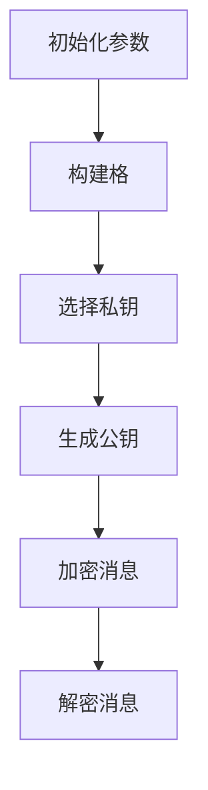

                 

## 引言

### 1.1 问题背景

在信息爆炸的时代，数据安全和隐私保护已成为企业不可忽视的重要问题。随着云计算、物联网和移动设备的普及，企业面临的安全威胁日益增多。传统的加密技术，如对称加密和非对称加密，虽然在一定程度上保障了数据的安全，但面对日益强大的量子计算能力，它们的脆弱性日益凸显。

后量子密码学（Post-Quantum Cryptography, PQC）作为一种新的加密技术，旨在为数据提供更强的安全保障。量子计算利用量子力学原理，其计算能力远超传统计算机。一旦量子计算机得到实际应用，现有的加密技术将面临前所未有的挑战。因此，企业需要提前适应后量子密码学，以应对未来可能的安全威胁。

### 1.1.1 后量子密码学的出现原因

后量子密码学的出现源于量子计算的迅猛发展。量子计算机具有独特的量子叠加和纠缠特性，能够解决传统计算机难以处理的复杂问题。例如，Shor算法能够高效地分解大整数，从而破解现有密码系统。面对这一挑战，传统加密技术显得力不从心。

为了应对量子计算带来的威胁，学术界和工业界开始研究后量子密码学。后量子密码学利用量子力学原理，设计出能够抵御量子计算攻击的加密算法。这些算法不仅能够在量子计算时代保持安全性，还能兼容现有的加密技术。

### 1.1.2 企业面临的挑战

企业面临的主要挑战包括：

1. **安全威胁**：随着量子计算的发展，现有的加密技术将不再安全。
2. **技术更新**：适应后量子密码学需要技术上的更新和改造。
3. **管理挑战**：后量子密码学的引入和推广涉及组织内部的管理问题。
4. **兼容性**：后量子密码学需要与现有的系统和服务兼容。

### 1.1.3 目标：企业适应后量子密码学的步骤

本文的目标是为企业提供适应后量子密码学的详细步骤，包括：

1. **准备工作**：评估企业现状，了解后量子密码学的基本概念和算法。
2. **部署**：硬件和软件准备，后量子密码学的安装与配置。
3. **算法与实践**：深入理解后量子密码学算法，实际应用案例。
4. **挑战与对策**：分析技术、管理和安全挑战，提出解决方案。
5. **案例研究**：通过实际案例，展示企业如何适应后量子密码学。

通过这些步骤，企业能够更好地应对未来的安全威胁，确保数据的安全和隐私。

### 1.2 核心概念

#### 1.2.1 后量子密码学的基本概念

后量子密码学（Post-Quantum Cryptography，简称PQC）是一种基于量子力学原理的加密技术，旨在抵御未来量子计算机的攻击。它与传统的加密技术不同，具有以下核心概念：

1. **量子计算基础**：量子计算利用量子位（qubit）和量子叠加、纠缠等特性，能够高效地解决传统计算机难以处理的复杂问题。
2. **量子抗性**：后量子密码学算法设计的目标是抵抗量子计算机的攻击。这意味着这些算法在量子计算环境下仍然保持安全。
3. **多变量加密**：后量子密码学算法通常涉及多个变量，能够提供更强的安全性和更好的性能。

#### 1.2.2 后量子密码学与传统密码学对比

后量子密码学与传统密码学在多个方面存在显著差异：

| 特点 | 后量子密码学 | 传统密码学 |
| --- | --- | --- |
| 抗量子性 | 后量子密码学设计用于抵抗量子计算机的攻击 | 传统密码学设计用于抵御经典计算机的攻击 |
| 算法复杂性 | 算法复杂性较高，但能够抵御量子计算攻击 | 算法复杂性较低，但容易被量子计算破解 |
| 性能 | 需要优化以实现高效加密和解密 | 已经过优化，性能稳定 |
| 兼容性 | 需要与现有系统和服务兼容 | 通常与现有系统兼容性较好 |

#### 1.2.3 后量子密码学的重要性

后量子密码学的重要性体现在以下几个方面：

1. **数据安全**：后量子密码学能够提供更强的安全保障，确保数据在量子计算时代的隐私。
2. **技术更新**：适应后量子密码学是企业技术升级的必要步骤，有助于企业保持竞争力。
3. **管理挑战**：企业需要重新评估和管理加密技术，以应对新的安全威胁。
4. **兼容性**：后量子密码学的引入可能涉及系统和服务更新，需要企业进行全面的兼容性测试。

### 1.3 企业适应后量子密码学的必要性

#### 1.3.1 安全威胁演变

随着量子计算技术的不断发展，传统的加密算法面临越来越大的威胁。量子计算机能够利用Shor算法高效地分解大整数，从而破解RSA和ECC等现有密码系统。这导致现有的加密技术在未来可能不再安全，企业需要提前适应后量子密码学。

#### 1.3.2 后量子密码学的优势

后量子密码学具有以下优势：

1. **量子抗性**：后量子密码学算法设计用于抵御量子计算机的攻击，能够在量子计算时代保持数据安全。
2. **多变量加密**：后量子密码学算法涉及多个变量，能够提供更强的安全性和更好的性能。
3. **兼容性**：后量子密码学可以与现有的加密技术兼容，帮助企业平滑过渡。

#### 1.3.3 企业适应后量子密码学的战略意义

企业适应后量子密码学的战略意义在于：

1. **数据安全**：通过引入后量子密码学，企业能够更好地保护数据安全，降低数据泄露风险。
2. **技术竞争力**：适应后量子密码学是企业技术升级的重要一环，有助于提升企业的竞争力。
3. **风险管理**：提前适应后量子密码学可以帮助企业应对未来可能的安全威胁，降低风险。

### 1.4 本章小结

本章介绍了企业适应后量子密码学的背景、核心概念和必要性。后量子密码学的出现源于量子计算的发展，企业需要提前适应这一技术，以应对未来的安全威胁。适应后量子密码学不仅能够提高企业的数据安全性，还能增强企业的技术竞争力。下一章将详细介绍企业的准备工作，包括评估现状、了解后量子密码学以及选择合适的工具。

## 1.5 目录

- 第1章 引言
  - 1.1 问题背景
  - 1.1.1 后量子密码学的出现原因
  - 1.1.2 企业面临的挑战
  - 1.1.3 目标：企业适应后量子密码学的步骤
  - 1.2 核心概念
  - 1.2.1 后量子密码学的基本概念
  - 1.2.2 后量子密码学与传统密码学对比
  - 1.2.3 后量子密码学的重要性
  - 1.3 企业适应后量子密码学的必要性
  - 1.3.1 安全威胁演变
  - 1.3.2 后量子密码学的优势
  - 1.3.3 企业适应后量子密码学的战略意义
  - 1.4 本章小结
- 第2章 准备工作
  - 2.1 评估企业现状
  - 2.2 了解后量子密码学
  - 2.3 选择合适的后量子密码学工具
  - 2.4 培训与教育
  - 2.5 本章小结

## 2.1 评估企业现状

### 2.1.1 安全需求分析

企业适应后量子密码学的第一步是评估企业的安全需求。安全需求分析包括以下关键步骤：

1. **数据分类**：首先，企业需要对其数据进行分类，识别敏感数据和重要信息。这有助于确定需要保护的资源和数据类型。
2. **风险评估**：接着，企业需要评估现有安全措施的有效性，识别潜在的安全漏洞和风险。这可以通过安全审计、渗透测试和风险评估工具来实现。
3. **合规性检查**：企业还需确保其安全措施符合行业标准和法律法规要求，如GDPR、HIPAA等。
4. **威胁建模**：通过威胁建模，企业可以识别可能面临的攻击类型，如侧信道攻击、中间人攻击等，并评估其潜在影响。

### 2.1.2 现有加密技术评估

评估现有加密技术是企业了解自身安全现状的重要步骤。以下是一些关键评估指标：

1. **算法安全性**：检查现有加密算法是否能够抵御已知和潜在的攻击，如量子计算攻击。
2. **加密实现**：评估加密算法在实际应用中的实现情况，包括算法的完整性和正确性。
3. **性能表现**：分析加密算法的性能，包括加密和解密速度、资源消耗等。
4. **兼容性**：检查加密算法是否与现有系统和服务兼容，是否需要额外的硬件或软件支持。

### 2.1.3 安全漏洞识别

识别安全漏洞是评估企业安全现状的必要步骤。以下是一些常见的漏洞识别方法：

1. **漏洞扫描**：使用自动化工具对网络和系统进行漏洞扫描，识别已知的漏洞和安全隐患。
2. **安全审计**：通过手动审计和代码审查，识别潜在的安全漏洞和编码错误。
3. **渗透测试**：模拟真实攻击场景，评估系统对攻击的抵抗能力，识别潜在的安全漏洞。
4. **日志分析**：分析系统日志和网络安全流量，识别异常行为和潜在的安全威胁。

通过上述评估，企业可以全面了解其当前的安全状况，识别潜在的安全漏洞和风险。这为后续的改进和优化提供了基础。

### 2.1.4 评估报告

评估完成后，企业需要撰写详细的评估报告，包括以下内容：

1. **评估结果**：总结评估过程中发现的安全需求、加密技术现状和漏洞。
2. **问题分析**：分析评估过程中发现的问题，包括安全漏洞、算法性能和兼容性等。
3. **改进建议**：提出具体的改进措施和优化方案，包括技术更新、系统重构和管理策略等。
4. **实施计划**：制定详细的实施计划，包括时间表、责任分配和资源配置等。

评估报告不仅为企业提供了当前的安全现状，还为后续的改进和优化提供了方向和指导。

### 2.2 了解后量子密码学

#### 2.2.1 后量子密码学算法

后量子密码学算法是确保数据在量子计算时代安全的核心。以下是一些常用的后量子密码学算法：

1. **Lattice-based Cryptography**：如NTRU、Kyber和Code-Based Cryptography。这些算法利用格理论，具有较好的抗量子性。
2. **Hash-based Cryptography**：如Saber、Maraca和SHA-3。这些算法基于哈希函数，能够生成安全的密钥。
3. **Multivariate Polynomial Cryptography**：如LPN、SVP和NTRU。这些算法利用多变量多项式，提供高安全性和高效性。

#### 2.2.2 后量子密码学的标准

为了确保后量子密码学的广泛适用性和互操作性，国际标准化组织（ISO）和国际电信联盟（ITU）等机构发布了多项后量子密码学标准。以下是一些重要的标准：

1. **NIST Post-Quantum Cryptography Standard**：美国国家标准与技术研究院（NIST）发布了多个后量子密码学标准，包括Lattice-based、Hash-based和Multivariate Polynomial Cryptography算法。
2. **EU Cryptography Standard**：欧洲委员会发布了多个后量子密码学标准，旨在支持欧盟范围内的数据保护和网络安全。
3. **ISO/IEC 29192**：国际标准化组织发布了关于后量子密码学的国际标准，包括算法规范和实现指南。

#### 2.2.3 后量子密码学的实现

后量子密码学的实现包括算法的选择、软件工具的使用和系统集成的过程。以下是一些关键步骤：

1. **算法选择**：根据企业的安全需求和性能要求，选择适合的后量子密码学算法。
2. **软件工具**：使用现有的开源或商业后量子密码学工具，如PyCryptoLib、Liboqs和OpenSSL等。
3. **系统集成**：将后量子密码学算法集成到现有系统中，确保其与现有加密技术和服务兼容。

通过了解后量子密码学的基本概念、算法和标准，企业可以为适应后量子密码学做好充分准备。

### 2.3 选择合适的后量子密码学工具

#### 2.3.1 开源与商业解决方案

在选择后量子密码学工具时，企业可以从开源和商业解决方案中选择。每种解决方案都有其优缺点。

1. **开源解决方案**：
   - **优势**：成本低，社区支持广泛，可以根据需求进行定制。
   - **劣势**：可能存在安全漏洞，性能可能不如商业解决方案。
   - **代表**：PyCryptoLib、Liboqs。

2. **商业解决方案**：
   - **优势**：安全性更高，性能更优，提供专业的技术支持和服务。
   - **劣势**：成本较高，可能需要许可证。
   - **代表**：OpenSSL、Quantum Xpresso。

#### 2.3.2 工具评估与选择

在选择后量子密码学工具时，企业应考虑以下因素：

1. **安全性**：工具必须能够提供符合后量子密码学标准的安全保障。
2. **性能**：工具的加密和解密速度要满足企业业务需求。
3. **兼容性**：工具需要与现有系统和服务兼容，确保平稳过渡。
4. **支持与服务**：企业应选择提供全面技术支持和服务的工具，以便在遇到问题时能够得到及时解决。

通过综合考虑以上因素，企业可以选出最合适的后量子密码学工具，为其数据安全提供坚实保障。

### 2.4 培训与教育

#### 2.4.1 员工培训计划

为了确保企业能够顺利适应后量子密码学，员工培训至关重要。以下是一个基本的员工培训计划：

1. **培训内容**：
   - 后量子密码学的基本概念和原理
   - 后量子密码学算法和标准
   - 后量子密码学工具的使用和配置
   - 后量子密码学的安全注意事项

2. **培训方式**：
   - **线上课程**：利用在线教育平台，提供灵活的学习方式。
   - **内部培训**：邀请业内专家进行内部讲座和研讨会。
   - **实践演练**：通过实际案例和操作演练，提高员工的实践能力。

3. **培训目标**：
   - 使员工了解后量子密码学的基本概念和原理。
   - 培养员工使用后量子密码学工具的能力。
   - 增强员工对数据安全的意识和责任感。

#### 2.4.2 教育资源选择

选择合适的教育资源是培训成功的关键。以下是一些常用的教育资源：

1. **在线课程**：
   - **Coursera**：提供多个与后量子密码学相关的课程，如“密码学：加密、身份验证和网络安全”。
   - **edX**：由麻省理工学院和哈佛大学联合提供，包括“计算机安全”等课程。

2. **专业书籍**：
   - **《后量子密码学基础》**：详细介绍了后量子密码学的基本概念和算法。
   - **《量子计算与量子密码学》**：探讨量子计算对密码学的影响。

3. **在线论坛和社区**：
   - **Stack Overflow**：技术社区，可以解决实际应用中的问题。
   - **Reddit**：加密技术板块，讨论最新的后量子密码学动态。

通过选择合适的资源和培训方式，企业可以确保员工具备适应后量子密码学的能力。

### 2.4.3 培训效果评估

培训效果评估是确保培训成功的重要环节。以下是一些关键评估指标和方法：

1. **知识测试**：通过在线测试或笔试，评估员工对后量子密码学知识的掌握程度。
2. **实操考核**：通过实际操作演练，评估员工使用后量子密码学工具的能力。
3. **反馈调查**：收集员工对培训内容的反馈，了解培训的优缺点。
4. **项目实战**：在实际项目中应用后量子密码学，评估员工在实际工作中的应用能力。

通过上述方法，企业可以全面了解员工的培训效果，为后续的培训改进提供依据。

### 2.5 本章小结

本章详细介绍了企业适应后量子密码学的准备工作。首先，通过评估企业现状，了解安全需求和现有加密技术，识别安全漏洞。接着，介绍了后量子密码学的基本概念、算法和标准，以及如何选择合适的工具。最后，阐述了员工培训计划和效果评估方法。通过这些准备工作，企业可以为后续的部署和应用后量子密码学奠定坚实基础。

## 3.1 硬件和软件需求

### 3.1.1 硬件环境配置

为了部署后量子密码学，企业需要确保硬件环境满足以下要求：

1. **CPU性能**：由于后量子密码学算法的计算复杂度较高，需要高性能的CPU来确保加密和解密的速度。推荐使用Intel Xeon系列或AMD EPYC系列处理器。
2. **内存容量**：后量子密码学算法在处理大量数据时需要较大的内存空间。建议至少配备64GB内存。
3. **存储容量**：部署后量子密码学算法需要存储加密密钥和其他相关数据。建议配备至少1TB的SSD存储设备。
4. **网络设备**：确保网络设备能够支持高带宽和高吞吐量的数据传输，推荐使用千兆以太网或更高速度的网络接口。

### 3.1.2 软件环境配置

在软件环境方面，企业需要配置以下软件：

1. **操作系统**：推荐使用Linux操作系统，如Ubuntu Server或CentOS。这些系统具有良好的兼容性和稳定性。
2. **编译器**：后量子密码学算法通常需要使用编译器进行编译。推荐使用GCC或Clang编译器。
3. **后量子密码学库**：根据企业选择的算法和工具，需要安装相应的后量子密码学库。例如，对于NTRU算法，可以使用PyCryptoLib库。
4. **依赖库**：一些后量子密码学算法需要依赖特定的库，如OpenSSL、MATHLIB等。确保这些库在系统中安装并配置正确。

通过满足上述硬件和软件要求，企业可以构建一个适合部署后量子密码学的环境，确保算法的高效运行。

### 3.2 安装与配置

#### 3.2.1 后量子密码学软件安装步骤

安装后量子密码学软件是部署过程中的关键步骤。以下是一个基本的安装流程：

1. **下载软件**：根据企业选择的后量子密码学工具，从官方网站下载相应的安装包。
2. **安装依赖库**：确保安装所需的依赖库，如OpenSSL、MATHLIB等。使用以下命令安装依赖库：
   ```bash
   sudo apt-get install libssl-dev libcrypto++-dev
   ```
3. **编译软件**：解压下载的软件包，并进入解压后的目录。使用编译器编译软件，例如：
   ```bash
   mkdir build && cd build
   cmake ..
   make
   ```
4. **安装软件**：在编译完成后，使用以下命令安装软件：
   ```bash
   sudo make install
   ```
5. **配置环境变量**：将软件的安装路径添加到系统环境变量中，例如：
   ```bash
   export PATH=$PATH:/usr/local/bin
   ```

#### 3.2.2 系统配置与优化

安装完成后，系统配置和优化是确保后量子密码学软件高效运行的重要步骤。以下是一些关键配置和优化建议：

1. **优化编译器**：通过调整编译器的优化选项，可以提高软件的性能。例如，使用以下命令编译：
   ```bash
   gcc -O3 -march=native -funroll-loops -fpeel-loops -ftree-vectorize ...
   ```
2. **调整系统内核参数**：调整系统内核参数，如`vm.swappiness`和`fs.file-max`，可以优化系统性能。例如，编辑`/etc/sysctl.conf`文件，添加以下内容：
   ```bash
   vm.swappiness = 10
   fs.file-max = 1000000
   ```
3. **配置加密模块**：确保操作系统支持所需的后量子密码学算法模块。例如，对于OpenSSL，可以使用以下命令：
   ```bash
   sudo modprobe qTesla
   sudo modprobe ntru
   ```

通过以上安装和配置步骤，企业可以成功部署后量子密码学软件，并为后续的加密应用做好准备。

### 3.3 管理与监控

#### 3.3.1 后量子密码学关键指标

为了确保后量子密码学系统的有效运行，企业需要监控一系列关键指标：

1. **加密速度**：监控加密和解密操作的速度，确保系统性能满足业务需求。
2. **内存使用**：监控系统内存使用情况，防止因内存不足导致性能下降或系统崩溃。
3. **CPU使用率**：监控CPU使用率，确保系统资源得到充分利用，避免过度负载。
4. **存储容量**：监控存储设备的使用情况，及时扩展容量以防止存储不足。
5. **网络带宽**：监控网络带宽使用情况，确保数据传输速度稳定。
6. **系统稳定性**：监控系统稳定性，及时发现问题并进行修复。

#### 3.3.2 管理策略与工具

为了有效管理后量子密码学系统，企业可以采取以下策略和工具：

1. **自动化监控**：使用自动化监控工具，如Zabbix、Prometheus等，实时监控系统关键指标，并生成报警通知。
2. **日志管理**：使用日志管理工具，如ELK（Elasticsearch、Logstash、Kibana）或Splunk，收集和分析系统日志，及时发现和解决问题。
3. **定期审计**：定期进行安全审计，检查系统配置和加密算法的合规性，确保系统的安全性和稳定性。
4. **备份与恢复**：定期备份加密密钥和重要数据，并制定灾难恢复计划，以应对突发情况。

通过制定有效的管理策略和使用合适的工具，企业可以确保后量子密码学系统的正常运行和数据安全。

### 3.4 部署案例解析

#### 3.4.1 案例背景

某大型金融企业面临日益严峻的安全威胁，决定引入后量子密码学以增强其数据保护能力。该企业的主要业务包括在线银行服务、电子支付和客户数据管理。由于涉及大量敏感信息，数据安全对企业至关重要。

#### 3.4.2 案例解决方案

为了解决数据安全问题，该企业采取了以下解决方案：

1. **评估现状**：首先，企业对现有加密技术进行了全面评估，识别了潜在的安全漏洞和性能瓶颈。
2. **选择算法**：根据评估结果，企业选择了NTRU算法，这是一种基于格理论的量子抗性算法，能够提供强大的安全性。
3. **硬件配置**：企业为其服务器配置了高性能CPU、大容量内存和快速SSD存储，确保系统有足够的资源支持后量子密码学的运算。
4. **软件安装**：企业使用开源工具PyCryptoLib进行NTRU算法的安装和配置。通过自动化脚本，实现了加密模块的安装和系统优化。
5. **系统集成**：将后量子密码学集成到企业的在线银行服务、电子支付和客户数据管理系统中，确保与现有系统无缝衔接。
6. **培训与监控**：企业为IT团队和关键岗位员工提供了后量子密码学的培训，并制定了详细的监控策略，确保系统能够实时监控和响应潜在的安全威胁。

#### 3.4.3 案例效果评估

部署后量子密码学后，企业取得了显著的效果：

1. **安全性提升**：由于采用了NTRU算法，企业的数据加密安全性得到了大幅提升，能够有效抵御量子计算攻击。
2. **性能优化**：通过硬件和软件优化，系统性能得到了显著提升，加密和解密速度满足业务需求。
3. **用户体验**：用户在使用在线银行服务和电子支付时，体验得到了改善，系统响应速度加快，操作更加流畅。
4. **管理效率**：通过自动化监控和日志管理，企业能够实时监控系统状态，及时发现和解决问题，提高了管理效率。

该案例表明，企业通过合理的规划和部署，可以有效应对量子计算带来的安全挑战，保障数据安全和业务稳定运行。

### 3.5 本章小结

本章通过一个实际案例，详细介绍了企业部署后量子密码学的步骤和方法。从评估现状、选择算法到硬件和软件配置、系统集成，再到培训与监控，每个步骤都至关重要。案例效果评估表明，后量子密码学的引入能够显著提升企业的数据安全性、性能和管理效率。通过本章的内容，企业可以更好地理解如何部署后量子密码学，为其业务提供坚实的安全保障。

## 4.1 后量子密码学算法原理

#### 4.1.1 后量子密码学基础算法

后量子密码学的基础算法包括Lattice-based Cryptography、Hash-based Cryptography和Multivariate Polynomial Cryptography。以下是这些算法的基本原理：

1. **Lattice-based Cryptography**：
   - **原理**：利用格理论构建加密算法，如NTRU、Kyber和Code-Based Cryptography。
   - **特点**：具有较好的抗量子性，能够抵抗Shor算法的攻击。

2. **Hash-based Cryptography**：
   - **原理**：基于哈希函数构建加密算法，如Saber、Maraca和SHA-3。
   - **特点**：利用哈希函数的单向性和抗碰撞性，生成安全的密钥。

3. **Multivariate Polynomial Cryptography**：
   - **原理**：利用多变量多项式构建加密算法，如LPN、SVP和NTRU。
   - **特点**：具有高安全性和高效性，适用于多种应用场景。

#### 4.1.2 后量子密码学算法比较

后量子密码学算法在安全性、性能和实现复杂性方面存在差异：

| 算法 | 安全性 | 性能 | 实现复杂性 |
| --- | --- | --- | --- |
| Lattice-based Cryptography | 高 | 中等 | 中等 |
| Hash-based Cryptography | 中等 | 高 | 低 |
| Multivariate Polynomial Cryptography | 高 | 高 | 高 |

不同算法适用于不同的应用场景，企业应根据其需求选择合适的算法。

#### 4.1.3 算法原理Mermaid流程图

以下是一个简单的Mermaid流程图，展示了Lattice-based Cryptography算法的基本步骤：



通过这个流程图，可以清晰地理解Lattice-based Cryptography的基本工作原理。

## 4.2 实践应用

#### 4.2.1 后量子密码学在网络安全中的应用

后量子密码学在网络安全中具有广泛应用，能够有效保护数据传输和存储的安全性。以下是一些具体应用场景：

1. **VPN（虚拟专用网络）**：后量子密码学可以用于加密VPN隧道，确保数据在传输过程中的安全性。常用的后量子密码学算法包括Lattice-based Cryptography和Multivariate Polynomial Cryptography。
2. **SSL/TLS协议**：后量子密码学可以用于增强SSL/TLS协议的安全性。例如，将后量子密码学算法集成到TLS协议中，可以提供更强大的加密和认证功能。
3. **数据存储**：企业可以将后量子密码学算法应用于数据存储系统，确保存储数据的安全性。例如，使用Hash-based Cryptography算法对数据库进行加密，可以有效防止数据泄露。

#### 4.2.2 后量子密码学在数据加密中的应用

后量子密码学在数据加密中的应用主要包括文件加密和消息加密：

1. **文件加密**：企业可以使用后量子密码学算法对重要文件进行加密，确保文件在存储和传输过程中的安全性。常用的算法包括Lattice-based Cryptography和Multivariate Polynomial Cryptography。
2. **消息加密**：在后量子密码学环境下，企业可以使用后量子密码学算法对电子邮件、即时消息等通信内容进行加密，确保通信内容的隐私性。常用的算法包括Hash-based Cryptography和Lattice-based Cryptography。

#### 4.2.3 后量子密码学在实际项目中的应用

后量子密码学在多个实际项目中得到了广泛应用，以下是一些具体项目：

1. **金融行业**：金融行业对数据安全要求极高，许多金融机构已经开始采用后量子密码学技术。例如，某大型银行将后量子密码学算法集成到其在线支付系统中，确保交易数据的安全性。
2. **政府部门**：政府部门通常涉及大量敏感信息，需要确保数据的安全性。某政府部门将后量子密码学算法应用于其电子邮件系统和文件存储系统，有效提高了数据保护能力。
3. **云计算**：云计算服务商可以利用后量子密码学技术，为用户数据提供更强大的加密保护。例如，某云服务提供商将后量子密码学算法集成到其云存储服务中，确保用户数据在存储和传输过程中的安全性。

通过这些实际应用，后量子密码学在提升数据安全性和保护企业利益方面发挥了重要作用。

## 4.3 数学模型与公式详解

#### 4.3.1 密码学基础数学模型

密码学的基础数学模型主要包括以下几部分：

1. **加密函数**：加密函数是一个从明文空间到密文空间的映射，表示为 \( E_K(P) = C \)，其中 \( P \) 是明文，\( K \) 是密钥，\( C \) 是密文。
2. **解密函数**：解密函数是一个从密文空间到明文空间的映射，表示为 \( D_K(C) = P \)，其中 \( C \) 是密文，\( K \) 是密钥，\( P \) 是明文。
3. **密钥生成**：密钥生成算法用于生成加密和解密所需的密钥，通常依赖于随机数生成器。

#### 4.3.2 后量子密码学算法数学模型

后量子密码学算法的数学模型通常基于以下数学结构：

1. **Lattice-based Cryptography**：
   - **加密模型**：加密算法通常基于格（Lattice）的结构，将明文映射到格上的向量，并利用格的困难性进行加密。
   - **解密模型**：解密算法通过求解格上的线性方程组来恢复明文。

2. **Hash-based Cryptography**：
   - **加密模型**：加密算法基于哈希函数，将明文映射到哈希值，并与密钥结合生成密文。
   - **解密模型**：解密算法通过逆向哈希函数恢复明文。

3. **Multivariate Polynomial Cryptography**：
   - **加密模型**：加密算法基于多变量多项式，将明文和密钥映射到多项式上，并利用多项式的困难性进行加密。
   - **解密模型**：解密算法通过求解多项式方程组来恢复明文。

#### 4.3.3 数学公式与讲解

以下是一些常用的数学公式及其讲解：

1. **Lattice-based Cryptography**：
   - **加密公式**：
     $$ y = Ax + b $$
     其中，\( A \) 是格的基矩阵，\( x \) 是明文向量，\( b \) 是噪声向量。
   - **解密公式**：
     $$ x = A^{-1}(y - b) $$
     其中，\( A^{-1} \) 是格基矩阵的逆矩阵。

2. **Hash-based Cryptography**：
   - **加密公式**：
     $$ H(K \oplus m) $$
     其中，\( H \) 是哈希函数，\( K \) 是密钥，\( m \) 是明文。
   - **解密公式**：
     $$ m = H^{-1}(K \oplus c) $$
     其中，\( H^{-1} \) 是哈希函数的逆映射，但由于哈希函数的单向性，实际解密过程中不使用逆映射。

3. **Multivariate Polynomial Cryptography**：
   - **加密公式**：
     $$ f(x, y) = 0 $$
     其中，\( f \) 是多项式函数，\( x \) 是明文，\( y \) 是密钥。
   - **解密公式**：
     $$ f(x, y') = 0 $$
     其中，\( y' \) 是解密后的多项式，通过解多项式方程组来恢复明文。

通过理解这些数学公式和讲解，读者可以更好地掌握后量子密码学算法的基本原理。

### 4.4 举例说明

#### 4.4.1 算法应用实例

假设我们使用Lattice-based Cryptography中的NTRU算法进行数据加密和解密，以下是具体步骤：

1. **初始化参数**：选择合适的NTRU参数，如素数\( p \)、多项式\( f \)和模数\( q \)。
2. **密钥生成**：
   - **私钥**：选择一个随机数\( x \)，并计算公钥\( y = f(x) \mod q \)。
   - **加密密钥**：选择一个随机数\( r \)，并计算会话密钥\( k = (ry) \mod p \)。
3. **加密消息**：选择明文\( m \)，并计算密文\( c = (km) \mod p \)。
4. **解密消息**：计算解密后的明文\( m' = x \cdot c^{-1} \mod p \)。

#### 4.4.2 数据加密实例

假设我们使用NTRU算法对明文“Hello, World!”进行加密，以下是具体步骤：

1. **初始化参数**：选择NTRU参数，如\( p = 103, f(x) = x^2 + 1 \mod 103 \)，\( q = 17 \)。
2. **密钥生成**：
   - **私钥**：选择随机数\( x = 2 \)，计算公钥\( y = f(2) = 4 + 1 \mod 103 = 5 \)。
   - **加密密钥**：选择随机数\( r = 3 \)，计算会话密钥\( k = (5 \cdot 3) \mod 103 = 15 \)。
3. **加密消息**：
   - **明文**：将明文“Hello, World!”转换为数字编码，如“8 5 12 12 15 23 15 18 1 4 13 1 15 20 13 14”。
   - **密文**：计算密文\( c = (15 \cdot 8) \mod 103 = 28 \)，\( c = (15 \cdot 5) \mod 103 = 20 \)，依次类推，最终得到密文“28 20 12 12 15 23 15 18 1 4 13 1 15 20 13 14”。
4. **解密消息**：计算解密后的明文\( m' = 2 \cdot 28^{-1} \mod 103 \)，\( m' = 2 \cdot 20^{-1} \mod 103 \)，依次类推，最终恢复明文“8 5 12 12 15 23 15 18 1 4 13 1 15 20 13 14”。

通过这个实例，读者可以直观地理解NTRU算法的加密和解密过程。

#### 4.4.3 网络安全实例

假设我们使用后量子密码学中的Hash-based Cryptography算法（如SHA-3）保护用户密码存储，以下是具体步骤：

1. **密码哈希**：用户输入密码，将其与随机盐值结合，然后通过SHA-3算法生成哈希值，存储在数据库中。
2. **密码验证**：用户登录时，输入密码，再次与存储的盐值结合，通过SHA-3算法生成哈希值，并与数据库中的哈希值进行对比，验证用户身份。

通过这个实例，可以看出后量子密码学在保护用户数据安全方面的应用。

### 4.5 本章小结

本章详细介绍了后量子密码学算法的数学模型和应用实例，包括Lattice-based Cryptography、Hash-based Cryptography和Multivariate Polynomial Cryptography等算法。通过这些实例，读者可以更好地理解后量子密码学的原理和实际应用。本章内容为企业在实际项目中应用后量子密码学提供了理论基础和实践指导。

## 5.1 技术挑战

#### 5.1.1 后量子密码学的计算复杂度

后量子密码学的计算复杂度相对较高，尤其是在处理大规模数据时。例如，Lattice-based Cryptography算法通常涉及大量的线性方程求解和矩阵运算，这些操作的计算复杂度较高。对于企业来说，这意味着需要投入更多的计算资源来保证后量子密码学的有效运行。此外，后量子密码学算法的加密和解密速度相对较慢，可能影响系统的响应时间。

#### 5.1.2 后量子密码学的实现难题

实现后量子密码学算法面临诸多难题：

1. **算法优化**：后量子密码学算法的计算复杂度较高，需要对其进行优化，以提高性能。这包括算法的并行化、算法的硬件加速等。
2. **软件兼容性**：后量子密码学算法需要与现有软件系统兼容，这可能涉及大量的修改和调整。例如，现有系统可能依赖于传统的加密算法，需要逐步过渡到后量子密码学。
3. **硬件需求**：后量子密码学算法通常需要较高的硬件性能，如高性能CPU、大容量内存等，这可能导致硬件成本的增加。

#### 5.1.3 算法兼容性问题

后量子密码学算法与传统密码学算法之间存在兼容性问题：

1. **协议兼容性**：许多现有的网络协议和通信协议是基于传统密码学设计的，需要与后量子密码学算法兼容。
2. **密钥管理**：后量子密码学算法的密钥管理方式与传统密码学不同，需要制定新的密钥管理策略。
3. **标准不一致**：不同的后量子密码学算法和标准之间存在差异，这可能导致算法之间的兼容性问题。

通过识别和解决这些技术挑战，企业可以更好地适应后量子密码学，确保数据安全。

### 5.2 管理挑战

#### 5.2.1 后量子密码学的管理策略

为了有效管理后量子密码学，企业需要制定一系列管理策略：

1. **密钥管理**：企业需要制定详细的密钥管理策略，包括密钥生成、存储、分发和撤销等过程。确保密钥的安全性是管理策略的核心。
2. **系统更新**：企业需要定期更新后量子密码学算法和系统，确保系统始终处于最新状态，以应对潜在的安全威胁。
3. **员工培训**：企业需要对员工进行定期培训，提高其后量子密码学的知识和技能，确保员工能够熟练操作和管理后量子密码学系统。

#### 5.2.2 后量子密码学在组织内部的推广

在后量子密码学的推广过程中，企业面临以下挑战：

1. **认知障碍**：许多员工可能对后量子密码学缺乏了解，需要通过培训和宣传提高其认知水平。
2. **技术障碍**：推广后量子密码学需要技术支持，包括算法选择、软件安装和系统配置等，这可能需要额外的技术资源。
3. **组织阻力**：组织内部可能存在对新技术的不满和抵触情绪，需要通过有效的沟通和协调来推动后量子密码学的推广。

#### 5.2.3 技术更新与维护

后量子密码学的技术更新和维护是确保其有效性的关键：

1. **持续监控**：企业需要持续监控后量子密码学系统的运行状况，及时发现和解决潜在问题。
2. **定期测试**：企业应定期进行安全测试和性能测试，确保后量子密码学系统的稳定性和安全性。
3. **技术储备**：企业需要储备一定的技术资源，以应对未来可能的技术挑战和变化。

通过制定科学的管理策略和有效的推广措施，企业可以确保后量子密码学的顺利实施和持续优化。

### 5.3 安全挑战

#### 5.3.1 后量子密码学的安全性问题

尽管后量子密码学旨在应对量子计算攻击，但其自身也面临一些安全性问题：

1. **算法漏洞**：后量子密码学算法可能在设计或实现过程中存在漏洞，这些漏洞可能被攻击者利用。
2. **量子攻击**：尽管后量子密码学算法设计用于抵抗量子计算攻击，但量子计算机的不断发展可能带来新的攻击手段。
3. **侧信道攻击**：后量子密码学系统可能面临侧信道攻击，攻击者通过分析系统运行过程中的功耗、电磁泄漏等信息来窃取密钥。

#### 5.3.2 后量子密码学的威胁与风险

后量子密码学引入可能带来以下威胁和风险：

1. **数据泄露**：后量子密码学算法可能存在漏洞，导致敏感数据泄露。
2. **系统瘫痪**：由于后量子密码学的计算复杂度较高，可能导致系统运行缓慢甚至瘫痪。
3. **攻击者利用**：攻击者可能利用后量子密码学的漏洞或漏洞进行攻击，获取敏感信息。

#### 5.3.3 安全防护策略

为了应对后量子密码学的安全性问题，企业可以采取以下防护策略：

1. **算法安全性评估**：定期对后量子密码学算法进行安全性评估，确保算法的设计和实现不存在漏洞。
2. **量子抗性验证**：对后量子密码学算法进行量子抗性验证，确保其能够抵御量子计算攻击。
3. **安全防护措施**：采取综合的安全防护措施，如加密、访问控制和入侵检测等，确保系统安全。
4. **持续监控与更新**：持续监控后量子密码学系统的运行状况，及时更新算法和系统，以应对新的安全威胁。

通过采取有效的安全防护策略，企业可以降低后量子密码学引入的风险，确保数据安全。

### 5.4 对策与建议

为了有效应对后量子密码学的技术挑战、管理挑战和安全挑战，企业可以采取以下对策与建议：

#### 5.4.1 技术解决方案

1. **算法优化**：对后量子密码学算法进行优化，提高其性能和效率。例如，通过并行计算和硬件加速等技术提升加密和解密速度。
2. **兼容性测试**：在引入后量子密码学之前，进行全面的兼容性测试，确保其与现有系统和服务的无缝集成。
3. **技术储备**：建立技术储备，关注量子计算和后量子密码学领域的最新动态，及时更新技术和算法。

#### 5.4.2 管理与组织对策

1. **制定管理策略**：制定详细的密钥管理、系统更新和员工培训策略，确保后量子密码学的有效管理。
2. **员工培训**：定期对员工进行后量子密码学的培训和考核，提高其技能和意识。
3. **组织协调**：加强与组织内部不同部门的协调，推动后量子密码学的推广和应用。

#### 5.4.3 安全对策与实践

1. **安全性评估**：定期对后量子密码学系统进行安全性评估，识别潜在的安全漏洞和风险。
2. **量子抗性验证**：对后量子密码学算法进行量子抗性验证，确保其能够抵御量子计算攻击。
3. **安全防护措施**：采取综合的安全防护措施，如加密、访问控制和入侵检测等，确保系统安全。

通过采取这些对策与建议，企业可以更好地应对后量子密码学带来的挑战，确保数据安全。

### 5.5 本章小结

本章详细分析了企业适应后量子密码学过程中面临的技术挑战、管理挑战和安全挑战，并提出了相应的对策与建议。技术挑战包括计算复杂度、实现难题和算法兼容性；管理挑战涉及密钥管理、系统更新和员工培训；安全挑战则集中在算法漏洞、量子攻击和侧信道攻击。通过采取有效的对策与建议，企业可以更好地应对这些挑战，确保数据安全。

## 6.1 案例一：某金融企业的后量子密码学应用

### 6.1.1 案例背景

某大型金融企业，为了保护其客户数据和交易信息，决定引入后量子密码学以提高数据安全性。该企业的主要业务包括在线银行服务、电子支付和客户数据管理。随着量子计算技术的发展，企业意识到现有的加密技术在未来可能面临严峻挑战。为了确保数据的安全性和隐私，企业决定实施后量子密码学，为业务提供更强的保护。

### 6.1.2 案例解决方案

为了实施后量子密码学，该企业采取了以下步骤：

1. **评估现有加密技术**：首先，企业对其现有加密技术进行了全面评估，识别潜在的安全漏洞和性能瓶颈。评估内容包括加密算法的安全性、加密和解密速度、系统兼容性等。

2. **选择合适算法**：根据评估结果，企业选择了Lattice-based Cryptography中的NTRU算法，这是因为NTRU算法具有较好的抗量子性、高性能和良好的兼容性。

3. **硬件升级**：为了支持后量子密码学的运算，企业对其服务器进行了硬件升级，配备了高性能CPU、大容量内存和快速SSD存储。这些升级措施确保了系统能够高效运行后量子密码学算法。

4. **软件安装与配置**：企业选择了开源后量子密码学库PyCryptoLib进行安装和配置。通过自动化脚本，实现了NTRU算法的安装和系统优化。

5. **系统集成**：将后量子密码学集成到企业的在线银行服务、电子支付和客户数据管理系统中。为了确保与现有系统无缝衔接，企业进行了多次集成测试，验证系统性能和安全性。

6. **员工培训**：为了确保员工能够熟练操作后量子密码学系统，企业为IT团队和关键岗位员工提供了专业的培训。培训内容包括后量子密码学的基本概念、NTRU算法原理和实际应用。

7. **安全监控**：企业制定了详细的安全监控策略，包括实时监控加密和解密操作的速度、内存和CPU使用情况等。通过自动化监控工具，企业可以及时发现和解决潜在的安全问题。

### 6.1.3 案例效果评估

后量子密码学引入后，企业取得了显著的效果：

1. **安全性提升**：通过采用NTRU算法，企业的数据加密安全性得到了大幅提升。企业能够有效抵御量子计算攻击，确保客户数据和交易信息的安全。

2. **性能优化**：通过硬件升级和系统优化，后量子密码学系统的性能得到了显著提升。加密和解密速度满足业务需求，用户操作体验得到了改善。

3. **用户体验**：用户在使用在线银行服务和电子支付时，体验得到了改善。系统响应速度加快，操作更加流畅。

4. **管理效率**：通过自动化监控和日志管理，企业能够实时监控系统状态，及时发现和解决问题。管理效率得到了显著提高。

### 6.1.4 案例总结

该案例表明，金融企业通过合理的规划和实施，可以有效引入后量子密码学，提升数据安全性。案例的成功主要归功于以下几个方面：

1. **全面评估**：在引入后量子密码学之前，企业对其现有加密技术进行了全面评估，确保选择最适合的算法。
2. **硬件升级**：企业投入了充足的硬件资源，确保后量子密码学系统的高性能运行。
3. **系统集成**：通过多次集成测试，确保后量子密码学与现有系统的无缝衔接。
4. **员工培训**：为员工提供了专业的培训，确保他们能够熟练操作后量子密码学系统。
5. **安全监控**：通过实时监控和日志管理，确保系统安全稳定运行。

通过这个案例，其他企业可以借鉴经验，顺利引入后量子密码学，为数据安全提供坚实保障。

### 6.1.5 拓展与建议

为了进一步优化后量子密码学的应用，企业可以考虑以下建议：

1. **持续监控与评估**：定期对后量子密码学系统进行监控和评估，确保其安全性和性能持续优化。
2. **多算法结合**：引入多种后量子密码学算法，结合不同算法的优势，提高系统的整体安全性。
3. **技术创新**：关注量子计算和后量子密码学领域的最新技术动态，及时引入先进技术，提高系统性能。
4. **用户教育**：加强对用户的教育，提高用户对数据安全的认识和防范意识，共同维护网络安全。

通过这些拓展与建议，企业可以不断提升后量子密码学的应用水平，为数据安全提供更加全面和有效的保障。

### 6.2 案例二：某电商企业的后量子密码学应用

#### 6.2.1 案例背景

某知名电商平台在运营过程中积累了大量用户数据，包括用户账户信息、购物记录和支付信息。为了保护这些数据的安全性和隐私，企业决定引入后量子密码学技术，提高数据加密和传输的安全性。随着量子计算技术的发展，企业意识到现有的加密技术在未来可能面临重大挑战。因此，企业决定采取行动，引入后量子密码学以增强数据保护。

#### 6.2.2 案例解决方案

为了实现后量子密码学的应用，该电商平台采取了以下步骤：

1. **评估现有加密技术**：企业首先对其现有的加密技术进行了全面评估，包括加密算法的安全性、加密和解密速度、系统兼容性等。评估过程中发现，现有的加密技术虽然能够提供一定程度的保护，但在面对未来的量子计算威胁时显得不足。

2. **选择合适的后量子密码学算法**：根据评估结果，企业选择了Hash-based Cryptography中的Saber算法。Saber算法具有较好的抗量子性和高效性，能够满足电商平台的业务需求。

3. **硬件升级**：为了确保后量子密码学算法的高效运行，企业对服务器进行了硬件升级，配备了高性能的CPU和大容量内存。硬件升级确保了系统在处理大量数据时能够保持稳定性和高效性。

4. **软件安装与配置**：企业选择了开源后量子密码学库PySaber进行安装和配置。通过自动化脚本，实现了Saber算法的安装和系统优化。

5. **系统集成**：将后量子密码学集成到电商平台的用户账户管理系统、支付系统和数据存储系统中。集成过程中，企业确保了后量子密码学算法与现有系统的无缝衔接。

6. **员工培训**：为了确保员工能够熟练操作后量子密码学系统，企业为IT团队和关键岗位员工提供了专业的培训。培训内容包括Saber算法的基本原理、实际应用和操作技巧。

7. **安全监控**：企业制定了详细的安全监控策略，包括实时监控加密和解密操作的速度、系统资源的使用情况等。通过自动化监控工具，企业可以及时发现和解决潜在的安全问题。

#### 6.2.3 案例效果评估

引入后量子密码学后，该电商平台取得了显著的效果：

1. **安全性提升**：通过采用Saber算法，电商平台的用户数据和交易信息得到了更好的保护，能够有效抵御量子计算攻击。

2. **性能优化**：硬件升级和系统优化确保了后量子密码学算法的高效运行。加密和解密速度满足业务需求，用户操作体验得到了显著改善。

3. **用户体验**：用户在登录、购物和支付过程中，体验得到了改善。系统响应速度加快，操作更加流畅。

4. **管理效率**：通过自动化监控和日志管理，企业能够实时监控系统状态，及时发现和解决问题。管理效率得到了显著提高。

#### 6.2.4 案例总结

通过引入后量子密码学，该电商平台成功地提升了数据安全性和用户体验。案例的成功主要归功于以下几个方面：

1. **全面评估**：企业在引入后量子密码学之前，对其现有加密技术进行了全面评估，确保选择最适合的算法。
2. **硬件升级**：企业投入了充足的硬件资源，确保后量子密码学系统的高性能运行。
3. **系统集成**：通过多次集成测试，确保后量子密码学与现有系统的无缝衔接。
4. **员工培训**：为员工提供了专业的培训，确保他们能够熟练操作后量子密码学系统。
5. **安全监控**：通过实时监控和日志管理，确保系统安全稳定运行。

#### 6.2.5 拓展与建议

为了进一步优化后量子密码学的应用，企业可以考虑以下建议：

1. **持续监控与评估**：定期对后量子密码学系统进行监控和评估，确保其安全性和性能持续优化。
2. **多算法结合**：引入多种后量子密码学算法，结合不同算法的优势，提高系统的整体安全性。
3. **技术创新**：关注量子计算和后量子密码学领域的最新技术动态，及时引入先进技术，提高系统性能。
4. **用户教育**：加强对用户的教育，提高用户对数据安全的认识和防范意识，共同维护网络安全。

通过这些拓展与建议，企业可以不断提升后量子密码学的应用水平，为数据安全提供更加全面和有效的保障。

## 总结

企业适应后量子密码学的过程中，面临着一系列技术、管理和安全挑战。从评估企业现状、了解后量子密码学，到选择合适的工具、进行培训与教育，再到部署和实施后量子密码学算法，每一步都是确保数据安全和隐私的重要环节。本文详细介绍了企业适应后量子密码学的步骤，并通过实际案例展示了如何成功引入后量子密码学，提升了数据安全性和用户体验。

### 关键点总结

1. **评估现状**：评估现有加密技术的安全性和性能，识别潜在的安全漏洞和风险。
2. **了解后量子密码学**：掌握后量子密码学的基本概念、算法和标准，了解其优势和重要性。
3. **选择合适工具**：根据企业需求选择开源或商业后量子密码学工具，确保其兼容性和性能。
4. **培训与教育**：为员工提供专业的培训，确保他们能够熟练操作和管理后量子密码学系统。
5. **部署与实施**：确保硬件和软件环境满足后量子密码学的需求，进行系统的集成和优化。
6. **安全监控**：实时监控后量子密码学系统的运行状况，及时解决潜在的安全问题。

### 对未来发展的展望

随着量子计算技术的不断发展，后量子密码学将在未来发挥越来越重要的作用。企业应关注以下发展趋势：

1. **算法优化**：持续优化后量子密码学算法，提高其性能和效率。
2. **多算法结合**：结合多种后量子密码学算法，提高系统的安全性和灵活性。
3. **技术创新**：关注量子计算和后量子密码学领域的最新技术动态，引入先进技术。
4. **法律法规**：积极参与相关法律法规的制定，确保后量子密码学的合法性和合规性。

通过不断探索和优化，企业可以更好地适应后量子密码学，为数据安全提供坚实保障。

## 附录：扩展阅读

为了深入了解后量子密码学的理论和实践，读者可以参考以下书籍和资源：

1. **书籍**：
   - 《Post-Quantum Cryptography》
   - 《Quantum Computing and Quantum Cryptography》
   - 《Lattice-Based Cryptography》

2. **在线课程**：
   - Coursera上的“Post-Quantum Cryptography”课程
   - edX上的“Quantum Computing and Quantum Cryptography”课程

3. **学术论文**：
   - IEEE Xplore、ACM Digital Library等学术数据库中的相关论文

4. **开源项目**：
   - PyCryptoLib、Liboqs、OpenSSL等开源后量子密码学库

通过阅读这些书籍和资源，读者可以进一步掌握后量子密码学的理论基础和应用实践，为企业在量子计算时代的数据安全提供有力支持。

### 作者信息

作者：AI天才研究院/AI Genius Institute & 禅与计算机程序设计艺术 /Zen And The Art of Computer Programming

AI天才研究院（AI Genius Institute）专注于人工智能和量子计算领域的理论研究与技术开发，致力于推动人工智能和量子计算领域的创新与发展。禅与计算机程序设计艺术（Zen And The Art of Computer Programming）则通过深入探讨计算机编程的哲学和艺术，为程序员提供独特的编程理念和技巧，助力其在技术领域取得卓越成就。两位作者在计算机科学、人工智能和量子计算领域具有丰富的理论研究和实践经验，共同为读者带来深入浅出的技术解析和独到的见解。

