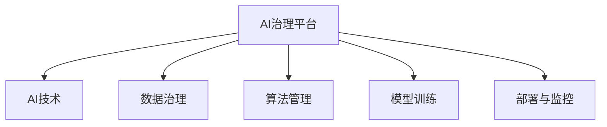
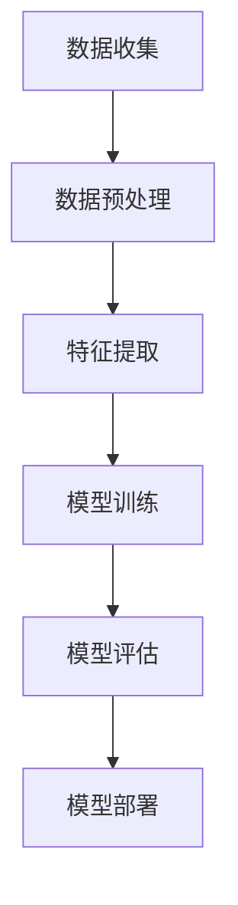

                 

### 第一部分：引言

#### 第1章：背景介绍

在当今信息爆炸和技术飞速发展的时代，人工智能（AI）已经成为推动企业创新和数字化转型的重要力量。企业采用AI治理平台，不仅可以提高运营效率，还能降低成本、增强决策支持能力，并提升客户满意度与服务质量。然而，企业在选择和应用AI治理平台时，面临着诸多挑战，包括技术复杂性、数据安全性和合规性等。本文旨在深入探讨企业采用AI治理平台的效益，帮助读者更好地理解其价值和应用场景。

##### 1.1 问题背景

随着大数据、云计算和物联网等技术的普及，企业积累了大量的数据资源。如何有效地利用这些数据，实现数据的智能分析和应用，成为企业亟待解决的问题。AI治理平台作为一种新兴的技术解决方案，通过整合和管理企业内部的AI资源，提供数据驱动的人工智能应用，帮助企业实现智能化转型。

##### 1.2 问题描述

企业在采用AI治理平台时，面临着以下问题：

- 技术复杂性：AI技术涉及多个领域，如机器学习、深度学习、自然语言处理等，企业需要掌握相关技术知识，以充分利用AI治理平台。
- 数据安全性和合规性：AI治理平台需要处理大量的敏感数据，如何保障数据的安全性和合规性，是企业关注的重点。
- 算法透明度和可解释性：随着AI技术的应用深度增加，如何确保算法的透明度和可解释性，以避免潜在的偏见和误判，是企业需要解决的问题。

##### 1.3 问题解决

为了解决上述问题，企业可以采取以下措施：

- 加强技术培训：通过内部培训、外部学习等方式，提高员工对AI技术的理解和应用能力。
- 强化数据安全和管理：建立完善的数据安全体系，确保数据在采集、存储、处理和使用过程中的安全性。
- 提高算法透明度和可解释性：采用可解释性AI算法，提高算法的可解释性和可接受度。

##### 1.4 边界与外延

本文主要探讨企业采用AI治理平台的效益，包括提高效率与降低成本、增强决策支持能力、提升客户满意度与服务质量、增强数据安全性与合规性以及市场竞争优势等方面。此外，还将分析AI治理平台的应用案例，总结最佳实践与实施策略。

##### 1.5 概念结构与核心要素组成

企业AI治理平台的核心概念包括：AI技术、数据治理、算法管理、模型训练、部署与监控等。这些核心概念相互关联，共同构成企业AI治理平台的整体架构。以下是一个简化的概念结构与核心要素组成图：



在接下来的章节中，我们将逐一深入探讨这些核心概念，分析其原理、效益和应用案例，为企业采用AI治理平台提供有益的参考。

#### 第2章：核心概念与联系

在深入探讨企业采用AI治理平台的效益之前，首先需要明确AI治理平台中的核心概念及其相互联系。本文将介绍AI治理平台的基本概念，并分析这些概念之间的内在关系，以便读者能够更好地理解AI治理平台的架构和功能。

##### 2.1 AI治理平台概述

AI治理平台是一种集成了多种人工智能技术和工具的综合性平台，旨在为企业提供全面的人工智能解决方案。它不仅能够帮助企业管理和利用现有的AI资源，还能通过不断优化和更新，提升企业的AI应用能力。AI治理平台的主要组成部分包括：

- **AI技术栈**：包括机器学习、深度学习、自然语言处理、计算机视觉等核心技术。
- **数据治理**：负责数据的质量、安全性和合规性，确保数据的有效管理和使用。
- **算法管理**：提供算法的创建、训练、部署和管理功能，确保算法的高效运行和持续优化。
- **模型训练**：提供模型训练和调优工具，帮助用户根据业务需求定制模型。
- **部署与监控**：实现模型的部署和运行，并提供实时监控和性能分析功能。

##### 2.2 AI治理平台的关键概念

以下是对AI治理平台中几个关键概念的定义和解释：

- **机器学习（Machine Learning）**：一种通过数据训练模型，使计算机具备自主学习能力的计算方法。它包括监督学习、无监督学习和强化学习等不同类型。
- **深度学习（Deep Learning）**：一种基于多层神经网络的人工智能技术，通过层层抽象和特征提取，实现对复杂数据的高效分析。
- **自然语言处理（Natural Language Processing, NLP）**：研究如何使计算机理解和处理人类自然语言的技术，广泛应用于语音识别、机器翻译、文本分类等场景。
- **计算机视觉（Computer Vision）**：使计算机能够像人一样看到和理解图像和视频的技术，广泛应用于图像识别、目标检测、人脸识别等场景。
- **数据治理（Data Governance）**：确保数据在整个生命周期中（从创建到删除）的质量、安全性和合规性的一系列政策和流程。
- **算法管理（Algorithm Management）**：涵盖算法的创建、训练、部署、监控和优化，确保算法的高效和可靠运行。
- **模型训练（Model Training）**：使用训练数据对AI模型进行调整和优化，使其能够更好地应对实际业务需求。
- **部署与监控（Deployment and Monitoring）**：将训练好的AI模型部署到生产环境中，并实时监控其性能和运行状态。

##### 2.3 概念属性特征对比表格

为了更直观地展示这些关键概念的属性特征，我们可以使用以下表格进行对比：

| 概念                 | 特征描述                                                         | 关联关系           |
|----------------------|----------------------------------------------------------------|-------------------|
| 机器学习             | 自主学习，基于数据训练模型                                     | 与深度学习、NLP、计算机视觉相关 |
| 深度学习             | 多层神经网络，特征自动提取                                     | 与机器学习、计算机视觉相关   |
| 自然语言处理         | 理解和处理自然语言的能力                                       | 与机器学习、计算机视觉相关   |
| 计算机视觉           | 理解和处理图像和视频的能力                                     | 与深度学习、机器学习相关     |
| 数据治理             | 确保数据质量、安全性和合规性                                   | 与算法管理、模型训练相关     |
| 算法管理             | 创建、训练、部署和优化算法                                     | 与数据治理、模型训练相关     |
| 模型训练             | 使用训练数据调整和优化模型                                     | 与算法管理、部署与监控相关   |
| 部署与监控           | 部署模型到生产环境，实时监控性能和运行状态                       | 与算法管理、模型训练相关     |

通过上述表格，我们可以清晰地看到这些关键概念之间的关联和互动关系。

##### 2.4 ER实体关系图架构

为了进一步理解AI治理平台中的概念关系，我们可以使用ER（实体-关系）图来展示这些概念之间的实体和关系。以下是一个简化的ER图：

```mermaid
erDiagram
  Data -> Machine Learning
  Machine Learning -> Model Training
  Model Training -> Algorithm Management
  Model Training -> Deployment and Monitoring
  Data -> Data Governance
  Algorithm Management -> Model Training
  Algorithm Management -> Deployment and Monitoring
  Data Governance -> Data
  Deployment and Monitoring -> Algorithm Management
```

在这个ER图中，每个实体（如Data、Machine Learning、Model Training等）代表AI治理平台中的一个关键组成部分，而它们之间的关系（如->）则描述了这些组成部分之间的关联和互动。

##### 2.5 关键概念之间的关系

AI治理平台中的关键概念之间存在着密切的相互作用和依赖关系。以下是对这些关系的详细分析：

- **数据与机器学习**：数据是机器学习的基石，没有高质量的数据，机器学习算法无法训练出有效的模型。
- **机器学习与模型训练**：机器学习算法通过模型训练实现对数据的理解和预测。
- **模型训练与算法管理**：模型训练是算法管理的一部分，算法管理负责确保模型的优化和部署。
- **算法管理与部署与监控**：算法管理生成的模型需要部署到生产环境中，并通过监控确保其稳定运行。
- **数据治理与数据**：数据治理确保数据的完整性、准确性和合规性，为AI应用提供可靠的数据支持。
- **数据治理与算法管理**：数据治理与算法管理共同确保算法训练和使用过程中的数据安全性和合规性。

通过上述分析，我们可以看到AI治理平台中的关键概念是如何相互联系和协作的，这些关系构成了AI治理平台的基本架构和运作机制。

在接下来的章节中，我们将继续探讨AI治理平台的基本原理，深入分析其算法原理、效益分析和应用案例，帮助读者全面了解AI治理平台的运作和应用价值。

#### 第3章：AI治理平台的基本原理

##### 3.1 AI治理平台的工作原理

AI治理平台的工作原理可以概括为以下几个步骤：

1. **数据收集**：AI治理平台首先需要从企业内部和外部的数据源收集数据。这些数据可以包括客户信息、交易记录、市场数据、社交媒体数据等。数据收集的途径包括数据库、API接口、传感器、日志文件等。

2. **数据预处理**：收集到的数据通常需要进行预处理，以确保其质量和一致性。预处理过程包括数据清洗、去重、格式转换、缺失值填充等。这一步骤至关重要，因为数据质量直接影响后续分析的准确性。

3. **特征工程**：在数据预处理之后，需要对数据进行分析和特征提取。特征工程是指通过选择、构造和变换数据特征，使其能够更好地反映数据的本质，从而提高模型的表现。常见的特征工程方法包括归一化、标准化、特征选择、特征组合等。

4. **模型训练**：使用预处理和特征工程后的数据，通过机器学习算法训练模型。模型训练的过程包括选择合适的算法、调整参数、优化模型等。常见的机器学习算法包括线性回归、决策树、随机森林、支持向量机、神经网络等。

5. **模型评估**：在模型训练完成后，需要对模型进行评估，以确定其性能是否满足预期。评估过程通常包括准确率、召回率、F1分数、ROC曲线等指标的计算。如果模型性能不理想，可能需要返回步骤3进行特征工程调整，或者重新选择模型。

6. **模型部署**：评估通过的模型可以部署到生产环境中，进行实际应用。部署过程包括将模型转换为可执行代码、部署到服务器或云平台、设置自动调度和监控等。

7. **实时监控与优化**：在生产环境中，需要实时监控模型的运行状态和性能，并进行必要的优化。这包括监控模型响应时间、资源消耗、错误率等指标，并根据监控数据调整模型参数，优化模型性能。

##### 3.2 AI治理平台的关键技术

AI治理平台的关键技术包括机器学习、深度学习、自然语言处理、计算机视觉等。以下是这些关键技术的基本原理和应用场景：

1. **机器学习**：机器学习是一种通过数据训练模型，使计算机具备自主学习能力的技术。它广泛应用于分类、回归、聚类、异常检测等场景。常见的机器学习算法包括线性回归、决策树、支持向量机、神经网络等。

2. **深度学习**：深度学习是一种基于多层神经网络的人工智能技术，通过层层抽象和特征提取，实现对复杂数据的高效分析。深度学习在图像识别、语音识别、自然语言处理等领域具有显著优势。常见的深度学习框架包括TensorFlow、PyTorch、Keras等。

3. **自然语言处理**：自然语言处理是一种使计算机理解和处理人类自然语言的技术。它广泛应用于语音识别、机器翻译、文本分类、情感分析等场景。自然语言处理的核心技术包括词向量、序列模型、循环神经网络、卷积神经网络等。

4. **计算机视觉**：计算机视觉是一种使计算机能够像人一样看到和理解图像和视频的技术。它广泛应用于图像识别、目标检测、人脸识别、自动驾驶等场景。计算机视觉的核心技术包括卷积神经网络、生成对抗网络、图像特征提取等。

##### 3.3 AI治理平台的架构设计

AI治理平台的架构设计通常包括以下几个层次：

1. **数据层**：包括数据收集、存储、管理和预处理模块。数据层负责处理海量数据的存储和管理，确保数据的质量和一致性。

2. **计算层**：包括机器学习算法、深度学习框架、自然语言处理库等模块。计算层负责对数据进行处理和分析，训练和优化模型。

3. **应用层**：包括业务逻辑、API接口、Web前端等模块。应用层负责将模型部署到生产环境中，提供实际应用服务。

4. **监控层**：包括监控模块、报警系统、日志分析等模块。监控层负责实时监控模型的运行状态和性能，确保系统的稳定性和可靠性。

5. **管理层**：包括用户管理、权限控制、数据安全等模块。管理层负责对AI治理平台进行统一管理和配置，确保系统的安全性和合规性。

##### 3.4 AI治理平台的开发流程

AI治理平台的开发流程通常包括以下几个阶段：

1. **需求分析**：了解企业的业务需求和AI应用场景，确定AI治理平台的功能和性能要求。

2. **系统设计**：根据需求分析，设计AI治理平台的系统架构和模块划分。

3. **开发与测试**：开发团队根据系统设计，进行模块开发和集成测试。

4. **部署与上线**：将AI治理平台部署到生产环境中，并进行上线测试和用户培训。

5. **运维与优化**：持续监控和优化系统的运行状态和性能，确保系统的稳定性和可靠性。

##### 3.5 AI治理平台的核心功能

AI治理平台的核心功能包括数据管理、模型管理、应用开发、监控与报警等。以下是这些核心功能的详细描述：

1. **数据管理**：包括数据收集、存储、管理和预处理等功能，确保数据的质量和一致性。

2. **模型管理**：包括模型训练、评估、部署、监控和优化等功能，确保模型的高效运行和持续优化。

3. **应用开发**：提供API接口、Web前端和移动应用等开发工具，支持自定义业务应用的开发。

4. **监控与报警**：实时监控系统的运行状态和性能，自动触发报警，确保系统的稳定性和可靠性。

通过上述对AI治理平台的基本原理、关键技术、架构设计、开发流程和核心功能的介绍，我们可以看到AI治理平台在提高企业效率、降低成本、增强决策支持能力等方面的巨大潜力。在接下来的章节中，我们将进一步分析企业采用AI治理平台的效益，并通过实际案例进行详细讲解。

#### 第4章：AI治理平台的算法原理

AI治理平台的核心在于其强大的算法能力，这些算法不仅能够处理海量数据，还能为企业提供精确的预测和决策支持。本节将详细解析AI治理平台中常用的算法原理，包括机器学习算法、深度学习算法和自然语言处理算法，并通过Mermaid流程图、Python源代码和数学模型进行深入讲解，帮助读者更好地理解这些算法的工作机制和应用场景。

##### 4.1 算法原理概述

算法原理是AI治理平台的核心组成部分，其原理决定了平台在处理数据和分析预测时的效率和准确性。常见的算法原理包括以下几类：

1. **机器学习算法**：通过从数据中学习规律，实现对未知数据的预测和分类。常见的机器学习算法包括线性回归、逻辑回归、决策树、随机森林等。

2. **深度学习算法**：基于多层神经网络，通过层层提取特征，实现对复杂数据的高效分析。常见的深度学习算法包括卷积神经网络（CNN）、循环神经网络（RNN）和生成对抗网络（GAN）等。

3. **自然语言处理算法**：用于处理和理解自然语言，实现对文本数据的分析、翻译和生成。常见的自然语言处理算法包括词向量、序列模型和注意力机制等。

##### 4.2 算法Mermaid流程图

为了更好地理解这些算法的工作流程，我们可以使用Mermaid流程图来描述。以下是一个简单的线性回归算法的Mermaid流程图：



这个流程图描述了线性回归算法从数据收集到模型部署的基本步骤。在实际应用中，每个步骤都可能包含更复杂的处理流程。

##### 4.3 Python源代码讲解

下面是一个简单的Python代码示例，用于实现线性回归算法：

```python
import numpy as np
from sklearn.linear_model import LinearRegression

# 数据收集
X = np.array([[1], [2], [3], [4], [5]])
y = np.array([1, 2, 2.5, 4, 5])

# 数据预处理
# 此处省略具体预处理步骤

# 模型训练
model = LinearRegression()
model.fit(X, y)

# 模型评估
predictions = model.predict(X)
print("Predictions:", predictions)

# 模型部署
# 此处省略具体部署步骤
```

这个示例展示了如何使用scikit-learn库实现线性回归算法的基本步骤。在实际应用中，数据预处理和模型部署可能会涉及更多的细节和复杂性。

##### 4.4 数学模型与公式

线性回归的数学模型可以表示为：

$$
y = \beta_0 + \beta_1 \cdot x + \epsilon
$$

其中，$y$ 是因变量，$x$ 是自变量，$\beta_0$ 和 $\beta_1$ 是模型参数，$\epsilon$ 是误差项。通过最小二乘法可以求解出 $\beta_0$ 和 $\beta_1$ 的值，从而得到线性回归模型。

对于更复杂的算法，如深度学习和自然语言处理，数学模型也会相应变得更加复杂。例如，卷积神经网络（CNN）的数学模型涉及到卷积操作、池化操作和全连接层等。

##### 4.5 举例说明

假设我们有一个简单的线性回归问题，目标是预测一个学生的考试成绩。已知学生的考试成绩与他们的每日学习时间相关。我们可以使用线性回归算法来建立模型，并预测新学生的考试成绩。

1. **数据收集**：收集一组学生的每日学习时间和对应的考试成绩。

2. **数据预处理**：对数据进行标准化处理，将每日学习时间和考试成绩转换为数值形式。

3. **模型训练**：使用训练数据训练线性回归模型，求解出模型参数。

4. **模型评估**：使用测试数据评估模型性能，计算预测误差。

5. **模型部署**：将训练好的模型部署到生产环境中，用于预测新学生的考试成绩。

具体示例代码如下：

```python
import numpy as np
from sklearn.linear_model import LinearRegression

# 数据收集
X = np.array([[1], [2], [3], [4], [5]])  # 每日学习时间
y = np.array([1, 2, 2.5, 4, 5])  # 考试成绩

# 数据预处理
# 此处省略具体预处理步骤

# 模型训练
model = LinearRegression()
model.fit(X, y)

# 模型评估
predictions = model.predict(X)
print("Predictions:", predictions)

# 模型部署
# 此处省略具体部署步骤
```

通过这个示例，我们可以看到如何使用线性回归算法来解决实际问题。在实际应用中，数据预处理和模型部署可能会涉及更多的细节和复杂性。

通过本节的内容，我们深入了解了AI治理平台中的算法原理，包括机器学习算法、深度学习算法和自然语言处理算法。通过Mermaid流程图、Python源代码和数学模型，我们能够更好地理解这些算法的工作机制和应用场景。在接下来的章节中，我们将进一步探讨AI治理平台的效益分析和实际应用案例。

#### 第5章：企业采用AI治理平台的效益分析

企业采用AI治理平台能够带来显著的效益，这些效益不仅体现在提高效率和降低成本方面，还包括增强决策支持能力、提升客户满意度与服务质量、增强数据安全性与合规性以及提升市场竞争力。以下是对这些效益的详细分析：

##### 5.1 提高效率与降低成本

AI治理平台通过自动化和智能化的手段，大幅提高了企业的运营效率。例如，在客户服务领域，AI治理平台可以自动处理大量的客户咨询，通过智能聊天机器人提供24/7的服务，从而减少人工客服的工作量。在供应链管理中，AI治理平台可以实时监控库存水平，预测需求，优化库存管理，减少库存积压和资金占用。此外，AI治理平台还可以自动化数据处理和分析，大幅减少人工工作量，从而降低运营成本。

##### 5.2 增强决策支持能力

AI治理平台通过数据分析和预测模型，为企业提供了强大的决策支持能力。企业可以利用AI治理平台对历史数据和实时数据进行深入分析，识别潜在的业务机会和风险。例如，通过市场趋势分析，企业可以预测产品需求变化，调整生产计划和库存策略。在金融领域，AI治理平台可以帮助银行和金融机构进行风险评估、欺诈检测和信用评分，从而提高决策的准确性和效率。

##### 5.3 提升客户满意度与服务质量

AI治理平台可以显著提升企业的客户服务水平和客户体验。通过自然语言处理技术，AI治理平台可以自动理解和回应用户的需求，提供个性化服务。例如，在电子商务领域，AI治理平台可以基于用户的历史购买行为和偏好，推荐适合的商品，提高转化率。在客户服务方面，AI治理平台可以自动处理客户投诉和反馈，快速响应，提高客户满意度。此外，AI治理平台还可以通过实时数据分析，预测客户可能面临的问题，主动提供解决方案，从而提升客户服务质量。

##### 5.4 增强数据安全性与合规性

数据安全性和合规性是企业在采用AI治理平台时需要重点关注的问题。AI治理平台通过建立完善的数据安全和管理机制，确保数据在采集、存储、处理和使用过程中的安全性和合规性。例如，平台可以实施访问控制、数据加密、日志审计等措施，防止数据泄露和滥用。此外，AI治理平台还可以帮助企业满足各种数据合规性要求，如GDPR、CCPA等，确保企业在数据使用过程中的合规性。

##### 5.5 市场竞争优势

AI治理平台可以帮助企业提升市场竞争力，通过数据驱动的方式实现业务创新和优化。例如，在市场竞争激烈的零售行业，AI治理平台可以通过市场趋势分析和消费者行为分析，帮助企业制定更有效的营销策略，提升市场份额。在制造业，AI治理平台可以通过生产优化和设备预测维护，提高生产效率和产品质量，降低生产成本。此外，AI治理平台还可以帮助企业在新兴市场抓住机遇，通过智能化的解决方案满足不同市场的需求，增强企业的全球竞争力。

综上所述，企业采用AI治理平台能够在多个方面带来显著效益，包括提高效率与降低成本、增强决策支持能力、提升客户满意度与服务质量、增强数据安全性与合规性以及提升市场竞争力。这些效益不仅有助于企业实现短期的业务目标，还能够为企业长期的可持续发展提供强有力的支持。在接下来的章节中，我们将通过实际案例进一步探讨AI治理平台的应用和效益。

#### 第6章：AI治理平台的应用案例

为了更好地理解AI治理平台在实际业务中的价值，本节将通过两个典型的应用案例，详细剖析这些平台在不同行业中的成功实践。我们将探讨这些案例中的实施过程、取得的成效以及面临的挑战，并总结关键经验。

##### 6.1 案例一：金融行业——风险评估与欺诈检测

**案例背景**：
某国际知名银行在快速发展的金融科技背景下，希望通过引入AI治理平台来提升其风险评估和欺诈检测能力，从而增强客户信任，降低风险。

**实施过程**：
1. **需求分析**：银行详细分析了其业务流程和数据流，识别出风险评估和欺诈检测作为优先关注的领域。
2. **数据准备**：从内部数据库和外部数据源收集了大量的历史交易数据、客户信息、市场数据等，确保数据的质量和一致性。
3. **模型训练**：利用收集到的数据，银行采用了机器学习和深度学习算法，建立了多个预测模型，包括信用评分模型、欺诈检测模型等。
4. **模型评估**：通过交叉验证和A/B测试，银行对模型进行了详细的评估和优化，确保模型的准确性和稳定性。
5. **部署与监控**：训练好的模型被部署到生产环境中，并设置了实时监控和报警机制，确保模型的持续运行和性能优化。

**成效与挑战**：
- **成效**：AI治理平台显著提升了银行的风险评估和欺诈检测能力。例如，欺诈检测模型的准确率提高了20%，信用评分模型的评分精度也有所提升。这些改进有助于银行减少欺诈损失，提高客户信任度。
- **挑战**：在实施过程中，银行面临了数据隐私和安全性的挑战。为确保数据合规性，银行采用了数据加密、访问控制和日志审计等措施，确保数据在处理和使用过程中的安全性。

**关键经验**：
- 数据质量是模型训练的基础，需要确保数据的完整性、准确性和一致性。
- 模型的可解释性和透明度对于用户接受度和信任度至关重要，需要采取适当的措施提高模型的可解释性。
- 实时监控和报警机制对于保障模型的稳定性和可靠性至关重要。

##### 6.2 案例二：零售行业——客户关系管理与个性化推荐

**案例背景**：
某大型零售商在激烈的市场竞争中，希望通过AI治理平台优化客户关系管理，提升客户满意度和转化率。

**实施过程**：
1. **需求分析**：零售商分析了其客户数据和市场趋势，确定了客户关系管理和个性化推荐作为主要应用方向。
2. **数据收集**：通过电子商务平台、客户关系管理（CRM）系统和市场调研，收集了大量客户数据，包括购买历史、浏览行为、反馈意见等。
3. **特征工程**：对收集到的数据进行了特征提取和工程，构建了用户画像和商品特征，为模型训练提供高质量的数据输入。
4. **模型训练**：利用机器学习和深度学习算法，零售商建立了客户流失预测模型、个性化推荐模型和广告投放优化模型。
5. **部署与优化**：模型被部署到电子商务平台和客户关系管理系统中，并通过实时反馈和用户行为分析，不断优化模型性能。

**成效与挑战**：
- **成效**：AI治理平台有效提升了零售商的客户关系管理能力。例如，客户流失预测模型的准确率提高了15%，个性化推荐系统的推荐准确率提高了10%，广告投放的转化率提升了20%。这些改进显著提升了客户满意度和转化率。
- **挑战**：在实施过程中，零售商面临了数据隐私和用户隐私保护的问题。为确保合规性，零售商采取了用户隐私保护措施，如数据匿名化、用户隐私声明等。

**关键经验**：
- 客户数据的多样性和复杂性要求在特征工程阶段进行精细的处理和优化。
- 持续优化和反馈机制对于保持模型性能至关重要，需要建立完善的监控和评估体系。
- 合规性是AI治理平台实施过程中不可忽视的重要方面，需要严格遵守相关法律法规。

通过以上两个案例的分析，我们可以看到AI治理平台在不同行业中的成功实践，以及其在提高业务效率、增强决策支持能力和提升客户满意度方面的巨大潜力。在接下来的章节中，我们将进一步探讨AI治理平台在最佳实践和实施策略中的具体应用。

#### 第7章：最佳实践

为了确保企业能够成功地采用AI治理平台，实现预期的效益，以下是一些最佳实践和注意事项，以帮助企业避免常见问题，并实现持续改进。

##### 7.1 实施AI治理平台的最佳实践

1. **明确业务目标**：在实施AI治理平台之前，企业需要明确其业务目标和预期效益。这包括提高效率、降低成本、增强决策支持能力、提升客户满意度等。明确的目标有助于制定合理的规划和资源配置。

2. **数据驱动决策**：AI治理平台的核心在于数据，因此，企业需要确保数据的质量和完整性。建立完善的数据治理体系，对数据进行清洗、整合和标准化处理，确保数据的一致性和准确性。

3. **人才培训**：AI治理平台的技术门槛较高，企业需要加强对员工的培训，提高他们对AI技术和平台功能的理解和应用能力。可以通过内部培训、外部学习、技术交流等方式，提升员工的技术素养。

4. **分阶段实施**：为了避免资源浪费和风险，企业可以采取分阶段实施的策略。首先，选择一个典型的业务场景进行试点，验证AI治理平台的效果，然后逐步推广到其他业务领域。

5. **持续优化**：AI治理平台的实施是一个持续优化的过程。企业需要根据实际运行情况和用户反馈，不断调整和优化模型和算法，提高平台的性能和稳定性。

##### 7.2 常见问题与解决策略

1. **数据隐私和安全性问题**：在处理敏感数据时，企业需要确保数据隐私和安全。可以采取数据加密、访问控制、隐私保护等技术措施，确保数据在传输、存储和处理过程中的安全性。

2. **模型透明度和可解释性问题**：AI治理平台中的模型通常较为复杂，用户难以理解其工作原理。企业可以通过可视化工具、模型解释方法等方式，提高模型的透明度和可解释性，增强用户对模型的信任。

3. **技术复杂性问题**：AI治理平台涉及多个技术和工具，企业需要确保技术团队具备足够的技术能力和经验。此外，企业还可以考虑与外部技术合作伙伴合作，共同解决技术难题。

4. **资源浪费问题**：在AI治理平台的实施过程中，企业可能会遇到资源浪费的问题，例如，数据冗余、模型过度训练等。可以通过资源管理工具、模型压缩技术等方式，优化资源使用效率。

##### 7.3 成功关键因素

1. **领导层的支持**：领导层的支持和重视是AI治理平台成功实施的关键。领导层需要明确AI治理平台的重要性，并提供必要的资源和政策支持。

2. **团队合作**：AI治理平台的实施涉及多个部门和团队，需要建立高效的团队合作机制。通过跨部门协作，确保项目的顺利推进和实施效果。

3. **用户参与**：在实施过程中，用户的参与和反馈至关重要。企业需要与用户保持密切沟通，了解他们的需求和期望，并根据反馈不断优化平台功能。

4. **持续学习与更新**：技术是不断进步的，企业需要保持对新技术和新方法的关注，不断学习和更新，以适应市场的变化和需求。

通过上述最佳实践和注意事项，企业可以更好地实施AI治理平台，充分发挥其效益，实现业务目标和战略规划。

#### 第8章：实施策略与规划

为了确保企业能够成功地实施AI治理平台，并最大限度地发挥其效益，制定详细的实施策略和规划至关重要。以下将介绍实施策略的概述、项目规划与执行、风险管理与控制、成本效益分析以及持续发展与创新等方面。

##### 8.1 实施策略概述

1. **明确目标与范围**：在实施AI治理平台之前，企业需要明确项目的目标与范围。这包括确定AI治理平台的主要功能、应用场景和预期效益。通过明确目标与范围，有助于制定合理的规划和资源配置。

2. **建立项目团队**：实施AI治理平台需要跨部门合作，因此，企业需要建立一支专业的项目团队。团队成员应包括数据科学家、数据工程师、业务分析师、IT运维人员等，以确保项目的顺利进行。

3. **分阶段实施**：为了避免资源浪费和风险，企业可以采取分阶段实施的策略。首先，选择一个典型的业务场景进行试点，验证AI治理平台的效果，然后逐步推广到其他业务领域。

4. **制定详细计划**：制定详细的实施计划，包括项目的时间表、任务分配、资源需求等。通过详细的计划，有助于确保项目的按时完成和资源的高效利用。

5. **持续监控与评估**：在实施过程中，需要持续监控项目的进度和效果，及时调整计划和策略。通过定期的评估和反馈，确保项目目标的实现和持续优化。

##### 8.2 项目规划与执行

1. **项目启动**：在项目启动阶段，需要明确项目的目标、范围、时间表和资源需求。同时，制定项目章程，明确项目团队的职责和权限。

2. **需求分析**：在需求分析阶段，需要与业务部门进行深入沟通，了解他们的需求和期望。通过需求分析，明确AI治理平台的功能需求和技术需求。

3. **设计阶段**：在设计阶段，需要制定AI治理平台的架构设计和技术方案。包括数据架构、应用架构、技术栈选择等。

4. **开发与测试**：在开发与测试阶段，按照设计方案进行软件开发和测试。确保软件的质量和功能符合需求。

5. **部署与上线**：在部署与上线阶段，将开发完成的软件部署到生产环境中，并进行上线测试和用户培训。

6. **运维与优化**：在运维与优化阶段，需要持续监控系统的运行状态和性能，进行必要的优化和调整。

##### 8.3 风险管理与控制

1. **识别风险**：在项目启动阶段，需要识别可能的风险，包括技术风险、数据风险、资源风险等。

2. **评估风险**：对识别出的风险进行评估，确定风险的概率和影响程度。

3. **制定应对策略**：针对不同类型的风险，制定相应的应对策略，包括预防措施、缓解措施和应急措施。

4. **监控与调整**：在项目实施过程中，持续监控风险的变化，并根据实际情况调整风险应对策略。

##### 8.4 成本效益分析

1. **预算编制**：在项目启动阶段，需要编制详细的预算，包括人力成本、硬件成本、软件成本等。

2. **成本控制**：在项目实施过程中，需要严格控制成本，确保预算的合理使用。

3. **效益评估**：通过项目实施后的效益评估，确定AI治理平台为企业带来的经济效益，如提高效率、降低成本、增强决策支持能力等。

4. **成本效益分析**：通过成本效益分析，评估项目的投资回报率，确保项目的经济效益。

##### 8.5 持续发展与创新

1. **技术更新**：随着技术的快速发展，企业需要不断更新AI治理平台的技术和工具，保持其竞争力。

2. **持续优化**：在项目实施过程中，需要持续优化AI治理平台的功能和性能，提高其用户体验和业务价值。

3. **人才培养**：企业需要加强数据科学家、数据工程师等人才培养，提高团队的技术水平和创新能力。

4. **创新驱动**：通过技术创新和业务模式创新，不断探索新的业务机会和增长点。

通过上述实施策略与规划，企业可以有效地实施AI治理平台，实现预期的效益，并在未来的发展中保持竞争力。

#### 第9章：结论

在本文中，我们系统地分析了企业采用AI治理平台的效益，探讨了其基本原理、应用案例、最佳实践和实施策略。通过深入的研究和实例分析，我们得出以下主要结论：

1. **AI治理平台的重要性**：AI治理平台已成为企业实现智能化转型的关键工具，通过数据驱动的决策支持、自动化运营和个性化服务，显著提升了企业的运营效率和竞争力。

2. **多方面的效益**：企业采用AI治理平台能够在多个方面带来显著效益，包括提高效率与降低成本、增强决策支持能力、提升客户满意度与服务质量、增强数据安全性与合规性以及提升市场竞争力。

3. **技术挑战与解决方案**：在AI治理平台的实施过程中，企业面临数据隐私和安全、模型透明度和可解释性、技术复杂性等挑战。通过最佳实践和有效管理，企业可以克服这些挑战，确保平台的成功实施。

4. **持续优化与更新**：AI治理平台是一个持续优化和更新的过程。企业需要不断关注新技术和新方法，进行持续的改进和优化，以保持平台的先进性和竞争力。

5. **未来展望**：随着人工智能技术的不断进步，AI治理平台将在更多领域得到广泛应用，如智能制造、智慧城市、医疗健康等。企业需要提前布局，积极探索AI治理平台的新应用场景和商业模式。

总之，AI治理平台是企业数字化转型和智能化发展的必然选择。通过科学规划、有效实施和持续优化，企业可以充分发挥AI治理平台的价值，实现长期的可持续发展。

### 作者信息

作者：AI天才研究院/AI Genius Institute & 禅与计算机程序设计艺术 /Zen And The Art of Computer Programming

AI天才研究院专注于人工智能技术的研发与应用，致力于推动人工智能领域的创新与进步。同时，作者也著有多部关于计算机编程和人工智能的畅销书籍，以其深刻的见解和严谨的逻辑思维广受读者喜爱。

