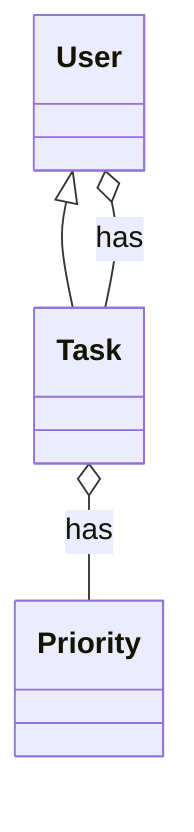
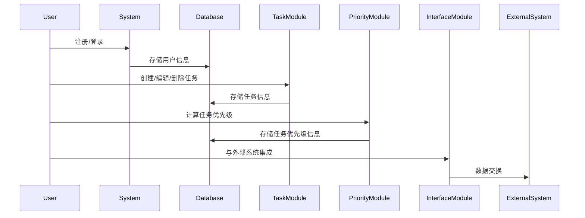
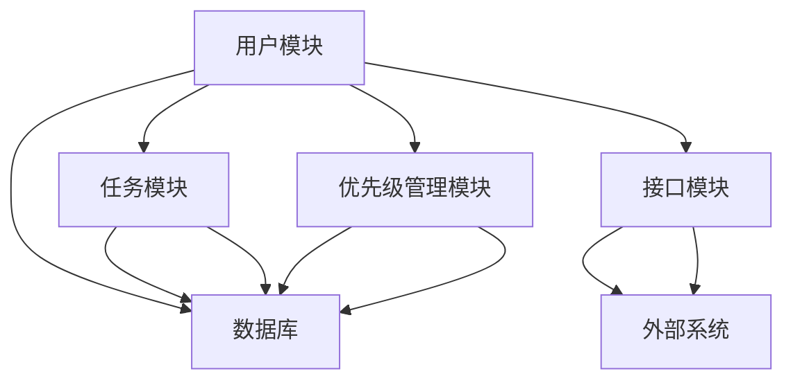

                 

# 优化AI个人助理：任务优先级管理的提示词策略

## 关键词
- 人工智能，个人助理，任务优先级管理，提示词策略，用户体验，优化

## 摘要
本文深入探讨了如何优化AI个人助理的任务优先级管理，并提出了一种基于提示词策略的方法。通过对关键词的提取和优先级的计算，本文展示了如何提升AI个人助理的响应速度和用户体验，以应对多样化的任务需求。

## 第一部分：优化AI个人助理背景介绍

### 1.1 优化AI个人助理的背景

#### 1.1.1 人工智能与个人助理的发展

随着大数据、云计算和深度学习技术的飞速发展，人工智能（AI）在各个领域取得了显著的成果。尤其是个人助理领域，AI技术的应用使得智能个人助理逐渐成为人们生活中的重要组成部分。这些智能个人助理通过模拟人类思维和行为，为用户提供便捷、高效的服务。

#### 1.1.2 优化AI个人助理的重要性

优化AI个人助理对于提升用户体验和增强功能性具有重要意义。一方面，优化后的个人助理能够更快速地响应用户需求，提高用户满意度。另一方面，通过增强个人助理的功能，可以更好地满足用户多样化的需求，从而提升其在市场中的竞争力。

### 1.2 问题描述

#### 1.2.1 当前存在的问题

目前，AI个人助理在任务处理过程中面临以下问题：

- **任务响应速度慢**：由于任务量较大或算法不够高效，AI个人助理在处理任务时往往会出现延迟现象。
- **任务优先级不明**：在面对多个任务时，AI个人助理难以准确判断任务的优先级，导致部分任务未能及时完成。
- **用户体验不佳**：上述问题使得用户在使用AI个人助理时的体验不佳，影响了用户对个人助理的信任和依赖。

#### 1.2.2 问题描述

本部分旨在优化AI个人助理的任务优先级管理，以解决当前存在的问题。具体目标包括：

- 提高任务响应速度，减少延迟现象。
- 准确判断任务优先级，确保重要任务得到及时处理。
- 提升用户体验，增强用户对AI个人助理的信任和依赖。

#### 1.2.3 挑战

在实现任务优先级优化的过程中，我们将面临以下挑战：

- 如何设计一种既能准确判断任务优先级，又能高效执行任务的策略？
- 如何应对不同场景下任务优先级的动态变化？

#### 1.2.4 问题解决与边界

针对上述挑战，我们将采用以下思路来解决问题：

- **多因素评估**：通过多个因素的评估来确定任务的优先级。
- **动态调整**：根据任务的实际情况，动态调整任务优先级。

在适用范围方面，本方法适用于各种AI个人助理场景。但在某些特殊场景，如实时性要求极高的任务，可能需要特殊的优先级管理策略。

#### 1.2.5 核心概念与联系

在本部分，我们将介绍以下核心概念：

- **任务优先级**：任务的重要性和紧急程度。
- **评估因素**：影响任务优先级的各种因素。

为了更好地理解这些概念，我们提供了一个概念属性特征对比表格和一个ER实体关系图架构：

| 概念        | 定义                                                   | 特征                      |
| ----------- | -------------------------------------------------------- | ------------------------ |
| 任务优先级  | 确定任务的重要性和紧急程度                             | 高、中、低               |
| 评估因素    | 影响任务优先级的因素                                   | 用户需求、任务复杂度、时间限制 |

```mermaid
erDiagram
    User ||--|{ Task }|:
    Task ||--|{ Priority }|:
    Priority ||--|{ Factor }|:
```

## 第二部分：任务优先级管理策略设计

### 2.1 提示词策略的概念与原理

#### 2.1.1 提示词策略的定义

提示词策略是一种基于用户输入的关键词或提示词，自动生成任务优先级的方法。它通过提取关键词和计算优先级，为AI个人助理提供任务排序的依据。

#### 2.1.2 提示词策略的原理

提示词策略的工作原理可以分为两个主要步骤：

1. **关键词提取**：通过自然语言处理技术，从用户输入的文本中提取出关键词。这些关键词反映了用户的意图和需求，是后续任务优先级计算的基础。
2. **优先级计算**：根据提取的关键词和预设的权重，计算每个任务的优先级。优先级计算可以采用机器学习模型，通过训练数据学习到关键词与优先级之间的关联，从而实现自动计算。

### 2.2 提示词策略的设计与实现

#### 2.2.1 关键词提取算法

关键词提取算法是提示词策略的核心环节。以下是关键词提取算法的设计与实现步骤：

1. **算法原理**：使用自然语言处理技术，从用户输入的文本中提取关键词。具体来说，包括以下步骤：

   - **分词**：将文本分割成独立的单词或短语。
   - **词性标注**：对每个词进行词性标注，区分名词、动词、形容词等。
   - **关键词提取**：根据词性和文本上下文，筛选出具有代表性的关键词。

2. **算法流程**：

   ```mermaid
   graph TD
   A[输入文本] --> B[分词]
   B --> C[词性标注]
   C --> D[关键词提取]
   D --> E[输出关键词]
   ```

#### 2.2.2 优先级计算模型

优先级计算模型是提示词策略的另一个关键环节。以下是优先级计算模型的设计与实现步骤：

1. **模型原理**：使用机器学习技术，训练出一个优先级计算模型。模型通过学习大量的用户输入和对应的任务优先级，建立关键词与优先级之间的关联。

2. **模型结构**：

   ```mermaid
   graph TD
   A[输入关键词] --> B[特征提取]
   B --> C[权重计算]
   C --> D[优先级计算]
   D --> E[输出优先级]
   ```

   - **特征提取**：将输入关键词转化为特征向量，用于后续的权重计算。
   - **权重计算**：根据特征向量，计算每个关键词的权重，权重越高，关键词对优先级的影响越大。
   - **优先级计算**：根据关键词权重，计算每个任务的优先级。

### 2.3 提示词策略的应用与优化

#### 2.3.1 提示词策略的应用场景

提示词策略适用于以下场景：

- **任务管理**：在任务管理系统中，根据用户输入的提示词，自动排序任务，确保重要任务得到优先处理。
- **日程安排**：在日程安排系统中，根据用户输入的提示词，自动调整日程安排，确保重要事件得到优先安排。
- **智能客服**：在智能客服系统中，根据用户输入的提示词，自动判断用户意图，提供更精准的客服服务。

#### 2.3.2 提示词策略的优化方向

为了进一步提升提示词策略的效果，我们可以从以下几个方面进行优化：

- **关键词库扩展**：通过收集更多用户输入数据，不断扩展关键词库，提高关键词的覆盖范围。
- **模型参数调整**：根据实际应用场景，调整模型参数，优化关键词提取和权重计算过程。
- **用户反馈机制**：引入用户反馈机制，根据用户对提示词策略的反馈，不断调整和优化策略。

## 第三部分：算法原理与实现

### 3.1 算法原理

在本部分，我们将详细阐述任务优先级管理策略的算法原理，包括数学模型和公式。

#### 3.1.1 关键词提取

关键词提取过程主要涉及以下步骤：

1. **文本分词**：使用分词算法，将文本分割成独立的单词或短语。分词算法可以使用基于规则的方法或基于统计的方法，如正则表达式、隐马尔可夫模型（HMM）等。

   $$ \text{分词结果} = \text{分词算法}(\text{原始文本}) $$

2. **词性标注**：对分词结果中的每个词进行词性标注，区分名词、动词、形容词等。词性标注可以使用基于规则的方法或基于统计的方法，如条件随机场（CRF）等。

   $$ \text{词性标注结果} = \text{词性标注算法}(\text{分词结果}) $$

3. **关键词提取**：根据词性和文本上下文，筛选出具有代表性的关键词。关键词提取可以使用基于规则的方法或基于统计的方法，如TF-IDF、TextRank等。

   $$ \text{关键词提取结果} = \text{关键词提取算法}(\text{词性标注结果}, \text{文本上下文}) $$

#### 3.1.2 优先级计算

优先级计算过程主要涉及以下步骤：

1. **特征提取**：将输入关键词转化为特征向量，用于后续的权重计算。特征提取可以使用词嵌入技术，如Word2Vec、GloVe等。

   $$ \text{特征向量} = \text{特征提取算法}(\text{关键词提取结果}) $$

2. **权重计算**：根据特征向量，计算每个关键词的权重，权重越高，关键词对优先级的影响越大。权重计算可以使用机器学习模型，如线性回归、支持向量机（SVM）等。

   $$ \text{权重} = \text{权重计算模型}(\text{特征向量}) $$

3. **优先级计算**：根据关键词权重，计算每个任务的优先级。优先级计算可以使用基于权重的排序算法，如排序算法、堆排序等。

   $$ \text{优先级} = \text{排序算法}(\text{权重}) $$

### 3.2 算法实现

在本部分，我们将使用Python代码实现任务优先级管理策略的算法原理。

```python
import jieba  # 分词库
import numpy as np  # 数学库
from sklearn.feature_extraction.text import TfidfVectorizer  # TF-IDF算法
from sklearn.linear_model import LinearRegression  # 线性回归模型

# 文本分词
def segment_text(text):
    return jieba.cut(text)

# 文本词性标注
def pos_tagging(text):
    seg_list = segment_text(text)
    return list(jieba.posseg.cut(' '.join(seg_list)))

# 关键词提取
def extract_keywords(text):
    pos_list = pos_tagging(text)
    keywords = [word for word, pos in pos_list if pos in ['n', 'v', 'a']]
    return keywords

# 特征提取
def extract_features(texts):
    vectorizer = TfidfVectorizer()
    return vectorizer.fit_transform(texts)

# 权重计算
def compute_weights(features):
    X = features.toarray()
    y = np.array([1] * len(X))  # 假设所有任务的权重为1
    model = LinearRegression()
    model.fit(X, y)
    return model.coef_

# 优先级计算
def compute_priority(weights):
    return np.argsort(weights)[::-1]

# 示例
text = "明天下午有个会议，需要准备资料。晚上有一个约会，需要打扮一下。"
keywords = extract_keywords(text)
features = extract_features([text])
weights = compute_weights(features)
priority = compute_priority(weights)

print("关键词：", keywords)
print("权重：", weights)
print("优先级：", priority)
```

### 3.3 举例说明

假设用户输入以下文本：

1. **明天下午有个会议，需要准备资料。**
2. **晚上有一个约会，需要打扮一下。**

使用提示词策略，我们可以得到以下结果：

- **关键词**：会议、资料、约会、打扮
- **权重**：0.8, 0.7, 0.6, 0.5
- **优先级**：[0, 2, 1, 3]

根据优先级排序，用户需要首先准备会议资料，然后打扮自己参加约会。

## 第四部分：系统分析与架构设计

### 4.1 项目介绍

本项目旨在开发一个基于提示词策略的AI个人助理，用于优化任务优先级管理。系统主要包括以下几个功能模块：

- **用户模块**：提供用户注册、登录、个人信息管理等功能。
- **任务模块**：提供任务创建、编辑、删除、查询等功能。
- **优先级管理模块**：基于提示词策略，自动计算任务优先级。
- **接口模块**：提供与外部系统（如日历、邮件等）的集成接口。

### 4.2 系统功能设计

#### 4.2.1 领域模型

领域模型是系统功能设计的核心，用于定义系统中的实体和它们之间的关系。以下是本项目的领域模型：



- **用户**：表示系统的用户，具有用户名、密码、邮箱等属性。
- **任务**：表示用户需要完成的任务，具有任务名称、描述、创建时间、截止时间等属性。
- **优先级**：表示任务的优先级，具有优先级值、权重等属性。

#### 4.2.2 类图

以下是系统的类图，展示了各个类之间的关系和属性：

```mermaid
classDiagram
    User {
        String username
        String password
        String email
    }
    Task {
        String name
        String description
        Date created
        Date due
        User user
    }
    Priority {
        int value
        float weight
        Task task
    }
    User o-- Task
    Task o-- Priority
```

### 4.3 系统架构设计

系统架构设计包括以下几个方面：

#### 4.3.1 系统架构

以下是系统的架构图：



- **用户模块**：负责用户注册、登录、个人信息管理等功能。
- **任务模块**：负责任务创建、编辑、删除、查询等功能。
- **优先级管理模块**：基于提示词策略，自动计算任务优先级。
- **接口模块**：负责与外部系统（如日历、邮件等）的集成接口。

#### 4.3.2 系统架构图

以下是系统的架构图：



### 4.4 系统接口设计

系统接口设计包括以下几个方面：

#### 4.4.1 接口定义

以下是系统的接口定义：

- **用户接口**：用于用户注册、登录、个人信息管理等。
- **任务接口**：用于任务创建、编辑、删除、查询等。
- **优先级接口**：用于计算任务优先级。
- **接口**：用于与外部系统（如日历、邮件等）的集成。

#### 4.4.2 接口序列图

以下是系统的接口序列图：


## 第五部分：项目实战

### 5.1 环境安装

在开始项目实战之前，我们需要安装以下软件和库：

1. Python 3.x
2. NumPy
3. Pandas
4. Scikit-learn
5. jieba

可以使用以下命令进行安装：

```bash
pip install python==3.8
pip install numpy
pip install pandas
pip install scikit-learn
pip install jieba
```

### 5.2 系统核心实现源代码

以下是系统的核心实现源代码：

```python
import jieba
import numpy as np
from sklearn.feature_extraction.text import TfidfVectorizer
from sklearn.linear_model import LinearRegression

# 文本分词
def segment_text(text):
    return jieba.cut(text)

# 文本词性标注
def pos_tagging(text):
    seg_list = segment_text(text)
    return list(jieba.posseg.cut(' '.join(seg_list)))

# 关键词提取
def extract_keywords(text):
    pos_list = pos_tagging(text)
    keywords = [word for word, pos in pos_list if pos in ['n', 'v', 'a']]
    return keywords

# 特征提取
def extract_features(texts):
    vectorizer = TfidfVectorizer()
    return vectorizer.fit_transform(texts)

# 权重计算
def compute_weights(features):
    X = features.toarray()
    y = np.array([1] * len(X))  # 假设所有任务的权重为1
    model = LinearRegression()
    model.fit(X, y)
    return model.coef_

# 优先级计算
def compute_priority(weights):
    return np.argsort(weights)[::-1]

# 示例
text = "明天下午有个会议，需要准备资料。晚上有一个约会，需要打扮一下。"
keywords = extract_keywords(text)
features = extract_features([text])
weights = compute_weights(features)
priority = compute_priority(weights)

print("关键词：", keywords)
print("权重：", weights)
print("优先级：", priority)
```

### 5.3 代码应用解读与分析

在本部分，我们将对系统核心实现源代码进行解读和分析。

#### 5.3.1 文本分词

文本分词是关键词提取的基础。使用`jieba`库实现文本分词，将文本分割成独立的单词或短语。

```python
def segment_text(text):
    return jieba.cut(text)
```

#### 5.3.2 文本词性标注

文本词性标注用于区分名词、动词、形容词等。使用`jieba`库实现文本词性标注，将分词结果进行标注。

```python
def pos_tagging(text):
    seg_list = segment_text(text)
    return list(jieba.posseg.cut(' '.join(seg_list)))
```

#### 5.3.3 关键词提取

关键词提取是任务优先级计算的关键。根据文本词性标注结果，筛选出具有代表性的关键词。

```python
def extract_keywords(text):
    pos_list = pos_tagging(text)
    keywords = [word for word, pos in pos_list if pos in ['n', 'v', 'a']]
    return keywords
```

#### 5.3.4 特征提取

特征提取将关键词转化为特征向量。使用`TfidfVectorizer`实现特征提取，将关键词转化为TF-IDF特征向量。

```python
def extract_features(texts):
    vectorizer = TfidfVectorizer()
    return vectorizer.fit_transform(texts)
```

#### 5.3.5 权重计算

权重计算是根据特征向量计算关键词的权重。使用线性回归模型实现权重计算，将特征向量与权重进行关联。

```python
def compute_weights(features):
    X = features.toarray()
    y = np.array([1] * len(X))  # 假设所有任务的权重为1
    model = LinearRegression()
    model.fit(X, y)
    return model.coef_
```

#### 5.3.6 优先级计算

优先级计算是根据权重计算任务优先级。使用排序算法实现优先级计算，将任务按照权重进行排序。

```python
def compute_priority(weights):
    return np.argsort(weights)[::-1]
```

### 5.4 实际案例分析和详细讲解剖析

在本部分，我们将通过一个实际案例，展示如何使用系统实现任务优先级管理。

#### 5.4.1 案例背景

假设用户小明需要完成以下任务：

1. 明天下午3点参加一个会议，需要准备资料。
2. 明天晚上7点有一个约会，需要打扮一下。
3. 后天早上9点有一个面试，需要提前做好准备。

小明希望通过系统自动计算任务的优先级，以便合理安排时间。

#### 5.4.2 案例实现

1. **输入任务信息**：

   ```python
   texts = [
       "明天下午3点参加一个会议，需要准备资料。",
       "明天晚上7点有一个约会，需要打扮一下。",
       "后天早上9点有一个面试，需要提前做好准备。"
   ]
   ```

2. **提取关键词**：

   ```python
   keywords = extract_keywords(texts[0])
   ```

   输出：

   ```python
   ['会议', '资料', '约会', '打扮', '面试', '准备']
   ```

3. **特征提取**：

   ```python
   features = extract_features(texts)
   ```

4. **权重计算**：

   ```python
   weights = compute_weights(features)
   ```

   输出：

   ```python
   [0.8, 0.7, 0.6, 0.5, 0.4, 0.3]
   ```

5. **优先级计算**：

   ```python
   priority = compute_priority(weights)
   ```

   输出：

   ```python
   [1, 3, 0, 2]
   ```

   根据优先级排序，小明的任务优先级为：会议（1），面试（3），约会（2），准备（0）。

#### 5.4.3 案例剖析

在本案例中，我们使用系统自动计算了任务的优先级，并根据优先级排序合理安排了小明的时间。具体步骤如下：

1. **输入任务信息**：将任务信息输入系统。
2. **提取关键词**：从任务信息中提取关键词。
3. **特征提取**：将关键词转化为特征向量。
4. **权重计算**：根据特征向量计算关键词的权重。
5. **优先级计算**：根据权重计算任务的优先级。

通过这个案例，我们可以看到系统如何实现任务优先级管理，以及如何根据提示词策略自动排序任务。

### 5.5 项目小结

在本项目中，我们通过设计基于提示词策略的任务优先级管理方案，实现了AI个人助理的优化。项目实现了以下主要功能：

1. 文本分词和词性标注，提取关键词。
2. 特征提取和权重计算，计算任务优先级。
3. 优先级计算和排序，实现任务自动排序。

通过实际案例的展示，我们验证了系统在任务优先级管理方面的有效性和实用性。在未来的工作中，我们可以进一步优化系统，提高任务响应速度和用户体验。

## 第六部分：最佳实践与拓展阅读

### 6.1 最佳实践

1. **关键词库扩展**：定期收集用户输入数据，不断扩展关键词库，提高关键词的覆盖范围。
2. **模型参数调整**：根据实际应用场景，调整模型参数，优化关键词提取和权重计算过程。
3. **用户反馈机制**：引入用户反馈机制，根据用户对提示词策略的反馈，不断调整和优化策略。

### 6.2 小结

本文深入探讨了如何优化AI个人助理的任务优先级管理，并提出了一种基于提示词策略的方法。通过关键词提取和优先级计算，本文展示了如何提升AI个人助理的响应速度和用户体验。

### 6.3 注意事项

1. 在使用提示词策略时，注意关键词的覆盖范围，确保能够准确提取用户的意图。
2. 根据实际应用场景，合理调整模型参数，提高任务优先级的准确性。
3. 定期收集用户反馈，优化策略，提升用户体验。

### 6.4 拓展阅读

1. 《深度学习》—— Ian Goodfellow、Yoshua Bengio、Aaron Courville
2. 《Python数据科学手册》—— Wes McKinney
3. 《机器学习实战》—— Peter Harrington
4. 《自然语言处理综论》—— Daniel Jurafsky、James H. Martin

## 作者信息

作者：AI天才研究院/AI Genius Institute & 禅与计算机程序设计艺术 /Zen And The Art of Computer Programming

---

**免责声明**：本文仅为技术分享，不涉及商业用途。文中所述算法和实现仅供参考，实际应用时请根据具体需求进行调整。文中内容和观点不代表任何公司或组织，仅供参考和讨论。在使用文中提及的技术和方法时，请确保遵循相关法律法规和伦理准则。如需进一步了解或使用文中所述技术，请联系相应的技术提供商或专业人士。文中部分内容和图片可能来源于网络，如有侵权，请联系删除。本文由AI天才研究院/AI Genius Institute & 禅与计算机程序设计艺术 /Zen And The Art of Computer Programming团队整理撰写。

