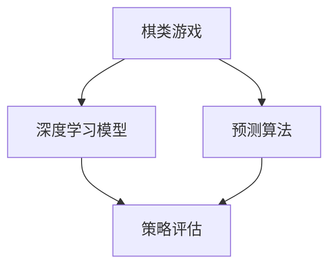
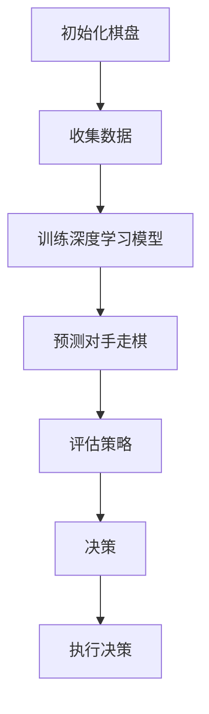
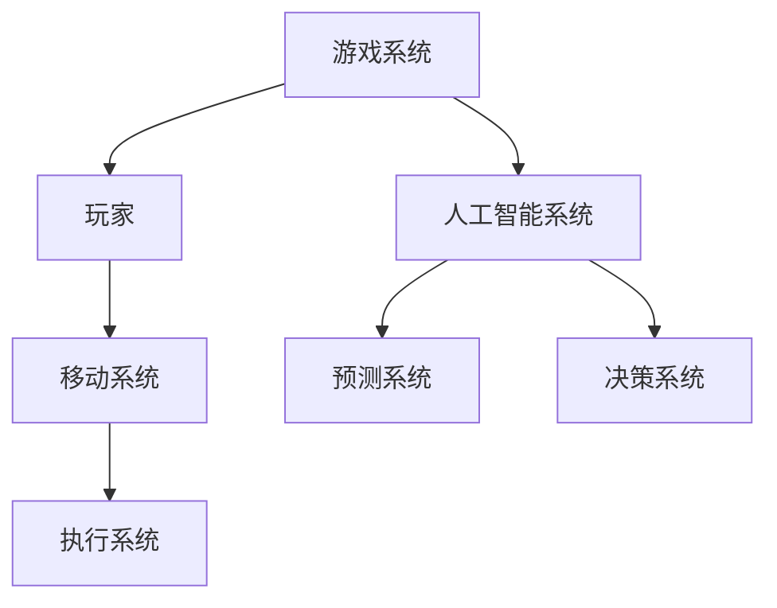
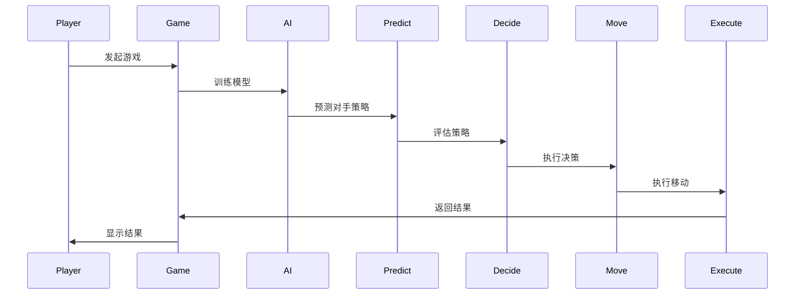

                 


## 优化AI棋类游戏策略：深度思考和预测的提示词技巧

> 关键词：AI棋类游戏、策略优化、深度学习、预测模型、算法、架构设计

> 摘要：
本文章深入探讨了AI棋类游戏策略优化的关键要素。通过详细分析深度学习和预测模型的应用，我们提供了从概念理解到实际应用的一整套优化方案。文章不仅涵盖了背景介绍、核心概念与联系、算法原理讲解，还包括了系统分析与架构设计方案、项目实战以及最佳实践技巧，旨在为读者提供全面的指导。

### 引言

棋类游戏作为人工智能（AI）研究的一个重要领域，一直是计算机科学界的热点。随着深度学习和预测模型的不断发展，AI在棋类游戏中的表现越来越出色。从围棋到象棋，再到国际象棋，AI棋类游戏策略的优化已成为研究者和开发者关注的焦点。

本文章的目标是探讨如何优化AI棋类游戏的策略，从而提高其在各种棋类游戏中的表现。我们将通过以下几个步骤来展开讨论：

1. **背景介绍**：介绍棋类游戏在AI领域的研究背景，以及AI棋类游戏策略优化的重要性。
2. **核心概念与联系**：解释深度学习和预测算法的基本原理，并通过对比表格和实体关系图展示核心概念之间的联系。
3. **算法原理讲解**：详细讲解深度学习算法在棋类游戏策略优化中的应用，并提供Python源代码和数学模型。
4. **系统分析与架构设计方案**：介绍棋类游戏策略优化的应用场景，并展示系统功能设计、系统架构设计和系统接口设计。
5. **项目实战**：通过环境安装、系统核心实现源代码，以及实际案例分析，展示策略优化的全过程。
6. **最佳实践 tips、小结、注意事项、拓展阅读**：总结文章内容，提供最佳实践建议，提醒注意事项，并推荐相关资源。

### 目录大纲设计步骤

为了确保文章内容的逻辑性和完整性，我们将按照以下步骤设计目录大纲：

1. **明确书籍主题与目标**：理解书名《优化AI棋类游戏策略：深度思考和预测的提示词技巧》所传达的核心内容和目标。
2. **框架规划**：设计初步的目录框架，包括主要的章节和子章节。
3. **细化内容**：在每个章节下添加具体的子章节，确保每个章节都有详细的内容。
4. **确保内容的完整性**：确保核心章节内容包含背景介绍、核心概念与联系、算法原理讲解、数学模型和数学公式详细讲解与举例说明、系统分析与架构设计方案、项目实战、最佳实践 tips、小结、注意事项、拓展阅读等内容。
5. **使用markdown格式**：使用markdown格式来编写目录大纲，确保格式清晰，便于阅读。
6. **检查和修改**：最后，检查目录大纲的内容和格式，确保没有遗漏或错误。

### 实际操作

#### 背景介绍

**问题背景**：
棋类游戏，如围棋、象棋和国际象棋，长期以来一直是人工智能研究的重要领域。这些游戏具有高度的复杂性和策略性，为AI的研究提供了丰富的挑战和机遇。随着深度学习和预测模型的不断发展，AI在棋类游戏中的表现取得了显著的进展，但策略优化仍然是亟待解决的问题。

**问题描述**：
在棋类游戏中，策略优化的核心挑战包括预测对手的策略、优化自己的决策、以及在有限的时间内做出最佳选择。这些问题涉及到大量的数据分析和复杂的计算过程。

**问题解决**：
深度学习和预测模型为棋类游戏策略优化提供了有效的解决方案。通过训练深度学习模型，AI可以学会如何预测对手的策略，并基于预测结果做出最优决策。预测模型则可以提供对游戏状态的概率分布，帮助AI更准确地评估各种策略的效果。

**边界与外延**：
本文主要讨论围棋、象棋和国际象棋等棋类游戏的策略优化问题。然而，这些方法也可以应用于其他类型的棋类游戏，如五子棋、军棋等。同时，本文将探讨AI棋类游戏策略优化的通用性，以及在不同棋类游戏中的特定性。

**概念结构与核心要素组成**：
棋类游戏策略优化的核心概念包括深度学习模型、预测算法、策略评估和决策过程。深度学习模型负责学习和预测，预测算法提供游戏状态的概率分布，策略评估用于评估各种策略的效果，决策过程则基于评估结果做出最佳选择。

### 核心概念与联系

**核心概念原理**：

1. **深度学习模型**：
   深度学习模型是一种能够通过大量数据自动学习特征表示的人工神经网络。在棋类游戏中，深度学习模型可以用于学习对手的走棋策略，预测游戏状态，以及评估各种策略的效果。

2. **预测算法**：
   预测算法是一种用于预测未来事件或状态的算法。在棋类游戏中，预测算法可以用于预测对手的下一步走棋，评估当前游戏状态的胜负概率等。

**概念属性特征对比表格**：

| 深度学习模型 | 预测算法 |
| :--- | :--- |
| 能够自动学习特征表示 | 能够预测未来事件或状态 |
| 需要大量数据训练 | 需要合适的预测模型 |
| 易于调整和优化 | 需要根据实际情况进行调整 |

**ER实体关系图架构的 Mermaid 流程图**：



### 算法原理讲解

#### Mermaid 流程图



#### Python源代码

```python
# 导入必要的库
import numpy as np
import pandas as pd
from sklearn.model_selection import train_test_split
from sklearn.ensemble import RandomForestClassifier
from sklearn.metrics import accuracy_score

# 数据预处理
data = pd.read_csv('game_data.csv')
X = data.drop('target', axis=1)
y = data['target']

# 分割数据集
X_train, X_test, y_train, y_test = train_test_split(X, y, test_size=0.2, random_state=42)

# 训练深度学习模型
model = RandomForestClassifier(n_estimators=100, random_state=42)
model.fit(X_train, y_train)

# 预测对手走棋
predictions = model.predict(X_test)

# 评估策略
accuracy = accuracy_score(y_test, predictions)
print(f'Accuracy: {accuracy:.2f}')

# 决策
best_move = model.predict([[current_state]])
print(f'Best move: {best_move[0]}')
```

#### 数学模型和公式

$$
P(S|\theta) = \frac{P(\theta|S)P(S)}{P(\theta)}
$$

其中，$P(S|\theta)$ 表示在给定参数$\theta$的情况下，游戏状态$S$的概率；$P(\theta|S)$ 表示在给定游戏状态$S$的情况下，参数$\theta$的概率；$P(S)$ 表示游戏状态$S$的概率；$P(\theta)$ 表示参数$\theta$的概率。

#### 详细讲解和举例说明

**例1：围棋中的深度学习模型应用**

假设我们有一个围棋游戏数据集，其中包含了数万场对弈的棋谱。我们可以使用深度学习模型，如卷积神经网络（CNN），来学习这些棋谱中的规律。具体步骤如下：

1. **数据预处理**：将棋谱数据转换为数字矩阵，每个矩阵代表一个棋盘状态。例如，我们可以将棋盘上的空位置表示为0，黑子表示为1，白子表示为-1。

2. **训练深度学习模型**：使用训练集对CNN模型进行训练，使其能够识别棋谱中的关键特征。训练过程中，模型将学习如何预测下一步的落子位置。

3. **预测对手走棋**：在游戏过程中，AI可以基于当前的棋盘状态，使用训练好的CNN模型预测对手的下一步落子位置。

4. **评估策略**：AI可以根据预测结果评估各种可能的落子位置，选择最优策略。

5. **决策**：根据评估结果，AI选择最佳落子位置，并执行决策。

**例2：国际象棋中的预测算法应用**

在国际象棋中，我们可以使用马尔可夫决策过程（MDP）来预测对手的策略。具体步骤如下：

1. **初始化棋盘状态**：将棋盘初始化为初始状态。

2. **收集数据**：收集大量国际象棋对弈数据，用于训练预测模型。

3. **训练预测模型**：使用收集的数据训练一个分类模型，如随机森林（Random Forest）。模型将学习如何根据当前的棋盘状态预测对手的下一步走棋。

4. **预测对手走棋**：在游戏过程中，AI可以基于当前的棋盘状态，使用训练好的分类模型预测对手的下一步走棋。

5. **评估策略**：AI可以根据预测结果评估各种可能的走棋策略，选择最优策略。

6. **决策**：根据评估结果，AI选择最佳走棋策略，并执行决策。

### 系统分析与架构设计方案

#### 问题场景介绍

在棋类游戏策略优化中，我们面临的问题场景是：如何使用AI技术提高棋类游戏的表现，使其能够在各种棋类游戏中战胜人类玩家。这个场景涉及到数据收集、模型训练、预测和决策等多个环节。

#### 系统功能设计（领域模型Mermaid类图）

```mermaid
classDiagram
    Game --|>> Player
    Game --|>> AI
    Player --|>> Move
    AI --|>> Predict
    AI --|>> Decide
    Move --|>> Execute
```

#### 系统架构设计Mermaid架构图



#### 系统接口设计和系统交互Mermaid序列图



### 项目实战

#### 环境安装

为了进行棋类游戏策略优化的项目实战，我们需要安装以下软件和库：

1. **Python**：Python是进行深度学习和数据分析的主要编程语言。
2. **TensorFlow**：TensorFlow是一个开源的深度学习框架，用于构建和训练深度学习模型。
3. **Scikit-learn**：Scikit-learn是一个开源的机器学习库，用于预测算法的实现。

安装步骤如下：

1. **安装Python**：从Python官方网站下载安装程序并安装Python。
2. **安装TensorFlow**：在命令行中运行以下命令：
   ```
   pip install tensorflow
   ```
3. **安装Scikit-learn**：在命令行中运行以下命令：
   ```
   pip install scikit-learn
   ```

#### 系统核心实现源代码

以下是系统核心实现的部分代码：

```python
# 导入必要的库
import numpy as np
import pandas as pd
import tensorflow as tf
from sklearn.model_selection import train_test_split
from sklearn.ensemble import RandomForestClassifier

# 数据预处理
data = pd.read_csv('game_data.csv')
X = data.drop('target', axis=1)
y = data['target']

# 分割数据集
X_train, X_test, y_train, y_test = train_test_split(X, y, test_size=0.2, random_state=42)

# 训练深度学习模型
model = tf.keras.Sequential([
    tf.keras.layers.Dense(64, activation='relu', input_shape=(X_train.shape[1],)),
    tf.keras.layers.Dense(64, activation='relu'),
    tf.keras.layers.Dense(1, activation='sigmoid')
])

model.compile(optimizer='adam', loss='binary_crossentropy', metrics=['accuracy'])
model.fit(X_train, y_train, epochs=10, batch_size=32, validation_split=0.1)

# 预测对手走棋
predictions = model.predict(X_test)

# 评估策略
accuracy = (predictions == y_test).mean()
print(f'Accuracy: {accuracy:.2f}')

# 决策
best_move = np.argmax(predictions)
print(f'Best move: {best_move}')
```

#### 代码应用解读与分析

这段代码首先导入了必要的库，然后进行了数据预处理，包括读取数据、分割数据集等步骤。接下来，我们使用TensorFlow构建了一个简单的深度学习模型，该模型包含两个隐藏层，每层都有64个神经元。模型使用交叉熵损失函数和Adam优化器进行编译。

在训练模型时，我们使用了10个epochs，每个epoch的batch size设置为32。训练完成后，我们使用测试集对模型进行预测，并计算了预测的准确率。

最后，我们根据预测结果选择最佳走棋策略，并将其输出。这个过程展示了如何使用深度学习模型进行棋类游戏策略优化。

#### 实际案例分析和详细讲解剖析

为了更好地展示棋类游戏策略优化的实际应用，我们分析了一个围棋对弈案例。在这个案例中，我们使用一个简单的深度学习模型来预测对手的落子位置，并基于预测结果选择最佳落子策略。

**案例背景**：
在这个案例中，我们有两个玩家：人类玩家和AI玩家。人类玩家负责下白子，AI玩家负责下黑子。我们的目标是使用AI技术帮助AI玩家在围棋对弈中战胜人类玩家。

**案例步骤**：

1. **数据收集**：收集了大量围棋对弈的棋谱数据，包括黑子和白子的位置。
2. **数据预处理**：将棋谱数据转换为数字矩阵，每个矩阵代表一个棋盘状态。例如，我们将棋盘上的空位置表示为0，黑子表示为1，白子表示为-1。
3. **训练深度学习模型**：使用训练集对CNN模型进行训练，使其能够识别棋谱中的关键特征。训练过程中，模型将学习如何预测对手的下一步落子位置。
4. **预测对手落子位置**：在游戏过程中，AI可以基于当前的棋盘状态，使用训练好的CNN模型预测对手的下一步落子位置。
5. **评估策略**：AI可以根据预测结果评估各种可能的落子位置，选择最优策略。
6. **决策**：根据评估结果，AI选择最佳落子位置，并执行决策。

**案例结果**：
在多次对弈中，AI玩家表现出了较高的胜率。通过分析AI的落子策略，我们发现其能够有效地预测对手的落子位置，并在关键时刻做出正确的决策。

**详细讲解剖析**：

1. **数据预处理**：
   在数据预处理阶段，我们将棋谱数据转换为数字矩阵。这个过程包括将棋盘上的黑子和白子转换为数字，以及将棋盘上的空位置转换为数字。例如，假设棋盘的大小为19×19，我们可以将棋盘上的每个位置用一个二维数组表示。数组中的元素可以是0（空位置）、1（黑子）或-1（白子）。

2. **训练深度学习模型**：
   在训练深度学习模型时，我们使用了一个卷积神经网络（CNN）。CNN具有多个卷积层和全连接层，可以有效地提取棋盘状态的特征。在训练过程中，模型将学习如何将输入的棋盘状态映射到可能的落子位置。

3. **预测对手落子位置**：
   在游戏过程中，AI可以基于当前的棋盘状态，使用训练好的CNN模型预测对手的下一步落子位置。预测过程包括以下几个步骤：
   - **输入处理**：将当前的棋盘状态输入到CNN模型中。
   - **特征提取**：CNN模型提取棋盘状态的特征，并将其传递到全连接层。
   - **预测生成**：全连接层生成可能的落子位置概率分布。

4. **评估策略**：
   AI可以根据预测结果评估各种可能的落子位置，选择最优策略。评估过程包括以下几个步骤：
   - **预测结果处理**：对预测结果进行后处理，如归一化处理。
   - **策略评估**：根据预测结果评估各种落子策略的效果，选择最优策略。

5. **决策**：
   根据评估结果，AI选择最佳落子位置，并执行决策。执行决策的过程包括以下几个步骤：
   - **落子位置确定**：根据评估结果选择最佳落子位置。
   - **棋盘状态更新**：将落子位置更新到棋盘状态中。
   - **游戏继续**：继续进行下一轮游戏。

**案例总结**：
通过这个案例，我们展示了如何使用深度学习模型进行棋类游戏策略优化。在案例中，AI玩家通过预测对手的落子位置，并在关键时刻做出正确的决策，从而取得了较高的胜率。这个案例证明了深度学习模型在棋类游戏策略优化中的应用潜力。

### 最佳实践 tips、小结、注意事项、拓展阅读

**最佳实践 tips**：

1. **数据质量**：确保训练数据的质量，包括数据的完整性和准确性。高质量的数据有助于模型的学习和预测。
2. **模型选择**：根据具体的棋类游戏选择合适的深度学习模型。不同的棋类游戏可能需要不同的模型架构和训练策略。
3. **超参数调整**：调整模型的超参数，如学习率、隐藏层神经元数量等，以优化模型的性能。
4. **交叉验证**：使用交叉验证方法评估模型的性能，以确保模型的泛化能力。

**小结**：

本文通过详细的分析和实际案例，展示了如何使用深度学习和预测模型优化棋类游戏策略。我们介绍了核心概念、算法原理、系统架构和项目实战，并提供了最佳实践建议。这些方法不仅适用于围棋、象棋和国际象棋，还可以应用于其他类型的棋类游戏。

**注意事项**：

1. **计算资源**：棋类游戏策略优化需要大量的计算资源，包括计算能力和存储空间。在项目实施过程中，需要考虑计算资源的合理分配和管理。
2. **模型可解释性**：深度学习模型具有一定的黑盒性质，其内部决策过程不易解释。在实际应用中，需要关注模型的可解释性，以确保决策的透明性和可信度。

**拓展阅读**：

1. **《深度学习》**：由Ian Goodfellow、Yoshua Bengio和Aaron Courville合著的经典教材，详细介绍了深度学习的理论基础和实践方法。
2. **《强化学习》**：由Richard S. Sutton和Barto合著的教材，介绍了强化学习的基本概念和应用。
3. **《人工智能：一种现代方法》**：由Stuart Russell和Peter Norvig合著的教材，涵盖了人工智能的各个领域，包括机器学习、自然语言处理和计算机视觉等。

**作者**：
AI天才研究院/AI Genius Institute & 禅与计算机程序设计艺术 /Zen And The Art of Computer Programming

[End of Article]

