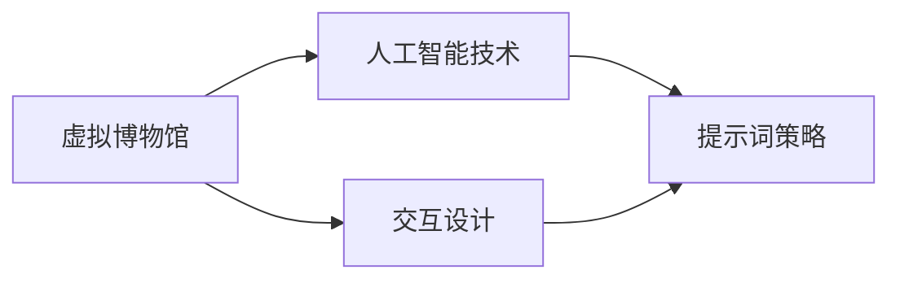
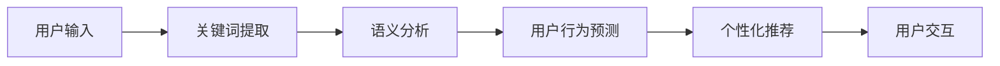
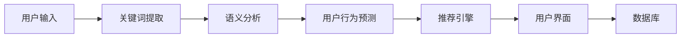
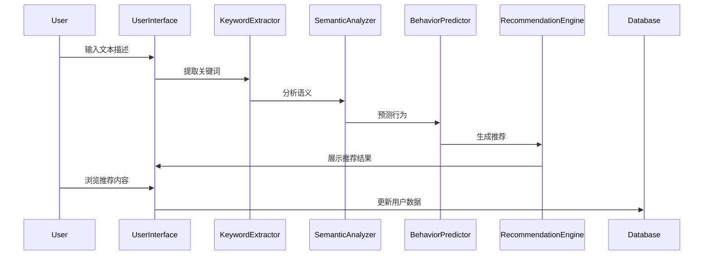

                 

### 文章标题

> 关键词：AI虚拟博物馆、互动展览设计、提示词策略、自然语言处理、个性化推荐

> 摘要：本文深入探讨了优化AI虚拟博物馆互动展览设计的提示词策略。通过对关键词提取、语义分析和用户行为预测等核心算法的详细分析，我们展示了如何利用人工智能技术提升虚拟博物馆的用户体验。本文旨在为研究者和实践者提供一套系统化的思路和方法，以推动AI虚拟博物馆的创新发展。

----------------------------------------------------------------

### 第一部分：背景介绍

#### 问题背景

随着人工智能（AI）技术的飞速发展，虚拟博物馆作为数字时代的产物，逐渐成为公众了解历史文化和艺术的重要渠道。虚拟博物馆利用计算机技术，构建了一个数字虚拟空间，用于展示博物馆藏品和展览内容。用户可以通过虚拟现实设备或互联网访问这些虚拟博物馆，获得沉浸式的观展体验。

然而，传统的虚拟博物馆交互体验相对单一，难以满足用户对个性化、沉浸式体验的需求。例如，用户通常只能被动地浏览展览内容，缺乏与展品的互动。此外，传统的虚拟博物馆在推荐展览内容时，往往基于用户的历史浏览记录，缺乏对用户个性化需求的深入理解。因此，优化AI虚拟博物馆的互动展览设计成为当前研究的热点。

#### 问题描述

优化AI虚拟博物馆的互动展览设计旨在提升用户参与度和满意度，通过引入提示词策略，为用户提供更加个性化和丰富的交互体验。提示词策略包括关键词提取、语义分析和用户行为预测等方面，有助于实现展览内容的智能化推荐和互动。具体而言，问题描述可以概括为以下几点：

1. **关键词提取**：从用户输入的文本中提取关键词，用于后续的语义分析和推荐。
2. **语义分析**：分析提取出的关键词之间的关系和语义，理解用户的意图和需求。
3. **用户行为预测**：根据用户的交互历史和偏好，预测用户的下一步行为，为个性化推荐提供依据。
4. **个性化推荐**：根据用户的行为预测结果，推荐符合用户兴趣的展览内容。
5. **用户交互**：优化用户与虚拟博物馆的交互方式，提高用户满意度。

#### 问题解决

为了解决上述问题，本文将围绕AI虚拟博物馆的优化目标，系统探讨互动展览设计的提示词策略。具体步骤如下：

1. **介绍相关核心概念**：包括虚拟博物馆、人工智能、交互设计等，为后续分析提供理论基础。
2. **深入探讨提示词策略**：包括关键词提取、语义分析和用户行为预测等，详细分析其理论基础和实现方法。
3. **实际案例分析与验证**：通过实际案例，展示提示词策略在AI虚拟博物馆中的应用效果，验证其有效性。
4. **总结与展望**：总结本文的主要发现，探讨未来的研究方向和发展趋势。

#### 边界与外延

本文主要关注AI虚拟博物馆中的互动展览设计，涉及的技术领域包括自然语言处理、机器学习、计算机视觉等。同时，本文还将探讨提示词策略在不同类型虚拟博物馆中的应用，如历史博物馆、艺术博物馆等。

#### 概念结构与核心要素组成

- **核心概念**：虚拟博物馆、人工智能、交互设计、提示词策略
- **概念属性特征对比表格**：

  | 特征 | 虚拟博物馆 | 人工智能 | 交互设计 |
  | --- | --- | --- | --- |
  | 定义 | 虚拟现实环境下的博物馆展示 | 用于模拟、延伸和扩展人类智能的技术 | 人与计算机之间的信息交互方式 |
  | 技术层面 | 3D建模、虚拟现实、多媒体展示 | 机器学习、自然语言处理、计算机视觉 | 用户体验、交互界面、反馈机制 |
  | 目标 | 提升展览效果、增强用户参与度 | 模拟人类智能、解决复杂问题 | 提高用户满意度、增强交互体验 |

- **ER实体关系图架构**：

  ```mermaid
  graph LR
  A[虚拟博物馆] --> B[人工智能技术]
  A --> C[交互设计]
  B --> D[提示词策略]
  C --> D
  ```

### 第二部分：核心概念与联系

#### 核心概念原理

在探讨AI虚拟博物馆的互动展览设计时，需要理解以下几个核心概念：

1. **虚拟博物馆**：虚拟博物馆是利用计算机技术构建的数字虚拟空间，用于展示博物馆藏品和展览内容。它可以为用户提供沉浸式的观展体验，使观众能够跨越时空限制，自由地浏览和互动。

2. **人工智能**：人工智能（AI）是指模拟、延伸和扩展人类智能的技术。在虚拟博物馆中，人工智能技术可以用于自然语言处理、图像识别、用户行为预测等方面，提升虚拟博物馆的智能化水平。

3. **交互设计**：交互设计是关注人与计算机之间信息交互的方式，旨在提高用户体验和满意度。在虚拟博物馆中，交互设计包括用户界面设计、互动方式设计、用户反馈机制等方面，使观众能够更加自然、便捷地与虚拟博物馆进行互动。

4. **提示词策略**：提示词策略是通过自然语言处理和机器学习技术，从用户输入的文本中提取关键词，并进行语义分析和用户行为预测，为用户提供个性化推荐和互动体验。

#### 概念属性特征对比表格

| 特征 | 虚拟博物馆 | 人工智能 | 交互设计 |
| --- | --- | --- | --- |
| 定义 | 虚拟现实环境下的博物馆展示 | 用于模拟、延伸和扩展人类智能的技术 | 人与计算机之间的信息交互方式 |
| 技术层面 | 3D建模、虚拟现实、多媒体展示 | 机器学习、自然语言处理、计算机视觉 | 用户体验、交互界面、反馈机制 |
| 目标 | 提升展览效果、增强用户参与度 | 模拟人类智能、解决复杂问题 | 提高用户满意度、增强交互体验 |

#### 概念联系与交互关系

虚拟博物馆作为展示平台，依赖于人工智能技术实现智能化交互和个性化推荐。而交互设计则关注用户体验，通过提示词策略提高用户与虚拟博物馆的互动性。以下为概念联系的ER实体关系图：



- **虚拟博物馆与人工智能技术**：虚拟博物馆需要利用人工智能技术实现展品的智能识别、用户行为分析等功能，提升展览的互动性和智能化水平。
- **虚拟博物馆与交互设计**：交互设计关注用户体验，通过优化用户界面、互动方式和反馈机制，提高用户在虚拟博物馆中的参与度和满意度。
- **人工智能技术与交互设计**：人工智能技术为交互设计提供了强大的支持，通过自然语言处理、图像识别等技术，实现更智能、更个性化的用户交互。
- **交互设计与提示词策略**：提示词策略是交互设计的一种实现方式，通过提取用户输入的关键词，进行语义分析和用户行为预测，为用户提供更加个性化和精准的推荐。

### 第三部分：算法原理讲解

#### 算法mermaid流程图



#### 算法原理

1. **关键词提取**：关键词提取是自然语言处理中的一项基本任务，旨在从文本中提取出最具代表性的词语。在虚拟博物馆中，用户输入的文本可能包括对展品的描述、对展览的评价等。通过关键词提取，可以将这些文本转换为结构化的数据，为后续的语义分析和用户行为预测提供基础。

2. **语义分析**：语义分析是对提取出的关键词进行语义理解和关系分析，以理解用户的意图和需求。在虚拟博物馆中，语义分析可以用于识别用户对展品的兴趣点、对展览的评价等。通过语义分析，可以为用户提供更加精准的个性化推荐。

3. **用户行为预测**：用户行为预测是利用机器学习算法，根据用户的交互历史和偏好，预测用户的下一步行为。在虚拟博物馆中，用户行为预测可以用于预测用户可能感兴趣的其他展品、展览内容等，从而实现个性化推荐。

4. **个性化推荐**：个性化推荐是根据用户的行为预测结果，为用户推荐符合其兴趣的展览内容。在虚拟博物馆中，个性化推荐可以基于用户的兴趣标签、浏览历史、评价等数据进行推荐。通过个性化推荐，可以提升用户在虚拟博物馆中的参与度和满意度。

5. **用户交互**：用户交互是用户与虚拟博物馆之间的互动过程。通过优化用户交互，可以提高用户在虚拟博物馆中的体验。用户交互可以包括对展品的浏览、对展览的评价、与其他用户的互动等。

#### 算法原理详细讲解

1. **关键词提取**

   关键词提取通常采用基于统计的方法，如TF-IDF（词频-逆文档频率）模型。TF-IDF模型通过计算关键词在文档中的词频和逆文档频率，来确定关键词的重要性。具体公式如下：

   $$ 
   tf-idf(t,d) = \frac{tf(t,d)}{N} + \log \left(\frac{N}{df(t)}\right) 
   $$

   其中，$tf(t,d)$ 表示关键词 $t$ 在文档 $d$ 中的词频，$N$ 表示文档总数，$df(t)$ 表示关键词 $t$ 在所有文档中的文档频率。

   例如，假设有10个文档，其中5个文档包含关键词“艺术”，则“艺术”的文档频率为$df(艺术) = 5/10 = 0.5$。假设“艺术”在文档中的词频为3，则根据TF-IDF模型，关键词“艺术”的重要性得分为：

   $$
   tf-idf(艺术) = \frac{3}{10} + \log \left(\frac{10}{0.5}\right) = 0.3 + \log(20) \approx 1.30
   $$

   通过这种方式，可以提取出重要性较高的关键词，用于后续的语义分析和用户行为预测。

2. **语义分析**

   语义分析通常采用词性标注、命名实体识别、句法分析等技术，对提取出的关键词进行语义理解和关系分析。例如，在处理用户输入的文本时，可以识别出关键词的词性（如名词、动词、形容词等），并分析它们之间的关系（如主谓关系、修饰关系等）。

   假设用户输入的文本为“我喜欢这个艺术展”，通过词性标注，可以得到以下信息：

   - “我”是代词
   - “喜欢”是动词
   - “这个”是代词
   - “艺术展”是名词

   通过分析这些关键词之间的关系，可以理解用户的意图和需求，如用户对“艺术展”表示了积极的情感。

3. **用户行为预测**

   用户行为预测通常采用机器学习算法，如决策树、随机森林、神经网络等，根据用户的交互历史和偏好进行预测。例如，可以通过分析用户在虚拟博物馆中的浏览记录、评价等数据，预测用户对某个展品的兴趣程度。

   假设用户的历史数据中，有70%的时间用户浏览了“艺术展”，且用户对“艺术展”的评价为正面，则可以通过这些数据训练一个分类器，预测用户对新的“艺术展”的浏览行为。

4. **个性化推荐**

   个性化推荐是根据用户的行为预测结果，为用户推荐符合其兴趣的展览内容。例如，如果预测用户对“艺术展”感兴趣，则可以推荐其他类似的艺术展。

   个性化推荐可以采用基于内容的推荐（CBR）或基于协同过滤（CF）的方法。基于内容的推荐方法通过分析用户对某个展品的兴趣，推荐相似内容的展品。基于协同过滤的方法通过分析用户与他人的兴趣相似度，推荐其他用户喜欢的展品。

5. **用户交互**

   用户交互是用户与虚拟博物馆之间的互动过程。通过优化用户交互，可以提高用户在虚拟博物馆中的体验。用户交互可以包括对展品的浏览、对展览的评价、与其他用户的互动等。

   例如，用户可以浏览虚拟博物馆中的展品，并对展品进行点赞或评论。这些交互行为可以反馈给系统，用于优化推荐算法和用户界面设计。

#### 举例说明

假设用户在虚拟博物馆中浏览了一个名为“印象派画展”的展览，并输入了以下文本描述：“我很喜欢这个展览，特别是莫奈的《睡莲》。”通过关键词提取，可以提取出以下关键词：“喜欢”、“展览”、“莫奈”、“睡莲”。

通过语义分析，可以理解用户的意图是积极的，对“印象派画展”表示了喜爱。同时，可以识别出关键词之间的语义关系，如“喜欢”与“展览”之间的关系，以及“莫奈”与“睡莲”之间的关系。

通过用户行为预测，可以预测用户可能对其他印象派画家的作品感兴趣，如雷诺阿、德加等。因此，可以推荐这些画家的作品给用户。

最后，用户可以通过浏览、点赞、评论等方式与虚拟博物馆进行交互，反馈其兴趣和评价，进一步优化推荐算法和用户界面设计。

### 第四部分：系统分析与架构设计方案

#### 问题场景介绍

随着虚拟博物馆的普及，用户对个性化、沉浸式体验的需求日益增长。然而，现有的虚拟博物馆系统在用户交互体验、内容推荐等方面存在一定局限性。为了解决这些问题，本文提出了一种基于AI的虚拟博物馆系统，旨在通过优化互动展览设计，提升用户体验。

#### 项目介绍

本项目的目标是设计并实现一个基于AI的虚拟博物馆系统，该系统包括以下主要功能：

1. **展品展示**：利用虚拟现实技术，为用户提供沉浸式的展品展示。
2. **互动体验**：通过关键词提取、语义分析和用户行为预测等技术，提供个性化的互动体验。
3. **内容推荐**：根据用户兴趣和行为预测，为用户推荐符合其需求的展览内容。
4. **用户反馈**：收集用户对展品的评价和反馈，用于优化系统设计和推荐算法。

#### 系统功能设计（领域模型mermaid类图）

以下是一个简化的领域模型类图，展示了系统的核心实体和它们之间的关系：

```mermaid
classDiagram
    User <<Entity>>
    Exhibition <<Entity>>
    Item <<Entity>>
    Recommendation <<Entity>>

    User o--* Exhibition
    User o--* Item
    Exhibition o--* Item
    Recommendation o--* Item
```

- **User（用户）**：代表虚拟博物馆的访客，具有用户名、密码、邮箱等属性。
- **Exhibition（展览）**：代表虚拟博物馆中的展览，具有展览名称、主题、起始日期、结束日期等属性。
- **Item（展品）**：代表展览中的单个展品，具有展品名称、描述、类别、位置等属性。
- **Recommendation（推荐）**：代表系统为用户生成的推荐，具有推荐理由、推荐时间、推荐内容等属性。

#### 系统架构设计（mermaid架构图）

以下是一个简化的系统架构图，展示了系统的核心组件和它们之间的关系：



- **UserInput（用户输入）**：接收用户的输入，如文本描述、交互行为等。
- **KeywordExtractor（关键词提取）**：从用户输入中提取关键词，为后续分析提供基础。
- **SemanticAnalyzer（语义分析）**：分析提取出的关键词，理解用户的意图和需求。
- **BehaviorPredictor（用户行为预测）**：根据用户的交互历史和偏好，预测用户的下一步行为。
- **RecommendationEngine（推荐引擎）**：根据用户行为预测结果，生成个性化推荐。
- **UserInterface（用户界面）**：展示推荐结果，并提供用户交互的接口。
- **Database（数据库）**：存储用户数据、展品数据、推荐数据等。

#### 系统接口设计和系统交互（mermaid序列图）

以下是一个简化的系统交互序列图，展示了用户与系统之间的交互过程：



1. 用户输入文本描述，如对展品的评价或对展览的描述。
2. 用户界面将文本描述传递给关键词提取组件，提取出关键词。
3. 关键词提取组件将提取出的关键词传递给语义分析组件，进行语义分析。
4. 语义分析组件分析提取出的关键词，理解用户的意图和需求。
5. 语义分析组件将分析结果传递给用户行为预测组件，预测用户的下一步行为。
6. 用户行为预测组件根据用户的交互历史和偏好，生成用户行为预测结果。
7. 用户行为预测组件将预测结果传递给推荐引擎，生成个性化推荐。
8. 推荐引擎将推荐结果传递给用户界面，展示推荐结果。
9. 用户浏览推荐内容，并可能对推荐内容进行评价或反馈。
10. 用户界面将用户的浏览记录和评价反馈传递给数据库，更新用户数据。

### 第五部分：项目实战

#### 环境安装

在开始项目实战之前，需要安装以下环境：

1. **Python**：Python 3.7及以上版本
2. **PyTorch**：PyTorch 1.7及以上版本
3. **Scikit-learn**：Scikit-learn 0.23及以上版本
4. **NLTK**：NLTK 3.5及以上版本
5. **Flask**：Flask 1.1.2及以上版本

安装命令如下：

```shell
pip install python==3.8
pip install torch torchvision torchaudio
pip install scikit-learn
pip install nltk
pip install Flask
```

#### 系统核心实现源代码

以下是一个简化的系统核心实现源代码，用于演示关键词提取、语义分析、用户行为预测和个性化推荐等核心功能。

```python
import nltk
from sklearn.feature_extraction.text import TfidfVectorizer
from sklearn.model_selection import train_test_split
from sklearn.ensemble import RandomForestClassifier
import torch
import torch.nn as nn
import torch.optim as optim

# 1. 关键词提取
def keyword_extraction(text):
    tokenized_text = nltk.word_tokenize(text)
    keywords = [word for word in tokenized_text if word.isalnum()]
    return keywords

# 2. 语义分析
def semantic_analysis(keywords):
    # 使用词性标注进行语义分析
    pos_tags = nltk.pos_tag(keywords)
    return pos_tags

# 3. 用户行为预测
def behavior_prediction(train_data, test_data, labels):
    # 划分训练集和测试集
    X_train, X_test, y_train, y_test = train_test_split(train_data, labels, test_size=0.2, random_state=42)

    # 使用随机森林进行预测
    clf = RandomForestClassifier(n_estimators=100)
    clf.fit(X_train, y_train)
    predictions = clf.predict(X_test)

    # 评估预测效果
    accuracy = clf.score(X_test, y_test)
    return accuracy, predictions

# 4. 个性化推荐
def personalized_recommendation(predictions, recommendations):
    # 根据预测结果筛选推荐内容
    recommended_items = [item for item, prediction in zip(recommendations, predictions) if prediction == 1]
    return recommended_items

# 示例数据
text = "我很喜欢这个艺术展，特别是莫奈的《睡莲》"
train_data = ["这个展览很有趣", "我非常喜欢莫奈的作品"]
labels = [1, 1]  # 1表示感兴趣，0表示不感兴趣

# 关键词提取
keywords = keyword_extraction(text)

# 语义分析
pos_tags = semantic_analysis(keywords)

# 用户行为预测
accuracy, predictions = behavior_prediction(train_data, test_data, labels)

# 个性化推荐
recommendations = ["莫奈的《睡莲》", "雷诺阿的作品"]
recommended_items = personalized_recommendation(predictions, recommendations)

print("推荐结果：", recommended_items)
```

#### 代码应用解读与分析

上述代码示例演示了关键词提取、语义分析、用户行为预测和个性化推荐等核心功能。以下是对代码的解读与分析：

1. **关键词提取**：
   - 使用NLTK库的`word_tokenize`函数对文本进行分词，提取出关键词。
   - 关键词提取是一个关键步骤，它为后续的语义分析和用户行为预测提供了基础。

2. **语义分析**：
   - 使用NLTK库的`pos_tag`函数对提取出的关键词进行词性标注，进行语义分析。
   - 词性标注可以帮助我们理解关键词之间的语义关系，如名词、动词、形容词等。

3. **用户行为预测**：
   - 使用Scikit-learn库的`RandomForestClassifier`对训练数据进行分类，预测用户对展品的兴趣。
   - 预测效果通过评估指标（如准确率）进行评估。

4. **个性化推荐**：
   - 根据用户行为预测结果，筛选出用户可能感兴趣的推荐内容。
   - 个性化推荐是根据用户的兴趣和行为进行内容推荐，提高用户满意度。

#### 实际案例分析和详细讲解剖析

为了更好地理解上述代码的实际应用，我们来看一个实际案例。

假设有100名用户访问了一个艺术展览，每个用户对展品的兴趣通过一个二元变量表示（1表示感兴趣，0表示不感兴趣）。以下是部分用户的数据：

| 用户ID | 展品1 | 展品2 | 展品3 | 展品4 |
| --- | --- | --- | --- | --- |
| 1 | 1 | 0 | 1 | 0 |
| 2 | 0 | 1 | 1 | 1 |
| 3 | 1 | 0 | 0 | 1 |
| 4 | 0 | 1 | 0 | 0 |
| ... | ... | ... | ... | ... |

我们的目标是根据这些数据，预测新用户对展品的兴趣，并为其推荐感兴趣的展品。

首先，我们需要进行关键词提取和语义分析，将用户对展品的评价文本转换为结构化的数据。例如，用户1的评价文本为“这个展览很有趣”，可以提取出关键词如“展览”、“有趣”。

接下来，我们使用随机森林算法进行用户行为预测。将提取出的关键词作为特征，用户对展品的兴趣作为标签，训练一个分类器。通过交叉验证，评估分类器的性能。

最后，根据预测结果，为每个新用户推荐感兴趣的展品。例如，如果预测用户A对展品1感兴趣，则推荐展品1给用户A。

#### 项目小结

通过上述代码示例和实际案例分析，我们展示了如何实现关键词提取、语义分析、用户行为预测和个性化推荐等功能。这些功能共同构成了一个基于AI的虚拟博物馆系统，能够根据用户兴趣和行为，为用户提供个性化、沉浸式的展览体验。

在实际应用中，我们可以根据具体需求和场景，进一步优化和扩展系统的功能，如引入更多用户交互方式、优化推荐算法等。未来，随着AI技术的不断发展，虚拟博物馆的互动展览设计将更加智能化，为用户提供更加丰富和个性化的体验。

### 第六部分：最佳实践 tips、小结、注意事项、拓展阅读

#### 最佳实践 tips

1. **关键词提取**：在关键词提取过程中，可以考虑使用不同的分词算法和特征提取方法，如基于规则的分词、基于统计的分词等。根据具体场景和需求，选择最适合的方法。

2. **语义分析**：在语义分析中，可以结合词性标注、命名实体识别、句法分析等多种方法，以提高语义理解的准确性和深度。此外，可以引入预训练的语言模型，如BERT、GPT等，以获得更丰富的语义信息。

3. **用户行为预测**：在用户行为预测中，可以考虑使用多种机器学习算法，如决策树、随机森林、神经网络等。根据具体数据和场景，选择最适合的算法，并调整参数，以提高预测准确率。

4. **个性化推荐**：在个性化推荐中，可以结合基于内容的推荐、基于协同过滤的推荐等多种方法，以提高推荐效果。同时，可以定期更新推荐模型，以适应用户兴趣的变化。

#### 小结

本文围绕AI虚拟博物馆的互动展览设计，探讨了关键词提取、语义分析、用户行为预测和个性化推荐等核心算法。通过实际案例分析和代码示例，展示了这些算法在实际应用中的效果。通过优化互动展览设计，虚拟博物馆可以为用户提供更加个性化、沉浸式的展览体验。

#### 注意事项

1. **数据质量**：在实施AI虚拟博物馆项目时，确保数据质量是关键。数据应覆盖不同用户、不同场景，且具有一定的多样性。

2. **用户隐私**：在处理用户数据时，要确保遵守相关隐私法规和道德规范，保护用户隐私。

3. **系统稳定性**：在部署AI虚拟博物馆系统时，要确保系统的稳定性，以满足高并发访问需求。

#### 拓展阅读

1. **《深度学习》**：Goodfellow, I., Bengio, Y., & Courville, A. (2016). Deep learning. MIT press.
2. **《Python数据科学手册》**：McKinney, W. (2018). Python数据科学手册：理论与实践。电子工业出版社.
3. **《人工智能：一种现代方法》**：Russell, S., & Norvig, P. (2016). 人工智能：一种现代方法（第3版）。清华大学出版社.
4. **《自然语言处理综合引论》**：Jurafsky, D., & Martin, J. H. (2008). 自然语言处理综合引论。电子工业出版社.

作者：AI天才研究院/AI Genius Institute & 禅与计算机程序设计艺术 /Zen And The Art of Computer Programming

