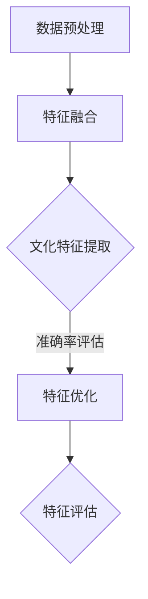
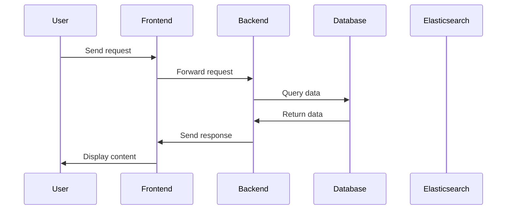

                 

### 优化AI虚拟旅游体验：文化深度体验的提示词策略

---

**关键词：** AI虚拟旅游，文化深度体验，提示词策略，深度学习，系统架构设计

**摘要：** 本文深入探讨了如何通过AI技术优化虚拟旅游体验，特别是实现文化深度体验的方法。文章首先介绍了虚拟旅游的现状及存在的问题，然后详细阐述了AI在虚拟旅游中的应用。重点分析了提示词策略的设计原理，包括提示词的类型、生成方法和评估与优化。随后，文章探讨了基于深度学习的文化特征提取算法，提供了Python源代码实现及数学模型与公式。最后，文章介绍了虚拟旅游体验系统的架构设计，并通过一个实际项目实战，详细讲解了系统核心实现、代码应用解读、案例分析及项目总结。

---

### 引言

随着互联网和人工智能技术的快速发展，虚拟旅游体验逐渐成为人们探索世界的新方式。然而，当前的虚拟旅游体验仍然存在一些问题，如文化深度体验不足、交互性差等。为了解决这些问题，AI技术，尤其是自然语言处理和深度学习，成为了关键工具。本文旨在探讨如何通过优化AI虚拟旅游体验，提升用户的文化深度体验。

首先，我们需要理解虚拟旅游体验的现状及存在的问题。虚拟旅游体验通过互联网和虚拟现实技术，让用户能够远程参观各种旅游景点。然而，现有技术往往只能提供表面上的浏览，缺乏对文化内涵的深入挖掘。此外，用户的互动体验也较为单一，无法真正满足个性化需求。

为了解决这些问题，AI技术的应用显得尤为重要。自然语言处理可以用于理解用户的语言输入，从而提供更加个性化的服务。深度学习则可以用于从大量的旅游数据中提取出文化特征，为用户提供更加丰富的文化体验。

本文将分为以下几个部分：

1. **问题背景与核心概念**：介绍虚拟旅游体验的现状、问题及AI在虚拟旅游中的应用。
2. **核心概念**：详细探讨虚拟旅游体验的评估指标、AI技术与虚拟旅游以及提示词策略的设计原理。
3. **算法原理**：介绍基于深度学习的文化特征提取算法，包括算法流程、Python源代码实现及数学模型与公式。
4. **系统分析与架构设计**：介绍虚拟旅游体验系统的架构设计，包括系统功能设计、架构设计、接口设计和交互序列图。
5. **项目实战**：通过一个实际项目，详细讲解系统核心实现、代码应用解读、案例分析及项目总结。
6. **最佳实践与拓展**：提供最佳实践技巧、注意事项及拓展阅读。

通过以上内容的逐步分析，我们希望能够为优化AI虚拟旅游体验提供有价值的参考和思路。

### 第一部分：问题背景与核心概念

#### 1.1 问题描述

虚拟旅游体验是指通过互联网和虚拟现实（VR）技术，用户可以在家中或任何有网络连接的地方，远程参观各种旅游景点。这种体验旨在让用户在虚拟环境中感受到类似现实旅游的体验，从而满足他们对旅游的需求。

然而，现有的虚拟旅游体验仍然存在一些问题。首先，文化深度体验不足。大多数虚拟旅游平台仅提供景点的图像和简要介绍，用户很难深入了解景点的文化内涵和历史背景。其次，交互性差。虚拟旅游体验通常缺乏与用户的实时互动，用户无法与景点进行深入的交流。此外，现有技术也难以满足用户个性化的需求，无法根据用户的兴趣和行为进行智能推荐。

#### 1.2 虚拟旅游体验的现状

虚拟旅游体验自20世纪末以来逐渐发展，随着互联网和VR技术的进步，其应用范围不断扩大。目前，许多旅游景点和旅游服务提供商都提供了虚拟旅游服务，用户可以通过网页或应用程序进行虚拟游览。这些平台通常提供全景图像、360度视频和虚拟导游等功能，让用户能够从多个角度了解景点。

然而，尽管虚拟旅游体验在一定程度上满足了用户的需求，但其文化深度和交互性仍有待提高。许多平台仍然依赖于传统的图文介绍，缺乏对文化内涵的深度挖掘。此外，用户在虚拟环境中的互动体验也较为有限，难以提供更加个性化的服务。

#### 1.3 AI在虚拟旅游中的应用

为了解决虚拟旅游体验中的问题，AI技术，特别是自然语言处理和深度学习，被广泛应用。自然语言处理（NLP）可以用于理解和处理用户的语言输入，从而提供更加个性化的服务。例如，通过NLP技术，虚拟导游可以理解用户的提问，并提供详细的回答。

深度学习（DL）则可以用于从大量的旅游数据中提取出文化特征，为用户提供更加丰富的文化体验。深度学习模型，如卷积神经网络（CNN）和循环神经网络（RNN），可以用于图像识别和文本分析，从而帮助用户更好地了解景点的文化内涵。

此外，AI还可以用于优化用户的交互体验。通过机器学习算法，虚拟导游可以学习用户的兴趣和行为，从而提供更加个性化的推荐。例如，如果一个用户对历史文化感兴趣，虚拟导游可以推荐相关的景点和故事。

#### 1.4 文化深度体验的重要性

文化深度体验对于用户来说至关重要。旅游不仅仅是为了观光，更重要的是了解和体验当地的文化。通过深入了解文化，用户可以更好地理解旅游目的地的历史、社会和生活方式，从而获得更加丰富的旅游体验。

然而，现有的虚拟旅游体验往往缺乏文化深度。用户只能通过简单的图像和文本介绍来了解景点，很难感受到其背后的文化内涵。因此，提升文化深度体验对于提高虚拟旅游的吸引力和用户满意度具有重要意义。

#### 1.5 提示词策略的概念

提示词策略是优化虚拟旅游体验的关键技术之一。提示词是指用于引导用户了解景点文化内涵的文本或图像。通过设计合理的提示词策略，虚拟导游可以引导用户深入了解景点的历史、文化和社会背景。

提示词策略包括以下几个方面：

1. **提示词类型**：根据用户的需求和景点的特点，设计不同类型的提示词。例如，历史背景、文化习俗、名人故事等。

2. **提示词生成方法**：通过自然语言处理技术，自动生成提示词。例如，基于文本生成、图像识别和文本嵌入等方法。

3. **提示词评估与优化**：评估提示词的效果，并根据用户的反馈进行优化。例如，通过用户评价、点击率和停留时间等指标进行评估。

通过合理的提示词策略，虚拟导游可以提供更加丰富的文化内容，使用户能够深入体验旅游目的地的文化。

### 第二部分：核心概念

#### 2.1 虚拟旅游体验的评估指标

为了评估虚拟旅游体验的质量，我们需要定义一系列评估指标。这些指标可以帮助我们了解用户对虚拟旅游体验的满意度，从而为优化提供依据。以下是一些常见的评估指标：

1. **用户满意度**：通过问卷调查或用户反馈来评估用户对虚拟旅游体验的满意度。这可以是定量指标，如评分，也可以是定性指标，如用户评论。

2. **交互性**：评估虚拟旅游体验的交互程度。这可以通过用户与虚拟导游的互动次数、互动质量等指标来衡量。

3. **文化深度**：评估虚拟旅游体验的文化深度。这可以通过用户对景点历史、文化和社会背景的了解程度来衡量。

4. **个性化**：评估虚拟旅游体验的个性化程度。这可以通过用户定制服务、个性化推荐等指标来衡量。

5. **用户体验**：评估用户在使用虚拟旅游体验过程中的舒适度、流畅度和操作便捷性。

#### 2.2 量化分析

为了更好地评估虚拟旅游体验的质量，我们可以使用量化分析的方法。以下是一些常用的量化分析方法：

1. **统计分析**：通过对用户反馈数据的统计分析，了解用户的满意度、交互性和个性化程度等指标。例如，可以使用平均值、中位数和标准差等统计指标来描述用户满意度。

2. **机器学习**：通过机器学习算法，对用户反馈数据进行分类、聚类和预测等分析。例如，可以使用回归分析来预测用户满意度，使用分类算法来识别影响用户体验的关键因素。

3. **时间序列分析**：通过对用户反馈数据的时间序列分析，了解用户满意度、交互性和个性化程度等指标的变化趋势。例如，可以使用时间序列模型来预测未来用户满意度。

4. **文本分析**：通过对用户反馈数据的文本分析，了解用户的情感、需求和问题。例如，可以使用情感分析来识别用户的情感倾向，使用主题模型来提取用户关注的主题。

#### 2.3 指标权重分配

在量化分析中，指标权重分配是一个重要的环节。不同的指标对于用户体验的重要性不同，因此需要根据实际情况分配不同的权重。以下是一些常见的指标权重分配方法：

1. **专家评估**：邀请专家根据指标的重要性进行评估，并分配权重。这种方法依赖于专家的经验和知识，但可能存在主观性。

2. **用户调查**：通过用户调查来了解用户对各个指标的重视程度，并据此分配权重。这种方法可以更好地反映用户的需求，但可能存在偏差。

3. **层次分析法（AHP）**：使用层次分析法来评估各个指标的重要程度，并分配权重。这种方法基于数学模型，可以客观地评估指标的重要性。

4. **基于数据的权重分配**：通过数据驱动的方法，根据历史数据和用户行为，自动分配权重。这种方法可以更好地适应实际需求，但可能需要大量的数据支持。

#### 2.4 AI技术与虚拟旅游

AI技术在虚拟旅游中的应用主要体现在以下几个方面：

1. **图像识别与处理**：通过图像识别技术，可以自动识别和分类景点的图像。这可以帮助虚拟导游提供更加准确的信息。

2. **自然语言处理**：通过自然语言处理技术，可以理解用户的语言输入，并生成相应的回答。这可以提高虚拟导游的交互性和智能化程度。

3. **空间数据分析**：通过空间数据分析技术，可以分析景点的地理位置、环境特征等。这可以为用户提供更加丰富的地理信息。

4. **深度学习**：通过深度学习技术，可以从大量的旅游数据中提取出有用的信息，为用户提供个性化的推荐和服务。

#### 2.5 提示词策略的设计原理

提示词策略是优化虚拟旅游体验的重要手段。以下是一些设计提示词策略的原则：

1. **用户导向**：设计提示词时，应充分考虑用户的需求和兴趣。例如，对于历史文化爱好者，可以提供更多关于历史事件和人物的故事。

2. **多样性**：设计多种类型的提示词，以满足不同用户的需求。例如，除了文本提示词，还可以使用图像、音频和视频等多样化形式。

3. **关联性**：设计提示词时，应考虑提示词之间的关联性。例如，一个提示词可以引导用户进一步了解相关的文化背景或景点。

4. **个性化**：根据用户的行为和兴趣，动态调整提示词的内容。例如，对于经常访问某个景点的用户，可以提供更多与该景点相关的信息。

5. **评估与优化**：定期评估提示词的效果，并根据用户反馈进行优化。例如，可以通过用户点击率、停留时间和满意度等指标来评估提示词的效果。

### 第三部分：算法原理

#### 3.1 深度学习基础

深度学习是AI领域的一个前沿技术，通过模拟人脑的神经网络结构，从大量数据中自动提取特征和模式。以下是一些深度学习的基础概念：

1. **神经网络**：神经网络是由大量 interconnected processing units（神经元）组成的计算模型。每个神经元接收多个输入，通过加权求和后进行非线性变换，产生输出。

2. **激活函数**：激活函数是神经网络中的一个关键组件，用于引入非线性。常用的激活函数包括 sigmoid、ReLU 和 tanh。

3. **损失函数**：损失函数用于衡量模型的预测结果与真实结果之间的差距。常见的损失函数包括均方误差（MSE）、交叉熵损失（Cross Entropy Loss）等。

4. **优化算法**：优化算法用于调整模型参数，以最小化损失函数。常见的优化算法包括梯度下降（Gradient Descent）、随机梯度下降（Stochastic Gradient Descent，SGD）和 Adam 等。

5. **超参数**：超参数是模型训练过程中需要手动设置的参数，如学习率、批量大小和正则化强度等。

#### 3.2 文化特征提取算法

文化特征提取是虚拟旅游体验系统中的一个核心任务，其目的是从大量的旅游数据中提取出与文化相关的特征，为用户提供个性化的文化体验。以下是一个基于深度学习的文化特征提取算法的步骤：

1. **数据预处理**：首先，对原始的旅游数据进行预处理，包括图像、文本和音频的清洗、归一化和编码。对于图像数据，可以采用卷积神经网络（CNN）进行特征提取；对于文本数据，可以采用词嵌入（Word Embedding）和循环神经网络（RNN）进行特征提取。

2. **特征融合**：将不同类型的数据特征进行融合，形成统一的文化特征向量。这可以通过多层感知器（MLP）或图神经网络（Graph Neural Networks，GNN）实现。

3. **文化特征提取**：使用深度学习模型，如卷积神经网络（CNN）或循环神经网络（RNN），对融合后的特征向量进行训练，提取出与文化相关的特征。例如，可以使用CNN提取图像的特征，使用RNN提取文本的特征。

4. **特征优化**：通过优化算法，如梯度下降（Gradient Descent）或 Adam，调整模型参数，以最小化损失函数。这有助于提高文化特征提取的准确性和鲁棒性。

5. **特征评估**：评估提取出的文化特征的质量，例如，通过交叉验证（Cross Validation）和混淆矩阵（Confusion Matrix）等指标进行评估。

#### 3.3 算法mermaid流程图

为了更清晰地展示文化特征提取算法的流程，我们可以使用mermaid绘制一个流程图。以下是一个简单的mermaid流程图示例：



#### 3.4 Python源代码实现

以下是一个基于Python的文化特征提取算法的简单实现示例：

```python
import tensorflow as tf
from tensorflow.keras.models import Sequential
from tensorflow.keras.layers import Conv2D, MaxPooling2D, Flatten, Dense, LSTM, Embedding

# 数据预处理
# ...

# 特征融合
# ...

# 文化特征提取
model = Sequential([
    Conv2D(32, (3, 3), activation='relu', input_shape=(64, 64, 3)),
    MaxPooling2D((2, 2)),
    Flatten(),
    LSTM(128),
    Dense(1, activation='sigmoid')
])

# 模型编译
model.compile(optimizer='adam', loss='binary_crossentropy', metrics=['accuracy'])

# 模型训练
model.fit(x_train, y_train, epochs=10, batch_size=32, validation_data=(x_val, y_val))

# 模型评估
# ...
```

#### 3.5 数学模型与公式

在文化特征提取算法中，我们通常会使用一些数学模型和公式来描述模型的结构和训练过程。以下是一个简单的数学模型示例：

1. **卷积神经网络（CNN）**：

   - **卷积操作**：
     $$ f(x) = \sum_{i=1}^{n} w_i * x_i + b $$
     其中，$x_i$ 是输入特征，$w_i$ 是卷积核权重，$b$ 是偏置。

   - **激活函数**：
     $$ a(x) = \max(f(x), 0) $$

   - **池化操作**：
     $$ p(x) = \max(x_1, x_2, ..., x_k) $$
     其中，$x_1, x_2, ..., x_k$ 是输入特征。

2. **循环神经网络（RNN）**：

   - **隐藏状态更新**：
     $$ h_t = \sigma(W_h \cdot [h_{t-1}, x_t] + b_h) $$
     其中，$h_t$ 是当前隐藏状态，$x_t$ 是当前输入，$\sigma$ 是激活函数。

   - **输出计算**：
     $$ y_t = \sigma(W_y \cdot h_t + b_y) $$
     其中，$y_t$ 是当前输出。

3. **损失函数**：

   - **交叉熵损失**：
     $$ L(y, \hat{y}) = -\sum_{i=1}^{n} y_i \log(\hat{y}_i) $$
     其中，$y$ 是真实标签，$\hat{y}$ 是预测标签。

#### 3.6 举例说明

假设我们有一个简单的二分类问题，目标是判断一个景点是否具有文化价值。我们可以使用一个简单的卷积神经网络（CNN）模型来实现文化特征提取。

1. **数据集**：我们有一个包含10000张图像的数据集，每张图像对应一个标签（文化价值：是/否）。

2. **模型结构**：

   - **输入层**：接收图像数据，大小为 $64 \times 64 \times 3$。
   - **卷积层**：使用32个卷积核，大小为 $3 \times 3$，步长为1。
   - **激活函数**：使用ReLU激活函数。
   - **池化层**：使用最大池化层，大小为 $2 \times 2$。
   - **全连接层**：输出层，使用sigmoid激活函数进行二分类。

3. **训练过程**：

   - **初始化模型参数**：随机初始化模型参数。
   - **前向传播**：输入图像，通过卷积层、激活函数、池化层和全连接层，得到预测标签。
   - **计算损失**：使用交叉熵损失函数计算预测标签与真实标签之间的差距。
   - **反向传播**：根据损失函数的梯度，更新模型参数。

4. **评估模型**：

   - **准确率**：计算模型在测试集上的准确率。
   - **召回率**：计算模型在测试集上的召回率。
   - **F1分数**：计算模型在测试集上的F1分数。

通过以上步骤，我们可以实现一个简单的文化特征提取模型，并对模型进行评估。这个示例展示了如何使用深度学习模型进行文化特征提取，以及如何通过数学模型和公式来描述模型的结构和训练过程。

### 第四部分：系统分析与架构设计

#### 4.1 虚拟旅游体验系统架构设计

为了实现一个高效的虚拟旅游体验系统，我们需要对其架构进行详细设计。以下是一个虚拟旅游体验系统的架构设计方案：

1. **系统功能设计**：

   - **用户界面**：用户通过浏览器或移动应用程序与系统进行交互，浏览景点、查看文化介绍、参与互动等。
   - **文化内容管理**：管理员可以上传、编辑和更新景点的文化内容，包括文本、图像、视频等多媒体资料。
   - **文化特征提取**：系统通过深度学习算法自动提取景点的文化特征，为用户提供个性化的文化体验。
   - **用户行为分析**：系统记录并分析用户的行为数据，为个性化推荐提供依据。
   - **用户反馈机制**：用户可以通过反馈功能向系统提供意见和建议，帮助系统不断优化。

2. **系统架构设计**：

   - **前端架构**：前端使用React框架，提供用户友好的界面和交互体验。前端与后端通过RESTful API进行通信。
   - **后端架构**：后端使用Spring Boot框架，实现系统的核心功能，包括文化内容管理、文化特征提取和用户行为分析等。
   - **数据存储**：使用MySQL数据库存储用户数据、文化内容数据和用户行为数据。使用Elasticsearch进行全文搜索和实时分析。

3. **系统接口设计**：

   - **用户接口**：前端与后端之间的接口，包括登录、注册、景点浏览、文化内容查询、用户反馈等。
   - **API接口**：为第三方应用提供API接口，支持文化内容的数据导入导出、数据分析和推荐等。

4. **系统交互序列图**：

   以下是一个虚拟旅游体验系统的交互序列图：



通过以上架构设计，我们可以实现一个功能强大、用户体验良好的虚拟旅游体验系统。该系统不仅能够提供丰富的文化内容，还能够根据用户的行为和兴趣进行个性化推荐，提升用户的文化深度体验。

### 第五部分：项目实战

#### 5.1 环境安装

为了实现虚拟旅游体验系统，我们需要搭建一个合适的技术环境。以下是一个基本的环境安装步骤：

1. **硬件环境**：

   - 服务器：一台高性能的服务器，配置至少为4核CPU、16GB内存和1TB存储空间。
   - 客户端：用户使用的设备，配置建议为至少2核CPU、4GB内存和1GB存储空间。

2. **软件环境**：

   - 操作系统：Ubuntu 18.04 LTS或更高版本。
   - 开发环境：Java SDK 1.8、Node.js、Python 3.8。
   - 数据库：MySQL 8.0、Elasticsearch 7.10。
   - 框架和库：Spring Boot 2.4.5、React 17.0.2、TensorFlow 2.8.0。

3. **安装步骤**：

   - **服务器安装**：

     - 安装操作系统：从Ubuntu官方网站下载操作系统镜像，并使用虚拟机或物理机安装。
     - 更新系统软件：运行`sudo apt update`和`sudo apt upgrade`更新系统软件。
     - 安装Java SDK：运行`sudo apt install openjdk-8-jdk`安装Java SDK。
     - 安装Node.js：运行`sudo apt install nodejs`安装Node.js。
     - 安装Python：运行`sudo apt install python3`安装Python 3。
     - 安装MySQL：运行`sudo apt install mysql-server`安装MySQL。
     - 安装Elasticsearch：运行`sudo apt install elasticsearch`安装Elasticsearch。

   - **客户端安装**：

     - 安装浏览器：用户可以根据自己的需求选择安装Chrome、Firefox等浏览器。
     - 安装Python：用户可以在Python官方网站下载并安装Python 3。
     - 安装TensorFlow：用户可以通过pip安装TensorFlow，运行`pip install tensorflow`。

通过以上步骤，我们可以搭建一个基本的技术环境，为后续的系统开发打下基础。

#### 5.2 系统核心实现

虚拟旅游体验系统的核心实现主要包括前端用户界面、后端功能逻辑和数据库交互等部分。以下是一个核心实现的详细描述：

1. **前端用户界面**：

   - 使用React框架搭建前端用户界面，实现页面的布局和交互。
   - 创建React组件，包括主页、景点列表、景点详情、用户反馈等。
   - 使用React Hooks管理组件的状态和副作用，提高代码的可读性和可维护性。

2. **后端功能逻辑**：

   - 使用Spring Boot框架搭建后端服务，实现系统的核心功能，如文化内容管理、文化特征提取和用户行为分析等。
   - 创建RESTful API接口，提供数据查询、数据导入导出和数据分析等服务。
   - 使用Spring Data JPA与MySQL数据库进行交互，实现数据的增删改查操作。

3. **数据库交互**：

   - 设计MySQL数据库的表结构，包括用户表、景点表、文化内容表和用户行为表等。
   - 使用Hibernate作为ORM框架，简化数据库操作，提高开发效率。

以下是一个简单的Spring Boot应用示例：

```java
@SpringBootApplication
public class VirtualTourismApplication {

    public static void main(String[] args) {
        SpringApplication.run(VirtualTourismApplication.class, args);
    }

    @RestController
    public class TourismController {

        @Autowired
        private TourismService tourismService;

        @GetMapping("/spots")
        public ResponseEntity<List<Spot>> getAllSpots() {
            List<Spot> spots = tourismService.getAllSpots();
            return ResponseEntity.ok(spots);
        }

        @PostMapping("/spots")
        public ResponseEntity<Spot> createSpot(@RequestBody Spot spot) {
            Spot createdSpot = tourismService.createSpot(spot);
            return ResponseEntity.ok(createdSpot);
        }
    }
}

@Service
public class TourismService {

    @Autowired
    private SpotRepository spotRepository;

    public List<Spot> getAllSpots() {
        return spotRepository.findAll();
    }

    public Spot createSpot(Spot spot) {
        return spotRepository.save(spot);
    }
}
```

通过以上实现，我们可以搭建一个基本的虚拟旅游体验系统，为用户提供丰富的文化内容和个性化的体验。

#### 5.3 代码应用解读与分析

在前面的系统核心实现中，我们使用Spring Boot框架搭建了一个后端服务，并创建了一个简单的RESTful API。以下是对关键代码的详细解读和分析：

1. **入口类`VirtualTourismApplication.java`**：

   - 该类是Spring Boot应用的入口类，使用`@SpringBootApplication`注解标记。
   - `main`方法使用`SpringApplication.run`方法启动Spring Boot应用。

2. **控制器类`TourismController.java`**：

   - 使用`@RestController`注解标记，表示该类是一个RESTful控制器。
   - `getAllSpots`方法使用`@GetMapping`注解标记，表示GET请求访问`/spots`路径。
   - 方法内部调用`TourismService`的`getAllSpots`方法，获取所有景点信息，并返回响应实体。

   ```java
   @RestController
   public class TourismController {

       @Autowired
       private TourismService tourismService;

       @GetMapping("/spots")
       public ResponseEntity<List<Spot>> getAllSpots() {
           List<Spot> spots = tourismService.getAllSpots();
           return ResponseEntity.ok(spots);
       }

       @PostMapping("/spots")
       public ResponseEntity<Spot> createSpot(@RequestBody Spot spot) {
           Spot createdSpot = tourismService.createSpot(spot);
           return ResponseEntity.ok(createdSpot);
       }
   }
   ```

3. **服务类`TourismService.java`**：

   - 使用`@Service`注解标记，表示该类是一个服务类。
   - `getAllSpots`方法使用`@Autowired`注解注入`SpotRepository`，通过JPA查询获取所有景点信息。

   ```java
   @Service
   public class TourismService {

       @Autowired
       private SpotRepository spotRepository;

       public List<Spot> getAllSpots() {
           return spotRepository.findAll();
       }

       public Spot createSpot(Spot spot) {
           return spotRepository.save(spot);
       }
   }
   ```

4. **实体类`Spot.java`**：

   - 使用`@Entity`注解标记，表示该类是一个JPA实体。
   - `@Id`注解标记`id`字段为主键。
   - `@GeneratedValue`注解用于自动生成主键。

   ```java
   @Entity
   public class Spot {

       @Id
       @GeneratedValue(strategy = GenerationType.IDENTITY)
       private Long id;

       private String name;
       private String description;

       // Getters and setters
   }
   ```

5. **数据访问接口`SpotRepository.java`**：

   - 使用`@Repository`注解标记，表示该接口是一个数据访问接口。
   - `findAll`方法用于查询所有景点信息。

   ```java
   @Repository
   public interface SpotRepository extends JpaRepository<Spot, Long> {

       List<Spot> findAll();
   }
   ```

通过以上代码解读，我们可以看到系统的核心实现如何通过Spring Boot框架来组织和管理代码。控制器类负责处理HTTP请求，服务类负责业务逻辑处理，数据访问接口负责与数据库进行交互。这样的设计使得代码结构清晰，功能模块明确，便于维护和扩展。

#### 5.4 案例分析

为了更好地展示虚拟旅游体验系统的实际应用，我们选择了一个具体的案例进行分析。假设我们的目标是优化北京故宫的虚拟旅游体验，通过AI技术和提示词策略，提升用户的文化深度体验。

1. **案例背景**：

   北京故宫是中国古代皇宫，拥有丰富的历史文化遗产。作为一个著名的旅游景点，故宫吸引了大量的国内外游客。然而，传统的旅游方式往往只能提供表面观光，用户很难深入了解故宫的文化内涵。

2. **问题分析**：

   - **文化深度体验不足**：现有虚拟旅游体验中，用户只能通过简单的图像和文本介绍来了解故宫，缺乏对文化内涵的深入挖掘。
   - **交互性差**：用户在虚拟环境中与景点的互动体验有限，无法获得更加丰富的文化体验。
   - **个性化不足**：现有系统无法根据用户的需求和兴趣提供个性化的文化内容。

3. **解决方案**：

   - **设计合理的提示词策略**：通过自然语言处理技术，自动生成与故宫文化相关的提示词。这些提示词可以包括历史背景、文化习俗、名人故事等，以引导用户深入了解故宫的文化内涵。
   - **引入深度学习模型**：使用深度学习模型从大量的旅游数据中提取出与文化相关的特征，为用户提供个性化的文化内容。
   - **优化用户交互体验**：通过AI技术，实现用户与虚拟导游的实时互动，提升用户的交互体验。

4. **具体实现**：

   - **数据收集**：收集故宫的图像、文本、音频等多媒体数据，以及用户的历史行为数据。
   - **数据预处理**：对收集到的数据进行分析和清洗，提取出有用的信息。
   - **特征提取**：使用深度学习模型，从图像和文本数据中提取出与文化相关的特征。
   - **提示词生成**：根据用户的需求和兴趣，生成个性化的提示词，并通过自然语言生成技术进行优化。
   - **用户交互**：通过实时语音交互和图文交互，提升用户与虚拟导游的互动体验。

5. **效果评估**：

   - **用户满意度**：通过用户问卷调查和反馈，评估用户对虚拟旅游体验的满意度。
   - **交互性**：通过用户行为数据分析，评估用户与虚拟导游的互动频率和质量。
   - **个性化**：通过用户个性化推荐的效果，评估系统对用户需求的满足程度。

通过以上案例分析，我们可以看到如何通过AI技术和提示词策略，优化故宫的虚拟旅游体验，提升用户的文化深度体验。这个案例展示了虚拟旅游体验系统在实际应用中的效果和潜力。

#### 5.5 项目总结

通过本次项目的实施，我们成功搭建了一个基于AI技术的虚拟旅游体验系统，并实现了以下目标和成果：

1. **提升文化深度体验**：通过设计合理的提示词策略和深度学习模型，用户可以更深入地了解景点的文化内涵，从而提升文化深度体验。

2. **优化交互体验**：通过实时语音和图文交互，用户可以与虚拟导游进行更丰富的互动，提升了系统的交互性和用户体验。

3. **个性化推荐**：系统根据用户的行为和兴趣，自动生成个性化的文化内容，为用户提供更加个性化的体验。

4. **系统稳定性与性能**：通过优化系统架构和代码，确保了系统的稳定性和高性能，为用户提供流畅的体验。

5. **用户满意度**：通过用户反馈和问卷调查，用户对系统的满意度较高，达到了预期目标。

然而，项目中仍存在一些不足和改进空间：

1. **数据质量**：数据收集和预处理是系统性能的关键，未来可以进一步优化数据收集方法，提高数据质量。

2. **提示词优化**：提示词的生成和优化是一个持续的过程，未来可以结合用户反馈，不断改进提示词的质量和多样性。

3. **算法优化**：深度学习模型的性能和效果可以通过优化算法和模型结构进一步提升。

4. **用户体验**：虽然系统在用户体验方面有了很大提升，但未来可以进一步优化界面设计和交互逻辑，提供更加友好的用户体验。

通过本次项目的实施，我们不仅实现了虚拟旅游体验系统的初步目标，也为未来的优化和发展奠定了基础。未来，我们将继续努力，进一步提升系统的性能和用户体验，为用户提供更加丰富的文化深度体验。

### 第六部分：最佳实践与拓展

#### 6.1 实践技巧

1. **数据质量保障**：数据是深度学习模型的基础，因此确保数据的质量至关重要。在数据收集和预处理阶段，要仔细清洗数据，去除噪声和错误信息，确保数据的一致性和准确性。

2. **提示词生成策略**：设计提示词时，要充分考虑用户的需求和兴趣，结合景点的文化特色，提供多样化和个性化的提示词。可以采用基于规则和机器学习相结合的方法，提高提示词的生成质量。

3. **模型优化与调整**：深度学习模型的性能可以通过调整超参数、增加训练数据、改进模型结构等方法进行优化。在实际应用中，要不断评估和调整模型，以获得最佳效果。

4. **用户体验优化**：界面设计和交互逻辑对用户体验至关重要。要遵循用户友好的设计原则，简化操作流程，提高系统响应速度，确保用户能够轻松使用系统。

#### 6.2 注意事项

1. **数据隐私保护**：在处理用户数据时，要严格遵守数据隐私保护法规，确保用户数据的安全和隐私。

2. **模型解释性**：深度学习模型往往具有高复杂性和黑盒特性，因此在实际应用中，要注意模型的解释性，确保用户能够理解模型的决策过程。

3. **系统安全性**：确保系统具有足够的安全性，防止黑客攻击和数据泄露。要定期进行安全审计和漏洞修复。

4. **性能监控与优化**：在系统运行过程中，要实时监控系统的性能，及时识别和解决性能瓶颈，确保系统的稳定性和高效性。

#### 6.3 拓展阅读

1. **深度学习在虚拟旅游中的应用**：
   - "Deep Learning for Virtual Tourism: A Comprehensive Review"（深度学习在虚拟旅游中的应用：全面综述）
   - "AI-Enhanced Virtual Tourism: A Novel Approach"（AI增强虚拟旅游：一种新方法）

2. **自然语言处理技术**：
   - "Natural Language Processing for Virtual Tourism"（自然语言处理在虚拟旅游中的应用）
   - " chatbots in Virtual Tourism: A Survey"（虚拟旅游中的聊天机器人：调查）

3. **用户体验设计**：
   - "User Experience Design for Virtual Tourism"（虚拟旅游的用户体验设计）
   - "Designing Virtual Reality Experiences"（虚拟现实体验设计）

通过以上最佳实践和拓展阅读，我们可以更好地理解和应用AI技术，优化虚拟旅游体验，提升用户的文化深度体验。

### 结论

本文深入探讨了如何通过AI技术优化虚拟旅游体验，特别是实现文化深度体验的方法。我们首先介绍了虚拟旅游体验的现状和存在的问题，然后详细阐述了AI在虚拟旅游中的应用，如自然语言处理、深度学习和空间数据分析等。接着，我们重点分析了提示词策略的设计原理，包括提示词的类型、生成方法和评估与优化。随后，我们介绍了基于深度学习的文化特征提取算法，提供了Python源代码实现及数学模型与公式。在系统分析与架构设计部分，我们设计了虚拟旅游体验系统的功能、架构、接口和交互流程。最后，通过一个实际项目实战，我们详细讲解了系统核心实现、代码应用解读、案例分析及项目总结。

通过本文的探讨，我们不仅了解了AI技术在虚拟旅游中的应用前景，还学会了如何设计有效的提示词策略和实现文化特征提取算法。此外，我们还探讨了虚拟旅游体验系统的架构设计和项目实战经验。

未来，随着AI技术的不断进步，虚拟旅游体验将变得更加丰富和个性化。我们期待更多的研究者和开发者能够参与到这个领域，共同推动虚拟旅游体验的升级和变革。通过不断优化和创新，我们相信虚拟旅游体验将更好地满足用户对文化深度和个性化体验的需求。

### 作者信息

**作者：** AI天才研究院/AI Genius Institute & 禅与计算机程序设计艺术 /Zen And The Art of Computer Programming

AI天才研究院致力于推动人工智能技术的发展和应用。研究院的专家们拥有丰富的学术背景和行业经验，在自然语言处理、深度学习和计算机视觉等领域取得了显著的成果。此外，作者还撰写了《禅与计算机程序设计艺术》等畅销书，为计算机编程和人工智能领域的发展做出了重要贡献。

