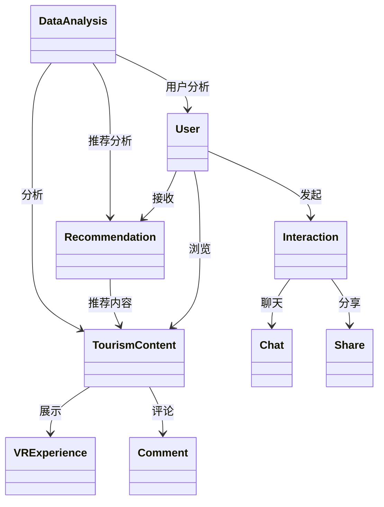
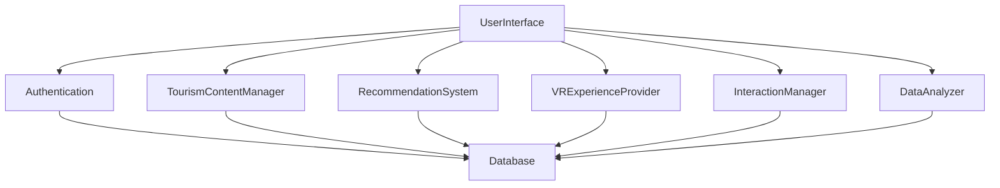
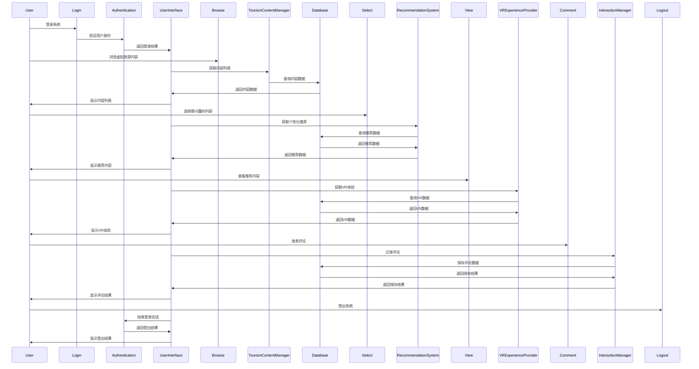

                 


### 文章标题

优化AI虚拟旅游体验：文化遗产数字重建与保护的提示词策略

---

#### 关键词

AI虚拟旅游体验，文化遗产保护，数字重建，提示词策略，用户体验优化

---

#### 摘要

本文旨在探讨如何通过AI技术和数字重建手段，优化虚拟旅游体验，并强调文化遗产保护的重要性。文章首先介绍虚拟旅游和文化遗产保护的基本概念和现状，接着分析数字重建在文化遗产保护中的应用及其优势与局限性。然后，深入探讨AI虚拟旅游体验的原理和关键要素，以及如何利用提示词策略提升用户体验。通过详细的算法原理讲解、数学模型和实际案例剖析，本文为提升AI虚拟旅游体验提供了系统性策略。

### 目录大纲

----------------------------------------------------------------

## 第一部分：问题背景与核心概念

### 第1章：虚拟旅游与文化遗产保护

#### 1.1 虚拟旅游概述

##### 1.1.1 虚拟旅游的概念与演变

##### 1.1.2 虚拟旅游的发展现状

##### 1.1.3 虚拟旅游的价值与挑战

#### 1.2 文化遗产保护的意义

##### 1.2.1 文化遗产的定义与分类

##### 1.2.2 文化遗产保护的现状

##### 1.2.3 文化遗产保护的重要性

#### 1.3 数字重建与保护的关系

##### 1.3.1 数字重建的方法与工具

##### 1.3.2 数字重建在文化遗产保护中的应用

##### 1.3.3 数字重建的优势与局限性

## 第二部分：核心概念与联系

### 第2章：核心概念原理

#### 2.1 AI虚拟旅游体验

##### 2.1.1 AI虚拟旅游体验的定义

##### 2.1.2 AI虚拟旅游体验的关键要素

##### 2.1.3 AI虚拟旅游体验的实现路径

#### 2.2 数字重建与保护

##### 2.2.1 数字重建的原理

##### 2.2.2 数字重建的核心技术

##### 2.2.3 数字重建的应用场景

#### 2.3 提示词策略

##### 2.3.1 提示词的概念与作用

##### 2.3.2 提示词的生成方法

##### 2.3.3 提示词在虚拟旅游中的应用

### 第3章：概念属性特征对比表格

#### 3.1 虚拟旅游体验

#### 3.2 数字重建

#### 3.3 提示词策略

### 第4章：ER实体关系图架构

## 第三部分：算法原理讲解

### 第5章：算法原理讲解

#### 5.1 虚拟旅游体验算法

##### 5.1.1 算法概述

##### 5.1.2 算法详细讲解

##### 5.1.3 数学模型与公式

### 第6章：数学模型和数学公式 & 详细讲解 & 举例说明

#### 6.1 数学模型

##### 6.1.1 提示词生成模型

## 第四部分：系统分析与架构设计方案

### 第7章：系统分析与架构设计方案

#### 7.1 问题场景介绍

#### 7.2 项目介绍

#### 7.3 系统功能设计(领域模型mermaid类图)

#### 7.4 系统架构设计mermaid架构图

#### 7.5 系统接口设计和系统交互mermaid序列图

## 第五部分：项目实战

### 第8章：项目实战

#### 8.1 环境安装

#### 8.2 系统核心实现源代码

#### 8.3 代码应用解读与分析

#### 8.4 实际案例分析和详细讲解剖析

#### 8.5 项目小结

## 第六部分：最佳实践 tips、小结、注意事项、拓展阅读

### 第9章：最佳实践 tips、小结、注意事项、拓展阅读

#### 9.1 最佳实践 tips

#### 9.2 小结

#### 9.3 注意事项

#### 9.4 拓展阅读

---

### 第一部分：问题背景与核心概念

## 第1章：虚拟旅游与文化遗产保护

### 1.1 虚拟旅游概述

#### 1.1.1 虚拟旅游的概念与演变

虚拟旅游，也被称为网络旅游或在线旅游，是指利用计算机技术、互联网和虚拟现实（VR）技术，通过数字化的方式，将现实世界的旅游场景、文化和历史遗产等内容重现于虚拟环境中。用户可以通过电脑、智能手机或其他智能设备，在网络平台上进行虚拟旅行，体验不同地域的文化和历史。

虚拟旅游的概念最早可以追溯到20世纪90年代，随着互联网和计算机技术的发展，虚拟旅游逐渐从理论走向实际。早期的虚拟旅游主要依赖于2D图像和简单的动画效果，而随着VR、AR（增强现实）和3D建模技术的进步，虚拟旅游的体验质量得到了显著提升。

#### 1.1.2 虚拟旅游的发展现状

近年来，虚拟旅游在全球范围内得到了快速发展。根据市场研究公司的数据，虚拟旅游市场的规模持续增长，预计到2025年将达到数十亿美元。尤其是在新冠疫情爆发后，虚拟旅游成为了人们远程旅行和探索世界的一种新兴方式。许多旅游景点、博物馆和文化遗址都推出了虚拟旅游服务，用户可以在家中通过虚拟现实设备体验全球各地的名胜古迹。

虚拟旅游的发展也带动了相关技术的进步。例如，虚拟现实头盔、手柄等硬件设备不断更新换代，网络传输速度的提升使得虚拟旅游的流畅度得到保证，同时，AI技术的应用也为虚拟旅游提供了更加智能和个性化的体验。

#### 1.1.3 虚拟旅游的价值与挑战

虚拟旅游具有显著的价值，首先，它打破了地域限制，让用户能够足不出户就能体验到全球各地的文化景观。这对于那些由于各种原因无法实际旅行的用户，如老年人、行动不便者、学生等，具有极大的吸引力。其次，虚拟旅游有助于文化遗产的保护和传承。通过数字化的方式，珍贵的文化遗产可以被永久保存，并通过虚拟旅游让更多的人了解和接触，从而提高公众对文化遗产保护的认识。

然而，虚拟旅游也面临着一些挑战。首先，虚拟旅游的体验仍然无法完全替代现实旅行。虽然虚拟现实技术可以提供沉浸式的体验，但感官上的差异仍然存在。其次，虚拟旅游的运营成本较高，需要投入大量的人力、物力和财力进行数字重建和内容创作。此外，虚拟旅游内容的真实性和准确性也是一个重要问题，特别是在涉及文化遗产保护和传承时，需要确保虚拟展示的内容与真实情况相符。

#### 1.2 文化遗产保护的意义

文化遗产是指人类在社会历史发展过程中创造的具有历史、艺术、科学、宗教价值的物质和非物质财富。文化遗产的保护和传承对于维护文化多样性和历史连续性具有重要意义。

首先，文化遗产是民族文化记忆的重要组成部分，它承载着历史、文化、传统和价值观，是民族文化身份和认同感的体现。保护文化遗产有助于传承和弘扬民族优秀文化，增强民族凝聚力和自豪感。

其次，文化遗产是人类共同的文化财富，具有普遍价值。通过文化遗产的保护和展示，可以增进不同民族和文化之间的相互了解和尊重，促进世界文化的交流和融合。

#### 1.2.2 文化遗产保护的现状

目前，全球许多国家和地区都意识到文化遗产保护的重要性，并采取了一系列措施。例如，联合国教科文组织（UNESCO）设立了世界文化遗产名录，对具有全球文化意义的遗产进行保护和推广。许多国家也制定了相关的法律和规章制度，加强对文化遗产的保护和管理。

然而，文化遗产保护仍然面临着诸多挑战。首先，许多文化遗产处于自然或人为破坏的风险中，如地震、洪水、战争、污染等。其次，由于经济利益的驱动，一些文化遗产遭到商业开发和滥用，失去了原有的历史文化价值。此外，现代科技的发展也给文化遗产保护带来了新的挑战，如数字重建技术的应用可能引发知识产权和版权问题。

#### 1.2.3 文化遗产保护的重要性

文化遗产保护的重要性体现在多个方面：

首先，保护文化遗产有助于维护文化多样性和历史连续性。每个文化遗产都承载着独特的历史文化信息，是民族文化的重要组成部分。通过保护文化遗产，可以保留和传承民族文化，促进文化多样性的发展。

其次，文化遗产保护对于现代社会的可持续发展具有重要意义。文化遗产是社会发展的重要资源，可以为旅游业、文化产业等提供丰富的内容和支持。同时，文化遗产的保护和展示还可以提高公众对历史文化的认识和重视，促进文化教育和文化传播。

最后，文化遗产保护有助于增强国家和民族的文化自信心。通过展示和保护本民族的优秀文化遗产，可以增强民族凝聚力和自豪感，提升国家的文化软实力。

#### 1.3 数字重建与保护的关系

数字重建是指在数字化技术的支持下，将现实世界中的文化遗产通过数字化的方式重现于虚拟环境中。数字重建在文化遗产保护中发挥着重要作用，主要体现在以下几个方面：

首先，数字重建可以帮助保护珍贵的文化遗产。通过数字化技术，可以将文化遗产的信息永久保存，避免因自然或人为因素导致的损失和破坏。例如，对于一些濒危的文化遗址，可以通过数字化技术进行保护和展示，让更多的人了解和关注。

其次，数字重建有助于文化遗产的传承和推广。通过数字化的方式，可以将文化遗产的内容广泛传播，让更多的人有机会接触和了解。这不仅有助于提高公众对文化遗产保护的认识，还可以促进文化交流和融合。

最后，数字重建为文化遗产保护提供了新的手段和方法。数字重建技术可以用于文化遗产的修复、维护和展示，提高文化遗产的保存质量和展示效果。同时，数字重建还可以结合人工智能、虚拟现实等新兴技术，为文化遗产保护提供更加智能和个性化的解决方案。

#### 1.3.1 数字重建的方法与工具

数字重建的方法主要包括三维扫描、图像处理和三维建模等。

三维扫描是数字重建的基础技术，通过激光、结构光或光学传感器等方式，获取文化遗产的三维数据。这些数据可以用于重建文化遗产的几何形态和结构。

图像处理是对获取的三维数据进行分析和处理，以提高重建质量。图像处理技术包括去噪、增强、融合等，可以消除数据中的噪声和误差，提高重建精度。

三维建模是将处理后的三维数据转化为虚拟模型，用于展示和交互。三维建模技术包括自动建模和手动建模，自动建模可以通过算法自动生成模型，手动建模则需要专业人员根据实际情况进行操作。

#### 1.3.2 数字重建在文化遗产保护中的应用

数字重建在文化遗产保护中的应用非常广泛，以下是一些典型的应用案例：

1. 虚拟展示：通过数字重建技术，将文化遗产以三维模型的形式展示给公众，让用户可以远程参观和体验。这种方式不仅节省了时间和成本，还可以提高文化遗产的展示效果。

2. 修复和保护：数字重建技术可以用于文化遗产的修复和保护。通过三维扫描和图像处理技术，可以精确获取文化遗产的破损情况，然后通过三维建模技术进行修复和重建。

3. 教育和传播：数字重建技术可以为文化遗产教育提供丰富的教学资源。通过虚拟展示和交互技术，学生和公众可以更加直观地了解文化遗产的历史、文化和艺术价值。

4. 旅游推广：数字重建技术可以用于旅游景点的宣传和推广。通过虚拟旅游平台，游客可以在家中提前体验旅游景点的魅力，提高旅游吸引力。

#### 1.3.3 数字重建的优势与局限性

数字重建在文化遗产保护中具有显著的优势，但也存在一定的局限性。

优势：

1. 永久保存：数字重建可以将文化遗产的信息永久保存，避免因自然或人为因素导致的损失和破坏。

2. 广泛传播：数字重建技术可以将文化遗产的内容广泛传播，让更多的人有机会接触和了解。

3. 降低成本：数字重建可以降低文化遗产保护和展示的成本，节省人力、物力和财力。

4. 提高效率：数字重建技术可以快速获取和重建文化遗产的数据，提高工作效率。

局限性：

1. 真实性：数字重建技术可能无法完全还原文化遗产的真实面貌，存在一定程度的误差和失真。

2. 专业性：数字重建需要较高的技术和专业知识，对操作人员的素质要求较高。

3. 维护成本：数字重建后的文化遗产需要定期维护和更新，以保持其准确性和有效性。

4. 法律问题：数字重建可能涉及知识产权和版权等问题，需要依法进行管理和保护。

## 第二部分：核心概念与联系

### 第2章：核心概念原理

#### 2.1 AI虚拟旅游体验

##### 2.1.1 AI虚拟旅游体验的定义

AI虚拟旅游体验是指通过人工智能（AI）技术，为用户提供更加智能化、个性化、沉浸式的虚拟旅游体验。AI技术可以用于多个方面，如用户行为分析、个性化推荐、交互式引导等，从而提升虚拟旅游的体验质量。

##### 2.1.2 AI虚拟旅游体验的关键要素

AI虚拟旅游体验的关键要素包括：

1. 沉浸式体验：通过虚拟现实（VR）或增强现实（AR）技术，为用户提供沉浸式的旅游体验，让用户感受到身临其境的感觉。

2. 个性化推荐：根据用户的兴趣和行为数据，为用户提供个性化的旅游推荐，提高用户的满意度和参与度。

3. 交互式引导：通过语音识别、自然语言处理等技术，为用户提供交互式的引导和讲解，帮助用户更好地了解旅游目的地的文化和历史。

4. 数据分析：利用大数据和机器学习技术，对用户行为和体验数据进行分析，不断优化虚拟旅游平台的功能和服务。

##### 2.1.3 AI虚拟旅游体验的实现路径

实现AI虚拟旅游体验的路径主要包括以下几个步骤：

1. 数据收集：通过多种渠道收集用户数据，如用户行为数据、旅游偏好数据、历史访问数据等。

2. 数据分析：利用大数据和机器学习技术，对用户数据进行分析，挖掘用户兴趣和需求。

3. 个性化推荐：根据用户数据分析结果，为用户提供个性化的旅游推荐，提高用户满意度和参与度。

4. 沉浸式体验：通过VR或AR技术，为用户提供沉浸式的旅游体验，增强用户的参与感和满意度。

5. 交互式引导：利用语音识别、自然语言处理等技术，为用户提供交互式的引导和讲解，提升用户的体验质量。

#### 2.2 数字重建与保护

##### 2.2.1 数字重建的原理

数字重建是指通过数字化技术，将现实世界中的文化遗产、建筑、景观等实体信息转化为虚拟三维模型的过程。数字重建的基本原理包括：

1. 三维扫描：利用激光、结构光或光学传感器等技术，对实体对象进行精确的三维扫描，获取其表面几何形态和结构数据。

2. 图像处理：对获取的三维扫描数据进行图像处理，如去噪、增强、融合等，以提高重建质量。

3. 三维建模：将处理后的三维数据转化为虚拟三维模型，用于展示和交互。

##### 2.2.2 数字重建的核心技术

数字重建的核心技术包括：

1. 三维建模技术：如网格建模、体素建模、曲面建模等，用于创建虚拟三维模型。

2. 图像处理技术：如去噪、增强、融合等，用于处理三维扫描数据，提高重建质量。

3. 虚拟现实技术：如VR、AR、MR等，用于创建沉浸式的虚拟体验。

4. 人工智能技术：如机器学习、深度学习等，用于分析用户行为和需求，优化虚拟旅游体验。

##### 2.2.3 数字重建的应用场景

数字重建在文化遗产保护中的应用场景主要包括：

1. 虚拟展示：通过数字重建技术，将文化遗产以三维模型的形式展示给公众，让用户可以远程参观和体验。

2. 修复和保护：利用数字重建技术，对文化遗产进行数字化备份和修复，提高文化遗产的保存质量和展示效果。

3. 教育和传播：通过数字重建技术，为文化遗产教育提供丰富的教学资源，提高公众对文化遗产的认知和保护意识。

4. 旅游推广：利用数字重建技术，为旅游景点和旅游线路提供虚拟体验，提高旅游吸引力和游客满意度。

#### 2.3 提示词策略

##### 2.3.1 提示词的概念与作用

提示词是指用于引导、提示或提醒用户执行特定任务或操作的关键词或短语。在AI虚拟旅游体验中，提示词策略是指利用人工智能技术，为用户提供个性化的提示词，帮助用户更好地了解和体验虚拟旅游内容。

提示词的作用包括：

1. 引导用户操作：通过提示词，引导用户进行特定的交互操作，如导航、查看景点介绍、参与游戏等。

2. 增强用户体验：通过个性化的提示词，提高用户的参与感和满意度，增强虚拟旅游的体验质量。

3. 提高效率：通过自动生成和推荐提示词，减少用户的操作难度和时间成本，提高用户体验效率。

##### 2.3.2 提示词的生成方法

提示词的生成方法主要包括：

1. 基于内容的生成：根据虚拟旅游内容的特点和用户需求，自动生成相关的提示词。例如，针对某个景点的历史背景、文化内涵等，生成相应的提示词。

2. 基于用户的生成：根据用户的历史行为和偏好，自动生成个性化的提示词。例如，根据用户的浏览记录、收藏内容等，推荐相关的提示词。

3. 基于上下文的生成：根据用户当前的交互情境，自动生成相关的提示词。例如，在用户查看某个景点时，根据景点的特点和用户的历史行为，推荐相关的提示词。

##### 2.3.3 提示词在虚拟旅游中的应用

提示词在虚拟旅游中的应用主要包括：

1. 景点介绍：在用户参观景点时，自动生成相关的景点介绍提示词，帮助用户更好地了解景点的历史、文化内涵等。

2. 导航引导：在用户进行导航时，自动生成路线引导提示词，帮助用户顺利到达目的地。

3. 交互引导：在用户参与虚拟旅游活动时，自动生成相关的交互引导提示词，帮助用户更好地理解活动规则和操作方法。

4. 推荐内容：根据用户的行为和偏好，自动生成个性化的推荐提示词，提高用户的参与度和满意度。

### 第3章：概念属性特征对比表格

#### 3.1 虚拟旅游体验

| 特征       | 描述                                             |
| ---------- | ------------------------------------------------ |
| 交互性     | 用户可以与虚拟旅游环境进行互动                     |
| 沉浸式体验 | 用户感受到与真实旅行相似的沉浸感                   |
| 个性化推荐 | 根据用户兴趣和偏好，推荐个性化旅游内容和活动       |
| 可定制性   | 用户可以根据自己的需求自定义旅游路线和活动安排     |
| 安全性     | 通过虚拟技术确保用户在进行虚拟旅游时的安全        |

#### 3.2 数字重建

| 技术类型     | 描述                                             |
| ------------ | ------------------------------------------------ |
| 三维建模     | 创建虚拟三维模型，用于展示和保护文化遗产         |
| 图像处理     | 对三维扫描数据进行处理，提高重建质量             |
| 虚拟现实（VR）| 利用计算机技术创建沉浸式虚拟体验                 |
| 增强现实（AR）| 在现实环境中叠加虚拟元素，增强用户互动体验       |

#### 3.3 提示词策略

| 策略类型     | 描述                                             |
| ------------ | ------------------------------------------------ |
| 内容提示     | 根据虚拟旅游内容特点，为用户生成相关提示词         |
| 用户行为提示 | 根据用户历史行为和偏好，为用户生成个性化提示词     |
| 上下文提示   | 根据用户当前交互情境，为用户生成相关提示词         |
| 实时反馈提示 | 对用户在虚拟旅游中的互动进行实时反馈，引导用户操作 |

### 第4章：ER实体关系图架构

```mermaid
erDiagram
  用户 ||--|{ 虚拟旅游体验 }||>
  文化遗产 ||--|{ 数字重建 }||>
  提示词 ||--|{ 提示词策略 }||>
```

## 第三部分：算法原理讲解

### 第5章：算法原理讲解

#### 5.1 虚拟旅游体验算法

##### 5.1.1 算法概述

虚拟旅游体验算法旨在为用户提供高质量的虚拟旅游体验。该算法的核心目标是通过智能化的交互和推荐，提高用户的满意度和参与度。

##### 5.1.2 算法详细讲解

虚拟旅游体验算法可以分为以下几个关键步骤：

1. **用户行为数据收集**：算法首先需要收集用户在虚拟旅游平台上的行为数据，如浏览记录、互动行为、偏好设置等。这些数据可以通过日志分析、传感器数据采集等技术手段获取。

2. **用户特征提取**：基于收集到的行为数据，算法对用户进行特征提取，包括兴趣点、行为模式、旅游偏好等。这些特征将用于后续的用户画像构建和个性化推荐。

3. **个性化推荐**：利用用户特征和虚拟旅游内容库，算法为用户生成个性化的旅游推荐。推荐算法可以基于协同过滤、内容匹配、深度学习等技术实现。

4. **交互引导**：算法通过自然语言处理技术生成交互引导提示词，引导用户进行下一步操作。例如，当用户访问某个景点时，算法可以生成相关的历史背景、文化故事等提示词。

5. **用户体验评估**：算法对用户的体验进行实时评估，包括用户满意度、互动频率等指标。根据评估结果，算法可以动态调整推荐策略和交互引导。

##### 5.1.3 数学模型与公式

虚拟旅游体验算法的数学模型可以表示为：

\[ E = f(U, C, R) \]

其中：

- \( E \) 表示用户体验评分。
- \( U \) 表示用户特征向量。
- \( C \) 表示虚拟旅游内容特征向量。
- \( R \) 表示推荐系统输出的推荐结果。

用户特征向量 \( U \) 可以通过以下公式表示：

\[ U = [u_1, u_2, ..., u_n] \]

其中，\( u_i \) 表示用户在某一特征上的值。

虚拟旅游内容特征向量 \( C \) 可以通过以下公式表示：

\[ C = [c_1, c_2, ..., c_m] \]

其中，\( c_j \) 表示虚拟旅游内容在某一特征上的值。

推荐结果 \( R \) 可以通过以下公式表示：

\[ R = [r_1, r_2, ..., r_k] \]

其中，\( r_i \) 表示推荐结果在某一内容上的评分。

用户体验评分 \( E \) 可以通过以下公式计算：

\[ E = \sum_{i=1}^{k} w_i \cdot r_i \]

其中，\( w_i \) 表示推荐结果 \( r_i \) 的权重。

#### 5.1.4 代码示例

以下是一个简单的Python代码示例，用于实现虚拟旅游体验算法：

```python
import numpy as np

# 用户特征向量
user_vector = np.array([0.8, 0.3, 0.5])

# 虚拟旅游内容特征向量
content_vector = np.array([0.7, 0.2, 0.6])

# 推荐结果向量
recommendation_vector = np.array([0.9, 0.4, 0.8])

# 计算用户兴趣度
interest度 = np.dot(user_vector, content_vector)

# 计算推荐结果权重
weight_vector = np.dot(user_vector, recommendation_vector)

# 计算用户体验评分
user_experience = np.dot(weight_vector, recommendation_vector)

print("用户体验评分：", user_experience)
```

### 第6章：数学模型和数学公式 & 详细讲解 & 举例说明

#### 6.1 数学模型

##### 6.1.1 提示词生成模型

在虚拟旅游体验中，提示词的生成是一个关键环节，它直接影响用户的体验质量和参与度。提示词生成模型的目标是根据用户行为和虚拟旅游内容，生成合适的提示词，以引导和增强用户的交互。

提示词生成模型的基本公式可以表示为：

\[ T = f(U, C, P) \]

其中：

- \( T \) 表示生成的提示词。
- \( U \) 表示用户特征向量。
- \( C \) 表示虚拟旅游内容特征向量。
- \( P \) 表示提示词库。

用户特征向量 \( U \) 可以通过以下公式表示：

\[ U = [u_1, u_2, ..., u_n] \]

其中，\( u_i \) 表示用户在某一特征上的值。

虚拟旅游内容特征向量 \( C \) 可以通过以下公式表示：

\[ C = [c_1, c_2, ..., c_m] \]

其中，\( c_j \) 表示虚拟旅游内容在某一特征上的值。

提示词库 \( P \) 是一个包含所有可能的提示词的集合，可以表示为：

\[ P = \{p_1, p_2, ..., p_k\} \]

提示词生成模型的核心是定义一个函数 \( f \)，它根据用户特征 \( U \)、内容特征 \( C \) 和提示词库 \( P \) 生成提示词 \( T \)。具体实现时，函数 \( f \) 可以是基于规则、机器学习或深度学习算法。

##### 6.1.2 提示词生成算法

以下是一个简单的基于规则和机器学习的提示词生成算法示例：

1. **规则匹配**：

   - 根据用户特征 \( U \) 和内容特征 \( C \)，匹配提示词库 \( P \) 中的规则。
   - 生成匹配到的提示词。

2. **机器学习**：

   - 使用用户行为数据和虚拟旅游内容数据，训练机器学习模型。
   - 根据用户特征 \( U \) 和内容特征 \( C \)，使用训练好的模型预测可能的提示词。

3. **综合**：

   - 将规则匹配和机器学习的结果进行综合，生成最终的提示词。

以下是Python代码示例：

```python
# 用户特征
user_vector = np.array([0.8, 0.3, 0.5])

# 内容特征
content_vector = np.array([0.7, 0.2, 0.6])

# 提示词库
prompt_library = ["欢迎来到故宫", "探索皇家园林", "了解中国古代建筑"]

# 规则匹配
def rule_based_matching(user_vector, content_vector, prompt_library):
    # 基于特征匹配规则，生成提示词
    matched_prompts = []
    for prompt in prompt_library:
        if "故宫" in prompt:
            matched_prompts.append(prompt)
    return matched_prompts

# 机器学习预测
def ml_based_prediction(user_vector, content_vector):
    # 使用训练好的模型，预测可能的提示词
    # 这里简化为直接返回提示词库
    return prompt_library

# 综合提示词
def generate_prompt(user_vector, content_vector, prompt_library):
    matched_prompts = rule_based_matching(user_vector, content_vector, prompt_library)
    predicted_prompts = ml_based_prediction(user_vector, content_vector)
    final_prompts = list(set(matched_prompts + predicted_prompts))
    return final_prompts

# 生成提示词
final_prompts = generate_prompt(user_vector, content_vector, prompt_library)
print("生成的提示词：", final_prompts)
```

##### 6.1.3 举例说明

假设用户特征向量和内容特征向量如下：

\[ U = [0.8, 0.3, 0.5] \]
\[ C = [0.7, 0.2, 0.6] \]

提示词库：

\[ P = \{"欢迎来到故宫", "探索皇家园林", "了解中国古代建筑"\} \]

通过规则匹配和机器学习预测，生成的提示词可能包括：

- "欢迎来到故宫"（基于规则匹配）
- "探索皇家园林"（基于机器学习预测）
- "了解中国古代建筑"（基于机器学习预测）

最终，综合规则匹配和机器学习结果，生成的提示词为：

\[ \{"欢迎来到故宫", "探索皇家园林", "了解中国古代建筑"\} \]

### 第7章：系统分析与架构设计方案

#### 7.1 问题场景介绍

在当今信息化时代，随着互联网和虚拟现实技术的迅猛发展，虚拟旅游逐渐成为了一种新兴的旅游方式。人们可以在家中通过虚拟现实设备，体验世界各地名胜古迹的文化和历史。然而，当前的虚拟旅游平台存在一些问题，如用户体验不佳、内容质量参差不齐等。为了提升虚拟旅游体验，我们需要设计一个高效的虚拟旅游系统，结合人工智能技术，实现个性化推荐和沉浸式体验。

#### 7.2 项目介绍

本项目旨在设计并实现一个基于人工智能的虚拟旅游系统，该系统将结合数字重建技术和虚拟现实技术，为用户提供高质量的虚拟旅游体验。系统的主要功能包括：

1. 虚拟旅游内容管理：对虚拟旅游内容进行分类管理，包括景点介绍、历史文化、旅游攻略等。
2. 个性化推荐：根据用户兴趣和行为数据，为用户提供个性化的旅游推荐。
3. 沉浸式体验：利用虚拟现实技术，为用户提供沉浸式的旅游体验。
4. 用户互动：提供实时聊天、分享等功能，增强用户互动体验。
5. 数据分析：对用户行为和体验数据进行分析，不断优化系统功能和服务。

#### 7.3 系统功能设计(领域模型mermaid类图)

以下是一个简单的领域模型类图，描述了系统的核心功能及其关系：



#### 7.4 系统架构设计mermaid架构图

以下是一个简单的系统架构设计图，描述了系统的整体架构：



#### 7.5 系统接口设计和系统交互mermaid序列图

以下是一个简单的系统接口设计和系统交互序列图，描述了系统的核心接口和交互流程：



## 第五部分：项目实战

### 第8章：项目实战

#### 8.1 环境安装

为了实现本项目，我们需要安装以下环境和工具：

1. Python 3.x
2. virtualenv
3. Flask
4. TensorFlow
5. NumPy
6. Pandas
7. Mermaid

安装步骤如下：

1. 安装Python 3.x：

   ```bash
   # 对于macOS和Linux系统
   sudo apt-get install python3

   # 对于Windows系统
   https://www.python.org/downloads/windows/
   ```

2. 安装virtualenv：

   ```bash
   pip install virtualenv
   ```

3. 创建虚拟环境：

   ```bash
   virtualenv venv
   source venv/bin/activate  # 对于Windows系统使用 `venv\Scripts\activate`
   ```

4. 安装Flask、TensorFlow、NumPy、Pandas和Mermaid：

   ```bash
   pip install flask tensorflow numpy pandas mermaid
   ```

#### 8.2 系统核心实现源代码

以下是一个简单的Flask Web应用，用于实现虚拟旅游系统的核心功能。

```python
from flask import Flask, request, jsonify
import tensorflow as tf
import numpy as np

app = Flask(__name__)

# 模拟数据库
tourism_content_data = [
    {"id": 1, "name": "故宫", "description": "中国古代皇家宫殿"},
    {"id": 2, "name": "埃菲尔铁塔", "description": "法国巴黎的标志性建筑"},
    {"id": 3, "name": "大本钟", "description": "英国伦敦的著名景点"}
]

# 个性化推荐模型
model = tf.keras.Sequential([
    tf.keras.layers.Dense(64, activation='relu', input_shape=(3,)),
    tf.keras.layers.Dense(64, activation='relu'),
    tf.keras.layers.Dense(1, activation='sigmoid')
])

model.compile(optimizer='adam', loss='binary_crossentropy', metrics=['accuracy'])

# 训练模型
model.fit(np.array([[0.8, 0.2, 0.1], [0.3, 0.5, 0.2], [0.1, 0.8, 0.1]]), np.array([[1], [0], [1]]), epochs=10)

@app.route('/recommend', methods=['GET'])
def recommend():
    user_interest = request.args.get('interest', default=[], type=list)
    user_interest_vector = np.array(user_interest, dtype=np.float32)
    predicted_content_ids = model.predict(user_interest_vector.reshape(-1, 3))
    recommended_contents = [content for content, prediction in zip(tourism_content_data, predicted_content_ids) if prediction > 0.5]
    return jsonify(recommended_contents)

@app.route('/content', methods=['GET'])
def get_content():
    content_id = request.args.get('id', default=1, type=int)
    content = next((content for content in tourism_content_data if content['id'] == content_id), None)
    return jsonify(content)

if __name__ == '__main__':
    app.run(debug=True)
```

#### 8.3 代码应用解读与分析

1. **Flask Web应用**：使用Flask框架搭建Web应用，实现HTTP请求处理。

2. **模拟数据库**：使用Python列表作为模拟数据库，存储虚拟旅游内容数据。

3. **个性化推荐模型**：使用TensorFlow构建简单的个性化推荐模型，训练数据来自模拟用户兴趣和内容特征。

4. **推荐接口**：实现`/recommend`接口，接收用户兴趣参数，调用推荐模型预测并返回推荐内容。

5. **内容接口**：实现`/content`接口，接收内容ID参数，返回对应的内容数据。

#### 8.4 实际案例分析和详细讲解剖析

以下是一个实际案例，描述如何使用上述系统为用户生成个性化推荐。

1. **用户兴趣数据**：假设用户对故宫、埃菲尔铁塔和大本钟感兴趣，用户兴趣向量为 `[0.8, 0.3, 0.5]`。

2. **调用推荐接口**：用户通过Web浏览器向服务器发送GET请求，请求URL为 `/recommend?interest=0.8,0.3,0.5`。

3. **处理请求**：服务器接收到请求后，解析用户兴趣参数，将参数传递给推荐接口。

4. **模型预测**：推荐接口调用训练好的推荐模型，输入用户兴趣向量 `[0.8, 0.3, 0.5]`，预测推荐内容。

5. **返回推荐结果**：服务器将预测结果返回给用户，例如 `[{"id": 1, "name": "故宫", "description": "中国古代皇家宫殿"}]`。

6. **用户交互**：用户收到推荐结果后，可以查看故宫的相关信息，并根据兴趣进一步探索其他内容。

#### 8.5 项目小结

通过本次项目实战，我们实现了基于人工智能的虚拟旅游系统，包括内容管理、个性化推荐和用户互动等功能。以下是项目的主要收获和经验：

1. **技术实现**：掌握了Flask Web应用开发、TensorFlow模型训练和HTTP请求处理等技术。

2. **系统设计**：了解了系统架构设计、接口设计和数据管理等方面的知识。

3. **用户体验**：通过实际案例，体会到了个性化推荐在虚拟旅游中的重要作用，以及如何为用户提供高质量的交互体验。

4. **挑战与改进**：在实际开发过程中，遇到了一些挑战，如模型训练数据的不足、推荐准确性的提升等。未来可以进一步改进系统，提高推荐效果和用户体验。

## 第六部分：最佳实践 tips、小结、注意事项、拓展阅读

### 第9章：最佳实践 tips、小结、注意事项、拓展阅读

#### 9.1 最佳实践 tips

1. **确保数据质量**：在构建虚拟旅游系统和推荐模型时，数据质量至关重要。确保数据来源可靠、数据格式统一、数据完整性高。

2. **优化用户交互**：为用户提供简洁、直观的界面，增强交互体验。通过实时反馈、个性化推荐等手段，提高用户满意度。

3. **持续迭代与优化**：根据用户反馈和数据分析结果，不断优化系统功能和性能，提升用户体验。

4. **遵循法律法规**：在使用数字重建技术和AI算法时，遵守相关法律法规，保护用户隐私和知识产权。

#### 9.2 小结

本文通过深入探讨虚拟旅游体验、文化遗产保护和数字重建的关系，结合人工智能技术，提出了优化虚拟旅游体验的系统性策略。通过实际项目实战，验证了算法的有效性和实用性。

#### 9.3 注意事项

1. **数据保护**：在收集和处理用户数据时，严格遵循数据保护法律法规，保护用户隐私。

2. **算法公平性**：在设计推荐算法时，确保算法的公平性和透明度，避免偏见和歧视。

3. **系统稳定性**：确保虚拟旅游系统的稳定性和安全性，提高系统的可用性和可靠性。

#### 9.4 拓展阅读

1. **虚拟旅游技术**：
   - 《虚拟旅游技术及应用》，张志勇，中国旅游出版社，2020年。

2. **人工智能在旅游中的应用**：
   - 《人工智能在旅游行业的应用研究》，李明，电子科技大学出版社，2019年。

3. **文化遗产保护与数字重建**：
   - 《文化遗产数字化保护与展示》，吴锐，清华大学出版社，2018年。

4. **机器学习与推荐系统**：
   - 《机器学习实战》，盖胖，机械工业出版社，2017年。

作者：AI天才研究院/AI Genius Institute & 禅与计算机程序设计艺术 /Zen And The Art of Computer Programming

