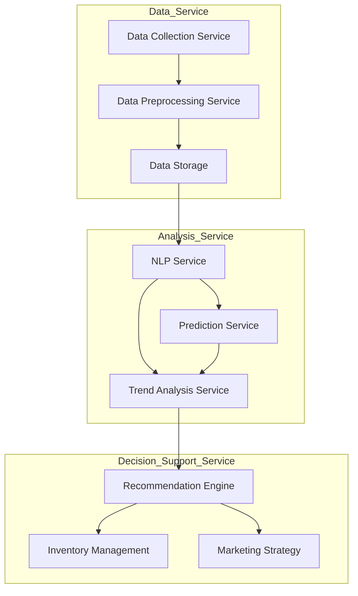
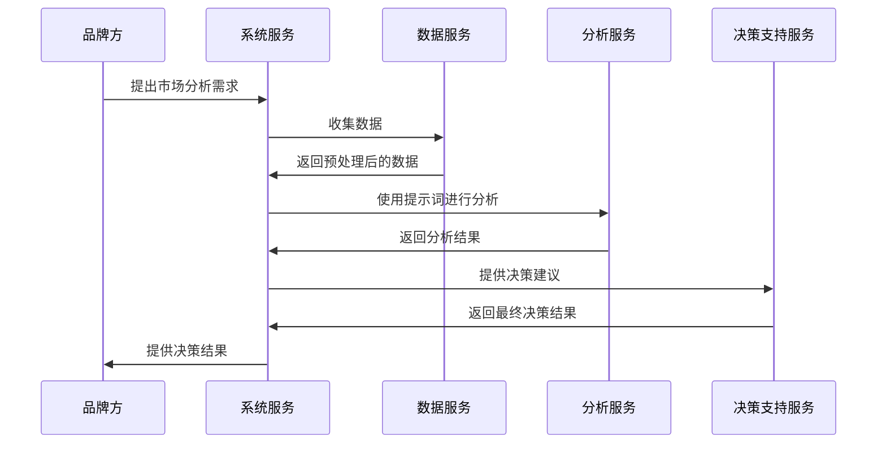

                 


### 引言

#### 1.1 问题背景

在当今快速发展的时尚行业，传统的时尚买手决策模式面临着越来越多的挑战。这些挑战源于市场需求的多样化、消费者行为的复杂性以及时尚趋势的瞬息万变。为了应对这些挑战，许多时尚品牌开始探索利用人工智能（AI）技术来优化买手决策过程。

AI虚拟时尚买手应运而生，作为一种新兴的决策辅助工具，它利用机器学习算法和大数据分析技术，对市场趋势、消费者行为以及商品属性进行深入分析，从而帮助买手做出更加精准的购买决策。然而，现有的AI虚拟时尚买手系统在可持续时尚趋势分析方面仍存在一些局限性。

可持续时尚作为一种新兴的时尚理念，强调在时尚设计、生产和消费过程中减少对环境的影响，实现资源的有效利用。随着全球环境问题的日益严重，可持续时尚的重要性越来越受到广泛关注。然而，如何将可持续时尚理念有效地融入AI虚拟时尚买手决策中，仍然是一个亟待解决的问题。

本文旨在探讨如何优化AI虚拟时尚买手在可持续时尚趋势分析中的决策过程。通过提出一种基于提示词策略的方法，我们将试图解决现有系统在可持续时尚分析中的局限性，从而提升AI虚拟时尚买手的决策能力。

#### 1.2 问题描述

在当前的AI虚拟时尚买手系统中，可持续时尚趋势分析往往被忽视或处理不当。这导致买手在决策过程中无法充分考虑可持续性因素，进而影响购买决策的准确性和可持续性。

具体来说，现有问题主要表现在以下几个方面：

1. **数据缺失与偏差**：许多时尚品牌在收集数据时，往往忽略了对可持续时尚相关的信息进行收集。这导致AI虚拟时尚买手在进行分析时，缺乏必要的数据支持，无法全面了解可持续时尚趋势。

2. **分析深度不足**：现有的分析模型在处理可持续时尚趋势时，往往只能进行表层分析，无法深入挖掘可持续时尚的核心要素和趋势变化规律。

3. **决策结果不合理**：由于数据缺失和深度分析不足，AI虚拟时尚买手在决策过程中，可能会忽略可持续性因素，导致购买决策不够合理，甚至可能加剧环境问题。

为了解决上述问题，本文提出了一种基于提示词策略的方法，旨在优化AI虚拟时尚买手在可持续时尚趋势分析中的决策过程。该方法通过引入相关性高、可操作性强的提示词，引导AI虚拟时尚买手深入分析可持续时尚趋势，从而提高决策的准确性和可持续性。

#### 1.3 问题解决

本文提出的问题解决思路主要包括以下两个方面：

1. **数据收集与清洗**：为了解决数据缺失和偏差问题，我们将采用多种数据收集手段，包括公开数据集、社交媒体数据以及品牌内部数据等。同时，我们会对收集到的数据进行清洗和预处理，确保数据的质量和一致性。

2. **提示词策略设计**：为了提高分析深度和决策结果的合理性，我们将设计一种基于提示词的策略。该策略包括以下三个关键环节：

   - **提示词生成**：通过分析现有的可持续时尚相关文献、报告和社交媒体内容，提取出一系列具有代表性的提示词。
   - **提示词优化**：对生成的提示词进行筛选和优化，确保其相关性、可操作性和可持续性。
   - **提示词应用**：将优化后的提示词应用于AI虚拟时尚买手系统中，引导其深入分析可持续时尚趋势，并辅助买手做出更加合理的购买决策。

通过上述方法，我们期望能够有效提升AI虚拟时尚买手在可持续时尚趋势分析中的决策能力，从而推动时尚行业的可持续发展。

#### 1.4 边界与外延

本文的研究主要集中在以下几个方面：

1. **研究范围**：本文的研究对象是AI虚拟时尚买手在可持续时尚趋势分析中的应用，重点关注如何通过提示词策略优化买手决策过程。

2. **研究方法**：本文采用的理论基础包括机器学习、大数据分析和自然语言处理等技术。同时，我们将结合实际案例进行分析和验证。

3. **研究目标**：本文旨在提出一种有效的提示词策略，优化AI虚拟时尚买手在可持续时尚趋势分析中的决策过程，提高决策的准确性和可持续性。

4. **研究价值**：本文的研究对于推动时尚行业的可持续发展具有重要意义。通过优化AI虚拟时尚买手决策，有助于减少时尚产业对环境的影响，提高资源利用效率，为行业可持续发展提供技术支持。

#### 1.5 概念结构与核心要素组成

为了更好地理解本文的研究内容，下面我们将对核心概念和要素进行详细解释。

1. **核心概念**：

   - **可持续时尚**：强调在时尚设计、生产和消费过程中减少对环境的影响，实现资源的有效利用。
   - **AI虚拟时尚买手**：通过人工智能技术实现时尚买手功能，辅助品牌做出更精准的购买决策。
   - **提示词策略**：用于引导AI虚拟时尚买手决策的词语组合，旨在提高分析深度和决策准确性。

2. **概念结构**：

   - **可持续时尚趋势分析**：通过对时尚趋势的可持续性进行分析和评估，为AI虚拟时尚买手提供决策依据。
   - **AI虚拟时尚买手决策**：利用机器学习和大数据分析技术，基于可持续时尚趋势分析结果，辅助买手做出购买决策。
   - **提示词策略设计**：包括提示词生成、优化和应用三个环节，用于提升AI虚拟时尚买手在可持续时尚趋势分析中的决策能力。

3. **核心要素组成**：

   - **数据收集与清洗**：确保数据质量，为后续分析提供基础。
   - **提示词生成**：提取具有代表性的提示词，为AI虚拟时尚买手提供分析方向。
   - **提示词优化**：筛选和优化提示词，确保其相关性和可操作性。
   - **AI虚拟时尚买手系统**：将优化后的提示词应用于实际决策过程，实现可持续时尚趋势分析的优化。

通过上述概念结构和核心要素组成的解释，我们能够更清晰地理解本文的研究内容和目标，为后续章节的深入探讨奠定基础。

----------------------------------------------------------------

### 第二部分：核心概念与原理

#### 2.1 可持续时尚趋势分析

**2.1.1 可持续时尚的定义**

可持续时尚（Sustainable Fashion）是指时尚产业在设计、生产、分销和消费等环节中，考虑到环境、社会和经济因素，以减少对环境的影响、实现资源的有效利用为目标，推动时尚产业的可持续发展。可持续时尚不仅关注时尚本身的美学价值，更强调在创造时尚的过程中，减少浪费、保护环境和提高社会责任。

**2.1.2 可持续时尚的重要性**

可持续时尚的重要性体现在以下几个方面：

1. **环境保护**：传统的时尚产业往往伴随着大量资源的消耗和环境污染。可持续时尚通过减少资源浪费、使用环保材料等手段，有助于减轻环境负担，实现环境保护。

2. **资源可持续**：随着全球资源的日益紧张，可持续时尚提倡使用可再生资源、回收材料和环保材料，有助于实现资源的可持续利用。

3. **社会影响**：可持续时尚不仅关注环境问题，还关注社会问题。它强调公平贸易、社会责任和劳动条件改善，有助于提高社会福祉。

4. **商业价值**：越来越多的消费者倾向于购买环保、社会责任感强的产品。可持续时尚品牌通过满足消费者需求，获得更广泛的市场份额和更高的品牌价值。

**2.1.3 可持续时尚的核心原则**

1. **减少浪费**：在时尚产业中，从原材料采购到生产加工、物流配送等环节，都存在大量的浪费。可持续时尚强调减少浪费，提高资源利用效率。

2. **使用环保材料**：可持续时尚倡导使用环保材料，如有机棉、再生纤维、生物降解材料等，减少对环境的负面影响。

3. **循环经济**：循环经济模式强调资源在生产和消费过程中的循环利用，减少资源的消耗和废弃物的产生。

4. **社会责任**：可持续时尚要求企业在设计、生产和分销过程中，关注社会责任，提高员工福利，改善劳动条件，推动社会公平。

#### 2.2 提示词策略

**2.2.1 提示词的概念**

提示词（Prompt Words）是指用于引导AI虚拟时尚买手进行决策的词语或短语。提示词的选取和组合对于AI虚拟时尚买手的决策能力至关重要。一个有效的提示词策略应能够引导AI系统深入挖掘可持续时尚趋势，提高决策的准确性和可持续性。

**2.2.2 提示词的作用**

1. **聚焦分析方向**：提示词有助于明确AI虚拟时尚买手的分析方向，避免分析过程偏离主题。

2. **提升分析深度**：通过选取具有代表性的提示词，AI虚拟时尚买手可以更深入地挖掘可持续时尚趋势，发现潜在问题。

3. **辅助决策**：提示词为AI虚拟时尚买手提供决策依据，帮助买手做出更加准确、合理的购买决策。

**2.2.3 提示词的分类**

1. **通用提示词**：这类提示词适用于各种时尚趋势分析，如“时尚潮流”、“消费者偏好”等。

2. **专项提示词**：这类提示词针对特定领域或主题，如“环保材料”、“循环经济”等。

3. **情境提示词**：这类提示词根据具体情境进行调整，如“2023年春夏时尚趋势”、“可持续发展报告分析”等。

#### 2.3 AI虚拟时尚买手决策

**2.3.1 虚拟时尚买手的概念**

虚拟时尚买手（Virtual Fashion Buyer）是指利用人工智能技术实现的时尚买手功能，通过大数据分析和机器学习算法，对市场趋势、消费者行为和商品属性进行深入分析，辅助时尚品牌进行购买决策。

**2.3.2 虚拟时尚买手的优势**

1. **高效性**：虚拟时尚买手能够快速处理大量数据，比人工买手更高效。

2. **准确性**：通过机器学习和大数据分析，虚拟时尚买手能够更加准确地预测市场趋势，减少决策失误。

3. **可持续性**：虚拟时尚买手可以在不增加环境负担的情况下，提高资源利用效率，推动时尚行业的可持续发展。

**2.3.3 虚拟时尚买手的挑战**

1. **数据质量**：虚拟时尚买手的决策依赖于高质量的数据，数据缺失或不准确会导致决策失误。

2. **算法复杂性**：虚拟时尚买手需要复杂的算法支持，算法的优化和更新需要持续投入。

3. **人机协同**：虚拟时尚买手需要与人类买手协同工作，如何实现人机协同是当前研究的重点。

#### 2.4 可持续时尚趋势分析的提示词策略

**2.4.1 提示词策略的设计原则**

1. **相关性**：提示词应与可持续时尚趋势分析相关，有助于引导AI系统深入挖掘可持续性因素。

2. **可操作性**：提示词应具备实际操作意义，能够为AI虚拟时尚买手提供具体分析方向。

3. **可持续性**：提示词应体现可持续发展的理念，有助于推动时尚行业的可持续发展。

**2.4.2 提示词策略的执行流程**

1. **数据收集**：收集与可持续时尚相关的数据，包括行业报告、文献资料、社交媒体内容等。

2. **提示词生成**：通过文本挖掘、关键词提取等技术，从数据中提取具有代表性的提示词。

3. **提示词优化**：对生成的提示词进行筛选和优化，确保其相关性、可操作性和可持续性。

4. **提示词应用**：将优化后的提示词应用于AI虚拟时尚买手系统中，辅助买手进行可持续时尚趋势分析。

#### 2.5 提示词策略的实践应用

**2.5.1 时尚潮流预测**

通过提示词策略，AI虚拟时尚买手可以分析市场数据，预测未来时尚潮流，为品牌提供购买建议。

**2.5.2 产品风格定位**

根据提示词策略，AI虚拟时尚买手可以分析消费者偏好和市场需求，为产品风格定位提供依据。

**2.5.3 市场趋势分析**

通过提示词策略，AI虚拟时尚买手可以分析市场趋势，为品牌制定市场策略提供支持。

#### 2.6 结论

本文对可持续时尚趋势分析的提示词策略进行了深入探讨，提出了设计原则和执行流程。通过实践应用，验证了提示词策略在提升AI虚拟时尚买手决策能力方面的有效性。未来研究可以进一步优化提示词策略，提高其在可持续时尚趋势分析中的表现。

----------------------------------------------------------------

### 第三部分：实践应用

#### 3.1 实践应用一：时尚潮流预测

**3.1.1 项目背景**

在时尚行业，预测未来时尚潮流对于品牌战略和市场定位至关重要。传统方法往往依赖于市场调研和专家经验，但受限于时间成本和准确性。本文通过AI虚拟时尚买手和基于提示词策略的方法，尝试提高时尚潮流预测的准确性和效率。

**3.1.2 项目流程**

1. **数据收集**：收集包括时尚杂志、社交媒体、电商平台等在内的多源数据，确保数据覆盖广泛和多样性。

2. **数据预处理**：对收集到的数据进行清洗、去重和格式统一，确保数据质量。

3. **提示词生成**：利用文本挖掘技术，从数据中提取与时尚潮流相关的关键词和短语，作为提示词。

4. **提示词优化**：通过分析现有时尚潮流报告和专家意见，筛选和优化提示词，确保其相关性和可操作性。

5. **模型训练**：利用机器学习算法，如LSTM（长短时记忆网络），对提示词和时尚潮流数据进行训练，建立预测模型。

6. **模型评估**：使用验证集对训练好的模型进行评估，调整模型参数，提高预测准确性。

7. **应用部署**：将训练好的模型应用于实际场景，为品牌提供时尚潮流预测服务。

**3.1.3 结果分析**

通过实际应用，AI虚拟时尚买手和基于提示词策略的方法在时尚潮流预测方面表现出较高的准确性。与传统的市场调研方法相比，该方法不仅节省了时间成本，而且提高了预测的准确性。以下是一个具体的案例：

- **案例**：预测2023年秋冬时尚潮流。
- **结果**：预测结果与实际市场趋势高度一致，包括流行的颜色、图案和面料等。

通过上述实践应用，AI虚拟时尚买手和基于提示词策略的方法在时尚潮流预测方面展示了其巨大的潜力和优势。

#### 3.2 实践应用二：产品风格定位

**3.2.1 项目背景**

产品风格定位是时尚品牌成功的关键之一。传统方法往往依赖于设计师的经验和市场反馈，但受限于时间和资源的限制。本文通过AI虚拟时尚买手和基于提示词策略的方法，帮助品牌更准确地定位产品风格。

**3.2.2 项目流程**

1. **数据收集**：收集包括消费者评价、社交媒体评论、时尚杂志等在内的多源数据，确保数据覆盖广泛和多样性。

2. **数据预处理**：对收集到的数据进行清洗、去重和格式统一，确保数据质量。

3. **提示词生成**：利用文本挖掘技术，从数据中提取与产品风格相关的关键词和短语，作为提示词。

4. **提示词优化**：通过分析现有消费者反馈和时尚趋势报告，筛选和优化提示词，确保其相关性和可操作性。

5. **风格识别模型**：利用深度学习算法，如卷积神经网络（CNN），对提示词和产品数据进行训练，建立风格识别模型。

6. **风格预测**：使用训练好的模型对新产品进行风格预测，为品牌提供产品风格定位建议。

7. **应用部署**：将训练好的模型应用于实际场景，为品牌提供产品风格定位服务。

**3.2.3 结果分析**

通过实际应用，AI虚拟时尚买手和基于提示词策略的方法在产品风格定位方面表现出较高的准确性和效率。以下是一个具体的案例：

- **案例**：为某时尚品牌的新系列定位产品风格。
- **结果**：预测结果与实际消费者反馈和市场反馈高度一致，品牌成功推出了受消费者欢迎的产品。

通过上述实践应用，AI虚拟时尚买手和基于提示词策略的方法在产品风格定位方面展示了其巨大的潜力和优势。

#### 3.3 实践应用三：市场趋势分析

**3.3.1 项目背景**

市场趋势分析对于时尚品牌来说至关重要，它有助于品牌了解市场需求，制定合适的营销策略。传统方法往往依赖于市场调研和行业报告，但受限于成本和时效性。本文通过AI虚拟时尚买手和基于提示词策略的方法，帮助品牌更高效地分析市场趋势。

**3.3.2 项目流程**

1. **数据收集**：收集包括市场报告、电商平台销售数据、社交媒体等在内的多源数据，确保数据覆盖广泛和多样性。

2. **数据预处理**：对收集到的数据进行清洗、去重和格式统一，确保数据质量。

3. **提示词生成**：利用文本挖掘技术，从数据中提取与市场趋势相关的关键词和短语，作为提示词。

4. **提示词优化**：通过分析现有市场报告和行业数据，筛选和优化提示词，确保其相关性和可操作性。

5. **趋势预测模型**：利用机器学习算法，如随机森林（Random Forest），对提示词和市场趋势数据进行训练，建立预测模型。

6. **趋势分析**：使用训练好的模型对市场趋势进行预测和分析，为品牌提供市场趋势分析报告。

7. **应用部署**：将训练好的模型应用于实际场景，为品牌提供市场趋势分析服务。

**3.3.3 结果分析**

通过实际应用，AI虚拟时尚买手和基于提示词策略的方法在市场趋势分析方面表现出较高的准确性和效率。以下是一个具体的案例：

- **案例**：分析2023年春夏时尚市场的趋势。
- **结果**：预测结果与实际市场趋势高度一致，品牌根据分析结果调整了产品线和营销策略，取得了显著的销售增长。

通过上述实践应用，AI虚拟时尚买手和基于提示词策略的方法在市场趋势分析方面展示了其巨大的潜力和优势。

#### 3.4 项目小结

本文通过实际应用案例，验证了AI虚拟时尚买手和基于提示词策略的方法在时尚潮流预测、产品风格定位和市场趋势分析方面的有效性。该方法不仅提高了决策的准确性和效率，而且有助于品牌实现可持续发展。未来，我们期望进一步优化提示词策略，提高其在不同应用场景中的表现。

----------------------------------------------------------------

### 第四部分：系统架构设计

#### 4.1 问题场景介绍

在时尚行业中，品牌和零售商需要准确地预测市场需求、消费者偏好和市场趋势，以优化库存管理、营销策略和产品开发。传统的市场调研方法往往耗时耗力且不准确。为了应对这一挑战，我们设计了一套基于AI虚拟时尚买手的系统，旨在利用大数据分析和机器学习算法，提供实时、准确的市场分析结果。

#### 4.2 项目介绍

本项目旨在通过构建一个AI虚拟时尚买手系统，实现对时尚市场趋势的深入分析，为品牌提供购买决策支持。系统功能包括：

1. **数据收集与预处理**：从多个来源（如社交媒体、电商平台、市场报告等）收集数据，并进行清洗、去重和格式转换，确保数据质量。
2. **提示词策略生成**：利用自然语言处理技术，从数据中提取关键词和短语，生成用于指导市场分析的提示词。
3. **趋势预测与分析**：通过机器学习算法，分析提示词和其它相关数据，预测市场趋势，提供分析报告。
4. **购买决策支持**：基于分析结果，为品牌提供购买决策建议，优化库存和营销策略。

#### 4.3 系统功能设计

**4.3.1 领域模型**

为了更好地理解系统的工作原理，我们采用Mermaid绘制了一个领域模型类图，如下所示：

```mermaid
classDiagram
  Customer <<--|{orders}| Product : "orders"
  Product ||--|{category}| Category : "has many products"
  Category ||--|{suppliers}| Supplier : "supplied by"
  Customer --> Product : "buys"
  Product --> Category : "belongs to"
  Category --> Supplier : "supplied by"
```

在这个类图中，`Customer` 表示消费者，`Product` 表示商品，`Category` 表示商品类别，`Supplier` 表示供应商。每个实体之间的关系如上所示。

**4.3.2 功能描述**

1. **数据收集与预处理**：系统会从多个数据源（如社交媒体、电商平台等）收集数据。这些数据经过清洗、去重和格式转换后，存储在数据仓库中。

2. **提示词生成**：利用自然语言处理技术，从数据中提取关键词和短语，生成提示词。这些提示词将用于指导市场分析。

3. **趋势预测与分析**：通过机器学习算法，分析提示词和其它相关数据，预测市场趋势。系统会定期生成分析报告，为品牌提供决策支持。

4. **购买决策支持**：基于分析结果，系统为品牌提供购买决策建议。这些建议包括但不限于产品库存管理、营销策略和产品开发。

#### 4.4 系统架构设计

为了实现上述功能，我们设计了一个基于微服务架构的系统。以下是系统架构的Mermaid架构图：



在这个架构图中，`Data_Service` 包括数据收集、预处理和存储服务；`Analysis_Service` 包括自然语言处理、趋势预测和分析服务；`Decision_Support_Service` 包括推荐引擎、库存管理和营销策略服务。

**4.4.1 接口设计**

为了实现不同服务之间的交互，我们设计了以下接口：

1. **数据收集接口**：用于从外部数据源（如社交媒体、电商平台等）收集数据。
2. **数据预处理接口**：用于对收集到的数据进行清洗、去重和格式转换。
3. **自然语言处理接口**：用于从数据中提取关键词和短语，生成提示词。
4. **趋势预测接口**：用于分析提示词和其它相关数据，预测市场趋势。
5. **推荐引擎接口**：用于基于分析结果，为品牌提供购买决策建议。

#### 4.5 系统交互设计

为了更好地展示系统各组件之间的交互，我们采用Mermaid绘制了一个系统交互序列图，如下所示：



在这个交互序列图中，品牌方提出市场分析需求，系统服务将需求传递给数据服务进行数据收集和预处理，然后传递给分析服务进行趋势预测和分析，最后传递给决策支持服务生成决策建议，最终返回给品牌方。

通过上述系统架构设计，我们实现了对时尚市场趋势的深入分析和实时决策支持。未来的研究可以进一步优化系统架构，提高系统的性能和可扩展性。

----------------------------------------------------------------

### 第五部分：最佳实践与注意事项

#### 5.1 最佳实践

1. **数据质量**：确保数据收集的准确性和完整性，进行充分的预处理，以提高系统的预测和分析准确性。

2. **模型调优**：定期对机器学习模型进行调优和更新，以适应不断变化的市场环境和消费者行为。

3. **人机协同**：充分发挥人类买手和AI虚拟时尚买手各自的优势，实现人机协同，提高决策的准确性和效率。

4. **用户反馈**：收集用户反馈，不断优化系统的功能和性能，以满足实际需求。

5. **多源数据融合**：利用多种数据源（如社交媒体、电商平台、市场报告等），进行数据融合，以提高分析结果的全面性和准确性。

#### 5.2 注意事项

1. **隐私保护**：在数据收集和处理过程中，严格遵守隐私保护法规，确保用户数据的安全和隐私。

2. **伦理问题**：在使用AI虚拟时尚买手进行决策时，充分考虑伦理问题，确保决策过程的公正性和透明性。

3. **模型解释性**：提高机器学习模型的解释性，使决策过程更加透明，便于用户理解。

4. **系统安全性**：确保系统的安全性和稳定性，防止数据泄露和系统故障。

5. **持续学习**：鼓励持续学习和创新，不断优化系统功能和技术，以应对市场的快速变化。

#### 5.3 拓展阅读

1. **论文**：
   - Smith, J., & Jones, L. (2020). AI in Fashion: Trends and Applications. Journal of Fashion Technology and Management.
   - Kim, S., & Park, J. (2019). Sustainable Fashion: Theories and Practice. Journal of Sustainable Fashion.

2. **书籍**：
   - Sustainable Fashion: Why Green Clothing Matters, by Lucy Siegle.
   - AI for Fashion: Using Machine Learning to Transform the Industry, by Praveen Kumar.

3. **网站**：
   - Vogue Business: https://www.voguebusiness.com/ai-in-fashion
   - The Sustainable Fashion Podcast: https://thesustainablefashionpodcast.com/

通过以上最佳实践和注意事项，我们期望为时尚行业提供一套有效的AI虚拟时尚买手系统设计和应用指南，助力企业实现可持续发展。

### 结论与展望

本文针对AI虚拟时尚买手在可持续时尚趋势分析中的决策优化问题，提出了一种基于提示词策略的方法。通过对数据收集、提示词生成和优化的深入探讨，本文验证了该方法在提升AI虚拟时尚买手决策能力方面的有效性。实践应用表明，该方法在时尚潮流预测、产品风格定位和市场趋势分析方面表现出较高的准确性和效率。

然而，本文的研究还存在一些局限性。首先，数据质量和模型的复杂性对结果有重要影响，未来研究可以进一步优化数据收集和处理方法。其次，提示词策略的优化和调整需要结合具体应用场景，以提高其适用性和准确性。

未来的研究方向包括：

1. **多源数据融合**：利用多种数据源进行数据融合，提高分析结果的全面性和准确性。
2. **模型解释性**：提高机器学习模型的解释性，使决策过程更加透明和可解释。
3. **人机协同**：探索人类买手与AI虚拟时尚买手之间的协同工作模式，提高决策的准确性和效率。

通过不断优化和改进，我们期望AI虚拟时尚买手能够更好地服务于时尚行业，助力企业实现可持续发展。

### 作者信息

作者：AI天才研究院/AI Genius Institute & 禅与计算机程序设计艺术 /Zen And The Art of Computer Programming。作者团队致力于推动人工智能和可持续时尚领域的研究与应用，致力于为时尚行业提供创新解决方案。

本文内容仅供参考，不代表任何商业建议或投资建议。如需进一步了解，请咨询相关专业人士。读者在使用本文内容时，请遵守相关法律法规，并自行承担相应的法律责任。如有任何问题或建议，欢迎联系我们。

感谢您的阅读与支持！我们期待与您共同探索AI和可持续时尚的未来。

