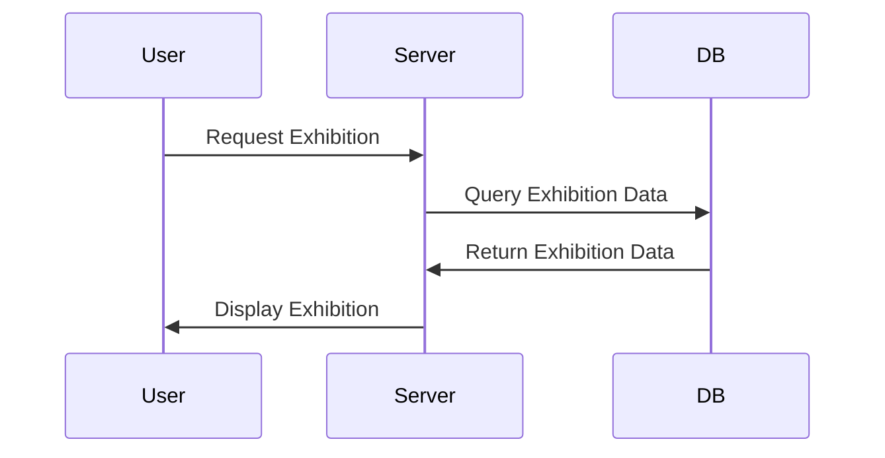
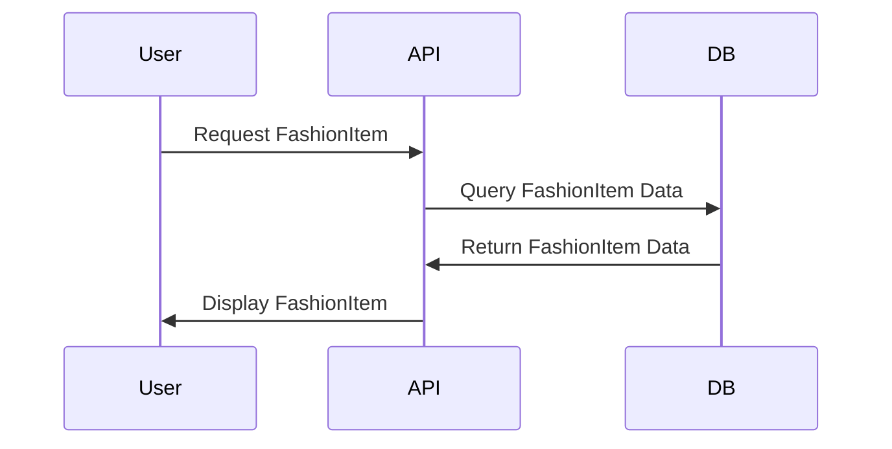
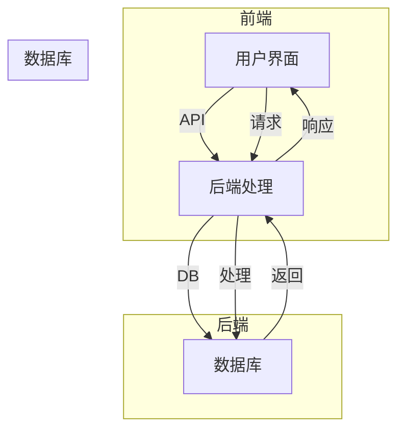

                 

### 优化AI虚拟时尚展览：沉浸式数字体验的提示词策略

#### 关键词：人工智能、虚拟时尚展览、沉浸式体验、提示词策略、数字体验优化

> 摘要：本文旨在探讨如何通过人工智能技术优化虚拟时尚展览的沉浸式数字体验。首先，我们分析了虚拟时尚展览的现状与挑战，包括定义、发展历程以及面临的现实问题。接着，我们阐述了人工智能在虚拟时尚展览中的应用前景，包括核心概念与联系。本文的重点在于深入解析沉浸式数字体验技术、提示词策略与人机交互等方面。随后，我们讨论了机器学习的基本原理、神经网络与深度学习，并引入了提示词策略的数学模型和沉浸式体验的数学分析。在此基础上，我们探讨了虚拟时尚展览的系统分析与架构设计，包括功能设计、架构设计、接口设计与交互设计。文章随后通过实际项目实战，详细讲解了环境安装、系统核心实现源代码，并分析了实际案例。最后，我们总结了最佳实践、注意事项，并展望了未来的研究方向。

---

### 第一部分：优化AI虚拟时尚展览背景与问题分析

#### 第1章：虚拟时尚展览的现状与挑战

##### 1.1 虚拟时尚展览的定义与意义

虚拟时尚展览是一种利用数字技术创建的虚拟空间，旨在为观众提供一种全新的时尚体验。这种展览不仅展示了设计师的作品，还通过虚拟现实（VR）和增强现实（AR）技术，使观众能够身临其境地感受时尚的氛围。虚拟时尚展览的意义在于，它打破了传统实体展览的时间和空间限制，使得时尚品牌能够以更低成本、更广泛地推广其产品。

##### 1.2 虚拟时尚展览的发展历程

虚拟时尚展览的发展可以追溯到20世纪90年代末的互联网兴起时期。最初，虚拟时尚展览仅限于在线展示，通过网页和电子邮件传播。随着计算机技术的发展，尤其是VR和AR技术的成熟，虚拟时尚展览的形式和内容得到了极大丰富。如今，许多国际知名时尚品牌已经开始利用虚拟时尚展览进行新品发布会和市场营销。

##### 1.3 当前虚拟时尚展览面临的挑战

尽管虚拟时尚展览具有许多优势，但仍然面临一些挑战。首先，技术门槛较高，许多时尚品牌缺乏必要的技能和资源来创建高质量的虚拟展览。其次，用户体验不佳，一些虚拟展览缺乏互动性和沉浸感，无法充分吸引观众的注意力。此外，数据隐私和安全问题也是虚拟时尚展览需要关注的重要方面。

##### 1.4 人工智能在虚拟时尚展览中的应用前景

人工智能（AI）技术的发展为虚拟时尚展览带来了新的机遇。通过AI技术，虚拟时尚展览可以更好地理解用户需求，提供个性化的体验。例如，AI可以帮助时尚品牌根据用户的历史浏览数据，推荐符合其口味的商品。此外，AI还可以用于优化虚拟展览的交互设计，提高观众的沉浸感。总的来说，人工智能在虚拟时尚展览中的应用前景十分广阔。

---

#### 第2章：AI虚拟时尚展览的核心概念与联系

##### 2.1 人工智能的基本概念

人工智能（AI）是指计算机系统模拟人类智能行为的能力。AI技术主要包括机器学习、深度学习、自然语言处理、计算机视觉等。在虚拟时尚展览中，AI技术主要用于提升用户体验和运营效率。

##### 2.2 虚拟现实与增强现实技术

虚拟现实（VR）和增强现实（AR）是创建沉浸式数字体验的关键技术。VR技术通过虚拟空间为用户提供沉浸式体验，而AR技术则通过在现实世界中叠加虚拟元素，增强用户的感知体验。

##### 2.3 数据分析与机器学习技术

数据分析与机器学习技术可以帮助虚拟时尚展览更好地理解用户行为和需求。通过分析用户数据，AI系统可以推荐个性化的时尚商品，优化展览内容。

##### 2.4 AI虚拟时尚展览的ER实体关系图

为了更好地理解AI虚拟时尚展览的核心概念与联系，我们使用ER（实体-关系）模型进行描述。该模型包括用户、时尚商品、展览活动、推荐系统等实体，以及它们之间的关联关系。

```mermaid
erDiagram
  User ||--|{ Exhibition }||>
  Exhibition ||--|{ FashionItem }||>
  Exhibition ||--|{ Recommendation }||>
  User ||--|{ Recommendation }||>
```

---

#### 第3章：AI虚拟时尚展览的关键技术解析

##### 3.1 沉浸式数字体验技术

沉浸式数字体验技术是虚拟时尚展览的核心。通过VR和AR技术，用户可以身临其境地体验虚拟展览，感受到真实的时尚氛围。

##### 3.2 提示词策略与语义理解

提示词策略是虚拟时尚展览中的一项关键技术。通过分析用户输入的提示词，AI系统可以理解用户的需求，并推荐相应的时尚商品。

##### 3.3 人机交互与情感计算

人机交互与情感计算技术可以帮助虚拟时尚展览更好地与用户互动。通过分析用户的情感状态，AI系统可以调整展览内容，提高用户体验。

##### 3.4 数据可视化与信息呈现

数据可视化与信息呈现技术用于将用户数据、时尚商品信息等以直观的方式呈现给用户。通过图表、图像等可视化手段，用户可以更轻松地理解和分析数据。

---

#### 第4章：数学模型与算法原理

##### 4.1 机器学习的基本原理

机器学习是一种通过数据驱动的方式，使计算机系统具备自我学习能力的技术。在虚拟时尚展览中，机器学习主要用于推荐系统和个性化体验。

##### 4.2 神经网络与深度学习

神经网络与深度学习是机器学习的核心技术。通过模拟人脑的神经网络结构，深度学习可以实现复杂的模式识别和预测任务。

##### 4.3 提示词策略的数学模型

提示词策略的数学模型基于自然语言处理技术。通过分析提示词的语义，模型可以理解用户的需求，并推荐相应的时尚商品。

```python
import nltk
from nltk.tokenize import word_tokenize

def sentiment_analysis(sentence):
    tokens = word_tokenize(sentence)
    scores = [nltk.sentiment.vader.SentimentIntensityAnalyzer().polarity_scores(token) for token in tokens]
    return sum(scores) / len(scores)

sentence = "我很喜欢这件衣服的设计。"
print(sentiment_analysis(sentence))
```

##### 4.4 沉浸式体验的数学分析

沉浸式体验的数学分析主要涉及感知心理学和认知心理学。通过研究用户的感知和行为，我们可以量化沉浸式体验的质量。

```latex
\text{沉浸式体验质量} = f(\text{视觉刺激强度}, \text{听觉刺激强度}, \text{触觉刺激强度}, \text{情感状态})
```

---

#### 第5章：系统分析与架构设计

##### 5.1 虚拟时尚展览系统功能设计

虚拟时尚展览系统需要具备以下功能：用户注册与登录、商品浏览与推荐、虚拟展览参观、互动与反馈等。

##### 5.2 虚拟时尚展览系统架构设计

虚拟时尚展览系统架构包括前端用户界面、后端数据处理、数据库存储等。通过微服务架构，可以提高系统的可扩展性和可维护性。



##### 5.3 系统接口设计与交互设计

系统接口设计包括RESTful API和WebSocket等。通过合理的接口设计，可以提高系统的可扩展性和易用性。



##### 5.4 虚拟时尚展览系统的Mermaid架构图



---

#### 第6章：项目实战

##### 6.1 环境安装与配置

在本节中，我们将介绍如何安装和配置虚拟时尚展览系统所需的软件和工具。

##### 6.2 系统核心实现源代码解析

在本节中，我们将解析虚拟时尚展览系统的核心实现源代码，包括用户注册、登录、商品浏览和推荐等功能的实现。

##### 6.3 实际案例分析与讲解

在本节中，我们将通过实际案例，详细讲解虚拟时尚展览系统的应用场景和实现方法。

##### 6.4 项目小结与反思

在本节中，我们将对项目进行总结，并反思项目中遇到的问题和解决方案。

---

#### 第7章：最佳实践与总结

##### 7.1 AI虚拟时尚展览的最佳实践

在本节中，我们将分享一些最佳实践，帮助读者更好地设计和实施AI虚拟时尚展览。

##### 7.2 项目中的注意事项

在本节中，我们将总结项目中需要注意的事项，包括技术选型、数据安全和用户体验等。

##### 7.3 拓展阅读与未来研究方向

在本节中，我们将推荐一些拓展阅读资料，并探讨未来虚拟时尚展览的研究方向。

##### 7.4 本书小结与展望

在本节中，我们将对全文进行总结，并展望虚拟时尚展览的未来发展。

---

作者：AI天才研究院/AI Genius Institute & 禅与计算机程序设计艺术 /Zen And The Art of Computer Programming

---

本文通过深入分析虚拟时尚展览的现状与挑战，探讨了如何利用人工智能技术优化沉浸式数字体验。我们详细介绍了核心概念、关键技术、数学模型和系统架构设计，并通过实际项目实战，展示了技术的应用和实践方法。最后，我们总结了最佳实践和注意事项，并展望了未来的研究方向。希望本文能为读者提供有价值的参考和启示。

