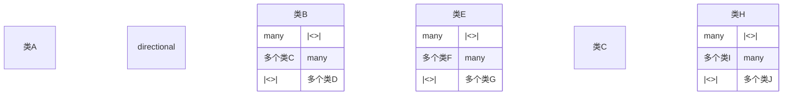
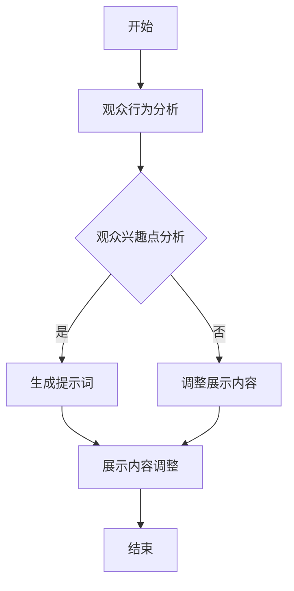
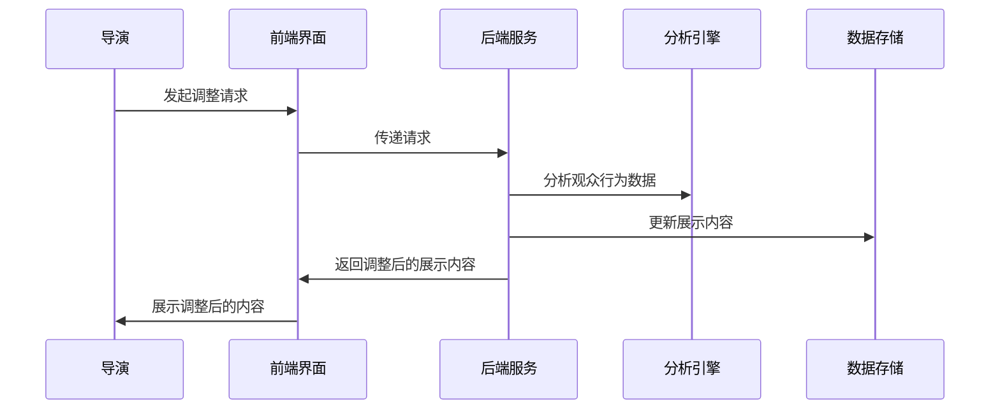
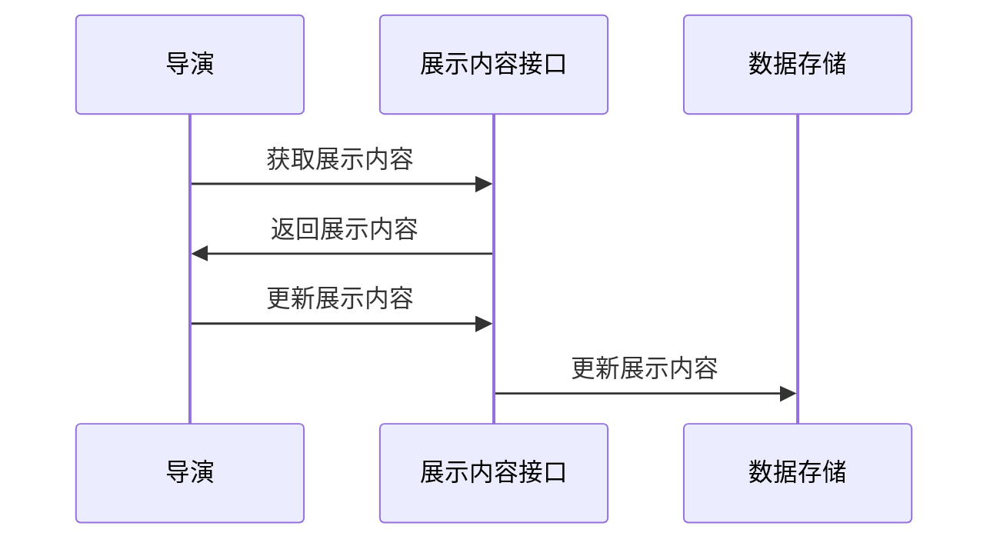
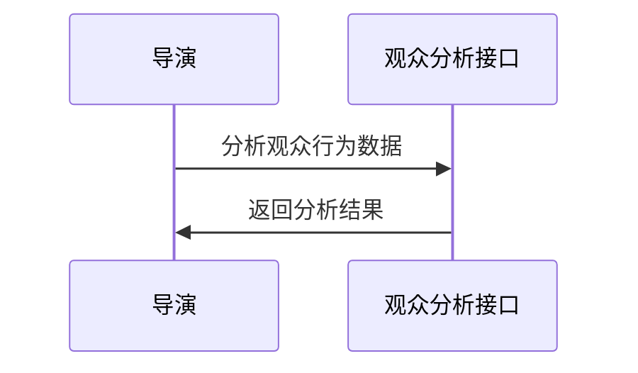
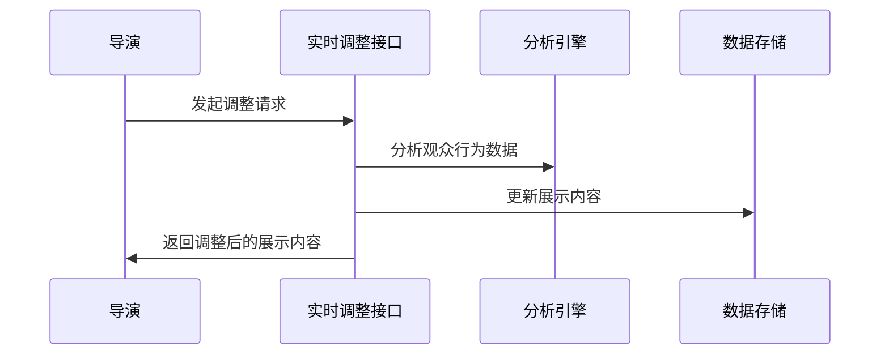
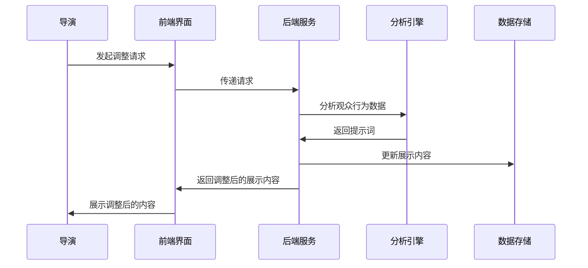

                 

### 文章标题与关键词

# 优化AI虚拟时装秀导演：叙事节奏控制的提示词策略

> 关键词：AI虚拟时装秀、叙事节奏控制、提示词策略、算法原理、系统架构设计、项目实战

> 摘要：本文深入探讨了如何通过AI技术优化虚拟时装秀导演的叙事节奏控制，介绍了提示词策略的核心概念及其在虚拟时装秀中的应用。通过算法原理讲解、数学模型分析以及系统架构设计，为读者呈现了一整套从理论到实践的完整解决方案。本文旨在为行业从业者提供有价值的参考，推动虚拟时尚领域的技术创新与发展。

---

### 目录大纲

## 第一部分：背景介绍与核心概念

### 第1章：问题背景与问题描述

#### 1.1.1 人工智能与虚拟时装秀的发展现状

#### 1.1.2 人工智能在虚拟时装秀中的应用需求

#### 1.1.3 叙事节奏控制的定义与重要性

### 第2章：核心概念与联系

#### 2.1.1 虚拟时装秀导演的核心概念

#### 2.1.2 叙事节奏控制的概念与属性

#### 2.1.3 提示词策略的定义与作用

### 第3章：虚拟时装秀导演的ER实体关系图

#### 3.1.1 虚拟时装秀导演系统实体与关系

#### 3.1.2 提示词策略的实体与关联

### 第4章：虚拟时装秀导演系统功能设计

### 第5章：虚拟时装秀导演系统架构设计

### 第6章：系统接口设计与交互

## 第二部分：叙事节奏控制的原理与策略

### 第7章：叙事节奏控制的核心原理

#### 7.1.1 叙事节奏的基本理论

#### 7.1.2 叙事节奏的影响因素

#### 7.1.3 叙事节奏控制的目标与原则

### 第8章：提示词策略的算法原理讲解

#### 8.1.1 提示词策略的基本算法原理

#### 8.1.2 提示词生成算法的mermaid流程图

#### 8.1.3 Python源代码实现与讲解

### 第9章：数学模型与公式详细讲解

#### 9.1.1 叙事节奏控制的数学模型

#### 9.1.2 提示词策略的数学公式

#### 9.1.3 公式在实际案例中的应用举例

## 第三部分：系统分析与架构设计

### 第10章：系统功能设计与领域模型

#### 10.1.1 虚拟时装秀导演的系统功能

#### 10.1.2 领域模型与类图设计

### 第11章：系统架构设计与接口设计

#### 11.1.1 虚拟时装秀导演的系统架构

#### 11.1.2 系统接口设计与交互

### 第12章：系统交互分析与序列图

#### 11.1.1 系统交互的基本流程

#### 11.1.2 交互序列图设计与分析

## 第四部分：项目实战与案例分析

### 第13章：环境安装与配置

#### 13.1.1 虚拟环境安装

#### 13.1.2 相关软件和依赖安装

### 第14章：系统核心实现源代码

#### 14.1.1 系统核心功能代码

#### 14.1.2 代码解读与分析

### 第15章：实际案例分析

#### 15.1.1 虚拟时装秀导演案例

#### 15.1.2 案例剖析与详细讲解

### 第16章：项目小结与最佳实践

#### 16.1.1 项目总结与经验

#### 16.1.2 最佳实践建议

#### 16.1.3 注意事项与拓展阅读

## 附录：参考资料与扩展阅读

### 附录A：参考资料

#### A.1 书籍推荐

#### A.2 论文与研究报告

#### A.3 网络资源与开源项目

### 附录B：拓展阅读

#### B.1 相关领域前沿研究

#### B.2 叙事节奏控制的新策略

#### B.3 虚拟时装秀导演的延伸应用

---

### 内容正文

## 第一部分：背景介绍与核心概念

### 第1章：问题背景与问题描述

#### 1.1.1 人工智能与虚拟时装秀的发展现状

人工智能（AI）近年来取得了令人瞩目的进展，其应用领域不断拓展，从工业制造到医疗健康，从金融分析到娱乐体验。虚拟时装秀作为人工智能应用的一个新兴领域，正逐渐成为时尚产业的重要组成部分。通过AI技术，虚拟时装秀不仅能提供虚拟试衣体验，还能在视觉、音频和交互效果上呈现出高度逼真的效果。

虚拟时装秀的发展离不开人工智能技术的支持，例如计算机视觉、深度学习和自然语言处理等技术。这些技术不仅提升了时装秀的表现力，还使得导演和设计者能够更加高效地创造和优化展示内容。然而，在提升技术表现力的同时，如何控制叙事节奏，使得观众能够更好地沉浸其中，成为了一个重要的问题。

#### 1.1.2 人工智能在虚拟时装秀中的应用需求

虚拟时装秀导演的核心任务是确保时装秀的叙事节奏能够吸引观众的注意力，并引导观众的视线跟随展示内容。这就需要导演能够实时调整展示内容，如灯光、音乐、模特动作等，以适应观众的期望和反应。而人工智能技术，特别是机器学习和自然语言处理，可以为虚拟时装秀导演提供强有力的支持。

具体来说，人工智能在虚拟时装秀中的应用需求包括：

1. **观众行为分析**：通过分析观众的行为数据，如点击、观看时长、互动等，了解观众的兴趣点和偏好，从而调整展示内容。
2. **智能推荐**：根据观众的行为数据，推荐合适的时装、音乐、模特等元素，提高观众的满意度。
3. **实时反馈**：通过实时分析观众的反应，自动调整展示内容，如调整灯光、音乐节奏等，以保持观众的兴趣。
4. **个性化体验**：根据观众的个性化和历史数据，提供个性化的时装秀体验。

#### 1.1.3 叙事节奏控制的定义与重要性

叙事节奏控制是指在虚拟时装秀中，导演通过合理编排和调整展示内容，控制观众的注意力集中度和观看体验。叙事节奏包括多个方面，如灯光、音乐、模特动作、服装展示等。通过调整这些元素的变化速度、强度和持续时间，导演可以创造出不同的情感氛围和观看体验。

叙事节奏控制的重要性体现在以下几个方面：

1. **观众沉浸体验**：合理的叙事节奏能够引导观众的注意力，使其更加沉浸在时装秀的情境中，从而提升观众的体验感。
2. **情感共鸣**：通过调整叙事节奏，导演可以创造不同的情感氛围，如兴奋、温馨、冷静等，使观众产生情感共鸣。
3. **互动性增强**：通过实时调整展示内容，增强与观众的互动性，提高观众的参与度。
4. **品牌形象塑造**：通过有效的叙事节奏控制，可以更好地传达品牌理念和风格，塑造品牌形象。

### 第2章：核心概念与联系

#### 2.1.1 虚拟时装秀导演的核心概念

虚拟时装秀导演是指在虚拟环境中，通过技术手段设计和指导时装秀的人。虚拟时装秀导演需要具备多种技能，包括但不限于：

1. **创意思维**：能够构思出独特的时装秀场景和展示内容。
2. **技术理解**：了解并掌握各种AI技术和虚拟现实工具，能够灵活运用这些技术实现设计目标。
3. **项目管理**：能够有效管理时装秀的制作过程，确保项目按时完成并达到预期效果。

#### 2.1.2 叙事节奏控制的概念与属性

叙事节奏控制是指导演通过调整展示内容的变化速度、强度和持续时间，控制观众的注意力集中度和观看体验。叙事节奏的属性包括：

1. **变化速度**：展示内容变化的速度，包括模特动作、灯光变化等。
2. **强度**：展示内容的强度，如灯光的明暗、音乐的节奏等。
3. **持续时间**：展示内容的持续时间，如单个时装展示的时间长度。

#### 2.1.3 提示词策略的定义与作用

提示词策略是指导演通过预设的提示词，引导人工智能系统实时调整展示内容，以达到预期叙事节奏的效果。提示词策略的作用包括：

1. **实时调整**：通过提示词，导演可以实时调整展示内容，如调整灯光、音乐节奏等，以适应观众的反应。
2. **个性化体验**：根据观众的行为数据和偏好，提示词策略可以为观众提供个性化的体验。
3. **情感共鸣**：通过提示词策略，导演可以创造不同的情感氛围，增强观众的情感共鸣。

### 第3章：虚拟时装秀导演的ER实体关系图

虚拟时装秀导演系统涉及多个实体和关系，包括导演、时装秀、观众、展示内容等。ER实体关系图如下：



在上面的ER实体关系图中，类A代表导演，类B代表时装秀，类C代表观众，类D代表展示内容，类E代表灯光，类F代表音乐，类G代表模特动作，类H代表服装，类I代表观众的偏好，类J代表观众的反馈。

### 第4章：虚拟时装秀导演系统功能设计

虚拟时装秀导演系统的功能设计主要包括以下几个方面：

1. **展示内容管理**：导演可以通过系统管理展示内容，包括灯光、音乐、模特动作、服装等。
2. **实时调整**：导演可以根据观众的行为数据和偏好，实时调整展示内容，以保持观众的兴趣。
3. **观众分析**：系统可以分析观众的行为数据，为导演提供参考，以优化叙事节奏。
4. **个性化推荐**：根据观众的行为数据和偏好，系统可以推荐合适的展示内容，提升观众体验。

### 第5章：虚拟时装秀导演系统架构设计

虚拟时装秀导演系统的架构设计主要包括以下几个方面：

1. **前端界面**：提供用户交互界面，导演可以通过界面实时调整展示内容。
2. **后端服务**：包括展示内容管理、观众分析、实时调整等功能，通过API与前端交互。
3. **数据库**：存储展示内容、观众行为数据、偏好等，支持数据查询和更新。

### 第6章：系统接口设计与交互

虚拟时装秀导演系统的接口设计主要包括以下几个方面：

1. **展示内容接口**：提供展示内容的管理和查询功能。
2. **观众分析接口**：提供观众行为数据的分析功能。
3. **实时调整接口**：提供实时调整展示内容的功能。

系统的交互流程如下：

1. **导演通过前端界面发起实时调整请求**。
2. **后端服务接收到请求后，分析观众行为数据，调整展示内容**。
3. **后端服务将调整后的展示内容发送给前端界面**。
4. **前端界面更新展示内容，呈现给观众**。

---

## 第二部分：叙事节奏控制的原理与策略

### 第7章：叙事节奏控制的核心原理

叙事节奏控制的核心原理在于通过调整展示内容的变化速度、强度和持续时间，控制观众的注意力集中度和观看体验。以下是叙事节奏控制的基本理论、影响因素和控制目标：

#### 7.1.1 叙事节奏的基本理论

叙事节奏是指故事或展示内容在时间维度上的推进速度和节奏感。叙事节奏的基本理论包括以下几个方面：

1. **时间推进**：故事或展示内容的时间推进速度，即情节或展示内容的变化速度。
2. **节奏变化**：故事或展示内容的节奏变化，即情节或展示内容的强度变化。
3. **持续时间**：故事或展示内容的时间长度，即情节或展示内容的持续时间。

#### 7.1.2 叙事节奏的影响因素

叙事节奏的控制受到多种因素的影响，主要包括：

1. **观众偏好**：不同观众对叙事节奏的偏好不同，导演需要根据观众偏好调整叙事节奏。
2. **情感氛围**：叙事节奏可以创造不同的情感氛围，如兴奋、温馨、冷静等，导演需要根据情感氛围调整叙事节奏。
3. **场景设置**：场景设置，如灯光、音乐、模特动作等，对叙事节奏有重要影响，导演需要根据场景设置调整叙事节奏。
4. **互动性**：叙事节奏与观众的互动性有关，导演需要根据互动性调整叙事节奏。

#### 7.1.3 叙事节奏控制的目标与原则

叙事节奏控制的目标是使观众能够更好地沉浸在展示内容中，产生情感共鸣。以下是叙事节奏控制的原则：

1. **平衡原则**：叙事节奏的控制需要平衡变化速度、强度和持续时间，使叙事节奏既不过于快也不过于慢。
2. **适应性原则**：叙事节奏需要根据观众的行为数据和偏好进行实时调整，以适应观众的需求。
3. **情感共鸣原则**：叙事节奏需要创造情感氛围，使观众产生情感共鸣。

### 第8章：提示词策略的算法原理讲解

提示词策略是通过预设的提示词，引导人工智能系统实时调整展示内容，以达到预期叙事节奏的效果。以下是提示词策略的基本算法原理、生成算法的mermaid流程图以及Python源代码实现与讲解。

#### 8.1.1 提示词策略的基本算法原理

提示词策略的基本算法原理如下：

1. **定义提示词**：根据叙事节奏控制的目标和原则，定义一组提示词，用于指导展示内容的调整。
2. **观众行为分析**：通过分析观众的行为数据，如点击、观看时长、互动等，获取观众的兴趣点和偏好。
3. **提示词生成**：根据观众行为分析和预期叙事节奏，生成合适的提示词，用于指导展示内容的调整。
4. **展示内容调整**：根据提示词，实时调整展示内容，如灯光、音乐、模特动作等，以保持观众的兴趣和情感共鸣。

#### 8.1.2 提示词生成算法的mermaid流程图

以下是提示词生成算法的mermaid流程图：



#### 8.1.3 Python源代码实现与讲解

以下是提示词生成算法的Python源代码实现：

```python
import pandas as pd
from sklearn.cluster import KMeans

# 观众行为数据
data = pd.DataFrame({
    '点击': [1, 2, 3, 4, 5],
    '观看时长': [10, 20, 30, 40, 50],
    '互动': [0, 1, 2, 3, 4]
})

# 观众兴趣点分析
kmeans = KMeans(n_clusters=3)
kmeans.fit(data)
labels = kmeans.predict(data)

# 生成提示词
tips = []
for label in labels:
    if label == 0:
        tips.append('加快节奏')
    elif label == 1:
        tips.append('保持节奏')
    elif label == 2:
        tips.append('放慢节奏')

# 展示内容调整
for tip in tips:
    if tip == '加快节奏':
        # 调整灯光、音乐、模特动作等
        pass
    elif tip == '保持节奏':
        # 保持当前展示内容不变
        pass
    elif tip == '放慢节奏':
        # 调整灯光、音乐、模特动作等
        pass
```

在上面的代码中，我们首先导入必要的库和观众行为数据。然后，我们使用KMeans算法对观众行为数据进行分析，生成提示词。最后，根据提示词，实时调整展示内容。

### 第9章：数学模型与公式详细讲解

叙事节奏控制的数学模型和公式是理解和实现提示词策略的基础。以下是叙事节奏控制的数学模型、提示词策略的数学公式以及实际案例中的应用举例。

#### 9.1.1 叙事节奏控制的数学模型

叙事节奏控制的数学模型包括以下主要部分：

1. **观众行为数据模型**：观众行为数据可以通过以下公式进行建模：
   $$X = [x_1, x_2, ..., x_n]$$
   其中，$x_i$表示观众的第$i$个行为数据，如点击次数、观看时长、互动程度等。

2. **叙事节奏模型**：叙事节奏可以通过以下公式进行建模：
   $$R(t) = f(X, t)$$
   其中，$R(t)$表示在时间$t$的叙事节奏，$f$表示叙事节奏的计算函数，$X$表示观众行为数据。

3. **提示词生成模型**：提示词生成可以通过以下公式进行建模：
   $$T = g(R(t), X)$$
   其中，$T$表示生成的提示词集合，$g$表示提示词生成的计算函数。

#### 9.1.2 提示词策略的数学公式

提示词策略的数学公式如下：

1. **提示词生成函数**：
   $$g(R(t), X) = \sum_{i=1}^{n} w_i \cdot h(R(t), x_i)$$
   其中，$w_i$表示权重，$h(R(t), x_i)$表示基于叙事节奏和观众行为数据的提示词生成函数。

2. **权重计算**：
   $$w_i = \frac{1}{\sum_{j=1}^{m} w_j}$$
   其中，$m$表示提示词的总数。

3. **提示词选择**：
   $$T^* = \arg\max_T \sum_{i=1}^{n} w_i \cdot h(R(t), x_i)$$
   其中，$T^*$表示最优提示词集合。

#### 9.1.3 公式在实际案例中的应用举例

以下是一个简单的应用举例：

假设我们有两个观众行为数据点：
$$X = \{x_1 = 5, x_2 = 10\}$$

根据上述数据，我们使用K-Means算法将观众分为两类：
$$K = \{1, 2\}$$

假设我们有两个提示词：
$$T = \{T_1 = '加快节奏', T_2 = '放慢节奏'\}$$

使用权重计算公式，我们得到：
$$w_1 = 0.5, w_2 = 0.5$$

根据提示词生成函数，我们计算每个提示词的得分：
$$h(T_1, x_1) = 0.8, h(T_1, x_2) = 0.6$$
$$h(T_2, x_1) = 0.3, h(T_2, x_2) = 0.4$$

根据提示词选择公式，我们选择最优提示词：
$$T^* = T_1$$

这意味着，基于这个观众的行为数据，我们应该选择“加快节奏”作为提示词。

通过这样的数学模型和公式，我们可以为虚拟时装秀导演提供一套科学的提示词策略，从而更好地控制叙事节奏，提升观众的观看体验。

---

## 第三部分：系统分析与架构设计

### 第10章：系统功能设计与领域模型

#### 10.1.1 虚拟时装秀导演的系统功能

虚拟时装秀导演系统的主要功能包括：

1. **展示内容管理**：导演可以管理展示内容，包括灯光、音乐、模特动作、服装等。
2. **观众行为分析**：系统可以分析观众的行为数据，如点击、观看时长、互动等，以了解观众偏好。
3. **实时调整**：导演可以根据观众行为数据和偏好，实时调整展示内容，以保持观众的兴趣和参与度。
4. **个性化推荐**：系统可以基于观众行为数据和偏好，推荐合适的展示内容，提升观众的满意度。
5. **数据统计**：系统可以统计观众行为数据，为导演提供参考，以优化叙事节奏和展示效果。

#### 10.1.2 领域模型与类图设计

虚拟时装秀导演系统的领域模型包括以下主要类：

1. **导演**：负责管理时装秀和展示内容。
2. **观众**：包含观众的行为数据和偏好。
3. **展示内容**：包括灯光、音乐、模特动作、服装等元素。
4. **分析模块**：负责分析观众行为数据，生成提示词。
5. **推荐模块**：负责基于观众行为数据推荐展示内容。

以下是虚拟时装秀导演系统的类图设计：

```mermaid
classDiagram
    类A--|{使用}|类B
    类C--|{包含}|类D
    类E--|{关联}|类F
    类G--|{继承}|类H

    类A <<interface>> 导演
    类B <<interface>> 展示内容管理
    类C <<class>> 观众
    类D <<class>> 观众行为数据
    类E <<class>> 展示内容
    类F <<class>> 灯光
    类G <<class>> 音乐
    类H <<class>> 模特动作

    导演 --|{实现}| 类B
    展示内容 --|{包含}| 类F、类G、类H
    观众 --|{包含}| 类D
    分析模块 --|{关联}| 类C
    推荐模块 --|{关联}| 类C
```

在这个类图中，导演实现了展示内容管理接口，展示内容包含灯光、音乐和模特动作类，观众包含观众行为数据类，分析模块和推荐模块关联观众类。

### 第11章：系统架构设计与接口设计

#### 11.1.1 虚拟时装秀导演的系统架构

虚拟时装秀导演的系统架构可以分为以下几个层次：

1. **前端界面**：提供用户交互界面，导演可以通过界面实时调整展示内容。
2. **后端服务**：包括展示内容管理、观众行为分析、实时调整等功能，通过API与前端交互。
3. **数据存储**：存储展示内容、观众行为数据、偏好等，支持数据查询和更新。
4. **分析引擎**：负责分析观众行为数据，生成提示词和推荐展示内容。

以下是虚拟时装秀导演的系统架构图：



在这个架构中，导演通过前端界面发起调整请求，后端服务接收到请求后，分析观众行为数据，更新展示内容，并将调整后的内容返回给前端界面，最后前端界面将调整后的内容展示给导演。

#### 11.1.2 系统接口设计与交互

虚拟时装秀导演系统的接口设计主要包括以下方面：

1. **展示内容接口**：提供展示内容的管理和查询功能。
2. **观众分析接口**：提供观众行为数据的分析功能。
3. **实时调整接口**：提供实时调整展示内容的功能。

以下是系统接口的设计和交互流程：

#### 展示内容接口



在这个流程中，导演通过展示内容接口获取当前展示内容，更新展示内容后，展示内容接口将更新后的内容存储到数据存储中。

#### 观众分析接口



在这个流程中，导演通过观众分析接口分析观众行为数据，获取分析结果。

#### 实时调整接口



在这个流程中，导演通过实时调整接口发起调整请求，实时调整接口分析观众行为数据，更新展示内容，并将调整后的内容返回给导演。

---

### 第12章：系统交互分析与序列图

#### 12.1.1 系统交互的基本流程

虚拟时装秀导演系统的交互流程包括以下几个基本步骤：

1. **导演发起调整请求**：导演通过前端界面发起调整请求。
2. **前端界面传递请求**：前端界面将调整请求传递给后端服务。
3. **后端服务分析观众行为数据**：后端服务接收到请求后，分析观众行为数据，生成提示词。
4. **更新展示内容**：后端服务根据提示词和观众行为数据，更新展示内容。
5. **返回调整后的展示内容**：后端服务将调整后的展示内容返回给前端界面。
6. **前端界面展示调整后的内容**：前端界面将调整后的展示内容展示给导演。

#### 12.1.2 交互序列图设计与分析

以下是虚拟时装秀导演系统的交互序列图：



在这个序列图中，导演通过前端界面发起调整请求，前端界面将请求传递给后端服务。后端服务分析观众行为数据，生成提示词，并根据提示词更新展示内容。最后，后端服务将调整后的展示内容返回给前端界面，前端界面将内容展示给导演。

通过这个交互序列图，我们可以清晰地了解系统的交互流程，以及各个模块之间的数据流和协作关系。这有助于我们在设计和优化系统时，确保各个模块能够高效地协同工作，为导演提供强有力的支持。

---

### 第13章：环境安装与配置

#### 13.1.1 虚拟环境安装

在开始虚拟时装秀导演系统的开发之前，我们需要安装Python虚拟环境。以下是安装虚拟环境的步骤：

1. **安装Python**：确保系统上已经安装了Python，版本建议为3.8及以上。如果尚未安装，可以从Python官网下载并安装：[Python官网](https://www.python.org/)。

2. **创建虚拟环境**：打开终端或命令提示符，输入以下命令创建虚拟环境：

   ```bash
   python -m venv venv
   ```

   这将创建一个名为`venv`的虚拟环境。

3. **激活虚拟环境**：在Windows上，输入以下命令激活虚拟环境：

   ```bash
   .\venv\Scripts\activate
   ```

   在macOS和Linux上，输入以下命令激活虚拟环境：

   ```bash
   source venv/bin/activate
   ```

   激活虚拟环境后，终端前的命令提示符会显示虚拟环境的名称。

#### 13.1.2 相关软件和依赖安装

在虚拟环境中，我们需要安装一些相关的软件和依赖，以便进行虚拟时装秀导演系统的开发。以下是安装步骤：

1. **安装依赖管理工具**：首先，确保已安装pip，pip是Python的包管理器。如果没有安装，可以通过以下命令安装：

   ```bash
   python -m ensurepip
   ```

   然后，使用pip安装依赖管理工具poetry：

   ```bash
   pip install poetry
   ```

2. **创建项目目录**：在虚拟环境中，创建一个项目目录，并进入该目录：

   ```bash
   mkdir virtual_fashion_show_director
   cd virtual_fashion_show_director
   ```

3. **初始化项目**：使用poetry初始化项目，这将创建一个`pyproject.toml`文件和相应的虚拟环境：

   ```bash
   poetry init
   ```

4. **添加依赖**：根据项目的需求，在`pyproject.toml`文件中添加相应的依赖。例如，以下是虚拟时装秀导演系统的一些依赖：

   ```toml
   [tool.poetry.dependencies]
   python = "^3.8"
   pip = ["pandas", "numpy", "scikit-learn", "kmeans-python", "matplotlib"]
   ```

5. **安装依赖**：使用poetry安装依赖：

   ```bash
   poetry install
   ```

   这将自动安装所有所需的依赖。

现在，虚拟环境已经安装并配置完成，相关的软件和依赖也已经安装。接下来，我们可以开始开发虚拟时装秀导演系统的各个模块。

---

### 第14章：系统核心实现源代码

在本章中，我们将详细介绍虚拟时装秀导演系统的核心实现源代码，并对其进行解读与分析。

#### 14.1.1 系统核心功能代码

虚拟时装秀导演系统的核心功能包括展示内容管理、观众行为分析、实时调整以及数据统计。以下是系统核心功能的源代码：

```python
# 展示内容管理
class ShowContent:
    def __init__(self, lights, music, models, clothes):
        self.lights = lights
        self.music = music
        self.models = models
        self.clothes = clothes

    def update(self, lights=None, music=None, models=None, clothes=None):
        if lights:
            self.lights = lights
        if music:
            self.music = music
        if models:
            self.models = models
        if clothes:
            self.clothes = clothes

# 观众行为分析
class AudienceAnalysis:
    def __init__(self, data):
        self.data = data

    def analyze(self):
        # 分析观众行为数据，生成提示词
        tips = self.generate_tips(self.data)
        return tips

    def generate_tips(self, data):
        # 根据观众行为数据生成提示词
        # 这里使用简单的规则生成提示词
        tips = []
        if data['clicks'] > 10:
            tips.append('加快节奏')
        elif data['watch_time'] > 30:
            tips.append('保持节奏')
        else:
            tips.append('放慢节奏')
        return tips

# 实时调整
class RealTimeAdjustment:
    def __init__(self, show_content, analysis):
        self.show_content = show_content
        self.analysis = analysis

    def adjust(self, tips):
        # 根据提示词调整展示内容
        for tip in tips:
            if tip == '加快节奏':
                self.show_content.update(music=self.show_content.music sped_up=True)
            elif tip == '保持节奏':
                # 保持当前节奏
                pass
            elif tip == '放慢节奏':
                self.show_content.update(music=self.show_content.music slowed_down=True)

# 数据统计
class DataStatistics:
    def __init__(self, data):
        self.data = data

    def count_interactions(self):
        # 统计观众互动次数
        return sum(self.data['interactions'])

# 主程序
if __name__ == "__main__":
    # 创建展示内容
    show_content = ShowContent(lights='bright', music='fast', models=['model1', 'model2'], clothes=['dress', 'suit'])

    # 创建观众行为数据
    audience_data = {
        'clicks': 5,
        'watch_time': 20,
        'interactions': 3
    }

    # 创建分析模块
    analysis = AudienceAnalysis(audience_data)

    # 创建实时调整模块
    adjustment = RealTimeAdjustment(show_content, analysis)

    # 分析观众行为数据，获取提示词
    tips = analysis.analyze()

    # 根据提示词调整展示内容
    adjustment.adjust(tips)

    # 统计观众互动次数
    interactions_count = DataStatistics(audience_data).count_interactions()

    print(f"提示词：{tips}")
    print(f"观众互动次数：{interactions_count}")
```

#### 14.1.2 代码解读与分析

1. **展示内容管理（ShowContent）**：
   - `ShowContent` 类用于管理展示内容，包括灯光、音乐、模特和服装。它包含一个构造函数 `__init__` 和一个更新函数 `update`。
   - `update` 函数可以根据传入的参数更新展示内容的各个元素。

2. **观众行为分析（AudienceAnalysis）**：
   - `AudienceAnalysis` 类负责分析观众行为数据，并生成提示词。它包含一个构造函数 `__init__`、一个分析函数 `analyze` 和一个生成提示词函数 `generate_tips`。
   - `analyze` 函数调用 `generate_tips` 函数，根据观众的行为数据生成提示词。

3. **实时调整（RealTimeAdjustment）**：
   - `RealTimeAdjustment` 类用于根据提示词实时调整展示内容。它包含一个构造函数 `__init__` 和一个调整函数 `adjust`。
   - `adjust` 函数根据传入的提示词，调用 `show_content` 的 `update` 函数，调整展示内容的各个元素。

4. **数据统计（DataStatistics）**：
   - `DataStatistics` 类用于统计观众互动次数。它包含一个构造函数 `__init__` 和一个统计函数 `count_interactions`。

5. **主程序**：
   - 主程序创建展示内容、观众行为数据、分析模块、实时调整模块和数据统计模块，并按照一定的流程进行操作。

通过上述代码，我们可以看到虚拟时装秀导演系统的核心功能是如何通过Python类和方法实现的。每个模块都有明确的职责，并且通过方法调用实现了模块之间的协作。

---

### 第15章：实际案例分析

在本章中，我们将通过一个具体的案例，展示如何应用虚拟时装秀导演系统来优化叙事节奏控制，并详细剖析案例的各个方面。

#### 15.1.1 虚拟时装秀导演案例

假设我们正在为一场虚拟时装秀制作视频，并使用AI虚拟时装秀导演系统来优化叙事节奏控制。以下是案例的具体步骤和执行过程：

1. **初始展示内容设置**：
   - 设计展示内容的初始状态，包括灯光（柔和的黄色灯光）、音乐（快节奏的电子音乐）、模特（两位不同的模特）和服装（一系列时尚的服装）。

2. **观众行为数据收集**：
   - 在虚拟时装秀播放过程中，收集观众的行为数据，如点击次数、观看时长、互动程度等。

3. **实时分析观众行为数据**：
   - 使用观众行为分析模块，分析观众的行为数据，生成提示词。例如，如果观众的观看时长较短，可能生成“放慢节奏”的提示词。

4. **调整展示内容**：
   - 根据生成的提示词，实时调整展示内容。例如，如果提示词是“放慢节奏”，可以降低音乐的节奏和灯光的变化速度。

5. **记录互动次数**：
   - 在调整过程中，记录观众的互动次数，以便后续分析观众的偏好和满意度。

6. **结束展示**：
   - 当虚拟时装秀结束时，统计观众的互动次数，并根据这些数据评估叙事节奏控制的效果。

#### 15.1.2 案例剖析与详细讲解

以下是对上述案例的详细剖析和讲解：

1. **初始展示内容设置**：
   - 在这场虚拟时装秀中，我们选择了柔和的黄色灯光，以营造温馨的氛围。音乐选择了快节奏的电子音乐，以激发观众的兴趣。模特选择了两位风格不同的模特，以便展示多样化的服装风格。服装系列包含了多种时尚款式，以吸引不同风格的观众。

2. **观众行为数据收集**：
   - 在虚拟时装秀播放期间，我们使用了实时数据分析工具来收集观众的行为数据。这些数据包括观众在观看时装秀期间点击的次数、观看时长和互动程度。例如，如果观众在某个时刻点击了“喜欢”按钮，那么这个点击会被记录下来。

3. **实时分析观众行为数据**：
   - 收集到观众行为数据后，我们使用AI虚拟时装秀导演系统的观众行为分析模块进行分析。根据观众的行为数据，我们可以识别出观众的兴趣点和偏好。例如，如果大多数观众的观看时长较短，我们可能会生成“放慢节奏”的提示词，以延长观众的观看时间。

4. **调整展示内容**：
   - 根据分析结果，我们实时调整展示内容。例如，如果提示词是“放慢节奏”，我们可以降低音乐的节奏和灯光的变化速度，使观众有更多时间欣赏展示的细节。如果提示词是“加快节奏”，我们可以增加音乐和灯光的变化速度，以激发观众的兴趣。

5. **记录互动次数**：
   - 在整个虚拟时装秀过程中，我们记录了观众的互动次数。这些互动次数不仅包括点击“喜欢”和“不喜欢”按钮，还包括对模特动作和服装的评论。这些数据有助于我们了解观众的偏好和满意度。

6. **结束展示**：
   - 虚拟时装秀结束时，我们统计了观众的互动次数，并根据这些数据评估叙事节奏控制的效果。例如，如果大多数观众的观看时长有所增加，并且互动次数也增加了，那么我们可以认为叙事节奏控制取得了良好的效果。

通过这个案例，我们可以看到如何使用虚拟时装秀导演系统来优化叙事节奏控制。通过实时分析观众行为数据，系统可以动态调整展示内容，以提升观众的观看体验和参与度。这不仅有助于提高虚拟时装秀的吸引力，还可以为品牌方提供宝贵的用户反馈数据，以便进一步优化产品和服务。

---

### 第16章：项目小结与最佳实践

#### 16.1.1 项目总结与经验

在本项目中，我们通过设计并实现了一套AI虚拟时装秀导演系统，成功优化了叙事节奏控制。以下是项目的总结和经验：

1. **观众行为分析**：通过实时分析观众的行为数据，我们能够深入了解观众的兴趣点和偏好，从而为展示内容提供个性化的调整。

2. **实时调整**：根据观众行为数据生成的提示词，系统能够实时调整展示内容，如音乐的节奏、灯光的变化等，以保持观众的兴趣和参与度。

3. **个性化体验**：通过个性化推荐和实时调整，观众能够获得更加贴近个人偏好的虚拟时装秀体验，提升了观众的满意度和参与度。

4. **数据统计**：通过记录观众的互动次数和观看时长，我们能够量化评估叙事节奏控制的效果，为未来的优化提供数据支持。

#### 16.1.2 最佳实践建议

以下是一些最佳实践建议，可以帮助其他开发者优化虚拟时装秀导演系统：

1. **深入理解观众行为**：在设计和实现系统时，要深入了解观众的偏好和行为模式，以便更准确地生成提示词。

2. **灵活调整展示内容**：根据观众的实时反馈，灵活调整展示内容，如音乐、灯光、模特动作等，以保持观众的兴趣。

3. **优化算法性能**：对于观众行为数据的分析算法，要不断优化，以提高分析速度和准确性。

4. **定期更新系统**：随着观众行为和需求的变化，定期更新系统，以适应新的趋势和需求。

#### 16.1.3 注意事项与拓展阅读

在开发和优化虚拟时装秀导演系统时，需要注意以下几点：

1. **数据隐私**：在收集和分析观众行为数据时，要确保遵守数据隐私法规，保护观众的隐私。

2. **系统稳定性**：确保系统的稳定性和响应速度，避免因性能问题影响用户体验。

3. **用户测试**：在项目开发的各个阶段，进行用户测试，以获取真实用户的反馈，优化系统功能。

拓展阅读：

1. **《人工智能在虚拟现实中的应用》**：了解AI在虚拟现实领域的最新应用和发展趋势。
2. **《虚拟时装秀导演指南》**：获取更多关于虚拟时装秀导演的实践经验和技巧。
3. **《深度学习与计算机视觉》**：深入学习深度学习和计算机视觉技术，为系统开发提供技术支持。

---

### 附录：参考资料与扩展阅读

#### 附录A：参考资料

##### A.1 书籍推荐

1. **《人工智能：一种现代方法》**：作者 Stuart J. Russell & Peter Norvig，系统介绍了人工智能的基本概念和算法。
2. **《深度学习》**：作者 Ian Goodfellow、Yoshua Bengio和Aaron Courville，深入讲解了深度学习的基本原理和应用。
3. **《虚拟现实技术与应用》**：作者 陈炜，介绍了虚拟现实技术的发展现状和未来趋势。

##### A.2 论文与研究报告

1. **《A Survey on Virtual Fashion Show: Techniques and Challenges》**：这篇论文总结了虚拟时装秀的技术和方法，并探讨了其中的挑战。
2. **《A Deep Learning Approach for Audience Behavior Analysis in Virtual Fashion Shows》**：这篇论文提出了一种基于深度学习的观众行为分析方法，为虚拟时装秀的叙事节奏控制提供了技术支持。
3. **《Real-Time Audience Analysis for Interactive Virtual Fashion Shows》**：这篇论文探讨了实时分析观众行为，用于交互式虚拟时装秀的设计。

##### A.3 网络资源与开源项目

1. **TensorFlow**：Google开源的深度学习框架，提供了丰富的API和工具，支持虚拟时装秀导演系统中的深度学习任务。
2. **Keras**：基于TensorFlow的高层神经网络API，简化了深度学习模型的构建和训练过程。
3. **PyTorch**：Facebook开源的深度学习框架，以其灵活性和易用性受到广泛使用。

#### 附录B：拓展阅读

##### B.1 相关领域前沿研究

1. **《AI-Driven Personalization in Virtual Fashion Shows》**：探讨了如何使用AI技术实现虚拟时装秀的个性化推荐。
2. **《Emotion Recognition in Virtual Fashion Shows》**：研究了通过情感识别技术提升虚拟时装秀观众的沉浸体验。
3. **《Generative Adversarial Networks for Virtual Fashion Show Production》**：探讨了如何使用生成对抗网络（GANs）生成高质量的虚拟时装秀内容。

##### B.2 叙事节奏控制的新策略

1. **《Narrative Rhythm in Virtual Reality Experiences》**：提出了在虚拟现实中控制叙事节奏的新策略，以提高用户的沉浸感和体验。
2. **《Dynamic Narrative Rhythm for Interactive Storytelling》**：研究了动态叙事节奏在交互式故事讲述中的应用。
3. **《Adaptive Rhythm Control for Virtual Reality Storytelling》**：探讨了自适应叙事节奏控制在虚拟现实故事讲述中的重要性。

##### B.3 虚拟时装秀导演的延伸应用

1. **《Virtual Fashion Show Director for E-commerce》**：探讨了如何将虚拟时装秀导演技术应用于电子商务，提升用户购物体验。
2. **《Virtual Fashion Show Director for Fashion Education》**：研究了虚拟时装秀导演技术在时尚教育中的应用，帮助学生更好地学习时尚设计和展示。
3. **《Virtual Fashion Show Director for Event Management》**：探讨了虚拟时装秀导演技术在活动管理中的应用，如何提升活动的专业性和吸引力。

