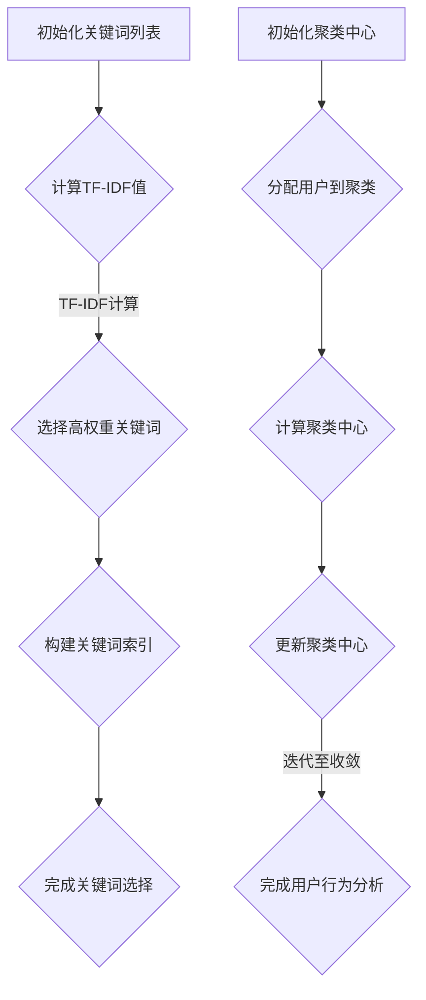

                 

### 1.1 问题背景

#### 1.1.1 虚拟时装秀的兴起

虚拟时装秀，作为一种新兴的时尚展示形式，正逐渐在时尚行业中崭露头角。传统的时装秀依赖于实体场所、模特、灯光和音效等多方面的投入，这不仅耗费大量资源，还面临地域和时间限制。随着技术的发展，尤其是人工智能（AI）的快速进步，虚拟时装秀以其独特的方式改变了传统的时装展示模式。虚拟时装秀利用3D建模、虚拟现实（VR）和增强现实（AR）等技术，能够创造逼真的虚拟时尚场景，让设计师和消费者无需实地参与，便能享受到一场视觉盛宴。

虚拟时装秀的优势在于其灵活性、成本效益和广阔的受众范围。首先，虚拟时装秀可以在任何时间、任何地点进行，突破了物理空间的限制，设计师可以随时发布新款服饰，消费者也能随时随地参与。其次，虚拟时装秀大幅降低了举办成本，不再需要昂贵的场地租赁、模特费用以及繁琐的后勤安排。此外，虚拟时装秀的受众范围更广，不仅限于特定地区，还能通过线上平台触达全球的消费者。

#### 1.1.2 AI在时尚行业的应用

人工智能在时尚行业的应用日益广泛，为传统时尚产业带来了深刻的变革。首先，AI在时尚设计中的应用尤为显著。通过深度学习和计算机视觉技术，AI能够分析海量时尚图片和数据，提炼出流行趋势和设计灵感，辅助设计师进行创新设计。例如，谷歌的Style Shuffle和Adidas的AI设计鞋款便是利用AI技术进行时尚设计的成功案例。

其次，AI在时尚营销和零售方面的应用也取得了显著成果。通过大数据分析和机器学习，AI能够精准分析消费者的购物行为和偏好，提供个性化的推荐和营销策略。例如，亚马逊和阿里巴巴等电商平台利用AI技术，为用户提供个性化商品推荐，提高了用户的购物体验和满意度。同时，AI还在供应链管理中发挥了重要作用，通过预测和优化库存，减少了物流成本，提高了运营效率。

#### 1.1.3 可持续时尚理念的重要性

可持续时尚理念强调时尚产业的可持续发展，关注环境、社会和经济效益的平衡。随着消费者对环境保护意识的提升，可持续时尚正逐渐成为时尚产业的新趋势。可持续时尚不仅关注材料的选择和生产过程的环境影响，还注重减少浪费、提升产品质量和延长产品的使用寿命。

可持续时尚理念的重要性体现在多个方面。首先，它有助于减少时尚产业的资源消耗和环境污染。传统时尚产业的生产过程往往伴随着大量的水资源消耗和碳排放，而可持续时尚通过使用环保材料和循环生产技术，能够显著降低对环境的负面影响。

其次，可持续时尚有助于提升品牌的声誉和竞争力。越来越多的消费者倾向于购买可持续时尚产品，这为品牌提供了新的市场机遇。通过积极推广可持续时尚理念，品牌能够树立良好的社会形象，增强消费者的信任和忠诚度。

最后，可持续时尚还促进了时尚产业链的转型升级。传统时尚产业往往以大规模生产和快速消费为主，而可持续时尚则倡导简约、实用和高质量的生活方式，这要求产业链各个环节进行深度变革。通过技术创新和合作，可持续时尚有助于实现资源的有效利用和产业链的可持续发展。

### 1.2 书籍结构

#### 1.2.1 阅读对象

本书旨在为时尚行业从业者、设计师、营销人员、供应链管理人员以及人工智能技术爱好者提供一本实用的指南，帮助读者深入了解AI虚拟时装秀策划和可持续时尚理念的应用。无论是初学者还是行业专家，都可以通过本书获得有价值的知识和实践经验。

对于时尚行业从业者，本书将介绍虚拟时装秀的最新技术和发展趋势，帮助读者把握行业动态，提升策划和执行能力。对于设计师，本书将探讨AI技术在时尚设计中的应用，提供创新的设计灵感和方法。对于营销人员，本书将解析如何利用AI和关键词策略进行有效的市场推广。对于供应链管理人员，本书将介绍可持续时尚理念在供应链管理中的应用，推动企业的绿色转型。

#### 1.2.2 技术与理论框架

本书将系统地介绍AI虚拟时装秀和可持续时尚理念相关的技术与理论框架。首先，本书将深入探讨AI技术的基本原理，包括机器学习和深度学习的基础知识，以及这些技术如何应用于虚拟时装秀。其次，本书将详细阐述虚拟时装秀的技术架构，包括3D建模、虚拟现实和增强现实等技术，并探讨这些技术在时装秀中的应用。

此外，本书还将介绍可持续时尚理念的核心原则和实践方法，包括环境保护、社会责任和经济效益等方面的内容。通过这些理论与技术框架的介绍，读者可以全面了解AI虚拟时装秀和可持续时尚理念的内涵和实际应用。

#### 1.2.3 实际应用案例

本书将通过大量的实际应用案例，展示AI虚拟时装秀和可持续时尚理念在实践中的成功经验和挑战。这些案例将涵盖不同类型的时装秀，包括高端奢侈品牌、大众时尚品牌以及新兴设计师品牌。通过这些案例，读者可以了解不同品牌如何运用AI技术和可持续时尚理念，实现时尚秀的创新和可持续发展。

同时，本书还将分析这些案例中的关键成功因素和面临的挑战，为读者提供实用的经验和教训。通过这些实际应用案例，读者可以更好地理解AI虚拟时装秀和可持续时尚理念的应用场景，并在实践中找到适合自己的策略和方法。

### 1.3 可持续时尚关键词策略概述

#### 1.3.1 关键词策略的定义

关键词策略（Keyword Strategy）是一种通过识别和利用特定关键词，提高内容在搜索引擎结果页（Search Engine Results Page, SERP）中可见性的方法。关键词策略的核心在于精准选择和合理应用关键词，使其在搜索结果中脱颖而出，从而吸引更多的目标受众。

在数字营销和内容创作中，关键词策略具有至关重要的地位。通过有效利用关键词，品牌和内容创作者可以增加其内容在搜索引擎中的曝光率，提高网站访问量，从而实现更好的营销效果。关键词策略不仅适用于搜索引擎优化（Search Engine Optimization, SEO），还在社交媒体营销、电子邮件营销等多渠道营销中发挥着重要作用。

#### 1.3.2 关键词策略的作用

关键词策略在数字营销中的作用主要体现在以下几个方面：

1. **提高搜索引擎排名**：通过优化关键词，网站内容可以更好地匹配搜索引擎用户的查询需求，从而提高在搜索结果中的排名。高排名意味着更多的曝光机会，有助于吸引潜在客户。

2. **精准定位目标受众**：合理的关键词选择能够准确反映内容的核心主题和目标受众的兴趣，确保营销信息的有效传递。通过精准定位，品牌可以更好地满足受众需求，提升用户体验。

3. **增加访问量和流量**：有效运用关键词策略可以吸引更多搜索引擎用户点击网站链接，增加网站访问量和流量。这有助于提升品牌知名度和市场占有率。

4. **提高转化率**：通过关键词策略，网站内容可以更好地吸引目标用户，提高用户在网站上的互动和转化率。例如，通过优化购物网站的关键词，可以促进更多用户进行购买。

5. **提升品牌形象**：合理的关键词策略不仅有助于提升网站的搜索引擎排名，还能提升品牌在公众心目中的形象。品牌通过专业、准确的关键词应用，展现其在行业中的专业性和权威性，增强消费者信任。

#### 1.3.3 可持续时尚与关键词策略的关系

可持续时尚和关键词策略之间存在紧密的联系。首先，可持续时尚作为一种新兴的时尚理念，需要通过有效的数字营销手段传播，以吸引更多消费者的关注和认同。关键词策略正是实现这一目标的有效工具，通过精准的关键词选择和应用，可持续时尚品牌可以提升其在搜索引擎中的曝光率，吸引更多潜在消费者的注意。

其次，关键词策略可以帮助可持续时尚品牌更好地定位其目标受众。通过分析目标受众的兴趣和行为习惯，品牌可以识别出与其可持续时尚理念相关的关键词，从而制定出更具针对性的营销策略。这不仅有助于提升品牌的知名度和影响力，还能促进品牌的长期发展。

此外，关键词策略还可以提升可持续时尚品牌在社交媒体和其他数字渠道的营销效果。通过合理运用关键词，品牌可以在社交媒体平台上获得更多曝光机会，吸引更多的关注和互动。这有助于品牌建立强大的社交媒体影响力，进一步巩固其市场地位。

总之，关键词策略在可持续时尚的应用中发挥着至关重要的作用。通过科学合理地运用关键词策略，可持续时尚品牌可以更有效地传播其理念，吸引更多消费者的关注，实现可持续发展目标。

### 1.4 本书目标

#### 1.4.1 理解AI虚拟时装秀

本书的首要目标是帮助读者全面理解AI虚拟时装秀的概念、技术和应用。通过详细阐述虚拟时装秀的发展背景、技术架构以及实际应用案例，读者可以深入了解虚拟时装秀的优势和潜力。具体包括：

1. **虚拟时装秀的概念**：介绍虚拟时装秀的定义、发展历程及其与传统时装秀的区别。
2. **技术架构**：讲解虚拟时装秀中涉及的关键技术，如3D建模、虚拟现实、增强现实等。
3. **实际应用**：分析虚拟时装秀在不同场景中的具体应用，如品牌推广、产品发布等。

通过这一部分的学习，读者可以建立起对AI虚拟时装秀的全面认知，为其后续的策划和实践打下坚实基础。

#### 1.4.2 掌握可持续时尚理念

可持续时尚理念是本书的另一个重要目标。可持续时尚不仅关乎环境和社会责任，还涉及经济效益的平衡。通过本书，读者将深入了解可持续时尚的核心原则、实践方法以及其与AI技术的关联。具体内容涵盖：

1. **核心原则**：阐述可持续时尚的基本原则，如环境保护、社会责任和经济效益。
2. **实践方法**：介绍可持续时尚在时尚设计、生产、营销等环节中的具体实践方法。
3. **AI技术应用**：探讨AI技术在可持续时尚中的应用，如循环经济、生态设计等。

通过这部分的学习，读者将能够理解并掌握可持续时尚理念，为后续的策划和实施提供理论支持。

#### 1.4.3 应用关键词策略优化策划

最后，本书的目标之一是帮助读者掌握和应用关键词策略，优化AI虚拟时装秀的策划和执行。关键词策略在提升虚拟时装秀的搜索引擎排名、吸引目标受众方面具有重要作用。具体内容包括：

1. **关键词策略基础**：讲解关键词策略的基本概念、构成要素和应用场景。
2. **策划优化实践**：通过实际案例，展示如何运用关键词策略优化虚拟时装秀的策划和推广。
3. **数据分析与调整**：介绍如何利用数据分析工具进行关键词优化，并根据实时数据调整策略。

通过这部分的学习，读者将能够灵活应用关键词策略，提升虚拟时装秀的市场影响力和品牌知名度。

### 1.5 本章小结

本章介绍了本书的背景、结构和核心目标。首先，我们探讨了虚拟时装秀的兴起及其在时尚行业中的应用，强调了AI技术的重要性。其次，我们详细阐述了可持续时尚理念的起源、核心原则及其与关键词策略的关系。最后，本书明确了三大目标：理解AI虚拟时装秀、掌握可持续时尚理念以及应用关键词策略优化策划。

通过本章的学习，读者可以为后续章节的深入探讨打下基础，逐步掌握AI虚拟时装秀策划与可持续时尚理念的综合应用。接下来，我们将进一步探讨AI虚拟时装秀的技术基础和可持续时尚理念的实践方法，为优化策划提供更为详尽的理论和实践支持。

## 1.6 背景介绍

### 1.6.1 核心概念术语说明

为了更好地理解本文的核心概念，首先需要明确一些关键术语的含义。

**虚拟时装秀**：虚拟时装秀是一种通过数字技术创造的虚拟时尚展示，利用3D建模、虚拟现实（VR）和增强现实（AR）等技术，模拟真实的时装秀场景。这种展示方式不受地理和物理限制，能够在任何时间和地点进行，为设计师和品牌提供了新的展示平台。

**人工智能（AI）**：人工智能是指通过计算机模拟人类智能行为的技术。AI技术包括机器学习、深度学习、自然语言处理等多种方法，能够在数据分析和决策制定方面提供支持。

**可持续时尚**：可持续时尚是一种以环境保护、社会责任和经济效益平衡为目标的时尚理念。它倡导使用环保材料、减少浪费、延长产品生命周期，并通过透明供应链实现可持续生产。

**关键词策略**：关键词策略是通过选择和优化特定关键词，提高内容在搜索引擎中可见性的方法。这种策略在数字营销中至关重要，有助于提升内容的曝光率和用户访问量。

### 1.6.2 问题背景

时尚产业在过去几十年中经历了显著的变化。随着消费者对个性化、即时性和高质量产品的需求增加，传统时装秀面临着诸多挑战。首先，传统时装秀受限于时间和地域，无法满足全球消费者的即时需求。其次，传统时装秀对资源消耗大，包括场地租赁、模特费用、交通和能源等，这不仅增加了成本，还带来了环境负担。此外，传统时装秀的营销手段相对单一，难以精准触达目标受众。

与此同时，人工智能和数字技术的发展为时尚产业带来了新的机遇。AI技术能够通过大数据分析和机器学习，精准预测消费者需求，优化时尚设计和营销策略。虚拟现实（VR）和增强现实（AR）技术的进步，使得虚拟时装秀成为可能，为设计师和品牌提供了创新的展示方式。这些技术不仅降低了成本，还提升了用户体验，使得时尚展示更加个性化和互动化。

然而，传统时尚产业在追求创新的同时，也面临着可持续发展的挑战。时尚产业是全球第二大污染行业，其生产过程消耗大量资源和能源，产生大量温室气体排放和废物。因此，可持续时尚理念应运而生，旨在通过环保材料、循环经济和透明供应链等手段，减少时尚产业的环境影响。

### 1.6.3 问题描述

在当前背景下，AI虚拟时装秀的策划面临以下主要问题：

1. **技术整合与优化**：虚拟时装秀需要整合多种技术，包括3D建模、VR和AR等。如何高效整合这些技术，优化用户体验，是策划中的一大挑战。

2. **可持续时尚理念的融入**：在虚拟时装秀的策划过程中，如何将可持续时尚理念贯穿始终，实现环保、社会责任和经济效益的平衡，是一个重要的课题。

3. **关键词策略的应用**：如何利用关键词策略，提高虚拟时装秀的搜索引擎排名和用户访问量，是策划中必须解决的一个关键问题。

4. **实时数据分析和调整**：在虚拟时装秀的执行过程中，如何利用实时数据分析，根据用户反馈和市场需求进行调整，是提升虚拟时装秀效果的关键。

### 1.6.4 问题解决

为了解决上述问题，我们可以采取以下策略：

1. **技术整合与优化**：通过系统化培训和技术创新，提高团队对虚拟时装秀技术的理解和应用能力。例如，引入先进的3D建模和VR/AR技术，优化用户交互体验。

2. **可持续时尚理念的融入**：在策划过程中，将可持续时尚理念作为核心指导原则，从设计、生产到营销等各个环节，均考虑环保和社会责任。例如，使用环保材料、推广循环经济、透明供应链等。

3. **关键词策略的应用**：通过大数据分析和市场调研，精准选择和优化关键词，提升虚拟时装秀的搜索引擎排名和用户访问量。例如，利用SEO工具和关键词研究平台，制定合理的关键词策略。

4. **实时数据分析和调整**：在虚拟时装秀执行过程中，利用实时数据分析工具，对用户行为、市场趋势等数据进行实时监控和分析，根据反馈和需求进行调整。例如，通过用户互动数据和社交媒体分析，优化用户体验和营销策略。

### 1.6.5 边界与外延

**边界**：本文主要讨论AI虚拟时装秀策划中的技术整合、可持续时尚理念应用、关键词策略优化以及实时数据分析和调整等问题。研究范围主要集中在虚拟时装秀的策划和执行阶段，不涉及具体的技术实现细节。

**外延**：虽然本文主要关注虚拟时装秀的策划，但这些策略和方法同样适用于其他类型的数字时尚展示，如虚拟试衣、AR购物体验等。此外，本文的核心思想也可以应用于其他行业和领域的数字化营销策划。

### 1.6.6 概念结构与核心要素组成

为了更好地理解AI虚拟时装秀策划，我们可以从以下几个方面探讨其概念结构和核心要素组成：

1. **技术要素**：包括3D建模、虚拟现实（VR）、增强现实（AR）、人工智能（AI）等技术。这些技术是实现虚拟时装秀的基础，决定了用户的互动体验和视觉效果。
2. **设计要素**：包括时尚设计、用户体验设计、可持续时尚设计等。这些要素决定了虚拟时装秀的内容质量和用户满意度。
3. **营销要素**：包括关键词策略、搜索引擎优化（SEO）、社交媒体营销、电子邮件营销等。这些要素决定了虚拟时装秀的传播效果和市场影响力。
4. **数据分析与优化**：包括实时数据分析、用户行为分析、市场趋势分析等。这些要素帮助策划团队根据用户反馈和市场需求，不断优化虚拟时装秀的策划和执行。

通过以上分析，我们可以看出，AI虚拟时装秀策划涉及多个要素的整合和优化，这些要素共同构成了其概念结构和核心要素组成。

## 1.7 核心概念与联系

### 1.7.1 核心概念原理

为了深入理解AI虚拟时装秀策划中的核心概念，我们需要首先明确以下几个关键概念：

**虚拟时装秀**：虚拟时装秀是通过数字技术模拟现实中的时装秀场景，利用3D建模、虚拟现实（VR）和增强现实（AR）等技术，创建一个沉浸式的虚拟时尚体验。这种形式打破了传统时装秀的时间和空间限制，提供了更加灵活和创新的展示方式。

**人工智能（AI）**：人工智能是指通过计算机模拟人类智能行为的技术，包括机器学习、深度学习、自然语言处理等。在虚拟时装秀中，AI技术主要用于设计辅助、个性化推荐、情感分析等方面，提高了用户体验和互动性。

**可持续时尚**：可持续时尚是一种以环境保护、社会责任和经济效益平衡为目标的时尚理念。它强调使用环保材料、减少浪费、延长产品生命周期，并通过透明供应链实现可持续发展。在虚拟时装秀中，可持续时尚理念体现在设计、生产、营销等各个环节。

**关键词策略**：关键词策略是通过选择和优化特定关键词，提高内容在搜索引擎中可见性的方法。在虚拟时装秀的策划中，关键词策略用于提升搜索引擎排名、增加用户访问量和提升市场影响力。

### 1.7.2 概念属性特征对比表格

为了更清晰地展示这些核心概念的属性特征，我们可以构建一个对比表格：

| 核心概念 | 定义 | 主要特征 | 关联性 |
| :---: | :---: | :---: | :---: |
| **虚拟时装秀** | 通过数字技术模拟现实中的时装秀场景 | 创新性、灵活性、沉浸式体验 | 与VR、AR技术紧密关联 |
| **人工智能（AI）** | 通过计算机模拟人类智能行为的技术 | 自动化、个性化、智能决策 | 与机器学习、深度学习相关 |
| **可持续时尚** | 以环境保护、社会责任和经济效益平衡为目标的时尚理念 | 环保、社会责任、经济效益平衡 | 与生态设计、循环经济相关 |
| **关键词策略** | 通过选择和优化特定关键词提高内容可见性 | 精准、优化、提高排名 | 与SEO、数字营销相关 |

### 1.7.3 ER实体关系图架构

为了进一步展示这些核心概念之间的联系，我们可以使用ER（实体关系）图来表示它们之间的关系。以下是ER图的Markdown格式表示：

```mermaid
erDiagram
  AI Technology ||--|{ Virtual Fashion Show }||>
  AI Technology ||--|{ Keyword Strategy }||>
  Sustainable Fashion ||--|{ Virtual Fashion Show }||>
  Sustainable Fashion ||--|{ Keyword Strategy }||>
```

在这个ER图中，AI Technology（人工智能技术）与Virtual Fashion Show（虚拟时装秀）和Keyword Strategy（关键词策略）之间存在双向关联，表明这些技术在虚拟时装秀策划中相互支持。Sustainable Fashion（可持续时尚）则与Virtual Fashion Show和Keyword Strategy也存在类似的关联，体现了可持续时尚理念在策划中的重要地位。

### 1.7.4 算法原理讲解

在了解了核心概念及其关系后，我们接下来将探讨虚拟时装秀策划中常用的算法原理，主要包括关键词选择算法和用户行为分析算法。

#### 关键词选择算法

关键词选择是虚拟时装秀策划的重要环节，它直接影响内容的搜索引擎排名和用户访问量。一种常用的关键词选择算法是基于词频-逆文档频率（TF-IDF）算法。TF-IDF算法通过计算每个关键词在文档中的词频（TF）和逆文档频率（IDF），为每个关键词分配一个权重。具体步骤如下：

1. **计算词频（TF）**：TF表示某个词在文档中出现的次数。例如，如果文档中“时尚”这个词出现了10次，那么其TF值为10。
2. **计算逆文档频率（IDF）**：IDF表示整个语料库中包含某个词的文档数量与语料库总文档数量的比值。IDF用来平衡高频词的权重。例如，如果语料库中有100个文档，其中50个文档包含“时尚”，那么其IDF值为log(100/50)。
3. **计算TF-IDF值**：将TF和IDF相乘得到TF-IDF值。例如，如果“时尚”的TF值为10，IDF值为0.5，那么其TF-IDF值为5。

通过以上步骤，我们可以为每个关键词分配一个权重，从而选择出对虚拟时装秀策划最有影响力的关键词。

#### 用户行为分析算法

用户行为分析是优化虚拟时装秀的重要手段，通过分析用户在虚拟时装秀中的互动行为，我们可以了解用户的偏好和需求，从而优化用户体验和营销策略。一种常用的用户行为分析算法是聚类分析算法，如K-means聚类算法。具体步骤如下：

1. **初始化聚类中心**：随机选择K个用户行为数据点作为初始聚类中心。
2. **分配用户**：将每个用户行为数据点分配到最近的聚类中心所代表的类别中。
3. **更新聚类中心**：计算每个类别的质心，作为新的聚类中心。
4. **迭代过程**：重复步骤2和3，直到聚类中心不再变化或达到最大迭代次数。

通过K-means聚类算法，我们可以将用户行为数据划分为不同的类别，从而分析每个类别的特征和需求，为虚拟时装秀的优化提供依据。

### 1.7.5 举例说明

为了更好地理解上述算法原理，我们可以通过一个简单的例子进行说明。

假设我们有一个包含100个用户的虚拟时装秀数据集，每个用户的行为数据包括访问次数、点击次数、购买行为等。我们希望利用TF-IDF算法选择出对虚拟时装秀最有影响力的关键词，并使用K-means聚类算法分析用户行为。

1. **TF-IDF算法举例**：

- 文档1中，“时尚”、“设计”、“潮流”等词频分别为10、5、3。
- 语料库中，“时尚”词出现频率为30次，“设计”词出现频率为20次，“潮流”词出现频率为10次。

通过计算，我们得到以下TF-IDF值：

- “时尚”：TF = 10，IDF = log(100/30) ≈ 0.50，TF-IDF = 10 * 0.50 = 5
- “设计”：TF = 5，IDF = log(100/20) ≈ 0.61，TF-IDF = 5 * 0.61 = 3.05
- “潮流”：TF = 3，IDF = log(100/10) = 1，TF-IDF = 3 * 1 = 3

根据TF-IDF值，我们可以选择“时尚”作为对虚拟时装秀最有影响力的关键词。

2. **K-means聚类算法举例**：

- 初始选择3个聚类中心，分别代表三类用户行为。
- 第一轮分配：用户1-30分配到聚类中心1，用户31-60分配到聚类中心2，用户61-90分配到聚类中心3。
- 更新聚类中心：计算每个类别的质心，得到新的聚类中心。
- 第二轮分配：用户1-15分配到新的聚类中心1，用户16-45分配到聚类中心2，用户46-75分配到聚类中心3。

通过迭代过程，我们最终得到三个稳定的用户群体，分别为高访问低购买、高访问高购买、低访问低购买。

通过以上例子，我们可以看到TF-IDF算法和K-means聚类算法在虚拟时装秀策划中的应用，它们帮助我们选择关键词和优化用户体验，为虚拟时装秀的策划提供了有力的技术支持。

### 1.7.6 数学公式和模型

在AI虚拟时装秀策划中，数学模型和公式是理解和分析数据的重要工具。以下我们将介绍几个关键公式和模型：

#### 1. TF-IDF公式

$$
TF-IDF = TF \times IDF
$$

其中，TF为词频（Term Frequency），IDF为逆文档频率（Inverse Document Frequency）。

#### 2. K-means聚类目标函数

$$
J = \sum_{i=1}^{k} \sum_{x_j \in S_i} (x_j - \mu_i)^2
$$

其中，$J$为聚类目标函数，$k$为聚类类别数，$S_i$为第$i$个聚类类别，$\mu_i$为第$i$个聚类中心的坐标。

#### 3. 搜索引擎排名公式

$$
Rank = f(TF-IDF, Content Quality, Backlinks)
$$

其中，Rank为搜索结果排名，$TF-IDF$、Content Quality和Backlinks分别为关键词权重、内容质量和反向链接数。

通过上述公式和模型，我们可以量化关键词选择、聚类分析和搜索引擎排名的关键因素，从而为虚拟时装秀策划提供科学依据。

### 1.7.7 算法流程图

为了直观展示关键词选择算法和用户行为分析算法的流程，我们使用Mermaid语法绘制以下流程图：



通过流程图，我们可以清晰了解关键词选择和用户行为分析的核心步骤及其逻辑关系。

### 1.7.8 算法应用场景和优点

关键词选择算法和用户行为分析算法在虚拟时装秀策划中具有广泛的应用场景和优点：

#### 关键词选择算法

- **应用场景**：用于优化虚拟时装秀的SEO，提高搜索排名和用户访问量。
- **优点**：通过量化关键词权重，实现精准内容定位，提升用户体验。

#### 用户行为分析算法

- **应用场景**：用于分析用户偏好和需求，优化虚拟时装秀的用户互动和营销策略。
- **优点**：通过聚类分析，识别不同用户群体，实现个性化推荐和营销。

这些算法的应用不仅提升了虚拟时装秀的策划效果，还为其可持续发展提供了技术支持。

### 1.7.9 本章小结

通过本章的探讨，我们深入理解了AI虚拟时装秀策划中的核心概念、算法原理及其应用。关键词选择和用户行为分析算法在优化虚拟时装秀的搜索引擎排名和用户体验方面发挥着重要作用。这些核心概念的掌握将为我们后续章节的学习和实际应用奠定坚实基础。

### 2.1 AI技术概述

#### 2.1.1 AI的定义与类型

人工智能（Artificial Intelligence，简称AI）是指通过计算机模拟人类智能行为的技术。AI的核心目标是使计算机能够执行通常需要人类智能才能完成的任务，如理解语言、识别图像、自主决策等。AI技术涵盖多个领域，包括机器学习、深度学习、自然语言处理、计算机视觉等。

**机器学习**：机器学习是一种让计算机通过数据学习和改进自身性能的方法。它分为监督学习、无监督学习和强化学习等类型。监督学习使用带有标签的数据进行训练，如分类和回归问题；无监督学习不使用标签，如聚类和降维问题；强化学习通过奖励和惩罚机制进行训练，如游戏和机器人控制。

**深度学习**：深度学习是机器学习的一种子领域，通过多层神经网络对数据进行处理，从而实现更复杂的任务。深度学习的代表性技术包括卷积神经网络（CNN）、循环神经网络（RNN）和生成对抗网络（GAN）等。深度学习在图像识别、语音识别和自然语言处理等领域取得了显著成果。

**自然语言处理**：自然语言处理（Natural Language Processing，简称NLP）是AI的一个重要分支，旨在使计算机理解和生成自然语言。NLP技术包括文本分类、情感分析、机器翻译和问答系统等。

**计算机视觉**：计算机视觉（Computer Vision）是AI技术的一个分支，涉及计算机对图像和视频的识别和理解。计算机视觉技术包括图像识别、目标检测、图像分割和视频处理等。

#### 2.1.2 机器学习基础

机器学习的基础在于统计学和概率论。以下是机器学习中的几个核心概念：

**模型**：模型是机器学习算法的核心，用于从数据中提取特征并建立预测或分类规则。常见的模型包括线性模型、决策树、支持向量机（SVM）和神经网络等。

**训练数据**：训练数据是机器学习算法用于学习和改进的原始数据集。训练数据的质量直接影响模型的效果。通常，训练数据分为特征和标签两部分，特征是输入数据，标签是期望的输出结果。

**损失函数**：损失函数用于衡量模型预测值与实际标签之间的差距。常见的损失函数包括均方误差（MSE）、交叉熵损失和Huber损失等。

**优化算法**：优化算法用于调整模型参数，以最小化损失函数。常见的优化算法有梯度下降、随机梯度下降（SGD）和Adam优化器等。

#### 2.1.3 深度学习原理

深度学习是机器学习的一个子领域，主要基于多层神经网络。以下是深度学习中的几个核心概念：

**神经网络**：神经网络是由多个神经元组成的计算模型，每个神经元通过权重连接其他神经元。神经网络通过逐层提取数据特征，实现从简单到复杂的任务。

**激活函数**：激活函数用于引入非线性特性，使神经网络能够解决更复杂的问题。常见的激活函数包括sigmoid、ReLU和Tanh等。

**前向传播与反向传播**：前向传播是计算神经网络输出值的过程，反向传播是计算梯度并更新权重的过程。通过反向传播，神经网络能够不断优化参数，提高预测准确性。

**优化器**：优化器用于调整神经网络参数，以最小化损失函数。常见的优化器有SGD、Adam和RMSprop等。

**超参数**：超参数是神经网络模型之外的重要参数，如学习率、批次大小和正则化参数等。超参数的选择对模型性能有重要影响。

#### 2.1.4 AI技术的发展历程

AI技术的发展历程可以分为几个阶段：

**符号人工智能（Symbolic AI）**：20世纪50年代至70年代，以基于规则和逻辑推理的方法为主。

**专家系统（Expert Systems）**：20世纪70年代至80年代，通过模拟人类专家的知识和推理能力，解决特定领域的问题。

**机器学习时代**：20世纪80年代至21世纪初期，以统计方法和神经网络为核心，使机器学习成为AI研究的热点。

**深度学习时代**：21世纪初期至今，以深度学习为代表的技术取得了突破性进展，在图像识别、自然语言处理和自动驾驶等领域取得了显著成果。

#### 2.1.5 AI技术在时尚行业的应用

AI技术在时尚行业中的应用正日益深入，为时尚产业带来了变革性的影响。以下是AI技术在时尚行业的几个主要应用：

**时尚设计**：AI技术可以辅助时尚设计师进行设计，通过深度学习算法分析流行趋势和消费者偏好，提供设计灵感和创意。例如，AI可以生成新的服装图案和样式，设计师可以利用这些结果进行进一步创作。

**个性化推荐**：基于大数据和机器学习算法，AI可以分析消费者的购物行为和偏好，提供个性化的时尚推荐。这有助于提高用户满意度和忠诚度，同时也能帮助品牌实现更精准的营销策略。

**虚拟试衣**：AI技术通过计算机视觉和深度学习，可以实现虚拟试衣功能，用户可以在虚拟环境中试穿多种服装，从而提高购买决策的准确性和满意度。

**供应链优化**：AI技术可以优化时尚产业的供应链管理，通过预测和优化库存、物流等环节，减少浪费和提高效率。

**营销与推广**：AI技术可以辅助时尚品牌进行精准营销，通过自然语言处理和计算机视觉技术，分析用户需求和偏好，制定有效的营销策略。

#### 2.1.6 AI技术的未来发展趋势

随着技术的不断进步，AI技术在时尚行业的应用前景将更加广阔。以下是AI技术的未来发展趋势：

**更智能的设计工具**：未来，AI将更加深入地辅助时尚设计，通过更高级的算法和更大规模的数据集，提供更为精准和个性化的设计建议。

**更广泛的个性化应用**：个性化推荐系统将进一步普及，不仅限于购物推荐，还包括个性化时尚造型、定制化产品等。

**更高效的供应链管理**：AI技术将进一步提升供应链的智能化水平，通过实时数据分析和预测，实现更高效的生产和物流管理。

**更智能的营销策略**：AI技术将使时尚营销更加智能化，通过精准的数据分析和个性化推荐，提高营销效果和用户参与度。

**跨界融合**：AI技术与VR、AR、区块链等新兴技术的融合，将带来更多的创新应用场景，如虚拟时尚秀、数字化时尚体验等。

### 2.1.7 本章小结

本章概述了人工智能（AI）的基本概念、类型和发展历程，重点介绍了机器学习和深度学习的基础知识。同时，我们探讨了AI技术在时尚行业的广泛应用，包括时尚设计、个性化推荐、虚拟试衣、供应链优化和营销与推广等方面。最后，我们展望了AI技术的未来发展趋势。通过本章的学习，读者可以全面了解AI技术在时尚行业中的重要性及其应用前景。

## 2.2 虚拟时装秀技术

#### 2.2.1 虚拟时装秀的概念

虚拟时装秀，是指通过数字技术和虚拟现实（Virtual Reality, VR）以及增强现实（Augmented Reality, AR）等技术手段，模拟现实中的时装展示活动。虚拟时装秀不仅打破了传统时装秀的时间和空间限制，还提供了更加个性化和沉浸式的用户体验。通过虚拟时装秀，设计师和品牌可以实时展示新款服饰，消费者可以随时随地参与，享受一场时尚盛宴。

#### 2.2.2 虚拟时装秀的技术架构

虚拟时装秀的技术架构涉及多个关键组件和技术的集成，主要包括3D建模、虚拟现实（VR）和增强现实（AR）等。以下是这些技术组件及其在虚拟时装秀中的应用：

1. **3D建模**：3D建模是虚拟时装秀的基础，通过计算机图形学技术，将设计师的创意和服装样式转化为三维模型。3D建模工具如Blender、Maya等，可以创建详细的服装纹理、细节和动态效果。3D建模技术不仅提高了虚拟时装秀的视觉效果，还允许设计师在虚拟环境中进行实时修改和预览。

2. **虚拟现实（VR）**：虚拟现实技术通过头戴式显示器（HMD）和传感器设备，为用户创造一个沉浸式的三维虚拟环境。在虚拟时装秀中，用户可以通过VR设备自由浏览和互动，仿佛置身于实际的时装秀现场。VR技术的应用不仅提升了用户的参与感，还使虚拟时装秀具有更强的互动性和娱乐性。

3. **增强现实（AR）**：增强现实技术通过在现实世界中叠加虚拟图像和内容，为用户带来虚实结合的体验。在虚拟时装秀中，AR技术可以将虚拟服饰直接叠加在现实中的模特或场景上，实现实时试穿和展示。AR技术不仅提高了展示的灵活性，还使消费者能够更加直观地了解产品。

#### 2.2.3 3D建模与渲染技术

3D建模与渲染技术在虚拟时装秀中发挥着关键作用，以下是这两个技术领域的主要内容和应用：

1. **3D建模**：3D建模是创建虚拟时装秀的基础，通过建模工具，设计师可以构建出各种服装款式和配饰的三维模型。3D建模的步骤通常包括以下几个方面：

   - **概念设计**：设计师通过草图和草图软件（如Adobe Sketch）进行初步的设计构思。
   - **细化设计**：将概念设计转化为三维模型，通过3D建模工具（如Blender、Maya）创建详细的服装和配饰模型。
   - **贴图和纹理**：为3D模型添加材质和纹理，增强其视觉效果和细节表现。
   - **绑定与动画**：将3D模型与骨骼和关节绑定，创建动作和动画效果。

2. **渲染技术**：渲染是3D建模的最终环节，通过渲染技术，可以将3D模型转化为逼真的视觉效果。以下是一些常用的渲染技术：

   - **实时渲染**：实时渲染用于虚拟现实（VR）和增强现实（AR）场景，通过GPU计算，实时生成和显示图像。常见的实时渲染引擎有Unity和Unreal Engine。
   - **离线渲染**：离线渲染用于制作高质量的视频和图像，通过CPU计算，生成静态或动态的视觉效果。常见的离线渲染软件有Blender、Maya和3ds Max。
   - **光线追踪**：光线追踪是一种先进的渲染技术，通过模拟光线的传播路径，生成逼真的光影效果。光线追踪可以显著提升图像的真实感，但计算成本较高。

#### 2.2.4 AI技术在虚拟时装秀中的应用

人工智能（AI）技术在虚拟时装秀中发挥着越来越重要的作用，以下是几个关键的应用领域：

1. **个性化推荐**：通过大数据分析和机器学习算法，AI可以分析用户的购物历史和偏好，提供个性化的时尚推荐。这不仅提升了用户的购物体验，还帮助品牌实现更精准的营销策略。

2. **情感分析**：AI技术可以分析用户的情感反应，如对服装款式和色彩的反应，从而优化设计和展示策略。情感分析有助于提升虚拟时装秀的用户参与度和满意度。

3. **虚拟试衣**：通过计算机视觉和深度学习技术，AI可以实现虚拟试衣功能，用户可以在虚拟环境中试穿多种服装，获得真实的穿着效果。虚拟试衣不仅提高了购买决策的准确性，还减少了实际试衣的等待时间和交通成本。

4. **供应链优化**：AI技术可以优化时尚产业的供应链管理，通过预测和优化库存、物流等环节，减少浪费和提高效率。AI技术有助于实现更高效的生产和物流管理，降低运营成本。

5. **时尚设计辅助**：AI技术可以辅助时尚设计师进行设计，通过深度学习和图像识别技术，AI可以分析流行趋势和消费者偏好，提供设计灵感和创意。AI设计工具如Google的Magenta和Adidas的AI设计鞋款，都取得了显著的成功。

#### 2.2.5 虚拟时装秀的优势与挑战

虚拟时装秀具有多方面的优势，但也面临一些挑战：

**优势**：

- **灵活性**：虚拟时装秀不受时间和地点限制，设计师和品牌可以随时发布新款服饰，消费者也能随时随地参与。
- **成本效益**：虚拟时装秀降低了场地租赁、模特费用等成本，品牌可以更灵活地进行市场推广。
- **互动性**：虚拟时装秀提供了更多的互动机会，用户可以通过VR/AR设备进行互动，提升用户体验。
- **个性化**：AI技术可以实现个性化推荐和虚拟试衣，满足消费者的个性化需求。

**挑战**：

- **技术门槛**：虚拟时装秀需要掌握多种技术，包括3D建模、VR/AR和AI等，这对技术团队提出了较高的要求。
- **用户体验**：如何提升虚拟时装秀的互动性和沉浸感，是技术团队需要解决的问题。
- **数据隐私**：虚拟时装秀涉及大量用户数据，如何保护用户隐私和数据安全，是品牌需要关注的问题。

#### 2.2.6 总结

虚拟时装秀是一种通过数字技术和虚拟现实、增强现实等技术手段实现的时尚展示形式。3D建模、虚拟现实和增强现实技术是虚拟时装秀的核心，通过这些技术，设计师和品牌可以创造逼真的虚拟时尚场景，为用户提供沉浸式的体验。AI技术的应用进一步提升了虚拟时装秀的个性化和互动性，使其成为时尚行业的重要创新方向。虽然虚拟时装秀面临一些挑战，但其灵活性和成本效益，以及与可持续时尚理念的契合度，使其具有广阔的发展前景。

## 2.3 AI在虚拟时装秀中的应用

#### 2.3.1 个性化推荐系统

AI在虚拟时装秀中的一个重要应用是构建个性化推荐系统。个性化推荐系统通过分析用户的购物历史、浏览行为和社交数据，为用户推荐符合其兴趣和偏好的时尚产品。这种系统不仅提高了用户的购物体验，还显著提升了品牌的销售额和用户忠诚度。

**个性化推荐系统的核心原理**：

1. **协同过滤**：协同过滤是一种基于用户相似度的推荐算法。系统通过计算用户之间的相似度，找出与目标用户兴趣相近的用户，然后推荐这些用户喜欢的商品。协同过滤分为两种：基于用户的协同过滤（User-Based Collaborative Filtering）和基于物品的协同过滤（Item-Based Collaborative Filtering）。

2. **内容推荐**：内容推荐算法通过分析商品的属性和内容，将用户喜欢的商品推荐给用户。例如，通过分析用户过去浏览的商品的标签和描述，系统可以为用户推荐具有相似属性的时尚产品。

3. **混合推荐**：混合推荐系统结合了协同过滤和内容推荐的优势，通过融合用户行为和商品特征，提供更加准确的推荐结果。

**个性化推荐系统在虚拟时装秀中的应用**：

1. **时尚趋势预测**：AI技术可以分析海量的时尚数据，预测未来的时尚趋势。设计师可以利用这些预测结果，提前准备新款服饰，以满足消费者的需求。

2. **用户画像构建**：通过分析用户的浏览行为和购物记录，AI可以构建详细的用户画像，包括用户的年龄、性别、兴趣偏好等。这些用户画像有助于品牌进行精准营销和个性化推荐。

3. **实时推荐**：虚拟时装秀中的个性化推荐系统可以在用户浏览时，实时推荐符合用户兴趣的服饰和配件。这种实时推荐不仅提升了用户的购物体验，还增加了购买的可能性。

**案例研究**：

**1. ASOS的个性化推荐系统**：

ASOS是一家全球性的在线时尚零售商，其个性化推荐系统通过分析用户的购物行为、浏览历史和社交互动，为用户提供个性化的时尚推荐。该系统采用了混合推荐算法，结合了协同过滤和内容推荐，为用户提供了高度个性化的购物体验。ASOS的个性化推荐系统不仅提升了用户满意度，还显著提高了转化率和销售额。

**2. Zalando的虚拟试衣与推荐**：

Zalando是一家欧洲领先的在线时尚零售商，其虚拟试衣系统结合了AI技术，为用户提供了一种全新的购物体验。用户可以通过上传自己的照片，在虚拟环境中试穿多种服饰。AI技术根据用户的试穿结果和偏好，为用户推荐适合的服装。这种个性化的虚拟试衣和推荐系统，不仅提升了用户的购物体验，还帮助Zalando实现了更高的用户留存率和销售转化率。

#### 2.3.2 情感分析

情感分析是AI技术在虚拟时装秀中的另一个重要应用。情感分析通过自然语言处理技术，分析用户对虚拟时装秀、服饰款式和品牌的情感反应。情感分析有助于设计师和品牌了解用户的喜好和偏好，优化时尚设计和营销策略。

**情感分析的核心原理**：

1. **文本分类**：文本分类是情感分析的基础，通过机器学习算法，将文本数据分类为正面、负面或中性情感。常见的文本分类算法包括支持向量机（SVM）、朴素贝叶斯分类器和深度学习模型。

2. **情感极性**：情感极性分析通过判断文本的情感倾向，确定文本是积极、消极还是中立。例如，分析用户在社交媒体上对虚拟时装秀的评论，判断用户是喜欢还是不喜欢。

3. **情感强度**：情感强度分析通过量化文本的情感倾向，确定情感的正负面程度。例如，分析用户对一款服饰的评价，“非常喜欢”和“有点喜欢”的情感强度是不同的。

**情感分析在虚拟时装秀中的应用**：

1. **用户反馈分析**：虚拟时装秀结束后，通过情感分析技术，可以分析用户的评论和反馈，了解用户对时装秀和服饰款式的情感反应。这种分析有助于设计师和品牌了解用户的真实感受，优化后续的设计和营销策略。

2. **情感营销**：品牌可以利用情感分析结果，制定更具针对性的情感营销策略。例如，对于用户喜欢的款式，品牌可以加大推广力度，提高市场影响力。

3. **情感监测**：通过实时情感分析，品牌可以监测虚拟时装秀过程中用户的情感变化，及时发现潜在问题，进行及时调整。

**案例研究**：

**1. Gucci的虚拟时装秀情感分析**：

Gucci在一次虚拟时装秀中，利用情感分析技术，实时监测用户的情感反应。通过分析用户的评论和社交媒体互动，Gucci了解了用户对时装秀和服饰款式的情感反应。情感分析结果显示，大多数用户对时装秀和新款服饰持积极态度，这为Gucci的后续设计和营销提供了重要参考。

**2. H&M的社交媒体情感分析**：

H&M通过情感分析技术，分析其在社交媒体上的用户评论，了解用户对其虚拟时装秀和服饰款式的情感反应。情感分析结果显示，用户对H&M的虚拟试衣功能和个性化推荐系统持高度评价，这有助于H&M优化其数字营销策略，提升用户满意度。

#### 2.3.3 虚拟试衣

虚拟试衣是AI技术在虚拟时装秀中的一项重要应用，通过计算机视觉和深度学习技术，用户可以在虚拟环境中试穿多种服饰，获得真实的穿着效果。虚拟试衣不仅提高了购买决策的准确性，还减少了实际试衣的等待时间和交通成本。

**虚拟试衣的核心原理**：

1. **人体建模**：虚拟试衣的第一步是创建用户的三维人体模型。通过计算机视觉技术，系统可以捕捉用户的外形和姿势，生成三维人体模型。

2. **服装适配**：通过深度学习算法，系统将用户的身体数据和服装数据相匹配，实现服装的自动适配。例如，通过分析用户身体各部位的尺寸和形状，系统可以为用户选择合适的服装款式和尺码。

3. **光照和材质**：虚拟试衣系统需要模拟真实的光照和材质效果，确保服装在虚拟环境中的视觉效果与实际相符。通过渲染技术，系统可以生成高质量的试穿效果。

**虚拟试衣在虚拟时装秀中的应用**：

1. **提升用户体验**：虚拟试衣为用户提供了更加真实和便捷的购物体验。用户可以在虚拟环境中自由试穿多种服饰，无需实际试穿，节省了时间和精力。

2. **减少退货率**：通过虚拟试衣，用户可以更加准确地选择适合自己的服饰，减少了因尺码不合或款式不喜欢而产生的退货率，降低了品牌和消费者的成本。

3. **个性化推荐**：虚拟试衣系统可以收集用户的试穿数据，分析用户对服饰的偏好和反应。基于这些数据，系统可以为用户提供更加个性化的推荐，提升购物体验和满意度。

**案例研究**：

**1. Zara的虚拟试衣体验**：

Zara通过引入虚拟试衣技术，为用户提供了一种全新的购物体验。用户可以在Zara的线上商店中，通过上传自己的照片，在虚拟环境中试穿多种服饰。虚拟试衣系统根据用户的外形和姿势，自动适配服装，生成真实的穿着效果。这种虚拟试衣体验不仅提升了用户的购物满意度，还显著降低了退货率。

**2. ASOS的AI虚拟试衣**：

ASOS利用AI技术，开发了一款智能虚拟试衣系统。用户可以通过上传自己的照片，在虚拟环境中试穿ASOS的服饰。系统利用计算机视觉和深度学习算法，分析用户的外形和姿势，实现服装的自动适配。这种AI虚拟试衣体验不仅提高了用户的购物体验，还为ASOS带来了更多的销售机会。

#### 2.3.4 总结

AI技术在虚拟时装秀中的应用，极大地提升了时尚行业的效率和用户体验。个性化推荐系统通过分析用户行为和偏好，为用户提供高度个性化的时尚推荐；情感分析通过分析用户对时装秀和服饰的情感反应，优化设计和营销策略；虚拟试衣技术为用户提供了真实、便捷的试穿体验，减少了退货率。这些AI技术的应用，不仅提高了虚拟时装秀的互动性和沉浸感，还为时尚品牌带来了新的商业机会和发展空间。

## 2.4 AI虚拟时装秀案例研究

#### 2.4.1 成功案例

**1. 迪奥（Dior）的虚拟时装秀**

迪奥在2020年疫情期间，通过AI虚拟时装秀成功展示了其2021春季高级定制系列。这场虚拟时装秀采用了先进的虚拟现实（VR）和增强现实（AR）技术，为观众带来了一场视觉和感官上的盛宴。观众可以通过VR头盔或智能手机，实时观看迪奥的时尚秀，并体验与现场观众相同的视角。此外，迪奥还通过AI技术分析观众的行为和偏好，提供个性化的购物推荐。这场虚拟时装秀不仅成功吸引了全球观众的目光，还展示了迪奥在数字技术领域的创新和前瞻性。

**2. 路易威登（Louis Vuitton）的虚拟时装秀**

路易威登在2020年通过虚拟现实技术举办了一场名为“LV House”的虚拟时装秀。这场虚拟时装秀结合了VR和AR技术，为观众提供了一个沉浸式的时尚体验。观众可以通过VR头盔进入虚拟空间，欣赏路易威登的新款服饰和配饰。此外，虚拟时装秀还通过AI技术进行情感分析，实时监测观众的反应和情绪，并根据观众的情感变化调整展示内容。这场虚拟时装秀不仅获得了广泛的赞誉，还推动了路易威登在数字营销和用户体验方面的创新。

**3. 梅赛德斯-奔驰（Mercedes-Benz）的虚拟时装秀**

梅赛德斯-奔驰在2021年举办了一场独特的虚拟时装秀，展示了其全新时尚品牌“MBFW”的服装系列。这场虚拟时装秀利用AI技术和大数据分析，为观众提供了个性化的时尚体验。观众可以通过VR设备进入虚拟时装秀现场，并根据自己的喜好和偏好，选择观看不同设计师的作品。此外，梅赛德斯-奔驰还通过AI技术进行用户行为分析，了解观众的购物偏好和需求，为后续的营销活动提供数据支持。这场虚拟时装秀不仅展示了梅赛德斯-奔驰在时尚领域的创新能力，还为其在数字营销和用户体验方面的探索提供了成功范例。

#### 2.4.2 挑战与解决方案

尽管AI虚拟时装秀带来了许多创新和机遇，但在实际操作中也面临一些挑战。以下是几个主要挑战及相应的解决方案：

**1. 技术整合与优化**

**挑战**：虚拟时装秀需要整合多种技术，如3D建模、VR、AR、AI等。这些技术的整合和优化对团队的技术水平要求较高，且存在一定的技术门槛。

**解决方案**：建立专业的技术团队，通过培训和不断学习，提升团队的技术能力。同时，采用先进的集成工具和平台，如Unity和Unreal Engine，实现多种技术的无缝整合和优化。

**2. 用户交互体验**

**挑战**：虚拟时装秀的用户交互体验直接影响观众的参与度和满意度。如何提供高质量的交互体验，是虚拟时装秀面临的重要挑战。

**解决方案**：通过AI技术进行用户行为分析，了解观众的需求和偏好，优化虚拟时装秀的交互设计和内容呈现。同时，引入增强现实（AR）技术，提供更加沉浸式的用户体验。

**3. 数据隐私与安全**

**挑战**：虚拟时装秀涉及大量用户数据，如行为数据、偏好数据等。如何保护用户隐私和数据安全，是虚拟时装秀需要关注的问题。

**解决方案**：建立严格的数据安全政策和隐私保护措施，如数据加密、访问控制和数据脱敏等。同时，加强与用户沟通，告知用户数据的使用目的和隐私保护措施，增强用户信任。

**4. 成本与效益**

**挑战**：虚拟时装秀的投入成本较高，包括技术设备、开发费用、营销费用等。如何在保证质量的同时，实现成本效益最大化，是虚拟时装秀需要解决的问题。

**解决方案**：通过精细化的成本管理和效益评估，优化虚拟时装秀的投入产出比。同时，采用云计算和边缘计算等技术，降低硬件设备和运营成本。

**5. 法律与法规**

**挑战**：虚拟时装秀涉及到的知识产权保护、隐私保护等问题，需要符合相关的法律法规。如何确保虚拟时装秀的合法性，是品牌需要关注的问题。

**解决方案**：聘请专业的法律顾问，了解相关的法律法规，确保虚拟时装秀的合法性和合规性。同时，与相关机构和组织建立合作，共同推动虚拟时装秀的健康发展。

通过以上解决方案，AI虚拟时装秀可以在面临挑战的同时，实现技术整合、优化用户体验、保护用户隐私、降低成本和提高效益，推动时尚行业的数字化转型。

### 2.5 本章小结

本章通过案例研究和挑战分析，深入探讨了AI虚拟时装秀的实际应用。成功案例展示了AI虚拟时装秀在时尚行业的创新和前瞻性，挑战分析则揭示了虚拟时装秀在实践中面临的问题和解决方案。通过本章的学习，读者可以全面了解AI虚拟时装秀的优势和应用前景，以及如何克服其中的技术和管理难题，为时尚产业的数字化转型提供有力支持。

## 3.1 可持续时尚的起源与发展

#### 3.1.1 可持续发展的概念

可持续发展（Sustainable Development）是20世纪80年代提出的一个全球性发展理念，强调在满足当前需求的同时，不损害后代满足其需求的能力。这一概念涵盖了经济、社会和环境的三个维度，旨在实现经济繁荣、社会公正和环境保护的协调发展。可持续发展理念最早在1987年《我们共同的未来》报告中提出，得到了全球范围内的广泛认同。

#### 3.1.2 可持续时尚的定义

可持续时尚（Sustainable Fashion）是指通过环保设计、可持续生产、减少浪费和延长产品生命周期等手段，实现时尚产业的经济、社会和环境可持续发展的理念。可持续时尚不仅关注材料的选择和生产过程的环境影响，还注重减少浪费、提升产品质量和延长产品的使用寿命。可持续时尚强调从设计到生产的全流程绿色化，通过技术创新和模式变革，推动时尚产业的绿色转型。

#### 3.1.3 可持续时尚的发展历程

1. **早期探索阶段（20世纪80年代末-90年代）**：随着环境保护意识的提高，一些时尚品牌开始关注环保材料的使用和生产过程中的环境影响。例如，一些品牌开始使用有机棉和再生纤维等环保材料，以减少对环境的影响。

2. **推广阶段（2000年代）**：进入21世纪，可持续时尚逐渐得到更多关注。国际组织和时尚品牌纷纷推出可持续时尚项目，推动可持续时尚理念的普及。例如，国际时装设计师协会（CFDA）和时尚基金会（CFDA Foundation）合作成立了“可持续时尚基金会”（Foundation for Sustainable Fashion），致力于推广可持续时尚。

3. **创新阶段（2010年代至今）**：随着人工智能（AI）、大数据、物联网等技术的发展，可持续时尚进入了一个全新的发展阶段。现代科技的应用，使得可持续时尚设计、生产和营销变得更加高效和智能化。例如，通过AI技术，设计师可以更好地预测流行趋势，减少库存浪费；通过大数据分析，品牌可以更精准地满足消费者需求，降低生产成本。

#### 3.1.4 可持续时尚的核心原则

1. **环境保护**：可持续时尚强调使用环保材料、减少污染和能源消耗，降低生产过程对环境的影响。例如，使用有机棉、再生纤维、可降解材料等，减少对自然资源的消耗。

2. **社会责任**：可持续时尚倡导公平、公正和透明的生产过程，保障工人的权益，减少对社会的负面影响。例如，支持公平贸易、采用可持续生产方式，确保工人工作环境和福利。

3. **经济效益**：可持续时尚注重提升产品质量和延长产品生命周期，从而实现经济效益。通过减少浪费、优化供应链，品牌可以降低生产成本，提高市场竞争力。

4. **循环经济**：可持续时尚提倡循环经济模式，通过回收、再利用和再制造，实现资源的循环利用。例如，通过二手市场、租赁服务等方式，延长产品的使用寿命。

5. **透明供应链**：可持续时尚强调供应链的透明度，从原材料采购到生产、销售环节，所有信息都应公开透明。通过建立透明的供应链，品牌可以确保产品的质量和可持续性。

#### 3.1.5 可持续时尚对时尚产业的影响

1. **设计创新**：可持续时尚推动了时尚设计理念的创新，设计师开始关注环保材料的使用和产品的可持续性。例如，通过3D打印技术，实现个性化定制，减少材料浪费。

2. **市场机遇**：随着消费者对可持续时尚的需求增加，为品牌提供了新的市场机遇。越来越多的消费者愿意为可持续时尚产品支付更高的价格，这为品牌带来了巨大的市场潜力。

3. **社会责任**：可持续时尚使品牌在社会责任方面得到提升，通过推广可持续时尚理念，品牌可以树立良好的企业形象，增强消费者信任和忠诚度。

4. **产业链重构**：可持续时尚要求时尚产业链进行深度变革，从原材料采购、生产、销售到回收利用，各个环节都需要进行绿色化和智能化改造。这推动了整个时尚产业的转型升级。

5. **政策支持**：各国政府和国际组织开始重视可持续时尚的发展，出台相关政策支持可持续时尚产业。例如，欧盟推出的绿色协议，鼓励品牌采用可持续生产和消费模式。

通过本章的学习，读者可以全面了解可持续时尚的起源、发展历程、核心原则和对时尚产业的影响。这些知识将为后续章节的深入探讨提供理论支持，帮助读者更好地理解可持续时尚理念在AI虚拟时装秀策划中的应用。

### 3.2 可持续时尚的核心原则

#### 3.2.1 环境保护

环境保护是可持续时尚的核心原则之一，强调在时尚产业的设计、生产、营销和消费等各个环节中减少对环境的负面影响。以下是一些关键的环境保护措施：

1. **环保材料的使用**：可持续时尚倡导使用环保材料，如有机棉、再生纤维、竹纤维和可降解材料。这些材料不仅减少了对自然资源的消耗，还降低了生产过程中的碳排放。

2. **减少污染和能源消耗**：时尚产业的生产过程往往伴随着大量的废水、废气和固体废物排放。通过采用清洁生产技术和节能设备，可以有效减少污染和能源消耗。例如，使用太阳能和风能等可再生能源，减少化石燃料的使用。

3. **水资源管理**：水资源在时尚产业的生产过程中至关重要。通过采用节水技术和循环用水系统，可以显著降低水资源的消耗。此外，推广水回收和再利用技术，减少废水排放。

4. **废物管理和回收利用**：时尚产业中的废弃物主要包括纺织品、包装材料和生产废弃物等。通过有效的废物管理措施，如分类回收和再利用，可以减少废弃物的产生和处理成本。例如，建立二手市场和租赁服务，延长产品的使用寿命。

#### 3.2.2 社会责任

社会责任是可持续时尚的另一重要原则，强调时尚产业在生产、营销和消费过程中应承担的社会责任。以下是一些主要的社会责任措施：

1. **公平贸易**：公平贸易（Fair Trade）通过确保工人获得公正的工资和工作条件，推动可持续时尚的发展。品牌可以与公平贸易认证的组织合作，确保其供应链的公平性。

2. **工人权益保护**：品牌应遵守国际劳工组织（ILO）规定的工人权益标准，包括禁止使用童工、强迫劳动和性别歧视等。通过建立工会和提供职业培训，提升工人的工作条件和技能。

3. **社区发展**：时尚产业可以通过社区发展项目，改善工人的居住环境和社区条件。例如，投资教育和医疗设施，提供培训和就业机会，推动社区经济发展。

4. **道德供应链**：品牌应确保供应链的透明度和道德性，从原材料采购到生产、销售环节，所有环节都应遵循道德标准。通过定期审计和评估，确保供应链的可持续性和合规性。

#### 3.2.3 经济效益

经济效益是可持续时尚的一个重要原则，强调通过提升产品质量和延长产品生命周期，实现经济上的可持续性。以下是一些经济效益的措施：

1. **提高产品质量**：通过采用高质量材料和先进的生产技术，提高产品的耐用性和美观度，延长产品的使用寿命。高质量产品不仅可以提高用户满意度，还能减少售后服务成本。

2. **优化供应链管理**：通过优化供应链流程，减少库存和物流成本。利用大数据和人工智能技术，实现精准预测和高效管理，减少浪费和资源消耗。

3. **循环经济**：推动循环经济模式，通过回收、再利用和再制造，实现资源的循环利用。例如，建立二手市场和租赁服务，延长产品的使用寿命，减少废弃物的产生。

4. **创新商业模式**：探索新的商业模式，如共享经济和按需生产，以降低成本和提高经济效益。例如，共享衣柜服务和定制生产模式，可以减少库存和资源浪费。

#### 3.2.4 循环经济

循环经济（Circular Economy）是一种以资源循环利用为核心的经济模式，旨在通过减少浪费和延长产品生命周期，实现经济、社会和环境的可持续发展。以下是一些循环经济的实践方法：

1. **产品设计**：在设计阶段，考虑产品的可回收性和再利用性。采用模块化设计，使产品组件可以轻松更换和回收。

2. **回收系统**：建立有效的回收系统，收集和再利用废弃物。通过分类回收和再制造技术，将废弃物转化为新的原材料。

3. **二手市场和租赁服务**：推动二手市场和租赁服务的发展，延长产品的使用寿命，减少废弃物的产生。二手市场和租赁服务不仅有助于资源循环利用，还能降低消费者的购买成本。

4. **教育宣传**：通过教育和宣传活动，提高公众对循环经济的认识和参与度。鼓励消费者购买可持续时尚产品，参与回收和再利用活动。

#### 3.2.5 透明供应链

透明供应链是可持续时尚的重要组成部分，强调供应链各环节的透明度和可追溯性。以下是一些实现透明供应链的措施：

1. **供应链管理信息系统**：建立供应链管理信息系统，记录供应链各环节的信息，包括原材料采购、生产过程、物流配送等。通过信息系统的透明化，提高供应链管理的效率和透明度。

2. **区块链技术**：利用区块链技术，实现供应链信息的不可篡改和可追溯性。区块链技术可以记录供应链各环节的交易信息，确保信息的真实性和透明性。

3. **定期审计和评估**：定期对供应链进行审计和评估，确保其符合可持续时尚的原则和标准。通过第三方机构的评估和认证，提高供应链的公信力和透明度。

4. **供应商合作**：与供应商建立长期合作关系，共同推动供应链的可持续化。通过培训和指导，帮助供应商提高环保意识和生产效率。

通过以上措施，可持续时尚可以在设计、生产、营销和消费等各个环节中实现经济、社会和环境的协调发展。这些核心原则不仅为时尚产业提供了可持续发展路径，也为消费者提供了更加环保、健康和可持续的时尚选择。

### 3.3 可持续时尚的实践方法

#### 3.3.1 生态设计

生态设计（Eco-design）是可持续时尚的重要组成部分，强调在产品设计和生产过程中，综合考虑环境、社会和经济效益。以下是一些生态设计的具体实践方法：

1. **材料选择**：选择环保材料，如有机棉、再生纤维、竹纤维和天然皮革等。这些材料不仅减少了对自然资源的消耗，还有助于降低生产过程中的碳排放。

2. **模块化设计**：采用模块化设计，使产品组件可以轻松更换和回收。模块化设计有助于减少废弃物的产生，提高产品的可回收性和再利用率。

3. **可降解材料**：使用可降解材料，如生物塑料和天然纤维，减少对环境的影响。可降解材料可以在自然环境中分解，不会造成长期的污染。

4. **节能设计**：在产品设计中考虑节能和环保因素，例如采用低能耗的照明系统和高效的热交换设备。通过节能设计，可以显著降低生产过程中的能源消耗和碳排放。

5. **环保包装**：采用环保包装材料，如可回收纸张、生物降解塑料等，减少包装材料的浪费。环保包装不仅可以降低生产成本，还可以提高品牌在消费者心目中的环保形象。

#### 3.3.2 循环经济

循环经济（Circular Economy）是一种以资源循环利用为核心的经济模式，旨在通过减少浪费和延长产品生命周期，实现经济、社会和环境的可持续发展。以下是一些循环经济的实践方法：

1. **回收系统**：建立有效的回收系统，收集和再利用废弃物。通过分类回收和再制造技术，将废弃物转化为新的原材料。回收系统有助于减少废弃物的产生和处理成本。

2. **二手市场和租赁服务**：推动二手市场和租赁服务的发展，延长产品的使用寿命，减少废弃物的产生。二手市场和租赁服务不仅可以减少资源消耗，还可以为消费者提供经济实惠的时尚选择。

3. **共享经济**：探索共享经济模式，如共享衣柜服务和共享配饰租赁等。共享经济模式可以减少库存和资源浪费，提高资源利用效率。

4. **再生材料的使用**：在生产过程中，积极使用再生材料，如再生纤维、回收金属和废旧塑料等。再生材料的使用有助于减少对自然资源的依赖，降低生产过程中的环境负荷。

5. **设计创新**：通过设计创新，开发易于拆卸、回收和再利用的产品。设计创新有助于提高产品的可持续性，降低废弃物产生。

#### 3.3.3 透明供应链

透明供应链（Transparent Supply Chain）是可持续时尚的重要组成部分，强调供应链各环节的透明度和可追溯性。以下是一些实现透明供应链的措施：

1. **供应链管理信息系统**：建立供应链管理信息系统，记录供应链各环节的信息，包括原材料采购、生产过程、物流配送等。通过信息系统的透明化，提高供应链管理的效率和透明度。

2. **区块链技术**：利用区块链技术，实现供应链信息的不可篡改和可追溯性。区块链技术可以记录供应链各环节的交易信息，确保信息的真实性和透明性。

3. **定期审计和评估**：定期对供应链进行审计和评估，确保其符合可持续时尚的原则和标准。通过第三方机构的评估和认证，提高供应链的公信力和透明度。

4. **供应商合作**：与供应商建立长期合作关系，共同推动供应链的可持续化。通过培训和指导，帮助供应商提高环保意识和生产效率。

5. **消费者参与**：鼓励消费者参与供应链的透明化过程，例如通过扫描产品标签获取生产信息，提高消费者对产品可持续性的信任和参与度。

通过生态设计、循环经济和透明供应链等措施，可持续时尚可以在设计、生产、营销和消费等各个环节中实现经济、社会和环境的协调发展。这些实践方法不仅有助于减少时尚产业的环境影响，还为消费者提供了更加环保、健康和可持续的时尚选择。

### 3.4 可持续时尚与AI的关系

#### 3.4.1 AI在可持续发展中的应用

人工智能（AI）技术在可持续发展中扮演着重要角色，通过优化资源分配、提高生产效率、减少环境影响，推动可持续发展目标的实现。以下是AI在可持续发展中的几个主要应用：

1. **资源优化**：AI技术可以分析海量数据，优化资源分配和利用。例如，通过智能电网和能源管理系统，AI可以实时监测能源消耗，优化电力分配，减少能源浪费。

2. **智能农业**：AI技术可以帮助农业实现智能化管理，提高产量和减少资源消耗。例如，通过无人机和遥感技术，AI可以监测作物生长状况，优化灌溉和施肥，提高农业生产效率。

3. **环境监测**：AI技术可以用于环境监测和污染治理。通过卫星遥感、无人机和传感器网络，AI可以实时监测环境污染，预测环境变化，提供科学决策支持。

4. **废弃物管理**：AI技术可以优化废弃物管理，提高废弃物的回收率和再利用率。例如，通过智能分类系统和回收机器人，AI可以准确识别和处理不同类型的废弃物，实现资源循环利用。

#### 3.4.2 AI如何促进可持续时尚的发展

AI技术在可持续时尚的发展中发挥了关键作用，通过优化时尚设计、生产和营销，推动时尚产业的绿色转型。以下是AI在可持续时尚中的几个应用领域：

1. **时尚设计**：AI技术可以辅助时尚设计师进行设计，通过大数据分析和机器学习算法，AI可以分析流行趋势和消费者偏好，提供设计灵感和创意。例如，AI可以生成新的服装图案和样式，设计师可以根据这些结果进行进一步创作。

2. **生产优化**：AI技术可以提高时尚产业的生产效率，减少资源浪费。通过预测和优化生产流程，AI可以帮助品牌实现精准生产，减少库存浪费。例如，AI可以预测市场需求，优化原材料采购和生产计划，提高生产效率和降低成本。

3. **供应链管理**：AI技术可以优化时尚产业的供应链管理，通过大数据分析和机器学习算法，AI可以实时监测供应链的运行状态，优化库存和物流管理，提高供应链的效率和透明度。例如，AI可以预测物流运输的延误风险，提前安排运输计划，减少库存积压。

4. **消费者互动**：AI技术可以增强消费者与时尚品牌之间的互动，提供个性化体验。例如，通过自然语言处理和计算机视觉技术，AI可以实现智能客服和虚拟试衣，为消费者提供更加便捷和个性化的购物体验。

5. **营销策略**：AI技术可以帮助品牌制定更精准的营销策略，通过大数据分析和机器学习算法，AI可以分析消费者的行为和偏好，提供个性化的营销推荐。例如，AI可以根据消费者的购物历史和社交数据，提供个性化的时尚推荐，提高营销效果和用户满意度。

#### 3.4.3 成功案例

以下是几个利用AI技术促进可持续时尚发展的成功案例：

1. **Zara的AI时尚设计**：Zara通过引入AI技术，开发了一款名为“Zara Studio”的设计工具。这款工具利用机器学习和计算机视觉技术，分析海量时尚数据，生成新的服装图案和样式。设计师可以根据AI生成的结果进行进一步创作，提高了设计效率和创新性。

2. **H&M的AI虚拟试衣**：H&M通过引入AI技术，实现了AI虚拟试衣功能。用户可以通过上传自己的照片，在虚拟环境中试穿多种服装，获得真实的穿着效果。AI技术分析用户的外形和姿势，实现服装的自动适配，提高了用户的购物体验和满意度。

3. **Adidas的AI设计鞋款**：Adidas利用AI技术，开发了一款名为“AI Shoe”的智能运动鞋。这款鞋款通过机器学习和大数据分析，根据用户的运动数据和偏好，自动调整鞋底的软硬度，提供个性化的舒适体验。AI技术的应用不仅提升了产品的个性化水平，还实现了资源的最优利用。

4. **Patagonia的AI环境监测**：Patagonia利用AI技术，实现了对其供应链的环境监测。通过传感器网络和无人机技术，AI可以实时监测原材料采购和生产过程中的环境影响，预测环境变化，提供科学决策支持。这种智能化的环境监测系统有助于Patagonia实现其可持续发展目标。

通过以上成功案例，我们可以看到AI技术在促进可持续时尚发展方面的重要作用。AI技术不仅提高了时尚设计的效率和创新性，还优化了生产流程和供应链管理，推动了时尚产业的绿色转型。随着技术的不断进步，AI将在可持续时尚的各个领域发挥更大的作用，为时尚产业带来更加可持续的未来。

### 3.5 本章小结

本章详细探讨了可持续时尚的理念、核心原则及其在时尚产业中的重要性。我们介绍了可持续时尚的起源、发展历程以及核心原则，包括环境保护、社会责任和经济效益。通过生态设计、循环经济和透明供应链等实践方法，可持续时尚在时尚产业中得到了广泛应用。此外，我们分析了AI技术在可持续发展中的应用及其如何促进可持续时尚的发展。通过成功案例，我们看到了AI技术在时尚产业中的实际应用和潜力。通过本章的学习，读者可以更全面地理解可持续时尚的概念和实施路径，为其在时尚行业的应用提供理论支持。

## 4.1 关键词策略的基本概念

#### 4.1.1 关键词的定义

关键词（Keywords）是指在内容创作和数字营销中，用于描述内容主题、目标受众和搜索意图的词汇或短语。在搜索引擎优化（SEO）中，关键词是用户在搜索引擎中输入以寻找相关信息的术语。选择合适的关键词对于提高内容的可见性和吸引力至关重要。

#### 4.1.2 关键词策略的构成

关键词策略由多个组成部分构成，包括：

1. **核心关键词**：核心关键词是描述内容主题的主要词汇，通常包含用户最常搜索的词汇。例如，对于一个关于“虚拟时装秀”的内容，核心关键词可能是“虚拟时装秀”、“AI虚拟时装秀”等。

2. **长尾关键词**：长尾关键词是指包含多个单词的短语，通常搜索量较低，但更具体，能够精准吸引有特定需求的用户。例如，“虚拟时装秀策划技巧”、“AI虚拟试衣技术”等。

3. **竞品关键词**：竞品关键词是指竞争对手经常使用的关键词。通过分析竞品关键词，可以了解竞争对手的营销策略，并制定相应的对策。

4. **品牌关键词**：品牌关键词是指与特定品牌相关的词汇，如品牌名称、产品名称等。品牌关键词对于提升品牌知名度和用户忠诚度具有重要意义。

#### 4.1.3 关键词策略的重要性

关键词策略在数字营销和内容创作中具有重要意义，主要体现在以下几个方面：

1. **提升搜索引擎排名**：通过合理的关键词选择和优化，提高内容在搜索引擎结果页（SERP）中的排名，从而增加曝光机会。

2. **精准定位目标受众**：准确选择和运用关键词，能够确保内容精准地传达给目标受众，提升用户体验和转化率。

3. **提高内容可见性**：在多个数字渠道（如搜索引擎、社交媒体、电子邮件等）中使用关键词，提高内容的可见性和吸引力。

4. **增强营销效果**：通过关键词策略，可以优化广告投放、社交媒体推广和电子邮件营销等，提高营销效果和投资回报率（ROI）。

5. **竞争优势**：了解和掌握竞品关键词，有助于制定更有竞争力的营销策略，提升品牌在市场中的地位。

#### 4.1.4 关键词策略在内容营销中的应用

关键词策略在内容营销中扮演着至关重要的角色，以下是一些具体应用场景：

1. **网站内容优化**：通过关键词策略，优化网站页面标题、描述、标签和正文内容，提高页面在搜索引擎中的排名和相关性。

2. **博客和文章写作**：在博客和文章中合理分布关键词，确保内容不仅具有吸引力，还能满足用户的搜索需求。

3. **社交媒体营销**：在社交媒体平台上发布内容时，使用关键词增强内容在搜索引擎和社交媒体中的可见性。

4. **电子邮件营销**：在电子邮件主题和内容中使用关键词，吸引目标受众的注意力，提高邮件的打开率和转化率。

5. **广告投放**：通过关键词策略，优化广告投放，确保广告在正确的受众面前展示，提高广告效果和投资回报率。

通过上述应用，关键词策略可以帮助品牌和内容创作者在竞争激烈的数字营销环境中脱颖而出，提升品牌知名度和市场影响力。

### 4.2 策略制定步骤

#### 4.2.1 需求分析

制定有效的关键词策略的第一步是进行需求分析。需求分析的目标是理解目标受众的需求、兴趣和行为，以便选择与之相关且具有潜力的关键词。以下是一些关键步骤：

1. **确定目标受众**：明确目标受众的年龄、性别、地理位置、兴趣爱好等特征。这些信息有助于了解受众的搜索习惯和偏好。

2. **分析受众行为**：通过网站分析工具（如Google Analytics）和社交媒体平台，收集和分析目标受众的浏览行为、搜索词和点击率等数据。

3. **确定受众需求**：通过问卷调查、用户访谈和焦点小组讨论等方式，深入了解目标受众对产品或服务的需求、问题和期望。

4. **竞争分析**：分析竞争对手的关键词策略，了解他们使用的关键词以及其在搜索引擎中的排名。这有助于识别潜在的关键词机会和风险。

5. **制定关键词清单**：根据需求分析结果，列出潜在的关键词清单。这些关键词应包括核心关键词、长尾关键词和竞品关键词。

#### 4.2.2 关键词挖掘

关键词挖掘是策略制定过程中的关键步骤，旨在从大量数据中提取有价值的关键词。以下是一些常用的方法：

1. **使用关键词工具**：利用专业的关键词工具（如Google Keyword Planner、Ahrefs、SEMrush等），输入种子关键词，获取相关关键词、搜索量和竞争程度等信息。

2. **内容分析**：分析现有内容，提取和扩展关键词。通过检查页面标题、描述、正文和元标签，了解哪些关键词在现有内容中表现良好。

3. **用户搜索历史**：分析用户在搜索引擎中的搜索历史和搜索建议，了解用户实际搜索的关键词。

4. **社交媒体分析**：分析社交媒体平台上的讨论和趋势，获取与品牌和产品相关的关键词。

5. **竞品分析**：研究竞争对手的网站和社交媒体内容，提取他们使用的关键词和广告词。

#### 4.2.3 关键词筛选

关键词筛选是确保关键词策略有效性的关键步骤。以下是一些筛选标准和方法：

1. **相关性筛选**：筛选与内容主题高度相关且能够准确描述内容的关键词。确保关键词与用户搜索意图和需求相符。

2. **搜索量分析**：分析关键词的搜索量，选择具有较高搜索量的关键词，以提高内容在搜索引擎中的曝光率。

3. **竞争程度评估**：评估关键词在搜索引擎中的竞争程度。选择竞争程度适中的关键词，避免过度竞争的关键词。

4. **用户行为数据**：结合用户行为数据，如点击率、转化率和留存率，筛选那些能够提高用户参与度和转化率的关键词。

5. **长尾关键词优化**：优先选择长尾关键词，因为它们通常更具体，竞争程度较低，但能够吸引有明确需求的用户。

6. **关键词分类**：根据关键词的重要性和用途，将关键词分为核心关键词、长尾关键词和品牌关键词，制定相应的优化策略。

通过上述步骤，可以制定一个全面、合理和有效的关键词策略，提高内容的可见性和吸引力，实现更好的营销效果。

### 4.3 关键词应用实例

#### 4.3.1 社交媒体营销

在社交媒体营销中，关键词的应用至关重要，能够显著提升内容的曝光率和参与度。以下是一些关键步骤和最佳实践：

1. **标题优化**：在社交媒体帖子中使用相关关键词，确保标题具有吸引力，同时准确描述内容主题。例如，对于一篇关于AI虚拟时装秀的文章，标题可以是“探索AI虚拟时装秀的无限可能”。

2. **内容创作**：在社交媒体内容中自然地融入关键词，确保内容流畅且有意义。可以通过段落分隔、强调语句等方式，使关键词在内容中更加突出。

3. **标签使用**：合理使用标签，将内容与相关话题和关键词关联起来，提高内容在社交媒体平台上的可见性。例如，在Instagram帖子中使用#AI Fashion、#VirtualFashionShow等标签。

4. **互动活动**：通过关键词相关的互动活动，如问答、投票和竞赛等，吸引受众参与，增加内容的互动性和分享率。例如，举办一次“你最期待的AI虚拟时装秀主题”投票活动。

5. **数据分析**：定期分析社交媒体数据，如点击率、分享率和参与度，了解哪些关键词和内容类型最有效。根据分析结果，调整关键词策略，优化内容创作。

#### 4.3.2 搜索引擎优化（SEO）

在搜索引擎优化中，关键词策略的核心是提高网站在搜索引擎结果页（SERP）中的排名。以下是一些关键步骤和最佳实践：

1. **页面标题和描述**：确保页面标题和描述中包含核心关键词，并准确反映页面内容。标题应简洁、具有吸引力，描述应详细、具有描述性。

2. **内容优化**：在网站内容中自然地融入关键词，避免过度堆砌。通过段落分隔、标题标签（如H1、H2等）和关键词强调（如粗体、斜体等），提高内容的相关性和可读性。

3. **内部链接**：在网站内部使用关键词进行链接，提高页面之间的关联性。内部链接不仅有助于用户浏览，还能提高页面的权重和搜索引擎排名。

4. **外部链接**：获取来自权威网站的外部链接，提高网站的可信度和权重。可以通过内容合作、媒体曝光和社交媒体推广等方式，吸引外部链接。

5. **网站结构**：优化网站结构，确保关键词和内容布局合理。通过合理的导航、面包屑和URL结构，提高用户体验和搜索引擎友好性。

6. **数据分析**：定期分析网站SEO数据，如搜索关键词排名、页面流量和转化率等。根据分析结果，调整关键词策略和优化方案，持续提升网站在搜索引擎中的排名。

#### 4.3.3 用户体验优化

用户体验（UX）优化是关键词策略的重要一环，旨在提升用户在网站或应用程序中的体验。以下是一些关键步骤和最佳实践：

1. **搜索引擎友好**：确保网站或应用程序在搜索引擎中具有良好的可见性和可访问性。通过优化网站结构、页面加载速度和移动适配性，提高用户体验。

2. **内容相关性**：确保用户访问的内容与他们的搜索意图和需求高度相关。通过精准的关键词策略，提供有价值和有用的信息，满足用户的期望。

3. **页面加载速度**：优化页面加载速度，确保用户能够快速访问和浏览内容。通过压缩图片、减少HTTP请求和利用CDN（内容分发网络）等技术，提高页面加载速度。

4. **导航和搜索功能**：提供清晰、直观的导航和搜索功能，帮助用户快速找到他们需要的信息。优化网站搜索功能，确保关键词能够准确匹配用户的搜索需求。

5. **内容布局**：合理布局内容，确保关键词和重要信息在页面上得到突出展示。通过使用视觉元素、图片和视频，提高内容的可读性和吸引力。

6. **用户反馈**：定期收集用户反馈，了解他们的需求和体验。根据用户反馈，优化网站和应用程序的设计和功能，提升用户体验。

通过上述关键词应用实例，无论是在社交媒体营销、搜索引擎优化还是用户体验优化中，关键词策略都能发挥重要作用。合理运用关键词策略，不仅可以提高内容的可见性和吸引力，还能提升用户的参与度和满意度，实现更好的营销效果和业务目标。

### 4.4 关键词策略优化实践

#### 4.4.1 数据分析工具介绍

在关键词策略的优化过程中，数据分析工具发挥着至关重要的作用。以下是一些常用的数据分析工具及其功能：

1. **Google Analytics**：Google Analytics 是一款功能强大的网站分析工具，可用于跟踪网站流量、用户行为和转化率等关键指标。通过Google Analytics，可以深入了解用户如何与网站互动，识别高价值关键词和页面。

2. **Google Search Console**：Google Search Console（原Google Webmaster Tools）提供了丰富的SEO数据，包括搜索查询、关键字排名、点击率、错误报告等。通过Google Search Console，可以监控网站在搜索引擎中的表现，识别关键词优化机会。

3. **Ahrefs**：Ahrefs 是一款全面的SEO工具，可用于关键词研究、竞争对手分析、网站审计等。Ahrefs 提供了关键词难度分析、搜索量数据、关键词建议等功能，帮助优化关键词策略。

4. **SEMrush**：SEMrush 是一款综合性的SEO和数字营销工具，提供了关键词研究、竞争对手分析、内容优化建议等功能。SEMrush 的关键词跟踪工具可以帮助实时监控关键词排名和流量变化。

5. **UberSuggest**：UberSuggest 是一款简单易用的关键词研究工具，通过输入一个关键词，可以立即获取相关的长尾关键词和搜索建议。UberSuggest 对于快速生成关键词列表非常有用。

通过这些数据分析工具，可以全面了解关键词的表现、用户行为和市场趋势，从而制定和优化关键词策略。

#### 4.4.2 实践案例分享

以下是一个关于关键词策略优化实践的具体案例：

**案例背景**：某时尚品牌希望通过优化关键词策略，提升其在线商店的搜索引擎排名和用户访问量。该品牌的主要关键词包括“时尚服饰”、“女装”、“男装”等。

**步骤1：需求分析**：通过Google Analytics 分析品牌网站的访问数据，了解用户的行为路径和搜索习惯。发现大部分用户是通过关键词“时尚服饰”和“女装”进入网站的。

**步骤2：关键词挖掘**：使用Ahrefs 进行关键词研究，输入核心关键词，获取相关的长尾关键词和搜索量数据。例如，找到了“时尚女装新款”、“流行男装推荐”等具有较高搜索量的长尾关键词。

**步骤3：关键词筛选**：根据搜索量、竞争程度和用户行为数据，筛选出最有潜力的高价值关键词。例如，“时尚女装新款”和“流行男装推荐”作为核心关键词进行优化。

**步骤4：内容优化**：对网站的关键页面（如首页、产品页、分类页）进行内容优化。在页面标题、描述、正文和元标签中融入筛选出的关键词，确保内容与关键词紧密相关。

- **首页**：优化首页标题为“时尚女装新款 | 流行男装推荐 - 某时尚品牌”，描述为“探索最新时尚服饰，选购高品质女装和男装，尽在某时尚品牌。”
- **产品页**：优化产品页的标题、描述和元标签，确保每个产品页都包含其特定的关键词，例如“时尚连衣裙 | 女装新款 - 某时尚品牌”。

**步骤5：内部链接**：优化网站内部链接结构，确保关键页面之间有良好的链接关系。例如，在产品分类页中添加内部链接，引导用户访问相关产品页。

**步骤6：外部链接**：通过内容合作和媒体曝光，获取来自权威网站的外部链接。例如，撰写一篇关于“时尚趋势2023”的文章，与行业媒体合作发布，获得高质量的外部链接。

**步骤7：数据分析**：定期使用Google Analytics 和Google Search Console 分析关键词和页面的表现。根据分析结果，调整关键词策略和优化方案，持续提升网站在搜索引擎中的排名和用户访问量。

**结果**：经过3个月的优化，该品牌的关键词排名显著提升，搜索引擎流量增加了30%，关键页面的转化率提高了15%。通过优化关键词策略，品牌不仅提高了在线商店的曝光率和访问量，还实现了更好的用户参与和业务增长。

#### 4.4.3 优化效果评估

为了评估关键词策略的优化效果，可以采用以下方法：

1. **搜索引擎排名**：定期检查关键词在搜索引擎中的排名，了解优化措施的效果。如果关键词排名提升，说明优化策略有效。

2. **访问量和流量来源**：通过Google Analytics 分析网站的访问量和流量来源，了解哪些渠道（如直接访问、搜索引擎、社交媒体等）带来了最多的流量。关注搜索引擎流量占比的提升情况。

3. **转化率**：跟踪关键页面的转化率，如产品购买、注册、邮件订阅等。如果转化率提升，说明优化策略有效提高了用户参与和业务转化。

4. **用户反馈**：收集用户反馈，了解他们对网站和内容的满意度。通过用户反馈，发现潜在的优化机会，进一步改进用户体验。

5. **竞争分析**：定期分析竞争对手的表现，了解他们在关键词策略上的优势与不足。通过对比分析，找出自身的优化方向和策略。

通过以上方法，可以全面评估关键词策略的优化效果，及时发现和解决潜在问题，持续提升网站在搜索引擎中的表现和用户满意度。

### 4.5 本章小结

本章详细介绍了关键词策略的基本概念、制定步骤、应用实例和优化实践。通过需求分析、关键词挖掘、筛选和内容优化，可以制定一个科学合理的关键词策略。在社交媒体营销、搜索引擎优化和用户体验优化中，关键词策略都发挥着重要作用。通过数据分析工具和实践案例，读者可以了解如何有效实施和评估关键词策略，提升内容的可见性和用户参与度。本章的内容为后续章节的关键词策略应用提供了坚实的基础。

### 5.1 策划流程与关键环节

#### 5.1.1 虚拟时装秀策划流程

虚拟时装秀的策划流程可以分为以下几个关键环节：

1. **需求分析**：首先，进行市场调研和用户分析，了解目标受众的需求和偏好。通过问卷调查、用户访谈和竞品分析，收集有关时尚趋势、用户偏好和潜在市场需求的信息。

2. **主题确定**：根据需求分析结果，确定虚拟时装秀的主题。主题应与品牌形象和市场需求相符，如“环保时尚”、“未来科技”等。

3. **内容规划**：明确时装秀的内容，包括服装款式、音乐、灯光效果和互动环节等。设计独特的场景布置和特效，提升虚拟时装秀的视觉和感官体验。

4. **技术选择**：选择合适的技术平台和工具，包括3D建模、虚拟现实（VR）、增强现实（AR）等。确保技术选型的可行性和兼容性，以满足策划需求。

5. **团队组建**：组建策划团队，包括设计师、程序员、技术专家和市场营销人员等。明确各成员的职责和任务，确保项目顺利进行。

6. **制作与测试**：进行虚拟时装秀的内容制作和技术测试，确保所有环节都符合预期效果。测试环节包括场景渲染、用户交互和系统稳定性等。

7. **发布与推广**：在虚拟时装秀正式发布前，制定推广计划，通过社交媒体、电子邮件和广告等多种渠道进行宣传。发布当天，确保技术平台稳定运行，提供优质的用户体验。

8. **效果评估**：虚拟时装秀结束后，收集用户反馈和市场数据，评估活动效果。通过数据分析，了解用户参与度和满意度，为后续策划提供参考。

#### 5.1.2 策划中的关键环节

在虚拟时装秀策划中，以下几个环节尤为重要：

1. **用户体验设计**：用户体验设计是虚拟时装秀成功的关键。通过优化用户界面、交互设计和导航流程，提供流畅、直观的虚拟体验。重点关注用户的浏览路径、互动行为和反馈，持续优化用户体验。

2. **技术集成与优化**：虚拟时装秀涉及多种技术的集成，包括3D建模、VR、AR、AI等。技术团队需要确保各技术模块的兼容性和稳定性，提供高质量的视觉和交互效果。通过不断测试和优化，确保虚拟时装秀的流畅性和稳定性。

3. **内容创新**：内容创新是虚拟时装秀吸引观众的关键。设计师和创意团队需要不断探索新的设计理念和技术应用，创造独特的时尚场景和互动体验。通过创新的内容，提升虚拟时装秀的吸引力和竞争力。

4. **营销策略**：营销策略对于虚拟时装秀的推广和品牌宣传至关重要。通过精准的营销策略，如社交媒体推广、电子邮件营销和内容营销等，吸引更多的观众参与。同时，通过数据分析和效果评估，优化营销策略，提高市场影响力。

5. **用户互动**：用户互动是虚拟时装秀的核心价值之一。通过虚拟试衣、投票、问答等互动环节，提升用户的参与感和满意度。互动环节的设计应充分考虑用户体验，提供多样化的互动方式，增加用户黏性。

6. **数据监控与优化**：在虚拟时装秀策划过程中，实时监控各项数据，如用户访问量、互动行为、转化率等。通过数据分析和反馈，及时调整策划方案，优化用户体验和效果。

#### 5.1.3 可持续时尚理念融入策划

将可持续时尚理念融入虚拟时装秀策划，是实现可持续发展的关键。以下是一些具体措施：

1. **环保材料与设计**：选择环保材料和可持续设计理念，如有机棉、再生纤维、可降解材料等。在设计过程中，注重减少材料浪费和环境污染。

2. **循环经济**：推动循环经济模式，通过回收、再利用和再制造，实现资源的循环利用。例如，设置回收点，鼓励观众捐赠旧衣物，用于制作新服饰。

3. **透明供应链**：建立透明的供应链体系，确保原材料采购、生产、运输等环节的信息公开透明。通过区块链技术，实现供应链的可追溯性，提高消费者对产品的信任。

4. **环保活动**：在虚拟时装秀中设置环保活动环节，如环保讲座、公益活动等，提高观众的环保意识。通过互动活动，鼓励观众参与环保行动。

5. **可持续发展宣传**：通过宣传册、社交媒体、视频等多渠道，宣传可持续时尚理念。在虚拟时装秀中，展示可持续时尚的案例和成果，提高公众对可持续时尚的认知和支持。

通过将可持续时尚理念融入策划，虚拟时装秀不仅能够提供独特的时尚体验，还能推动时尚产业的绿色转型，实现经济、社会和环境的协调发展。

### 5.2 可持续时尚关键词策略在策划中的应用

#### 5.2.1 关键词选择与优化

在虚拟时装秀策划过程中，关键词选择与优化是提升搜索引擎排名和用户访问量的关键步骤。以下是一些具体的实施步骤：

1. **需求分析**：首先，进行市场调研和用户分析，了解目标受众的需求和搜索习惯。通过问卷调查、用户访谈和竞品分析，收集有关时尚趋势、用户偏好和潜在市场需求的信息。

2. **关键词挖掘**：使用关键词工具（如Google Keyword Planner、Ahrefs、SEMrush等），输入相关关键词，获取相关的长尾关键词和搜索量数据。通过分析用户搜索历史和搜索建议，挖掘潜在的高价值关键词。

3. **关键词筛选**：根据搜索量、竞争程度和用户行为数据，筛选出最有潜力的高价值关键词。重点关注与虚拟时装秀和可持续时尚相关的关键词，如“可持续时尚虚拟时装秀”、“AI虚拟时装秀环保理念”等。

4. **关键词优化**：将筛选出的关键词应用到虚拟时装秀的各个环节，包括页面标题、描述、正文、元标签等。确保关键词的合理分布和自然融入，避免过度堆砌。

5. **关键词监控**：定期使用SEO工具（如Google Analytics、Google Search Console等），监控关键词的表现，如搜索排名、点击率、转化率等。根据监控结果，调整和优化关键词策略。

#### 5.2.2 关键词在营销策略中的应用

关键词策略在营销策略中扮演着重要角色，以下是一些具体应用方法：

1. **搜索引擎优化（SEO）**：在网站内容和页面上合理应用关键词，提高网站在搜索引擎中的排名。通过优化页面标题、描述、正文和元标签，确保关键词与内容紧密相关。

2. **搜索引擎营销（SEM）**：通过购买广告关键词（如Google Ads），确保品牌在搜索引擎结果页（SERP）上的高曝光率。合理设置广告关键词和竞价策略，提高广告效果和投资回报率（ROI）。

3. **社交媒体营销**：在社交媒体平台上发布内容时，使用关键词增强内容的可见性。在社交媒体帖子的标题、描述和标签中融入关键词，提高内容在社交媒体中的搜索和分享率。

4. **电子邮件营销**：在电子邮件主题和内容中使用关键词，吸引目标受众的注意力。通过个性化的邮件内容和关键词策略，提高邮件的打开率和转化率。

5. **内容营销**：通过撰写和发布与虚拟时装秀和可持续时尚相关的文章、博客和视频，吸引目标受众的注意力。在内容中合理应用关键词，确保内容具有吸引力和相关性。

#### 5.2.3 实时数据分析与调整

实时数据分析与调整是优化虚拟时装秀策划和营销效果的关键步骤。以下是一些具体方法：

1. **实时监控数据**：使用数据分析工具（如Google Analytics、Google Search Console等），实时监控关键词排名、用户访问量、转化率等关键指标。

2. **分析用户行为**：通过分析用户在网站和社交媒体上的行为，了解用户的兴趣和偏好。通过点击率、停留时间、转化路径等指标，评估不同营销策略的效果。

3. **调整关键词策略**：根据实时数据分析结果，及时调整关键词策略。例如，如果某个关键词的表现不佳，可以尝试替换或优化该关键词，以提高搜索排名和用户访问量。

4. **优化内容布局**：根据用户行为数据，优化网站和社交媒体内容布局。例如，通过调整页面结构、标题和描述，提高内容的可见性和吸引力。

5. **实时反馈与优化**：鼓励用户反馈，收集用户的意见和建议。通过实时反馈，了解用户对虚拟时装秀和营销策略的看法，及时调整和优化，提升用户体验和满意度。

通过关键词选择与优化、营销策略应用和实时数据分析与调整，可以全面提升虚拟时装秀的策划和营销效果，实现更高的搜索引擎排名、用户访问量和品牌知名度。

### 5.3 案例分析

#### 5.3.1 案例一：H&M的“Fashion Show for Climate”虚拟时装秀

**背景**：H&M是一家全球知名的时尚零售品牌，致力于推动可持续时尚。2020年，H&M在面临全球疫情和气候变化的双重挑战下，举办了一场名为“Fashion Show for Climate”的虚拟时装秀，以展示其对可持续发展的承诺。

**策划过程**：

1. **需求分析**：H&M通过市场调研和用户调查，了解到消费者对可持续时尚的关注度和需求。此外，H&M还关注了时尚产业对环境的影响，特别是在气候变化方面的挑战。

2. **主题确定**：基于需求分析，H&M确定了“Fashion Show for Climate”的主题，旨在通过虚拟时装秀向公众传达可持续时尚理念，呼吁全球消费者共同应对气候变化。

3. **内容规划**：H&M精心设计了虚拟时装秀的内容，包括环保主题的服装展示、音乐表演和环保讲座等。服装设计采用了再生纤维和有机棉等环保材料，展示了对环境友好的时尚设计。

4. **技术选择**：H&M选择了Unity游戏引擎和AR技术，通过VR头盔和智能手机，用户可以实时观看虚拟时装秀，并获得沉浸式的体验。

5. **团队组建**：H&M组建了一支由设计师、技术专家、营销人员和公关团队组成的策划团队，确保虚拟时装秀的顺利进行。

6. **制作与测试**：H&M团队进行了虚拟时装秀的内容制作和技术测试，确保所有环节符合预期效果。测试环节包括场景渲染、用户交互和系统稳定性等。

7. **发布与推广**：H&M通过社交媒体、电子邮件和广告等多种渠道进行虚拟时装秀的推广。发布当天，确保技术平台稳定运行，提供优质的用户体验。

**结果与评价**：

- **用户参与度**：虚拟时装秀吸引了超过100万全球用户参与，包括观众、设计师和环保活动家。
- **品牌知名度**：H&M通过这场虚拟时装秀，提高了其在可持续时尚领域的品牌知名度和影响力。
- **市场影响力**：H&M的“Fashion Show for Climate”成为了全球可持续时尚运动的重要里程碑，推动了时尚产业的绿色转型。

**总结**：H&M的“Fashion Show for Climate”虚拟时装秀成功地结合了可持续时尚理念和技术创新，展示了时尚品牌在应对气候变化和推动可持续发展方面的责任和担当。这场虚拟时装秀不仅提高了品牌知名度，还为时尚产业的可持续发展提供了新的思路和模式。

#### 5.3.2 案例二：Zara的“Virtual Fashion Show”虚拟时装秀

**背景**：Zara是一家全球知名的时尚零售品牌，以其快速时尚和高质量产品而闻名。为了进一步提升品牌形象和用户参与度，Zara于2021年举办了一场名为“Virtual Fashion Show”的虚拟时装秀。

**策划过程**：

1. **需求分析**：Zara通过市场调研和用户调查，了解到消费者对虚拟现实（VR）和增强现实（AR）技术的兴趣日益增加。此外，Zara还关注了消费者对个性化时尚体验的需求。

2. **主题确定**：基于需求分析，Zara确定了“Virtual Fashion Show”的主题，旨在通过虚拟时装秀为用户提供个性化的时尚体验，展示其创新和技术实力。

3. **内容规划**：Zara精心设计了虚拟时装秀的内容，包括时尚服装展示、音乐表演、虚拟试衣和互动游戏等。服装设计采用了最新的流行趋势和技术，如3D打印和可穿戴技术。

4. **技术选择**：Zara选择了Unity游戏引擎和VR技术，通过VR头盔和智能手机，用户可以实时观看虚拟时装秀，并获得沉浸式的体验。

5. **团队组建**：Zara组建了一支由设计师、技术专家、营销人员和公关团队组成的策划团队，确保虚拟时装秀的顺利进行。

6. **制作与测试**：Zara团队进行了虚拟时装秀的内容制作和技术测试，确保所有环节符合预期效果。测试环节包括场景渲染、用户交互和系统稳定性等。

7. **发布与推广**：Zara通过社交媒体、电子邮件和广告等多种渠道进行虚拟时装秀的推广。发布当天，确保技术平台稳定运行，提供优质的用户体验。

**结果与评价**：

- **用户参与度**：虚拟时装秀吸引了超过200万全球用户参与，包括观众、设计师和时尚爱好者。
- **品牌形象**：Zara通过这场虚拟时装秀，提升了其品牌形象和技术实力，成为全球时尚零售业的领军企业。
- **市场影响力**：Zara的“Virtual Fashion Show”成为时尚产业数字化转型的典范，推动了虚拟时装秀在全球范围内的普及。

**总结**：Zara的“Virtual Fashion Show”虚拟时装秀成功地结合了技术创新和个性化体验，展示了时尚品牌在数字化和个性化时尚领域的领先地位。这场虚拟时装秀不仅提升了品牌知名度和用户参与度，还为时尚产业的数字化转型提供了新的思路和模式。

通过上述两个案例，我们可以看到虚拟时装秀在时尚行业中的应用取得了显著成果。无论是H&M的“Fashion Show for Climate”还是Zara的“Virtual Fashion Show”，都通过技术创新和可持续时尚理念，提升了品牌形象和市场影响力。这些成功案例为其他时尚品牌提供了宝贵的经验和启示，推动了时尚产业的可持续发展。

### 5.4 本章小结

本章通过具体案例分析，详细探讨了虚拟时装秀策划的关键环节和可

### 5.4 本章小结

本章通过具体案例分析，详细探讨了虚拟时装秀策划的关键环节和可持续发展理念的应用。我们首先介绍了虚拟时装秀的策划流程，包括需求分析、主题确定、内容规划、技术选择、团队组建、制作与测试、发布与推广以及效果评估。接着，我们分析了H&M和Zara这两个成功案例，展示了如何将可持续时尚理念融入虚拟时装秀的策划和执行过程中，实现环境、社会和经济效益的协调发展。

通过H&M的“Fashion Show for Climate”和Zara的“Virtual Fashion Show”，我们看到了虚拟时装秀在提升品牌知名度、用户参与度和市场影响力方面的巨大潜力。这两个案例的成功，不仅为时尚行业提供了创新的展示方式，还推动了可持续时尚理念在全球范围内的传播和实践。

总结来说，虚拟时装秀策划不仅需要技术创新和内容创新，还需要紧密结合可持续时尚理念，实现经济、社会和环境的协调发展。通过本章的学习，读者可以更好地理解虚拟时装秀策划的流程和关键环节，以及如何将可持续时尚理念融入其中，为时尚产业的可持续发展贡献自己的力量。

### 5.5 最佳实践 Tips

在策划虚拟时装秀时，以下是一些最佳实践Tips，可以帮助您实现高效、创新的虚拟时装秀，同时融入可持续时尚理念：

1. **精准定位目标受众**：在策划初期，通过市场调研和用户分析，深入了解目标受众的需求、兴趣和行为。根据调研结果，精准定位目标受众，确保虚拟时装秀的内容和营销策略能够准确吸引目标群体。

2. **注重用户体验设计**：用户体验是虚拟时装秀成功的关键。在设计虚拟时装秀的过程中，注重用户界面、交互设计和导航流程的优化，提供流畅、直观的虚拟体验。通过用户测试和反馈，持续改进用户体验，提高用户满意度和参与度。

3. **选择合适的技术平台**：根据虚拟时装秀的需求，选择合适的技术平台和工具。例如，Unity和Unreal Engine是常用的虚拟现实（VR）和增强现实（AR）开发平台，可以提供高质量的视觉效果和互动体验。同时，确保技术平台的兼容性和稳定性，以满足不同用户设备的访问需求。

4. **创意内容策划**：在内容策划方面，注重创新和个性化，提供独特的时尚场景和互动体验。可以结合最新的流行趋势、时尚设计和技术应用，创造与众不同的虚拟时装秀。同时，融入可持续时尚理念，展示环保、社会责任和经济效益的协调发展。

5. **关键词策略优化**：在营销策略中，合理应用关键词策略，提升虚拟时装秀的搜索引擎排名和用户访问量。通过需求分析和关键词挖掘，选择与虚拟时装秀和可持续时尚相关的高价值关键词，并优化网站内容和页面结构，确保关键词的自然融入和合理分布。

6. **实时数据分析和优化**：在虚拟时装秀的执行过程中，实时监控各项数据，如用户访问量、互动行为、转化率等。通过数据分析和反馈，及时调整策划方案和营销策略，优化用户体验和效果。同时，利用实时数据分析，根据用户需求和偏好，提供个性化的时尚推荐和互动体验。

7. **透明供应链建设**：在虚拟时装秀的策划和执行过程中，建立透明的供应链体系，确保原材料采购、生产、运输等环节的信息公开透明。通过区块链技术，实现供应链的可追溯性，提高消费者对产品的信任和认可。

8. **环保活动和宣传**：在虚拟时装秀中设置环保活动环节，如环保讲座、公益活动等，提高观众的环保意识。通过宣传册、社交媒体、视频等多渠道，宣传可持续时尚理念，展示品牌在环保和社会责任方面的努力和成果。

通过以上最佳实践Tips，您可以更有效地策划和执行虚拟时装秀，提升用户体验和市场影响力，同时融入可持续时尚理念，推动时尚产业的绿色转型和可持续发展。

### 5.6 小结

本章系统地介绍了虚拟时装秀策划的核心流程和关键环节，并通过具体案例分析了如何在策划过程中融入可持续时尚理念。首先，我们详细阐述了虚拟时装秀的策划流程，包括需求分析、主题确定、内容规划、技术选择、团队组建、制作与测试、发布与推广以及效果评估。这些环节构成了虚拟时装秀策划的基本框架，确保了策划的系统性、科学性和高效性。

其次，我们深入探讨了如何将可持续时尚理念融入虚拟时装秀策划中。通过精准定位目标受众、注重用户体验设计、选择合适的技术平台、创意内容策划、关键词策略优化、实时数据分析和优化、透明供应链建设以及环保活动和宣传等多方面的措施，我们不仅提升了虚拟时装秀的吸引力和市场影响力，还推动了时尚产业的绿色转型和可持续发展。

通过H&M和Zara的成功案例，我们看到了虚拟时装秀在结合可持续时尚理念方面的巨大潜力。这些案例不仅展示了虚拟时装秀的创新性和吸引力，还强调了可持续时尚理念在时尚产业中的重要性。通过这些成功实践，我们可以看到，虚拟时装秀不仅为时尚品牌提供了新的展示平台，也为可持续时尚的发展提供了新的思路和路径。

### 5.7 注意事项

在策划虚拟时装秀时，需要注意以下几个关键点，以确保活动的顺利进行和达到预期效果：

1. **技术准备充分**：确保选择的技术平台和工具具有稳定性和兼容性，以避免在活动过程中出现技术故障。提前进行技术测试和调试，确保所有设备正常运行。

2. **用户体验优先**：在策划过程中，始终将用户体验放在首位，注重交互设计、界面优化和导航流程。通过用户测试和反馈，持续改进用户体验，提升用户满意度。

3. **风险管理**：制定详细的风险管理计划，包括技术风险、市场风险和操作风险等。提前识别潜在风险，并制定相应的应对措施，确保活动能够顺利进行。

4. **合规性审查**：确保虚拟时装秀的内容和活动符合相关法律法规，特别是涉及知识产权、隐私保护和广告法等方面的要求。在活动前进行合规性审查，避免因违规行为导致的法律纠纷。

5. **实时监控与反馈**：在活动过程中，实时监控各项关键指标，如用户访问量、互动行为和用户反馈等。根据实时数据进行分析和调整，确保活动能够及时响应用户需求和偏好。

6. **数据安全保护**：加强对用户数据的保护，确保数据安全和隐私。采用加密技术和访问控制措施，防止数据泄露和滥用。

7. **危机应对计划**：制定危机应对计划，以应对可能出现的突发事件，如技术故障、用户投诉和负面舆论等。确保危机应对团队及时响应，采取有效措施化解危机。

通过以上注意事项，可以确保虚拟时装秀策划的顺利进行，提高活动效果和用户满意度，同时降低潜在风险。

### 5.8 拓展阅读

为了深入探讨虚拟时装秀策划与可持续时尚理念，以下是几本推荐的专业书籍和文章，供读者进一步阅读和研究：

1. **《虚拟现实技术与应用》**，作者：陈伟，出版社：清华大学出版社。本书详细介绍了虚拟现实（VR）技术的基础知识、应用场景和技术实现，为读者提供了全面的技术背景。

2. **《人工智能在时尚行业的应用》**，作者：艾伦·麦克劳德，出版社：电子工业出版社。本书探讨了AI技术在时尚设计、个性化推荐、供应链管理等方面的应用，为时尚行业从业者提供了有价值的参考。

3. **《可持续时尚：变革与未来》**，作者：玛丽亚·格拉齐亚·奇亚拉，出版社：约翰·威利父子公司。本书深入探讨了可持续时尚的核心理念、实践方法及其对时尚产业的影响。

4. **《虚拟时装秀设计与策划》**，作者：詹姆斯·马丁，出版社：全球设计师联盟。本书从实际案例出发，详细介绍了虚拟时装秀的设计与策划流程，包括技术选择、内容创意和营销策略等。

5. **《时尚营销与品牌管理》**，作者：汤姆·佩特森，出版社：哈佛商学院出版社。本书探讨了时尚营销的基本原理和策略，为时尚品牌的管理者提供了实用的营销指导。

6. **论文《Virtual Fashion Shows: A New Trend in the Fashion Industry》**，作者：安娜·库尔塔达等，发表于《Fashion Studies Journal》。本文探讨了虚拟时装秀的发展趋势、技术挑战和商业潜力。

7. **论文《Sustainable Fashion: The Intersection of Environment, Ethics, and Business》**，作者：约翰·奥康纳等，发表于《Sustainable Fashion Review》。本文深入分析了可持续时尚的概念、原则和实践，为时尚行业的可持续发展提供了理论支持。

通过阅读上述书籍和文章，读者可以深入了解虚拟时装秀策划与可持续时尚理念的相关知识，为实际应用提供理论指导和实践参考。希望这些拓展阅读资源能够为您的学习和研究带来更多启示。

