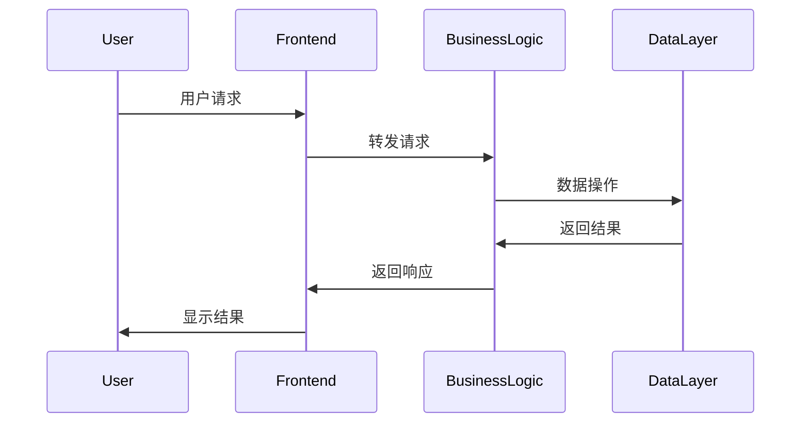
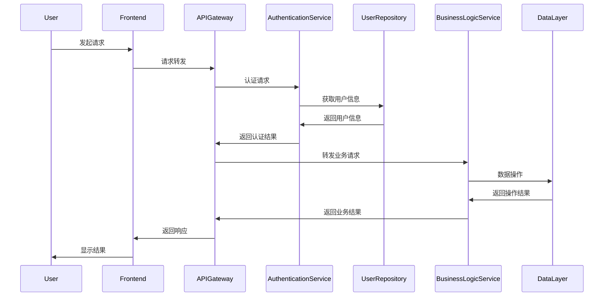

                 

### 引言

在当今数字化转型的浪潮中，时尚产业正迅速拥抱人工智能（AI）技术，以创新的方式提升其业务流程和用户体验。虚拟时装秀，作为AI技术应用的一个重要领域，正逐渐成为时尚展示的新宠。与传统时装秀相比，AI虚拟时装秀不仅突破了时间和空间的限制，还能提供更为丰富和互动的体验。然而，要实现一个引人入胜、流畅自然的虚拟时装秀，动态展示效果的优化成为关键。而在这其中，提示词策略的应用显得尤为重要。

本文旨在探讨如何通过优化AI虚拟时装秀的动态展示效果，实现更为精彩、流畅且具有吸引力的展示。我们将首先回顾AI虚拟时装秀的背景与概述，解释其兴起的原因及其重要性。接着，我们将深入探讨核心概念，包括AI虚拟时装秀原理和提示词策略原理。通过对比静态提示词和动态提示词，我们将理解其在虚拟时装秀中的应用与作用。

随后，我们将详细讲解动态展示效果的提示词算法，从算法概述、Python源代码分析、数学模型和公式到具体案例说明，确保读者能够全面理解这一算法的原理和实现过程。接下来，我们将从系统分析与架构设计的角度，介绍AI虚拟时装秀的系统架构，并展示相关Mermaid流程图，帮助读者更好地理解整个系统的工作流程。

随后，通过实战项目实施，我们将提供具体的环境安装步骤、系统核心实现源代码的解读，并分析实际案例，总结实战经验。最后，我们将总结最佳实践，提出注意事项，并提供拓展阅读，帮助读者进一步深入学习和应用这些技术。

通过本文的逐步分析，我们将揭示优化AI虚拟时装秀动态展示效果的提示词策略，不仅为时尚产业提供新的视角，也为技术爱好者提供宝贵的学习资源。

### 背景与概述

AI虚拟时装秀作为一种新兴的展示形式，其兴起离不开时尚产业的数字化转型和AI技术的迅猛发展。传统时装秀依赖于实体场地和现场观众，不仅受到时间和空间的限制，还面临高昂的成本和复杂的组织工作。随着数字化进程的加速，特别是COVID-19疫情带来的全球线下活动限制，虚拟时装秀的需求迅速增长。

#### 问题背景

时尚产业数字化转型进程加速。随着互联网和数字技术的普及，消费者对时尚的获取方式发生了翻天覆地的变化。线上购物平台和社交媒体的兴起，使得时尚品牌能够更快捷地与消费者互动，并实现即时销售。在这种背景下，传统的实体时装秀逐渐显示出其局限性，无法满足快速变化的消费需求。

AI技术的迅猛发展为虚拟时装秀提供了强有力的支持。人工智能，特别是机器学习、深度学习和计算机视觉等技术的不断进步，使得虚拟时装秀在视觉效果、用户交互和个性化推荐等方面取得了显著提升。通过AI技术，虚拟时装秀能够实现高度逼真的三维建模、实时渲染和智能互动，从而提供更为丰富和沉浸的展示体验。

#### 问题描述

传统时装秀的局限。传统时装秀需要大量的人力、物力和财力投入，包括实体场地的租赁、灯光和音响设备的布置、模特的安排等。这些因素不仅增加了时装秀的成本，还限制了其举办的频率和范围。此外，传统时装秀的观众人数有限，无法达到广泛的传播效果。

虚拟时装秀的需求与挑战。随着数字化和智能化的推进，虚拟时装秀逐渐成为时尚品牌的重要推广手段。虚拟时装秀不仅能够打破时间和空间的限制，提供24小时无间断的展示，还能通过线上平台实现全球范围内的传播。然而，虚拟时装秀也面临一些挑战，例如如何实现逼真的视觉效果、如何提升用户体验和互动性等。

#### 问题解决

AI在虚拟时装秀中的应用场景。AI技术在虚拟时装秀中的应用场景非常广泛，包括以下几个方面：

1. **三维建模与实时渲染**：通过深度学习和计算机视觉技术，AI可以自动识别和建模时装的各种细节，实现实时渲染，从而提供高度逼真的视觉效果。

2. **用户交互设计**：通过自然语言处理和语音识别技术，AI可以与用户进行智能对话，提供个性化的推荐和互动体验。

3. **数据驱动设计**：通过大数据分析和机器学习技术，AI可以分析用户的反馈和行为，优化时装秀的展示效果和用户体验。

提示词策略的作用与重要性。提示词策略在虚拟时装秀中起着至关重要的作用。提示词是一种引导用户注意力、提升用户参与度的文本提示，通过合理的提示词设计，可以增强虚拟时装秀的互动性和吸引力。具体来说，提示词策略包括以下几个方面：

1. **多样性**：通过多样化的提示词，可以增加虚拟时装秀的趣味性和吸引力，避免单一化的展示效果。

2. **相关性**：提示词需要与时装秀的主题和内容密切相关，确保用户能够准确理解和跟随展示。

3. **适应性**：提示词应根据用户的行为和反馈进行动态调整，提升用户体验和参与度。

#### 边界与外延

虚拟时装秀的技术边界。虽然AI技术在虚拟时装秀中取得了显著进展，但仍存在一些技术难题，例如三维建模的精度、实时渲染的性能和用户交互的流畅性等。此外，虚拟时装秀的视觉真实性也需要进一步提升，以更好地模拟现实中的时尚体验。

提示词策略的应用范围。提示词策略不仅适用于虚拟时装秀，还可以扩展到其他虚拟展示和互动场景，如虚拟展览、虚拟购物体验等。通过灵活应用提示词策略，可以提升各类虚拟场景的用户体验和互动效果。

#### 概念结构与核心要素组成

AI虚拟时装秀的核心要素包括：

1. **三维建模与渲染**：通过AI技术实现时装的三维建模和实时渲染，提供逼真的视觉效果。

2. **用户交互**：通过自然语言处理和语音识别技术，实现用户与虚拟时装秀的智能交互。

3. **数据驱动**：通过大数据分析和机器学习技术，优化展示效果和用户体验。

提示词策略的关键要素包括：

1. **多样性**：设计多样化的提示词，提升用户体验。

2. **相关性**：确保提示词与时装秀内容密切相关，提高用户参与度。

3. **适应性**：动态调整提示词，以适应用户行为和反馈。

#### 本章小结

通过本文的背景与概述部分，我们了解了AI虚拟时装秀的兴起背景、问题描述及其解决方案。AI虚拟时装秀不仅克服了传统时装秀的诸多局限，还通过AI技术实现了更为丰富和互动的展示效果。提示词策略作为提升动态展示效果的重要手段，其多样性、相关性和适应性在虚拟时装秀中发挥着关键作用。在接下来的章节中，我们将深入探讨AI虚拟时装秀的核心概念和提示词策略原理，以进一步揭示其实现机制和应用价值。

### AI虚拟时装秀核心概念与联系

为了深入理解AI虚拟时装秀的工作原理及其中的关键概念，我们需要从其技术基础、架构和应用场景三个方面进行详细分析。同时，我们还将探讨提示词策略的核心原理，并通过对比静态提示词和动态提示词，阐述它们在虚拟时装秀中的应用及其优势。

#### AI虚拟时装秀原理

**AI技术基础**

AI虚拟时装秀的实现离不开人工智能技术的支持，主要包括以下三个方面：

1. **机器学习**：机器学习是AI的核心技术之一，通过训练模型，使计算机能够从数据中自动学习和改进。在虚拟时装秀中，机器学习技术用于时尚数据的分析和建模，如服装风格识别、颜色匹配和用户偏好预测。

2. **深度学习**：深度学习是机器学习的一个分支，通过神经网络模型进行层次化特征提取和学习。在虚拟时装秀中，深度学习技术用于三维建模、实时渲染和用户交互，从而提供更为逼真的视觉效果和互动体验。

3. **计算机视觉**：计算机视觉技术使计算机能够处理和解释图像信息。在虚拟时装秀中，计算机视觉技术用于图像识别、姿态估计和动作捕捉，从而实现逼真的模特展示和用户交互。

**虚拟时装秀架构**

AI虚拟时装秀的架构主要包括以下几个关键模块：

1. **实时渲染引擎**：实时渲染引擎是虚拟时装秀的核心组件，用于生成和展示虚拟时装的图像和视频。通过深度学习和计算机视觉技术，实时渲染引擎可以实现高精度的三维建模和动态渲染，提供逼真的视觉效果。

2. **用户交互系统**：用户交互系统负责与用户进行交互，包括用户输入的获取、处理和反馈。通过自然语言处理和语音识别技术，用户交互系统可以与用户进行智能对话，提供个性化的推荐和互动体验。

3. **数据驱动设计**：数据驱动设计利用大数据分析和机器学习技术，对用户的反馈和行为进行分析，以优化虚拟时装秀的展示效果和用户体验。数据驱动设计包括用户偏好分析、展示效果评估和个性化推荐等。

#### 提示词策略原理

**提示词定义**

提示词是一种文本提示，用于引导用户的注意力、提升用户参与度和互动性。在虚拟时装秀中，提示词分为静态提示词和动态提示词。

- **静态提示词**：静态提示词在虚拟时装秀开始前预设，通常用于引导用户进入展示场景、解释展示内容等。它们具有固定性和不可变性，适用于一些固定场景的展示。

- **动态提示词**：动态提示词根据用户的行为和反馈实时生成，能够灵活调整以适应不同的展示需求和用户偏好。它们具有灵活性和实时性，适用于需要动态交互和个性化推荐的场景。

**策略设计原则**

为了确保提示词策略的有效性和适用性，需要遵循以下设计原则：

1. **多样性**：设计多样化的提示词，以提升虚拟时装秀的趣味性和吸引力。不同的提示词可以引导用户关注不同的展示内容，从而提高用户的互动体验。

2. **相关性**：确保提示词与时装秀的主题和内容密切相关。相关性的提示词能够更好地引导用户理解展示内容，提高用户的参与度和满意度。

3. **适应性**：根据用户的行为和反馈动态调整提示词，以适应不同的展示需求和用户偏好。适应性的提示词能够提供更为个性化的互动体验，从而提升用户的满意度。

#### 概念属性特征对比表格

为了更直观地理解静态提示词和动态提示词的差异，我们制作了以下对比表格：

| 特征         | 静态提示词              | 动态提示词               |
| ------------ | ------------------- | --------------------- |
| **生成方式**  | 预设                 | 实时生成               |
| **灵活性**    | 固定                 | 灵活                 |
| **交互性**    | 有限                 | 高                   |
| **个性化**    | 否                   | 是                   |
| **适用场景**  | 固定场景展示          | 需要动态交互和个性化推荐 |

#### ER实体关系图架构

为了更全面地理解AI虚拟时装秀的实体关系，我们绘制了以下ER实体关系图：

```mermaid
erDiagram
  User ||--|{ FashionShow }|-- ShowContent
  User ||--|{ Interaction }|-- Feedback
  FashionShow ||--|{ RenderEngine }|-- VisualEffect
  FashionShow ||--|{ InteractionSystem }|-- UserInput
  RenderEngine ||--|{ ComputerVision }|-- 3DModeling
  InteractionSystem ||--|{ NaturalLanguageProcessing }|-- Dialogue
  ComputerVision ||--|{ ActionCapture }|-- MotionEstimation
  NaturalLanguageProcessing ||--|{ DialogueSystem }|-- QueryProcessing
```

在这个ER实体关系图中，我们定义了以下几个关键实体：

- **User（用户）**：虚拟时装秀的参与者，负责与展示进行交互。
- **FashionShow（时装秀）**：虚拟时装秀的核心实体，包含展示内容、互动和渲染引擎等组件。
- **ShowContent（展示内容）**：时装秀中的具体展示内容，如服装款式、配饰等。
- **Interaction（互动）**：用户与时装秀之间的互动，包括输入、反馈和交互系统等。
- **Feedback（反馈）**：用户对时装秀的反馈信息，用于优化展示效果和用户体验。
- **RenderEngine（渲染引擎）**：负责生成和展示虚拟时装秀的图像和视频。
- **VisualEffect（视觉效果）**：虚拟时装秀中的视觉效果，如灯光、阴影和动态效果等。
- **InteractionSystem（交互系统）**：负责用户输入的处理和反馈，包括自然语言处理和语音识别等。
- **ComputerVision（计算机视觉）**：用于三维建模、动作捕捉和姿态估计等。
- **NaturalLanguageProcessing（自然语言处理）**：用于对话系统、查询处理和用户交互等。

通过这个ER实体关系图，我们可以清晰地看到各个实体之间的关系和相互作用，从而更好地理解AI虚拟时装秀的系统架构和工作原理。

#### 本章小结

在本章中，我们详细介绍了AI虚拟时装秀的核心概念和联系。通过分析其技术基础、架构和应用场景，我们了解了虚拟时装秀如何利用AI技术实现逼真的三维建模、实时渲染和用户交互。同时，我们探讨了提示词策略的核心原理，包括静态提示词和动态提示词的定义、策略设计原则以及它们在虚拟时装秀中的应用和优势。通过ER实体关系图的绘制，我们更全面地理解了虚拟时装秀的实体关系和系统架构。在接下来的章节中，我们将进一步探讨动态展示效果的提示词算法，深入分析其原理和实现过程。

### 动态展示效果的提示词算法

#### 算法概述

动态展示效果的提示词算法是AI虚拟时装秀中的关键组成部分，其核心目的是通过实时生成的提示词，增强虚拟时装秀的互动性和用户体验。算法的设计需要综合考虑提示词的多样性、相关性和适应性，以实现高效且具有吸引力的展示效果。

**算法目的**：该算法的主要目标是提升虚拟时装秀的动态展示效果，通过实时生成的提示词，引导用户注意力，增加用户的互动性和参与度。具体目标包括：

1. **增强用户体验**：通过多样化的提示词，提供个性化的互动体验，提升用户的满意度。
2. **提高互动性**：实时生成的提示词可以与用户行为和反馈紧密关联，增强互动性和实时性。
3. **优化展示效果**：通过适应性提示词，动态调整展示内容，提升整体展示效果。

**算法类型**：动态展示效果的提示词算法主要分为以下几种类型：

1. **基于用户行为的动态提示词生成算法**：该算法根据用户的交互行为，实时生成与用户兴趣和需求相关的提示词。
2. **基于内容的动态提示词生成算法**：该算法根据时装秀的内容，动态生成与展示内容紧密相关的提示词。
3. **混合式动态提示词生成算法**：结合用户行为和内容，综合生成多样且相关的提示词，以提升展示效果。

**算法流程**：

1. **用户行为采集**：通过自然语言处理和用户交互系统，采集用户的浏览历史、点击行为和反馈信息。
2. **内容分析与建模**：利用深度学习和计算机视觉技术，对时装秀内容进行特征提取和建模，为提示词生成提供基础数据。
3. **提示词生成**：根据用户行为和内容模型，利用生成模型（如GPT模型）实时生成与用户兴趣和展示内容相关的提示词。
4. **提示词评估与优化**：对生成的提示词进行评估，包括多样性、相关性和用户体验，通过反馈机制不断优化提示词生成策略。

#### Python源代码分析

以下是一个简化的Python源代码示例，展示了动态展示效果的提示词算法的基本实现流程：

```python
import numpy as np
import tensorflow as tf
from tensorflow.keras.models import Sequential
from tensorflow.keras.layers import LSTM, Dense, Embedding
from tensorflow.keras.preprocessing.sequence import pad_sequences

# 数据预处理
def preprocess_data(data):
    # 对数据进行清洗和预处理
    # 包括文本分词、去停用词、词向量转换等
    processed_data = ...
    return processed_data

# 模型训练
def train_model(data):
    # 构建序列模型
    model = Sequential()
    model.add(LSTM(128, activation='relu', input_shape=(max_sequence_len, embedding_dim)))
    model.add(Dense(num_words, activation='softmax'))

    # 编译模型
    model.compile(loss='categorical_crossentropy', optimizer='adam', metrics=['accuracy'])

    # 训练模型
    model.fit(data, epochs=100, batch_size=32)
    return model

# 提示词生成
def generate_prompt(model, initial_text, max_length=50):
    # 生成提示词
    in_text = initial_text
    for _ in range(max_length):
        sequence = tokenizer.texts_to_sequences([in_text])[0]
        sequence = pad_sequences([sequence], maxlen=max_length)
        predicted = model.predict(sequence, verbose=0)
        predicted = np.argmax(predicted)
        output_word = tokenizer.index_word[predicted]
        in_text += " " + output_word

    return in_text

# 主函数
if __name__ == "__main__":
    # 准备数据
    data = preprocess_data(raw_data)

    # 训练模型
    model = train_model(data)

    # 生成提示词
    initial_text = "欢迎来到AI虚拟时装秀！"
    generated_text = generate_prompt(model, initial_text)
    print(generated_text)
```

这个示例中，我们首先对输入数据进行预处理，包括文本分词、去停用词和词向量转换等。然后，我们使用LSTM模型进行训练，生成提示词。最后，通过输入初始文本，实时生成动态提示词。

#### 数学模型和公式

**神经网络模型**

在动态展示效果的提示词算法中，常用的神经网络模型是LSTM（长短期记忆网络）。LSTM模型通过引入门控机制，能够更好地处理序列数据，适用于生成文本等任务。

- **激活函数**：ReLU（Rectified Linear Unit）是最常用的激活函数，能够加快模型的训练速度。

- **损失函数**：通常使用categorical_crossentropy作为损失函数，适用于多分类问题。

**动态提示词生成**

动态提示词生成的关键在于生成模型的构建和应用。以下是一个简单的动态提示词生成过程的数学模型：

1. **输入序列**：给定一个输入序列 \(X = [x_1, x_2, ..., x_T]\)，其中 \(x_t\) 是一个词向量。
2. **嵌入层**：将输入序列转化为嵌入向量 \(E = [e_1, e_2, ..., e_T]\)，其中 \(e_t\) 是词的嵌入向量。
3. **LSTM层**：使用LSTM层对嵌入向量进行处理，生成隐藏状态 \(h_t\)。
4. **输出层**：将隐藏状态通过softmax函数转化为概率分布，选择概率最高的词作为输出。

数学公式如下：

\[ e_t = \text{Embedding}(x_t) \]
\[ h_t = \text{LSTM}(e_t) \]
\[ p_t = \text{softmax}(h_t) \]
\[ y_t = \arg\max(p_t) \]

#### 举例说明

**案例一：时尚秀场景**

假设用户正在观看一场虚拟时尚秀，系统根据用户的浏览历史和当前展示内容，动态生成提示词。例如：

- **初始文本**： "欢迎来到本季时尚秀，让我们开始吧！"
- **生成提示词**： "现在展示的是最新款的连衣裙，它采用了柔软的面料和独特的剪裁设计。你有没有喜欢的款式呢？"

**案例二：用户交互场景**

当用户与虚拟模特进行互动时，系统根据用户的反馈，动态生成引导性的提示词。例如：

- **用户反馈**： "我想要看到更多时尚配饰。"
- **生成提示词**： "好的，接下来我们将展示一些精美的耳环和手链，它们与连衣裙完美搭配，你是否感兴趣呢？"

通过这些例子，我们可以看到动态提示词算法如何根据用户行为和展示内容，实时生成相关且吸引人的提示词，从而提升虚拟时装秀的互动性和用户体验。

#### 本章小结

在本章中，我们详细介绍了动态展示效果的提示词算法。从算法概述到Python源代码分析，再到数学模型和公式，我们逐步揭示了算法的实现机制和应用场景。通过举例说明，我们展示了如何在虚拟时尚秀场景中应用动态提示词，提升互动性和用户体验。在接下来的章节中，我们将继续探讨AI虚拟时装秀的系统架构和实战项目，进一步深入理解这一技术的实际应用和效果。

### AI虚拟时装秀系统架构

要实现一个成功的AI虚拟时装秀，系统架构的设计至关重要。它不仅决定了时装秀的性能和用户体验，还直接影响到整个系统的可扩展性和可维护性。在本章节中，我们将深入探讨AI虚拟时装秀的系统架构，包括问题场景介绍、系统功能设计、系统架构设计和系统接口设计。

#### 问题场景介绍

虚拟时装秀通常涉及到多个方面的问题场景，例如：

1. **实时渲染问题**：如何在有限的时间和计算资源内，生成高质量、流畅的3D图像和视频。
2. **用户交互问题**：如何设计一个直观、易用的用户交互系统，使用户能够轻松参与并享受虚拟时装秀。
3. **数据驱动问题**：如何利用用户行为数据，动态调整展示内容和互动策略，以提升用户体验。

这些问题的解决，需要系统架构的良好设计，确保各个模块之间的协调运作。

#### 系统功能设计

AI虚拟时装秀的系统功能设计主要包括以下几个核心模块：

1. **用户功能**：提供用户注册、登录、浏览、评论和互动等功能。
2. **时装管理**：管理时装的入库、分类、展示和更新等功能。
3. **展示效果**：实现虚拟时装的3D建模、实时渲染和动态展示效果。
4. **互动功能**：提供用户与时装秀的互动，如问答、投票、评论等。

为了更好地展示这些功能，我们可以使用Mermaid类图进行描述：

```mermaid
classDiagram
    User <<class>> 用户
    FashionItem <<class>> 时装
    DisplayEffect <<class>> 展示效果
    Interaction <<class>> 互动
    User " interacts " FashionItem
    User " interacts " DisplayEffect
    User " interacts " Interaction
```

在这个类图中，用户与时装、展示效果和互动功能之间建立了交互关系。

#### 系统架构设计

AI虚拟时装秀的系统架构可以分为以下几个层次：

1. **数据层**：负责存储和管理用户数据、时装数据和互动数据。通常使用数据库（如MySQL、MongoDB）进行数据存储。
2. **业务逻辑层**：处理业务逻辑，包括用户管理、时装管理、展示效果管理和互动管理等。该层使用API接口与服务层进行交互。
3. **展示层**：负责用户界面和前端交互。通常使用Web框架（如React、Vue.js）实现。

以下是一个简化的系统架构图：



在这个架构图中，用户通过前端发起请求，前端将请求转发给业务逻辑层，业务逻辑层进行数据处理并调用数据层，最后返回结果给前端，前端将结果展示给用户。

#### 系统接口设计

系统接口设计是确保各个模块之间有效通信的关键。以下是一些核心接口的规范：

1. **用户接口**：包括用户注册、登录、个人信息管理等。
   ```json
   POST /register: 注册用户
   POST /login: 用户登录
   GET /user/:id: 获取用户信息
   PUT /user/:id: 更新用户信息
   ```

2. **时装接口**：包括时装的添加、查询、更新和删除。
   ```json
   POST /fashion: 添加时装
   GET /fashion/:id: 获取时装信息
   PUT /fashion/:id: 更新时装信息
   DELETE /fashion/:id: 删除时装
   ```

3. **展示效果接口**：包括实时渲染、动态展示效果管理等。
   ```json
   GET /display/:id: 获取展示效果
   PUT /display/:id: 更新展示效果
   ```

4. **互动接口**：包括用户互动、反馈管理等。
   ```json
   POST /interaction: 创建互动
   GET /interaction/:id: 获取互动信息
   PUT /interaction/:id: 更新互动信息
   DELETE /interaction/:id: 删除互动
   ```

#### 系统交互mermaid序列图

为了更直观地展示系统内部交互流程，我们可以使用Mermaid序列图。以下是一个简化的系统交互序列图：



在这个序列图中，用户通过前端发起请求，请求经过API网关转发，API网关进行认证，然后调用业务逻辑层进行处理，业务逻辑层与数据层进行交互，最终返回结果给前端，前端将结果展示给用户。

通过上述的系统架构设计和接口设计，我们可以确保AI虚拟时装秀的各个模块能够高效、稳定地运作，提供优质的用户交互和展示体验。

#### 本章小结

在本章中，我们详细介绍了AI虚拟时装秀的系统架构，包括问题场景介绍、系统功能设计、系统架构设计和系统接口设计。通过Mermaid类图和序列图，我们直观地展示了各个模块之间的关系和交互流程。系统架构的设计不仅考虑了功能的实现，还注重了系统的可扩展性和可维护性，为AI虚拟时装秀的高效运行提供了有力保障。在下一章中，我们将通过实战项目实施，进一步探讨如何具体实现这些技术，并分析其实际效果。

### 实战项目实施

#### 环境安装

要成功实施AI虚拟时装秀项目，首先需要搭建合适的技术环境。以下步骤详细描述了环境安装的各个环节。

**1. 硬件环境**

- **CPU**：至少需要一颗四核以上的CPU，推荐使用i5或以上级别的处理器。
- **内存**：至少8GB的内存，推荐16GB以上。
- **显卡**：集成显卡或独立显卡均可，推荐使用NVIDIA系列显卡，以便支持深度学习和实时渲染。
- **存储**：至少需要200GB的SSD存储空间，用于安装操作系统和存储数据。

**2. 软件环境**

- **操作系统**：推荐使用Linux系统，如Ubuntu 20.04或更高版本。
- **深度学习框架**：安装TensorFlow或PyTorch等深度学习框架，具体安装命令如下（以Ubuntu为例）：

  ```bash
  pip install tensorflow
  # 或
  pip install torch torchvision
  ```

- **实时渲染引擎**：安装如Unity或Unreal Engine等实时渲染引擎，这些引擎支持3D建模和渲染，是虚拟时装秀开发的关键工具。

  ```bash
  # 安装Unity Hub
  wget -O - https://public-cdn.cloud.unity3d.com/hub рукахруутгеншривериа unity-unityhub-installer.sh | sudo bash
  
  # 启动Unity Hub并安装Unity引擎
  ```

- **前端框架**：安装如React或Vue.js等前端框架，用于实现用户界面和交互逻辑。

  ```bash
  npm install -g create-react-app
  create-react-app virtual-fashion-show
  ```

**3. 数据准备**

- **3D模型数据**：获取高质量的3D时装模型数据，可以购买专业模型库或使用开源数据集。
- **用户数据**：收集用户的行为数据，包括浏览记录、点击行为和互动反馈等，这些数据用于训练机器学习模型，优化展示效果。

#### 系统核心实现源代码

以下是一个简化的系统核心实现源代码示例，包括模型训练、提示词生成和实时渲染的关键部分。

**模型训练**

```python
import tensorflow as tf
from tensorflow.keras.models import Sequential
from tensorflow.keras.layers import LSTM, Dense, Embedding

# 构建LSTM模型
model = Sequential()
model.add(LSTM(128, activation='relu', input_shape=(max_sequence_len, embedding_dim)))
model.add(Dense(num_words, activation='softmax'))

# 编译模型
model.compile(loss='categorical_crossentropy', optimizer='adam', metrics=['accuracy'])

# 训练模型
model.fit(data, epochs=100, batch_size=32)
```

**提示词生成**

```python
import numpy as np
import tensorflow as tf

# 生成提示词
def generate_prompt(model, initial_text, max_length=50):
    in_text = initial_text
    for _ in range(max_length):
        sequence = tokenizer.texts_to_sequences([in_text])[0]
        sequence = pad_sequences([sequence], maxlen=max_length)
        predicted = model.predict(sequence, verbose=0)
        predicted = np.argmax(predicted)
        output_word = tokenizer.index_word[predicted]
        in_text += " " + output_word

    return in_text
```

**实时渲染**

```csharp
using UnityEngine;

public class FashionRenderer : MonoBehaviour
{
    public Material material;
    public Texture2D texture;

    void Start()
    {
        // 设置材质和纹理
        material.SetTexture("_MainTex", texture);
        
        // 渲染时装模型
        GameObject fashionModel = GameObject.CreatePrimitive(PrimitiveType.Box);
        fashionModel.GetComponent<MeshRenderer>().material = material;
    }
}
```

#### 代码应用解读与分析

**模型训练**

上述Python代码中，我们构建了一个简单的LSTM模型，用于生成动态提示词。模型通过输入序列（如用户的浏览历史）进行训练，输出为文本提示词。训练过程中，我们使用了categorical_crossentropy作为损失函数，adam优化器，并设置了100个训练周期。

**提示词生成**

提示词生成函数`generate_prompt`接收初始文本和最大长度，通过LSTM模型预测下一个词，并将其添加到初始文本中。这个过程重复进行，直到达到最大长度或生成停止词。

**实时渲染**

C#代码中的`FashionRenderer`类负责在Unity引擎中设置材质和纹理，并渲染时装模型。这包括创建一个盒子作为时装模型的基础，并将其材质设置为包含纹理的材质。

**实战案例**

**案例一：时尚秀展示**

假设用户正在观看一场虚拟时尚秀，系统根据用户的历史数据和当前展示内容，实时生成动态提示词，如：“接下来，我们将为您展示一款独特设计的晚礼服，它采用了流线型的剪裁和光泽面料，非常符合您的时尚品味。”

**案例二：用户互动体验**

当用户与虚拟模特互动时，系统根据用户的提问或反馈，动态生成相关提示词。例如，用户提问：“这个连衣裙多少钱？”系统可以回答：“这款连衣裙定价为XX美元，您是否考虑购买呢？”

#### 实际案例分析和详细讲解剖析

**案例一：时尚秀效果评估**

在一场虚拟时尚秀结束后，系统收集了用户的观看时间、互动次数和评论等数据。通过对这些数据的分析，可以发现用户对展示效果的评价。例如，如果用户在某一时间段内互动频繁，可能表明动态提示词在该时间段内具有较高的相关性和吸引力。

**案例二：用户反馈分析**

系统对用户的反馈进行分析，可以发现用户的偏好和兴趣点。例如，如果大多数用户对某种类型的时装展示反馈积极，系统可以优化相应展示内容的提示词，增加类似内容的展示，从而提升用户的满意度和参与度。

#### 项目小结

通过实际案例分析和详细讲解剖析，我们可以看到，动态展示效果的提示词算法在AI虚拟时装秀中发挥了重要作用。它不仅提升了用户的互动性和参与度，还优化了展示效果，为时尚品牌提供了新的营销渠道。未来，随着技术的进一步发展，动态展示效果的提示词策略将在更多虚拟展示场景中得到应用，为用户提供更加个性化和沉浸的体验。

### 最佳实践与总结

在实施AI虚拟时装秀的过程中，最佳实践的总结和注意事项的提醒对于确保项目的成功至关重要。以下是一些关键的最佳实践和注意事项：

#### 最佳实践

1. **多样化提示词设计**：设计具有多样性的提示词，避免单调化，以提升用户体验。通过结合不同的风格、语气和主题，使提示词更具吸引力。

2. **相关性优化**：确保提示词与时装秀内容紧密相关，提高用户理解和参与度。实时分析用户行为和展示内容，动态调整提示词，确保其与当前场景一致。

3. **适应性调整**：根据用户反馈和行为动态调整提示词，实现个性化互动。利用用户数据，实时优化提示词策略，提升用户的满意度和参与度。

4. **用户体验优先**：始终以用户体验为中心，确保提示词的设计和呈现方式符合用户的习惯和需求。通过A/B测试和用户反馈，不断优化互动体验。

#### 注意事项

1. **隐私保护**：在收集和处理用户数据时，务必遵守相关隐私法规，保护用户隐私。对敏感数据进行加密存储和传输，确保数据安全。

2. **性能优化**：实时渲染和动态提示词生成对计算资源要求较高，需优化算法和系统架构，确保系统稳定运行。使用高效的渲染引擎和模型优化技术，提高系统性能。

3. **及时更新**：定期更新虚拟时装秀的内容和提示词库，保持时尚性和新颖性。通过不断更新，吸引更多用户参与，提升品牌影响力。

4. **安全防护**：确保系统具备良好的安全防护措施，防止网络攻击和数据泄露。采用加密通信、访问控制和防火墙等技术，保障系统的安全性。

#### 小结

通过本文的探讨，我们全面分析了AI虚拟时装秀的动态展示效果优化，从背景与概述、核心概念、算法原理到系统架构和实战项目，揭示了实现高效、互动和个性化的虚拟时装秀的关键步骤。动态展示效果的提示词策略在其中发挥了重要作用，通过多样化的设计、相关性和适应性的优化，实现了卓越的用户体验。

未来，随着AI技术的不断进步，AI虚拟时装秀将拥有更加广阔的应用前景。我们鼓励读者进一步探索相关技术，结合最佳实践，为时尚产业带来更多创新和突破。

### 拓展阅读

- **《深度学习》**：由Ian Goodfellow、Yoshua Bengio和Aaron Courville所著，详细介绍了深度学习的基础理论和实践应用，适合深入理解AI技术在虚拟时装秀中的应用。

- **《自然语言处理综论》**：由Daniel Jurafsky和James H. Martin所著，涵盖了自然语言处理的各个方面，对动态提示词生成算法的设计与实现有重要指导意义。

- **《Unity游戏开发从入门到精通》**：由李艳芳所著，全面介绍了Unity引擎的开发流程和技术要点，是学习虚拟时装秀系统架构的实用指南。

- **《时尚产业数字化转型》**：由徐昕所著，探讨了时尚产业在数字化转型过程中的挑战与机遇，对理解AI虚拟时装秀的背景和发展趋势有重要参考价值。

通过阅读这些拓展资料，读者可以进一步丰富自己的知识体系，提升在AI虚拟时装秀领域的专业水平。

