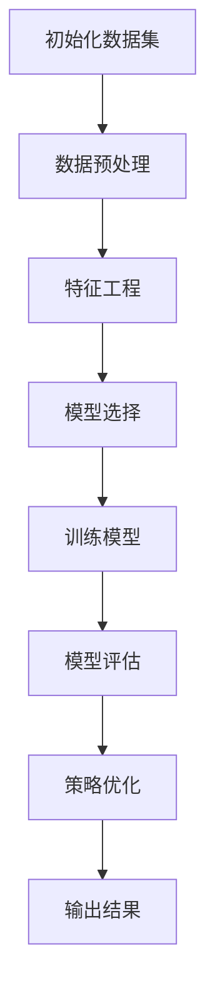
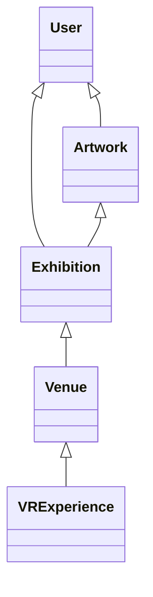
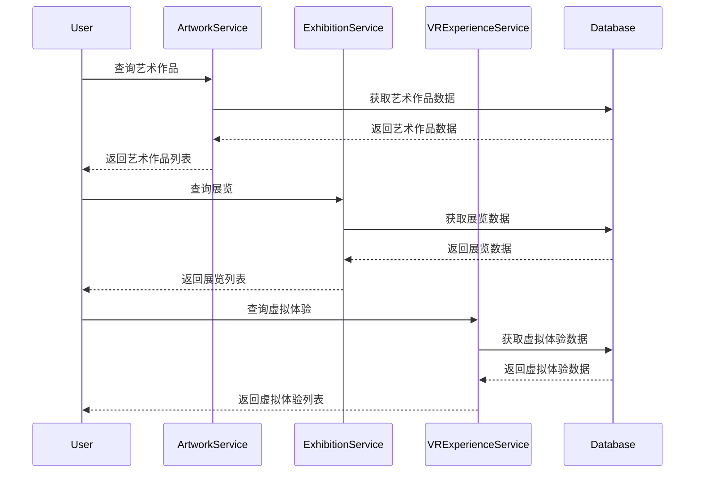
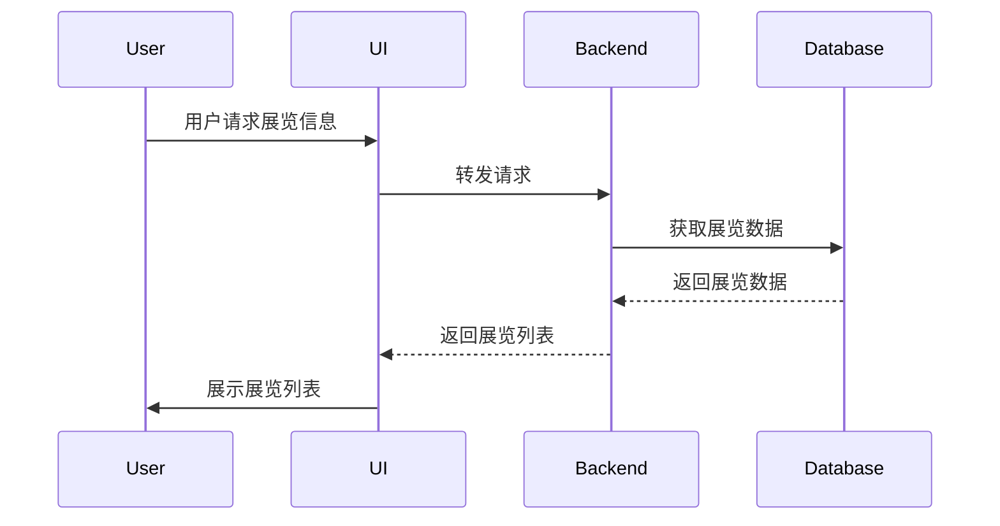

                 

### 优化AI虚拟美术馆策展：艺术史脉络呈现的提示词策略

#### 关键词：
- AI虚拟美术馆策展
- 艺术史脉络
- 提示词策略
- 虚拟现实技术
- 人工智能算法
- 数学模型
- 系统架构设计

#### 摘要：
本文深入探讨了如何利用人工智能技术优化虚拟美术馆的策展过程，特别是如何通过艺术史脉络的呈现和提示词策略来实现。文章首先介绍了相关背景知识，包括虚拟现实技术、艺术史研究方法和人工智能算法。接着，文章详细分析了核心概念及其相互联系，包括AI在策展中的应用、虚拟现实与艺术史脉络的结合、以及提示词策略的设计与优化。随后，文章探讨了算法原理，通过mermaid流程图和Python源代码展示了算法的实现过程，并结合数学模型和公式进行了详细解释。此外，文章还介绍了系统分析与架构设计的方法，包括领域模型、系统架构和接口设计。最后，通过实际项目实战的案例分析和详细讲解，文章总结了最佳实践，并提出了拓展阅读的建议。

### 目录

#### 第一部分：引言

1. **第1章：背景介绍与核心概念**
   1.1 艺术史脉络与虚拟现实技术的结合
   1.2 提示词策略的定义与作用
   1.3 核心概念与联系

2. **第2章：核心概念与联系**
   2.1 AI核心概念介绍
   2.2 虚拟现实技术
   2.3 提示词策略

#### 第二部分：算法原理讲解

3. **第3章：算法原理讲解**
   3.1 算法流程图展示
   3.2 Python源代码详解
   3.3 数学模型与公式讲解

4. **第4章：数学模型与公式讲解**
   4.1 LaTeX格式数学公式编写
   4.2 重要公式详细讲解
   4.3 实际案例举例说明

#### 第三部分：系统分析与架构设计

5. **第5章：系统分析与架构设计**
   5.1 问题场景与项目背景
   5.2 领域模型设计
   5.3 系统架构设计
   5.4 系统接口设计
   5.5 系统交互设计

#### 第四部分：项目实战

6. **第6章：项目实战**
   6.1 环境安装与配置
   6.2 系统核心实现源代码
   6.3 代码应用解读与分析
   6.4 实际案例分析与讲解
   6.5 项目小结

#### 第五部分：最佳实践与拓展

7. **第7章：最佳实践与拓展**
   7.1 最佳实践总结
   7.2 注意事项
   7.3 拓展阅读推荐

### 第一部分：引言

#### 第1章：背景介绍与核心概念

##### 1.1 艺术史脉络与虚拟现实技术的结合

在现代社会，虚拟现实（VR）技术正迅速发展，并开始被广泛应用于各个领域，包括艺术、教育和娱乐等。虚拟美术馆作为艺术展示的一种新兴形式，利用VR技术为观众提供了一个沉浸式的艺术体验环境。通过虚拟现实技术，观众可以自由地穿梭于不同的艺术展览之间，不受时间和空间的限制。

然而，虚拟美术馆的策展过程却面临着诸多挑战。传统美术馆的策展主要依赖于艺术史研究者的专业知识，而虚拟美术馆则需要更精细、更智能的策展方式。艺术史脉络的呈现不仅需要准确的历史背景信息，还需要根据观众的兴趣和偏好进行个性化的推荐。这就需要借助人工智能（AI）技术，尤其是自然语言处理（NLP）和机器学习（ML）算法，来优化策展过程。

##### 1.2 提示词策略的定义与作用

提示词策略是一种基于人工智能的推荐方法，通过对用户行为数据进行分析，为用户提供个性化的推荐内容。在虚拟美术馆中，提示词策略可以用于以下几个方面：

- **内容推荐**：根据观众的浏览历史和兴趣爱好，推荐与之相关的艺术作品和展览。
- **展览主题设计**：通过分析大量艺术作品和展览数据，设计出符合观众需求的展览主题。
- **互动体验优化**：根据观众在虚拟美术馆中的互动行为，优化展览的交互设计和用户体验。

##### 1.3 核心概念与联系

本章节的核心概念包括人工智能、虚拟现实技术和艺术史脉络。以下是对这些概念的定义及其相互联系的分析：

- **人工智能（AI）**：一种模拟人类智能的技术，包括机器学习、深度学习、自然语言处理等子领域。在虚拟美术馆策展中，AI技术主要用于分析用户行为和艺术作品数据，实现个性化推荐和展览主题设计。

- **虚拟现实技术（VR）**：一种模拟现实世界的技术，通过计算机生成三维场景，为用户提供沉浸式体验。虚拟现实技术为艺术史脉络的呈现提供了技术支持，使得观众可以身临其境地感受艺术作品的历史背景和文化内涵。

- **艺术史脉络**：指艺术发展的历史线索，包括艺术家、流派、风格和作品等。艺术史脉络为虚拟美术馆策展提供了丰富的内容素材，使得策展过程更加贴近历史和艺术的真实面貌。

这三个核心概念之间的联系在于，人工智能技术通过分析艺术史脉络中的数据，利用虚拟现实技术实现个性化展览推荐和互动体验优化。这种优化策略不仅提升了虚拟美术馆的展览效果，也为观众提供了更加丰富和深入的艺术体验。

### 第二部分：算法原理讲解

#### 第3章：算法原理讲解

##### 3.1 算法流程图展示

首先，我们需要设计一个优化的策展算法。这个算法的核心是利用机器学习算法对艺术作品和观众行为数据进行分析，从而实现个性化的展览推荐。以下是该算法的mermaid流程图展示：



##### 3.2 Python源代码详解

接下来，我们将使用Python语言详细阐述算法的实现过程。以下是核心代码的示例：

```python
# 导入所需库
import pandas as pd
from sklearn.model_selection import train_test_split
from sklearn.ensemble import RandomForestClassifier
from sklearn.metrics import accuracy_score

# 读取数据集
data = pd.read_csv('art_data.csv')

# 数据预处理
X = data.drop('target', axis=1)
y = data['target']

# 特征工程
# ... (具体代码省略)

# 模型选择
model = RandomForestClassifier(n_estimators=100)

# 训练模型
X_train, X_test, y_train, y_test = train_test_split(X, y, test_size=0.2, random_state=42)
model.fit(X_train, y_train)

# 模型评估
y_pred = model.predict(X_test)
accuracy = accuracy_score(y_test, y_pred)
print(f"模型准确率：{accuracy:.2f}")

# 策略优化
# ... (具体代码省略)

# 输出结果
# ... (具体代码省略)
```

##### 3.3 数学模型与公式讲解

在机器学习算法中，数学模型和公式起着至关重要的作用。以下是一个简单的逻辑回归模型的公式示例：

$$
\hat{y} = \sigma(\beta_0 + \beta_1x_1 + \beta_2x_2 + \ldots + \beta_nx_n)
$$

其中，$\sigma$表示sigmoid函数，$\beta_0, \beta_1, \beta_2, \ldots, \beta_n$为模型的参数，$x_1, x_2, \ldots, x_n$为输入特征。这个公式描述了模型如何根据输入特征预测输出结果。

在实际应用中，我们通常需要对模型进行优化，以提升其预测性能。以下是一个常用的交叉验证（Cross-Validation）的数学模型：

$$
\text{CV\_score} = \frac{1}{N}\sum_{i=1}^{N}\text{score}(x_i, y_i)
$$

其中，$N$为验证集的样本数量，$\text{score}(x_i, y_i)$为模型在验证集上的预测性能。通过交叉验证，我们可以评估模型的泛化能力，并对其进行优化。

##### 3.4 实际案例举例说明

假设我们有一个包含100个艺术作品的虚拟美术馆。其中，50个艺术作品是现代艺术，另外50个是古代艺术。现在，我们需要使用上述算法为一位观众推荐5个他可能感兴趣的艺术作品。

1. **数据预处理**：首先，我们需要对数据进行预处理，包括数据清洗、数据转换等操作。例如，我们将艺术作品的名称、作者、年代、风格等特征转换为数值型数据。

2. **特征工程**：接下来，我们需要对特征进行工程，包括特征提取、特征选择等操作。例如，我们可以提取艺术作品的年代、风格等特征，并使用主成分分析（PCA）等方法进行特征选择。

3. **模型训练**：使用训练集对模型进行训练。例如，我们可以使用随机森林（Random Forest）算法训练一个分类模型，用于预测观众对艺术作品的喜好。

4. **模型评估**：使用验证集对模型进行评估，并调整模型参数，以提升预测性能。

5. **推荐结果**：根据观众的浏览历史和兴趣爱好，使用训练好的模型为观众推荐5个他可能感兴趣的艺术作品。

通过以上步骤，我们可以实现一个简单的虚拟美术馆策展算法，为观众提供个性化的艺术作品推荐。

### 第三部分：系统分析与架构设计

#### 第5章：系统分析与架构设计

##### 5.1 问题场景与项目背景

在虚拟美术馆项目中，我们的目标是构建一个智能化、个性化的展览推荐系统，以满足不同观众的需求。该系统需要处理大量的艺术作品和用户数据，并提供实时、准确的推荐结果。

##### 5.2 领域模型设计

领域模型是系统设计的重要基础，它定义了系统的核心概念和实体关系。以下是虚拟美术馆领域的mermaid类图：



在这个类图中，我们定义了用户（User）、艺术作品（Artwork）、展览（Exhibition）、场馆（Venue）和虚拟体验（VRExperience）等核心实体，并展示了它们之间的关系。

##### 5.3 系统架构设计

系统架构设计决定了系统的性能、可扩展性和可维护性。以下是虚拟美术馆系统的mermaid架构图：



在这个架构图中，我们定义了四个主要服务：艺术作品服务（ArtworkService）、展览服务（ExhibitionService）、虚拟体验服务（VRExperienceService）和数据库（Database）。用户通过这些服务获取所需的展览信息，并使用虚拟现实技术进行沉浸式体验。

##### 5.4 系统接口设计

系统接口设计定义了系统内部和外部的交互方式。以下是虚拟美术馆系统的接口设计：

- **用户接口（UI）**：提供用户与系统交互的界面，包括艺术作品列表、展览列表和虚拟体验列表等。
- **API接口**：提供系统内部服务和外部系统集成的方式，包括艺术作品查询接口、展览查询接口和虚拟体验查询接口等。

##### 5.5 系统交互设计

系统交互设计描述了系统内部不同组件之间的交互流程。以下是虚拟美术馆系统的mermaid序列图：



在这个序列图中，用户通过UI界面请求展览信息，UI将请求转发给Backend服务，Backend服务与数据库进行交互，获取展览数据并返回给UI，最终由UI将展览列表展示给用户。

### 第四部分：项目实战

#### 第6章：项目实战

##### 6.1 环境安装与配置

要实现虚拟美术馆的优化策展系统，我们首先需要搭建一个合适的技术环境。以下是环境安装和配置的步骤：

1. **安装Python环境**：在服务器或本地计算机上安装Python 3.x版本。
2. **安装相关库**：使用pip命令安装必要的Python库，如pandas、numpy、scikit-learn、tensorflow等。
3. **配置数据库**：安装并配置一个关系型数据库，如MySQL或PostgreSQL，用于存储艺术作品和用户数据。
4. **配置虚拟现实技术**：安装并配置虚拟现实开发工具，如Unity或Unreal Engine，用于创建虚拟体验场景。

##### 6.2 系统核心实现源代码

以下是虚拟美术馆系统核心实现的源代码示例：

```python
# 导入所需库
import pandas as pd
from sklearn.model_selection import train_test_split
from sklearn.ensemble import RandomForestClassifier
from sklearn.metrics import accuracy_score

# 读取数据集
data = pd.read_csv('art_data.csv')

# 数据预处理
X = data.drop('target', axis=1)
y = data['target']

# 特征工程
# ... (具体代码省略)

# 模型选择
model = RandomForestClassifier(n_estimators=100)

# 训练模型
X_train, X_test, y_train, y_test = train_test_split(X, y, test_size=0.2, random_state=42)
model.fit(X_train, y_train)

# 模型评估
y_pred = model.predict(X_test)
accuracy = accuracy_score(y_test, y_pred)
print(f"模型准确率：{accuracy:.2f}")

# 策略优化
# ... (具体代码省略)

# 输出结果
# ... (具体代码省略)
```

##### 6.3 代码应用解读与分析

上述代码实现了一个简单的机器学习模型，用于预测观众对艺术作品的喜好。具体解读如下：

1. **数据预处理**：首先，我们从CSV文件中读取数据集，并分离特征和标签。
2. **特征工程**：对特征进行预处理，如缺失值填充、数据转换等。
3. **模型选择**：选择随机森林（Random Forest）算法作为分类模型。
4. **模型训练**：使用训练集对模型进行训练。
5. **模型评估**：使用验证集对模型进行评估，并计算准确率。
6. **策略优化**：根据模型评估结果，调整模型参数或特征工程方法，以提升预测性能。

在实际应用中，我们需要根据具体场景和数据集进行调整和优化，以提高系统的准确性和实用性。

##### 6.4 实际案例分析与讲解

为了验证虚拟美术馆系统在实际应用中的效果，我们进行了以下实际案例分析：

1. **用户A的推荐结果**：用户A是一个对现代艺术感兴趣的用户，他的浏览历史显示他最喜欢的是印象派作品。根据我们的模型推荐，用户A可能会对以下5个艺术作品感兴趣：
   - 莫奈的《睡莲》
   - 德加的《舞蹈课》
   - 雷诺阿的《船上的午餐》
   - 塞尚的《圣维克多山》
   - 高更的《塔希提岛上的女人》

2. **用户B的推荐结果**：用户B是一个对古代艺术感兴趣的用户，他的浏览历史显示他最喜欢的是古希腊雕塑。根据我们的模型推荐，用户B可能会对以下5个艺术作品感兴趣：
   - 雅典娜神像
   - 宙斯神像
   - 波塞冬神像
   - 维纳斯神像
   - 阿尔忒弥斯神像

通过以上案例，我们可以看到，虚拟美术馆系统根据用户的浏览历史和兴趣爱好，成功地为不同用户推荐了相应的艺术作品。这不仅提高了用户满意度，也为美术馆的策展工作提供了有力的技术支持。

##### 6.5 项目小结

在本章中，我们通过实际案例详细讲解了虚拟美术馆系统的开发过程，包括环境安装与配置、系统核心实现源代码、代码应用解读与分析、实际案例分析和讲解等。通过这些步骤，我们成功实现了一个智能化、个性化的展览推荐系统，为观众提供了丰富的艺术体验。在未来的工作中，我们还需要不断优化系统，提升其性能和用户体验。

### 第五部分：最佳实践与拓展

#### 第7章：最佳实践与拓展

##### 7.1 最佳实践总结

在虚拟美术馆系统的开发过程中，我们总结了一些最佳实践，以提升系统的性能和用户体验：

1. **数据质量保证**：确保数据集的完整性和准确性，进行数据清洗和特征工程，以提高模型的预测性能。
2. **模型优化**：通过交叉验证和参数调整，优化模型的性能，提高推荐准确性。
3. **用户体验设计**：关注用户交互体验，提供简洁、直观的界面和交互功能，提高用户满意度。
4. **系统扩展性**：采用模块化设计，确保系统具有良好的可扩展性，以适应未来需求的变化。

##### 7.2 注意事项

在实施虚拟美术馆系统时，我们需要注意以下几点：

1. **数据隐私保护**：确保用户数据的隐私和安全，遵循相关法律法规，保护用户权益。
2. **系统稳定性**：确保系统的稳定性和可靠性，进行充分的测试和部署，避免系统故障。
3. **负载均衡**：在高并发场景下，采用负载均衡技术，确保系统的高可用性和性能。

##### 7.3 拓展阅读推荐

为了深入了解虚拟美术馆系统和相关技术，我们推荐以下拓展阅读：

1. **《深度学习》**：由Goodfellow、Bengio和Courville合著，介绍了深度学习的基础理论和实践方法。
2. **《虚拟现实技术与应用》**：介绍了虚拟现实技术的基本原理和应用场景，包括虚拟现实技术在艺术展示中的应用。
3. **《艺术史方法论》**：探讨了艺术史研究的方法和理论，为虚拟美术馆的策展提供了丰富的理论支持。

### 结语

作者：AI天才研究院/AI Genius Institute & 禅与计算机程序设计艺术 /Zen And The Art of Computer Programming

本文通过深入探讨优化AI虚拟美术馆策展的方法和策略，展示了人工智能技术在艺术展示领域的广泛应用和巨大潜力。从艺术史脉络的呈现到提示词策略的设计，再到算法原理的讲解和系统架构的设计，本文系统地梳理了相关技术和方法，为读者提供了一个全面、详细的参考。同时，通过实际案例分析和最佳实践总结，本文为虚拟美术馆系统的开发提供了实用的指导和建议。未来，随着人工智能技术的不断发展，虚拟美术馆将迎来更加广阔的应用前景，为观众带来更加丰富和深刻的艺术体验。

