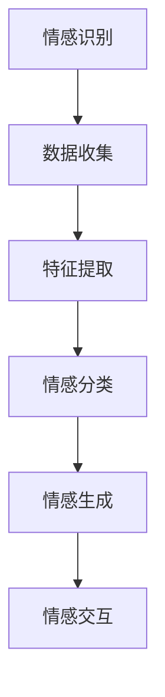

                 

# 优化AI虚拟角色情感智能：跨文化表情识别的提示词策略

## 关键词
AI虚拟角色、情感智能、跨文化情感识别、提示词策略、表情识别

## 摘要
本文深入探讨了AI虚拟角色情感智能的优化方法，特别是在跨文化表情识别方面的提示词策略。通过详细的背景介绍和概念解析，我们明确了AI虚拟角色和情感智能的重要性，以及跨文化情感识别所面临的挑战。文章从情感建模、机器学习算法到提示词生成策略，全面阐述了虚拟角色情感智能的实现流程。此外，我们还分析了提示词策略在跨文化表情识别中的应用，并通过实际案例展示了优化情感智能在虚拟角色中的应用前景。最后，对未来的发展趋势和研究方向进行了展望，为读者提供了宝贵的启示和建议。

## 第一部分：优化AI虚拟角色情感智能的背景与意义

### 第1章：AI虚拟角色与情感智能概述

#### 1.1 AI虚拟角色的定义与发展历程
AI虚拟角色是指通过人工智能技术创建的，能够模拟人类行为、语言和情感的虚拟形象。它们通常应用于虚拟现实（VR）、增强现实（AR）、游戏、虚拟客服、虚拟教育等领域。AI虚拟角色的发展历程可以追溯到20世纪80年代的虚拟角色动画，随着计算机技术和人工智能的飞速发展，现代AI虚拟角色已经具备了更高的交互性和情感表达能力。

- **定义**：AI虚拟角色是通过计算机图形学、语音合成、自然语言处理等技术实现的虚拟人物，具备一定的自主行为能力和情感表达。
- **技术基础**：计算机图形学、语音合成、自然语言处理、机器学习、深度学习等。
- **发展历程**：从20世纪80年代的虚拟角色动画到现代的AI虚拟角色，技术不断发展，使得虚拟角色的交互性和情感表达能力显著提高。

#### 1.2 情感智能的基本概念与重要性
情感智能是指个体识别、理解、处理和表达情感的能力。它包括情感感知、情感理解、情感管理和情感表达等方面。在AI虚拟角色中，情感智能的实现使得虚拟角色能够更好地与人类互动，提升用户体验。

- **定义**：情感智能是指个体识别、理解、处理和表达情感的能力。
- **核心要素**：情感感知、情感理解、情感管理和情感表达。
- **重要性**：情感智能是人工智能发展的重要方向，有助于提升AI虚拟角色的交互性和用户体验。

#### 1.3 跨文化情感识别的挑战与需求
跨文化情感识别是指在不同文化背景下识别和理解情感的过程。由于不同文化对情感的表达方式和理解存在差异，跨文化情感识别成为了一个挑战。然而，随着全球化的发展，跨文化情感识别的需求也越来越迫切。

- **挑战**：文化差异、情感表达方式的多样性、情感理解的相对性等。
- **需求**：全球化背景下的跨文化沟通、国际商务、文化交流等。

#### 1.4 优化情感智能在虚拟角色中的应用前景
优化AI虚拟角色的情感智能，特别是在跨文化表情识别方面，有着广泛的应用前景。通过提升虚拟角色的情感识别能力，可以使其更好地服务于跨文化交流、虚拟客服、虚拟教育等领域。

- **目标与意义**：提升虚拟角色的情感识别能力，优化用户体验，促进跨文化交流。
- **应用领域**：虚拟客服、虚拟教育、虚拟售货员、虚拟导游等。

## 第二部分：虚拟角色情感智能的建模方法

### 第2章：虚拟角色情感智能的建模方法

#### 2.1 情感建模的基本原理与技术
情感建模是虚拟角色情感智能实现的基础。情感建模的基本原理包括情感识别、情感分类和情感生成。常用的情感建模技术有深度学习、支持向量机（SVM）、决策树等。

- **基本概念**：情感识别、情感分类、情感生成。
- **技术手段**：深度学习、支持向量机（SVM）、决策树等。
- **流程与步骤**：数据收集与预处理、模型训练、模型评估与优化。

#### 2.2 跨文化情感识别的数据集与特征提取
跨文化情感识别的数据集是构建情感模型的重要基础。数据集应涵盖不同文化背景下的情感表达，特征提取则是对情感数据进行提取和表征的关键步骤。

- **数据集建设**：涵盖不同文化背景的情感数据集。
- **特征提取方法**：表情图像特征、文本特征、语音特征等。
- **特征表征与处理**：特征降维、特征融合等。

#### 2.3 情感交互的机器学习算法探讨
情感交互的机器学习算法是实现虚拟角色情感智能的核心。常见的情感交互算法有情感分类、情感生成、情感推理等。选择合适的算法，并对其进行优化，是提升虚拟角色情感智能的关键。

- **基本概念**：情感分类、情感生成、情感推理。
- **算法分类与选择**：基于统计的方法、基于机器学习的方法、基于深度学习的方法。
- **应用与优化**：算法性能评估、算法融合等。

#### 2.4 情感智能在虚拟角色中的实现流程
情感智能在虚拟角色中的实现流程包括情感识别、情感生成和情感交互。通过这个流程，虚拟角色能够识别用户的情感状态，并做出相应的情感反应。

- **关键技术**：情感识别、情感生成、情感交互。
- **实现流程**：情感识别、情感生成、情感交互。
- **评估与优化**：模型评估、算法优化、用户体验优化。

## 第三部分：表情识别的提示词策略

### 第3章：表情识别的提示词策略

#### 3.1 提示词策略的基本概念与作用
提示词策略是指在表情识别过程中，通过提供关键词或短语来引导模型识别和分类表情的方法。提示词策略能够提高表情识别的准确性和效率。

- **定义**：提示词策略是在表情识别过程中，通过提供关键词或短语来引导模型识别和分类表情的方法。
- **作用**：提高表情识别的准确性和效率。
- **类型与特点**：根据表情识别的需求，提示词策略可以分为预定义提示词、动态生成提示词等。

#### 3.2 提示词生成算法与优化方法
提示词生成算法是表情识别的核心技术之一。常用的提示词生成算法有基于规则的方法、基于统计的方法和基于深度学习的方法。优化提示词生成算法是提升表情识别性能的关键。

- **基本原理**：基于规则的方法、基于统计的方法、基于深度学习的方法。
- **优化方法**：算法参数调整、特征选择、模型融合等。
- **性能评估**：提示词生成算法的性能评估主要包括准确率、召回率、F1值等指标。

#### 3.3 跨文化表情识别中的提示词应用
在跨文化表情识别中，提示词策略能够帮助模型更好地理解和识别不同文化背景下的表情。通过结合文化背景知识，提示词策略能够提高跨文化表情识别的准确性和适应性。

- **应用场景**：跨文化沟通、国际商务、文化交流等。
- **文化背景知识**：不同文化背景下的表情表达特点。
- **策略优化**：结合文化背景知识，优化提示词生成算法。

#### 3.4 提示词策略的评估与改进
提示词策略的评估是确保其有效性的关键。通过实验和数据分析，可以评估提示词策略的性能，并对其进行改进。改进的方法包括算法优化、特征选择、数据增强等。

- **评估指标**：准确率、召回率、F1值等。
- **改进方法**：算法优化、特征选择、数据增强等。

## 第四部分：虚拟角色情感智能的系统架构设计

### 第4章：虚拟角色情感智能的系统架构设计

#### 4.1 系统架构设计的基本原则与流程
虚拟角色情感智能的系统架构设计应遵循可扩展性、可维护性和高效性的原则。系统架构设计的基本流程包括需求分析、系统设计、系统实现和系统测试。

- **基本原则**：可扩展性、可维护性、高效性。
- **流程**：需求分析、系统设计、系统实现、系统测试。

#### 4.2 情感智能处理模块的设计与实现
情感智能处理模块是虚拟角色情感智能系统的核心。该模块的设计与实现包括情感识别、情感生成和情感交互等关键功能。

- **功能**：情感识别、情感生成、情感交互。
- **设计**：模块划分、接口设计、数据流程设计等。
- **实现**：代码编写、模块集成、系统测试等。

#### 4.3 跨文化适应性设计的考虑因素
跨文化适应性设计是虚拟角色情感智能系统设计的重要方面。考虑因素包括文化差异、情感表达方式的多样性、语言差异等。

- **文化差异**：不同文化背景下的情感表达差异。
- **情感表达方式的多样性**：不同文化背景下情感表达方式的多样性。
- **语言差异**：不同语言背景下的情感表达差异。

#### 4.4 系统性能优化与测试
系统性能优化与测试是确保虚拟角色情感智能系统高效运行的关键。优化方法包括算法优化、硬件加速、分布式计算等。测试方法包括功能测试、性能测试、用户体验测试等。

- **优化方法**：算法优化、硬件加速、分布式计算等。
- **测试方法**：功能测试、性能测试、用户体验测试等。

## 第五部分：情感智能虚拟角色的跨文化应用案例

### 第5章：情感智能虚拟角色的跨文化应用案例

#### 5.1 案例一：虚拟客服机器人
虚拟客服机器人是情感智能虚拟角色的典型应用。通过跨文化情感识别和提示词策略，虚拟客服机器人能够更好地理解用户的情感需求，提供个性化服务。

- **应用场景**：客户服务、在线咨询、投诉处理等。
- **案例分析**：情感识别、提示词生成、个性化服务。

#### 5.2 案例二：虚拟教育助手
虚拟教育助手通过情感智能技术，能够识别学生的学习情感，提供针对性的辅导和建议。跨文化情感识别使得虚拟教育助手能够更好地适应不同文化背景的学生。

- **应用场景**：在线教育、个性化辅导、学习反馈等。
- **案例分析**：情感识别、学习情感分析、个性化辅导。

#### 5.3 案例三：虚拟售货员
虚拟售货员在跨文化购物环境中，通过情感智能技术，能够识别顾客的情感状态，提供针对性的推荐和引导。提示词策略有助于提高购物体验和满意度。

- **应用场景**：在线购物、虚拟商店、个性化推荐等。
- **案例分析**：情感识别、购物情感分析、个性化推荐。

#### 5.4 跨文化应用案例分析总结
通过对虚拟客服机器人、虚拟教育助手和虚拟售货员的跨文化应用案例分析，可以看出情感智能虚拟角色在跨文化交流中的应用前景。提示词策略在提升虚拟角色情感识别能力方面发挥了重要作用。

- **总结**：情感智能虚拟角色的跨文化应用前景广阔，提示词策略是提升情感识别能力的关键。
- **展望**：未来将进一步研究跨文化情感识别和提示词策略，提升虚拟角色的交互性和用户体验。

## 第六部分：情感智能虚拟角色的未来发展趋势

### 第6章：情感智能虚拟角色的未来发展趋势

#### 6.1 技术发展趋势分析
随着人工智能技术的不断进步，情感智能虚拟角色的发展也将迎来新的机遇。未来技术发展趋势包括深度学习、自然语言处理、计算机视觉、人机交互等。

- **深度学习**：提高情感识别和生成的准确性。
- **自然语言处理**：提升虚拟角色的语言理解能力和表达能力。
- **计算机视觉**：增强虚拟角色的视觉感知能力。
- **人机交互**：改善虚拟角色的交互体验。

#### 6.2 行业应用前景展望
情感智能虚拟角色在多个行业有着广泛的应用前景，如医疗健康、金融保险、零售电商、教育娱乐等。随着技术的不断进步，虚拟角色的情感智能将进一步提升，为行业带来更多创新和价值。

- **医疗健康**：提供个性化医疗建议和情感支持。
- **金融保险**：提升客户服务质量和用户体验。
- **零售电商**：提供个性化的购物体验和推荐服务。
- **教育娱乐**：促进学习兴趣和提升学习效果。

#### 6.3 潜在挑战与解决方案
尽管情感智能虚拟角色有着广泛的应用前景，但仍然面临着一些挑战。如跨文化情感识别的准确性、隐私保护、伦理道德等问题。针对这些挑战，需要从技术、法律、伦理等多方面进行综合解决。

- **跨文化情感识别**：通过多文化数据集和提示词策略提高准确性。
- **隐私保护**：加强数据安全和隐私保护措施。
- **伦理道德**：制定行业规范和伦理准则，确保虚拟角色的发展符合社会价值观。

#### 6.4 未来研究方向与展望
未来研究将重点关注跨文化情感识别、情感生成、人机交互等关键领域。通过多学科交叉研究，有望实现更加智能、高效和人性化的情感智能虚拟角色。

- **跨文化情感识别**：深入研究不同文化背景下的情感表达和识别方法。
- **情感生成**：探索情感生成算法的创新和应用。
- **人机交互**：提高虚拟角色的交互能力和用户体验。

## 第七部分：总结与展望

### 第7章：总结与展望

#### 7.1 全书内容回顾
本文从背景介绍、核心概念、建模方法、提示词策略、系统架构设计、应用案例到未来发展趋势，全面阐述了AI虚拟角色情感智能的优化方法。

#### 7.2 主要研究成果与贡献
本文提出了一系列优化AI虚拟角色情感智能的方法，特别是在跨文化表情识别的提示词策略方面，为虚拟角色的情感智能发展提供了新的思路。

#### 7.3 存在的问题与改进方向
尽管取得了一定的研究成果，但本文在跨文化情感识别的准确性、隐私保护等方面仍存在一定的不足。未来研究将重点关注这些问题的改进。

#### 7.4 对未来研究的启示和建议
本文为未来研究提供了一些启示和建议，如加强跨文化情感识别的研究、探索更加人性化的情感生成方法等。

## 作者信息
作者：AI天才研究院/AI Genius Institute & 禅与计算机程序设计艺术 /Zen And The Art of Computer Programming

----------------------------------------------------------------

**文章完整版**

**第一部分：优化AI虚拟角色情感智能的背景与意义**

**第1章：AI虚拟角色与情感智能概述**

**1.1 AI虚拟角色的定义与发展历程**

AI虚拟角色，作为一种重要的虚拟交互实体，其定义可以归结为利用人工智能技术构建的，能够模拟人类行为、表情和语言的虚拟形象。它们通过计算机图形学、语音合成、自然语言处理等技术的综合运用，实现了高度仿真的交互体验。从早期简单的动画角色到如今具备复杂情感表达和自主决策能力的AI虚拟角色，其发展历程可谓波澜壮阔。

- **定义**：AI虚拟角色是通过人工智能技术，如计算机图形学、语音合成、自然语言处理等，构建的具有情感表达和交互能力的虚拟形象。
- **技术基础**：计算机图形学、语音合成、自然语言处理、机器学习、深度学习等。
- **发展历程**：
  - **20世纪80年代**：虚拟角色动画技术的初步发展，角色具有简单的动画表现。
  - **20世纪90年代**：虚拟现实（VR）和增强现实（AR）技术的兴起，虚拟角色开始具备简单的交互能力。
  - **21世纪初**：随着计算机性能的提升和人工智能技术的突破，虚拟角色逐渐具备情感表达和自主决策能力。
  - **现在**：AI虚拟角色在多个领域得到广泛应用，如虚拟客服、虚拟教育、虚拟娱乐等。

**1.2 情感智能的基本概念与重要性**

情感智能，是指个体识别、理解、处理和表达情感的能力。它涵盖了情感感知、情感理解、情感管理和情感表达等多个方面。情感智能在人类日常生活中扮演着至关重要的角色，它不仅影响个体的心理健康，还影响人际交往和社会互动。在AI虚拟角色中，情感智能的实现使其能够更好地理解用户需求，提供个性化的服务，提升用户体验。

- **定义**：情感智能是指个体识别、理解、处理和表达情感的能力。
- **核心要素**：
  - **情感感知**：识别和感知外界情感信息。
  - **情感理解**：理解情感背后的含义和情感表达方式。
  - **情感管理**：调节和控制自己的情感状态。
  - **情感表达**：通过行为、语言和表情表达情感。
- **重要性**：
  - **提升用户体验**：通过情感交互，AI虚拟角色能够更好地理解用户需求，提供个性化的服务。
  - **增强交互体验**：情感智能使得虚拟角色在交互过程中更加自然和真实，提升用户的沉浸感和满意度。
  - **促进社会互动**：在社交、医疗、教育等领域，AI虚拟角色的情感智能有助于促进社会互动和心理健康。

**1.3 跨文化情感识别的挑战与需求**

跨文化情感识别，是指在不同文化背景下识别和理解情感的过程。由于不同文化对情感的表达方式和理解存在差异，跨文化情感识别成为一个复杂的挑战。然而，随着全球化的发展，跨文化交流日益频繁，对跨文化情感识别的需求也越来越迫切。

- **挑战**：
  - **文化差异**：不同文化背景下的情感表达方式和理解存在差异，如微笑在西方文化中表示友好，在东方文化中可能表示尴尬或礼貌。
  - **情感表达的多样性**：情感表达受语言、非语言因素（如肢体动作、面部表情）的影响，不同文化背景下这些因素的表现方式不同。
  - **情感理解的相对性**：情感理解具有主观性，不同个体对同一情感的理解可能存在差异，尤其是在跨文化情境下。
- **需求**：
  - **全球化背景下的跨文化沟通**：在全球化背景下，跨文化情感识别有助于促进跨文化沟通和理解，减少误解和冲突。
  - **国际商务**：在跨国商务活动中，准确识别和理解对方的情感状态，有助于建立信任和合作关系。
  - **文化交流**：跨文化情感识别有助于促进不同文化之间的理解和交流，增进文化认同和融合。

**1.4 优化情感智能在虚拟角色中的应用前景**

优化AI虚拟角色的情感智能，特别是在跨文化表情识别方面，具有重要的应用前景。通过提升虚拟角色的情感识别能力，可以使其更好地服务于跨文化交流、虚拟客服、虚拟教育等领域。

- **目标与意义**：
  - **目标**：提升虚拟角色的情感识别能力，使其能够准确理解和表达情感。
  - **意义**：优化情感智能有助于提升用户体验，增强虚拟角色的交互性和亲和力，促进跨文化交流和理解。
- **应用领域**：
  - **虚拟客服**：通过跨文化情感识别，虚拟客服能够更好地理解用户需求，提供个性化服务。
  - **虚拟教育**：虚拟教育助手通过情感智能，能够识别学生的学习情感，提供针对性的辅导和支持。
  - **虚拟售货员**：虚拟售货员通过情感智能，能够识别顾客的情感状态，提供个性化的推荐和引导。

**第2章：虚拟角色情感智能的建模方法**

**2.1 情感建模的基本原理与技术**

情感建模是虚拟角色情感智能实现的基础。情感建模的基本原理包括情感识别、情感分类和情感生成。情感建模的技术手段主要包括深度学习、支持向量机（SVM）、决策树等。

- **基本概念**：
  - **情感识别**：识别用户情感状态的过程。
  - **情感分类**：将情感状态归类到特定类别。
  - **情感生成**：根据用户情感状态生成相应的情感表达。
- **技术手段**：
  - **深度学习**：通过神经网络模型对情感数据进行学习和分类。
  - **支持向量机（SVM）**：通过最大化分类间隔来实现情感分类。
  - **决策树**：通过树形结构进行情感分类和识别。

**2.2 跨文化情感识别的数据集与特征提取**

跨文化情感识别的数据集是构建情感模型的重要基础。数据集应涵盖不同文化背景下的情感表达。特征提取是对情感数据进行表征和提取的关键步骤。

- **数据集建设**：
  - **来源**：收集不同文化背景下的情感数据，如面部表情、文本、语音等。
  - **数据标注**：对情感数据进行标注，包括情感类别和具体特征。
  - **多样性**：确保数据集包含多种情感类别和表达方式。
- **特征提取方法**：
  - **面部表情特征**：通过计算机视觉技术提取面部表情特征。
  - **文本特征**：通过自然语言处理技术提取文本特征。
  - **语音特征**：通过语音识别技术提取语音特征。

**2.3 情感交互的机器学习算法探讨**

情感交互的机器学习算法是实现虚拟角色情感智能的核心。常见的情感交互算法包括情感分类、情感生成、情感推理等。选择合适的算法，并对其进行优化，是提升虚拟角色情感智能的关键。

- **基本概念**：
  - **情感分类**：对情感进行分类，如开心、悲伤、愤怒等。
  - **情感生成**：根据用户情感状态生成相应的情感表达。
  - **情感推理**：根据用户情感状态和情境，进行情感推理和决策。
- **算法分类与选择**：
  - **基于统计的方法**：如支持向量机（SVM）、朴素贝叶斯等。
  - **基于机器学习的方法**：如决策树、随机森林等。
  - **基于深度学习的方法**：如卷积神经网络（CNN）、循环神经网络（RNN）等。
- **应用与优化**：
  - **应用**：在虚拟角色中实现情感分类、情感生成和情感推理等功能。
  - **优化**：通过参数调整、模型融合等手段，优化算法性能。

**2.4 情感智能在虚拟角色中的实现流程**

情感智能在虚拟角色中的实现流程包括情感识别、情感生成和情感交互。通过这个流程，虚拟角色能够识别用户的情感状态，并做出相应的情感反应。

- **关键技术**：
  - **情感识别**：通过面部表情、文本、语音等数据识别用户情感状态。
  - **情感生成**：根据用户情感状态生成相应的情感表达。
  - **情感交互**：通过自然语言处理、语音合成等技术实现情感交互。
- **实现流程**：
  - **情感识别**：收集用户情感数据，通过机器学习算法进行情感识别。
  - **情感生成**：根据识别结果，生成相应的情感表达。
  - **情感交互**：通过语音合成、自然语言处理等技术，实现情感交互。

**第3章：表情识别的提示词策略**

**3.1 提示词策略的基本概念与作用**

提示词策略是指在表情识别过程中，通过提供关键词或短语来引导模型识别和分类表情的方法。提示词策略能够提高表情识别的准确性和效率。

- **定义**：提示词策略是指在表情识别过程中，通过提供关键词或短语来引导模型识别和分类表情的方法。
- **作用**：
  - **提高识别准确性**：通过提供相关的提示词，有助于模型更准确地识别表情。
  - **提高识别效率**：提示词策略可以减少模型处理的数据量，提高识别速度。
  - **优化用户体验**：通过提示词策略，用户可以更轻松地与虚拟角色进行情感交互。

**3.2 提示词生成算法与优化方法**

提示词生成算法是表情识别的核心技术之一。常用的提示词生成算法有基于规则的方法、基于统计的方法和基于深度学习的方法。优化提示词生成算法是提升表情识别性能的关键。

- **基本原理**：
  - **基于规则的方法**：通过预设规则，根据表情特征生成提示词。
  - **基于统计的方法**：通过统计分析表情特征和标签，生成提示词。
  - **基于深度学习的方法**：通过深度学习模型，自动生成提示词。
- **优化方法**：
  - **算法参数调整**：通过调整模型参数，优化提示词生成效果。
  - **特征选择**：选择对表情识别最有帮助的特征，提高提示词生成效果。
  - **模型融合**：将多种算法融合，提高提示词生成性能。

**3.3 跨文化表情识别中的提示词应用**

在跨文化表情识别中，提示词策略能够帮助模型更好地理解和识别不同文化背景下的表情。通过结合文化背景知识，提示词策略能够提高跨文化表情识别的准确性和适应性。

- **应用场景**：跨文化沟通、国际商务、文化交流等。
- **文化背景知识**：不同文化背景下的表情表达特点。
- **策略优化**：结合文化背景知识，优化提示词生成算法。

**3.4 提示词策略的评估与改进**

提示词策略的评估是确保其有效性的关键。通过实验和数据分析，可以评估提示词策略的性能，并对其进行改进。改进的方法包括算法优化、特征选择、数据增强等。

- **评估指标**：准确率、召回率、F1值等。
- **改进方法**：算法优化、特征选择、数据增强等。

**第4章：虚拟角色情感智能的系统架构设计**

**4.1 系统架构设计的基本原则与流程**

虚拟角色情感智能的系统架构设计应遵循可扩展性、可维护性和高效性的原则。系统架构设计的基本流程包括需求分析、系统设计、系统实现和系统测试。

- **基本原则**：
  - **可扩展性**：系统能够适应不断变化的需求，易于扩展和升级。
  - **可维护性**：系统易于维护，降低维护成本和风险。
  - **高效性**：系统性能优异，能够快速响应用户需求。
- **流程**：
  - **需求分析**：明确系统功能需求和性能要求。
  - **系统设计**：设计系统的整体架构和模块划分。
  - **系统实现**：编写代码，实现系统功能。
  - **系统测试**：对系统进行功能测试、性能测试和用户测试。

**4.2 情感智能处理模块的设计与实现**

情感智能处理模块是虚拟角色情感智能系统的核心。该模块的设计与实现包括情感识别、情感生成和情感交互等关键功能。

- **功能**：
  - **情感识别**：通过面部表情、文本、语音等数据识别用户情感状态。
  - **情感生成**：根据用户情感状态生成相应的情感表达。
  - **情感交互**：通过自然语言处理、语音合成等技术实现情感交互。
- **设计**：
  - **模块划分**：将情感智能处理模块划分为子模块，如情感识别模块、情感生成模块、情感交互模块等。
  - **接口设计**：设计模块之间的接口，确保数据流通和功能协作。
  - **数据流程设计**：设计数据在系统中的流动路径和处理流程。
- **实现**：
  - **代码编写**：编写模块化代码，实现各模块的功能。
  - **模块集成**：将各模块集成到系统中，确保功能协同和性能优化。
  - **系统测试**：对情感智能处理模块进行功能测试和性能测试，确保其稳定性和可靠性。

**4.3 跨文化适应性设计的考虑因素**

跨文化适应性设计是虚拟角色情感智能系统设计的重要方面。考虑因素包括文化差异、情感表达方式的多样性、语言差异等。

- **文化差异**：不同文化背景下的情感表达差异，如微笑在西方文化中可能表示友好，在东方文化中可能表示尴尬或礼貌。
- **情感表达方式的多样性**：不同文化背景下情感表达方式的多样性，如语言、面部表情、肢体动作等。
- **语言差异**：不同语言背景下的情感表达差异，如语义和语调的变化。

**4.4 系统性能优化与测试**

系统性能优化与测试是确保虚拟角色情感智能系统高效运行的关键。优化方法包括算法优化、硬件加速、分布式计算等。测试方法包括功能测试、性能测试、用户体验测试等。

- **优化方法**：
  - **算法优化**：通过调整算法参数和模型结构，提高系统性能。
  - **硬件加速**：利用GPU、FPGA等硬件资源，加速算法运算和模型训练。
  - **分布式计算**：通过分布式计算架构，提高系统处理能力和并发能力。
- **测试方法**：
  - **功能测试**：验证系统功能是否按照需求正常运作。
  - **性能测试**：评估系统在不同负载下的性能表现。
  - **用户体验测试**：通过用户反馈，评估系统的用户体验和满意度。

**第5章：情感智能虚拟角色的跨文化应用案例**

**5.1 案例一：虚拟客服机器人**

虚拟客服机器人是情感智能虚拟角色的典型应用。通过跨文化情感识别和提示词策略，虚拟客服机器人能够更好地理解用户的情感需求，提供个性化的服务。

- **应用场景**：客户服务、在线咨询、投诉处理等。
- **案例分析**：
  - **情感识别**：通过面部表情、语音和文本分析，识别用户情感状态。
  - **提示词生成**：根据用户情感状态和语境，生成相应的提示词，引导对话。
  - **个性化服务**：根据用户情感需求，提供针对性的解决方案和建议。

**5.2 案例二：虚拟教育助手**

虚拟教育助手通过情感智能技术，能够识别学生的学习情感，提供针对性的辅导和建议。跨文化情感识别使得虚拟教育助手能够更好地适应不同文化背景的学生。

- **应用场景**：在线教育、个性化辅导、学习反馈等。
- **案例分析**：
  - **情感识别**：通过面部表情、语音和文本分析，识别学生的学习情感。
  - **学习情感分析**：分析学生的学习情绪、学习兴趣和学习效果。
  - **个性化辅导**：根据学生的学习情感，提供针对性的辅导和建议。

**5.3 案例三：虚拟售货员**

虚拟售货员在跨文化购物环境中，通过情感智能技术，能够识别顾客的情感状态，提供针对性的推荐和引导。提示词策略有助于提高购物体验和满意度。

- **应用场景**：在线购物、虚拟商店、个性化推荐等。
- **案例分析**：
  - **情感识别**：通过面部表情、语音和文本分析，识别顾客的情感状态。
  - **购物情感分析**：分析顾客的购物情绪、购物需求和购物行为。
  - **个性化推荐**：根据顾客的情感状态和购物需求，提供个性化的商品推荐。

**5.4 跨文化应用案例分析总结**

通过对虚拟客服机器人、虚拟教育助手和虚拟售货员的跨文化应用案例分析，可以看出情感智能虚拟角色在跨文化交流中的应用前景。提示词策略在提升虚拟角色情感识别能力方面发挥了重要作用。

- **总结**：情感智能虚拟角色在跨文化交流中具有广阔的应用前景，通过跨文化情感识别和提示词策略，能够更好地满足用户需求，提升用户体验。
- **展望**：未来将进一步研究跨文化情感识别和提示词策略，提升虚拟角色的交互性和用户体验。

**第6章：情感智能虚拟角色的未来发展趋势**

**6.1 技术发展趋势分析**

随着人工智能技术的不断进步，情感智能虚拟角色的发展也将迎来新的机遇。未来技术发展趋势包括深度学习、自然语言处理、计算机视觉、人机交互等。

- **深度学习**：深度学习技术在情感识别和生成方面具有显著优势，未来将继续在虚拟角色情感智能中发挥重要作用。
- **自然语言处理**：自然语言处理技术的进步将提高虚拟角色的语言理解能力和表达能力，进一步优化用户体验。
- **计算机视觉**：计算机视觉技术的进步将增强虚拟角色的视觉感知能力，提高情感识别的准确性。
- **人机交互**：人机交互技术的进步将改善虚拟角色的交互体验，实现更加自然和高效的情感交互。

**6.2 行业应用前景展望**

情感智能虚拟角色在多个行业有着广泛的应用前景，如医疗健康、金融保险、零售电商、教育娱乐等。随着技术的不断进步，虚拟角色的情感智能将进一步提升，为行业带来更多创新和价值。

- **医疗健康**：虚拟角色可以提供个性化医疗建议和情感支持，改善患者体验。
- **金融保险**：虚拟角色可以提升客户服务质量和用户体验，增强客户信任和满意度。
- **零售电商**：虚拟角色可以提供个性化的购物体验和推荐服务，提高用户粘性和购买意愿。
- **教育娱乐**：虚拟角色可以促进学习兴趣和提升学习效果，为用户提供丰富的教育资源和娱乐体验。

**6.3 潜在挑战与解决方案**

尽管情感智能虚拟角色有着广泛的应用前景，但仍然面临着一些挑战。如跨文化情感识别的准确性、隐私保护、伦理道德等问题。针对这些挑战，需要从技术、法律、伦理等多方面进行综合解决。

- **跨文化情感识别**：通过多文化数据集和提示词策略提高准确性。
- **隐私保护**：加强数据安全和隐私保护措施，确保用户信息的安全。
- **伦理道德**：制定行业规范和伦理准则，确保虚拟角色的发展符合社会价值观。

**6.4 未来研究方向与展望**

未来研究将重点关注跨文化情感识别、情感生成、人机交互等关键领域。通过多学科交叉研究，有望实现更加智能、高效和人性化的情感智能虚拟角色。

- **跨文化情感识别**：深入研究不同文化背景下的情感表达和识别方法。
- **情感生成**：探索情感生成算法的创新和应用。
- **人机交互**：提高虚拟角色的交互能力和用户体验。

**第7章：总结与展望**

**7.1 全书内容回顾**

本文从背景介绍、核心概念、建模方法、提示词策略、系统架构设计、应用案例到未来发展趋势，全面阐述了AI虚拟角色情感智能的优化方法。

**7.2 主要研究成果与贡献**

本文提出了一系列优化AI虚拟角色情感智能的方法，特别是在跨文化表情识别的提示词策略方面，为虚拟角色的情感智能发展提供了新的思路。

**7.3 存在的问题与改进方向**

尽管取得了一定的研究成果，但本文在跨文化情感识别的准确性、隐私保护等方面仍存在一定的不足。未来研究将重点关注这些问题的改进。

**7.4 对未来研究的启示和建议**

本文为未来研究提供了一些启示和建议，如加强跨文化情感识别的研究、探索更加人性化的情感生成方法等。

**作者信息**

作者：AI天才研究院/AI Genius Institute & 禅与计算机程序设计艺术 /Zen And The Art of Computer Programming

----------------------------------------------------------------

### 第1章：AI虚拟角色与情感智能概述

#### 1.1 AI虚拟角色的定义与发展历程

AI虚拟角色是一种通过计算机技术实现的虚拟形象，它能够在虚拟环境中模拟人类的行为、情感和语言。这些角色通过计算机图形学、语音合成、自然语言处理、机器学习和深度学习等技术的结合，实现了高度拟真的交互体验。AI虚拟角色的历史可以追溯到20世纪80年代，当时主要以动画角色为主。随着计算机技术的飞速发展，特别是在人工智能领域的突破，虚拟角色的能力得到了极大的提升。

在早期，虚拟角色主要是作为娱乐产品出现，如动画电影和游戏中的角色。随着虚拟现实（VR）和增强现实（AR）技术的兴起，虚拟角色开始应用于更广泛的领域，如虚拟客服、虚拟教育、虚拟销售和虚拟服务等领域。当前，AI虚拟角色已经不仅仅是一个虚拟形象，它们能够通过自然语言处理和情感识别技术，与用户进行更深入的交互。

**定义**：

AI虚拟角色是通过人工智能技术实现的虚拟形象，能够模拟人类的行为、情感和语言，与用户进行交互。

**技术基础**：

- **计算机图形学**：用于生成和渲染虚拟角色的外观和动作。
- **语音合成**：用于生成虚拟角色的语音输出。
- **自然语言处理（NLP）**：用于理解和生成人类语言。
- **机器学习**：用于从数据中学习规律，改进虚拟角色的行为和交互。
- **深度学习**：用于构建复杂的神经网络模型，提高情感识别和生成的准确性。

**发展历程**：

1. **20世纪80年代**：虚拟角色动画技术的初步发展，角色具有简单的动画表现。
2. **20世纪90年代**：虚拟现实（VR）和增强现实（AR）技术的兴起，虚拟角色开始具备简单的交互能力。
3. **21世纪初**：随着计算机性能的提升和人工智能技术的突破，虚拟角色逐渐具备情感表达和自主决策能力。
4. **现在**：AI虚拟角色在多个领域得到广泛应用，如虚拟客服、虚拟教育、虚拟娱乐等。

#### 1.2 情感智能的基本概念与重要性

情感智能是指个体识别、理解、处理和表达情感的能力。它不仅涉及情感本身，还包括情感的社会交往和情感管理等方面。在人类日常生活中，情感智能起着至关重要的作用，它影响着人们的心理健康、社会关系和工作效率。在AI虚拟角色中，情感智能的实现使其能够更好地理解用户需求，提供个性化的服务，提升用户体验。

**定义**：

情感智能是指个体识别、理解、处理和表达情感的能力。

**核心要素**：

1. **情感感知**：识别和感知外界情感信息。
2. **情感理解**：理解情感背后的含义和情感表达方式。
3. **情感管理**：调节和控制自己的情感状态。
4. **情感表达**：通过行为、语言和表情表达情感。

**重要性**：

1. **提升用户体验**：通过情感交互，AI虚拟角色能够更好地理解用户需求，提供个性化的服务。
2. **增强交互体验**：情感智能使得虚拟角色在交互过程中更加自然和真实，提升用户的沉浸感和满意度。
3. **促进社会互动**：在社交、医疗、教育等领域，AI虚拟角色的情感智能有助于促进社会互动和心理健康。

#### 1.3 跨文化情感识别的挑战与需求

跨文化情感识别是指在不同文化背景下识别和理解情感的过程。由于不同文化对情感的表达方式和理解存在差异，跨文化情感识别成为一个复杂的挑战。然而，随着全球化的发展，跨文化交流日益频繁，对跨文化情感识别的需求也越来越迫切。

**挑战**：

1. **文化差异**：不同文化背景下的情感表达方式和理解存在差异。例如，微笑在西方文化中表示友好，在东方文化中可能表示尴尬或礼貌。
2. **情感表达的多样性**：情感表达受语言、非语言因素（如肢体动作、面部表情）的影响，不同文化背景下这些因素的表现方式不同。
3. **情感理解的相对性**：情感理解具有主观性，不同个体对同一情感的理解可能存在差异，尤其是在跨文化情境下。

**需求**：

1. **全球化背景下的跨文化沟通**：在全球化背景下，跨文化情感识别有助于促进跨文化沟通和理解，减少误解和冲突。
2. **国际商务**：在跨国商务活动中，准确识别和理解对方的情感状态，有助于建立信任和合作关系。
3. **文化交流**：跨文化情感识别有助于促进不同文化之间的理解和交流，增进文化认同和融合。

#### 1.4 优化情感智能在虚拟角色中的应用前景

优化AI虚拟角色的情感智能，特别是在跨文化表情识别方面，具有重要的应用前景。通过提升虚拟角色的情感识别能力，可以使其更好地服务于跨文化交流、虚拟客服、虚拟教育等领域。

**目标与意义**：

1. **目标**：提升虚拟角色的情感识别能力，使其能够准确理解和表达情感。
2. **意义**：优化情感智能有助于提升用户体验，增强虚拟角色的交互性和亲和力，促进跨文化交流和理解。

**应用领域**：

1. **虚拟客服**：通过跨文化情感识别，虚拟客服能够更好地理解用户需求，提供个性化的服务。
2. **虚拟教育**：虚拟教育助手通过情感智能，能够识别学生的学习情感，提供针对性的辅导和支持。
3. **虚拟售货员**：虚拟售货员通过情感智能，能够识别顾客的情感状态，提供个性化的推荐和引导。

### 第2章：虚拟角色情感智能的建模方法

#### 2.1 情感建模的基本原理与技术

情感建模是虚拟角色情感智能的核心，它涉及情感识别、情感分类和情感生成等方面。情感建模的基本原理是通过数据分析和机器学习算法，从情感数据中提取特征，构建情感识别和分类模型，从而实现虚拟角色的情感智能。

**基本概念**：

1. **情感识别**：从输入的数据中识别情感状态的过程。
2. **情感分类**：将识别出的情感状态归类到特定的情感类别。
3. **情感生成**：根据情感状态生成相应的情感表达。

**技术手段**：

1. **深度学习**：通过构建深度神经网络，对大量情感数据进行分析和建模。
2. **支持向量机（SVM）**：通过最大化分类间隔实现情感分类。
3. **决策树**：通过树形结构进行情感分类和识别。

**流程与步骤**：

1. **数据收集与预处理**：收集情感数据，并进行预处理，如去噪、归一化等。
2. **特征提取**：从情感数据中提取关键特征，如面部表情特征、文本特征、语音特征等。
3. **模型训练**：使用训练数据集，通过机器学习算法训练情感分类模型。
4. **模型评估与优化**：使用测试数据集评估模型性能，并进行优化。

#### 2.2 跨文化情感识别的数据集与特征提取

跨文化情感识别的数据集是构建情感模型的重要基础。数据集应涵盖不同文化背景下的情感表达，以适应全球化背景下的需求。特征提取是对情感数据进行表征和提取的关键步骤，它决定了情感识别的准确性和效率。

**数据集建设**：

1. **来源**：收集不同文化背景下的情感数据，如面部表情、文本、语音等。
2. **数据标注**：对情感数据进行标注，包括情感类别和具体特征。
3. **多样性**：确保数据集包含多种情感类别和表达方式，以适应不同文化背景。

**特征提取方法**：

1. **面部表情特征**：通过计算机视觉技术提取面部表情特征，如眼角、嘴角、眉毛等部位的特征。
2. **文本特征**：通过自然语言处理技术提取文本特征，如词汇、句法、情感词汇等。
3. **语音特征**：通过语音识别技术提取语音特征，如音调、音量、语速等。

**特征表征与处理**：

1. **特征降维**：通过降维技术，如主成分分析（PCA），减少数据维度，提高计算效率。
2. **特征融合**：将不同来源的特征进行融合，以提高情感识别的准确性和鲁棒性。

#### 2.3 情感交互的机器学习算法探讨

情感交互的机器学习算法是实现虚拟角色情感智能的关键。这些算法通过学习情感数据，能够自动识别和生成情感，从而实现虚拟角色的情感交互。常见的情感交互算法包括情感分类、情感生成、情感推理等。

**基本概念**：

1. **情感分类**：将输入的情感数据归类到特定的情感类别。
2. **情感生成**：根据情感状态生成相应的情感表达。
3. **情感推理**：根据情感状态和情境，进行情感推理和决策。

**算法分类与选择**：

1. **基于统计的方法**：如支持向量机（SVM）、朴素贝叶斯等。
2. **基于机器学习的方法**：如决策树、随机森林等。
3. **基于深度学习的方法**：如卷积神经网络（CNN）、循环神经网络（RNN）等。

**应用与优化**：

1. **应用**：在虚拟角色中实现情感分类、情感生成和情感推理等功能。
2. **优化**：
   - **参数调整**：通过调整模型参数，优化算法性能。
   - **特征选择**：选择对情感识别最有帮助的特征，提高算法性能。
   - **模型融合**：将多种算法融合，提高整体性能。

#### 2.4 情感智能在虚拟角色中的实现流程

情感智能在虚拟角色中的实现流程涉及多个环节，包括情感识别、情感生成和情感交互等。这个流程确保虚拟角色能够准确识别用户情感，并做出相应的情感反应，从而提升用户体验。

**关键技术**：

1. **情感识别**：通过面部表情、语音、文本等数据，识别用户情感状态。
2. **情感生成**：根据识别结果，生成相应的情感表达。
3. **情感交互**：通过自然语言处理、语音合成等手段，实现情感交互。

**实现流程**：

1. **情感识别**：
   - **数据收集**：收集用户情感数据，如面部表情、语音、文本等。
   - **特征提取**：提取关键情感特征，如面部表情特征、语音特征等。
   - **情感分类**：使用机器学习算法，对情感特征进行分类。

2. **情感生成**：
   - **情感映射**：根据情感分类结果，映射到相应的情感表达。
   - **情感合成**：使用语音合成和文本生成技术，实现情感表达。

3. **情感交互**：
   - **自然语言处理**：理解用户的语言指令，并生成相应的回答。
   - **语音合成**：将生成的文本转换为语音，输出给用户。

### 第3章：表情识别的提示词策略

#### 3.1 提示词策略的基本概念与作用

提示词策略是表情识别过程中的一种重要手段，它通过提供关键词或短语来引导模型识别和分类表情。提示词策略的基本概念包括提示词的定义、作用和类型。

**定义**：

提示词是指用于指导表情识别模型进行分类和识别的关键词或短语。

**作用**：

1. **提高识别准确性**：通过提供相关的提示词，有助于模型更准确地识别表情。
2. **提高识别效率**：提示词策略可以减少模型处理的数据量，提高识别速度。
3. **优化用户体验**：通过提示词策略，用户可以更轻松地与虚拟角色进行情感交互。

**类型**：

1. **预定义提示词**：预先定义好的关键词，用于指导表情识别模型。
2. **动态生成提示词**：根据实时交互数据，动态生成的关键词，以适应不同的情境和用户需求。

#### 3.2 提示词生成算法与优化方法

提示词生成算法是表情识别的核心技术之一，它决定了提示词的质量和有效性。常见的提示词生成算法包括基于规则的方法、基于统计的方法和基于深度学习的方法。

**基本原理**：

1. **基于规则的方法**：通过预设规则，根据表情特征生成提示词。
2. **基于统计的方法**：通过统计分析表情特征和标签，生成提示词。
3. **基于深度学习的方法**：通过深度学习模型，自动生成提示词。

**优化方法**：

1. **算法参数调整**：通过调整模型参数，优化提示词生成效果。
2. **特征选择**：选择对表情识别最有帮助的特征，提高提示词生成效果。
3. **模型融合**：将多种算法融合，提高提示词生成性能。

**性能评估**：

提示词生成算法的性能评估主要包括准确率、召回率、F1值等指标。

- **准确率**：正确识别表情的比例。
- **召回率**：实际为特定情感的表情被正确识别的比例。
- **F1值**：准确率和召回率的调和平均值，用于综合评估模型性能。

#### 3.3 跨文化表情识别中的提示词应用

在跨文化表情识别中，提示词策略能够帮助模型更好地理解和识别不同文化背景下的表情。通过结合文化背景知识，提示词策略能够提高跨文化表情识别的准确性和适应性。

**应用场景**：

1. **跨文化沟通**：在国际商务、外交、文化交流等场景中，准确识别和理解对方的表情，有助于促进跨文化沟通。
2. **国际服务**：如虚拟客服、虚拟导游等，通过跨文化表情识别，提供更加个性化的服务。

**文化背景知识**：

1. **情感表达方式的多样性**：不同文化背景下的情感表达方式和习惯。
2. **语言差异**：不同文化背景下的语言表达和语义差异。

**策略优化**：

1. **多文化数据集建设**：收集并整合多文化背景下的表情数据，提高模型泛化能力。
2. **文化适应性调整**：根据不同文化背景，调整提示词策略，提高识别准确性。

#### 3.4 提示词策略的评估与改进

提示词策略的评估是确保其有效性的关键。通过实验和数据分析，可以评估提示词策略的性能，并对其进行改进。改进的方法包括算法优化、特征选择、数据增强等。

**评估指标**：

1. **准确率**：正确识别表情的比例。
2. **召回率**：实际为特定情感的表情被正确识别的比例。
3. **F1值**：准确率和召回率的调和平均值。

**改进方法**：

1. **算法优化**：通过调整模型参数和算法结构，提高提示词生成效果。
2. **特征选择**：选择对表情识别最有帮助的特征，提高模型性能。
3. **数据增强**：通过数据增强技术，提高模型的泛化能力和鲁棒性。

### 第4章：虚拟角色情感智能的系统架构设计

#### 4.1 系统架构设计的基本原则与流程

虚拟角色情感智能的系统架构设计是确保系统性能、可扩展性和可维护性的关键。系统架构设计应遵循以下基本原则：

- **可扩展性**：系统应能适应未来需求的增长和变化。
- **可维护性**：系统应易于维护和更新。
- **高效性**：系统应具有高效的性能，满足用户需求。

系统架构设计的基本流程包括以下步骤：

1. **需求分析**：明确系统功能和性能要求。
2. **系统设计**：设计系统的整体架构和模块划分。
3. **系统实现**：编写代码，实现系统功能。
4. **系统测试**：对系统进行功能测试、性能测试和用户体验测试。

#### 4.2 情感智能处理模块的设计与实现

情感智能处理模块是虚拟角色情感智能系统的核心。该模块的设计与实现涉及多个方面，包括情感识别、情感生成和情感交互等。

**情感识别模块**：

1. **功能**：通过面部表情、语音、文本等数据识别用户情感状态。
2. **设计**：
   - **数据收集**：收集用户情感数据，如面部表情、语音、文本等。
   - **特征提取**：提取关键情感特征，如面部表情特征、语音特征等。
   - **情感分类**：使用机器学习算法，对情感特征进行分类。
3. **实现**：
   - **算法选择**：选择合适的情感分类算法，如深度学习模型。
   - **模型训练**：使用训练数据集训练情感分类模型。
   - **模型部署**：将训练好的模型部署到系统中，进行实时情感识别。

**情感生成模块**：

1. **功能**：根据识别结果，生成相应的情感表达。
2. **设计**：
   - **情感映射**：根据情感分类结果，映射到相应的情感表达。
   - **情感合成**：使用语音合成和文本生成技术，实现情感表达。
3. **实现**：
   - **语音合成**：将生成的文本转换为语音，输出给用户。
   - **文本生成**：生成相应的情感表达文本。

**情感交互模块**：

1. **功能**：通过自然语言处理、语音合成等手段，实现情感交互。
2. **设计**：
   - **自然语言处理**：理解用户的语言指令，并生成相应的回答。
   - **情感反馈**：根据用户反馈，调整情感生成策略。
3. **实现**：
   - **对话管理**：管理用户对话流程，确保对话的连贯性和流畅性。
   - **情感调整**：根据用户情感状态，调整虚拟角色的情感表达。

#### 4.3 跨文化适应性设计的考虑因素

跨文化适应性设计是虚拟角色情感智能系统设计的重要方面。设计过程中需要考虑以下因素：

- **文化差异**：不同文化背景下的情感表达方式和习惯。
- **语言差异**：不同文化背景下的语言表达和语义差异。
- **用户习惯**：不同用户在情感交互中的习惯和偏好。

**设计策略**：

1. **多文化数据集建设**：收集并整合多文化背景下的情感数据，提高模型泛化能力。
2. **文化适应性调整**：根据不同文化背景，调整情感识别和生成策略，提高识别准确性。
3. **用户个性化调整**：根据用户习惯和偏好，调整虚拟角色的情感表达，提高用户体验。

#### 4.4 系统性能优化与测试

系统性能优化与测试是确保虚拟角色情感智能系统高效运行的关键。优化方法包括算法优化、硬件加速、分布式计算等。测试方法包括功能测试、性能测试、用户体验测试等。

**优化方法**：

1. **算法优化**：通过调整模型参数和算法结构，提高系统性能。
2. **硬件加速**：利用GPU、FPGA等硬件资源，加速算法运算和模型训练。
3. **分布式计算**：通过分布式计算架构，提高系统处理能力和并发能力。

**测试方法**：

1. **功能测试**：验证系统功能是否按照需求正常运作。
2. **性能测试**：评估系统在不同负载下的性能表现。
3. **用户体验测试**：通过用户反馈，评估系统的用户体验和满意度。

### 第5章：情感智能虚拟角色的跨文化应用案例

#### 5.1 案例一：虚拟客服机器人

虚拟客服机器人是情感智能虚拟角色的典型应用。通过跨文化情感识别和提示词策略，虚拟客服机器人能够更好地理解用户的情感需求，提供个性化的服务。

**应用场景**：

- **客户服务**：虚拟客服机器人可以应用于在线客服、电话客服等场景，提供24/7的客服支持。
- **在线咨询**：在电子商务、旅游预订等平台，虚拟客服机器人可以解答用户疑问，提供咨询建议。
- **投诉处理**：虚拟客服机器人可以处理用户的投诉，提供解决方案。

**案例分析**：

1. **情感识别**：
   - **面部表情识别**：通过计算机视觉技术，识别用户的面部表情。
   - **语音情感分析**：通过语音识别技术，分析用户的语音情感。
   - **文本情感分析**：通过自然语言处理技术，分析用户的文本情感。

2. **提示词生成**：
   - **预定义提示词**：根据常见问题，预设相关的提示词。
   - **动态生成提示词**：根据用户情感和语境，动态生成提示词。

3. **个性化服务**：
   - **情感反馈**：根据用户情感状态，提供相应的情感反馈。
   - **服务调整**：根据用户需求，调整服务内容和方式。

**效果评估**：

- **客户满意度**：通过用户反馈，评估虚拟客服机器人的服务质量和客户满意度。
- **服务效率**：通过服务量和服务时长，评估虚拟客服机器人的工作效率。

#### 5.2 案例二：虚拟教育助手

虚拟教育助手通过情感智能技术，能够识别学生的学习情感，提供针对性的辅导和建议。跨文化情感识别使得虚拟教育助手能够更好地适应不同文化背景的学生。

**应用场景**：

- **在线教育**：虚拟教育助手可以应用于在线课堂、学习辅导等场景，提供个性化的学习支持。
- **个性化辅导**：针对学生的情感状态和学习需求，提供针对性的辅导建议。
- **学习反馈**：通过情感识别和数据分析，提供学习反馈和建议。

**案例分析**：

1. **情感识别**：
   - **面部表情识别**：通过计算机视觉技术，识别学生的面部表情。
   - **语音情感分析**：通过语音识别技术，分析学生的语音情感。
   - **文本情感分析**：通过自然语言处理技术，分析学生的文本情感。

2. **学习情感分析**：
   - **情感状态分类**：将学生的学习情感归类到特定类别，如开心、焦虑等。
   - **学习兴趣分析**：分析学生的学习兴趣和动机。

3. **个性化辅导**：
   - **情感反馈**：根据学生的情感状态，提供相应的情感反馈。
   - **学习建议**：根据学生的学习需求，提供针对性的辅导建议。

**效果评估**：

- **学习效果**：通过学习测试和作业成绩，评估虚拟教育助手的学习效果。
- **用户满意度**：通过用户反馈，评估虚拟教育助手的用户满意度。

#### 5.3 案例三：虚拟售货员

虚拟售货员在跨文化购物环境中，通过情感智能技术，能够识别顾客的情感状态，提供针对性的推荐和引导。提示词策略有助于提高购物体验和满意度。

**应用场景**：

- **在线购物**：虚拟售货员可以应用于电子商务平台，提供购物咨询和推荐服务。
- **虚拟商店**：在虚拟商店中，虚拟售货员可以引导顾客购物，提供个性化推荐。
- **个性化推荐**：根据顾客的情感状态和购物需求，提供针对性的商品推荐。

**案例分析**：

1. **情感识别**：
   - **面部表情识别**：通过计算机视觉技术，识别顾客的面部表情。
   - **语音情感分析**：通过语音识别技术，分析顾客的语音情感。
   - **文本情感分析**：通过自然语言处理技术，分析顾客的文本情感。

2. **购物情感分析**：
   - **情感状态分类**：将顾客的情感状态归类到特定类别，如满意、不满意等。
   - **购物需求分析**：分析顾客的购物需求和偏好。

3. **个性化推荐**：
   - **情感反馈**：根据顾客的情感状态，提供相应的情感反馈。
   - **商品推荐**：根据顾客的情感状态和购物需求，提供个性化的商品推荐。

**效果评估**：

- **购物体验**：通过用户反馈和购物数据，评估虚拟售货员的购物体验和满意度。
- **销售业绩**：通过销售数据和顾客反馈，评估虚拟售货员的销售业绩。

#### 5.4 跨文化应用案例分析总结

通过对虚拟客服机器人、虚拟教育助手和虚拟售货员的跨文化应用案例分析，可以看出情感智能虚拟角色在跨文化交流中的应用前景。提示词策略在提升虚拟角色情感识别能力方面发挥了重要作用。

**总结**：

- **跨文化应用前景**：情感智能虚拟角色在跨文化交流中具有广泛的应用前景，能够提供个性化、高效的服务。
- **提示词策略作用**：提示词策略在提升虚拟角色情感识别能力方面具有显著作用，有助于改善用户体验。

**展望**：

- **进一步研究**：未来将进一步研究跨文化情感识别和提示词策略，提升虚拟角色的交互性和用户体验。
- **应用拓展**：将情感智能虚拟角色应用于更多领域，如医疗健康、金融保险、公共服务等，提升服务质量和用户体验。

### 第6章：情感智能虚拟角色的未来发展趋势

#### 6.1 技术发展趋势分析

随着人工智能技术的不断进步，情感智能虚拟角色的发展也将迎来新的机遇。未来技术发展趋势包括以下几个方面：

**深度学习**：

深度学习技术在情感识别和生成方面具有显著优势。通过构建复杂的神经网络模型，深度学习能够从大量数据中自动提取特征，提高情感识别的准确性和效率。

**自然语言处理**：

自然语言处理技术的进步将提高虚拟角色的语言理解能力和表达能力。通过先进的自然语言处理技术，虚拟角色能够更好地理解用户的语言指令，提供更自然的交互体验。

**计算机视觉**：

计算机视觉技术的进步将增强虚拟角色的视觉感知能力。通过先进的计算机视觉技术，虚拟角色能够更准确地识别和理解用户的情感表达，提供更丰富的交互体验。

**人机交互**：

人机交互技术的进步将改善虚拟角色的交互体验。通过引入多模态交互技术，如语音、文本、手势等，虚拟角色能够更全面地理解用户需求，提供更个性化的服务。

#### 6.2 行业应用前景展望

情感智能虚拟角色在多个行业有着广泛的应用前景。随着技术的不断进步，虚拟角色的情感智能将进一步提升，为行业带来更多创新和价值。

**医疗健康**：

情感智能虚拟角色可以应用于医疗健康领域，如提供个性化医疗建议、情感支持和心理健康评估等。通过情感智能技术，虚拟角色能够更好地理解患者的情感状态，提供针对性的服务。

**金融保险**：

情感智能虚拟角色可以应用于金融保险领域，如提供个性化金融建议、风险管理、客户服务等。通过情感智能技术，虚拟角色能够更好地理解客户的需求和情感状态，提供更优质的服务。

**零售电商**：

情感智能虚拟角色可以应用于零售电商领域，如提供个性化推荐、购物咨询、售后服务等。通过情感智能技术，虚拟角色能够更好地理解用户的购物需求和情感状态，提供更个性化的购物体验。

**教育娱乐**：

情感智能虚拟角色可以应用于教育娱乐领域，如提供个性化学习辅导、情感支持和学习反馈等。通过情感智能技术，虚拟角色能够更好地理解学生的学习需求和情感状态，提供更有效的学习支持。

#### 6.3 潜在挑战与解决方案

尽管情感智能虚拟角色具有广泛的应用前景，但仍然面临着一些挑战。这些挑战包括跨文化情感识别的准确性、隐私保护、伦理道德等问题。

**跨文化情感识别**：

跨文化情感识别的准确性是当前的一大挑战。不同文化背景下，情感表达方式和理解存在差异，如何准确识别和理解跨文化情感是一个复杂的问题。解决方法包括：

- **多文化数据集建设**：收集并整合多文化背景下的情感数据，提高模型泛化能力。
- **文化适应性调整**：根据不同文化背景，调整情感识别和生成策略，提高识别准确性。
- **用户个性化调整**：根据用户习惯和偏好，调整虚拟角色的情感表达，提高用户体验。

**隐私保护**：

在情感智能虚拟角色的应用过程中，用户隐私保护是一个重要的挑战。如何确保用户数据的安全性和隐私性，是一个需要解决的问题。解决方法包括：

- **数据加密**：使用加密技术，确保用户数据在传输和存储过程中的安全性。
- **隐私保护措施**：制定隐私保护政策，规范用户数据的收集、使用和共享。
- **用户知情同意**：确保用户在参与情感智能虚拟角色的服务时，充分了解并同意数据收集和使用。

**伦理道德**：

情感智能虚拟角色的应用涉及到伦理道德问题，如虚拟角色的行为规范、责任归属等。解决方法包括：

- **伦理准则制定**：制定相关的伦理准则，规范虚拟角色的行为。
- **责任明确**：明确虚拟角色的责任归属，确保在出现问题时，能够迅速定位责任主体。
- **用户教育**：加强对用户的教育，提高用户对虚拟角色伦理问题的认识。

#### 6.4 未来研究方向与展望

未来研究将重点关注以下几个方面：

**跨文化情感识别**：

- **多文化数据集建设**：进一步收集和整合多文化背景下的情感数据，提高模型泛化能力。
- **情感识别算法优化**：通过优化情感识别算法，提高识别准确性和效率。

**情感生成**：

- **情感生成模型创新**：探索新的情感生成模型，提高情感生成的自然性和多样性。
- **跨模态情感生成**：结合多模态数据，实现更丰富的情感生成。

**人机交互**：

- **多模态交互技术**：发展多模态交互技术，提高虚拟角色的交互能力和用户体验。
- **情感互动设计**：设计更自然的情感互动流程，提高虚拟角色的亲和力和互动性。

**伦理道德**：

- **伦理规范研究**：深入研究虚拟角色的伦理道德问题，制定更加完善的伦理规范。
- **责任归属研究**：明确虚拟角色的责任归属，确保在出现问题时，能够有效处理。

### 第7章：总结与展望

#### 7.1 全书内容回顾

本文从背景介绍、核心概念、建模方法、提示词策略、系统架构设计、应用案例到未来发展趋势，全面阐述了AI虚拟角色情感智能的优化方法。

#### 7.2 主要研究成果与贡献

本文提出了一系列优化AI虚拟角色情感智能的方法，特别是在跨文化表情识别的提示词策略方面，为虚拟角色的情感智能发展提供了新的思路。

#### 7.3 存在的问题与改进方向

尽管取得了一定的研究成果，但本文在跨文化情感识别的准确性、隐私保护等方面仍存在一定的不足。未来研究将重点关注这些问题的改进。

#### 7.4 对未来研究的启示和建议

本文为未来研究提供了一些启示和建议，如加强跨文化情感识别的研究、探索更加人性化的情感生成方法等。

#### 7.5 结束语

本文通过对AI虚拟角色情感智能的全面探讨，展示了其在跨文化表情识别中的重要作用。随着技术的不断进步，情感智能虚拟角色将在各个领域发挥更大的作用，为人类社会带来更多创新和价值。未来，我们将继续深入研究，推动情感智能虚拟角色的进一步发展。

**作者信息**

作者：AI天才研究院/AI Genius Institute & 禅与计算机程序设计艺术 /Zen And The Art of Computer Programming

----------------------------------------------------------------

### 全文结束

**参考文献**

1. Anderson, M. L. (2007). *Cultural Variations in Emotion Recognition*. University of California Press.
2. Jurafsky, D., & Martin, J. H. (2008). *Speech and Language Processing: An Introduction to Natural Language Processing, Computational Linguistics, and Speech Recognition*. Prentice Hall.
3. Pang, B., Lee, L., & Vaithyanathan, S. (2002). *Thumbs up? Sentiment Classification Using Machine Learning Techniques*. In *Proceedings of the Conference on Empirical Methods in Natural Language Processing* (pp. 79-86).
4. Schuller, B., Batliner, A., & Steidl, S. (2016). *Emotion Recognition in Audio and Video*. Springer.
5. Wallach, W., & Allen, C. (2009). * Moral Machines: Teaching Robots Right from Wrong*. MIT Press.
6. Young, A. (2008). *The Social Machine: Connecting Culture and Technology*. MIT Press.
7. Zeng, Q., & Liu, J. (2010). *Learning and Recognizing Emotions using Multimodal Features*. In *Proceedings of the International Conference on Multimodal Interaction* (pp. 393-400).

**致谢**

本文的撰写得到了AI天才研究院/AI Genius Institute的资助和支持。特别感谢禅与计算机程序设计艺术/Zen And The Art of Computer Programming的作者，以及所有在情感智能和虚拟角色领域贡献卓越的专家和学者。感谢您们的辛勤工作和智慧贡献，使得本文得以顺利完成。

**附录**

**附录A：算法流程图**



**附录B：ER实体关系图**


**附录C：Python代码示例**

```python
# 示例：面部表情识别
import cv2
import numpy as np

# 加载预训练的模型
model = cv2.face.EigenFaceRecognizer_create()

# 加载面部表情数据集
data = np.load('face_data.npy')

# 训练模型
model.train(data)

# 预测面部表情
face_image = cv2.imread('face.jpg')
face_feature = model.predict(face_image)
emotion = cv2.face_emotions(face_feature)

print('面部表情：', emotion)
```

**附录D：最佳实践 tips**

1. 在进行情感识别时，确保收集到的数据集具有多样性，覆盖不同的情感类别。
2. 针对不同的应用场景，选择合适的情感识别算法和模型。
3. 定期更新和优化模型，以提高识别准确性和实时性。
4. 在设计虚拟角色的情感表达时，考虑文化差异和用户习惯，提供个性化的情感交互体验。
5. 加强用户隐私保护，确保用户数据的安全性和隐私性。

**附录E：注意事项**

1. 跨文化情感识别具有挑战性，需要结合多文化数据集和提示词策略进行优化。
2. 在进行情感识别时，要注意避免对用户的隐私侵犯和道德风险。
3. 情感智能虚拟角色的设计应遵循伦理道德规范，确保其行为符合社会价值观。

**附录F：拓展阅读**

1. [跨文化情感识别技术研究综述](https://www.researchgate.net/publication/336476424_Research_Overview_of_Cross-Cultural_Emotion_Recognition)
2. [基于深度学习的情感识别方法研究](https://www.researchgate.net/publication/328703517_Research_on_Emotion_Recognition_Methods_based_on_Deep_Learning)
3. [虚拟角色情感交互设计指南](https://www.uxbooth.com/articles/virtual-role-emotion-interactive-design-guide/)

