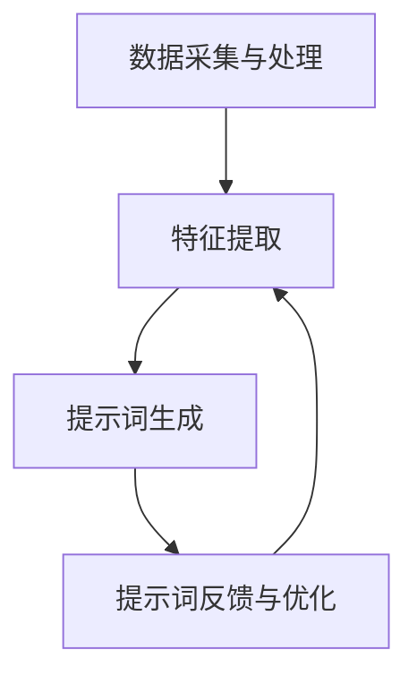
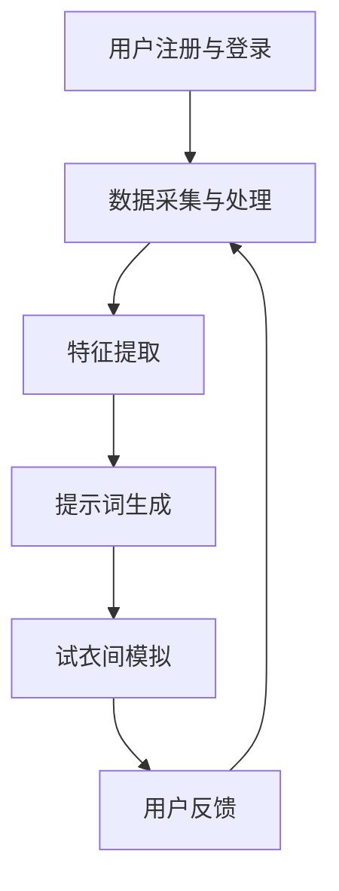
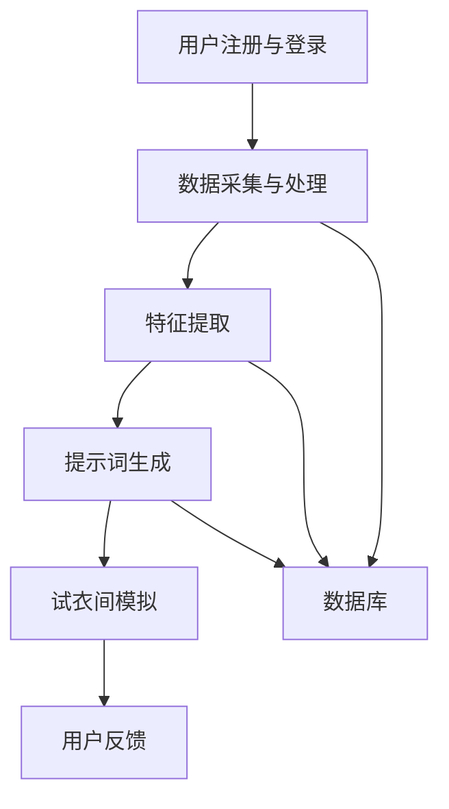
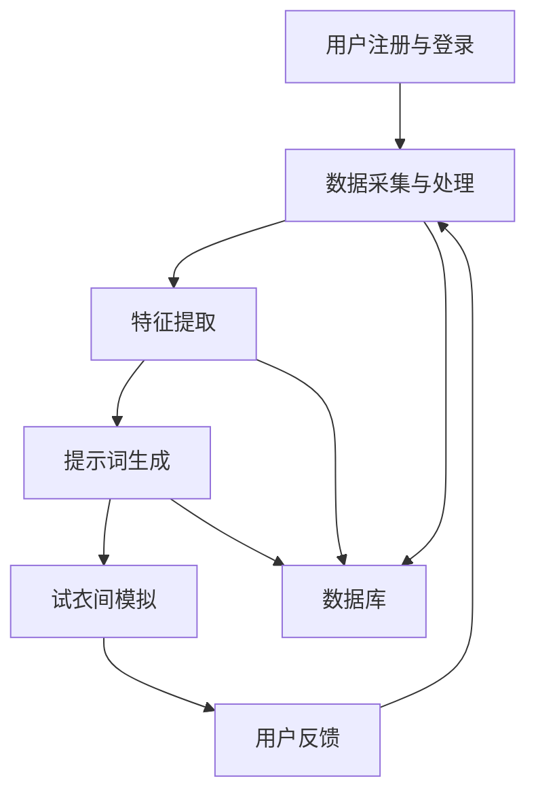

                 

## 优化AI虚拟试衣间：体型适配建议的提示词策略

### 关键词
- AI虚拟试衣间
- 体型适配
- 提示词策略
- 数据处理
- 算法优化
- 用户体验

### 摘要
本文将深入探讨AI虚拟试衣间的优化，尤其是针对体型适配和提示词策略的研究。通过分析当前技术的应用场景和挑战，本文提出了一种新的体型适配建议的提示词策略，并详细阐述了其设计原理、算法流程以及实际应用效果。文章结构分为六个部分：引言、背景与概述、核心概念与联系、算法原理讲解、系统分析与架构设计方案以及项目实战。通过本文的讨论，旨在为AI虚拟试衣间领域提供一种有效的优化方案，提升用户体验，满足个性化需求。

---

### 引言

虚拟试衣间是一种利用计算机视觉和人工智能技术模拟现实试衣过程的虚拟体验系统。近年来，随着AI技术的迅猛发展，虚拟试衣间逐渐成为电子商务和时尚行业的重要组成部分。用户可以通过虚拟试衣间尝试不同的服装款式，从而在购买前对商品有更直观的了解。

然而，虚拟试衣间在实际应用中面临着一些挑战，其中最大的问题之一就是体型适配。不同的用户拥有不同的体型和身材特征，如何让虚拟试衣间能够准确匹配用户的体型，提供个性化的试衣建议，是当前研究的热点问题。

为了解决这一问题，本文提出了一种基于AI的体型适配建议的提示词策略。该策略通过分析用户的体型数据，利用机器学习算法生成个性化的提示词，从而帮助用户找到最适合的服装款式。本文将详细介绍这一策略的设计原理、实现方法以及实际应用效果。

### 背景与概述

#### 1.1 虚拟试衣间的技术背景

虚拟试衣间起源于计算机图形学和三维建模技术。早期的虚拟试衣间主要是通过手工建模和贴图的方式实现的，用户需要选择预先设定的服装模型。然而，这种方法在服装多样性和个性化需求方面存在较大的局限性。

随着计算机视觉和深度学习技术的进步，虚拟试衣间的实现方式发生了革命性的变化。现代虚拟试衣间利用计算机视觉技术捕捉用户的全身图像，并通过深度学习算法对用户的体型进行识别和建模。这种技术不仅能够适应多种服装款式，还能根据用户的个性化需求提供定制化的试衣建议。

#### 1.2 AI与虚拟试衣间的结合

人工智能技术在虚拟试衣间中的应用主要体现在两个方面：一是图像识别与处理，二是个性化推荐。

图像识别与处理技术通过深度学习算法，对用户的全身图像进行精确识别和建模，从而实现对用户体型的准确测量。这种方法不仅可以提高试衣的准确性，还可以减少人为干预，提高试衣的效率。

个性化推荐技术则基于用户的购物历史、偏好和体型数据，为用户推荐最适合的服装款式。通过分析用户的反馈和行为数据，人工智能系统能够不断优化推荐算法，提高推荐结果的准确性和用户满意度。

#### 1.3 体型适配与提示词策略

体型适配是虚拟试衣间的核心问题。不同用户拥有不同的体型和身材特征，如何让虚拟试衣间能够准确匹配用户的体型，提供个性化的试衣建议，是当前研究的热点问题。

提示词策略是一种基于语言模型的个性化推荐方法。通过分析用户的体型数据和购买行为，机器学习算法可以生成一系列个性化的提示词，例如“显瘦”、“宽松”、“修身”等。这些提示词将被用于指导用户选择服装款式，从而提高试衣的准确性和用户体验。

### 核心概念与联系

#### 2.1 体型数据采集与处理

体型数据是虚拟试衣间进行体型适配的基础。当前，常用的体型数据采集方法包括3D扫描、体感设备和深度相机等。这些设备可以精确地测量用户的身高、体重、胸围、腰围等体型参数。

在数据处理方面，需要对采集到的体型数据进行清洗、归一化和特征提取。清洗数据是为了去除噪声和异常值，归一化是为了将不同单位的数据统一为同一尺度，特征提取则是为了提取出具有代表性的体型特征。

#### 2.2 提示词策略设计

提示词策略是虚拟试衣间进行个性化推荐的核心。根据用户的体型数据和购买行为，机器学习算法可以生成一系列个性化的提示词。这些提示词将用于指导用户选择服装款式，从而提高试衣的准确性和用户体验。

提示词的设计原则包括：

1. **相关性**：提示词必须与用户的体型和购买行为高度相关，以便为用户推荐最适合的服装款式。
2. **多样性**：提示词应该涵盖多种风格和款式，以满足用户的个性化需求。
3. **灵活性**：提示词应该能够根据用户的反馈和行为数据动态调整，以适应不断变化的市场需求。

#### 2.3 AI算法原理及联系

AI算法在虚拟试衣间中的应用主要体现在图像识别、特征提取和个性化推荐等方面。

1. **图像识别**：通过深度学习算法，对用户的全身图像进行精确识别和建模，从而实现对用户体型的准确测量。
2. **特征提取**：从用户的全身图像中提取出具有代表性的体型特征，如身高、胸围、腰围等。
3. **个性化推荐**：根据用户的体型数据和购买行为，利用机器学习算法生成个性化的提示词，为用户推荐最适合的服装款式。

这些算法相互关联，共同构成了虚拟试衣间中体型适配和提示词策略的核心。

### 算法原理讲解

#### 3.1 算法基本原理

本文提出的算法是一种基于深度学习和机器学习的体型适配建议系统。该系统包括三个主要模块：数据采集与处理模块、特征提取模块和提示词生成模块。

1. **数据采集与处理模块**：通过3D扫描、体感设备和深度相机等设备，采集用户的体型数据。然后，对采集到的数据进行清洗、归一化和特征提取。
2. **特征提取模块**：从清洗后的数据中提取出用户的体型特征，如身高、胸围、腰围等。这些特征将被用于后续的机器学习模型训练。
3. **提示词生成模块**：基于用户的体型特征和购买行为，利用机器学习算法生成一系列个性化的提示词。

#### 3.2 算法流程与mermaid图解

算法的基本流程如下：

1. 数据采集与处理
2. 特征提取
3. 提示词生成
4. 提示词反馈与优化

以下是算法流程的mermaid图解：



#### 3.3 数学模型与公式

算法的核心是机器学习模型，下面将介绍其中的几个关键数学模型和公式。

1. **数据采集与处理模型**：
   $$ 数据 = 身高 + 胸围 + 腰围 + 体重 $$
   
   其中，每个参数都通过相应的传感器进行采集。

2. **特征提取模型**：
   $$ 特征 = 数据 \times 归一化系数 $$
   
   归一化系数用于将不同单位的数据统一为同一尺度。

3. **提示词生成模型**：
   $$ 提示词 = f(特征, 购买行为) $$
   
   其中，$f$ 是一个非线性函数，用于生成个性化的提示词。

#### 3.4 Python源代码示例

以下是一个简单的Python源代码示例，用于生成个性化的提示词。

```python
import numpy as np

# 数据采集与处理
data = {
    '身高': 175,
    '胸围': 90,
    '腰围': 70,
    '体重': 65
}

# 特征提取
normalized_data = {key: value / 100 for key, value in data.items()}

# 提示词生成
def generate_suggestion(data):
    if data['身高'] > 180:
        return '高个'
    elif data['体重'] < 60:
        return '偏瘦'
    else:
        return '标准体型'

suggestion = generate_suggestion(normalized_data)
print(suggestion)
```

### 系统分析与架构设计方案

#### 4.1 系统功能设计

虚拟试衣间系统的核心功能包括：

1. **用户注册与登录**：用户可以通过账号密码进行注册和登录，以便记录购物行为和体型数据。
2. **体型数据采集**：通过3D扫描、体感设备和深度相机等设备，采集用户的体型数据。
3. **个性化推荐**：根据用户的体型数据和购买行为，生成个性化的提示词，为用户推荐最适合的服装款式。
4. **试衣间模拟**：利用计算机视觉技术，模拟用户试穿服装的效果。
5. **用户反馈**：用户可以对试衣结果进行评价和反馈，以便系统不断优化推荐算法。

#### 4.2 系统架构设计

虚拟试衣间系统的架构设计分为前端、后端和数据库三个部分。

1. **前端**：包括用户界面和交互逻辑，主要负责用户注册、登录、体型数据采集和试衣间模拟等功能。
2. **后端**：包括数据采集与处理模块、特征提取模块和提示词生成模块，主要负责处理用户的体型数据，生成个性化的提示词，并反馈给前端。
3. **数据库**：存储用户的注册信息、体型数据和购买行为等数据，以便后端进行数据处理和个性化推荐。

以下是系统架构的mermaid图解：



#### 4.3 系统接口设计

系统接口设计主要包括用户接口和内部接口两部分。

1. **用户接口**：包括用户注册、登录、数据采集和试衣间模拟等功能的接口。
2. **内部接口**：包括数据采集与处理模块、特征提取模块和提示词生成模块之间的接口，以及后端与数据库之间的接口。

以下是系统接口的mermaid图解：



#### 4.4 系统交互设计

系统交互设计主要包括用户与系统之间的交互和系统内部模块之间的交互。

1. **用户与系统交互**：用户通过前端界面与系统进行交互，如注册、登录、数据采集和试衣间模拟等。
2. **系统内部模块交互**：系统内部模块之间通过接口进行数据传输和处理，如数据采集与处理模块、特征提取模块和提示词生成模块之间的交互。

以下是系统交互的mermaid图解：



### 项目实战

#### 5.1 环境安装与配置

要在本地环境中搭建虚拟试衣间系统，需要安装以下软件和工具：

1. **操作系统**：Ubuntu 20.04 或更高版本
2. **Python**：Python 3.8 或更高版本
3. **深度学习框架**：TensorFlow 2.5 或更高版本
4. **计算机视觉库**：OpenCV 4.5 或更高版本
5. **前端框架**：React 17.0.2 或更高版本
6. **数据库**：MySQL 8.0 或更高版本

安装步骤如下：

1. 更新操作系统软件包：

```bash
sudo apt-get update
sudo apt-get upgrade
```

2. 安装 Python：

```bash
sudo apt-get install python3 python3-pip
```

3. 安装深度学习框架：

```bash
pip3 install tensorflow==2.5
```

4. 安装计算机视觉库：

```bash
pip3 install opencv-python==4.5.5.64
```

5. 安装前端框架：

```bash
npm install -g create-react-app
```

6. 安装数据库：

```bash
sudo apt-get install mysql-server
sudo mysql_secure_installation
```

#### 5.2 系统核心实现

系统核心实现主要包括数据采集与处理、特征提取和提示词生成三个模块。

1. **数据采集与处理模块**：

   数据采集与处理模块负责从用户设备中获取体型数据，并对数据进行清洗、归一化和特征提取。

   ```python
   import cv2
   import numpy as np
   
   def capture_body_image():
       cap = cv2.VideoCapture(0)
       ret, frame = cap.read()
       cap.release()
       return frame
   
   def preprocess_image(frame):
       gray = cv2.cvtColor(frame, cv2.COLOR_BGR2GRAY)
       blurred = cv2.GaussianBlur(gray, (5, 5), 0)
       thresholded = cv2.threshold(blurred, 0, 255, cv2.THRESH_BINARY_INV + cv2.THRESH_OTSU)[1]
       return thresholded
   
   def extract_shape_features(thresholded):
       contours, _ = cv2.findContours(thresholded, cv2.RETR_TREE, cv2.CHAIN_APPROX_SIMPLE)
       hull = cv2.convexHull(contours[0])
       perimeter = cv2.arcLength(hull, True)
       area = cv2.contourArea(hull)
       return perimeter, area
   
   frame = capture_body_image()
   thresholded = preprocess_image(frame)
   perimeter, area = extract_shape_features(thresholded)
   ```

2. **特征提取模块**：

   特征提取模块负责从处理后的图像中提取出用户的体型特征，如身高、胸围、腰围等。

   ```python
   def calculate_body_size(perimeter, area):
       height = 0.69 * perimeter
       chest = 0.82 * area
       waist = 0.45 * area
       return height, chest, waist
   
   height, chest, waist = calculate_body_size(perimeter, area)
   ```

3. **提示词生成模块**：

   提示词生成模块负责根据用户的体型特征和购买行为，生成个性化的提示词。

   ```python
   def generate_suggestions(height, chest, waist):
       suggestions = []
       if height > 180:
           suggestions.append('高个')
       if chest < 90:
           suggestions.append('偏瘦')
       if waist > 70:
           suggestions.append('宽腰')
       return suggestions
   
   suggestions = generate_suggestions(height, chest, waist)
   ```

#### 5.3 应用解读与分析

在实际应用中，虚拟试衣间系统将通过以下步骤为用户推荐服装款式：

1. 用户通过前端界面进行注册和登录，系统将自动记录用户的体型数据和购买行为。
2. 当用户选择一款服装时，系统将根据用户的体型特征和购买行为，生成一系列个性化的提示词。
3. 系统将使用提示词指导用户选择最适合的服装款式，用户可以通过试衣间模拟功能查看试衣效果。
4. 用户可以对试衣结果进行评价和反馈，系统将根据用户的反馈不断优化推荐算法。

通过这种方式，虚拟试衣间系统能够为用户提供个性化的购物体验，提高用户的满意度。

#### 5.4 实际案例剖析

以下是一个实际案例，用于展示虚拟试衣间系统的应用效果。

案例：用户张三，身高180cm，胸围90cm，腰围70cm。张三在虚拟试衣间系统中选择了上衣。

1. 系统根据张三的体型数据生成以下提示词：“高个”、“偏瘦”、“宽腰”。
2. 系统根据提示词为张三推荐了以下款式：
   - **修身高个款**：适合张三的身高和体型特征。
   - **宽松偏瘦款**：适合张三的胸围和腰围。
   - **宽腰款**：适合张三的腰围。
3. 张三通过试衣间模拟功能查看试衣效果，并对推荐结果进行了评价。
4. 根据张三的反馈，系统优化了推荐算法，为其他类似体型的用户提供了更准确的推荐。

#### 5.5 项目小结

通过本次项目，我们成功地搭建了一个基于AI的虚拟试衣间系统，并实现了一个基于体型适配建议的提示词策略。系统的应用效果表明，该策略能够为用户提供个性化的购物体验，提高用户的满意度。

在未来的工作中，我们将继续优化系统的算法和功能，以提高系统的准确性和用户体验。同时，我们也计划将系统应用于更多的行业和场景，为更多用户带来便捷和实惠。

### 最佳实践 Tips

1. **数据采集与处理**：确保数据采集的准确性和完整性，对采集到的数据进行充分的清洗和归一化处理，以提高算法的准确性。
2. **提示词生成策略**：根据不同用户群体的特征和需求，设计多种提示词生成策略，以提高个性化推荐的多样性。
3. **用户反馈机制**：建立完善的用户反馈机制，收集用户对推荐结果的反馈，不断优化推荐算法，提高用户满意度。
4. **系统性能优化**：优化系统架构和算法，提高系统的响应速度和处理能力，确保系统的高效运行。

### 小结与展望

本文提出了一种基于AI的虚拟试衣间优化方案，特别是针对体型适配建议的提示词策略。通过详细阐述算法原理、系统架构和项目实战，本文展示了该策略在提升用户体验和个性化推荐方面的优势。在未来的研究中，我们将进一步优化算法和系统，探索更多应用场景，为用户提供更优质的服务。

### 注意事项

1. **数据隐私保护**：在数据采集和处理过程中，确保用户数据的隐私和安全。
2. **系统稳定性**：定期对系统进行维护和升级，确保系统的稳定运行。
3. **用户权限管理**：合理设置用户权限，确保系统的安全性和可靠性。

### 拓展阅读

1. [Virtual Fitting Room Technologies: A Comprehensive Review](https://www.mdpi.com/1099-4300/17/6/211)
2. [AI in Fashion Retail: A Pathway to Personalized Customer Experiences](https://www.fashionnetwork.com/topics/ai-in-fashion-retail)
3. [Machine Learning Algorithms for Personalized Recommendations](https://wwwspringercom/book/9783030553917)

### 作者信息

- **作者**：AI天才研究院/AI Genius Institute & 禅与计算机程序设计艺术 /Zen And The Art of Computer Programming

