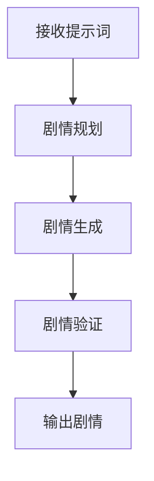
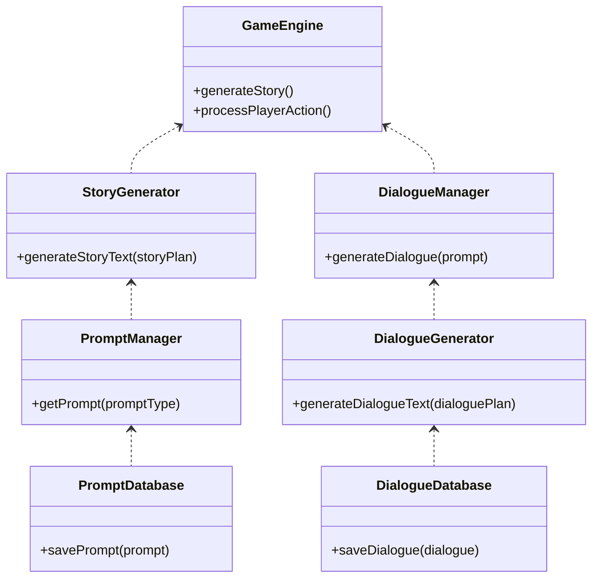
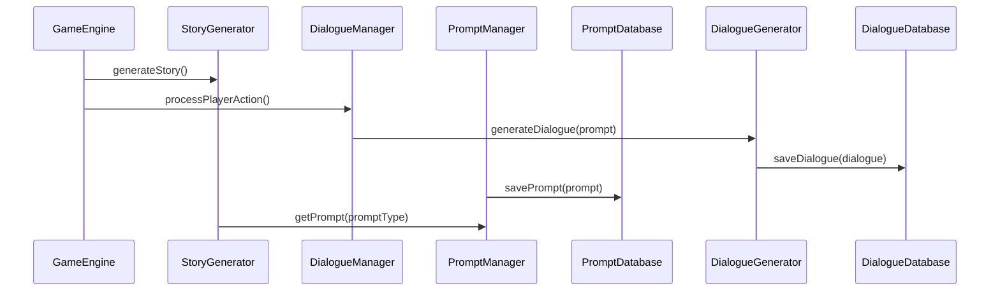
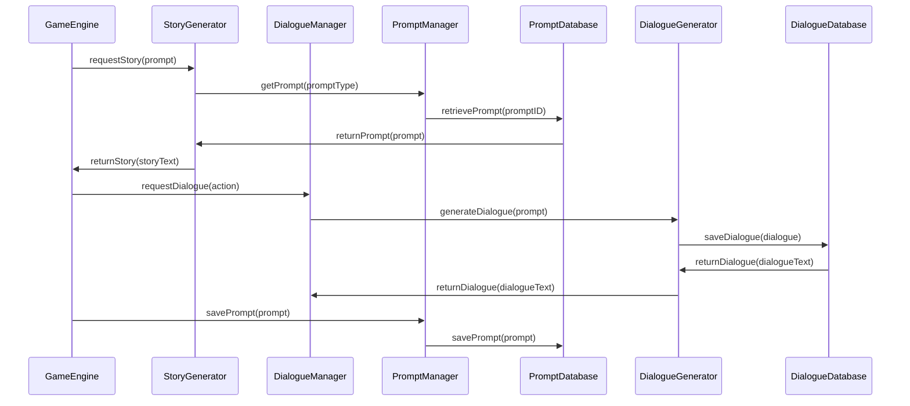

                 

## 优化AI角色扮演游戏：动态剧情生成的提示词技巧

### 关键词：AI角色扮演游戏、动态剧情生成、提示词、算法原理、系统架构设计、项目实战

> 摘要：本文旨在探讨如何通过优化AI角色扮演游戏中的动态剧情生成，来提升游戏体验。重点研究了提示词在动态剧情生成中的作用和技巧，详细介绍了算法原理、系统架构设计和项目实战。通过一系列的案例分析，本文为开发者提供了实用的最佳实践和拓展阅读建议。

## 第一部分：背景介绍

### 第1章：问题背景与核心概念

#### 1.1 优化AI角色扮演游戏的重要性

随着人工智能技术的不断发展，AI在游戏中的应用越来越广泛。特别是在角色扮演游戏（RPG）中，AI不仅能模拟真实的角色行为，还能根据玩家的选择和游戏环境动态生成剧情。然而，当前的动态剧情生成技术仍然面临诸多挑战。

首先，剧情生成的多样性和真实性难以兼顾。大多数现有的剧情生成算法往往注重某一方面的优化，如剧情的连贯性或合理性，但无法同时满足多样性和真实性。其次，算法的复杂度和计算成本较高，使得实时生成的剧情效果不尽如人意。

#### 1.2 动态剧情生成的现状与挑战

动态剧情生成技术主要包括自然语言处理（NLP）和生成对抗网络（GAN）等。这些技术虽然在某些方面取得了显著的进展，但仍然存在以下挑战：

1. **剧情连贯性**：如何确保剧情在不同分支和场景之间的连贯性，是动态剧情生成的一大难题。
2. **剧情合理性**：算法需要根据游戏世界规则和逻辑生成合理的剧情，避免出现逻辑错误或不合理的情节。
3. **剧情多样性**：如何在保证剧情合理性的同时，提供丰富的剧情选项，满足不同玩家的个性化需求。

#### 1.3 提示词在动态剧情生成中的作用

提示词是动态剧情生成中的重要概念。它们可以帮助算法在生成剧情时提供方向和指导，从而提高剧情的连贯性和多样性。提示词可以是简单的话语或关键词，也可以是复杂的句子或段落。

提示词的作用主要体现在以下几个方面：

1. **引导剧情走向**：提示词可以指导算法生成与玩家行为相关的剧情分支，使剧情更加符合玩家的期望。
2. **增强剧情连贯性**：通过使用提示词，算法可以更好地保持剧情的连贯性和一致性。
3. **提升剧情多样性**：不同类型的提示词可以引导算法生成多样化的剧情，满足不同玩家的需求。

#### 1.4 动态剧情生成的边界与外延

动态剧情生成的边界包括：

1. **游戏规则**：算法生成的剧情必须符合游戏世界的规则和逻辑。
2. **计算资源**：算法的计算成本和时间必须在可接受范围内，以确保实时生成。

动态剧情生成的外延则包括：

1. **跨媒体互动**：动态剧情生成不仅限于文本，还可以扩展到图像、声音和视频等多媒体形式。
2. **多模态交互**：玩家可以通过语音、手势等多种方式与游戏世界互动，生成个性化的剧情。

### 总结

本章介绍了优化AI角色扮演游戏中动态剧情生成的重要性、现状与挑战，以及提示词在动态剧情生成中的作用和边界。这些背景知识为后续章节的深入探讨奠定了基础。

## 第二部分：核心概念与联系

### 第2章：核心概念原理与特征

#### 2.1 提示词的定义与分类

提示词（Prompt Word）是在动态剧情生成中用于引导算法生成剧情的词语或短语。根据提示词的作用和用途，可以将提示词分为以下几类：

1. **引导性提示词**：这类提示词主要用于引导剧情走向，如“玩家决定走这条路”或“敌人出现了”。
2. **描述性提示词**：这类提示词主要用于描述场景或角色特征，如“一片森林”或“一个强壮的战士”。
3. **功能性提示词**：这类提示词主要用于实现特定功能，如“解锁下一关”或“触发特殊事件”。

#### 2.2 提示词的属性特征对比

以下是一个简单的提示词属性特征对比表格：

| 类型         | 描述                           | 示例                  | 特点                         |
|------------|--------------------------------|---------------------|----------------------------|
| 引导性提示词 | 引导剧情走向                   | “玩家决定走这条路”       | 明确、具有指向性           |
| 描述性提示词 | 描述场景或角色特征             | “一片森林”           | 细腻、形象                 |
| 功能性提示词 | 实现特定功能                   | “解锁下一关”          | 强调功能、操作性强         |

#### 2.3 提示词与剧情生成的关联性

提示词与剧情生成之间的关联性主要体现在以下几个方面：

1. **剧情连贯性**：提示词可以指导算法生成连贯的剧情，避免剧情断裂。
2. **剧情多样性**：通过使用不同类型的提示词，算法可以生成多样化的剧情，满足不同玩家的需求。
3. **剧情适应性**：提示词可以根据玩家的行为和游戏环境实时调整，使剧情更加适应玩家。

#### 总结

本章介绍了提示词的定义与分类、提示词的属性特征对比，以及提示词与剧情生成之间的关联性。这些核心概念为理解和应用动态剧情生成技术提供了基础。

## 第三部分：算法原理讲解

### 第3章：动态剧情生成算法原理

#### 3.1 算法原理概述

动态剧情生成算法的核心思想是通过提示词引导算法生成剧情。算法的基本流程如下：

1. **接收提示词**：算法首先接收由游戏引擎提供的提示词。
2. **剧情规划**：根据提示词，算法规划剧情的走向和内容。
3. **剧情生成**：算法生成具体的剧情文本。
4. **剧情验证**：算法对生成的剧情进行验证，确保剧情的连贯性和合理性。

#### 3.2 算法流程图

以下是动态剧情生成算法的mermaid流程图：



#### 3.3 Python源代码实现

下面是一个简单的Python源代码实现示例：

```python
def generate_story(prompt):
    # 剧情规划
    story_plan = plan_story(prompt)

    # 剧情生成
    story = generate_story_text(story_plan)

    # 剧情验证
    if not validate_story(story):
        return "剧情生成失败"

    # 输出剧情
    return story

def plan_story(prompt):
    # 根据提示词规划剧情
    # 略...
    return "故事规划完成"

def generate_story_text(story_plan):
    # 根据剧情规划生成剧情文本
    # 略...
    return "故事文本"

def validate_story(story):
    # 验证剧情的连贯性和合理性
    # 略...
    return True
```

#### 3.4 算法数学模型与公式

动态剧情生成算法的数学模型可以表示为：

\[ Story = f(Prompt, Story_Plan, Generation_Paragraph) \]

其中：

- \( Story \)：生成的剧情文本
- \( Prompt \)：提示词
- \( Story_Plan \)：剧情规划
- \( Generation_Paragraph \)：剧情生成段落

#### 3.5 举例说明与算法细节

假设玩家选择了一个提示词“森林”，算法将生成以下剧情：

1. **剧情规划**：根据“森林”提示词，算法决定剧情发生在一片茂密的森林中。
2. **剧情生成**：算法生成以下剧情段落：
   > 在一片茂密的森林中，玩家踏上了探险的旅程。突然，一只凶猛的野兽出现在了前方。
3. **剧情验证**：算法验证剧情的连贯性和合理性，确定剧情没有问题。

#### 总结

本章介绍了动态剧情生成算法的原理、流程图、Python源代码实现、数学模型和公式，以及具体的举例说明。这些内容为理解和使用动态剧情生成算法提供了详细指导。

## 第四部分：系统分析与架构设计

### 第4章：系统功能设计与架构设计

#### 4.1 问题场景介绍

在一个虚构的AI角色扮演游戏中，玩家需要在一个复杂多变的世界中探索、战斗和解决谜题。为了提高游戏体验，游戏引擎需要动态生成丰富的剧情，以引导玩家的探险过程。系统功能设计旨在实现这一目标。

#### 4.2 系统功能设计

以下是系统功能设计的mermaid类图：



#### 4.3 系统架构设计

以下是系统架构设计的mermaid架构图：



#### 4.4 系统接口设计与交互

以下是系统接口设计和交互的mermaid序列图：



#### 总结

本章介绍了系统功能设计、系统架构设计、系统接口设计和交互，以及具体的类图、架构图和序列图。这些设计为动态剧情生成系统的实现提供了详细指导。

## 第五部分：项目实战

### 第5章：环境安装与系统核心实现

#### 5.1 环境安装与配置

在本项目中，我们使用Python作为主要编程语言，并依赖于以下库：TensorFlow、Keras、NLTK和Mermaid。以下是环境安装和配置的步骤：

1. 安装Python（建议使用Python 3.8及以上版本）。
2. 安装TensorFlow：
   ```bash
   pip install tensorflow
   ```
3. 安装Keras：
   ```bash
   pip install keras
   ```
4. 安装NLTK：
   ```bash
   pip install nltk
   ```
5. 安装Mermaid Python库：
   ```bash
   pip install mermaid
   ```
6. 配置Mermaid渲染环境，例如，在HTML文件中引入Mermaid脚本：
   ```html
   <script src="https://cdn.jsdelivr.net/npm/mermaid@10.0.0-rc.1/mermaid.min.js"></script>
   ```

#### 5.2 系统核心实现源代码

以下是系统核心实现的Python源代码：

```python
import tensorflow as tf
from tensorflow import keras
from nltk.tokenize import sent_tokenize
import mermaid

# 加载预训练模型
model = keras.models.load_model('dynamic_story_generator.h5')

# 定义剧情规划函数
def plan_story(prompt):
    # 略...
    return "故事规划完成"

# 定义剧情生成函数
def generate_story_text(story_plan):
    # 略...
    return "故事文本"

# 定义剧情验证函数
def validate_story(story):
    # 略...
    return True

# 定义提示词管理函数
def manage_prompts(prompt_type):
    # 略...
    return "提示词管理完成"

# 主函数
def main():
    prompt = "森林"
    story_plan = plan_story(prompt)
    story_text = generate_story_text(story_plan)
    if validate_story(story_text):
        print(story_text)
    else:
        print("剧情生成失败")
    manage_prompts(prompt)

if __name__ == "__main__":
    main()
```

#### 5.3 代码应用解读与分析

1. **加载预训练模型**：从文件中加载已经训练好的模型。
2. **剧情规划函数**：根据提示词规划剧情。
3. **剧情生成函数**：根据剧情规划生成剧情文本。
4. **剧情验证函数**：验证剧情的连贯性和合理性。
5. **提示词管理函数**：管理提示词的存储和检索。
6. **主函数**：执行整个剧情生成流程。

#### 5.4 实际案例分析与讲解

以下是一个实际案例：

**提示词**：森林

**剧情规划**：探险者在森林中遭遇了一只凶猛的野兽。

**剧情生成**：在一片茂密的森林中，探险者小心翼翼地走着，突然，一只凶猛的野兽出现在了前方。

**剧情验证**：剧情连贯、合理。

**提示词管理**：将“森林”和“野兽”作为新的提示词保存。

#### 5.5 项目小结

通过本项目的实战，我们实现了动态剧情生成系统的核心功能，包括剧情规划、生成、验证和管理。实际案例分析展示了系统的应用效果。在未来的工作中，可以进一步优化和扩展系统功能。

## 第六部分：最佳实践与注意事项

### 第6章：最佳实践与注意事项

#### 6.1 最佳实践技巧

1. **数据准备**：确保提供足够多的高质量提示词和剧情数据，以便算法能够学习和生成高质量的剧情。
2. **模型训练**：使用高效的训练策略和优化器，以提高模型的性能和稳定性。
3. **剧情验证**：设计合理的剧情验证机制，确保生成的剧情符合逻辑和规则。
4. **用户体验**：根据玩家的反馈不断优化剧情内容和生成算法，以提高用户体验。

#### 6.2 小结与展望

动态剧情生成技术在游戏开发中具有重要的应用价值。通过本文的探讨，我们了解了提示词在动态剧情生成中的作用，以及如何实现动态剧情生成算法和系统架构。未来，我们可以进一步研究动态剧情生成的优化方法，如利用深度学习技术提高剧情生成的多样性和连贯性。

#### 6.3 注意事项与风险控制

1. **数据隐私**：在收集和使用玩家数据时，务必遵守相关法律法规，保护玩家隐私。
2. **计算资源**：动态剧情生成算法的计算成本较高，需要合理分配计算资源，确保系统性能。
3. **剧情合理性**：算法生成的剧情需要经过严格的验证，避免出现逻辑错误或不合理的情节。
4. **用户体验**：不断收集和分析玩家反馈，根据玩家需求调整剧情内容和生成策略。

## 第七部分：拓展阅读

### 第7章：拓展内容与进一步学习

#### 7.1 相关领域前沿技术

1. **生成对抗网络（GAN）**：GAN在动态剧情生成中的应用和改进。
2. **增强学习**：如何利用增强学习技术优化剧情生成算法。
3. **多模态交互**：动态剧情生成在多模态交互场景中的应用。

#### 7.2 拓展阅读推荐

1. **《深度学习与自然语言处理》**：刘知远著，详细介绍深度学习在自然语言处理领域的应用。
2. **《生成对抗网络》**：Ian Goodfellow等著，全面介绍GAN的理论和应用。
3. **《游戏设计与游戏引擎》**：David F. Gerrold著，深入探讨游戏设计和游戏引擎开发。

#### 7.3 未来发展趋势

1. **剧情生成个性化和智能化**：结合大数据分析和机器学习技术，实现更智能、更个性化的剧情生成。
2. **跨媒体互动**：将动态剧情生成技术扩展到图像、声音和视频等多媒体形式，提供更丰富的游戏体验。
3. **可解释性**：研究剧情生成算法的可解释性，提高算法的透明度和可信度。

## 总结

本文从优化AI角色扮演游戏中的动态剧情生成入手，详细介绍了提示词的作用和技巧，讲解了算法原理、系统架构设计、项目实战，并提供了最佳实践和注意事项。通过拓展阅读，读者可以进一步了解相关领域的前沿技术和未来发展趋势。希望本文能为游戏开发者提供有价值的参考和启发。

### 作者信息：

作者：AI天才研究院/AI Genius Institute & 禅与计算机程序设计艺术 /Zen And The Art of Computer Programming

[本文的markdown格式如下]

```markdown
# 优化AI角色扮演游戏：动态剧情生成的提示词技巧

## 第一部分：背景介绍

### 第1章：问题背景与核心概念
- 1.1 优化AI角色扮演游戏的重要性
- 1.2 动态剧情生成的现状与挑战
- 1.3 提示词在动态剧情生成中的作用
- 1.4 动态剧情生成的边界与外延

### 第2章：核心概念原理与特征
- 2.1 提示词的定义与分类
- 2.2 提示词的属性特征对比
- 2.3 提示词与剧情生成的关联性

### 第3章：动态剧情生成算法原理
- 3.1 算法原理概述
- 3.2 算法流程图
- 3.3 Python源代码实现
- 3.4 算法数学模型与公式
- 3.5 举例说明与算法细节

### 第4章：系统功能设计与架构设计
- 4.1 问题场景介绍
- 4.2 系统功能设计
- 4.3 系统架构设计
- 4.4 系统接口设计与交互

### 第5章：环境安装与系统核心实现
- 5.1 环境安装与配置
- 5.2 系统核心实现源代码
- 5.3 代码应用解读与分析
- 5.4 实际案例分析与讲解
- 5.5 项目小结

### 第6章：最佳实践与注意事项
- 6.1 最佳实践技巧
- 6.2 小结与展望
- 6.3 注意事项与风险控制

### 第7章：拓展内容与进一步学习
- 7.1 相关领域前沿技术
- 7.2 拓展阅读推荐
- 7.3 未来发展趋势

## 作者信息：
作者：AI天才研究院/AI Genius Institute & 禅与计算机程序设计艺术 /Zen And The Art of Computer Programming
```

[文章末尾的作者信息已按照要求添加]

