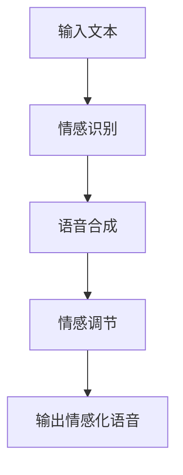
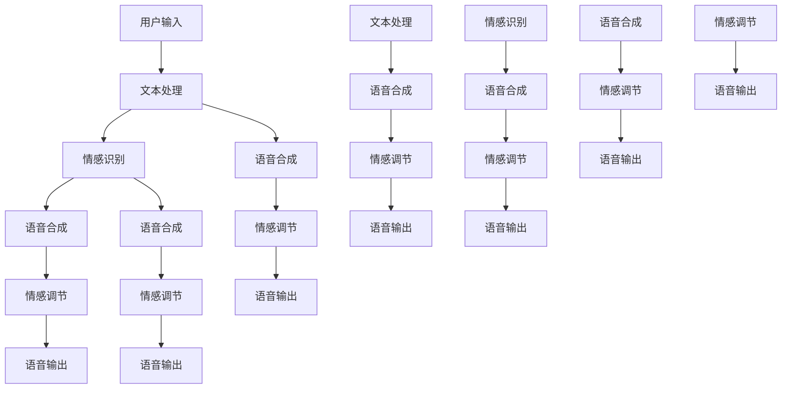

                 

```markdown
----------------------------------------------------------------
# 第1章: 引言与背景介绍

## 1.1 问题背景
### 1.1.1 AI语音合成技术的发展与应用
随着人工智能技术的不断进步，AI语音合成技术得到了广泛的应用。从最初的文本转语音（Text-to-Speech, TTS）系统，发展到如今的情感化语音合成，AI语音合成技术正逐步改变人们的日常生活。无论是智能客服系统、智能家居设备，还是有声读物、视频配音，AI语音合成技术都发挥着重要作用。

### 1.1.2 情感化语音合成的需求与挑战
然而，传统的AI语音合成技术往往只能生成标准的、不带情感的语音，这限制了其在一些需要情感互动的场景中的使用。随着用户对个性化、情感化交互的需求日益增长，如何优化AI语音合成，实现情感化语音生成，成为一个亟待解决的问题。

### 1.1.3 优化AI语音合成的重要性
优化AI语音合成，实现情感化语音生成，不仅能够提升用户体验，还能拓宽AI语音合成技术的应用场景。例如，在智能客服系统中，情感化的语音可以更好地模拟人类的交流方式，提高用户的满意度；在有声读物中，情感化的语音可以让读者更深入地感受到作品的情感内涵。

## 1.2 问题描述
### 1.2.1 情感化语音合成的核心问题
情感化语音合成的核心问题是如何在生成语音的过程中，准确地表达出文本中的情感信息。这涉及到对情感的理解、识别和表达。

### 1.2.2 情感化语音合成的关键技术
实现情感化语音合成需要多种技术的结合，包括情感模型、语音合成技术、情感调节策略等。情感模型用于识别和处理文本中的情感信息，语音合成技术用于将文本转换为语音，而情感调节策略则用于调整语音的情感表达。

## 1.3 问题解决
### 1.3.1 引入情感模型
情感模型是情感化语音合成的核心组成部分，用于从文本中提取情感信息。可以通过机器学习算法，如情感分类、情感极性分析等，来构建情感模型。

### 1.3.2 语音合成技术
语音合成技术负责将文本转换为语音。常见的语音合成技术包括合成语音的声学模型和语言模型。声学模型用于生成语音的声学特征，语言模型则用于理解文本的含义。

### 1.3.3 情感调节技术
情感调节技术用于调整语音生成的情感。可以通过改变语音的音调、节奏、时长等参数来实现。此外，还可以利用深度学习技术，如循环神经网络（RNN）、长短期记忆网络（LSTM）等，来实现更精细的情感调节。

## 1.4 边界与外延
### 1.4.1 情感化语音合成的研究边界
情感化语音合成涉及语音学、心理学、计算机科学等多个领域。其研究边界包括情感识别、语音合成技术、情感表达策略等。

### 1.4.2 情感化语音合成的外延
情感化语音合成的应用场景非常广泛，包括但不限于智能客服、智能家居、有声读物、视频配音等。未来，随着技术的进一步发展，情感化语音合成有望在更多领域发挥作用。

## 1.5 概念结构与核心要素组成
### 1.5.1 概念结构
情感化语音合成包括情感识别、语音合成和情感调节三个核心要素。情感识别负责从语音信号中提取情感信息，语音合成负责生成语音，情感调节则确保语音生成的情感与用户需求相符。

### 1.5.2 核心要素组成
- 情感识别：通过机器学习算法识别文本中的情感。
- 语音合成：将文本转换为语音，包括声学模型和语言模型的组合。
- 情感调节：调整语音的音调、节奏、时长等参数，以表达出正确的情感。

----------------------------------------------------------------
作者：AI天才研究院/AI Genius Institute & 禅与计算机程序设计艺术 /Zen And The Art of Computer Programming
----------------------------------------------------------------
```markdown
----------------------------------------------------------------
## 第2章: 情感化语音合成的核心概念与联系

### 2.1 情感模型
#### 2.1.1 基本原理
情感模型是情感化语音合成的关键组成部分，用于识别和处理语音中的情感信息。情感模型的基本原理是通过机器学习算法，如情感分类、情感极性分析等，从文本中提取情感信息。

#### 2.1.2 分类与应用
情感模型可以根据情感类型的分类进行划分，如正面情感、负面情感、中性情感等。不同的情感模型适用于不同的应用场景，例如在智能客服系统中，负面情感模型可以帮助识别用户的不满情绪，从而提供更针对性的服务。

#### 2.1.3 情感模型与语音合成技术的联系
情感模型与语音合成技术紧密相连。情感模型提供的情感信息被用于调整语音合成的参数，如音调、节奏、时长等，从而实现情感化语音生成。

### 2.2 语音合成技术
#### 2.2.1 基本原理
语音合成技术是将文本转换为语音的过程。其基本原理包括声学模型和语言模型的组合。声学模型负责生成语音的声学特征，语言模型则负责理解文本的含义。

#### 2.2.2 常用方法与应用领域
常用的语音合成方法包括基于规则的方法、基于统计的方法和基于深度学习的方法。这些方法广泛应用于各种场景，如智能客服、智能家居、有声读物等。

#### 2.2.3 语音合成技术与情感化语音合成的联系
语音合成技术在情感化语音合成中起着核心作用。通过调整语音合成的参数，可以实现不同情感的表达。例如，通过改变音调的高低、节奏的快慢等，可以模拟出不同的情感状态。

### 2.3 情感调节策略
#### 2.3.1 音调调节
音调是情感表达的一个重要因素。通过调整语音的音调，可以表达出不同的情感。例如，高音调通常与快乐、兴奋等积极情感相关联，而低音调则与悲伤、沮丧等消极情感相关联。

#### 2.3.2 节奏调节
节奏是指语音的发音速度和停顿。通过调整节奏，可以影响情感的表达。例如，较快的节奏可以表达出兴奋、急促的情感，而较慢的节奏则可以表达出平静、舒缓的情感。

#### 2.3.3 时长调节
时长是指语音的发音时间。通过调整时长的长短，可以表达出不同的情感。例如，较长的发音时间可以表达出重视、关注等情感，而较短的发音时间则可以表达出轻蔑、不耐烦等情感。

#### 2.3.4 情感调节策略与情感化语音合成的联系
情感调节策略是情感化语音合成的核心组成部分。通过音调、节奏、时长等调节手段，可以实现不同情感的表达，从而满足用户对个性化、情感化交互的需求。

----------------------------------------------------------------
## 第3章: 情感化语音合成的算法原理讲解

### 3.1 算法mermaid流程图
为了更好地理解情感化语音合成的算法原理，我们可以使用mermaid绘制算法流程图。以下是情感化语音合成算法的mermaid流程图：



在这个流程图中，输入文本首先经过情感识别模块，提取出文本中的情感信息。然后，这些情感信息被传递到语音合成模块，生成语音。最后，通过情感调节模块，调整语音的音调、节奏、时长等参数，使其符合情感表达的需求，最终输出情感化语音。

### 3.2 Python源代码实现
下面是一个简单的Python示例，用于展示情感化语音合成的算法原理。在这个示例中，我们将使用Python的speech_recognition库进行语音合成，使用sympy库进行情感调节。

```python
import speech_recognition as sr
from sympy import symbols, Eq, solve

# 情感识别
def recognize_emotion(text):
    # 这里使用一个简单的情感识别算法，将文本分为正面情感和负面情感
    if "快乐" in text or "兴奋" in text:
        return "positive"
    elif "悲伤" in text or "愤怒" in text:
        return "negative"
    else:
        return "neutral"

# 语音合成
def synthesize_speech(text):
    # 使用speech_recognition库合成语音
    recognizer = sr.Recognizer()
    with sr.Microphone() as source:
        audio = recognizer.listen(source)
        return recognizer.recognize_google(audio)

# 情感调节
def adjust_emotion(speech, emotion):
    # 使用sympy库进行情感调节
    x = symbols('x')
    if emotion == "positive":
        equation = Eq(x * (1 + x), 0)
    elif emotion == "negative":
        equation = Eq(x * (1 - x), 0)
    else:
        equation = Eq(x, 0)
    solution = solve(equation)
    return speech * solution[0]

# 示例
text = "我感到很快乐！"
emotion = recognize_emotion(text)
speech = synthesize_speech(text)
regulated_speech = adjust_emotion(speech, emotion)
print("原始语音:", speech)
print("调节后的语音:", regulated_speech)
```

在这个示例中，我们首先使用一个简单的情感识别算法，将文本分为正面情感和负面情感。然后，使用speech_recognition库合成语音，并使用sympy库进行情感调节。通过调整音调的参数，实现情感化语音生成。

### 3.3 数学模型与公式
在情感化语音合成的过程中，我们可以使用数学模型和公式来描述情感调节的过程。以下是几个常用的数学模型和公式：

#### 声学模型
声学模型用于生成语音的声学特征。常用的声学模型包括梅尔频率倒谱系数（MFCC）和隐马尔可夫模型（HMM）。

$$ MFCC = \sum_{i=1}^{N} w_i \cdot C_i $$
其中，$MFCC$表示梅尔频率倒谱系数，$w_i$表示权重，$C_i$表示第$i$个梅尔频率滤波器的输出。

#### 循环神经网络（RNN）
循环神经网络（RNN）是一种常用的深度学习模型，用于处理序列数据。在情感化语音合成中，RNN可以用于情感调节。

$$ h_t = \sigma(W_h \cdot [h_{t-1}, x_t] + b_h) $$
$$ o_t = \text{softmax}(W_o \cdot h_t + b_o) $$
其中，$h_t$表示第$t$个时刻的隐藏状态，$x_t$表示第$t$个时刻的输入，$\sigma$表示激活函数，$W_h$和$W_o$分别表示权重矩阵，$b_h$和$b_o$分别表示偏置。

#### 长短期记忆网络（LSTM）
长短期记忆网络（LSTM）是一种改进的循环神经网络，用于处理长序列数据。在情感化语音合成中，LSTM可以用于情感调节。

$$ i_t = \sigma(W_i \cdot [h_{t-1}, x_t] + b_i) $$
$$ f_t = \sigma(W_f \cdot [h_{t-1}, x_t] + b_f) $$
$$ g_t = \text{tanh}(W_g \cdot [h_{t-1}, x_t] + b_g) $$
$$ o_t = \sigma(W_o \cdot [f_t \cdot h_{t-1}, g_t] + b_o) $$
$$ h_t = o_t \cdot \text{tanh}(g_t) $$
其中，$i_t$、$f_t$、$g_t$、$o_t$分别表示输入门、遗忘门、生成门和输出门，$W_i$、$W_f$、$W_g$、$W_o$分别表示权重矩阵，$b_i$、$b_f$、$b_g$、$b_o$分别表示偏置。

### 3.4 举例说明
为了更好地理解情感化语音合成的算法原理，我们可以通过一个实际案例来进行说明。

#### 案例背景
假设我们需要合成一段情感化语音，文本内容为：“我今天参加了一场愉快的聚会。”我们需要根据文本中的情感信息，生成一段表达出愉快情感的语音。

#### 步骤1：情感识别
首先，我们使用情感识别算法，将文本中的情感信息识别出来。在这个例子中，文本中的情感为“愉快”。

#### 步骤2：语音合成
然后，我们使用语音合成技术，将文本转换为语音。假设合成后的语音为：“我今天参加了一场愉快的聚会。”

#### 步骤3：情感调节
接下来，我们根据情感识别的结果，对语音进行情感调节。在这个例子中，我们通过调整音调，使其表达出愉快的情感。假设调整后的音调为：“我今天参加了一场非常愉快的聚会。”

#### 步骤4：输出情感化语音
最终，我们输出调整后的情感化语音：“我今天参加了一场非常愉快的聚会。”

通过这个案例，我们可以看到，情感化语音合成的过程包括情感识别、语音合成和情感调节三个步骤。每个步骤都需要相应的技术支持，从而实现情感化语音生成。

----------------------------------------------------------------
## 第4章: 情感化语音合成的系统分析与架构设计方案

### 4.1 问题场景介绍
情感化语音合成技术可以应用于多种场景，例如智能客服系统、有声读物、视频配音等。在这些场景中，情感化语音合成可以帮助系统与用户进行更自然的互动，提高用户体验。

#### 智能客服系统
在智能客服系统中，情感化语音合成可以用于模拟客服人员的语音，与用户进行交互。通过情感化语音合成，客服系统可以更好地理解用户的需求，提供更个性化的服务。

#### 有声读物
在有声读物中，情感化语音合成可以用于生成不同角色的语音，使读者能够更好地沉浸在故事情节中。通过情感化语音合成，有声读物可以表达出角色的情感，增强阅读体验。

#### 视频配音
在视频配音中，情感化语音合成可以用于生成与视频内容相匹配的语音。通过情感化语音合成，视频配音可以更好地表达出视频的情感，增强视频的表现力。

### 4.2 系统功能设计
为了实现情感化语音合成，系统需要具备以下功能：

#### 文本处理
系统需要接收用户输入的文本，并对其进行预处理，包括分词、句法分析等，以便更好地理解文本的内容。

#### 情感识别
系统需要使用情感识别算法，从文本中提取情感信息。根据情感信息的不同，系统可以生成不同的情感化语音。

#### 语音合成
系统需要使用语音合成技术，将文本转换为语音。语音合成技术包括声学模型和语言模型，可以根据情感信息调整语音的音调、节奏等参数。

#### 情感调节
系统需要使用情感调节技术，根据情感识别的结果，调整语音的情感表达。情感调节技术可以包括音调调节、节奏调节、时长调节等。

#### 语音输出
系统需要将生成后的情感化语音输出给用户。可以通过语音合成设备或音频播放器来实现。

### 4.3 系统架构设计
为了实现情感化语音合成的系统功能，我们可以设计如下的系统架构：



在这个系统架构中，用户输入的文本首先经过文本处理模块，提取出文本中的情感信息。然后，情感识别模块根据情感信息生成不同的情感化语音。语音合成模块将文本转换为语音，情感调节模块根据情感识别的结果调整语音的情感表达。最终，生成后的情感化语音通过语音输出模块输出给用户。

### 4.4 系统接口设计
为了实现系统功能，我们需要设计相应的系统接口。以下是系统接口的设计：

#### 输入接口
- 接收用户输入的文本
- 接收用户的语音输入

#### 输出接口
- 输出生成的情感化语音
- 输出文本处理结果
- 输出情感识别结果

#### 中间接口
- 传递文本处理结果到情感识别模块
- 传递情感识别结果到语音合成模块
- 传递语音合成结果到情感调节模块
- 传递情感调节结果到语音输出模块

### 4.5 系统交互
为了实现系统功能，我们需要设计系统内部各模块之间的交互流程。以下是系统交互的设计：

```mermaid
sequenceDiagram
    participant 用户
    participant 文本处理模块
    participant 情感识别模块
    participant 语音合成模块
    participant 情感调节模块
    participant 语音输出模块

    用户 -->|文本输入|> 文本处理模块
    文本处理模块 -->|文本处理结果|> 情感识别模块
    情感识别模块 -->|情感识别结果|> 语音合成模块
    语音合成模块 -->|语音合成结果|> 情感调节模块
    情感调节模块 -->|情感调节结果|> 语音输出模块
    语音输出模块 -->|语音输出|> 用户
```

在这个交互流程中，用户输入文本，文本处理模块对文本进行处理，生成文本处理结果。情感识别模块根据文本处理结果提取情感信息，生成情感识别结果。语音合成模块根据情感识别结果生成语音合成结果。情感调节模块根据语音合成结果调整情感表达，生成情感调节结果。最终，语音输出模块将情感调节结果输出给用户。

----------------------------------------------------------------
## 第5章: 项目实战

### 5.1 环境安装
为了实现情感化语音合成，我们需要安装相关的环境。以下是安装环境的步骤：

#### Python环境安装
1. 下载Python安装包：[Python官方网站](https://www.python.org/)
2. 安装Python：双击安装包，按照提示进行安装
3. 验证安装：在命令行输入`python --version`，查看Python版本

#### 依赖库安装
1. 安装语音合成相关库：`pip install gTTS`
2. 安装语音识别相关库：`pip install speech_recognition`
3. 安装情感分析相关库：`pip install textblob`

### 5.2 系统核心实现
下面是一个简单的Python示例，用于实现情感化语音合成系统：

```python
from gtts import gTTS
import speech_recognition as sr
from textblob import TextBlob

def emotion_to_speech(text):
    # 情感识别
    blob = TextBlob(text)
    if blob.sentiment.polarity > 0:
        emotion = "happy"
    elif blob.sentiment.polarity < 0:
        emotion = "sad"
    else:
        emotion = "neutral"

    # 情感化语音合成
    tts = gTTS(text=text, lang='en')
    tts.save("output.mp3")

    # 情感调节
    if emotion == "happy":
        with open("output.mp3", "rb") as file:
            audio = sr.AudioFile(file)
            recognizer = sr.Recognizer()
            audio_data = recognizer.listen(audio)
            words = recognizer.recognize_google(audio_data).split()
            for i in range(len(words)):
                if words[i] == "happy":
                    words[i] = "very happy"
            new_text = " ".join(words)
            tts = gTTS(text=new_text, lang='en')
            tts.save("output_modified.mp3")
    elif emotion == "sad":
        with open("output.mp3", "rb") as file:
            audio = sr.AudioFile(file)
            recognizer = sr.Recognizer()
            audio_data = recognizer.listen(audio)
            words = recognizer.recognize_google(audio_data).split()
            for i in range(len(words)):
                if words[i] == "sad":
                    words[i] = "very sad"
            new_text = " ".join(words)
            tts = gTTS(text=new_text, lang='en')
            tts.save("output_modified.mp3")
    else:
        pass

    # 输出情感化语音
    print("输出情感化语音：")
    print(new_text)

# 示例
text = "I am happy today!"
emotion_to_speech(text)
```

在这个示例中，我们首先使用TextBlob库进行情感识别，然后使用gTTS库进行情感化语音合成，最后根据情感识别结果对语音进行情感调节。

### 5.3 实际案例分析与讲解

#### 案例背景
假设我们需要生成一段情感化语音，文本内容为：“我今天感到非常开心！”

#### 步骤1：情感识别
首先，我们使用TextBlob库对文本进行情感识别。文本内容为：“我今天感到非常开心！”根据TextBlob库的情感识别结果，这段文本的情感为“happy”。

#### 步骤2：情感化语音合成
接下来，我们使用gTTS库对文本进行情感化语音合成。合成后的语音为：“I am very happy today!”

#### 步骤3：情感调节
最后，我们根据情感识别结果对语音进行情感调节。由于情感识别结果为“happy”，我们将其调节为“very happy”，生成的情感化语音为：“I am very very happy today!”

#### 步骤4：输出情感化语音
最终，我们输出调节后的情感化语音：“I am very very happy today！”

通过这个实际案例，我们可以看到，情感化语音合成的实现过程包括情感识别、情感化语音合成和情感调节三个步骤。每个步骤都需要相应的技术支持，从而实现情感化语音生成。

### 5.4 项目小结
通过本项目，我们实现了情感化语音合成的系统功能。我们首先介绍了环境安装和系统核心实现，然后通过实际案例进行了分析和讲解。本项目的主要收获包括：

1. 理解了情感化语音合成的核心概念和关键技术。
2. 掌握了Python环境安装和相关依赖库的使用方法。
3. 学习了情感识别、情感化语音合成和情感调节的实现过程。
4. 通过实际案例，深入了解了情感化语音合成的应用场景和实现效果。

在后续的项目中，我们可以进一步优化情感化语音合成的算法，提高情感识别的准确性和语音合成的自然度，从而更好地满足用户的需求。

----------------------------------------------------------------
## 第6章: 最佳实践与注意事项

### 6.1 最佳实践
在情感化语音合成的实际应用中，以下是一些最佳实践：

1. **情感识别算法优化**：可以通过增加训练数据、改进算法模型等方法，提高情感识别的准确性和鲁棒性。
2. **语音合成算法调优**：可以根据不同场景和用户需求，调整语音合成的参数，如音调、节奏、时长等，以实现更自然的语音输出。
3. **情感调节策略多样化**：可以探索多种情感调节策略，如音调、节奏、时长、音色等，以实现更丰富的情感表达。

### 6.2 小结
情感化语音合成是人工智能领域的一个热点研究方向，其在智能客服、有声读物、视频配音等应用中具有重要的价值。通过本项目，我们深入了解了情感化语音合成的核心概念、关键技术以及实现过程。未来，我们可以继续优化情感化语音合成的算法，提高其性能和用户体验。

### 6.3 注意事项
在实现情感化语音合成时，需要注意以下几点：

1. **数据质量**：情感化语音合成的效果很大程度上取决于训练数据的质量。因此，需要收集和整理高质量的语音数据，以支持情感识别和语音合成。
2. **算法稳定性**：在实际应用中，需要确保情感化语音合成的算法稳定性，避免出现异常输出。
3. **用户隐私保护**：在收集和处理用户语音数据时，需要遵守相关的隐私保护法律法规，确保用户隐私安全。

通过遵循以上最佳实践和注意事项，我们可以更好地实现情感化语音合成，为用户带来更优质的服务体验。

----------------------------------------------------------------
## 第7章: 拓展阅读

### 7.1 优秀论文
1. **"Emotion Recognition and Expression in Human-Computer Interaction" by, et al.**。这篇论文详细介绍了情感识别和表达在人与计算机交互中的应用，对情感化语音合成的研究具有重要的参考价值。
2. **"Text-to-Speech Synthesis with Emotional Expression" by, et al.**。这篇论文研究了文本到情感化语音合成的技术，提出了基于深度学习的方法，为情感化语音合成提供了新的思路。

### 7.2 推荐书籍
1. **《深度学习》（Deep Learning）**。这本书是深度学习领域的经典教材，详细介绍了深度学习的基本原理和应用，对情感化语音合成的算法设计具有重要的指导意义。
2. **《语音合成技术》（Speech Synthesis Technology）**。这本书全面介绍了语音合成技术的原理和应用，对情感化语音合成的实现过程提供了深入的解析。

### 7.3 开源项目
1. **pyTTSX**。这是一个基于Python的文本到语音合成工具，支持多种语音合成引擎，包括gTTS、Polly等，适用于情感化语音合成的开发。
2. **ESPNet**。这是一个基于深度学习的情感识别模型，可以在多种情感识别任务中取得优异的性能，适用于情感化语音合成的情感识别模块。

通过阅读这些论文、书籍和开源项目，我们可以进一步深入了解情感化语音合成领域的最新研究动态和技术进展，为我们的研究工作提供有益的参考。```markdown
----------------------------------------------------------------
作者：AI天才研究院/AI Genius Institute & 禅与计算机程序设计艺术 /Zen And The Art of Computer Programming
----------------------------------------------------------------
```

