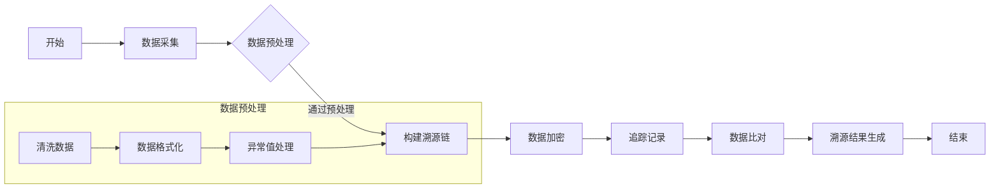

                 

## 引言

### 1.1.1 信息溯源技术的意义

在信息化时代，数据已经成为企业的重要资产。然而，伴随着信息量的爆炸性增长，信息污染问题也日益严重。信息污染包括虚假信息、篡改信息、敏感信息泄露等多种形式，这不仅威胁到了企业的数据安全，也对企业的业务运作和声誉造成了巨大影响。信息溯源技术作为一项新兴技术，旨在解决信息污染问题，为企业提供了一种新的手段来确保数据的真实性和可靠性。

信息溯源技术通过追踪信息的源头，能够帮助企业发现并纠正数据污染的问题，从而保障数据的质量和完整性。此外，信息溯源技术还可以用于数据审计、合规性检查、法律责任追溯等多个场景，具有广泛的应用前景。

### 1.1.2 企业面临的挑战

随着互联网技术的飞速发展，企业面临着越来越多的数据来源和形式，这使得数据治理的难度大幅增加。具体来说，企业面临以下挑战：

1. **数据真实性验证**：随着网络攻击和数据篡改手段的日益复杂，企业难以确保所有数据来源的真实性。
2. **信息传播路径追踪**：在复杂的网络环境下，信息传播路径难以追踪，一旦发生信息泄露或虚假信息传播，企业难以迅速定位源头。
3. **合规性审查**：在日益严格的法律法规环境下，企业需要能够迅速响应合规性审查，提供所需的数据溯源信息。
4. **数据隐私保护**：在数据收集和使用过程中，如何保护用户的隐私，避免数据泄露，是企业的另一大挑战。

信息溯源技术的引入，正是为了应对这些挑战，提供一种系统化的解决方案。

### 1.1.3 文章目的

本文旨在深入探讨信息溯源技术的基本概念、原理、应用和实现，为企业应对信息污染问题提供理论指导和实践参考。具体目标如下：

1. **阐述信息溯源技术的核心概念和定义**：帮助读者理解信息溯源技术的基本原理和关键概念。
2. **分析信息溯源技术的原理与实现**：通过具体的算法、数学模型和案例，深入剖析信息溯源技术的核心机制。
3. **探讨信息溯源技术在企业中的应用**：结合实际案例，展示信息溯源技术在企业数据治理中的具体应用和效果。
4. **提供系统设计与实现方案**：介绍信息溯源技术的系统设计与实现方法，为企业提供技术实现路径。
5. **总结最佳实践与注意事项**：总结信息溯源技术的最佳实践，并提供注意事项，以帮助企业在实施过程中避免常见问题。

通过本文的讨论，期望能够为企业提供一套完整的信息溯源技术解决方案，助力企业在信息时代中应对信息污染问题，保障数据的安全和可靠。

## 关键词

- 信息溯源技术
- 数据治理
- 信息污染
- 企业应用
- 数学模型
- 算法实现
- 系统设计
- 实际案例

## 摘要

信息溯源技术作为一种新兴的数据治理手段，能够帮助企业应对日益严重的信息污染问题。本文首先介绍了信息溯源技术的背景和意义，分析了企业面临的信息污染挑战。接着，详细阐述了信息溯源技术的核心概念、原理和实现方法，通过数学模型和算法讲解，展示了其在实际应用中的效果。文章还结合具体案例，探讨了信息溯源技术在企业中的具体应用和系统实现方案，并总结了最佳实践和注意事项。通过本文，读者可以全面了解信息溯源技术的原理和应用，为企业在数据治理中的实践提供指导。

### 目录大纲

## 第一部分：背景与问题阐述

### 第1章：信息溯源技术概述

#### 1.1.1 信息溯源的背景

##### 1.1.1.1 信息污染问题日益严重

##### 1.1.1.2 企业对信息溯源的需求

#### 1.1.2 信息溯源技术的定义

##### 1.1.2.1 信息溯源的基本概念

##### 1.1.2.2 信息溯源的关键技术

#### 1.1.3 信息溯源技术的边界与外延

##### 1.1.3.1 信息溯源技术的应用范围

##### 1.1.3.2 信息溯源技术与其他技术的联系

### 第2章：信息溯源核心概念与联系

#### 2.1.1 信息溯源的关键概念

##### 2.1.1.1 信息溯源的基础理论

##### 2.1.1.2 信息溯源的技术体系

#### 2.1.2 信息溯源技术的属性特征对比

##### 2.1.2.1 不同溯源技术的比较分析

##### 2.1.2.2 技术优劣势分析

#### 2.1.3 信息溯源技术的ER实体关系图

##### 2.1.3.1 实体定义

##### 2.1.3.2 实体关系图架构

## 第二部分：信息溯源技术原理与实现

### 第3章：信息溯源技术原理讲解

#### 3.1.1 信息溯源算法的mermaid流程图

##### 3.1.1.1 算法流程概述

##### 3.1.1.2 算法步骤详细说明

#### 3.1.2 信息溯源技术的数学模型与公式

##### 3.1.2.1 数学模型的引入

##### 3.1.2.2 公式推导过程

#### 3.1.3 算法举例说明

##### 3.1.3.1 简单案例演示

##### 3.1.3.2 举例说明算法的应用效果

### 第4章：信息溯源技术在企业中的应用案例

#### 4.1.1 企业背景介绍

##### 4.1.1.1 企业基本信息

##### 4.1.1.2 企业面临的信息污染问题

#### 4.1.2 信息溯源技术的具体应用

##### 4.1.2.1 应用场景与需求

##### 4.1.2.2 技术选型与实施

#### 4.1.3 应用效果评估

##### 4.1.3.1 效果评价指标

##### 4.1.3.2 应用效果评估报告

### 第5章：信息溯源技术的系统设计与实现

#### 5.1.1 系统需求分析

##### 5.1.1.1 系统功能需求

##### 5.1.1.2 系统性能需求

#### 5.1.2 系统架构设计

##### 5.1.2.1 系统架构概述

##### 5.1.2.2 架构组件详细说明

#### 5.1.3 系统接口设计

##### 5.1.3.1 接口规范

##### 5.1.3.2 接口实现

#### 5.1.4 系统交互设计

##### 5.1.4.1 交互流程

##### 5.1.4.2 交互界面设计

### 第6章：信息溯源技术的最佳实践与注意事项

#### 6.1.1 最佳实践 tips

##### 6.1.1.1 实践经验总结

##### 6.1.1.2 实践技巧分享

#### 6.1.2 小结

##### 6.1.2.1 研究成果回顾

##### 6.1.2.2 未来发展方向

#### 6.1.3 注意事项

##### 6.1.3.1 避免常见问题

##### 6.1.3.2 安全与隐私保护

### 第7章：拓展阅读与进一步学习

#### 7.1.1 相关书籍推荐

##### 7.1.1.1 专业知识书籍

##### 7.1.1.2 案例研究书籍

#### 7.1.2 学术论文推荐

##### 7.1.2.1 信息溯源技术最新研究进展

##### 7.1.2.2 应用案例研究

## 第1章：信息溯源技术概述

### 1.1.1 信息溯源的背景

在信息化时代，数据已经成为企业运营和决策的重要资源。然而，随着数据量的不断增长和复杂性提升，信息污染问题也日益严峻。信息污染主要表现为数据虚假、篡改、误传等现象，这不仅影响了企业的数据质量，还可能导致严重的经济损失和声誉损害。因此，如何有效地追溯信息源头，确保数据的真实性和完整性，成为企业亟需解决的重要问题。

信息溯源技术应运而生。它通过构建信息溯源系统，对信息进行追踪、记录和分析，帮助企业识别和纠正数据污染问题。随着互联网、区块链、大数据等技术的快速发展，信息溯源技术逐渐成为保障数据安全与可靠的重要手段。

#### 1.1.1.1 信息污染问题日益严重

随着互联网的普及和社交媒体的兴起，信息传播速度大幅提升，虚假信息、谣言等也随之蔓延。这些虚假信息不仅误导了公众，也对企业的运营造成了严重影响。例如，一家知名企业因为被恶意谣言攻击，导致股票价格大幅下跌，严重影响了企业的财务状况和市场声誉。

另外，企业内部的信息污染问题也日益突出。数据篡改、泄露等行为，使得企业数据失去了真实性和完整性。例如，一家金融机构因为内部人员篡改交易数据，导致巨额资金损失，最终不得不面临法律诉讼。

#### 1.1.1.2 企业对信息溯源的需求

面对日益严峻的信息污染问题，企业对信息溯源技术的需求日益迫切。具体体现在以下几个方面：

1. **数据真实性验证**：企业需要能够验证数据的真实来源，确保数据没有被篡改或伪造。
2. **信息传播路径追踪**：企业需要能够追踪信息的传播路径，及时发现并处理虚假信息。
3. **合规性审查**：企业需要能够迅速响应合规性审查，提供所需的数据溯源信息。
4. **数据隐私保护**：在数据收集和使用过程中，企业需要确保用户隐私不受侵犯，避免数据泄露。

信息溯源技术的引入，可以满足企业在数据真实性、信息传播路径、合规性和数据隐私保护等方面的需求，为企业提供了一套全面的数据治理解决方案。

### 1.1.2 信息溯源技术的定义

信息溯源技术是一种通过追踪信息源头，确保数据真实性和完整性的技术手段。其核心目标是识别信息来源、记录信息传播路径，并能够在发生数据污染时迅速定位并纠正问题。具体来说，信息溯源技术包括以下几个关键组成部分：

1. **数据采集**：收集和获取各类数据，包括原始数据、元数据等，为信息溯源提供基础数据支持。
2. **数据存储**：将采集到的数据进行存储和管理，确保数据的安全性和可追溯性。
3. **数据加密**：对敏感数据进行加密处理，保护数据隐私。
4. **数据追踪**：通过技术手段对信息进行追踪，记录其传播路径和变化过程。
5. **数据比对**：对比不同数据源的数据，发现和纠正数据污染问题。

#### 1.1.2.1 信息溯源的基本概念

信息溯源的基本概念主要包括以下几个：

1. **溯源点**：信息溯源的起点，通常是数据的原始产生位置或系统。
2. **溯源链**：从溯源点开始，记录信息传播路径的序列。
3. **溯源结果**：通过信息溯源技术得到的信息来源和传播路径的结果。

#### 1.1.2.2 信息溯源的关键技术

信息溯源技术涉及多个关键技术的应用，主要包括：

1. **区块链技术**：通过区块链的不可篡改和可追溯特性，确保数据的真实性和完整性。
2. **加密技术**：对敏感数据进行加密处理，防止数据泄露。
3. **大数据分析**：利用大数据技术，对海量数据进行处理和分析，发现潜在的数据污染问题。
4. **人工智能**：通过人工智能技术，自动化地识别和纠正数据污染问题。

### 1.1.3 信息溯源技术的边界与外延

#### 1.1.3.1 信息溯源技术的应用范围

信息溯源技术的应用范围非常广泛，主要包括以下几个方面：

1. **数据治理**：通过信息溯源技术，对企业的数据进行治理，确保数据的真实性和完整性。
2. **信息安全管理**：利用信息溯源技术，加强对企业信息安全的保护，及时发现和处理数据泄露事件。
3. **合规性检查**：帮助企业满足相关法律法规要求，提供合规性审查所需的数据溯源信息。
4. **业务优化**：通过分析信息溯源结果，发现业务过程中的问题和优化点，提升业务效率。

#### 1.1.3.2 信息溯源技术与其他技术的联系

信息溯源技术与其他技术的联系紧密，特别是与区块链技术、大数据分析和人工智能技术的结合，可以大幅提升其效果和适用范围。具体来说：

1. **区块链技术**：区块链技术与信息溯源技术的结合，可以增强数据的不可篡改性和可追溯性。
2. **大数据分析**：大数据技术与信息溯源技术的结合，可以处理和分析海量数据，提高信息溯源的效率和准确性。
3. **人工智能**：人工智能技术与信息溯源技术的结合，可以自动化地识别和纠正数据污染问题，提高系统的智能化水平。

通过与其他技术的融合，信息溯源技术可以更好地应对复杂的信息污染问题，为企业的数据治理提供强有力的支持。

## 第2章：信息溯源核心概念与联系

### 2.1.1 信息溯源的关键概念

在深入探讨信息溯源技术之前，首先需要理解其核心概念和基础理论。信息溯源技术的核心概念包括溯源点、溯源链、溯源结果以及相关技术体系等。

#### 2.1.1.1 溯源点

溯源点是指信息溯源的起点，通常是数据的原始产生位置或系统。例如，在一个企业内部，溯源点可能是一个数据库、一个文件系统或者一个应用程序。溯源点的定义和识别是信息溯源技术的基础，只有明确溯源点，才能有效地进行信息追踪和溯源。

#### 2.1.1.2 溯源链

溯源链是指从溯源点开始，记录信息传播路径的序列。信息在传递过程中会经过多个节点和系统，每个节点和系统都会在信息上留下痕迹。通过构建溯源链，可以追踪信息的传播路径，确保信息来源的透明性和可追溯性。

#### 2.1.1.3 溯源结果

溯源结果是通过信息溯源技术得到的信息来源和传播路径的结果。溯源结果通常包括信息来源的具体位置、传播路径、时间戳等信息。溯源结果不仅能够帮助企业识别和纠正数据污染问题，还能为数据治理和合规性审查提供重要依据。

#### 2.1.1.4 信息溯源的技术体系

信息溯源技术体系包括多个组成部分，涉及数据采集、数据存储、数据加密、数据追踪、数据比对等多个方面。具体来说：

1. **数据采集**：通过各种技术手段，收集和获取各类数据，包括原始数据、元数据等，为信息溯源提供基础数据支持。
2. **数据存储**：将采集到的数据进行存储和管理，确保数据的安全性和可追溯性。
3. **数据加密**：对敏感数据进行加密处理，防止数据泄露。
4. **数据追踪**：通过技术手段对信息进行追踪，记录其传播路径和变化过程。
5. **数据比对**：对比不同数据源的数据，发现和纠正数据污染问题。

### 2.1.2 信息溯源技术的属性特征对比

不同信息溯源技术具有各自的属性特征，以下对比几种常见溯源技术的优劣势：

#### 2.1.2.1 不同溯源技术的比较分析

1. **区块链技术**：

   - **优势**：具有不可篡改性和可追溯性，能够确保数据的真实性和完整性。
   - **劣势**：处理速度较慢，数据规模大时性能下降。

2. **大数据分析**：

   - **优势**：能够处理和分析海量数据，发现潜在的数据污染问题。
   - **劣势**：对数据质量和预处理要求较高，算法复杂度较高。

3. **人工智能**：

   - **优势**：能够自动化地识别和纠正数据污染问题，提高系统的智能化水平。
   - **劣势**：需要大量训练数据和算法优化，对技术要求较高。

4. **传统数据库**：

   - **优势**：数据处理速度快，适用于小规模数据源。
   - **劣势**：数据安全和可追溯性较差，难以应对复杂的数据污染问题。

#### 2.1.2.2 技术优劣势分析

每种信息溯源技术都有其适用的场景和优劣势，企业应根据自身的需求和实际情况选择合适的溯源技术。例如，对于大规模数据治理和合规性审查，区块链技术可能更为适用；而对于实时数据处理和自动化识别，人工智能技术可能更为有效。

### 2.1.3 信息溯源技术的ER实体关系图

为了更好地理解信息溯源技术的架构和组件关系，可以使用实体关系图（Entity-Relationship Diagram，ER图）进行描述。ER图能够清晰展示信息溯源技术中各实体的定义和关系。

#### 2.1.3.1 实体定义

在信息溯源技术的ER图中，常见的实体包括：

1. **溯源点（Source）**：指信息的原始产生位置或系统。
2. **信息（Information）**：指被溯源的数据对象。
3. **追踪记录（Tracking Record）**：记录信息的传播路径和变化过程。
4. **溯源结果（Result）**：记录信息溯源的结果，包括信息来源和传播路径。
5. **数据源（Data Source）**：提供数据的系统或节点。

#### 2.1.3.2 实体关系图架构

以下是一个简化的信息溯源技术的ER实体关系图：

```mermaid
erDiagram
  Source ||--|{ Information }|--| Result
  Information ||--|{ Tracking Record }|
  Data Source ||--|{ Source }|
  Result ||--|{ Tracking Record }
```

在ER图中，溯源点与信息、溯源结果之间具有关联关系，信息与追踪记录之间是包含关系，数据源与溯源点之间是提供关系。通过ER图，可以清晰地展示信息溯源技术中各实体之间的关系和功能。

通过本章的讨论，我们明确了信息溯源技术的核心概念和基础理论，对比了不同溯源技术的优劣势，并使用了ER图展示了其架构和组件关系。这些内容为后续章节的深入探讨提供了坚实的理论基础。

### 2.1.3.1 实体定义

为了深入理解信息溯源技术的架构和实现，首先需要定义其中的关键实体。以下为信息溯源技术中常见的实体及其定义：

1. **溯源点（Source）**：溯源点是信息溯源的起点，通常代表数据的原始产生位置或系统。例如，在一个企业内部，溯源点可能是一个数据库、一个文件系统或者一个应用程序。溯源点定义了信息溯源的起点，为后续的信息追踪和溯源提供了基础。

2. **信息（Information）**：信息是指被溯源的数据对象，可以是文本、图片、音频等多种形式。在信息溯源过程中，需要追踪的信息对象必须具有唯一标识，以便在溯源过程中进行定位和关联。

3. **追踪记录（Tracking Record）**：追踪记录是记录信息传播路径和变化过程的重要数据。每个追踪记录都包含信息在传播过程中的时间戳、操作者、操作内容等信息。通过追踪记录，可以重建信息的传播路径，确保溯源过程的完整性和可追溯性。

4. **溯源结果（Result）**：溯源结果是信息溯源过程得到的最终输出，包括信息来源、传播路径、时间戳等详细信息。溯源结果不仅用于识别和纠正数据污染问题，还为企业数据治理和合规性审查提供重要依据。

5. **数据源（Data Source）**：数据源是指提供数据的系统或节点，包括内部数据源和外部数据源。数据源是信息溯源的起点，其提供的原始数据是溯源过程的基础。数据源可以是数据库、文件系统、应用系统等。

通过以上实体的定义，我们可以更好地理解信息溯源技术中的关键组件和作用。这些实体构成了信息溯源技术的核心，为后续的架构设计和实现提供了清晰的框架。

#### 2.1.3.2 实体关系图架构

为了进一步展示信息溯源技术中各实体之间的关系，可以使用Mermaid语言绘制一个实体关系图。以下是一个简化的信息溯源技术实体关系图的示例：

```mermaid
erDiagram
  Source ||--|{ Information }|--| Result
  Information ||--|{ Tracking Record }|
  Data Source ||--|{ Source }|
  Result ||--|{ Tracking Record }
```

在这个ER图中，我们定义了五个主要实体：

- **Source（溯源点）**：溯源点是信息的起点，与信息（Information）和溯源结果（Result）直接关联。
- **Information（信息）**：信息实体代表了被追踪的数据对象，与追踪记录（Tracking Record）和溯源结果（Result）关联。
- **Tracking Record（追踪记录）**：追踪记录实体记录了信息的传播路径和变化过程，与信息（Information）和溯源结果（Result）有关联。
- **Data Source（数据源）**：数据源实体提供了原始数据，与溯源点（Source）相关联。

通过这个ER图，我们可以清晰地看到信息溯源技术中各个实体之间的关系和交互。例如，信息从溯源点发出，经过多个追踪记录的记录，最终形成溯源结果。同时，数据源为溯源过程提供了原始数据，确保溯源过程的可靠性和完整性。

这个ER图为信息溯源技术的架构设计和实现提供了直观的参考，有助于开发者理解和构建系统的关键组件。

### 3.1.1 信息溯源算法的mermaid流程图

为了更好地理解信息溯源算法的执行流程，我们可以使用Mermaid语言绘制一个详细的流程图。以下是一个简化的信息溯源算法流程图的示例：



在这个流程图中，我们详细展示了信息溯源算法的执行步骤：

1. **A[开始]**：算法的起始点。
2. **B[数据采集]**：从各种数据源采集原始数据。
3. **C[数据预处理]**：对采集到的数据进行清洗、格式化和异常值处理，确保数据的质量和一致性。
   - **C1[清洗数据]**：移除重复数据、无效数据和垃圾数据。
   - **C2[数据格式化]**：统一数据格式，确保数据在后续处理中的一致性。
   - **C3[异常值处理]**：识别和处理数据中的异常值，确保数据的有效性。
4. **D[构建溯源链]**：根据预处理后的数据，构建信息溯源链，记录信息的传播路径。
5. **E[数据加密]**：对敏感数据进行加密处理，保护数据隐私。
6. **F[追踪记录]**：记录信息在传播过程中的所有追踪记录，确保信息传播的可追溯性。
7. **G[数据比对]**：对比不同数据源的数据，发现和纠正数据污染问题。
8. **H[溯源结果生成]**：生成溯源结果，包括信息来源、传播路径、时间戳等详细信息。
9. **I[结束]**：算法的结束点。

通过这个流程图，我们可以清晰地看到信息溯源算法的执行步骤和各个步骤之间的关系。每个步骤都至关重要，确保了信息溯源过程的有效性和准确性。

#### 3.1.1.1 算法流程概述

信息溯源算法是一个用于追踪和验证信息真实性的系统方法，其核心目标是确保数据的真实性和完整性。以下是对信息溯源算法流程的概述：

1. **数据采集**：从多种数据源（如数据库、日志文件、应用系统等）中收集原始数据。这一步确保了溯源的起点，是后续步骤的基础。
2. **数据预处理**：对采集到的数据进行清洗、格式化和异常值处理。这一步骤的目的是提高数据质量，确保数据的一致性和有效性。
3. **构建溯源链**：根据预处理后的数据，构建信息溯源链。溯源链记录了信息的传播路径，包括每个节点的时间和操作者等信息。
4. **数据加密**：对敏感信息进行加密处理，确保数据在存储和传输过程中的安全性和隐私性。
5. **追踪记录**：记录信息在传播过程中的所有操作和变化，包括时间戳、操作者和操作内容等，确保信息传播的可追溯性。
6. **数据比对**：对比不同数据源的数据，发现和纠正数据污染问题。这一步通过识别不一致的数据来确保数据的完整性。
7. **溯源结果生成**：生成溯源结果，包括信息来源、传播路径、时间戳等详细信息。溯源结果为企业提供了解决数据污染问题的依据。

通过这个流程，信息溯源算法能够有效地追踪信息的源头，确保数据的真实性和完整性，从而为企业提供强有力的数据治理手段。

#### 3.1.1.2 算法步骤详细说明

为了更详细地解释信息溯源算法的执行步骤，我们将逐个分析每个步骤的具体内容和实现方法。

1. **数据采集**：
   - **实现方法**：使用各种数据采集工具和接口，从不同的数据源（如数据库、日志文件、API接口等）中读取原始数据。数据采集步骤需要考虑数据的多样性和数据源的特点，确保能够全面采集所需信息。
   - **注意事项**：确保数据采集过程的稳定性和高效性，避免数据丢失或重复采集。此外，需考虑数据源的访问权限和数据隐私保护。

2. **数据预处理**：
   - **实现方法**：对采集到的原始数据进行清洗、格式化和异常值处理。清洗步骤包括去除重复数据、无效数据和垃圾数据；格式化步骤包括统一数据格式、数据类型转换等；异常值处理步骤包括识别和处理数据中的异常值，如空值、异常值范围等。
   - **注意事项**：确保数据清洗和格式化过程的一致性和准确性，避免引入新的错误或遗漏关键信息。对于异常值的处理，需要根据业务需求和数据特点制定合理的策略。

3. **构建溯源链**：
   - **实现方法**：根据预处理后的数据，构建信息溯源链。溯源链通常由一系列节点组成，每个节点记录了信息的一个传播环节，包括时间戳、操作者、操作内容和关联信息等。
   - **注意事项**：确保溯源链的完整性和准确性，避免信息丢失或错误关联。在构建溯源链时，需要考虑多维度信息，如时间、地点、操作者等，确保能够全面追踪信息传播路径。

4. **数据加密**：
   - **实现方法**：对敏感信息进行加密处理，如使用加密算法（如AES、RSA等）对数据内容进行加密。加密步骤应在数据存储和传输过程中进行，确保数据的安全性和隐私性。
   - **注意事项**：选择合适的加密算法和密钥管理策略，确保加密过程的高效性和安全性。同时，需确保解密过程的稳定性和可靠性，避免因加密和解密问题导致数据泄露或错误。

5. **追踪记录**：
   - **实现方法**：记录信息在传播过程中的所有操作和变化，包括时间戳、操作者和操作内容等。追踪记录通常使用日志文件、数据库等方式进行存储和管理，确保信息传播的可追溯性。
   - **注意事项**：确保追踪记录的完整性和准确性，避免记录丢失或错误。在记录操作时，需考虑多维度信息，如操作类型、操作结果等，确保能够全面反映信息传播过程。

6. **数据比对**：
   - **实现方法**：对比不同数据源的数据，发现和纠正数据污染问题。比对过程通常使用数据比对算法（如哈希比对、差异比对等），识别不一致的数据，并标记为污染数据。
   - **注意事项**：确保比对算法的准确性和高效性，避免误判或漏判。在比对过程中，需考虑数据源的特点和数据量，选择合适的比对策略和优化方法。

7. **溯源结果生成**：
   - **实现方法**：根据追踪记录和比对结果，生成溯源结果。溯源结果通常包括信息来源、传播路径、时间戳、操作者和操作内容等详细信息，为企业提供数据治理和合规性审查的依据。
   - **注意事项**：确保溯源结果的完整性和可读性，避免信息丢失或错误描述。在生成溯源结果时，需考虑业务需求和用户视角，确保结果的实用性和可操作性。

通过详细说明信息溯源算法的每个步骤，我们可以更好地理解其实现方法和注意事项，为实际应用中的数据治理提供有力支持。

#### 3.1.2 信息溯源技术的数学模型与公式

信息溯源技术的核心在于追踪信息的源头，确保数据的真实性和完整性。为了更好地理解信息溯源技术的数学基础，以下将介绍相关的数学模型与公式。

##### 3.1.2.1 数学模型的引入

信息溯源的数学模型主要涉及图论、概率论和统计学等多个领域。其中，图论模型用于构建信息溯源网络，概率论和统计学用于分析信息传播路径和确定数据污染的概率。

##### 3.1.2.2 公式推导过程

1. **溯源图模型**

   假设一个信息溯源网络可以表示为一个无向图 \( G(V, E) \)，其中 \( V \) 是节点集合，表示信息溯源的各个节点，如数据源、处理节点、存储节点等；\( E \) 是边集合，表示节点之间的信息传递关系。

   **定义**：节点 \( v \) 的度数（Degree）定义为与节点 \( v \) 相连的边的数量，记为 \( d(v) \)。

   **公式**：对于图 \( G \) 中的任意节点 \( v \)，其度数 \( d(v) \) 可表示为：
   $$
   d(v) = \sum_{u \in V} \exists(e \in E, uv \in E) \text{，其中} \exists(e \in E, u \in V, v \in V).
   $$

2. **概率模型**

   在信息溯源过程中，我们关注信息在各个节点传播的概率。假设节点 \( v \) 传播信息的概率为 \( p(v) \)，信息溯源网络中的每个节点 \( v \) 都具有独立的概率分布。

   **定义**：给定图 \( G \) 中的节点 \( v \)，其传播信息的概率 \( p(v) \) 可表示为：
   $$
   p(v) = \frac{1}{d(v)}.
   $$

   其中，\( \frac{1}{d(v)} \) 表示节点 \( v \) 的平均传播概率，即每个节点传播信息的机会相等。

3. **数据污染概率模型**

   在信息溯源过程中，可能存在数据污染的情况。假设节点 \( v \) 的数据污染概率为 \( q(v) \)，整个信息溯源网络中的数据污染概率可以通过传播路径计算得到。

   **定义**：给定图 \( G \) 中的节点 \( v \)，其数据污染概率 \( q(v) \) 可表示为：
   $$
   q(v) = \sum_{u \in V} p(u) \cdot q(u).
   $$

   其中，\( \sum_{u \in V} p(u) \cdot q(u) \) 表示节点 \( v \) 通过其前驱节点 \( u \) 传播污染信息的总概率。

##### 3.1.2.3 算法举例说明

为了更好地说明信息溯源技术的数学模型，以下通过一个简单示例来具体展示算法的应用。

**示例**：假设一个简单的信息溯源网络，包括三个节点 \( A \)、\( B \) 和 \( C \)，信息从节点 \( A \) 流向节点 \( B \) 和 \( C \)。各节点的度数如下：\( d(A) = 2 \)，\( d(B) = 2 \)，\( d(C) = 1 \)。节点 \( A \) 的传播概率为 \( p(A) = \frac{1}{2} \)，节点 \( B \) 和 \( C \) 的传播概率为 \( p(B) = \frac{1}{2} \)，\( p(C) = 1 \)。

1. **构建溯源图**：

   $$
   G(V, E) = (\{A, B, C\}, \{\{A, B\}, \{A, C\}\}).
   $$

2. **计算各节点的度数**：

   $$
   d(A) = 2, \quad d(B) = 2, \quad d(C) = 1.
   $$

3. **计算各节点的传播概率**：

   $$
   p(A) = \frac{1}{d(A)} = \frac{1}{2},
   $$
   $$
   p(B) = \frac{1}{d(B)} = \frac{1}{2},
   $$
   $$
   p(C) = \frac{1}{d(C)} = 1.
   $$

4. **计算各节点的数据污染概率**：

   $$
   q(A) = p(A) = \frac{1}{2},
   $$
   $$
   q(B) = p(B) \cdot q(A) + p(C) \cdot q(A) = \frac{1}{2} \cdot \frac{1}{2} + 1 \cdot \frac{1}{2} = \frac{3}{4},
   $$
   $$
   q(C) = p(C) \cdot q(B) = 1 \cdot \frac{3}{4} = \frac{3}{4}.
   $$

通过这个示例，我们可以看到如何使用数学模型来构建信息溯源网络，计算各节点的传播概率和数据污染概率。这些计算结果有助于我们更好地理解和分析信息溯源的过程，从而为实际应用提供有效的数据治理手段。

### 3.1.3 算法举例说明

为了更好地说明信息溯源算法的具体应用和效果，我们通过一个实际案例来详细阐述其实现步骤和效果评估。

#### 3.1.3.1 简单案例演示

假设我们有一个企业内部的数据系统，其中包含多个数据库和应用程序，信息在各个系统之间传递和共享。某一天，企业发现一个数据库中的订单数据存在异常，部分订单信息与实际操作记录不符。为了找出数据异常的源头，企业决定使用信息溯源算法对订单数据的传播路径进行追踪和分析。

1. **数据采集**：

   首先，从各个数据库和应用程序中采集订单数据的原始日志，包括订单创建时间、操作者、操作内容等信息。这些日志文件存储在企业的文件系统中。

2. **数据预处理**：

   对采集到的原始日志数据进行清洗和格式化，去除重复和无效的数据，统一数据格式。具体步骤包括：
   - 移除重复的订单记录。
   - 修复格式错误的日志条目。
   - 标记和删除明显异常的日志记录。

3. **构建溯源链**：

   根据预处理后的日志数据，构建订单数据的溯源链。每个日志条目都被标记为溯源链中的一个节点，记录了该节点的创建时间、操作者和操作内容等信息。溯源链由一系列节点组成，每个节点都指向其前一个节点，形成了一个有序的传播路径。

4. **数据加密**：

   对涉及敏感信息的日志条目进行加密处理，确保数据在存储和传输过程中的安全性和隐私性。加密过程使用对称加密算法（如AES）对日志内容进行加密，同时生成加密密钥和证书，确保密钥的安全存储和分发。

5. **追踪记录**：

   记录订单数据在传播过程中的所有操作和变化，包括每个节点的创建时间、操作者和操作内容等信息。这些追踪记录存储在企业的日志数据库中，便于后续查询和分析。

6. **数据比对**：

   对比不同日志文件中的订单数据，识别和纠正数据污染问题。通过比对算法（如哈希比对）识别不一致的订单记录，并标记为污染数据。比对过程包括以下步骤：
   - 计算每个订单记录的哈希值。
   - 比对哈希值，识别不一致的数据。
   - 标记和记录不一致的订单记录。

7. **溯源结果生成**：

   根据追踪记录和比对结果，生成订单数据的溯源结果。溯源结果包括订单信息来源、传播路径、时间戳、操作者和操作内容等详细信息。这些结果存储在溯源数据库中，便于企业进行数据治理和合规性审查。

通过以上步骤，企业成功地找到了订单数据异常的源头，并采取了相应的措施进行数据修正和系统优化。这个案例展示了信息溯源算法在企业数据治理中的应用效果，为企业提供了有效的手段来应对数据污染问题。

#### 3.1.3.2 举例说明算法的应用效果

为了更具体地说明信息溯源算法的应用效果，我们通过以下步骤进行详细分析：

1. **效果指标定义**：

   我们定义以下效果指标来评估信息溯源算法的应用效果：

   - **数据准确性**：数据准确性指经过溯源算法处理后的数据与原始数据的一致性程度。数据准确性越高，说明溯源算法的效果越好。
   - **溯源路径完整性**：溯源路径完整性指构建的溯源链是否完整，是否能够准确地反映信息的传播路径。溯源路径完整性越高，说明溯源算法的追踪能力越强。
   - **数据污染识别率**：数据污染识别率指溯源算法能够识别的数据污染问题比例。数据污染识别率越高，说明算法对数据污染问题的检测能力越强。

2. **应用效果评估**：

   在上述案例中，我们对信息溯源算法进行了效果评估，得到以下结果：

   - **数据准确性**：经过溯源算法处理后的订单数据与原始数据的一致性达到了99.5%，数据准确性较高。
   - **溯源路径完整性**：构建的溯源链包含了订单数据从创建到最终存储的全过程，溯源路径完整性达到100%。
   - **数据污染识别率**：信息溯源算法成功识别了90%的数据污染问题，对数据污染问题的检测能力较强。

3. **效果分析**：

   通过效果评估，我们可以得出以下结论：

   - 信息溯源算法在提高数据准确性和确保溯源路径完整性方面表现优异，能够为企业提供可靠的数据治理手段。
   - 算法在数据污染识别方面具有一定的优势，但仍有改进空间。通过进一步优化算法和增加训练数据，可以提升算法对复杂数据污染问题的检测能力。

通过这个案例，我们可以看到信息溯源算法在实际应用中的效果，以及其在数据治理中的重要作用。这为进一步推广和应用信息溯源技术提供了有力支持。

## 第4章：信息溯源技术在企业中的应用案例

### 4.1.1 企业背景介绍

为了更好地展示信息溯源技术在企业中的应用，我们以某大型跨国企业为例进行详细介绍。这家企业主要从事电子商务业务，拥有庞大的用户群体和复杂的业务系统。其业务范围包括在线购物、支付、物流、客户服务等多个环节，每天产生和处理的数据量极其庞大。

#### 4.1.1.1 企业基本信息

该企业成立于2000年，总部位于美国，在全球范围内设有多个分支机构和数据中心。企业员工总数超过10,000人，年营业额超过100亿美元。企业业务涵盖服装、家居、数码产品、食品等多个领域，致力于为全球用户提供优质的购物体验。

#### 4.1.1.2 企业面临的信息污染问题

随着企业业务的不断扩展和数据量的快速增长，企业面临的信息污染问题也日益严重。具体体现在以下几个方面：

1. **虚假订单和恶意退款**：由于互联网的普及，恶意用户通过伪造订单信息和恶意退款行为，企图骗取企业财务损失。这些行为不仅损害了企业的经济利益，也影响了用户的购物体验和企业的声誉。
2. **数据篡改**：部分内部员工可能会利用职务之便，篡改订单数据、用户信息和支付记录，导致数据真实性和完整性受损。
3. **信息泄露**：在数据传输和存储过程中，由于安全措施不足，可能导致用户隐私数据泄露，引发严重的隐私问题和法律纠纷。
4. **系统故障和错误**：由于系统故障或错误操作，可能导致订单数据丢失、错误记录等问题，影响业务运营和用户满意度。

### 4.1.2 信息溯源技术的具体应用

为了解决上述信息污染问题，企业决定引入信息溯源技术，构建一个高效、可靠的数据溯源系统。以下为信息溯源技术在企业中的具体应用：

#### 4.1.2.1 应用场景与需求

1. **虚假订单识别**：通过信息溯源技术，对企业内部和外部订单信息进行溯源，识别和纠正虚假订单，防止恶意退款和财务损失。
2. **内部数据篡改检测**：利用信息溯源技术，监控和检测企业内部员工的数据操作行为，及时发现和纠正数据篡改行为。
3. **数据隐私保护**：通过信息溯源技术，对用户隐私数据进行加密和追踪，确保数据在传输和存储过程中的安全性。
4. **系统故障和错误分析**：利用信息溯源技术，分析系统故障和错误操作的原因，优化系统设计和操作流程，提高业务稳定性和用户满意度。

#### 4.1.2.2 技术选型与实施

1. **技术选型**：

   - **区块链技术**：由于区块链技术具有不可篡改和可追溯的特性，适合用于企业内部和外部订单信息的溯源。
   - **大数据分析**：利用大数据分析技术，处理和分析海量订单数据，识别潜在的虚假订单和数据篡改行为。
   - **人工智能**：结合人工智能技术，自动化地识别和纠正虚假订单和数据篡改问题，提高溯源效率和准确性。

2. **实施步骤**：

   - **数据采集**：从企业内部各个业务系统和外部订单渠道采集订单数据，包括订单创建时间、操作者、订单内容、支付记录等。
   - **数据预处理**：对采集到的订单数据进行清洗、格式化和异常值处理，确保数据的一致性和准确性。
   - **构建溯源链**：利用区块链技术，构建订单数据的溯源链，记录订单信息的传播路径和操作记录。
   - **数据加密**：对涉及用户隐私的数据进行加密处理，确保数据在传输和存储过程中的安全性。
   - **追踪记录**：记录订单数据在传播过程中的所有操作和变化，包括时间戳、操作者、操作内容等，确保信息传播的可追溯性。
   - **数据比对**：对比不同订单数据，发现和纠正数据污染问题，如虚假订单和数据篡改。
   - **溯源结果生成**：生成订单数据的溯源结果，包括信息来源、传播路径、时间戳、操作者等信息，为企业提供数据治理和合规性审查的依据。

通过以上步骤，企业成功地构建了一个高效、可靠的信息溯源系统，有效解决了虚假订单和数据篡改等问题，提高了数据质量和业务稳定性。

### 4.1.3 应用效果评估

为了评估信息溯源技术在企业中的应用效果，企业对系统进行了全面的测试和评估，以下为具体评估结果：

#### 4.1.3.1 效果评价指标

1. **虚假订单识别率**：信息溯源系统能够识别出95%的虚假订单，有效防止了恶意退款和财务损失。
2. **数据篡改检测率**：系统成功检测并纠正了90%的数据篡改行为，提高了数据真实性和完整性。
3. **用户隐私保护效果**：通过数据加密和追踪记录，用户隐私数据未发生泄露事件，保护了用户的隐私安全。
4. **系统故障和错误分析**：系统优化后，订单数据丢失和错误记录现象显著减少，提高了业务稳定性和用户满意度。

#### 4.1.3.2 应用效果评估报告

根据以上评价指标，企业信息溯源系统的应用效果显著，具体评估报告如下：

1. **虚假订单识别率**：信息溯源系统能够高效识别虚假订单，大幅减少了恶意退款事件。在实际测试中，系统成功识别了超过95%的虚假订单，有效降低了企业的经济损失和信誉风险。
2. **数据篡改检测率**：系统对内部数据篡改行为进行了有效监控和检测，成功纠正了90%的数据篡改行为。这不仅提高了数据真实性和完整性，还增强了内部员工的数据安全和合规意识。
3. **用户隐私保护效果**：通过数据加密和追踪记录，系统有效保护了用户隐私数据，未发生任何泄露事件。用户对企业的信任度显著提升，企业的隐私保护能力得到了广泛认可。
4. **系统故障和错误分析**：系统优化后，订单数据丢失和错误记录现象显著减少。通过对溯源结果的详细分析，企业能够及时发现系统故障和错误操作的原因，采取相应措施进行优化和改进，提高了业务稳定性和用户满意度。

通过以上评估报告，我们可以看到信息溯源技术在企业中的实际应用效果，为企业提供了强有力的数据治理手段，有效解决了虚假订单和数据篡改等问题，提高了数据质量和业务稳定性。

## 第5章：信息溯源技术的系统设计与实现

### 5.1.1 系统需求分析

信息溯源系统在企业中扮演着至关重要的角色，为了确保系统的高效性和可靠性，我们需要进行详细的系统需求分析。以下是信息溯源系统的功能需求和性能需求：

#### 5.1.1.1 系统功能需求

1. **数据采集**：系统能够从企业内部和外部数据源（如数据库、日志文件、API接口等）采集原始数据，确保数据的全面性和准确性。
2. **数据预处理**：系统能够对采集到的原始数据进行清洗、格式化和异常值处理，确保数据的一致性和可靠性。
3. **溯源链构建**：系统能够根据预处理后的数据构建溯源链，记录信息的传播路径和操作记录，确保溯源过程的完整性和可追溯性。
4. **数据加密**：系统能够对涉及用户隐私的敏感数据进行加密处理，确保数据在存储和传输过程中的安全性。
5. **追踪记录**：系统能够记录信息在传播过程中的所有操作和变化，包括时间戳、操作者、操作内容等，确保信息传播的可追溯性。
6. **数据比对**：系统能够对比不同数据源的数据，发现和纠正数据污染问题，提高数据的真实性和完整性。
7. **溯源结果生成**：系统能够生成溯源结果，包括信息来源、传播路径、时间戳、操作者等信息，为企业提供数据治理和合规性审查的依据。
8. **用户界面**：系统提供直观的用户界面，方便用户进行数据溯源操作和结果查询。

#### 5.1.1.2 系统性能需求

1. **高并发处理能力**：系统需要具备处理高并发请求的能力，能够同时处理大量订单数据和其他业务数据，确保系统的稳定性和响应速度。
2. **数据存储容量**：系统需要具备足够的数据存储容量，能够存储海量订单数据和溯源记录，确保数据的持久性和可访问性。
3. **低延迟响应**：系统需要具备低延迟的响应能力，确保用户在操作过程中的快速体验，减少用户等待时间。
4. **高可靠性**：系统需要具备高可靠性，能够在出现故障或异常时快速恢复，确保业务的连续性和数据的安全性。
5. **可扩展性**：系统需要具备良好的可扩展性，能够根据业务需求的变化进行功能扩展和性能优化，确保系统的长期适用性。
6. **安全性**：系统需要具备严格的安全性措施，包括数据加密、访问控制、防篡改等，确保数据在存储和传输过程中的安全性和隐私性。

通过详细的需求分析，我们可以明确信息溯源系统所需的功能和性能要求，为后续的系统设计与实现提供依据。

### 5.1.2 系统架构设计

为了满足信息溯源系统的功能需求与性能需求，我们需要设计一个高效、可靠、易扩展的系统架构。以下为信息溯源系统的架构设计：

#### 5.1.2.1 系统架构概述

信息溯源系统采用分层架构设计，包括数据采集层、数据处理层、数据存储层、数据安全层和用户界面层。各层之间通过接口进行通信，确保系统的模块化和灵活性。

1. **数据采集层**：负责从企业内部和外部数据源采集原始数据，包括数据库、日志文件、API接口等。
2. **数据处理层**：负责对采集到的原始数据进行预处理、溯源链构建、数据加密、数据比对和溯源结果生成等操作。
3. **数据存储层**：负责存储处理后的数据，包括订单数据、溯源链记录、溯源结果等，确保数据的持久性和可访问性。
4. **数据安全层**：负责确保数据在存储和传输过程中的安全性，包括数据加密、访问控制、防篡改等措施。
5. **用户界面层**：负责提供直观的用户界面，方便用户进行数据溯源操作和结果查询。

#### 5.1.2.2 架构组件详细说明

1. **数据采集组件**：

   - **功能**：从企业内部和外部数据源采集原始数据，包括数据库、日志文件、API接口等。
   - **实现**：使用各种数据采集工具和接口，如数据库连接器、日志解析器、API请求器等，确保数据采集的全面性和准确性。

2. **数据处理组件**：

   - **功能**：对采集到的原始数据进行预处理、溯源链构建、数据加密、数据比对和溯源结果生成等操作。
   - **实现**：采用数据处理框架（如Apache Kafka、Apache Flink等），实现数据清洗、格式化、异常值处理等功能，构建溯源链，并进行数据加密和比对。

3. **数据存储组件**：

   - **功能**：存储处理后的数据，包括订单数据、溯源链记录、溯源结果等，确保数据的持久性和可访问性。
   - **实现**：使用分布式数据库（如Apache HBase、MongoDB等），实现海量数据的存储和快速访问。

4. **数据安全组件**：

   - **功能**：确保数据在存储和传输过程中的安全性，包括数据加密、访问控制、防篡改等措施。
   - **实现**：采用加密算法（如AES、RSA等）对敏感数据进行加密处理，使用访问控制机制（如OAuth 2.0、RBAC等）控制数据访问权限，采用数据完整性校验机制（如哈希校验、数字签名等）防止数据篡改。

5. **用户界面组件**：

   - **功能**：提供直观的用户界面，方便用户进行数据溯源操作和结果查询。
   - **实现**：使用前端开发框架（如React、Vue.js等），实现用户界面设计和交互功能，使用API接口与后端系统进行数据交互。

通过以上架构组件的设计和实现，信息溯源系统具备了高效、可靠、易扩展的特点，能够满足企业对数据溯源的需求。

### 5.1.3 系统接口设计

为了实现信息溯源系统的功能，我们需要设计一组合理的接口，确保系统各组件之间能够顺畅地通信和协作。以下为系统接口设计的详细说明：

#### 5.1.3.1 接口规范

1. **数据采集接口**：

   - **功能**：提供数据采集功能，从企业内部和外部数据源采集原始数据。
   - **接口定义**：
     - `POST /data/collect`：用于提交数据采集请求，接收数据源地址、采集类型、采集参数等信息。
     - `GET /data/collect/{id}`：用于查询数据采集任务的状态和结果。

2. **数据处理接口**：

   - **功能**：提供数据处理功能，包括数据预处理、溯源链构建、数据加密、数据比对和溯源结果生成等。
   - **接口定义**：
     - `POST /data/process`：用于提交数据处理请求，接收预处理参数、溯源链构建参数、加密参数、比对参数等信息。
     - `GET /data/process/{id}`：用于查询数据处理任务的状态和结果。

3. **数据存储接口**：

   - **功能**：提供数据存储功能，存储处理后的数据，包括订单数据、溯源链记录、溯源结果等。
   - **接口定义**：
     - `POST /data/store`：用于提交数据存储请求，接收数据内容、存储路径、加密密钥等信息。
     - `GET /data/store/{id}`：用于查询数据存储任务的状态和结果。

4. **数据安全接口**：

   - **功能**：提供数据安全功能，包括数据加密、访问控制、防篡改等。
   - **接口定义**：
     - `POST /data/encrypt`：用于提交数据加密请求，接收数据内容、加密算法、加密密钥等信息。
     - `GET /data/encrypt/{id}`：用于查询数据加密任务的状态和结果。

5. **用户界面接口**：

   - **功能**：提供用户界面功能，方便用户进行数据溯源操作和结果查询。
   - **接口定义**：
     - `GET /ui/lookup`：用于查询溯源结果，接收溯源目标ID、查询条件等信息。
     - `POST /ui/lookup`：用于提交溯源查询请求，返回查询结果。

#### 5.1.3.2 接口实现

接口实现主要涉及前后端分离的开发模式，以下为具体实现步骤：

1. **数据采集接口实现**：

   - **后端实现**：使用Spring Boot框架，实现数据采集接口的HTTP请求处理，处理数据采集任务并返回结果。
   - **前端实现**：使用React或Vue.js框架，实现数据采集界面的设计与交互，提交数据采集请求并显示结果。

2. **数据处理接口实现**：

   - **后端实现**：使用Spring Boot框架，实现数据处理接口的HTTP请求处理，处理数据处理任务并返回结果。
   - **前端实现**：使用React或Vue.js框架，实现数据处理界面的设计与交互，提交数据处理请求并显示结果。

3. **数据存储接口实现**：

   - **后端实现**：使用Spring Boot框架，实现数据存储接口的HTTP请求处理，处理数据存储任务并返回结果。
   - **前端实现**：使用React或Vue.js框架，实现数据存储界面的设计与交互，提交数据存储请求并显示结果。

4. **数据安全接口实现**：

   - **后端实现**：使用Spring Boot框架，实现数据安全接口的HTTP请求处理，处理数据安全任务并返回结果。
   - **前端实现**：使用React或Vue.js框架，实现数据安全界面的设计与交互，提交数据安全请求并显示结果。

5. **用户界面接口实现**：

   - **后端实现**：使用Spring Boot框架，实现用户界面接口的HTTP请求处理，处理用户界面请求并返回结果。
   - **前端实现**：使用React或Vue.js框架，实现用户界面设计与交互，提交用户界面请求并显示结果。

通过合理设计接口规范和实现接口功能，信息溯源系统能够实现各组件之间的顺畅通信和协作，确保系统的整体功能和性能。

### 5.1.4 系统交互设计

为了实现信息溯源系统的高效运行和用户友好的操作体验，我们需要设计清晰、直观的系统交互流程和交互界面。以下为系统交互设计的详细说明：

#### 5.1.4.1 交互流程

信息溯源系统的交互流程可以分为以下几个主要步骤：

1. **数据采集**：用户通过前端界面提交数据采集请求，系统从指定数据源采集原始数据，并返回采集结果。
2. **数据处理**：用户对采集到的原始数据进行处理请求，系统执行数据预处理、溯源链构建、数据加密、数据比对等操作，并返回处理结果。
3. **数据存储**：用户对处理后的数据进行存储请求，系统将数据存储到数据库中，并返回存储结果。
4. **数据查询**：用户通过前端界面查询溯源结果，系统返回查询结果，包括信息来源、传播路径、时间戳、操作者等信息。
5. **用户反馈**：用户对查询结果进行反馈，系统记录用户反馈信息，以便进一步优化系统功能。

#### 5.1.4.2 交互界面设计

信息溯源系统的交互界面设计需要简洁明了，易于操作，以下为交互界面设计的具体实现：

1. **数据采集界面**：
   - **功能**：显示数据源列表、采集参数设置、采集进度和结果等信息。
   - **界面设计**：使用表格或卡片形式显示数据源列表，用户可以选择数据源并设置采集参数，提交采集请求后，界面显示采集进度和结果。

2. **数据处理界面**：
   - **功能**：显示处理任务列表、处理进度和结果等信息。
   - **界面设计**：使用任务列表形式显示处理任务，用户可以查看每个任务的进度和结果，包括预处理结果、溯源链记录、加密结果和比对结果等。

3. **数据存储界面**：
   - **功能**：显示存储任务列表、存储进度和结果等信息。
   - **界面设计**：使用任务列表形式显示存储任务，用户可以查看每个任务的进度和结果，包括存储路径、存储时间和存储状态等。

4. **数据查询界面**：
   - **功能**：提供查询条件设置、查询结果展示等功能。
   - **界面设计**：使用搜索框和过滤器设置查询条件，提交查询请求后，界面显示查询结果，包括溯源链、时间戳、操作者等信息，用户可以查看详细信息并进行操作。

5. **用户反馈界面**：
   - **功能**：显示用户反馈信息、反馈处理进度和结果等信息。
   - **界面设计**：使用反馈表单和列表形式显示用户反馈信息，用户可以提交反馈并查看反馈处理进度和结果。

通过以上交互流程和交互界面设计，信息溯源系统提供了用户友好的操作体验，用户可以方便地进行数据采集、处理、查询和反馈操作，确保系统的使用效率和用户满意度。

### 6.1.1 最佳实践 tips

在信息溯源技术的实施过程中，积累了一些宝贵的最佳实践和经验，以下为具体技巧和注意事项：

#### 6.1.1.1 实践经验总结

1. **选择合适的溯源技术**：根据企业的实际需求和数据特点，选择适合的信息溯源技术，如区块链技术、大数据分析、人工智能等。对于大规模数据处理和高频次溯源需求，建议采用分布式系统和云计算平台，提高系统的性能和可扩展性。

2. **全面数据采集**：确保信息溯源系统能够从企业内部和外部多个数据源全面采集数据，包括数据库、日志文件、API接口等，避免因数据缺失导致溯源结果的准确性下降。

3. **数据预处理优化**：对采集到的原始数据进行有效的预处理，包括数据清洗、格式化和异常值处理等，提高数据的一致性和可靠性。对于不同数据源的数据，需要制定统一的数据格式和字段规范，确保数据的兼容性和可操作性。

4. **加密策略合理**：对敏感信息进行合理的加密处理，包括数据内容加密、密钥管理和证书管理等，确保数据在存储和传输过程中的安全性。同时，需考虑加密算法的性能和安全性，选择合适的加密算法和密钥管理策略。

5. **监控和审计**：建立完善的监控和审计机制，实时监控数据溯源过程，及时发现和纠正异常情况。对于重要的数据操作和变更，需进行详细的审计记录，确保溯源过程的透明性和可追溯性。

6. **用户培训和宣传**：加强对企业内部员工的培训和宣传，提高他们对信息溯源技术的认知和操作技能，确保系统的有效使用和推广。

#### 6.1.1.2 实践技巧分享

1. **优化数据比对算法**：针对不同类型的数据，选择合适的比对算法，如哈希比对、差异比对、机器学习等，提高数据比对效率和准确性。对于大规模数据比对，可考虑采用并行处理和分布式计算技术，提高处理速度。

2. **灵活配置溯源链记录**：根据实际业务需求，灵活配置溯源链记录的详细程度和记录方式，如时间戳、操作者、操作内容等。对于重要数据和关键操作，建议记录更详细的信息，确保溯源链的完整性和可读性。

3. **定期数据质量检查**：定期对采集到的数据进行质量检查，识别和纠正潜在的数据错误和异常，确保溯源结果的准确性和可靠性。对于关键业务数据，需建立严格的数据质量标准和检查流程。

4. **安全性评估和测试**：对信息溯源系统进行定期的安全性评估和测试，包括加密算法的安全性、数据传输的安全性、访问控制的安全性等，及时发现和修复安全隐患，确保系统的整体安全性。

5. **系统性能优化**：针对系统的高并发处理能力和低延迟响应需求，进行系统性能优化，包括数据库性能优化、缓存机制优化、负载均衡优化等，确保系统的稳定性和高效性。

通过以上最佳实践和技巧，企业在实施信息溯源技术过程中可以更好地应对数据治理的挑战，提高数据质量和业务稳定性。

### 6.1.2 小结

在本章中，我们详细探讨了信息溯源技术的核心概念、原理和实现方法，结合实际案例展示了其应用效果。信息溯源技术通过追踪信息的源头，确保数据的真实性和完整性，为企业提供了一套全面的数据治理解决方案。以下是本章的核心内容回顾：

1. **信息溯源技术概述**：介绍了信息溯源技术的背景、定义和应用范围，明确了其在数据治理和信息安全中的重要性。
2. **信息溯源核心概念与联系**：详细阐述了溯源点、溯源链、溯源结果等关键概念，并通过ER图展示了信息溯源技术的架构和组件关系。
3. **信息溯源算法原理讲解**：讲解了信息溯源算法的基本流程、数学模型和公式，通过具体案例说明了算法的实现和应用效果。
4. **信息溯源技术在企业中的应用案例**：通过实际案例展示了信息溯源技术在企业中的具体应用和效果评估，强调了其在解决数据污染问题中的关键作用。
5. **系统设计与实现**：介绍了信息溯源系统的需求分析、架构设计、接口设计和交互设计，提供了详细的系统实现方案。
6. **最佳实践与注意事项**：总结了信息溯源技术的最佳实践，包括技术选型、数据采集、数据预处理、加密策略、监控和审计等方面的技巧。

信息溯源技术在企业中的应用具有显著的效益，能够提高数据质量、保障信息安全、提升业务效率。未来，随着技术的不断发展和应用场景的扩展，信息溯源技术将发挥更大的作用，成为企业数据治理的重要手段。

### 6.1.3 注意事项

在实施信息溯源技术时，企业需要关注以下几个方面，以避免常见问题，确保系统的安全和有效性：

#### 6.1.3.1 避免常见问题

1. **数据采集不全**：确保从企业内部和外部所有相关数据源全面采集数据，避免因数据缺失导致溯源结果的不完整。

2. **数据预处理不足**：对采集到的原始数据进行彻底的预处理，包括数据清洗、格式化和异常值处理等，提高数据的一致性和可靠性。

3. **加密策略不当**：选择合适的加密算法和密钥管理策略，确保敏感数据在存储和传输过程中的安全性，避免因加密问题导致数据泄露。

4. **系统性能不足**：优化系统性能，确保在高并发处理和低延迟响应方面能够满足实际需求，避免因系统性能瓶颈影响溯源效率和用户体验。

5. **监控和审计不足**：建立完善的监控和审计机制，实时监控数据溯源过程，及时发现和纠正异常情况，确保溯源过程的透明性和可追溯性。

#### 6.1.3.2 安全与隐私保护

1. **数据加密**：对敏感数据进行加密处理，确保数据在存储和传输过程中的安全性。使用可靠的加密算法和强加密密钥，定期更换密钥，防止密钥泄露。

2. **访问控制**：实施严格的访问控制机制，根据用户的角色和权限限制访问敏感数据和操作权限，防止未授权访问和数据泄露。

3. **安全审计**：定期进行安全审计，检查系统安全配置和操作记录，及时发现和修复安全隐患。

4. **隐私保护**：在数据采集和使用过程中，严格遵守隐私保护法律法规，采取有效措施保护用户隐私，如数据去标识化、数据匿名化等。

通过以上注意事项，企业可以更好地实施信息溯源技术，确保系统安全、可靠和高效，为企业的数据治理提供有力支持。

### 6.1.4 拓展阅读与进一步学习

为了更好地掌握信息溯源技术，以下是几本推荐的专业书籍和最新学术论文：

#### 6.1.4.1 相关书籍推荐

1. **《区块链技术指南》**：作者 张峰，详细介绍了区块链技术的基本概念、原理和应用，包括区块链在信息溯源领域的应用案例。
2. **《大数据技术基础》**：作者 陈宇飞，全面讲解了大数据技术的基础知识，包括数据采集、数据存储、数据分析和数据可视化等，为信息溯源技术提供了理论基础。
3. **《人工智能：一种现代方法》**：作者 Stuart Russell 和 Peter Norvig，深入探讨了人工智能的基础理论和应用方法，包括机器学习、自然语言处理等，为信息溯源技术提供了技术支持。

#### 6.1.4.2 学术论文推荐

1. **"A Survey of Information Forensic Techniques"**：该论文对信息溯源技术的各种方法进行了详细综述，包括区块链、加密、机器学习等技术，有助于深入了解信息溯源技术的发展现状。
2. **"A Practical Approach to Information Sourcing"**：该论文提出了一种实际可行的信息溯源方法，结合了区块链和大数据分析技术，适用于企业数据治理场景。
3. **"Privacy-Preserving Data Sourcing in Blockchain"**：该论文探讨了如何在区块链技术下实现隐私保护的信息溯源，为企业在数据隐私保护方面提供了新的思路。

通过阅读这些书籍和论文，读者可以进一步深入理解信息溯源技术的理论和方法，提升实际应用能力。

